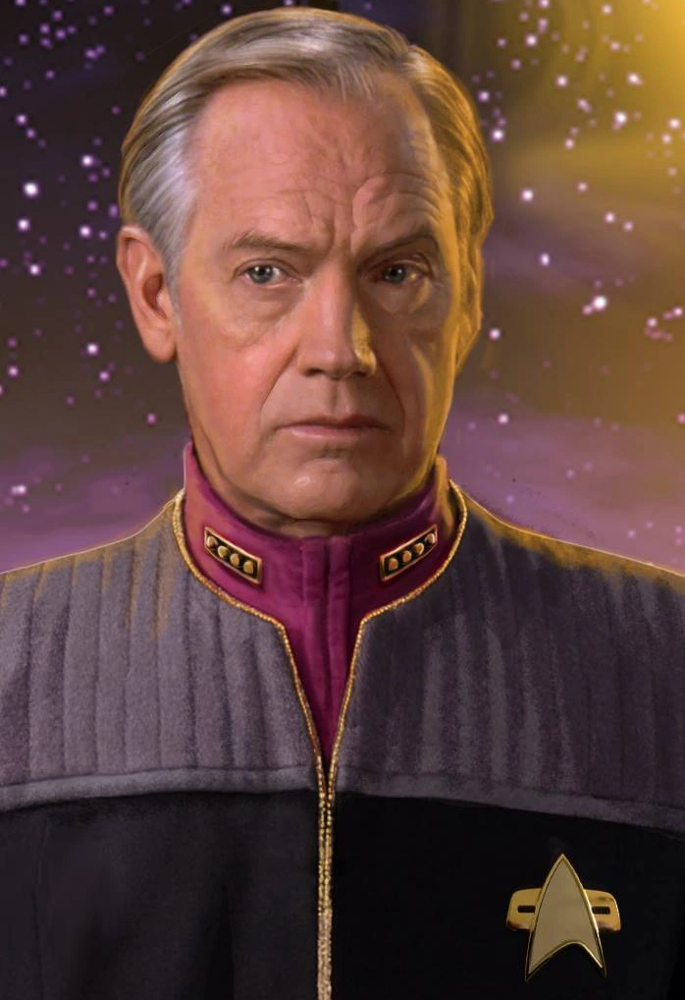
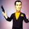

**Bailif:** All rise. 
>The court rise to their feet as the admirals enter the room.  Admiral Jellico, an older human male, strides silently to the center seat and places his PADD on the dias, leaning forward to the mic. The other admirals seat to his sides: Admiral Chrolia, a middle-aged Andorian female and Admiral K'Lor, a Vulcan female who appears to be quite young, but could be 150. It is hard to tell with Vulcans.* 

**Admiral Jellico:** This court marshal is now in session, Vice Admiral Edward Jellico presiding with Rear Admiral Amia Chrolia and Rear Admiral K'Lor in quorum. We are gathered here today to investigate a series of incredibly serious allegations of wrongdoing on the part of four officers of the USS Perseus. The charges are as follows: 
**Admiral Jellico:** Lieutenant Commander Protus Maar: one count of conduct unbecoming an officer, 7943 counts of reckless endangement, 7943 counts of conspiracy to commit manslaughter. 
**Admiral Jellico:** Lieutenant Commander Duke Alonso Marius Peralta IV: three counts of conduct unbecoming, two counts of assualt of a Starfleet officer, 7943 counts of reckless endangement, 7943 counts of conspiracy to commit manslaughter, 7943 counts of manslaughter 
**Admiral Jellico:** Lieutenant Chorma: One count conduct unbecoming, one count of impersonating a Starfleet officer, one count of attempted replication of a biological weapon, 7943 counts of reckless endangement, 7943 counts of conspiracy to commit manslaughter. 
**Admiral Jellico:** Dr. Cardoso: Four counts of conduct unbecoming, three counts of unauthorized replication of controlled substances, three counts of assualt with a controlled substance, 7943 counts of reckless endangement, 7943 counts of conspiracy to commit manslaughter, 7943 counts of manslaughter. 
**Admiral Jellico:** How do you plead. 
**Maar:** Not guilty 
**Quatro:** Not guilty 
**Chorma:** I forget which one we're going with. 
*Quatro punches Chorma in the kidneys.* 
>[ED NOTE: Quatro is what everyone calls Lt. Cmdr. Peralta, so if you see "Quatro" throughout the chatlog that is why] 

**Chorma:** Oh right, now I remember. Not guilty. 
**Dr. Cardoso:** I'm totally innocent you guys, this entire trial is a witch hunt. And probably racist somehow. 
**Admiral K'Lor:** We will require a "guilty" or "not guilty" plea for the record 
**Dr. Cardoso:** Totally not guilty, and I look forward to vindicating my rights! 
**Admiral Jellico:** As you say... I understand you are represented by outside council. 
**Jazz Chopman:** You say it, and I say it, and it is so. Jazz Chopman your honor, you have the pleasure and honor of lookin' at the finest lawyer in the milky way galaxy, and the finest looking... 
**Admiral Jellico:** And who do we have for the prosecution? 
**Commander Alvana:** Commander Yorus Alvana Admiral. Starfleet JAG out of Deep Space 5. 
**Admiral Jellico:** Very well, Commander please begin your opening statement. 
**Commander Alvana:** The conduct which has brought us here today is some of the most egregious I have seen in my decades in the JAG. Over the course of this trial, the evidence will show that these four officers have entirely diregarded their oaths of office, woefully failed to meet even the most basic standards of conduct for Starfleet officers, and through their reckless and cavalier behavior, have led to the deaths of nearly 8,000 innocent civilians on Yandrala V. 
**Dr. Cardoso:** Objection! You can't prove they were all innocent! Also you're rounding up. 
**Admiral Jellico:** Dr, you should leave the objections to your attorney. Overruled, and also shut up. 
**Admiral K'Lor:** You may continue Commander. 
**Commander Alvana:** The evidence we present here today will prove beyond doubt that these four officers engaged in a scheme to disobey the direct orders of their commanding officer in an attempt to perpetrate a theft of private properly belonging to a Yandralan diplomat. We will further show that, as their plan unravelled, they became increasingly desperate and engaged in a series of increasingly questionable attempts to carry out their plan. 
**Commander Alvana:** We will show that they attempted to replicate a biological weapon, in violation of the Khitomer accords. And that in their attempt to do so, they attempted (very unsucessfully) to forge their commanding officer's command codes, before resorting to drugging her (and several other senior staff). 
**Commander Alvana:** Finally, when their plan to sieze controll of the Perseus came to fruition, we will show that they recklessly and willfully used a tractor beam to cause an earthquake in a populated area, leading directly to the deaths of 7943 residents of the Fanciful Proton Apartments. When we are finished presenting our case, we know that the admirals will have no choice but to impose harsh sentences on all four defendents. 
**Maar:** They forget the part where you beat up Rengifo and Kru'tal. 
**Quatro:** My finest moment.... 
*Quatro tears up in rememberence.* 
**Admiral Chrolia:** Is that a confession of guilt as pertaining to Commander Peralta's 2 counts of assualt? 
**Jazz Chopman:** Absolutely not, that would be an indefensible injustice against an indefatigably innocent individual! 
**Admiral K'Lor:** Do you know what "indefatigable" means? 
**Jazz Chopman:** Objection, it is irrelevant to the question of my clients' innocence whether or not I know what "indefatigable" means. 
**Admiral Jellico:** Let's just assume that was not a confession for now and move on. This seems like it shouldn't take too long. Mr Chopman, would you like to make your opening statement now or would you like to reserve the right to make your opening statment after the prosecution has presented their case? 
**Jazz Chopman:** I am prepared to give my opening statement now. 
**Jazz Chopman:** Ladies and gentleman of the jury, you are going to hear a lot of stories today from the prosecution. But this case is going to come down to facts, not stories. And what are the facts? I know what the prosecution is going to do, because I know what I would do. And I'm Jazz Chopman. 
**Admiral Chrolia:** What "ladies and gentlemen of the jury" are you talking to? 
**Jazz Chopman:** Don't interrupt Jazz Chopman, how dare you imply that Jazz Chopman would would copy/paste his opening statement into chat from a word document written before he was told there would be no jury! That is salacious, silly, slanderous and sloppy! 
**Jazz Chopman:** Now, where was I... 
**Jazz Chopman:** The prosecution is going to focus on 3 facts: FACT! The USS Perseus fired a tractor beam at a residential building on Yandrala V. FACT! That building then tragically, and unforseeably, collapsed killing a number of its residents. FACT! The defendents are senior officers aboard the USS Perseus. We do not dispute these facts. Doing that would be foolish, foolhardy, fugazi, FUBAR and fucking stupid. And do I look stupid to you? No! 
**Jazz Chopman:** We do not dispute these facts because they do not establish my clients' guilt. These are merely events, but to convict these young men on these serious charges requires more than a mere series of events with a tragic outcome. Guilt in this case will depend on who is responsible. 
**Jazz Chopman:** The prosecution will claim that Marr is responsible, because she routed warp power to the tractor beams. But we will show that she was never even told why the Perseus needed a souped-up tractor beam, and so cannot be guilty of these crimes. Frankly, it is an absurd waste of time, resources, energy, life force, chakras and my tee time, that she is even included in this prosecution! 
**Jazz Chopman:** The prosecution will then claim that Quatro is responsible because he was involved in an altercation with 2 officers who objected to his orders while in command. The prosecution will claim that Chorma is responsible, because her access codes were used in an attempt to replicate an alleged "biological weapon." But we will show that their assertions are laughable, risible, outrageous, offensive and nonsensical. Chorma and Quatro are yet two more victimes of this outrageous injustice, and for them to be accused of responsibility for their own victimization is an insult to justice itself. 
**Jazz Chopman:** No, despite what the prosecution will claim, we will show that the responsibility for this outrage lies solely at the feet of Dr. Cardoso. We will show how he has established a pattern of manipulation, mind-control, mad-science, and macho bullshit that has resulted in widespread, illegal, immoral, indefensible use of mind-altering drugs on his fellow officers, without their informed consent. We will show that Dr. Cardoso must take full responsibility for this outrage, and face the consequences for his actions. 
**Dr. Cardoso:** NO WE WON'T. 
**Dr. Cardoso:** Don't listen to this guys. 
**Jazz Chopman:** At the end of this trial, you only need to remember one thing: If the Doc prescribed the shit, you must acquit. 
>[ED NOTE: at this point, a 20 minute shouting match (mostly good-natured) ensued between the player controlling Dr. Cardoso and the other three players, resulting in a brief pause while he created Butch Thundercock to represent himself separately, as he realized that the other three players had consipired together to come up with a defense that pinned everything on Dr. Cardoso.] 

**Admiral Jellico:** Dr. Cardoso, I understand you have separate council now (for obvious reasons) 
**Butch Thundercock:** Don't answer that! Don't answer anything! You have to deal with me now: Butch Thundercock, definitely a way better lawyer than Jazz Chopman. 
*Jazz Chopman chortles confidently.* 
>[ED NOTE: I removed some back and forth between Jazz Chopman and Butch Thundercock because it was not that interesting, or relevant to the trial] 

**Admiral Jellico:** If you're both quite finished, would you care to give an opening statement? 
**Butch Thundercock:** Yeah, these two are both crazy. My client is totally innocent, these supposed facts are all a bunch of lies and slander. I will show that my client has done nothing wrong and is the victim of a witch-hunt and a conspiracy to frame him. 
**Admiral Jellico:** Thank God you kept it short. Very well, Commander Alvana please proceed with your first witness. 
**Commander Alvana:** Thank you admiral, the prosecution calls Hogarag Ixtar. 
**Commander Alvana:** Would you please tell the court your occupation and your responsibilities in that role? 
**Ixtar:** I am a sensor supervisor for the Ministry of Planetary Security on Yandrala V. I am responsible for conducting routine monitoring of the space sector around the planet, including routine monitoring of ships in orbit. 
**Commander Alvana:** And would you please tell the court what you observed on the evening of Stardate 61137? 
**Ixtar:** The USS Perseus was in orbit of Yandrala V, it had been there for several days at that point. Just before 2100 hours, we detected a power surge from their warp engines, but no associated warp field. We then saw a very high power tractor beam originate from the Perseus and target a tectonic plate just underneath a building in the capital. Within a few moments, a very powerful earthquake started which caused the building to collapse approximately 20 seconds later. 
**Commander Alvana:** Could you have been mistaken about the sourde of the tractor beam? Is it possible it came from another vessel? 
**Ixtar:** No, not possible. We monitor all ships in orbit and we very clearly detected the tractor beam originate from the Perseus. 
**Commander Alvana:** If there are no objections, I would like enter into evidence prosecution exhibit 1: a sensor log from the ministry of planetary security which corroborates Ms. Ixtar's testimony. 
**Jazz Chopman:** We have no objection, we do not fear the truth. 
**Butch Thundercock:** I object! 
**Admiral K'Lor:** On what grounds? 
**Butch Thundercock:** That sensor log could be faked as part of an obvious plot to slander my client. 
**Admiral K'Lor:** That is a serious allegation, do you have any evidence to support it? 
**Butch Thundercock:** My client didn't do it, so it must be fake. 
**Admiral Jellico:** Overruled, if you have any evidence to present to undermine the authenticity of the sensor log, you are welcome to bring that into evidence. 
**Commander Alvana:** No further questions Admiral. 
>[ED NOTE: We instituted a random roll-off for which of the two defense attorneys would go first on cross, in case you are wondering why it sometimes changes] 

**Jazz Chopman:** These sensor logs of yours, do they include what was happening inside the Perseus? 
**Ixtar:** Well to a certain degree, we can certainly read power distribution and the density of life signs. 
**Jazz Chopman:** But you can't tell, for example, who operated the controls to activate the tractor beam? Or who gave the orders? 
**Ixtar:** No, of course not. 
**Jazz Chopman:** And you can't determine if anyone had any mind-altering substances in their blood? 
**Ixtar:** No, that would be literally impossible for planetary sensors. 
**Butch Thundercock:** I object! He's trying to imply my client is guilty! 
**Admiral K'Lor:** Your grounds for objection are illogical and non-cognizable. 
**Admiral Jellico:** Overruled, that's called trial strategy son. 
**Jazz Chopman:** No further questions your honor. 
**Admiral Chrolia:** Mr. Thundercock, your witness. 
**Butch Thundercock:** Jazz Chopman is just trying to confuse the issue. He is part of an elaborate conspiracy against my client to frame him in order to get his own guilty clients off. 
**Commander Alvana:** Objection, argumentative. 
**Admiral Chrolia:** Sustained. Mr. Thundercock, the time for making impassioned arguments is in your closing arguments. During direct and cross examination of witnesses, please limit yourself to questions for the witnesses. 
**Butch Thundercock:** How can we possibly trust this sensor log you have produced here? Can you prove that it isn't a forgery as part of a conspiracy to frame my client? 
**Ixtar:** Well we provided the chain of custody, it is produced from a secure computer system and requires high level security clearances to access. 
**Butch Thundercock:** But you can't prove beyond a reasonable doubt that this is not a 2-bit frame job! Can you? 
**Commander Alvana:** Objection, calls for legal conclusion. 
**Admiral Jellico:** Sustained, Mr. Thundercock the "reasonable doubt" standard is a decision for the finder of fact to make. That is us, in case you were not aware. 
**Butch Thundercock:** No more questions then. 
**Admiral Chrolia:** Commander Alvana, your next witness. 
**Commander Alvana:** The prosecution calls Commander Kru'tal. 
>[ED NOTE: Kru'tal is the Vulcan XO of the Perseus] 

**Commander Alvana:** Commander, can you tell us what happened on the evening of Startdate 61137, after you relinquished command of the Perseus for the night shift. 
**Commander Kru'Tal:** At 18:00 hours Commander Peralta assume command for the night shift, and I retired to my quarters. Just after 20:00 hours, I was interrupted by a call on the comms was from Lt. Rengifo. He was expressing concern that he had been ordered to move the Perseus into a lower orbit. 
**Commander Alvana:** Why would he be concerned about that? 
**Commander Kru'Tal:** It was a violation of standard operating procedure. Starfleet protocols require obtaining permission from planetary authority before performing orbital level change maneuvers in controlled space sectors. 
**Commander Alvana:** And what did you do? 
**Commander Kru'Tal:** I returned to the bridge to investigate. 
**Commander Alvana:** What did you find? 
**Commander Kru'Tal:** Commander Peralta was moving the Perseus into a low orbit of 150km. I asked him to explain the reason for the maneuver, and he told me to go back to my quarters. When he would not give a clear answer, I assumed command and ordered Lt. Rengifo to move the Perseus back to its previous peristationary orbit. 
**Commander Alvana:** And how did Commander Peralta react? 
**Commander Kru'Tal:** He performed what I believe humans refer to as a "drop-kick" on Lt. Rengifo, rendering him unconscious. He then attempted to strike me with a chair. 
**Commander Alvana:** How did that turn out? 
**Commander Kru'Tal:** He caused an injury to my head, requiring later medical attention. But I was not incapacitated as he had hoped. 
**Jazz Chopman:** Objection, speculation. The witness doesn't know Quatro's hopes and dreams! 
**Admiral K'Lor:** Sustained. Comments pertaining to the accused's hopes will be stricken from the official record. 
**Commander Alvana:** Did you take any action in response? 
**Commander Kru'Tal:** I performed a Vulcan neck pinch on Commander Peralta, and he collapsed to the deck. 
**Commander Alvana:** And then you assumed command? 
**Commander Kru'Tal:** No, at that moment I was struck from behind by a phaser blast. The next thing I remember after that I was in sickbay with Dr. Cardoso and it was the next morning. 
**Commander Alvana:** Did Dr. Cardoso treat your injuries. 
**Commander Kru'Tal:** Yes. 
**Commander Alvana:** Is that all he did? 
**Commander Kru'Tal:** No. He had also elected to surgically remove my ear tips while I was unconscious as a "prank." He then asked me what I remembered. When I told him of Commander Peralta's assault, he attempted to give me an injection from a hypospray. I stopped him, and demanded to know what was in the injection. He said it contained a "multivitamin" but I was skeptical. At that point I decided to leave sickbay and find the captain. 
**Commander Alvana:** Did you find the captain? 
**Commander Kru'Tal:** On my way out of sickbay, I saw her on a surgical table connected to a neuro-scanner. 
**Commander Alvana:** Did Dr. Cardoso have an explanation for that? 
**Commander Kru'Tal:** He said the captain was "tired." When I questioned the veracity of his explanation, he changed his story and claimed the captain had a brain tumor. 
**Commander Alvana:** So you weren't convinced? 
**Commander Kru'Tal:** No. I ordered a nurse to wake the captain, and learned that she had no memory of the prior 24 hours. At that point, I elected to relieve Dr. Cardoso of his post and take him into custody 
**Jazz Chopman:** Objection! Leading the witness! 
**Admiral Jellico:** Surprisingly, Mr. Chopman is correct. That was a leading question. Sustained. 
**Commander Alvana:** Let me rephrase: What did you do after this conversation? 
**Commander Kru'Tal:** I ordered a nurse to wake the captain, and learned that she had no memory of the prior 24 hours. At that point, I elected to relieve Dr. Cardoso of his post and take him into custody 
**Butch Thundercock:** That objection didn't work at all, he just got to say it again! 
**Jazz Chopman:** I don't care, I was just making a point that I know how to make good objections. It's not Jazz Chopman's fault that you don't know how to object properly. 
**Commander Alvana:** Riiight... Anyways, Commander: Did anything else happen after that point? 
**Commander Kru'Tal:** Before I could take Dr. Cardoso into custody, Lt. Chorma arrived. When I was momentarily distracted by her arrival, Dr. Cardoso gave me an unknown injection from behind, and I lost consciousness. 
**Commander Alvana:** No further questions your honor. 
**Admiral Chrolia:** Thank you Commander Alvana, Mr. Thundercock, your witness. 
**Butch Thundercock:** Commander Kru'tal, if that is your name, how is it that you remember these events? 
**Commander Kru'Tal:** To expect an explanation why one remembers events in one's own past is not logical. 
**Butch Thundercock:** But how can you so clearly remember what happened after your memories were erased? 
**Commander Alvana:** Objection, facts not in evidence. Oh no wait, I was already planning to bring those facts into evidence later, but if Dr. Cardoso would like to simply stipulate his guilt on the charges of erasing his fellow officers' memories I am OK with that. 
**Commander Alvana:** So objection withdrawn. 
**Dr. Cardoso:** Hey I didn't erase his memories, that was K'vak 
**Admiral Chrolia:** I see, so you're stipulating that you conspired with a former Tal'Shiar operative to erase your fellow offciers' memories. Noted. 
**Butch Thundercock:** No. My client doesn't stipulate shit. Stop stipulation shit. 
**Admiral Chrolia:** Noted. Please continue Commander. 
**Commander Kru'Tal:** My memories were restored by the medical team on Starbase Deep Space 5 after it was discovered that they had been erased. 
**Butch Thundercock:** How can you possibly trust your memories after all of that? 
>[ED NOTE: For the record, Kru'tal utterly obliterated Butch Thundercock on an opposed Presence/Science roll here, 3 successes to 0 + a complication] 

**Commander Kru'Tal:** How can you trust your memories? The formation of memory in the humanoid brain is a complex process prone to error. Given the inaccuracies in the ordinary biological formation of memory, any potential error introduced by trained medical professionals blocking or unblocking memory engrams is negligible. If anything, the tenants of Vulcan logic would imply that I should have an even greater trust in my memories now, as those memories have been enhanced by the very process of their restoration. 
**Butch Thundercock:** I hate Vulcans... 
**Admiral K'Lor:** Noted. 
**Butch Thundercock:** But just to be clear: you don't know what Dr. Cardoso tried to inject you with? 
**Commander Kru'Tal:** That is correct. 
**Butch Thundercock:** So it is a guess that it was not, as he told you, a multivitamin. 
**Commander Kru'Tal:** Logic, not a "guess". It would be illogical for him to attempt to forcibly inject me with a multivitamin against my will. 
**Butch Thundercock:** And would you say that Dr. Cardoso is very logical? 
**Commander Kru'Tal:** No, not at all. 
**Butch Thundercock:** So if he is illogical, then just because it would be illogical to give you a multivitamin doesn't mean he wouldn't illogically do it? Eh? 
**Commander Kru'Tal:** I suppose that makes some kind of strange sense. 
**Butch Thundercock:** No further question! Butch Thundercock, galaxy's greatest lawyer. 
**Admiral Jellico:** I am going to issue an order from here on out: if anyone in my courtroom refers to themselves in the third person again, I'm holding you in contempt of court and sending you to the brig. 
**Admiral Jellico:** Mr. Chopman, your witness. 
**Jazz Chopman:** Thank you your honor. Now Commander, I want to go back to this testimony you gave about your encounter with Quatro on the bridge. You said that he "would not give a clear answer" but do you recall what exactly he said? 
**Commander Kru'Tal:** Not word-for-word, it was some time ago. 
**Jazz Chopman:** I can help you with that, I would like to enter into evidence this chatlog from Episode 5. 
**Admiral Jellico:** I'll allow it, but let's just call that a comm log or something from now on to limit the 4th wall breaking. 
**Jazz Chopman:** Can you read from the highlighted portion Commander? 
**Commander Kru'Tal:** Commander Peralta said: "I don't have to explain myself to you. I'm in command now bitch!" 
**Jazz Chopman:** A personal insult? How did that make you feel? 
**Commander Kru'Tal:** I'm Vulcan. 
**Jazz Chopman:** Touche. 
**Jazz Chopman:** But as for Quatro, Would you say he seemed agitated at the time? 
**Commander Kru'Tal:** He is always agitated. 
**Jazz Chopman:** But did seem unusually angry, short-tempered, hot-headed, explosive, grumpy, unpleasant, ready to fly off the handle? 
**Commander Kru'Tal:** Yes, he flew into a violent rage almost immediately attacking myself and Lt. Rengifo. 
**Jazz Chopman:** Have you ever seen Quatro do something like that before? 
**Commander Kru'Tal:** To random aliens that we meet? Constantly. To another bridge officer? No. 
**Jazz Chopman:** So Commander Peralta's behavior was unusual for him, in your view? 
**Commander Kru'Tal:** Yes, you could say that. 
**Jazz Chopman:** I did say that, would you say that? 
>[ED NOTE: I gave Jazz Chopman a point of determination for the flawless My Cousin Vinny reference] 

**Commander Kru'Tal:** Yes. 
**Jazz Chopman:** After you subdued Quatro on the bridge, you testified that you were shot in the back with a phaser. Did you see who shot you? 
**Commander Kru'Tal:** No. 
**Jazz Chopman:** I see, and apart from your altercation on the bridge, did you have any other unusual encounters with Quatro that evening? 
**Commander Kru'Tal:** No 
**Jazz Chopman:** How about Marr and Chorma, did you have any odd run-ins with either of them? 
**Commander Kru'Tal:** Chorma walked into sickbay just before Dr. Cardoso sedated me. 
**Jazz Chopman:** But did you see Chorma do anything? Or say anyting? 
**Commander Kru'Tal:** She simply walked in. 
**Jazz Chopman:** And you were then out cold, so you didn't see her reaction when she realized the situation? 
**Commander Kru'Tal:** That is correct. 
**Jazz Chopman:** No further questions. 
**Admiral Jellico:** Ok, let's keep this moving. Commander Alvana... 
**Commander Alvana:** The prosecution calls Dr. Chijioke Kolbe. Please tell the court your current posting. 
**Dr. Kolbe:** I am the Chief Medical Officer of space station Deep Space 5. 
**Commander Alvana:** And were any of the senior staff of the Perseus patients of yours? 
**Dr. Kolbe:** Yes, over the past several weeks I have treated both commander Kru'tal and Lt. Rengifo. 
**Commander Alvana:** Can you tell us what conditions they were being treated for? 
**Butch Thundercock:** Objection! dr patient privilege! Aha! 
**Commander Alvana:** Lt. Rengifo and Commander Kru'tal have both provided signed confidentiality release forms. I will enter those into evidence now. 
**Admiral Jellico:** Objection overruled. 
**Dr. Kolbe:** They both had portions of their memory erased. We had to perform several neurosurgeries in order to restore the impacted memory engrams. 
**Commander Alvana:** And are you confident that you were able to restore those memories accurately? 
**Dr. Kolbe:** Yes, this type of engram blocking is very similar to therapies developed by the Daystrom institute for blocking traumatic memories as part of therapies for treating post-traumatic stress disorders. 
**Butch Thundercock:** Objection! 
**Admiral Jellico:** And on what grounds this time? 
**Butch Thundercock:** How do we know he knows what he's talking about? He could be an idiot. 
**Admiral Chrolia:** He's not entirely wrong Mr. Alvala, if you would like the opportunity to voir dire the witness you may do so now. 
**Butch Thundercock:** Dr. Kolbe, if that is your real name, are you even a real doctor? 
**Dr. Kolbe:** Yes, of course. And that is my real name, how could I have possibly attended and graduated Starfleet Medical under a fake name? 
**Butch Thundercock:** How indeed.. How could you have possibly done that? It would require a lifelong commitment to deception and lies... 
**Commander Alvana:** Objection... Stupid? Relevance? Badgering? Argumentative? Pick any of the above. 
**Admiral Jellico:** Sustained, Mr. Thundercock, do you want to ask any questions pertinent to the witness' credibility or knowledge? 
**Butch Thundercock:** Have you ever even done one of these memory restoring things yourself before? 
**Dr. Kolbe:** Yes, it is not an uncommon procedure. It has been especially common during these past few years as part of the long-term treatment plan for Starfleet officers struggling with post-traumatic stress after the Dominion War. I have performed the procedure perhaps 50 to 60 times in the past six years. 
**Butch Thundercock:** But have you ever performed the procedure on someone whose memories were eased against their will by Romulans. 
**Dr. Kolbe:** Just this week, on Commander Kru'Tal and Lt. Rengifo. 
**Butch Thundercock:** No, anyone else before that? 
**Dr. Kolbe:** I have not personally, but there are numerous accounts of it in the Starfleet Medical literature stretching back to seminal work by Dr. Beverly Crusher. 
**Butch Thundercock:** I move to get rid of this witness because he has no experience relevant to the question at question in this trial. 
**Commander Alvana:** The issue at question here is not whether the witness has experience specifically with Romulan memory engram blocking technology, but rather with the medical technology of engram blocking in a general sense. 
**Admiral Chrolia:** Motion to dismiss the witness is denied. But just to be clear: are you, again, admitting that your client conspired with this Romulan to erase these officers' memories? 
**Butch Thundercock:** No, I'm blaming the Romulan, I didn't say anything about my client. 
**Admiral K'Lor:** There would be no logical reason for the Romulans to have erased these memories if they were not attempting to protect your client. 
**Butch Thundercock:** Alleged memories 
**Admiral Jellico:** Son, I'm gonna nip this line of questioning in the bud. It's clear you don't have any credible basis to question the witness' qualifications. Commander Alvana, continue please. 
**Commander Alvana:** Dr. Kolbe, could the restored memories be fabrications or falsifications? 
**Dr. Kolbe:** No, the technology to block a memory engram is relatively simple, but creating artificial engrams is harder. Such artificial memory engrams are much less complex and lacking in detail, making them easy to identify on a neural scan. Even simply attempting to recall artificial memories in detail will reveal their falsified nature. 
**Commander Alvana:** And did you take any clinical steps to validate the memories yourself? 
**Dr. Kolbe:** Yes, I performed detailed scans of the engrams themselves to ensure that they had the expected level of entropy, and a Starfleet counselor worked with the patients to validate that their recollections had the expected level of detail, and were internally consistent. 
**Commander Alvana:** So in your opinion, do you think there is any chance that these memories are unreliable? 
**Dr. Kolbe:** No. The unblocked engrams are as reliable as any memories. Especially in Commander Kru'Tal's case, due to Vulcans' superior overall memory. 
**Commander Alvana:** No further questions. 
**Admiral Jellico:** Mr Thundercock, I hesitate to even say it, but the witness is yours... 
**Butch Thundercock:** When you restored the memories, can you see who erased them? 
**Dr. Kolbe:** No, the technique of blocking memory engrams is common. 
**Butch Thundercock:** So it is rampant speculation from you that Romulans were involved, rather than, say, a Starfleet doctor? 
**Dr. Kolbe:** I didn't mention Romulans, you did. 
**Admiral Chrolia:** Are you AGAIN simply stipulating that your client did this? Are you trying to imply that this former Tal'Shiar operative wasn't involved and it was simply your client, acting alone? 
**Butch Thundercock:** No. I didn't say that. 
**Admiral Jellico:** Sounds like you did son. 
**Butch Thundercock:** I can see that my client isn't going to get a fair trial here. 
**Commander Alvana:** Well your client certainly isn't getting adequate representation from his council. So those will be great grounds for appeal after he is convicted. 
**Butch Thundercock:** I move for a mistrial! 
**Butch Thundercock:** You're supposed to be impartial but you just said my client will be convicted. 
**Commander Alvana:** I'm not required, or even expected, to be impartial. I'm the prosecuting attorney. 
**Commander Alvana:** I'm already convinced of your client's guilt, otherwise I wouldn't have brought the case. 
**Admiral Jellico:** Motion for mistrial is denied. Mr. Chopman, your witness please. 
**Butch Thundercock:** Objection! I didn't say I was done. 
**Admiral Jellico:** I said you're done. Now sit down and shut up before I hold you in contempt of court. 
**Jazz Chopman:** For the record, I am also available to represent clients in appeals. Just saying... 
**Jazz Chopman:** Now doctor, these medical procedures to block and restore memory engrams, do they require any specialized knowledge? 
**Dr. Kolbe:** Certainly, you need to have neurosurgery training and a certain level of familiarity with the neurological structure of the patient's species. 
**Jazz Chopman:** Based on their records, do you think that Quatro, Maar or Chorma could have performed, contributed, or been involved in, such a procedure? 
**Dr. Kolbe:** I don't see how, none of them have the requisite medical knowledge. 
**Butch Thundercock:** Objection, he's implying my guy is guilty. 
**Admiral K'Lor:** Overruled, for an attorney to cast suspicion onto another party is a logical trial strategy, and is not grounds for an objection. 
**Jazz Chopman:** No further questions. 
**Admiral Jellico:** Commander Alvana, your next witness. 
**Commander Alvana:** The prosecution calls Lt. Commander Teodor Rivero. Mr Rivero, would you please tell the court your position and responsibilities. 
**Commander Rivero:** I am the Starfleet Intelligence sector chief for this sector. I manage intelligence agents and assets and oversee signals intelligence in order to monitor threats to Federation security. 
**Commander Alvana:** How did you become involved in this matter? 
**Commander Rivero:** After the collapse of the Fanciful Proton Apartments, we began an investigation into how it was that a Starfleet vessel could have been involved in such a tragedy. 
**Commander Alvana:** And what did you find in your initial inquiry? 
**Commander Rivero:** The crew told us that they attempted to use a very low-power tractor beam to map the fault lines in and around the city. Which is on that unusual, and is not entirely inconsistent with Starfleet protocols. The claimed that when they activated the tractor beam, it activated at a much higher power level than the level they had configured it. We then examined the Perseus' computer core and found evidence of tampering. The initial analysis indicating a self-destroying computer virus had injected itself into the Perseus control system, and so we were then under the theory that an unknown third-party had taken control of the Perseus computer in order to tamper with the tractor beam. 
**Commander Alvana:** Do you still believe that theory? 
**Commander Rivero:** No. 
**Commander Alvana:** Why not? 
**Commander Rivero:** After a couple of months, Commander Peralta came to us to confess that they had in-fact configured the tractor beam to its maximum power as part of some sort of convoluted plan to evacuate the building. The computer tampering had been done after the fact by a rogue Tal'Shiar operative, who we then took into custody with the assistance of Lt. Chorma and Commander Peralta. 
**Commander Alvana:** And how do you know that the tampering was done after the fact? 
**Commander Rivero:** Once this former operative was taken into custody, we found that he had retained the original system logs from the Perseus computer, presumably as a form of blackmail against the accused. We were able to analyze those records in order to determine what had actually happened. 
**Commander Alvana:** I would like to enter these system records into evidence now if there are no objections. 
**Admiral K'Lor:** Approved. 
**Commander Alvana:** And, according to those logs, what DID actually happen? 
**Commander Rivero:** The logs reveal that the Chief Engineer, Commander Maar, used her access codes to override the EPS safety system and route full warp power to the tractor beam emitters. Despite clear warnings on her computer terminal that such a procedure violated Starfleet operating procedures. 
**Commander Alvana:** Did the logs reveal any other unusual conduct? 
**Commander Rivero:** Yes, the logs also revealed that the science officer, Lt. Chorma, used her access codes to attempt to override replicator safety systems in an attempt to replicate a biological weapon, banned by the Third Khitomer Accords. Although due to secondary safety systems in the replicator control system, the attempt was not successful. When the replicator system attempted to automatically report the attempted access of a banned pattern, she also disabled the automatic reporting system and erased the report from the replicator log. 
**Commander Rivero:** In an attempt to then override the secondary safety system, an attempt was made to forge Commander Kru'tal's access codes, using his biometric ID to attempt to bypass the command code protection. However, this failed as the system detected that Commander Kru'tal was unconscious at the time, and so locked out his command codes. 
**Commander Alvana:** And who actually operated the tractor beam when it was locked onto the building and activated. 
**Commander Rivero:** The system records indicate that the Tactical Officer, Commander Peralta, operated the tractor beam. He targetted a techtonic plate directly beneath the foundation of the building, modulated the tractor beam to match the resonant frequency of the building, and activated it at 450% the normal tractor beam operating power. 
**Commander Alvana:** Could there be any legitimate reason for the tractor beam to be operated in that mode? 
**Commander Rivero:** No, not at all. Even at a much lower level of power than was actually used, the effect would have been dangerous for the people in the building. And at these power levels, it was willfully reckless. 
**Commander Alvana:** Thank you. No further questions. 
**Admiral Jellico:** Mr. Chopman, the witness is yours. 
**Jazz Chopman:** Thank you admiral. 
**Jazz Chopman:** Commander Rivero, I am curious: do those logs contain a record of communications? 
**Commander Rivero:** Of course. 
**Jazz Chopman:** And in those communications, was Commander Maar given any orders to route warp power to the tractor beams? 
**Commander Rivero:** Yes. 
**Jazz Chopman:** That seems important. Who gave that order? 
**Commander Alvana:** Objection, argumentative. 
**Admiral Jellico:** Sustained. Mr. Chopman, side comments about what is and isn't important will need to wait for your closing statement. 
**Jazz Chopman:** Ok, so who gave that order? 
**Commander Rivero:** Captain Kyles. 
>[ED NOTE: I had actually, up to this point, genuinely forgotten that the captain had in-fact told Maar to route warp power to the tractor beam for insane reasons that will be more clear later. But the players controlling Chopman were refering back to chatlogs routinely during the trial, and they were right on this one.] 

**Jazz Chopman:** Do Starfleet officers normally have the purview to disregard orders? 
**Commander Rivero:** No, not typically. 
**Jazz Chopman:** Did the comms indicate anyone told Commander Maar why they needed warp power routed to the tractor beams? 
**Commander Rivero:** No, I suppose not. 
**Jazz Chopman:** Now on to the question of Lt. Chorma, you said her access codes were used in an attempt to create a "biological weapon." What was this "biological weapon" exactly? 
>[ED NOTE: They were referencing old chatlogs here again as to exactly what science-babble we had included in the scene at the time] 

**Commander Rivero:** It was a retrovirus know as prionic chloridiosis. It is banned by the Third Khitomer accords. 
**Jazz Chopman:** Yes you said that, but do you know what its effect is on Humans? 
**Commander Rivero:** It infects the brain, causing permanent brain damage that impairs memory formation and recall. 
**Jazz Chopman:** That sounds dangerous, but is there anything in Lt. Chorma's record or educational background that would indicate she knows anything about virology? 
**Commander Rivero:** I don't know what Lt. Chorma knows about virology. 
**Jazz Chopman:** Perhaps not, but as a competent and diligent intelligence officer, you must have reviewed her service record, her academy courses and grades. And was there anything in that record, or those courses, that would indicate she is an expert in virology? 
**Commander Rivero:** No, I suppose not. 
**Jazz Chopman:** Are there any members of the Perseus staff who do have training and expertise in virology? 
**Butch Thundercock:** Objection! He's implying Dr. Cardoso did it again. 
**Admiral Chrolia:** Overruled. As has been explained to you: that is his explicit trial strategy. You can't object to that just because it is bad for your client. 
**Commander Rivero:** Dr. Cardoso is a board certified virologist. 
**Jazz Chopman:** Thank you Commander. Now one last topic: you mentioned that you learned about these details as a result of Commander Peralta coming to you and freely giving you that information, is that a fair assessment? 
**Commander Rivero:** Yes, I did more or less say that. 
**Jazz Chopman:** And at that time, what was the status of the investigation into the incident? 
**Commander Rivero:** We had given the file to analysts, to see if they could determine who had tampered with the computers. 
**Jazz Chopman:** Were they having any luck with that? 
**Commander Rivero:** Not at that time, but no telling what they might have found in the future. 
**Jazz Chopman:** So is it fair to say that, had Commander Peralta not come forward, you may never have learned the truth? 
**Commander Rivero:** It's hard to know what may have happened, but that is possible. 
**Jazz Chopman:** Thank you, no further questions. 
**Admiral Jellico:** Mr. Thundercock, I'm sure I will regret this, but the witness is yours... 
**Butch Thundercock:** Commander Rivero, if that is you real name, what makes you so sure that Dr. Cardoso is an expert in viruses? 
**Commander Rivero:** He has a board certification in virology in his service record and administered viral treatments during his residency at Starfleet Medical. 
>[ED NOTE: The actual OOC reason is because Dr. Cardoso has a Virology focus...] 

**Butch Thundercock:** But you don't know if he knows anything at all about this virus. 
**Commander Rivero:** No, I never claimed to. 
**Butch Thundercock:** So it is pure speculation on your part that my client ordered Chorma to make that virus! 
**Commander Rivero:** No, that is speculation on your part. I didn't say anything of the sort. 
**Butch Thundercock:** So yu don't even suspect him, case closed. 
**Commander Rivero:** Well I wouldn't exactly say that... 
**Butch Thundercock:** I said "case closed." I didn't ask a question. I'm done with this guy. 
**Admiral Jellico:** Wonderful. Commander Alvana, let's keep this thing moving. 
**Commander Alvana:** The prosecution calls Dr. Seranar Teru. Dr. Teru, would you please tell the court your position. 
**Dr. Teru:** I am a doctor of internal medicine here at Deep Space 5. 
**Butch Thundercock:** Actually your honor, we need a break. My client says he is sick and needs a multivitamin. 
**Admiral Jellico:** I'll approve the request for recess, but your client isn't taking any medication that isn't administered by station medical personel. We'll reconvene after lunch. 
>[ED NOTE: At this point I have cut out a lot of chatlog as the player controlling Dr. Cardoso took control of the ship's nurse supporting character to recruit some other supporting characters and engage in a conspiracy to sneak into the infirmary aboard the station and destroy evidence. To the credit of the other three players, they actually roleplayed their supporting accomplices well and didn't even try to intentionally sabotage the plan. That said, the plan still went sideways almost immediately, the supporting characters were captured, and the nurse was "encouraged" to testify as to her intentions and the fact that Dr. Cardoso had persuaded her to do it. Although she never really testified in full.] 

**Admiral Chrolia:** This court is now back in session, Commander Alvana I understand you would like to add a new witness to the witness list. 
**Commander Alvana:** Yes your honor, Nurse Sarella from the Perseus medical staff was caught in an attempt to spoliate evidence, and we will be calling her as a witness after Dr. Teru. 
**Admiral Jellico:** I'll allow it. 
**Commander Alvana:** But first, Dr. Teru let's continue with your testimony. How did you come to be involved in this matter? 
**Dr. Teru:** A few days after the accused were taken into custody, Captain Kyles came to the infirmary reporting dizziness, cold sweats, headaches, and other physical symptoms. 
**Commander Alvana:** Were you able to determine their cause? 
**Dr. Teru:** Yes. The captain was going through severe opiate, narcotic and psychadelic withdrawal. We ran a toxicology scan and found evidence of persistent, long-term, heavy drug use. 
**Commander Alvana:** So the captain had a drug problem? 
**Dr. Teru:** In a sense... According to the medical records from the Perseus, the captain had been prescribed a daily "multivitamin" by the ship's doctor. 
**Butch Thundercock:** Objection! You can't put multivitamin in quotes. 
**Admiral Jellico:** Why not? 
**Butch Thundercock:** Because it means you think it wasn't a multivitamin. 
**Commander Alvana:** The witness is about to explicitly testify that she doesn't think it was a multivitamin. 
**Admiral Jellico:** Tell you what, it's close enough to a legitimate objection, and I'm not expecting many more of those from Mr. Thundercock. I'll have the stenographer strike the air quotes from the record and move on. 
**Commander Alvana:** So doctor, why would a multivitamin cause withdrawal symptoms? 
**Dr. Teru:** I pulled the logs from the Perseus' medical replicator and found that Dr. Cardoso was routinely replicating all sorts of exotic drug compounds containing opiods, amphetamines, hallucinogens, barbituates, and occasionally some actual vitamins. The hypospray found in the captain's quarters contained traces of all of these classes of drugs, as well as some exotic compounds that we haven't yet been able to identify. 
**Commander Alvana:** Is that typical of a multivitamin. 
**Dr. Teru:** No, it isn't even typical of a hard drug user. We were able to build a rough timeline of what drugs were in her system and when over the prior several months by taking various tissue samples from tissues with differential metabolic rates. And she had significant quantities of all of these compounds in her system for months. 
**Commander Alvana:** And what is her condition now? 
**Dr. Teru:** She has been transferred to a specialized medical facility on Earth to provide her with counseling for the long-term impacts the drugs have had on her brain. She may never again be fit to command a starship. 
**Commander Alvana:** I would like to enter into evidence this toxicology report, and the logs from the Perseus' mecical replicator. 
**Commander Alvana:** Dr, in your medical opinion: was Captain Kyles capable of making command decisions at the time of the incident? 
**Dr. Teru:** No, certainly not. She would have been almost completely unaware of the consequences of her actions and even basic stimuli at times. 
**Commander Alvana:** Thank you Dr, no further questions. 
**Admiral Jellico:** Mr Thundercock, I regretfully turn over the witness to you... 
**Butch Thundercock:** Dr. Teru, if that is your real name, how can you be so sure that Dr Cardoso was giving the captain these drugs and not someone else? Like Quatro? He's pretty shifty. 
**Commander Alvana:** Objection argumentative. Also, stop asking witnesses if their name is their real name. This is the fourth or fifth time you've done that. 
**Admiral Jellico:** I'm going to sustain both objections. You can rest assured son that I won't be allowing anyone to testify in my court under a false name. And we'll strike the comment about Commander Peralta's shiftiness, the witness may answer the question though. 
**Dr. Teru:** Well the medical replicator logs show that Dr. Cardoso was routinely using his access codes and clearance as Chief Medical Officer to override the safety controls and replicate large quantities of highly controlled substances, which were not related to any of the prescriptions he was writing. And we found many of the same drugs in the Captain's tissues. 
**Butch Thundercock:** But why are you so sure my client was dosing the captain against her will? What if he was just selling drugs? 
**Dr. Teru:** I didn't say anything about dosing the captain against her will, just that the drugs were in her system. 
**Admiral Chrolia:** Are you stipulating that your client was running an illegal drug cartel from the Perseus' sickbay? 
**Butch Thundercock:** Listen lady, I will never stipulate shit. 
**Admiral Chrolia:** But you keep asking witnesses leading questions in which you imply your client is guilty of various crimes. 
**Butch Thundercock:** Objection! Badgering the lawyer! 
**Admiral Chrolia:** That isn't an objection. And you DO keep asking leading questions implying your client's guilt... 
**Butch Thundercock:** Objection! Gaslighting. 
**Admiral Jellico:** Son I'm holding you in contempt of court. If you make another nonsense objection, I'm gonna stun you too. 
*Admiral Jellico pulls out a phaser rifle.* 
**Admiral Jellico:** Let's keep things moving, Mr. Chopman your witness. 
**Butch Thundercock:** Objection! I didn't say I was done with this witness! 
>[ED NOTE: At this point a brief combat started. True to his word from seconds before, Admiral Jellico shot Butch Thundercock with a phaser rifle on stun. That prompted Dr. Cardoso to attempt to charge the admiral and put him in a Brazilian Jiu Jitsu hold. Which caused the bailif to shoot Dr. Cardoso. Butch Thundercock didn't bother moving to strike from the record, so that's all on the record I guess] 

**Admiral Jellico:** Mr. Chopman, please continue. 
**Jazz Chopman:** Don't mind if I do. 
**Jazz Chopman:** Dr, something has been weighing on my mind as we have proceeded with this trial: The captain gave the order to use the tractor beam, but she is not a co-defendent. From your testimony, it sounds like you might have some insight as to why that is? 
**Dr. Teru:** Well the Captain was under the influence of a very significant and exotic mix of drugs, I don't think she could have reasonably understood the consequences of her orders. 
**Jazz Chopman:** I see. So you tested her for drugs, and found that she too was a victim. I am curious: did you test any of my clients for drugs? 
**Dr. Teru:** They never came to see me, so I did not. 
>[ED NOTE: We actually then discussed OOC whether they would have been drug tested by the security forces when they were taken into custody and Jazz Chopman won a roll against the writer that they would have been] 

**Jazz Chopman:** Are you aware that my clients were drug tested by station security when they were arrested? 
**Dr. Teru:** I was not. 
**Jazz Chopman:** I would like present these toxicology reports. Dr, could you read from the highlighted sections 
>[ED NOTE: at this point, you kind of need to understand how this group min/maxed things. Basically: Dr. Cardoso would use medicine rolls to create crazy drugs to give everyone to create traits that would give them boosts to rolls. So he was constantly giving the other PCs shots of drugs to improve their stats. Dr. Cardoso would call them "multivitamins" but we would actually note in the emote or action text what sort of horrible drugs were in them] 

**Dr. Teru:** Apparantly Commander Peralta's system contained HGH, anabolic steroids, synthetic testosterone, synthetic adrenaline, LSD, MDMA, and a number of other compounds with very silly names that I am not famliar with. 
**Dr. Teru:** And it looks like Lieutenant Chorma's system contained heroin, methamphetamine, a cocktail of synthetic neurotransmitters, ecstacy, nitrous oxide, and another list of very silly names obviously made up by a drunk Brazilian. 
**Butch Thundercock:** Objection! That's racism. 
**Admiral Chrolia:** There's no rule against witnesses being racist. Overruled. 
**Jazz Chopman:** I see, and in your medical opinion: would these be the sorts of drugs that would affect someone's judgement? 
**Dr. Teru:** Yes, I should think so. 
**Jazz Chopman:** So why do you suppose Commander Peralta and Lieutenant Chorma are being charged, while Captain Kyles is not? 
**Dr. Teru:** I don't know, I'm not an attorney. 
**Jazz Chopman:** No further questions. 
**Admiral Chrolia:** Commander Alvana, your next witness please. 
**Commander Alvana:** Thank you, the prosecution calls Nurse Sarella. Please tell the court your current position. 
**Nurse Sarella:** I am the head nurse on board the Perseus. 
**Butch Thundercock:** Objection! It's a real one this time, from shows, but I forget what it's called... 
>[ED NOTE: In Discord we helped him remember the phrase "unduly prejudicial"] 

**Butch Thundercock:** That's unduly prejudicial. It got nothing to do with the charges. 
**Commander Alvana:** I only asked her what her posting was, how is that prejudicial? 
**Butch Thundercock:** But the only reason she's here is to snitch on Dr. Cardoso for asking her to destroy evidence. 
**Admiral Chrolia:** You know you may be right that her testimony is not relevant to this trial, since your client is not charged with spoliation of evidence at this time. So incredibly I will have to agree and disallow this witness. 
**Admiral Chrolia:** But I will take judicial notice of the fact that you AGAIN stipulated to crimes your client has committed. 
**Butch Thundercock:** No, I told you bitch: I don't stipulate a GOD DAMN THING. 
**Admiral Chrolia:** Too late, I'm just going to find your client guilty of conspiracy to spoliate evidence now and move on back to the actual trial. Any objections? 
**Admiral K'Lor:** Most logical. 
**Admiral Jellico:** Hang him. 
**Butch Thundercock:** I object! 
**Admiral Jellico:** She wasn't asking you son. 
**Admiral Jellico:** Commander Alvana, any further witnesses? 
**Commander Alvana:** The prosecution rests. 
**Admiral Jellico:** In that case, Mr. Chopman, you may present your defense. 
**Jazz Chopman:** Thank you your honor. We all know what this case is about. It is about justice. It is about the true perpetrator of a crime facing justice for his actions, and the true victims being vindicated. 
**Admiral Jellico:** Son, don't you think you should call some witnesses and present some evidence before flying into your closing arguments? Unless you have no evidence to present that is... 
>[ED NOTE: They forgot the order of operations here so I had to remind them to question witnesses first before we got to closing arguments, but I liked his response to the Admiral so I left this in. One of the three players taking turns with Jazz Chopman was really good at the off-the-cuff alliteration in the style of Johnny Cochrane] 

**Jazz Chopman:** The assertion that I have no evidence to present is untrue, uninformed, unintelligent, untenable, and inedible. I have lots of evidence. My first witness is Dr. Cardoso. 
**Admiral Chrolia:** Under Federation rules of evidence, the accused party has a right not to testify. So Dr. Cardoso has to agree to that. Dr, would you like to testify? 
**Dr. Cardoso:** Not to him. 
**Jazz Chopman:** Afraid to testify? That's mighty suspicious. 
**Admiral K'Lor:** It is not. Under the Federation General Charter, it is strictly forbidden to infer the guilt of the accused on the basis of their refusal to testify. This is one of the foundational civil rights of Federation jusiprudence. 
**Jazz Chopman:** Oh right, silly me. In that case, the defense calls Quatro. 
**Admiral Chrolia:** Do you understand that by calling your client as a witness, they must waive their right to not testify, and thus will be open to cross examination by both Mr Thundercock and Commander Alvana? 
**Jazz Chopman:** Of course I understand, I'm the finest attorney in the galaxy or don't you recall? Now Quatro, please tell the court your posting. 
**Quatro:** Tactical Officer on the Perseus. 
**Jazz Chopman:** The prosecution has focused an awful lot on your actions on the night of the incident. Can you tell us what you recall of that night? 
**Quatro:** Yeah, I clocked in for a night shit on the bridge in command. Commander Kru'Tal handed over command, and Lt. Rengifo was at the conn. Pretty sure everyone else was an unnamed redshirt. 
**Butch Thundercock:** Objection! For the record: he just admitted to shitting in the bridge! 
**Quatro:** After a while, Dr. Cardoso came up and gave me my "multivitamin" and things get hazy after that. 
**Jazz Chopman:** Counter objection: "shit" was clearly just a typo, my client has never taken a big shit on the bridge. 
**Admiral K'Lor:** We find it implausible that anyone shitting on the bridge is an element in this case. 
**Butch Thundercock:** Objection! I thought we agreed you can't put quotes on "multivitamin" anymore. 
**Jazz Chopman:** You just put quotes on "multivitamin" 
**Butch Thundercock:** I only put quotes on because I was quoting your quotes. 
**Admiral Chrolia:** Overruled, it has been fairly convincingly established at this point that anything Dr. Cardoso calls a multivitamin is highly suspect. 
**Jazz Chopman:** If you were quoting my quotes then you should have double-quotted with escaped inner quotes like "\"multivitamin\"". 
**Butch Thundercock:** This isn't JQL bitch! 
**Admiral Jellico:** Jazz, Butch: We're going to have a new rule in my court: you two don't talk to each other. If you have an objection to make, you make it to me and I'll rule on it. 
**Admiral Jellico:** Otherwise this trial will never end and we will all grow old and die here. 
**Butch Thundercock:** You so old, you look like you already died. 
**Admiral Jellico:** That's 2 contempt of court charges. If you get one more you get a free set of steak knives. And 30 days in the brig. 
**Admiral Chrolia:** Mr. Chopman, let's get back to the witness please. 
**Jazz Chopman:** Of course. So Quatro: are you saying you can't remember what happened that night? 
**Quatro:** Nope, not a bit. I didn't really know why at the time, but after all this stuff about Doc's "multivitamins" being full of crazy drugs and stuff, it must be he gave me too much of whatever he was giving me. 
**Jazz Chopman:** How often did Dr. Cardoso give you these "multivitamins" 
**Quatro:** Ususally on away missions when we ran into some tough bad guys. Doc would give me something to pep me up. 
**Jazz Chopman:** And how did they make you feel? 
**Quatro:** Always felt like a million bucks, Doc's "multivitamins" were good shit. 
**Jazz Chopman:** Did you ever ask what was in them? 
**Quatro:** Nope, never did see the need. Doc's the smart one when it comes to medical stuff. I just figured he had my best interests at heart. 
**Jazz Chopman:** Now Quatro, let's move on to your decision to cooperate with Starfleet Intelligence. How did that come about. 
**Quatro:** So this former Tal'Shiar spy called K'vak was trying to blackmail us with evidence about what happened. We were trying to figure out a way to outsmart him and capture him or something, but when he asked us to plant a bug in Admiral Jurala's office, that was when we decided we had to turn ourselves in. 
**Jazz Chopman:** I see, so you all came to that decision together? 
**Quatro:** Well some of us did, Dr. Cardoso wasn't really on board. 
**Jazz Chopman:** What happened? 
**Quatro:** At first, we were looking at the Admiral's office to see what it would take to get in and plant the bug, but there were a lot of guards, so we would have had to kill like 20 or 30 Starfleet officers. And that was a line we weren't willing to cross. 
**Jazz Chopman:** Why would you have to kill anyone? Couldn't you stun anyone in your way? 
**Quatro:** Well we considered it, but Dr. Cardoso said he couldn't erase that many people's memories. So he said we would have to kill them to leave no witnesses. 
>[ED NOTE: To be clear: I made a handy little map of the admiral's office with the patrol routes of a bunch of guards marked out with the idea being that they could plan a heist or something. There were Jeffries' tubes, a shuttle bay, etc. They didn't consider that they could do a heist without leaving a body count] 

**Butch Thundercock:** Objection! Heresy! 
**Admiral Jellico:** I think you mean "hearsay", at least I hope you. But regardless, overruled. He's testifying as to things he saw and heard directly. 
**Jazz Chopman:** What did Dr. Cardoso suggest? 
**Quatro:** He said he could make a gas that would drug them all and make them kill each other, but leave no trace. Then we could just walk in and plant the bug. We didn't want to go along with that, but we couldn't persuade doc otherwise. 
>[ED NOTE: Dr. Cardoso has a 12 Presence, so it would often happen that the rest of the crew would be unable to convince him via rolls not to do stupid things.] 

**Jazz Chopman:** So what did you do? 
**Quatro:** Well Doc needed some exotic chemicals to make his death gas, and we told him maybe K'Vak could get them for him. So we set up a meeting with K'Vak, and Marr and Doc went to meet with K'Vak. Then Chorma and I went to Starfleet Intelligence to tip them off to the meeting to nab K'Vak and stop Doc from gassing everyone. 
**Jazz Chopman:** And since then, have you cooperated with the investigation? 
**Quatro:** 60% of the time, I cooperate every time. 
**Jazz Chopman:** No further questions. 
**Admiral Jellico:** Mr. Thundercock, do you have any questions for this witness? 
**Butch Thundercock:** Mr. Peralta, could you tell the court where you are from? 
**Quatro:** Earth. 
**Butch Thundercock:** No shit, I mean what country. 
**Quatro:** I think you'll find that countries don't exist anymore in Star Trek, one world government fuckwad. Checkmate. 
**Butch Thundercock:** Objection! Captain Picard is French. 
**Commander Alvana:** But with an English accent, played by an English actor. 
**Butch Thundercock:** Aha! But then he's English. So if he's from a country, you're from a country. So what former country were you/ are you from/were born in? 
**Quatro:** Argentina. 
**Butch Thundercock:** And isn't it true that Argentinians hate Brazilians? 
>[ED NOTE: Dr. Cardoso the character and the player playing him are Brazilian, and the player playing Quatro made him Argentinian solely as a troll because Quatro is a replacement character for a character who died because of Cardoso's fuckery, and he knows that the player playing Cardoso doesn't like Argentinians.] 

**Jazz Chopman:** Objection! Don't answer that, leading question. 
**Admiral Chrolia:** Attorneys are permitted to ask leading questions on cross. Overruled. Not that I see any probitive value to this line of questioning. 
**Quatro:** I have no hate in my heart. 
**Butch Thundercock:** Objection! Purgery! You kill people all the time. Your heart is like FULL of hate. 
**Quatro:** I only kill in self defense. 
**Butch Thundercock:** Except all the people in that apartment buildin you killed with the tractor beam. 
**Quatro:** Exactly, it's so out of character from how I normally kill people face-to-face in self defense. How could I possibly have done that if I weren't drugged? 
**Butch Thundercock:** Objection! Bullshit! 
**Admiral Chrolia:** "Bullshit" isn't grounds for an objection. 
**Admiral Jellico:** Fascinating. I think this has gone on about long enough, why don't we move on to Commander Alvana. 
**Commander Alvana:** Commander Peralta, you testified that Dr. Cardoso often gave you unknown injections. Did you truly never think to ask what was in them? 
**Quatro:** Not-a-once. 
**Commander Alvana:** As a Starfleet officer, you have a duty to ensure that you are, at all times, in accordance with Starfleet rules and regulations. Did you not think it would be prudent to ask what you were being given? 
**Quatro:** As a Starfleet officer, Doc has a duty to only give me medical care in my best interest. You might not understand this, being a JAG officer posted in a space station in Federation space, but a starship is like a family. I trust all my crewmates with my life every day. That's what makes it so shocking that Dr. Cardoso would do this to me. If I were capable of displaying emotions other than anger, I would cry right now. 
>[ED NOTE: For the record, he used a determination and gave me a threat to get 4 successes on a Presence/Conn roll here.] 

**Commander Alvana:** Regardless of that trust, how could you not be suspicious of what he was giving you? Your own testimony is that it felt "like a million bucks." It sure sounds like you're describing the feeling of taking drugs. 
**Quatro:** I wouldn't know what that feels like, I never took any drugs. 
**Commander Alvana:** At some point Commander, you have to take responsibilty for yourself. Starfleet officers are expected to conduct themselves with integrity and care. 
**Quatro:** If it was enough to be guilty just to not be careful enough drugs that Doc was giving out, then the captain would be here with us. Seems pretty flimsy to me. 
**Commander Alvana:** Captain Kyle had severe symptoms of long-term drug exposure, did you and your co-defendents have any such symptoms? 
**Quatro:** No, I'll admit that maybe he gave the Captain more drugs. 
**Commander Alvana:** And you seem to have recall of events that happened after the collapse of the building, is that correct? 
**Quatro:** Yes. 
**Commander Alvana:** So at some point, the drugs wore off, you were back to normal, but you didn't come forward at that time. Why not? 
**Quatro:** We did come forward. 
**Commander Alvana:** But not when you sobered up and realized you had demolished an entire apartment complex, killing thousands of people. Not even when a Tal'Shiar operative began to blackmail you, or ask you to spy on Starfleet for him. It was only weeks later when this operative asked you to take a violent act against fellow Starfleet officers that you came forward. Why did you wait so long? 
**Quatro:** After he drugged us the first time, Dr. Cardoso had us under his thumb. He made sure that he didn't do any direct actions that would incriminate him. He managed to get us all to do everything while he pulled the strings. So dastardly. 
**Butch Thundercock:** Objection! My client isn't dastardly. 
**Admiral Jellico:** Sustained, I'll be the judge of who is dastardly. 
**Commander Alvana:** So you admit that: because of the fear of recrimination, you knowingly participated with a former Romulan spy in an attempted cover-up of a criminal act for several weeks? And only came clean when it was obvious you would have to commit multiple premeditated murders in order to continue concealing the evidence? 
**Quatro:** Well when you put it like that, it sounds worse than what I had said. 
**Commander Alvana:** I'm going to need a "yes" or "no"/ 
**Quatro:** Yeah I suppose that's true in a sense. But we are victims here too, it was an impossible situation. 
**Commander Alvana:** No further questions. 
**Admiral Chrolia:** Mr. Chopman, your next witness. 
**Jazz Chopman:** I think my other clients will avail themselves of that oh-so-generous right against testifying. 
**Admiral Chrolia:** You are allowed to call other witnesses besides your clients. 
>[ED NOTE: the players engaged in a bit of a sidebar about whether to call any other supporting character witnesses or anything, but ultimately decided not to because they figured any witnesses they called would probably say things that could hurt their case] 

**Jazz Chopman:** The defense rests. 
**Admiral Jellico:** I am certain I will regret what I am about to say, but Mr. Thundercock, you may present your defense now. 
**Butch Thundercock:** I call to the stand.... 
**Butch Thundercock:** Korbus! 
>[ED NOTE: Korbus was a Gorn mercenary NPC that the party encountered previously. He owed Dr. Cardoso his life, after Dr. Cardoso saved him from fatal injuries caused by Quatro. So he is ride-or-die for Dr. Cardoso and hates Quatro. I assumed at this point he was going to just have him lie outrageously in a desparate attempt to save Dr Cardoso. I converted Korbus from an NPC to a supporting character so he could control him for testimony] 

**Butch Thundercock:** Mr Korbus, can you say how you know Dr Cardoso. 
*Korbus growls.* 
**Butch Thundercock:** I agree, this trial is a racist sham intended to pin this whole thing on the one Latin guy here. 
**Jazz Chopman:** Objection, Quatro is Argentinian! 
**Admiral Jellico:** Sustained, although not for the "latin guy" thing. On the grounds that this is not closing arguments and you can't launch into argument. You have to ask the witness questions. 
**Butch Thundercock:** Fine, Korbus do you agree that this trial is indeed a racist sham? 
*Korbus grunts.* 
**Butch Thundercock:** And what does that make you want to do? 
*Korbus roars, and leaps from the witness box at Admiral Jellico.* 
>[ED NOTE: At this point, it became clear that Dr. Cardoso's defense strategy was to kill the judges and a full-on combat scene started. He also won a roll against the writer that he could get some blueshirt medical personel who were Dr. Cardoso sycophants to join in. He immediately started trying to persuade Quatro, Maar and Chorma to join on his side, but they steadfastly refused. Admiral Jellico was still armed with a Type-3 phaser rifle though, and there were 2 bailifs also armed with hand phasers. After a few rounds of combat (during which Dr. Cardoso used a hypospray to create a nerve gas grenade, killing one of the bailifs) Dr Cardoso, Korbus, Butch Thundercock and the blueshirts were all incapacitated. Dr. Cardoso suffered 3 permanent injuries, Butch Thundercock suffered 1, and Korbus and the blueshirts died. Admiral Chrolia also suffered serious injuries, and Admiral Jellico took quite a lot of damage, but I had given him 12 Fitness and 4 security on his sheet, so he actually soaked it up like a champ] 

**Admiral K'Lor:** Attempted murder as a defense strategy is highly illogical. 
**Admiral Jellico:** I'm going to go ahead and rule that Dr Cardoso has waived his right to present a defense. And also his right to immediate medical care. By order of the court, he can stay there and bleed for a while until we are done with closing arguments. 
**Admiral Jellico:** Commander Alvana, give us your closing argument so we can get out here. 
**Commander Alvana:** Admirals, this is not a complicated case. The defense is trying to confuse the issue by pinning the consequences of their behavior on their stupidest co-conspirator. Lacking the cognitive competence to defend himself, Dr. Cardoso's conspirators saw an opportunity to evade responsibility for their actions and blame everything on him. 
**Dr. Cardoso:** Objection! I'm not the stupidest crewmate. Quatro is way stupider. 
**Admiral Jellico:** Overruled, you're incapacitated and I can always shoot you again. 
**Commander Alvana:** Commander Maar's entire defense relies on a claim that she was unaware of what was going on. Just happlessly following orders down in engineering with no way to know what the consequences would be of her actions. But within 24 hours, she was an active participant in a cover-up of the conduct in question. Her willingness to participate in a cover-up so quickly tells us that she was fully aware of what they were doing, why, and what the risks were. 
**Commander Alvana:** And even if we were to take at face value her claims not to have known the reasons for the order, a Starfleet officer is expected to be more than a mindless drone carrying out orders. Commander Maar had a duty as a Starfleet officer to interrogate those orders. Why did the captain need warp power to the tractor beam? What was so urgent when the ship wasn't even at Red Alert? Having the presence of mind to ask basic questions before engaging in conduct that violates safety protocols is a basic expectation of a Starfleet Officer. 
**Commander Alvana:** As for Lietenant Chorma and Commander Peralta: Both of them are relying on this absurd claim that they cannot be held responsible for their actions because they were drugged by Dr. Cardoso. They draw a false-equivalence between themselves and Captain Kyles to argue that they are vitcims here. But they forget: Captain Kyles was kept in a continuous state of drug-induced cognitive impairment for months. Her condition is so severe that she now requires medical supervision and counseling simply to function at a basic level. 
**Commander Alvana:** But while Dr. Cardoso kept Captain Kyles continuously drugged, Chorma, Peralta and Maar all willingly participated in a cover-up for weeks. There is no evidence that they were drugged this entire time, and even Commander Peralta's testimony is that they willingly participated after they "sobered up". This is not the conduct expected of a Starfleet officer, and it seriously undermines the story they are trying to tell that their actions were purely the result of surreptitious drugs from their doctor. 
**Commander Alvana:** No, the evidence presented here tells a story of four officers who knowingly, willfully and intentionally engaged in egregious conduct that resulted in thousands of deaths. When faced with the consequences of their mistakes, they participated in an elaborate cover-up (conspiring with a former Tal'Shiar operative no less) in order to escape culpability. Only when their cover-up became untenable did they finally admit what they had done. And even then, three of these officers further conspired to evade responsibility by pinning the blame on their functionally impaired co-conspirator. 
**Commander Alvana:** Oh, and as for Dr. Cardoso... I don't think I need to add anything else. It feels like kicking a child in a wheelchair at this point. 
**Commander Alvana:** The prosecution rests. 
**Admiral Chrolia:** Thank you, Mr. Chopman your closing arguments please. 
**Jazz Chopman:** Thank you your honor. We all know what this case is about. It is about justice. It is about the true perpetrator of a crime facing justice for his actions, and the true victims being vindicated. 
**Jazz Chopman:** I am not going to tell you that my clients are perfect officers, I don't even know what a perfect officer would be. But to claim that they conspired together in the very crime of which they were victims is abhorent, absurd, arrogant, and antithetical to everything Starfleet stands for. 
**Jazz Chopman:** Commander Maar is a dilligent engineer, who simply performed her duty in accordance with her orders. The prosecution has presented no evidence of what she knew, when, or what involvement she had in any alleged cover-up. They are simply implying, by virtue of her friendship with the other accused, that she must be guilty. Such an accusation is insulting, incomprehensible, inaccurate, and impossible to believe beyond a reasonable doubt. 
**Jazz Chopman:** Commander Peralta is a hot-headed young man, I will not deny what is obviously true. But the only thing he is guilty of is believing in the system. He believed that his doctor would honor his oath and prescribe only the finest, safest, most healthful, and most helpful multivitamins. He had no idea that a Starship Chief Medical Officer could stoop to such a level as to drug him against his will. 
**Jazz Chopman:** Lietenant Chorma had all the same drugs in her system, and all of her alleged conduct happened in sickbay, during which time Dr Cardoso was replicating a wide array of dangerous drugs. The prosecution ignores these facts, and offers no evidence that she was not under the control of a man who has shown a clear tendency to drug, manipulate, masticate, matriculate, and manhandle anyone who gets in his way. 
**Jazz Chopman:** We know that Dr Cardoso must have been involved in this alleged attempt to replication a biological weapon. A weapon which causes memory loss in humans, a symptom which Dr. Cardoso later caused to Commander Kru'Tal and Lietenant Rengifo. A weapon which is a virus, a subject about which Lietenant Chorma knows very little, but which Dr. Cardoso is an expert in. It is not possible to believe, beyond a reasonable doubt, that Commander Chorma was acting free of the influence of Dr Cardoso when these events took place. 
**Jazz Chopman:** And as for their alleged participation in this alleged "cover-up" you have to ask yourself what you would do if you woke up confused, having just been drugged, and are told that you are not guilty of horrible crime of which you have no memory. To expect these fine men and women to immediately rise up and turn themselves in is laughable, ludicrous, lamentatious, and lacking any sense. 
**Jazz Chopman:** No one could live up to the standard that the prosecution has set, and to punish my clients because they needed some time to come to right conclusion and do the right thing, in the face of these horrific circumstances, would be uncommon, unkind, unjust, unbecoming, unfathomable, and unworthy of this court. 
**Jazz Chopman:** The defense rests. 
