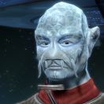

# Nothing but Blue Skies (Part 1) 

 
<b>Session started at 2021-09-03 / 20:34</b>
 
Ruleset [Modiphius2d20] loaded. 
Core RPG ruleset (v2021-07-06) for Fantasy Grounds
Copyright 2021 Smiteworks USA, LLC 
Fen's StarTrekAdventures Extension (v0.2)  
Ruleset [Modiphius2d20] loaded. 
*Core RPG ruleset (v2021-07-06) for Fantasy Grounds
Copyright 2021 Smiteworks USA, LLC* 
*Fen's StarTrekAdventures Extension (v0.2) * 
Ruleset [Modiphius2d20] loaded. 
*Core RPG ruleset (v2021-07-06) for Fantasy Grounds
Copyright 2021 Smiteworks USA, LLC* 
*Fen's StarTrekAdventures Extension (v0.2) * 
**Skig:  [3d20 = 56]** 
Masakari (Zox): 0_o 
**Hailey Murry:  [2d20 = 26]** 
**Zox:  [2d20 = 26]** 
Masakari (Zox): I see now why Wesley didn't last long on the Enterprise. 
indarien (Skig): Yeah, Wil Wheaton clearly plays way more Pathfinder than 2d20 and kept rolling 19+ on his reputation roll. 
>Captains log, stardate 61158.2. We were en-route to the Aldiri system to conduct trade negotiations when we received a distress call from a Kelorian colony near the Tzenkethi border.
The colony is experiencing severe malfunctions in their weather control grid, and have requested Federation assistance to repair it.The planet is beset with naturally occurring ion storms, and with the grid offline, the entire colony is in grave danger.
I managed to convince Amondi to let me lead the away team myself. But only if I took Zox with me. Dr. Viraseti and Commander Skig are leading the repair efforts, and Murry and I are coordinating with the colony in case an evacuation is needed. Hopefully it doesn't come to that. 

>EXTERIOR - Planet Surface: Skig and Commander Viraseti are investigating the issues with the weather control emitter. Captain Baras, Zox, and Murry are discussing contingency plans with the colony administrator Anjek. 

*Skig is checking to see if they can properly determine when the next Ion Storm will strike so they have a timeframe for bringing repairs online.* 
**Anjek:** We simply must find some way to repair the weather control system. Evacuating the colony and abandoning all of our research is not a palatable option for us 
**Captain Baras:** I understand that Administrator, but if the grid cannot be repaired in time, it may be the only option  
**Skig: [ REASON  (10) +  ENGINEERING  (5)]
[Successes: 1] [Complications: 1]
Success with 0 momentum [2d20 = 27]** 
**Skig:** Well, looks like yesterday was a good day for an ion storm... 
*Skig rotates tricoder 965 degrees to see if maybe the color chart will change.* 
**Hailey Murry:** It's better to have things prepared as a just in case. Hopefully we can treat this as a slightly irregular drill, rather than an actual evacuation.  
*Lt. Cmdr Viraseti furrows her brow* 
**Lt. Cmdr Viraseti:** I still can't figure out why the frequency dampeners are not alligning, Commander. It seems like the ionic radiation is causing interference. 
*Zox levels his keen and constantly watching eyes on the scene.* 
**Zox: [ INSIGHT  (8) +  SECURITY  (4)]
[Successes: 1] [Complications: 1]
Success with 0 momentum [2d20 = 26]** 
**Anjek:** Fleeing from the planet and leaving hundreds of delicate experiments to be ravaged by the ionic storms hardly sounds like a drill 
**Skig:** It looks like there is some sort of transient interference from the Migratronic Aviary Transponder. 
**Lt. Cmdr Viraseti:** Can you fix it? 
**Skig ***(mutters)*: Given current rolls, we'd be better off calling for Exterminatus. 
**Lt. Cmdr Viraseti:** If you can stablize the power delivery, we may have some hope of getting the emitters back online 
*Zox nods at Skig* 
**Hailey Murry:** You are correct, if we have to flee it's definitely not a drill anymore. But I'm sure Lieutenant Commanders Skig and Viraseti will wrap this up shortly, barring any unusual circumstances.  
**Skig:** That is a good option, let me see if I can adjust the relay system to remodulate the capacitance without impacting the Connubial Dampeners. 
**Anjek:** You will forgive me if I do not share your confidence, your colleagues do not seem to be able to roll very well 
*Skig nods in total agreement to the destruction of the Fourth Wall due to horrific dice rolls.* 
**Skig: [ REASON  (10) +  ENGINEERING  (5)]
[Focus: System Maintenance ]
[Successes: 1] [Complications: 0]
Success with 0 momentum [2d20 = 31]** 
**Zox:** If you do not like the weather here, why not just leave the planet? 
*Skig rejoices at not getting a complication for the first time today.* 
**Anjek:** The ionic storms here are an inconvenience, but they enable our entire research project 
**Anjek:** By harnessing the ionic energy with our weather control grid, we are able to study the interactions of complex ionic systems in a way that our scientists have never before been able 
**Zox:** Then should you not pre-emtively evacuate non-essential staff in the event of some catastrophe? 
**Zox: [ REASON  (7) +  SECURITY  (4)]
[Successes: 2] [Complications: 0]
Success with 1 momentum [2d20 = 17]** 
**Anjek:** Your suggestion is... reasonable 
**Zox:** I am glad this planet is reasonable! I will make preparations immediately.  
**Skig:** Viraseti, it seems like there is some sort of variable frequency change impacting the ionic range. Can you check the colony ionic weather patterns and see if this is a new phenomenon or something expected? 
*Lt. Cmdr Viraseti performs a scan before kneeling down to where Skig is working* 
**Lt. Cmdr Viraseti:** Something unusual.... Try that again Commander, these energy patterns are... not behaving as I would expect 
**Lt. Cmdr Viraseti:** Perhaps you triggered some sort of sympathetic response? 
*Hailey Murry turns to Zox* 
**Hailey Murry:** Can ion storms have sympathy?  
**Zox:** No. 
*Captain Baras laughs* 
**Skig:** Very well, although my bedside manner talking through the psychological disorders present in weather patterns is limited to merely encouraging rain to not be quite so acidic. 
**Zox:** Whatever you ask of them, they just charge extra. 
**Captain Baras:** Good one Commander 
**Skig: [ REASON  (10) +  ENGINEERING  (5)]
[Focus: System Maintenance ]
[Successes: 0] [Complications: 0]
Failed on DC: 1 [2d20 = 35]** 
*Hailey Murry chokes on her coffee* 
*Skig decides that rotating the screwdriver counterclockwise does not help.* 
**Zox: [ INSIGHT  (8) +  SCIENCE  (3)]
[Focus: Xenobiology ]
[Successes: 3] [Complications: 0]
Success with 2 momentum [2d20 = 10]** 
**Lt. Cmdr Viraseti:** Commander, picking up increasing ionic radiation 
**Lt. Cmdr Viraseti:** If you've got any of that last-second magic, now is the time to use it 
**Skig:** That did not seem to respond as expected, I feel like we are approaching this from the wrong charge. 
>As Commander Viraseti speaks, an Ionic storm front begins to form in the distance 

**Hailey Murry:** So what sorts of things do you work on here, Administrator?  
**Skig: Skig has used a point of Determination to add a natural one to the dice pool.** 
**Skig: [ FITNESS  (10) +  ENGINEERING  (5)]
[Focus: System Maintenance ]
[Successes: 4] [Complications: 0]
Success with 3 momentum [2d20 = 23]** 
**Anjek:** We study the effects of ionic energy on biological systems. My own research is on using ionic radiation to treat neurological disorders 
*Skig stands up, does the "Picard Maneuver" to pull down her shirt. Glares crossly at the control relay, takes a deep breath, and smashes her fist into solid metal panel just below the buttons.* 
*Skig then kicks the side of the control panel after choosing what looks like a suitable location for her irritation.* 
*Skig inhales deeply.* 
**Lt. Cmdr Viraseti:** Whatever you did Commander, it seems to be working. The interferometric emmiters are coming back online. 
*Hailey Murry applauds from the side* 
**Hailey Murry:** See? I told you things would be fine.  
*Zox nods enthusiastically at the application of force.* 
**Skig:** Proper application of the principle of force times motivation equals desired results. 
**Lt. Cmdr Viraseti:** They're still having trouble locking on to the frequency of the storm. The frequency is shifting too rapidly for the emitters to compensate 
>The storm front in the distance suddenly begins to roll rapidly across the sands, towards the colony 

>Within a matter of seconds, the storm slams into the perimitter of the weather control emitters, surrounding the colony 

**Lt. Cmdr Viraseti:** The emitters are holding for now, but I don't know how long that will last 
**Skig:** Is this a new occurence though?  Something must have happened to precipitate this change. 
**Lt. Cmdr Viraseti:** Agreed, this happened far too suddenly 
**Zox:** Might there be some place underground to seek shelter against this? 
**Anjek:** Our facility is built into the cliff face, but the geology here offers little protection against ionic radiation  
**Anjek:** That is why we need the weather grid 
*Skig checks the system logs for the normal behavior of the ion storms versus what was just observed to determine if this effect has been getting worse over time or if there is some sort of system malfunction that is causing the issue.* 
**Skig: [ REASON  (10) +  ENGINEERING  (5)]
[Focus: Computers ]
[Successes: 1] [Complications: 0]
Success with 0 momentum [2d20 = 27]** 
**Captain Baras:** Commanders, if you can't find a way to repair the grid, I will have to order the evacuation. We can't risk losing the entire away team 
**Zox:** Yes. 
**Hailey Murry:** When did the troubles with the weather grid begin?  
*Skig appreciates Hailey asking the important questions.* 
**Anjek:** We have had challenges with the grid since the first day 
**Zox:** But there are no reports of ion storms of this intensity before your expedition set up shop? 
**Anjek:** No matter how much power we pump into the grid, the storms seem to be capable of overpowering it 
**Anjek:** Surveys prior to our arrival indicated mild ionic activity 
**Skig: [ INSIGHT  (8) +  SCIENCE  (3)]
[Successes: 2] [Complications: 0]
Success with 1 momentum [2d20 = 15]** 
**Skig:** Perhaps the storms are merely reacting to the increases in power by being drawn to the weather control grid in an escalating fashion. 
**Zox: [ DARING  (11) +  SECURITY  (4)]
[Focus: Espionage ]
[Successes: 1] [Complications: 1]
Success with 0 momentum [2d20 = 34]** 
**Lt. Cmdr Viraseti:** It would certainly explain the reaction when you powered on the grid 
**Captain Baras:** So what do you suggest commander? We can't shut down the grid in the midst of this storm 
**Hailey Murry:** What's being used to generate power for the grid?  
**Skig:** The frequencies are modulating rapidly too try and overcome the defenses and the storm intensity is increasing. It may almost be fruitful to evacuate the planet, turn off the weather control grid, then turn it back on at a much lower power and judge the response of the ionic storm. 
**Captain Baras:** Agreed Commander. The situation has gotten out of hand. I'm ordering an evactuation. Baras to Lister, initiate emergency transport. 
>There is no response to the captain's order, and no transports take place. 

**Captain Baras:** Baras to Lister, respond. 
**Hailey Murry:** I think that request has come a minute too late, Captain.  
*Skig really doesn't want to mention the hamster wheels in the control panel responsible for the weather control system, since that would make Hailey sad.* 
**Hailey Murry:** There's nothing but static on the line 
**Lt. Cmdr Viraseti:** The storm must be blocking communications 
**Skig:** There was a 99.99999999% chance of that being the case. 
**Captain Baras:** Suggestions? 
*Skig checks Plot-Meter to verify accuracy of her statement.* 
*Captain Baras turns to the away team* 
**Zox:** Project and ionic field of our own to shield ourselves? 
**Lt. Cmdr Viraseti:** If we take the power banks from our phasers and feed them into the grid, we may be able to generate a single pulse to dissipate the storm 
*Zox Nods approvingly* 
**Skig:** I would be concerned about the sudden influx of power overloading the relays given the problem we have been having with them, if we can compensate for that it would be a feasible thing to try. 
**Zox: [ CONTROL  (11) +  SECURITY  (4)]
[Successes: 2] [Complications: 0]
Success with 1 momentum [2d20 = 14]** 
**Skig: [ CONTROL  (11) +  ENGINEERING  (5)]
[Focus: System Maintenance ]
[Successes: 1] [Complications: 1]
Success with 0 momentum [2d20 = 35]** 
*Skig thinks today was not worth getting out of bed, and she should have used one of her 4,000 banked "sick days".* 
**Captain Baras:** Ok, Murry gather everyone around the emitter. Zox, set up the shield emitter and stand by 
**Skig:** Will this cover the entire population of the colony? 
**Zox:** Well, hopefully pre-evactuation orders were actually obeyed 
**Zox:** But we can only hope so. 
**Anjek:** We'll have to gather everyone here in the courtyard, but we only have a hundred or so researchers. We should be able to fit, though it may be a bit tight 
*Skig checks the dice rolls for the day, suspects everyone who was pre-evacuated is trapped in the transporter buffer and having a stream of ice cream based positrons shoved through their system and when they rematerialize they will look like Olaf from Frozen.* 
**Captain Baras:** Ok, Zox activate the shield 
**Zox: Zox has used a point of Determination to add a natural one to the dice pool.** 
**Zox: [ DARING  (11) +  SECURITY  (4)]
[Successes: 3] [Complications: 0]
Success with 2 momentum [2d20 = 19]** 
**Skig: [ REASON  (10) +  ENGINEERING  (5)]
[Successes: 0] [Complications: 0]
Failed on DC: 1 [d20 = 17]** 
*Hailey Murry continues to sip her coffee, enjoying the lights of the vicious ion storm outside the field* 
**Skig:** I'm pretty sure you should lick those ends to make the electrons flow faster through the spacing gap in the cladding. 
>Zox dives into the panel, rapidly rewiring the emitter circuits to collapse the broad-spectrum weather grid into a small sheild emitter centered on the away team 

>As the grid retracts, the storm collapses in with it, until the away team is surrounded by the raging ionic storm mere meters away 

*Skig begins feverishly working on an unconnected piece of equipment to help, thankfully everyone is polite and does not point out the console is powered down.* 
**Lt. Cmdr Viraseti:** The emitter seems to be holding, power levels are stable 
*Zox briefly considers Skigs idea, but determines it is her yet again un-used sick day and the advice may not be the best.* 
**Zox: [ FITNESS  (9) +  SCIENCE  (3)]
[Successes: 2] [Complications: 0]
Success with 1 momentum [2d20 = 16]** 
**Skig: [ FITNESS  (10) +  CONN  (2)]
[Successes: 0] [Complications: 0]
Failed on DC: 1 [2d20 = 32]** 
**Hailey Murry: [ FITNESS  (7) +  SCIENCE  (5)]
[Successes: 1] [Complications: 0]
Success with 0 momentum [2d20 = 16]** 
>Skig gets woozy and faints 

*Skig realizes fainting is probably in her best interest at this point.* 
**Hailey Murry:** Woo, I am not feeling too well all of a sudden 
**Lt. Cmdr Viraseti:** The ionic radiation seems to be... affecting our cognition 
**Hailey Murry:** Does anybody have any tin foil hats? 
**Lt. Cmdr Viraseti:** At this close range, the effects are.. profound 
*Zox scoffs at weak, warm blooded creatures.* 
**Captain Baras:** Anything we can do? 
*Skig curls into fetal position and begins sleeping peacefully, dreaming of dice that roll under 15.* 
**Zox:** Turn off all other systems besides the field! 
**Zox:** Perhaps the whole planet is acting like a circuit 
**Captain Baras:** Do it Commander. 
*Captain Baras faints as well, just after giving his order* 
**Hailey Murry: [ FITNESS  (7) +  SCIENCE  (5)]
[Successes: 2] [Complications: 0]
Success with 1 momentum [2d20 = 18]** 
**Zox: [ CONTROL  (11) +  ENGINEERING  (3)]
[Focus: Espionage ]
[Successes: 2] [Complications: 0]
Success with 1 momentum [2d20 = 19]** 
**Zox: [ FITNESS  (9) +  SCIENCE  (3)]
[Focus: Endurance ]
[Successes: 4] [Complications: 0]
Success with 3 momentum [2d20 = 5]** 
*Lt. Cmdr Viraseti drops next to the captain* 
*Zox begins looking like a dragonball character powering up, sans any hair.* 
**Hailey Murry:** It's recommended that everyone remain relatively low to the ground, just in case 
*Anjek begins to panic* 
**Hailey Murry:** Chief Tactical Officer, you appear to be glowing 
**Zox:** Quite strange. 
**Hailey Murry:** What do you need for me to help?  
**Anjek:** Everything you do makes it worse 
*Skig begins dreaming of double mocha lattes.* 
**Zox: [ DARING  (11) +  SECURITY  (4)]
[Successes: 2] [Complications: 0]
Success with 1 momentum [2d20 = 16]** 
>lunges for Zox's phaser, but Zox swats him aside effortlessly when he sees him coming 

*Anjek lunges for Zox's phaser, but Zox swats him aside effortlessly when he sees him coming* 
*Zox begins to assume only reptiles are able to stay calm during planetary catastrophes.* 
**Hailey Murry:** Administrator, please, it will be okay. Take a seat here. We've gotten the barrier up already and that is certainly an improvement. Just lay down for a moment and take a breather.  
**Hailey Murry: [ PRESENCE  (8) +  SCIENCE  (5)]
[Successes: 1] [Complications: 0]
Success with 0 momentum [2d20 = 27]** 
**Zox: [ FITNESS  (9) +  SCIENCE  (3)]
[Focus: Endurance ]
[Successes: 0] [Complications: 0]
Failed on DC: 1 [2d20 = 32]** 
*Anjek either lays down at Murry's suggestion or faints, who can say* 
**Hailey Murry: [ FITNESS  (7) +  SCIENCE  (5)]
[Successes: 1] [Complications: 0]
Success with 0 momentum [2d20 = 20]** 
>Murry and Zox join the rest of the away team in the sleepy pile 

>♫♫♫Dramatic Music String♫♫♫ 

*Skig wonders if the dinosaurs drank coffee and watched the meteor strike the planet.* 
>---------CUT TO CREDITS-------
♫♫♫Opening Theme♫♫♫ 

>INTERIOR - Unknown: The away team awake to find themselves in what looks like a Federation facility. They are dissoriented, but start to look around and get their bearings 

**Hailey Murry:** Where's my coffee?  
*Skig looks for a replicator to create a Prairie Oyster.* 
*Hailey Murry rubs her head and looks around* 
**Lt. Cmdr Viraseti:** Never mind the coffee, where are we? 
**Zox: [ INSIGHT  (8) +  CONN  (2)]
[Successes: 1] [Complications: 0]
Success with 0 momentum [2d20 = 18]** 
**Zox:** Oh. Well how did we end up here? 
*Skig looks for indications we are stuck in a holodeck.* 
**Captain Baras:** The emergency transport? 
**Hailey Murry: [ INSIGHT  (12) +  CONN  (3)]
[Successes: 2] [Complications: 0]
Success with 1 momentum [2d20 = 11]** 
**Lt. Cmdr Viraseti:** Why wouldn't they beam us to a transporter room? 
**Skig: [ REASON  (10) +  ENGINEERING  (5)]
[Successes: 2] [Complications: 0]
Success with 1 momentum [2d20 = 20]** 
**Hailey Murry:** Maybe they did?  
**Hailey Murry:** It seems like we were out for a while 
**Hailey Murry:** This is the Forward Lounge 
**Hailey Murry:** Come, let's see what's happened 
*Hailey Murry gets a cup of coffee* 
*Skig taps her comm badge to hail the engineer on duty.* 
*Zox observes.* 
*Skig gets a prairie oyster out of the replicator.* 
**Skig:** We are not where we think we are. 
**Zox:** Hrm. Where are we then? 
**Skig:** This is not the forward lounge. 
**Lt. Cmdr Viraseti:** It certainly seems to be Commander 
*Hailey Murry pauses before taking a sip of her coffee* 
**Hailey Murry:** What is it? 
**Skig:** Those four side panels should have scoring on them from when the forward lounge was opened to vacuum during the Battle of Betazad.  I insisted the scoring from the plasma marks not get removed during the refit. 
**Skig:** We had been using the forward lounge as emergency triage for injured and thirty four crew we blown into space when the torpedo struck. 
**Zox:** Interesting. I would never question your familiarity with the ship. 
**Hailey Murry:** Was there another Constitution Class star ship?  
**Skig:** Those replicators are half a meter out of position. 
**Captain Baras:** None in this sector Murry 
**Lt. Cmdr Viraseti:** So.. Some sort of Temporal event? 
*Zox checks for the presence of Anjek* 
**Zox: [ INSIGHT  (8) +  CONN  (2)]
[Successes: 1] [Complications: 0]
Success with 0 momentum [2d20 = 19]** 
*Anjek is standing in the corner looking rather shaken and confused* 
**Zox:** Hrm. 
*Hailey Murry groans and puts her coffee down* 
**Skig:** Also, if you check the bottom of those chairs, you will note they have gum stuck on them, because the old chief engineer at the time of the Battle of Betazed had an annoying habit of chewing bubble gum while playing cards and would annoyingly shove the used gum on the bottom of the chair. 
**Hailey Murry: [ INSIGHT  (12) +  MEDICINE  (3)]
[Successes: 1] [Complications: 0]
Success with 0 momentum [2d20 = 24]** 
*Skig knows her ship.* 
*Captain Baras looks under a bar stool * 
**Captain Baras:** Well, she's right 
**Hailey Murry:** The coffee smells fine, but I think it's probably safer not to drink until we're sure we're not in some sort of fungal replication or something  
**Captain Baras:** That is disgusting. I certainly hope you replaced the bar stools in the refit 
**Skig:** Those were blown out into space, but I noticed them when I woke up. 
indarien (Skig): Any reponse to Skig's communicator to the engineer on duty? 
>As the crew discuss their situation, the light suddenly come up to full brightness and a banner reading "Happy Birthday Lt. Skig" unfurls from above the windows. A dozen or so crew come rushing in through the lounge doors 

**Chorus of Voices:** SURPRISE! 
**Skig:** Oh dear. 
**Skig:** THAT DAY. 
*Hailey Murry clutches at her eyes with the pain of the bright lights* 
**Lt. Howard:** Now there's a look of true surprise gentlemen 
**Lt. Howard:** I told you she would never see it coming 
*Zox is perplexed.* 
>Two humans and a Vulcan walk up to the away team, looking at Skig 

*Skig smiles widely.* 
**Skig:** Oh thank you! 
*Skig is clearly trying very hard to fake being happy about being surprised.* 
**Tural:** I fail to see the purpose of expending such effort and so many crew resources simply to.. "surprise" the lieutenant 
**Ensign Marks:** Because it's fun Tural 
**Zox: [ INSIGHT  (8) +  SECURITY  (4)]
[Successes: 2] [Complications: 0]
Success with 1 momentum [2d20 = 19]** 
bayushikazemi (Hailey Murry): Surprise me once, shame on you. Surprise me twice, shamke on me 
*Skig gestures at Viraseti and points at an invisible chronometer on her wrist to indicate total agreement of, "Temporal Event" suggestion.* 
**Zox:** I see.  
**Skig:** Tural we must all take every chance to be surprised as an opportunity to learn about the need to never panic in adverse conditions. 
**Zox:** If only there were a best selling book that assured its readers not to panic. 
**Tural:** Hmm. I cannot find fault in your logic. In that case... "Surprise", Lietenant 
*Tural hands Skig a bottle of Romulan Ale with a bow on top* 
**Skig:** And I appreciate all of you taking such time and energy to provide everyone with the opportunity to have fun and learn at the same time. 
*Skig takes the bottle of Romulan Ale generously.* 
**Chief Botok:** That doesn't sound like the Skig I know 
**Skig:** Thank you Tural, I will cherish this as I cherish your friendship and kindness. 
**Chief Botok:** Where's that detatched Tellerite aggression? 
**Zox: [ INSIGHT  (8) +  SECURITY  (4)]
[Successes: 1] [Complications: 0]
Success with 0 momentum [2d20 = 18]** 
*Skig remembers putting the bottle with Tural's casket before his remains were launched into space.* 
*Skig looks at Chief Botok.* 
>An older Bolian man comes up from behind and shakes Skig's hand 

**Skig:** Botok! 
*Skig shakes his hand.* 
**Skig:** It is a pleasure to see you again. I believe it is my turn in our 3D chess game. Knight to A-4-9. 
**Chief Botok:** I knew you'd eventually find your way to a starship Skig, from the first day of my "Applied Warp Field Dynamics" class 
**Zox: [ INSIGHT  (8) +  COMMAND  (3)]
[Successes: 1] [Complications: 0]
Success with 0 momentum [2d20 = 29]** 
**Skig:** Ah yes, the day you pointed out, after arguing with me for thirty minutes, that my entire theory was flawed due to an inverted sign on the flow theory algorithm I was using. 
**Hailey Murry: [ INSIGHT  (12) +  CONN  (3)]
[Successes: 1] [Complications: 0]
Success with 0 momentum [2d20 = 28]** 
**Zox:** Captain, may I suggest mass-hallucination as the most likely explanation for this phenomenon. Perhaps the ionic storms are somehow inter-weaving our collective unconsciouness. 
**Hailey Murry:** This is not just a mass hallucination  
**Captain Baras:** So we could be in Skig's mind? Having some sort of vivid hallucination? 
*Hailey Murry picks up her coffee and takes a sip* 
*Skig is still talking to Botok.* 
**Hailey Murry:** We're all sharing dreams, I think 
**Chief Botok:** Your colleagues here told me they figure out your birthday. I suspect they may have violated some protocols accessing your personel records! But when they invited me, I knew I had to come 
**Chief Botok:** I wanted to see what you're doing out here with this old war horse! 
**Zox:** It could be that Skig had the most powerful mind and thus most powerful base electric activity. 
*Lt. Cmdr Viraseti scoffs at Zox's suggestion* 
**Hailey Murry:** She's also the first to fall asleep as well 
**Skig:** I have a fondness for old ships and the history they bring, as well you know. 
**Zox: [ CONTROL  (11) +  ENGINEERING  (3)]
[Successes: 2] [Complications: 0]
Success with 1 momentum [2d20 = 10]** 
**Skig:** They have personalities and quirks, much like the crew that inhabit them. 
>Zox runs out of the corner and kicks the chair out from under Tural. Tural falls on his ass and looks at Zox 

*Skig blinks.* 
*Zox Toots a loud WAR whistle before his scales turn bright red.* 
**Skig ***(mutters)*: I do not remember this happening on THAT day. 
**Tural:** Ensign Pedersen? Is this further exploration of the value of surprise in acquiring wisdom? 
**Tural:** If so, I am very surprised by your actions. But they are not at all logical 
*Tural stands back up and dusts himself off* 
**Hailey Murry ***(mutters)*: They are highly logical once you have the right point of view 
*Skig realizes it is hard to focus on both past and present at the same time.* 
*Ensign Marks and Lt. Howard laugh at Tural and Zox* 
**Zox:** Interesting. 
**Hailey Murry:** I wonder why we're being shown this, specifically 
**Lt. Howard:** Now that's getting into the spirit of a party 
*Hailey Murry pays close attention to the events of the scene, for future reference* 
>As everyone is pondering Zox's actions, the red alart klaxon blares 

**Skig ***(mutters)*: Now that is expected. 
>A Galor Class Cardassian cruiser appears in the distance, visible through the forward observation windows 

*Skig sighs.* 
>♫♫♫Spoooooky Music Sting♫♫♫ 

**Skig ***(mutters)*: It would be nice to know if the past can be changed, but I have the feeling this is not the opportunity I think it is. 
>---------CUT TO COMMERCIAL------- 

# Nothing but Blue Skies (Part 2) 

 
<b>Session started at 2021-09-13 / 16:03</b>
 
Ruleset [Modiphius2d20] loaded. 
Core RPG ruleset (v2021-07-06) for Fantasy Grounds
Copyright 2021 Smiteworks USA, LLC 
Fen's StarTrekAdventures Extension (v0.2)  
Ruleset [Modiphius2d20] loaded. 
*Core RPG ruleset (v2021-07-06) for Fantasy Grounds
Copyright 2021 Smiteworks USA, LLC* 
*Fen's StarTrekAdventures Extension (v0.2) * 
Ruleset [Modiphius2d20] loaded. 
*Core RPG ruleset (v2021-07-06) for Fantasy Grounds
Copyright 2021 Smiteworks USA, LLC* 
*Fen's StarTrekAdventures Extension (v0.2) * 
Ruleset [Modiphius2d20] loaded. 
*Core RPG ruleset (v2021-07-06) for Fantasy Grounds
Copyright 2021 Smiteworks USA, LLC* 
*Fen's StarTrekAdventures Extension (v0.2) * 
**Zox:  [d20 = 15]** 
>"Nothing but Blue Skies"
Written By Nadia MacLeod
Directed By Apolena Christianson 

>INTERIOR - Crew Lounge: As the red alert klaxon blares, any further response to Zox's violent outburst is cut short as Tural stands up and leaves. All of the attendees begin streaming out of the lounge, leaving the away team, Anjek , and Botok behind. 

>The ship begins maneuvering, and the Cardassian cruiser is no longer visible through the large windows in the crew lounge 

**Chief Botok:** Well that puts a bit of a damper on the festivities, eh sir? 
**Hailey Murry:** Or extra explosives to the festivities 
*Zox rushes to the armory.* 
*Hailey Murry pulls out a note pad to take notes for future reference* 
**Chief Botok:** Is your duty station in engineering? Where can I be of some use? 
*Captain Baras pulls Murry and Zox aside from Skig and Botok* 
*Hailey Murry looks down at the notepad as she realizes she won't get to take it with her. She sighs and takes notes anyways* 
*Zox stands at attention.* 
**Captain Baras:** What do you think? Is this a temporal event, or something else? 
**Skig:** It is, we need to get down there. 
*Skig is talking to Chief Botok.* 
**Captain Baras:** I'm concerned about any actions we take affecting the timeline, even if that possibility is remote 
**Zox:** Too late. 
**Chief Botok:** Naturally, lead the way Lieutenant. I may be old, but I'm still worth my weight in a fire-fight 
**Skig:** Let's go, we will need to reroute extra power to the shields because the torpedoes on that ship will crumple our standard arrays. 
*Chief Botok heads toward the turbolift with Skig* 
*Skig heads out the door, oblivious to the rest of the away team, as her ship is in danger.* 
**Hailey Murry: [ INSIGHT  (12) +  SCIENCE  (5)]
[Successes: 3] [Complications: 0]
Success with 2 momentum [2d20 = 13]** 
**Hailey Murry:** I think we're in a dream, rather than a temporal event. It's quite likely, given the ionic storm was causing us to pass out, that the frequencies in the storm are responding to our brainwaves. After all, in a temporal event the crew would see us as strangers rather than responding as if we're additional crew.  
**Lt. Cmdr Viraseti:** I agree it seems implausible, but it could be temporal-cognitive displacement 
**Lt. Cmdr Viraseti:** Our cognition could have been displaced into other bodies, near to Skig's location 
*Zox appears confused by this talk.* 
**Hailey Murry:** I do think we need to take care not to have bad things happen to us, though. In a normal dream, we wake up when startled. I don't think the storm will permit that, though, so if someone were to become grievously injured during the course of the dream they may be stuck like that until we're able to awaken 
*Zox Searches for weapons.* 
**Hailey Murry:** Possible, but we're able to recognize each other for who we are 
**Zox: [ REASON  (7) +  SECURITY  (4)]
[Successes: 2] [Complications: 0]
Success with 1 momentum [2d20 = 12]** 
*Hailey Murry gestures towards the dinosaur* 
**Captain Baras:** Agreed, caution is warranted, and the temporal concerns seem unlikely here 
**Captain Baras:** In that case, we had better get to engineering ourselves. If we ARE in the place of engineers, we don't want to leave the ship short-handed in a battle 
**Captain Baras:** Unless anyone has any more prudent suggestions 
**Zox:** I see no reason to behave differently if this is a hallucination versus the past. 
**Zox:** or _a_ past. 
**Hailey Murry:** What do you normally dream about, Zox?  
*Hailey Murry leads the way toward engineering* 
**Lt. Cmdr Viraseti:** With your permission sir, I'm going to head to Stellar Cartography. I'd like to see if I can use the ship's sensors to look for any signs of temporal interference. Just in case we are wrong 
*Lt. Cmdr Viraseti takes her leave* 
**Zox:** Green leaves as far as one can see, a never ending migration through viridian fields. 
*Skig is unaware of this, and hopes Viraseti survives when Stellar Cartography takes a plasma torpedo to the hull.* 
>INTERIOR - Engineering: Skig and Botok arrive in engineering first, and the scene is pure chaos. The ship is being rocked by impacts from Cardassian weapons, and damage control teams and running in all directions. 

**Zox:** Cardassians generally do not find that compelling. 
**Tural:** Skig, your timing is impecable. We have a containment field overload in progress, get up there and see what is causing it. 
**Skig:** Right 
**Chief Botok:** Lead the way Lietenant, you know your ship 
*Chief Botok grabs a toolkit from the supply locker as he follows Skig* 
**Skig:** Botok, can you work from that console on controlling the power flows appropriately while I climb through the Jeffries Tubes up to the relay conduit? 
**Chief Botok:** Aye sir 
*Skig takes the toolkit from Botok and begins climbing the array.* 
*Skig as she departs gives Botok a smile.* 
*Chief Botok spryly hops over to the console and begins pressing buttons in a way that implies he may know what he is doing* 
**Skig:** And try to keep all the youngsters from panicking. 
>As Skig departs up the Jeffries tube, the rest of the away team arrives in the turbolift 

**Zox:** Hailey, may I advise we leave this deck. If Skig is correct, it may not be compatible with life for much longer. 
**Zox: [ CONTROL  (11) +  COMMAND  (3)]
[Successes: 1] [Complications: 0]
Success with 0 momentum [2d20 = 25]** 
**Tural:** Pederson, Ghex, where have you been? Nevermind, Skig is on the upper deck dealing with a containment flutruation, get up there and help her 
**Tural:** If we lose core containment, we lose the ship. 
**Tural:** That's an order crewmen 
*Tural looks at Zox and Murry impatiently* 
**Captain Baras:** I think he's talking to you Commanders 
*Hailey Murry gives a salute and leads the way* 
**Zox:** Sure. 
**Hailey Murry:** Try to stick around parts of the ship that you recognize, they're less likely to have been replaced 
*Captain Baras heads over to Botok to assist* 
**Zox: [ DARING  (11) +  SECURITY  (4)]
[Focus: Espionage ]
[Successes: 2] [Complications: 0]
Success with 1 momentum [2d20 = 18]** 
**Hailey Murry: [ REASON  (9) +  CONN  (3)]
[Successes: 1] [Complications: 0]
Success with 0 momentum [2d20 = 16]** 
**Hailey Murry:** So, I'm pretty sure this is not the battle that nearly scuttled the Lister 
**Hailey Murry:** So we're probably not in the worst of circumstances 
**Zox:** But if we do not do as we need to, it may scuttle it. 
*Skig looks surprised to see them arrive.* 
**Skig:** Oh, hello. 
**Hailey Murry:** It would be a little surprising if that were the case, I think 
**Hailey Murry:** Good morning, Skig! 
**Skig:** I fixed the problem, it helps having hindsight. 
**Hailey Murry:** Oh, excellent 
**Skig:** How is everyone else doing? 
**Hailey Murry:** Judging from our discussions in the past, I was confident you'd have this handled 
**Skig:** Yes, yes, wonderful. 
*Skig is clearly distracted.* 
*Zox Takes position by a door.* 
**Hailey Murry:** Viraseti has gone up to Stellar Cartography to check on some scans, I think Captain Baras is following Chief Botok 
**Skig:** Viraseti should be safe there, I had a flashback of a different situation and thought she might be in danger, but not today. 
**Hailey Murry:** We left Anjek with Captain Baras. Now that I think about it, we should probably keep her close and provide some moral support. She's more alone than the rest of us are here.  
**Skig:** Who? 
**Skig:** Oh sure, yes, do that. 
*Skig resumes staring at a console in front of her while twiddling with an electric spanner in one hand.* 
*Skig presses comm button badge.* 
**Skig:** Tural, we should have enough power now to evade the Cardassian and keep our shields angled behind us.  How are we doing? 
*Hailey Murry steps up behind Skig and sips her coffee, keeping an eye on the situation* 
**Hailey Murry:** If I may ask, what originally happened? 
*Skig switches to "Screen Saver 3" on console 2.* 
**Tural:** Main power is back online, the captain has ordered evasive action. Your work up there is adequate, but I could use your assistance here if you are finished 
**Skig:** Understood, I'm on my way with Pederson and Ghex. 
*Skig turns off comm badge.* 
**Skig:** Botok climbed up the tube ahead of me, was lacerated by a electrical discharge, and died several minutes ago while I was getting burned badly forcing cabling back together to stop a core breach. 
**Hailey Murry:** That...would have been a very troublesome position to be in 
**Skig:** Hindsight being perfect, this time he did not climb up, I took the left side of the tube, and remembered to take the gloves with me when I need to touch the raw coils. 
*Skig shrugs.* 
*Zox begins to think about installing some additional signs advertising the proper use of PPE in engineering.* 
**Hailey Murry:** I was telling Zox, I think we're in a dream of sorts. Reliving an event. We'll check back with Viraseti to confirm. However, unlike a normal dream I don't think we'll wake up if...otherwise lethal things happen.  
**Skig:** Although I realize that sometimes my memory of today and my memories of Betazed seem to be interchangeable. 
*Skig leads the others back to Tural.* 
**Zox: [ FITNESS  (9) +  ENGINEERING  (4)]
[Focus: Endurance ]
[Successes: 1] [Complications: 0]
Success with 0 momentum [2d20 = 30]** 
**Skig: [ FITNESS  (10) +  ENGINEERING  (5)]
[Successes: 2] [Complications: 0]
Success with 1 momentum [2d20 = 7]** 
**Hailey Murry: [ FITNESS  (7) +  ENGINEERING  (2)]
[Successes: 0] [Complications: 0]
Failed on DC: 1 [2d20 = 30]** 
>As the away team climb down the ladder in the Jeffries Tube, the ship is rocked heavily by another impact and Hailey loses her grip on the ladder and falls down from the upper deck to the floor of the access room below 

*Hailey Murry screams as she falls to her doom* 
**Zox: [ DARING  (11) +  SECURITY  (4)]
[Successes: 2] [Complications: 0]
Success with 1 momentum [2d20 = 18]** 
**Zox:** Ho ho ho, I bet you wish you had claws now. 
>Zox is able get an arm around Murry as she falls, and she is able to get her feet back under her before she lands on the tritanium below 

>As Hailey lands, she sets off the door sensor and the door opens on an engineering in just as much chaos as before. Tural is barking orders and Botok and Captain Baras are both lying on their backs near the warp core working on a coolant leak 

**Zox:** Skig, can we not return fire? Evasive action seems something for Romulan cowards. 
*Hailey Murry dusts herself off and tidies up her outfit* 
**Zox: [ DARING  (11) +  ENGINEERING  (4)]
[Successes: 2] [Complications: 0]
Success with 1 momentum [2d20 = 13]** 
*Captain Baras sees Zox approaching and stands up* 
**Captain Baras:** I take it you were successful up there Skig? 
**Skig:** Returning fire would be a decision of command staff above our pay grade, but yes, shooting back in a war is usually a good thing. 
*Skig nods at Baras.* 
**Captain Baras:** I was assisting the chief here with the coolant leak, but I'm afraid I did poorly in my engineering extension courses at the academy 
**Captain Baras:** Also, that was 50 years ago 
**Skig:** Things were handled up there. 
**Skig:** What coolant leak? 
*Skig dives under the warp core to take a look and shoves Botok out of the way of any possible danger.* 
*Chief Botok looks slightly put upon* 
**Chief Botok:** The antimatter collant tank sprung a leak, nothing to get worked up about Lietenant 
**Chief Botok:** I may be old, but I still know a thing or two 
*Hailey Murry steadies the Chief* 
**Skig:** You old coot, I remember you telling me these triangular feeds are used for Tyson Poultry Field Dampening Relays, and I don't trust you to remember whether the yellow one is used for Hydronic Mustard or Antiphasic Barbecue. 
**Skig:** And the last thing we need is to flush the Hidden Valley Decontamination Relay through the Chipotle Mastication Matrix. 
**Chief Botok:** Fair enough, I am a guest on your ship today, after all 
**Skig:** See, I was paying attention in that class! 
*Zox begins turning green at the mere thought of heavily seasoned greens.* 
**Skig: [ CONTROL  (11) +  ENGINEERING  (5)]
[Focus: Emergency Repairs ]
[Successes: 3] [Complications: 0]
Success with 2 momentum [2d20 = 11]** 
*Chief Botok Skig repairs the coolant leak and the warp core comes back online* 
*Tural taps his comm badge* 
**Tural:** Captain, warp power is available 
>Just then, the ship shudders as it jumps to warp. The din of battle slowly fades and is gradually replaced by the hum of the warp core. 

**Zox:** Damn.  
**Chief Botok:** Well, I am impressed Lietenant. Another year or two and you'll displace that poor Vulcan chap and take over the whole shop 
**Skig:** Botok, can you validate the triphasic non-pinion aviary edibility quotient? 
*Skig blushes at the compliment from Botok.* 
**Hailey Murry:** Well, I am impressed Lietenant. Another year or two and you'll displace that poor Vulcan chap and take over the whole shop 
**Hailey Murry:  [d20 = 5]** 
**Zox:  [d20 = 13]** 
**Skig:** Thank you, I am honored you feel that way, every day in engineering is an opportunity to learn. 
>As Chief Botok flashes a smile to Skig, a sudden energy discharge errupts from the warp core, enveloping him and throwing him across the room into Zox 

**Zox:** Gwaaaaaa 
*Chief Botok falls to the ground, motionless.* 
**Zox: [ DARING  (11) +  MEDICINE  (1)]
[Focus: Xenobiology ]
[Successes: 2] [Complications: 0]
Success with 1 momentum [2d20 = 19]** 
**Zox:** We need a sport-tonic ion balancer solution to reset Botok's electrolyte balance! 
**Skig:** Nooooo!!!!!!! 
**Zox:** I shall rush Botok to Sick bay! 
**Zox: [ FITNESS  (9) +  SCIENCE  (3)]
[Focus: Endurance ]
[Successes: 2] [Complications: 0]
Success with 1 momentum [2d20 = 20]** 
*Skig activates her comm badge.* 
**Skig:** Medical emergency, heavily injured on the way. 
*Skig relays information to Sick Bay as she chases after Zox, who is behaving quite questionably right night.* 
>Zox and Skig run towards the turbolift and get in, Murry, Baras and Anjek follow suit. 

**Hailey Murry:** Baras, Anjek, come this way!  
>The turbolift doors close and it begins speeding away towards sickbay 

**Skig: [ INSIGHT  (8) +  MEDICINE  (2)]
[Successes: 1] [Complications: 0]
Success with 0 momentum [2d20 = 19]** 
*Skig sighs heavily.* 
**Zox:** Is there something special about that discharge, Skig? 
*Skig looks at Botok.* 
*Skig is he conscious at all.* 
indarien (Skig): Is he conscious at all? 
>As the turbolift doors open, the away team step out but find themselves standing behind the bar in the forward lounge. 

>Tural is standing there holding out a bottle of Romulan Ale 

**Tural:** Hmm. I cannot find fault in your logic. In that case… “Surprise”, Lietenant 
**Zox:** Is this one stuck on repeat? 
**Skig:** Thank you Tural, I look forward to sharing this with you. 
*Skig takes the bottle from the Vulcan.* 
**Zox: [ INSIGHT  (8) +  MEDICINE  (1)]
[Successes: 1] [Complications: 0]
Success with 0 momentum [2d20 = 23]** 
**Chief Botok:** That doesn’t sound like the Skig I know 
**Chief Botok:** Where’s that detatched Tellerite aggression? 
**Skig:** It became stuck behind some attached Tellerite practicality, my old mentor. 
*Chief Botok comes over and shakes Skig's hand* 
**Skig: [ REASON  (10) +  SECURITY  (3)]
[Successes: 1] [Complications: 0]
Success with 0 momentum [2d20 = 24]** 
**Zox: [ CONTROL  (11) +  SECURITY  (4)]
[Successes: 3] [Complications: 0]
Success with 2 momentum [2d20 = 16]** 
**Chief Botok:** I knew you’d eventually find your way to a starship Skig, from the first day of my “Applied Warp Field Dynamics” class 
*Zox Makes a tooting noise and offers Skig a large wrapped present.* 
**Zox:** Rejoice in your surprise 
**Skig:** Ah, the day I argued with you for half an hour, citing a flawed hypothesis that you had to refute a dozen different ways. 
**Zox:** Surely this mystery box will give you intrigue as well as a curio. 
**Skig:** That was a valuable education in the use of patience of logic to defeat a bullheaded underclassman. I used it constantly for the remaining three years of Starfleet Academy. 
*Skig sets the bottle of Romulan Ale on the bar and takes the box from Zox and tries to guess what it is.* 
**Skig:** I've always wanted my very own lifesize replica of a core containment field array? 
*Skig raises an eyebrow and looks at Zox.* 
BayushiKazemi (Hailey Murry): What's in the box?! 
**Skig: [ INSIGHT  (8) +  CONN  (2)]
[Successes: 1] [Complications: 1]
Success with 0 momentum [2d20 = 22]** 
**Zox:** Sensors indicate mundane compounds. 
**Zox:** The box contains nothing exotic or harmful 
**Tural:** Perhaps I have misunderstood human birth celebration customs, but should you not know what is in the box? 
*Skig removes the wrapping paper, looking for practical joke related traps that Pedersen would find funny.* 
*Skig looks at Tural.* 
**Skig:** This is Pedersen we are talking about. 
>Skig opens the box to reveal a large hinged ceramic music box in a familiar looking shape 

**Hailey Murry: [ INSIGHT  (12) +  ENGINEERING  (2)]
[Successes: 2] [Complications: 0]
Success with 1 momentum [2d20 = 21]** 
**Skig: [ REASON  (10) +  ENGINEERING  (5)]
[Successes: 1] [Complications: 0]
Success with 0 momentum [2d20 = 27]** 
**Zox: [ INSIGHT  (8) +  ENGINEERING  (4)]
[Focus: Music ]
[Successes: 2] [Complications: 0]
Success with 1 momentum [2d20 = 16]** 
>Zox, Murry and Skig all immediately recognize the music box as being in the shape of the Kelorian weather control grid emitter 

**Tural:** Curious 
**Skig:** This is exactly what I wanted. Look, we can even adjust the arrays! 
**Tural:** I was not aware you were fond of music boxes Lieutenant 
*Skig begins work on blocking the unseen ionic storms.* 
**Chief Botok:** She's a hard one to get a read on 
**Skig:** Everyone needs a hobby. 
**Zox: [ INSIGHT  (8) +  SCIENCE  (3)]
[Focus: Music ]
[Successes: 3] [Complications: 0]
Success with 2 momentum [2d20 = 6]** 
*Skig is trying to adjust the "music box" to play a suitably beautiful ionic melody that will soothe the savage storm.* 
**Hailey Murry:** Hmmm 
*Zox 's normally cumbersome claws gracefully manipulate the music box.* 
*Lt. Cmdr Viraseti comes back into the lounge, looking somewhat out of sorts* 
**Hailey Murry:** How are you doing, Lieutenant Commander?  
*Lt. Cmdr Viraseti runs over to the away team and begins scanning  them with her tricorder* 
**Hailey Murry: [ INSIGHT  (12) +  MEDICINE  (3)]
[Successes: 3] [Complications: 0]
Success with 2 momentum [2d20 = 10]** 
**Hailey Murry:** Viraseti, what's the matter? 
**Lt. Cmdr Viraseti:** I managed to access the sensor array in stellar cartography. In case you were wondering: no signs of any temporal disruptions 
**Lt. Cmdr Viraseti:** In fact, there were no signs of almost anything. The ships sensors could only read one thing 
**Lt. Cmdr Viraseti:** Tellerite lifesigns 
**Lt. Cmdr Viraseti:** One in particular 
*Lt. Cmdr Viraseti looks at Skig* 
**Lt. Cmdr Viraseti:** Commander, I'm not a doctor. But your life signs were fading. Whatever is happening here, it is killing you 
*Skig looks around.* 
>♫♫♫Dramatic Music String♫♫♫ 

**Skig:** Sucks to be that Tellerite. 
**Skig:** Oh wait. 
>---------CUT TO COMMERCIAL------- 

**Captain Baras:** What do you mean the ship's sensors are picking up Tellerite life signs? You mean you can read the commander's life signs? 
**Zox:** Skig, you mean the universe to us...or are the universe now. Either way, you need to wake up. 
**Lt. Cmdr Viraseti:** No sir, they don't register the planet, the Cardassian cruiser, anything. Just one big set of Tellerite life signs 
**Skig:** Curious. 
*Zox rushes to the bar and begins to make coffee.* 
**Skig:** Thanks, I need some of that. 
**Lt. Cmdr Viraseti:** I'm not sure I can trust this tricorder, but no one else's life signs are showing signs of distress 
**Captain Baras:** Ok, so definitely not time travel... 
**Captain Baras:** Murry, what's your take on this? 
**Captain Baras:** If this isn't reality, then how do we get out of it? 
**Hailey Murry:** My take is a bit frustrated, because I think we may not be sharing a dream 
**Hailey Murry:** I think we're all in Skig's dream 
*Zox spikes the coffee with Romulan Ale.* 
**Hailey Murry:** Or we're all dead and our ghosts are inhabiting Skig's body 
**Zox: [ DARING  (11) +  MEDICINE  (1)]
[Focus: Espionage ]
[Successes: 3] [Complications: 0]
Success with 2 momentum [2d20 = 6]** 
**Skig:** More of a nightmare, less of a dream. 
**Captain Baras:** Well let's assume we're not dead yet, for now 
**Captain Baras:** Hard to operate under the opposite assumption 
*Zox presents Skig with an appropriately steaming, very aromatic cup, complete with biscuits.* 
**Hailey Murry:** It would be quite a scientific achievement if we were all reincarnated into Skig after this 
**Zox:** Merry Hatching Day. 
**Skig:** That level of psychotic multiple personalities would diminsh my overall ability to perform repairs. 
*Skig takes biscuits and coffee from Zox.* 
**Skig:** Happy Ovulation Production Festival to You! 
**Captain Baras:** Murry, I am sure that would be fascinating to write a paper about, but I would prefer we all end up in the correct bodies 
**Hailey Murry:** Are you sure about that? Your body is pretty old... 
**Captain Baras:** You are aware that I am your commanding officer, yes? 
**Hailey Murry:** Yes, sir! 
**Skig:** Indeed, Zox's claws would not help with Murry's tendency to shove her fingers into her temples when she is thinking. 
**Hailey Murry:** On the other hand, Zox has a very hard head 
*Zox begins to ponder Skig's statement.* 
**Lt. Cmdr Viraseti:** It's too bad we didn't bring the twins on this away team, that would be a fascinating wrinkle for this paper you're proposing 
*Zox Begins scratching his head.* 
**Skig:** Wait... if we are in a loop, the loop started this time on a shorter cycle. 
**Skig:** Which would mean the time I have is decreasing until we reach the loop termination because it is too small for a new one to begin. 
>As before, the red alert klaxon blares again, and the crew begins to flood out of the lounge to get to their duty stations 

**Zox:** Oh no, not again! 
**Skig:** I will need to work with Botok to solve this. 
**Skig:** The rest of you need to figure out how to break the loop, your characters are not critical to this cycle, but Botok and I are. 
**Chief Botok:** If you need me sir, just say the word 
**Skig:** That is the key, badge me if you need, but we have to come to the bottom of what is spawning the cycle. 
**Skig:** Right Botok, let's get down to engineering and see what is going on. 
**Zox: [ INSIGHT  (8) +  SECURITY  (4)]
[Successes: 1] [Complications: 0]
Success with 0 momentum [2d20 = 20]** 
**Hailey Murry: [ INSIGHT  (12) +  SCIENCE  (5)]
[Successes: 2] [Complications: 0]
Success with 1 momentum [2d20 = 22]** 
>As before, a Galor Class Cardassian cruiser appears in the distance, visible through the forward observation windows 

**Skig:** In the mean time, I am curious what your take on a decreasing time loop interstital theory would be, as it relates to strong memories from previous events being replayed constantly. 
*Hailey Murry presses her Comm Badge and calls out to Skig* 
**Chief Botok:** I'll have to give that some thought Lietenant, but perhaps a battle isn't the best time to discuss temporal mechanics 
*Skig while in the turbolift, explains in generic terms her theory of being trapped in a circular Groundhog-Day loop and how that would apply to pressing memories.* 
**Hailey Murry ***(Comms)*: Skig, I think you should know that this is a very ionically charged Cardassian Cruiser this time 
**Zox:** Is it also high in vitamin C? 
**Skig:** True, but you are the one who taught me the fine art of taking every opportunity to learn something new and think about different solutions to a problem. 
>As the cruiser nears the Lister, instead of disruptors and torpedoes, it begins firing bolts of ionic lightning that rock the ship and knock out power 

**Skig ***(Comms)*: Good to know 
>♫♫♫Spoooooky Music Sting♫♫♫ 

>---------CUT TO COMMERCIAL------- 

# Nothing but Blue Skies (Part 3) 

 
<b>Session started at 2021-09-20 / 20:01</b>
 
Ruleset [Modiphius2d20] loaded. 
Core RPG ruleset (v2021-07-06) for Fantasy Grounds
Copyright 2021 Smiteworks USA, LLC 
Fen's StarTrekAdventures Extension (v0.2)  
**Zox:  [d20 = 18]** 
>Counselor's Log - I only have a moment of peace away from the others. I hope this remains intact after this, though I expect it will not. Still, the act of repeating it will help with retention. The working theory is that the ionic storm is causing us to relive of the USS Lister's battles, a flight from a Cardassian cruiser that left some trauma on Skig. We thought that hindsight would allow a cleaner resolution than in reality, but it appears we only delayed the inevitable and looped back to the beginning. I'm concerned for Skig's wellbeing if we continue to repeat this loop, but I'm more concerned that we won't get the chance. The Cardassian cruiser is now ionized. Things are escalating. End recording. 

**Captain Baras:** Counselor, I am not convinced that Skig's efforts with Chief Botok are going to amount to anything 
**Hailey Murry:** Neither am I 
**Captain Baras:** I want an alternative course of action, thoughts? 
**Hailey Murry:** In fact, I think it may wind up being worse for us, given the changes we're seeing on only our second loop 
**Hailey Murry:** Zox, what are your thoughts? 
*Hailey Murry takes a drink of her coffee as she thinks* 
**Zox:** I am not certain. I am not assigned to the security of this vessel at this time. 
**Zox:** Perhaps we need to give Skig more fermented beverages such that she mellows our. 
**Zox:** ..out and stops having violent recollections and dreams. 
**Captain Baras:** So you think a theraputic solution might help? 
**Hailey Murry:** It might. Something about learning to let go... 
*Hailey Murry sighs* 
**Hailey Murry:** But this is very tactile 
**Hailey Murry:** Have we tried reaching out to the Cardassian ship to see what it wants? 
**Zox:** War. 
**Zox: [ INSIGHT  (8) +  MEDICINE  (1)]
[Focus: Xenobiology ]
[Successes: 1] [Complications: 0]
Success with 0 momentum [2d20 = 18]** 
**Hailey Murry:** Ah, let me rephrease; have we tried reaching out to the ionic storm that's in superposition with the Cardassian ship?  
**Zox:** I think you should put mild psychadelics in Skigs food, microdosing. 
**Lt. Cmdr Viraseti:** Interesting idea Counselor. You think we might find someone or something to communicate with? 
**Captain Baras:** Ok, if we wanted to attempt communication, how would we do it? 
**Hailey Murry:** Let's try to reach out to the enemy ship first, see if we can communicate with them through the ship. Pay attention to the static or distortions as well, I can run some scans and see if there are words within the sounds. 
**Zox: [ REASON  (7) +  ENGINEERING  (4)]
[Focus: Espionage ]
[Successes: 2] [Complications: 0]
Success with 1 momentum [2d20 = 21]** 
**Zox:** With all due respect, I think a state of open war will void any communication unless the Cardassian commander has a will to parley. 
**Captain Baras:** So what do you suggest Commander? 
**Zox:** Engage in warfare, per the federations current declaration.  
**Zox: [ PRESENCE  (10) +  SECURITY  (4)]
[Successes: 2] [Complications: 0]
Success with 1 momentum [2d20 = 14]** 
**Hailey Murry:** The communication does not need to be "meaningful" in the classic sense of the terms. We don't necessarily have to come to peace with the ship, but rather to pick out subtle messages in how they phrase things or voices in the static to clue us into an out. 
**Hailey Murry: [ REASON  (9) +  SCIENCE  (5)]
[Focus: Acoustics ]
[Successes: 2] [Complications: 1]
Success with 1 momentum [2d20 = 24]** 
**Zox:** the only subtle thing about the Cardassians are their poisons. 
**Captain Baras:** I think you're both right. We need to attempt communication, but the Cardassian Gul commanding that vessel is not going to engage in a pleasant fireside chat 
**Captain Baras:** The only alternative option is to offer our surrender, and discuss terms with him 
>♫♫♫Ominous Music Sting♫♫♫ 

**Zox:** We should be disscussing surrender, theirs, after we use our knowledge of their ship against them. 
*Skig speaking to Botok.* 
**Zox:** I hope you will enjoy being in an endless dream of dilithium prison mining camp. 
>INTERIOR - Engineering: Skig and Botok step off the turbolift to find a scene much like the last time. The chaos of battle rages around them 

**Skig: [ INSIGHT  (8) +  ENGINEERING  (5)]
[Successes: 1] [Complications: 0]
Success with 0 momentum [2d20 = 25]** 
**Skig:** I was wondering if you have ever considered the feasibility of a time loop that created by some sort of unresolved spatial anomaly... 
**Chief Botok:** I'm afraid my temporal mechanics is a bit rusty. My personal rule with time travel has always been: "Just say no" 
**Chief Botok:** Warp engines are a lot simpler 
**Skig:** Tural, Botok and I will deal with the Warp Core situation up above, please direct Pedersen to stand in front of panel A5 and cut the Sriracha-Magnum-Flex-Hydrostator to 30% for the Officer's Replicator when I give the signal. 
*Skig strides confidently through the chaos like this is something she has seen at least a dozen times before.* 
*Tural turns to Skig and emits a high pitch electronic whine* 
*Skig stops.* 
**Skig:** Hmm... 
**Skig: [ REASON  (10) +  ENGINEERING  (5)]
[Successes: 1] [Complications: 0]
Success with 0 momentum [3d20 = 38]** 
*Skig gets out her universal translator and asks Tural to repeat him.* 
**Skig:** My Vulcan does seem a bit rusty, you want me shave a goat and sacrifice the pelt to the warp core? 
**Skig: [ REASON  (10) +  ENGINEERING  (5)]
[Focus: Computers ]
[Successes: 2] [Complications: 0]
Success with 1 momentum [2d20 = 19]** 
*Tural speaks a few broken words, scattered with high pitch electrical whine* 
**Tural:** Disable..... killing.....power.....response 
**Skig:** We can come to that accommodation, but not in our current state. If you can back away and allow us to work in our corporeal forms that will be better. 
*Skig ponders if the action of disabling the warp core on the Lister would accomplish the intended effect.* 
*Tural stares blankly at Skig for a moment before letting out a rapid series of high pitch interference sounds* 
**Zox: [ FITNESS  (9) +  SCIENCE  (3)]
[Focus: Endurance ]
[Successes: 1] [Complications: 0]
Success with 0 momentum [2d20 = 26]** 
**Hailey Murry: [ FITNESS  (7) +  SCIENCE  (5)]
[Successes: 2] [Complications: 0]
Success with 1 momentum [2d20 = 15]** 
**Skig: [ FITNESS  (10) +  SCIENCE  (3)]
[Successes: 1] [Complications: 0]
Success with 0 momentum [2d20 = 22]** 
>The entire away team is overcome with a blinding pain as their senses are overwhelmed by the electrical shrieing flooding their ears. Everyone is momentarily blinded, and when it clears, Commander Murry is standing on the bridge, the rest of the away team is unconscious around her 

*Zox begins laying eggs.* 
*Lt. Cmdr Viraseti begins to roll to her feet* 
**Skig ***(mutters in her sleep)*: Yes, I would like another Romulan Ale mixer. This is delicious. 
**Hailey Murry:** That was almost as unpleasant as when we mixed up the frequencies for the sonic showers 
**Lt. Cmdr Viraseti:** This place is not at all conducive to humanoid life 
**Hailey Murry: [ REASON  (9) +  SCIENCE  (5)]
[Focus: Acoustics ]
[Successes: 3] [Complications: 0]
Success with 2 momentum [2d20 = 15]** 
**Hailey Murry:** That definitely came from outside our current predicament. Either directly from the storm or something else interacting with it 
**Captain Baras:** Skig, what happened in engineering? We were discussing a plan to attempt to communicate with... whatever it is that is going on here 
*Skig wakes up, looks around blearily, stands up and Picard-Maneuvers her shirt back into position.* 
Masakari (Zox): it occurs to me that the best ways to wear pajamas all the time is work for star-fleet, or work from home. 
**Skig:** The entity was trying to communicate with me using Tural and I was using the universal communicator to try and establish contact, but evidently the response it provided resulted in our loss of consciousness. 
**Skig:** Although I'm not sure this is any more conscious than the previous sequence we were observing. 
*Zox slams her badge and asks for the startdate.* 
**Zox: [ REASON  (7) +  ENGINEERING  (4)]
[Successes: 2] [Complications: 0]
Success with 1 momentum [2d20 = 6]** 
*Skig looks around to see if Botok or any of the old Lister-crew is there, or if it is just the Away Team + Anjek.* 
**Majel Barret:** Stardate unknown, main computer is offline 
**Zox: [ INSIGHT  (8) +  SECURITY  (4)]
[Successes: 1] [Complications: 1]
Success with 0 momentum [2d20 = 24]** 
**Skig:** Current Lister Bridge or Skig's Memory Lister Bridge? 
indarien (Skig): Current Lister Bridge or Skig's Memory Lister Bridge? 
**Hailey Murry:** What did the storm state?  
**Skig:** Disable killing power response, with lots of extra static and screeching. 
>As the crew contemplate their situation on the bridge, the Cardassian cruiser again emerges from behind the planet, again surrounded by a massive ionic storm 

**Hailey Murry:** That...probably has to do with the main plan back in the real world 
**Hailey Murry:** Which we're unfortunately sequestered from 
**Skig:** I assume the Weather Grid is triggering a response from this entity. 
**Skig:** Yes, I was trying to get the entity to leave the area so we could wake up and figure out how to disable the power grid in a way that was not an attack on the entity itself. 
**Zox:** I refuse to believe that a planet has brought problems upon itself and we alone can show them a solution. It seems too simple. 
**Captain Baras:** Interesting, Zox attempt to raise the cardassian vessel as we discussed 
**Zox:** You got it! 
**Zox: [ DARING  (11) +  SECURITY  (4)]
[Focus: Shipboard Tactical Systems ]
[Successes: 2] [Complications: 0]
Success with 1 momentum [2d20 = 15]** 
**Skig:** Something about this situation reminded me of the Enterprise experience with the discovery of the Horta in the mining colony, where the miners were unintentionally destroying the eggs and provoked a response from the parent. 
**Hailey Murry:** Does this mean the entity is tied into the power grid now?  
**Skig:** Or the power grid is seen as a hostile force by the entity, and it is escalating back and forth between upgrades and responses and finally brought about a situation where we could make contact. 
>A grim looking Cardassian appears on the viewscreen 

**Zox:** Channel has been opened. 
**Skig:** At least, that is my take based on reading reports from previous Starfleet encounters similar in nature. And perhaps a little too much free time in the holodeck lately. 
*Zox plugs his sensitive hearing holes with wax* 
**Captain Baras:** This is Captain Baras of the USS Lister, we would like to signal our surrender and discuss terms 
*Skig remembers to schedule taking down Holodeck 4 for "maintenance" when she needs to de-stress by simulating previous Starfleet After-Action-Reports.* 
*Cardassian Gul emits another series of screeching sounds* 
**Hailey Murry:** It's not going to help, Zox, the sound is directly to the ear drums. Possibly to the sensory sentor of the brain directly 
*Skig uses Universal Translator to get an idea what is being communicated.* 
**Hailey Murry:** Does the universal translator work on Gul? 
**Skig: [ REASON  (10) +  ENGINEERING  (5)]
[Focus: Computers ]
[Successes: 4] [Complications: 0]
Success with 3 momentum [2d20 = 3]** 
*Zox can't hear Hailey* 
*Skig fixes several algorithmic issues with the Universal Translator, develops a new programming language hooking to the API, and files a half dozen patents in Chief Botok's name for upgrades to the Universal Translator. Then takes the remaining 30 seconds of that minute off to think about warp field dynamics.* 
>As Skig manipulates the translator, the voice from the Cardassian Gul slowly modulates from painful electronic interference into a familiar voice... 

indarien (Skig): Majel Barrett? 
**Commander Bachar:** I repeat: To anyone on the away team that can hear me, you need to disable the weather control grid. You lifesigns are fading, the radiation at your location is killing you. You need to cut all power to the weather control grid so we can obtain a transporter lock. We will repeat every minute until we get your response. 
**Zox:** Skig, the one item that has followed us in all these dream sequences is the emitter; if we find it here can you hotwire it to disable the entire network? 
**Hailey Murry:** This is part of the original message we got earlier 
**Skig:** No problem. 
*Skig looks for a suspiciously emitter sized object.* 
**Captain Baras:** Commander Bachar, we copy your message, do you read this transmission? 
**Skig:** Technically she would hear it. 
**Skig:** Unless she is getting it transcribed for some reason. 
*Cardassian Gul stares blankly at the screen like a confused bird* 
*Skig gets out a cunieform tablet and makes a copy of Bachar's message and hands it to the captain.* 
**Skig:** I have copied it for you. 
*Zox locates the emitter device.* 
**Captain Baras:** Counselor, I am concerned that Skig's mental state is deteriorating 
**Zox: [ INSIGHT  (8) +  SECURITY  (4)]
[Focus: Espionage ]
[Successes: 2] [Complications: 0]
Success with 1 momentum [2d20 = 20]** 
>Zox finds the music box sitting on the captain's chair in the middle of the bridge 

**Zox:** Quickly Skig. 
**Skig:** Right-o! 
**Hailey Murry:** Duly noted, Captain, but I think she's still good for now.  
*Skig looks at the music box.* 
**Skig: [ REASON  (10) +  ENGINEERING  (5)]
[Focus: Reverse Engineering ]
[Successes: 1] [Complications: 0]
Success with 0 momentum [2d20 = 31]** 
>Skig opens the music box to investigate it, and it appears to be a completely ordinary music box. Just a few springs and gears, and a metal drum with bumps on it 

**Zox:** Hrm. 
>When she opens it, a mournful song begins to play 

indarien (Skig): Can she spin the tumblers to make it play faster? 
*Skig adjusts it to 10x speed to see if getting to the end of the song causes power to stop, or if she just needs to apply a hammer.* 
**Zox: [ INSIGHT  (8) +  CONN  (1)]
[Successes: 0] [Complications: 0]
Failed on DC: 1 [2d20 = 33]** 
**Hailey Murry: [ INSIGHT  (12) +  CONN  (3)]
[Focus: Acoustics ]
[Successes: 3] [Complications: 0]
Success with 2 momentum [2d20 = 7]** 
**Skig: [ INSIGHT  (8) +  CONN  (2)]
[Successes: 1] [Complications: 0]
Success with 0 momentum [2d20 = 22]** 
**Skig:** This is the song we played at Tural's funeral, mostly because nothing else was working on the Lister at the time. Weird how the music box would pick that one. 
**Hailey Murry:** Oh no, the Cardassian ship is moving much faster 
**Zox:** Perhaps it is not the key to switching off the network. 
**Skig:** And then it was stuck in a loop and I was too busy keeping the ship operational, so this song was flooded on all the decks for about a week. 
**Skig:** I hate this song. 
**Skig: [ FITNESS  (10) +  SECURITY  (3)]
[Focus: Fisticuffs ]
[Successes: 2] [Complications: 0]
Success with 1 momentum [2d20 = 19]** 
*Hailey Murry gestures at the Cardassian ship on screen, which is moving faster than the ship should* 
*Skig tears out the guts from the music box.* 
>As Skig destroys the music box, the ship rocks violently and the red alert klaxon begins to blare 

**Lt. Cmdr Viraseti:** I'm reading a sudden loss of anti-matter containment in the warp core 
**Skig:** Good. 
**Skig:** Eject the core 
**Captain Baras:** You heard the lady Zox, it's her memory 
**Zox: [ DARING  (11) +  ENGINEERING  (4)]
[Successes: 1] [Complications: 0]
Success with 0 momentum [2d20 = 30]** 
**Skig:** I was thinking of just ejecting it back in engineering the second time around. 
>The ship judders softly as Zox ejects the core from the tactical console. Moments later it drifts across the viewscreen, but it doesn't look anything like the Lister's warp core 

**Skig:** Hmm... it should not look like that. 
**Zox: [ INSIGHT  (8) +  SECURITY  (4)]
[Successes: 1] [Complications: 1]
Success with 0 momentum [2d20 = 26]** 
**Hailey Murry:** What did we just eject? 
*Skig attempts to determine what this is.* 
**Zox:** How did a human shake-toy get that big? 
**Hailey Murry: [ REASON  (9) +  ENGINEERING  (2)]
[Successes: 2] [Complications: 0]
Success with 1 momentum [2d20 = 14]** 
**Skig: [ REASON  (10) +  ENGINEERING  (5)]
[Successes: 1] [Complications: 1]
Success with 0 momentum [2d20 = 24]** 
**Skig:** I don't remember the Lister warp core having such a nice collection of red and blue lights, but the fat human guy in the sleigh being carried by the four-legged animals is a nice touch. I assume that is Pedersen's doing. 
**Hailey Murry:** It seems like...a sphere. I think something's in it? 
**Hailey Murry:** I can't see it clearly 
**Hailey Murry:** Anjek, come over here. Do you recognize that? 
*Skig turns her head ninety degress to the side.* 
**Anjek:** No, I have never seen anything like that. 
**Anjek:** I have no idea what that is 
**Skig:** Zox, if you look at it from a perpendicular angle, it kind of looks like the cross between a Antivuian Muskrat and a Romulan Pain Dome. 
*Anjek tugs at her collar* 
*Zox squints at Skig.* 
**Skig:** No, the thing floating outside, not me. 
**Zox:** Yes, but didn't that come from your memory? 
**Skig:** Err... 
**Skig:** No comment at this time. 
**Hailey Murry: [ INSIGHT  (12) +  COMMAND  (1)]
[Successes: 0] [Complications: 0]
Failed on DC: 1 [2d20 = 33]** 
**Captain Baras:** Should we get a closer look? 
**Zox:** On-screen! 
**Zox: [ CONTROL  (11) +  SECURITY  (4)]
[Focus: Shipboard Tactical Systems ]
[Successes: 2] [Complications: 0]
Success with 1 momentum [2d20 = 18]** 
*Skig looks more closely at the strange floating object, to see what it could be from her memory.* 
**Zox:** Image enhancement, coordinates 1337 to 420 
>Zox pulls up a close-up of the object on screen, and it is now clearly a large transparent sphere. Inside, there seems to be a small collection of ionic clouds flashing with small bursts of lightning 

**Skig:** Umm.... at the risk of sounding truly insane... Any one else feel like they are looking at baby ion storms? 
**Hailey Murry:** Well, I'm at a loss 
**Hailey Murry:** Skig, ion storms don't have babies 
**Zox:** That is a good read of the metaphor Skig. 
**Hailey Murry:** Isn't that right, Anjek? 
**Skig:** Refer back to earlier comment about Kirk's experience with the Horta. 
*Skig looks at Anjek.* 
**Anjek:** Why should I know anything about the situation? We're in your furry friend's head 
**Hailey Murry:** Yeah, but Skig's head didn't have any ion storms, those are intruding from outside 
*Anjek backs away from the away team* 
**Skig:** You aren't, by any chance, harvesting baby ion storms for study and have angered the mother? 
**Zox: [ DARING  (11) +  SECURITY  (4)]
[Successes: 1] [Complications: 0]
Success with 0 momentum [2d20 = 26]** 
**Hailey Murry:** That is the third most absurd thing I've ever heard, Skig 
**Skig:** Glad I could make the top five. 
*Anjek darts for the turbolift and is able to slip past Zox and shut the door* 
**Hailey Murry:** You were already on the top five 
**Hailey Murry:** What?! 
**Captain Baras:** I wonder where she thinks she is going? 
**Skig:** Excellent, I shall continue to cause you mass chaos in your quarterly crew reviews. 
>♫♫♫Lighthearted Music Sting♫♫♫ 

**Hailey Murry:** We need to follow her! Zox, come on! 
>---------CUT TO COMMERCIAL------- 

# Nothing but Blue Skies (Part 4) 

 
<b>Session started at 2021-09-27 / 20:01</b>
 
Ruleset [Modiphius2d20] loaded. 
Core RPG ruleset (v2021-07-06) for Fantasy Grounds
Copyright 2021 Smiteworks USA, LLC 
Fen's StarTrekAdventures Extension (v0.2)  
**Zox: [ DARING  (11) +  CONN  (1)]
[Successes: 1] [Complications: 0]
Success with 0 momentum [2d20 = 21]** 
Ruleset [Modiphius2d20] loaded. 
*Core RPG ruleset (v2021-07-06) for Fantasy Grounds
Copyright 2021 Smiteworks USA, LLC* 
*Fen's StarTrekAdventures Extension (v0.2) * 
**Zox: [ FITNESS  (9) +  COMMAND  (3)]
[Successes: 2] [Complications: 0]
Success with 1 momentum [2d20 = 9]** 
>Anjek darts past Zox into the turbolift and shouts a command "Main Engineering" before the doors *fwoop* shut behind her. 

**Hailey Murry:** Zox! You use the less popular cooridors all the time, do you know a shortcut? 
**Zox:** Sure. 
**Zox:** Where do you want to go? 
**Zox:** Are you okay with very thin air and possibly very hot temperatures? 
**Hailey Murry:** Down to Main Engineering, I think. Anjek is probably up to something bad down there 
**Hailey Murry:** Thin air, probably. But, uh, how hot is hot? 
**Skig:** Computer, cut power to turbolift 3 
**Zox: [ INSIGHT  (8) +  SECURITY  (4)]
[Focus: Espionage ]
[Successes: 3] [Complications: 0]
Success with 2 momentum [2d20 = 8]** 
*Zox rips a panel out from under the food generator.* 
**Zox:** In we go! 
**Computer:** Affirmative, turbolift stopped 
**Zox:** ...Well do you still want to go to main engineering, Hailey? 
**Skig:** Computer, is the occupant of turbolift 3 still in turbolift 3 or has moved somewhere else? 
**Computer:** Negative, manual override was engaged to force open the doors 
**Captain Baras:** That will slow her down at least 
**Skig:** Computer, activate, "Ultimate Terrifying Spooky Red Light Mode for maximal Zox Terror Effect while stalking people through the ship". Skig override 1432omega4. 
*Skig looks at Zox.* 
**Skig:** You are welcome, I had some spare time to program that during our last maintenance cycle. 
**Hailey Murry:** Skig, you stay here and see if you can interfere with her. Zox, see if you can cut her off and get there first. I'll follow after and try to talk her down 
**Computer:** Activating unecessary red pulsing lights that would have no purpose on a Starfleet vessel and cutting off all other illumination 
**Skig:** Thank you computer. 
**Zox:** rips the top part of the uniform off. 
*Zox rips the top part of the uniform off.* 
>The "Jaws" theme begins playing through the comms 

*Zox Gets the food generator to produce a bottled of ketchup.* 
*Zox eats the bottle.* 
**Hailey Murry: [ DARING  (11) +  ENGINEERING  (2)]
[Successes: 1] [Complications: 0]
Success with 0 momentum [2d20 = 26]** 
*Skig looks at Captain Baras.* 
*Zox defly slinks through a maze of tubing/etc to get to Main Engineering.* 
**Zox: [ FITNESS  (9) +  SECURITY  (4)]
[Focus: Endurance ]
[Successes: 3] [Complications: 0]
Success with 2 momentum [2d20 = 14]** 
**Skig:** Captain, may I ask that you act like a responsible adult here, and use the engineer console in station 4 while I use station 3 to close various bulkheads to ensure proper climatic duel between Zox and Anjek? 
*Hailey Murry heads over and engages in the manual override to Anjek's turbo-lift. Turning to the rest of the crew, she hops down and gives a one-handed salute, the other on the ladder so she can slide down and chase after Anjek* 
>The ship shudders violently as Murry is scaling down the turbolift and Zox is shimmying through the bowels of the ship 

>Soon after, Zox emerges from the ODN conduit, covered in ketchup and whatever sort of secretions its species produces on Deck 14, where the turbolift stoped 

**Skig:** Captain, my physical existence seems to be on the verge of suffering cardiac arrest. If I become incoherent here, please follow whatever seems like a very sensible course of action. 
>The corridors and dark, illuminated only in flashes of red light in a way that seems unecessary 

**Hailey Murry:** Hm. I don't recall the Zox Red Light Mode having actual red lights 
*Zox attempts to smell Anjek.* 
**Zox: [ INSIGHT  (8) +  SECURITY  (4)]
[Focus: Xenobiology ]
[Successes: 3] [Complications: 0]
Success with 2 momentum [2d20 = 12]** 
*Skig runs a scan on the floating object full of "baby ion storms" that was floating in front of us when we ejected the warp core.* 
**Captain Baras:** Hopefully it doesn't come to that. Let's take a turbolift down there, it seems safer than.... whatever Zox and Murry did 
**Hailey Murry ***(comms)*: Skig, is everything okay up there? 
*Captain Baras leads Skig and Viraseti to the turbolift and directs it to head to deck 14* 
**Skig:** Oh definitely, I have activated "speed of plot" disruption to Anjek's path to ensure proper climatic arrangement after the next commercial break. 
**Zox: [ FITNESS  (9) +  SECURITY  (4)]
[Focus: Endurance ]
[Successes: 1] [Complications: 0]
Success with 0 momentum [2d20 = 27]** 
**Skig:** My physical body seems to be deterioriating, so I'm having trouble not breaking the fourth wall right now, and can't remember all the lines I'm supposed to be using right now. 
>Zox runs through the corridors following its nose through the darkness. After a brief chase, it sees Anjek in one of the transporter rooms, seemingly attempting to override the controls to the transporter 

**Captain Baras:** That's ok, have you seen Star Trek Intakes on YouTube? They are pretty good 
**Skig:** ...something...something...diaphgram float valve connected to the electromanifold in the captain's chair... 
**Zox:  [Damage: 6] [Effects: 1] [6dChallenge = 6]** 
*Zox Zox abandons all pretenses of being a civilized, bipedal creature, sulking in the darkness before springing on Anjek in the fashion of an ambush predator.* 
**Zox:** RAWARRRRRRR 
>Zox leaps on Anjek and slams her head into the floor of the transporter platform, knocking her out 

**Skig:** Oh Captain, by the way, for your own safety you should probably not use the Wash-o-lette in your quarters on the bidet option while seated until we find the missing pair of scissors that were used to open the packaging necessary to install it. 
>Commander Murry and the others arrive not long after 

**Hailey Murry:** Ah, excellent job Zox. What did she say when you confronted her? 
**Skig:** I wouldn't want something to fly out of an installed aperature and injure sensitive bits. 
*Skig looks at scene.* 
**Skig:** Oh, good job Zox. 
**Zox:** Um. Not much of anything. 
indarien (Skig): Gurgle Grrr Ack! 
**Zox:** Perhaps we need some smelling salts and restraints to procure informaiton? 
*Lt. Cmdr Viraseti grabs an emergency med kit from the storage locker near the transporter pad* 
**Lt. Cmdr Viraseti:** We could give her a quick stimulant, I don't know the appropriate dosage for her species though... 
**Captain Baras:** Might be a good idea to confiscate the phaser too 
**Hailey Murry:** Oh, absolutely 
*Hailey Murry takes her phaser and checks her for other weapons* 
**Skig:** But Zox needs his phaser. 
**Zox: [ REASON  (7) +  MEDICINE  (1)]
[Focus: Xenobiology ]
[Successes: 3] [Complications: 0]
Success with 2 momentum [2d20 = 8]** 
**Skig:** Oh, you meant Anjek's. 
>Zox grabs the hypospray and programs it for 20cc of Hydrazapine  

*Skig is not focusing well with limited blood flow to brain while keeping her physical form alive.* 
**Zox:** Based on the timbre of the sound Anjek's cerebrum made on contact with the floor, the optimal application is 4.20cc. 
indarien (Skig): Bonus for the 4.20 joke 
**Captain Baras:** I trust your judgement commander. Whenever you're ready 
**Zox: [ CONTROL  (11) +  MEDICINE  (1)]
[Focus: Xenobiology ]
[Successes: 2] [Complications: 0]
Success with 1 momentum [2d20 = 14]** 
>Zox administers the injection and Anjek begins to wake back up 

*Anjek reaches for the phaser she had stolen, then realizes it is gone* 
*Skig gives Zox a high five.* 
*Zox reaches for the high five with Skig.* 
**Hailey Murry:** Good morning, doctor. I hope you're not feeling too roughed up 
*Zox Zox returns a high three, which is the maximum number of digits he is capable of.* 
**Anjek:** What do they put in the water to turn you all into such sycophantic adherents to your version of space veganism? 
**Anjek:** Just kill me or whatever and be done with it 
**Anjek:** We're all going to die here anyways 
*Anjek sighs and leans back against the wall* 
**Hailey Murry:** Not if you're willing to talk to us we won't. What happened?  
**Zox:** Surely you know how to calm the static phenomena.  
*Zox smlies real good, revealing lots of ketchup and bits of a bottle.* 
**Anjek:** What happened? Calm them? I knew it was a mistake asking for help from the Federation... 
**Anjek:** We just wanted to keep our weather grid going so we could perform or research, my colleagues warned me that the Federaion always causes more problems than they solve.... 
**Zox:** You have some intelligent colleagues. 
**Zox:** But clearly your experiments perturbed a native form of life that we didn't understand nor adequately respected when your research began. Only you have the secrets we need. 
**Hailey Murry:** One which you appear very eager to shove under the rug, even now 
**Anjek:** Respected? They're animals! They're not even capable of linguistic communication 
*Zox puffs up, revealing considerable reptilian bulk.* 
**Zox:** Violence is a form of communication. 
**Anjek:** Yes, which many animals are capable of 
**Skig:** Indeed, for many species sex and violence are their primary means of problem resolution. 
**Zox:** Has the idea dawned on you, that perhaps _you_ violenced it first? 
**Skig:** Wait... 
**Anjek:** We attempted to communicate with them when we first encountered them on this planet, but they do not seem to be capable of any sort of meaningful communication 
**Hailey Murry:** Have you tried this before? 
**Zox:** I implore you to manually override and oower down the entire research station. 
**Zox:** *power 
**Anjek:** They have some level of animalistic intelligence yes, but they are only capable of communicating empathically. They don't have a liguistic intelligence 
**Anjek:** They are no more advanced than a pack animal 
**Skig:** Not one you have identified at least. 
**Zox:** Hrm. 
**Zox:** Well it's up to you. You can find out how advanced they are some day or you can have the rest of your neurons fried from static. I think it's worth it to try shutting down all the things. 
**Anjek:** It doesn't matter anyways, we're all going to die here, same as the others 
**Hailey Murry:** Same as the others? 
**Skig:** Which others? 
**Anjek:** I lost two graduate students to these empathic attacks 
**Anjek:** The lifeforms seem to be able to attack our minds empathically, they cause a cascade of neurotransmitters until the target dies of cardiac arrest 
**Anjek:** Until now, I didn't know what the targets were actually experiencing 
**Anjek:** But apparently they are forcing their victims to relive their darkest moments until their own brains kill them 
**Skig:** That would make sense for what I am feeling, which also explains this recurring phenomenon. 
**Zox:** Quite inventive.  
**Zox:** That sort of means they are intelligent beyond the credit you give them. 
**Hailey Murry:** Quite a bit, if they're able to target and aim this sort of empathy 
**Anjek:** Not necessarily. The venom from a snake can have complicated impacts on your nervous system, but the snake does not know your neurology 
**Skig:** It may also be that they are in fear, terror, and scared, and trying to impress that upon the person receptive to them. 
**Anjek:** You bleeding heart Federation types want to project intelligence on every living thing you encounter 
*Anjek looks at Skig* 
**Skig:** Not true, for instance, I'm relatively convinced at this moment that you are not entirely sentient. Therefore, I project intelligence was your dump stat. 
**Anjek:** Interesting hypothesis, but then why do they kill their victims? 
**Zox:** Oh, just tell us how to turn your research station off. 
**Skig:** If they don't know our physiology or what we are capable of, or not, based on their completely different physical existence, they are likely bewildered by the death of the person they are communicating with. 
**Hailey Murry:** Revenge, perhaps? Or simply lashing out to try and stop the pain? I suspect, and perhaps I am wrong, but I suspect that this is more complicated than a simple chemical compound.  
**Anjek:** No. After we die in here, the creatures will move away, your crew can repair the weather control grid, and my graduate students will finish our research 
**Hailey Murry:** No, they won't 
**Zox:** Okay. We do this the hard way. 
*Zox begins twisting Anjek's arm.* 
**Hailey Murry:** Anjek, I don't think you're aware, but this facility will become abandoned if we can't get out. The loss of several crew members, a lead researcher. You were already on the brink of abandoning the facility. 
Masakari (Zox): Hey, I mean theoretically they are being mean to the native creature. I justify this solution to the trolley problem. 
**Hailey Murry: [ REASON  (9) +  SCIENCE  (5)]
[Focus: Bureaucracy ]
[Successes: 2] [Complications: 0]
Success with 1 momentum [2d20 = 18]** 
**Anjek:** But... My grant... I need to complete this research or I won't be able to justify more funding from the Science Directorate 
**Skig: [ REASON  (10) +  MEDICINE  (2)]
[Successes: 1] [Complications: 0]
Success with 0 momentum [2d20 = 26]** 
**Anjek:** I... Your argument has some merit little furry woman 
*Zox begins listening intently, and relents on any arm twisting.* 
**Anjek:** Go on 
**Skig:** Do you have any idea how massive of a funding boost it would be to study linguistic sentience of ion storms? Seriously, open pocket book, working lab gear, Youtube followers, being asked to speak at interstellar events.  Don't be so short-sighted and think of weather research only! 
**Skig:** Do you have any idea how massive of a funding boost it would be to study linguistic sentience of ion storms? Seriously, open pocket book, working lab gear, Youtube followers, being asked to speak at interstellar events.  Don't be so short-sighted and think of weather research only! 
Masakari (Zox): methinks you have nailed it good sir. 
**Hailey Murry: [ PRESENCE  (8) +  SCIENCE  (5)]
[Focus: Bureaucracy ]
[Successes: 2] [Complications: 0]
Success with 1 momentum [2d20 = 19]** 
Masakari (Zox): About the only thing missing is offering an editorship a the interstellar journal of non-verbal communications 
indarien (Skig): It's almost like I've worked with the system without actually working in the system. 
**Anjek:** I... That sounds acceptable to me.  
**Anjek:** But we have already tried to communicate with these creatures with no success 
indarien (Skig): Oh, good point, publication in scientific journals, how did I miss that? 
**Anjek:** What do you propose? 
*Zox smiles, and suddenly acts much less feral, now that a solution looks in sight.* 
**Skig:** Well, I happen to have made some patents for modifications to the universal translator earlier, if I forgot to email those out, and since they worked, that might be a good start. 
**Anjek:** But when you used the universal translator, we were just hearing your colleague from your ship 
**Hailey Murry:** An attempt to parlay and appease would be good. It sounds like these ion storms may not be used to negotiation 
indarien (Skig): Back in a few, evidently box delivery day. 
Masakari (Zox): swag day in Japan. 
**Hailey Murry:** The static that it sent over. Those few words the first time formed their own, separate idea. Perhaps it's able to speak through the looped recording, or other recordings? A voice in the machine, so to speak, like how you can pick up whispers from radio chatter sometimes when between stations.  
**Zox: [ DARING  (11) +  SECURITY  (4)]
[Focus: Espionage ]
[Successes: 2] [Complications: 0]
Success with 1 momentum [2d20 = 18]** 
**Lt. Cmdr Viraseti:** Interesting idea Commander. But how do we use that to our advantage? 
**Hailey Murry:** It'll provide us with a manner which we can use to reach out and ask for their terms 
**Captain Baras:** Hmm. I'm convinced it's worth a try counselor. So how do we make contact? 
*Zox looks at Skig* 
**Captain Baras:** Just walk around with the universal translator open until we hear something? 
*Anjek rolls her eyes at the captain* 
**Hailey Murry:** Skig, what do you think?  
**Zox:** Whatever you do, do not blast rock and roll at it; this has been known to obliterate some alien species. I suggest letting Skig determine the best route of communication. 
**Skig:** I could rig the universal translator to a ship-wide Sousaphone net and use it to reflect the amplification wave of the sinoidal cavities of subspace to create a plausible transmission medium through gaseous substrated mental paradigms. 
indarien (Skig): Just don't sneeze when doing that 
**Zox:** Were close to engineering! Let's make it happen! 
**Captain Baras:** Agreed, lead the way commander 
**Skig:** No problem sir. 
**Skig:** But we need to stop in hydroponics to pick up a reverse osmoid dampener to reflect the 4.20 array though the subcranial injectors. 
*Skig leads the crew into creating the world's largest tuba-shaped bong.* 
>♫♫♫Lighthearted Music Sting♫♫♫ 

>---------CUT TO COMMERCIAL------- 

>The crew are in the turbolift on their way to engineering to enact Skig and Murry's plan 

**Anjek:** If this idea works, what do you intend to say to these things? 
**Anjek:** And how can you be confident they will understand you? 
**Zox:** 'Hello World' 
**Skig:** I was thinking more like, "DROP TABLE" 
*Skig looks at Anjek.* 
**Skig:** How about, "Can you understand us?" 
**Skig:** "Lightning three times if yes" 
**Skig: [ REASON  (10) +  ENGINEERING  (5)]
[Focus: Computers ]
[Successes: 4] [Complications: 0]
Success with 3 momentum [2d20 = 8]** 
>As the turbolift doors open on main engineering, the scene is utter chaos. The emergency lighting is the only illumination and there are dead bodies strewn about the floor. The red alert klaxon blares, and two Jem Hadar soldiers turn and look at the away team. 

**Hailey Murry:** Ah, was this the rumbling earlier? 
**Skig:** So, things are likely quite bad right now. 
**Skig:** There will be a large number of Jem Hadar soldiers in here engaged in a fight with mostly unarmed and injured engineering crew. 
>Zox fires its phaser but it misses the nearest Jem Hadar, who raises his disruptor 

>The Jem Hadar soldier manages to wing Zox with his disruptor 

**Skig:** They were trying to detonate the warp core, which we stopped by virtue of me using auxiliary engineering and a space suit to open it to vacuum and blow them out into space. 
**Hailey Murry: [ DARING  (11) +  SECURITY  (2)]
[Successes: 0] [Complications: 0]
Failed on DC: 1 [2d20 = 33]** 
*Zox lets out a war-whistle indicating much pain.* 
**Skig:** Of course, this would make it a challenge for us to reconfigure anything in engineering if the other version of me has just opened it to vacuum. 
>Commander Murry tries to grab the Jem Hadar soldier's rifle, but he pulls it back and then bashes her face in with the rifle butt 

**Skig: [ FITNESS  (10) +  SECURITY  (3)]
[Focus: Fisticuffs ]
[Successes: 2] [Complications: 0]
Success with 1 momentum [2d20 = 15]** 
**Skig:  [Damage: 3] [Effects: 2] [4dChallenge = 3]** 
>Skig punches the Jem Hadar in the gut before double-fist slamming the back of his head, knocking him onto the ground, prone 

**Skig:  [2d20 = 27]** 
**Skig:  [2d20 = 17]** 
**Captain Baras:** Zox, get him! 
**Zox:  [Damage: 4] [Effects: 2] [6dChallenge = 4]** 
>Zox rips out the Jem Hadar soldier's Ketracel White tube and rams it into his eye 

>[ROUND 2] 

>[TURN] Captain Baras 

**Skig:  [Damage: 3] [Effects: 3] [4dChallenge = 3]** 
>Skig iterates through her for loop of Jem Hadar knockProne() calls 

>The Jem Hadar soldier stands back up pulls out his blade, slashing at Skig 

>The dissorientation was apparently too much for him, as Skig dodges out of the way 

**Hailey Murry: [ DARING  (11) +  SECURITY  (2)]
[Successes: 1] [Complications: 1]
Success with 0 momentum [2d20 = 23]** 
*Skig looks for the monitoring station to see what the current situation is, also, realizes the beeping noise at her hip is the phaser reminding her that it should be used in this situation now.* 
**Skig:** Oh right, I have one of those here. 
>Murry grabs the Jem Hadar soldier's rifle from his back and pulls it of his arm, but somehow drops her phaser in the process and it lands in the Jem Hadar soldier's hand. As he catches it, it goes off 

**Hailey Murry:  [d20 = 8]** 
**Zox:  [d20 = 2]** 
**Skig:  [d20 = 19]** 
>The phaser goes off and hits Skig 

>♫♫♫Lighthearted Music Sting♫♫♫ 

>---------CUT TO COMMERCIAL------- 

# Nothing but Blue Skies (Part 5) 

 
<b>Session started at 2021-10-11 / 19:57</b>
 
Ruleset [Modiphius2d20] loaded. 
Core RPG ruleset (v2021-07-06) for Fantasy Grounds
Copyright 2021 Smiteworks USA, LLC 
Fen's StarTrekAdventures Extension (v0.2)  

**Hailey Murry: [ FITNESS  (7) +  SECURITY  (2)]
[Successes: 1] [Complications: 0]
Success with 0 momentum [2d20 = 15]** 
*Jem Hadar grabs Hailey Murry and holds her as a human shield, then fires the phaser at Zox, but misses* 
**Zox:  [d6 = 4]** 
*Zox , reluctant to use a phaser with Murray in close combat, charges the Jem Hadar wtith claws out.* 
**Zox:  [Damage: 4] [Effects: 2] [6dChallenge = 4]** 
**Zox: [ FITNESS  (9) +  SECURITY  (4)]
[Successes: 1] [Complications: 0]
Success with 0 momentum [2d20 = 24]** 
>The Jem Hadar soldier doesn't seem too happy about the punch, but otherwise doesn't react too much 

**Captain Baras:** Zox, the turbolift! 
*Captain Baras signals for Zox to throw the Jem Hadar into the open turbolift* 
*Skig imagines Zox ripping the turbolift door from its moorings and caving in the Jem Hadar's head.* 
*Skig hopes Zox does not misinterpret Baras' orders like she did.* 
**Zox: [ DARING  (11) +  SECURITY  (4)]
[Successes: 3] [Complications: 0]
Success with 2 momentum [3d20 = 22]** 
>Zox effortlessly pulls the Jem Hadar soldier away from Murry and shoves him into the lift 

**Captain Baras:** Deck 2, section 8 
>The lift doors close behind the Jem Hadar and the lift whooshes away 

**Zox:** Whew, I do not like those beasties. 
**Hailey Murry:** Thank you for that, Zox 
**Captain Baras:** Computer, seal turbolift 3 
*Skig checks the nearest monitor for current situation of what is going on in engineering outside the doors of the turbolift.* 
>Skig flips through the security monitors, and sees Jem Hadar crawling all over the engineering deck. There are 4 in main engineering itself, and at least half a dozen more spread throughout the deck (not counting any that may be shrouded) 

**Captain Baras:** Skig, how did you stop them the first time? 
**Captain Baras:** I don't imagine you went in phaser's blazing... 
>The Jem Hadar in main engineering appear to be planting some sort of charge on the warp core 

*Skig put on a spacesuit and blew a hole in the side of the ship with some explosives and vented them all into space.* 
**Skig:** Which is either what I should be doing, or what the version of me in this flashback is currently doing. 
**Skig:** I put on a spacesuit and blew a hole in the side of the ship with some explosives and vented them all into space. 
**Zox: [ INSIGHT  (8) +  MEDICINE  (1)]
[Focus: Xenobiology ]
[Successes: 1] [Complications: 0]
Success with 0 momentum [2d20 = 22]** 
**Captain Baras:** It looks like there are at least of them between us and the airlock, 
**Zox:** This is a solid plan Skig. What about our own crew? 
**Skig:** At this point we may be the only ones left alive down here, I'm not seeing any crew readings on the monitor. 
**Zox:** Skig, can you route us to turbolift A? 
*Skig checks to see if the turbolifts near the airlock are still functional.* 
**Zox:** Second, i will overload this phaser to create a distraction, causing the Jem Hadar's attention away from us. 
**Skig: [ REASON  (10) +  ENGINEERING  (5)]
[Focus: Emergency Repairs ]
[Successes: 2] [Complications: 0]
Success with 1 momentum [2d20 = 21]** 
**Skig:** There is insufficient power to reroute the turbolifts, so I'm going to drain power from the life support on this level to activate the turbolift controls. 
**Zox:** Sounds good to me. 
**Hailey Murry:** Is that going to be healthy for us? 
*Skig types at a rate of 1000 wpm using only flashing green and yellow buttons.* 
**Zox:** If you aren't here, how can it be unhealthy for you? 
**Computer:** Warning: Life support is now offline. Oxygen will be depleted in 30 minutes. 
**Zox:** Bah, plenty of time. 
*Zox begins tinkering with a phaser.* 
**Skig:** In about 25 minutes Oxygen will be low enough that dependent on your race's need for it, you might start to get a little too happy about your impending death. 
**Skig: [ FITNESS  (10) +  MEDICINE  (2)]
[Successes: 2] [Complications: 0]
Success with 1 momentum [2d20 = 12]** 
*Skig doubles over and begins shaking.* 
*Captain Baras gets into another turbolift* 
**Captain Baras:** Are you alright commander? 
**Skig:** To be fair, I'm a little more worried about the real version of my body giving out before the oxygen supply in this version of the Lister is drained. 
*Hailey Murry pats Skig on the back* 
**Captain Baras:** In that case, we'd better hurry 
*Skig straightens herself up and Picard Manuevers her shirt back into position.* 
**Skig:** All right, let's go. 
*Zox throws a phaser rigged to detonate in the room immediately north.* 
**Zox: [ DARING  (11) +  ENGINEERING  (4)]
[Focus: Espionage ]
[Successes: 3] [Complications: 0]
Success with 2 momentum [2d20 = 11]** 
**Zox:** This will distract the simple-minded Jem Hadar 
>The turbolift whirrs up two decks, then cuts over and back down to the engineering deck near the airlock 

*Zox intelligently hops into the turbotlift to the airlock.* 
*Captain Baras starts grabbing space suits out of the lockers and handing them out* 
*Skig opens the door to get everyone space suits. Checks to see if Zox's detonated phaser had appropriate effect of opening the ship to vacuum.* 
**Skig:** Thank you Captain. 
**Zox:  [d20 = 4]** 
**Hailey Murry:** Excellent job, Zox! How did you know they were in there? 
**Computer:** Warning: Hull Breach on Engineering Deck. Containment fields: offline. 
*Skig opens all the doors on this level to pull the Jem Hadar into the vacuum.* 
**Zox:** I have not forgotten the Dominion War. If there's one good trait the Jem Hadar have, it is consistency. 
*Skig turns on magnetic boots.* 
**Zox:** Also these suits were not made for my kind, and I can no longer manipulate objects as my claws will not fit into the humanoid gloves. 
**Skig: [ REASON  (10) +  ENGINEERING  (5)]
[Focus: Computers ]
[Successes: 2] [Complications: 0]
Success with 1 momentum [2d20 = 26]** 
Masakari (Zox): No smell like fresh vaccum. 
**Skig:** All right, now we just need to go disable the bomb they placed, then I can reconfigure the universal translator through the communication system. 
>There is a cacophonous sound as the air rapidly evacuates from the entire engineering deck, followed by total silence in the remaining vacuum 

*Skig is not going to fix the "hull breach and vacuum situation" as it is important for purposes of keeping Jem Hadar reinforcements from interrupting them as they come down the turbolift.* 
**Lt. Cmdr Viraseti:** Let's hurry up, I don't want to spend any more time in this spacesuit than necessary 
*Zox nods in agreement.* 
**Lt. Cmdr Viraseti:** I got a C- in EVA at the academy 
**Skig:** I was born in a spacesuit, literally. My mother decided overtime while gestating an infant was a great idea. 
**Skig:** I understand the space suit was never clean again afterwards. 
>The crew akwardly plod along through the engineering deck in their bulky space suits until they reach main engineering and the warp core. Four dead Jem Hadar are laid out on the floor, along with the bodies of most of the engineering crew 

*Skig is surprised the dead bodies did not get blown into space also, assumes this is the kind of thing left in place just so people who obsess over the episode have something to complain about.* 
**Skig: [ DARING  (9) +  ENGINEERING  (5)]
[Successes: 1] [Complications: 0]
Success with 0 momentum [d20 = 3]** 
**Hailey Murry: [ DARING  (11) +  ENGINEERING  (2)]
[Focus: Demolitions ]
[Successes: 2] [Complications: 0]
Success with 1 momentum [2d20 = 11]** 
**Hailey Murry:** Oh, hey, I've seen this model before 
**Skig:** Hailey, I would never have expected a ship's counselor to be an expert bomb disposal technician. 
>Over by the main engineering console is a cloud of ionic energy in a roughly humanoid shape, wearing the uniform of a Starfleet Chief Petty Officer 

**Zox:** Negotiators are experts at diffuisng things. I see nothing wrong with this. 
>It is not moving or reacting to the crew 

**Skig:** True mental and physical wiring could be perceived similarly. 
**Skig: [ REASON  (10) +  ENGINEERING  (5)]
[Focus: Computers ]
[Successes: 4] [Complications: 0]
Success with 3 momentum [2d20 = 6]** 
**Hailey Murry:** Explosives are a fantastic team building exercise  
*Skig rearranges the plastoid microphasic auditory incisors to fragmulate the xiphoid constructs.* 
*Zox is totally convinced that humans must be the most amicable team players in the universe, given Hailey's comment and the preponderance of humans with 10 functional digits.* 
**Skig:** Okay, I think this will either give us the ability to speak with the creature OR will tear open a subspace hole in the side of your head that will feel like your brains are being gnawed apart. Only one way to be sure. 
*Skig hands the translator to Hailey.* 
**Skig:** Go for it! 
*Captain Baras nods approvingly of Skig's excellent command potential* 
*Skig push the red glowing button.* 
**Skig:** push the red glowing button. 
*Hailey Murry gives the device a distasteful look* 
*Hailey Murry sighs and hits the button* 
*Skig gets behind a strange lead shield that has suddenly appeared next to Captain Baras.* 
**Hailey Murry:** Good afternoon, Petty Officer. Can you understand me? 
>The shape responds in the voice of Chief Botok. 

**Unknown:** That doesn’t sound like the Skig I know 
*Zox has fogged up her space suit and cannot see, bumping into walls, etc.* 
**Unknown:** I am a guest on your ship 
**Unknown:** Violated some protocols  
**Hailey Murry:** On this ship in Skig's mind, do you mean?  
**Unknown:** Figure out you...Tellerite  
**Unknown:** I had to come 
**Unknown:** So different 
**Hailey Murry:** Ahhh, is it that Skig is uniquely compatible with your frequencies?  
**Unknown:** you know...you know...you know your ship 
**Skig:** I do know my ship. 
**Chief Botok:** I know...Skig...now...know a thing or two 
**Skig:** I do know a thing or two. How can we help you? 
**Chief Botok:** Damper...Field...protocols... 
**Hailey Murry:** Which protocols would you like us to address?  
**Chief Botok:** We....invite...Skig.......Figure out...Field...protocols...displace 
**Chief Botok:** Figure out... field 
**Chief Botok:** I...damper...colleagues...aggression 
**Chief Botok:** Skig... guest...displace... Field Dynamics 
**Hailey Murry:** If you can help get us out of here, we can figure out the nuances on the tamper fields 
*Chief Botok crackles brightly at Murry's suggestion* 
**Zox:** ..and severely discipline those who have harmed you. 
**Chief Botok:** Lead the way Lieutenant... I ... damper... colleagues .... aggression 
**Skig:** Okay, let's work on this together. 
**Captain Baras:** What is it asking us to do exactly? 
*Zox keeps on alert, in case any Jem Hadar have cleverly avoided the decompression.* 
**Zox: [ INSIGHT  (8) +  SECURITY  (4)]
[Focus: Espionage ]
[Successes: 0] [Complications: 0]
Failed on DC: 1 [2d20 = 29]** 
**Skig:** I postulate it needs out help to modulate the Damper Fields of the Weather Grid to no longer cause mental anguish to the ion entities while also functioning similar to the human version of something called "fly paper". 
**Hailey Murry:** In exchange, this one will pull its colleagues back and allow us some breathing space so we can address it 
**Captain Baras:** How do we know they won't simply kill us the moment Skig drops the weather grid? 
**Skig:** Right, well done.  By the way, when that red button starts blinking green like that, you need to move the universal translator to the other side of your head or the field harmonics might cause unexpected bowel displacement. 
*Skig gestures at the universal translator Hailey is holding.* 
*Captain Baras takes a couple of steps back from Murry* 
**Captain Baras:** Skig, it seems to be addressing you. Do you trust it? 
*Skig looks at Baras.* 
*Hailey Murry keeps an eye on the light to make sure she maintains her dignity* 
**Skig:** Do we realistically have alternatives? I think it picked the form of Botok because it was able to determine that was most likely to elicit a favorable response. 
**Zox:** I agree with Skig. 
**Skig:** Paranoidly, I could assume this is all a trap, but as it currently is, I am physically rotting away and waiting around to see what happens there seems like a bad idea. 
**Captain Baras:** Then it's agreed.  
**Hailey Murry:** We're lucky that Skig is compatible  
**Chief Botok:** Find your way 
**Skig:** Yes, when I tried out a dating app a couple years ago, the only things that were compatible showed up as starships capable of Warp 5 or better. I was never presented with a carbon-based lifeform. 
**Skig:** This is the first time I've been compatible with an ion storm though, so that is unique. 
*Skig tries to determine what "find your way" would mean from the Botok entity.* 
**Zox:** Yeah, it's better to be matched to fast ships. Some of the other one' just run on impluse, and you know how those relationships fall apart. 
>The lifeform crackles brightly with energy, blinding the entire away team momentarily. When they come to, they are lying on the ground of the planet, in a small 3-meter bubble around the weather grid emitter, surrounded by the raging ionic storms in all directions 

**Zox:** Whew. 
**Commander Bachar:** I repeat: To anyone on the away team that can hear me, you need to disable the weather control grid. You lifesigns are fading, the radiation at your location is killing you. You need to cut all power to the weather control grid so we can obtain a transporter lock. We will repeat every minute until we get your response. 
>Commander Bachar's voice comes crackling out of the communicators 

**Hailey Murry:** Whew, that was a bit rough 
**Zox: [ CONTROL  (11) +  SECURITY  (4)]
[Focus: Espionage ]
[Successes: 3] [Complications: 0]
Success with 2 momentum [2d20 = 11]** 
>Zox reaches into the weather control emitter and pulls out the main EPS relay, the emitter begins to power down 

**Captain Baras:** Baras to Lister, stand by on emergency transport, we're not ready to leave just yet 
>As the emitter shuts down, the bubble holding back the ionic storms flickers away, but the storm does not collapse in on the away team. Instead a path begins to form through the storm, in the direction of the Kelorian labs 

*Hailey Murry attends to Anjek and makes sure she's remaining in place instead of doing anything crazy* 
**Zox: [ DARING  (11) +  SECURITY  (4)]
[Successes: 1] [Complications: 0]
Success with 0 momentum [2d20 = 23]** 
*Skig looks for conveniently placed "old person" chair to sit down in.* 
**Zox:  [Damage: 6] [Effects: 3] [6dChallenge = 6]** 
>Zox turns and drops Anjek with a single punch 

**Zox: [ PRESENCE  (10) +  SECURITY  (4)]
[Successes: 0] [Complications: 0]
Failed on DC: 1 [2d20 = 35]** 
**Captain Baras:** I'll keep an eye on her, Viraseti, Murry, Zox, go with Skig 
*Zox really wanted to prattle off a bunch of starfleet rules and regulations justifiying such an act, but instead seems disortented and just mean.* 
**Skig:** Let's go figure this out. 
*Lt. Cmdr Viraseti looks at Zox with a slightly annoyed look* 
*Skig walks in the wrong direction a couple times, then figures out she should be walking in the direction of the labs.* 
**Lt. Cmdr Viraseti:** It might have been helpful if we had someone that could tell us where in their labs they are keeping the contained life forms 
**Zox:** You would trust someone that willingly _knew_ they were causing harm to a local lifeform? 
*Hailey Murry helps guide Skig along * 
**Skig:** Don't worry, we'll just run a scan with our tricoders to isolate ionic field conditions while triangulating their position. 
*Skig gets out tricoder and scans for missing lifeforms.* 
**Skig: [ REASON  (10) +  SECURITY  (3)]
[Successes: 2] [Complications: 0]
Success with 1 momentum [2d20 = 20]** 
**Skig:** It is this way. 
*Skig heads off through the labs, oblivious to what others are doing.* 
*Skig stops when her personal tricoder starts beeping.* 
**Skig:** WOW!  There is an ultra-rare Charizard Pokemon over here. 
>Skig looks up and finds herself in an empty office 

**Hailey Murry: [ INSIGHT  (12) +  MEDICINE  (3)]
[Successes: 1] [Complications: 1]
Success with 0 momentum [2d20 = 31]** 
**Zox:** That is worth enough enough latinum to ransom a planet Skig. 
*Skig looks to see if Pokemon Go characters and Ion Storms happen to occupy the same spot in the universe, and if so, does this explain so many things about galaxy.* 
*Skig is waiting for Murry's after-action report on Skig's mental breakdowns during this episode.* 
**Skig:** Hello? 
**Hailey Murry:** Zox, can you pull up a map? They probably have more of the medical supplies in the brig  
*Skig looks for signs of the ion creatures.* 
**Zox: [ INSIGHT  (8) +  SECURITY  (4)]
[Successes: 1] [Complications: 1]
Success with 0 momentum [2d20 = 26]** 
*Lt. Cmdr Viraseti checks her tricorder as well* 
**Lt. Cmdr Viraseti:** Strange, the tricorder readings are quite strong here 
indarien (Skig): Zox pulls up a map of a Klingon training facility. 
>Zox tries to log in to the computer on the desk, but it is locked and is showing a login for Administrator Anjek 

**Skig:** I agree Lt. Commander, this is peculiar. They must be in here unless the signals are being jammed or redirected somehow. 
**Zox:** Hrm. That really makes you think. 
indarien (Skig): Zox notices the authentication system uses a hand print, returns five minutes later with Anjek's hand. 
**Hailey Murry:** Are they inside the computers?  
**Skig: [ REASON  (10) +  ENGINEERING  (5)]
[Focus: Computers ]
[Successes: 3] [Complications: 0]
Success with 2 momentum [2d20 = 10]** 
**Skig:** They seem to be there. 
*Skig taps on the wall to see if it is solid or hollow.* 
**Skig:** Specifically a couple meters on the other side of where I am tapping. 
>A hollow thud sound echoes from the wall 

*Skig wonders if there is another office on the other side of the wall.* 
**Skig:** Zox, can you open the wall with your head? 
**Hailey Murry: [ DARING  (11) +  SCIENCE  (5)]
[Focus: Demolitions ]
[Successes: 4] [Complications: 0]
Success with 3 momentum [2d20 = 7]** 
**Skig:** Nevermind. 
>Counselor Murry grabs Zox's phaser and rigs its power cell into Anjek's computer, a high pitch whine starts to emit from the device 

**Lt. Cmdr Viraseti:** Should we... maybe go out in the hall? 
**Zox:** Well you are quite good at that. 
*Lt. Cmdr Viraseti starts backing out of the room* 
**Hailey Murry:** Absolutely, though we've got at least 10 seconds 
indarien (Skig): Meanwhile, outside, Captain Baras is sitting there patiently when he hears the unmistakable thump of a high explosive charge. Sighs and checks the newspaper for sports scores. 
*Hailey Murry steps calmly out into the hallway* 
*Lt. Cmdr Viraseti runs out to the hall and covers her ears* 
*Zox covers her delicate ear holes.* 
*Skig walks outside without looking back.* 
>The whine gets higher and higher in pitch until a lound bang goes off, shaking the entire building 

>White smoke billows out of the open doorway 

**Skig:** Oh good, it is white, I'd be worried if it was pinkish and elephant shaped. 
**Lt. Cmdr Viraseti:** At least the building didn't collapse in on us 
*Skig walks back in the room to see what the redecorating accomplished.* 
**Hailey Murry:** The building here is built to be particularly sturdy, and that wall wasn't load bearing 
*Skig puts Murry down for an engineering commendation.* 
>Where once there was a wall, there is now a jagged gaping hole torn through the sheet metal. On the other side, a lab can be seen containing a variety of scientific equipment. In the cernter, there is a large transparent sphere full of flashing ionic energy 

*Zox begins documenting and taking pictures/scans of this hidden alcove.* 
*Skig figures out how to open the sphere and release the creatures.* 
**Zox: [ INSIGHT  (8) +  ENGINEERING  (4)]
[Successes: 2] [Complications: 0]
Success with 1 momentum [2d20 = 18]** 
**Hailey Murry:** Huh, you know what, I was not expecting Anjek to have actually captured some of this. We'll need to perform an investigation of the crew up on the ship.  
>As the away team gingerly step through into the lab, a loud sound of crackling air and hissing energy can be heard echoing through the hallways behind them 

**Zox:** This will absolve any charges against me.  
*Zox grins.* 
>The ionic clouds come barreling through the hallways and soon Anjek's office is a roiling cauldron of ionic lightning, lashing out but (for now) not crossing the threshold of the demolished wall 

**Skig: [ REASON  (10) +  ENGINEERING  (5)]
[Focus: Reverse Engineering ]
[Successes: 3] [Complications: 0]
Success with 2 momentum [2d20 = 10]** 
**Lt. Cmdr Viraseti:** Commander, did that life form give you a time limit on this? Because they don't seem very patient out there 
>gestures towards the ionic life forms filling Anjek's office 

*Lt. Cmdr Viraseti gestures towards the ionic life forms filling Anjek's office* 
**Skig:** This system is quite complex, and I feel like some hydrocortizone and a steaming cup of coffee would be good. 
**Skig:** Or just a whole lot of painkillers. 
**Lt. Cmdr Viraseti:** I'm just suggesting that "damper colleagues aggression" is sounding slightly ominous at the moment 
**Zox:** I have every faith in Skig. 
**Zox:** Surely Hailey has made these creatures understand we are here to help. 
**Skig:** Yes, that does somewhat imply that they will become impatient and rend us synapse from synapse in a brutal life ending fashion if we do not perform adequately. Kind of like mid-terms in Xenobiology taught by Admiral Forrest. 
>♫♫♫Ominous Music Sting♫♫♫ 

# Nothing but Blue Skies (Part 6) 

 
<b>Session started at 2021-10-18 / 20:07</b>
 
Ruleset [Modiphius2d20] loaded. 
Core RPG ruleset (v2021-07-06) for Fantasy Grounds
Copyright 2021 Smiteworks USA, LLC 
Fen's StarTrekAdventures Extension (v0.2)  
*Skig sacrifices Hailey Murry to the ion storms to appease them.* 
*Skig toss in Veraseti also, to cover any potential reputation loss.* 
**Skig:** The good of the Skig outweighs the good of the few. 
*Zox begins to ponder this cosmic trolley problem.* 
BayushiKazemi (Hailey Murry): arrives late on set 
>Skig pulls out her tricorder and runs a detailed analysis of the aparatus. There is no obvious control system, nor any visible power source. It seems like the containment field is being powered by the energy of the ionic life-forms directly. Skig can see no easy way to shut down the containment system without killing the life forms inside. Somehow, she must find some way to disrupt the containment field without draining the life forms of their bio-energy. 

**Skig:** Is it feasible to overload the containment field and cause it to fail-open? 
indarien (Skig): Is it feasible to overload the containment field and cause it to fail-open? 
**Lt. Cmdr Viraseti:** We may be able to destroy the device's power grid if we can somehow introduce enough external power 
**Lt. Cmdr Viraseti:** But we would have to be careful that the energy source wasn't harmful to the life-forms 
**Lt. Cmdr Viraseti:** We may also be able to penetrate the containment just enough for a transporter beam to get a lock on the life-forms inside. Assuming there is anything to lock on to 
**Hailey Murry:** Can we get a lock on any of the ones that are outside the containment field?  
**Skig:** Good question Hailey, as I'm not sure the transporters have any way to lock on to energy beings. 
*Lt. Cmdr Viraseti takes out her tricorder* 
**Zox:** What if we reverse the polarity of the containment field? 
**Hailey Murry:** That...could work, depending on how defuse they can get 
**Zox:** overloading could be too risky. 
**Lt. Cmdr Viraseti:** Good point, an overload might collapse the field entirely 
*Hailey Murry uses her tricorder to scan the field* 
**Skig:** The containment field is powered by the life forms, perhaps opening a small hole that would allow them to flee until the system fails from lack of power? 
>[TURN] Hailey Murry 

**Hailey Murry: [ REASON  (9) +  SCIENCE  (5)]
[Successes: 1] [Complications: 0]
Success with 0 momentum [2d20 = 31]** 
**Hailey Murry:** We could take advantage of the wavelength of the field here. Rather than overload it with power, we can add it in so the additions destructively interfere enough to create gaps. It's a diffuse being, which means it may be able to slip out through even the smaller holes.  
*Skig wonders when Hailey developed the ability to interpret Skig's plan into a more concrete example.* 
**Skig:** Yes, that would be the option I was aiming for if overloading is too risky. 
*Hailey Murry technically earned her PhD in sonochemistry and acoustics* 
Masakari (Zox): That sounds like a pretty good degree. 
**Lt. Cmdr Viraseti:** So what is the call Commander?  
*Lt. Cmdr Viraseti turns to Commander Skig* 
*Zox thinks the situation is under control and in good hands between Hailey and Skig.* 
**Skig:** Let's work on using wavelength diffusion to turn the containment field into the electrical version of Swiss cheese. 
**Skig:** Hopefully the ionic beings are able to figure out what is going on and can help on their side, I will rig the Universal Translator to see if we can communicate with them and convey our plans to the ones trapped inside. 
**Hailey Murry: [ DARING  (11) +  SCIENCE  (5)]
[Focus: Acoustics ]
[Successes: 3] [Complications: 0]
Success with 2 momentum [2d20 = 15]** 
*Skig hopes Zox does not use a pachycephalasaurus approach to solving the problem.* 
**Zox: [ DARING  (11) +  SCIENCE  (3)]
[Focus: Music ]
[Successes: 0] [Complications: 0]
Failed on DC: 1 [d20 = 16]** 
*Hailey Murry grabs a large, unidentified box from some sort of experimental gadget which has an inexplicably large battery, hooking it up to a radio transponder* 
>As Murry adjusts the power frequency from her makeshift interferometer, Commander Viraseti monitors with her tricoder 

**Lt. Cmdr Viraseti:** Your plan seems to be working counselor, I'm detecting localized gaps in the field integrity 
*Skig helpfully rotates the arfram modulation postulator to infarct the hypostatic pneumosis valve.* 
**Lt. Cmdr Viraseti:** No sign that the life forms are reacting just yet 
*Skig wonders who the heck names these objects.* 
**Lt. Cmdr Viraseti:** They may not realize what is happening 
**Skig: [ PRESENCE  (8) +  ENGINEERING  (5)]
[Focus: Computers ]
[Successes: 3] [Complications: 0]
Success with 2 momentum [2d20 = 9]** 
**Zox:** I feel this is under control. I must see to it that the culprit does not escape. 
**Zox:** Looks for cuffs/etc to use on Anjek 
*Skig arranges the diodes to recalibrate the mucousoidal, no wait, solenoid, valves to make sure it does not sound like they are making warbling turkey noises.* 
**Skig:** Hello lifeforms, we have opened some gaps for you to escape, please return to the others. 
*Skig gestures towards the hallway.* 
>Several tense seconds pass before an arc of lightning jumps from the containment to the mass of energy in the hall 

**Zox:** The last energy creature has escaped captivity. The galaxy is at peace. 
>Shortly thereafter, a rapid series of arcs fill the room, the thundering is cacophonous, but only lasts a few seconsd. Soon all of the arcs have discharged into the mass of energy in the hall, and the room is silent again 

**Skig:** Well done Hailey. 
>With the lifeforms gone, the containment field powers down 

**Skig:** I think this will not cause peace in the entire galaxy though Zox. At best, we will find our Captain still alive and Anjek covered in no worse than second degree electrical burns. 
*Skig taps communicator.* 
**Skig:** Captain, how is everything out there? 
**Zox:** I see. 
>Before the captain can answer, several arcs of lighting lash out from the hallway hitting the away team and momentarily blinding them 

*Zox begins to document everything about the lab using a tricorder, in case there are some auto-destruct safeguards against this obviously illegal research about to kick in.* 
>When their vision returns, they are standing in main engineering of the pre-refit lister, and Chief Botok is sitting calmly on the central control console 

*Hailey Murry blinks the lights out of her eyes* 
**Hailey Murry:** What happened there?  
**Chief Botok:** With the meat-sacks device deactivated, we thought we might be able to communicate with the skig more easily 
**Hailey Murry:** Oh 
**Chief Botok:** Their trap caused us great pain, and it was difficult to communicate 
**Skig:** I am a little concerned at the use of the word "meat-sacks", but it is nice to be able to speak to you without so much interference. 
**Chief Botok:** What word would you prefer? You are semi-permeable sacks full of meat 
**Chief Botok:** And if you get too hot, the meat burns 
**Hailey Murry:** I believe "carbon-based life forms"is the polite nomenclature 
**Skig:** True, but in some situations, meat-sacks implies an intent to eat us. 
**Chief Botok:** Do being like yourself eat other meat-beings?  
**Chief Botok:** What an inefficient means of getting free energy 
**Zox:** Perhaps you have not pondered that we too, are beings of energy, albiet buttressed by much chemistry. Our thoughts and ideas are, after all, merely energy waves; we are not so different. 
**Zox: [ PRESENCE  (10) +  COMMAND  (3)]
[Focus: Xenobiology ]
[Successes: 3] [Complications: 0]
Success with 2 momentum [2d20 = 9]** 
**Skig:** I suspect we might not be the healthiest of food sources, but such things aside, how can we, of Starfleet, better understand and coexist with you now that we are able to communicate? 
**Chief Botok:** This form of communication is new to us, but your words convey meaning shorter-wavelength carbon-based lifeform 
*Chief Botok turns back to Skig* 
**Chief Botok:** The life-forms who were here before you are not welcome here. But your kind may return if further communication of this sort is desired 
**Skig:** I believe such communication would be fruitful and beneficial to both of our species. 
**Zox:** Please do not conclude that all carbon or silicon based life is as capricious as Anjek, who will be punished. 
*Zox seems to grin.* 
**Hailey Murry:** We'll pass on the word to ensure that we can resume more diplomatically 
indarien (Skig): Is it possible to get a base information exchange, like, "here's an electronic copy of Starfleet basic information, do you have something comparable you can share with us?" 
*Chief Botok cocks his head quizically * 
**Chief Botok:** We must cease communication now, before we do any damage to Skig's meat 
**Skig:** I appreciate that 
>The engineering deck glows brightly again, then fades to reveal the away team back in Anjek's office. The raging ionic storm clouds and gone. The room is dark and quiet 

**Skig:** I sincerely hope this is not a situation where they can only communicate with the rest of Starfleet by sending electrical pulses through my head and giving me a constant migraine. 
**Zox:** You must send the specifications for a communication device to Starfleet. 
**Hailey Murry:** Not your head, but any Tellarites, I think 
**Lt. Cmdr Viraseti:** With the details on your modifications to the universal translator, the corps of engineers should be able to come up with a technological solution 
**Skig:** Also, does anyone else have an urge to eat Tim Tams coated in Vegemite while yodeling the word, "Ricola"? 
*Zox furiously documents this unlicensed research facility.* 
**Zox: [ CONTROL  (11) +  SECURITY  (4)]
[Focus: Espionage ]
[Successes: 3] [Complications: 0]
Success with 2 momentum [2d20 = 16]** 
Masakari (Zox): Skig's sponsors span several continents. 
>♫♫♫Lighthearted Music Sting♫♫♫ 

>---------CUT TO COMMERCIAL------- 

indarien (Skig): Evidently Tellerite Chief Engineer snagged several major endorsements between the series pilot and the new season starting. 
>INTERIOR - Crew Lounge: Skig, Zox and Murry are having a drink with the twins and Dr. Zerra, filling them in on what happened on the away mission 

**Lt. Cmdrs 11 and 10:** It sounds like your experience was most fascinating Commander 
**Lt. Cmdrs 11 and 10:** Why do you think that the life-forms used that particular memory to make contact? 
*Skig shrugs.* 
**Hailey Murry:** Do you think they felt attacked?  
**Skig:** It is a rather unpleasant memory, filled with anguish and loss. It did convey, emotionally, their distress. 
**Dr. Zerra:** It makes sense, some sort of empathic communication 
*Zox lets out a hearty guffaw* 
**Skig:** Quite possibly, definitely trapped. It was a pleasant diversion when I first hoped it was an actual opportunity to correct past mistakes temporally. 
**Zox:** Skig is soft and furry; battle memories are not pleasant. 
**Dr. Zerra:** Don't let the commander hear you say that, you're already on her bad side and she would give you a 9-point lecture on the Temporal Prime Directive... 
**Dr. Zerra:** Personally, I place the Hypocratic oath before either Prime Directive. Just don't tell Bachar. I can't speak for you, but that woman scares me 
**Skig:** Is it the one that she uses the example of someone going back in time to kill the creator of the Hamsterdance website, which somehow prevented Facebook from ever getting more than 10,000 subscribers before falling into obscurity and allowing humanity to flourish? Much better than the darkest timeline option where they are a global entity by 2021. 
**Lt. Cmdrs 11 and 10:** Human history has many dark periods. But If they had not nearly anihillated themselves, then the Federaion itself might not exist 
*Skig shrugs again.* 
**Hailey Murry:** Speaking of dark periods, how involved were the other researchers here?  
**Zox:** We should have left more Voth on earth to prevent these nefarious hamsters from causing such calamity! 
**Lt. Cmdrs 11 and 10:** The computer analysis revealed minimal access levels for other researchers. They may have had some knowledge, but no one but Anjek had access to the research database 
**Zox:** Someone had to know; it would not be possible for one individual to do all that. 
**Dr. Zerra:** With any luck, Zox will have scared them straight 
**Hailey Murry:** Who supplied Anjek with the material?  
**Skig:** That is good to know. The grad students will not be forever tarnished and sent to the Peer Review Gauntlet of Death until they succumb to bitterness and old age, and decide to become university lecturers railing at the stupidity of youthful optimism. 
**Dr. Zerra:** From the mission report, it sounds like he decked the lead scientist so hard her children will be feeling it 
**Skig:** I do not think her species procreates in that spot where Zox punched, so I doubt it will cause injury to her unborn. 
*Skig is also great fun at poker night.* 
**Lt. Cmdrs 11 and 10:** The Kelorians declined our jurisdictional involvement, they are not a federation member so investigating the actions of the other researchers is ultimately up to them. 
**Zox:** That seems a little daffy.  
**Hailey Murry:** Hmmmm. That's troublesome 
indarien (Skig): Zox sends her off to the Klingon Ritual of Innocence through Bloodshed. 
**Hailey Murry:** What's going to happen to our new ion friends?  
**Dr. Zerra:** The captain sent the report to Starfleet, I would expect that they will dispatch a long-term research team to the planet 
**Zox:** Is there no way to ban research on this planet temporarily? 
**Dr. Zerra:** Well the Kelorian's won't be able to coninue their research, but the xeno-anthropology team from Starfleet will want to learn more about these life-forms 
**Hailey Murry:** I don't think they'll be able to set anything meaningful up 
**Skig:** Presumably the Federation will open diplomatic relations with them, and through section 18B, sub paragraph 102, bullet points 4-9 inclusive, they would be protected from hostile experimentation per the "sentient non-organic clause" stipulated by the Organians. 
*Zox lights a cigar, and puts a briefcase on the table.* 
**Zox:** Okay, who wants to pay for this? I'm sure it's good. 
**Hailey Murry:** What's in it? 
**Zox:** I collect. I secure. 
**Zox:** I do not know what's in it. 
**Dr. Zerra:** I don't think we should, if we benefit from their research on sentient life-forms against their will, are we any better than they are? 
**Zox:** I would only want to have this investigated such that we know how to live more amicably with them. Perhaps our ion-pulse engines give them headaches and we shouldn't even be here, for example 
**Skig:** I'm sure Commander Bachar will have some great ideas on how this can be used to further the Federation's interests. 
*Skig is fully expecting to be disintegrated by someone from Section-31 any second.* 
**Hailey Murry:** I think we should look into it, if only to ensure that Anjek was working alone 
**Hailey Murry:** But overall, I'm with Doctor Zerra, if we want to study them then we should do so the right way 
**Skig:** There is a possibility that warp containment or ion-containment fields could be adapted to make them even more resilient and stable. 
**Skig:** Yes, hopefully Star Fleet is sending a long-term research team with a Tellerite or two to open diplomatic conversations. 
**Zox:** Well, we are all done with this for now and someone else will take this information. A toast for none of our brains becoming toast. 
**Skig:** Indeed. 
**Dr. Zerra:** That is something I can drink to 
*Skig raises a glass.* 
**Skig:** And a chance to say "goodbye" to my old mentor one more time. 
Masakari (Zox): 'Data's Day' or whatever that episode was, is like the poster for character specific ep. 
