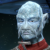

# High Ground (Part 5) 

 
<b>Session started at 2023-02-27 / 20:26</b>
 
Fen's StarTrekAdventures Ruleset (v1.1.1)  
*[Prioritized Source: File; Other Sources: Vault]* 
*Core RPG ruleset (2023-02-23) for Fantasy Grounds
Copyright 2023 Smiteworks USA, LLC* 
*Fen's NPC Portrait Workaround v2.2.2* 
*[Prioritized Source: File; Other Sources: Vault]* 
*Fen's STA House Rules (v1.0.1) * 

>INTERIOR -Bridge: As the ship continues to be rocked by disruptor blasts, the senior staff all rush back to their posts. Murry's new Jem'Hadar friends are escorted to the bridge on the captain's orders. And the crew must deal with the Jem'Hadar attack before the Lister is reduced to any more of a ruined heap than it already is. 

**Captain Baras:** We'll do introductions later, Murry do you think you can get your new friends to stop shooting us? 
**Captain Baras:** What happened to my face 
**Captain Baras:** Oh there it is 
**Hailey Murry:** We can give it a try, we won't be able to take much more of this.  
**Zox: [ PRESENCE  (10) +  CONN  (1)]
[Focus: Shipboard Tactical Systems ]
[Successes: 1] [Complications: 0]
Success with 0 momentum [d20 = 5]** 
**Hailey Murry: [ PRESENCE  (8) +  CONN  (3)]
[Successes: 2] [Complications: 0]
Success with 1 momentum [2d20 = 14]** 
**Second B'eor D'Tak:** I would not shed any tears if you all died 
**Second B'eor D'Tak:** But I see no reason to go out of my way to kill you 
**Second B'eor D'Tak:** Our comms were destroyed before we left 
**Skig:** Hardly a compelling argument, Jem'Hadar don't have tear ducts. 
**Second B'eor D'Tak:** Standard tactical procedure would be to repair weapons, shields and engines before communications 
**Second B'eor D'Tak:** I have completed my Alpha Quadrant psychographic training module. We have learned to use your idioms and expressions to taunt you and harm your morale 
**Skig:** Can we compare notes on that later, I think the order could be optimized. 
**Second B'eor D'Tak:** No 
*Skig has no morale, not sure what he is talking about, so ignores it.* 
**Skig:** Okay, your loss. 
**Second B'eor D'Tak:** We will be dead 
**Second B'eor D'Tak:** and so will you 
**Hailey Murry:** Well, that's perhaps not unexpected. I don't suppose we could send a message the hard way? Send out a boarding party to pass it on directly?  
>The Lister lurches again as another attack pounds the shields 

*Second B'eor D'Tak pulls out a small device* 
**Second B'eor D'Tak:** We have transporter return beacons 
**Second B'eor D'Tak:** But we cannot beam through your shields 
**Throk:** THROK VOLUNTEER TO GO TO JEM'HADAR SHIP. 
**Lt. Malat:** We can't lower the shields, the second we do those Jem'Hadar will obliterate us 
**Zox:** Can we make a small enough hole to beam through in a very small window of time? 
**Skig:** No problem, if you want to give me that, I can adjust it to bypass our shield modulation without lowering them, then recalibrate the shield modulation to use a different frequency. 
**Skig:** Worst case, you splatter like a bug on the inside of a windshield doing Warp 7. 
*Zox Is impressed with Skig's pragmatism, as always.* 
**Second B'eor D'Tak:** You Federations.. Always with your technological solutions 
*Second B'eor D'Tak hands over the device* 
**Throk:** THROK LOVE THESE ODDS! 
**Second B'eor D'Tak:** I would have lowered the shields, and if we died, we died 
**Skig:** Yes, but I would prefer the ship not take further damage while we are all dying. 
**Second B'eor D'Tak:** A ship is a tool 
**Second B'eor D'Tak:** And your ship is an old piece of shit 
**Second B'eor D'Tak:** Alpha Quadrang Psychographic training 
*Skig looks at Jem'Hadar.* 
**Second B'eor D'Tak:** To harm morale 
*Skig eyes twitch slightly.* 
**Second B'eor D'Tak:** Now do you understand furry one? 
**Skig:** Sure. 
**Hailey Murry:** If I can request to hold back on the proverbial pot shots while we're dealing with the literal ones, that would be fantastic 
*Zox appreciates this creature's keen tactical sense, it's _almost_ properly reptilian.* 
**Skig:** Do you know that combined pressure of 7.8 Frenzer on the back of your neck will make you lose total control of your bowels, then puke up all your ketracel white, then beg for forgiveness prior to expiration? 
*Skig takes device from Jem'Hadar and reconfigures it.* 
**Skig:** To Harm Morale. 
**Second B'eor D'Tak:** Jem'Hadar do not beg, and we do not seek your forgiveness 
**Skig:** That remains to be seen. 
**Skig: [ CONTROL  (11) +  ENGINEERING  (5)]
[Focus: Reverse Engineering ]
[Successes: 2] [Complications: 0]
Success with 1 momentum [2d20 = 26]** 
**Zox: [ DARING  (11) +  SECURITY  (4)]
[Focus: Espionage ]
[Successes: 4] [Complications: 0]
Success with 3 momentum [3d20 = 26]** 
**Zox: [ CONTROL  (11) +  SCIENCE  (4)]
[Focus: Shipboard Tactical Systems ]
[Successes: 3] [Complications: 0]
Success with 2 momentum [2d20 = 13]** 
**Skig: [ CONTROL  (11) +  ENGINEERING  (5)]
[Focus: Reverse Engineering ]
[Successes: 2] [Complications: 0]
Success with 1 momentum [2d20 = 23]** 
**Captain Baras:** How many people can this gadget of yours take? 
**Hailey Murry:** Second B'eor D'Tak, what would you recommend for the best materials to send over with you?  
**Second B'eor D'Tak:** Four, it is only meant to take me and my men 
**Captain Baras:** I'm coming with you then 
**Captain Baras:** I won't order someone else to beam into a Jem'Hadar ship alone 
**Captain Baras:** Besides, if they don't stop shooting we're all dead anyways 
**Throk:** Throk think it not best idea for honourable Captain to die horribly alone away from loving grandchildren as Lister is sucked into Event Horizon. 
**Second B'eor D'Tak:** Why do you spend so much time complaining about your deaths? 
**Second B'eor D'Tak:** Prepare yourself 
**Throk:** Throk think Murry already proven to have both mental good smarts and psychotic brutality to adapt well to Jem'Hadar lifestyle. 
*Second B'eor D'Tak pulls out the transponder and stands next to the captain* 
**Hailey Murry:** We can either prepare ourselves for it as if it's inevetable or take action to change things 
**Hailey Murry:** I can go with you, captain, if there's no objections.  
*Skig scribbles down note for Throk to be the next ship counselor if Murry dies.* 
**Captain Baras:** Always good to have some company when beaming into your probably death 
Masakari (Ishemok): Throkk is a walking Cheshire Fourth Wall 
**Hailey Murry:** We'll also want to reach out to the Federation ship to beam them updates.  
*Second B'eor D'Tak activates the transporter beacon with Captain Baras, Hailey Murry and Throk* 
>The bridge of the Jem'Hadar ship is even more of a mess than the Lister, as the Jem'Hadar seem to have foregone all repair efforts except for the weapons and tactical systems 

>Damaged optical lines, severed power lines, and ruptured EPS conduits are strewn about the deck.  

*Ishemok considers trying to sell packets of non-dairy coffee creamer as ketracel white to the Jem'Hadar.* 
>When the away team materializes, nearby Jem'Hadar pull out their disruptors immediately 

**First Taran K'lor:** What is the meaning of this, you are supposed to die before you are captured 
*Throk does not reciprocate, as "We come in peace" seems to have been the expected response.* 
*Second B'eor D'Tak pulls out his own disruptor and holds it to Murry's head* 
**Second B'eor D'Tak:** As you can see, I have not been captured 
**Throk:** I agree, mighty Jem'Hadar warrior definitely not captured. 
**Second B'eor D'Tak:** But there are some... developments that you must know of 
**Throk:** Also true. 
**Second B'eor D'Tak:** Human, speak 
*Second B'eor D'Tak puts the data crystal containing Murry's historical records into the computer so the First can see* 
*Throk offers ketracel white coated popcorn to nearest Jem'Hadar who is not labeled "First" or "Second.* 
**Hailey Murry:** The time dilation caused by the black hole means that you're a few years behind. With your permission, your second in command has records for the results of the war and the armistace 
**Hailey Murry: [ INSIGHT  (12) +  CONN  (3)]
[Successes: 2] [Complications: 0]
Success with 1 momentum [2d20 = 42]** 
**Captain Baras:** I have come myself as a show of good faith. My officers and your second speak the truth. There is no need for all of us to die out here pointlessly. 
**Throk:** Throk have several knives to assist if people need pointed death. Even have Poinard for Murry Poignant death scene. 
**First Taran K'lor:** I doubt your veracity 
*First Taran K'lor puts his disruptor away* 
**First Taran K'lor:** Second, you will stay with this captain 
**First Taran K'lor:** If they betray us, kill him 
**Second B'eor D'Tak:** Victory is life 
**Throk:** Throk can vouch for Captain, Captain have absolutely no veracitic genes in entire DNA system, only geriatric ones. 
**Captain Baras:** Ah yes, the glorious victory of a genetically engineered super soldier vs. an old man 
>♫♫♫Lighthearted Music Sting♫♫♫ 

>---------CUT TO COMMERCIAL------- 

**Zox: [ INSIGHT  (8) +  SECURITY  (4)]
[Focus: Espionage ]
[Successes: 1] [Complications: 0]
Success with 0 momentum [2d20 = 29]** 
>INTERIOR -Briefing Room: The senior staff (minus Bachar) gather in the briefing room, with Second B'eor D'Tak still hovering around near the Captain, to figure out their next move. Now that the immediate risk of death at the hands of the Jem'Hadar has been averted. 

**Kolea: [ DARING  (9) +  MEDICINE  (4)]
[Focus: First Aid ]
[Successes: 3] [Complications: 0]
Success with 2 momentum [2d20 = 10]** 
**Ishemok: [ DARING  (10) +  CONN  (3)]
[Focus: Klingon calisthenics ]
[Successes: 3] [Complications: 0]
Success with 2 momentum [2d20 = 9]** 
**Throk: [ DARING  (9) +  SECURITY  (4)]
[Successes: 2] [Complications: 0]
Success with 1 momentum [2d20 = 20]** 
Masakari (Ishemok): Low Low rolls! Tonight only! 
*Cmdr Bachar returns to the briefing room covered from head to toe in firefighting foam* 
**Cmdr Bachar:** Don't ask 
**Kolea:** Throk offer to lick off, but Kolea say it not healthy. 
**Throk:** Throk offer to lick off, but Kolea say it not healthy. 
*Zox Looks at Bachar.* 
*Cmdr Bachar stands instead of sitting to avoid making the chairs dirty* 
**Zox:** There was a FIREFIGHT! 
**Kolea:** Yes Throk, also, you aren't supposed to steal my lines. 
**Captain Baras:** After this briefing, perhaps you should find a working sonic shower and a clean uniform Commander 
**Cmdr Bachar:** Aye captain 
**Throk:** Throk only know, Kolea OnlyFans has 40x the subscriber viewership of this show. He must work as Night Shift Security Guard in Museum to pay bills. Maybe some day movie get made about this. 
**Captain Baras:** Well thank you Mr. Throk, for bringing the Commander back 
**Captain Baras:** You're dismissed, this is a senior staff briefing. As to that: what's our next move? 
*Throk leaves when instructed.* 
**Captain Baras:** We still have a second Jem'Hadar fighter and the Crazy out there 
*Kolea goes off to render "first aid" as needed.* 
**Hailey Murry:** Have we should hail the Crazy Horse already?  
**Second B'eor D'Tak:** Our wing had three fighters, not two 
**Hailey Murry:** Have we hailed the Crazy Horse already?  
**Lt. Cmdr Viraseti:** They are currently still outside our warp bubble 
**Zox:** Hailing the Crazy Horse would be very difficult, considering warp logistics and our own subspace bubble. 
**Lt. Cmdr Viraseti:** They are still experiencing high levels of time dilation, and will continue to do so until we get close enough 
**Hailey Murry:** Okay, so not much of a chance for them to come swooping in. How are the repairs coming along?  
**Skig:** We have maneuvering thrusters, so movement at any speed in any direction is problematic. 
**Second B'eor D'Tak:** Our ship has engines, but our warp core is destroyed. We must remain inside your warp bubble or become trapped again 
**Skig:** And fixing that is going to require taking the warp drives offline, which will cause us to get stuck in the same time dilation we were trying to avoid. 
**Zox:** Although this seems cold blooded, it may be best to prioritize the Lister and whatever Jem'Hadar ships to safety before recovering the Crazy Horse and Missing Fighter #3. Time dialation means a fully fit vessel may recover them later at less risk. 
**Hailey Murry:** Can we get ourselves out of the gravity well with just the maneuvering thrusters?  
**Skig:** In approximately... 114 years 
**Hailey Murry:** Ugh 
*Skig looks at Zox.* 
**Hailey Murry:** Can we get ourselves to the Crazy Horse?  
**Captain Baras:** I agree with Zox, we need to rescue ourselves before we worry about the Crazy Horse and the other Jem'Hadar 
*Skig sighs.* 
**Lt. Malat:** It isn't quite that simple sir. Orbital mechanics don't allow that 
**Lt. Malat:** We can't move in arbitrary directions this deep in the gravity well with only impulse 
**Lt. Malat:** There's no path we can take to get out of the gravity that won't cause our warp bubble to intersect the Crazy Horse and the other Jem'Hadar fighter 
**Skig:** We have no sensors, our superstructure is crippled without serious repair options. Impulse and Warp I might be able to cobble something together for a short period of time. 
**Zox:** Would it expedite or enable repairs if the Jem'Hadar abandon one of their attack vessels as salvage and come aboard the Lister? 
**Skig:** Brutal, cold blooded lizard reality? 
**Second B'eor D'Tak:** We have engines and weapons, but our sensors and shields are completely destroyed 
**Zox:** Yes. =D 
**Zox: [ INSIGHT  (8) +  ENGINEERING  (4)]
[Focus: Shipboard Tactical Systems ]
[Successes: 2] [Complications: 0]
Success with 1 momentum [2d20 = 16]** 
**Second B'eor D'Tak:** I do not know if our systems are compatible enough that you could repair your ship with our parts 
**Skig:** Our best option might be to see what we can cobble together from scavenging parts off the Jem'Hadar fighter to get the Lister able to reach the Crazy Horse as we drift in that direction. 
**Second B'eor D'Tak:** And First Taran K'lor is not about to allow that without a fight 
**Hailey Murry:** Is there only one other Jem'Hadar ship in here?  
**Second B'eor D'Tak:** Our attack wing had three  
**Hailey Murry:** Do you mean to say that he would not allow that, or that we would have to duel him first?  
**Second B'eor D'Tak:** Moments before you arrived, one of our ships dissapeared from our scopes 
**Second B'eor D'Tak:** We assumed you had destroyed them 
**Zox:** Yah but you aren't going to find a glorious end against either boredom or a black hole. Your best bet is getting out of this. 
**Hailey Murry:** Hold on, when you say moments, do you mean seconds or minutes?  
**Second B'eor D'Tak:** Our sensors detected a Starfleet warp signature for a split-second, then our third craft vanished. You arrived a few seconds later 
**Skig:** Wait, Second, do you have a functional tractor beam? 
**Second B'eor D'Tak:** Yes, our tractor beam is operational 
**Skig:** You have engines, correct? 
**Second B'eor D'Tak:** Yes 
**Second B'eor D'Tak:** Impulse power 
**Skig:** You are inside our warp bubble 
**Hailey Murry:** We were attracted to the system here because we detected a Traveller-style warp bubble signature. It's possible that they got pulled out by someone or something else before we arrived.  
**Lt. Malat:** But he said it was a Starfleet warp signature, if it was a Starfleet ship why would they rescue a Jem'Hadar fighter and not the Crazy Horse? 
**Zox:** 's ears begin to leak smoke as he contemplates time-paradoxes 
*Zox 's ears begin to leak smoke as he contemplates time-paradoxes* 
**Zox:** Insufficient information. 
**Skig:** Okay, Franken-ship time. We have functional shuttlecraft we can deploy and attach to the Jem'Hadar ship via magenetic grapples. They can use their sensors to feed the Jem'Hadar fighter and the Lister with what they can pick up. The Jem'Hadar fighter will pull the Lister via tractor beam to keep the entire collection of Orky Space Hulk within the Time Dilation Bubble. Then we push towards the position of the Crazy Horse. 
**Cmdr Bachar:** I agree with Zox, let's file that away under "fascinating but not relevant to our current predicament" 
**Skig:** At the point where we have a functional Crazy Horse to work with, we can revisit how to get everyone out of the Black Hole gravitic fields, assuming they are not comparably damaged and we are all stuck scavenging for making an even larger Orky Space Hulk. 
**Cmdr Bachar:** Skig that may be the craziest plan you have suggested yet. And I am including the ones where you want to sacrifice the crew to save the ship 
**Captain Baras:** Do you have a better idea? 
**Hailey Murry:** Which is closer to us, the Crazy Horse or the other Jem'Hadar ship?  
*Cmdr Bachar grumbles* 
**Zox:** I think it is up to the captain to decide, but we should save ourselves and send in a more capable ship to rescue the Crazy Horse, which has been stuck here for years 
**Lt. Cmdrs 11 and 10:** We currently have no working sensors, but last time we had a positional scan the Jem'Hadar fighter was aft of the Crazy Horse, 60,000 km nearer to us 
**Hailey Murry:** If we can get within range of the Crazy Horse, it can do a better job pulling us.  
**Lt. Malat:** We'll need to get within comms range and somehow convince both ships not to fire before they blast us out of the sky 
**Zox:** Well, we can convince the Crazy Horse, but Second B'eor D'Tak or First Taran K'lor would be best to convince the last Jem'Hadar Vessel 
**Hailey Murry:** Correct. I think a Jem'Hadar ship towing the Lister would probably give them reason to pause 
**Zox:** Also, it's easy to get a signal to the Crazy Horse, I've already calculated a way to time it to hit when our warp bubble intersects theirs. 
**Hailey Murry:** Though I'm not sure about the Crazy Horse.  
**Second B'eor D'Tak:** Our ship will ignore any comms from your vessel, and our communications are destroyed 
**Zox:** I sent a distress signal 2.5 scenes ago, as is compliant with Star Fleet Policy on entering deadly combat unilaterally. 
**Second B'eor D'Tak:** I will beam to their bridge and order them to stand down, and if they do not I will kill their First and take command 
**Zox:** Superb! 
*Throk wishes he was there, because that is exactly how a Gorn would do it also and he would 100% support this plan.* 
**Zox:** We can send a second signal to overlap to the first quite easily. We just need to start working on repairs. 
**Captain Baras:** Ok, we're probably going to all die together, but Skig's crazy idea is the only one I've heard 
**Captain Baras:** So let's get moving 
**Skig:** I was hoping someone had a better idea. 
**Captain Baras:** Who is piloting the shuttle craft to provide the sensor relay? 
indarien (Skig): If only we had rolled up a large number of pilots.... oh wait... 
**Ishemok:** Pilot, Ready for Orders! 
**Mowus:  [d20 = 9]** 
**Captain Baras:** Let's get moving, get 2 pilots to the shuttles, and we'll need someone on comms to send an update to the Crazy Horse.  
**Kurij:** Ready to pilot as well!  
*Ishemok looks at Skig * 
**Captain Baras:** Great meeting, let's try not to die in the next 10 minutes 
*Throk is not convinced that request is at all achievable.* 
**Captain Baras:** Everyone get to it, Commander Bachar... Go get washed off and get a clean uniform 
**Ishemok:** O'k warbozz Skig, I iz gonna pilot dis fing, but dere' betta be some shiny bitz were dis WAAAGH goin. 
**Ishemok:** Oh...sorry. You mentioned Space Hulk. Happens. 
>♫♫♫Dramatic Music String♫♫♫ 

>---------CUT TO COMMERCIAL------- 

**Ishemok: [ CONTROL  (9) +  CONN  (3)]
[Focus: Airplane Pilot ]
[Successes: 3] [Complications: 0]
Success with 2 momentum [2d20 = 12]** 
**Skig:** Just don't get kissed by any Genestealers. 
**Zox: [ CONTROL  (11) +  ENGINEERING  (4)]
[Focus: Shipboard Tactical Systems ]
[Successes: 2] [Complications: 0]
Success with 1 momentum [2d20 = 19]** 
*Zox Structurally Stabilizing Shaped Forcefield Deployment* 
*Skig works out the optimal way to generate the equivalent of "tractor grease" to allow inertia dampening and keep the speed consistent for the Lister and Jem'Hadar ship.* 
**Skig: [ CONTROL  (11) +  ENGINEERING  (5)]
[Successes: 1] [Complications: 0]
Success with 0 momentum [2d20 = 28]** 
**Hailey Murry: [ DARING  (11) +  SCIENCE  (5)]
[Successes: 1] [Complications: 1]
Success with 0 momentum [2d20 = 24]** 
*Captain Baras takes his seat now that his crew have had time to prepare for their plan. * 
**Captain Baras:** Second, take us out. Malat, try to keep us steady with thrusters 
**Throk:  [2d20 = 26]** 
**Kurij: [ CONTROL  (11) +  CONN  (4)]
[Successes: 3] [Complications: 0]
Success with 2 momentum [2d20 = 8]** 
>The Jem'Hadar fighter begins to pull the Lister with its tractor beam. The shuttlecraft are providing navigational tracks, and the crew are barcing themselves for a rough ride 

**Zox:  [d20 = 3]** 
**Hailey Murry: [ CONTROL  (8) +  ENGINEERING  (2)]
[Successes: 3] [Complications: 0]
Success with 2 momentum [2d20 = 8]** 
**Hailey Murry:** Hailey to Lister, the tractor beam is destabilizing the forward hull. We'll need to reinforce it immediately to prevent a breach 
**Ishemok:** Very well! 
**Skig: [ DARING  (9) +  ENGINEERING  (5)]
[Focus: Emergency Repairs ]
[Successes: 2] [Complications: 1]
Success with 1 momentum [2d20 = 21]** 
**Zox: [ DARING  (11) +  ENGINEERING  (4)]
[Focus: Shipboard Tactical Systems ]
[Successes: 0] [Complications: 0]
Failed on DC: 1 [d20 = 19]** 
**Skig:  [d100 = 49]** 
**Zox:  [d100 = 54]** 
>A horrible sound is heard as the forward hull is ripped apart, and a large portion of Deck 6 is blown out to space. 

**Hailey Murry: [ DARING  (11) +  CONN  (3)]
[Successes: 3] [Complications: 0]
Success with 2 momentum [2d20 = 3]** 
**Skig:** My favorite duct tape roll was there. 
**Hailey Murry: [ DARING  (11) +  CONN  (3)]
[Successes: 0] [Complications: 0]
Failed on DC: 1 [3d20 = 50]** 
**Ishemok: [ DARING  (10) +  CONN  (4)]
[Successes: 1] [Complications: 0]
Success with 0 momentum [d20 = 10]** 
**Skig:  [d6 = 5]** 
**Hailey Murry:  [d6 = 3]** 
*Hailey Murry tries to beam aboard Kolea, centering her sensors on her comm badge. An empty uniform appears on the deck, filling the room with awkward silence* 
**Captain Baras:** At least she died like she lived, nude 
*Kolea is actually not dead. Obviously just her uniform and her comm badge were spaced.* 
**Kolea:  [d6 = 4]** 
**Cmdr Bachar:** No time to mourn now, the Crazy Horse and the Jem'Hadar fighter are about to cross into the warp bubble 
*Throk is now completely convinced the show will be cancelled next week, as the primary audience draw for males aged 10-85 has died.* 
**Throk:  [d20 = 2]** 
**Cmdr Bachar:** Zox, Second, you're up 
**Cmdr Bachar:** You go do whatever Jem'Hadar bullshit you're planning to do 
**Zox: [ DARING  (11) +  SCIENCE  (4)]
[Focus: Shipboard Tactical Systems ]
[Successes: 1] [Complications: 0]
Success with 0 momentum [2d20 = 29]** 
**Throk:  [2d20 = 22]** 
**Zox:  [d20 = 15]** 
**Zox:** Ah ha! Finally I have mastered Temporal Parabolic Subspace communications! 
**Skig: [ DARING  (9) +  ENGINEERING  (5)]
[Successes: 2] [Complications: 0]
Success with 1 momentum [2d20 = 19]** 
**Throk:** We are getting a cross-system power spike, everyone in contact with the floor is about to take 20,000 Amps. 
**Skig:** We are getting a cross-system power spike, everyone in contact with the floor is about to take 20,000 Amps. 
*Captain Baras kicks his feet up onto the arm of his chair* 
*Zox grabs the ceiling and tells everyone else to do likewise.* 
*Cmdr Bachar hops up into a squat on her seat* 
**Zox: [ FITNESS  (9) +  SECURITY  (4)]
[Focus: Endurance ]
[Successes: 3] [Complications: 0]
Success with 2 momentum [2d20 = 9]** 
indarien (Skig): So can she shunt/redirect it to somewhere that is not dangerous to the Lister, like the Mess Hall? 
*Zox skitters on the deck ceiling * 
*Zox blinks like a confused gecko* 
**Skig: [ DARING  (9) +  ENGINEERING  (5)]
[Focus: Emergency Repairs ]
[Successes: 2] [Complications: 0]
Success with 1 momentum [3d20 = 42]** 
**Skig: [ DARING  (9) +  CONN  (2)]
[Successes: 0] [Complications: 0]
Failed on DC: 1 [2d20 = 30]** 
**Zox: [ REASON  (7) +  SCIENCE  (4)]
[Focus: Xenobiology ]
[Successes: 1] [Complications: 0]
Success with 0 momentum [2d20 = 20]** 
**Zox: [ FITNESS  (9) +  SECURITY  (4)]
[Focus: Endurance ]
[Successes: 2] [Complications: 0]
Success with 1 momentum [2d20 = 18]** 
>Skig attempts to leap over to the power distribution station, but she forgot that her chair had wheels, so it slipped out from under her when she tried to push off it. Fortunately, Zox suddenly remembered that his species has a prehensile tail that's never come up before, and was able to swing her over safely before she took 8d6 of damage with Vicious 2 

**Zox:** I've got ya, Skig! 
**Zox:** Quickly, to the relay! 
>As the electricy faides from Skig's quick repair, everyone puts their feet back down except for Captain Baras 

**Skig:** Thank you Zox, I'm amazed your tail is capable of holding me. 
**Captain Baras:** This is actually pretty comfortable, I think I'll have Skig install a permanent footrest when we are out of here 
**Zox:** Voth are the true feat of Engineering. 
**Lt. Malat:** At least the Crazy Horse and the Jem'Hadar aren't firing on us 
**Lt. Malat:** That's a good sign 
**Skig:** Are they also not firing on each other? 
**Captain Baras:** Good question, Murry? 
**Skig:** Murry, can you get an idea what damage the two ships have sustained? 
**Hailey Murry: [ DARING  (11) +  CONN  (3)]
[Successes: 2] [Complications: 0]
Success with 1 momentum [2d20 = 20]** 
**Hailey Murry:  [d20 = 15]** 
**Hailey Murry:  [d100 = 9]** 
**Hailey Murry:** Scanning now, give me just a moment 
>Throk and Ishemok notice that Murry seems to freeze mid word 

>Her hand hanging just above the sensor panel, motionless 

**Ishemok:** Awaiting further instructions! 
**Throk:** Throk think she slip into brain aneurysm from too much violence. This can only be solved by Extreme Vogon Poetry recitation to force mental calibration. 
**Throk:** Ishemok, cover ears to avoid brains leaking out nostrils. 
**Hailey Murry: [ FITNESS  (7) +  MEDICINE  (3)]
[Successes: 2] [Complications: 0]
Success with 1 momentum [2d20 = 14]** 
*Ishemok puts industrial strength Ferengi Earplugs in. Vogon Poetry! Ye gads! * 
**Throk: [ INSIGHT  (9) +  CONN  (3)]
[Focus: Poetry ]
[Successes: 3] [Complications: 0]
Success with 2 momentum [2d20 = 27]** 
*Throk recites epic Vogon Poetic Ballad about clumps of mucous floating free in the vacuum of space to inspire Murry to superior acts of bravery.* 
*Throk failing that, smack her with large wooden chair.* 
**Throk: [ DARING  (9) +  MEDICINE  (1)]
[Successes: 0] [Complications: 0]
Failed on DC: 1 [2d20 = 24]** 
*Throk is not qualified to be Nurse Throk.* 
*Hailey Murry stands with her hand over the sensor panel, not reacting at all to Throk's poetry* 
**Ishemok: [ INSIGHT  (9) +  SCIENCE  (2)]
[Focus: Airplane Pilot ]
[Successes: 1] [Complications: 0]
Success with 0 momentum [2d20 = 24]** 
**Throk: [ FITNESS  (10) +  SECURITY  (4)]
[Focus: Animal Training ]
[Successes: 3] [Complications: 0]
Success with 2 momentum [3d20 = 30]** 
*Throk gives Hailey Murry mouth to nose rescucitation.* 
**Throk:** Throk know this work on Gorn Capariabie Herd Animals when their brains get stuck. Most reinflate brain to make synapses work again. 
**Throk:** Sometimes they hit head to hard and cause brain goo to squish down and suppress autonomous response. 
**Throk:** Also, fun to blow in nose and make them pass large gouts of greenish farts. 
**Cmdr Bachar:** What in the hell is going on over there 
**Cmdr Bachar:** Does anyone have any idea what the fuck Throk is talking about? 
*Throk responds to Commander Bachar.* 
**Ishemok: [ INSIGHT  (9) +  MEDICINE  (1)]
[Focus: Airplane Pilot ]
[Successes: 1] [Complications: 0]
Success with 0 momentum [2d20 = 20]** 
**Ishemok:  [d20 = 10]** 
**Throk:** Hailey Murry suffering intense brain anuerysm of some type, not responding to stimuli. Throk suspect her poor childhood upbringing and alcoholic tendencies are manifesting under pressure. 
**Throk:** Clearly she needs 9-5 job working as desk clerk in Starfleet Massage Parlor, not in stressful situation like this. 
**Ishemok:** The best obvious way to deal with this is to move one of the patches of frozen time right over her. 
**Throk:** Throk second this plan, it sound much better than drilling holes in her head to let demons out. 
**Hailey Murry: [ FITNESS  (7) +  MEDICINE  (3)]
[Successes: 0] [Complications: 0]
Failed on DC: 1 [2d20 = 36]** 
**Ishemok: [ DARING  (10) +  MEDICINE  (1)]
[Successes: 3] [Complications: 0]
Success with 2 momentum [3d20 = 22]** 
**Skig:** Throk fly ship while Ishemok do smart things. 
**Throk:** Throk fly ship while Ishemok do smart things. 
>Ishemok pulls an ODN line out from the console and shocks Hailey Murry across her prefrontal cortex. Miraculously, this somehow revives her instead of killing her instantly with complications 

**Hailey Murry:** agakjsdfljwe 
**Ishemok:** You are back! 
*Hailey Murry collapses on the ground, grabbing her face* 
**Hailey Murry:** What the hell was that?  
**Ishemok:** 2 shots of Vodka, Stat! 
**Throk:** Nonsense. 
**Throk:** Throk solves this problem in normal Gorn way. 
**Ishemok:** Here, take these, we have work to do! No time to explain! 
**Throk:** Gorn urine is 160 proof, will give Murry Golden Shower to drink. 
**Cmdr Bachar:** I am requesting a transfer 
**Hailey Murry:** Throk, I will space you 
*Ishemok Briefly considers marketing Gorn Urine.* 
**Cmdr Bachar:** YOU ARE ON AN OPEN COMM LINE 
*Skig looks at Bachar.* 
**Cmdr Bachar:** PROFESSIONALISM 
*Hailey Murry pulls herself up* 
**Hailey Murry:** What hit me?  
**Throk:** Not Throk. 
**Lt. Malat:** Based on the audio, Gorn pee 
**Hailey Murry:** Thank goodness for that 
**Cmdr Bachar:** The next person that talks about urine is getting night shift duty for the next month 
*Throk looks up Starfleet Regulartions for requirements to transfer rest of crew to other ship.* 
*Zox contemplates the meaning of night-shift with no clear day cycle.* 
*Skig looks up Starfleet Regulartions for requirements to transfer rest of crew to other ship.* 
**Hailey Murry:** Okay, let me see if I can actually get my scan here 
*Skig contemplates if Night-Shift would actually be an improvement over current workload.* 
*Throk contemplates if Night-Shift would actually be an improvement over current workload.* 
**Zox:** I know working for Captain Baras is hard, but would you work harder for Captain Morgan? 
**Hailey Murry:** So both ships have stopped firing on each other. That's good. The downside is that they're in rough shape 
**Throk:  [d20 = 3]** 
**Throk:  [d20 = 18]** 
>Suddenly, the tractor beam cuts out 

>First Taran K'lor and several of his men materialize on the Lister bridge 

**First Taran K'lor:** How well are your shields working? 
**Zox: [ CONTROL  (11) +  ENGINEERING  (4)]
[Focus: Shipboard Tactical Systems ]
[Successes: 3] [Complications: 0]
Success with 2 momentum [2d20 = 9]** 
**Zox:** Holding at 15% 
**Captain Baras:** Why do you ask? 
**First Taran K'lor:** No reason 
**Zox: [ CONTROL  (11) +  ENGINEERING  (4)]
[Focus: Espionage ]
[Successes: 1] [Complications: 0]
Success with 0 momentum [2d20 = 34]** 
>On the viewscreen, the First Taran K'Lor's Jem'Hadar fighter explodes in a violent warp-core breach, at this range, the explosion violently rocks the Lister, throwing the crew to the deck 

**Hailey Murry:** Hey, Throk, why is there ominous music playing? 
>♫♫♫Ominous Music Sting♫♫♫ 

>---------CUT TO COMMERCIAL------- 

Masakari (Zox): 'I was promised trolley problems in space' 
**Skig:  [d100 = 24]** 
