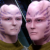
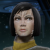

# Children of the Beast that Dodged the Abortion (Part 4) 

 
<b>Session started at 2023-12-05 / 04:08</b>
 
Fen's StarTrekAdventures Ruleset (v1.1.4)  

>INTERIOR - Drug Lab Maintenance Causeway: As Zox and his team begin to climb the narrow ladder up towards the next deck they hear a whoosh from beneath them. Ablast door seals off ahead, just beyond the hatch to level 2. From beneath them, deep in the belly of the facility, a roiling bubbling mass of burning, reacting chemicals begins to churn up from underneath, filling the causeway as it belches and foams with heat, bathing the causeway in a sickly orange glow. 

**Dr. Malov:** With the power down, the chemical containment must have also failed. Causeway A is used as an emergency vent for chemical byproducts 
**Dr. Malov:** I recommend we exit the causeway 
*Lt. Malat tugs at his collar nervously* 
*Dr. Malov tugs at his collar nervously* 
**Kolea:** I agree with the good doctor's assessment of the situation. 
>[ROUND 1] 

**Kolea:** Dr Malov, is there a blast door between us and the chemicals below us? 
**T'kor:** If we close the blast door below us, how long until the pressure goes critical? 
**Hailey Murry:** If we close the blast door below us, how long until the pressure goes critical? 
**Kolea:** I see the lights indicating that there is a blast door there. 
**Kolea:** Can we vent the pressure a different direction? 
**Dr. Malov:** I don't know, I'm a scientist not an engineer 
**Dr. Malov:** I stay away from boiling chemical waste 
**Kolea:** You know, like when you have a clogged artery and you slice it and cause blood to spray four meters in a different direction while tears shoot out the side of my eyes like I somehow have high pressure hoses attached to my tear ducts. 
>[TURN] Hailey Murry 

**Zoxar:** Okay, is there something that will quench the reaction? 
*Kolea just finished voice acting some Hentai, knows all about anime solutions for this problem.* 
**Dr. Malov:** well, the chemicals used in the refinement are predominantly alkaline, so if you had a sufficient quantity of a powerful acid, you might be able to neutralize them 
**Dr. Malov:** But I forgot to bring 600 gallons of HF with me today 
**Hailey Murry:** We'll need a whole lot of them, though, given how quickly they're filling iup 
**Hailey Murry: [ DARING  (10) +  ENGINEERING  (2)]
[Successes: 2] [Complications: 0]
Success with 1 momentum [2d20 = 16]** 
**Kolea:** If it is Al Kaline, perhaps we could just retire his jersey and he will leave us alone? 
KruschtyaEquation (Hailey Murry): ^Paranoia vibes 
**Zoxar:** Wait, if you remove Al Kaline, does that reduce the team size? 
>Murry rips off the unpowered door control panel to reveal a manual release beneath and begins pumping it, the door slowly begins to ratchet closed 

**Kolea:** Wait a minute....are you using a long narrow hard thing in a stroking motion? 
**Kolea:** I've GOT THIS! 
**Kolea: [ DARING  (9) +  MEDICINE  (4)]
[Focus: "Diplomacy" ]
[Successes: 0] [Complications: 0]
Failed on DC: 1 [d20 = 16]** 
>[TURN] Kolea 

**Kolea:** Hmm...oh, I need to get on it like this. 
**Throk:** Throk question why Censor bar always appear in scene with Kolea. But Throk too young to understand. 
>As Kolea and Murry are pumping the door control, the chemical waste continues rising, faster than they seem to be getting the door closed 

>[TURN] Zoxar 

**Zoxar: [ DARING  (12) +  CONN  (1)]
[Focus: Endurance ]
[Successes: 1] [Complications: 0]
Success with 0 momentum [2d20 = 30]** 
**Zoxar:** Up the tube!  
>[TURN] K'Tat Denellan 

>K'Tat shimmies over to the door to the third floor and begins trying to open it, but he doesn't manage to get it open 

**K'Tat Denellan:** I'm getting out of here  
>[TURN] Lt. Cmdrs 11 and 10 

>[TURN] Dr. Malov 

**Kolea:  [Total: 3] [Effects: 2] [4dChallenge = 3]** 
**Zoxar:  [Total: 2] [Effects: 0] [dChallenge = 2]** 
**Kolea:  [Total: 0] [Effects: 0] [2dChallenge = 0]** 
**Kolea:  [Total: 3] [Effects: 1] [3dChallenge = 3]** 
**Hailey Murry:  [Total: 2] [Effects: 1] [3dChallenge = 2]** 
**Hailey Murry:  [d20 = 4]** 
**Kolea:  [d20 = 1]** 
>As the chemicals bubble and roil beneath the team, a large glob of goo erupts from a bubble bursting and flies up the shaft, landing on K'Tat and giving him a painful burn on his back 

>As he recoils in pain, he tumbles backwards down the column and begins to fall toward the chemicals below 

>[ROUND 2] 

>[TURN] Zoxar 

*Zoxar Spending 2 threat for Escalation.* 
**Zoxar: [ CONTROL  (11) +  SECURITY  (4)]
[Successes: 2] [Complications: 0]
Success with 1 momentum [2d20 = 28]** 
**Zoxar:** Go Go Gadget, Hook! 
>Zox fires his previously unestablished grapling hook, grabbing the falling K'Tat and begins to pull him back up to (relative) safety. 

>[TURN] K'Tat Denellan 

**Hailey Murry: [ FITNESS  (7) +  CONN  (3)]
[Successes: 0] [Complications: 0]
Failed on DC: 1 [2d20 = 25]** 
**Hailey Murry: [ FITNESS  (7) +  CONN  (3)]
[Successes: 1] [Complications: 1]
Success with 0 momentum [2d20 = 25]** 
Masakari (Zoxar): OH NOES 
**Hailey Murry:  [d20 = 3]** 
>As Murry turns to leave, she finds her foot has gotten wedged in the broken wall panel she had been standing against. The roiling mass of chemicals are now just centimeters away as she struggles to pull her leg free 

>[TURN] Hailey Murry 

**Zoxar:** 01, 10, I charged the vactation's forward flux array, use it to snag Hailey! 
**Lt. Cmdrs 11 and 10:** Aye sir 
**Lt. Cmdrs 11 and 10:** Most reckless, we are not surprised 
**Kolea:** For a second I thought he said, "Shag" and this became very weird. 
**Hailey Murry:  [Total: 2] [Effects: 0] [dChallenge = 2]** 
>The twins network themselves to the transport's control system and activate the tractor beam control program that Zox had pre-programmed. With their expert engineering skills, they are able to carefully pull Murry up the shaft with a delicate tractor beam deployment and not destroy the structural integrity of the entire building 

>[TURN] Lt. Cmdrs 11 and 10 

**Kolea: [ DARING  (9) +  ENGINEERING  (2)]
[Successes: 2] [Complications: 1]
Success with 1 momentum [2d20 = 21]** 
Masakari (Zoxar): BEST 
**Kolea:** Dr Malov, NOW is not the time to operate that lever! 
**Kolea:** I promise you, I will activate that lever all you want if we live through this. 
**Kolea:  [Total: 5] [Effects: 3] [6dChallenge = 5]** 
>As Murry floats up past the doorway Kolea snaps it shut behind her, using the power cell from the Twins' tricorder. 

>[TURN] Kolea 

>[TURN] Dr. Malov 

**Dr. Malov:** Whew, that was uncomfortably close 
**Hailey Murry:** You're telling me 
*Zoxar is impressed with the teams clear thinking and communication during a crisis.* 
>Kolea's tricorder suddenly chimes in: "Pika pika" 

**Kolea:** Why do I get the feeling I'm going to become the person who routinely has all the decent beings in my life who are not main character's die gruesomely just to add to an ever growing list of fatalities associated with one of the Values on my character sheet? 
>[ROUND 3] 

**Kolea:** Oh no! We are being attacked. 
**Kolea:** Wait. 
*Kolea checks temperature.* 
**Kolea:** Yep, not ovulating, definitely being attacked. 
**Hailey Murry: [ INSIGHT  (12) +  SECURITY  (2)]
[Successes: 1] [Complications: 0]
Success with 0 momentum [2d20 = 27]** 
**Hailey Murry:** Zox, K'Tat, hold on! 
**Hailey Murry: [ DARING  (10) +  SECURITY  (2)]
[Successes: 2] [Complications: 0]
Success with 1 momentum [2d20 = 20]** 
**Hailey Murry:  [Total: 3] [Effects: 1] [2dChallenge = 3]** 
**Hailey Murry:  [Total: 2] [Effects: 1] [2dChallenge = 2]** 
**Hailey Murry:  [Total: 1] [Effects: 0] [dChallenge = 1]** 
**Hailey Murry:  [Total: 4] [Effects: 1] [5dChallenge = 4]** 
>As Zox disconnects K'Tat from his grappling hook, Murry blasts them both with her wideband disruptor as the security camera next to them morphs off the wall and lashes out at them 

>[TURN] Goo 6 

*Kolea notes down, "Murry is again shooting someone who is her superior officer".* 
*Zoxar is rather upset that Murray didn't follow combat protocol with specific instructions to move away from friendly fire.* 
>With a gooey tentacle, it slams Zox's head into the ladder, ringing his bell but not killing him 

**Zoxar: [ DARING  (12) +  SECURITY  (4)]
[Successes: 0] [Complications: 0]
Failed on DC: 1 [2d20 = 37]** 
>[TURN] Zoxar 

*Zoxar bites at the air to no effect.* 
*Kolea pulls a giant starship sized Disruptor Cannon from between her breasts.* 
**Kolea:** Oh wait, not doing the anime thing anymore, nevermind. 
Masakari (Zoxar): The idea was that I could bite it, and swallow (don't get ideas Kolea!) and keep it in a 2nd/3rd stomach that would be wished into existance via an oposed to the writer check, per the episode were Morn ate latinum. 
**Zoxar: [ FITNESS  (9) +  MEDICINE  (1)]
[Focus: Xenobiology ]
[Successes: 1] [Complications: 0]
Success with 0 momentum [2d20 = 25]** 
**Hailey Murry: [ CONTROL  (8) +  SECURITY  (2)]
[Successes: 0] [Complications: 0]
Failed on DC: 1 [2d20 = 31]** 
>[TURN] Hailey Murry 

*Hailey Murry fires a focused blast from her type-1 phaser, but it strikes the wall beside the mimic* 
**Kolea: [ DARING  (9) +  MEDICINE  (4)]
[Focus: First Aid ]
[Successes: 1] [Complications: 0]
Success with 0 momentum [2d20 = 26]** 
>[TURN] Kolea 

>[TURN] Lt. Cmdrs 11 and 10 

**Zoxar:  [Total: 5] [Effects: 5] [6d6 = 5]** 
**Kolea:** Whoa whoa whoa there little ones. No punching extra holes in the walls. 
>The Twins pull out their disruptor and disinintigrate the creature, as it howls out in a blood-curdling sound 

**Lt. Cmdrs 11 and 10:** Oh, it appears we have inadvertently left the disruptor on its maximum setting 
**Kolea:** Hey, I see air quotes when you are talking. Is that normal? 
**Lt. Cmdrs 11 and 10:** We are not completely familiar with this style of disruptor 
**Kolea:** That is Breen for "Deep Fat Fry". 
**Zoxar:** Evidently they thought the worker negotiatons would go well. 
>[TURN] Dr. Malov 

**Kolea:** Zox, get that door open. 
**Dr. Malov:** I could not agree more 
*Dr. Malov attempts to gather a sample of the disintigrated changeling, but instead he inhales it, triggering an allergic reaction and causing him to start having a sneezing fit and drop his tricorder.* 
>[ROUND 4] 

**Zoxar:  [Total: 2] [Effects: 0] [dChallenge = 2]** 
**Kolea:  [Total: 0] [Effects: 0] [dChallenge = 0]** 
**Hailey Murry:  [Total: 1] [Effects: 1] [dChallenge = 1]** 
**Kolea:  [Total: 1] [Effects: 0] [dChallenge = 1]** 
**Hailey Murry:  [d20 = 17]** 
>[TURN] Zoxar 

**Zoxar: Zoxar has used a point of Determination to add a natural one to the dice pool.** 
**Zoxar: [ DARING  (12) +  SECURITY  (4)]
[Successes: 4] [Complications: 0]
Success with 3 momentum [2d20 = 25]** 
**Skig: [ CONTROL  (11) +  ENGINEERING  (5)]
[Focus: Security Systems ]
[Successes: 0] [Complications: 0]
Failed on DC: 1 [d20 = 18]** 
**Zoxar:** Rwarrrrr! 
*Throk feels inferior compared to the violence Zox has just inflicted on a blast door.* 
**Zoxar:  [Total: 6] [Effects: 3] [7dChallenge = 6]** 
>Zox pulls the door open with his suit, at great physical cost to himself and holds it open for the team to escape. As the door opens though, it turns out that a heavy crate was sitting on top of the door and it falls down onto Murry's head 

**Kolea:** I feel like I'm going to be busy shortly. 
**Hailey Murry: [ DARING  (10) +  CONN  (3)]
[Successes: 1] [Complications: 0]
Success with 0 momentum [2d20 = 31]** 
**Kolea: [ DARING  (9) +  MEDICINE  (4)]
[Focus: First Aid ]
[Successes: 0] [Complications: 0]
Failed on DC: 1 [2d20 = 31]** 
>As the team slip past him, Zox pulls himself up through the blast door and collapses to the deck, injured. 

**Kolea: [ DARING  (9) +  MEDICINE  (4)]
[Focus: First Aid ]
[Successes: 1] [Complications: 1]
Success with 0 momentum [2d20 = 27]** 
**Kolea:  [d20 = 6]** 
**Zoxar:  [d20 = 3]** 
**Zoxar:  [Total: 1] [Effects: 1] [dChallenge = 1]** 
>As Kolea administers first aid to Zox, she does stabilize his condition, but also accidentially drops a hypospray of corticosteroids into his eye, blinding him in his left eye 

**K'Tat Denellan:** I thought Starfleet was supposed to be competent 
**Kolea:** Don't worry, that will buff right out. 
*Kolea looks at K'tat.* 
**Kolea:** I am. 
**Zoxar:** You are still alive K'tat. You live by the skill of others. 
**Kolea:** What you don't realize is that Voth are limited by their left eye, which interferes with their ability to see a spread spectrum at the expense of better depth perception. By temporarily disabling his left eye he will better be able to spot incoming changelings. 
**Kolea: [ DARING  (9) +  MEDICINE  (4)]
[Focus: Xeno-biology ]
[Successes: 3] [Complications: 0]
Success with 2 momentum [2d20 = 10]** 
Masakari (Zoxar): yay! 
**Skig:** I'm not sure what just happened, but I think a Memory Alpha Wiki Editor just fell over dead. 
*Kolea looks imperiously at K'Tat.* 
>♫♫♫Lighthearted Music Sting♫♫♫ 

>---------CUT TO COMMERCIAL------- 

>INTERIOR - USS Excaliber: Malat, "Zox", T'Kor and Throk disembark Ol' Faithless on their secret orders from Bachar to commit espionage against a Starfleet Admiral. 

**Throk:** They have big shiny cave here. 
*Throk whistles appreciatively at what is an actual current generation starship with relevant technology.* 
*Throk checks to see if the lights turn off and on if he claps.* 
**Lt. Malat:** Yeah, these Excelsior class ships have big shuttle bays 
*Throk lead on angry and strict superior officer type person.* 
**Throk:** Lead on angry and strict superior officer type person. 
*Red Shirt approaches Zox with a padd in hand* 
*Throk stands at attention.* 
**Red Shirt:** What is your vessel or origin, and who is your communications for? 
*Throk resists urge to tear red shirt in half to see if it is not a changeling.* 
**T'kor:** We have an engineering report from Chief Engineer Skig for Engineering 
**Zox:** Our Vessel is the USS Lister, NCC-131616, here to deliver an engineering report from our Chief Engineer, Skig. 
**Red Shirt:** Hmmm. The Lister registry is NCC-13616 according to my files. Pretty suspicious that you don't know your own ship's registry... 
**Zox:** I just put an extra one in there, because I think we are number 1! 
**Throk:** That interesting, I thought it was NCC-1742? 
**Throk:** That original Constitution designation, did it get new desgination after being taken from salvage yard? 
*Throk looks at Redshirt.* 
**Red Shirt:** Makes sense, I'll just log you in the logbook and you can be on your way 
*Red Shirt squints at Throk* 
**Throk:** Good idea. Also, can you escort me to little Gorn room? I need to powder my eyes. 
**Red Shirt:** I didn't know there were Gorn in Starfleet.... 
**Throk:** I am visiting on work visa from Gorn homeworld. 
*Red Shirt walks away mumbling about "in my day"* 
**Zox: [ PRESENCE  (7) +  COMMAND  (4)]
[Focus: Starfleet Protocols ]
[Successes: 4] [Complications: 0]
Success with 3 momentum [2d20 = 4]** 
**Zox:** Ensign, Throk is an astounding citizen of the Federation.  
*Throk flexes impressively, likely tearing his uniform.* 
*Throk really hopes Malat is capable of doing ANYTHING useful.* 
**Throk: [ FITNESS  (10) +  CONN  (3)]
[Focus: Gorn-Fu ]
[Successes: 1] [Complications: 0]
Success with 0 momentum [2d20 = 24]** 
**Red Shirt:** Yessir, I'll make a note of that in the log 
*Red Shirt is visibly intimidated by the weird behavior of these Lister officers* 
**Zox:** Throk is a black-belt and a zen master. 
*Throk wonders if Red Shirt would constitute a hand weapon in the event of Throw Anything.* 
**Lt. Malat:** Ok, thank you ensign, let's be on our way now sir 
**Throk:** Throk go in search of little Gorn room. 
*Throk knows that he will be certain to attract CRAP LOADS of attention.* 
>As soon as they are out of the shuttle bay and out of earshot of any other security, Malat pulls Throk and "Zox" aside into a quiet corner 

*Zox lets out the wootle of intrigue.* 
**Lt. Malat:** Listen up you pair of absolute fucking morons, I don't want to get busted back to Ensign again for this shit, so you two shape it up and stop acting like idiots 
*Throk suspects that T'Kor is still hiding in Old Faithless.* 
**Throk:** Yes ma'am. 
**Zox:** If we dont' act like silly geese, they will suspect we arent't from the Lister. 
**Zox:** I just want to fit in. I was doing a pretty good job until someone cheated and cut off my hand. 
**Lt. Malat:** I hate that our ship is enough of a laughing stock to the fleet that your argument makes sense 
*Lt. Malat sighs* 
**Throk:** Throk suggest Malat go to ship cantina and pretend to bury misery of poor posting as a way to gather information from slightly inebriated crew? 
**Zox:** Baww. Wear the jester hat with pride.  
*Zox lets out the wootle of happiness.* 
**Lt. Malat:** Let's just get what we came for and get out before your luck runs out 
**Throk:** As Malat is clearly functional and intelligent officer, everyone will immediately commiserate with having to deal with us. 
**Throk:** At least, that Throk opinion of idea. 
**T'kor:** Would you like me to deliver the posting details and see if I might be able to glean any information from Engineering? 
**Zox:** Sure, here it is. 
**Throk:** That good idea, Throk think, but Throk not paid to think. 
**Lt. Malat:** That's probably wise, you are the engineer here aftter all 
**Throk:** Throk will go randomly wander around like lost country bumpikin and ask questions to gather information from crew. 
**Throk:** Throk also consider joining poetry contest on deck seven that he read about. 
**Zox:** It does seem strange they have to be so tight-lipped and opsec about shield modulation. 
**Lt. Malat:** What do you mean? 
**Lt. Malat:** The shield modulation details were in the mission brief 
**Zox:** It's just an angry pulsar or something....that sort of deflection shouldn't take hand-delievered messages? 
**Zox:** ah ha! I get it now. 
**Lt. Malat:** I wish real Zox was here... 
*Lt. Malat rubs her temple* 
*Throk rubs Lt. Malat's temples.* 
**Zox:** Do you though? Did you really want a wrestling match between Redshirt #123 and Zox? 
**T'kor:** Agreed, he'd be able to infiltrate the culinary division 
**Throk: [ FITNESS  (10) +  SECURITY  (4)]
[Focus: Gorn-Fu ]
[Successes: 3] [Complications: 0]
Success with 2 momentum [2d20 = 8]** 
*Lt. Malat slaps Throk's hands away* 
**Zox:** T'kor! Yay! That's a great cover story! 
**Lt. Malat:** I should have gotten the water bottle from Commander Bachar 
**Zox:** To the kitchen to find new and exotic dishes, and to boldly sautee like none have before! 
**Throk:** The way to a Gorn;s second stomach is with raw meat, at least, that is what hatching-mother said. 
**Lt. Malat:** Ok, set your chronometers. T'Kor can find what he can from Engineering, Throk can wander around and exploit people's natural tendency to want to be helpful to lost idiots 
**Throk:** Throk can do this! 
**Lt. Malat:** And you.... 
*Lt. Malat points at "Zox"* 
**Throk:** Throk pretend to carry heavy object into sensitive area and need someone to open door for him. 
**Lt. Malat:** Just... do something useful, I am going to get a drink 
**Throk:** Yay! Malat taking my advice. 
**Zox:** I can see being bitter at the Founders, but I am not one of them. lets be friends? 
**Throk:** This best away team mission ever. 
**Lt. Malat:** Meet in the observation lounge in 60 minutes 
**Zox: [ PRESENCE  (7) +  COMMAND  (4)]
[Successes: 2] [Complications: 0]
Success with 1 momentum [2d20 = 14]** 
**Skig: Skig has used a point of Determination to add a natural one to the dice pool.** 
**Throk: [ INSIGHT  (9) +  COMMAND  (2)]
[Focus: Poetry ]
[Successes: 2] [Complications: 0]
Success with 1 momentum [2d20 = 14]** 
**Throk:  [Total: 1] [Effects: 0] [4dChallenge = 1]** 
**Throk:  [Total: 3] [Effects: 3] [4dChallenge = 3]** 
**T'kor: [ INSIGHT  (7) +  ENGINEERING  (4)]
[Successes: 1] [Complications: 0]
Success with 0 momentum [2d20 = 21]** 
**Zox: [ PRESENCE  (7) +  SCIENCE  (3)]
[Focus: Transporters & Replicators ]
[Successes: 1] [Complications: 0]
Success with 0 momentum [2d20 = 26]** 
**Zox: [ PRESENCE  (7) +  SCIENCE  (3)]
[Focus: Transporters & Replicators ]
[Successes: 1] [Complications: 0]
Success with 0 momentum [26 = 26]** 
**T'kor: [ PRESENCE  (7) +  ENGINEERING  (4)]
[Successes: 0] [Complications: 1]
Failed on DC: 1 [2d20 = 37]** 
**Zox: [ INSIGHT  (9) +  SECURITY  (2)]
[Focus: Starfleet Protocols ]
[Successes: 1] [Complications: 0]
Success with 0 momentum [2d20 = 21]** 
**Throk:** GM: "Is Throk using human intelligence?" 
indarien (Throk): GM: "Is Throk using human intelligence?" 
indarien (Throk): No. He is using Gorn Intelligence. 
*Throk calls up Gorn Intelligence Services.* 
*Throk gets put on hold, wonders when they switched to a 900 number.* 
**Zox: [ PRESENCE  (7) +  SECURITY  (2)]
[Focus: Starfleet Protocols ]
[Successes: 1] [Complications: 0]
Success with 0 momentum [2d20 = 22]** 
*Throk wanders into the bar, carrying a multitude of redshirts under his arms because they are all his new friends.* 
**Throk:** Throk hear there is bowling alley, brought pins and balls. 
>The crew return to the lounge after their hour is up to find Lt. Malat leading a group of Excaliber officers in a drinking song of some sort in French near the bar 

**Lt. Malat:** ♫♫♫ C'est de boire, oui oui oui, C'est de boire, non non non! C'est de boire avant de mourir ♫♫♫ 
**Throk:** She have lovely singing voice, frequently win Bachelorette Night on Lister. 
*Zox now understands to give Malat alcohol to make her happy* 
>As they finish their song, Malat says her goodbyes and joins the rest of the team over by the observation windows 

*Throk sets down his collection of Redshirts.* 
**T'kor:** I, unfortunately, was unable to uncover details. But it seems like Engineering is working on analyzing sensor logs from before this mission 
**Zox:** I have behaved in an acceptable manner. 
*Throk goes to meet Malat.* 
*Throk turns on audio and snesor scrambler so they can actually talk without being overheard or scanned.* 
**Lt. Malat:** This crew is wound up pretty tight, get a few synthohols in them and they get a bit loopy 
**Throk:** I noticed distinct absence of fiber in their diet caused plumbing problems on decks 14-21. 
**Throk:** Definitely very tight and malnourished. 
**Lt. Malat:** I... don't know if I want any details on what you were doing 
indarien (Throk): Throk DOES have useful information! 
*Zox Chugs beverages* 
**Lt. Malat:** I hope someone did something useful with their time 
**Zox:** T'kor? 
>Before anyone can respond, an older man in a red uniform with Lt's pips comes over and sits at the table with the team 

**Unknown Lt.:** Oh your Gorn friend was certainly using his time. Whether it was useful remains to be seen 
>As he sits at the table, you can see he is holding a 23rd century style hand phaser under the table 

>♫♫♫Ominous Music Sting♫♫♫ 

>---------CUT TO COMMERCIAL------- 

**Zox:** 'Throkk shot first' 
