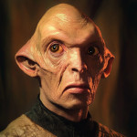

# His Dielectric Materials  

 
<b>Session started at 2024-12-08 / 22:28</b>
 
Fantasy Grounds - v4.6.0 ULTIMATE (2024-12-04) 
Fen's StarTrekAdventures Ruleset (v1.1.5)  
*[Prioritized Source: File; Other Sources: Vault]* 
*Core RPG ruleset (2024-12-03) for Fantasy Grounds
Copyright 2024 Smiteworks USA, LLC* 
*Fen's NPC Portrait Workaround v2.2.5* 
*[Prioritized Source: File; Other Sources: Vault]* 

Masakari (Zox): It's not self-serving if you are going to give it to another character anyway. ^_^;;; 
Masakari (Ishemok): get bioengineering bays 
Masakari (Ishemok): It's either that or pareses squares courts. 
indarien (Kolea): That was an option. 
**T'kor: [ CONTROL  (11) +  ENGINEERING  (4)]
[Successes: 0] [Complications: 0]
Failed on DC: 1 [2d20 = 36]** 
**Zox: [ REASON  (7) +  SCIENCE  (4)]
[Successes: 2] [Complications: 0]
Success with 1 momentum [2d20 = 19]** 
**Kolea: [ REASON  (9) +  SECURITY  (3)]
[Focus: Syndicate Training ]
[Successes: 2] [Complications: 0]
Success with 1 momentum [2d20 = 15]** 
**Kolea:  [Total: 3] [Effects: 1] [4dChallenge = 3]** 
**Kolea:  [Total: 0] [Effects: 0] [2dChallenge = 0]** 
**Hailey Murry: [ INSIGHT  (13) +  CONN  (3)]
[Successes: 2] [Complications: 0]
Success with 1 momentum [2d20 = 15]** 
**Hailey Murry:  [Total: 1] [Effects: 1] [3dChallenge = 1]** 
**Hailey Murry:  [Total: 3] [Effects: 0] [2dChallenge = 3]** 
**Skig: [ REASON  (10) +  ENGINEERING  (5)]
[Focus: Security Systems ]
[Successes: 3] [Complications: 0]
Success with 2 momentum [2d20 = 17]** 
**Skig:  [Total: 2] [Effects: 1] [5dChallenge = 2]** 
**Skig:  [Total: 2] [Effects: 2] [3dChallenge = 2]** 
Masakari (Ishemok): the colors form a cypher in dna, so messages can be coded in hilarously innocent looking novelties. 
**Oakadan: [ CONTROL  (11) +  ENGINEERING  (2)]
[Focus: Fire Safety ]
[Successes: 3] [Complications: 0]
Success with 2 momentum [2d20 = 5]** 
**Oakadan:  [Total: 3] [Effects: 0] [2dChallenge = 3]** 
>Captains Log, Stardate 61924.5: Our survey of the dwarf bodies of the D'Navel system was uneventful, and we are currently en route to our rendezvous with the science vessel USS Maxwel in three daysl to resupply them with long-range survey equipment.

>After that resupply, we should have at least a week before we need to be at the geoengineering conference on Tenaxia VI. I have asked the senior staff to go over the data we have and figure out what we should prioritize during that week. I want to make sure we make good use of the time we have available. 

>INTERIOR - Conference Room: Murry has wheeled her conspiracy board back out so the crew can decide what their next priority should be. 

**Hailey Murry** Okay, so what leads do we have? 
**Lt. Cmdr Malat** Well T'Kor has those coordinates that the Twins were communicating with 
**Skig** I finished launching the Diplomatic Suites debris into the star the Dwarf bodies were orbiting. It turns out all those plastic planters, tacky decor, motivational posters, and decorative chairs were disguising some really good research equipment. 
**Lt. Cmdr Viraseti** We also have this datapad that the Twins gave us from the Cardassian Embassy 
**Skig** Does that have a DB-9 serial port? 
*Skig looks at the datapad.* 
**Skig** Didn't the Trill give us a lead where the old Lieutenant guy was going? 
**Skig** Anchovy Pizza or something. 
**Skig** No wait... Antin IV. 
**Lt. Cmdr Malat** Yeah, looks like that is a planet in T'Zenkethi space, near the Romulan border 
**Lt. Cmdr Malat** The coordinates from T'Kor are on a Federation planet, Ariadne Opan III 
**Skig** Likely it is easier to find T'Kor's coordinates than a well trained Federation operative who is on an unknown operation. 
**Zox: [ REASON  (7) +  SECURITY  (5)]
[Focus: Espionage ]
[Successes: 2] [Complications: 0]
Success with 1 momentum [2d20 = 16]** 
**Skig** While finding the needle in a haystack, so to speak, is always fun, heading to the coordinates we know is an easier option. 
**Zox:  [Total: 4] [Effects: 3] [5dChallenge = 4]** 
**Zox** What's this? 
**Zox** Are these...protein spectrograms? 
**Lt. Cmdr Viraseti** They look like wark signatures 
GM: warp* 
*Zox rubs his dinosaur eyes.* 
**Zox** Ah ha! okay. 
**Skig** That would be testable by referencing the names against ship registries. 
**Lt. Cmdr Malat** I know a couple of these names, the Telek and Roral are Keldon class Cardassian heavy cruisers 
**Lt. Cmdr Malat** Why would the Twins send us a bunch of Cardassian warp signature spectra? 
**Zox** Well, the Cardassians were being cryptically threatening....but that's hard to differentiate from baseline. 
**Hailey Murry** There was a Cardassian at the gun exchange as well 
**Hailey Murry** I suspect they may have a similar espionage issue as we do 
**Zox: [ INSIGHT  (7) +  SECURITY  (5)]
[Focus: Shipboard Tactical Systems ]
[Successes: 0] [Complications: 1]
Failed on DC: 1 [2d20 = 34]** 
**Zox** Drat! someone forgot to charge this padd and i fat-clawed some button! 
**Lt. Cmdr Viraseti** Oh wait, I almost forgot after all the chaos at Starfleet Medical...  
**Skig** Tracking and filtering out warp signatures for a select group of ships is a way to get  them through security checkpoints. Or faking them through a security checkpoint when they are not there. 
**Lt. Cmdr Viraseti** I do have the warp signature from the black hole that I had been working on. The base signature was fake, but the secondary and tertiary harmonics matched a Cardassian warp signature 
**Hailey Murry** Oh, that's interesting. One of these? 
**Skig** The Roral perhaps, which Malat told us is a Keldon Class Heavy Cruiser 
**Lt. Cmdr Malat** Well add that to list, we can go track down these Cardassians 
**Lt. Cmdr Malat** So what do we tell the Captain? Antin IV, Ariadne Opan III, or track down the Roral? 
**Zox** I sort of want to beat up Sam. 
**Zox** He clearly knows too much! 
**Hailey Murry** I don't think we'd catch him 
**Hailey Murry** Aside that, what do we do if we catch him? He's a Star Fleet officer 
**Zox** Invite him to a ball! 
**Zox** Officers LOVE big awards and shiny events 
**Skig** Ariadne Opan III is the one most likely to succeed and least likely to cause a major diplomatic incident. 
**Lt. Cmdr Viraseti** He reports directly to the Chief of Staff of Starfleet, I don't think we can nap him and throw him in the brig 
GM: nab* 
**Lt. Cmdr Malat** I think it would be pretty fun to try though 
**Skig** Also, I am not sure I want to run the risk of the Lister getting into combat with a Cardassian Heavy Cruiser. 
**Zox** Well, given how labrinthine this is, Ariadne is the best place to go. 
**Lt. Cmdr Malat** Ariadne it is then 
>Suddenly, Captain Bachar's voice pops in through the comms 

**Captain Bachar** Senior staff report to the bridge, we have a situation 
**Zox** Wheee! 
*Skig duitfully heads to the bridge, happy that when the captain states "situation" it does not mean, "the replicator gave me orange juice and I asked for grapefuit juice".* 
>INTERIOR - Bridge: As the senior staff depart the turbolift, Bachar and Windbloom call them over from the aft comms station where they are both looking at a display 

*Skig heads over to see what is going on.* 
**Captain Bachar** We are picking up a faint distress call from the Omarian cluster 
**Windbloom Openheart** Very weak, looks like it's probably like... an emergency beacon 
**Captain Bachar** No details on the situation, but we should probably check it out 
**Zox** Are the shields modulated according the posted frequencies? 
*Skig gets out convenient starmap to see if that is in the direction we want to go in or not.* 
**Skig** Right away sir. 
*Skig reconsiders the Advanced Research Labs for the Sensor Suites, but it is too late now.* 
*Skig configures the Modular Laboratories for biological research.* 
>Ghex brings the Lister around to intercept, and soon the vessel comes into view. It looks like an Etaxian crude ore carrier, some signs of battle damage but nothing too extreme. 

**Skig** Zox, Malat, lifesigns? Reactor or Warp Damage? Residual weapon effects?  
**Hailey Murry: [ INSIGHT  (13) +  SECURITY  (3)]
[Successes: 1] [Complications: 0]
Success with 0 momentum [2d20 = 23]** 
**Zox: [ INSIGHT  (7) +  SECURITY  (5)]
[Focus: Shipboard Tactical Systems ]
[Successes: 2] [Complications: 0]
Success with 1 momentum [2d20 = 21]** 
*Skig runs a scan on the ship to determine structural damage, life support and power systems - how safe it would be to send an away team over.* 
**Skig: [ DARING  (10) +  ENGINEERING  (5)]
[Successes: 2] [Complications: 0]
Success with 1 momentum [2d20 = 10]** 
**Zox** Captain, I am picking up several faint life signs, life support is off and they won't last much longer! 
**Skig** Type of life forms? Would it make sense to beam them into a containment field in sick bay? 
**Zox** Yeah probably, why not store them in the buffer and make sure this isn't some sort of trojan-ship thing. 
**Zox** Ill try to find out more. 
**Ensign Ghex** Seems a bit hostile to beam them into confinment. I wouldn't feel too good if you beamed me directly into a confinment field. I would feel like I was being kidnapped to be sold into some kind of trafficing scheme. 
indarien (Skig): Kolea perks up at the talk of a ship-sized trojan. 
*Skig pats Ghex on the head.* 
**Zox** a hostile atmosphere is better than no atmosphere. 
**Skig** The containment field in sick bay would be helpful for ensuring anything did not infect us. 
**Hailey Murry** We should do a more thorough scan. We don't want the ship's buffers to get pregnant again 
**Skig** But I can appreciate your sense of humanity. 
**Hailey Murry** Have we hailed the ship yet? 
**Lt. Cmdr Malat** No response, their power is down so they likely can't receive  
*Skig loads a full salvo of hailstorm torpedoes per Murry's recommendation.* 
indarien (Skig): Oh wait.. you meant... with Comms. 
KruschtyaEquation (Hailey Murry): So if we send people down, do we want Zox, Skig, and Throk? 
**Zox** Transmission from Zox: I have made contact with Ermatan, the captain of the vessel. Please send down an emergency engineering crew with proper gear for zero-g repairs. 
>T'Kor and Krepeka materialize alongside Zox. T'Kor with his toolkit in hand, and Krepeka with a medkit 

**Ermatan** Thank you for helping us, our situation was dire 
**Ermatan** test 
*Zox the prompt for that was actually the fun part.* 
**Ermatan** We need to rewire our power grid with new cabling 
*Zox intentionally makes clanky noises, lumbering around in the exosuit.* 
**Ermatan** Is one of you an engineer? 
**T'kor** That would be me, yes. What happened? 
**Ermatan** It was the strangest thing. We were attacked, so we surrendered assuming they would take our load of dilithium ore 
**Ermatan** But instead, they just came over and started pulling out all of the wiring from our power grid 
**Ermatan** They stripped away all of the wire insulating and took it 
**Krepeka** Did you consider ramming them at warp speed prior to surrender? 
**T'kor: [ REASON  (9) +  ENGINEERING  (4)]
[Successes: 2] [Complications: 0]
Success with 1 momentum [2d20 = 18]** 
**Ermatan** No, we don't want to die for a load of Dilithium ore, these companies have insurance for this stuff 
*Krepeka notes down in datapad, "These are not Voth".* 
**Zox** You are in good hands Captain Ermatan. Our experts are on the job. May I inspect your ship logs to learn more about these dangerous outlaws? 
**Ermatan** If you can get the computers back online 
**Ermatan** At the moment, our power is down 
**Ermatan** But if you can fix that you're more than welcome to take all the data you can find on them 
**Krepeka** Can you describe the race, type of ship, and method of attack they used? 
**Ermatan** The ship was an old Klingon D7 cruiser, but the crew were a bunch of Pak'Leds  
**Ermatan** They just kept saying they wanted our dielectric materials 
**Zox: [ INSIGHT  (7) +  SCIENCE  (4)]
[Focus: Xenobiology ]
[Successes: 1] [Complications: 0]
Success with 0 momentum [2d20 = 23]** 
**Ermatan** It didn't make any sense, they left the valuable ore behind and took a bunch of worthless electrical insulators 
**Krepeka** Curious, they are not incredibly bright but frequently scavenge or steal from other races. Perhaps they did not understand what the Dilithium is for? 
**Ermatan** They just kept saying they needed to "understand" our "dielectric materials" 
**Ermatan** They didn't seem to have any interest in the dilithium at all 
**Zox** Are there any injured who require immediate attention?  
**Ermatan** No, we are mostly ok it is just our power grid that is damaged 
**Ermatan** They only fired one shot before we surrendered. This is a bulk ore carrier, we are no match for a Klingon cruiser, even one as old as a D7 
*Krepeka suspects this episode was prompted by an advertising agreement with an IT cabling company.* 
*Krepeka notes down, "Probably should have asked the question about medical assistance before asking other questions, since that is ostensibly why I'm here".* 
**Zox** T'Kor, can you send Skig some schematics for materials to mass synthesize? This should be simple, no? 
**T'kor** Correct 
**T'kor** A bit timely, perhaps, depending on how thorough they were 
**T'kor: [ CONTROL  (11) +  ENGINEERING  (4)]
[Focus: Repair/Tinkering ]
[Successes: 2] [Complications: 0]
Success with 1 momentum [2d20 = 25]** 
**T'kor:  [Total: 4] [Effects: 4] [4dChallenge = 4]** 
>T'Kor is able to quite quickly pull through new primary power conduits, getting the freighter quickly back online and restoring main power 

**Ermatan** Incredible, I've never seen a Tholian move so fast 
*Zox lets loose a terrible, primal rawr in appreciation of T'kor's experise* 
**Zox** Perfection!  
>The ship's crew cower in fear of Zox's mighty roar 

**Zox** Now lets catch these primitive outlaws! 
**Zox: [ INSIGHT  (7) +  SECURITY  (5)]
[Focus: Shipboard Tactical Systems ]
[Successes: 2] [Complications: 0]
Success with 1 momentum [2d20 = 23]** 
*Zox investigates the combat logs.* 
>Zox pulls up the logs from the attack. The sensor logs indicate an old Klingon vessel, even older than the Lister,  came out of warp and immediately opened fire with disruptors. After the first shot, they hailed: 

**Captain Kaglor** I am Kaglor, you are crossing the line. We must strike you now, for the dielectric materials. Surrender now, we must pick at the lines for the dielectric materials. 
>The comms descends into a bit of a confused back-and-forth due to the absurd nature of his demands before the freighter surrenders and the log ends 

**Ermatan** As I said, it did not make any real sense 
**Ermatan** If you can track them down, I am sure our employer would appreciate it 
**Zox** I will ask my captain for permission to apprehend these swashbuckling scofflaws 
**Ermatan** When we were hired for this contract, the mine did say they have had issues with attacks on their shipping lanes in recent months 
**Krepeka** The D7 might not have a fully functional universal translator? 
**T'kor** Who is your employer? 
**Ermatan** The Yasgrad Mining Conglomerate 
**Zox** And this is ethically sourced dilithium?  
**Ermatan** We just took on this contract a few weeks ago to deliver raw Dilithium ore 
**Ermatan** Ethically sourced? I don't understand 
**Ermatan** It is Dilthium, from asteroids 
**Ermatan** I don't think they ask the asteroids how they feel about it 
**Zox** No dubious destruction of ecosystems, no forced labor, ya know, the sort of things to muddy the waters? 
**Zox** very well then! 
**Ermatan** I don't know, we only just started working here. 
**Ermatan** This was our first delivery. 
*Krepeka looks at Zox.* 
**Ermatan** You are a very scary looking creature though, I am sure you can handle those Pakleds 
**Krepeka** With all due respect sir, I am certain that the dilithium is likely harvested remnants of crystallized dinosaur bones scattered across the cosmos. After all, it all comes back to humans needing oil, right? 
**Ermatan** I do not know many humans, I cannot speak to their needs 
*Krepeka sighs that a species whose sole claim to fame is having opposable thumbs that are too large to be used to remove nostil debris.* 
*Krepeka looks at Zox.* 
**Krepeka** Could you possibly scan and gather the sensor logs to determine the emissions pattern and warp signature of the vessel to track it? 
**Zox** Already on it! 
**Zox** We have a lead on it 
>♫♫♫Heroic Music Sting♫♫♫ 

>INTERIOR - Bridge: The away team return and take up their stations to begin search operations 

**Zox** Well that was uneventful. 
**Captain Bachar** No harm in being extra cautious 
**Captain Bachar** Sometimes you find a ship in distress, and sometimes you get infected with alien snake babies 
**Zox** Captain Bachar, would it be acceptable to pursue and engage an old D7 cruiser that has assailed this poor barge? 
**Captain Bachar** We should look into it. These Pakleds sound like a problem we should deal with. 
**Zox** It'd give us some good quality assurance for the current repairs done, just to make sure they'd perform under real combat rather than a turkey shoot. 
**Captain Bachar** Ghex, set a course following the bearing from Zox for now 
Masakari (Zox): Now we use the hailstorm missles. =D 
**Ensign Ghex** Aye sir, do you think we will get into a space battle? I had excellent marks from my instructors at the academy for evasive maneuvers and combat crew resource management, although I did get marked off in my final exam for talking too much during a battle simulation 
*Lt. Cmdr Malat sighs* 
**Skig** Don't worry Ghex, you absolutely will not do anything horrible. 
**Skig: [ PRESENCE  (8) +  COMMAND  (2)]
[Focus: Faking Empathy As Best as Possible ]
[Successes: 2] [Complications: 1]
Success with 1 momentum [2d20 = 21]** 
**Ensign Ghex** Oh no, I hope I don't crash into anything. Unless the captain orders me to crash into something. Then I hope I don't miss.  I don't really want to crash the ship though, or get blown up.... 
**Lt. Cmdr Malat** Shut up kid 
**Lt. Cmdr Malat** Zox, let's just find these pakleds and get out here before she bursts 
**Zox: [ CONTROL  (11) +  SECURITY  (5)]
[Focus: Shipboard Tactical Systems ]
[Successes: 3] [Complications: 0]
Success with 2 momentum [3d20 = 37]** 
**Zox:  [d20 = 18]** 
>Zox reads a matching warp signature a few light years away and sends the coordinates to Ghex. As the Lister approaches, they can read an old Klingon battle cruiser of a similar vintage to the Lister. 

**Windbloom Openheart** I wonder if the Lister and that old cruiser ever like... tangled in the past. It really makes you wonder about the unknowable vastness of history, you know? 
**Skig** Captain, shields up and battlestations I assume? 
**Captain Bachar** Yes. Notwithstanding the unknowable vastness of history, lets go to yellow alert and hail them.  
*Skig pushes the "scary yellow button" and raises shields.* 
*Zox considers spoiling the profundity of the moment with electronic records, then takes a hit on a blunt before passing it to Windbloom* 
>Malat hails the Klingon cruiser, and moments later a dough-faced Pakled man appears on the viewscreen and stares wordlessly at the Lister crew 

**Captain Bachar** Maybe Throk should talk to them, he probably can communicate better given their limited intelligence 
**Zox** I think I am developing a mild psychosis where I do not feel strong outside of power armor... 
*Throk slams his fist into his chest and extends his clawed hand outward.* 
**Throk** Me Throk. You captain or just food I consume on way to see who is in charge of ship? 
**Captain Kaglor** I am Kaglor, I am not a food 
**Captain Kaglor** Why are you here? 
**Throk** Perhaps. Have you tried eating other Pakled? 
*Captain Kaglor pauses* 
**Captain Kaglor** No, that sounds like not a good idea.  
**Captain Kaglor** Other Pakled don't look like food 
**Captain Kaglor** Food looks like this 
*Captain Kaglor wanders off screen for a moment before returning with some sort of noodle dish in a bowl* 
**Captain Kaglor** This does not look like Pakleds 
*Throk considers disemboweling something to show off noodle like intestines, but realizes Bachar would be very mad at him, if he did that again on the bridge.* 
**Throk** Hmm... 
**Throk** I have need of valid food sources, I understand you have need of dialectric material. Perhaps we trade? 
**Captain Kaglor** No, we must strike for the dielectric materials. Not trade for them 
**Throk** Those noodle have Qom'Plaw larva in them? Very nutritious. 
**Captain Kaglor** President Yun did not say anything about trading 
**Throk** Hmm... President Yum say anything about red sauce? 
*Throk wonders if President Yum would live up to the name.* 
**Zox: [ INSIGHT  (7) +  SECURITY  (5)]
[Focus: Shipboard Tactical Systems ]
[Successes: 0] [Complications: 1]
Failed on DC: 1 [2d20 = 33]** 
**Throk** Why strike for diaelectric material? 
**Throk** Why gather it? 
**Throk** Perhaps we work together, gather food and diaelectric material? 
**Captain Kaglor** President Yun said we lack understanding of dielectric materials, and that we need to strike the ships and pick at the lines for dialectric materials 
**Captain Kaglor** Then we can understand better the dielectric materials 
*Skig goes to a replicator and generates, "Dialectric Materials for Dummies".* 
**Captain Kaglor** You seem to have a lot of dielectric materials... 
**Captain Kaglor** Surrender them to us! Or we will have to attack you! 
**Throk** You do also, have you considered gathering from own ship? Much easier. 
>The Pakleds open fire 

**Zox:  [d20 = 2]** 
>♫♫♫Ominous Music Sting♫♫♫ 

*Throk is annoyed that his opportunity for diplomatic conversation has been thwarted by gunfire and resolves to demontrate to the Pakled captain that Pakled intestines look like noodles.* 
>---------CUT TO CREDITS-------
♫♫♫Opening Theme♫♫♫ 

>Season 2, Episode 2: His Dielectric Materials
Written by Leon Berger
Directed by Apolena Christianson 

# His Dielectric Materials (Part 2) 

 
<b>Session started at 2024-12-16 / 16:29</b>
 
Fantasy Grounds - v4.6.1 ULTIMATE (2024-12-10) 
Fen's StarTrekAdventures Ruleset (v1.1.5)  
*[Prioritized Source: File; Other Sources: Vault]* 
*Core RPG ruleset (2024-12-03) for Fantasy Grounds
Copyright 2024 Smiteworks USA, LLC* 
*Fen's NPC Portrait Workaround v2.2.5* 
*[Prioritized Source: File; Other Sources: Vault]* 
*Fen's STA House Rules (v1.0.1) * 
*FG Browser v1.2.3* 
*[Prioritized Source: File; Other Sources: Vault]* 

**Zox:  [2d20 = 12]** 
**Skig:  [3d20 = 21]** 
**Hailey Murry:  [3d20 = 43]** 

>INTERIOR - Bridge: The Lister shudders under the impact of the distruptor fire from the Pakleds. 

**Lt. Cmdr Malat** Direct hit, shields holding at 50%. Should we return fire? 
**Captain Bachar** I don't want to kill these Pakleds, they don't seem to be playing with a full deck. Any suggestions on how to subdue them? 
**Hailey Murry** Could we "surrender" and take them when the beam aboard? 
**Skig** Dammit! I just had that all fixed! Ghex - evasive pattern Delta 3, keep the saucer directed towards them. Malat, target their weapons systems only. Zox and Throk, prepare to repel boarders. And YOU! 
*Skig tosses the guy in the damage control chair out of the way.* 
*Zox dons the ExoSkigAton* 
**Skig** Get out of my Chair! 
**Throk** Throk like surrender idea. Then they beam aboard and Throk turn one into noodles? 
**Throk** Throk like Pakled noodles, they go very well with Antarian red wine. 
**Captain Bachar** Alright, you heard the lady. Make it so 
*Zox begins brandishing some rather imposing looking hardware.* 
**Zox: [ DARING  (12) +  SECURITY  (5)]
[Focus: Shipboard Tactical Systems ]
[Successes: 2] [Complications: 0]
Success with 1 momentum [d20 = 4]** 
>[TURN] Zox 

**Skig: [ CONTROL  (11) +  ENGINEERING  (5)]
[Focus: Emergency Repairs ]
[Successes: 1] [Complications: 1]
Success with 0 momentum [2d20 = 34]** 
**Hailey Murry: [ INSIGHT  (13) +  ENGINEERING  (1)]
[Successes: 3] [Complications: 0]
Success with 2 momentum [2d20 = 9]** 
>Skig routes power to the shield emitters, restoring some of their strength. However, she inadvertently activates "Maintenance Mode" which also drops the shields for a few moments while rechargin. 

>[TURN] Skig 

>[TURN] Hailey Murry 

**Skig** I knew I should have upgraded from the Freemium Version of Starfleet Shield Control v1.0 and not relied on the Advertiser supported version that occasionally drops the shields to download new ads. 
**Zox:  [Total: 8] [Effects: 3] [8dChallenge = 8]** 
>[TURN] D7 Cruiser 

>[TURN] Lt. Cmdr Malat 

>[TURN] Ensign Ghex 

>[TURN] D7 Cruiser 

**Zox:  [Total: 2] [Effects: 1] [2dChallenge = 2]** 
**Lt. Cmdr Malat** Direct hit,  their weapons are offline 
**Zox: [ INSIGHT  (7) +  SECURITY  (5)]
[Successes: 1] [Complications: 0]
Success with 0 momentum [2d20 = 18]** 
**Skig** Good shot Malat and good piloting Ghex. 
**Ensign Ghex** Thank you ma'am, this is actually my first time in a real space battle. I tested very well in attack pattern execution and emergency procedures, but I guess I was alway a little bit nervous that I would screw something up if I ever got into a real space battle and get my entire crew killed 
*Throk pats Ghex on head.* 
**Throk** Don't worry, if you do something that would cause entire crew to get killed, I will eat you first so you do not suffer shame of defeat. 
**Skig** Throk, stop sniffing Ghex. 
>As the ancient Klingon cruiser lists to one side, its weapons ports die down before it can open fire, taking advantage of Skig's inadvertent lowering of the shields. Instead, a number of small objects are seen launching from the ship, closing rapidly on the Lister 

**Lt. Cmdr Malat** Boarding pods? This is like a historical documentary on the first Klingon war 
>[ROUND 1] 

>The ship judders as a number of boarding pods impact the hull in various locations. 

**Zox** The hunt begins!  
**Throk** Throk get to repel boarders! 
**Throk** HAPPY DAY! 
*Throk gets out some dental floss.* 
**Ensign Ghex** They sound too excited about that.  
*Zox makes an excessive amount of whirring and stomping noises.* 
**Ensign Ghex** Why are they so excited about that? 
**Skig** It is likely best you do not ask that question. 
**Captain Bachar** Throk: do not eat these Pakleds, take them alive 
**Zox** The sterility of ship to ship combat is insufficent to species with a need for some more visceral combat in their blood. 
**Hailey Murry** It's okay, Ghex, you will not be on cleanup duty 
*Skig issues phasers to people on the bridge in case they need to be used in self-defense.* 
**Throk** Understood! Throk not eat ALL the Pakleds. 
*Throk follows Zox to inflict gratutious violence on all Pakleds.* 
*Skig really hopes someone does not randomly generate a Redshitrt Pakled for the next scene.* 
**Hailey Murry: [ REASON  (9) +  SECURITY  (3)]
[Focus: Constitution Class Ships ]
[Successes: 1] [Complications: 0]
Success with 0 momentum [2d20 = 23]** 
**Throk: [ DARING  (9) +  SECURITY  (4)]
[Focus: Gorn-Fu ]
[Successes: 2] [Complications: 0]
Success with 1 momentum [3d20 = 41]** 
**Zox: [ CONTROL  (11) +  SECURITY  (5)]
[Successes: 2] [Complications: 0]
Success with 1 momentum [3d20 = 31]** 
**Zox:  [d20 = 7]** 
**Skig:  [d20 = 15]** 
**Throk:  [Total: 5] [Effects: 0] [7dChallenge = 5]** 
*Zox Appears behind the unspecting Pakleds, unleashing a horrifyingly tasty torrent of Siraccha-Mayo* 
**Throk:  [Total: 3] [Effects: 1] [4dChallenge = 3]** 
**Throk:  [Total: 5] [Effects: 1] [5dChallenge = 5]** 
**Throk:  [Total: 2] [Effects: 0] [2dChallenge = 2]** 
**Zox** Is this peppering the enemy with supressive fire? 
**Throk** BY THE SECRET HOLY SAUCE OF GRAPNAR! THEY ARE DELICIOUS! 
**Zox: [ DARING  (12) +  MEDICINE  (1)]
[Successes: 1] [Complications: 0]
Success with 0 momentum [2d20 = 28]** 
*Zox reaches for the ranch side-arm* 
*Throk disembowels one of the Pakleds and rips some of the intestines out and layers them in a bowl with some Sriracha-Mayonnaise and sprinkles some cilantro on top.* 
**Throk** BEST BOARDING EVER! 
*Throk has gooey Pakled intestines hanging from his mouth.* 
*Zox pulls a cord on the back of the suit to ring a dinner bell* 
>Zox and Throk burst through the doors of main engineering to find a bunch of pakleds pulling apart consoles and probing things with multimeters. They quickly paint the town red with Sriracha and Pakled intestines 

>[TURN] Zox 

>[TURN] Hailey Murry 

>[TURN] Throk 

**Skig** Ghex, maintain evasive maneuvers, Malat, keep their weapons offline, but aim specifically for their power systems. 
**Captain Bachar** Don't get cocky, they could restore weapons power at any moment 
indarien (Skig): AKA - Use the "Power Loss" repeatable momentum spend to drain their power systems. 
**Hailey Murry:  [Total: 9] [Effects: 5] [8dChallenge = 9]** 
Masakari (Zox): poor aliens are getting bullied.... 
KruschtyaEquation (Hailey Murry): 2 points to target the sensors, 3 points to drop their power 
**Zox:  [2d20 = 33]** 
**Skig** Well done again both of you. 
**Lt. Cmdr Malat** They're hailing us 
**Skig: [ PRESENCE  (8) +  COMMAND  (2)]
[Focus: Faking Empathy As Best as Possible ]
[Successes: 1] [Complications: 0]
Success with 0 momentum [2d20 = 20]** 
**Zox:  [2d20 = 22]** 
**Captain Bachar** Put it on screen 
>The viewscreen flashes awake and you see Windbloom hitting a bong with the Pakled captain 

*Skig facepalms.* 
Masakari (Zox): bless. 
Masakari (Zox): unleashing predators on unsuspecting boarding crews seems over the top now. really makes you think.... 
**Captain Bachar** What the hell are you doing Windbloom? 
**Skig** I would guess he has negotiated a surrender? 
Masakari (Zox): We traded alcohol for weed. Much chiller and less violent. ;D 
**Windbloom Openheart** Making friends 
**Windbloom Openheart** These guys aren't so bad man 
**Skig** Yes, we were endeavoring not to kill them. 
**Captain Kaglor** You broke our weapons and our see-ers, you are strong 
**Throk** MUNCH MUNCH MUNCH 
*Throk looks at Zox.* 
**Throk** Does this Pakled butt make me look far? 
**Throk** Does this Pakled butt make me look fat? 
**Zox** No, you look your Gorn best! 
**Throk** You are best Security Chef ever. 
**Captain Kaglor** Do we have to surrender and give you the dielectric materials? 
**Skig ** *([whispers])*: I feel as if thousands of voice screamed out for Pakled Recipes, and were suddenly silenced. 
*Captain Bachar turns to Skig* 
**Captain Bachar** Skig, any idea what is up with them and dielectric materials? 
**Skig** No, I suspect there is some failure of basic understanding and misinterpreting of orders. 
**Kolea: [ DARING  (9) +  MEDICINE  (4)]
[Focus: First Aid ]
[Successes: 3] [Complications: 0]
Success with 2 momentum [2d20 = 7]** 
**Zox** Targets in engineering neutralized. Request transfer to next problem area. Dispatch heavy trauma crew requested. 
>Viraseti opens a group comm channel to all the Pakleds 

**Skig** This may be best handled by discussing with the Pakleds what they are seeking them for, what the goal is for them, and perhaps seeing the recording of their President giving the order? 
**Kolea** THROK! No, bad Gorn. 
**Captain Kaglor** We are defeated men, the Federations are strong.  
**Kolea** Give me back those... nevermind... I'll just generate some new ones. 
**Kolea** Why is this Pakled covered in ranch dressing and cilantro? 
*Kolea looks crossly at Throk and Zox.* 
**Zox** Um....don't get saucy, eh? 
**Captain Bachar** Good thinking, maybe they have some comms records 
**Kolea** Do we need to have another one of those, "You should not eat sentient creatures" training videos? 
**Captain Bachar** In the meantime, Malat, Zox and Throk can round up the remaining boarders 
**Zox** Evidently. The message got lost in the sauce. 
**Throk** Maybe, last one very boring, Throk eat Ensign Branart to alleviate tedium. 
*Kolea sighs.* 
**Captain Bachar** Captain Kaglor, my First Officer is going to come over there with an away team to have a look at your computer records. 
**Officer Ruglek** Our computer does not use records, it is advanced. It uses isolinear media 
**Officer Ruglek** Records are primitive and dumb 
*Officer Ruglek laughs* 
**Kolea** Captain, the Pakleds in Engineering are... contained. One of them will probably need medical treatment for a while. The others can be treated for basic injuries. 
**Skig** I suspect their computer may use Vinyl or 8-Track tapes. 
**Skig** Fortunately, the Llister uses Punch Cards, so we are covered. 
**Lt. Cmdr Malat** The situation in Cargo bay 3 is... a little different 
**Lt. Cmdr Malat** I think you guys had better get down here, this one is a bit hard to explain 
**Zox** we are ready! 
**Throk** In words of Wolverine, "Let's fucking go!" 
**Lt. Cmdr Malat** No, it's not that kind of different 
*Kolea heads after the "boys" to see how many hyposprays will be needed.* 
*Kolea after she sends the Pakleds in Engineering to the Med Bay under guard.* 
>INTERIOR - Cargo Bay 3: The Pakleds in the cargo bay appear to have lined the walls in black material of some kind. On one end of the room, they have created an effigy out of the same black material and they are kneeling in front of it in reverence. 

**Zox: [ INSIGHT  (7) +  SECURITY  (5)]
[Focus: Xenobiology ]
[Successes: 2] [Complications: 0]
Success with 1 momentum [2d20 = 22]** 
*Skig is wearing some Pakled intestines like a Hawaiian Lei.* 
*Throk is wearing some Pakled intestines like a Hawaiian Lei.* 
**Hailey Murry** What is this? 
**Lt. Cmdr Malat** I have no idea  
**Zox** Either this is a primitive ritual....or they are planting a beacon in the Lister? 
**Throk** Throk make it a point to not eat people during their religious observances until proven to be part of the ritual. 
**Hailey Murry: [ INSIGHT  (13) +  SCIENCE  (5)]
[Successes: 1] [Complications: 0]
Success with 0 momentum [2d20 = 31]** 
**Hailey Murry** Excuse me, who's in charge here?  
*Zox sets Capsaicin to 'Stun'* 
*Throk licks lips in anticipation.* 
**Officer Ruglek** There is no charge here, only dielectric materials 
*Officer Ruglek holds up a black mat* 
*Kolea realizes that emote *COULD* apply to her.* 
**Hailey Murry ** *(aside to the crew)*: These are just electrical isolation mats. Those polymer pads engineers stand on when working high voltage 
*Officer Ruglek probes the black mat with a multimeter and holds up the screen, showing a resistance of 140mOhm* 
**Hailey Murry** I did walk right into that 
**Hailey Murry** Which of you is the leader of this boarding party? 
**Officer Ruglek** Me, I am Ruglek 
**Hailey Murry** Ruglek, explain what is happening here 
*Throk mixes up some Pakled intestines from Engineering with some chips and nacho cheese and offers it to a nearby Pakled while waiting to see what Ruglek has to say.* 
**Officer Ruglek** Captain Kaglor said we had to pick at the lines for dielectric materials, but I said we should find dielectric materials that are not in the lines 
**Officer Ruglek** This material was not in the lines, it was in a box 
**Hailey Murry** Why is it all over the walls? 
**Officer Ruglek** This material is the most dielectric material we have seen 
**Officer Ruglek** We had lost faith in Gormas, and then we found this material 
**Officer Ruglek** It is a sign, that we are close to understanding the dielectric materials 
**Hailey Murry** But 
**Hailey Murry** Why the *walls*? 
**Hailey Murry: [ PRESENCE  (10) +  SCIENCE  (5)]
[Focus: *Psychology ]
[Successes: 1] [Complications: 0]
Success with 0 momentum [2d20 = 32]** 
**Officer Ruglek** The walls are metal, they are not dielectric at all 
**Hailey Murry** But those are our walls 
**Kolea** I suspect they are having issues with uncontrolled electrical impulses throughout their control systems on their home system. 
**Hailey Murry** That would do it 
**Kolea** They are looking for ways to prevent members of their society from electrouction? Maybe? 
**Officer Ruglek** This material has more ohms than any material we have found 
**Zox** Can't they just modulate their shields? 
**Officer Ruglek** This must be what President Yun sent us to find 
**Officer Ruglek** We will say here 
**Officer Ruglek** And understand this material 
**Zox** Your whole plan is flawed, don't you know resistance is futile? 
*Throk sprays Zox in the eyes with hot pepper sauce.* 
**Zox: [ CONTROL  (11) +  MEDICINE  (1)]
[Successes: 1] [Complications: 0]
Success with 0 momentum [2d20 = 24]** 
indarien (Throk): Err... I mean... good pun. Yes. 
**Officer Ruglek** But we must understand the dielectric materials 
*Kolea sidebars to Muury.* 
**Kolea** Maybe we just replicate a bunch of these and send their boarding party back to their ship? 
*Hailey Murry steps away from the boarders* 
**Lt. Cmdr Malat** Not a bad idea, these are basically a commodity item 
**Hailey Murry** Hailey to Bachar. I think they're just dumb. Kolea suggests that they're having electrical issues on their main ship, station, or planet, so we might want to look into where they were sending their messages to 
**Zox** Im still lost....but maybe I just haven't stayed current. 
*Throk stands menacingly between the Pakleds and Murry and the rest while they are having a sidebar.* 
*Throk offers the other Pakleds delicious Pakled Noodles.* 
**Captain Bachar** Understood, let's talk to Captain Kaglor about this and see if we can get them to stop attacking ships 
**Throk** Your crewmembers in Engineering pair very well with Antarian wine and ranch dressing. 
**Captain Bachar** Then we can investigate their communications 
**Zox** Well Throk, looks like this is stand down, Maybe next week a fierce warrior species will attack..... 
>INTERIOR - Briefing Room: Captain Kaglor enters the room escorted by 2 red shirts. Bachar and the senior staff are gathered around the table where they have placed a large crate of electrical insulating mats. 

*Zox is just the friendly neighborhood dinosaur, OwO.* 
**Skig** Captain, did President Yum... dammit Throk... I meant President Yun say why you needed the dielectric materials? 
**Captain Kaglor** He said that we did not understand dialectric materials 
**Captain Kaglor** And that it was the key to our freedom 
*Throk is not in this scene, has been sent to engineering to clean all the blood off the walls.* 
**Captain Kaglor** He suggested that we strike for the dielectric materials, and pick at the lines 
*Throk is later reprimanded for leaving slobber all over the walls from licking them clean.* 
**Zox** Are you being attacked a species that uses electrical type-attacks? 
**Captain Kaglor** No, we need to undersand the dielectric materials 
**Captain Kaglor** It is the key to our freedom 
**Skig** Are you being trapped or held somewhere by electricity? 
**Captain Kaglor** No, we are free thanks to President Yun. But if we want to stay free, we need to understand the dielectric materials 
**Captain Kaglor** We know how to tell if a material is dielectric 
*Captain Kaglor holds up a multimeter in the resitance setting* 
**Hailey Murry** Did he give you a video with your instructions? 
**Captain Kaglor** But we don't understand how they work 
**Captain Kaglor** He gave us our instructions in person, after teaching us about the dielectric materials 
*Skig opens up StarfleetGPT and types in, "Explain electrical insulation and resistance like I'm five".* 
*Captain Kaglor listens intently as the computer gives a basic, childlike explanation of electrical resistance* 
indarien (Kolea): I would think I need to use that trick on Throk, except I will point out that Throk has a higher Reason stat than Zox. 
indarien (Kolea): is using her Kolea inside voice, hence the OOB. 
**Captain Kaglor** This is amazing 
**Captain Kaglor** I must tell my crew, this will surely help us better understand the dielectric materials 
Masakari (Zox): "Throk tried a book once. It didn't taste good" 
*Captain Kaglor heads off towards cargo bay 3* 
**Captain Bachar** Hopefully that deals with that problem 
*Skig follows Captain Kaglor to make sure she gets her datapadd back.* 
**Zox** I was thinking, it may have been beyond thier capacity. 
**Captain Bachar** Moving on: let's figure out our next move 
**Kolea** It will be at least four hours before we can move the Pakled who is getting an entirely new digestive system out of Medical. 
**Hailey Murry** I have the coordinates where they were sending messages at the start of the engagement 
**Hailey Murry** I presume that's their main ship 
**Captain Bachar** Well that will give Captain Kaglor some time to get his people out of the cargo bay 
**Zox** Let me help decrypt! 
**Hailey Murry: [ INSIGHT  (13) +  SECURITY  (3)]
[Successes: 3] [Complications: 0]
Success with 2 momentum [2d20 = 15]** 
**Zox: [ INSIGHT  (7) +  SECURITY  (5)]
[Focus: Espionage ]
[Successes: 1] [Complications: 0]
Success with 0 momentum [d20 = 11]** 
**Kolea** No other injuries among the crew to report. I imagine there are some damage issues along the hull from the initial attack and the boarding torpedoes, but I'm sure Skig will get that all sorted out. 
>Murry decrypts and plays back the relatively short conversation 

**Kolea** To be fair, compared to our last ship engagement, the fact that 2/3 of the crew does not need hospitalization and the Lister is crippled and in need of a tow makes this a relatively successful experience. 
*Kolea shrugs.* 
**Skig: [ CONTROL  (11) +  ENGINEERING  (5)]
[Focus: Security Systems ]
[Successes: 2] [Complications: 0]
Success with 1 momentum [2d20 = 19]** 
**Captain Kaglor** President Yun, this is Kaglor. We found a Federation and tried to strike for their dielectric materials, but they are too strong. We need help. 
**Nausicaan** What are you talking about? Who is President Yun? What dielectric materials? Is this about the direct action plan? 
**Captain Kaglor** We are trying to better understand the dielectric materials, tell President Yun that we... 
>The Nausicaan angrily terminates the channel 

**Kolea** Umm.... 
**Hailey Murry** Well, that was an angry Naussican, so I think we're on the right track for other reasons 
**Captain Bachar** They could be taking advantage of these Pakleds 
**Captain Bachar** Although to what end, I am not sure 
**Hailey Murry** Can we send a probe in advance to intercept messages? Figure out what's at the destination, and maybe figure out what they're doing? 
**Captain Bachar** Reasonable precaution. Prepare a probe, we can send it out while we deal with the Pakled situation here 
**Zox: [ INSIGHT  (7) +  SECURITY  (5)]
[Focus: Espionage ]
[Successes: 1] [Complications: 0]
Success with 0 momentum [2d20 = 21]** 
**Kolea: [ REASON  (9) +  COMMAND  (2)]
[Focus: Syndicate Training ]
[Successes: 1] [Complications: 1]
Success with 0 momentum [2d20 = 30]** 
*Kolea is happy the Pakleds are not researching into Dielectric Grease and this entire episode turns NC-17.* 
**Ensign Ghex** Um, Ghex to Bachar. You guys should come back out to the bridge, the Pakleds are doing something kind of strange. I am not sure what, but I don't think I should be the only one out here. 
**Kolea** I doubt that Nausicaan is working directly with the Syndicate, Pakleds are used for dumb labor, giving them a starship, even a D7, is not how they normally operate. 
*Hailey Murry emerges to see what they're doing* 
**Ensign Ghex** You know, just in case they attack again or something like that. I don't think I can handle that by myself. Even though I am definitely qualified, in general, for this job. 
>On the viewscreen, Murry can see the Klingon Cruiser has turned away and is pulling away at impulse power. Behind it, she sees a number of escape pods flying away from the cruiser and towards the Lister 

**Hailey Murry** Evade the pods 
>Moments later, the Klingon cruiser self destructs in a bright flash of light 

**Hailey Murry** What the blazes?! 
**Kolea** Hmm... 
*Captain Bachar sighs* 
**Zox** Perhaps we should get all hands to battle stations? 
**Kolea** I recommend we lock tractor beams on those escape pods and check the logs to see if the Klingon ship was issued a remote self destruct, by an Angry Nausicaan. 
**Captain Bachar** I don't think they plan to launch an attack with a bunch of unarmed escape pods 
**Hailey Murry** They don't, but keeping control of... how many Pakleds are there? 
**Kolea** But that's just my medical opinion. 
**Hailey Murry** I second Kolea 
**Captain Bachar** Well, we are going to need to secure them somewhere 
**Zox: [ CONTROL  (11) +  SECURITY  (5)]
[Focus: Espionage ]
[Successes: 2] [Complications: 0]
Success with 1 momentum [2d20 = 22]** 
*Zox attempts to check the logs.* 
*Throk is hoping he gets ordered to collect all the Pakled hands, he found a great recipe that uses them.* 
**Zox** Captain. this is even more confusing; the self destruct was approved by Captain Kaglor. 
**Captain Bachar** Why would he blow up his own ship? 
**Kolea** Isn't he with Skig in Cargo Bay 3? 
**Zox** Either Windbloom gave him the good shit, or these poor Pakleds need refuge with the Federation as they escape some sort of bullies. 
**Hailey Murry** Can we get a video feed to Cargo Bay 3? 
**Zox** Computer, Locate Captain Kaglor! 
**Computer Voice** Captain Kaglor is in Cargo Bay 3 
**Ensign Ghex** Pulling it up now, ma'am 
>On the video feed, you see a group of Pakleds kneeling around Skig prostrating themselves, while another group are reshaping their insulating mats into an effigy of Skig 

**Skig** Yes yes, this is all very flattering. 
**Captain Bachar** Skig, what the hell is going on down there? 
**Skig** I guess I explained dielectric materials very well? 
**Skig** They now seem to be worshipping me? 
**Captain Kaglor** President Yun is a false prophet, he did not give us any better understanding of the dielectric materials 
**Captain Kaglor** Skig has given us understand of the dielectric materials 
**Captain Kaglor** Skig is good 
**Officer Ruglek** Skig is great 
**Hailey Murry** What happened to your ship? 
**Captain Kaglor** We destroyed it 
**Hailey Murry** What about all of its dialectric materials 
**Captain Kaglor** Those materials are nothing compared to this material 
**Captain Kaglor** And you would have sent us away 
**Captain Kaglor** Away from Skig, and the dielectric material 
**Kolea** You know, sometimes I am worshipped as a Goddess, Skig, if you need any pointers let me know. 
*Hailey Murry gives Bachar a "he does have a point" look* 
**Zox** I feel like interacting with these Pakleds already puts us on dangerous footing in regards to the Prime Directive.... 
**Lt. Cmdr Viraseti** They are a space-faring species, the prime directive doesn't apply 
**Throk** They are spacefaring race, in contact with Starfleet, the Prime Directive does not apply. 
**Throk** Also, Prime Directive is like Pirate Code, mostly ignored in favor of better ratings. 
**Zox** ha! 
**Zox** technicalities. 
**Captain Bachar** I don't like the idea of toting around a Skig-worshipping cult in our cargo bay 
**Zox** It's like this is some sort of...cargo cult. 
**Captain Bachar** I'm open to suggestions about how to get rid of them 
**Skig** Return them to Pakled space and drop them off wherever their transmissions are going? 
**Skig** I guess I will keep my "flock" under control until then. 
**Zox** Send Peacebloom down there and have them fight if drugs or ChatGPT offers more enlightenment? 
**Skig: [ PRESENCE  (8) +  COMMAND  (2)]
[Focus: Faking Empathy As Best as Possible ]
[Successes: 1] [Complications: 0]
Success with 0 momentum [2d20 = 19]** 
**Captain Kaglor** We will remain here with Skig 
**Captain Kaglor** So we can understand the dielectric materials 
>In the cargo bay, Captain Kaglor's communicator chimes 

**Captain Kaglor** This is Kaglor 
**Male Voice** They told me you called for "President Yun" while I was in my quarters, and said something about "dielectric materials" 
**Male Voice** I think maybe you've misunderstood something somewhere 
**Skig: [ INSIGHT  (8) +  SECURITY  (3)]
[Successes: 1] [Complications: 0]
Success with 0 momentum [2d20 = 20]** 
**Captain Kaglor** No, you were a false prophet. The Skig has taught us more about the dielectric materials than you ever did 
**Captain Kaglor** President Yun is a false prohpet 
**Zox: [ CONTROL  (11) +  SECURITY  (5)]
[Focus: Espionage ]
[Successes: 1] [Complications: 2]
Success with 0 momentum [3d20 = 51]** 
**Zox:  [d20 = 13]** 
**Male Voice** Guys, I explained this last time: My name is not President Eun Yun, my title is Union president 
**Male Voice** And I didn't say you needed a better understanding of dielectric materials, I said you needed a better grasp on the fundamentals of dialectical materialism  
**Kolea** Wait a minute.... 
**Kolea** Doctor Malov? 
>♫♫♫Lighthearted Music Sting♫♫♫ 

>---------CUT TO COMMERCIAL------- 

*Kolea looks forward to possibly Super Science Booty Call by the end of the episode.* 
*Zox 's mind is blown.* 

# His Dielectric Materials (Part 3) 

 
<b>Session started at 2024-12-24 / 04:06</b>
 
Fantasy Grounds - v4.6.2 ULTIMATE (2024-12-17) 
Fen's StarTrekAdventures Ruleset (v1.1.5)  
*[Prioritized Source: File; Other Sources: Vault]* 
*Core RPG ruleset (2024-12-17) for Fantasy Grounds
Copyright 2024 Smiteworks USA, LLC* 
*Fen's NPC Portrait Workaround v2.2.5* 
*[Prioritized Source: File; Other Sources: Vault]* 
*Fen's STA House Rules (v1.0.1) * 
*FG Browser v1.2.3* 
*[Prioritized Source: File; Other Sources: Vault]* 

>INTERIOR - Bridge: Dr. Malov's ship comes into visual range and appears on the viewscreen. The name has been changed since last you saw it, as it is now emblazoned with the name "Means of Production." Moments later, the familiar face of Dr. Malov appears on the screen. 

**Dr. Malov** Let me just first start by offering my sincere apology about that whole kidnapping affair the last time we met 
**Dr. Malov** You have to understand that, as union president, I am sworn to faithfully execute the will of the union body in the execution of my dutires 
**Dr. Malov** You'll be pleased to know that union membership has grown significantly since then and the union no longer predominantly focuses on criminal activity 
**Dr. Malov** We are presently engaged in a large-scale industrial action. 
**Zox** Did the Nausicaans overthrow you? 
**Dr. Malov** No, many of the original crew have left but some chose to stay behind in exchange for receiving a comfortable percentage of union dues as a salary in exchange for their vital security services 
*Skig decides to address the situation by remaining in the cargo bay and teaching the Pakleds about the dangers of electrocution.* 
**Hailey Murry** I'm glad it sounds like things are looking better, though it sounds like the struggle is ongoing. We're a little more concerned with that ship of Pakleds... 
KruschtyaEquation (Hailey Murry): Guys, do we have a personal cult army right now? 
**Dr. Malov** Ah yes, the Pakleds only recently joined the union. They were enthusiastic, but they seem to have misunderstood several important points 
*Throk walks past the view screen chewing on Pakled entrails.* 
**Hailey Murry** Quite. I hope there's no hard feelings about us breaking out of your ship?  
**Dr. Malov** None at all, I personally was never in favor of kidnapping as a source of funding 
**Hailey Murry** What sort of business production have you taken up? 
**Dr. Malov** We have established a much more regularlized system of union dues paid by our members to fund our operation. We do not directly engage in commerce as a union of course, our budget is used to support union members in their negotiations with management  
**Hailey Murry** Who are the management? 
**Dr. Malov** The Pakleds, for instance, had been tricked into signing exploitative labor contracts in which they were being paid only in the form of worthless trilitium geodes that would be produced as a mining biproduct. 
**Dr. Malov** Somehow the mine management had tricked them into thinking the geodes were rare and valuable. 
*Throk has a new Value for this episode.* 
indarien (Throk): That which you cannot eat strengthens your jaw 
**Hailey Murry** I see. I might recommend that they be provided union representation to aid them in their negotiations in the future. And perhaps a few minders, to help keep an eye on them. They were raiding ships for electrical insulation  
indarien (Throk): There might be a translation error with this famous Gorn saying. 
**Zox** Well, perhaps you didn't quite impart the lesson, prof...yes that. 
**Dr. Malov** Well as I said, they misunderstood some key points. But they are not the only workers involved in this strike 
**Hailey Murry** Oh quite. I might suggest that they're not quite at the level to look after their own affairs 
**Hailey Murry** Wait, which strike? 
**Dr. Malov** The mining consortium has refused to negotiate new contract terms, so we have enacted a sector-wide picket line to obstruct the mine's operations 
**Kolea** Picket Line? Why do I suspect there is a line of sentry ships attacking cargo vessels? 
**Dr. Malov** Yes, the Pakleds were supposed to stop those ore tenders and destroy their cargo, not strip their power systems of insulation 
*Kolea is worried Dr Malov's efforts are being miscontrued.* 
**Hailey Murry** They left the cargo, I'm afraid 
**Dr. Malov** The GORMAS is blocking mine operations throughout this sector, and will continue until management agrees to better contract terms 
**Hailey Murry** Can you forward over your contract terms? I'm curious what you've whipped up.  
Masakari (Zox): Every other gimmick goes into the rabbit hole and returns. Legalese? Well F that. Bless you Fen. 
**Dr. Malov** That is the problem: management has thus far refused to negotiate with the union at all 
**Hailey Murry** Who are the mining consortium out here? 
**Dr. Malov** "K'Mot's Jewels." They are an FCA-licensed inter-jurisdictional consortium 
**Dr. Malov** When the work force agreed to unionize, they fried everyone and replaced the entire workforce with new workers or automated robots  
**Kolea: [ REASON  (9) +  COMMAND  (2)]
[Focus: Syndicate Training ]
[Successes: 2] [Complications: 0]
Success with 1 momentum [2d20 = 16]** 
**Zox: [ INSIGHT  (7) +  SECURITY  (5)]
[Focus: Finances ]
[Successes: 2] [Complications: 0]
Success with 1 momentum [3d20 = 30]** 
**Zox:  [d20 = 3]** 
*Hailey Murry pulls up details on K'Mot's Jewels on the Lister's database* 
**Dr. Malov** for whatever reason, management has been completely unwilling to even open negotiations 
**Hailey Murry** How much difficulty did they have in finding new workers? 
**Dr. Malov** I don't know whether it was difficult for them, but it didn't take them very long 
**Dr. Malov** We have intercented hundreds of ships as part of our strike though, so the operation must be costing them tens of thousands of bars of latinum 
**Zox** I think you need to update your methods and seize the memes of production. Have you considered some negative press for K'mot Jewels? 
**Hailey Murry** Hm. That's interesting. Would you like us to reach out on your behalf to see if we can open negotiations?  
**Kolea: [ REASON  (9) +  SECURITY  (3)]
[Focus: Syndicate Training ]
[Successes: 0] [Complications: 0]
Failed on DC: 1 [2d20 = 32]** 
**Dr. Malov** If you are able to act as mediators it might help us negotiate a new, fairer contract 
**Zox** Hrm. So it seems K'mot actually sells to the Federation...there's some leverage. 
**Zox** Surely the Federation will not buy dubiously sourced materials! 
*Throk has had a truly horrible idea.* 
*Kolea looks at Zox.* 
**Kolea** You are so cute when you are clueless. 
**Throk** Wait? K'Mot? 
**Zox** Wait what? Im trying the civilized forum of violence. i.e. commerce? 
**Hailey Murry** Who within the Federation?  
**Zox** Let me push more buttons on this thing.... 
**Throk** I know him, he and I are members of Gorn Visceral Violence Poetry Appreciation Association. We have meeting in two days on Casino station near here. 
**Throk** I was going to join by video conference, but if we can go in person, then I can recite new poems I have written. 
**Lt. Cmdr Malat** Oh that I have to see 
*Kolea stares blankly at Throk.* 
**Kolea** I've got nothing. 
**Kolea** I mean, I had ideas, but they all withered and died. 
**Throk** Much like Pakleds when exposed to industrial ovens with not enough sauce! 
**Kolea** Not... helping? 
**Dr. Malov** If you think you can track down K'Mot and convince him to negotiate, I can beam over with a small team and join you 
**Dr. Malov** The Means of Production has to stay behind on the picket line though, she is the strongest ship that the union has 
**Kolea** That sounds great! 
**Hailey Murry** Do you have anyone within your union who has information on who they were selling to specifically?  
*Kolea prepares the "Ready Room" in Sickbay for Dr Malov Booty Calls.* 
**Dr. Malov** No, we don't have access to their records. That is something we would request in negotiations, to determine what a fair salary would be 
*Throk offers Captain Bachar some Pakled entrail sausage.* 
**Throk** Can I offer this in exchange for time off to attend poetry conference? 
**Geret:  [d20 = 15]** 
**Geret: [ REASON  (9) +  COMMAND  (4)]
[Focus: Starfleet Protocols ]
[Successes: 1] [Complications: 0]
Success with 0 momentum [2d20 = 31]** 
*Skig understands that all Starfleet Protocols are TCP based, since they run entirely on handshakes.* 
**Captain Bachar** Throk, don't offer me food ever again 
**Hailey Murry** That's an order 
**Captain Bachar** We can divert to this casino, track down this K'Mot 
**Throk** Okay! 
**Zox** I can see the poor pakled not having the stomach for it, but not you. 
**Hailey Murry** Does that mean we can requisition funds for official business? 
**Captain Bachar** But we are not going to intervene with force here, this is not our jurisdiction. We are acting strictly as an impartial mediator 
*Throk looks crestfallen at the prospect of not being able to slaughter and devour things to showcase the negotiation skills of Starfleet.* 
**Captain Bachar** Ghex, set a course for Throk's coordinates and engage at warp 5 once Dr. Malov and his party beam aboard 
**T'kor: [ CONTROL  (11) +  ENGINEERING  (4)]
[Successes: 1] [Complications: 0]
Success with 0 momentum [2d20 = 21]** 
*Zox puts on a business suit with a classy tie.* 
**T'kor** This is strange. Since when has Cargo Bay 3 drawn so much power? 
**Captain Bachar** You'd better go check it out 
>INTERIOR - Cargo Bay 3: By the time T'Kor, Zox and Malat get to the cargo bay and join Skig, the Pakleds appear to have extensively decorated the cargo bay with long strings of exposed electrical cable, sparking against the hull plating. In the corner of the cargo bay, they have set up a large conical shaped pile of wiring and metal plates which appears to be connected to the secondary of a tesla coil. It is flashing brightly with huge, high-frequency electrical arcs all around it 

**Captain Kaglor** Merry Resistmas 
**Captain Kaglor** is wearing a robe made of electrical isolation mats while he hangs decorations on the "tree" 
*Captain Kaglor is wearing a robe made of electrical isolation mats while he hangs decorations on the "tree" surrounded by high voltage coronal discharge* 
**Skig** Oh good T'Kor, I'm glad you are here to verify the drain on the Lister is insufficient to warrant an intervention here. 
**Skig** I stepped out to go to the resttoom and they had already turned it on when I came back. 
*Throk walks in.* 
**Throk** Throk loves the smell of burning Pakleds at Resistmas! 
**Gra'lan** Ohm my goodness, what's going on over there? 
**T'kor** This violates almost every electrical safety protocol I think Star Fleet has in its books, and several which the Tholians have which Star Fleet doesn't 
*Throk is wearing a festive red and white hat made of an electrical isolation mat.* 
**T'kor:  [d20 = 10]** 
**Lt. Cmdr Malat** It does seem a bit unsafe, but it kind of looks festive 
**Skig** Fortunately it goes through auxiliary conduit breaker C, so we can flip one switch and disable the whole thing. 
**Gra'lan** Can someone tell me the story of Resistmas? 
**Skig** As Gra'lan might remember though, we actually had to do things like this on Excelsior class ships to keep the shuttles from exploding in low humidity environments. 
**T'kor** "Festive" is one of those things which workers use to slack off, isn't it?  
**T'kor** Skig was telling me about it when I first transferred 
**Captain Kaglor** Yes. The Resistmas tree has very high voltage. And the dielectric materials have very high resistance.  
**Gra'lan** Ah....I miss the old steam and diesel punk aesthetics. 
**Gra'lan** Raw electricity in action,  no glossy panels! 
**Skig** Yes, Festive is generally a time for getting less work done; however, there are times when the improvement in crew morale might be worth it. 
**Skig: [ INSIGHT  (8) +  COMMAND  (2)]
[Focus: Faking Empathy As Best as Possible ]
[Successes: 2] [Complications: 0]
Success with 1 momentum [2d20 = 13]** 
**Gra'lan** it's like the spirit of Radio Shack too coporeal form. 
**Lt. Cmdr Malat** On some level, they must have seen something in the cultural database that made them want to have religious practices of their own 
**Captain Kaglor** We do not need to practice, we are already good 
**Skig** I might have showed them the stop-motion animation Rudolph the Red-Nosed Reindeer and they kind of went overboard? 
**Skig** Something about lighting their noses up with wiring? 
*Gra'lan tears up at hearing Skig's words.* 
*Gra'lan hugs most of the aliens and Skig.* 
**Captain Kaglor** His nose would need current to light up 
**Throk** This explain smell of burning Pakled nostril hair? 
**Captain Kaglor** He needed more dielectric materials 
**Skig** He did indeed, you are learning well, Captain Kaglor. 
**Captain Kaglor** The Resistmas tree will show who has enough dielectric materials and who does not 
**Captain Kaglor** It only hurts those who don't have dielectric materials 
*Captain Kaglor hands the crew a robe of electric insulators and an ornament* 
**Gra'lan** Captain Kalgor, can we put this and perhaps several other electric art assets on the top of the saucer, such that we spread Resistmas cheer as we travel? 
**Captain Kaglor** Here, hang this on the Resistmas tree 
*Kolea suspects, all the way from sickbay, that she is about to become stupidly busy, again.* 
**Gra'lan** It's a shame the whole neighborhood....I mean galaxy can't see our lights! 
*Throk gesures for Gra'lan to go first.* 
**Captain Kaglor** Yes, this is a good idea 
**Throk** Age first, it is the Gorn way. 
*Throk wonders how chewy Gra'lan is.* 
**Gra'lan: [ REASON  (11) +  ENGINEERING  (4)]
[Successes: 1] [Complications: 0]
Success with 0 momentum [2d20 = 27]** 
**T'kor ** *(into his comm badge)*: Kolea, could you please prepare first aid for significant electrical burns? 
*Throk remembers fondly the day they BBQ'd and devoured his least favorite uncle at Resistmas.* 
**Kolea** Mass producing burn cream and electrical resistance suits for first response teams now. 
>Gra'lan determines that it should be safe as long as he is very careful to make sure that he does not provide any path through his body directly to the ship, he steps carefully onto the isolation mats before he touches the tree, and feels only a minor tingle instead of horrible pain 

**Gra'lan** these Pakleds are brilliant! look at this, overcomes all the issues with string lights in one marvellously harmonious solution! 
**Lt. Cmdr Malat** I don't know if I'd call them brilliant 
**Gra'lan** I think you need an extra Resistmas hug. 
**Lt. Cmdr Malat** Do not touch me 
>Suddenly, Captain Bachar bursts into the room  

**Captain Bachar** What in the hell... 
**Captain Bachar** Someone had better have an explanation for what is going on here 
*Throk wonders why Captain Bachar has Shapeshifted into a Green Scary Looking Creature that appears to have come from a Dr Seuss book.* 
Masakari (Gra'lan): ...and Captain' Bachar's heart grew three sizes! 
**Captain Bachar** T'Kor, disconnect this thing from the power grid 
**Captain Bachar** This is clearly a safety hazard 
**T'kor** Of course, Captain 
**Skig** Just a second T'kor. 
**Skig** They did get out of hand with the Resistmas tree; however, I believe if you alternate the current between the polarity caps on Circuit B and EPS conduit 114-A just outside hangar 3, it will provide the same amount of illumination and take about 1/10 the necessary power and drastically reduce the hazard to people in the cargo bay. 
**Skig** The Pakleds won't really notice the difference in voltage due to their electrically resistant hides. 
**Lt. Cmdr Malat** I can post guards outside to make sure none of the crew wander in and get electrocuted 
**Skig** Good suggestion as well. 
*Throk gets BBQ sauce ready.* 
**Gra'lan** But can you really understand dielectric materials without experiencing their full resistance profile?  
**Skig: [ PRESENCE  (8) +  ENGINEERING  (5)]
[Focus: Faking Empathy As Best as Possible ]
[Successes: 4] [Complications: 0]
Success with 3 momentum [2d20 = 8]** 
**Captain Kaglor** Yes, the voltage needs to be high 
**Skig** It will be perfectly high for all your dialecetric needs. 
**Skig** I can guarantee it based on my deep knowledge of making things get electrocuted. 
*Captain Kaglor nods along as Skig speaks* 
**Gra'lan** are you sure we won't be trapped in a state of false capacitance? 
**Captain Kaglor** Skig knows a lot about voltage 
**Captain Bachar** Alright, against my better judgement... Skig, T'Kor make sure this tree does not kill anyone 
**Gra'lan** It will bring us together in total solidarity! 
**Gra'lan** All hall the spirit of resitmas! 
**Lt. Cmdr Malat** What exactly do we do to celebrate resistmas? 
**Gra'lan** We catch up with the comings and going of the year, ya know, stay current. 
**Captain Kaglor** We make "Secret Circuit." Everyone takes a name from bucket and gives gift. The gifts go under the tree, so only gifts strong in dielectric materials will survive 
**Captain Kaglor** Gifts with weak dielectric materials will be destroyed by the voltage 
**Captain Kaglor** Then we exchange gifts like conductors exchange charges 
*Captain Kaglor holds out a small bucket full of slips with names on them* 
**Lt. Cmdr Malat** Well, I'm in 
**Lt. Cmdr Malat** Sounds like fun 
**Gra'lan** Such preparation! 
*Lt. Cmdr Malat writes her name on a slip and drops it into the bucket* 
*Gra'lan notes that Skig must have really worked these guys into a cohesive force. * 
*Gra'lan Gralan is in* 
*Skig is a leader of electrical prowess.* 
*Skig tosses her name in the hat.* 
*Throk adds his name to the bucket.* 
**Skig** Captain, would you like to join a team bonding experience? 
**Skig** Perhaps with some electrical capacitance tape? 
*Captain Bachar sighs* 
**Captain Bachar** I suppose it wouldn't hurt anything 
**Captain Bachar** T'Kor, see if you can replicate some dielectric wrapping paper  
*Captain Bachar drops her name in* 
*Kolea only uses electrical tape in bedrooms, not under high voltage trees.* 
**T'kor** I... yes sir 
**Mowus: [ REASON  (9) +  ENGINEERING  (2)]
[Focus: Anthropology ]
[Successes: 1] [Complications: 0]
Success with 0 momentum [2d20 = 22]** 
*Hailey Murry drops her name in* 
**Mowus** I can't even get close to that without my breathing apparatus malfunctioning. 
*Mowus bubbles intensify* 
*Kolea is fully expecting a mass casualty event for this week's cliffhanger.* 
**Captain Kaglor** Now you take name, and conduct the good will of Resistance to one another 
GM: Resistmas* 
*Oakadan stands back in a large red resistance suit* 
*Throk has never seen this many people volunteer to get cooked for his ingestion.* 
**Throk:  [d20 = 1]** 
**Throk:  [d20 = 11]** 
**Mowus:  [d20 = 11]** 
**Mowus:  [d20 = 5]** 
**Skig:  [d20 = 10]** 
**Mowus:  [d20 = 10]** 
**Mowus:  [d20 = 17]** 
**Mowus:  [d20 = 8]** 
**Mowus** Im getting flashbacks of glofish tanks.... 
**Kurij:  [d20 = 1]** 
**Skig:  [d20 = 12]** 
*Mowus blinks repeatedly and has to look away.* 
**Skig:  [d20 = 10]** 
**Mowus:  [d20 = 3]** 
**Mowus:  [d20 = 14]** 
**Mowus:  [d20 = 1]** 
**Skig:  [d20 = 12]** 
**Skig:  [d20 = 15]** 
**Skig:  [d20 = 5]** 
**Kurij:  [d20 = 10]** 
**Hailey Murry:  [Total: 0] [Effects: 0] [dChallenge = 0]** 
**Mowus:  [Total: 1] [Effects: 1] [dChallenge = 1]** 
**Mowus:  [Total: 1] [Effects: 1] [dChallenge = 1]** 
**Mowus:  [Total: 0] [Effects: 0] [dChallenge = 0]** 
**Oakadan:  [Total: 1] [Effects: 1] [dChallenge = 1]** 
**Kurij:  [Total: 1] [Effects: 1] [dChallenge = 1]** 
**Skig:  [d20 = 4]** 
**Captain Bachar** Alright, in the meantime I expect you all to not let this diversion interfere with your duties 
**Captain Bachar** We should be approaching that casino soon, so everyone had better be back at their stations in 30 minutes 
**Gra'lan: [ INSIGHT  (10) +  SECURITY  (2)]
[Successes: 2] [Complications: 0]
Success with 1 momentum [2d20 = 18]** 
*Mowus bumps into walls rather carelessly, the light is too disorienting.* 
>INTERIOR - Hot Hand Casino and Grill: Skig and her away team materialize in the casino lobby, ready to track down K'Mot 

*Skig presents list of crew assignments to Bachar.* 
**Skig** T'Kor and I will be monitoring the Pakleds. 
>INTERIOR - Hot Hand Casino and Grill: Lt. Commander Murry and her away team materialize in the casino lobby, ready to track down K'Mot 

**Skig** Murry, Kolea, Zox, and Throk will go with Dr. Malov to the Casino. 
**Skig** The rest of the crew will maintain normal duties. Sound acceptable captain? 
*Zox prays to the Casino Gods that somehow, Juan will manifest here.* 
**Captain Bachar** Agreed 
*Throk vanishes from view within a few seconds of appearing.* 
*Kolea vanishes from view within a few seconds of appearing.* 
*Throk fkexes his Gornly muscles.* 
**Zox** I do love a clean negotiation. 
**Throk** This Throk kind of place, filled with delicious things and great poetry of life, death, slavery, ingestion, and indigestion! 
**Lt. Cmdr Malat** Just don't eat anything sentient 
**Kolea: [ INSIGHT  (11) +  CONN  (1)]
[Focus: "Diplomacy" ]
[Successes: 0] [Complications: 0]
Failed on DC: 1 [2d20 = 31]** 
**Lt. Cmdr Malat** I am pretty lax as far as security chief's go, but I will write you up if you eat someone 
*Zox Zox acts as a bodyguard for Malov* 
**Zox: [ CONTROL  (11) +  SECURITY  (5)]
[Successes: 1] [Complications: 1]
Success with 0 momentum [2d20 = 35]** 
**Throk** Some sentient things wish to be eaten though? 
**Throk** For instance, Nautrian Cattle come to table here and mention which parts are most delicious and which wine pairings go best with which organs. 
*Throk gestures to what looks like a dairy cow standing near a table discussing itself.* 
**Lt. Cmdr Malat** Let's try to avoid comitting any war crimes here 
**Lt. Cmdr Malat** Murry, what's the plan? 
**Zox** I mean....I imagine by the time we get back, someone will be cooked from that whole 'resistmas' event....maybe it's a time for patience. 
GM: K'Mot 
**Hailey Murry** Plan right now is to get a feel for what K'mot's goals are first. We also want to confirm why he's standing so fast, and if we can I want to see who he's selling to in Star Fleet 
**Kolea: [ PRESENCE  (9) +  SECURITY  (3)]
[Focus: Bodai Shin Adept ]
[Successes: 1] [Complications: 0]
Success with 0 momentum [2d20 = 21]** 
Masakari (Zox): Dilithium futures markets! 
*Throk heads off to poetry review to mingle with other members of his poetry association and ask about K'Mot.* 
**Lt. Cmdr Malat** I'd better keep an eye on him 
**Throk: [ INSIGHT  (9) +  CONN  (3)]
[Focus: Poetry ]
[Successes: 0] [Complications: 0]
Failed on DC: 1 [2d20 = 34]** 
**Throk** Hello fellow vicious poetry lovers! 
*Throk is wearing his Pakled intestine stained Starfleet uniform.* 
*Throk mingles and quotes tanka about the joys of disembowelment.* 
>As the away team heads through the casino floor towards the poetry club meeting, they are stopped by the pit boss with several security guards 

**Hailey Murry: [ REASON  (9) +  SECURITY  (3)]
[Successes: 1] [Complications: 0]
Success with 0 momentum [2d20 = 25]** 
**Pit Boss** Excuse me sirs, and madams 
**Hailey Murry** Good evening 
**Pit Boss** We would like to ask you to please come with us to the security office 
**Throk** Hello Pit Boss, I would like the spicy BBQ. 
**Throk** You boss of BBQ pit, right? 
**Hailey Murry** Of course. May I ask why?  
**Pit Boss** No sir, you have misaprehended 
**Throk** Okay, carry on then. 
**Pit Boss** We have received a complaint about harassment from two of our patrons 
*Hailey Murry blinks* 
**Zox** Impossible. 
**Pit Boss** We will need you to accompany us to the security office in order to discuss it 
**Hailey Murry** Well that seems odd, given that we just arrived, but lead the way.  
*Throk looks at Malat as if to say, "I didn't start war crime, but I will finish it."* 
**Pit Boss** leads Murry and her team off the casino floor and through a door labeled "Staff Only." The security guards search them for weapons, then take them down a long corridor, eventually terminating in a dark, concrete and steel room. 
*Pit Boss leads Murry and her team off the casino floor and through a door labeled "Staff Only." The security guards search them for weapons, then take them down a long corridor, eventually terminating in a dark, concrete and steel room.* 
**Zox: [ CONTROL  (11) +  SECURITY  (5)]
[Focus: Espionage ]
[Successes: 2] [Complications: 0]
Success with 1 momentum [2d20 = 27]** 
**Hailey Murry: [ CONTROL  (7) +  SECURITY  (3)]
[Successes: 2] [Complications: 0]
Success with 1 momentum [2d20 = 16]** 
>The security guards fail to find any weapons on the away team, incredibly. 

>As the team is lead into the dark, dank back room, the pit boss closes and locks the door as several Nausicaans emerge from the shadows. 

*Throk licks some blood off his very very sharp claws and looks at the security guards like they are tasty.* 
**Nausicaan Brute** You should have stayed in Federation space, starfleet 
>♫♫♫Ominous Music Sting♫♫♫ 

>---------CUT TO COMMERCIAL------- 

# His Dielectric Materials (Part 4) 

 
<b>Session started at 2024-12-31 / 04:08</b>
 
Fantasy Grounds - v4.6.2 ULTIMATE (2024-12-17) 
Fen's StarTrekAdventures Ruleset (v1.1.5)  
*[Prioritized Source: File; Other Sources: Vault]* 
*Core RPG ruleset (2024-12-17) for Fantasy Grounds
Copyright 2024 Smiteworks USA, LLC* 
*Fen's NPC Portrait Workaround v2.2.5* 
*[Prioritized Source: File; Other Sources: Vault]* 
*Fen's STA House Rules (v1.0.1) * 
*FG Browser v1.2.3* 
*[Prioritized Source: File; Other Sources: Vault]* 

>INTERIOR - Dark Casino Backrooml: Murry, Zox, Throk and Malat hear a loud clang as the pit boss closes the door behind them, and the rattle of a large manual door lock being lowered into place. As their eyes adjust to the darkness, several large Nausicaans emerge from the shadows. 

**Nausicaan Brute** You should have stayed in Federation space, starfleet. 
**Throk** But this is Federation Space 
**Throk** Throk has been informed that wherever Starfleet is standing, Federation Laws apply, therefore, it is Federation space. 
**Lt. Cmdr Malat** That is definitely not true  
**Throk** Throk thinks this is mentioned mostly by people who do not want Throk to do what Throk wants to do though. 
**Nausicaan Brute** Do you see comrades? This beast reveals the true colors of the Federation.  
**Hailey Murry** Comrades?  
**Nausicaan Brute** Expansionist, imperialist! 
**Throk** Rainbow? 
**Throk** Federation is definitely a rainbow. 
*Nausicaan Brute lunges at Throk with a Klingon pain stick* 
**Throk** Like Bacon wrapped skittles. 
**Hailey Murry** Throk, that's a little more esoteric than normal 
**Hailey Murry** I didn't actually get that one 
>[ROUND 1] 

>[TURN] Nausicaan Brute 1 

**Throk: [ DARING  (9) +  SECURITY  (4)]
[Focus: Gorn-Fu ]
[Successes: 3] [Complications: 0]
Success with 2 momentum [2d20 = 10]** 
>Throk slaps the puny pain stick away effortlessly 

>[TURN] Zox 

>[TURN] Throk 

>[ROUND 1] 

>[TURN] Nausicaan Brute 1 

>[TURN] Throk 

**Throk: [ DARING  (9) +  SECURITY  (4)]
[Focus: Gorn-Fu ]
[Successes: 3] [Complications: 0]
Success with 2 momentum [3d20 = 17]** 
**Throk: [ CONTROL  (8) +  SECURITY  (4)]
[Focus: Gorn-Fu ]
[Successes: 4] [Complications: 0]
Success with 3 momentum [3d20 = 14]** 
Masakari (Zox): A N G E R Y dice =D 
**Throk:  [Total: 6] [Effects: 2] [7dChallenge = 6]** 
**Throk:  [Total: 7] [Effects: 2] [7dChallenge = 7]** 
*Throk grabs the Nausicaan and flings most of him through the air, pinballing him off other Nausicaans and leaving several of them badly injured.* 
*Throk looks back at Malat.* 
>[TURN] Nausicaan Comrade 1 

**Throk** It okay I not eat them, just crush skulls and once they non-sentient I check for tastiness? 
*Zox wonders how daffy they are to pick a fight with a hungry gorn.* 
>One of the Nausicaans pulls out a photon grenade, and lobs it into the middle of the away team 

*Throk grabs the Photon Grenade with his mouth mid-air chomps down on it, then belches a gout of steaming hot plasma at the rest of the away team.* 
**Throk** Sorry 
**Zox: Zox has used a point of Determination to add a natural one to the dice pool.** 
**Zox: [ CONTROL  (11) +  SECURITY  (5)]
[Successes: 3] [Complications: 0]
Success with 2 momentum [3d20 = 42]** 
**Zox:  [d20 = 8]** 
**Zox:  [Total: 9] [Effects: 1] [7d6 = 9]** 
>[TURN] Zox 

>[TURN] Nausicaan Comrade 2 

*Nausicaan Comrade shoots Zox in the arm for 3 more damage, but accidentally gets his foot caught in a nearby machine, breaking his leg and causing him to fall to the ground immobile* 
>[TURN] Hailey Murry 

**Nausicaan Comrade** The imperialists bleed comrades! 
**Hailey Murry: [ CONTROL  (7) +  SECURITY  (3)]
[Successes: 1] [Complications: 0]
Success with 0 momentum [2d20 = 21]** 
>[TURN] Nausicaan Brute 2 

*Zox tears off his suit and reveals a luchadore outfit.* 
**Hailey Murry: [ DARING  (10) +  SECURITY  (3)]
[Successes: 2] [Complications: 0]
Success with 1 momentum [2d20 = 21]** 
>[TURN] Lt. Cmdr Malat 

>Murry spins away from the Nausicaan's attack 

*Throk watches Malat shoot with a phaser.* 
**Hailey Murry:  [Total: 6] [Effects: 1] [6dChallenge = 6]** 
**Throk** Good job Security Chef, they will be nice and crispy, make sure to set phaser to deep fry. 
>[TURN] Nausicaan Comrade 5 

>[TURN] Nausicaan Brute 3 

**Nausicaan Brute** Puny Federation, hiding behind your imperialist phasers! 
**Nausicaan Brute** I show you true strength! 
**Throk** You are wrong, Throk use Imperialist Klingon Disruptor. 
>The Nausicaan jams the pain stick into Malats ribs, wracking her body in pain and causing her to fall to the deck in a seizure 

>[TURN] Nausicaan Comrade 3 

>[ROUND 2] 

**Zox: [ DARING  (12) +  SECURITY  (5)]
[Successes: 3] [Complications: 0]
Success with 2 momentum [3d20 = 36]** 
**Zox:  [d20 = 18]** 
**Zox:  [Total: 5] [Effects: 1] [5dChallenge = 5]** 
**Zox: [ REASON  (7) +  SECURITY  (5)]
[Successes: 3] [Complications: 0]
Success with 2 momentum [2d20 = 11]** 
*Kolea is really happy she is not there to see what is going on in the women's restroom because someone pushed the "automated tampon removal" button on the device far too close to that guy's legs.* 
**Throk** Even Throk is not that cruel. 
**Hailey Murry: [ DARING  (10) +  MEDICINE  (4)]
[Successes: 1] [Complications: 0]
Success with 0 momentum [d20 = 10]** 
**Throk** Maybe it is dialysis bag cleansing machine? 
**Throk** Kidney scrubber? Throk likes eating scrubbed kidneys. 
**Zox** I have no idea how this ended up in a corridor.... 
**Throk** Colostomy fit check device? 
**Kolea** That could be quite gruesome on a healthy person. 
>[TURN] Zox 

>[TURN] Nausicaan Brute 2 

*Hailey Murry dodges out of the way of the painstick, only to dodge directly into a pipe on the wall, dislocating her old-person shoulder* 
**Hailey Murry** ARGH 
**Throk: [ DARING  (9) +  SECURITY  (4)]
[Focus: Gorn-Fu ]
[Successes: 3] [Complications: 0]
Success with 2 momentum [2d20 = 12]** 
**Throk: [ DARING  (9) +  SECURITY  (4)]
[Focus: Gorn-Fu ]
[Successes: 5] [Complications: 0]
Success with 4 momentum [3d20 = 12]** 
**Nausicaan Brute** fails to hit the mighty Throk with his puny pain stick 
**Throk:  [Total: 2] [Effects: 0] [7dChallenge = 2]** 
**Throk:  [Total: 3] [Effects: 1] [6dChallenge = 3]** 
**Throk:  [Total: 4] [Effects: 4] [4dChallenge = 4]** 
>[TURN] Hailey Murry 

>[TURN] Throk 

>[TURN] Nausicaan Comrade 3 

*Throk smashes the pain stick into the Nausicaan so violently it kebabs through him. Throk likes Kebabs and notices that Malat is incapable of complaining about the situation, so he bites that one in half.* 
**Throk:  [Total: 2] [Effects: 0] [3dChallenge = 2]** 
*Nausicaan Comrade blasts Throk with a disruptor shot that would have knocked him out, if not for the incapacitated Nausicaan he is wearing as a cumberbun* 
*Throk watches the Nausicaan's shoot their partially eaten comrade.* 
>[TURN] Hailey Murry 

**Hailey Murry: [ DARING  (10) +  MEDICINE  (4)]
[Successes: 1] [Complications: 0]
Success with 0 momentum [2d20 = 22]** 
**Throk** You vile psychopaths! Stop trying to cook my raw Nausicaan meal. 
**Nausicaan Comrade** The imperialist savages will eat you, we must not let them win! 
Masakari (Zox): We need a deck of the Lister that's an arena of exotic creatures to beam opponents into. 
>[TURN] Nausicaan Comrade 5 

**Hailey Murry** Throk! Stop trying to eat them, you're leaving a bad impression! 
>[TURN] Lt. Cmdr Malat 

Masakari (Zox): create advantage and get us cover. =D 
**Throk** Throk often told you never given a second chance to make a worst impression. 
**Kolea** Throk, that is one of the most accurate things you have ever said. 
**Zox:  [d20 = 10]** 
**Lt. Cmdr Malat** That Gorn over there still looks pretty hungry to me. If I were you, I'd lay down those disruptors and come with me to the brig. We don't give him the code to doors. 
**Nausicaan Comrade** Maybe the we should listen to the imperialist, I don't want to be eaten 
>The 3 remaining Nausicaans come out from their cover and lay down their weapons, surrendering to Malat 

*Throk makes menacing chomping noises one the bones of the Nausicaan Brute stuck in his mouth.* 
**Hailey Murry** What on earth were you lot doing? What's all this about imperialists?  
**Zox: [ INSIGHT  (7) +  COMMAND  (2)]
[Successes: 0] [Complications: 0]
Failed on DC: 1 [2d20 = 36]** 
**Hailey Murry: [ INSIGHT  (13) +  COMMAND  (2)]
[Successes: 0] [Complications: 0]
Failed on DC: 1 [2d20 = 33]** 
**Throk: [ INSIGHT  (9) +  COMMAND  (2)]
[Focus: Animal Training ]
[Successes: 0] [Complications: 0]
Failed on DC: 1 [2d20 = 28]** 
**Nausicaan Comrade** The Federation are imperialists, expanding their borders and imposing their laws 
**Nausicaan Comrade** We are the true voice of freedom, unlike the class traitor Dr. Malov 
**Zox** We aren't imperialists, we are here on behalf of the United Asteroid Workers Union! 
**Throk** Interesting, Throk realize now all Nausicaans taste like Sehlat. 
*Nausicaan Comrade scoffs* 
**Kolea** Throk.... how many Vulcan children's pets have you eaten? 
**Throk** Umm...with or without children included? 
**Kolea** Nevermind. 
**Nausicaan Comrade** Dr. Malov's union of traitors offers no true freedom, we will lead the workers of this sector to freedom from the capital holding classes 
**Nausicaan Comrade** And freedom from the imperialist whims of the Federations 
**Zox** ...you are working for a Ferengi? 
**Hailey Murry** Ohhhh, this makes a lot more sense now 
**Nausicaan Comrade** No, Malov would negotiate with the Ferengi 
**Nausicaan Comrade** We came here to kill him 
**Nausicaan Comrade** You cannot negotiate with the capital holding classes, they must be exterminated like vermin 
**Hailey Murry** That sounds like quite the satisfying message for you. Who's the one in charge? 
**Nausicaan Comrade** Chuk'ta is our leader, he was second in command under Jasanis 
**Throk** Was he one of the tasty ones, or he still alive? 
**Hailey Murry** Did y'all pay off the casino or what?  
**Nausicaan Comrade** He leads the Nausbols in our mission to establish a TRUE, free, society. Unlike the traitorous incrementalism and egalitarianism of Dr. Malov 
**Nausicaan Comrade** He is still alive, and yes we convinced the casino security to join us  
**Hailey Murry** Do you have a pamphlet for that plan or like a spread sheet? Because I'm genuinely curious how far he's planned ahead 
**Nausicaan Comrade** I do have a pamphlet for our movement 
**Throk** Throk is getting the feel of Lenin vs Trotsky from this conversation. 
*Nausicaan Comrade hands Murry a propganda pamphlet for "Nausicaan Bolshevism"* 
**Throk** Throk wonder if you have an interest in ice picks for Malov? 
**Hailey Murry** And you just ambushed us because of the uniforms or what? 
*Zox Straightens his tie.* 
**Nausicaan Comrade** Federation does not approve of assassinations, you would try to stop us 
**Nausicaan Comrade** Imposing your imperialist will on us 
**Zox** I wouldn't. Infact, Ill even give you locations of all the mines so you have fertile recruiting grounds. 
**Nausicaan Comrade** But it is too late now, by now those foolish Ferengi have already been led into our ambush 
**Hailey Murry** I think calling "preventing wanton murder" by the name "imposing your imperialist will on us" is a bit of a stretch 
**Hailey Murry** There's no way you have a second ambush set up, where would you even fit it? 
**Throk** Throk have no imperialist will, only interest in satiating unfillable gullet with delicious meat. 
**Hailey Murry: [ INSIGHT  (13) +  SECURITY  (3)]
[Focus: *Psychology ]
[Successes: 2] [Complications: 0]
Success with 1 momentum [2d20 = 25]** 
**Nausicaan Comrade** You lack imagination hew mon. The shuttle bay of this casino is the perfect place for an ambush. Your puny mind is no match for our intellect 
**Hailey Murry** Blast it. You've got a really well thought out scheme going on 
Masakari (Zox): but Malov is the face here, Naussicans are the heel. 
**Kolea: [ INSIGHT  (11) +  SECURITY  (3)]
[Focus: "Diplomacy" ]
[Successes: 1] [Complications: 0]
Success with 0 momentum [2d20 = 31]** 
**Hailey Murry** Okay we're going to teleport you off for now and we'll negotiate your release later 
**Kolea: [ PRESENCE  (9) +  SECURITY  (3)]
[Focus: Bodai Shin Adept ]
[Successes: 4] [Complications: 0]
Success with 3 momentum [2d20 = 5]** 
>As Malat and Zox round up the Nausicaans and transport them to the brig, one of the dead Nausicaan's communicators activates 

*Throk spits out the communicator.* 
**Throk** Call for you Murray. 
**Chuk'ta (Comms)** Comrades, the Ferengi are dead! An orion female executed them in cold blood, just before we could ambush them 
**Zox** Oh no! Not K'tat! 
**Chuk'ta (Comms)** I have already given the order to execute the next phase of our plan. Armed guerillas are infiltrating the Federation vessel as we speak to eliminate the class traitor! Rejoice brothers, soon there will be no opposition to our rule 
**Throk** Wait, does this mean Throk get to eat more Nausicaans? 
*Zox looks at Kolea* 
**Zox** did you spoof these goons? 
*Throk looks at Malat for instructions, as she is the security CHEF.* 
**Hailey Murry** Zox, can you pretend to be a Naussican and ask where we should go? 
**Zox: [ PRESENCE  (10) +  COMMAND  (2)]
[Focus: Xenobiology ]
[Successes: 2] [Complications: 0]
Success with 1 momentum [2d20 = 11]** 
**Zox** Uh, Boss, Yeah about that, how do we get to the traitor from down here? 
**Zox** We forgot the glorious plan after a few hits to the head down here. 
*Hailey Murry motions frantically for Zox to stop talking and let them talk* 
*Zox shuts up.* 
**Chuk'ta** You moron! I explained it to you before you left: after you kill the Federations, return to the ship in the landing bay. 
**Chuk'ta** If you forget again: I will tear off your arm and feed it to you! 
**Zox** Yes, ye glorious visionary leader of the true Nausicaan's rebellion! 
**Throk** Throk like this Chuk'ta's leadership style. Very Gorn. 
*Chuk'ta hangs up the call* 
**Hailey Murry** I think Kolea teleported the Ferengi to the ship, so we should be able to either head to the shuttle to sabotage it or just leave 
**Zox** Sabotage it and set it on a return course. 
**Zox** it's SA BO TAGE! 
*Zox air guitars.* 
**Zox** Oh sorry. 
**Lt. Cmdr Malat** I think we should avoid a direct confrontation with more Nausicaans if we can 
**Lt. Cmdr Malat** These guys are not playing with kid gloves 
**Zox** Okay, so we still sabotage it, and make it look like it blew up, because they are missing one away team 
**Zox** And they won't take kindly to that 
*Throk pours some sriracha sauce on random, loose-lying, Nausicaan limb and starts chewing on it while it is impaled on a pain-stick like a hot dog at a county fair.* 
**Lt. Cmdr Malat** Good thinking 
**Zox: [ CONTROL  (11) +  SECURITY  (5)]
[Focus: Espionage ]
[Successes: 2] [Complications: 0]
Success with 1 momentum [2d20 = 30]** 
*Hailey Murry smacks Throk with the not-turned-on painstick* 
**Hailey Murry** Stop that 
**Throk: [ FITNESS  (10) +  ENGINEERING  (2)]
[Focus: Gorn-Fu ]
[Successes: 1] [Complications: 1]
Success with 0 momentum [2d20 = 31]** 
>Throk attempts to open the door by bashing it with his face 

**Hailey Murry** Stop that too!  
**Throk** Throk actually not feeling very good right now. Throk think maybe it something he ate. 
**Hailey Murry** We're actually pretty beat up. We should return back to the ship for now and find the sabateurs on our own ship.  
*Throk vomits up a partially digested skull.* 
**Hailey Murry ** *(in communicator)*: Murry to Lister, are you there? 
**Throk** Oh, they have nasty toxic brain bits. Throk forgot that. 
*Zox hands Throk a tums* 
**Throk** Thank you. 
*Throk does not bite the hand that medicates him.* 
**Ensign Ghex (Comms)** Yes ma'am, I'm here. Just working. I had a few calibration tasks that needed to be done, and I figure that it was a good time to do it because we are in orbit and we are not planning to leave anytime soon you know? Are leaving soon? I may have to finish this calibration later and bring the navigational sensors back online if we need to break orbit 
*Hailey Murry picks up one of the Naussican communicators* 
**Kolea** Skig, trust me, if you need advice on how to handle being worshipped and called a god, I have some pointers for you. 
**Skig** I am good, thank you for your suggestions. 
**Hailey Murry ** *(in Star Fleet communicator)*: It appears that an offshoot of Malov's movement is attempting to infiltrate the Lister. Have we had anyone board recently? If not obviously, have Skig or T'kor do a review 
**Skig: [ PRESENCE  (8) +  COMMAND  (2)]
[Focus: Faking Empathy As Best as Possible ]
[Successes: 1] [Complications: 0]
Success with 0 momentum [2d20 = 16]** 
**Ensign Ghex** We didn't have any official boarding parties, the captain would have had to approve any visitors since this is not a Starfleet outpost. So per regulations, the captain would have to give approval to anyone coming on board. The pakleds did bring some supplies on board with permission for "religious purposes" but to be honest, I think this religion is kind of a bunch of made up nonsense. Although, I guess in a sense, all religions are made up so maybe it isn't really that different 
**Lt. Cmdr Malat** Shut up kid 
**Skig** I will run an internal sensor sweep looking for any lifesigns that are not Starfleet officers or Pakleds specifically in the cargo bay and toss them in a transporter buffer until we can lock them safely in our currently overcrowded brig. 
**Hailey Murry** Thanks, Skig 
**Skig** Good job handling comms Ghex, we can take it from here. 
**Skig: [ DARING  (10) +  ENGINEERING  (5)]
[Focus: Security Systems ]
[Successes: 1] [Complications: 0]
Success with 0 momentum [2d20 = 26]** 
**Skig: [ INSIGHT  (8) +  SECURITY  (3)]
[Focus: Security Systems ]
[Successes: 1] [Complications: 0]
Success with 0 momentum [2d20 = 24]** 
**T'kor: [ CONTROL  (11) +  SECURITY  (2)]
[Successes: 1] [Complications: 0]
Success with 0 momentum [d20 = 7]** 
*Skig pats the Lister console.* 
**Skig** Whose a good little ship, rolling a 1 like that. Good ship. 
*Zox lister purrrs* 
**Throk** Our internal sensors appear to be jammed or malfunctioning. Possibly they are being looped, because I am still showing the away team on the ship and not on the station. 
**Skig** Our internal sensors appear to be jammed or malfunctioning. Possibly they are being looped, because I am still showing the away team on the ship and not on the station. 
**Captain Bachar** Skig, take a team and investigate 
**Captain Bachar** If there are intruders on board, I want to know about it 
**Skig** Captain, might I recommend yellow alert and general quarters? 
**Captain Bachar** Agreed 
**Skig** And possibly beam the team back over and put our shields up? 
**Captain Bachar** Let's leave the away team to complete their sabotage mission first, but I agree we should raise the shields for now 
**Zox: [ DARING  (12) +  SECURITY  (5)]
[Focus: Espionage ]
[Successes: 2] [Complications: 1]
Success with 1 momentum [2d20 = 24]** 
*Skig raises shields and sends security teams to critical areas with explicit orders to arrest anyone who should not be there.* 
**Zox:  [d20 = 12]** 
**T'kor** Bachar, do you know where Kolea is as well? She split off from us earlier. 
**Hailey Murry** Bachar, do you know where Kolea is as well? She split off from us earlier. 
**Captain Bachar** She beamed up a pair of Ferengi to the brig a few minutes ago 
**Captain Bachar** I think she is still in the Casino  
**Hailey Murry** Malov is the primary target for the Naussicans. They think the Ferengi are dead, so we should keep it that way 
**Windbloom Openheart** We should totally protect him then, this ship is supposed to be a safe space 
**Throk** Throk knew sexy Chief Medical Officer was not capable of murdering random people indiscriminately. Throk happy to know she is not guilty of war crimes. 
**Throk** Throk think only Security Chefs and Throk should be allowed to engage in rampant war crimes. 
**Geret** Oooh! Security! 
*Skig gets a Phaser Type-2 issued to the entire group AND makes sure it is set to "stun".* 
>INTERIOR - Guest Quarters: Skig, Windbloom, Oakadan and Geret grab phasers and head to Dr. Malov's quarters. When they get there, the room is tossed, signs of struggle, damaged furniture. But no bodies or phaser burns 

**Geret** The grinch stole Resistmas! 
*Skig pulls the security tapes for the corridor, as well as the door logs, expecting to find tampered logs and data.* 
**Oakadan: [ CONTROL  (11) +  SECURITY  (2)]
[Successes: 1] [Complications: 0]
Success with 0 momentum [2d20 = 30]** 
**Skig: [ DARING  (10) +  ENGINEERING  (5)]
[Focus: Electronics ]
[Successes: 2] [Complications: 0]
Success with 1 momentum [2d20 = 20]** 
**Skig:  [d20 = 7]** 
**Geret: [ CONTROL  (10) +  SCIENCE  (5)]
[Successes: 0] [Complications: 0]
Failed on DC: 1 [d20 = 19]** 
**Oakadan** It looks like there's warm spots on the floor still. Recent. Whatever it was, they're certainly still on the move 
*Geret begins empathizing with a potted plant and bumps into the wall.* 
**T'kor: [ CONTROL  (11) +  ENGINEERING  (4)]
[Focus: Repair/Tinkering ]
[Successes: 1] [Complications: 0]
Success with 0 momentum [2d20 = 33]** 
**Geret** I mean we can just scan for heat signatures? 
**Geret** or blood trails? or anything else forensic? 
**Skig** About 2.5 minutes ago, something pulled Malov out of this room and shoved him into that jefferies tube. 
*Skig points to a specific jeffries tube.* 
**Windbloom Openheart** It smells like a primate of some kind, not that different from humans 
*Windbloom Openheart sniffs the air* 
**Geret** I hope you don't mind, but I too wish to smell the world as your kind does. 
*Geret bows to Windbloom.* 
**Windbloom Openheart** Far out 
**Windbloom Openheart** The Founders would never have stooped so low as to take the form of a Jem'Hadar 
**Geret: [ FITNESS  (10) +  SCIENCE  (5)]
[Successes: 3] [Complications: 0]
Success with 2 momentum [3d20 = 27]** 
**Geret:  [d20 = 17]** 
**Geret** This is incredible! There's a whole world in the air! 
*Geret winces.* 
**Geret** Not all of it pleasant.  
>Geret puts her Jem'Hadar nose to the ground, and begins following the smell down the Jeffries tube 

**Geret** Yes! Primate in this direction! Vulcan? Romulan? I need to find out! 
**Geret: [ FITNESS  (10) +  SCIENCE  (5)]
[Successes: 2] [Complications: 1]
Success with 1 momentum [2d20 = 21]** 
Masakari (Geret): xd 
Masakari (Geret): Chef's Kiss. 
>Geret buries her face in the deck and flies through the Jeffries tube at remarkable pace, effortlessly tracking the scent. She can smell it getting closer and closer, until she hears a sudden click as she runs her face directly into an anti-personel mine 

**Armed Guerilla** I thought Starfleet officers were supposed to be smart 
>A large gorilla-like creature is standing next to the entrance of a small boarding pod that has penetrated the hull, carrying the unconcious body of Dr. Malov 

>♫♫♫Mysterious Music Sting♫♫♫ 

>---------CUT TO COMMERCIAL------- 

Masakari (Geret): 3.5  layer pun XD 

# His Dielectric Materials (Part 5) 

 
<b>Session started at 2025-01-07 / 04:05</b>
 
Fantasy Grounds - v4.6.2 ULTIMATE (2024-12-17) 
Fen's StarTrekAdventures Ruleset (v1.1.5)  
*[Prioritized Source: File; Other Sources: Vault]* 
*Core RPG ruleset (2024-12-17) for Fantasy Grounds
Copyright 2024 Smiteworks USA, LLC* 
*Fen's NPC Portrait Workaround v2.2.5* 
*[Prioritized Source: File; Other Sources: Vault]* 
*Fen's STA House Rules (v1.0.1) * 
*FG Browser v1.2.3* 
*[Prioritized Source: File; Other Sources: Vault]* 

**Zox:  [d20 = 5]** 

>INTERIOR - Jeffries Tube: Geret leads Skig and the rest of the team through the Jeffries tube with her nose, tracking the mysterious primate odor all the way to a service junction near the hull. There, they see a large Gorilla-like alien carrying Dr. Malov, standing near the entrance of a boarding pod lodged in the hull. 

>Just as it comes into sight, Geret hears a faint *click* and feels her nose press against the trigger mechanism of a cloaked anti-personel mine attached to the floor. 

**Geret** my ass is grass.... 
**Armed Guerilla** I thought Starfleet officers were supposed to be smart 
>As the mine detonates, Geret is thrown across the Jeffries tube and slammed into the bulkhead. As she clatters off the hard tritanium, her Jem'Hadar form is overtaken by thick, lush greenery as branches and leaves sprout from her flesh and orifices. 

**Geret** Smart? Im positively stumped. 
*Armed Guerilla throws Dr. Malov through the boarding pod hatch and levels his plasma rifle at the crew.* 
**Armed Guerilla** This doesn't concern you Starfleet 
**Oakadan** I'd say the hole you blasted in the wall concerns us pretty well 
**Armed Guerilla** The boarding pod will deposit a nano layer of tritanium as it leaves 
*Armed Guerilla starts backing into the pod with his rifle aimed squarly at the crew* 
Masakari (Zox): did someone say elephant toothpaste? 
**Zox** Mr Guerilla, there's still 3 olds on this ship you didn't abduct, what about them? 
**Armed Guerilla** They are not involved in this 
**Armed Guerilla** You should go back to your Federation space 
**Geret: [ CONTROL  (11) +  SCIENCE  (5)]
[Successes: 3] [Complications: 0]
Success with 2 momentum [2d20 = 15]** 
**Geret: [ REASON  (9) +  SCIENCE  (5)]
[Successes: 2] [Complications: 0]
Success with 1 momentum [2d20 = 24]** 
**Oakadan: [ DARING  (9) +  ENGINEERING  (2)]
[Focus: Fire Safety ]
[Successes: 3] [Complications: 0]
Success with 2 momentum [3d20 = 27]** 
**Geret: [ PRESENCE  (7) +  COMMAND  (4)]
[Successes: 1] [Complications: 0]
Success with 0 momentum [d20 = 10]** 
**Geret** Flower Power! 
**Skig: [ DARING  (10) +  ENGINEERING  (5)]
[Focus: Security Systems ]
[Successes: 2] [Complications: 0]
Success with 1 momentum [2d20 = 19]** 
>Geret sneezes out a huge cloud of pollen, blinding the intruder and triggering a massive sneezing fit. At the same time, Oakadan pulls out a fire-fighting foam grenade, and tosses it past the intruder into the pod, filling it with foam rendering it extremely difficult to use 

**Skig: [ DARING  (10) +  SECURITY  (3)]
[Focus: Faking Empathy As Best as Possible ]
[Successes: 4] [Complications: 0]
Success with 3 momentum [3d20 = 19]** 
**Skig:  [Total: 5] [Effects: 3] [4dChallenge = 5]** 
**Skig** Sorry, but YOU DO NOT BREAK HOLES IN MY SHIP! 
>Skig charges through the cloud of pollen and foam, taking the intruder by surprise and suplexing him into a bulkhead 

*Skig lays an epic beatdown on the guerilla gorilla, who manages to not crumple into a ball and perish. (Which is probably good for Skig not getting a criminal record.)* 
>[TURN] Nausicaan Comrade 6 

>[ROUND 3] 

**Throk** Throknot in scene, but Throk has question. Is gorilla stringy or lean meat? 
>[TURN] Oakadan 

>[TURN] Skig 

>[TURN] Geret 

>[ROUND 1] 

>[TURN] Skig 

>[TURN] Geret 

>[TURN] Oakadan 

>[TURN] Armed Guerilla 

**Geret:  [d20 = 17]** 
**Oakadan:  [d20 = 20]** 
**Skig:  [d20 = 10]** 
**Oakadan:  [d20 = 11]** 
>Inadvertently, the rifle was tripped into maximum intensity, wide beam when Skig suplexed him. Instead of incinerating Oakadan on the spot, the blast detonates the other 3 mines that he had hidden around the room, blasting the pod free and leaving a gaping hull breach in its wake. 

**Skig: [ FITNESS  (10) +  CONN  (2)]
[Focus: Survival ]
[Successes: 0] [Complications: 0]
Failed on DC: 1 [2d20 = 32]** 
**Geret: [ FITNESS  (10) +  CONN  (1)]
[Successes: 2] [Complications: 0]
Success with 1 momentum [2d20 = 12]** 
**Oakadan: [ FITNESS  (9) +  CONN  (2)]
[Successes: 2] [Complications: 0]
Success with 1 momentum [2d20 = 5]** 
>[ROUND 2] 

>As the hull is blown open, everyone but Skig is able to grab onto something and keep themselves from being blasted into space. Skig however, finds herself careening wildly off the torn bulkhead and flung into the vacuum beyond. 

>A moment later, a giant rigid foam block containing Dr. Malov lodges itself into the hull breach, sealing it 

**Geret** Oh perfect! 
**Skig: [ FITNESS  (10) +  SCIENCE  (3)]
[Focus: Survival ]
[Successes: 2] [Complications: 0]
Success with 1 momentum [2d20 = 19]** 
>[TURN] Skig 

>[TURN] Geret 

*Skig pushes the emergency transporter beacon on her communicator.* 
**Geret: [ CONTROL  (11) +  SECURITY  (2)]
[Focus: Transporters & Replicators ]
[Successes: 3] [Complications: 0]
Success with 2 momentum [2d20 = 7]** 
**Geret** For the commander! 
>Geret quickly runs to the nearest control panel and beams Skig back on board before she suffocates 

>[TURN] Armed Guerilla 

**Skig: [ PRESENCE  (8) +  COMMAND  (2)]
[Focus: Faking Empathy As Best as Possible ]
[Successes: 0] [Complications: 0]
Failed on DC: 1 [2d20 = 30]** 
>The instant Geret is finished transporting Skig, before she can log out of the terminal, the intruder throws her across the room and uses her authorization to initiate a site-to-site transport. He and Dr. Malov dematerialize, exposing the hull breach again 

**Geret: [ FITNESS  (10) +  CONN  (1)]
[Successes: 2] [Complications: 0]
Success with 1 momentum [2d20 = 19]** 
**Oakadan: [ FITNESS  (9) +  CONN  (2)]
[Successes: 2] [Complications: 0]
Success with 1 momentum [2d20 = 16]** 
**Geret: [ REASON  (9) +  SCIENCE  (5)]
[Successes: 3] [Complications: 0]
Success with 2 momentum [2d20 = 4]** 
Masakari (Geret): Looney tunes! 
Masakari (Geret): Also if Geret is a CAM plant, she wouldn't even need CO2 for long periods. 
>Geret and Oakadan are able to grab onto the ladders and hold themselves in place, but Windbloom is blown all the way across the room lodging himself into the hole left by Dr. Malov 

**Windbloom Openheart** Whoa, totally not cool 
**Windbloom Openheart** But I'm ok for now, you two can go after that guy 
*Windbloom Openheart takes out a bong and starts taking a hit on it* 
>[TURN] Oakadan 

**Oakadan: [ FITNESS  (9) +  CONN  (2)]
[Focus: Fire Safety ]
[Successes: 2] [Complications: 0]
Success with 1 momentum [2d20 = 8]** 
>Oakadan lifts Windbloom up from the hole just enough to open the valve on one of his firefighting grenades, spraying foam into the gap behind him and plugging the breach 

**Windbloom Openheart** Wow, far out man 
**Windbloom Openheart** That was totally smart  
>[ROUND 3] 

**Geret** claps and looks forward to the next PPE lecture. 
*Geret claps and looks forward to the next PPE lecture.* 
>[TURN] Geret 

**Geret** Finding a good guerilla is going to be hard.... 
**Geret: [ CONTROL  (11) +  SECURITY  (2)]
[Focus: Transporters & Replicators ]
[Successes: 1] [Complications: 0]
Success with 0 momentum [2d20 = 28]** 
**Windbloom Openheart** Geret checks the transporter logs and finds that the intruder beamed himself to Cargo Bay 3 
>Geret checks the transporter logs and finds that the intruder beamed himself to Cargo Bay 3 

**Geret** now, i'd be easy to find, being an obvious plant... 
**Geret:  [d20 = 1]** 
**Skig:  [d20 = 18]** 
**Geret** Oh interesting, I guess the holiday spirit transcends space nation-state and species.... 
**Geret** Guerilla is finding the spirit of Resistmas! 
>Skig materializes in Cargo Bay 3 and finds the Pakleds are doing some kind of electro-baptism ceremony, donning robs of dielectric insulators and then walking into a massive electrical discharge 

**Skig** That seems... well... you do you. 
>A couple of moments later, the intruder materializes directly in the baptism area and is instantly electrocuted by the 100s of thousands of volts of electric potential 

*Skig checks the safety settings to make sure will prevent the rest of the ship from getting electrocuted.* 
**Skig** EGADS! 
**Skig** Where is doctor Malov? 
**T'kor: [ INSIGHT  (7) +  CONN  (3)]
[Successes: 1] [Complications: 0]
Success with 0 momentum [2d20 = 18]** 
**Skig: [ PRESENCE  (8) +  COMMAND  (2)]
[Focus: Faking Empathy As Best as Possible ]
[Successes: 3] [Complications: 0]
Success with 2 momentum [2d20 = 7]** 
*Geret picks off a few buds and puts it into Windblooms bong.* 
*Captain Kaglor points at the intruder* 
**Captain Kaglor** He is stupid 
**Captain Kaglor** He has no dielectric material 
**Captain Kaglor** He will die 
**Skig** You are very correct Captain Kaglor. 
*Captain Kaglor nods knowingly* 
**Skig** In all counts there, you have learned well. 
*Skig rolled well enough on her Empathy check to decide that activating the water suppression system is NOT the right thing to do.* 
*Geret The one thing we really need is a med-bay inside the brig.* 
**Skig** Emergency medical transport, two to sick bay for extensive medical burns. 
**Skig** Also, the guerilla gorilla and doctor Malov have not found enLIGHTENment under the Resistmas tree. 
**Ensign Ghex** Yes ma'am, you got it. Already on it. I'll take the liberty of dispatching a security detail as well, because I was reading some kind of weapons discharges on the internal sensors as well. Was someone firing a weapon down there? Are there other intruders on board?  
**Skig** There were several mines detonated, a hull breach (DAMMIT), and some injuries. 
**Skig** T'Kor, have you isolated the device causing the censor loop? 
**Kolea** Hey now, that explains the extra cameras in my changing room on the set. 
**T'kor: [ CONTROL  (11) +  ENGINEERING  (4)]
[Focus: Repair/Tinkering ]
[Successes: 0] [Complications: 0]
Failed on DC: 1 [2d20 = 34]** 
**T'kor: [ CONTROL  (11) +  ENGINEERING  (4)]
[Focus: Repair/Tinkering ]
[Successes: 2] [Complications: 0]
Success with 1 momentum [2d20 = 22]** 
**Throk** Throk think censors do not need sensors. 
>T'Kor is able to find and isolate the interference and restore normal sensor operation. He confirms that there is only one intruder on board, now secure in Sickbay 

*Krepeka stands by, ready to assist Kolea * 
**Skig** Excellent work T'Kor. 
**Krepeka: [ DARING  (8) +  MEDICINE  (4)]
[Successes: 3] [Complications: 0]
Success with 2 momentum [2d20 = 6]** 
>Krepeka is able to stabilize Dr. Malov and the intruder, although both are still unconcious for now 

**Captain Bachar** Let me know when they regain conciousness, I want to get some answers when they do 
*Krepeka realizes this is her time to shine* 
**Captain Bachar** Good work nurse 
**Krepeka** Yes Captain! Immediately!  
Masakari (Krepeka): glorious green ecto-cooler. 
>[TURN] Skig 

>[TURN] Oakadan 

>[TURN] Armed Guerilla 

>[ROUND 4] 

**Kolea: [ DARING  (9) +  MEDICINE  (4)]
[Focus: First Aid ]
[Successes: 2] [Complications: 0]
Success with 1 momentum [2d20 = 21]** 
**Kolea: [ DARING  (9) +  MEDICINE  (4)]
[Focus: First Aid ]
[Successes: 2] [Complications: 0]
Success with 1 momentum [2d20 = 23]** 
**Throk** Throk get very neat electrical barbeque thing! Best away team mission ever. 
*Throk shows Kolea the Pain Stick.* 
**Kolea** No thanks, that was used as an educational device on me in the past. 
**Zox** Just remember to register it as an antique or heirloom, not a banned weapon. Have some paperwork, Throk. 
**Throk: [ REASON  (9) +  CONN  (3)]
[Focus: Poetry ]
[Successes: 1] [Complications: 0]
Success with 0 momentum [2d20 = 25]** 
*Throk gets 1 success on filling out the paperwork to indicate the Pain Stick is an important Gorn Cultural Heirloom that he should be allowed to carry at all times.* 
**Geret** Superb! 
>EXTERIOR - Landing Bay Outside Casino: Murry and her away team sneak around the back side of the landing bays and take cover behind a low wall. Peering out from over the short wall, they can see Chuk'ta and his men guarding their shuttles, waiting for their now dead or incapacitated crewmates to return 

>Most of them are milling around the ships, and a few are patrolling around monitoring the area 

>[ROUND 1] 

**Hailey Murry ** *(whisper)*: These are hardly abandoned, how do we want to go about this? 
**Kolea** What's the plan Zox? 
*Kolea is being incredibly stealthy.* 
**Throk** Throk wants mighty security chef to provide valuable direction while he determines which of them is best electrocuted into tastiness. 
**Zox: [ CONTROL  (11) +  SECURITY  (5)]
[Successes: 2] [Complications: 0]
Success with 1 momentum [2d20 = 14]** 
**Zox** Im not sure any of these are on the menu, there's just too many of them 
**Throk: [ DARING  (9) +  CONN  (3)]
[Successes: 2] [Complications: 0]
Success with 1 momentum [2d20 = 20]** 
**Throk** Throk agree, he would get tummy ache easting all of these. 
**Throk** They are fueled and have impulse drives active. 
**Throk** Throk suggest we should fling that crate of explosives into one of the shuttles and make a giant explosion, then commandeer the other shuttle, and eat anyone we find inside. 
**Hailey Murry** I think it may be better to put a tracking device on one of them 
**Kolea** ...or.... we could just have someone override hangar control, activate the magnetic locks, sabotage the hangar control system to prevent them from unlocking. OR... we could just back out of here and pump sedatives into the life support system of this shuttle bay. 
**Zox** That's sneaky! I like it! 
**Throk** But if we put tracking device on only one, then we don't know where the other goes. 
**Throk** These ships are very good for combined air/ground assault. Throk love these for nice amenities and bbq pits. 
**Throk** Throk knows you can shove about 25 armoured soldiers inside, or stack up 118 corpses in pallet formation. 
**Hailey Murry** That would take out all the ones outside the ships, Kolea, but not the ones within. 
**Zox: [ REASON  (7) +  SECURITY  (5)]
[Focus: Espionage ]
[Successes: 0] [Complications: 0]
Failed on DC: 1 [2d20 = 32]** 
**Zox** Huh, looks like half my tools are melted from that firefight.... 
**Zox** PUNY HUMAN TOOLS! RAWRRRR! 
**Kolea** Okay, so plan C? 
**Hailey Murry** Hold on, I've done this before 
**Hailey Murry: [ REASON  (9) +  SECURITY  (3)]
[Focus: Tracking Devices ]
[Successes: 1] [Complications: 1]
Success with 0 momentum [2d20 = 28]** 
**Zox** I blame the latest Starfleet regulations, making these badges so hard to repurpose! Scotty would not stand for this! 
>Murry is able to rewire the commbadge into a tracking device, but she accidentally shorts something internally and so the commbadge squeeks into life and begins playing "Pump Up The Jam" at full volume 

**Zox** What sort of Starfleet makes tamper proof gear? 
>♫♫♫♫ Pump up the jam, pump it up. While your feet are stompin' ♫♫♫♫ 
>♫♫♫♫ And the jam is pumpin' Look at here the crowd is jumpin' ♫♫♫♫ 

*Kolea sighs.* 
**Chuk'ta** What is that sound 
**Zox** Yeah, not worth the risk, let's boogie! 
**Hailey Murry** Let's get out, they'll probably take my badge with them 
Masakari (Zox): 'Call me on this whenever you want' 
>Chuk'ta and his men start to head over to investigate the sound 

**Kolea** Hey! There are some Federation goons spying on you! 
**Kolea** What the Hell is going on here? 
**Chuk'ta** What? Impossible, my men killed them 
**Kolea** jumps up and gesticulates wildly. 
*Kolea jumps up and gesticulates wildly.* 
**Kolea** Never, you can't kill Feds, they sprout up like daisies. I mean, I've offed hundreds of them and there are also more on my hit list. 
*Throk is glad someone explained the plan to him and runs like mad, clutching his Pain Stick Present, as it is the best Resistmas gift ever.* 
**Chuk'ta** You must be female that killed the Ferengi 
**Throk** Good eye, you are pretty smart. 
**Kolea** Good eye, you are pretty smart. 
**Chuk'ta** Why did you kill him?  
*Zox reminds Throk that it is newly classified as a Gorn Religious Item, and not to call it a Pain Stick.* 
**Kolea** Capitalist oppressor dog who does not let women wear clothes? Also, it paid good Latinum. 
**Kolea: [ REASON  (9) +  MEDICINE  (4)]
[Focus: Psychology ]
[Successes: 0] [Complications: 0]
Failed on DC: 1 [2d20 = 34]** 
**Chuk'ta** You call him captalist dog but you kill only for Latinum? 
**Chuk'ta** Sounds like something a Capitalist would say 
>Chuk'ta signals to his men and they rush in with pain sticks and grab Kolea 

>They lead her off into the shuttle as Pump Up The Jam continues blaring from the commbadge in her hand 

>♫♫♫♫ I want, a place to stay ♫♫♫♫ 

>♫♫♫♫ Get your booty on the floor tonight ♫♫♫♫ 

>♫♫♫♫ Make my day ♫♫♫♫ 

>♫♫♫♫ Make my day ♫♫♫♫ 

>♫♫♫♫ Make my day ♫♫♫♫ 

>---------CUT TO COMMERCIAL------- 

# His Dielectric Materials (Part 6) 

 
<b>Session started at 2025-01-13 / 20:44</b>
 
Fantasy Grounds - v4.6.2 ULTIMATE (2024-12-17) 
Fen's StarTrekAdventures Ruleset (v1.1.5)  
*[Prioritized Source: File; Other Sources: Vault]* 
*Core RPG ruleset (2024-12-17) for Fantasy Grounds
Copyright 2024 Smiteworks USA, LLC* 
*Fen's NPC Portrait Workaround v2.2.5* 

>EXTERIOR - Landing Bay Outside Casino: Kolea walks towards Chuk'ta and his men with the commbadge in her hands still blaring Pump Up The Jam at maximum volume. Zox and the rest of the away team remain hidden in the shadows. 

**Kolea** Capitalist oppressor dog who does not let women wear clothes? Also, it paid good Latinum. 
**Chuk'ta** You call him captalist dog but you kill only for Latinum? 
**Chuk'ta** Sounds like something a Capitalist would say 
**Kolea** If a capitalist dog offers me Latinum to kill another capitalist dog, then its a win for everyone except the capitalists, right? 
*Kolea puts on her Che Guavara hat.* 
**Chuk'ta** Prove that you are not a class traitor, or I will kill you myself 
**Kolea** Well, do you have any other capitalist dogs you would like killed nearby? 
**Chuk'ta** They aren't capitalist, but those meddling Starfleet officers need to be dealt with 
**Kolea** Excellent, those damn socialist pigs need to be put down. 
*Kolea tosses the communicator to Chuk'ta.* 
**Kolea** I'll let you know when they are dead, take that with you. 
*Kolea waits for him to indicate that he's not going to shoot her for trying to leave and shoot the Starfleet officers.* 
GM: Roll presence / security for Kolea there 
**Kolea: [ PRESENCE  (9) +  SECURITY  (3)]
[Focus: "Diplomacy" ]
[Successes: 2] [Complications: 0]
Success with 1 momentum [3d20 = 32]** 
*Chuk'ta catches the communicator and shoves it into his pocket.* 
**Chuk'ta** Contact me when they are dead, if you bring me the heads of the two reptiles I will see that you are rewarded 
**Kolea** I tend to disintegrate, but I'll do my best. 
**Kolea** See you around, Nausbols. 
*Kolea gives him a salute and heads out the door the rest of the Away Team ran out of.* 
*Chuk'ta watches Kolea leave with a look of confusion on his big dumb face* 
>♫♫♫Lighthearted Music Sting♫♫♫ 

Masakari (Zox): SAVE DOCTOR MALOV 
*Kolea sashays in a way that improves ratings for the episode.* 
**Zox** I have no idea how that Guerilla got onboard, but it'd be wise to figure that out first no? 
>INTERIOR - Crew Lounge: Skig and the other senior officers are gathered around a table recounting the events of the day over drinks, trying to decide what they're going to do about this bizarre situation 

*Throk gets out knife and sharpening rod.* 
**Throk** Throk ready to interrogate guerilla gorilla. 
**T'kor: [ REASON  (9) +  ENGINEERING  (4)]
[Focus: Repair/Tinkering ]
[Successes: 1] [Complications: 0]
Success with 0 momentum [2d20 = 21]** 
**Lt. Cmdr Malat** I agree with Zox, I want to know who this guy is and why he attacked us 
**Zox** I don't think he'll talk. I'd rather review the logs and sensors. 
**Kolea** The Nausicaans are carrying the transmitter, we will be able to track one of their shuttles easily. 
**Skig** I am working on sealing the hole he punched in the ship, and tried to again verify the Pakleds are not pulling power from anything more dangerous than Kolea's hair dryer. 
**Kolea** That's industrial strength and needs a pull start, maybe use Throk's electric tooth brush? 
**Ensign Ghex** They seem pretty dangerous. I know that we don't really have jurisdiction out here, but it seems like it would be better for everyone if they were not left out there running around. They remind me of some kids that used to be bully me when I was little. I really hate bullies, you know?  
**Throk** Throk not use toothbrush, that is underarm scale scrubber. 
**Kolea** We all hate bullies, but they tend to be mostly misunderstood. 
**Hailey Murry** I'm not so sure who would be best to spring them on. They're a lot of trouble, wherever we put them.  
**Throk** Bullies are good with a nice layer of panko flakes. 
*Kolea pushes button that triggers the, "Crewman Throk needed in Hangar Bay 1 for delicious Targ Containment Breach."* 
**Throk** Woohoo! 
*Throk runs off.* 
*Captain Bachar walks into the lounge as Throk goes charging past her dripping saliva on the floor* 
*Captain Bachar rubs her temples and sighs* 
**Zox: [ INSIGHT  (7) +  SECURITY  (5)]
[Focus: Espionage ]
[Successes: 1] [Complications: 0]
Success with 0 momentum [2d20 = 25]** 
**Kolea** The Nausicaans and their shuttle craft could pose a threat to nearby mining stations, While they are not a threat to the Lister, they are viable assault craft. 
**Skig** We could tail the one that we do not have a homing beacon on and detain them, then round up the others? 
**Hailey Murry** Oh, Kolea, do we have a way of getting you two fake heads?  
**Kolea** Maybe? 
**Kolea** I imagine we could replicate something up. 
*Captain Bachar sits down at the table* 
**Captain Bachar** We can't arrest them, we have no jurisdiction here.  
**Zox: [ CONTROL  (11) +  SECURITY  (5)]
[Focus: Shipboard Tactical Systems ]
[Successes: 2] [Complications: 0]
Success with 1 momentum [2d20 = 30]** 
**Captain Bachar** We can report them to the local authorities for assault for their attack on the away team, but that happened on the planet surface 
**Hailey Murry** Once we track them back to their current base of operations, we may have some options with those local authorities as well. However, we should plan on not having any support from the locals.  
**Zox:  [Total: 5] [Effects: 3] [5dChallenge = 5]** 
**Skig** Who are the local authorities? 
*Skig missed that part of the briefing preventing Pakled conduits from forming between parts of the ship.* 
**Captain Bachar** It's a non-aligned system, I don't know their security arrangement. But I am sure they have some kind of law enforcement. 
**Zox** Wouldn't our Ferengi have some insight into that? 
**Captain Bachar** Not that I have high confidence they would be in a position to handle these Nausicaans 
**Kolea: [ PRESENCE  (9) +  SECURITY  (3)]
[Focus: Syndicate Training ]
[Successes: 1] [Complications: 0]
Success with 0 momentum [2d20 = 20]** 
**Hailey Murry** It's worth a shot at least 
**Skig** The guerilla gorilla might know their current base of operations, or Malov might have an idea. 
**Hailey Murry** Malov probably not, they did break away from him 
**Hailey Murry** But the guerilla should at least have a rendezvous point  
**Captain Bachar** Malov is still out cold in sickbay, the primate intruder is in the brig 
**Skig** Yes, but I doubt the Nausicaans are creative enough to move from a base Malov was using. 
**Lt. Cmdr Malat** That is a good point, they really do lack creative thinking skills 
**Hailey Murry** I doubt they're the ones pulling the strings, though 
**Kolea** The local system government here is the Interim Administration Authority. It is an autonomous collective which formulates their governmental decisions on the third Thursday of every tertiary orbital cycle of the seventh moon of the ninth planet in the neighboring system, with decisions ratified by a two-thirds majority of voting members, except for non-binding resolutions involving external governments, which are addressed on the second Wednesday of every eighth orbital cycle of the fourth planet and only require a simple majority. 
**Captain Bachar** Is anyone pulling strings? Who, out of all the parties involved here, seems to be behaving in a coordinated manner? 
**Skig** I'm mildly horrified you know that. 
**Kolea** Actually, scratch that, I'm abjectly terrified you know that... 
**Skig** Actually, scratch that, I'm abjectly terrified you know that... 
*Kolea shrugs.* 
**Kolea** Doctor's pick up all sorts of information during medical conferences. 
**Lt. Cmdr Malat** It doesn't like the kind of government body that is going to be able to do anything about these Nausicaans 
**Skig** I have a headache trying to understand whatever Kolea just said. 
**Zox** It could be the work of rival corporations, both hiring operatives to foment revolutions in each other. 
*Skig yearns for the days of dealing with simple things, like reactor core breaches.* 
**Zox** There's no pattern on the surface by design. 
**Zox** but that'd be crazy. 
**Zox** Crazy like Ferengi. 
**Lt. Cmdr Malat** If the Ferengi are some sort of puppet masters pulling strings, you'd think they wouldn't pull on the "assassinate the Ferengi" string 
**Kolea** When you find chaos at the strategic level, look for competence at the tactical level. If the strategic pattern makes no sense but tactically they are very savvy, they are hiding very well behind their veils. 
**Lt. Cmdr Malat** Well if you are talking tactical competence, I think that primate who boarded the Lister is the only competent one 
**Kolea** Which would mean interrogating him would be the next best step? 
**Zox** Well, that could just be uncontrolled escalation. It started with some harmless pranks and Malov-types before they hired, directly or indirectly, actual muscle. 
**Hailey Murry** We should talk to him and to the Ferengi. One of them was K'tat, yes? 
**Zox** We should talk to your Ferengi, no? 
**Kolea** Excellent, I will check on Malov while you are doing that. 
**Lt. Cmdr Malat** I've got all three in the brig, K'Tat, K'Mot and the big guy 
**Skig** I will make sure the Pakleds are not discovering the joys of high voltage arcs. 
*Throk makes happy Targ eating sounds from Docking Bay 1.* 
**Captain Bachar** Just try to come up with a solution that doesn't violate any jurisdictional boundaries. I have enough paperwork as is 
>INTERIOR - Brig: The large, imposing gorilla man is laying on the bed in his cell, staring up and the ceiling. He does not stand or react when the crew walks in. 

Masakari (Zox): the ship IS the prison planet.  
**Hailey Murry** Good morning 
**Hailey Murry** Would you like something to eat? 
**Armed Guerilla** I have already eaten 
**Hailey Murry: [ INSIGHT  (13) +  SECURITY  (3)]
[Successes: 2] [Complications: 0]
Success with 1 momentum [2d20 = 13]** 
**Armed Guerilla** Are you here to gloat? 
**Hailey Murry** Not at all. Quite the opposite, actually. You're good.  
**Throk** Throk have goat, Throk like eating goat. 
*Throk offers gorilla some goat.* 
Masakari (Geret): smoll, small, normal, big, giant, Throkk 
**Armed Guerilla** I have been fighting colonizers for a very long time 
indarien (Throk): smol, Ghex, small, Kolea, Murry, Zox, Skig, Throk. 
*Armed Guerilla glares at Murry* 
**Hailey Murry** That much is clear. We're acting as diplomats here, though. How much were you aware of? 
**Geret** Starfleet is friendly, joining is voluntary and not coerced! Even now we are concerned enough for all sentient life to  try and improve working conditions for all miners! 
**Armed Guerilla** Diplomats.. 
*Armed Guerilla scoffs* 
**Armed Guerilla** Trying to broker an aggreement between two groups of oppressors so they can more equally divide the spoils they steal from my people 
**Armed Guerilla** Very dimplomatic 
**Armed Guerilla** You deserve a medal 
**Geret** You may assume too much, you poor creature, the galaxy has made you cynical and bitter! 
**Armed Guerilla** I assume nothing, I have seen the transaction records. 80% of the dilithium that the consortium steals from my people is bought by the Federation 
**Throk** Throk not sure how anyone can steal from people so large. Do they smuggle out in prison pouch? 
**Armed Guerilla** Now a Federation vessel shows up to resolve a labor dispute between the Ferengi oppressors and the workers they brought in to displace my people and steal their resources 
**Geret** You are correct, we wouldn't have come if we were blind to the plight we had created.  
**Zox** Sir Gorilla, what should we call you? I am Zox of the Federation and the Lister. 
**Khidot** I am called Khidot, of the Woratha people 
*Throk munches on goat leg and wonders if the Gorilla is going to eat the one he was offered or not.* 
**Zox** Khidot, I totally understand your disposition here, and empathize with you fully. Many in the Federation also do; contracts for these minerals have been embargoed indefinitely. 
*Khidot raises an eyebrow* 
**Khidot** If you truly want to help my people, you would eject these Ferenig and your Dr. Malov into space 
**Throk** Throk happy to do that! 
*Throk starts configuring a Holodeck to look like an airlock to eject people out of, because this has been something he wanted to do for a long time.* 
**Zox** Ah yes, but surely one of a philosophical bent such as yourself Mr Khidot would even more appreciate beating them with virtue rather than crass physical violence, one dinosaur to an ape. 
**Throk** Throk going to use inside voice to also consider that ejecting people into space when clear line of succession only works if entire line of succession also sent into space. 
**Zox** Surely a humbled Ferengi having to betray their rules of aquisition is much more appealing than just being a floating popsicle. 
**Khidot** I don't care about their rules of aquisition, and I am not motivated by revenge. This mine is built on my people's planet, and our natural resources have been stolen for generations. First by the Cardassians, now by these Ferengi, and (if he gets his way) soon by Dr. Malov and his union 
**Khidot** They are all just different facets of the same exploitation and oppression, and if any of them think they have a right to operate this mine, I will kill them 
**Khidot** Or die trying 
**Zox** Well im sorry, but you wil have to spent quite a bit of time in this brig then. 
**Zox** before this is all negotiated. 
*Khidot scoffs* 
**Zox** The Ferengi, sure, they are bullies, but I doubt Malov has any bad motives, just goofy methods. 
**Throk** Also, Kolea calls him couch pudding, but Throk not sure what that means. 
**Khidot** His motives do not matter. He seeks to continue the same system of exploitation, just with his union profiting 
**Throk** Throk sometimes have pudding in his couch, but then Throk eats couch and replicates a new one. 
**Khidot** This mine was built on land stolen from my people, it matters not to us how the spoils of that explotation are divided 
**Hailey Murry** So what would be the ideal result for you and your people?  
**Zox** Mr. Khidot, we will work towards an amicable outcome and get you and your people sovereignty over your planet. 
**Khidot** We will expel all of these opressors and dismantle this mine 
**Geret: [ INSIGHT  (9) +  CONN  (1)]
[Successes: 0] [Complications: 0]
Failed on DC: 1 [2d20 = 27]** 
*Throk wonders what size explosive would dismantle a dilithium mine and if that could be used to detsroy an entire planet.* 
*Throk raises hand.* 
**Throk** Throk have win-win situation. 
*Zox looks at Throk* 
**Throk** We have Security Chef hack Nausicaan shuttles to smash into dilithium mine and cause reactor breach and mass detonation. 
**Zox** That would actually encourage the Ferengi further, so they can charge for clean-up, decontamination, etc. 
**Throk** Plan B, we could have dilithium certified as faulty and inferior quality, lowering the price and the interest in it to the point where it is unprofitable for any group to go near. 
**Throk** After all, mines run out, mines are finite resources. 
*Khidot looks at Throk* 
**Khidot** That is... actually not a bad idea 
**Khidot** Who could have predicted the Gorn would be the smart one 
**Throk** It okay, Throk try hard not to have more good ideas because that is what Elder officers are for. 
**Hailey Murry** We'll look into that in particular. Were you working with the Naussicans as an opportunistic partnership? 
**Lt. Cmdr Malat** I don't think Dr. Malov is going to be so easy to fool though. The Ferengi and the Nausicaans maybe, but he would probably want to do his own analysis 
**Zox** Yeah, it's also hard to hide. I'd think the better thing would just be negotiating directly with the Federation. 
**Throk** *oough* Couch pudding *cough* 
**Khidot** The Nausicaans are fools, overconfident, lacking in strategic thinking. They offered me weapons in exchange for killing Malov.  
**Khidot** After Malov and the Ferengi were dead, I could deal with the Nausicaans 
**Throk** Plan C, Federation recognizes Woratha claim to the mine and the planet and sets up an orbital satellite warning people away? 
**Zox** I like this plan. 
**Hailey Murry** I do like the idea of giving the Woratha control of the mines to do with as they see fit 
**Throk** Also tells everyone that dilithium mine is low quality and run out and not worth checking. Lastly, include nice video montage of Throk eating interlopers. 
**Throk** Throk especially looking forward to last part. 
**Zox** The federation needs ethically sourced dilithium to ethically fight against Evil Empires though. 
**Lt. Cmdr Malat** We can try to convince the Federation to stop buying the Dilithium, but we can't dictate who owns the mine. The Woratha aren't Federation members. 
**Zox** Right, but we can dictate that we only buy Genuine(TM) Woratha Dillithium.  
**Lt. Cmdr Malat** But that wouldn't stop the Ferengi or the Union from turning around and selling to the Klingons or the Cardassians instead 
**Zox: [ DARING  (12) +  SECURITY  (5)]
[Focus: Finances ]
[Successes: 3] [Complications: 0]
Success with 2 momentum [2d20 = 13]** 
**Zox** Ferengi are easily controlled. We can outbid and use creative accounting to make sure they can't. 
**Hailey Murry** Yes, but that will require constant maintenance. The plan to fake the low quality of the materials may be easier, especially since you don't plan on using the mines?  
*Hailey Murry poses that as a question to Khidot* 
**Khidot** We will destroy the mine, it is a monument to our oppression 
**Throk** If mine blown up, then easy to indicate that mine is not worth mining? 
**Khidot** I like this idea 
*Throk offers Khidot the goat leg again.* 
**Throk** You want to maybe join Gorn Hegemony and tell Federation to Screw Off? 
**Throk** If this is opposed roll, Throk insist on traditional Gorn Tanka debate! 
Masakari (Zox): is that trial by single combat? 
**Throk: [ PRESENCE  (8) +  COMMAND  (2)]
[Focus: Poetry ]
[Successes: 1] [Complications: 0]
Success with 0 momentum [2d20 = 22]** 
indarien (Throk): No, Japanese Tanka as a form of collaborative peotry. 
indarien (Throk): (poetry) 
**Geret: [ PRESENCE  (7) +  SCIENCE  (5)]
[Focus: Acting ]
[Successes: 2] [Complications: 0]
Success with 1 momentum [3d20 = 32]** 
**Zox:  [d20 = 3]** 
indarien (Skig): I'm not sure what is going on, but I can only hope it does not impact MY reputation rolls. 
**Zox** The federation seeks to respect and nuture all sentient life and respects the autonomy of all species, only the Federation can give you the liberty and protection to truly embrace self-determination! 
**Geret** The federation seeks to respect and nuture all sentient life and respects the autonomy of all species, only the Federation can give you the liberty and protection to truly embrace self-determination! 
**Khidot** You make a compelling argument, strange plant person 
**Throk** Gorn Hegemony offers you plenty of delicious humanoids and computers the size of skyscrapers. 
**Khidot** My people will apply for Federation membership then, but if the Federation turns out to be another opressor, we will not forget how to resist 
**Hailey Murry** Good 
**Throk** Throk invite you to learn about Resisting at Resistmas! 
**Khidot** Intriguing 
*Geret hugs everyone* 
indarien (Kolea): OH. MY. GOD. 
Masakari (Geret): in before Resistmas convinces Khidot that we are evil and consumerist. 
**Throk:  [d20 = 7]** 
**Geret:  [d20 = 4]** 
>INTERIOR - Cargo Bay 3: It is Resistmas eve, and the crew are all gathering around the resistmas tree with the Pakleds, gifts in hand. Windbloom is wearing a Resistmas hat, and even Malat is in the festive spirit, with a Resistmas wreath hung around her neck, and a glass of Resistmas Spiced Ale 

*Zox Sings merry resistmas carols* 
*Captain Kaglor is walking around the room offering everyone Resistmas drinks and finger food* 
**Throk** Throk prefer limb food. 
**Throk** Throk tend to get fingers stuck between bicuspids. 
*Kolea is waiting nearby with medical equipment and prepared with consderable PPE.* 
**Captain Kaglor** Friends, Kaglor is happy you are all here 
**Captain Kaglor** Resistmas is a time about coming together in harmony, and obstructing the flow of free electrons pushed by an electric potential 
**Captain Kaglor** Now we put the gifts under the Resistmas tree. Make sure you wear your dielectric Resistmas hat, or you will die 
**Geret: [ CONTROL  (11) +  ENGINEERING  (1)]
[Successes: 2] [Complications: 0]
Success with 1 momentum [2d20 = 7]** 
**Zox: [ CONTROL  (11) +  ENGINEERING  (4)]
[Successes: 1] [Complications: 1]
Success with 0 momentum [2d20 = 25]** 
**Skig: [ CONTROL  (11) +  ENGINEERING  (5)]
[Focus: Survival ]
[Successes: 1] [Complications: 0]
Success with 0 momentum [2d20 = 28]** 
**Hailey Murry: [ CONTROL  (7) +  ENGINEERING  (1)]
[Successes: 1] [Complications: 0]
Success with 0 momentum [2d20 = 19]** 
**Throk: [ CONTROL  (8) +  SECURITY  (4)]
[Focus: Gorn-Fu ]
[Successes: 2] [Complications: 0]
Success with 1 momentum [2d20 = 18]** 
**Zox:  [Total: 0] [Effects: 0] [dChallenge = 0]** 
**Kurij: [ CONTROL  (11) +  ENGINEERING  (1)]
[Focus: Endurance ]
[Successes: 2] [Complications: 0]
Success with 1 momentum [2d20 = 21]** 
**Oakadan: [ CONTROL  (11) +  SECURITY  (2)]
[Successes: 1] [Complications: 0]
Success with 0 momentum [2d20 = 21]** 
**Zox:  [d20 = 3]** 
>Most of the crew manage to gingerly place their gifts under the tree, apart from Zox who gets distracted and attempts to lick one of the ornaments.  The resulting electric shock paralyzes his face muscles, rendering him barely able to speak. At the same time, Geret suddenly sneezes and sheds a huge plume of leaves as she snaps into the form of a Bajoran 

*Zox looks like a dinosaur taxodermy, both full and empty of life.* 
**Zox:  [d20 = 6]** 
**Oakadan:  [d20 = 14]** 
**Hailey Murry:  [d20 = 5]** 
**Hailey Murry:  [d20 = 16]** 
KruschtyaEquation (Hailey Murry): First one is Kurij 
**Kurij: [ CONTROL  (11) +  ENGINEERING  (1)]
[Focus: Endurance ]
[Successes: 2] [Complications: 0]
Success with 1 momentum [2d20 = 19]** 
>Kurij ducks under the resistmas tree and grabs a large box, haphazardly wrapped in brown paper. Inside, she finds a large crystal of raw, unrefined dilithium 

**Khidot** I find that the dilithium is quite beautiful in its raw state 
**Khidot** Unspoiled by the refining machines of the Feregni and the Union 
*Geret claps enthusiastically at gifts* 
**Kurij** Oh, very pretty. This is great, I can replicate a stand for it and stick it on my trophy shelf. 
>Khidot then pulls a small box from under the tree and finds a curious looking hat and a small red book inside. 

*Khidot puts on the hat and looks quite dashing in it* 
>Skig opens her box and finds a PADD with a document loaded called "USS Lister: Crew Technical Manual" 

**Oakadan** Ahaha! That's quite clever, who put that together? 
**Captain Kaglor** Kaglor see that Skig is very smart, understands all of the machines. But Skig does not understand the people. Kaglor likes to talk to people, so Kaglor make manual for Skig. Now Skig can be better commander. 
**Geret** Bawwwwwwwww 
*Zox attempts to emote, but can't* 
**Skig** Hmm.... this seems incredibly insightful. Thank you. 
>Captain Kaglor confidently walks under the tree and opens a small box containing a small quartz glass vial hanging on a necklace that appears to be empy inside. 

*Captain Kaglor looks confused* 
GM: More confused than normal, anyways 
**Ensign Ghex** It's nothing. Like, not "nothing" but actually nothing. I can explain: so, I know how much you like dielectric materials, so I looked up on the computer what was the strongest dielectric insulator. Turns out, it is pure vacuum. It has a dielectric breakdown voltage of 10^27 volts / cm. So I replicated a super strong quartz glass vial and exposed it to pure interplanetary vacuum. So it's a vial of nearly pure "nothing" 
*Captain Kaglor starts to tear up* 
**Captain Kaglor** Thank you, tiny blue girl 
>Ensign Ghex darts wuickly under the tree and returns with a small jewelry box. Inside she finds a pin in the shape of a stylized pair of wings. It is made out of silver, and appears to have been crafted by hand using very old-school techniques. 

**Captain Bachar** A little affectation from a part of my life that was... Well, it was a long time ago. I got those when I learned to fly primitive aircraft, a far cry from piloting the Lister. But... ahem, let's not get too sentimental. Who's next? 
**Captain Bachar** Oh right, it's me... 
>Captain Bachar deftly grabs a narrow, tall box from under the tree. She opens it to find a potted plant. 

**Kurij: [ REASON  (7) +  CONN  (4)]
[Successes: 1] [Complications: 0]
Success with 0 momentum [2d20 = 23]** 
**Gra'lan** Aye! This wonder from your native Terra will surely remind you of the wonderous pastoral scenes! That's right, it's Coffee! As rich and mysterious as our captain! 
**Oakadan: [ REASON  (10) +  SCIENCE  (2)]
[Focus: Fire Safety ]
[Successes: 0] [Complications: 1]
Failed on DC: 1 [2d20 = 39]** 
Masakari (Gra'lan): THANK YOU FREN 
**Gra'lan:  [Total: 1] [Effects: 1] [dChallenge = 1]** 
**Gra'lan** I hope a rich botanical gift finds you well, Captain! 
**Gra'lan** I'm finding it hard to really understand the federation as of late....it's non-prophet.  
**Geret** I'm finding it hard to really understand the federation as of late....it's non-prophet.  
Masakari (Geret): (that was the one Bjorn joke) 
Masakari (Geret): (please give me something to work with here ) 
**Captain Bachar** Thank you Gra'lan, that's very thoughtful 
>Geret has a coughing fit, and her Bajoran skin flies off as she explodes into a cloud of roiling energy 

*Skig wondiers if we can solve multiple problems by having Skig exclaim that Geret has transcended and become the Pakled's deity.* 
Masakari (Geret): OwO. Am I the spirit of Resistmas? 
>Gra'lan ducks under the tree and finds a small box containing  an old storage device and what appear to be several folded up posters from classical entertainment, presumably contained on the storage device too. Vintage copies of several movies, including "Batteries Not Included", "Back to the Future", "The Last Star Fighter", and others. 

**Gra'lan** Oh wow! They don't make em like this anymore! Yall call this camp, but it was _culture_.  
**Gra'lan** Thanks Okadan! 
**Skig** Wow, those will work on the Betamax player hooked up to the Cathode Ray Tubes in Auxiliary Generator Room C! 
>Oakadan next shimmies under the branches of the Resistmas tree to retrieve a surprisingly heavy cylinder. Inside he finds a K-Type fire extinguisher, rated for all classes of fire up-to and including plasma... wrapped in a layer of bacon 

**Oakadan** I'm glad it appeals to you. I wasn't sure what sort of gadgets to get you that would work well with your office, so I figured I'd get some of the classic shows featuring more nostalgic tech 
**Oakadan** Thank you,  Throk 
>He notices under the original fire safety label it has been scratched off, and a new label written that says "Contains Sriracha" 

**Throk** Throk like chewy on the outside and crunchy on the inside parts. 
**Oakadan** This is... very much non-edible 
**Throk** It not? 
>Throk pushes the branches out of his way to grab a large basked wrapped in foil. He opens it to find a wicker basket packed with various small items in a bed of straw. A bottle of lavender oil, a few candles, an isolinear chip, a small speaker, a hypospray, an eye mask, and a handwritten card that reads "Violence does not solve problems, it only creates new ones" on the front. 

**Throk** Throk wondering if maybe he should cut back then. 
>Windbloom next slips past the branches and retrieves a weighty package. Inside, he finds a couple of bottles of fine, aged, single-malt scotch 

**Throk** Throk very grateful for opportunity to learn new ways to not have Captain be mad at him. 
>Murry gingerly picks out a tall carboard cylinder with her name on it. Inside, she finds a bottle of Kanar. The label is from a very rare and expensive bottler, and it indicates a vintage of around 50 years ago, although it is hard to make out as the outside of the bottle is covered in dried Cardassian blood. 

**Lt. Cmdr Malat** I got that on Bajor when I was a kid. I was smuggling weapons into Rakantha province, landed my transport near the site where I was due to meet my contact. Before I could make the rendezvous, I stumbled on a Cardassian officer walking towards the river with a picnic basket. We struggled, he went for his phaser, so I grabbed the bottle from his basket and beat his head in with it. I was so shaken, I kept the bottle in my hand the whole time as I ran back to my transport. 
**Lt. Cmdr Malat** When I got back to my resistance cell, I found out the Cardassian I killed was Gul Ishak, the commandant of the Kolaakor death camp. Suddenly, I was a resistance hero of sorts. The 12 year old kid that killed the Butcher of Kolaakor with her bare hands... Well... That was a long time ago, it's probably time I moved on. Besides, I can't stomach the stuff, so I may as well give it to someone that will enjoy it. 
*Zox would be clapping for our new security chef, but can't even move his claws.* 
**Hailey Murry** I appreciate it, Malat. Thank you. 
*Geret mingles among hte crowd as a Santa would at a Christmas party.* 
>Malat carefully pulls an envelope out from under the tree, and finds four tickets inside to an orbital racing series taking place later in the year in orbit above Bajor.  

**Throk** Wait, Throk wonder where Kolea gift is? 
**Kolea** Throk, sometimes, the best gift someone can get is to see other people be happy. 
**Captain Kaglor** Merry Resistmas everyone!  
>Captain Kaglor pulls a lever near the tree, causing a panel on the wall to fall away and revealing that the Pakleds have (once again) tapped into the ship's EPS high-power system without permission. As the circuit closes, the Lister's full main power rushes through the Resistmas tree, flooding the entire room with painfully bright light and massive, painful electrical arcs 

**Geret** Wheeee! 
>♫♫♫Lighthearted Music Sting♫♫♫ 

*Kolea is grateful she is in full PPE.* 
>---------CUT TO CREDITS------- 

>♫♫♫♫ I want, a place to stay ♫♫♫♫ 

>♫♫♫♫ Get your booty on the floor tonight ♫♫♫♫ 

>♫♫♫♫ Make my day ♫♫♫♫ 

>♫♫♫♫ Make my day ♫♫♫♫ 

>♫♫♫♫ Make my day ♫♫♫♫ 

