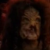

# His Dielectric Materials (Part 3) 

 
<b>Session started at 2024-12-24 / 04:06</b>
 
Fantasy Grounds - v4.6.2 ULTIMATE (2024-12-17) 
Fen's StarTrekAdventures Ruleset (v1.1.5)  
*[Prioritized Source: File; Other Sources: Vault]* 
*Core RPG ruleset (2024-12-17) for Fantasy Grounds
Copyright 2024 Smiteworks USA, LLC* 
*Fen's NPC Portrait Workaround v2.2.5* 
*[Prioritized Source: File; Other Sources: Vault]* 
*Fen's STA House Rules (v1.0.1) * 
*FG Browser v1.2.3* 
*[Prioritized Source: File; Other Sources: Vault]* 

>INTERIOR - Bridge: Dr. Malov's ship comes into visual range and appears on the viewscreen. The name has been changed since last you saw it, as it is now emblazoned with the name "Means of Production." Moments later, the familiar face of Dr. Malov appears on the screen. 

**Dr. Malov** Let me just first start by offering my sincere apology about that whole kidnapping affair the last time we met 
**Dr. Malov** You have to understand that, as union president, I am sworn to faithfully execute the will of the union body in the execution of my dutires 
**Dr. Malov** You'll be pleased to know that union membership has grown significantly since then and the union no longer predominantly focuses on criminal activity 
**Dr. Malov** We are presently engaged in a large-scale industrial action. 
**Zox** Did the Nausicaans overthrow you? 
**Dr. Malov** No, many of the original crew have left but some chose to stay behind in exchange for receiving a comfortable percentage of union dues as a salary in exchange for their vital security services 
*Skig decides to address the situation by remaining in the cargo bay and teaching the Pakleds about the dangers of electrocution.* 
**Hailey Murry** I'm glad it sounds like things are looking better, though it sounds like the struggle is ongoing. We're a little more concerned with that ship of Pakleds... 
KruschtyaEquation (Hailey Murry): Guys, do we have a personal cult army right now? 
**Dr. Malov** Ah yes, the Pakleds only recently joined the union. They were enthusiastic, but they seem to have misunderstood several important points 
*Throk walks past the view screen chewing on Pakled entrails.* 
**Hailey Murry** Quite. I hope there's no hard feelings about us breaking out of your ship?  
**Dr. Malov** None at all, I personally was never in favor of kidnapping as a source of funding 
**Hailey Murry** What sort of business production have you taken up? 
**Dr. Malov** We have established a much more regularlized system of union dues paid by our members to fund our operation. We do not directly engage in commerce as a union of course, our budget is used to support union members in their negotiations with management  
**Hailey Murry** Who are the management? 
**Dr. Malov** The Pakleds, for instance, had been tricked into signing exploitative labor contracts in which they were being paid only in the form of worthless trilitium geodes that would be produced as a mining biproduct. 
**Dr. Malov** Somehow the mine management had tricked them into thinking the geodes were rare and valuable. 
*Throk has a new Value for this episode.* 
indarien (Throk): That which you cannot eat strengthens your jaw 
**Hailey Murry** I see. I might recommend that they be provided union representation to aid them in their negotiations in the future. And perhaps a few minders, to help keep an eye on them. They were raiding ships for electrical insulation  
indarien (Throk): There might be a translation error with this famous Gorn saying. 
**Zox** Well, perhaps you didn't quite impart the lesson, prof...yes that. 
**Dr. Malov** Well as I said, they misunderstood some key points. But they are not the only workers involved in this strike 
**Hailey Murry** Oh quite. I might suggest that they're not quite at the level to look after their own affairs 
**Hailey Murry** Wait, which strike? 
**Dr. Malov** The mining consortium has refused to negotiate new contract terms, so we have enacted a sector-wide picket line to obstruct the mine's operations 
**Kolea** Picket Line? Why do I suspect there is a line of sentry ships attacking cargo vessels? 
**Dr. Malov** Yes, the Pakleds were supposed to stop those ore tenders and destroy their cargo, not strip their power systems of insulation 
*Kolea is worried Dr Malov's efforts are being miscontrued.* 
**Hailey Murry** They left the cargo, I'm afraid 
**Dr. Malov** The GORMAS is blocking mine operations throughout this sector, and will continue until management agrees to better contract terms 
**Hailey Murry** Can you forward over your contract terms? I'm curious what you've whipped up.  
Masakari (Zox): Every other gimmick goes into the rabbit hole and returns. Legalese? Well F that. Bless you Fen. 
**Dr. Malov** That is the problem: management has thus far refused to negotiate with the union at all 
**Hailey Murry** Who are the mining consortium out here? 
**Dr. Malov** "K'Mot's Jewels." They are an FCA-licensed inter-jurisdictional consortium 
**Dr. Malov** When the work force agreed to unionize, they fried everyone and replaced the entire workforce with new workers or automated robots  
**Kolea: [ REASON  (9) +  COMMAND  (2)]
[Focus: Syndicate Training ]
[Successes: 2] [Complications: 0]
Success with 1 momentum [2d20 = 16]** 
**Zox: [ INSIGHT  (7) +  SECURITY  (5)]
[Focus: Finances ]
[Successes: 2] [Complications: 0]
Success with 1 momentum [3d20 = 30]** 
**Zox:  [d20 = 3]** 
*Hailey Murry pulls up details on K'Mot's Jewels on the Lister's database* 
**Dr. Malov** for whatever reason, management has been completely unwilling to even open negotiations 
**Hailey Murry** How much difficulty did they have in finding new workers? 
**Dr. Malov** I don't know whether it was difficult for them, but it didn't take them very long 
**Dr. Malov** We have intercented hundreds of ships as part of our strike though, so the operation must be costing them tens of thousands of bars of latinum 
**Zox** I think you need to update your methods and seize the memes of production. Have you considered some negative press for K'mot Jewels? 
**Hailey Murry** Hm. That's interesting. Would you like us to reach out on your behalf to see if we can open negotiations?  
**Kolea: [ REASON  (9) +  SECURITY  (3)]
[Focus: Syndicate Training ]
[Successes: 0] [Complications: 0]
Failed on DC: 1 [2d20 = 32]** 
**Dr. Malov** If you are able to act as mediators it might help us negotiate a new, fairer contract 
**Zox** Hrm. So it seems K'mot actually sells to the Federation...there's some leverage. 
**Zox** Surely the Federation will not buy dubiously sourced materials! 
*Throk has had a truly horrible idea.* 
*Kolea looks at Zox.* 
**Kolea** You are so cute when you are clueless. 
**Throk** Wait? K'Mot? 
**Zox** Wait what? Im trying the civilized forum of violence. i.e. commerce? 
**Hailey Murry** Who within the Federation?  
**Zox** Let me push more buttons on this thing.... 
**Throk** I know him, he and I are members of Gorn Visceral Violence Poetry Appreciation Association. We have meeting in two days on Casino station near here. 
**Throk** I was going to join by video conference, but if we can go in person, then I can recite new poems I have written. 
**Lt. Cmdr Malat** Oh that I have to see 
*Kolea stares blankly at Throk.* 
**Kolea** I've got nothing. 
**Kolea** I mean, I had ideas, but they all withered and died. 
**Throk** Much like Pakleds when exposed to industrial ovens with not enough sauce! 
**Kolea** Not... helping? 
**Dr. Malov** If you think you can track down K'Mot and convince him to negotiate, I can beam over with a small team and join you 
**Dr. Malov** The Means of Production has to stay behind on the picket line though, she is the strongest ship that the union has 
**Kolea** That sounds great! 
**Hailey Murry** Do you have anyone within your union who has information on who they were selling to specifically?  
*Kolea prepares the "Ready Room" in Sickbay for Dr Malov Booty Calls.* 
**Dr. Malov** No, we don't have access to their records. That is something we would request in negotiations, to determine what a fair salary would be 
*Throk offers Captain Bachar some Pakled entrail sausage.* 
**Throk** Can I offer this in exchange for time off to attend poetry conference? 
**Geret:  [d20 = 15]** 
**Geret: [ REASON  (9) +  COMMAND  (4)]
[Focus: Starfleet Protocols ]
[Successes: 1] [Complications: 0]
Success with 0 momentum [2d20 = 31]** 
*Skig understands that all Starfleet Protocols are TCP based, since they run entirely on handshakes.* 
**Captain Bachar** Throk, don't offer me food ever again 
**Hailey Murry** That's an order 
**Captain Bachar** We can divert to this casino, track down this K'Mot 
**Throk** Okay! 
**Zox** I can see the poor pakled not having the stomach for it, but not you. 
**Hailey Murry** Does that mean we can requisition funds for official business? 
**Captain Bachar** But we are not going to intervene with force here, this is not our jurisdiction. We are acting strictly as an impartial mediator 
*Throk looks crestfallen at the prospect of not being able to slaughter and devour things to showcase the negotiation skills of Starfleet.* 
**Captain Bachar** Ghex, set a course for Throk's coordinates and engage at warp 5 once Dr. Malov and his party beam aboard 
**T'kor: [ CONTROL  (11) +  ENGINEERING  (4)]
[Successes: 1] [Complications: 0]
Success with 0 momentum [2d20 = 21]** 
*Zox puts on a business suit with a classy tie.* 
**T'kor** This is strange. Since when has Cargo Bay 3 drawn so much power? 
**Captain Bachar** You'd better go check it out 
>INTERIOR - Cargo Bay 3: By the time T'Kor, Zox and Malat get to the cargo bay and join Skig, the Pakleds appear to have extensively decorated the cargo bay with long strings of exposed electrical cable, sparking against the hull plating. In the corner of the cargo bay, they have set up a large conical shaped pile of wiring and metal plates which appears to be connected to the secondary of a tesla coil. It is flashing brightly with huge, high-frequency electrical arcs all around it 

**Captain Kaglor** Merry Resistmas 
**Captain Kaglor** is wearing a robe made of electrical isolation mats while he hangs decorations on the "tree" 
*Captain Kaglor is wearing a robe made of electrical isolation mats while he hangs decorations on the "tree" surrounded by high voltage coronal discharge* 
**Skig** Oh good T'Kor, I'm glad you are here to verify the drain on the Lister is insufficient to warrant an intervention here. 
**Skig** I stepped out to go to the resttoom and they had already turned it on when I came back. 
*Throk walks in.* 
**Throk** Throk loves the smell of burning Pakleds at Resistmas! 
**Gra'lan** Ohm my goodness, what's going on over there? 
**T'kor** This violates almost every electrical safety protocol I think Star Fleet has in its books, and several which the Tholians have which Star Fleet doesn't 
*Throk is wearing a festive red and white hat made of an electrical isolation mat.* 
**T'kor:  [d20 = 10]** 
**Lt. Cmdr Malat** It does seem a bit unsafe, but it kind of looks festive 
**Skig** Fortunately it goes through auxiliary conduit breaker C, so we can flip one switch and disable the whole thing. 
**Gra'lan** Can someone tell me the story of Resistmas? 
**Skig** As Gra'lan might remember though, we actually had to do things like this on Excelsior class ships to keep the shuttles from exploding in low humidity environments. 
**T'kor** "Festive" is one of those things which workers use to slack off, isn't it?  
**T'kor** Skig was telling me about it when I first transferred 
**Captain Kaglor** Yes. The Resistmas tree has very high voltage. And the dielectric materials have very high resistance.  
**Gra'lan** Ah....I miss the old steam and diesel punk aesthetics. 
**Gra'lan** Raw electricity in action,  no glossy panels! 
**Skig** Yes, Festive is generally a time for getting less work done; however, there are times when the improvement in crew morale might be worth it. 
**Skig: [ INSIGHT  (8) +  COMMAND  (2)]
[Focus: Faking Empathy As Best as Possible ]
[Successes: 2] [Complications: 0]
Success with 1 momentum [2d20 = 13]** 
**Gra'lan** it's like the spirit of Radio Shack too coporeal form. 
**Lt. Cmdr Malat** On some level, they must have seen something in the cultural database that made them want to have religious practices of their own 
**Captain Kaglor** We do not need to practice, we are already good 
**Skig** I might have showed them the stop-motion animation Rudolph the Red-Nosed Reindeer and they kind of went overboard? 
**Skig** Something about lighting their noses up with wiring? 
*Gra'lan tears up at hearing Skig's words.* 
*Gra'lan hugs most of the aliens and Skig.* 
**Captain Kaglor** His nose would need current to light up 
**Throk** This explain smell of burning Pakled nostril hair? 
**Captain Kaglor** He needed more dielectric materials 
**Skig** He did indeed, you are learning well, Captain Kaglor. 
**Captain Kaglor** The Resistmas tree will show who has enough dielectric materials and who does not 
**Captain Kaglor** It only hurts those who don't have dielectric materials 
*Captain Kaglor hands the crew a robe of electric insulators and an ornament* 
**Gra'lan** Captain Kalgor, can we put this and perhaps several other electric art assets on the top of the saucer, such that we spread Resistmas cheer as we travel? 
**Captain Kaglor** Here, hang this on the Resistmas tree 
*Kolea suspects, all the way from sickbay, that she is about to become stupidly busy, again.* 
**Gra'lan** It's a shame the whole neighborhood....I mean galaxy can't see our lights! 
*Throk gesures for Gra'lan to go first.* 
**Captain Kaglor** Yes, this is a good idea 
**Throk** Age first, it is the Gorn way. 
*Throk wonders how chewy Gra'lan is.* 
**Gra'lan: [ REASON  (11) +  ENGINEERING  (4)]
[Successes: 1] [Complications: 0]
Success with 0 momentum [2d20 = 27]** 
**T'kor ** *(into his comm badge)*: Kolea, could you please prepare first aid for significant electrical burns? 
*Throk remembers fondly the day they BBQ'd and devoured his least favorite uncle at Resistmas.* 
**Kolea** Mass producing burn cream and electrical resistance suits for first response teams now. 
>Gra'lan determines that it should be safe as long as he is very careful to make sure that he does not provide any path through his body directly to the ship, he steps carefully onto the isolation mats before he touches the tree, and feels only a minor tingle instead of horrible pain 

**Gra'lan** these Pakleds are brilliant! look at this, overcomes all the issues with string lights in one marvellously harmonious solution! 
**Lt. Cmdr Malat** I don't know if I'd call them brilliant 
**Gra'lan** I think you need an extra Resistmas hug. 
**Lt. Cmdr Malat** Do not touch me 
>Suddenly, Captain Bachar bursts into the room  

**Captain Bachar** What in the hell... 
**Captain Bachar** Someone had better have an explanation for what is going on here 
*Throk wonders why Captain Bachar has Shapeshifted into a Green Scary Looking Creature that appears to have come from a Dr Seuss book.* 
Masakari (Gra'lan): ...and Captain' Bachar's heart grew three sizes! 
**Captain Bachar** T'Kor, disconnect this thing from the power grid 
**Captain Bachar** This is clearly a safety hazard 
**T'kor** Of course, Captain 
**Skig** Just a second T'kor. 
**Skig** They did get out of hand with the Resistmas tree; however, I believe if you alternate the current between the polarity caps on Circuit B and EPS conduit 114-A just outside hangar 3, it will provide the same amount of illumination and take about 1/10 the necessary power and drastically reduce the hazard to people in the cargo bay. 
**Skig** The Pakleds won't really notice the difference in voltage due to their electrically resistant hides. 
**Lt. Cmdr Malat** I can post guards outside to make sure none of the crew wander in and get electrocuted 
**Skig** Good suggestion as well. 
*Throk gets BBQ sauce ready.* 
**Gra'lan** But can you really understand dielectric materials without experiencing their full resistance profile?  
**Skig: [ PRESENCE  (8) +  ENGINEERING  (5)]
[Focus: Faking Empathy As Best as Possible ]
[Successes: 4] [Complications: 0]
Success with 3 momentum [2d20 = 8]** 
**Captain Kaglor** Yes, the voltage needs to be high 
**Skig** It will be perfectly high for all your dialecetric needs. 
**Skig** I can guarantee it based on my deep knowledge of making things get electrocuted. 
*Captain Kaglor nods along as Skig speaks* 
**Gra'lan** are you sure we won't be trapped in a state of false capacitance? 
**Captain Kaglor** Skig knows a lot about voltage 
**Captain Bachar** Alright, against my better judgement... Skig, T'Kor make sure this tree does not kill anyone 
**Gra'lan** It will bring us together in total solidarity! 
**Gra'lan** All hall the spirit of resitmas! 
**Lt. Cmdr Malat** What exactly do we do to celebrate resistmas? 
**Gra'lan** We catch up with the comings and going of the year, ya know, stay current. 
**Captain Kaglor** We make "Secret Circuit." Everyone takes a name from bucket and gives gift. The gifts go under the tree, so only gifts strong in dielectric materials will survive 
**Captain Kaglor** Gifts with weak dielectric materials will be destroyed by the voltage 
**Captain Kaglor** Then we exchange gifts like conductors exchange charges 
*Captain Kaglor holds out a small bucket full of slips with names on them* 
**Lt. Cmdr Malat** Well, I'm in 
**Lt. Cmdr Malat** Sounds like fun 
**Gra'lan** Such preparation! 
*Lt. Cmdr Malat writes her name on a slip and drops it into the bucket* 
*Gra'lan notes that Skig must have really worked these guys into a cohesive force. * 
*Gra'lan Gralan is in* 
*Skig is a leader of electrical prowess.* 
*Skig tosses her name in the hat.* 
*Throk adds his name to the bucket.* 
**Skig** Captain, would you like to join a team bonding experience? 
**Skig** Perhaps with some electrical capacitance tape? 
*Captain Bachar sighs* 
**Captain Bachar** I suppose it wouldn't hurt anything 
**Captain Bachar** T'Kor, see if you can replicate some dielectric wrapping paper  
*Captain Bachar drops her name in* 
*Kolea only uses electrical tape in bedrooms, not under high voltage trees.* 
**T'kor** I... yes sir 
**Mowus: [ REASON  (9) +  ENGINEERING  (2)]
[Focus: Anthropology ]
[Successes: 1] [Complications: 0]
Success with 0 momentum [2d20 = 22]** 
*Hailey Murry drops her name in* 
**Mowus** I can't even get close to that without my breathing apparatus malfunctioning. 
*Mowus bubbles intensify* 
*Kolea is fully expecting a mass casualty event for this week's cliffhanger.* 
**Captain Kaglor** Now you take name, and conduct the good will of Resistance to one another 
GM: Resistmas* 
*Oakadan stands back in a large red resistance suit* 
*Throk has never seen this many people volunteer to get cooked for his ingestion.* 
**Throk:  [d20 = 1]** 
**Throk:  [d20 = 11]** 
**Mowus:  [d20 = 11]** 
**Mowus:  [d20 = 5]** 
**Skig:  [d20 = 10]** 
**Mowus:  [d20 = 10]** 
**Mowus:  [d20 = 17]** 
**Mowus:  [d20 = 8]** 
**Mowus** Im getting flashbacks of glofish tanks.... 
**Kurij:  [d20 = 1]** 
**Skig:  [d20 = 12]** 
*Mowus blinks repeatedly and has to look away.* 
**Skig:  [d20 = 10]** 
**Mowus:  [d20 = 3]** 
**Mowus:  [d20 = 14]** 
**Mowus:  [d20 = 1]** 
**Skig:  [d20 = 12]** 
**Skig:  [d20 = 15]** 
**Skig:  [d20 = 5]** 
**Kurij:  [d20 = 10]** 
**Hailey Murry:  [Total: 0] [Effects: 0] [dChallenge = 0]** 
**Mowus:  [Total: 1] [Effects: 1] [dChallenge = 1]** 
**Mowus:  [Total: 1] [Effects: 1] [dChallenge = 1]** 
**Mowus:  [Total: 0] [Effects: 0] [dChallenge = 0]** 
**Oakadan:  [Total: 1] [Effects: 1] [dChallenge = 1]** 
**Kurij:  [Total: 1] [Effects: 1] [dChallenge = 1]** 
**Skig:  [d20 = 4]** 
**Captain Bachar** Alright, in the meantime I expect you all to not let this diversion interfere with your duties 
**Captain Bachar** We should be approaching that casino soon, so everyone had better be back at their stations in 30 minutes 
**Gra'lan: [ INSIGHT  (10) +  SECURITY  (2)]
[Successes: 2] [Complications: 0]
Success with 1 momentum [2d20 = 18]** 
*Mowus bumps into walls rather carelessly, the light is too disorienting.* 
>INTERIOR - Hot Hand Casino and Grill: Skig and her away team materialize in the casino lobby, ready to track down K'Mot 

*Skig presents list of crew assignments to Bachar.* 
**Skig** T'Kor and I will be monitoring the Pakleds. 
>INTERIOR - Hot Hand Casino and Grill: Lt. Commander Murry and her away team materialize in the casino lobby, ready to track down K'Mot 

**Skig** Murry, Kolea, Zox, and Throk will go with Dr. Malov to the Casino. 
**Skig** The rest of the crew will maintain normal duties. Sound acceptable captain? 
*Zox prays to the Casino Gods that somehow, Juan will manifest here.* 
**Captain Bachar** Agreed 
*Throk vanishes from view within a few seconds of appearing.* 
*Kolea vanishes from view within a few seconds of appearing.* 
*Throk fkexes his Gornly muscles.* 
**Zox** I do love a clean negotiation. 
**Throk** This Throk kind of place, filled with delicious things and great poetry of life, death, slavery, ingestion, and indigestion! 
**Lt. Cmdr Malat** Just don't eat anything sentient 
**Kolea: [ INSIGHT  (11) +  CONN  (1)]
[Focus: "Diplomacy" ]
[Successes: 0] [Complications: 0]
Failed on DC: 1 [2d20 = 31]** 
**Lt. Cmdr Malat** I am pretty lax as far as security chief's go, but I will write you up if you eat someone 
*Zox Zox acts as a bodyguard for Malov* 
**Zox: [ CONTROL  (11) +  SECURITY  (5)]
[Successes: 1] [Complications: 1]
Success with 0 momentum [2d20 = 35]** 
**Throk** Some sentient things wish to be eaten though? 
**Throk** For instance, Nautrian Cattle come to table here and mention which parts are most delicious and which wine pairings go best with which organs. 
*Throk gestures to what looks like a dairy cow standing near a table discussing itself.* 
**Lt. Cmdr Malat** Let's try to avoid comitting any war crimes here 
**Lt. Cmdr Malat** Murry, what's the plan? 
**Zox** I mean....I imagine by the time we get back, someone will be cooked from that whole 'resistmas' event....maybe it's a time for patience. 
GM: K'Mot 
**Hailey Murry** Plan right now is to get a feel for what K'mot's goals are first. We also want to confirm why he's standing so fast, and if we can I want to see who he's selling to in Star Fleet 
**Kolea: [ PRESENCE  (9) +  SECURITY  (3)]
[Focus: Bodai Shin Adept ]
[Successes: 1] [Complications: 0]
Success with 0 momentum [2d20 = 21]** 
Masakari (Zox): Dilithium futures markets! 
*Throk heads off to poetry review to mingle with other members of his poetry association and ask about K'Mot.* 
**Lt. Cmdr Malat** I'd better keep an eye on him 
**Throk: [ INSIGHT  (9) +  CONN  (3)]
[Focus: Poetry ]
[Successes: 0] [Complications: 0]
Failed on DC: 1 [2d20 = 34]** 
**Throk** Hello fellow vicious poetry lovers! 
*Throk is wearing his Pakled intestine stained Starfleet uniform.* 
*Throk mingles and quotes tanka about the joys of disembowelment.* 
>As the away team heads through the casino floor towards the poetry club meeting, they are stopped by the pit boss with several security guards 

**Hailey Murry: [ REASON  (9) +  SECURITY  (3)]
[Successes: 1] [Complications: 0]
Success with 0 momentum [2d20 = 25]** 
**Pit Boss** Excuse me sirs, and madams 
**Hailey Murry** Good evening 
**Pit Boss** We would like to ask you to please come with us to the security office 
**Throk** Hello Pit Boss, I would like the spicy BBQ. 
**Throk** You boss of BBQ pit, right? 
**Hailey Murry** Of course. May I ask why?  
**Pit Boss** No sir, you have misaprehended 
**Throk** Okay, carry on then. 
**Pit Boss** We have received a complaint about harassment from two of our patrons 
*Hailey Murry blinks* 
**Zox** Impossible. 
**Pit Boss** We will need you to accompany us to the security office in order to discuss it 
**Hailey Murry** Well that seems odd, given that we just arrived, but lead the way.  
*Throk looks at Malat as if to say, "I didn't start war crime, but I will finish it."* 
**Pit Boss** leads Murry and her team off the casino floor and through a door labeled "Staff Only." The security guards search them for weapons, then take them down a long corridor, eventually terminating in a dark, concrete and steel room. 
*Pit Boss leads Murry and her team off the casino floor and through a door labeled "Staff Only." The security guards search them for weapons, then take them down a long corridor, eventually terminating in a dark, concrete and steel room.* 
**Zox: [ CONTROL  (11) +  SECURITY  (5)]
[Focus: Espionage ]
[Successes: 2] [Complications: 0]
Success with 1 momentum [2d20 = 27]** 
**Hailey Murry: [ CONTROL  (7) +  SECURITY  (3)]
[Successes: 2] [Complications: 0]
Success with 1 momentum [2d20 = 16]** 
>The security guards fail to find any weapons on the away team, incredibly. 

>As the team is lead into the dark, dank back room, the pit boss closes and locks the door as several Nausicaans emerge from the shadows. 

*Throk licks some blood off his very very sharp claws and looks at the security guards like they are tasty.* 
**Nausicaan Brute** You should have stayed in Federation space, starfleet 
>♫♫♫Ominous Music Sting♫♫♫ 

>---------CUT TO COMMERCIAL------- 
