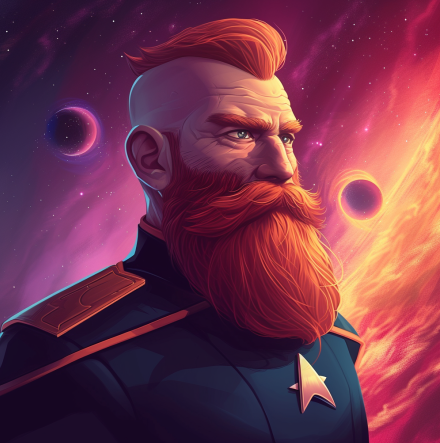
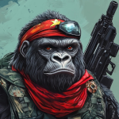

# His Dielectric Materials (Part 4) 

 
<b>Session started at 2024-12-31 / 04:08</b>
 
Fantasy Grounds - v4.6.2 ULTIMATE (2024-12-17) 
Fen's StarTrekAdventures Ruleset (v1.1.5)  
*[Prioritized Source: File; Other Sources: Vault]* 
*Core RPG ruleset (2024-12-17) for Fantasy Grounds
Copyright 2024 Smiteworks USA, LLC* 
*Fen's NPC Portrait Workaround v2.2.5* 
*[Prioritized Source: File; Other Sources: Vault]* 
*Fen's STA House Rules (v1.0.1) * 
*FG Browser v1.2.3* 
*[Prioritized Source: File; Other Sources: Vault]* 

>INTERIOR - Dark Casino Backrooml: Murry, Zox, Throk and Malat hear a loud clang as the pit boss closes the door behind them, and the rattle of a large manual door lock being lowered into place. As their eyes adjust to the darkness, several large Nausicaans emerge from the shadows. 

**Nausicaan Brute** You should have stayed in Federation space, starfleet. 
**Throk** But this is Federation Space 
**Throk** Throk has been informed that wherever Starfleet is standing, Federation Laws apply, therefore, it is Federation space. 
**Lt. Cmdr Malat** That is definitely not true  
**Throk** Throk thinks this is mentioned mostly by people who do not want Throk to do what Throk wants to do though. 
**Nausicaan Brute** Do you see comrades? This beast reveals the true colors of the Federation.  
**Hailey Murry** Comrades?  
**Nausicaan Brute** Expansionist, imperialist! 
**Throk** Rainbow? 
**Throk** Federation is definitely a rainbow. 
*Nausicaan Brute lunges at Throk with a Klingon pain stick* 
**Throk** Like Bacon wrapped skittles. 
**Hailey Murry** Throk, that's a little more esoteric than normal 
**Hailey Murry** I didn't actually get that one 
>[ROUND 1] 

>[TURN] Nausicaan Brute 1 

**Throk: [ DARING  (9) +  SECURITY  (4)]
[Focus: Gorn-Fu ]
[Successes: 3] [Complications: 0]
Success with 2 momentum [2d20 = 10]** 
>Throk slaps the puny pain stick away effortlessly 

>[TURN] Zox 

>[TURN] Throk 

>[ROUND 1] 

>[TURN] Nausicaan Brute 1 

>[TURN] Throk 

**Throk: [ DARING  (9) +  SECURITY  (4)]
[Focus: Gorn-Fu ]
[Successes: 3] [Complications: 0]
Success with 2 momentum [3d20 = 17]** 
**Throk: [ CONTROL  (8) +  SECURITY  (4)]
[Focus: Gorn-Fu ]
[Successes: 4] [Complications: 0]
Success with 3 momentum [3d20 = 14]** 
Masakari (Zox): A N G E R Y dice =D 
**Throk:  [Total: 6] [Effects: 2] [7dChallenge = 6]** 
**Throk:  [Total: 7] [Effects: 2] [7dChallenge = 7]** 
*Throk grabs the Nausicaan and flings most of him through the air, pinballing him off other Nausicaans and leaving several of them badly injured.* 
*Throk looks back at Malat.* 
>[TURN] Nausicaan Comrade 1 

**Throk** It okay I not eat them, just crush skulls and once they non-sentient I check for tastiness? 
*Zox wonders how daffy they are to pick a fight with a hungry gorn.* 
>One of the Nausicaans pulls out a photon grenade, and lobs it into the middle of the away team 

*Throk grabs the Photon Grenade with his mouth mid-air chomps down on it, then belches a gout of steaming hot plasma at the rest of the away team.* 
**Throk** Sorry 
**Zox: Zox has used a point of Determination to add a natural one to the dice pool.** 
**Zox: [ CONTROL  (11) +  SECURITY  (5)]
[Successes: 3] [Complications: 0]
Success with 2 momentum [3d20 = 42]** 
**Zox:  [d20 = 8]** 
**Zox:  [Total: 9] [Effects: 1] [7d6 = 9]** 
>[TURN] Zox 

>[TURN] Nausicaan Comrade 2 

*Nausicaan Comrade shoots Zox in the arm for 3 more damage, but accidentally gets his foot caught in a nearby machine, breaking his leg and causing him to fall to the ground immobile* 
>[TURN] Hailey Murry 

**Nausicaan Comrade** The imperialists bleed comrades! 
**Hailey Murry: [ CONTROL  (7) +  SECURITY  (3)]
[Successes: 1] [Complications: 0]
Success with 0 momentum [2d20 = 21]** 
>[TURN] Nausicaan Brute 2 

*Zox tears off his suit and reveals a luchadore outfit.* 
**Hailey Murry: [ DARING  (10) +  SECURITY  (3)]
[Successes: 2] [Complications: 0]
Success with 1 momentum [2d20 = 21]** 
>[TURN] Lt. Cmdr Malat 

>Murry spins away from the Nausicaan's attack 

*Throk watches Malat shoot with a phaser.* 
**Hailey Murry:  [Total: 6] [Effects: 1] [6dChallenge = 6]** 
**Throk** Good job Security Chef, they will be nice and crispy, make sure to set phaser to deep fry. 
>[TURN] Nausicaan Comrade 5 

>[TURN] Nausicaan Brute 3 

**Nausicaan Brute** Puny Federation, hiding behind your imperialist phasers! 
**Nausicaan Brute** I show you true strength! 
**Throk** You are wrong, Throk use Imperialist Klingon Disruptor. 
>The Nausicaan jams the pain stick into Malats ribs, wracking her body in pain and causing her to fall to the deck in a seizure 

>[TURN] Nausicaan Comrade 3 

>[ROUND 2] 

**Zox: [ DARING  (12) +  SECURITY  (5)]
[Successes: 3] [Complications: 0]
Success with 2 momentum [3d20 = 36]** 
**Zox:  [d20 = 18]** 
**Zox:  [Total: 5] [Effects: 1] [5dChallenge = 5]** 
**Zox: [ REASON  (7) +  SECURITY  (5)]
[Successes: 3] [Complications: 0]
Success with 2 momentum [2d20 = 11]** 
*Kolea is really happy she is not there to see what is going on in the women's restroom because someone pushed the "automated tampon removal" button on the device far too close to that guy's legs.* 
**Throk** Even Throk is not that cruel. 
**Hailey Murry: [ DARING  (10) +  MEDICINE  (4)]
[Successes: 1] [Complications: 0]
Success with 0 momentum [d20 = 10]** 
**Throk** Maybe it is dialysis bag cleansing machine? 
**Throk** Kidney scrubber? Throk likes eating scrubbed kidneys. 
**Zox** I have no idea how this ended up in a corridor.... 
**Throk** Colostomy fit check device? 
**Kolea** That could be quite gruesome on a healthy person. 
>[TURN] Zox 

>[TURN] Nausicaan Brute 2 

*Hailey Murry dodges out of the way of the painstick, only to dodge directly into a pipe on the wall, dislocating her old-person shoulder* 
**Hailey Murry** ARGH 
**Throk: [ DARING  (9) +  SECURITY  (4)]
[Focus: Gorn-Fu ]
[Successes: 3] [Complications: 0]
Success with 2 momentum [2d20 = 12]** 
**Throk: [ DARING  (9) +  SECURITY  (4)]
[Focus: Gorn-Fu ]
[Successes: 5] [Complications: 0]
Success with 4 momentum [3d20 = 12]** 
**Nausicaan Brute** fails to hit the mighty Throk with his puny pain stick 
**Throk:  [Total: 2] [Effects: 0] [7dChallenge = 2]** 
**Throk:  [Total: 3] [Effects: 1] [6dChallenge = 3]** 
**Throk:  [Total: 4] [Effects: 4] [4dChallenge = 4]** 
>[TURN] Hailey Murry 

>[TURN] Throk 

>[TURN] Nausicaan Comrade 3 

*Throk smashes the pain stick into the Nausicaan so violently it kebabs through him. Throk likes Kebabs and notices that Malat is incapable of complaining about the situation, so he bites that one in half.* 
**Throk:  [Total: 2] [Effects: 0] [3dChallenge = 2]** 
*Nausicaan Comrade blasts Throk with a disruptor shot that would have knocked him out, if not for the incapacitated Nausicaan he is wearing as a cumberbun* 
*Throk watches the Nausicaan's shoot their partially eaten comrade.* 
>[TURN] Hailey Murry 

**Hailey Murry: [ DARING  (10) +  MEDICINE  (4)]
[Successes: 1] [Complications: 0]
Success with 0 momentum [2d20 = 22]** 
**Throk** You vile psychopaths! Stop trying to cook my raw Nausicaan meal. 
**Nausicaan Comrade** The imperialist savages will eat you, we must not let them win! 
Masakari (Zox): We need a deck of the Lister that's an arena of exotic creatures to beam opponents into. 
>[TURN] Nausicaan Comrade 5 

**Hailey Murry** Throk! Stop trying to eat them, you're leaving a bad impression! 
>[TURN] Lt. Cmdr Malat 

Masakari (Zox): create advantage and get us cover. =D 
**Throk** Throk often told you never given a second chance to make a worst impression. 
**Kolea** Throk, that is one of the most accurate things you have ever said. 
**Zox:  [d20 = 10]** 
**Lt. Cmdr Malat** That Gorn over there still looks pretty hungry to me. If I were you, I'd lay down those disruptors and come with me to the brig. We don't give him the code to doors. 
**Nausicaan Comrade** Maybe the we should listen to the imperialist, I don't want to be eaten 
>The 3 remaining Nausicaans come out from their cover and lay down their weapons, surrendering to Malat 

*Throk makes menacing chomping noises one the bones of the Nausicaan Brute stuck in his mouth.* 
**Hailey Murry** What on earth were you lot doing? What's all this about imperialists?  
**Zox: [ INSIGHT  (7) +  COMMAND  (2)]
[Successes: 0] [Complications: 0]
Failed on DC: 1 [2d20 = 36]** 
**Hailey Murry: [ INSIGHT  (13) +  COMMAND  (2)]
[Successes: 0] [Complications: 0]
Failed on DC: 1 [2d20 = 33]** 
**Throk: [ INSIGHT  (9) +  COMMAND  (2)]
[Focus: Animal Training ]
[Successes: 0] [Complications: 0]
Failed on DC: 1 [2d20 = 28]** 
**Nausicaan Comrade** The Federation are imperialists, expanding their borders and imposing their laws 
**Nausicaan Comrade** We are the true voice of freedom, unlike the class traitor Dr. Malov 
**Zox** We aren't imperialists, we are here on behalf of the United Asteroid Workers Union! 
**Throk** Interesting, Throk realize now all Nausicaans taste like Sehlat. 
*Nausicaan Comrade scoffs* 
**Kolea** Throk.... how many Vulcan children's pets have you eaten? 
**Throk** Umm...with or without children included? 
**Kolea** Nevermind. 
**Nausicaan Comrade** Dr. Malov's union of traitors offers no true freedom, we will lead the workers of this sector to freedom from the capital holding classes 
**Nausicaan Comrade** And freedom from the imperialist whims of the Federations 
**Zox** ...you are working for a Ferengi? 
**Hailey Murry** Ohhhh, this makes a lot more sense now 
**Nausicaan Comrade** No, Malov would negotiate with the Ferengi 
**Nausicaan Comrade** We came here to kill him 
**Nausicaan Comrade** You cannot negotiate with the capital holding classes, they must be exterminated like vermin 
**Hailey Murry** That sounds like quite the satisfying message for you. Who's the one in charge? 
**Nausicaan Comrade** Chuk'ta is our leader, he was second in command under Jasanis 
**Throk** Was he one of the tasty ones, or he still alive? 
**Hailey Murry** Did y'all pay off the casino or what?  
**Nausicaan Comrade** He leads the Nausbols in our mission to establish a TRUE, free, society. Unlike the traitorous incrementalism and egalitarianism of Dr. Malov 
**Nausicaan Comrade** He is still alive, and yes we convinced the casino security to join us  
**Hailey Murry** Do you have a pamphlet for that plan or like a spread sheet? Because I'm genuinely curious how far he's planned ahead 
**Nausicaan Comrade** I do have a pamphlet for our movement 
**Throk** Throk is getting the feel of Lenin vs Trotsky from this conversation. 
*Nausicaan Comrade hands Murry a propganda pamphlet for "Nausicaan Bolshevism"* 
**Throk** Throk wonder if you have an interest in ice picks for Malov? 
**Hailey Murry** And you just ambushed us because of the uniforms or what? 
*Zox Straightens his tie.* 
**Nausicaan Comrade** Federation does not approve of assassinations, you would try to stop us 
**Nausicaan Comrade** Imposing your imperialist will on us 
**Zox** I wouldn't. Infact, Ill even give you locations of all the mines so you have fertile recruiting grounds. 
**Nausicaan Comrade** But it is too late now, by now those foolish Ferengi have already been led into our ambush 
**Hailey Murry** I think calling "preventing wanton murder" by the name "imposing your imperialist will on us" is a bit of a stretch 
**Hailey Murry** There's no way you have a second ambush set up, where would you even fit it? 
**Throk** Throk have no imperialist will, only interest in satiating unfillable gullet with delicious meat. 
**Hailey Murry: [ INSIGHT  (13) +  SECURITY  (3)]
[Focus: *Psychology ]
[Successes: 2] [Complications: 0]
Success with 1 momentum [2d20 = 25]** 
**Nausicaan Comrade** You lack imagination hew mon. The shuttle bay of this casino is the perfect place for an ambush. Your puny mind is no match for our intellect 
**Hailey Murry** Blast it. You've got a really well thought out scheme going on 
Masakari (Zox): but Malov is the face here, Naussicans are the heel. 
**Kolea: [ INSIGHT  (11) +  SECURITY  (3)]
[Focus: "Diplomacy" ]
[Successes: 1] [Complications: 0]
Success with 0 momentum [2d20 = 31]** 
**Hailey Murry** Okay we're going to teleport you off for now and we'll negotiate your release later 
**Kolea: [ PRESENCE  (9) +  SECURITY  (3)]
[Focus: Bodai Shin Adept ]
[Successes: 4] [Complications: 0]
Success with 3 momentum [2d20 = 5]** 
>As Malat and Zox round up the Nausicaans and transport them to the brig, one of the dead Nausicaan's communicators activates 

*Throk spits out the communicator.* 
**Throk** Call for you Murray. 
**Chuk'ta (Comms)** Comrades, the Ferengi are dead! An orion female executed them in cold blood, just before we could ambush them 
**Zox** Oh no! Not K'tat! 
**Chuk'ta (Comms)** I have already given the order to execute the next phase of our plan. Armed guerillas are infiltrating the Federation vessel as we speak to eliminate the class traitor! Rejoice brothers, soon there will be no opposition to our rule 
**Throk** Wait, does this mean Throk get to eat more Nausicaans? 
*Zox looks at Kolea* 
**Zox** did you spoof these goons? 
*Throk looks at Malat for instructions, as she is the security CHEF.* 
**Hailey Murry** Zox, can you pretend to be a Naussican and ask where we should go? 
**Zox: [ PRESENCE  (10) +  COMMAND  (2)]
[Focus: Xenobiology ]
[Successes: 2] [Complications: 0]
Success with 1 momentum [2d20 = 11]** 
**Zox** Uh, Boss, Yeah about that, how do we get to the traitor from down here? 
**Zox** We forgot the glorious plan after a few hits to the head down here. 
*Hailey Murry motions frantically for Zox to stop talking and let them talk* 
*Zox shuts up.* 
**Chuk'ta** You moron! I explained it to you before you left: after you kill the Federations, return to the ship in the landing bay. 
**Chuk'ta** If you forget again: I will tear off your arm and feed it to you! 
**Zox** Yes, ye glorious visionary leader of the true Nausicaan's rebellion! 
**Throk** Throk like this Chuk'ta's leadership style. Very Gorn. 
*Chuk'ta hangs up the call* 
**Hailey Murry** I think Kolea teleported the Ferengi to the ship, so we should be able to either head to the shuttle to sabotage it or just leave 
**Zox** Sabotage it and set it on a return course. 
**Zox** it's SA BO TAGE! 
*Zox air guitars.* 
**Zox** Oh sorry. 
**Lt. Cmdr Malat** I think we should avoid a direct confrontation with more Nausicaans if we can 
**Lt. Cmdr Malat** These guys are not playing with kid gloves 
**Zox** Okay, so we still sabotage it, and make it look like it blew up, because they are missing one away team 
**Zox** And they won't take kindly to that 
*Throk pours some sriracha sauce on random, loose-lying, Nausicaan limb and starts chewing on it while it is impaled on a pain-stick like a hot dog at a county fair.* 
**Lt. Cmdr Malat** Good thinking 
**Zox: [ CONTROL  (11) +  SECURITY  (5)]
[Focus: Espionage ]
[Successes: 2] [Complications: 0]
Success with 1 momentum [2d20 = 30]** 
*Hailey Murry smacks Throk with the not-turned-on painstick* 
**Hailey Murry** Stop that 
**Throk: [ FITNESS  (10) +  ENGINEERING  (2)]
[Focus: Gorn-Fu ]
[Successes: 1] [Complications: 1]
Success with 0 momentum [2d20 = 31]** 
>Throk attempts to open the door by bashing it with his face 

**Hailey Murry** Stop that too!  
**Throk** Throk actually not feeling very good right now. Throk think maybe it something he ate. 
**Hailey Murry** We're actually pretty beat up. We should return back to the ship for now and find the sabateurs on our own ship.  
*Throk vomits up a partially digested skull.* 
**Hailey Murry ** *(in communicator)*: Murry to Lister, are you there? 
**Throk** Oh, they have nasty toxic brain bits. Throk forgot that. 
*Zox hands Throk a tums* 
**Throk** Thank you. 
*Throk does not bite the hand that medicates him.* 
**Ensign Ghex (Comms)** Yes ma'am, I'm here. Just working. I had a few calibration tasks that needed to be done, and I figure that it was a good time to do it because we are in orbit and we are not planning to leave anytime soon you know? Are leaving soon? I may have to finish this calibration later and bring the navigational sensors back online if we need to break orbit 
*Hailey Murry picks up one of the Naussican communicators* 
**Kolea** Skig, trust me, if you need advice on how to handle being worshipped and called a god, I have some pointers for you. 
**Skig** I am good, thank you for your suggestions. 
**Hailey Murry ** *(in Star Fleet communicator)*: It appears that an offshoot of Malov's movement is attempting to infiltrate the Lister. Have we had anyone board recently? If not obviously, have Skig or T'kor do a review 
**Skig: [ PRESENCE  (8) +  COMMAND  (2)]
[Focus: Faking Empathy As Best as Possible ]
[Successes: 1] [Complications: 0]
Success with 0 momentum [2d20 = 16]** 
**Ensign Ghex** We didn't have any official boarding parties, the captain would have had to approve any visitors since this is not a Starfleet outpost. So per regulations, the captain would have to give approval to anyone coming on board. The pakleds did bring some supplies on board with permission for "religious purposes" but to be honest, I think this religion is kind of a bunch of made up nonsense. Although, I guess in a sense, all religions are made up so maybe it isn't really that different 
**Lt. Cmdr Malat** Shut up kid 
**Skig** I will run an internal sensor sweep looking for any lifesigns that are not Starfleet officers or Pakleds specifically in the cargo bay and toss them in a transporter buffer until we can lock them safely in our currently overcrowded brig. 
**Hailey Murry** Thanks, Skig 
**Skig** Good job handling comms Ghex, we can take it from here. 
**Skig: [ DARING  (10) +  ENGINEERING  (5)]
[Focus: Security Systems ]
[Successes: 1] [Complications: 0]
Success with 0 momentum [2d20 = 26]** 
**Skig: [ INSIGHT  (8) +  SECURITY  (3)]
[Focus: Security Systems ]
[Successes: 1] [Complications: 0]
Success with 0 momentum [2d20 = 24]** 
**T'kor: [ CONTROL  (11) +  SECURITY  (2)]
[Successes: 1] [Complications: 0]
Success with 0 momentum [d20 = 7]** 
*Skig pats the Lister console.* 
**Skig** Whose a good little ship, rolling a 1 like that. Good ship. 
*Zox lister purrrs* 
**Throk** Our internal sensors appear to be jammed or malfunctioning. Possibly they are being looped, because I am still showing the away team on the ship and not on the station. 
**Skig** Our internal sensors appear to be jammed or malfunctioning. Possibly they are being looped, because I am still showing the away team on the ship and not on the station. 
**Captain Bachar** Skig, take a team and investigate 
**Captain Bachar** If there are intruders on board, I want to know about it 
**Skig** Captain, might I recommend yellow alert and general quarters? 
**Captain Bachar** Agreed 
**Skig** And possibly beam the team back over and put our shields up? 
**Captain Bachar** Let's leave the away team to complete their sabotage mission first, but I agree we should raise the shields for now 
**Zox: [ DARING  (12) +  SECURITY  (5)]
[Focus: Espionage ]
[Successes: 2] [Complications: 1]
Success with 1 momentum [2d20 = 24]** 
*Skig raises shields and sends security teams to critical areas with explicit orders to arrest anyone who should not be there.* 
**Zox:  [d20 = 12]** 
**T'kor** Bachar, do you know where Kolea is as well? She split off from us earlier. 
**Hailey Murry** Bachar, do you know where Kolea is as well? She split off from us earlier. 
**Captain Bachar** She beamed up a pair of Ferengi to the brig a few minutes ago 
**Captain Bachar** I think she is still in the Casino  
**Hailey Murry** Malov is the primary target for the Naussicans. They think the Ferengi are dead, so we should keep it that way 
**Windbloom Openheart** We should totally protect him then, this ship is supposed to be a safe space 
**Throk** Throk knew sexy Chief Medical Officer was not capable of murdering random people indiscriminately. Throk happy to know she is not guilty of war crimes. 
**Throk** Throk think only Security Chefs and Throk should be allowed to engage in rampant war crimes. 
**Geret** Oooh! Security! 
*Skig gets a Phaser Type-2 issued to the entire group AND makes sure it is set to "stun".* 
>INTERIOR - Guest Quarters: Skig, Windbloom, Oakadan and Geret grab phasers and head to Dr. Malov's quarters. When they get there, the room is tossed, signs of struggle, damaged furniture. But no bodies or phaser burns 

**Geret** The grinch stole Resistmas! 
*Skig pulls the security tapes for the corridor, as well as the door logs, expecting to find tampered logs and data.* 
**Oakadan: [ CONTROL  (11) +  SECURITY  (2)]
[Successes: 1] [Complications: 0]
Success with 0 momentum [2d20 = 30]** 
**Skig: [ DARING  (10) +  ENGINEERING  (5)]
[Focus: Electronics ]
[Successes: 2] [Complications: 0]
Success with 1 momentum [2d20 = 20]** 
**Skig:  [d20 = 7]** 
**Geret: [ CONTROL  (10) +  SCIENCE  (5)]
[Successes: 0] [Complications: 0]
Failed on DC: 1 [d20 = 19]** 
**Oakadan** It looks like there's warm spots on the floor still. Recent. Whatever it was, they're certainly still on the move 
*Geret begins empathizing with a potted plant and bumps into the wall.* 
**T'kor: [ CONTROL  (11) +  ENGINEERING  (4)]
[Focus: Repair/Tinkering ]
[Successes: 1] [Complications: 0]
Success with 0 momentum [2d20 = 33]** 
**Geret** I mean we can just scan for heat signatures? 
**Geret** or blood trails? or anything else forensic? 
**Skig** About 2.5 minutes ago, something pulled Malov out of this room and shoved him into that jefferies tube. 
*Skig points to a specific jeffries tube.* 
**Windbloom Openheart** It smells like a primate of some kind, not that different from humans 
*Windbloom Openheart sniffs the air* 
**Geret** I hope you don't mind, but I too wish to smell the world as your kind does. 
*Geret bows to Windbloom.* 
**Windbloom Openheart** Far out 
**Windbloom Openheart** The Founders would never have stooped so low as to take the form of a Jem'Hadar 
**Geret: [ FITNESS  (10) +  SCIENCE  (5)]
[Successes: 3] [Complications: 0]
Success with 2 momentum [3d20 = 27]** 
**Geret:  [d20 = 17]** 
**Geret** This is incredible! There's a whole world in the air! 
*Geret winces.* 
**Geret** Not all of it pleasant.  
>Geret puts her Jem'Hadar nose to the ground, and begins following the smell down the Jeffries tube 

**Geret** Yes! Primate in this direction! Vulcan? Romulan? I need to find out! 
**Geret: [ FITNESS  (10) +  SCIENCE  (5)]
[Successes: 2] [Complications: 1]
Success with 1 momentum [2d20 = 21]** 
Masakari (Geret): xd 
Masakari (Geret): Chef's Kiss. 
>Geret buries her face in the deck and flies through the Jeffries tube at remarkable pace, effortlessly tracking the scent. She can smell it getting closer and closer, until she hears a sudden click as she runs her face directly into an anti-personel mine 

**Armed Guerilla** I thought Starfleet officers were supposed to be smart 
>A large gorilla-like creature is standing next to the entrance of a small boarding pod that has penetrated the hull, carrying the unconcious body of Dr. Malov 

>♫♫♫Mysterious Music Sting♫♫♫ 

>---------CUT TO COMMERCIAL------- 

Masakari (Geret): 3.5  layer pun XD 
