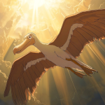
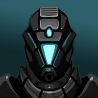

# His Dielectric Materials (Part 5) 

 
<b>Session started at 2025-01-07 / 04:05</b>
 
Fantasy Grounds - v4.6.2 ULTIMATE (2024-12-17) 
Fen's StarTrekAdventures Ruleset (v1.1.5)  
*[Prioritized Source: File; Other Sources: Vault]* 
*Core RPG ruleset (2024-12-17) for Fantasy Grounds
Copyright 2024 Smiteworks USA, LLC* 
*Fen's NPC Portrait Workaround v2.2.5* 
*[Prioritized Source: File; Other Sources: Vault]* 
*Fen's STA House Rules (v1.0.1) * 
*FG Browser v1.2.3* 
*[Prioritized Source: File; Other Sources: Vault]* 

**Zox:  [d20 = 5]** 

>INTERIOR - Jeffries Tube: Geret leads Skig and the rest of the team through the Jeffries tube with her nose, tracking the mysterious primate odor all the way to a service junction near the hull. There, they see a large Gorilla-like alien carrying Dr. Malov, standing near the entrance of a boarding pod lodged in the hull. 

>Just as it comes into sight, Geret hears a faint *click* and feels her nose press against the trigger mechanism of a cloaked anti-personel mine attached to the floor. 

**Geret** my ass is grass.... 
**Armed Guerilla** I thought Starfleet officers were supposed to be smart 
>As the mine detonates, Geret is thrown across the Jeffries tube and slammed into the bulkhead. As she clatters off the hard tritanium, her Jem'Hadar form is overtaken by thick, lush greenery as branches and leaves sprout from her flesh and orifices. 

**Geret** Smart? Im positively stumped. 
*Armed Guerilla throws Dr. Malov through the boarding pod hatch and levels his plasma rifle at the crew.* 
**Armed Guerilla** This doesn't concern you Starfleet 
**Oakadan** I'd say the hole you blasted in the wall concerns us pretty well 
**Armed Guerilla** The boarding pod will deposit a nano layer of tritanium as it leaves 
*Armed Guerilla starts backing into the pod with his rifle aimed squarly at the crew* 
Masakari (Zox): did someone say elephant toothpaste? 
**Zox** Mr Guerilla, there's still 3 olds on this ship you didn't abduct, what about them? 
**Armed Guerilla** They are not involved in this 
**Armed Guerilla** You should go back to your Federation space 
**Geret: [ CONTROL  (11) +  SCIENCE  (5)]
[Successes: 3] [Complications: 0]
Success with 2 momentum [2d20 = 15]** 
**Geret: [ REASON  (9) +  SCIENCE  (5)]
[Successes: 2] [Complications: 0]
Success with 1 momentum [2d20 = 24]** 
**Oakadan: [ DARING  (9) +  ENGINEERING  (2)]
[Focus: Fire Safety ]
[Successes: 3] [Complications: 0]
Success with 2 momentum [3d20 = 27]** 
**Geret: [ PRESENCE  (7) +  COMMAND  (4)]
[Successes: 1] [Complications: 0]
Success with 0 momentum [d20 = 10]** 
**Geret** Flower Power! 
**Skig: [ DARING  (10) +  ENGINEERING  (5)]
[Focus: Security Systems ]
[Successes: 2] [Complications: 0]
Success with 1 momentum [2d20 = 19]** 
>Geret sneezes out a huge cloud of pollen, blinding the intruder and triggering a massive sneezing fit. At the same time, Oakadan pulls out a fire-fighting foam grenade, and tosses it past the intruder into the pod, filling it with foam rendering it extremely difficult to use 

**Skig: [ DARING  (10) +  SECURITY  (3)]
[Focus: Faking Empathy As Best as Possible ]
[Successes: 4] [Complications: 0]
Success with 3 momentum [3d20 = 19]** 
**Skig:  [Total: 5] [Effects: 3] [4dChallenge = 5]** 
**Skig** Sorry, but YOU DO NOT BREAK HOLES IN MY SHIP! 
>Skig charges through the cloud of pollen and foam, taking the intruder by surprise and suplexing him into a bulkhead 

*Skig lays an epic beatdown on the guerilla gorilla, who manages to not crumple into a ball and perish. (Which is probably good for Skig not getting a criminal record.)* 
>[TURN] Nausicaan Comrade 6 

>[ROUND 3] 

**Throk** Throknot in scene, but Throk has question. Is gorilla stringy or lean meat? 
>[TURN] Oakadan 

>[TURN] Skig 

>[TURN] Geret 

>[ROUND 1] 

>[TURN] Skig 

>[TURN] Geret 

>[TURN] Oakadan 

>[TURN] Armed Guerilla 

**Geret:  [d20 = 17]** 
**Oakadan:  [d20 = 20]** 
**Skig:  [d20 = 10]** 
**Oakadan:  [d20 = 11]** 
>Inadvertently, the rifle was tripped into maximum intensity, wide beam when Skig suplexed him. Instead of incinerating Oakadan on the spot, the blast detonates the other 3 mines that he had hidden around the room, blasting the pod free and leaving a gaping hull breach in its wake. 

**Skig: [ FITNESS  (10) +  CONN  (2)]
[Focus: Survival ]
[Successes: 0] [Complications: 0]
Failed on DC: 1 [2d20 = 32]** 
**Geret: [ FITNESS  (10) +  CONN  (1)]
[Successes: 2] [Complications: 0]
Success with 1 momentum [2d20 = 12]** 
**Oakadan: [ FITNESS  (9) +  CONN  (2)]
[Successes: 2] [Complications: 0]
Success with 1 momentum [2d20 = 5]** 
>[ROUND 2] 

>As the hull is blown open, everyone but Skig is able to grab onto something and keep themselves from being blasted into space. Skig however, finds herself careening wildly off the torn bulkhead and flung into the vacuum beyond. 

>A moment later, a giant rigid foam block containing Dr. Malov lodges itself into the hull breach, sealing it 

**Geret** Oh perfect! 
**Skig: [ FITNESS  (10) +  SCIENCE  (3)]
[Focus: Survival ]
[Successes: 2] [Complications: 0]
Success with 1 momentum [2d20 = 19]** 
>[TURN] Skig 

>[TURN] Geret 

*Skig pushes the emergency transporter beacon on her communicator.* 
**Geret: [ CONTROL  (11) +  SECURITY  (2)]
[Focus: Transporters & Replicators ]
[Successes: 3] [Complications: 0]
Success with 2 momentum [2d20 = 7]** 
**Geret** For the commander! 
>Geret quickly runs to the nearest control panel and beams Skig back on board before she suffocates 

>[TURN] Armed Guerilla 

**Skig: [ PRESENCE  (8) +  COMMAND  (2)]
[Focus: Faking Empathy As Best as Possible ]
[Successes: 0] [Complications: 0]
Failed on DC: 1 [2d20 = 30]** 
>The instant Geret is finished transporting Skig, before she can log out of the terminal, the intruder throws her across the room and uses her authorization to initiate a site-to-site transport. He and Dr. Malov dematerialize, exposing the hull breach again 

**Geret: [ FITNESS  (10) +  CONN  (1)]
[Successes: 2] [Complications: 0]
Success with 1 momentum [2d20 = 19]** 
**Oakadan: [ FITNESS  (9) +  CONN  (2)]
[Successes: 2] [Complications: 0]
Success with 1 momentum [2d20 = 16]** 
**Geret: [ REASON  (9) +  SCIENCE  (5)]
[Successes: 3] [Complications: 0]
Success with 2 momentum [2d20 = 4]** 
Masakari (Geret): Looney tunes! 
Masakari (Geret): Also if Geret is a CAM plant, she wouldn't even need CO2 for long periods. 
>Geret and Oakadan are able to grab onto the ladders and hold themselves in place, but Windbloom is blown all the way across the room lodging himself into the hole left by Dr. Malov 

**Windbloom Openheart** Whoa, totally not cool 
**Windbloom Openheart** But I'm ok for now, you two can go after that guy 
*Windbloom Openheart takes out a bong and starts taking a hit on it* 
>[TURN] Oakadan 

**Oakadan: [ FITNESS  (9) +  CONN  (2)]
[Focus: Fire Safety ]
[Successes: 2] [Complications: 0]
Success with 1 momentum [2d20 = 8]** 
>Oakadan lifts Windbloom up from the hole just enough to open the valve on one of his firefighting grenades, spraying foam into the gap behind him and plugging the breach 

**Windbloom Openheart** Wow, far out man 
**Windbloom Openheart** That was totally smart  
>[ROUND 3] 

**Geret** claps and looks forward to the next PPE lecture. 
*Geret claps and looks forward to the next PPE lecture.* 
>[TURN] Geret 

**Geret** Finding a good guerilla is going to be hard.... 
**Geret: [ CONTROL  (11) +  SECURITY  (2)]
[Focus: Transporters & Replicators ]
[Successes: 1] [Complications: 0]
Success with 0 momentum [2d20 = 28]** 
**Windbloom Openheart** Geret checks the transporter logs and finds that the intruder beamed himself to Cargo Bay 3 
>Geret checks the transporter logs and finds that the intruder beamed himself to Cargo Bay 3 

**Geret** now, i'd be easy to find, being an obvious plant... 
**Geret:  [d20 = 1]** 
**Skig:  [d20 = 18]** 
**Geret** Oh interesting, I guess the holiday spirit transcends space nation-state and species.... 
**Geret** Guerilla is finding the spirit of Resistmas! 
>Skig materializes in Cargo Bay 3 and finds the Pakleds are doing some kind of electro-baptism ceremony, donning robs of dielectric insulators and then walking into a massive electrical discharge 

**Skig** That seems... well... you do you. 
>A couple of moments later, the intruder materializes directly in the baptism area and is instantly electrocuted by the 100s of thousands of volts of electric potential 

*Skig checks the safety settings to make sure will prevent the rest of the ship from getting electrocuted.* 
**Skig** EGADS! 
**Skig** Where is doctor Malov? 
**T'kor: [ INSIGHT  (7) +  CONN  (3)]
[Successes: 1] [Complications: 0]
Success with 0 momentum [2d20 = 18]** 
**Skig: [ PRESENCE  (8) +  COMMAND  (2)]
[Focus: Faking Empathy As Best as Possible ]
[Successes: 3] [Complications: 0]
Success with 2 momentum [2d20 = 7]** 
*Geret picks off a few buds and puts it into Windblooms bong.* 
*Captain Kaglor points at the intruder* 
**Captain Kaglor** He is stupid 
**Captain Kaglor** He has no dielectric material 
**Captain Kaglor** He will die 
**Skig** You are very correct Captain Kaglor. 
*Captain Kaglor nods knowingly* 
**Skig** In all counts there, you have learned well. 
*Skig rolled well enough on her Empathy check to decide that activating the water suppression system is NOT the right thing to do.* 
*Geret The one thing we really need is a med-bay inside the brig.* 
**Skig** Emergency medical transport, two to sick bay for extensive medical burns. 
**Skig** Also, the guerilla gorilla and doctor Malov have not found enLIGHTENment under the Resistmas tree. 
**Ensign Ghex** Yes ma'am, you got it. Already on it. I'll take the liberty of dispatching a security detail as well, because I was reading some kind of weapons discharges on the internal sensors as well. Was someone firing a weapon down there? Are there other intruders on board?  
**Skig** There were several mines detonated, a hull breach (DAMMIT), and some injuries. 
**Skig** T'Kor, have you isolated the device causing the censor loop? 
**Kolea** Hey now, that explains the extra cameras in my changing room on the set. 
**T'kor: [ CONTROL  (11) +  ENGINEERING  (4)]
[Focus: Repair/Tinkering ]
[Successes: 0] [Complications: 0]
Failed on DC: 1 [2d20 = 34]** 
**T'kor: [ CONTROL  (11) +  ENGINEERING  (4)]
[Focus: Repair/Tinkering ]
[Successes: 2] [Complications: 0]
Success with 1 momentum [2d20 = 22]** 
**Throk** Throk think censors do not need sensors. 
>T'Kor is able to find and isolate the interference and restore normal sensor operation. He confirms that there is only one intruder on board, now secure in Sickbay 

*Krepeka stands by, ready to assist Kolea * 
**Skig** Excellent work T'Kor. 
**Krepeka: [ DARING  (8) +  MEDICINE  (4)]
[Successes: 3] [Complications: 0]
Success with 2 momentum [2d20 = 6]** 
>Krepeka is able to stabilize Dr. Malov and the intruder, although both are still unconcious for now 

**Captain Bachar** Let me know when they regain conciousness, I want to get some answers when they do 
*Krepeka realizes this is her time to shine* 
**Captain Bachar** Good work nurse 
**Krepeka** Yes Captain! Immediately!  
Masakari (Krepeka): glorious green ecto-cooler. 
>[TURN] Skig 

>[TURN] Oakadan 

>[TURN] Armed Guerilla 

>[ROUND 4] 

**Kolea: [ DARING  (9) +  MEDICINE  (4)]
[Focus: First Aid ]
[Successes: 2] [Complications: 0]
Success with 1 momentum [2d20 = 21]** 
**Kolea: [ DARING  (9) +  MEDICINE  (4)]
[Focus: First Aid ]
[Successes: 2] [Complications: 0]
Success with 1 momentum [2d20 = 23]** 
**Throk** Throk get very neat electrical barbeque thing! Best away team mission ever. 
*Throk shows Kolea the Pain Stick.* 
**Kolea** No thanks, that was used as an educational device on me in the past. 
**Zox** Just remember to register it as an antique or heirloom, not a banned weapon. Have some paperwork, Throk. 
**Throk: [ REASON  (9) +  CONN  (3)]
[Focus: Poetry ]
[Successes: 1] [Complications: 0]
Success with 0 momentum [2d20 = 25]** 
*Throk gets 1 success on filling out the paperwork to indicate the Pain Stick is an important Gorn Cultural Heirloom that he should be allowed to carry at all times.* 
**Geret** Superb! 
>EXTERIOR - Landing Bay Outside Casino: Murry and her away team sneak around the back side of the landing bays and take cover behind a low wall. Peering out from over the short wall, they can see Chuk'ta and his men guarding their shuttles, waiting for their now dead or incapacitated crewmates to return 

>Most of them are milling around the ships, and a few are patrolling around monitoring the area 

>[ROUND 1] 

**Hailey Murry ** *(whisper)*: These are hardly abandoned, how do we want to go about this? 
**Kolea** What's the plan Zox? 
*Kolea is being incredibly stealthy.* 
**Throk** Throk wants mighty security chef to provide valuable direction while he determines which of them is best electrocuted into tastiness. 
**Zox: [ CONTROL  (11) +  SECURITY  (5)]
[Successes: 2] [Complications: 0]
Success with 1 momentum [2d20 = 14]** 
**Zox** Im not sure any of these are on the menu, there's just too many of them 
**Throk: [ DARING  (9) +  CONN  (3)]
[Successes: 2] [Complications: 0]
Success with 1 momentum [2d20 = 20]** 
**Throk** Throk agree, he would get tummy ache easting all of these. 
**Throk** They are fueled and have impulse drives active. 
**Throk** Throk suggest we should fling that crate of explosives into one of the shuttles and make a giant explosion, then commandeer the other shuttle, and eat anyone we find inside. 
**Hailey Murry** I think it may be better to put a tracking device on one of them 
**Kolea** ...or.... we could just have someone override hangar control, activate the magnetic locks, sabotage the hangar control system to prevent them from unlocking. OR... we could just back out of here and pump sedatives into the life support system of this shuttle bay. 
**Zox** That's sneaky! I like it! 
**Throk** But if we put tracking device on only one, then we don't know where the other goes. 
**Throk** These ships are very good for combined air/ground assault. Throk love these for nice amenities and bbq pits. 
**Throk** Throk knows you can shove about 25 armoured soldiers inside, or stack up 118 corpses in pallet formation. 
**Hailey Murry** That would take out all the ones outside the ships, Kolea, but not the ones within. 
**Zox: [ REASON  (7) +  SECURITY  (5)]
[Focus: Espionage ]
[Successes: 0] [Complications: 0]
Failed on DC: 1 [2d20 = 32]** 
**Zox** Huh, looks like half my tools are melted from that firefight.... 
**Zox** PUNY HUMAN TOOLS! RAWRRRR! 
**Kolea** Okay, so plan C? 
**Hailey Murry** Hold on, I've done this before 
**Hailey Murry: [ REASON  (9) +  SECURITY  (3)]
[Focus: Tracking Devices ]
[Successes: 1] [Complications: 1]
Success with 0 momentum [2d20 = 28]** 
**Zox** I blame the latest Starfleet regulations, making these badges so hard to repurpose! Scotty would not stand for this! 
>Murry is able to rewire the commbadge into a tracking device, but she accidentally shorts something internally and so the commbadge squeeks into life and begins playing "Pump Up The Jam" at full volume 

**Zox** What sort of Starfleet makes tamper proof gear? 
>♫♫♫♫ Pump up the jam, pump it up. While your feet are stompin' ♫♫♫♫ 
>♫♫♫♫ And the jam is pumpin' Look at here the crowd is jumpin' ♫♫♫♫ 

*Kolea sighs.* 
**Chuk'ta** What is that sound 
**Zox** Yeah, not worth the risk, let's boogie! 
**Hailey Murry** Let's get out, they'll probably take my badge with them 
Masakari (Zox): 'Call me on this whenever you want' 
>Chuk'ta and his men start to head over to investigate the sound 

**Kolea** Hey! There are some Federation goons spying on you! 
**Kolea** What the Hell is going on here? 
**Chuk'ta** What? Impossible, my men killed them 
**Kolea** jumps up and gesticulates wildly. 
*Kolea jumps up and gesticulates wildly.* 
**Kolea** Never, you can't kill Feds, they sprout up like daisies. I mean, I've offed hundreds of them and there are also more on my hit list. 
*Throk is glad someone explained the plan to him and runs like mad, clutching his Pain Stick Present, as it is the best Resistmas gift ever.* 
**Chuk'ta** You must be female that killed the Ferengi 
**Throk** Good eye, you are pretty smart. 
**Kolea** Good eye, you are pretty smart. 
**Chuk'ta** Why did you kill him?  
*Zox reminds Throk that it is newly classified as a Gorn Religious Item, and not to call it a Pain Stick.* 
**Kolea** Capitalist oppressor dog who does not let women wear clothes? Also, it paid good Latinum. 
**Kolea: [ REASON  (9) +  MEDICINE  (4)]
[Focus: Psychology ]
[Successes: 0] [Complications: 0]
Failed on DC: 1 [2d20 = 34]** 
**Chuk'ta** You call him captalist dog but you kill only for Latinum? 
**Chuk'ta** Sounds like something a Capitalist would say 
>Chuk'ta signals to his men and they rush in with pain sticks and grab Kolea 

>They lead her off into the shuttle as Pump Up The Jam continues blaring from the commbadge in her hand 

>♫♫♫♫ I want, a place to stay ♫♫♫♫ 

>♫♫♫♫ Get your booty on the floor tonight ♫♫♫♫ 

>♫♫♫♫ Make my day ♫♫♫♫ 

>♫♫♫♫ Make my day ♫♫♫♫ 

>♫♫♫♫ Make my day ♫♫♫♫ 

>---------CUT TO COMMERCIAL------- 

