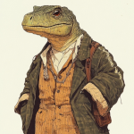

# Knight Takes Red Queen's Rook, Pawn Defends (Part 1) 

 
<b>Session started at 2025-01-20 / 20:35</b>
 
Fantasy Grounds - v4.6.2 ULTIMATE (2024-12-17) 
Fen's StarTrekAdventures Ruleset (v1.1.5)  
*[Prioritized Source: File; Other Sources: Vault]* 
*Core RPG ruleset (2024-12-17) for Fantasy Grounds
Copyright 2024 Smiteworks USA, LLC* 
*Fen's NPC Portrait Workaround v2.2.5* 
*[Prioritized Source: File; Other Sources: Vault]* 
*Fen's STA House Rules (v1.0.1) * 
*FG Browser v1.2.3* 
*[Prioritized Source: File; Other Sources: Vault]* 

Masakari (Geret): takes a cat like perch in the reiststmas tree and prays no one rolls a 20. 

>Captains Log, Stardate 61992.4: Our resupply of the USS Maxwel went smoothly, so we are taking advantage of the free time to divert to Ariadne Opan III to investigate the coordinates T'Kor tracked from the Twins' communications. We have no idea what we'll find there, and we still have 30 Pakleds living in the Cargo bay. I suppose this is just the routine now on this ship. At least Zox hasn't lost his pants for a while, I'll count that as a victory 

>EXTERIOR - Bridge: The crew are at their stations as the Lister enters the Ariadne Opan system, Captain Bachar is bouncing her leg as she regards the sensor feed on her armrest display. 

**Captain Bachar** Ensign Ghex, take us into a high orbit above the third planet. Zox: scan for anything out of the ordinary. 
**Zox** Yes Captain! 
>As the Lister enters orbit, you can see the roiling white and blue clouds of Ariadne Opan III. Hot crackles of ionic lightning are visible even from orbit, and the surface is completely occluded by the thick ion storms blanketing the planet's upper ionosphere. 

**Zox: [ PRESENCE  (10) +  SECURITY  (5)]
[Successes: 1] [Complications: 0]
Success with 0 momentum [2d20 = 32]** 
*Zox sneezes on the control panel before wiping it off and inspecting it more closely.* 
*Skig presses button to activate small robotic arm that reaches out of the panel and wipes all the Voth snot off the displays.* 
**Zox** Interesting. A cryptic power signature is eminating from sector 321-654; atmospheric. 
**Skig: [ REASON  (10) +  COMMAND  (2)]
[Focus: Faking Empathy As Best as Possible ]
[Successes: 2] [Complications: 0]
Success with 1 momentum [2d20 = 15]** 
**Zox** Thanks Skig! 
**Hailey Murry** What kind of power signature?  
**Zox** Unknown - this ionic disturbance would require a sensor recalibration. 
**Hailey Murry: [ REASON  (9) +  SCIENCE  (4)]
[Successes: 2] [Complications: 0]
Success with 1 momentum [2d20 = 17]** 
**Hailey Murry** No doubt why these coordinates were picked 
**Skig** This system was last surveyed in the late 23rd century and is considered "boring" and while this planet is "habitable" the ionic radiation precludes any permanent settlement. It is far from any regional borders. Or, as was one said about a planet, "If there is a bright center of the universe, this is the place that it is farthest from". 
**Hailey Murry** Interesting, this looks like it could be a navigational deflector. No starship, because there's no warp signature, but just the deflector itself 
**Hailey Murry** Perhaps a dome or the like? 
**Skig** Let me see if I can recalibrate the sensors to adjust the Parmonid Wavelength to filter the ionic interference. 
**Skig: [ CONTROL  (11) +  ENGINEERING  (5)]
[Focus: Electronics ]
[Successes: 2] [Complications: 0]
Success with 1 momentum [2d20 = 28]** 
**Ensign Ghex** Yeah, no one would take a starship into that soup. That much ionic interference would wreak havoc on the EPS network, probably overload the entire power grid. Something similar happened to me during training when we were learning to navigate transports in the ionic storms on Jupiter 
KruschtyaEquation (Hailey Murry): They can't fly *yet* 
**Zox** Could it just be a shipwreck. suspended in the atmosphere somehow? 
**Skig** If it is remaining stationary in this atmospheric condition, that would be a good question of "how" from an engineering standpoint. 
**Hailey Murry** It seems like it's got a cable attached to it, to lower something down there 
indarien (Skig): Throk wants to know if we discovered the secret Extreme Bynar Bungie Jump underworld excitement circuit. 
**Lt. Cmdr Viraseti** Skig is right, it must be actively station keeping in order to remain at that altitude 
**Lt. Cmdr Viraseti** Otherwise it would just fall back to the surface 
**Lt. Cmdr Malat** We're not going to be able to learn anything from up here, we need to get down below the ionosphere. Past the interference. 
**Captain Bachar** There is no way we are taking the Lister through that 
**Captain Bachar** Far too risky 
**Hailey Murry** We could try the same sort of trick they have, lowering something down toward them. How close can we get? 
**Zox** I think imma just snoop subspace for any activity coming out of that thing.... 
**Zox: [ CONTROL  (11) +  SECURITY  (5)]
[Focus: Espionage ]
[Successes: 2] [Complications: 0]
Success with 1 momentum [2d20 = 18]** 
**Ensign Ghex** Well: if we calculate the discharge voltage of the ionosphere based on the length of the arcs, and then based on the sensor reading of the atmospheric dimensions... You know, when we did ionic interference training on Jupiter, they made us do these calculations for the training craft, even though Jupiters ionosphere is so well studied you can just look up the parameters in the computer. I know that some of the students just looked up the parameters the day before so they didn't even really have to do the calculations, they just already knew what the safe altitude limit was.... 81km  
**Hailey Murry:  [d20 = 9]** 
**Hailey Murry** Is that 81km for this ship or Jupiter's? 
*Ensign Ghex giggles* 
**Zox** There is some signal going up and down a cable....so that thing is probably some sort of antennae... 
**Ensign Ghex** This planet, of course. 81km would be INSIDE Jupter's atmosphere ma'am. That would be so dangerous, you would never do that with a starship the size of the Lister 
**Skig** Is the antenna transmitting into space, or just between the object we are detecting and some unknown ground station? 
**Zox** Nothing right now, but this does seem like a great set up to not get found... 
**Skig** Also, before anyone thinks of it, Old Faithless is rated for ionic dispersal missions providing the pilot is okay wearing 3cm of dialetric material over their entire body as the pilot's seat is the ground point for all ionic radiation that gets converted by the shield capacitance inverters into raw electricity. 
**Skig** I'm not recommending we do that, just that I was bored and had some spare time a couple years ago and wondered if that was feasible. 
**Zox** I wonder if it is feasilbe to modulate our shields to counter act the ions here.... 
**Zox: [ INSIGHT  (7) +  SCIENCE  (4)]
[Focus: Shipboard Tactical Systems ]
[Successes: 3] [Complications: 0]
Success with 2 momentum [2d20 = 13]** 
**Lt. Cmdr Malat (muttering)** Good thing I'm not the conn officer anymore 
**Skig** Test flights also showed that venting the atmosphere on Old Faithful reduced the number of fatalities among Red Shirts by 76%. 
*Skig wonders why it is so hard to find volunteers for her engineering projects these days.* 
**Zox** Skig; if we use a modulated capactiance pattern on Old Faithful, we should be able to navigate the storms without creating a large, hazardous differential. Thoughts? 
**Zox** Only a small vessel can do this, a large one would surely build a differential and subsequent discharge. 
**Skig** The smaller size and capacity of the shuttle would definitely handle this... but... 
indarien (Skig): Would it be possible to just beam down to the transmitter? Are we able to get any useful data that would show a control room or transmitter? 
**Zox** Do we want to send a proble, or Ye Olde Faithful? 
**Skig** The surface is habitable, albeit colder than Earth. 
**Skig** I think we should start with a probe to determine what we are contending with and if there is a place we could land at - or beam down to - that would precipitate a better decision making process than watching the pretty lightning. 
**Skig** But I shall defer to the Captain's prudence and judgment here. 
**Zox: [ CONTROL  (11) +  SCIENCE  (4)]
[Focus: Shipboard Tactical Systems ]
[Successes: 3] [Complications: 0]
Success with 2 momentum [2d20 = 8]** 
**Zox** I have pushed the probe button. 
>Zox probes the entire planet. He probes it deep beneath the ionosphere 

indarien (Skig): With probing like that, Kolea feels left out. 
*Zox appears to don rubber gloves as the probe is launched before putting them away.* 
**Zox** Ah....What was I thinking... 
indarien (Skig): What was that loud snap noise? 
**Zox** Should only take a few moments. 
**Zox** my dino-sense tells me someone doesn't want to be found here.  
**Zox** Ah ha! Okay; the power source is a ballon, and it is tethered to the ground at known coordinates. 
**Windbloom Openheart** wow. I love balloons 
**Zox** Heck yeah! 
**Hailey Murry** Any sign of how large the craft is, up in the atmosphere? 
**Zox** 10 meters diameter.  
**Hailey Murry** The ground level is pretty safe, though?  
**Hailey Murry** Just a bit cold? 
**Lt. Cmdr Viraseti** Safe is a relative term 
**Zox** Breathable for most species, bring a coat. 
**Hailey Murry** "Not instant death" is a good start 
**Hailey Murry** Do we want to go in with Federation badges or no?  
**Zox** Well, it is in our space.  
**Captain Bachar** We have jurisdiction here, no need to be coy. For once we aren't violating any borders 
**Lt. Cmdr Malat** Just make sure you bring phasers 
**Captain Bachar** Skig, assemble an away team 
**Geret** Take me! 
Masakari (Geret): Can't even do that anymore without control over shapeshifting. 
Masakari (Geret): 100% amazing entropy! ^_^ 
**Skig** Geret, Zox, Murry, and Kolea will accompany me in Old Faithful for this. I think that will cover the eventualities of the adventure. 
**Skig** And Ghex to pilot, of course. 
*Zox brings a handwarmer and a sweater.* 
**Skig** Ghex, you are looking forward to showing us your excellent piloting in an ionosphere. 
**Geret** It's hard being made of energy, there's so many positive and negative emotions... 
**Ensign Ghex** Yes ma'am, I won't let you down! This is so exciting, I mean I did this in training but this is way more cool. This is the most extreme ionic discharge I've ever seen.  
**Skig** Excellently well done Ghex, you did great. 
*Skig gives her a pat on the head and a bar of chocolate.* 
**Skig: [ PRESENCE  (8) +  COMMAND  (2)]
[Focus: Faking Empathy As Best as Possible ]
[Successes: 1] [Complications: 0]
Success with 0 momentum [2d20 = 17]** 
**Geret** I wouldn't want to misbehave now, it might result in being...discharged. 
>Ensign Ghex deftly pilots the shuttle through the ionosphere, dodging discharges while giddily giggling with glee 

**Hailey Murry** Very good piloting, Ghex 
**Zox: [ CONTROL  (11) +  SECURITY  (5)]
[Focus: Shipboard Tactical Systems ]
[Successes: 2] [Complications: 0]
Success with 1 momentum [2d20 = 24]** 
**Skig: [ CONTROL  (11) +  ENGINEERING  (5)]
[Focus: Electronics ]
[Successes: 1] [Complications: 0]
Success with 0 momentum [d20 = 10]** 
**Zox** Okay, what's hiding down there?  
**Skig** Zox, modulate to frequency 87.4 and cut the amplitude modulation to 3 to clear up the topographical overview. 
**Zox** Now that's a very small little enclosure....Only 1 lifeform detected. 
**Skig: [ INSIGHT  (8) +  SECURITY  (3)]
[Focus: Security Systems ]
[Successes: 2] [Complications: 0]
Success with 1 momentum [2d20 = 22]** 
**Zox** Yes commander. 
**Hailey Murry: [ INSIGHT  (13) +  SECURITY  (3)]
[Focus: Great Heights ]
[Successes: 2] [Complications: 0]
Success with 1 momentum [2d20 = 24]** 
**Zox: [ INSIGHT  (7) +  SECURITY  (5)]
[Successes: 2] [Complications: 0]
Success with 1 momentum [2d20 = 18]** 
Masakari (Zox): CHAOS IGNITE 
**Zox:  [d20 = 17]** 
**Zox:  [d20 = 13]** 
**Zox:  [d20 = 13]** 
Masakari (Zox): 'mineral based insectoid' 
Masakari (Zox): 'flaming whale from hell' 
**Zox** ...it 
Masakari (Zox): it's literally a space whale wtf... 
>Geret sneezes as the shuttle approaches the planet's surface and explodes into a giant space whale 

**Zox: [ FITNESS  (10) +  SECURITY  (5)]
[Successes: 1] [Complications: 0]
Success with 0 momentum [2d20 = 21]** 
**Hailey Murry: [ FITNESS  (7) +  SECURITY  (3)]
[Focus: Great Heights ]
[Successes: 1] [Complications: 0]
Success with 0 momentum [2d20 = 22]** 
**Skig: [ FITNESS  (10) +  SECURITY  (3)]
[Focus: Survival ]
[Successes: 0] [Complications: 1]
Failed on DC: 1 [2d20 = 36]** 
Masakari (Zox): Ah, the infamous change from a whale to a fungal kangaroo.. 
**Zox:  [d20 = 1]** 
**Zox:  [d20 = 3]** 
**Skig** Geret.... so help me... I'm going to have Throk milk you after this! 
**Hailey Murry** What the hell was that? 
**Geret** A fluke. 
Masakari (Geret): KAZAM! 
*Skig is covered in a gooey Gorgamandr milk.* 
>Skig gets slamed head first into a bulkhead, drawing blood and knocking her out cold just as Geret sneezes again and the terrifying space whale snaps back into a Bajoran 

>EXTERIOR - Hillside: The crew land the shuttle on a small ridge around 5km away from the anchor point of the cable and proceed on foot in the direction of Zox's coordinates. Soon they can see the location: a small Starfleet-style cabin nestled among the rocks. 

**Zox** Well that's adorable.  
**Zox** I wonder if the paperwork for this has been filed.... 
**Ensign Ghex** I seriously doubt it, they really don't seem to want to be found.  
**Geret** This world was far more colorful and interesting with more colors and electromagnetic spectra...now it's so dull. 
**Ensign Ghex** It would be super weird if they filed permits for building this after all of that sir 
**Ensign Ghex** You only read one life form inside right?  
**Zox** One life-form. Human 
**Hailey Murry** That's not precluding more interesting life forms, though 
**Ensign Ghex** Ok, good. I would not want to go in if there was like... a squad of Klingon warriors ready to attack with Bat'Leths 
**Ensign Ghex** Even though I did get qualified marks in hand-to-hand combat at the academy. I think it helped that I took Aikido on the side as my PE elective.  
**Ensign Ghex** Aikido is a good martial art to learn if you're small, because it is all about using your opponent's energy against them instead of just bluntly meeting force with force like you do sir. 
**Kolea** That is quite true Ghex, you are very smart, now you need to be very quiet. 
**Ensign Ghex** So what's the plan sirs? Do we kick the door down and yell "Freeze, you're under arrest" like in those ancient Earth televisual media? 
**Kolea: [ DARING  (9) +  MEDICINE  (4)]
[Focus: First Aid ]
[Successes: 1] [Complications: 0]
Success with 0 momentum [2d20 = 28]** 
**Hailey Murry** No, but if we encounter the Twins you can yell that at them 
**Hailey Murry** I bet they'd appreciate it 
**Skig** I suspect they would. 
**Zox** Any friend of the Twins is bound to be...interesting. 
**Zox** Then again anyone that's been stationed, possibly marooned here for decades probably is happy to see someone. 
*Kolea towels off some liquid on her hands.* 
**Kolea** I assume while I was getting the XO back on her feet, you scanned the inside of the building, determined the layout, and have a triangulation scanning pattern to indicate when the individual inside passes in front of any available opening for a disruptor sniper shot? 
*Kolea looks at Zox,* 
**Zox: [ INSIGHT  (7) +  SECURITY  (5)]
[Focus: Espionage ]
[Successes: 2] [Complications: 0]
Success with 1 momentum [2d20 = 18]** 
**Hailey Murry** We outnumber them like 8 to 1 
**Hailey Murry** If we're going to lose here, it's not because we didn't have a sniper set up 
**Kolea** Also scanned for underground patterns indicating escape routes and cave systems. 
**Zox** There's no where to run on the planet, and there may be...let's see, some security measures here? 
**Kolea** Well, since no one brought a sniper rifle, I doubt it is an important consideration. 
**Kolea** Would you like me to knock on the door? 
**Zox** Whomever is here seems very unconcerned and everything is at such low power....there's no concern. 
**Kolea** Do you know they are alive? 
**Zox** Sensors confirm it 
**Kolea** just a sec. 
*Kolea gets out her medical tricoder and scans the hut.* 
**Zox** There is a cave-garage nearby, but..low power.  
**Zox:  [d20 = 9]** 
**Kolea: [ REASON  (9) +  MEDICINE  (4)]
[Successes: 1] [Complications: 0]
Success with 0 momentum [2d20 = 20]** 
**Zox** Yeah, some odd architecture in their space craft... not one of ours. Other than being too cold, this place seems very safe 
**Zox** This would be a great place to retire ya know? 
*Zox shivers.* 
Masakari (Zox): Sorry this place has me operating a tad slowly. 
**Zox** Sorry this place has me operating a tad slowly. 
**Skig** It does have a certain rustic appeal. 
**Zox: [ REASON  (7) +  SCIENCE  (4)]
[Focus: Espionage ]
[Successes: 3] [Complications: 0]
Success with 2 momentum [2d20 = 9]** 
**Ensign Ghex** I kinda like it here, cool breeze, nice view 
**Skig** Actually Kolea, I think I will handle this one. 
*Skig walks towards the door.* 
**Kolea** Ghex, would you like to come check out a shuttlecraft with me? 
*Zox starts looking out for threats.* 
**Zox: [ CONTROL  (11) +  SECURITY  (5)]
[Focus: Espionage ]
[Successes: 3] [Complications: 0]
Success with 2 momentum [2d20 = 13]** 
*Kolea looks at Skig with, "You owe me for babysitting" in her eyes.* 
**Ensign Ghex** Oh wow, yeah that sounds mysterious and fun.  
**Kolea** Geret, would you like to come with us? 
**Kolea** That way we don't have to worry about killing the host with a Gorgamandr sneeze. 
**Geret** Sure! 
**Geret** That'll never happen again!  
>Skig approaches the door, and it opens automatically with a soft swish. The interior of the cabin is sparsely furnished with standard Starfleet accoutrements. Nothing particularly out of the ordinary for a residence. 

>As they enter, the comms activate and they hear a woman's voice 

**Woman's Voice On Comms** I'm in my office, second door on your left 
**Woman's Voice On Comms** Wipe off your boots by the door 
**Skig** No problem, I hope we are not intruding on you. 
*Skig wipes off boots as requested.* 
**Woman's Voice On Comms** It's usually polite to call head before you drop in. It's not like I put out a welcome sign... 
>The comms channel closes 

*Geret performs some sort of Bajorn house entry ritual as to not offend.* 
**Hailey Murry: [ INSIGHT  (13) +  CONN  (3)]
[Focus: Great Heights ]
[Successes: 1] [Complications: 1]
Success with 0 momentum [2d20 = 29]** 
**Zox:  [d20 = 1]** 
**Zox:  [d20 = 6]** 
*Geret pauses for a second.* 
**Zox: [ INSIGHT  (7) +  CONN  (1)]
[Focus: Espionage ]
[Successes: 2] [Complications: 0]
Success with 1 momentum [2d20 = 10]** 
*Skig heads to the second door on the left and looks at it to make sure there are no obvious mechanisms that will give the producers an excuse to cancel her contract.* 
**Zox** Interesting place.... 
**Zox** Hard to call with all this interference eh? 
**Skig: [ DARING  (10) +  ENGINEERING  (5)]
[Focus: Security Systems ]
[Successes: 3] [Complications: 0]
Success with 2 momentum [2d20 = 20]** 
>As Skig, Zox and Murry enter the office, they see a woman standing behind a desk with her back turned to the door. She is wearing a red, Starfleet-issue bathrobe and her graying red hair is still visibly damp, even pulled up into a bun. She does not turn to face the crew as they enter, instead remaining focused on whatever she is doing in the small alcove behind her desk. 

**Woman in Bathrobe** I'm sure you've got a lot of questions, and I'll do my best to answer them. But first: you're going to have to answer one of mine... 
>She turns to face the crew and in her hands she is holding a large silver serving tray. On it are four coffee cups, and a large French Press with a still-steaming pot of coffee inside. 

**Woman in Bathrobe** How do you take your coffee? Cream? Sugar? 
**Skig** My apologies for the interruption, ma'am. We were following a lead that brought us here. 
**Skig** Straight black, ma'am. 
*Zox appears super grateful for hot beverages.* 
**Hailey Murry** Cream and sugar for me 
*Woman in Bathrobe slids Skig a coffee cup* 
**Zox** black please. 
*Woman in Bathrobe pours some cream and sugar into Murry's cup before sliding cups to Murry and Zox* 
*Kolea subconsciously stops and checks her poison treatment kit for the number of doses available to her.* 
*Kolea is not sure WHY she does this, but is certain it is a good idea.* 
**Woman in Bathrobe** Now: what brings you out here? You come here to interrogate me, arrest me or assassinate me? 
**Zox** Many thanks. With whom do we have the pleasure of enjoying fine coffee with? 
**Skig** Thank you ma'am. 
**Zox: [ INSIGHT  (7) +  COMMAND  (2)]
[Focus: Xenobiology ]
[Successes: 3] [Complications: 0]
Success with 2 momentum [2d20 = 9]** 
*Skig waits while Zox and Murry engage in pleasantries with the strange woman.* 
Masakari (Zox): (im going with the reason Zox doesn't want milk in his coffee is that dinosaurs are lactose intolerant by definition) 
**Zox** I never thought I'd meet such a storied captain as you, captain Janeway. 
**Admiral Janeway** It's Admiral now 
**Skig** We were following a lead from some former crewmates who gave us coordinates to this location. 
**Skig** My apologies for interrupting your quiet retirement, Admiral. 
**Admiral Janeway** I'm hardly retired, I'm hiding out 
**Admiral Janeway** Who in their right mind would retire here. Have you looked outside? 
**Zox** but not without many good collector items eh>? 
**Hailey Murry** About half of us thought this looked kind of quaint 
**Skig** Might I ask why you would be hiding out then? 
**Admiral Janeway** It tends to be the thing you do when you think someone is trying to kill you 
**Skig** Let's assume that I have been recently promoted from under a proverbial 150 year old warp core and have not paid attention to anything that has happened outside of Engineering Technical manuals. 
**Admiral Janeway** I already assumed that 
*Admiral Janeway takes a sip of coffee* 
**Skig** Thanks, I wanted to make sure you were on the same page, and why I will defer to my esteemed Voth and human colleagues as they are more up on events. 
*Skig wonders how thick Admiral Janeway's Plot Armour is.* 
**Admiral Janeway** What is it that you think you're here investigating? 
*Skig looks at Murry and Zox to formulate an answer.* 
**Hailey Murry** We're investigating a transmission that was sent out to you by one of our crewmates. Or two of them, who've recently gone missing 
*Skig because Skig honestly has no freaking clue, and is wondering if she should go check on the rest of the Away Team.* 
**Zox** Well...it depends how many messages your balloon can intercept. 
**Admiral Janeway** They were so certain that their transmissions were untraceable. Those two are very capable, but overconfident. 
**Admiral Janeway** Yes, I was in contact with your Bynars. 
**Hailey Murry** About what? Why would they contact you, specifically? 
*Skig has 1 page of notes of everything relevant to her for the campaign. It is almost entirely stuff about the Lister and who has damaged it. Throk has 3 pages, most of them involve what is edible. Kolea has 8 pages, very detailed, and a firm concept of what is going on everywhere.* 
**Admiral Janeway** We were working together, investigating a murder. 
**Admiral Janeway** Two, actually 
*Admiral Janeway rummages around through a drawer until she finds a specific PADD and slides it across the table to Murry* 
*Hailey Murry catches and twirls it around, sipping her tea as she looks it over* 
**Hailey Murry** Ah, yes, these two. We were looking into this as well. I take it you're aware of our ship's curious composition? 
**Admiral Janeway** 11 and 10 kept me up-to-date on what was happening on board. 
**Hailey Murry** Excellent. What can you tell us about their investigations?  
**Zox** And they are hiding with Cardassians...and you are hiding on an electric snowball.....  
**Admiral Janeway** Well your Bynars aren't the best at following instructions, they told me in their last message that they would not be contacting me again 
**Admiral Janeway** They also steal every electronic file they can get their grubby little paws on.... 
**Hailey Murry** Yeah, I can see that 
**Admiral Janeway** As for the investigation, every element of the Starfleet security and intelligence apparatus has been investigating the failed assassination of the president. All asking who would have a reason to kill the president, what were they after, how could they do it... 
**Admiral Janeway** Everyone was so caught up in investigating a big sexy assassination, they didn't bother to ask who actually died. 
*Admiral Janeway pulls up the supplemental attachments from the official report, annex B: personel file on the president's shuttle pilot* 
**Hailey Murry** Ah, the pilot? 
**Admiral Janeway** Lt. Tal Celes, assigned as the presiden't shuttle pilot four days before the explosion. Prior to that, she was a sensor analyist on Jupiter station. Prior to that, a sensor analyist on Ganymede monitoring center. Prior to that, a sensor analyist on USS Voyager 
**Admiral Janeway** Are we sensing a pattern here? 
*Skig does have some pattern recognition skills.* 
indarien (Skig): I'm still OOO, if you need me to make rolls or check the screen tell me in Discord. 
**Hailey Murry** Who was the suspected assassin again? 
indarien (Skig): Well, AFK not OOO, silly work acronyms. 
**Zox** Yeah, whomever is behind this is _very_ good at destroying trails and evidence. 
**Admiral Janeway** Now that is the right question. His name was not put in the official report, in order to protect the integrity of the ongoing investigation. That's how I ended up running into your Bynars. I was trying to find out, and they saw my official queries being rejected 
**Admiral Janeway** As it happens, the "suspect" was a friend of theirs, and another former crewmate of mine: Ensign Kenneth Dalby.  
**Admiral Janeway** Formerly a crewman on Voyager, and before that a member of the Maquis resistance 
**Hailey Murry** Now we have a pattern 
**Admiral Janeway** Also most recently assigned to security on Jupiter Station, alongside Celes 
**Zox** So many of the fabled Voyager crew involved in strange tasks.... 
**Hailey Murry** Oho, and who else was stationed on Jupiter? 
**Admiral Janeway** Hundreds of officers, not the Twins if that is what you're getting at. They were working at Utopia Planitia on Mars though, pretty much next door 
**Hailey Murry** I was wondering who else on the Voyager, in particular. If not yourself?  
**Admiral Janeway** As far as I know, none of my other former crew were assigned there. 
**Hailey Murry** Do you know what team they were on? 
**Admiral Janeway** Celes is a sensor analyst, so she reviews, categorizes and analyzes sensor data. Dalby was a security officer. 
**Admiral Janeway** But I became convinced that the entire security apparatus was barking up the wrong tree. Celes and Dalby were the targets, not the president 
**Hailey Murry** To hide what? 
**Admiral Janeway** Now that is a dangerous question. And when I started asking it, a bomb found its way into my shuttle as well 
**Admiral Janeway** Fortunately, the Flyer is a little harder to blow up than an atmospheric transport. A little Borg technology goes a long way in improving your autonomous system security 
**Hailey Murry** Ha 
**Zox** They want to make the Federation blind so a surprise attack can trigger..or reignite a war. 
**Zox** And there's at least one crooked admiral in on this. 
**Hailey Murry** But what would've been spotted in a little outpost on Jupiter?  
**Admiral Janeway** Whatever it was, it was important enough that someone faked an assassination of the president in order to get rid of them 
**Admiral Janeway** All the Bynars were able to find was the coordinates of the signal they were analyzing 
**Admiral Janeway** Nothing on its contents 
*Zox 's ears would pop up...if he had any.* 
**Hailey Murry** Which coordinates? 
**Admiral Janeway** The coordinates were a nondescript star system near the three-way border between Romulan, Klingon and Federation space. They seemed unimportant to 11 and 10. But I happened to know that a highly classified diplomatic conference was taking place there. Negotiations between the Federaion, Romluans, Klingons and Cardassians for a new joint treaty and defense agreement 
**Hailey Murry** When? 
**Admiral Janeway** The meetings have been ongoing for over a year, and they are still in progress. Negotiations have been difficult because the Romulans are still supicious of Federation motivation, the Klingons want to continue to force the Cardassians to pay reparations for war deaths, and the Cardassians want security assurances in the event of another Dominion incursion... Typical diplomacy 
**Admiral Janeway** Your doctor, the one who betrayed you: did you ever figure out who he was in contact with? 
**Admiral Janeway** The Bynars were never able to figure out his communications 
GM: Admiral Nechayev 
indarien (Skig): Tribble Assassins! 
**Kolea: [ INSIGHT  (11) +  ENGINEERING  (2)]
[Focus: Syndicate Training ]
[Successes: 1] [Complications: 0]
Success with 0 momentum [2d20 = 25]** 
**Zox: [ REASON  (7) +  SECURITY  (5)]
[Focus: Xenobiology ]
[Successes: 2] [Complications: 0]
Success with 1 momentum [2d20 = 19]** 
**Hailey Murry: [ REASON  (9) +  SECURITY  (3)]
[Focus: *Psychology ]
[Successes: 3] [Complications: 0]
Success with 2 momentum [2d20 = 7]** 
**Skig: [ DARING  (10) +  SECURITY  (3)]
[Focus: Survival ]
[Successes: 1] [Complications: 0]
Success with 0 momentum [2d20 = 25]** 
**Geret: [ REASON  (9) +  SECURITY  (2)]
[Successes: 0] [Complications: 0]
Failed on DC: 1 [2d20 = 34]** 
indarien (Skig): Murry being paranoid! I like it. 
indarien (Skig): If only Throk was here and could chew on her to determine if she was human or shapeshifter! 
**Admiral Janeway** I don't like being in the dark, these people seem to know everything we are up to. 
**Geret: [ PRESENCE  (7) +  COMMAND  (4)]
[Successes: 1] [Complications: 0]
Success with 0 momentum [2d20 = 22]** 
**Skig** You know what they say ma'am, if you are kept in the dark and fed shit, you are only able to grow mushrooms. 
**Admiral Janeway** Something like that 
**Admiral Janeway** I'm concerned though, since the Bynars went dark, that they might have compromised my source in the negotiations. 
**Hailey Murry** Who was your source? 
**Admiral Janeway** Fortunately, I can think of no one better to go check up them than you 
**Skig** Honestly ma'am, I'm concerned that if we could find you, people who seem to be two steps ahead of you already found you and were waiting for us. 
**Admiral Janeway** A friend of mine in the... 
>Janeway is interrupted by the sounds of a struggle outside the door. Murry and Zox hear it as well 

Masakari (Zox): save the voth pottery! 
indarien (Kolea): Save the Admiral! 
Masakari (Zox): save the space whales! 
>She reaches for a phaser, but before she can react a Jem'Hadar storms through the door and opens fire with a particle rifle 

>Season 2, Episode 3: Knight Takes Red Queen's Rook, Pawn Defends
Written by Mila König
Directed by Clifford Ness 

>---------CUT TO CREDITS-------
♫♫♫Opening Theme♫♫♫ 

# Knight Takes Red Queen's Rook, Pawn Defends (Part 2) 

 
<b>Session started at 2025-01-28 / 04:01</b>
 
Fantasy Grounds - v4.6.2 ULTIMATE (2024-12-17) 
Fen's StarTrekAdventures Ruleset (v1.1.5)  
*[Prioritized Source: File; Other Sources: Vault]* 
*Core RPG ruleset (2024-12-17) for Fantasy Grounds
Copyright 2024 Smiteworks USA, LLC* 
*Fen's NPC Portrait Workaround v2.2.5* 
*[Prioritized Source: File; Other Sources: Vault]* 
*Fen's STA House Rules (v1.0.1) * 
*FG Browser v1.2.3* 
*[Prioritized Source: File; Other Sources: Vault]* 
>INTERIOR - Janeway's Cabin: Admiral Janeway is interrupted by the sound of struggle as a Jem'Hadar dressed in all-black bursts through the door to her office. Janeway reaches for a phaser, but the Jem'Hadar opens fire before she can reach it. Outside the door, the security guard is laying on the ground in a pool of blood. 

Masakari (Zox): SPACE POLAR BEAR IN GARDEN. 
Masakari (Zox): Hercules in New York bear fight scene. 
**Zox: [ FITNESS  (10) +  CONN  (1)]
[Successes: 1] [Complications: 0]
Success with 0 momentum [2d20 = 19]** 
**Skig: [ FITNESS  (10) +  CONN  (2)]
[Focus: Survival ]
[Successes: 1] [Complications: 0]
Success with 0 momentum [2d20 = 25]** 
**Hailey Murry: [ FITNESS  (7) +  CONN  (3)]
[Successes: 2] [Complications: 0]
Success with 1 momentum [2d20 = 9]** 
Masakari (Zox): No name. No saves. No cares.  
>Zox and Murry hear the sound of stuggle just in time to react, but just as the Jem'Hadar bursts through the door, a conscussive charge blows the windows in, dissorienting Zox and Skig momentarily 

**Hailey Murry: [ DARING  (10) +  SECURITY  (3)]
[Successes: 3] [Complications: 0]
Success with 2 momentum [2d20 = 10]** 
>Murry kicks the rifle out of the Jem'Hadar's hands, and it clatters across the floor. The Jem'Hadar pulls out his kar'takin and dives over the desk, lunging at Admiral Janeway with the weapon 

>[TURN] Hailey Murry 

>[TURN] Jem Hadar 

*Jem Hadar plunges the blade into Admiral Janeway's neck, repainting her desk and wall in her own blood* 
**Hailey Murry:  [2d20 = 28]** 
**Zox:  [d20 = 1]** 
**Skig:  [d20 = 9]** 
**Zox: [ DARING  (12) +  SECURITY  (5)]
[Successes: 3] [Complications: 0]
Success with 2 momentum [3d20 = 35]** 
**Zox:  [d20 = 8]** 
**Zox:  [Total: 7] [Effects: 4] [6dChallenge = 7]** 
>Zox grabs the Jem'Hadar around his neck and twists his head until a satisfying *snap* echoes throughout the room 

>[TURN] Zox 

>[TURN] Skig 

**Skig: Skig has used a point of Determination to add a natural one to the dice pool.** 
**Skig: [ DARING  (10) +  MEDICINE  (1)]
[Focus: Emergency Repairs ]
[Successes: 5] [Complications: 0]
Success with 4 momentum [2d20 = 8]** 
Masakari (Zox): Today, on Star Trek: The crew is blessed by the dice. 
indarien (Skig): Kolea felt a great disturbance in the medical world, as if millions of PostDocs just screamed out in terror and were forever sentenced to flib burgers. 
*Skig grabs a superheated chunk of plascrete from an errant shot from the Jem'Hadar rifle and slams it on her neck, the smell of melting flesh and plascrete forming a... possibly permanent bond... on her neck?* 
**Skig** That medicine stuff isn't so hard after all. 
*Skig does not seem to notice that both her and Janeway have tendrils of smoke rising from their skin.* 
*Admiral Janeway tries to speak through a mouthful of blood as she slowly loses conciousness on the floor* 
**Admiral Janeway** Zox... Mmmmm.... 
*Admiral Janeway passes out* 
*Skig possibly for the best for her to pass out.* 
>Ghex and the other half of the away team come running in through the blasted open wall, responding to the sound of the explosion and struggle 

**Skig** It's possibly for the best for her to pass out. After all, I'm not sure how heat resistant she is. Humans are okay up to about 200 Celsius, right? 
**Kolea** Skig!!! 
**Hailey Murry** Definitely not ideal, let's get her into a more inner room. We need to secure the perimeter  
**Hailey Murry** I doubt this guy was alone 
**Ensign Ghex** Oh wow, what happened here? Is that a Jem'Hadar? Oh man, that is not good. There is so much blood. Are we at war again? Is the Lister under attack? We really should be back on the ship if Jem'Hadar are attacking again.  
**Kolea** What in the Name of the Nine Hells of Pandarin did you freaking do? 
*Zox puffs up, flushes with aggressive scale colors, and looks for more hostiles.* 
**Zox** I think Skig earned an honorary medical degree. 
**Skig** I performed Engineering tasks. 
*Skig looks proud of her solution.* 
*Kolea mutters things that Ghex should probably not run through a Universal Translator.* 
**Ensign Ghex** I don't think so, that looks really gnarly. I wouldn't trust her if I needed surgery. Is that even going to come off? It looks like it is chemically bonded to her skin. Normally, I think Doctors are pretty particular about the kinds of stuff they put into your body and onto wounds 
**Hailey Murry** It stopped the bleeding for now. We'll worry about the scars later 
**Kolea** We need to get her shuttlecraft, our shuttlecraft, and get to to Medbay. 
*Hailey Murry peeks out the front window to try and spot if there are any more out front* 
**Hailey Murry: [ INSIGHT  (13) +  SECURITY  (3)]
[Successes: 1] [Complications: 0]
Success with 0 momentum [2d20 = 24]** 
**Kolea** Zox, I don't suppose your superior dinosaur nose can sniff if there are any more invisible Jem'Hadar around who can't mask their smell? 
**Hailey Murry** I'm not even seeing signs of the Jem'Hadar, let alone others. He may have approached from another direction, or may have a way of covering his tracks 
**Kolea: [ DARING  (9) +  MEDICINE  (4)]
[Focus: First Aid ]
[Successes: 4] [Complications: 0]
Success with 3 momentum [2d20 = 6]** 
**Zox: [ FITNESS  (10) +  SECURITY  (5)]
[Focus: Xenobiology ]
[Successes: 3] [Complications: 0]
Success with 2 momentum [2d20 = 16]** 
**Kolea** Jem'Hadar field cloaks and other technology are very good at masking their tracks. We should probably bring the body with us for evaluation. 
*Zox aggressively flares his nostrils, adding to an already feral and agressive posture.* 
**Zox** Interestingly....it leads back to Ol'Faithless.  
**Hailey Murry: [ INSIGHT  (13) +  SECURITY  (3)]
[Focus: Tracking Devices ]
[Successes: 3] [Complications: 0]
Success with 2 momentum [2d20 = 12]** 
*Hailey Murry looks over the Jem'Hadar for secret gear, especially things that could be used to track the corpse or his companions* 
**Zox** Either it was a stoaway, or it has been lurking and possibly sabotaging our shuttle. 
**Zox** We might want to check that out  
**Kolea** I choose to be very worried if there is one or more Jem'Hadar Shrouded warriors running around the Lister. 
**Ensign Ghex** Oh man, that would definitely be bad if he sabotaged the shuttle. I don't want to explode. That would be a really bad way to end this away mission.  
**Zox** Well.....we had a guerilla gorilla and pakleds.... 
**Kolea** We should also pick up her shuttle. 
**Hailey Murry** It's still our best bet, and we can have Skig and Zox check it out 
**Zox: [ INSIGHT  (7) +  SECURITY  (5)]
[Focus: Espionage ]
[Successes: 0] [Complications: 1]
Failed on DC: 1 [2d20 = 35]** 
**Zox:  [d20 = 2]** 
**Zox:  [d20 = 19]** 
*Zox has too many stress and anger hormones surging as to forget anything about shuttle security. Where's another dinosaur to headbutt?* 
*Geret takes a look at her now very refined features.* 
**Ensign Ghex** If we are taking her shuttle, can I fly it back to the Lister? Her shuttle is REALLY nice! 
**Ensign Ghex** I want to fly it really bad. Please ma'am, can I fly it? 
*Ensign Ghex makes puppy dog eyes at Skig* 
**Skig** That is fine Ghex. 
**Skig** You and I will take it back together, as we will need to check it to make sure the Jem'Hadar has not tampered with it. 
*Zox looks for a boulder to heatbutt* 
*Zox looks for a momento or other personal effect to bring Janeway, on the thought that we will never come back here.* 
*Geret looks for a momento or other personal effect to bring Janeway, on the thought that we will never come back here.* 
*Kolea helps Murry loot the corpse of the Jem'Hadar looking for cool gear.* 
**Geret: [ INSIGHT  (9) +  SECURITY  (2)]
[Successes: 0] [Complications: 0]
Failed on DC: 1 [2d20 = 32]** 
*Geret picks the worst possible thing.* 
indarien (Kolea): Janeway will wonder why Geret picked the "Made on Mars" tag from the Ikea Mug. 
**Geret:  [d20 = 8]** 
**Geret** Human captains love big guns, maybe this is an antique? 
**Geret** I hope it's not banned in medbay. 
**Kolea** Murry, we should also check for isolinear chips and Data Pads before we leave. 
**Kolea** Oh, and don't forget to check behind the refrigerator for whatever super important thing the human captain always puts there. 
**Kolea** Please remember I start every sentence to a superior officer using "With all due respect" so you don't think I'm giving orders. 
**Skig** I never noticed that before. 
**Hailey Murry** Noted 
**Hailey Murry: [ INSIGHT  (13) +  CONN  (3)]
[Focus: Cryptography ]
[Successes: 1] [Complications: 0]
Success with 0 momentum [2d20 = 28]** 
**Geret: [ INSIGHT  (9) +  SCIENCE  (5)]
[Successes: 1] [Complications: 0]
Success with 0 momentum [d20 = 5]** 
**Kolea: [ CONTROL  (9) +  SECURITY  (3)]
[Focus: Syndicate Training ]
[Successes: 0] [Complications: 0]
Failed on DC: 1 [d20 = 15]** 
>Murry and Geret grab Janeway's PADD and pull her files onto an isolinear chip. 

**Geret** It must be rather boring here. 
**Skig: [ REASON  (10) +  ENGINEERING  (5)]
[Focus: Security Systems ]
[Successes: 3] [Complications: 0]
Success with 2 momentum [2d20 = 12]** 
**Hailey Murry** Quite a bit, I imagine 
**Geret** Unless you can see into the electromagnetic spectra...then this place is wild! 
**Hailey Murry** Does that help you see Jem'Hadar?  
**Geret** I dunno. I can't see well now.  
*Kolea says nothing and keeps the cool Story Declaration she had prepped in her back pocket for later.* 
**Geret** It's just boring overcast. 
**Geret** and sorrowful snow.  
**Ensign Ghex** I thought Vulcans were supposed to logical and unemotionatl, not depressing 
**Kolea** Vulcanism is only slag deep. 
*Geret reflects for a moment.* 
**Geret** I suppose I don't make a great vulcan. 
**Kolea** Also Ghex, when you are older I'll tell you about J'Davir and Pon Fahr. 
*Kolea gets misty eyed.* 
**Skig: [ CONTROL  (11) +  ENGINEERING  (5)]
[Focus: Security Systems ]
[Successes: 2] [Complications: 0]
Success with 1 momentum [2d20 = 22]** 
**Geret: [ FITNESS  (10) +  COMMAND  (4)]
[Successes: 2] [Complications: 0]
Success with 1 momentum [2d20 = 23]** 
*Geret says a prayer for the deceased ensign and tries to recover thier memories. * 
*Geret tries to look stoic and reserved.* 
>INTERIOR - Sickbay, the away team bring Janeway and the dead Jem'Hadar back to sickbay, and place them both on medical beds 

*Kolea puts the Jem'Hadar in a containment field in case the body does anything annoying, let self-destruct, give off toxic fumes, or suddenly start singing Klingon Opera.* 
**Skig** What do you have against Klingon Opera? 
>Captain Bachar and Lt. Commander Malat come jogging in from the hall, Bachar comes over to check on Janeway while Malat heads straight to the Jem'Hadar 

**Captain Bachar** It is objectively terrible, everyone agrees 
*Captain Bachar looks at Janeway's neck* 
**Captain Bachar** I assume the eventual report you file for this away mission will explain why her neck is fused with a lump of construction material 
**Kolea** I once entertained five Klingons in a VIP Lounge through the Klingon Operatic version of King Lear. I was sore for weeks. 
*Geret ponders why this is happening in medical bay and not engineering. Skig has shown the difference to be arbitrary.* 
**Lt. Cmdr Malat** I don't think anyonw needed to hear that information 
*Kolea looks at Bachar.* 
**Geret** did you grow lear-y? 
**Skig** Extreme measures required an engineering solution to a life threatening situation. 
*Skig looks proud of her work.* 
**Hailey Murry** The Jem'Hadar had a suicide wish to get at her 
**Kolea** Captain, I believe the answer to that is this - If you are ever injured and Skig is near melting plascrete, death is an option. 
**Kolea** In any case. 
**Lt. Cmdr Malat** How did a Jem'Hadar get here? There aren't any other ships in the area 
**Lt. Cmdr Malat** And if it was there before us, you'd imagine it would have attacked her before you even got there 
**Geret** Aren't you the tactical officer now? 
*Kolea hooks Janeway up to advanced medical systems and begins the careful process of fixing her injuries AND remove the plascrete from her neck.* 
**Hailey Murry** We should do a more thorough scan of the ship 
**Kolea** Might I kindly request you take this to a briefing room while I work on her? 
**Hailey Murry** I hate to think it had just been lurking in the shuttle, but... 
**Kolea** I will need some concentration to do this. 
**Geret** Zox was sniffing the Ol'Faithless after breaking that Jem'Hadar.  
**Kolea** Also... post guards at the door that we know are trustworthy, please and thank you. 
*Kolea gets to work.* 
**Lt. Cmdr Malat** I'll do a deck-by-deck search. If there's any Jem'Hadar on this ship, we'll find them. Other than the one that is supposed to be here anyways. 
**Kolea: [ CONTROL  (9) +  MEDICINE  (4)]
[Focus: Xeno-biology ]
[Successes: 1] [Complications: 0]
Success with 0 momentum [2d20 = 28]** 
**Geret: [ FITNESS  (10) +  COMMAND  (4)]
[Successes: 1] [Complications: 0]
Success with 0 momentum [d20 = 12]** 
**Geret:  [d20 = 15]** 
**Geret:  [d20 = 1]** 
*Geret 's face contorts a bit.* 
Masakari (Geret): Q. Traveller. Tribble. What could it be! 
Masakari (Geret): Ooooh Targ! lets go Targ! 
**Kolea:  [Total: 3] [Effects: 2] [4dChallenge = 3]** 
**Kolea: [ CONTROL  (9) +  MEDICINE  (4)]
[Focus: Xeno-biology ]
[Successes: 3] [Complications: 0]
Success with 2 momentum [2d20 = 16]** 
**Krepeka: [ CONTROL  (10) +  MEDICINE  (4)]
[Successes: 1] [Complications: 0]
Success with 0 momentum [d20 = 9]** 
**Kolea:  [Total: 3] [Effects: 1] [4dChallenge = 3]** 
**Kolea:  [Total: 3] [Effects: 1] [2dChallenge = 3]** 
**Skig: [ REASON  (10) +  ENGINEERING  (5)]
[Focus: Security Systems ]
[Successes: 3] [Complications: 0]
Success with 2 momentum [2d20 = 9]** 
**Skig:  [Total: 3] [Effects: 1] [5dChallenge = 3]** 
**Skig:  [Total: 4] [Effects: 1] [3dChallenge = 4]** 
**Kolea** Kolea to Bachar, the birds will need to be fed in the next 12-16 hours. 
**Kolea: [ REASON  (9) +  MEDICINE  (4)]
[Focus: Xeno-biology ]
[Successes: 1] [Complications: 1]
Success with 0 momentum [2d20 = 33]** 
Masakari (Krepeka): MY BRIEF MOMENT OF GOD-HOOD 
**T'kor: [ REASON  (9) +  ENGINEERING  (4)]
[Successes: 1] [Complications: 0]
Success with 0 momentum [2d20 = 20]** 
**Kolea:  [Total: 2] [Effects: 2] [4dChallenge = 2]** 
Masakari (Krepeka): 'Alien Cyphers' 
Masakari (Krepeka): 'Crypto-Archeology' 
Masakari (Krepeka): dewey-decimal converted into ascii codes 
indarien (Skig): inverted punch cards with microdots that can only be seen with starlight through transparent aluminum? 
Masakari (Krepeka): so many good macguffins.... 
**Hailey Murry:  [Total: 1] [Effects: 1] [4dChallenge = 1]** 
**Hailey Murry: [ REASON  (9) +  SCIENCE  (4)]
[Focus: Cryptography ]
[Successes: 1] [Complications: 0]
Success with 0 momentum [2d20 = 28]** 
**Hailey Murry: [ REASON  (9) +  SCIENCE  (4)]
[Focus: Cryptography ]
[Successes: 1] [Complications: 0]
Success with 0 momentum [28 = 28]** 
**Hailey Murry:  [Total: 3] [Effects: 1] [4dChallenge = 3]** 
**Geret: [ INSIGHT  (9) +  SECURITY  (2)]
[Focus: Acting ]
[Successes: 0] [Complications: 0]
Failed on DC: 1 [2d20 = 28]** 
**Kolea** Geret, I think you should give that a rest. 
**Krepeka** I can't. The trial never ends. 
**Geret** I can't. The trial never ends. 
**Geret** I'm not sure where these words come from 
**Captain Bachar** I think the best lead we have still must be these audio messages you decoded 
**Captain Bachar** It's the only intel we have, that they don't know we have 
**Captain Bachar** There's nothing obviously actionable, but sometimes the meaning in a piece of intelligence is all about interpretation and context. 
**Kolea** Context and interpretation can be, much like Truth, a conflux of three intents. There is the investigator's suspicion, what the sender hoped the message would be misinterpreted, and what the reality behind the message was. 
**Kolea** Perhaps you should review them again with clearer heads? 
**Kolea** Or different ones for that matter. 
KruschtyaEquation (Hailey Murry): "Lister en route to Skalla IV for repair. Founder in still in room 14-7" 
KruschtyaEquation (Hailey Murry): "The Zox suit went dark. Extraction plan may be needed soon" 
**Zox: [ REASON  (7) +  SCIENCE  (4)]
[Focus: Xenobiology ]
[Successes: 0] [Complications: 1]
Failed on DC: 1 [2d20 = 33]** 
**Hailey Murry** "The Voth was not observed conspiring with any crew. Mission inconclusive" 
KruschtyaEquation (Hailey Murry): "The Voth was not observed conspiring with any crew. Mission inconclusive" 
**Zox:  [Total: 0] [Effects: 0] [dChallenge = 0]** 
**Zox: [ INSIGHT  (7) +  COMMAND  (2)]
[Successes: 2] [Complications: 0]
Success with 1 momentum [2d20 = 12]** 
**Zox** Rhuk runs a high-touch, high-class, event catering service. Serious calls only, have a Ferengi-backed line of credit available. etc. 
**Kolea** This does explain the chef obsession. 
**Kolea: [ REASON  (9) +  SECURITY  (4)]
[Focus: Syndicate Training ]
[Successes: 2] [Complications: 0]
Success with 1 momentum [2d20 = 23]** 
**Zox: [ CONTROL  (11) +  SECURITY  (5)]
[Successes: 1] [Complications: 1]
Success with 0 momentum [2d20 = 34]** 
**Skig: [ CONTROL  (11) +  ENGINEERING  (5)]
[Focus: Security Systems ]
[Successes: 1] [Complications: 0]
Success with 0 momentum [d20 = 13]** 
**Zox:  [Total: 1] [Effects: 0] [dChallenge = 1]** 
**Skig** The green wire is not a chew toy, Zox. 
**Zox** Im sorry Skig....I need to get used to stress hormones again.  
**Skig** I had those surgically removed, along with the ability to feel empathy. It made me a much better engineer. 
**Zox** Have you tried augmenting with cybernetics instead of just subtracting? 
**Skig** Although now that I am an XO, I am not sure how long all those, "crewman bob used as conduit to redirect EPS feed into auxiliary unit" reports has been holding back my carrer. 
**Zox: [ REASON  (7) +  ENGINEERING  (4)]
[Focus: Espionage ]
[Successes: 0] [Complications: 1]
Failed on DC: 1 [2d20 = 33]** 
**Zox:  [Total: 0] [Effects: 0] [dChallenge = 0]** 
*Skig blinks uncomprehendingly at Zox at the prospect of using cybernetics to improve empathy, that sounds like trying to convince a Borg to win a Dating Contest through wit and charm.* 
**Zox** The Lister was always yours. =D 
**Captain Bachar** The Lister is 60 years older than Skig 
**Skig** This reminds me, we need to make sure the burning Pakled smell from Cargo Bay 3 is not actually one of them. 
*Skig makes a note to worry about that before she goes off shift.* 
**Hailey Murry** On the other hand, I made sure some features were built in for her initially 
**Hailey Murry** So in a way, it was kind of designed for her 
**Captain Bachar** I think we need to get underway soon. If someone was trying to take out Janeway before she could reveal her source to you, they are probably going to try to take out her source as well. 
**Captain Bachar** We need to get to them first. 
**Skig** And anyone who may know the connection. 
*Zox nods enthusiastically.* 
**Skig** Zox, let's find your mother, any ideas where she is? 
**Zox** Dial 1-800-Dino-Party. 
**Kolea: [ REASON  (9) +  MEDICINE  (4)]
[Focus: Xeno-biology ]
[Successes: 4] [Complications: 0]
Success with 3 momentum [2d20 = 4]** 
**Zox** We should use K'tat's line of credit to have her cater something discrete in a back water location to get her off the stage, so to speak. 
*Kolea snaps on the surgical gloves and begins an autopsy on the Jem'Hadar while singing "It's the way you look tonight."* 
**Captain Bachar** You could probably contact her without raising suspicion. She is your mother 
**Kolea** You know, li9ke maybe call to let her know how her grandchildren with the human mother are doing. 
**Captain Bachar** People do, on occasion, call their mother 
**Geret** This is true, but Voth have strange herd emotions. If I contacted her, she may begin acting strangely; subtlety is called for. 
**Zox** This is true, but Voth have strange herd emotions. If I contacted her, she may begin acting strangely; subtlety is called for. 
**Zox** We need a circuitous way to remove her from this board. 
**Zox** But I should call her more.  
Masakari (Zox): DS9 is fun in the same way this is, as extras become mains. 
**Geret: [ FITNESS  (10) +  CONN  (1)]
[Successes: 0] [Complications: 1]
Failed on DC: 1 [2d20 = 33]** 
**Hailey Murry: [ FITNESS  (7) +  CONN  (3)]
[Successes: 0] [Complications: 1]
Failed on DC: 1 [2d20 = 35]** 
**Kolea: [ FITNESS  (8) +  CONN  (1)]
[Successes: 1] [Complications: 0]
Success with 0 momentum [2d20 = 19]** 
**Krepeka: [ FITNESS  (9) +  CONN  (2)]
[Successes: 1] [Complications: 0]
Success with 0 momentum [2d20 = 24]** 
*Geret is compelled to theatrics and snaps her fingers in dramatic ways before.....* 
**Geret:  [d20 = 5]** 
**Geret:  [d20 = 14]** 
>The crew in sickbay are interrupted from their discussions as Gereg and Murry double over in pain and collapse to the deck. Admiral Janeway starts to convulse on the table, and Kolea and Krepeka start to feel light-headed 

**Kolea: [ REASON  (9) +  MEDICINE  (4)]
[Successes: 2] [Complications: 0]
Success with 1 momentum [2d20 = 17]** 
**Geret** This air tastes sort of funny....... 
**Kolea** Out! Out of sickbay. 
**Kolea** Bachar, get Janeway out of here. 
*Krepeka assists* 
**Captain Bachar** No argument from me 
*Captain Bachar grabs Janeway and heads for the door, but the door stays resolutely shut* 
**Captain Bachar** It's locked, or overriden 
**Kolea** We need to purge the vents, med bay is being flooded with Neurocine. 
>♫♫♫Ominous Music Sting♫♫♫ 

>---------CUT TO COMMERCIAL------- 

# Knight Takes Red Queen's Rook, Pawn Defends (Part 3) 

 
<b>Session started at 2025-02-03 / 20:42</b>
 
Fantasy Grounds - v4.6.2 ULTIMATE (2024-12-17) 
Fen's StarTrekAdventures Ruleset (v1.1.5)  
*[Prioritized Source: File; Other Sources: Vault]* 
*Core RPG ruleset (2024-12-17) for Fantasy Grounds
Copyright 2024 Smiteworks USA, LLC* 
*Fen's NPC Portrait Workaround v2.2.5* 
*[Prioritized Source: File; Other Sources: Vault]* 
*Fen's STA House Rules (v1.0.1) * 
*FG Browser v1.2.3* 
*[Prioritized Source: File; Other Sources: Vault]* 

>INTERIOR - Sickbay, the crew hack and cough and wheeze as Captain Bachar slams her fist against the locked sickbay door, and Neurocine continues to pour into the room through the environmental system 

**Captain Bachar** It's locked, or overriden 
**Skig: [ INSIGHT  (8) +  ENGINEERING  (5)]
[Focus: Emergency Repairs ]
[Successes: 1] [Complications: 0]
Success with 0 momentum [2d20 = 23]** 
*Geret feels very naked without any exaggerated traits.* 
**Kolea** Bachar, back away from the door. 
*Captain Bachar steps back from the door* 
*Kolea gets out her holdout disruptor and sets it to, "Open the Damn Door, Hal"* 
**Kolea: [ DARING  (9) +  SECURITY  (4)]
[Focus: Syndicate Training ]
[Successes: 3] [Complications: 0]
Success with 2 momentum [2d20 = 16]** 
**Skig:  [Total: 6] [Effects: 3] [7dChallenge = 6]** 
>Kolea opens fire, blasting a small hole in the sickbay door. It is probably large enough for her to squeeze through, but not Geret or Admiral Janeway 

**Skig: [ INSIGHT  (8) +  ENGINEERING  (5)]
[Focus: Emergency Repairs ]
[Successes: 2] [Complications: 0]
Success with 1 momentum [2d20 = 22]** 
>Skig's Skig Senses tingle 

*Kolea makes a hole large enough for a nimble, supple, and dextrously lithe exotic dancer figure to make it through the exit.* 
**Geret:  [d20 = 8]** 
**Hailey Murry:  [d20 = 5]** 
**Kolea** That should also vent to the exterior, on the theory that the entire ship is not being saturated with Neurocine. 
*Skig looks at Zox in panic.* 
**Skig** MY GOD! SOMEONE SHOT MY BABY! 
**Skig** The Lister is crying! 
**Zox** Maybe it was an accident? Everyone's on edge...they seem to think there's a 950 lb gorilla everywhere. 
**Skig** I think it is coming from MedBay! 
*Skig taps communicator.* 
*Zox pushes the buttons on the turbolift.* 
**Zox** Let's go! 
**Skig** Skig to Kolea, are you in MedBay? What is going on? 
**Hailey Murry** Neurocine gas, again 
*Skig runs after Zox, prepared to annihilate all enemies who threaten the Lister.* 
**Kolea** Umm... reactor meltdown, large leak, very dangerous. 
**Skig** What? 
**Captain Bachar** Skig, just get up here! 
**Geret: [ FITNESS  (10) +  CONN  (1)]
[Successes: 2] [Complications: 0]
Success with 1 momentum [2d20 = 7]** 
**Hailey Murry: [ FITNESS  (7) +  CONN  (3)]
[Successes: 0] [Complications: 0]
Failed on DC: 1 [2d20 = 32]** 
**Kolea: [ DARING  (9) +  ENGINEERING  (2)]
[Successes: 1] [Complications: 0]
Success with 0 momentum [2d20 = 26]** 
**Hailey Murry** Doors are locked, again 
*Kolea looks for door overrides or other options to force the doors open.* 
**Geret: [ DARING  (10) +  SCIENCE  (5)]
[Successes: 2] [Complications: 0]
Success with 1 momentum [3d20 = 31]** 
**Zox:  [d20 = 10]** 
>Geret rushes over to the replicator and programs it to replicate a continuous stream of Dichromylethylene. A relatively harmless, albeit unpleasant smelling chemical, which can bond with and neutralize the Neurocine 

**Zox** I've seen this before in a  mind meld, we can cancel out this gas easily enough! 
**Geret** I've seen this before in a  mind meld, we can cancel out this gas easily enough! 
*Kolea peeks in from the hallway.* 
**Kolea** That was a brilliant idea. 
>Captain Bachar picks up Admiral Janeway and moves her over closer to the replicator 

**Captain Bachar** Good thinking ensign 
*Kolea scribbles down a note to do that next time.* 
**Geret** Oh thanks! I just didn't want to have Janeway have any more trauma via transport. 
**Captain Bachar** Skig, see if you can shut off the gas from the environmental system 
**Captain Bachar** T'Kor, see if you can shut off the gas from the environmental system 
**T'kor** Yes sir, I'm on my way 
**Skig: [ DARING  (10) +  ENGINEERING  (5)]
[Focus: Emergency Repairs ]
[Successes: 3] [Complications: 0]
Success with 2 momentum [3d20 = 33]** 
**T'kor: [ CONTROL  (11) +  ENGINEERING  (4)]
[Successes: 0] [Complications: 0]
Failed on DC: 1 [d20 = 19]** 
*Skig pats Lister lovingly.* 
>Skig bypasses the environmental control unit, shutting off the gas. 

**Skig** Who is a good little spaceship? 
**Skig** Yes, you feel better now, don't you? 
*Skig looks at the door to Medbay.* 
**Skig** Umm.... what happened? 
*Zox looks happy, having gotten a good shot of adrenaline on the way up* 
**Kolea** Umm... phaser misfire. It was so weird. No one knows how it happened. 
*Skig looks at Kolea.* 
**Skig** Why do I have trouble believing that? 
*Kolea looks completely innocent.* 
**Kolea** I have no idea. 
**T'kor** Doors are made to be opened 
**Kolea: [ INSIGHT  (11) +  MEDICINE  (4)]
[Focus: "Diplomacy" ]
[Successes: 2] [Complications: 0]
Success with 1 momentum [2d20 = 13]** 
**Captain Bachar** Sometimes doors are made to be kicked in 
**Skig: [ INSIGHT  (8) +  COMMAND  (2)]
[Focus: Faking Empathy As Best as Possible ]
[Successes: 2] [Complications: 0]
Success with 1 momentum [2d20 = 11]** 
**Skig** I guess T'Kor can get this fixed while we look into the source of the gas. 
*Skig does the "I'm watching you" hand gesture at Kolea, who smiles prettily in return.* 
**Skig** From what I can tell, there was no command to activate this, it was a small device attached to the environmental mix sensor that caused the system to incorrectly detect an excess of ethylated compounds, causing the environmental system to produce the neurocine in order to neutralize them. 
**Skig** T'Kor, see if you can figure out the who/what/when/where of the installation of this device. 
**T'kor** Was it an incorrect detection, or did we actually have that gas present for some reason?  
*Kolea checks on Janeway and the others for injuries.* 
**T'kor: [ REASON  (9) +  ENGINEERING  (4)]
[Successes: 2] [Complications: 0]
Success with 1 momentum [2d20 = 11]** 
**Zox: [ INSIGHT  (7) +  SECURITY  (5)]
[Focus: Espionage ]
[Successes: 0] [Complications: 0]
Failed on DC: 1 [d20 = 14]** 
**Kolea: [ DARING  (9) +  MEDICINE  (4)]
[Focus: First Aid ]
[Successes: 2] [Complications: 0]
Success with 1 momentum [2d20 = 21]** 
**Captain Bachar** If we have another saboteur on board, we need to figure out who 
**T'kor:  [d20 = 9]** 
*Kolea checks Murry.* 
**Geret** is this part of my body supposed to hurt? 
*Kolea puts her hand on Murry's shoulder gently.* 
**Kolea** I would like you to know that things break down when you get older. And well modern Starfleet science can handle a great many things, some times it is a little more than can be handled in a short period of time. 
**Captain Bachar** T'Kor, look into that device. Kolea, check out Murry and Geret if you can. Zox round up the senior staff for a briefing in Kolea's office in 20 minutes. Stay off the comms, fetch them in person 
**Zox** Right away captain! 
**Kolea** So I'm going to prescribe some renal stimulant and put you down for dialisys treatments every four hours for the immediate future. Please don't be late as that can back up into your liver and pancreas and cause bile inflammation that results in replacing your intestinal tract. 
**Zox: [ FITNESS  (10) +  SECURITY  (5)]
[Successes: 2] [Complications: 0]
Success with 1 momentum [2d20 = 22]** 
*Kolea goes to work on Geret.* 
**Kolea: [ CONTROL  (9) +  MEDICINE  (4)]
[Focus: First Aid ]
[Successes: 0] [Complications: 0]
Failed on DC: 1 [2d20 = 29]** 
*Zox wootles the wootle of kinship, a signal to all other hadrosaurs to group up.* 
**Kolea** Wait, yoiu, umm.... your outside does not match your inside and you have totally thrown off all the medical equipment. 
>INTERIOR - Kolea's office: Captain Bachar leans agains a lab bench, while the rest of the senior staff are crammed into the small one-person office that was not designed to accomodate large senior staff briefings. 

**Geret** I understand. 
**Geret** I think i should stay close to the bathroom though. 
**Kolea** Unless you think I should possibly inject you with a 20 molecular sulfuric acid compound which is intended to break up cancerous nodules on a Horta? 
**Kolea** As a doctor, I'm not sure that would really be good for you. 
**Captain Bachar** Thank you all for coming down here, I know it's not an ideal location for a briefing but I didn't want to let the Admiral out of my sight for the time being 
**Geret** Im not sure my soft physiology would handle that. 
**Captain Bachar** Given recent events 
**Zox** Understandable. 
*Skig is looking at the replaced and patched door and still suspects someone shot the ship intentionally.* 
**Captain Bachar** It's clear we still have an intruder on board, we need to identify and remove them 
**Captain Bachar** Any suggestions? 
**Zox** Windbloom should go incognito. 
**Zox** Sneak around, snoop around. 
**Skig** I would suspect someone infiltrated with our Pakled guests, who have been free roaming through the common areas of the ship. 
**Windbloom Openheart** Yeah, far out 
**T'kor** Is it possible that Zerra never left, and had prepared himself a secret place to hide on the ship? 
**Lt. Cmdr Viraseti** Or that another member of the crew has simply been involved from the beginning  
**Kolea** Or we have others who came aboard at the same time, or what Viraseti said. 
*Kolea hands Bachar a note.* 
**Lt. Cmdr Viraseti** I think the safest thing to do is make a shipwide announcement that the VIP passenger we picked up had a medical emergency and died, then divert the ship to a starbase. At least it might trick them and keep the Admiral safe for now 
**Zox** That's pretty smart. 
**Lt. Cmdr Malat** Or... We do the exact opposite. Put Janeway up in quarters, and wait for them to try to finish the job. Catch them in the act 
**Kolea** Or we have Geret look like Janeway and not risk the real one? 
**Ensign Ghex** Um, not to speak above my station (so to speak). But isn't that, um, really dangerous? She is like... super old, and already injured and stuff... 
**Zox** Correct.  
**Kolea** Not that I necessarily want to see Geret dead. 
**Ensign Ghex** Oh, yeah nevermind. Good thinking Kolea 
**Zox** So we'd have to use a dummy with her voice patterns and DNA. 
**Zox** Or holograms. 
**T'kor** I believe we have some of the Twins old setup that we could repurpose 
**Zox** I'd hate to be unethical.  
**Zox** For sabateours, they are being very precise. 
**Kolea** They know who they are looking for and who they want dead. 
**Lt. Cmdr Malat** Yeah that is a good point, why try to just gas the Admiral? Much easier and less technologically complicated to just blow up the whole ship 
**Kolea** If that device has been installed for a while, it would indicate whoever put it there expected this situation to arise. 
*Zox nods.* 
**Zox** Imma go program a vox-synthesizer, and go clone up some Janeway DNA. 
**Zox** Clear a deck, and see what happens. 
**Zox: [ CONTROL  (11) +  SCIENCE  (4)]
[Focus: Xenobiology ]
[Successes: 3] [Complications: 0]
Success with 2 momentum [2d20 = 19]** 
**Lt. Cmdr Malat** Wait, Zox don't you need to go find your mom? 
**Lt. Cmdr Malat** If they tried to kill Janeway to stop her telling us about her, they are probably going to go after her as well 
**Zox** Voth can't be killed. 
*Zox Flexes a collection of scars, wounds.* 
**Lt. Cmdr Viraseti** Your medical history calls that into question 
**Zox** Okay then. Malat, here are some ways to bait out any traps onboard. I suppose I'll dial Rhuk up. 
Masakari (Zox): Jem'Hadar first anual Shaolin Showdown. 
**Zox: [ CONTROL  (11) +  SECURITY  (5)]
[Focus: Espionage ]
[Successes: 1] [Complications: 0]
Success with 0 momentum [2d20 = 26]** 
**Kolea: [ REASON  (9) +  MEDICINE  (4)]
[Focus: Xeno-biology ]
[Successes: 1] [Complications: 0]
Success with 0 momentum [2d20 = 28]** 
**Kolea:  [Total: 6] [Effects: 1] [4dChallenge = 6]** 
**Zox** Let's see here, get the premium Targ roast,  the best romulan ale, both non-alcoholic and lights.... 
*Kolea begins quarterly health evaluations of the crew.* 
**Zox** artesinal greens for the leaf-lovers among us 
*Zox excitedly pushes buttons on a tablet.* 
**T'kor** The device that caused the gas has the same tiny tranceiver array as the teleportation device  
**Lt. Cmdr Viraseti** Probably a standardized component they are reusing 
**Kolea** If you are doing a Targ roast, maybe you should see if that Violent Poetry Lover's association that Throk belongs to would be interested in having Ruhk cater an event, and they already know how to bill things to K'Tat given their connection to the casino we last encountered them all at? 
**Zox** Good work T'kor  
*Kolea goes back to work on her quarterly health evaluation.* 
**Skig** Umm... that uh, I'm not even sure where you come up with those things Kolea. 
**Skig** Like, can I take some notes maybe? 
**Zox** Superb idea! 
**Kolea** Me? I'm just a cute and overpromoted medical intern? 
*Kolea does cute Tokyo anime girl pose.* 
**Skig** I'm oblivious, but even I don't believe that any more. 
**Rhuk: [ INSIGHT  (10) +  COMMAND  (2)]
[Successes: 2] [Complications: 0]
Success with 1 momentum [2d20 = 14]** 
**Kolea** Could that transceiver array be remotely triggered? 
**Kolea** And... while we are at it... we had a cloaked Jem'Hadar who quite literally had his major brain functions removed. 
**Kolea** So someone had to be "driving" the body. 
**Geret** It would be very helpful to know if it can just sense certain people, mostly to warn any others! 
**Kolea** I think that would be a couple good avenues to follow. 
**Zox** Um...Captain? May I ask a favor? It seems Rhuk is under threat and has issued the wootle of hazard across the cosmos....digitally transmitted unfortunately. 
**Zox** But this distress call must be honored! For the Herd! 
**Kolea** Surely the ship has some logs or tracking of transmission data to see if whatever connection was used to influence a subspace anomaly inside a planetside Jem'Hadar's cerebral cortex could be isolated to something on the Lister? 
**Captain Bachar** Agreed, we should try to help her if we can 
**Lt. Cmdr Malat** Hold on, if we have an infiltrator on board, it might not be wise to roll up with the Lister 
**Skig** Hmm... T'Kor, maybe we could investigate sensor information and look for indications like that. 
**Lt. Cmdr Malat** what if they gain control of a photon torpedo launcher and vaporize Zox's entire colony? 
**Skig** Dino Egg Souffle? 
**Skig: [ PRESENCE  (8) +  COMMAND  (2)]
[Focus: Faking Empathy As Best as Possible ]
[Successes: 1] [Complications: 0]
Success with 0 momentum [2d20 = 24]** 
**Zox** That is a hazard....what else could we do? 
*Skig gets a feeling that was not the best timing for that joke.* 
**T'kor** The device is not equipped to parse subtle signals. It would take something fairly strong, something local, to trigger the gas.  
**Ensign Ghex** Admiral Janeway does that that SUPER nice shuttle. It was really fun to fly on the way back up, I'd totally love to take it out for a mission. Can I please? 
**Geret** I would take it to a secure bay and play Voyager episodes at it. THat may trigger it. 
**Captain Bachar** Alright, Zox assemble an away team to go rescue your mom. Your discretion. 
**Skig** To be fair, I believe many people get triggered watching Voyager. 
**Zox** Honored, Captain! 
**Captain Bachar** As for our intruder, how do we want to proceed? 
**Zox** Well, personally im scared of Rhuk, I need a security Gorn.  
**Zox** Oakadan would be useful 
**Kolea** I would look for our subspace transmissions on the Jem'Hadar and the system's internal security logs to check for anyone who sent the activation command to the medical device. 
**Kolea** Just uh, don't run the command "Remove Kolea's Nighttime Frolick and Fun.exe" before backing up the logs. 
**Kolea** That clears all the door logs and security cam footage from several decks between 0100 and 0400. 
**Kolea** Not that I know why that is there, or who put it there, or why it needs to be run a couple times a month. 
**Captain Bachar** Ok, before we veer back into "too much information"... Skig, Malat: check the security logs, see if they picked up anything. Murry, T'Kor see if you can pinpoint the other end of the string our pupeeter was using 
*Kolea hums to herself and resumes doing crew's quarterly physical exams.* 
**Kolea: [ REASON  (9) +  MEDICINE  (4)]
[Successes: 3] [Complications: 0]
Success with 2 momentum [2d20 = 14]** 
**Kolea:  [Total: 3] [Effects: 3] [4dChallenge = 3]** 
**Captain Bachar** I'm going to stay in sickbay in the meantime, keep an eye on the Admiral in case anyone tries anything again 
**Skig: [ REASON  (10) +  ENGINEERING  (5)]
[Focus: Security Systems ]
[Successes: 3] [Complications: 0]
Success with 2 momentum [2d20 = 16]** 
**T'kor: [ REASON  (9) +  ENGINEERING  (4)]
[Successes: 0] [Complications: 0]
Failed on DC: 1 [2d20 = 32]** 
**Captain Bachar** Alright, dismissed 
*Captain Bachar stands up and walks out of Sickbay* 
*Zox bows respectfully.* 
**Skig: [ REASON  (10) +  CONN  (2)]
[Focus: Security Systems ]
[Successes: 1] [Complications: 0]
Success with 0 momentum [2d20 = 27]** 
Masakari (Geret): PLEASE 
**Geret:  [d20 = 20]** 
**Skig** BY GRAPTHAR'S HAMMER! 
**Skig** Some large squishy gigantic bulbous starship sized thing has materialized inside the ship! 
**Skig** Wait.... I have experience with this problem. 
**Skig: [ INSIGHT  (8) +  ENGINEERING  (5)]
[Successes: 1] [Complications: 0]
Success with 0 momentum [2d20 = 23]** 
*Geret makes the horrible swooning noise of a beached whale...IN SPACE* 
*Skig has a general sense of were a gigantic space whale with RENAL failure might be located.* 
>Viraseti instinctively dives out of the science lab to safety as Geret explodes into a giant space whale 

Masakari (Geret): in before truck nuts on the lister, with a new grill 
*Skig runs off to assemble emergency grating for the front of the saucer section to strap Geret to like a gigantic whaling ship bringing in a prize.* 
*Skig I hope that ooze coming from it, likely caused by renal failure, is not dangerous or caustic.* 
**Skig** I hope that ooze coming from it, likely caused by renal failure, is not dangerous or caustic. 
*Zox looks for snazzy clothes for all expedition members, as to not make Rhuk dissapointed.* 
**Skig: [ DARING  (10) +  ENGINEERING  (5)]
[Focus: Emergency Repairs ]
[Successes: 2] [Complications: 0]
Success with 1 momentum [2d20 = 20]** 
**Geret: [ PRESENCE  (7) +  COMMAND  (4)]
[Focus: Acting ]
[Successes: 2] [Complications: 0]
Success with 1 momentum [2d20 = 19]** 
*Skig tells Bachar, Kolea, and Murry that whoever activated the transmitter in Med Bay did so from a maintenance junction on deck 7, section 22, but all logs have been erased of who was in that section at that time. She has asked for T'Kor to see if he can find the punch card backups.* 
*Skig is a one trick pony, and not one to hold back useful information.* 
**Hailey Murry: [ INSIGHT  (13) +  SECURITY  (3)]
[Focus: Tracking Devices ]
[Successes: 2] [Complications: 0]
Success with 1 momentum [2d20 = 21]** 
*Kolea will prioritize those identified by T'Kor for her quarterly physical exam.* 
>INTERIOR - Delta Flyer: Zox and his away team speed off at high warp towards his home colony dressed to the nines in the finest of Voth fashion. There is a strange, continuous background noise that has been present since the Delta Flyer departed from the Lister 

**Ensign Ghex** But in my third year at the academy, we did do non standard shuttle operations. We never flew anything like this shuttle though, they were just Runabouts with custom navigation or tactical packages on them. Personally, I thought that the Runabout handled worse than a standard type-9 shuttle craft. But most of the other students preferred it because it had better overall engine performance. 
*Zox Does not find Ghex annoying, due to evolving in a herd of hadrosaurs.* 
**Ensign Ghex** This shuttle is definitely faster than a runabout though, they ahve a top speed of warp 5. That is probably good, because we want to get to your colony before anyone kills your mom or anything.  
**Zox** You may want to remember she is a voth. Something may kill her, but not without some serious pain. 
**Oakadan** She paid us a visit last season 
**Ensign Ghex** When I joined the Lister, I saw that the operations officer was a "Voth" and I thought "What is a Voth?" I had to read the database entry, I had no idea that any Delta Quandrant species' had established colonies here in the alpha quadrant, let alone joined the Federation 
**Zox** Also, make sure you all wear nice clothes and try to act like the educated, starfleet personel you all are. 
**Zox** All the cool aliens join the Federation.  
**Ensign Ghex** Then again, I guess you aren't technically a Delta quadrant species since you did evolve on Earth, but the database says that most Voth don't believe that and they think that is a heresy or something. Pretty crazy... Oh, the colony is in sight 
**Ensign Ghex** Putting it on screen 
*Throk pulls a half-eaten leg of a Targ from his mouth and crunches on the bones noisily.* 
**Throk** Throk make sure not to do anything that would upset prestigious matriarch of esteemed Security Chef. 
**Zox** thank you Throk. 
>Ghex pulls up an image of a lush, green planet on the viewscreen. 

**Zox** I would tend to imagine Gorn have equally....territorial mothering. 
**Throk** For instance, Throk will not eat any of the Voth Headfruits which come from fermenting their brains in Armorian Insectoid Queen Jelly, no matter how delicious it is supposed to be. 
**Throk** Throk's mother very hands off after his older brother bit hand that fed him. 
**Zox** My emerald dream! It's so beautiful! 
**Throk** Throk not remember much of older brother, except that he did not taste good the following day. 
**Ensign Ghex** Wow, you all had really terrible family lives 
**Ensign Ghex** No wonder you are all so messed up 
*Throk looks at Ghex.* 
**Throk** Throk have beautiful family relationship. 
**Throk** Not at all messed up like Kolea or Skig or rest of command staff. 
**Throk** Throk graduate in top 3% of all students when it comes to moving of heavy objects. 
**Ensign Ghex** I have 11 brothers and sisters, which is pretty small for an Andorian clutch but it was a shock for my mom since she's human. Apparently, Humans only have like.. 1 baby at a time 
**Ensign Ghex** Which seems really inefficient to me, becuase it also takes like a year to make one. So you have to spend like half your life just making babies.  
**Throk** It is good to have that many, weeding out of the weak through consumption and challenge means you will still have at least three by time you are able to produce own clutch. 
**Throk** I agree, humans very ineffecient. 
**Ensign Ghex** What? No, we don't weed anyone out. All my brothers and sisters are still alive. Gorn childhood sounds crappy to me 
**Throk** Not even tasting good, the hairly blobs. 
*Throk looks very impressed at Ghex's family photos.* 
**Ensign Ghex** So sir, how should I proceed? I was thinking a hostile insertion, evasive landing pattern Gamma. I can punch through the atmosphere at full impulse power with the shields up, then switch the thruster power and approach the colony at v-max atmo through those mountain canyons 
*Throk wants to identify what the weird background sound is that was alluded to in the suspicious text block.* 
**Throk** Throk love that idea! 
**Rhuk: [ INSIGHT  (10) +  SECURITY  (1)]
[Focus: Evasive Action ]
[Successes: 0] [Complications: 0]
Failed on DC: 1 [2d20 = 35]** 
*Throk gets out pain stick and orbital insertion jet pack for hot drops.* 
**Zox: [ CONTROL  (11) +  SECURITY  (5)]
[Focus: Shipboard Tactical Systems ]
[Successes: 2] [Complications: 0]
Success with 1 momentum [2d20 = 19]** 
**Throk** Throk will rend all threats to Security Chef's mother limb from limb and devour them, setting some aside for adorable pod mate who had large functional family but difficulty in dealing with Andorian Christmas Gift Giving. 
*Throk pats Ghex on the head at newfound enthusiasm for a species that produces large quantites of offspring that may be edible when she is not looking.* 
**Zox** Ghex, can you land at the following coordinates, sending out a calm and collected digital wootle of approach? 
*Throk appreciates that "Wisdom is found in all things", especially small blue girls who sit on a telephone book to be able to reach the pedals and the steering wheel at the same time.* 
*Ensign Ghex sighs in dissapointment* 
**Ensign Ghex** Aye sir... 
**Zox** I mean feel free to have fun with the shuttle, but be obvious with the landing signal and protocol 
*Ensign Ghex performs a standard approach* 
*Throk wonders if throwing Ghex would require his use of the "Throw Anything" ability or if she is small enough it does not matter.* 
>As the shuttle approaches the colony, is rocked by a sudden barage of weapons fire 

**Throk** BEST DAY EVER! 
**Zox** Evasive Pattern delta-theta 12 
**Ensign Ghex** Direct hit to the primary power coupling, thrusters are offline.  
**Ensign Ghex** Brace for impact! 
**Ensign Ghex** Oh fiddlesticks 
**Throk** Open fire with the incendiaries and purge the heretics! Tasty fried chicken for the Gullet God! 
**Zox** what sort of dinosaurs would fire before parley? 
>The shuttle enters a flatspin as it tumbles toward the ground below. Ghex is able to keep it's descent rate relatively reasonable, but the shuttle crashes violently into the greenhouses just outside the colony 

**Zox:  [d20 = 18]** 
>As the shuttle comes to rest on the ground, a plasma fire breaks out in the aft section, filling the cabin with smoke 

>♫♫♫Ominous Music Sting♫♫♫ 

>---------CUT TO COMMERCIAL------- 

**Zox** Very rude. 

# Knight Takes Red Queen's Rook, Pawn Defends (Part 4) 

 
<b>Session started at 2025-02-16 / 21:04</b>
 
Fantasy Grounds - v4.6.2 ULTIMATE (2024-12-17) 
Fen's StarTrekAdventures Ruleset (v1.1.5)  
*[Prioritized Source: File; Other Sources: Vault]* 
*Core RPG ruleset (2024-12-17) for Fantasy Grounds
Copyright 2024 Smiteworks USA, LLC* 
*Fen's NPC Portrait Workaround v2.2.5* 
*[Prioritized Source: File; Other Sources: Vault]* 
*Fen's STA House Rules (v1.0.1) * 
*FG Browser v1.2.3* 
*[Prioritized Source: File; Other Sources: Vault]* 
*Fen's StarTrekAdventures Ruleset (v1.1.5) * 
*[Prioritized Source: File; Other Sources: Vault]* 

>INTERIOR - Voth Greenhouse: The rows upon rows of cabbages, caulifowers, carrots, and other assorted vegetables are sitting comfortably in the sun, absorbing its radiation, swaying gently under the ventilation of the sophisticated greenhouse. Their quiet day of being plants is suddenly and very rudely interupted when a young Andorian pilot crash lands a flaming shuttlecraft through the roof, plowing into dozens of innocent cabbages. 

>The crew stumble out of the Delta Flyer as the greenhouse's fire suppression system activates, dousing them all in water. 

**Throk** We have ruined many seasonings and flavorings to be used in the creation of wondrous meat dishes. Throk is sad. 
*Throk looks angrily at Zox.* 
**Throk** This is conduct unbecoming a security chef! 
**Zox: [ PRESENCE  (10) +  SCIENCE  (4)]
[Focus: Xenobiology ]
[Successes: 3] [Complications: 0]
Success with 2 momentum [2d20 = 11]** 
**Rhuk** You can't eat Voth, Throk. Anything else is fair game. 
**Zox** You can't eat Voth, Throk. Anything else is fair game. 
**Throk: [ REASON  (9) +  SCIENCE  (2)]
[Focus: Animal Training ]
[Successes: 3] [Complications: 0]
Success with 2 momentum [2d20 = 9]** 
Masakari (Zox): red-skull angery dice =D 
**Ensign Ghex** Not my finest landing, but we were taking fire. I don't mean to undermine or question your orders at all sir, but maybe you should have let me perform that hostile insertion 
**Throk** Throk suspect not EVERYTHING here is fair game, For instance, those girders are too chewy. 
**Zox** I mean you aren't wrong. I guess I should have expected more aggression from a planet of dinosaurs... 
**Ensign Ghex** Is it just me, or is it hot here. Like really hot. And not from the fire either. I don't know if I mentioned it, but Andoria is pretty cold, I'm not a big fan of hot weather, and especially not humid heat like this.  
**Zox** It's good for the skin.  
>As Zox and Throk argue over the edibility of Voth, a pair of Voth come jogging in through the greenhouse's main doors 

**Oakadan: [ REASON  (10) +  SECURITY  (2)]
[Focus: Fire Safety ]
[Successes: 2] [Complications: 0]
Success with 1 momentum [2d20 = 21]** 
**Kagon** Is anyone here injured? 
**Brag** We were on approach, we saw your vessel crash and came to assist 
**Throk** Throk volunteer to make injuries if you need to practice medical assistance, randomly appearing possible food sources. 
**Zox: [ FITNESS  (10) +  CONN  (1)]
[Focus: Endurance ]
[Successes: 2] [Complications: 0]
Success with 1 momentum [2d20 = 13]** 
**Oakadan: [ FITNESS  (9) +  CONN  (2)]
[Successes: 0] [Complications: 0]
Failed on DC: 1 [2d20 = 26]** 
**Throk: [ FITNESS  (10) +  COMMAND  (2)]
[Successes: 2] [Complications: 0]
Success with 1 momentum [2d20 = 16]** 
**Oakadan:  [d20 = 11]** 
>As everyone ponders whether they are injured, Oakadan notices a large fragmet of metal from the skin of the greenhouse lodged in his leg 

**Zox** We have 1 injured from among our crew. Also hello, it has been a while. 
**Oakadan** Oh, I'm injured 
**Brag** Zox? This is certainly unexpected 
**Kagon** I'm surprised that Starfleet hasn't locked you up yet 
*Brag smacks Kagaon in the head* 
**Brag** Shut up 
**Zox** Aw, they can't lock up their most famous chef! 
**Brag** We should take your friend to the clinic. 
**Zox** Yes please, thanks for the offer. Helpful as ever. 
**Kagon** What happened to you? Forgot how to fly an orbital approach? 
**Oakadan** I'd appreciate it 
**Zox** Someone opened fire on us. We can probably look up the coordinates. Didn't expect that really...I mean most of us stick together.....most of us. 
>Brag and Kagon lead the away team into the colony. It is a moderately sized collection of residential buildings and public spaces, surrounded by farmland and greenhouses as far as the eye can see. The population appears to number in the low thousands in this town. 

*Zox glares at Kagon* 
**Brag** I can't believe that someone in the colony would have opened fire on your ship. Well, Kagon may have if he knew you were on it, but probably no one else. 
**Throk** Throk looking for things to kill that shot at our ship. Or food. Or both. 
**Kagon** I resent that, I would have rammed it. 
*Throk looks for things that he should consider eating.* 
**Zox** Ghex, please triangulate the position of whatever took us out of the sky. 
**Zox** Well, it happened, Someone doesn't want us here, strange as it may be. 
**Ensign Ghex** Oh yes sir, I'll get right on it sir! Very important stuff, I can totally do that. No question. 
*Throk helpfully bends a piece of metal into the shape of a triangle to help Ghex.* 
*Ensign Ghex runs off towards the burning shuttle.* 
**Oakadan** Happens as often as not. I wouldn't be surprised if this was all a big misunderstanding 
**Throk** Throk conflicted, does Throk follow small blue creature that likely will get seriously injured off screen, or stck with Voth Security Chef who is 100% likely ot get seriously injured on-screen? 
**Zox** Where is 'food' more likely to arrive? 
**Oakadan** Go help out Ghex, she may need help moving things out of the way 
**Zox** It happens, but not on an agri-world. I didn't even know they had anti-ship batteries. 
**Oakadan** If Zox is okay with that 
**Zox** Sure am! 
**Throk** Throk go help small blue creature move heavy objects. 
**Throk** Throk also excited to be away from people who can try to convince him not to eat perfectly edible Voth. 
*Throk runs after Ghex.* 
>Brag and Kagon lead the crew to a small medical office near the town's main square, as they enter a small, older Voth notices them and comes out from behind his desk 

**Dr. Korok** Hmm... I hadn't heard you'd returned Zox, how did you injure yourself this time? 
*Dr. Korok begins scanning Zox with a medical tricorder* 
**Zox** Someone planetside opened fire on my ship and my crew. 
**Dr. Korok** Strange, you don't seem to be injured 
**Oakadan** That'd be me with the injury this time 
*Oakadan points at the blood trail* 
**Dr. Korok** Ah, of course. 
**Zox: [ PRESENCE  (10) +  MEDICINE  (1)]
[Successes: 2] [Complications: 0]
Success with 1 momentum [2d20 = 12]** 
Masakari (Zox): 'he has a high fever, 98.6!' 
**Dr. Korok** Well, I'm not sure what some of these organs are. But I bet you'll feel a lot better if we remove this big metal plate from your hind limb. 
indarien (Throk): He appears to have lost his entire outer skin and needs immediate full body grafts! 
*Dr. Korok rips the metal plate out of Oakadan's leg rather clumsily, causing a shot of pain through his body* 
**Oakadan** AHHH 
*Dr. Korok runs a dermal regenerator over the wound, stopping the bleeding* 
**Oakadan: [ REASON  (10) +  MEDICINE  (3)]
[Focus: Cybernetics ]
[Successes: 2] [Complications: 0]
Success with 1 momentum [2d20 = 15]** 
*Throk hears what sounds like a scream of joy and happiness from the sounds of the medical office and wonders what is for dinner.* 
**Zox** Efficient. Coldly efficient.  
**Oakadan** Maybe not... the most advisable method of removal there 
**Dr. Korok** Oh you'll be fine 
**Dr. Korok** Zox once impaled his leg on a planting stake, clean through 
**Dr. Korok** That was much worse, he bled all over my office. 
**Kagon** He probably deserved it 
**Zox** Deserved it is sorta harsh....working for the harvest is an honor! 
**Zox** accidents will happen.  
**Dr. Korok** Yes, usually to you 
**Oakadan** Alas, I'm afraid Ramatisians are not quite as durable as Voth are 
**Dr. Korok** Things have been much quieter around this office since you left, what brings you back? 
**Oakadan** I may have trouble keeping up if we have to move quickly, Zox 
**Throk** Voth Headfruit Festival! 
**Zox: [ INSIGHT  (7) +  SECURITY  (5)]
[Successes: 2] [Complications: 0]
Success with 1 momentum [2d20 = 17]** 
**Zox** We are here to experience amazing Voth cuisine, and to bring choice specimens back to Starfleet. Also to visit family ya know? 
**Zox** Never expected to get shot. mauled, bitten, gored, charged, headbutted....but not shot! 
**Zox** the indignity of it! 
**Dr. Korok** Someone shot at you? 
**Zox** Our ship was shot down.  
*Dr. Korok turns and glares at Kagon* 
**Kagon** It wasn't me 
**Zox** that's a peice of it you just removed. 
**Dr. Korok** Why would anyone have shot at your ship? 
**Zox** No idea.  
**Zox** I do believe we will find out more.  
*Ensign Ghex bursts into the room* 
**Zox** It would be maddness to assault a federation vessel, given everything. 
**Ensign Ghex** I believe I can help with that sir 
**Zox** Ensign Ghex, what have we learned? 
*Throk follows Ensign Ghex into the room, with a largish bloody bone hanging from his mouth as he chews thoughtfully.* 
**Ensign Ghex** I was waiting outside for just the right moment to make an entrance, I didn't want to interrupt your reunion and then I thought that was the perfect, dramatic time to burst in, you know. How was it? Was it too much? Was it not professional enough for a Starfleet officer? Maybe I should have just come in quietly when I got back and not tried. 
**Throk** Throk think small blue person is adorable and wants to keep her. 
*Throk gently pats Ghex on the head like she is a pet.* 
**Ensign Ghex** But I just thought it would be pretty cool, and you guys get to do so much cool stuff and I usually don't get to do the cool stuff, you know? 
**Zox** Whatcha got? 
*Throk rummages through pockets looking for a snack and finds a piece of cabbage and gives it to her.* 
**Ensign Ghex** Oh right... I triangulated the coordinates of the incoming fire that took us down, it originated from a ground-based phaser array about 2km outside the town 
**Zox** And there we go. 
**Zox** Fantastic! 
**Oakadan** Do we have a map of the settlement we can refer to? 
**Brag** Sounds like one of the defense grid emitters  
**Zox** We don't need a map, everything is coded with scents. can't you tell? 
**Zox** Interesting....but why would they fire on a federation ship? 
**Throk** Yes, Throk noticed beautiful aroma of Voth eggs. 
*Throk gets out some salt.* 
**Throk** Omelettes? 
**Ensign Ghex** I, um. I don't think you should eat the Voth eggs 
**Zox** Generally considered an act of war.  
**Throk** They have nice mushrooms and plenty of spring onions. 
**Brag** True, as for the defense grid, it could be a malfunction 
**Oakadan** Would it be okay if we took a look at it? 
**Brag** The system is automated, and it doesn't really get a lot of use. It was installed during the Dominion war, I don't think it's ever been activated since 
**Zox** I do believe you are coming with us Mr. Kagon...yes...as we investigate the defense grid.  
**Throk** Throk think Starfleet would not declare war on Voth colony, after all, Voth eggs cook much like Ostrich eggs and require special treatment, unlikely to be worth fighting a war over. 
**Dr. Korok** Try not to get yourself impaled, burned, gored, or otherwise grievously injured 
*Throk bows to esteemed doctor Korok.* 
**Throk** Throk will ensure that Zox only suffer injuries that help Throk and friendly local doctor achieve bingo card completeness. 
**Zox** Thanks for treating my crewmate. Here are some seeds from far off lands. May they treat you with flavors and scents, good doctor. 
*Throk hands Dr Korok a pre-printed bingo card.* 
**Dr. Korok** At least you haven't forgotten your manners up there with your Starfleet 
*Zox bows graciously to  Dr. Korok* 
>The walk to the defense grid is brisk, the fresh air and open space are a welcome change of pace (apart from Ghex complaining about the heat continously). At the coordinates, the crew finds a small, Class IV planetary defense phaser emitter. 

*Throk hands Dr Korok two of the crayons from his box to help track Bingo cards and adds him to the instant messaging group Kolea setup.* 
**Zox** Ok dokie. Time to see who set this thing to evil. 
**Zox** Throk, watch our backs please. 
**Zox: [ CONTROL  (11) +  SECURITY  (5)]
[Focus: Espionage ]
[Successes: 1] [Complications: 0]
Success with 0 momentum [2d20 = 25]** 
**Kagon** Don't be so dramatic, it was probably a malfunction 
**Kagon** Believe it or not, you're not actually the center of the galaxy 
**Zox** Never thought I was.  
*Throk carefully watches Kagon and Zox's back, looking for knives being implanted into them or currently stuck in them.* 
**Oakadan: [ CONTROL  (11) +  SECURITY  (2)]
[Successes: 2] [Complications: 0]
Success with 1 momentum [d20 = 1]** 
**Zox** Well you are right about somehting Kagon, it's not about me, it's about intentional aggression against a federation vessel. 
**Zox** This took deliberate tampering. It's not like a mouse did this. 
**Zox** You could say this is...oddly specific. 
**Zox** Like it would take a pilot to program it this specifically. 
**Oakadan** What does it target? 
*Zox intensifies glares at Kagon.* 
**Zox** Our Delta Flyer. 
**Throk** Throk like intentional aggression, it like Spicy Klingon Liver Flaming Burrito, much better planned and while consuming than aftereffects of greasy flammable diarrhea. 
**Kagon** Oh, you little bastard 
*Kagon tackles Zox* 
**Zox: [ DARING  (12) +  SECURITY  (5)]
[Successes: 2] [Complications: 1]
Success with 1 momentum [3d20 = 51]** 
**Zox:  [d20 = 8]** 
**Zox** I'm the bastard! You sneaky hot-blooded bastard!  
>Kagon tackles Zox to the ground and attempts to claw his face, but Zox kicks him off 

**Throk** Throk will watch glorious Security Chef beat up weasly Voth, but if you need to tap out, Throk right high. 
**Zox:  [Total: 6] [Effects: 1] [6dChallenge = 6]** 
**Zox** Just spit it out and this will go much smoother. Even you wouldn't want to endanger the whole colony. 
>Zox headbutts Kagon, then judo throws him to the ground 

**Kagon** I didn't reprogram the defense grid, you arrogant ass 
*Throk picks Kagon up by the scruff of the neck, dusts him off and sets him down upright.* 
**Zox** Okay, but do you know who did? 
**Oakadan** Or who could? 
**Kagon** What? No I don't 
**Kagon** Why would I know that? 
**Throk** Throk wonder why no one in Starfleet ever dust things for claw prints. 
**Zox** Okay, but you work in transportation. Your livelihood depends on this. Who on the planet could reprogram this? 
**Oakadan** Who usually operates and maintains these? 
**Throk** Throk also wonder why Starfleet computers so small compared to might Gorn Vacuum Tube Arrays. 
**Kagon** I'm not sure, this thing was installed by Starfleet security during the Dominion war 
**Kagon** We don't have much use for it these days, it just sits out here collecting pollen 
**Zox** Hrm. 
*Throk hopes his pet Ghex does not develop allergies being around this much pollen and offers her a blood stained, giblet encrusted handkerchief.* 
*Ensign Ghex is visibly horrified by Throk's offer* 
**Throk** Just use other side. 
**Zox** Ghex, any way you can look into the security system here? 
**Ensign Ghex** Um, no you know what.. I think I'm ok, I'll pass 
**Ensign Ghex** Oh yes sir, I wasn't saying "I'll pass" to you sir, I was talking to Crewman Throk. I would never pass on an order sir. I would never derelict my duty  
**Zox** What you need is a refreshing cold juice or something, not whatever Throk hunted. 
*Throk rips off the emergency access panel, sits down, loudly cracks his knuckles and goes, "A keyboard, how quaint."* 
**Kagon** Good thinking: do some actual investigating instead of accusing me 
**Throk: [ REASON  (9) +  SECURITY  (4)]
[Focus: Hacking Security Systems ]
[Successes: 3] [Complications: 0]
Success with 2 momentum [2d20 = 6]** 
**Zox** You have the motive and the history Kagon. 
**Throk** Throk mostly use these skills to get the food replicators to create live objects that taste better, but I guess can be used for other things. 
*Ensign Ghex crawls up into the guts of the phaser emitter through the open access panel* 
**Kagon** The motive to do what? And what history, YOU were the one who got arrested 
**Zox** I'm innocent to this day. 
**Zox** I would never steal heirloom seeds. 
**Oakadan** Throk, you have to know that's very against protocol 
**Kagon** And I would never shoot down a random Federation shuttlecraft 
**Zox** Truth. And this was programmed quite specifically, not randomly. 
*Zox smirks at Kagon.* 
**Throk** Throk agree that Zox is as innocent as yellow snow, Unit 31, Nuremburg Associates, Romulan Tal'Shiar, Obsidian Order Operatives, and Bodai Shin Assassins. 
**Brag** Are you two finished measuring your cloacas? 
**Throk:  [Total: 2] [Effects: 0] [4dChallenge = 2]** 
**Throk:  [Total: 4] [Effects: 2] [3dChallenge = 4]** 
*Throk looks at Oakadan.* 
**Throk** What is against Starfleet protocols? 
**Zox** For a time I suppose.... 
**Zox** You may have your herd panic alerted too Brag if you were shot at. 
Masakari (Zox): (Now to not re-whale) 
**Geret:  [d20 = 6]** 
**Geret:  [d20 = 17]** 
**Geret:  [d20 = 3]** 
**Geret** Whew thank you! 
**Geret** I didn't know there was a whole world of whales out there communicating a great epic across the seas of space and time! 
>INTERIOR - Maintenance junction, Deck 7 Section 22: Skig, Murry and Geret crawl through the Jeffries tube to the coordinates where Skig tracked the signal that activated the gas in Sickbay. 

>Geret does not turn into a Gormagon and crush everyone to death (yet) 

>As the approach, Malat also pincers in from the other direction, carrying a phaser rifle 

**Hailey Murry: [ DARING  (10) +  SECURITY  (3)]
[Successes: 2] [Complications: 0]
Success with 1 momentum [2d20 = 26]** 
*Skig looks at tricoder set to scanning for lifeforms or displacement patterns indicative of cloaked objects moving nearby.* 
**Skig: [ CONTROL  (11) +  SCIENCE  (3)]
[Successes: 1] [Complications: 0]
Success with 0 momentum [2d20 = 23]** 
*Skig is definitely carrying a Type-2 Phaser.* 
**Skig** There is some sort of small cloaked object around here, but I cannot get a lock on it. 
**Geret: [ CONTROL  (10) +  SCIENCE  (5)]
[Successes: 2] [Complications: 0]
Success with 1 momentum [2d20 = 13]** 
**Hailey Murry** How small are we talking? 
*Geret points a tricorder at things.* 
**Skig** I assume it is only a matter of time before someone trips over it and we have a hull breach from Geret turning into a Crystalline Entity. 
*Geret points to the portside wall.* 
**Skig** It's too small to be a person. 
**Geret** It's in there.  
**Geret: [ INSIGHT  (9) +  COMMAND  (4)]
[Successes: 2] [Complications: 0]
Success with 1 momentum [2d20 = 16]** 
*Geret insists on making tricorder noises while making strange telepath hand signals.* 
**Geret** beep boop beep. 
*Skig gets out torsion #6 screwdriver and prepares to open the panel.* 
**Geret** Nope, no sentience.  
**Skig** So it's from North America? 
**Skig** Whoops. 
**Skig** I uh, scratch that. 
*Skig opens the panel up to see what is on the other side.* 
*Skig checks for traps to make sure a booby-trap does not damage the Lister.* 
**Geret: [ FITNESS  (10) +  SECURITY  (2)]
[Successes: 1] [Complications: 0]
Success with 0 momentum [2d20 = 29]** 
**Skig: [ FITNESS  (10) +  SECURITY  (3)]
[Focus: Survival ]
[Successes: 1] [Complications: 0]
Success with 0 momentum [2d20 = 31]** 
>As Skig begins to pull the panel open, she and Geret both hear a faint skittering sound. As the panel comes off, they see nothing out of the ordinary. 

*Skig listens to determine if the skittering sound is mechanical or a living thing.* 
**Geret** Hrm. What's going on here Skig? 
**Skig: [ DARING  (10) +  ENGINEERING  (5)]
[Successes: 1] [Complications: 0]
Success with 0 momentum [2d20 = 27]** 
**Skig** Whatever that was, it was biological in nature. 
**Hailey Murry** But non-intelligent? 
**Lt. Cmdr Malat** And Throk is off the ship 
**Geret** So...a tribble with espionage gear.... 
**Skig** I think once we get this thing and figure out its cloak signature we need to do a full sensor sweep of the entire ship, looking for anything displaced or not a member of Starfleet (or a Pakled stuck in the hold). 
**Lt. Cmdr Malat** I hate this cloak and dagger crap 
**Geret** I love level 5 diagnostics! 
**Lt. Cmdr Malat** I prefer an enemy that has the decency to try to kill me to my fafce 
**Skig** Throk being off the ship means we won't find exploded creatures in multiple food replicators, good point Malat. 
**Skig** That will cut down on the non-Starfleet mobile biological matter. 
**Geret** Perhaps you will have the pleasure of facing them in a dramatic combat once you find them. Is not the hunt most of the thrill? 
**Hailey Murry** This is more like a game of cat and mouse 
**Lt. Cmdr Malat** A minute ago you speculated that this is a tribble, truly I cannot wait to engage the Tribble in dramatic combat 
**Geret** It's not the tribble, it's whomever had the audacity to enslave an innocent semi-sentient creature and try to harm Janeway. 
**Skig** If it makes you feel better, I can put it in a combat exoskeleton with dual flamethrower arms? 
**Geret** Skig, here is the signature pattern, if it helps.  
*Skig investigates the object in question.* 
**Hailey Murry** I don't suppose you have echolocation, do you? 
**Geret** Had. =( 
*Skig closes any engineering access panels and openings to prevent it from moving too far away.* 
**Skig: [ INSIGHT  (8) +  ENGINEERING  (5)]
[Focus: Security Systems ]
[Successes: 1] [Complications: 0]
Success with 0 momentum [2d20 = 27]** 
**Geret** Do you wear makeup Hailey? Im not here to judge, but if you have powdery foundation or something, you could blow it and see if you can uncover it. 
>Skig reaches slowly into the panel and starts feeling around, the skittering sounds keep moving around in response. Skig continues moving her hand in the direction of the sounds until suddenly, she feels a sharp pain as something bites her finger 

**Geret** or dust, powder, etc. of any sort. 
**Skig** Oh good, it can bite. 
>She is viciously, savagely bitten for 2 damage 

**Hailey Murry** I used to, but I don't have it anymore. I wouldn't have had it with me anyways, but we have Skig's blood now 
*Skig fully expects to be dead within 10 minutes from poison.* 
**Skig: [ FITNESS  (10) +  MEDICINE  (1)]
[Focus: Survival ]
[Successes: 1] [Complications: 0]
Success with 0 momentum [2d20 = 22]** 
>A few drops of blood splatter on the tiny creature, making it a little easier to see. It skitters away deeper into the panel after biting Skig's finger 

**Skig** Or we could just use a replicator to get some nice bright green spray paint. 
**Lt. Cmdr Malat** Or we just gas the little bastard 
**Lt. Cmdr Malat** Turnabout is fair play, after all 
**Geret** Ooh, I have a plan to find this little rascal. Everything is just blobs of DNA anyway.... 
**Geret: [ DARING  (10) +  SCIENCE  (5)]
[Focus: Transporters & Replicators ]
[Successes: 1] [Complications: 0]
Success with 0 momentum [2d20 = 26]** 
**Skig** Or maybe use a phaser rifle with a wide area setting for stun? 
**Hailey Murry: [ DARING  (10) +  SCIENCE  (4)]
[Successes: 0] [Complications: 0]
Failed on DC: 1 [d20 = 17]** 
>As Malat and Skig discuss their various options for solving this problem with violence, Geret beams the creature into a containtment vessel by locking onto the blood that spilled from Skig's finger 

**Geret** oooh! What sort of adorable thing did we find... 
**Geret** I bet it's scared and needs some food 
**Hailey Murry** This better not be the Twins dog 
>As it materializes in the box, the cloaking field cuts out and you see a tiny Cardassian Vole wearing some kind of tranceiver array on its back 

*Geret fawns over the otherwise intentionally ugly creature.* 
**Lt. Cmdr Malat** We should kill it, these things are nightmares 
**Geret** Nooo! It may be a hideous pest, a disease vector, but it's still alive. 
**Geret** We should find a place to release it after taking its transceiver for forensic analysis. 
*Skig asks herself, "Can this thing damage the Lister?"* 
**Lt. Cmdr Malat** These things breed like crazy, destroy machinery, and spread disease 
**Skig: [ REASON  (10) +  ENGINEERING  (5)]
[Focus: Security Systems ]
[Successes: 3] [Complications: 0]
Success with 2 momentum [2d20 = 13]** 
**Hailey Murry** Wait 
**Hailey Murry** How many more are there? 
**Geret** We could scan for more. 
**Geret** But back-tracing the electronic gadget takes priority, no? 
**Skig** We purge them with cleansing fire and eradicate every damn one of these things. 
**Lt. Cmdr Malat** Hell yes ma'am 
**Lt. Cmdr Malat** It didn't invent that little gadget on its own though 
**Lt. Cmdr Malat** It's basically a mean rat 
**Skig** We need to identify the cloak signal it is using to find others and then track down their biological systems and eliminate them with prejudice from my beautiful, recently repaired, ship. 
**Hailey Murry** We can have T'kor tear it apart, I'm betting this thing was with Zerra 
**Geret** immediately scans local planets to see where voles can be re-homed. 
*Geret immediately scans local planets to see where voles can be re-homed.* 
**Geret: [ CONTROL  (10) +  SCIENCE  (5)]
[Successes: 2] [Complications: 0]
Success with 1 momentum [2d20 = 18]** 
**Lt. Cmdr Malat** No way, these things are notorious for chewing on power system cabling. If they had been on the ship that long, they would have caused damage to the power systems, blackouts... We would have noticed 
**Lt. Cmdr Malat** We used to have to deal with these in the resistance, wherever the spoonheads go you find these little monsters 
**Hailey Murry** Do we have some on board, then? Stowaways? 
**Lt. Cmdr Malat** They must have come aboard recently, otherwise Skig and T'Kor would have already seen evidence of the damage 
**Skig** First thing, we need to get the cloaking device and the transmitter off it. I doubt very much that transmitter was long enough of a relay, this could be the first stop to where the actual saboteur is. 
**Skig: [ REASON  (10) +  ENGINEERING  (5)]
[Focus: Electronics ]
[Successes: 0] [Complications: 1]
Failed on DC: 1 [2d20 = 37]** 
**T'kor: [ REASON  (9) +  ENGINEERING  (4)]
[Successes: 3] [Complications: 0]
Success with 2 momentum [2d20 = 7]** 
**Skig: [ REASON  (10) +  ENGINEERING  (5)]
[Successes: 1] [Complications: 0]
Success with 0 momentum [d20 = 9]** 
**Geret:  [d20 = 10]** 
**Skig:  [d20 = 6]** 
**Geret:  [d20 = 18]** 
**Geret:  [d20 = 3]** 
>T'kor is able to isolate the power frequency of the cloaking emitter, while Skig accidentally drops the tranceiver into the access panel. 

*Skig sighs.* 
*Geret becomes deeply conflcited, not knowing if the vole is worth respect and care, or smash that creep for bitin the boss.* 
>As it slips through her gloved fingers, she hears it fall through the gap between the panels and tumble several decks down, clanging loudly off both panel walls on the way. 

**T'kor** Do you... want me to fetch it? 
**Skig** Well, at least we can scan for any more by looking for that power frequency and Vole biological signatures. 
**Geret** You got it boss. 
**Skig** No, I'll go get it. 
**Geret: [ CONTROL  (10) +  SCIENCE  (5)]
[Successes: 1] [Complications: 1]
Success with 0 momentum [2d20 = 28]** 
**Geret:  [d20 = 11]** 
**Geret:  [d20 = 11]** 
**Geret:  [d20 = 14]** 
**Lt. Cmdr Malat** I'm definitely reading a decent signal consistent with this power signature, but I can't isolate it 
**Lt. Cmdr Malat** We may need to get to the bridge and use the internal sensors 
**Geret** Maybe Im not cut out for a life 'a crime.... 
>As she speaks, Geret suddenly sneezes and turns green, her mouth deforming to a large, terrifying, toothy oriffice. 

**Skig:  [d20 = 7]** 
**T'kor:  [d20 = 4]** 
**Hailey Murry:  [d20 = 3]** 
>Suddenly she feels... hungry, and she lunges at Malat, latching the terrible orifice onto her neck 

>As she strikes, the power suddenly flickers out, plunging the tiny junction into inky black darkness 

*Geret makes horrible noises.* 

# Knight Takes Red Queen's Rook, Pawn Defends (Part 5) 

 
<b>Session started at 2025-02-24 / 20:56</b>
 
Fantasy Grounds - v4.6.2 ULTIMATE (2024-12-17) 
Fen's StarTrekAdventures Ruleset (v1.1.5)  
*[Prioritized Source: File; Other Sources: Vault]* 
*Core RPG ruleset (2024-12-17) for Fantasy Grounds
Copyright 2024 Smiteworks USA, LLC* 
*Fen's NPC Portrait Workaround v2.2.5* 
*[Prioritized Source: File; Other Sources: Vault]* 
*Fen's STA House Rules (v1.0.1) * 
*FG Browser v1.2.3* 

>INTERIOR - Maintenance junction, Deck 7 Section 22: As the power flickers out, and the crew are plunged into darkness, Geret lunge at Malat, latching her terrible salt suckers onto her face. 

Masakari (Geret): consequences are for chumps. 
**Geret** ^_^;;;; 
**Skig** For the love of socket wrenches... 
**Geret: [ FITNESS  (10) +  COMMAND  (4)]
[Successes: 0] [Complications: 1]
Failed on DC: 1 [2d20 = 36]** 
Masakari (Geret): OH YEAH. Oh No.... 
**Geret: [ DARING  (10) +  SECURITY  (2)]
[Successes: 1] [Complications: 0]
Success with 0 momentum [2d20 = 24]** 
Masakari (Geret): i'd get high and stop the violence. 
>In the darkness, you hear a loud banging sound and the cracking of glass as Malat hip-throws Geret into a panel. 

*Geret makes gargly vampire noises.* 
**Lt. Cmdr Malat** We need to do something about Geret's shapeshifting 
*Skig sets phaser to postassium overdosing.* 
**Geret: [ INSIGHT  (9) +  COMMAND  (4)]
[Focus: Acting ]
[Successes: 1] [Complications: 1]
Success with 0 momentum [2d20 = 28]** 
Masakari (Geret): ANGERY. 
*T'kor clicks on the light on his suit, looking around toward the angry sounds* 
**Geret: [ REASON  (9) +  COMMAND  (4)]
[Focus: Acting ]
[Successes: 2] [Complications: 0]
Success with 1 momentum [2d20 = 17]** 
>As T'Kor flicks on the light, everyone sees one of their old ex's pleading with Malat  

**Lt. Cmdr Malat** Salt? You want salt? 
*Skig flicks on her tricoder and logs into the nearest ship terminal remotely to reroute power in this area to auxiliary circuit D.* 
**Geret** Just a little bit of salt, won't you give me just a little? 
**Skig: [ DARING  (10) +  ENGINEERING  (5)]
[Focus: Emergency Repairs ]
[Successes: 3] [Complications: 0]
Success with 2 momentum [3d20 = 29]** 
**Lt. Cmdr Malat** Not from my fucking body, we have food replicators 
*Skig looks at Malat with a skeptical raised eyebrow.* 
**Lt. Cmdr Malat** I'd suggest we replicate up a salt lick 
**Geret** Replicated salt, mined salt, sea salt, himalayan mountain salt-lamps, whatever. 
**Skig** Oh, better than where I thought you were going with that. 
**Geret** I know you can help me. <3 
*Skig works on restoring power.* 
Masakari (Geret): Rather than working for the ideals and dreams of the federation, Geret now just wants a Salary. 
**Skig:  [Total: 4] [Effects: 3] [5dChallenge = 4]** 
**Hailey Murry** Geret, can you please not take that form. It's unsettling 
**Geret** The hunger, I feel weak, please help! 
**Skig** Yes, it is a bit bizarre for her to be in the shape of a dilithium power crystal cleaning unit. 
*Skig will remain oblivious to the implications of what that implies, but everyone should be grateful Kolea is not here.* 
>Malat leads Geret out of the Jeffries tube at the point of a phaser while Skig works on the power. Pretty soon, the emergency lighting kicks back in. 

*Skig checks diagnostics to see how much power was lost throughout the ship.* 
*Skig sighs.* 
*Skig pushes comm-badge button.* 
**Geret** So....Hungry. 
**Geret** Please help, you are kinder than this. 
**Lt. Cmdr Malat** Kindness isn't going to keep my nervous system functioning if you drain me of all my salts 
**Skig** Skig to Bachar, we have uncovered a Cardassian Vole infestation. I will provide more details in person. 
**Captain Bachar** Understood, we just lost power in the bridge as well 
**Geret** You are the saltiest crew member, that'd be impossible. 
**T'kor** I don't suppose we have any salt supplies kept somewhere other than the replicators, do we? 
**Skig** T'Kor, let's see if we can run a sensor sweep of the Lister, identifying anything that fits the Vole life form patterns and then mass purge them from the ship via transporter. 
**T'kor** Yes sir, send me the signatures and I'll get to that 
**Throk: [ DARING  (9) +  SECURITY  (4)]
[Focus: Gorn-Fu ]
[Successes: 3] [Complications: 0]
Success with 2 momentum [2d20 = 16]** 
**Zox: [ CONTROL  (11) +  SCIENCE  (4)]
[Focus: Finances ]
[Successes: 2] [Complications: 0]
Success with 1 momentum [2d20 = 21]** 
*Lt. Cmdr Malat looks at her tricorder* 
*Geret begins shambling around, singing a great rendition of <song had on during your first kiss>* 
**Lt. Cmdr Malat** I am actually reading bags of salt in both Throk and Zox's quarters 
**Lt. Cmdr Malat** I' 
**Lt. Cmdr Malat** I'll escort Geret up there, try to keep her from attacking anyone 
**Skig** Why do I feel like either of those may result in people needing therapy? 
**Skig: [ CONTROL  (11) +  ENGINEERING  (5)]
[Focus: Security Systems ]
[Successes: 3] [Complications: 0]
Success with 2 momentum [2d20 = 11]** 
**Lt. Cmdr Malat** I'll have Windbloom meet us there, just in case 
Masakari (Geret): as a player, this is hilarious. For geret, this is a form of torture. XD 
**Skig** That is a brilliant idea, we can keep Geret in the brig and just beam Voles into the bridg with her. 
**T'kor: [ REASON  (9) +  ENGINEERING  (4)]
[Focus: Outdated Technology ]
[Successes: 2] [Complications: 0]
Success with 1 momentum [3d20 = 32]** 
**T'kor:  [Total: 4] [Effects: 2] [4dChallenge = 4]** 
Masakari (Geret): Complications aren't fun anymore =D 
>Malat escorts Geret to the brig, and Skig activates the transporters. Unfortunately, just as she does, one of the voles chomps down on the annular confinement beam regulator power coupling, causing a surge that blows out the pattern regulator. 

>In front of your eyes, the rematerializing Voles merge with Geret's salt-vampiric body to produce a horrifying amalgamation of Salt Vampire and Vole, now huntry for Salt and power 

**Skig** So nothing important was damaged? 
**Skig: [ INSIGHT  (8) +  COMMAND  (2)]
[Focus: Faking Empathy As Best as Possible ]
[Successes: 2] [Complications: 0]
Success with 1 momentum [2d20 = 14]** 
>Geret lunges out of the brig at Malat again 

**T'kor** I might simply be unfamiliar with carbon based life forms, but this doesn't seem to be healthy 
**Skig** Yes, but did anything bad happen to the Lister? 
>Malat again throws Geret aside, but Geret this time smashes through a panel and dissapears into the dark, unlit Jeffries tube 

**Skig** We already have power issues, we don't need something else going on. 
*Skig sighs.* 
**Lt. Cmdr Malat** This is... bad 
**T'kor** Skig, I'm detecting a very large vole all of a sudden 
**Gra'lan** Not so younguns. It's easier to catch one big mouse than 10 small mice. 
**Skig** Well, can we keep beaming Voles into her until she is too large to fit in a Jeffries tube? 
**Lt. Cmdr Malat** Really outside the box thinking there ma'am 
**Lt. Cmdr Malat** Might want to run that one by the captain 
Masakari (Gra'lan): muh character is now a flesh horror. XD 
**Skig** Good point, that might be considered cruel to the Voles. 
>♫♫♫Lighthearted Music Sting♫♫♫ 

>---------CUT TO COMMERCIAL------- 

**Gra'lan** so you intend to slow down her volacity? 
>EXTERIOR - Fields outside of town: Ensign Ghex pops back out from the inside of the phaser emitter, and attaches a small chip to Throk's tricorder 

**Ensign Ghex** That should do it I think, Throk has isolated the frequency that was used to perform the command injection, and I pulled the main isolinear input hub. So he should be able to track down where the signal came from, assuming it is within range of the tricorder. You know he is actually smarter than he looks, which is not necessarily saying a whole lot because he looks like a mindless killing machine. But I guess you shouldn't judge a book by its cover. I was actually kind of wondering how he even ended up in Starfleet, I had no idea there were any Gorn in Starfleet. 
**Zox** Fantastic Work Ensign. 
**Throk** Throk sent here by illustrious Gorn Hegemony as part of cooperation agreeement to foster better understanding of Starfleet and Gorn species. 
**Ensign Ghex** Throk did most of the work actually, I just went in to get the input hub because he is too big to fit. I am pretty small, and I don't mind tight spaces. When I was at the academy, we once had a power surge take out the sensors on a shuttle craft and I had to crawl in to the forward maintenance compartment to fix it, then the hatch jammed and I got stuck in there for 16 hours until we made it back to starbase. They had to cut through the front of the shuttle's hull to get me out. 
**Oakadan** I'm glad they got you out of there, Ghex 
**Throk** Throk has been told Starfleet officer sent to Gorn space did not have appropriate carnivorous style teeth and did not bring enough barbecue sauce, so he did not make it through morning breakfast routine and was returned to Starfleet with traditional roll of toilet paper and black sealed trash bag. 
Masakari (Zox): briefly ponders which species would stand a chance at being the Gorn Emissary. Klingon maybe? 
**Kagon** I am not surprised that Zox ended up on a ship with all of you. It must be where Starfleet sends their fools to be forgotten 
**Zox** they may be idiots, but they are my idiots. 
**Throk** Throk think scrawny dino-sore may have grudge against Security Chef. 
**Brag** Don't listen to him, he's just an asshole 
*Throk sprinkles some salt on Kagon and sniffs.* 
**Throk** No, he not smell like asshole, more like carrots. 
*Throk offers Kagon a three meter long pole.* 
**Throk** Could you strap this to back while I fire up fry cooker? 
*Oakadan sprays Throk with a portable water hose* 
**Ensign Ghex** I hate to interrupt, but maybe we should get moving again before Throk eats anyone. I don't think I really want to see what the inside of a Voth looks like. 
**Oakadan** No, bad Throk 
**Zox** Not yet Throk. 
**Throk** Throk not sure why, but okay, Throk not make man who keeps putting out all his bonfires angrier. 
**Oakadan** I agree, though I may slow us down a bit if we're traveling by foot for any significant distnace. Are there any rides we could use? 
**Throk** Throk agree with small blue creature. 
**Zox: [ INSIGHT  (7) +  SCIENCE  (4)]
[Focus: Xenobiology ]
[Successes: 2] [Complications: 0]
Success with 1 momentum [2d20 = 21]** 
**Throk** Throk offer to carry fire security officer as sign of apology for all the times he has set off the fire suppression systems. 
**Zox:  [d20 = 4]** 
>Zox leads the team to a stall nearby and emerges with a giant sloth wearing a saddle. 

*Throk makes giant heart eyes at the creature.* 
**Throk** Voth have Gorn sacred animal used for Festival of Elderly Hunt Day? 
**Throk** This best discovery ever! 
**Zox: [ REASON  (7) +  ENGINEERING  (4)]
[Focus: Xenobiology ]
[Successes: 0] [Complications: 0]
Failed on DC: 1 [2d20 = 30]** 
>The away team mount up on their giant sloths, and Throk guides them through the colony, following a bearing on his tricorder. They cross most of the colony before arriving outside a relatively non-descript building on the outskirts of town. 

**Zox** We have many creatures, noble and proud 
**Oakadan** I was expecting something more Jurassic  
**Throk** These have very tender juicy bits along rear flanks, considered quite honorable to feed Gorn so old they no longer regenerate entirely new rows of serrated teeth every 24 hours. 
*Throk is way too excited about being able to ride a Sacred Festival Animal To Be Consumed During the Commercial Break.* 
**Zox** Im not sure you want to eat our cars. 
**Zox** unless you take an insurance policy out first.  
**Throk: [ REASON  (9) +  SECURITY  (4)]
[Successes: 1] [Complications: 0]
Success with 0 momentum [2d20 = 25]** 
**Throk** Throk uncertain of wisdom of planning to commit insurance fraud by eating your automobile. 
**Throk: [ DARING  (9) +  CONN  (3)]
[Focus: Animal Training ]
[Successes: 1] [Complications: 0]
Success with 0 momentum [2d20 = 26]** 
**Throk** Giddy up! 
*Throk uses bone stirrups on back of ankles to increase sloth speed.* 
**Zox: [ INSIGHT  (7) +  SECURITY  (5)]
[Successes: 0] [Complications: 1]
Failed on DC: 1 [2d20 = 38]** 
>Zox regards the building and decides it poses no threat 

>It is just a building, it can't harm the mighty Zox 

**Oakadan** What's this building for?  
**Zox** No idea yet.  
**Throk** Throk ask other dino-sores what building is used for? 
**Brag** It's your mother's test kitchen, have you been away so long you've forgotten? 
**Throk** Throk hope it delicatessen. 
**Throk** Throk thinks his hope may be true. 
**Zox** I guess it is then! 
**Zox** Look brag, I've take a lot of blows to the head.  
**Brag** I believe that 
**Zox** You'd have more chances to be a hero if you had the guts to leave the planet. 
**Oakadan** Also have more concussions, though 
**Brag** Not everyone feels the need to play hero Zox, some of us feel a duty and obligation to stay with our people 
**Zox** Us exodites and the federation are one. 
**Zox: [ FITNESS  (10) +  SECURITY  (5)]
[Successes: 2] [Complications: 0]
Success with 1 momentum [2d20 = 23]** 
*Zox begins sniffing for familiar meals.* 
*Zox begins looking concerned.* 
**Zox** Well, I guess we better knock. 
*Zox gives the sloth a carrot.* 
**Zox** Good boy. 
*Throk Tgets out a tricoder and runs a scan of the house to see if anyone is inside, any organic items, possible indications of hostility, and secret Voth sauces.* 
**Throk** There is one Voth inside, my Tricoder indicates current state is medium rare but needs more parsley. 
**Brag** Hopefully it is raw, preferably still living 
*Throk shrugs.* 
**Oakadan** I imagine that whoever executed the code isn't here currently, but it would be nice to figure out who else has been here and who frequents this place 
**Throk** Throk not sure how to read this thing and mostly just makes stuff up. 
*Throk hands Brag his "tricoder" which looks very much like an Etch-a-Sketch.* 
**Zox** Hello! Anyone home? 
**Throk** There is good version of minesweeper game, but buttons too small for Throk's talons. 
*Zox gives the hand-signal for Throk to cover rear exits and establish a perimeter. * 
**Zox: [ CONTROL  (11) +  SECURITY  (5)]
[Successes: 1] [Complications: 1]
Success with 0 momentum [2d20 = 30]** 
>Zox buzzes the door, and a moment later it opens. Inside, the team sees a Voth in a chef's coat and hat stirring a couple of pots of sauce in the kitchen, and recording notes on a nearby PADD. 

Masakari (Zox): I see we need a therapy sloth to go with our taxi sloth.... 
*Throk readies his Gorn Ceremonial Pain Stick and runs for the back door, planning to impale and devour whatever is on the other side.* 
**Zox** Hi big sis! 
*Throk lets our mighty war-cry of destruction and smashes down the door, per the orders of the Security Chef.* 
**Loran** Ah, if it isn't the prodigal child returned. Not too good for us backwater Voth these days? 
*Loran laughs and gives Zox a hug* 
**Zox** Awww.  
**Loran** What brings you back here? 
**Zox** One is never too good for homestyle cooking! 
**Zox** [ INSIGHT  (7) +  SECURITY  (5)]
[Successes: 3] [Complications: 0]
Success with 2 momentum [2d20 = 5] 
**Zox** Unfortunately, business. Someone has been using this location to hack into orbital security systems. 
**Loran** I find that pretty hard to believe 
**Zox** And perhaps mother has made some enemies again. 
**Loran** That is much easier to believe 
**Oakadan** Again? 
**Oakadan** Is this a whole family ordeal?  
**Zox** Impossible. 
**Loran** Well if you're looking for mother, I haven't seen her all day 
**Loran** I was making some notes on wine pairings for the new sauces, if you want a glass 
**Zox** Any idea where she would be off to? 
*Loran gestures to an open bottle of wine* 
**Zox** I would be honored. 
*Loran pours wine for Zox, Ghex and Oakadan* 
>And  Kagon and Brag 

*Zox holds a glass up to his face in a manner that begs for a spill.* 
>Just before anyone can drink, Throk kicks in the back door and combat rolls through the kitchen 

*Ensign Ghex screams in shock* 
**Zox** Quick! Someone throw him food!  
**Zox** Only a satisfying meal can quell his rage! 
*Loran tosses a head of cabbage to Throk* 
*Oakadan throws a carrot at Throk* 
**Throk** VEGETABLES! 
**Loran** Yes, we are vegetarian! 
**Loran** What is that? 
**Zox** It's our resident carnivore. 
**Throk** Vegetarians are made of meat. 
*Oakadan hands Ghex a bell pepper to throw* 
>[ROUND 2] 

**Zox: [ CONTROL  (11) +  COMMAND  (2)]
[Successes: 2] [Complications: 0]
Success with 1 momentum [2d20 = 14]** 
**Zox** You must find the perfect combination of vegetables! 
**Throk** Throk confused, you tell me to smash down door and kill everyone inside, but you are inside. 
**Throk** That mean you want to be eaten? 
**Throk** Throk think this strange way for Security Chef to kill self. 
**Zox** I think the humidity make my signal unclear. I own you an apology. 
**Zox** We are here in peace. 
**Throk** Not piece? 
**Loran** Well I suppose I can always uncork another bottle 
**Throk** Hmm.... 
**Zox** Not piece. 
*Throk sniffs Loran.* 
**Oakadan** So would this be your family kitchen, then?  
**Throk** This must be sister, she smells very much like you, but without large masses of chewy scar tissue. 
**Zox** the best meals in the universe can be made right here! 
*Loran looks around through a couple of cabinets and finds a bottle of Klingon Bloodwine, then opens it for Throk* 
**Loran** This is the only meat-based wine I can find... 
**Throk** This very good vintage. 
*Loran pours Throk a large glass of blood wine* 
**Throk** You have great taste. 
**Throk: [ REASON  (9) +  SECURITY  (4)]
[Focus: Hacking Security Systems ]
[Successes: 2] [Complications: 0]
Success with 1 momentum [2d20 = 18]** 
**Zox: [ DARING  (12) +  SECURITY  (5)]
[Focus: Espionage ]
[Successes: 2] [Complications: 0]
Success with 1 momentum [2d20 = 21]** 
>Zox and Throk pull out their tricorders and being scanning the room while sipping their wine. Ghex hops up on a counter and sneaks a few sips as well, hoping no one notices that is not yet of legal drinking age.  

*Throk wonders if licking Loran to determine if she has both great taste and IS a great taste would be "not kosher" in Voth society.* 
>Pretty soon, Zox and Throk converge on a cabinet in the corner of the kitchen 

**Zox** Hrm. What do we have here? 
*Throk looks at Zox.* 
*Throk scans Zox.* 
**Oakadan: [ INSIGHT  (8) +  SECURITY  (2)]
[Focus: Diplomacy ]
[Successes: 1] [Complications: 0]
Success with 0 momentum [2d20 = 15]** 
**Throk** A Voth holding a tricoder? 
**Loran** That is the flatware cabinet. 
**Zox: [ FITNESS  (10) +  MEDICINE  (1)]
[Successes: 0] [Complications: 0]
Failed on DC: 1 [2d20 = 31]** 
**Oakadan: [ FITNESS  (9) +  MEDICINE  (3)]
[Successes: 1] [Complications: 0]
Success with 0 momentum [2d20 = 24]** 
**Throk: [ FITNESS  (10) +  CONN  (3)]
[Successes: 1] [Complications: 0]
Success with 0 momentum [2d20 = 22]** 
>Zox reaches for the cabinet, but loses his balance and stumbles over the counter. Throk and Oakadan also feel woozy and reach for nearby counters to steady themselves 

>As he stumbles, Loran lunges at him with a vegetable cleaver 

>[ROUND 1] 

**Throk** YES! 
>[TURN] Loran 

**Zox: [ DARING  (12) +  SECURITY  (5)]
[Successes: 3] [Complications: 0]
Success with 2 momentum [3d20 = 28]** 
**Zox:  [d20 = 10]** 
>Loran drives the cleaver into Zox's shoulder, causing a spray of blood 

**Throk:  [Total: 6] [Effects: 4] [7dChallenge = 6]** 
Masakari (Zox): I have mixed feelings about this. 
*Zox but she could be a changeling.* 
**Throk** RRAAARRRGGHHHH!!!! 
>[TURN] Throk 

**Throk** No one sprays Throk with Security Chef blood without offering tasty paired snacks. 
>As Loran reels back from Throk's attack, the kitchen suddenly whirs into life. Advanced robotic kitchen tools spring to life all around the room.  

>A soft-serve ice cream maching in the corner erupts into a violent spray of super cooled soft serve, blanketing Zox in thick layer of freezing sludge 

**Throk** Throk suspect the irony of dying to Cuisinart blender may be too much for audience to tolerate. 
Masakari (Zox): fire-unsafety and use a stove as a weapon. 
Masakari (Zox): grease fire napalm! 
**Oakadan: [ CONTROL  (11) +  SCIENCE  (2)]
[Focus: Fire Safety ]
[Successes: 2] [Complications: 0]
Success with 1 momentum [2d20 = 20]** 
>Oakadan grabs a large pot of water and throws into the deep fryer 

**Ensign Ghex** Almost immediately, the fryer bubbles over and a massive grease fire erupts, causing the fire supression system to activate 
>Almost immediately, the fryer bubbles over and a massive grease fire erupts, causing the fire supression system to activate 

>[TURN] Oakadan 

>The doors slam shut, and Halon gas begins pouring from the environmental control system. 

**Loran** You idiot! 
**Zox: [ FITNESS  (10) +  SCIENCE  (4)]
[Focus: Xenobiology ]
[Successes: 0] [Complications: 0]
Failed on DC: 1 [2d20 = 32]** 
**Oakadan** Why do you not just use water?! 
**Loran** I don't know, who knows why these freaks do anything 
**Oakadan** Aren't you one of them? 
>A robotic knife sharpener activates, and begins dropping knives into a spinning grinding wheel like a pitching machine. Chef's knives begin flying across the kitchen towards Oakadan and Ghex 

**Ensign Ghex** HaaaaiiiiYA! 
Masakari (Zox): Ice scream? No YOU SCREAM! 
**Throk** Throk knew little blue creature was super adorable and violent! 
>Ghex sprints across the room and Aikido trips Loran into the soft serve fountain 

**Throk** Just like Pikachu! 
>[TURN] Ensign Ghex 

Masakari (Zox): ghexachu 
>Loran joins Zox in the cold blooded sleepy time coma 

>The robotic kitchen arms continue to whir away, and the dishwasher now pops open, spraying corrosive cleaning agents and superheated water onto Oakadan 

>[TURN] Zox 

>[TURN] Brag 

>[ROUND 2] 

**Zox** Someone hit the fuse box! 
**Zox: [ FITNESS  (10) +  MEDICINE  (1)]
[Focus: Endurance ]
[Successes: 1] [Complications: 0]
Success with 0 momentum [2d20 = 26]** 
**Throk: [ FITNESS  (10) +  CONN  (3)]
[Focus: Gorn-Fu ]
[Successes: 1] [Complications: 0]
Success with 0 momentum [2d20 = 23]** 
**Oakadan: [ FITNESS  (9) +  CONN  (2)]
[Successes: 3] [Complications: 0]
Success with 2 momentum [2d20 = 6]** 
>Loran begins convulsing as the halon begins to suffocate her 

>Loran stops convulsing and lies motionless on the ground 

>[TURN] Loran 

**Throk: [ DARING  (9) +  ENGINEERING  (2)]
[Successes: 1] [Complications: 0]
Success with 0 momentum [2d20 = 19]** 
Masakari (Zox): so this is how the McFlurry machines get broken... 
**Throk:  [d20 = 5]** 
**Throk:  [Total: 2] [Effects: 2] [7dChallenge = 2]** 
>Throk hurls the soft serve machine through the window, venting the halon and bring back some fresh air for everyone. Zox starts to thaw out as well with the soft-serve attack neutralized 

**Throk** Throk hate McFlurry! Always broken and tastes like gooey plastic! 
Masakari (Zox): 'you're cooked', 'you got served' 
**Throk** Plus machine is very chewy! 
*Throk does suspect you are supposed to *dispense* the McFlurry and not just eat the entire machine, but the instruction manual is incomprehensible.* 
>Another robot arm activates and grabs an immersion blender from the wall. It identifies Oakadan as an unblended smoothie, and attempts to fulfil its programming 

**Oakadan: [ FITNESS  (9) +  SECURITY  (2)]
[Successes: 1] [Complications: 0]
Success with 0 momentum [2d20 = 25]** 
*Oakadan gurgles on the ground* 
>[TURN] Throk 

indarien: [TURN] Throk 
**Zox: [ DARING  (12) +  ENGINEERING  (4)]
[Focus: Endurance ]
[Successes: 3] [Complications: 0]
Success with 2 momentum [2d20 = 20]** 
**Zox** RRRRRRRWWWWWWRRRR 
**Zox:  [Total: 3] [Effects: 1] [5dChallenge = 3]** 
>Zox charges the wall and smashes into the breaker panel with his face, knocking out both the power, and himself. 

Masakari (Zox): literally iced her. 
**Ensign Ghex** I'll try to stablize her condition, I didn't do that well in field medicine extension courses at the academy, but I did get a passing grade after I studied really hard for the final. Did you know that the programmable hypospray in a standard Starfleet medkit can administer more than 1200 different compounds to... 
**Ensign Ghex** Oh, shit 
**Ensign Ghex** I think she stopped breathing 
**Throk** It oikay, this is a kitchen, it is customary to eat your mistakes so no one notices. 
*Throk offers Ghex a knife and fork.* 
*Ensign Ghex starts crying* 
**Throk** Just think of it as unhappy cupcake. 
**Throk** Throk learn about happy accidents watching Bob Ross videos. 
**Throk** Think of this as happy accident. 
>Ghex's sadness is short-circuited by her confusion and disgust.  

**Zox: [ DARING  (12) +  SECURITY  (5)]
[Focus: Espionage ]
[Successes: 2] [Complications: 0]
Success with 1 momentum [2d20 = 18]** 
**Throk: [ REASON  (9) +  MEDICINE  (1)]
[Successes: 1] [Complications: 0]
Success with 0 momentum [2d20 = 24]** 
**Throk** Sometimes little blue creature, it is okay to make mistakes. 
*Throk takes a bite out of Loran.* 
*Throk gestures for Ghex to look over at Oakadan first. He's not an animal.* 
**Zox** Interesting....We may want to beam this aboard for analysis. 
**Throk: [ FITNESS  (10) +  SCIENCE  (2)]
[Focus: Gorn-Fu ]
[Successes: 0] [Complications: 0]
Failed on DC: 1 [2d20 = 31]** 
**Throk** Hmm... Throk not sure this is Voth or not. Needs to try a known good Voth for analysis. 
*Throk looks around for a real Voth for taste comparison purposes.* 
**Brag** Don't look at me 
**Kagon** Don't even think about it 
**Throk** Fortunately, thinking not something Throk bothers with. 
**Kagon** Maybe we should get you something out of the meat locker 
**Kagon** So you stop trying to eat us 
**Oakadan** Use Zox 
**Zox: [ CONTROL  (11) +  SCIENCE  (4)]
[Focus: Espionage ]
[Successes: 2] [Complications: 0]
Success with 1 momentum [2d20 = 18]** 
**Zox** No changelings detected. 
**Brag** Why would your sister try to kill you? 
**Oakadan** What about in the cabinet? 
**Brag** She actually liked you, as far as I know 
**Zox** See for yourself Oakadan; here is the transmitter that activated the orbital defenses. 
**Zox** No idea, blackmail maybe. 
*Kagon goes over and opens the walk-in freezer to find some meat for Throk so he stops trying to eat Voth* 
**Zox** There's some tough customers out there, and it wouldn't be unexpected for them to ransom Rhuk like this. 
**Kagon** Umm, you know speaking of 
**Kagon** I think  you guys had better come have a look at this 
**Oakadan** What is... oh  
>When Zox enters the freezer, he sees Rhuk in the back of the meat closet hidden amongst the slabs of frozen flesh 

>♫♫♫Ominous Music Sting♫♫♫ 

>---------CUT TO COMMERCIAL------- 

**Throk** Why is Hailey's Mother in Law hiding in the freezer? 

# Knight Takes Red Queen's Rook, Pawn Defends (Part 6) 

 
<b>Session started at 2025-03-03 / 20:50</b>
 
Fantasy Grounds - v4.6.2 ULTIMATE (2024-12-17) 
Fen's StarTrekAdventures Ruleset (v1.1.5)  
*[Prioritized Source: File; Other Sources: Vault]* 
*Core RPG ruleset (2024-12-17) for Fantasy Grounds
Copyright 2024 Smiteworks USA, LLC* 
*Fen's NPC Portrait Workaround v2.2.5* 
*[Prioritized Source: File; Other Sources: Vault]* 
*Fen's STA House Rules (v1.0.1) * 
*FG Browser v1.2.3* 
*[Prioritized Source: File; Other Sources: Vault]* 

>INTERIOR - Walk-In Freezer: Throk and Zox look over Kagon's shoulder at Rhuk, frozen nearly solid, hanging from a meat hook by a harness looped under her armpits. She sways gently side to side, bumping into the other slabs of frozen Paraceratherium and Megatherium meat. 

**Throk** Throk think this problem best solved with gentle waeming of Security Chef Mom-sicle and licking to increase heat. 
*Zox looks relatively calm* 
**Zox** Yeah pretty much. A slow return to normal temperatures should revive her. 
**Throk** Throk not know much, but Throk do know that this situation not solved by flamethrower. 
**Zox** Im not sure the Indrocathir nor the sloth have such highly evolved topor though. 
**Throk: [ REASON  (9) +  MEDICINE  (1)]
[Focus: Animal Training ]
[Successes: 0] [Complications: 0]
Failed on DC: 1 [2d20 = 32]** 
**Throk** Throk willing to try faster approach though! 
**Throk** Maybe if we use Delta Flyer atmospheric exhaust vents, calibrated to 2500C it will reunite family faster. 
**Zox** Well...it would do that. 
**Oakadan: [ REASON  (10) +  SECURITY  (2)]
[Successes: 1] [Complications: 0]
Success with 0 momentum [2d20 = 24]** 
**Zox** But think about turtles or frogs overwintering. We used to do this to get out of family gatherings, it's harmless and normal for Voth. 
**Zox** Just takes a good 24 hours to revive. 
*Oakadan boots up the computer to look through records to see what Zox's sister was up to* 
**Oakadan** Let's hope we have that long, whoever else is behind this is going to find out before that 
**Throk** That same amount of time it takes to make a good slow roasted Targ and Romulan souffle 
**Throk** Err... I meant "Romulan Ale" 
**Zox** What we need is a science or engineering solution to expedite the process without harming Rhuk. 
*Oakadan checks out Loran's body for personal belongings that might contain a little more information. * 
**Oakadan** Nothing on the main computers here, not that I could find. 
**Zox: [ REASON  (7) +  SECURITY  (5)]
[Focus: Espionage ]
[Successes: 0] [Complications: 0]
Failed on DC: 1 [d20 = 13]** 
**Throk** Throk think it possible to put her on automated spit and rotate it at a steady rate of 360 degrees per two minutes over 52 C constant temperature. 
**Throk: [ REASON  (9) +  ENGINEERING  (2)]
[Focus: Animal Training ]
[Successes: 1] [Complications: 0]
Success with 0 momentum [2d20 = 22]** 
**Oakadan** Throk, that's a BBQ recipe 
**Ensign Ghex** I'm just really glad that Zox's mom isn't also dead, or trying to kill us with kitchen tools. Or having some kind of medical emergency that I have to assist with. I don't think I could handle killing Zox's mom and sister on the same day, no sir. That would be the worst day ever. Not that it's as bad for me as it is for you sir, obviously I know that.  
**Throk** Throk was going to suggest use of basting wand to keep her from dehydrating. 
**Kagon** I don't think you can cook barbeque at 52 degrees 
*Throk pats Ghex on head.* 
**Zox** Okay, which way to the spa? 
*Throk looks at Kagon.* 
**Kagon** You've been gone too long, all those starship ammenities have really gone to your head 
**Zox** I appreciate it Ghex 
**Throk** Depends heavily on whether you like it raw, rare, or medium-rare. 
**Kagon** This isn't a resort, it's a farm town 
*Oakadan hands Zox the device he found earlier* 
*Oakadan tosses a fire blanket over Loren's body* 
**Zox** Oooh, what's this? 
**Kagon** We have greenhouses and fields, not spas. 
**Throk** Mighty Security Chef, I think you should determine if this actual sister and what species if not sister. 
**Zox** Good enough! to the warmest greenhouse we have! 
**Oakadan** Maybe one that's a bit less obvious 
**Zox: [ INSIGHT  (7) +  SECURITY  (5)]
[Focus: Xenobiology ]
[Successes: 2] [Complications: 0]
Success with 1 momentum [2d20 = 18]** 
**Oakadan: [ REASON  (10) +  MEDICINE  (3)]
[Successes: 3] [Complications: 0]
Success with 2 momentum [2d20 = 6]** 
KruschtyaEquation (Oakadan): Is she actually dead? 
**Throk** Also, I think maybe we should look for clues as to what sister was doing, and perhaps review logs to determine what was going on around here. 
**Throk** Like maybe sister was fake-sister who stunned mother and frosted her. 
**Zox** There's a time for that, but Rhuk would know the most. 
**Zox** 'Mother Knows best' 
*Zox winks at camera.* 
**Oakadan** Oh. I'm picking up something on the scan. Look at this 
*Oakadan points to a very familiar looking scarring on her prefrontal cortex* 
**Throk** Throk think that kind of important to mention to smart person like Kolea. 
**Oakadan** We encountered this previously. Technology to swap the minds of intelligent beings. We may have killed Loran's body, but that wasn't Loran on the inside.  
**Zox** Ah ha! Nicely done. 
*Throk pats Oakadan on the head.* 
**Throk** Throk not be able to determine that by eating head. 
**Oakadan** Zox, can you grill your two friends here? Make sure they're who they say they are? 
**Throk** Good thing Throk opted for left kidney. 
*Oakadan has his phaser casually out, though not pointing at anyone yet.* 
**Throk** Throk LOVE Oakadan idea! 
*Throk readies BBQ pit.* 
**Ensign Ghex** I don't see how eating her head would tell you anything. Or her kidneys. Or any other body parts, for that matter. Sir, if I am killed in action can you make sure Throk doesn't eat me? My parents would want my body back without any bite marks on it. 
**Oakadan** Not like that, Throk! 
**Oakadan: [ REASON  (10) +  MEDICINE  (3)]
[Successes: 2] [Complications: 0]
Success with 1 momentum [2d20 = 13]** 
**Kagon** You should be more careful with your words before your friend starts eating Voth 
**Oakadan** As long as you're not covered in BBQ sauce, you should be safe 
**Throk** Throk go do something useful with himself. 
**Throk: [ REASON  (9) +  SECURITY  (4)]
[Focus: Hacking Security Systems ]
[Successes: 2] [Complications: 0]
Success with 1 momentum [2d20 = 18]** 
**Oakadan** Looks like they're both clear, Zox 
**Throk** Throk looking at control system and diagnostics of the automated culinary attack system. 
**Brag** Let's get Rhuk to a greenhouse to warm her up before anyone gets eaten 
**Zox** Thank you Brag and Kagon. 
**Throk** Throk agree, it would be very awkward to explain to Hailey that mother-in-law was eaten. 
**Oakadan: [ REASON  (10) +  MEDICINE  (3)]
[Successes: 2] [Complications: 0]
Success with 1 momentum [2d20 = 16]** 
**Zox: [ FITNESS  (10) +  SECURITY  (5)]
[Focus: Xenobiology ]
[Successes: 2] [Complications: 0]
Success with 1 momentum [2d20 = 16]** 
**Oakadan** We need to be careful. If they have the scar, it's very likely that Zerra is here 
**Oakadan** Unless... that was Zerra... 
>Zox tears off a frozen Paraceratherium leg and ties it to a wooden stake for Throk to gnaw on while they wait. 

**Oakadan** That'd be quite the way to go if it were 
**Oakadan** She greeted you the moment she saw you, didn't she? Because that would imply that she *knew* you, despite not really being your sister 
*Throk sprinkles salt, parsley, and basil on the leg and lets it slowly warm up.* 
**Zox** ...Into the freezer it goes. 
**Ensign Ghex** I really hate this brain controlling technology. If they can replace anyone, then you can't trust anyone. Any of you could be replaced by a nefarious person. I could be replaced by a nefarious person... Would I know if I was replaced? Could I have been replaced?  
**Zox** No, you are irreplacable. 
*Oakadan scans Ghex* 
**Oakadan: [ REASON  (10) +  MEDICINE  (3)]
[Successes: 2] [Complications: 0]
Success with 1 momentum [2d20 = 12]** 
**Ensign Ghex** Maybe I should go to sickbay when we get back and have Kolea run a brain scan on me, just in case I was replaced. 
**Ensign Ghex** I wouldn't want to be replaced by someone with nefarious intent and blow up the ship or something really bad. That would probably look bad on my record. 
**Throk** Throk thinks if he was replaced by nefarious person, he would probably be vegan. Throk cannot think of more nefarious thing than that. 
**Oakadan** You're very low on the list of people who'd be targetted. Throk, too. You two have very distinctive talking patterns 
**Throk** Throk suspects wise fireman who gets angry all the time would be far more likely. 
*Throk gets out etch-a-sketch and waves it at Oakadan and makes beeping noises.* 
**Throk** Throk think you okay for now. 
**Oakadan** I... thank you, Throk 
**Zox** Brag...Kagon...where is the coziest green house around here? 
**Zox** Heat lamps, humidifiers, the works? 
**Throk** Throk think we should be careful transporting Zox-mom. Don't want to bend in half and snap by accident. 
**Oakadan** Are we planning to announce we found Rhuk, or are we keeping this a secret? 
**Brag** I'll take you there, the sooner you guys thaw her out the sooner you take this Gorn away. 
**Zox** this is a secret. 
**Oakadan** Then might I suggest we pick a greenhouse that will be inconspicuous? One that won't have much traffic? 
**Throk** Throk will prepare trebuchet to launch her into greenhouse. 
**Zox** Brag, is there a way to get there without drawing attention> 
**Throk** We could toss bloody blanket over her and I could pretend to be angry you are moving my food somewhere. 
**Throk** After all, vegetarian Voth unlikely to question blood soaked towel. 
**Ensign Ghex** I think that the trebuchet would be bad, because she would smash through the windows and that would let out all the warm air. Greenhouses don't work to stay warm if you smash big holes in their roof, because all the heat will get out through convection. 
**Throk** Just don't let it free to her. 
**Throk** Just don't let it freeze to her. 
*Throk pats Ghex on the head.* 
**Throk** Good point Ghex, we should build a tunneling machine to burrow there under the ground. 
**Brag** We can circle around through the fields outside town, head over to the nurseries that way 
**Zox** Perfect. 
**Throk** Throk wonder if they have giant megafauna moles here? 
**Throk** Perhaps 500 tonne prairie dog. 
**Zox: [ REASON  (7) +  SCIENCE  (4)]
[Focus: Xenobiology ]
[Successes: 2] [Complications: 0]
Success with 1 momentum [2d20 = 19]** 
**Throk** What about a Brachiosaurus sized kangaroo? 
**Throk** That would be super delicious 
>Zox goes out to the stables and returns with a 2 meter long giant burrowing mole 

**Throk** Throk suspect absolutely nothing bad happen from this strange turn of events. 
**Throk** But THROK can be helpful! 
**Throk: [ INSIGHT  (9) +  COMMAND  (2)]
[Focus: Animal Training ]
[Successes: 2] [Complications: 0]
Success with 1 momentum [2d20 = 14]** 
*Throk cuddles thje mole.* 
**Throk** Can we take it back to Lister and use it to clear out debris in jeferries tubes? 
**Throk** Throk always knows there is problem in Jefferies Tubes, Skig send Throk there at least 5 times per shift. 
>Throk takes the mole outside and commands it to burrow towards the greenhouses. The rest of the away team follow, crouching through the narrow burrow hole as they sneak their way across the colony 

>♫♫♫Heroic Music Sting♫♫♫ 

**Throk** Throk suspect Skig not realize that Throk knows Skig is using transporter to make messes to keep him busy. 
>INTERIOR - Briefing Room: Captain Bachar summons the senior staff to dicuss their options regarding the situation that has developed aboard the Lister.  

**Skig** So, half-salt-vampire half-vole deranged shapeshifter being a threat to the entire ship was not on my list of things to worry about this week. 
**Hailey Murry** I think the proportion of salt-vampire to vole is shifting from half/half 
**Gra'lan** Why not just make a glue trap with cheeze bait? 
**Gra'lan** ...really salty cheeze. 
**Hailey Murry** Salt vampire 
**Hailey Murry** Not cheese vampire 
**Kolea: [ CONTROL  (9) +  MEDICINE  (4)]
[Focus: Xeno-biology ]
[Successes: 2] [Complications: 0]
Success with 1 momentum [2d20 = 17]** 
**Kolea:  [Total: 2] [Effects: 1] [4dChallenge = 2]** 
**Kolea:  [Total: 2] [Effects: 0] [2dChallenge = 2]** 
**Hailey Murry** I suggest laying out a trail of salt through some of the jefferies tubes. It should lead in a circle, going to a place of ambush so that no matter which way she follows it, we get her.  
**Captain Bachar** Or she gets you 
**Captain Bachar** What is your plan when you corner her? 
**Gra'lan** WHy not lace the salt with narcotics, so she falls into a peaceful slumber? Im sure Peacebloom has some of the good stuff. 
**Lt. Cmdr Malat** Flame thrower 
**Hailey Murry** I was just planning ona  lot of phasers 
**Windbloom Openheart** I'm more of a psychoactive and halucinogen kind of guy 
**Skig** Potassium Hydroxide. 
**Skig** Although, if the Voles are actually drawn to her, then leading her down into an enclosed shuttle bay, having the rest of them head down there, and then solving two issues at once could work. 
**Lt. Cmdr Viraseti** I don't think we should be giving her any drugs, we have no idea about her biochemistry at this point 
**Lt. Cmdr Viraseti** It could kill her, or have some other unpredictable effects 
**Hailey Murry** That's a very good point, we're not sure where the safety margins are 
*Windbloom Openheart silently mouths "Narc"* 
*Hailey Murry mouths "lie to the cops, not the EMS"* 
**Captain Bachar** We also need to deal with the remaining voles, and they aren't going to be attracted by the salt 
**Gra'lan** I got a plan for those 
**Lt. Cmdr Malat** No, those little bastards are drawn to EPS lines 
**Captain Bachar** What's your plan Mr. Gra'lan? 
**Skig** Does this plan involve something along the same lines as the Tribble infestation solution? 
**Gra'lan** They probably use a mixture of sound to navigate dark places, I can send a distress call to one deck and concentrate them. Replicating their calls is just a degenerate form of linguistics. 
**Gra'lan: [ INSIGHT  (11) +  ENGINEERING  (4)]
[Focus: Linguistics ]
[Successes: 1] [Complications: 0]
Success with 0 momentum [2d20 = 24]** 
**Captain Bachar** And once you get them concentrated, what then? If you try to capture them, they'll just scatter again 
**Lt. Cmdr Malat** Flamethrower 
**Gra'lan** Harm free, no chemicals, no toxins. 
**Gra'lan** If it's not Geret, feel free to flame thrower them and save them for ThrokSnax 
**Hailey Murry** Can they dig through metal? 
**Gra'lan** I can't ever seem harming someone who reminded me of my precious horta. 
**Lt. Cmdr Malat** No, they get around in conduits and maintenance spaces 
**Lt. Cmdr Malat** They can't chew through tritanium 
**Skig** We can also just seal off areas that are Vole-free to keep them from doubling back. 
**Windbloom Openheart** I don't think we should kill them, they're innocent creatures. They are just being used by whoever put them there. 
**Hailey Murry** If we capture them alive, we can save them and drop them on Zerra's ship eventually 
**Kolea** The best way to determine who that is would be to find the cloaking device the one was wearing or finding whoever was controlling the Jem'Hadar missing its frontal lobe. 
**Gra'lan** can't we compromise and keep then in a transporter pattern until the ethics committee figures this out? 
**Hailey Murry** Are the transporters back up yet? 
**Skig** Then we could beam them into the hold of the ship who sent them, I like it. 
**Lt. Cmdr Malat** I agree, it would be great to have that cloaking device to inspect. Someone dropped it down a maintenance shaft though 
**Skig** I can get it back eventually. 
**Lt. Cmdr Viraseti** That maintenance shaft terminates below deck 21 
**Lt. Cmdr Malat** I don't want to go crawling around through a dark maintenance shaft in the belly of the engineering section while there is a salt vampire roaming around 
**Skig** That's fine, if all else fails I can beam some targ down there and send Throk to get it. 
**Lt. Cmdr Malat** It sounds like the setup to a horror holo 
**Kolea** No, not enough tentacles yet. 
**Hailey Murry** Kolea's had to get silverware and plates out of him before 
*Gra'lan looks to the captain.* 
**Kolea** Yes, once he stopped trying to use cutlery his number of visits to medical went way down. 
**Gra'lan** Does this plan make sense? tranq out Geret and capture the hoard? 
**Kolea** However, this conversation does not solve the situation at hand. 
*Kolea looks at Gra'lan.* 
**Hailey Murry** So, we lure the queen vole vampire, stun her, and restrain her? And for the rest of the voles, we use sonics to get them into a cage?  
**Gra'lan** Yep 
**Kolea** Seems plausible. 
**Gra'lan** No stuns required, Mr. Windbloom will take care of it. 
**Captain Bachar** We still have the matter of whoever tried to kill the admiral  
**Kolea: [ REASON  (9) +  MEDICINE  (4)]
[Focus: Xeno-biology ]
[Successes: 1] [Complications: 0]
Success with 0 momentum [2d20 = 29]** 
**Captain Bachar** Someone sent the signal to release gas into sickbay, the vole was just an uplink 
*Kolea thinks about how to use sonics to assist Gra'lan's plan.* 
**Kolea** Someone also was remote controlling a Jem'Hadar. 
**Gra'lan** We can at least shield modulate that frequency as a precaution and program in a heuristic to filter out anything going forward.  
**Kolea** Without the transmitter, we don't know what kind of range they had, but it seems likely that whoever it is may be on the ship. Barring conclusive proof otherwise. 
**Gra'lan** Huh. Interesting. 
**Admiral Janeway** Oh I have a few thoughts on how to solve that little problem 
*Admiral Janeway strolls into the room and sits near the end of the briefing table with a pained expresssion* 
*Admiral Janeway turns to Kolea* 
**Kolea** Admiral, I told you at least 20 minutes after drinking that solution before standing up. 
*Kolea slides a bucket under the table with her foot next to Janeway, "just in case".* 
**Admiral Janeway** Starfleet doctors always baby you after every little injury 
**Kolea** As you wish ma'am. 
**Admiral Janeway** As for your intruder: I'm going to go to the crew lounge, get some lunch. Maybe take a stroll through the arboretum.  
**Gra'lan** Don't you want a body guard? Or we make a hologram of you bait out their attacks? 
**Hailey Murry** Why the arboretum? 
*Skig gestures with, "What Gra'lan said".* 
**Admiral Janeway** Send a hologram and they might sniff it out, if you're going to bait a trap, use real food 
**Kolea** I believe a busy-body doctor might need to accompany you on that task, you know, baby you further. 
**Admiral Janeway** As for the arboretum, it's as nice a place as any to be seen 
*Gra'lan scratches his head* 
*Gra'lan wonders how Janeway is still alive in general with this level of bravado.* 
**Hailey Murry** Are sensors up yet? 
**Skig** T'Kor and I would work on that. 
**Skig** Currently they are down. 
**T'kor: [ REASON  (9) +  ENGINEERING  (4)]
[Focus: Outdated Technology ]
[Successes: 1] [Complications: 0]
Success with 0 momentum [2d20 = 28]** 
**T'kor:  [d20 = 10]** 
**T'kor:  [Total: 2] [Effects: 1] [4dChallenge = 2]** 
**Skig** The Voles have the same capacity for targeting our systems like the Reliant has for shooting critical systems on a Constitution class ship. 
**Captain Bachar** Ma'am, using you as bait to draw out an assassination attempt is far too dangerous 
**Admiral Janeway** Last time I checked, I outrank you 
Masakari (Gra'lan): DENIED. 
*Captain Bachar sighs* 
**Captain Bachar** Ok, who is on which team 
**Captain Bachar** Voles, Vampire, and Very reckless admiral 
**Hailey Murry** I can help with the sonic setup to direct the voles 
**Kolea** I will try to preserve the reckless admiral. 
*Kolea looks at Janeway.* 
**Kolea** Try not to undo all my work, ma'am. 
**Skig** I can assist Gra'lan with the Voles. 
**Windbloom Openheart** I should be there too, someone needs to look out for those little rascals 
**Windbloom Openheart** Before you incinerate them all 
**Gra'lan** We also need Sleepy Salt Cheese. 
**Hailey Murry** Malat, want to help out with punching a salt vampire vole? 
**Hailey Murry** Or blasting it with phasers? 
**Lt. Cmdr Malat** I can't say it was on my bucket list, but I guess that's the job 
**Skig** I agree Malat, these are many things not on my bucket list being discussed today. 
**Lt. Cmdr Viraseti** I can do some research on her biochemistry, try to lace the salts with something that will slow her down 
**Skig** Okay, let's do this. 
**Captain Bachar** I guess that's a plan then: Murry, Viraseti and Malat can deal with Geret before she causes any more damage. Windbloom, Skig and Gra'lan can lure out and kill or capture the Voles. I will go with Kolea to make sure that Janeway doesn't get herself killed 
**Captain Bachar** Dismissed 
>♫♫♫Heroic Music Sting♫♫♫ 

>---------CUT TO COMMERCIAL------- 

*Throk sniffs Rhuk.* 
**Throk** Seems to be back to not-mom-sicle form. 
**Throk** Throk offer congratulatory lick of welcome! 
*Throk slobbers on Rhuk.* 
>INTERIOR - Greenhouse: The away team are gathered around the tomatoes and peas, everyone except for the Voth are sweating profusely in the hot, humid greenhouse. Rhuk sits on a wooden stool, having just recounted her story to the away team. 

*Gra'lan clutches what appears to be a hot cup of coffee.* 
*Rhuk also clutches what appears to be a hot cup of coffee.* 
**Rhuk** And that was quite the nap. 
**Throk** Throk apologize, Throk got confused, after Kagon gave Zox a wedgie, you uncovered plot to create mutual defense agreement that does not include mighty Gorn Hegemony? 
**Rhuk** I'm glad you did not forget how we are seasonal on your forever summer space ship, Zox. 
**Brag** I certainly wouldn't have thought to freeze myself to conceal my lifesigns. Very clever 
**Rhuk** It is instinctual for us to avoid predators. No offense, noble gorn. 
**Oakadan: [ CONTROL  (11) +  ENGINEERING  (2)]
[Focus: Cybernetics ]
[Successes: 1] [Complications: 0]
Success with 0 momentum [d20 = 3]** 
**Throk** Throk think Gorn missed opportunity to eat many Jem'Hadar and make new friends. 
*Throk thinks about how he can rectify this situation.* 
**Brag** I think a peace talk between the Romulans, Cardassians, Klingons and Federation is hard enough without also trying to involve the Gorn 
**Throk** Throk also wonder if various indications from Jem'Hadar stolen technology and activities is aimed at "forcing agreement" through underheanded means or "blocking all agreement" by making sides trust each other less? 
**Rhuk** I would imagine the latter Noble Gorn. 
**Throk** Hmm... Throk not entirely sure. Throk watched DS9 growing up. 
KruschtyaEquation (Oakadan): Based on this information, it sounds like Garak's just dragging his feet and Haloras considers it just as much a waste of her time as it is theirs 
**Rhuk** Could be both? 
**Zox** Well, if all warfare is based on deception, i'd hate for news of relations being this tenous get out to the world. We need to look strong.  
**Oakadan:  [Total: 1] [Effects: 0] [4dChallenge = 1]** 
**Oakadan:  [Total: 2] [Effects: 2] [3dChallenge = 2]** 
**Throk** Throk curious how all four groups able to hold multiple conferences like this without word getting out. 
*Rhuk begins hungrily eating whatever veggies are in reach.* 
**Throk** Gorn have saying, "When four people know something, only a secret when three are in fourth one's stomach." 
**Rhuk** is there a gorn word for subtlety? 
*Throk offers Rhuk a very flavorful and deliciously prepared head of cabbage.* 
**Rhuk** Oh, many thanks! 
**Throk** Yes, but it translates to, "Not enough salt". 
**Rhuk** Tea leaves woud be amazing. Everything seems so slow. 
**Throk** You want tea leaves to predict future? 
**Throk** Throk try that once, it said, "eat more Klingon" 
*Zox finds some caffeine containing plants.* 
**Kagon** I think you should stop trying to eat intelligent people so much 
**Zox** I regret bringing danger to our family and kin, but the Federation has given us much security from ourselves and ohters. 
**Rhuk** I regret bringing danger to our family and kin, but the Federation has given us much security from ourselves and others. 
**Throk** Throk confused by Cardassian rank of "Gul". After all, "Gul" is annoying, useless bird that is best stunned and eaten. I think if Cardassians want these people eaten, just send them as cash-on-delivery Uberdrivers in Gorn space. 
**Rhuk** I am more confused that two sneaky, Machiavellian peoples are both interested in a treaty. 
**Kagon** I think I am starting to get a sense of why the Gorn wouldn't be invited to diplomatic talks 
**Zox** I think they'd make great bodyguards. 
**Throk** That easy, create defense treaty, invent Cassus Belli against fourth party, let other non-Machiavellians destroy themselves, pick up remains. 
**Kagon** Not if they get hungry, apparently 
*Throk counts on fingers.* 
**Throk** I meant, "fifth party" counting four members. 
**Zox** Even better; the shorter negotiation, the less likely someone will be dinner. 
**Throk** Klingon can be duped through honor and Federation through false nobility. 
**Throk** Romulan pick up remains of both civilizations. 
*Throk shrugs.* 
**Throk** Or Throk entirely wrong, like usual. 
**Throk** Like when Throk tell people that it okay to eat anti-matter to make space for more Targ in belly. 
**Rhuk** So....are we going to cater a party of our own? 
**Rhuk** That's why you came, right? 
**Brag** Just don't host it here, your parties seem dangerous 
**Zox** the universe is dangerous. 
**Throk** Throk agree with dinosaur who has verb-type name about unnecessary self-promotion. 
**Throk** Throk patiently awaits for profound wisdow of super smart Security Chef and Angry Fireman. 
**Throk** Throk go check on small blue creature to make sure she is not mysterious killed off screen. 
**Zox** We should aim to host a fantastic party at a remote location where we have hidden allies. 
*Throk wanders off.* 
**Zox** This place is clearly not safe, what with mindjacked people and hijacked security systems 
**Oakadan: [ REASON  (10) +  SCIENCE  (2)]
[Focus: Cybernetics ]
[Successes: 1] [Complications: 0]
Success with 0 momentum [d20 = 4]** 
**Kagon** I agree, you should leave 
**Ensign Ghex** So, um, I hate to interrupt everyone. But I've been working on repairing the shuttle, and I decided to start with engines and sensors so we could get back off the planet, you know? Which has been going well, the damage isn't as bad as you might think. This is a pretty tough little shuttle, and it has a lot of redundant systems and... um, anyways... 
*Throk wanders back in, following Ghex.* 
**Ensign Ghex** So once I got sensors back online, I ran a calibration sweep of the system and I noticed that there was a small vessel which appeared to be attempting to hide behind an asteroid nearby. Which is pretty stupid actually, because obviously the asteroid is not going to really interfere with our sensors, since they can read the warp signature through the asteroid. I mean, even at the academy you learn how hard it is to conceal a warp signature. It takes more than a little bit of iron and nickel. 
**Zox** Load it up with as many of these greens as we can. Well need these later. 
**Throk** Throk usually use dimes and quarters to block sensors. 
**Ensign Ghex** I think that would work even less. 
**Zox** Yeah, someone else may use or need these, but it's for the greater good of the Federation, the security of this planet, etc.. 
**Oakadan** Where was Loran staying? We should check out her place  
**Ensign Ghex** So anyways, um... Since it seemed like kind of stupid for the ship to be hiding behind an asteroid, I decided to run some other analyses to see what else they could be up to. You know, because they might be trying to do something else other than hiding.  
**Oakadan** Mhm? 
**Rhuk** Loran was staying at  Mosasaur Mansion, on 1234 Jurassic Ave. 
**Ensign Ghex** I didn't read any signals, but I read a tractor beam energy signature. That seemed pretty strange, so I then did a trajectory analysis and saw that the ship was actually not hiding, they were trying to alter the course of the asteroid. 
**Rhuk** While the new saddens me, that's the advantage of a large clutch. 
**Ensign Ghex** Um, so yeah. Anyways, that asteroid is on its way here. Um, to the planet.  
**Zox** Not again! 
**Rhuk** Not again! 
**Kagon** Not again! 
**Brag** Not again! 
>♫♫♫Lighthearted Music Sting♫♫♫ 

>---------CUT TO COMMERCIAL------- 

Masakari (Rhuk): corral 50 space whales to move it. 

# Knight Takes Red Queen's Rook, Pawn Defends (Part 7) 

 
<b>Session started at 2025-03-11 / 04:04</b>
 
Fantasy Grounds - v4.6.6 ULTIMATE (2025-02-20) 
Fen's StarTrekAdventures Ruleset (v1.1.5)  
*[Prioritized Source: File; Other Sources: Vault]* 
*Core RPG ruleset (2024-12-17) for Fantasy Grounds
Copyright 2024 Smiteworks USA, LLC* 
*Fen's NPC Portrait Workaround v2.2.5* 
*[Prioritized Source: File; Other Sources: Vault]* 
*Fen's STA House Rules (v1.0.1) * 
*FG Browser v1.2.3* 
*[Prioritized Source: File; Other Sources: Vault]* 

>INTERIOR - Greenhouse: Ensign Ghex stands before the rest of the away team, nervously clasping and unclasping her hands as her antennae fold down behind her head. 

**Ensign Ghex** Um, so yeah. Anyways, that asteroid is on its way here. Um, to the planet. 
**Zox** Not again! 
**Rhuk** Not again! 
**Kagon** Not again! 
**Brag** Not again! 
**Zox** How big? 
**Ensign Ghex** well, you know what they say: "the moral arc of the universe is long, but it bends towards being wiped out by an asteroid" 
**Ensign Ghex** Um, around 14km in diameter 
**Oakadan** How long until it impacts? 
**Ensign Ghex** Well the computer is still calculating some of the parameters of its trajectory, since it only has an initial fix given that we haven't been tracking it that long. Also it depends if that ship comes along and gives it another push, but I'd say around 8 hours. 
**Oakadan** We should bring this to the attention of the authorities here. If we can get other ships up there, we should be able to push it back and out of the trajectory 
**Brag** This is a farming colony, our transport is the only other vessel based here that would be equipped to help 
**Kagon** Produce shuttles don't have tractor beams, they deliver carrots 
**Zox: [ INSIGHT  (7) +  SCIENCE  (4)]
[Focus: Shipboard Tactical Systems ]
[Successes: 2] [Complications: 0]
Success with 1 momentum [2d20 = 19]** 
**Oakadan** You'd think a tractor beam would be standard on a farming colony 
**Throk** Throk think this plenty of time for prestigious Security Chef to devise brilliant plan to save species and resolve pent-up sexual tension with Kagon and Brag. 
*Throk hands Oakadan and Ghex some popcorn to wait for Zox to think of something brilliant.* 
**Oakadan** Ghex, what's the condition of our shuttle?  
*Rhuk appears to be hatching a plan, rather than a clutch.* 
**Throk** Throk understand magic of "Somebody Else's Problem" field and also thinks this will be resolved by timely commercial break for Extended Car Warranties. *something something you never know when your car might need to survive asteroid collisions* 
**Ensign Ghex** well, I have engines and sensors already online. I had considered getting weapons online after I detected the vessel, but I figured it would be better to come tell everyone else about it first before getting started on that 
**Zox** Okay Ghex, There's a way to do this but it will take an ace pilot. There's some chance we will never be heard from again, but another chance Starfleet will coin a new phrase, 'The Ghex Maneuver'. You game? 
**Zox: [ PRESENCE  (10) +  COMMAND  (2)]
[Successes: 2] [Complications: 0]
Success with 1 momentum [2d20 = 12]** 
**Throk** Throk know that there is a "Kolea Maneuver" but not sure if "Ghex Maneuver" is legal in most countries if it follows same process, given Ghex's age. 
**Oakadan** Good decision, Ghex 
**Ensign Ghex** Wow, a cool maneuver named after me? That sounds really cool. When I was at the academy, some of my classmates would call it the Ghex Maneuver when I started rambling and lost focus and would screw something up like when I killed your sister. 
**Throk** Can we paint big shark mouth on front of shuttlecraft? 
**Oakadan** It was only Zox's sister's body, Ghex. We've got very good reason to think that a mind swap was engaged on Zox's sister 
**Zox** I have an idea! I must return to the ship! 
*Zox gives Rhuk a warm beverage before bolting off* 
**Zox: [ DARING  (12) +  ENGINEERING  (4)]
[Focus: Shipboard Tactical Systems ]
[Successes: 2] [Complications: 0]
Success with 1 momentum [2d20 = 15]** 
**Throk** We could just setup a refractoring albative sensor array to make the Delta Flyer give off the engine signature of any ship of our choice/ 
**Zox** Okay, now what has Janeway squirreled away on this ship like a crafty mammal? 
**Throk** Then arrange for a sequence of bimodal transwarp pulses to make it seem like dozens of small fighter craft are leaving the planet on an intercept course. 
**Zox** Hrm that is a good plan Throk but it may be easier than that.  
**Zox** I see you were paying attention when we were analyzing those fake signatures. 
**Throk** Probably using that tertiary sensor array and taking advantage of the reflective nature of the Borg transwarp tunnel system. 
**Zox:  [d20 = 8]** 
**Oakadan:  [Total: 7] [Effects: 1] [4dChallenge = 7]** 
**Zox: [ CONTROL  (11) +  ENGINEERING  (4)]
[Focus: Shipboard Tactical Systems ]
[Successes: 3] [Complications: 0]
Success with 2 momentum [2d20 = 11]** 
**Zox:  [Total: 2] [Effects: 1] [4dChallenge = 2]** 
**Zox:  [Total: 0] [Effects: 0] [2dChallenge = 0]** 
**Zox:  [Total: 2] [Effects: 2] [4dChallenge = 2]** 
*Zox admires Ghex's additude.* 
**Zox** This is the Federation at it's best! 
>Oakadan, Rhuk and Throk ride to Loran's home. A small rustic cottage near town. They arrive to find the doors locked, and the lights off.  

Masakari (Zox): if you want to be exotic, go for Lystrosaurus or something dog like. 
**Oakadan** Okay, let's see if we can get in here 
*Throk searches for traps and secret doors.* 
**Throk: [ CONTROL  (8) +  SECURITY  (4)]
[Focus: Hacking Security Systems ]
[Successes: 2] [Complications: 0]
Success with 1 momentum [2d20 = 17]** 
*Throk lifts up the roof and peeks inside, then sets it gently back down and reports what he sees.* 
**Throk: [ FITNESS  (10) +  SECURITY  (4)]
[Focus: Gorn-Fu ]
[Successes: 1] [Complications: 0]
Success with 0 momentum [2d20 = 31]** 
>Throk sees a largely unremarkable rustic cottage. There is an old fashioned fireplace in the living room, a well equipped kitchen, and a set of stairs going down to a basement level. Several empty wine bottles are arrayed on the counter in the kitchen 

**Rhuk** You should just keep the roof off Throk, Then nothing would go over your head. 
**Rhuk: [ REASON  (8) +  SCIENCE  (3)]
[Focus: Philosophy ]
[Successes: 1] [Complications: 0]
Success with 0 momentum [2d20 = 21]** 
**Oakadan: [ REASON  (10) +  SECURITY  (2)]
[Focus: Fire Safety ]
[Successes: 1] [Complications: 0]
Success with 0 momentum [2d20 = 19]** 
**Throk** Throk suspect we need to go downstairs to break barrels and defeat small rodents, per appropriate trope. 
**Throk** Throk fortunately bring many skewers and you have flamethrower, right? 
**Oakadan** Go check to see if it's a freezer with the real Loran's body in there or something 
*Throk looks up and tries to figure out what Rhuk means.* 
**Rhuk** That was 3 campaigns ago Throk 
**Throk** Throk gleefully go check freezer for food. 
*Throk heads over to freezer.* 
*Throk checks freezer for traps, as it would be truly bastardly to install a large amount of plastic explosives INSIDE the fridge, that is the kind of thing truly uncvilized people do.* 
**Throk: [ CONTROL  (8) +  SECURITY  (4)]
[Focus: Hacking Security Systems ]
[Successes: 1] [Complications: 1]
Success with 0 momentum [2d20 = 26]** 
*Throk rips the door off the hinges and checks for explosives on the door.* 
**Throk:  [Total: 2] [Effects: 1] [5dChallenge = 2]** 
**Throk:  [Total: 3] [Effects: 0] [3dChallenge = 3]** 
>Throk sees something suspicious inside the freezer, and attacks it 

>Sadly, "it" is the pressurized refridgerant canister, which he ruptures with his bare claws. Throk is showered in a geyser of liquid nitrogen, freezing his arm solid like a cartoon 

*Throk begins licking his arm.* 
**Throk** I am delicious! 
**Rhuk: [ INSIGHT  (10) +  SECURITY  (1)]
[Focus: Philosophy ]
[Successes: 0] [Complications: 0]
Failed on DC: 1 [2d20 = 29]** 
**Throk** This probably hurt for a few days until I shed skin. 
**Throk** Then it hurt A LOT. 
**Throk** Then I devour 8-12 redshirts and all is better. 
**Throk** Err... by redshirt, I mean, "replicated Targ". 
**Rhuk** Did you want to find out what was IN that container? 
**Throk** Maybe? 
**Throk** Throk think reading label might have been a good idea. 
**Rhuk: [ CONTROL  (10) +  MEDICINE  (4)]
[Successes: 3] [Complications: 0]
Success with 2 momentum [2d20 = 9]** 
**Throk** But Throk only third highest in class on Reading Comprehension for Starfleet personnel. 
**Throk** Wow, you better than Kolea, I like soft scaly hands and gentle touch. 
**Rhuk** There there, attack-reptile, youll be just fine. 
**Oakadan: [ REASON  (10) +  SECURITY  (2)]
[Focus: Fire Safety ]
[Successes: 0] [Complications: 0]
Failed on DC: 1 [2d20 = 34]** 
**Rhuk** I am impressed by your practical and stoic resolve.  
**Throk** Throk going to add you to annual New Year's Cards mailing list. 
>Oakadan heads down the stairs and finds a moderately sized wine cellar. He sees hundreds of bottles of wine, but he isn't an alcoholic like Murry, so he isn't tempted to open them and have a drink 

GM: And he is bad at rolling, so he wouldn't find anything of note even if it was there to find 
**Oakadan** Hey, Rhuk, do you know anything about wine? 
**Throk** Throk have question for Zox mother. Did you become good at medicine BEFORE or AFTER Zox atch? 
indarien (Throk): (hatch) 
**Rhuk** Not much. 
**Rhuk** Voth are always finding trouble. 
**Rhuk** Only the normal amount a Voth would know about rich, fermented veggies.  
*Oakadan begins checking the wine bottles one by one, seeing whether or not they have any secret messages hidden inside the bottles. Like a treasure map, hidden from view* 
**Oakadan** You should come down and grab a bottle or two, and maybe one of Loren's favorites for when we find the real her 
**Rhuk: [ INSIGHT  (10) +  COMMAND  (2)]
[Focus: Philosophy ]
[Successes: 3] [Complications: 0]
Success with 2 momentum [2d20 = 11]** 
**Oakadan** How're the Throksicle's arms doing? Functional? 
**Oakadan: [ REASON  (10) +  MEDICINE  (3)]
[Focus: Fire Safety ]
[Successes: 1] [Complications: 1]
Success with 0 momentum [2d20 = 28]** 
**Rhuk** Well, the tidbit here for your squirrely mammal brain is that all of the empty bottles upstairs are fruit wine, not the rich vegetable wines wich would have been prefered. 
**Oakadan** Ah, so she's been replaced for quite a while, then 
**Rhuk** So the Loran...yes. 
**Oakadan** Were you working with her? 
>Oakadan begins searching through the racks, and sees something unusual hidden in amongst the bottles. But as he reaches for it, he hears a cracking sound and the large wooden wine rack breaks, causing 100s of bottles of wine to cascade onto the concrete floors and shatter, creating a horrible mess of broken wood, shattered glass, and spilled wine 

**Oakadan** Oops 
**Rhuk** but my survival instinct told me to hibernate. 
**Rhuk** Something didn't fit quite right. 
**Throk** Throk willing to help fix that. 
*Throk gets down on his hands and knees and begins lapping up the wine.* 
**Throk** This one is rather poor vintage. 
**Throk: [ CONTROL  (8) +  CONN  (3)]
[Successes: 3] [Complications: 0]
Success with 2 momentum [2d20 = 9]** 
**Throk** This one seems to be a bit fruity. 
**Throk** That one had too much sugar. 
**Oakadan: [ CONTROL  (11) +  SECURITY  (2)]
[Successes: 1] [Complications: 0]
Success with 0 momentum [2d20 = 20]** 
**Rhuk: [ CONTROL  (10) +  COMMAND  (2)]
[Focus: Debate ]
[Successes: 1] [Complications: 0]
Success with 0 momentum [2d20 = 26]** 
**Throk: [ CONTROL  (8) +  COMMAND  (2)]
[Focus: Gorn-Fu ]
[Successes: 0] [Complications: 0]
Failed on DC: 1 [2d20 = 33]** 
**Rhuk** Isn't hierloom, non-gmo, organic veggie wine mixed with crunch glass bits better than that paraceratherum? What will it take to get you to join team herbivore and not harm other creatures? 
**Throk** Hmm... Throk willing to consider eating vegetables once per day as way to evaluate fermentation principles of various non-meat sources. 
**Throk: [ FITNESS  (10) +  SCIENCE  (2)]
[Successes: 0] [Complications: 0]
Failed on DC: 1 [2d20 = 33]** 
**Throk** Throk wonder if this will cause problems with the fact all Gorn are vegetable-intolerant. It is like being lactose intolerant but with side effect of blood rage to consume meat. 
**Oakadan: [ DARING  (9) +  SCIENCE  (2)]
[Focus: Fire Safety ]
[Successes: 1] [Complications: 0]
Success with 0 momentum [2d20 = 22]** 
**Rhuk** Maybe one day one among you will evolve veggie tolerance.  
**Throk** Throk would consider weighty matters of digestive tract, but honestly, much better to experience flaming Gorn flatulence caused by cabbage than never experience new culinary delights. 
**Rhuk** We never thought mammals would evolve intelligence, after all. 
**Oakadan** Can you two head upstairs and open a window? I'll be up in a bit 
**Throk** Throk not entirely sure they have, but appreciates Zox Mom optimism. 
**Oakadan** Actually, open all the windows 
*Throk addresses all New Year's Cards to "Zox Mom" since he cannot remember Rhuk's name.* 
**Throk** Throk help Oakadan solve this problem! 
**Throk** This highly flammable wine AND you fire safety person, so.... 
**Rhuk: [ REASON  (8) +  ENGINEERING  (2)]
[Focus: Evasive Action ]
[Successes: 1] [Complications: 0]
Success with 0 momentum [2d20 = 16]** 
**Oakadan** Do not set it on fire, there was something I found tucked into the wine shelf before it fell 
*Throk lights a white phosphorous safety flare.* 
**Throk** It is safety flare, clearly not dangerous. 
*Oakadan sprays Throk with a fire extinguisher* 
**Oakadan** Go put that outside 
**Oakadan** Not near the walls, ideally 
**Oakadan** Put it in dirt 
*Throk takes flare outside and ties it to tail of nearby large mammal.* 
**Throk** This cause absolutely no problems. 
*Oakadan sets off his phaser to evaporate the wine* 
**Oakadan: [ CONTROL  (11) +  SECURITY  (2)]
[Focus: Fire Safety ]
[Successes: 2] [Complications: 0]
Success with 1 momentum [2d20 = 21]** 
*Throk sighs, reconsiders, and realizes that is probably a poor way to make dinner and leaves the white phosphorous flare in the dirt.* 
>Oakadan fires a wide beam from his phaser which cooks off the wine, rendering it down into a thick sludge and glazing it into the concrete floors. Sticking out from the gooey sludge, he sees the small electronic device that he had seen just before 

**Oakadan** Here we go 
*Oakadan pulls out the gooped up device* 
**Throk: [ REASON  (9) +  SCIENCE  (2)]
[Successes: 0] [Complications: 0]
Failed on DC: 1 [2d20 = 24]** 
**Rhuk: [ FITNESS  (7) +  SECURITY  (1)]
[Focus: Evasive Action ]
[Successes: 4] [Complications: 0]
Success with 3 momentum [2d20 = 2]** 
Masakari (Rhuk): SURVIVAL INSTINCT. 
indarien (Throk): Wow... Rhuk can tell when SHIT IS ABOUT TO GO DOWN. 
>As the alcohol vapor from Oakadan's actions rise out of the basement, they mix with all of the fresh air from the open windows upstairs. Forming a perfect stoichiometric mixture just as Throk pulls his flare out of the dirt to check if it is out yet. 

**Throk** This burn really well. 
**Oakadan: [ CONTROL  (11) +  ENGINEERING  (2)]
[Focus: Fire Safety ]
[Successes: 2] [Complications: 0]
Success with 1 momentum [2d20 = 12]** 
>The cottage explodes in a massive fireball as the fuel-air bomb of alcohol vapors is ignited by Throk's flare. 

**Rhuk: [ DARING  (10) +  MEDICINE  (4)]
[Successes: 3] [Complications: 0]
Success with 2 momentum [2d20 = 11]** 
**Rhuk: [ DARING  (10) +  MEDICINE  (4)]
[Successes: 2] [Complications: 0]
Success with 1 momentum [2d20 = 20]** 
>Oakadan and Throk are both badly injured, but Rhuk is able to stabilize them. 

**Rhuk** I think we best get to the shuttle. 
**Throk** Throk agree with wisdom of Zox-Mom. 
**Rhuk** We will sing the wootle of wailing upon our return for precious Loran. 
**Throk** Throk also wondering if he needs to re-think life choices. 
**Oakadan** I found something tucked away in the wine 
**Rhuk** It's always the mamals stirring up trouble. 
*Rhuk feels kinship with Throk, destroyer of dinner tables.* 
**Throk** Throk wonder if it better to just put that in Faraday Cage before we leave village. 
**Rhuk** I'd think it is. 
*Throk creates a Faraday Cage using available spare parts.* 
**Throk: [ REASON  (9) +  SECURITY  (4)]
[Focus: Hacking Security Systems ]
[Successes: 0] [Complications: 0]
Failed on DC: 1 [2d20 = 37]** 
**Oakadan** Aren't Gorn reptiles? 
**Throk** The holes help it block signals. 
**Throk** Then we use these transmission amplifiers to help it broadcast a better signal to make the recipient confused why it is working better. 
>Throk tears open the white phosphorus flare to use it to create a faraday cage. Sadly, he then realizes that he doesn't know what a faraday cage is as the flare reignites again, showering him with burning white phosphorus 

**Throk** Throk also have no freaking idea what Faraday Cage actually is. 
**Throk** This is a day best forgotten, like when Throk have number 3. 
**Throk** In Gorn fleet, you are granted day off for Number 3, but I could not consider it vacation time. 
**Throk** Although, you all might find out as Number 3 also happens after consuming enough vegetables. 
*Rhuk pats Throk on the head* 
**Rhuk** Good reptile. 
**Throk** Zox Mom is also good reptile who is both exothermic and endothermic somehow. 
**Throk** Throk appreciate writer's inability to engage in continuity for minor things like species biological makeup. 
>The away team returns to Zox and Ghex reeking of wine, covered in severe burns, and Throk somehow has both a frozen limb, and is actively smoldering from white phosphorus 

**Rhuk** They didn't account for my warm personality. 
**Ensign Ghex** Oh man, I guess things didn't go super great out there. You aren't looking real good 
**Throk** Situation normal. 
**Oakadan** We found a thing 
**Throk** This is like Tuesday, except Zox still have all limbs. 
**Zox** I'd hate to think what would have happened if you didn't have a safety chief with you! 
*Oakadan hands over the grossly goopy device to Ghex* 
**Oakadan** Can we analyze this? 
**Zox: [ INSIGHT  (7) +  SECURITY  (5)]
[Focus: Espionage ]
[Successes: 2] [Complications: 0]
Success with 1 momentum [2d20 = 21]** 
**Ensign Ghex** I heard an explosion and I was pretty worried about it, but Commander Zox said that is normal for the Lister. I thought we should maybe go investigate, but he said this kind of thing is par for the course on the Lister 
**Throk** Security Chef Zox is very wise, this is quite normal. 
**Zox** Yeah, if you DON'T see at least one building burning or exploding, that's when you become concerned. 
**Throk** Except for Zox not being near death. 
*Zox pops a battery out of the transmitter.* 
**Zox** Okay, no more problem. 
**Zox** Interesting how they have traces of phosphorus on it. 
**Throk** Throk wonder why you don't check for spare battery. 
**Zox** That, that I haven't seen before. 
**Throk** It also smells like vegetable wine, very suspicious. 
**Ensign Ghex** Does that mean its time to do the "Ghex Maneuver" now? I am really excited to finally get to really see what this ship can do. I found so many cool systems in there while I was fixing it up. 
**Zox** Thanks for recovering it though! 
**Zox** Yes, it is time 
**Zox** We must boldly go and save the dinosaurs! 
**Ensign Ghex** Yes! Ok, all aboard the express shuttle to awesome town!  
**Throk** Do we need to eat live chicken to appease Gorn Gods of Luck? 
*Ensign Ghex sprints up the ramp into the Flyer* 
**Zox** gives the megatherium an apple. 
**Oakadan** We should probably investigate the device before we take off, yes? 
*Rhuk gives the megatherium an apple.* 
**Rhuk** Take this friend, may it not be your last. 
**Zox** No time. We can get to it later. 
**Kagon** Listen, Zox... Good luck up there. We'll try to organize an evacuation while you're up there, but please try to save the colony 
**Zox** It's inert now, so don't worry about giving our enemies a tell. 
**Zox** Thank you Kagon, I would not see our third adopted home be burned. 
**Throk** What if it gives them a call, signal, wink, flirt, or tweet? 
**Kagon** Just becuase you wouldn't see it doesn't mean it wouldn't happen 
**Kagon** I always thought you were selfish and didn't care about the colony so... I hope you prove me wrong 
*Kagon offers Zox a handshake* 
*Zox extends a claw.* 
**Throk** Security Chef Zox is absolutely not shellfish. Throk has eaten many shellfish and Zox not smell like them. 
*Throk gets out dictionary.* 
*Kagon shake's Zox's hand and leaves with Brag* 
**Throk** Selfish.... oh... 
>♫♫♫Lighthearted Music Sting♫♫♫ 

>---------CUT TO COMMERCIAL------- 

>INTERIOR - Lister: Murry, Viraseti and Malat head to the weapons locker to grab phasers for dealing with Geret. Windblook, Skig and Gra'lan head to engineering to set up the vole lure. Kolea and Bachar escort Janeway to the arboretum. 

*Lt. Cmdr Malat opens the weapons' locker and takes out three phaser rifles* 
*Skig updates sign, "It has been 0 hours since the Lister lost power for some stupid random reason."* 
Masakari (Zox): no bully Geret! =D 
**Gra'lan** This is like a more humane sonic weapon. 
**T'kor: [ CONTROL  (11) +  ENGINEERING  (4)]
[Focus: Repair/Tinkering ]
[Successes: 2] [Complications: 0]
Success with 1 momentum [2d20 = 10]** 
**T'kor:  [d20 = 20]** 
Masakari (Gra'lan): GRATZ 
**T'kor:  [Total: 2] [Effects: 0] [4dChallenge = 2]** 
>Windbloom, Skig and Gra'lan head to engineering to build the acoustic lure that Gra'lan had suggested 

**Skig** I like the idea, we need creative solutions like this. Plus, the likelihood of a sonic weapon blowing out part of the hull is much lower than other things. 
**Gra'lan** And less toxic! 
**Skig** Shuttle Bay 4 is currently empty, we will drive them that way. 
**Gra'lan: [ CONTROL  (9) +  ENGINEERING  (4)]
[Focus: Linguistics ]
[Successes: 2] [Complications: 0]
Success with 1 momentum [2d20 = 18]** 
**Windbloom Openheart** Awesome. But how will we know if this thing works? 
**Skig: [ CONTROL  (11) +  ENGINEERING  (5)]
[Focus: Electronics ]
[Successes: 1] [Complications: 0]
Success with 0 momentum [d20 = 11]** 
**Skig** The wavelength used to drive them is at a frequency that is outside the range of most species. 
**Gra'lan** it will be a revoleting site 
**T'kor ** *(via communicator)*: Scanners are coming online now. We should know by an increased number of Voles in the area around you 
**Hailey Murry: [ FITNESS  (7) +  CONN  (3)]
[Successes: 2] [Complications: 0]
Success with 1 momentum [2d20 = 10]** 
*Windbloom Openheart picks up the device and holds it up to his ear, then sniffs it.* 
**Windbloom Openheart** Is it on now? 
**Gra'lan** It should be coming on very shortly. 
**Skig** I believe Geret-things, Vulcans, and creatures who can hear above 24khz on the spectrum will get the same feeling that most of us experience when someone holds a dental drill too close to our ears. 
**Skig:  [Total: 5] [Effects: 1] [5dChallenge = 5]** 
**Skig:  [Total: 1] [Effects: 1] [2dChallenge = 1]** 
**Skig** I'm sure we have a 24th century solution for tinnitus. 
**Gra'lan** Just have them wear ear protection? 
>Skig and Gra'lan continue to tweak the parameters of the device as they tune it to precisely match the required sonic parameters. As they work, Windbloom heads over to the internal sensors to track the voles 

**Skig** T'Kor, make sure we are closing all the access shafts and ventilation systems as we determine that Geret-thing and the Voles are moved out of the area to prevent them doubling back. 
**Skig** That would work Gra'lan, are comms up so I can make a ship-wide announcement? 
**Gra'lan** We send out warning pulses. 
**Skig** Good idea Gra'lan. 
**Skig** That will also let us check the impact of the sonic pulse on the EPS relays that might have been chewed on. 
**Windbloom Openheart** Right now I'm reading a smattering of vole lifesigns spread through the lower engineering section. Once you turn on your gizmo, if they start moving towards us we'll know it worked. Then we can high-tail it to the shuttle bay. 
**Windbloom Openheart** I dig it, super groovy plan, man. 
**Gra'lan** So easy to lose creativity when technology is so powerful, really enjoy these exercises. 
**Windbloom Openheart** Wow, you're like... real smart and stuff 
*Windbloom Openheart nods knowingly at Skig* 
**Skig** That is why we keep Gra'lan, for old school wisdom. 
>As Gra'lan switches the device on, everyone hears a momentary faint whine like the annoying hum of a failing CRT for just a moment before it stablizes and the sound moves out of their audible range. 

**Skig** Windbloom, what are the Voles doing? 
**Windbloom Openheart** Looks like they're heading this way, pretty fast it looks like 
**Windbloom Openheart** Actually... really fast, way faster than Voles can move 
**Skig** Hmm... 
**Skig** We should move then. 
**Skig** To the shuttle bay! 
**Gra'lan** out we go! 
>Windbloom transfers the sensor data to a tricorder and then he, Gra'lan and Skig bolt for the turbolift. 

**Windbloom Openheart** These little guys are moving way faster than a vole should be able to move, they're almost on top of us  
>As they approach the turbolifts, two horrific creatures burst through the nearby access panel. They have horrible toothy orifices like the salt vampire, fur like a Voth, and they appear to be in a constant state of shape changing like Geret when she sneezes 

>♫♫♫Ominous Music Sting♫♫♫ 

>---------CUT TO COMMERCIAL------- 

# Knight Takes Red Queen's Rook, Pawn Defends (Part 8) 

 
<b>Session started at 2025-03-24 / 20:46</b>
 
Fantasy Grounds - v4.6.6 ULTIMATE (2025-02-20) 
Fen's StarTrekAdventures Ruleset (v1.1.5)  
*[Prioritized Source: File; Other Sources: Vault]* 
*Core RPG ruleset (2025-03-12) for Fantasy Grounds
Copyright 2025 Smiteworks USA, LLC* 
*Fen's NPC Portrait Workaround v2.2.5* 
*[Prioritized Source: File; Other Sources: Vault]* 
*Fen's STA House Rules (v1.0.1) * 
*FG Browser v1.2.3* 
*[Prioritized Source: File; Other Sources: Vault]* 

masakari: no chars assigned to me. 
>INTERIOR - Main Engineering: As Skig, Gra'lan and Windbloom rush for the turbolifts, a pair of gibbering beasts from the darkest realms of scientific knowledge left unplumbed burst through the nearby access pannel. Their awful, gaping mouths are ringed with small crystals of dried salt, and their hands are covered in red, gaping suckers yearning for more. 

**Gra'lan:  [6d20 = 51]** 
**Skig:  [6d20 = 68]** 
**T'kor:  [6d20 = 68]** 
**Skig: [ INSIGHT  (8) +  ENGINEERING  (5)]
[Focus: Faking Empathy As Best as Possible ]
[Successes: 4] [Complications: 0]
Success with 3 momentum [2d20 = 10]** 
>[TURN] Skig 

**Skig** It's professor Anciary from Starfleet Academy, she taught my advanced thermodynamics class and was incredibly detail oriented and taught me a great many things about the value of never underestimating what people can teach you, regardless of their age. 
*Skig sets her Type-2 Phaser to "AOE Stun modulated for High Density Water Dispersion"* 
**Skig** Unfortunately, she died in a shuttle crash 10 years ago, so, yep, these things are going down. 
**Skig:  [Total: 6] [Effects: 0] [5d6+dChallenge = 6]** 
**Skig:  [Total: 2] [Effects: 1] [2dChallenge = 2]** 
**Skig** Also, she gave me a B-Minus because she said I lack empathy. 
**Skig** Which I felt was stupid, it's not like I need empathy for thermodynamics. 
>[TURN] Horror of Science 1 

>The creatures make a horrible pained shriek, then lunge back at Skig 

**Skig:  [d20 = 9]** 
**Kolea:  [d20 = 12]** 
**Kolea: [ INSIGHT  (11) +  CONN  (1)]
[Focus: Syndicate Training ]
[Successes: 0] [Complications: 0]
Failed on DC: 1 [2d20 = 36]** 
>[TURN] Gra'lan 

**Gra'lan: [ REASON  (11) +  ENGINEERING  (4)]
[Successes: 2] [Complications: 0]
Success with 1 momentum [2d20 = 26]** 
**Gra'lan: [ DARING  (7) +  ENGINEERING  (4)]
[Focus: Shipboard Tactical Systems ]
[Successes: 0] [Complications: 0]
Failed on DC: 1 [2d20 = 33]** 
**Gra'lan: Gra'lan has used a point of Determination to add a natural one to the dice pool.** 
**Gra'lan:  [d20 = 7]** 
**Gra'lan: [ CONTROL  (9) +  COMMAND  (1)]
[Focus: Shipboard Tactical Systems ]
[Successes: 4] [Complications: 0]
Success with 3 momentum [2d20 = 13]** 
>Gra'lan cranks the lights up to 11, and the creatures howl in pain and dive back into the maintenance hatch. The crew can hear chittering feet in the walls and above their heads 

**Gra'lan** Get yer welding PPE out! We got 'em on the run! 
**Gra'lan: [ FITNESS  (7) +  CONN  (1)]
[Successes: 3] [Complications: 0]
Success with 2 momentum [2d20 = 6]** 
>A pair of creature hands dart out from an access hatch near Gra'lan's feet, but he leaps out of the way before they can drag him into the dark jeffries tube 

**Gra'lan** Today I have fixed something that wasn't broklen! Take that Snoot'Dukat! 
>[TURN] Cardassian Fighter 

**Zox: [ REASON  (7) +  SECURITY  (5)]
[Focus: Espionage ]
[Successes: 0] [Complications: 0]
Failed on DC: 1 [2d20 = 38]** 
>MEANWHILE - Ghex brings the Delta Flyer in towards the asteroid as Zox sniffs the air for the hostile vessel 

**Ensign Ghex** You know sir, I am not a Voth so I can't speak as to your species' abilities, but I don't think you can smell a ship in space 
**Oakadan** It's a placebo effect, helps him concentrate 
**Zox** Rawr! 
**Throk** Throk agree with small blue creature that does not eat her kitchen mistakes. Smell does not travel in vacuum. 
>Suddenly, the flyer is rocked by an impact as the enemy ship opens fire. A fire bursts out in the aft of the cabin 

>[TURN] Oakadan 

**Oakadan: [ CONTROL  (11) +  ENGINEERING  (2)]
[Focus: Fire Safety ]
[Successes: 3] [Complications: 0]
Success with 2 momentum [2d20 = 9]** 
**Kolea:  [d20 = 13]** 
**Oakadan** Back away from the fire, deploy some oxygen masks!  
>[TURN] Horror of Science 2 

**Zox: [ CONTROL  (11) +  SECURITY  (5)]
[Focus: Shipboard Tactical Systems ]
[Successes: 4] [Complications: 0]
Success with 3 momentum [3d20 = 22]** 
*Kolea ties her uniform tightly to better take advantage of the unplanned wet t-shirt contest she is involved in.* 
**Zox:  [Total: 1] [Effects: 1] [4dChallenge = 1]** 
**Zox:  [Total: 3] [Effects: 1] [3dChallenge = 3]** 
Masakari (Zox): begins humming the theme from "Dinosaucers" 
*Zox begins humming the theme from "Dinosaucers"* 
**Ensign Ghex** Zox returns fire, scoring a direct hit. The warp core overloads and the vessel explodes in a brilliant flash of light 
>Zox returns fire, scoring a direct hit. The warp core overloads and the vessel explodes in a brilliant flash of light 

>[TURN] Zox 

**Zox** Oh no! 
**Oakadan** A victim of your own success, Zox 
>[TURN] Horror of Science 3 

**Oakadan** Wait, did we just lose ANOTHER one? We're not going to be able to even tell who these people are 
>Gra'lan and Skig hear a horrible shrieking sound from the Jeffries tube, Skig can also make out the frequency of the high-power EPS containment system and theorizes that one of the creatures inadvertently short-circuited an EPS conduit inside the Jeffries tubes 

**Hailey Murry** Virasetti, which way did Geret go? 
>[TURN] Lt. Cmdr Viraseti 

**Lt. Cmdr Viraseti** Distance 16 meters, looks like the access corridor above the warp core 
>[TURN] Horror of Science 4 

>[TURN] Throk 

**Throk** Throk wishes to assist wonderful small blue creature who does not eat her mistakes to create a subspace disturbance in front of the asteroid by adjusting the warp core to create a resonance bubble on the Delta Flyer, then push the asteroid off course using the deflection coefficient of the multiplanar isometric spatial system to move it by a factor of seven degrees, ergo causing the asteroid to miss the planet by about 10,000km when it reaches perigree on the longitudinal plane. 
**Throk** Or... maybe we eat the rock and call it good? Throk think either plan good. 
**Ensign Ghex** Ummm... I think I like your first plan better 
*Throk gets out a bib and fork.* 
**Throk** Oh, okay. We can do that. 
**Throk: [ DARING  (9) +  ENGINEERING  (2)]
[Successes: 0] [Complications: 0]
Failed on DC: 1 [d20 = 18]** 
>[TURN] Ensign Ghex 

**Zox: [ REASON  (7) +  SECURITY  (5)]
[Successes: 3] [Complications: 0]
Success with 2 momentum [2d20 = 6]** 
>[TURN] Cardassian Fighter 

**Rhuk** Prepare for hostile boarding! Arms! 
**Throk** Are they stupid? Seriously? 
**Zox** Yep! That's me mother! 
*Throk readies his Gorn Ceremonial Pain Stick of BBQ Skewer creation.* 
**Throk: [ PRESENCE  (8) +  CONN  (3)]
[Successes: 0] [Complications: 0]
Failed on DC: 1 [2d20 = 35]** 
>As Throk speaks, a Cardassian man in black clothes dives through the door from the aft section, and sprays a delicious Sriracha Aoli all over Zox and Rhuk 

**Throk:  [d20 = 6]** 
**Zox: [ DARING  (12) +  SECURITY  (5)]
[Successes: 2] [Complications: 0]
Success with 1 momentum [2d20 = 26]** 
**Throk:  [Total: 2] [Effects: 1] [7dChallenge = 2]** 
**Throk:  [Total: 2] [Effects: 1] [5dChallenge = 2]** 
Masakari (Zox): =D 
**Throk:  [Total: 7] [Effects: 3] [7dChallenge = 7]** 
**Oakadan** Throk, NO! 
*Oakadan sprays Throk with a water spritzer* 
**Rhuk: [ DARING  (10) +  MEDICINE  (4)]
[Successes: 2] [Complications: 0]
Success with 1 momentum [2d20 = 7]** 
**Zox:  [Total: 2] [Effects: 0] [5dChallenge = 2]** 
**Throk** Sorry, Throk easily distracted by delicious animals. 
**Zox:  [Total: 3] [Effects: 0] [3dChallenge = 3]** 
**Oakadan** Don't kill him! 
>Rhuk expertly neck pinches the Cardassian with perfect Vulkan technique, rendering him unconscious.  

**Throk** No problem, Throk prefer eating things live! 
**Rhuk** No Throk! Not yet! 
>[TURN] Rhuk 

>[TURN] Horror of Science 5 

**Throk** Oh wait, maybe you meant "not Throk". 
*Oakadan sprays throk with the water bottle before he's even done talking* 
**Oakadan:  [d20 = 18]** 
>Murry howls in pain as one of the creatures grabs her and drags her into the dark jeffries tube before anyone can react 

**Hailey Murry: [ DARING  (10) +  SECURITY  (3)]
[Successes: 2] [Complications: 0]
Success with 1 momentum [2d20 = 15]** 
**Hailey Murry:  [Total: 3] [Effects: 2] [5dChallenge = 3]** 
>Murry blasts the creature, causing it to cry out in pain and retreat further down the Jeffries tube, out of sight 

>[TURN] Hailey Murry 

**Hailey Murry** Oh these horrible little -- 
>[TURN] Lt. Cmdr Malat 

Masakari (Zox): he just wants to try out the new bubbler. 
>Windbloom opens up his duffel bag and pulls out a bunch of Marijuana, then rolls up the fattest blunt anyone on the crew has ever seen and crawls into the maintenance hatch after the creatures 

**Windbloom Openheart** Don't mind me little buddies, I mean you no harm 
**Zox:  [Total: 6] [Effects: 2] [6dChallenge = 6]** 
**Skig** Kids, please ABSOLUTELY do not TRY this at home. 
>Whisps of smoke begin to billow out of nearby maintenance panels, and a strange otherworldly purring can be heard from inside the tube where Windbloom went 

*Gra'lan ponders exactly who IS the role model in this series....* 
>[TURN] Windbloom Openheart 

>[TURN] Lt. Cmdr Malat 

*Throk thinks Bachar is the only one who might even qualify as a role model at this point.* 
>[TURN] Horror of Science 6 

>[TURN] Geret 

*T'kor clicks happily at his desk as he works on diagnoses to reactivate the communications systems* 
**T'kor: [ REASON  (9) +  MEDICINE  (2)]
[Focus: Tsunkatse ]
[Successes: 1] [Complications: 0]
Success with 0 momentum [2d20 = 28]** 
**T'kor:  [d20 = 1]** 
**T'kor:  [Total: 0] [Effects: 0] [dChallenge = 0]** 
**T'kor:  [Total: 1] [Effects: 1] [dChallenge = 1]** 
KruschtyaEquation (T'kor): 3 and 5 
**T'kor: [ FITNESS  (9) +  CONN  (3)]
[Focus: Tsunkatse ]
[Successes: 1] [Complications: 0]
Success with 0 momentum [2d20 = 28]** 
>[TURN] Lt. Cmdr Malat 

>[ROUND 1] 

**Rhuk** Don't eat anyone Throk! We need to survive this, and there will be banquets and feasts beyond your imagination. 
**Rhuk: [ PRESENCE  (11) +  COMMAND  (2)]
[Focus: Debate ]
[Successes: 2] [Complications: 0]
Success with 1 momentum [2d20 = 19]** 
**Throk: Throk has used a point of Determination to add a natural one to the dice pool.** 
**Throk: [ FITNESS  (10) +  COMMAND  (2)]
[Focus: Gorn-Fu ]
[Successes: 2] [Complications: 0]
Success with 1 momentum [2d20 = 27]** 
**Throk** Hmm, more food later seems like a good idea. 
>[TURN] Rhuk 

**Throk** Like maybe in 6 seconds or so? 
>[TURN] Geret 

>Geret spins around and shrieks, then lunges at Malat while burning with flaming plasma 

**Throk** Throk wonders what flambed salt vampire tastes like, and suspects she might be salty and need sugar to taste. 
>Malat rolls out the way and barely avoids the attack, but she and Geret both still take damage from the plasma fire 

>[TURN] Throk 

**Throk** Throk thinks there might be other people on the ship, or further dangers here. They clearly knew Throk very much like Voth covered in dellicious sauces. This would indicate good intelligence on behalf of enemy. 
**Throk** Therefore, we should make sure shields are up and Throk look for non-Voth to eat. 
**Throk: [ DARING  (9) +  SECURITY  (4)]
[Successes: 0] [Complications: 1]
Failed on DC: 1 [2d20 = 37]** 
**Ensign Ghex** Ok, you go search the back, I will just say here at the console, alone, with my back turned to the door. 
**Throk: [ DARING  (9) +  SECURITY  (4)]
[Focus: Gorn-Fu ]
[Successes: 1] [Complications: 0]
Success with 0 momentum [3d20 = 47]** 
**Rhuk: [ DARING  (10) +  SECURITY  (1)]
[Focus: Evasive Action ]
[Successes: 0] [Complications: 0]
Failed on DC: 1 [2d20 = 32]** 
**Throk:  [Total: 4] [Effects: 1] [5dChallenge = 4]** 
**Throk** Throk think you do not taste like chicken, more like lizard. 
>[TURN] Horror of Science 3 

>One of the creatures helplessly swats at Skig 

>Then retreats back into the shadows, embarrased by its failure 

**Kolea** Sigh. Mask off time. 
**Kolea: [ PRESENCE  (9) +  SECURITY  (4)]
[Focus: Bodai Shin Adept ]
[Successes: 1] [Complications: 0]
Success with 0 momentum [2d20 = 20]** 
**Skig: [ CONTROL  (11) +  ENGINEERING  (5)]
[Focus: Survival ]
[Successes: 3] [Complications: 0]
Success with 2 momentum [2d20 = 11]** 
>[TURN] Gra'lan 

**Gra'lan: [ DARING  (7) +  CONN  (1)]
[Successes: 1] [Complications: 0]
Success with 0 momentum [2d20 = 19]** 
**Gra'lan: [ DARING  (7) +  ENGINEERING  (4)]
[Successes: 1] [Complications: 0]
Success with 0 momentum [2d20 = 29]** 
*Throk has a suspicion that at some point Admiral Janeway is going to say, "There is no way in Hell you are a doctor in Starfleet."* 
>Gra'lan extinguishes the plasma fire engulfing Geret and Malat 

>[TURN] Horror of Science 4 

**Gra'lan** Stop, Drop, and Roll! 
**Gra'lan** Don't they teach you anything? 
*Skig has a suspicion that some people might question how the Chief Medical Officer has a Security and Medicine that are the same and more focuses that apply to Security than Medicine.* 
**Hailey Murry: [ DARING  (10) +  SECURITY  (3)]
[Successes: 2] [Complications: 0]
Success with 1 momentum [2d20 = 15]** 
**Hailey Murry** GAH! Virasetti!  
**Hailey Murry:  [d20 = 9]** 
>The creature near Murry pins her to the wall and begins to extract her salt painfully 

**Hailey Murry:  [d20 = 20]** 
>[TURN] Oakadan 

**Oakadan: [ DARING  (9) +  MEDICINE  (3)]
[Successes: 1] [Complications: 0]
Success with 0 momentum [2d20 = 18]** 
>[TURN] Horror of Science 5 

**Skig: Skig has used a point of Determination to add a natural one to the dice pool.** 
Masakari (Gra'lan): this plan is a little blunt, wouldn't ya say? 
**Skig: [ DARING  (10) +  ENGINEERING  (5)]
[Focus: Emergency Repairs ]
[Successes: 4] [Complications: 0]
Success with 3 momentum [2d20 = 23]** 
**Skig** I think Windbloom has the right idea. It's time to calm this place down and make the Lister a more soothing place. 
**Skig:  [Total: 4] [Effects: 2] [5dChallenge = 4]** 
**Skig** Deep healing thoughts for everyone, peace out. 
**Gra'lan** my glacoma is fixed! 
**Skig** Also, Kids, for the love of keeping us on the airwaves, DO NOT TRY THIS AT HOME. 
>Kolea executes a daring escape from the arboretum using Bachar as a shield against the acid rain that was rapidly burning her and the admiral, they dart through an escape hatch into the Jeffries tube and begin to slip away to safety as the tube begins to fill with smoke. 

>Kolea and Admiral Janeway begin to laugh as they crawl through the tube, feeling the effects of Skig's mass drugging 

Masakari (Gra'lan): set speed to warp 4.20 
>As they near the junction, they find Crewman McAllister leaning against a bulkhead trying to hold back laughter 

**Crewman McAllister** Only on the Lister, eh ma'am? 
*Crewman McAllister bursts out laughing* 
**Crewman McAllister** It's so funny, you came this way to escape, and I'm ALREADY HERE! 
>McAllister, Kolea and Janeway all start laughing uncontrollably 

*Crewman McAllister pulls the pin on a photon grenade* 
**Crewman McAllister** Whoopsie!  
*Crewman McAllister doubles over onto the floor laughing* 
>♫♫♫Ominous Music Sting♫♫♫ 

indarien (Kolea): Bachar is going to turn into an acid resistant tarp that "ejects from the ceiling" as part of Kolea telling Janeway about "extra safety protocols" that were instituted. Then Kolea is going to user her "'Tis Better to Have Loved and Lost" to have a fond memory of a time when J'Davir completely bonked the hell out of her to the point where they loosened floor tiling which will allow her to escape from the aboretum and into a prepared "safe room" that Kolea created using Skig's Determination) to create a Scene Trait of "Bodai Shin Emergency Safe Room" that leads into Jefferies tubes that will let the two of them escape while Bachar sits in her tarp form on top of the hole they are in. Kolea will fake a "transporter beacon" out of the area before they drop into the Safe Room, seal the hole back up and Bachar can sneak out of the room via whatever is expedient. 

# Knight Takes Red Queen's Rook, Pawn Defends (Part 9) 

 
<b>Session started at 2025-03-31 / 20:36</b>
 
Fantasy Grounds - v4.6.6 ULTIMATE (2025-02-20) 
Fen's StarTrekAdventures Ruleset (v1.1.5)  
*[Prioritized Source: File; Other Sources: Vault]* 
*Core RPG ruleset (2025-03-12) for Fantasy Grounds
Copyright 2025 Smiteworks USA, LLC* 
*Fen's NPC Portrait Workaround v2.2.5* 
*[Prioritized Source: File; Other Sources: Vault]* 
*Fen's STA House Rules (v1.0.1) * 
*FG Browser v1.2.3* 
*[Prioritized Source: File; Other Sources: Vault]* 
*Fen's StarTrekAdventures Ruleset (v1.1.5) * 
*[Prioritized Source: File; Other Sources: Vault]* 
*Core RPG ruleset (2025-03-12) for Fantasy Grounds
Copyright 2025 Smiteworks USA, LLC* 
*Fen's NPC Portrait Workaround v2.2.5* 
*[Prioritized Source: File; Other Sources: Vault]* 
*Fen's STA House Rules (v1.0.1) * 
*FG Browser v1.2.3* 
*[Prioritized Source: File; Other Sources: Vault]* 
>INTERIOR - Main Engineering: The sounds of laughter echo through the Jeffries tubes and engine room as Skig continues to pump concentrated THC and CBD through the environmental control system. Murry, who moments ago was fighting for her life in hand-to-hand combat with a foul monstrosity, can be heard cackling madly while the beast lets out a series of dry grunty chuckles. 

>Meanwhile, in a Jeffries Tube near the Arboretum, Kolea and Admiral Janeway are crying from laughter as Crewman McAllister pulls the pin on a photon grenade. 

>And in the Delta Flyer, high above the skies of Zox's homeworld, Ensign Ghex is laser focused on her efforts to deflect the asteroid using the Flyer's warp core, while Throk is laser focused on his efforts to finally eat some delicious Voth meat. 

**Throk** Throk wonder if it possible to collect Rhuk DNA and use her in replicator to generate tasty mom-flesh regularly? 
*Throk thinks about this with a serious expression.* 
Masakari (Gra'lan): We are the ghosts, and Throk just ate a power-pellet. 
Masakari (Gra'lan): wakka wakka 
**Zox: [ DARING  (12) +  SECURITY  (5)]
[Successes: 3] [Complications: 0]
Success with 2 momentum [3d20 = 37]** 
**Gra'lan:  [d20 = 8]** 
**Zox** Don' talk about Rhuk that way! 
**Throk: [ DARING  (9) +  SECURITY  (4)]
[Focus: Gorn-Fu ]
[Successes: 4] [Complications: 0]
Success with 3 momentum [2d20 = 6]** 
>[TURN] Zox 

*Throk begins to swallow Zox whole like an anaconda.* 
>Zox grabs Throk and attempts to subdue him, but Throk wheels around and shove Zox against the bulkhead 

>[TURN] Horror of Science 6 

>[TURN] Lt. Cmdr Viraseti 

**Hailey Murry: [ DARING  (10) +  CONN  (3)]
[Successes: 2] [Complications: 0]
Success with 1 momentum [2d20 = 16]** 
>[TURN] Hailey Murry 

**Hailey Murry: [ DARING  (10) +  MEDICINE  (4)]
[Focus: Field Medic ]
[Successes: 2] [Complications: 0]
Success with 1 momentum [2d20 = 18]** 
>Murry rushes over, despite her own heavy injuries, to stabilize T'Kor's condition 

Masakari (Zox): if we were really crafty, we'd make the hologram system make whatever intruder is here look like Throk's favorite meal 
>[TURN] Ensign Ghex 

**Zox: [ FITNESS  (10) +  CONN  (1)]
[Successes: 1] [Complications: 1]
Success with 0 momentum [2d20 = 24]** 
Masakari (Zox): rip. 
**Throk: [ FITNESS  (10) +  CONN  (3)]
[Focus: Gorn-Fu ]
[Successes: 1] [Complications: 0]
Success with 0 momentum [2d20 = 29]** 
*Ensign Ghex reaches over and switches off the inertial dampers, then buckles her seatbelt* 
Masakari (Zox): im guessing my injuries are a broken neck, broken tail, and chewed on thighs 
**Kolea** BINGO! Heck yes! 
**Kolea** I just needed the broken tail. 
**Ensign Ghex** Hold on sir, I have an idea. I did something similar once at the academy when I was doing inter-atmospheric maneuvering operations training. My instructor said it was reckless, and stupid, but I thought it was pretty funny because one of my classmates was a real jerk, and I sent him bouncing off the bulkead at 25Gs. 
**Zox:  [d20 = 8]** 
>Ghex whips the Flyer into a sharp spiral, causing Zox and Throk to lose their footing. Both are able to grap onto something nearby to avoid being thrown around the Flyer's interior. Throk grabs the back of a chair, and Zox grabs a live EPS conduit  

>[TURN] Lt. Cmdr Malat 

Masakari (Zox): the least malicious character and possibly one of the most XD 
indarien (Kolea): What, which is which in this case? 
Masakari (Zox): hahahah 
Masakari (Zox): Someone replaced all the phasers with plasma guns..... 
**Geret: [ CONTROL  (10) +  SECURITY  (2)]
[Successes: 2] [Complications: 0]
Success with 1 momentum [2d20 = 15]** 
**Geret** Grgrheuhr SALT rggrgrgagraykllrmggrl 
>Malat pullls her phaser and she and Geret struggle over it at close range 

**Geret** Mglrmglmglmgl! 
**T'kor** This is the second time that's happened 
**Geret** NaCl Nacl nacl nacl!  
**T'kor: [ DARING  (9) +  ENGINEERING  (3)]
[Focus: Environmental Systems ]
[Successes: 3] [Complications: 0]
Success with 2 momentum [2d20 = 6]** 
**T'kor:  [Total: 7] [Effects: 5] [6dChallenge = 7]** 
KruschtyaEquation (T'kor): Nonlethal 
>T'Kor switches off the gravity directly beneath Geret's feet, causing her to float up into the air, before cranking it back up to 10G, causing her to slam back down with enough force to knock her out cold 

>[TURN] Skig 

>[TURN] Crewman McAllister 

>McAllister lobs the grenade at Kolea and Janeway. It explodes, but a stray open panel seems to absorb most of the blast. It ruptures a coolant pipe as it goes off though, flooding the Jeffries tube with a thick fog that obscures their vision. Through the haze, they lose sight of McAllister 

Masakari (Geret): someone didn't check the best by used date on that..... 
**Kolea** Ma'am, are you okay? 
**Admiral Janeway** I've had worse 
>[TURN] Kolea 

*Kolea gets out her medical tricoder and flips it to "motion tracker and infrared search mode".* 
*Kolea flips on her comm badge with the encrypted channel to Bachar.* 
**Kolea** Captain, Crewman MacAllister was the one who set the traps in the arboetum and just threw a photon grenade at us. The admiral and I are fine, but we have lost him in the haze down here. 
**Kolea** Also, most of the crew is probably blitzed out of their mind right now, including him. 
**Kolea: [ REASON  (9) +  MEDICINE  (4)]
[Successes: 1] [Complications: 0]
Success with 0 momentum [2d20 = 24]** 
**Kolea: [ FITNESS  (8) +  CONN  (1)]
[Focus: Bodai Shin Adept ]
[Successes: 1] [Complications: 0]
Success with 0 momentum [2d20 = 17]** 
*Kolea gets out a hypospray labeled, "Adrenal Booster and Chemical suppressant", there is a label on the side, "Illegal when used within the United Federation of Planets".* 
>[TURN] Captain Bachar 

>[ROUND 2] 

**Rhuk: [ INSIGHT  (10) +  MEDICINE  (4)]
[Focus: Philosophy ]
[Successes: 2] [Complications: 1]
Success with 1 momentum [2d20 = 23]** 
KruschtyaEquation (T'kor): The sandwich has cocaine in it 
>[TURN] Rhuk 

**Rhuk: [ PRESENCE  (11) +  COMMAND  (2)]
[Focus: Debate ]
[Successes: 3] [Complications: 0]
Success with 2 momentum [2d20 = 10]** 
**Geret** Sammich is better than my son 
**Rhuk** Sammich is better than my son 
**Rhuk** Special Voth Cooking! Very tasty! One of a kind! 
>Rhuk produces a very tasty looking grinder from her bag 

**Rhuk** Rare spices, artesinal hand-crafted from heirloom ingredients grown without pesitcides. 
**Throk: [ INSIGHT  (9) +  COMMAND  (2)]
[Successes: 2] [Complications: 0]
Success with 1 momentum [2d20 = 12]** 
*Throk takes the sandwich, sniffs at it, devours it in one bite and then looks incredibly pissed off about the situation.* 
**Throk** Gorn are vegetable intolerant and you did not include any deli meat. You try to poison Throk? 
**Throk** Silly vegetarian Voth. 
*Throk facepalms.* 
**Rhuk** Not intentionally, but it worked out that way.  
>Throk begins to feel tingly, and his breathing gets more labored 

>His face swells up, his throat closes, and he collapses to the deck 

**Throk** Wait, did this include... bees? 
**Throk: [ FITNESS  (10) +  COMMAND  (2)]
[Successes: 2] [Complications: 0]
Success with 1 momentum [2d20 = 13]** 
>[TURN] Throk 

**Throk** Throk not like honey. Throk allergic to antihistamines. 
**Throk** Throk also immune to methylprednisolone. 
**Rhuk** Just a dash of Vothian Nightshade. What, poor reptilian metabolism can't detoxify it? 
>[TURN] Oakadan 

**Oakadan** Throk, you have to promise you're not going to eat me, and I can give you treatment for the honey 
**Oakadan: [ DARING  (9) +  MEDICINE  (3)]
[Successes: 1] [Complications: 1]
Success with 0 momentum [2d20 = 24]** 
**Kolea** I feel a great disturbance in the RNG, like a completely unintended medical emergency is happening somewhere I am not. 
**Oakadan** Hmmm, looks like it's an allergic reaction to the Kohlrabi in the sandwich 
**Oakadan** 20mg of epenepherine is pretty typical for this 
**Throk** Kohl Rabbi? Wait, can Jewish people even shop there? 
**Kolea** That's Kohl's Throk, and Jewish people can definitely shop there. 
*Oakadan administers the treatment to the Gorn ally* 
**Oakadan:  [Total: 4] [Effects: 1] [5dChallenge = 4]** 
**Throk** Throk sees the light... it is fiery like a BBQ pit and has floating Targ and Voth around it. 
>Unfortunately for Oakadan, he forgot that Gorn metabolize drugs differently than other species. Instead of treating his allergic reaction, the Epinepherine interrupts his heart rythym, putting him into cariac arrest 

**Oakadan** Oh. Oh no 
**Oakadan** Can someone have an allergic reaction when not having a beating heart? 
**Throk** Throk let you know in 1-3 minutes. 
>[TURN] Zox 

**Zox: [ DARING  (12) +  ENGINEERING  (4)]
[Focus: Shipboard Tactical Systems ]
[Successes: 2] [Complications: 0]
Success with 1 momentum [2d20 = 19]** 
**Throk** Throk is okay dying. He had many good meals. 
**Throk** Throk also not like sandwiches anymore. 
**Zox** Well, this case will be one for the books; poisoned by brassicacea 
*Captain Bachar Zox dematerializes Throk and stores him in the pattern buffer, he should survive as long as they get back to the Lister quickly enough* 
>[TURN] Ensign Ghex 

**Throk:  [Total: 5] [Effects: 1] [4dChallenge = 5]** 
**Hailey Murry:  [d20 = 8]** 
**Hailey Murry:  [Total: 4] [Effects: 2] [4dChallenge = 4]** 
**Throk: [ FITNESS  (10) +  COMMAND  (2)]
[Successes: 0] [Complications: 0]
Failed on DC: 1 [2d20 = 33]** 
**Throk:  [d20 = 5]** 
>[TURN] Crewman McAllister 

**T'kor: [ CONTROL  (11) +  ENGINEERING  (3)]
[Focus: Repair/Tinkering ]
[Successes: 1] [Complications: 0]
Success with 0 momentum [2d20 = 22]** 
**Gra'lan: [ CONTROL  (9) +  ENGINEERING  (4)]
[Focus: Shipboard Tactical Systems ]
[Successes: 0] [Complications: 1]
Failed on DC: 1 [d20 = 20]** 
>Gra'lan has a better idea to restore comms, he rips out the wiring from the comms and uses it to connect two tin cans together 

**T'kor** Gra'lan! 
**Gra'lan** Ha! I'd like to see a spy intercept THIS signal! 
**Gra'lan** Totally espionage proof. 
**Gra'lan** 'Can' do additude. 
*Gra'lan looks proud.* 
**Kolea: [ DARING  (9) +  MEDICINE  (4)]
[Focus: Xeno-biology ]
[Successes: 3] [Complications: 0]
Success with 2 momentum [3d20 = 25]** 
**Kolea:  [Total: 4] [Effects: 2] [5dChallenge = 4]** 
**Captain Bachar** Good work Kolea, he's incapacitated on the floor of Shuttle Bay 2 
**Captain Bachar** I'll toss him in the brig 
*Kolea walks over to a console and begins clicking through screens and finds one that gives her the option to override safety protocols and medical standards and fill Shuttle Bay 2 with a knckout gas mixed with hallucinogenics.* 
**Captain Bachar** It looks like it'll be a few hours before he has anything coherent to say 
**Kolea** We probably want to keep a close eye on him to see who tries to off him. Also, I need to do a brain scan on him. 
*Kolea looks over at Janeway.* 
**Kolea** How are you doing, ma'am? 
KruschtyaEquation (T'kor): Vole/Vampire/Throk hybrid 
**Skig: [ REASON  (10) +  ENGINEERING  (5)]
[Focus: Faking Empathy As Best as Possible ]
[Successes: 1] [Complications: 0]
Success with 0 momentum [2d20 = 26]** 
**Kolea: [ CONTROL  (9) +  MEDICINE  (4)]
[Focus: First Aid ]
[Successes: 3] [Complications: 0]
Success with 2 momentum [2d20 = 14]** 
>As the dust settles on the Lister, T'Kor is able to get things back under control in engineering. As systems are coming back online, the Delta Flyer returns and deposits their prisoner alongside Crewman McAllister in the brig. Throk is beamed directly to sickbay, where Kolea is able to stabilize his condition, but one of his legs can't be saved, and she has to fit him with a prosthetic leg in its place. 

**Kolea** I opted for the turbo Godzilla ass-kicker 4000 with sharpened claws. 
>INTERIOR - Arboretum: Several of the senior staff are gathered at a picnic table discussing the extremely strange events of the day. 

**Kolea** It will probably leave long gouges in the floor everywhere, but it will give Skig something to complain about. 
**Skig** WHHHAAAATTTTT?????? 
**Lt. Cmdr Malat** As security chief: I recommend that you build in some sort of safety override so we can shut him down if needed 
*Skig runs off to see how damaging Throk's new prosthetic leg is.* 
**Hailey Murry** Not a bad idea 
*Kolea offers Admiral Janeway and Rhuk a tasty Orion beverage.* 
**Rhuk** Nummy! 
*Admiral Janeway accepts the drink and hands over a PADD* 
**Hailey Murry** So it was McAllister all the time?  
**Kolea: [ REASON  (9) +  MEDICINE  (4)]
[Successes: 2] [Complications: 0]
Success with 1 momentum [2d20 = 16]** 
**Rhuk** Sometimes it's nice to enjoy the class and glamor of a starship, even if there's not much vegetation... 
**Kolea** He does have the brain anomaly we have seen on multiple people. Ideally we should see if it is active and find out if he was using it to control the Jem'Hadar who tried to kill the admiral, or someone else was controlling both of them. 
**Kolea** In fact, it would be really neat if some super smart science type people figured out how to track those subspace strands that seem to link people together. 
**Zox** Can we just schedule examinations for the entire crew before we have a....another incident? 
**Lt. Cmdr Viraseti** I have actually been working on that, tracking the location of a costmic string is very difficult, but I believe it is possible 
**Kolea** I've been working on it, but it takes time and the cover of, "Please report to your annual physical" means I have to do other tests also. 
**Lt. Cmdr Malat** Also, just scanning for that brain... nub... thing isn't enough, you all have one after all 
**T'kor** I've been working on it as well. Perhaps we can compare notes?  
**Lt. Cmdr Malat** Since you all got body switched on the Romulan ship 
*Kolea stabs herself with an thyrioid stabilizer to offset other chemicals she stabbed herself with earlier.* 
**Hailey Murry** It is a pretty good sign of innocence, though 
**Zox** True! But those are registered brain swaps. 
*Kolea looks at PADD Janeway gave her.* 
*Rhuk Wonders privately what sort of mammal Zox was brain swapped with. Always had a thing for those mammals...* 
**Kolea** Wow, you are level 127 in Candy Crush Saga Hearts. I guess there was nothing too exciting on that planet. 
**Admiral Janeway** Oh, wrong padd... 
*Admiral Janeway takes back the PADD and gives Kolea a different one* 
**Admiral Janeway** You all had your plan to organize a diplomatic conference, so I pulled Federations records on the diplomatic portfolios of your suspect list 
**Admiral Janeway** It will be hard to come up with a conference topic that would attract all of them, but let me know what you are planning and I can handle the organization with Rhuk 
**Zox** What we need to do is stage a false conference, and a REAL conference, so whomever is trying to create a diplomatic incident outs themselves, while everyone else enjoys learning and comradery. 
**Gra'lan: [ REASON  (11) +  ENGINEERING  (4)]
[Focus: Linguistics ]
[Successes: 8] [Complications: 0]
Success with 7 momentum [9d20 = 102]** 
**Skig:  [4d20 = 35]** 
**Hailey Murry:  [3d20 = 50]** 
**Hailey Murry:  [d20 = 5]** 
**Skig:  [d20 = 18]** 
**Rhuk** We hold a diplomatic conference on diplomacy. Like a workshop. 'We are all aliens: how to build rapport with the universe' 
**Rhuk:  [d20 = 5]** 
**Rhuk:  [d20 = 16]** 
**Rhuk:  [d20 = 15]** 
**Hailey Murry:  [Total: 2] [Effects: 2] [5dChallenge = 2]** 
**Hailey Murry:  [Total: 3] [Effects: 1] [3dChallenge = 3]** 
**Kolea: [ PRESENCE  (9) +  MEDICINE  (4)]
[Focus: Xeno-biology ]
[Successes: 2] [Complications: 0]
Success with 1 momentum [2d20 = 17]** 
**Kolea:  [Total: 2] [Effects: 0] [4dChallenge = 2]** 
**Kolea:  [Total: 1] [Effects: 1] [2dChallenge = 1]** 
**Zox** I heard whispers in the void in my time as a Gormagander. Perhaps we should have a conference on making peace with these gentle giants of the stars 
**Geret** I heard whispers in the void in my time as a Gormagander. Perhaps we should have a conference on making peace with these gentle giants of the stars 
**Oakadan:  [d100 = 6]** 
**Skig: [ CONTROL  (11) +  SECURITY  (3)]
[Focus: Electronics ]
[Successes: 2] [Complications: 0]
Success with 1 momentum [2d20 = 16]** 
**Skig:  [Total: 3] [Effects: 2] [3dChallenge = 3]** 
**Zox** We should have a conference about shape shifters: every diplomat should be able to spot them. 
**Hailey Murry: [ REASON  (9) +  SCIENCE  (4)]
[Successes: 2] [Complications: 0]
Success with 1 momentum [2d20 = 6]** 
**T'kor:  [Total: 3] [Effects: 1] [4dChallenge = 3]** 
**T'kor:  [Total: 3] [Effects: 1] [2dChallenge = 3]** 
KruschtyaEquation (T'kor): 2 momentum for +2 on top fo that 
**Oakadan: [ CONTROL  (11) +  ENGINEERING  (2)]
[Focus: Fire Safety ]
[Successes: 1] [Complications: 0]
Success with 0 momentum [2d20 = 20]** 
**T'kor:  [Total: 0] [Effects: 0] [2dChallenge = 0]** 
*Rhuk nibbles on any office plants in the Lister.* 
**T'kor: [ REASON  (9) +  ENGINEERING  (4)]
[Focus: Repair/Tinkering ]
[Successes: 1] [Complications: 0]
Success with 0 momentum [2d20 = 24]** 
**T'kor: [ REASON  (9) +  ENGINEERING  (4)]
[Focus: Repair/Tinkering ]
[Successes: 2] [Complications: 1]
Success with 1 momentum [4d20 = 58]** 
**T'kor:  [Total: 3] [Effects: 1] [4dChallenge = 3]** 
**Kolea** We could have a conference on the value of interspecies cooperation through sporting events by fielding a multinational Pareesi Squares tournament. 
**Rhuk** oooh! this I like! 
**Kolea** Like the old Earth Olympics concepts, but without the corruption and orgies. 
**Rhuk** WITHOUT THE ORGIES? 
**Rhuk** Kolea is the shapeshifter! 
**Kolea** I am opposed to non-consensual orgies. 
**Gra'lan** is this...resume PADDing? 

