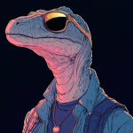

# Knight Takes Red Queen's Rook, Pawn Defends (Part 4) 

 
<b>Session started at 2025-02-16 / 21:04</b>
 
Fantasy Grounds - v4.6.2 ULTIMATE (2024-12-17) 
Fen's StarTrekAdventures Ruleset (v1.1.5)  
*[Prioritized Source: File; Other Sources: Vault]* 
*Core RPG ruleset (2024-12-17) for Fantasy Grounds
Copyright 2024 Smiteworks USA, LLC* 
*Fen's NPC Portrait Workaround v2.2.5* 
*[Prioritized Source: File; Other Sources: Vault]* 
*Fen's STA House Rules (v1.0.1) * 
*FG Browser v1.2.3* 
*[Prioritized Source: File; Other Sources: Vault]* 
*Fen's StarTrekAdventures Ruleset (v1.1.5) * 
*[Prioritized Source: File; Other Sources: Vault]* 

>INTERIOR - Voth Greenhouse: The rows upon rows of cabbages, caulifowers, carrots, and other assorted vegetables are sitting comfortably in the sun, absorbing its radiation, swaying gently under the ventilation of the sophisticated greenhouse. Their quiet day of being plants is suddenly and very rudely interupted when a young Andorian pilot crash lands a flaming shuttlecraft through the roof, plowing into dozens of innocent cabbages. 

>The crew stumble out of the Delta Flyer as the greenhouse's fire suppression system activates, dousing them all in water. 

**Throk** We have ruined many seasonings and flavorings to be used in the creation of wondrous meat dishes. Throk is sad. 
*Throk looks angrily at Zox.* 
**Throk** This is conduct unbecoming a security chef! 
**Zox: [ PRESENCE  (10) +  SCIENCE  (4)]
[Focus: Xenobiology ]
[Successes: 3] [Complications: 0]
Success with 2 momentum [2d20 = 11]** 
**Rhuk** You can't eat Voth, Throk. Anything else is fair game. 
**Zox** You can't eat Voth, Throk. Anything else is fair game. 
**Throk: [ REASON  (9) +  SCIENCE  (2)]
[Focus: Animal Training ]
[Successes: 3] [Complications: 0]
Success with 2 momentum [2d20 = 9]** 
Masakari (Zox): red-skull angery dice =D 
**Ensign Ghex** Not my finest landing, but we were taking fire. I don't mean to undermine or question your orders at all sir, but maybe you should have let me perform that hostile insertion 
**Throk** Throk suspect not EVERYTHING here is fair game, For instance, those girders are too chewy. 
**Zox** I mean you aren't wrong. I guess I should have expected more aggression from a planet of dinosaurs... 
**Ensign Ghex** Is it just me, or is it hot here. Like really hot. And not from the fire either. I don't know if I mentioned it, but Andoria is pretty cold, I'm not a big fan of hot weather, and especially not humid heat like this.  
**Zox** It's good for the skin.  
>As Zox and Throk argue over the edibility of Voth, a pair of Voth come jogging in through the greenhouse's main doors 

**Oakadan: [ REASON  (10) +  SECURITY  (2)]
[Focus: Fire Safety ]
[Successes: 2] [Complications: 0]
Success with 1 momentum [2d20 = 21]** 
**Kagon** Is anyone here injured? 
**Brag** We were on approach, we saw your vessel crash and came to assist 
**Throk** Throk volunteer to make injuries if you need to practice medical assistance, randomly appearing possible food sources. 
**Zox: [ FITNESS  (10) +  CONN  (1)]
[Focus: Endurance ]
[Successes: 2] [Complications: 0]
Success with 1 momentum [2d20 = 13]** 
**Oakadan: [ FITNESS  (9) +  CONN  (2)]
[Successes: 0] [Complications: 0]
Failed on DC: 1 [2d20 = 26]** 
**Throk: [ FITNESS  (10) +  COMMAND  (2)]
[Successes: 2] [Complications: 0]
Success with 1 momentum [2d20 = 16]** 
**Oakadan:  [d20 = 11]** 
>As everyone ponders whether they are injured, Oakadan notices a large fragmet of metal from the skin of the greenhouse lodged in his leg 

**Zox** We have 1 injured from among our crew. Also hello, it has been a while. 
**Oakadan** Oh, I'm injured 
**Brag** Zox? This is certainly unexpected 
**Kagon** I'm surprised that Starfleet hasn't locked you up yet 
*Brag smacks Kagaon in the head* 
**Brag** Shut up 
**Zox** Aw, they can't lock up their most famous chef! 
**Brag** We should take your friend to the clinic. 
**Zox** Yes please, thanks for the offer. Helpful as ever. 
**Kagon** What happened to you? Forgot how to fly an orbital approach? 
**Oakadan** I'd appreciate it 
**Zox** Someone opened fire on us. We can probably look up the coordinates. Didn't expect that really...I mean most of us stick together.....most of us. 
>Brag and Kagon lead the away team into the colony. It is a moderately sized collection of residential buildings and public spaces, surrounded by farmland and greenhouses as far as the eye can see. The population appears to number in the low thousands in this town. 

*Zox glares at Kagon* 
**Brag** I can't believe that someone in the colony would have opened fire on your ship. Well, Kagon may have if he knew you were on it, but probably no one else. 
**Throk** Throk looking for things to kill that shot at our ship. Or food. Or both. 
**Kagon** I resent that, I would have rammed it. 
*Throk looks for things that he should consider eating.* 
**Zox** Ghex, please triangulate the position of whatever took us out of the sky. 
**Zox** Well, it happened, Someone doesn't want us here, strange as it may be. 
**Ensign Ghex** Oh yes sir, I'll get right on it sir! Very important stuff, I can totally do that. No question. 
*Throk helpfully bends a piece of metal into the shape of a triangle to help Ghex.* 
*Ensign Ghex runs off towards the burning shuttle.* 
**Oakadan** Happens as often as not. I wouldn't be surprised if this was all a big misunderstanding 
**Throk** Throk conflicted, does Throk follow small blue creature that likely will get seriously injured off screen, or stck with Voth Security Chef who is 100% likely ot get seriously injured on-screen? 
**Zox** Where is 'food' more likely to arrive? 
**Oakadan** Go help out Ghex, she may need help moving things out of the way 
**Zox** It happens, but not on an agri-world. I didn't even know they had anti-ship batteries. 
**Oakadan** If Zox is okay with that 
**Zox** Sure am! 
**Throk** Throk go help small blue creature move heavy objects. 
**Throk** Throk also excited to be away from people who can try to convince him not to eat perfectly edible Voth. 
*Throk runs after Ghex.* 
>Brag and Kagon lead the crew to a small medical office near the town's main square, as they enter a small, older Voth notices them and comes out from behind his desk 

**Dr. Korok** Hmm... I hadn't heard you'd returned Zox, how did you injure yourself this time? 
*Dr. Korok begins scanning Zox with a medical tricorder* 
**Zox** Someone planetside opened fire on my ship and my crew. 
**Dr. Korok** Strange, you don't seem to be injured 
**Oakadan** That'd be me with the injury this time 
*Oakadan points at the blood trail* 
**Dr. Korok** Ah, of course. 
**Zox: [ PRESENCE  (10) +  MEDICINE  (1)]
[Successes: 2] [Complications: 0]
Success with 1 momentum [2d20 = 12]** 
Masakari (Zox): 'he has a high fever, 98.6!' 
**Dr. Korok** Well, I'm not sure what some of these organs are. But I bet you'll feel a lot better if we remove this big metal plate from your hind limb. 
indarien (Throk): He appears to have lost his entire outer skin and needs immediate full body grafts! 
*Dr. Korok rips the metal plate out of Oakadan's leg rather clumsily, causing a shot of pain through his body* 
**Oakadan** AHHH 
*Dr. Korok runs a dermal regenerator over the wound, stopping the bleeding* 
**Oakadan: [ REASON  (10) +  MEDICINE  (3)]
[Focus: Cybernetics ]
[Successes: 2] [Complications: 0]
Success with 1 momentum [2d20 = 15]** 
*Throk hears what sounds like a scream of joy and happiness from the sounds of the medical office and wonders what is for dinner.* 
**Zox** Efficient. Coldly efficient.  
**Oakadan** Maybe not... the most advisable method of removal there 
**Dr. Korok** Oh you'll be fine 
**Dr. Korok** Zox once impaled his leg on a planting stake, clean through 
**Dr. Korok** That was much worse, he bled all over my office. 
**Kagon** He probably deserved it 
**Zox** Deserved it is sorta harsh....working for the harvest is an honor! 
**Zox** accidents will happen.  
**Dr. Korok** Yes, usually to you 
**Oakadan** Alas, I'm afraid Ramatisians are not quite as durable as Voth are 
**Dr. Korok** Things have been much quieter around this office since you left, what brings you back? 
**Oakadan** I may have trouble keeping up if we have to move quickly, Zox 
**Throk** Voth Headfruit Festival! 
**Zox: [ INSIGHT  (7) +  SECURITY  (5)]
[Successes: 2] [Complications: 0]
Success with 1 momentum [2d20 = 17]** 
**Zox** We are here to experience amazing Voth cuisine, and to bring choice specimens back to Starfleet. Also to visit family ya know? 
**Zox** Never expected to get shot. mauled, bitten, gored, charged, headbutted....but not shot! 
**Zox** the indignity of it! 
**Dr. Korok** Someone shot at you? 
**Zox** Our ship was shot down.  
*Dr. Korok turns and glares at Kagon* 
**Kagon** It wasn't me 
**Zox** that's a peice of it you just removed. 
**Dr. Korok** Why would anyone have shot at your ship? 
**Zox** No idea.  
**Zox** I do believe we will find out more.  
*Ensign Ghex bursts into the room* 
**Zox** It would be maddness to assault a federation vessel, given everything. 
**Ensign Ghex** I believe I can help with that sir 
**Zox** Ensign Ghex, what have we learned? 
*Throk follows Ensign Ghex into the room, with a largish bloody bone hanging from his mouth as he chews thoughtfully.* 
**Ensign Ghex** I was waiting outside for just the right moment to make an entrance, I didn't want to interrupt your reunion and then I thought that was the perfect, dramatic time to burst in, you know. How was it? Was it too much? Was it not professional enough for a Starfleet officer? Maybe I should have just come in quietly when I got back and not tried. 
**Throk** Throk think small blue person is adorable and wants to keep her. 
*Throk gently pats Ghex on the head like she is a pet.* 
**Ensign Ghex** But I just thought it would be pretty cool, and you guys get to do so much cool stuff and I usually don't get to do the cool stuff, you know? 
**Zox** Whatcha got? 
*Throk rummages through pockets looking for a snack and finds a piece of cabbage and gives it to her.* 
**Ensign Ghex** Oh right... I triangulated the coordinates of the incoming fire that took us down, it originated from a ground-based phaser array about 2km outside the town 
**Zox** And there we go. 
**Zox** Fantastic! 
**Oakadan** Do we have a map of the settlement we can refer to? 
**Brag** Sounds like one of the defense grid emitters  
**Zox** We don't need a map, everything is coded with scents. can't you tell? 
**Zox** Interesting....but why would they fire on a federation ship? 
**Throk** Yes, Throk noticed beautiful aroma of Voth eggs. 
*Throk gets out some salt.* 
**Throk** Omelettes? 
**Ensign Ghex** I, um. I don't think you should eat the Voth eggs 
**Zox** Generally considered an act of war.  
**Throk** They have nice mushrooms and plenty of spring onions. 
**Brag** True, as for the defense grid, it could be a malfunction 
**Oakadan** Would it be okay if we took a look at it? 
**Brag** The system is automated, and it doesn't really get a lot of use. It was installed during the Dominion war, I don't think it's ever been activated since 
**Zox** I do believe you are coming with us Mr. Kagon...yes...as we investigate the defense grid.  
**Throk** Throk think Starfleet would not declare war on Voth colony, after all, Voth eggs cook much like Ostrich eggs and require special treatment, unlikely to be worth fighting a war over. 
**Dr. Korok** Try not to get yourself impaled, burned, gored, or otherwise grievously injured 
*Throk bows to esteemed doctor Korok.* 
**Throk** Throk will ensure that Zox only suffer injuries that help Throk and friendly local doctor achieve bingo card completeness. 
**Zox** Thanks for treating my crewmate. Here are some seeds from far off lands. May they treat you with flavors and scents, good doctor. 
*Throk hands Dr Korok a pre-printed bingo card.* 
**Dr. Korok** At least you haven't forgotten your manners up there with your Starfleet 
*Zox bows graciously to  Dr. Korok* 
>The walk to the defense grid is brisk, the fresh air and open space are a welcome change of pace (apart from Ghex complaining about the heat continously). At the coordinates, the crew finds a small, Class IV planetary defense phaser emitter. 

*Throk hands Dr Korok two of the crayons from his box to help track Bingo cards and adds him to the instant messaging group Kolea setup.* 
**Zox** Ok dokie. Time to see who set this thing to evil. 
**Zox** Throk, watch our backs please. 
**Zox: [ CONTROL  (11) +  SECURITY  (5)]
[Focus: Espionage ]
[Successes: 1] [Complications: 0]
Success with 0 momentum [2d20 = 25]** 
**Kagon** Don't be so dramatic, it was probably a malfunction 
**Kagon** Believe it or not, you're not actually the center of the galaxy 
**Zox** Never thought I was.  
*Throk carefully watches Kagon and Zox's back, looking for knives being implanted into them or currently stuck in them.* 
**Oakadan: [ CONTROL  (11) +  SECURITY  (2)]
[Successes: 2] [Complications: 0]
Success with 1 momentum [d20 = 1]** 
**Zox** Well you are right about somehting Kagon, it's not about me, it's about intentional aggression against a federation vessel. 
**Zox** This took deliberate tampering. It's not like a mouse did this. 
**Zox** You could say this is...oddly specific. 
**Zox** Like it would take a pilot to program it this specifically. 
**Oakadan** What does it target? 
*Zox intensifies glares at Kagon.* 
**Zox** Our Delta Flyer. 
**Throk** Throk like intentional aggression, it like Spicy Klingon Liver Flaming Burrito, much better planned and while consuming than aftereffects of greasy flammable diarrhea. 
**Kagon** Oh, you little bastard 
*Kagon tackles Zox* 
**Zox: [ DARING  (12) +  SECURITY  (5)]
[Successes: 2] [Complications: 1]
Success with 1 momentum [3d20 = 51]** 
**Zox:  [d20 = 8]** 
**Zox** I'm the bastard! You sneaky hot-blooded bastard!  
>Kagon tackles Zox to the ground and attempts to claw his face, but Zox kicks him off 

**Throk** Throk will watch glorious Security Chef beat up weasly Voth, but if you need to tap out, Throk right high. 
**Zox:  [Total: 6] [Effects: 1] [6dChallenge = 6]** 
**Zox** Just spit it out and this will go much smoother. Even you wouldn't want to endanger the whole colony. 
>Zox headbutts Kagon, then judo throws him to the ground 

**Kagon** I didn't reprogram the defense grid, you arrogant ass 
*Throk picks Kagon up by the scruff of the neck, dusts him off and sets him down upright.* 
**Zox** Okay, but do you know who did? 
**Oakadan** Or who could? 
**Kagon** What? No I don't 
**Kagon** Why would I know that? 
**Throk** Throk wonder why no one in Starfleet ever dust things for claw prints. 
**Zox** Okay, but you work in transportation. Your livelihood depends on this. Who on the planet could reprogram this? 
**Oakadan** Who usually operates and maintains these? 
**Throk** Throk also wonder why Starfleet computers so small compared to might Gorn Vacuum Tube Arrays. 
**Kagon** I'm not sure, this thing was installed by Starfleet security during the Dominion war 
**Kagon** We don't have much use for it these days, it just sits out here collecting pollen 
**Zox** Hrm. 
*Throk hopes his pet Ghex does not develop allergies being around this much pollen and offers her a blood stained, giblet encrusted handkerchief.* 
*Ensign Ghex is visibly horrified by Throk's offer* 
**Throk** Just use other side. 
**Zox** Ghex, any way you can look into the security system here? 
**Ensign Ghex** Um, no you know what.. I think I'm ok, I'll pass 
**Ensign Ghex** Oh yes sir, I wasn't saying "I'll pass" to you sir, I was talking to Crewman Throk. I would never pass on an order sir. I would never derelict my duty  
**Zox** What you need is a refreshing cold juice or something, not whatever Throk hunted. 
*Throk rips off the emergency access panel, sits down, loudly cracks his knuckles and goes, "A keyboard, how quaint."* 
**Kagon** Good thinking: do some actual investigating instead of accusing me 
**Throk: [ REASON  (9) +  SECURITY  (4)]
[Focus: Hacking Security Systems ]
[Successes: 3] [Complications: 0]
Success with 2 momentum [2d20 = 6]** 
**Zox** You have the motive and the history Kagon. 
**Throk** Throk mostly use these skills to get the food replicators to create live objects that taste better, but I guess can be used for other things. 
*Ensign Ghex crawls up into the guts of the phaser emitter through the open access panel* 
**Kagon** The motive to do what? And what history, YOU were the one who got arrested 
**Zox** I'm innocent to this day. 
**Zox** I would never steal heirloom seeds. 
**Oakadan** Throk, you have to know that's very against protocol 
**Kagon** And I would never shoot down a random Federation shuttlecraft 
**Zox** Truth. And this was programmed quite specifically, not randomly. 
*Zox smirks at Kagon.* 
**Throk** Throk agree that Zox is as innocent as yellow snow, Unit 31, Nuremburg Associates, Romulan Tal'Shiar, Obsidian Order Operatives, and Bodai Shin Assassins. 
**Brag** Are you two finished measuring your cloacas? 
**Throk:  [Total: 2] [Effects: 0] [4dChallenge = 2]** 
**Throk:  [Total: 4] [Effects: 2] [3dChallenge = 4]** 
*Throk looks at Oakadan.* 
**Throk** What is against Starfleet protocols? 
**Zox** For a time I suppose.... 
**Zox** You may have your herd panic alerted too Brag if you were shot at. 
Masakari (Zox): (Now to not re-whale) 
**Geret:  [d20 = 6]** 
**Geret:  [d20 = 17]** 
**Geret:  [d20 = 3]** 
**Geret** Whew thank you! 
**Geret** I didn't know there was a whole world of whales out there communicating a great epic across the seas of space and time! 
>INTERIOR - Maintenance junction, Deck 7 Section 22: Skig, Murry and Geret crawl through the Jeffries tube to the coordinates where Skig tracked the signal that activated the gas in Sickbay. 

>Geret does not turn into a Gormagon and crush everyone to death (yet) 

>As the approach, Malat also pincers in from the other direction, carrying a phaser rifle 

**Hailey Murry: [ DARING  (10) +  SECURITY  (3)]
[Successes: 2] [Complications: 0]
Success with 1 momentum [2d20 = 26]** 
*Skig looks at tricoder set to scanning for lifeforms or displacement patterns indicative of cloaked objects moving nearby.* 
**Skig: [ CONTROL  (11) +  SCIENCE  (3)]
[Successes: 1] [Complications: 0]
Success with 0 momentum [2d20 = 23]** 
*Skig is definitely carrying a Type-2 Phaser.* 
**Skig** There is some sort of small cloaked object around here, but I cannot get a lock on it. 
**Geret: [ CONTROL  (10) +  SCIENCE  (5)]
[Successes: 2] [Complications: 0]
Success with 1 momentum [2d20 = 13]** 
**Hailey Murry** How small are we talking? 
*Geret points a tricorder at things.* 
**Skig** I assume it is only a matter of time before someone trips over it and we have a hull breach from Geret turning into a Crystalline Entity. 
*Geret points to the portside wall.* 
**Skig** It's too small to be a person. 
**Geret** It's in there.  
**Geret: [ INSIGHT  (9) +  COMMAND  (4)]
[Successes: 2] [Complications: 0]
Success with 1 momentum [2d20 = 16]** 
*Geret insists on making tricorder noises while making strange telepath hand signals.* 
**Geret** beep boop beep. 
*Skig gets out torsion #6 screwdriver and prepares to open the panel.* 
**Geret** Nope, no sentience.  
**Skig** So it's from North America? 
**Skig** Whoops. 
**Skig** I uh, scratch that. 
*Skig opens the panel up to see what is on the other side.* 
*Skig checks for traps to make sure a booby-trap does not damage the Lister.* 
**Geret: [ FITNESS  (10) +  SECURITY  (2)]
[Successes: 1] [Complications: 0]
Success with 0 momentum [2d20 = 29]** 
**Skig: [ FITNESS  (10) +  SECURITY  (3)]
[Focus: Survival ]
[Successes: 1] [Complications: 0]
Success with 0 momentum [2d20 = 31]** 
>As Skig begins to pull the panel open, she and Geret both hear a faint skittering sound. As the panel comes off, they see nothing out of the ordinary. 

*Skig listens to determine if the skittering sound is mechanical or a living thing.* 
**Geret** Hrm. What's going on here Skig? 
**Skig: [ DARING  (10) +  ENGINEERING  (5)]
[Successes: 1] [Complications: 0]
Success with 0 momentum [2d20 = 27]** 
**Skig** Whatever that was, it was biological in nature. 
**Hailey Murry** But non-intelligent? 
**Lt. Cmdr Malat** And Throk is off the ship 
**Geret** So...a tribble with espionage gear.... 
**Skig** I think once we get this thing and figure out its cloak signature we need to do a full sensor sweep of the entire ship, looking for anything displaced or not a member of Starfleet (or a Pakled stuck in the hold). 
**Lt. Cmdr Malat** I hate this cloak and dagger crap 
**Geret** I love level 5 diagnostics! 
**Lt. Cmdr Malat** I prefer an enemy that has the decency to try to kill me to my fafce 
**Skig** Throk being off the ship means we won't find exploded creatures in multiple food replicators, good point Malat. 
**Skig** That will cut down on the non-Starfleet mobile biological matter. 
**Geret** Perhaps you will have the pleasure of facing them in a dramatic combat once you find them. Is not the hunt most of the thrill? 
**Hailey Murry** This is more like a game of cat and mouse 
**Lt. Cmdr Malat** A minute ago you speculated that this is a tribble, truly I cannot wait to engage the Tribble in dramatic combat 
**Geret** It's not the tribble, it's whomever had the audacity to enslave an innocent semi-sentient creature and try to harm Janeway. 
**Skig** If it makes you feel better, I can put it in a combat exoskeleton with dual flamethrower arms? 
**Geret** Skig, here is the signature pattern, if it helps.  
*Skig investigates the object in question.* 
**Hailey Murry** I don't suppose you have echolocation, do you? 
**Geret** Had. =( 
*Skig closes any engineering access panels and openings to prevent it from moving too far away.* 
**Skig: [ INSIGHT  (8) +  ENGINEERING  (5)]
[Focus: Security Systems ]
[Successes: 1] [Complications: 0]
Success with 0 momentum [2d20 = 27]** 
**Geret** Do you wear makeup Hailey? Im not here to judge, but if you have powdery foundation or something, you could blow it and see if you can uncover it. 
>Skig reaches slowly into the panel and starts feeling around, the skittering sounds keep moving around in response. Skig continues moving her hand in the direction of the sounds until suddenly, she feels a sharp pain as something bites her finger 

**Geret** or dust, powder, etc. of any sort. 
**Skig** Oh good, it can bite. 
>She is viciously, savagely bitten for 2 damage 

**Hailey Murry** I used to, but I don't have it anymore. I wouldn't have had it with me anyways, but we have Skig's blood now 
*Skig fully expects to be dead within 10 minutes from poison.* 
**Skig: [ FITNESS  (10) +  MEDICINE  (1)]
[Focus: Survival ]
[Successes: 1] [Complications: 0]
Success with 0 momentum [2d20 = 22]** 
>A few drops of blood splatter on the tiny creature, making it a little easier to see. It skitters away deeper into the panel after biting Skig's finger 

**Skig** Or we could just use a replicator to get some nice bright green spray paint. 
**Lt. Cmdr Malat** Or we just gas the little bastard 
**Lt. Cmdr Malat** Turnabout is fair play, after all 
**Geret** Ooh, I have a plan to find this little rascal. Everything is just blobs of DNA anyway.... 
**Geret: [ DARING  (10) +  SCIENCE  (5)]
[Focus: Transporters & Replicators ]
[Successes: 1] [Complications: 0]
Success with 0 momentum [2d20 = 26]** 
**Skig** Or maybe use a phaser rifle with a wide area setting for stun? 
**Hailey Murry: [ DARING  (10) +  SCIENCE  (4)]
[Successes: 0] [Complications: 0]
Failed on DC: 1 [d20 = 17]** 
>As Malat and Skig discuss their various options for solving this problem with violence, Geret beams the creature into a containtment vessel by locking onto the blood that spilled from Skig's finger 

**Geret** oooh! What sort of adorable thing did we find... 
**Geret** I bet it's scared and needs some food 
**Hailey Murry** This better not be the Twins dog 
>As it materializes in the box, the cloaking field cuts out and you see a tiny Cardassian Vole wearing some kind of tranceiver array on its back 

*Geret fawns over the otherwise intentionally ugly creature.* 
**Lt. Cmdr Malat** We should kill it, these things are nightmares 
**Geret** Nooo! It may be a hideous pest, a disease vector, but it's still alive. 
**Geret** We should find a place to release it after taking its transceiver for forensic analysis. 
*Skig asks herself, "Can this thing damage the Lister?"* 
**Lt. Cmdr Malat** These things breed like crazy, destroy machinery, and spread disease 
**Skig: [ REASON  (10) +  ENGINEERING  (5)]
[Focus: Security Systems ]
[Successes: 3] [Complications: 0]
Success with 2 momentum [2d20 = 13]** 
**Hailey Murry** Wait 
**Hailey Murry** How many more are there? 
**Geret** We could scan for more. 
**Geret** But back-tracing the electronic gadget takes priority, no? 
**Skig** We purge them with cleansing fire and eradicate every damn one of these things. 
**Lt. Cmdr Malat** Hell yes ma'am 
**Lt. Cmdr Malat** It didn't invent that little gadget on its own though 
**Lt. Cmdr Malat** It's basically a mean rat 
**Skig** We need to identify the cloak signal it is using to find others and then track down their biological systems and eliminate them with prejudice from my beautiful, recently repaired, ship. 
**Hailey Murry** We can have T'kor tear it apart, I'm betting this thing was with Zerra 
**Geret** immediately scans local planets to see where voles can be re-homed. 
*Geret immediately scans local planets to see where voles can be re-homed.* 
**Geret: [ CONTROL  (10) +  SCIENCE  (5)]
[Successes: 2] [Complications: 0]
Success with 1 momentum [2d20 = 18]** 
**Lt. Cmdr Malat** No way, these things are notorious for chewing on power system cabling. If they had been on the ship that long, they would have caused damage to the power systems, blackouts... We would have noticed 
**Lt. Cmdr Malat** We used to have to deal with these in the resistance, wherever the spoonheads go you find these little monsters 
**Hailey Murry** Do we have some on board, then? Stowaways? 
**Lt. Cmdr Malat** They must have come aboard recently, otherwise Skig and T'Kor would have already seen evidence of the damage 
**Skig** First thing, we need to get the cloaking device and the transmitter off it. I doubt very much that transmitter was long enough of a relay, this could be the first stop to where the actual saboteur is. 
**Skig: [ REASON  (10) +  ENGINEERING  (5)]
[Focus: Electronics ]
[Successes: 0] [Complications: 1]
Failed on DC: 1 [2d20 = 37]** 
**T'kor: [ REASON  (9) +  ENGINEERING  (4)]
[Successes: 3] [Complications: 0]
Success with 2 momentum [2d20 = 7]** 
**Skig: [ REASON  (10) +  ENGINEERING  (5)]
[Successes: 1] [Complications: 0]
Success with 0 momentum [d20 = 9]** 
**Geret:  [d20 = 10]** 
**Skig:  [d20 = 6]** 
**Geret:  [d20 = 18]** 
**Geret:  [d20 = 3]** 
>T'kor is able to isolate the power frequency of the cloaking emitter, while Skig accidentally drops the tranceiver into the access panel. 

*Skig sighs.* 
*Geret becomes deeply conflcited, not knowing if the vole is worth respect and care, or smash that creep for bitin the boss.* 
>As it slips through her gloved fingers, she hears it fall through the gap between the panels and tumble several decks down, clanging loudly off both panel walls on the way. 

**T'kor** Do you... want me to fetch it? 
**Skig** Well, at least we can scan for any more by looking for that power frequency and Vole biological signatures. 
**Geret** You got it boss. 
**Skig** No, I'll go get it. 
**Geret: [ CONTROL  (10) +  SCIENCE  (5)]
[Successes: 1] [Complications: 1]
Success with 0 momentum [2d20 = 28]** 
**Geret:  [d20 = 11]** 
**Geret:  [d20 = 11]** 
**Geret:  [d20 = 14]** 
**Lt. Cmdr Malat** I'm definitely reading a decent signal consistent with this power signature, but I can't isolate it 
**Lt. Cmdr Malat** We may need to get to the bridge and use the internal sensors 
**Geret** Maybe Im not cut out for a life 'a crime.... 
>As she speaks, Geret suddenly sneezes and turns green, her mouth deforming to a large, terrifying, toothy oriffice. 

**Skig:  [d20 = 7]** 
**T'kor:  [d20 = 4]** 
**Hailey Murry:  [d20 = 3]** 
>Suddenly she feels... hungry, and she lunges at Malat, latching the terrible orifice onto her neck 

>As she strikes, the power suddenly flickers out, plunging the tiny junction into inky black darkness 

*Geret makes horrible noises.* 
