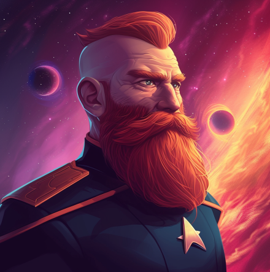

# Knight Takes Red Queen's Rook, Pawn Defends (Part 6) 

 
<b>Session started at 2025-03-03 / 20:50</b>
 
Fantasy Grounds - v4.6.2 ULTIMATE (2024-12-17) 
Fen's StarTrekAdventures Ruleset (v1.1.5)  
*[Prioritized Source: File; Other Sources: Vault]* 
*Core RPG ruleset (2024-12-17) for Fantasy Grounds
Copyright 2024 Smiteworks USA, LLC* 
*Fen's NPC Portrait Workaround v2.2.5* 
*[Prioritized Source: File; Other Sources: Vault]* 
*Fen's STA House Rules (v1.0.1) * 
*FG Browser v1.2.3* 
*[Prioritized Source: File; Other Sources: Vault]* 

>INTERIOR - Walk-In Freezer: Throk and Zox look over Kagon's shoulder at Rhuk, frozen nearly solid, hanging from a meat hook by a harness looped under her armpits. She sways gently side to side, bumping into the other slabs of frozen Paraceratherium and Megatherium meat. 

**Throk** Throk think this problem best solved with gentle waeming of Security Chef Mom-sicle and licking to increase heat. 
*Zox looks relatively calm* 
**Zox** Yeah pretty much. A slow return to normal temperatures should revive her. 
**Throk** Throk not know much, but Throk do know that this situation not solved by flamethrower. 
**Zox** Im not sure the Indrocathir nor the sloth have such highly evolved topor though. 
**Throk: [ REASON  (9) +  MEDICINE  (1)]
[Focus: Animal Training ]
[Successes: 0] [Complications: 0]
Failed on DC: 1 [2d20 = 32]** 
**Throk** Throk willing to try faster approach though! 
**Throk** Maybe if we use Delta Flyer atmospheric exhaust vents, calibrated to 2500C it will reunite family faster. 
**Zox** Well...it would do that. 
**Oakadan: [ REASON  (10) +  SECURITY  (2)]
[Successes: 1] [Complications: 0]
Success with 0 momentum [2d20 = 24]** 
**Zox** But think about turtles or frogs overwintering. We used to do this to get out of family gatherings, it's harmless and normal for Voth. 
**Zox** Just takes a good 24 hours to revive. 
*Oakadan boots up the computer to look through records to see what Zox's sister was up to* 
**Oakadan** Let's hope we have that long, whoever else is behind this is going to find out before that 
**Throk** That same amount of time it takes to make a good slow roasted Targ and Romulan souffle 
**Throk** Err... I meant "Romulan Ale" 
**Zox** What we need is a science or engineering solution to expedite the process without harming Rhuk. 
*Oakadan checks out Loran's body for personal belongings that might contain a little more information. * 
**Oakadan** Nothing on the main computers here, not that I could find. 
**Zox: [ REASON  (7) +  SECURITY  (5)]
[Focus: Espionage ]
[Successes: 0] [Complications: 0]
Failed on DC: 1 [d20 = 13]** 
**Throk** Throk think it possible to put her on automated spit and rotate it at a steady rate of 360 degrees per two minutes over 52 C constant temperature. 
**Throk: [ REASON  (9) +  ENGINEERING  (2)]
[Focus: Animal Training ]
[Successes: 1] [Complications: 0]
Success with 0 momentum [2d20 = 22]** 
**Oakadan** Throk, that's a BBQ recipe 
**Ensign Ghex** I'm just really glad that Zox's mom isn't also dead, or trying to kill us with kitchen tools. Or having some kind of medical emergency that I have to assist with. I don't think I could handle killing Zox's mom and sister on the same day, no sir. That would be the worst day ever. Not that it's as bad for me as it is for you sir, obviously I know that.  
**Throk** Throk was going to suggest use of basting wand to keep her from dehydrating. 
**Kagon** I don't think you can cook barbeque at 52 degrees 
*Throk pats Ghex on head.* 
**Zox** Okay, which way to the spa? 
*Throk looks at Kagon.* 
**Kagon** You've been gone too long, all those starship ammenities have really gone to your head 
**Zox** I appreciate it Ghex 
**Throk** Depends heavily on whether you like it raw, rare, or medium-rare. 
**Kagon** This isn't a resort, it's a farm town 
*Oakadan hands Zox the device he found earlier* 
*Oakadan tosses a fire blanket over Loren's body* 
**Zox** Oooh, what's this? 
**Kagon** We have greenhouses and fields, not spas. 
**Throk** Mighty Security Chef, I think you should determine if this actual sister and what species if not sister. 
**Zox** Good enough! to the warmest greenhouse we have! 
**Oakadan** Maybe one that's a bit less obvious 
**Zox: [ INSIGHT  (7) +  SECURITY  (5)]
[Focus: Xenobiology ]
[Successes: 2] [Complications: 0]
Success with 1 momentum [2d20 = 18]** 
**Oakadan: [ REASON  (10) +  MEDICINE  (3)]
[Successes: 3] [Complications: 0]
Success with 2 momentum [2d20 = 6]** 
KruschtyaEquation (Oakadan): Is she actually dead? 
**Throk** Also, I think maybe we should look for clues as to what sister was doing, and perhaps review logs to determine what was going on around here. 
**Throk** Like maybe sister was fake-sister who stunned mother and frosted her. 
**Zox** There's a time for that, but Rhuk would know the most. 
**Zox** 'Mother Knows best' 
*Zox winks at camera.* 
**Oakadan** Oh. I'm picking up something on the scan. Look at this 
*Oakadan points to a very familiar looking scarring on her prefrontal cortex* 
**Throk** Throk think that kind of important to mention to smart person like Kolea. 
**Oakadan** We encountered this previously. Technology to swap the minds of intelligent beings. We may have killed Loran's body, but that wasn't Loran on the inside.  
**Zox** Ah ha! Nicely done. 
*Throk pats Oakadan on the head.* 
**Throk** Throk not be able to determine that by eating head. 
**Oakadan** Zox, can you grill your two friends here? Make sure they're who they say they are? 
**Throk** Good thing Throk opted for left kidney. 
*Oakadan has his phaser casually out, though not pointing at anyone yet.* 
**Throk** Throk LOVE Oakadan idea! 
*Throk readies BBQ pit.* 
**Ensign Ghex** I don't see how eating her head would tell you anything. Or her kidneys. Or any other body parts, for that matter. Sir, if I am killed in action can you make sure Throk doesn't eat me? My parents would want my body back without any bite marks on it. 
**Oakadan** Not like that, Throk! 
**Oakadan: [ REASON  (10) +  MEDICINE  (3)]
[Successes: 2] [Complications: 0]
Success with 1 momentum [2d20 = 13]** 
**Kagon** You should be more careful with your words before your friend starts eating Voth 
**Oakadan** As long as you're not covered in BBQ sauce, you should be safe 
**Throk** Throk go do something useful with himself. 
**Throk: [ REASON  (9) +  SECURITY  (4)]
[Focus: Hacking Security Systems ]
[Successes: 2] [Complications: 0]
Success with 1 momentum [2d20 = 18]** 
**Oakadan** Looks like they're both clear, Zox 
**Throk** Throk looking at control system and diagnostics of the automated culinary attack system. 
**Brag** Let's get Rhuk to a greenhouse to warm her up before anyone gets eaten 
**Zox** Thank you Brag and Kagon. 
**Throk** Throk agree, it would be very awkward to explain to Hailey that mother-in-law was eaten. 
**Oakadan: [ REASON  (10) +  MEDICINE  (3)]
[Successes: 2] [Complications: 0]
Success with 1 momentum [2d20 = 16]** 
**Zox: [ FITNESS  (10) +  SECURITY  (5)]
[Focus: Xenobiology ]
[Successes: 2] [Complications: 0]
Success with 1 momentum [2d20 = 16]** 
**Oakadan** We need to be careful. If they have the scar, it's very likely that Zerra is here 
**Oakadan** Unless... that was Zerra... 
>Zox tears off a frozen Paraceratherium leg and ties it to a wooden stake for Throk to gnaw on while they wait. 

**Oakadan** That'd be quite the way to go if it were 
**Oakadan** She greeted you the moment she saw you, didn't she? Because that would imply that she *knew* you, despite not really being your sister 
*Throk sprinkles salt, parsley, and basil on the leg and lets it slowly warm up.* 
**Zox** ...Into the freezer it goes. 
**Ensign Ghex** I really hate this brain controlling technology. If they can replace anyone, then you can't trust anyone. Any of you could be replaced by a nefarious person. I could be replaced by a nefarious person... Would I know if I was replaced? Could I have been replaced?  
**Zox** No, you are irreplacable. 
*Oakadan scans Ghex* 
**Oakadan: [ REASON  (10) +  MEDICINE  (3)]
[Successes: 2] [Complications: 0]
Success with 1 momentum [2d20 = 12]** 
**Ensign Ghex** Maybe I should go to sickbay when we get back and have Kolea run a brain scan on me, just in case I was replaced. 
**Ensign Ghex** I wouldn't want to be replaced by someone with nefarious intent and blow up the ship or something really bad. That would probably look bad on my record. 
**Throk** Throk thinks if he was replaced by nefarious person, he would probably be vegan. Throk cannot think of more nefarious thing than that. 
**Oakadan** You're very low on the list of people who'd be targetted. Throk, too. You two have very distinctive talking patterns 
**Throk** Throk suspects wise fireman who gets angry all the time would be far more likely. 
*Throk gets out etch-a-sketch and waves it at Oakadan and makes beeping noises.* 
**Throk** Throk think you okay for now. 
**Oakadan** I... thank you, Throk 
**Zox** Brag...Kagon...where is the coziest green house around here? 
**Zox** Heat lamps, humidifiers, the works? 
**Throk** Throk think we should be careful transporting Zox-mom. Don't want to bend in half and snap by accident. 
**Oakadan** Are we planning to announce we found Rhuk, or are we keeping this a secret? 
**Brag** I'll take you there, the sooner you guys thaw her out the sooner you take this Gorn away. 
**Zox** this is a secret. 
**Oakadan** Then might I suggest we pick a greenhouse that will be inconspicuous? One that won't have much traffic? 
**Throk** Throk will prepare trebuchet to launch her into greenhouse. 
**Zox** Brag, is there a way to get there without drawing attention> 
**Throk** We could toss bloody blanket over her and I could pretend to be angry you are moving my food somewhere. 
**Throk** After all, vegetarian Voth unlikely to question blood soaked towel. 
**Ensign Ghex** I think that the trebuchet would be bad, because she would smash through the windows and that would let out all the warm air. Greenhouses don't work to stay warm if you smash big holes in their roof, because all the heat will get out through convection. 
**Throk** Just don't let it free to her. 
**Throk** Just don't let it freeze to her. 
*Throk pats Ghex on the head.* 
**Throk** Good point Ghex, we should build a tunneling machine to burrow there under the ground. 
**Brag** We can circle around through the fields outside town, head over to the nurseries that way 
**Zox** Perfect. 
**Throk** Throk wonder if they have giant megafauna moles here? 
**Throk** Perhaps 500 tonne prairie dog. 
**Zox: [ REASON  (7) +  SCIENCE  (4)]
[Focus: Xenobiology ]
[Successes: 2] [Complications: 0]
Success with 1 momentum [2d20 = 19]** 
**Throk** What about a Brachiosaurus sized kangaroo? 
**Throk** That would be super delicious 
>Zox goes out to the stables and returns with a 2 meter long giant burrowing mole 

**Throk** Throk suspect absolutely nothing bad happen from this strange turn of events. 
**Throk** But THROK can be helpful! 
**Throk: [ INSIGHT  (9) +  COMMAND  (2)]
[Focus: Animal Training ]
[Successes: 2] [Complications: 0]
Success with 1 momentum [2d20 = 14]** 
*Throk cuddles thje mole.* 
**Throk** Can we take it back to Lister and use it to clear out debris in jeferries tubes? 
**Throk** Throk always knows there is problem in Jefferies Tubes, Skig send Throk there at least 5 times per shift. 
>Throk takes the mole outside and commands it to burrow towards the greenhouses. The rest of the away team follow, crouching through the narrow burrow hole as they sneak their way across the colony 

>♫♫♫Heroic Music Sting♫♫♫ 

**Throk** Throk suspect Skig not realize that Throk knows Skig is using transporter to make messes to keep him busy. 
>INTERIOR - Briefing Room: Captain Bachar summons the senior staff to dicuss their options regarding the situation that has developed aboard the Lister.  

**Skig** So, half-salt-vampire half-vole deranged shapeshifter being a threat to the entire ship was not on my list of things to worry about this week. 
**Hailey Murry** I think the proportion of salt-vampire to vole is shifting from half/half 
**Gra'lan** Why not just make a glue trap with cheeze bait? 
**Gra'lan** ...really salty cheeze. 
**Hailey Murry** Salt vampire 
**Hailey Murry** Not cheese vampire 
**Kolea: [ CONTROL  (9) +  MEDICINE  (4)]
[Focus: Xeno-biology ]
[Successes: 2] [Complications: 0]
Success with 1 momentum [2d20 = 17]** 
**Kolea:  [Total: 2] [Effects: 1] [4dChallenge = 2]** 
**Kolea:  [Total: 2] [Effects: 0] [2dChallenge = 2]** 
**Hailey Murry** I suggest laying out a trail of salt through some of the jefferies tubes. It should lead in a circle, going to a place of ambush so that no matter which way she follows it, we get her.  
**Captain Bachar** Or she gets you 
**Captain Bachar** What is your plan when you corner her? 
**Gra'lan** WHy not lace the salt with narcotics, so she falls into a peaceful slumber? Im sure Peacebloom has some of the good stuff. 
**Lt. Cmdr Malat** Flame thrower 
**Hailey Murry** I was just planning ona  lot of phasers 
**Windbloom Openheart** I'm more of a psychoactive and halucinogen kind of guy 
**Skig** Potassium Hydroxide. 
**Skig** Although, if the Voles are actually drawn to her, then leading her down into an enclosed shuttle bay, having the rest of them head down there, and then solving two issues at once could work. 
**Lt. Cmdr Viraseti** I don't think we should be giving her any drugs, we have no idea about her biochemistry at this point 
**Lt. Cmdr Viraseti** It could kill her, or have some other unpredictable effects 
**Hailey Murry** That's a very good point, we're not sure where the safety margins are 
*Windbloom Openheart silently mouths "Narc"* 
*Hailey Murry mouths "lie to the cops, not the EMS"* 
**Captain Bachar** We also need to deal with the remaining voles, and they aren't going to be attracted by the salt 
**Gra'lan** I got a plan for those 
**Lt. Cmdr Malat** No, those little bastards are drawn to EPS lines 
**Captain Bachar** What's your plan Mr. Gra'lan? 
**Skig** Does this plan involve something along the same lines as the Tribble infestation solution? 
**Gra'lan** They probably use a mixture of sound to navigate dark places, I can send a distress call to one deck and concentrate them. Replicating their calls is just a degenerate form of linguistics. 
**Gra'lan: [ INSIGHT  (11) +  ENGINEERING  (4)]
[Focus: Linguistics ]
[Successes: 1] [Complications: 0]
Success with 0 momentum [2d20 = 24]** 
**Captain Bachar** And once you get them concentrated, what then? If you try to capture them, they'll just scatter again 
**Lt. Cmdr Malat** Flamethrower 
**Gra'lan** Harm free, no chemicals, no toxins. 
**Gra'lan** If it's not Geret, feel free to flame thrower them and save them for ThrokSnax 
**Hailey Murry** Can they dig through metal? 
**Gra'lan** I can't ever seem harming someone who reminded me of my precious horta. 
**Lt. Cmdr Malat** No, they get around in conduits and maintenance spaces 
**Lt. Cmdr Malat** They can't chew through tritanium 
**Skig** We can also just seal off areas that are Vole-free to keep them from doubling back. 
**Windbloom Openheart** I don't think we should kill them, they're innocent creatures. They are just being used by whoever put them there. 
**Hailey Murry** If we capture them alive, we can save them and drop them on Zerra's ship eventually 
**Kolea** The best way to determine who that is would be to find the cloaking device the one was wearing or finding whoever was controlling the Jem'Hadar missing its frontal lobe. 
**Gra'lan** can't we compromise and keep then in a transporter pattern until the ethics committee figures this out? 
**Hailey Murry** Are the transporters back up yet? 
**Skig** Then we could beam them into the hold of the ship who sent them, I like it. 
**Lt. Cmdr Malat** I agree, it would be great to have that cloaking device to inspect. Someone dropped it down a maintenance shaft though 
**Skig** I can get it back eventually. 
**Lt. Cmdr Viraseti** That maintenance shaft terminates below deck 21 
**Lt. Cmdr Malat** I don't want to go crawling around through a dark maintenance shaft in the belly of the engineering section while there is a salt vampire roaming around 
**Skig** That's fine, if all else fails I can beam some targ down there and send Throk to get it. 
**Lt. Cmdr Malat** It sounds like the setup to a horror holo 
**Kolea** No, not enough tentacles yet. 
**Hailey Murry** Kolea's had to get silverware and plates out of him before 
*Gra'lan looks to the captain.* 
**Kolea** Yes, once he stopped trying to use cutlery his number of visits to medical went way down. 
**Gra'lan** Does this plan make sense? tranq out Geret and capture the hoard? 
**Kolea** However, this conversation does not solve the situation at hand. 
*Kolea looks at Gra'lan.* 
**Hailey Murry** So, we lure the queen vole vampire, stun her, and restrain her? And for the rest of the voles, we use sonics to get them into a cage?  
**Gra'lan** Yep 
**Kolea** Seems plausible. 
**Gra'lan** No stuns required, Mr. Windbloom will take care of it. 
**Captain Bachar** We still have the matter of whoever tried to kill the admiral  
**Kolea: [ REASON  (9) +  MEDICINE  (4)]
[Focus: Xeno-biology ]
[Successes: 1] [Complications: 0]
Success with 0 momentum [2d20 = 29]** 
**Captain Bachar** Someone sent the signal to release gas into sickbay, the vole was just an uplink 
*Kolea thinks about how to use sonics to assist Gra'lan's plan.* 
**Kolea** Someone also was remote controlling a Jem'Hadar. 
**Gra'lan** We can at least shield modulate that frequency as a precaution and program in a heuristic to filter out anything going forward.  
**Kolea** Without the transmitter, we don't know what kind of range they had, but it seems likely that whoever it is may be on the ship. Barring conclusive proof otherwise. 
**Gra'lan** Huh. Interesting. 
**Admiral Janeway** Oh I have a few thoughts on how to solve that little problem 
*Admiral Janeway strolls into the room and sits near the end of the briefing table with a pained expresssion* 
*Admiral Janeway turns to Kolea* 
**Kolea** Admiral, I told you at least 20 minutes after drinking that solution before standing up. 
*Kolea slides a bucket under the table with her foot next to Janeway, "just in case".* 
**Admiral Janeway** Starfleet doctors always baby you after every little injury 
**Kolea** As you wish ma'am. 
**Admiral Janeway** As for your intruder: I'm going to go to the crew lounge, get some lunch. Maybe take a stroll through the arboretum.  
**Gra'lan** Don't you want a body guard? Or we make a hologram of you bait out their attacks? 
**Hailey Murry** Why the arboretum? 
*Skig gestures with, "What Gra'lan said".* 
**Admiral Janeway** Send a hologram and they might sniff it out, if you're going to bait a trap, use real food 
**Kolea** I believe a busy-body doctor might need to accompany you on that task, you know, baby you further. 
**Admiral Janeway** As for the arboretum, it's as nice a place as any to be seen 
*Gra'lan scratches his head* 
*Gra'lan wonders how Janeway is still alive in general with this level of bravado.* 
**Hailey Murry** Are sensors up yet? 
**Skig** T'Kor and I would work on that. 
**Skig** Currently they are down. 
**T'kor: [ REASON  (9) +  ENGINEERING  (4)]
[Focus: Outdated Technology ]
[Successes: 1] [Complications: 0]
Success with 0 momentum [2d20 = 28]** 
**T'kor:  [d20 = 10]** 
**T'kor:  [Total: 2] [Effects: 1] [4dChallenge = 2]** 
**Skig** The Voles have the same capacity for targeting our systems like the Reliant has for shooting critical systems on a Constitution class ship. 
**Captain Bachar** Ma'am, using you as bait to draw out an assassination attempt is far too dangerous 
**Admiral Janeway** Last time I checked, I outrank you 
Masakari (Gra'lan): DENIED. 
*Captain Bachar sighs* 
**Captain Bachar** Ok, who is on which team 
**Captain Bachar** Voles, Vampire, and Very reckless admiral 
**Hailey Murry** I can help with the sonic setup to direct the voles 
**Kolea** I will try to preserve the reckless admiral. 
*Kolea looks at Janeway.* 
**Kolea** Try not to undo all my work, ma'am. 
**Skig** I can assist Gra'lan with the Voles. 
**Windbloom Openheart** I should be there too, someone needs to look out for those little rascals 
**Windbloom Openheart** Before you incinerate them all 
**Gra'lan** We also need Sleepy Salt Cheese. 
**Hailey Murry** Malat, want to help out with punching a salt vampire vole? 
**Hailey Murry** Or blasting it with phasers? 
**Lt. Cmdr Malat** I can't say it was on my bucket list, but I guess that's the job 
**Skig** I agree Malat, these are many things not on my bucket list being discussed today. 
**Lt. Cmdr Viraseti** I can do some research on her biochemistry, try to lace the salts with something that will slow her down 
**Skig** Okay, let's do this. 
**Captain Bachar** I guess that's a plan then: Murry, Viraseti and Malat can deal with Geret before she causes any more damage. Windbloom, Skig and Gra'lan can lure out and kill or capture the Voles. I will go with Kolea to make sure that Janeway doesn't get herself killed 
**Captain Bachar** Dismissed 
>♫♫♫Heroic Music Sting♫♫♫ 

>---------CUT TO COMMERCIAL------- 

*Throk sniffs Rhuk.* 
**Throk** Seems to be back to not-mom-sicle form. 
**Throk** Throk offer congratulatory lick of welcome! 
*Throk slobbers on Rhuk.* 
>INTERIOR - Greenhouse: The away team are gathered around the tomatoes and peas, everyone except for the Voth are sweating profusely in the hot, humid greenhouse. Rhuk sits on a wooden stool, having just recounted her story to the away team. 

*Gra'lan clutches what appears to be a hot cup of coffee.* 
*Rhuk also clutches what appears to be a hot cup of coffee.* 
**Rhuk** And that was quite the nap. 
**Throk** Throk apologize, Throk got confused, after Kagon gave Zox a wedgie, you uncovered plot to create mutual defense agreement that does not include mighty Gorn Hegemony? 
**Rhuk** I'm glad you did not forget how we are seasonal on your forever summer space ship, Zox. 
**Brag** I certainly wouldn't have thought to freeze myself to conceal my lifesigns. Very clever 
**Rhuk** It is instinctual for us to avoid predators. No offense, noble gorn. 
**Oakadan: [ CONTROL  (11) +  ENGINEERING  (2)]
[Focus: Cybernetics ]
[Successes: 1] [Complications: 0]
Success with 0 momentum [d20 = 3]** 
**Throk** Throk think Gorn missed opportunity to eat many Jem'Hadar and make new friends. 
*Throk thinks about how he can rectify this situation.* 
**Brag** I think a peace talk between the Romulans, Cardassians, Klingons and Federation is hard enough without also trying to involve the Gorn 
**Throk** Throk also wonder if various indications from Jem'Hadar stolen technology and activities is aimed at "forcing agreement" through underheanded means or "blocking all agreement" by making sides trust each other less? 
**Rhuk** I would imagine the latter Noble Gorn. 
**Throk** Hmm... Throk not entirely sure. Throk watched DS9 growing up. 
KruschtyaEquation (Oakadan): Based on this information, it sounds like Garak's just dragging his feet and Haloras considers it just as much a waste of her time as it is theirs 
**Rhuk** Could be both? 
**Zox** Well, if all warfare is based on deception, i'd hate for news of relations being this tenous get out to the world. We need to look strong.  
**Oakadan:  [Total: 1] [Effects: 0] [4dChallenge = 1]** 
**Oakadan:  [Total: 2] [Effects: 2] [3dChallenge = 2]** 
**Throk** Throk curious how all four groups able to hold multiple conferences like this without word getting out. 
*Rhuk begins hungrily eating whatever veggies are in reach.* 
**Throk** Gorn have saying, "When four people know something, only a secret when three are in fourth one's stomach." 
**Rhuk** is there a gorn word for subtlety? 
*Throk offers Rhuk a very flavorful and deliciously prepared head of cabbage.* 
**Rhuk** Oh, many thanks! 
**Throk** Yes, but it translates to, "Not enough salt". 
**Rhuk** Tea leaves woud be amazing. Everything seems so slow. 
**Throk** You want tea leaves to predict future? 
**Throk** Throk try that once, it said, "eat more Klingon" 
*Zox finds some caffeine containing plants.* 
**Kagon** I think you should stop trying to eat intelligent people so much 
**Zox** I regret bringing danger to our family and kin, but the Federation has given us much security from ourselves and ohters. 
**Rhuk** I regret bringing danger to our family and kin, but the Federation has given us much security from ourselves and others. 
**Throk** Throk confused by Cardassian rank of "Gul". After all, "Gul" is annoying, useless bird that is best stunned and eaten. I think if Cardassians want these people eaten, just send them as cash-on-delivery Uberdrivers in Gorn space. 
**Rhuk** I am more confused that two sneaky, Machiavellian peoples are both interested in a treaty. 
**Kagon** I think I am starting to get a sense of why the Gorn wouldn't be invited to diplomatic talks 
**Zox** I think they'd make great bodyguards. 
**Throk** That easy, create defense treaty, invent Cassus Belli against fourth party, let other non-Machiavellians destroy themselves, pick up remains. 
**Kagon** Not if they get hungry, apparently 
*Throk counts on fingers.* 
**Throk** I meant, "fifth party" counting four members. 
**Zox** Even better; the shorter negotiation, the less likely someone will be dinner. 
**Throk** Klingon can be duped through honor and Federation through false nobility. 
**Throk** Romulan pick up remains of both civilizations. 
*Throk shrugs.* 
**Throk** Or Throk entirely wrong, like usual. 
**Throk** Like when Throk tell people that it okay to eat anti-matter to make space for more Targ in belly. 
**Rhuk** So....are we going to cater a party of our own? 
**Rhuk** That's why you came, right? 
**Brag** Just don't host it here, your parties seem dangerous 
**Zox** the universe is dangerous. 
**Throk** Throk agree with dinosaur who has verb-type name about unnecessary self-promotion. 
**Throk** Throk patiently awaits for profound wisdow of super smart Security Chef and Angry Fireman. 
**Throk** Throk go check on small blue creature to make sure she is not mysterious killed off screen. 
**Zox** We should aim to host a fantastic party at a remote location where we have hidden allies. 
*Throk wanders off.* 
**Zox** This place is clearly not safe, what with mindjacked people and hijacked security systems 
**Oakadan: [ REASON  (10) +  SCIENCE  (2)]
[Focus: Cybernetics ]
[Successes: 1] [Complications: 0]
Success with 0 momentum [d20 = 4]** 
**Kagon** I agree, you should leave 
**Ensign Ghex** So, um, I hate to interrupt everyone. But I've been working on repairing the shuttle, and I decided to start with engines and sensors so we could get back off the planet, you know? Which has been going well, the damage isn't as bad as you might think. This is a pretty tough little shuttle, and it has a lot of redundant systems and... um, anyways... 
*Throk wanders back in, following Ghex.* 
**Ensign Ghex** So once I got sensors back online, I ran a calibration sweep of the system and I noticed that there was a small vessel which appeared to be attempting to hide behind an asteroid nearby. Which is pretty stupid actually, because obviously the asteroid is not going to really interfere with our sensors, since they can read the warp signature through the asteroid. I mean, even at the academy you learn how hard it is to conceal a warp signature. It takes more than a little bit of iron and nickel. 
**Zox** Load it up with as many of these greens as we can. Well need these later. 
**Throk** Throk usually use dimes and quarters to block sensors. 
**Ensign Ghex** I think that would work even less. 
**Zox** Yeah, someone else may use or need these, but it's for the greater good of the Federation, the security of this planet, etc.. 
**Oakadan** Where was Loran staying? We should check out her place  
**Ensign Ghex** So anyways, um... Since it seemed like kind of stupid for the ship to be hiding behind an asteroid, I decided to run some other analyses to see what else they could be up to. You know, because they might be trying to do something else other than hiding.  
**Oakadan** Mhm? 
**Rhuk** Loran was staying at  Mosasaur Mansion, on 1234 Jurassic Ave. 
**Ensign Ghex** I didn't read any signals, but I read a tractor beam energy signature. That seemed pretty strange, so I then did a trajectory analysis and saw that the ship was actually not hiding, they were trying to alter the course of the asteroid. 
**Rhuk** While the new saddens me, that's the advantage of a large clutch. 
**Ensign Ghex** Um, so yeah. Anyways, that asteroid is on its way here. Um, to the planet.  
**Zox** Not again! 
**Rhuk** Not again! 
**Kagon** Not again! 
**Brag** Not again! 
>♫♫♫Lighthearted Music Sting♫♫♫ 

>---------CUT TO COMMERCIAL------- 

Masakari (Rhuk): corral 50 space whales to move it. 
