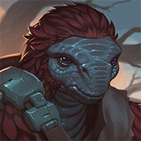

# Knight Takes Red Queen's Rook, Pawn Defends (Part 7) 

 
<b>Session started at 2025-03-11 / 04:04</b>
 
Fantasy Grounds - v4.6.6 ULTIMATE (2025-02-20) 
Fen's StarTrekAdventures Ruleset (v1.1.5)  
*[Prioritized Source: File; Other Sources: Vault]* 
*Core RPG ruleset (2024-12-17) for Fantasy Grounds
Copyright 2024 Smiteworks USA, LLC* 
*Fen's NPC Portrait Workaround v2.2.5* 
*[Prioritized Source: File; Other Sources: Vault]* 
*Fen's STA House Rules (v1.0.1) * 
*FG Browser v1.2.3* 
*[Prioritized Source: File; Other Sources: Vault]* 

>INTERIOR - Greenhouse: Ensign Ghex stands before the rest of the away team, nervously clasping and unclasping her hands as her antennae fold down behind her head. 

**Ensign Ghex** Um, so yeah. Anyways, that asteroid is on its way here. Um, to the planet. 
**Zox** Not again! 
**Rhuk** Not again! 
**Kagon** Not again! 
**Brag** Not again! 
**Zox** How big? 
**Ensign Ghex** well, you know what they say: "the moral arc of the universe is long, but it bends towards being wiped out by an asteroid" 
**Ensign Ghex** Um, around 14km in diameter 
**Oakadan** How long until it impacts? 
**Ensign Ghex** Well the computer is still calculating some of the parameters of its trajectory, since it only has an initial fix given that we haven't been tracking it that long. Also it depends if that ship comes along and gives it another push, but I'd say around 8 hours. 
**Oakadan** We should bring this to the attention of the authorities here. If we can get other ships up there, we should be able to push it back and out of the trajectory 
**Brag** This is a farming colony, our transport is the only other vessel based here that would be equipped to help 
**Kagon** Produce shuttles don't have tractor beams, they deliver carrots 
**Zox: [ INSIGHT  (7) +  SCIENCE  (4)]
[Focus: Shipboard Tactical Systems ]
[Successes: 2] [Complications: 0]
Success with 1 momentum [2d20 = 19]** 
**Oakadan** You'd think a tractor beam would be standard on a farming colony 
**Throk** Throk think this plenty of time for prestigious Security Chef to devise brilliant plan to save species and resolve pent-up sexual tension with Kagon and Brag. 
*Throk hands Oakadan and Ghex some popcorn to wait for Zox to think of something brilliant.* 
**Oakadan** Ghex, what's the condition of our shuttle?  
*Rhuk appears to be hatching a plan, rather than a clutch.* 
**Throk** Throk understand magic of "Somebody Else's Problem" field and also thinks this will be resolved by timely commercial break for Extended Car Warranties. *something something you never know when your car might need to survive asteroid collisions* 
**Ensign Ghex** well, I have engines and sensors already online. I had considered getting weapons online after I detected the vessel, but I figured it would be better to come tell everyone else about it first before getting started on that 
**Zox** Okay Ghex, There's a way to do this but it will take an ace pilot. There's some chance we will never be heard from again, but another chance Starfleet will coin a new phrase, 'The Ghex Maneuver'. You game? 
**Zox: [ PRESENCE  (10) +  COMMAND  (2)]
[Successes: 2] [Complications: 0]
Success with 1 momentum [2d20 = 12]** 
**Throk** Throk know that there is a "Kolea Maneuver" but not sure if "Ghex Maneuver" is legal in most countries if it follows same process, given Ghex's age. 
**Oakadan** Good decision, Ghex 
**Ensign Ghex** Wow, a cool maneuver named after me? That sounds really cool. When I was at the academy, some of my classmates would call it the Ghex Maneuver when I started rambling and lost focus and would screw something up like when I killed your sister. 
**Throk** Can we paint big shark mouth on front of shuttlecraft? 
**Oakadan** It was only Zox's sister's body, Ghex. We've got very good reason to think that a mind swap was engaged on Zox's sister 
**Zox** I have an idea! I must return to the ship! 
*Zox gives Rhuk a warm beverage before bolting off* 
**Zox: [ DARING  (12) +  ENGINEERING  (4)]
[Focus: Shipboard Tactical Systems ]
[Successes: 2] [Complications: 0]
Success with 1 momentum [2d20 = 15]** 
**Throk** We could just setup a refractoring albative sensor array to make the Delta Flyer give off the engine signature of any ship of our choice/ 
**Zox** Okay, now what has Janeway squirreled away on this ship like a crafty mammal? 
**Throk** Then arrange for a sequence of bimodal transwarp pulses to make it seem like dozens of small fighter craft are leaving the planet on an intercept course. 
**Zox** Hrm that is a good plan Throk but it may be easier than that.  
**Zox** I see you were paying attention when we were analyzing those fake signatures. 
**Throk** Probably using that tertiary sensor array and taking advantage of the reflective nature of the Borg transwarp tunnel system. 
**Zox:  [d20 = 8]** 
**Oakadan:  [Total: 7] [Effects: 1] [4dChallenge = 7]** 
**Zox: [ CONTROL  (11) +  ENGINEERING  (4)]
[Focus: Shipboard Tactical Systems ]
[Successes: 3] [Complications: 0]
Success with 2 momentum [2d20 = 11]** 
**Zox:  [Total: 2] [Effects: 1] [4dChallenge = 2]** 
**Zox:  [Total: 0] [Effects: 0] [2dChallenge = 0]** 
**Zox:  [Total: 2] [Effects: 2] [4dChallenge = 2]** 
*Zox admires Ghex's additude.* 
**Zox** This is the Federation at it's best! 
>Oakadan, Rhuk and Throk ride to Loran's home. A small rustic cottage near town. They arrive to find the doors locked, and the lights off.  

Masakari (Zox): if you want to be exotic, go for Lystrosaurus or something dog like. 
**Oakadan** Okay, let's see if we can get in here 
*Throk searches for traps and secret doors.* 
**Throk: [ CONTROL  (8) +  SECURITY  (4)]
[Focus: Hacking Security Systems ]
[Successes: 2] [Complications: 0]
Success with 1 momentum [2d20 = 17]** 
*Throk lifts up the roof and peeks inside, then sets it gently back down and reports what he sees.* 
**Throk: [ FITNESS  (10) +  SECURITY  (4)]
[Focus: Gorn-Fu ]
[Successes: 1] [Complications: 0]
Success with 0 momentum [2d20 = 31]** 
>Throk sees a largely unremarkable rustic cottage. There is an old fashioned fireplace in the living room, a well equipped kitchen, and a set of stairs going down to a basement level. Several empty wine bottles are arrayed on the counter in the kitchen 

**Rhuk** You should just keep the roof off Throk, Then nothing would go over your head. 
**Rhuk: [ REASON  (8) +  SCIENCE  (3)]
[Focus: Philosophy ]
[Successes: 1] [Complications: 0]
Success with 0 momentum [2d20 = 21]** 
**Oakadan: [ REASON  (10) +  SECURITY  (2)]
[Focus: Fire Safety ]
[Successes: 1] [Complications: 0]
Success with 0 momentum [2d20 = 19]** 
**Throk** Throk suspect we need to go downstairs to break barrels and defeat small rodents, per appropriate trope. 
**Throk** Throk fortunately bring many skewers and you have flamethrower, right? 
**Oakadan** Go check to see if it's a freezer with the real Loran's body in there or something 
*Throk looks up and tries to figure out what Rhuk means.* 
**Rhuk** That was 3 campaigns ago Throk 
**Throk** Throk gleefully go check freezer for food. 
*Throk heads over to freezer.* 
*Throk checks freezer for traps, as it would be truly bastardly to install a large amount of plastic explosives INSIDE the fridge, that is the kind of thing truly uncvilized people do.* 
**Throk: [ CONTROL  (8) +  SECURITY  (4)]
[Focus: Hacking Security Systems ]
[Successes: 1] [Complications: 1]
Success with 0 momentum [2d20 = 26]** 
*Throk rips the door off the hinges and checks for explosives on the door.* 
**Throk:  [Total: 2] [Effects: 1] [5dChallenge = 2]** 
**Throk:  [Total: 3] [Effects: 0] [3dChallenge = 3]** 
>Throk sees something suspicious inside the freezer, and attacks it 

>Sadly, "it" is the pressurized refridgerant canister, which he ruptures with his bare claws. Throk is showered in a geyser of liquid nitrogen, freezing his arm solid like a cartoon 

*Throk begins licking his arm.* 
**Throk** I am delicious! 
**Rhuk: [ INSIGHT  (10) +  SECURITY  (1)]
[Focus: Philosophy ]
[Successes: 0] [Complications: 0]
Failed on DC: 1 [2d20 = 29]** 
**Throk** This probably hurt for a few days until I shed skin. 
**Throk** Then it hurt A LOT. 
**Throk** Then I devour 8-12 redshirts and all is better. 
**Throk** Err... by redshirt, I mean, "replicated Targ". 
**Rhuk** Did you want to find out what was IN that container? 
**Throk** Maybe? 
**Throk** Throk think reading label might have been a good idea. 
**Rhuk: [ CONTROL  (10) +  MEDICINE  (4)]
[Successes: 3] [Complications: 0]
Success with 2 momentum [2d20 = 9]** 
**Throk** But Throk only third highest in class on Reading Comprehension for Starfleet personnel. 
**Throk** Wow, you better than Kolea, I like soft scaly hands and gentle touch. 
**Rhuk** There there, attack-reptile, youll be just fine. 
**Oakadan: [ REASON  (10) +  SECURITY  (2)]
[Focus: Fire Safety ]
[Successes: 0] [Complications: 0]
Failed on DC: 1 [2d20 = 34]** 
**Rhuk** I am impressed by your practical and stoic resolve.  
**Throk** Throk going to add you to annual New Year's Cards mailing list. 
>Oakadan heads down the stairs and finds a moderately sized wine cellar. He sees hundreds of bottles of wine, but he isn't an alcoholic like Murry, so he isn't tempted to open them and have a drink 

GM: And he is bad at rolling, so he wouldn't find anything of note even if it was there to find 
**Oakadan** Hey, Rhuk, do you know anything about wine? 
**Throk** Throk have question for Zox mother. Did you become good at medicine BEFORE or AFTER Zox atch? 
indarien (Throk): (hatch) 
**Rhuk** Not much. 
**Rhuk** Voth are always finding trouble. 
**Rhuk** Only the normal amount a Voth would know about rich, fermented veggies.  
*Oakadan begins checking the wine bottles one by one, seeing whether or not they have any secret messages hidden inside the bottles. Like a treasure map, hidden from view* 
**Oakadan** You should come down and grab a bottle or two, and maybe one of Loren's favorites for when we find the real her 
**Rhuk: [ INSIGHT  (10) +  COMMAND  (2)]
[Focus: Philosophy ]
[Successes: 3] [Complications: 0]
Success with 2 momentum [2d20 = 11]** 
**Oakadan** How're the Throksicle's arms doing? Functional? 
**Oakadan: [ REASON  (10) +  MEDICINE  (3)]
[Focus: Fire Safety ]
[Successes: 1] [Complications: 1]
Success with 0 momentum [2d20 = 28]** 
**Rhuk** Well, the tidbit here for your squirrely mammal brain is that all of the empty bottles upstairs are fruit wine, not the rich vegetable wines wich would have been prefered. 
**Oakadan** Ah, so she's been replaced for quite a while, then 
**Rhuk** So the Loran...yes. 
**Oakadan** Were you working with her? 
>Oakadan begins searching through the racks, and sees something unusual hidden in amongst the bottles. But as he reaches for it, he hears a cracking sound and the large wooden wine rack breaks, causing 100s of bottles of wine to cascade onto the concrete floors and shatter, creating a horrible mess of broken wood, shattered glass, and spilled wine 

**Oakadan** Oops 
**Rhuk** but my survival instinct told me to hibernate. 
**Rhuk** Something didn't fit quite right. 
**Throk** Throk willing to help fix that. 
*Throk gets down on his hands and knees and begins lapping up the wine.* 
**Throk** This one is rather poor vintage. 
**Throk: [ CONTROL  (8) +  CONN  (3)]
[Successes: 3] [Complications: 0]
Success with 2 momentum [2d20 = 9]** 
**Throk** This one seems to be a bit fruity. 
**Throk** That one had too much sugar. 
**Oakadan: [ CONTROL  (11) +  SECURITY  (2)]
[Successes: 1] [Complications: 0]
Success with 0 momentum [2d20 = 20]** 
**Rhuk: [ CONTROL  (10) +  COMMAND  (2)]
[Focus: Debate ]
[Successes: 1] [Complications: 0]
Success with 0 momentum [2d20 = 26]** 
**Throk: [ CONTROL  (8) +  COMMAND  (2)]
[Focus: Gorn-Fu ]
[Successes: 0] [Complications: 0]
Failed on DC: 1 [2d20 = 33]** 
**Rhuk** Isn't hierloom, non-gmo, organic veggie wine mixed with crunch glass bits better than that paraceratherum? What will it take to get you to join team herbivore and not harm other creatures? 
**Throk** Hmm... Throk willing to consider eating vegetables once per day as way to evaluate fermentation principles of various non-meat sources. 
**Throk: [ FITNESS  (10) +  SCIENCE  (2)]
[Successes: 0] [Complications: 0]
Failed on DC: 1 [2d20 = 33]** 
**Throk** Throk wonder if this will cause problems with the fact all Gorn are vegetable-intolerant. It is like being lactose intolerant but with side effect of blood rage to consume meat. 
**Oakadan: [ DARING  (9) +  SCIENCE  (2)]
[Focus: Fire Safety ]
[Successes: 1] [Complications: 0]
Success with 0 momentum [2d20 = 22]** 
**Rhuk** Maybe one day one among you will evolve veggie tolerance.  
**Throk** Throk would consider weighty matters of digestive tract, but honestly, much better to experience flaming Gorn flatulence caused by cabbage than never experience new culinary delights. 
**Rhuk** We never thought mammals would evolve intelligence, after all. 
**Oakadan** Can you two head upstairs and open a window? I'll be up in a bit 
**Throk** Throk not entirely sure they have, but appreciates Zox Mom optimism. 
**Oakadan** Actually, open all the windows 
*Throk addresses all New Year's Cards to "Zox Mom" since he cannot remember Rhuk's name.* 
**Throk** Throk help Oakadan solve this problem! 
**Throk** This highly flammable wine AND you fire safety person, so.... 
**Rhuk: [ REASON  (8) +  ENGINEERING  (2)]
[Focus: Evasive Action ]
[Successes: 1] [Complications: 0]
Success with 0 momentum [2d20 = 16]** 
**Oakadan** Do not set it on fire, there was something I found tucked into the wine shelf before it fell 
*Throk lights a white phosphorous safety flare.* 
**Throk** It is safety flare, clearly not dangerous. 
*Oakadan sprays Throk with a fire extinguisher* 
**Oakadan** Go put that outside 
**Oakadan** Not near the walls, ideally 
**Oakadan** Put it in dirt 
*Throk takes flare outside and ties it to tail of nearby large mammal.* 
**Throk** This cause absolutely no problems. 
*Oakadan sets off his phaser to evaporate the wine* 
**Oakadan: [ CONTROL  (11) +  SECURITY  (2)]
[Focus: Fire Safety ]
[Successes: 2] [Complications: 0]
Success with 1 momentum [2d20 = 21]** 
*Throk sighs, reconsiders, and realizes that is probably a poor way to make dinner and leaves the white phosphorous flare in the dirt.* 
>Oakadan fires a wide beam from his phaser which cooks off the wine, rendering it down into a thick sludge and glazing it into the concrete floors. Sticking out from the gooey sludge, he sees the small electronic device that he had seen just before 

**Oakadan** Here we go 
*Oakadan pulls out the gooped up device* 
**Throk: [ REASON  (9) +  SCIENCE  (2)]
[Successes: 0] [Complications: 0]
Failed on DC: 1 [2d20 = 24]** 
**Rhuk: [ FITNESS  (7) +  SECURITY  (1)]
[Focus: Evasive Action ]
[Successes: 4] [Complications: 0]
Success with 3 momentum [2d20 = 2]** 
Masakari (Rhuk): SURVIVAL INSTINCT. 
indarien (Throk): Wow... Rhuk can tell when SHIT IS ABOUT TO GO DOWN. 
>As the alcohol vapor from Oakadan's actions rise out of the basement, they mix with all of the fresh air from the open windows upstairs. Forming a perfect stoichiometric mixture just as Throk pulls his flare out of the dirt to check if it is out yet. 

**Throk** This burn really well. 
**Oakadan: [ CONTROL  (11) +  ENGINEERING  (2)]
[Focus: Fire Safety ]
[Successes: 2] [Complications: 0]
Success with 1 momentum [2d20 = 12]** 
>The cottage explodes in a massive fireball as the fuel-air bomb of alcohol vapors is ignited by Throk's flare. 

**Rhuk: [ DARING  (10) +  MEDICINE  (4)]
[Successes: 3] [Complications: 0]
Success with 2 momentum [2d20 = 11]** 
**Rhuk: [ DARING  (10) +  MEDICINE  (4)]
[Successes: 2] [Complications: 0]
Success with 1 momentum [2d20 = 20]** 
>Oakadan and Throk are both badly injured, but Rhuk is able to stabilize them. 

**Rhuk** I think we best get to the shuttle. 
**Throk** Throk agree with wisdom of Zox-Mom. 
**Rhuk** We will sing the wootle of wailing upon our return for precious Loran. 
**Throk** Throk also wondering if he needs to re-think life choices. 
**Oakadan** I found something tucked away in the wine 
**Rhuk** It's always the mamals stirring up trouble. 
*Rhuk feels kinship with Throk, destroyer of dinner tables.* 
**Throk** Throk wonder if it better to just put that in Faraday Cage before we leave village. 
**Rhuk** I'd think it is. 
*Throk creates a Faraday Cage using available spare parts.* 
**Throk: [ REASON  (9) +  SECURITY  (4)]
[Focus: Hacking Security Systems ]
[Successes: 0] [Complications: 0]
Failed on DC: 1 [2d20 = 37]** 
**Oakadan** Aren't Gorn reptiles? 
**Throk** The holes help it block signals. 
**Throk** Then we use these transmission amplifiers to help it broadcast a better signal to make the recipient confused why it is working better. 
>Throk tears open the white phosphorus flare to use it to create a faraday cage. Sadly, he then realizes that he doesn't know what a faraday cage is as the flare reignites again, showering him with burning white phosphorus 

**Throk** Throk also have no freaking idea what Faraday Cage actually is. 
**Throk** This is a day best forgotten, like when Throk have number 3. 
**Throk** In Gorn fleet, you are granted day off for Number 3, but I could not consider it vacation time. 
**Throk** Although, you all might find out as Number 3 also happens after consuming enough vegetables. 
*Rhuk pats Throk on the head* 
**Rhuk** Good reptile. 
**Throk** Zox Mom is also good reptile who is both exothermic and endothermic somehow. 
**Throk** Throk appreciate writer's inability to engage in continuity for minor things like species biological makeup. 
>The away team returns to Zox and Ghex reeking of wine, covered in severe burns, and Throk somehow has both a frozen limb, and is actively smoldering from white phosphorus 

**Rhuk** They didn't account for my warm personality. 
**Ensign Ghex** Oh man, I guess things didn't go super great out there. You aren't looking real good 
**Throk** Situation normal. 
**Oakadan** We found a thing 
**Throk** This is like Tuesday, except Zox still have all limbs. 
**Zox** I'd hate to think what would have happened if you didn't have a safety chief with you! 
*Oakadan hands over the grossly goopy device to Ghex* 
**Oakadan** Can we analyze this? 
**Zox: [ INSIGHT  (7) +  SECURITY  (5)]
[Focus: Espionage ]
[Successes: 2] [Complications: 0]
Success with 1 momentum [2d20 = 21]** 
**Ensign Ghex** I heard an explosion and I was pretty worried about it, but Commander Zox said that is normal for the Lister. I thought we should maybe go investigate, but he said this kind of thing is par for the course on the Lister 
**Throk** Security Chef Zox is very wise, this is quite normal. 
**Zox** Yeah, if you DON'T see at least one building burning or exploding, that's when you become concerned. 
**Throk** Except for Zox not being near death. 
*Zox pops a battery out of the transmitter.* 
**Zox** Okay, no more problem. 
**Zox** Interesting how they have traces of phosphorus on it. 
**Throk** Throk wonder why you don't check for spare battery. 
**Zox** That, that I haven't seen before. 
**Throk** It also smells like vegetable wine, very suspicious. 
**Ensign Ghex** Does that mean its time to do the "Ghex Maneuver" now? I am really excited to finally get to really see what this ship can do. I found so many cool systems in there while I was fixing it up. 
**Zox** Thanks for recovering it though! 
**Zox** Yes, it is time 
**Zox** We must boldly go and save the dinosaurs! 
**Ensign Ghex** Yes! Ok, all aboard the express shuttle to awesome town!  
**Throk** Do we need to eat live chicken to appease Gorn Gods of Luck? 
*Ensign Ghex sprints up the ramp into the Flyer* 
**Zox** gives the megatherium an apple. 
**Oakadan** We should probably investigate the device before we take off, yes? 
*Rhuk gives the megatherium an apple.* 
**Rhuk** Take this friend, may it not be your last. 
**Zox** No time. We can get to it later. 
**Kagon** Listen, Zox... Good luck up there. We'll try to organize an evacuation while you're up there, but please try to save the colony 
**Zox** It's inert now, so don't worry about giving our enemies a tell. 
**Zox** Thank you Kagon, I would not see our third adopted home be burned. 
**Throk** What if it gives them a call, signal, wink, flirt, or tweet? 
**Kagon** Just becuase you wouldn't see it doesn't mean it wouldn't happen 
**Kagon** I always thought you were selfish and didn't care about the colony so... I hope you prove me wrong 
*Kagon offers Zox a handshake* 
*Zox extends a claw.* 
**Throk** Security Chef Zox is absolutely not shellfish. Throk has eaten many shellfish and Zox not smell like them. 
*Throk gets out dictionary.* 
*Kagon shake's Zox's hand and leaves with Brag* 
**Throk** Selfish.... oh... 
>♫♫♫Lighthearted Music Sting♫♫♫ 

>---------CUT TO COMMERCIAL------- 

>INTERIOR - Lister: Murry, Viraseti and Malat head to the weapons locker to grab phasers for dealing with Geret. Windblook, Skig and Gra'lan head to engineering to set up the vole lure. Kolea and Bachar escort Janeway to the arboretum. 

*Lt. Cmdr Malat opens the weapons' locker and takes out three phaser rifles* 
*Skig updates sign, "It has been 0 hours since the Lister lost power for some stupid random reason."* 
Masakari (Zox): no bully Geret! =D 
**Gra'lan** This is like a more humane sonic weapon. 
**T'kor: [ CONTROL  (11) +  ENGINEERING  (4)]
[Focus: Repair/Tinkering ]
[Successes: 2] [Complications: 0]
Success with 1 momentum [2d20 = 10]** 
**T'kor:  [d20 = 20]** 
Masakari (Gra'lan): GRATZ 
**T'kor:  [Total: 2] [Effects: 0] [4dChallenge = 2]** 
>Windbloom, Skig and Gra'lan head to engineering to build the acoustic lure that Gra'lan had suggested 

**Skig** I like the idea, we need creative solutions like this. Plus, the likelihood of a sonic weapon blowing out part of the hull is much lower than other things. 
**Gra'lan** And less toxic! 
**Skig** Shuttle Bay 4 is currently empty, we will drive them that way. 
**Gra'lan: [ CONTROL  (9) +  ENGINEERING  (4)]
[Focus: Linguistics ]
[Successes: 2] [Complications: 0]
Success with 1 momentum [2d20 = 18]** 
**Windbloom Openheart** Awesome. But how will we know if this thing works? 
**Skig: [ CONTROL  (11) +  ENGINEERING  (5)]
[Focus: Electronics ]
[Successes: 1] [Complications: 0]
Success with 0 momentum [d20 = 11]** 
**Skig** The wavelength used to drive them is at a frequency that is outside the range of most species. 
**Gra'lan** it will be a revoleting site 
**T'kor ** *(via communicator)*: Scanners are coming online now. We should know by an increased number of Voles in the area around you 
**Hailey Murry: [ FITNESS  (7) +  CONN  (3)]
[Successes: 2] [Complications: 0]
Success with 1 momentum [2d20 = 10]** 
*Windbloom Openheart picks up the device and holds it up to his ear, then sniffs it.* 
**Windbloom Openheart** Is it on now? 
**Gra'lan** It should be coming on very shortly. 
**Skig** I believe Geret-things, Vulcans, and creatures who can hear above 24khz on the spectrum will get the same feeling that most of us experience when someone holds a dental drill too close to our ears. 
**Skig:  [Total: 5] [Effects: 1] [5dChallenge = 5]** 
**Skig:  [Total: 1] [Effects: 1] [2dChallenge = 1]** 
**Skig** I'm sure we have a 24th century solution for tinnitus. 
**Gra'lan** Just have them wear ear protection? 
>Skig and Gra'lan continue to tweak the parameters of the device as they tune it to precisely match the required sonic parameters. As they work, Windbloom heads over to the internal sensors to track the voles 

**Skig** T'Kor, make sure we are closing all the access shafts and ventilation systems as we determine that Geret-thing and the Voles are moved out of the area to prevent them doubling back. 
**Skig** That would work Gra'lan, are comms up so I can make a ship-wide announcement? 
**Gra'lan** We send out warning pulses. 
**Skig** Good idea Gra'lan. 
**Skig** That will also let us check the impact of the sonic pulse on the EPS relays that might have been chewed on. 
**Windbloom Openheart** Right now I'm reading a smattering of vole lifesigns spread through the lower engineering section. Once you turn on your gizmo, if they start moving towards us we'll know it worked. Then we can high-tail it to the shuttle bay. 
**Windbloom Openheart** I dig it, super groovy plan, man. 
**Gra'lan** So easy to lose creativity when technology is so powerful, really enjoy these exercises. 
**Windbloom Openheart** Wow, you're like... real smart and stuff 
*Windbloom Openheart nods knowingly at Skig* 
**Skig** That is why we keep Gra'lan, for old school wisdom. 
>As Gra'lan switches the device on, everyone hears a momentary faint whine like the annoying hum of a failing CRT for just a moment before it stablizes and the sound moves out of their audible range. 

**Skig** Windbloom, what are the Voles doing? 
**Windbloom Openheart** Looks like they're heading this way, pretty fast it looks like 
**Windbloom Openheart** Actually... really fast, way faster than Voles can move 
**Skig** Hmm... 
**Skig** We should move then. 
**Skig** To the shuttle bay! 
**Gra'lan** out we go! 
>Windbloom transfers the sensor data to a tricorder and then he, Gra'lan and Skig bolt for the turbolift. 

**Windbloom Openheart** These little guys are moving way faster than a vole should be able to move, they're almost on top of us  
>As they approach the turbolifts, two horrific creatures burst through the nearby access panel. They have horrible toothy orifices like the salt vampire, fur like a Voth, and they appear to be in a constant state of shape changing like Geret when she sneezes 

>♫♫♫Ominous Music Sting♫♫♫ 

>---------CUT TO COMMERCIAL------- 

