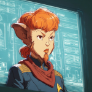

# One Skig, Two Skig, Red Skig, Blue Skig 

 
<b>Session started at 2025-04-07 / 20:41</b>
 
Fantasy Grounds - v4.6.6 ULTIMATE (2025-02-20) 
Fen's StarTrekAdventures Ruleset (v1.1.5)  

*[Prioritized Source: File; Other Sources: Vault]* 
*Fen's StarTrekAdventures Ruleset (v1.1.5) * 
*[Prioritized Source: File; Other Sources: Vault]* 
*Core RPG ruleset (2025-03-12) for Fantasy Grounds
Copyright 2025 Smiteworks USA, LLC* 
*Fen's NPC Portrait Workaround v2.2.5* 
*[Prioritized Source: File; Other Sources: Vault]* 
*Fen's STA House Rules (v1.0.1) * 
*FG Browser v1.2.3* 
*[Prioritized Source: File; Other Sources: Vault]* 

>Captains Log, Stardate 62062.3: We are completing our survey of the still unidentified spacial phenomenon in the Helothorar system. We've taken to calling it the "Kaleidoscope" on account of its mesmerizing appearance. Viraseti hasn't been able to make much sense of it, but we will have to leave by the end of the day shift in order to make our rendezvous with the research vessel USS Prudence. We have been ordered by Starfleet Command to remove the Pakleds from Cargo Bay 3 and transfer them to a more appropriate living space. Starfleet decided that allowing a Pakled religious cult to live on board a starship was not a suitable outcome. 

>INTERIOR - Bridge: On the viewscreen, the "Kaleidoscope" churns endlessly in the void of space. Light from distant stars, indecipherable radio signals, gravitational fluctuations, the glow of active nebulae... all churning in space, coming and going. A seething mass of energy and mystery, hanging in interplanetary space. 

**Hailey Murry** Does it have any relation to subspace strings, by chance?  
**Lt. Cmdr Viraseti** I doubt it, if anything the opposite. Cosmic strings are 1 dimensional, this thing has dimensions we can't even understand. 
**Lt. Cmdr Viraseti** I'd love to get a bit closer, we're awfully far away 
**Hailey Murry** Have we sent a probe yet? 
**Captain Bachar** I'm already uncomfortable this close 
**Zox** Let's see how safe this is... 
**Zox: [ INSIGHT  (7) +  SCIENCE  (4)]
[Focus: Shipboard Tactical Systems ]
[Successes: 2] [Complications: 1]
Success with 1 momentum [2d20 = 21]** 
**Zox** Commencing scan of the anomaly. 
*Skig walks on the bridge.* 
**Skig** Captain, I have explained to Captain Kaglor and the Pakleds that they are going to a better place to practice and study their dialetric materials. It may be easiest to just let them have the... giant Skig effigy they have constructed. 
*Skig mumbles that last bit like she is mildly embarrassed she had to say it.* 
**Captain Bachar** Well, take a team down there and make sure that the giant Skig effigy is safe to transport first.  
**Zox** Scanner says this thing is totally safe. 
**Captain Bachar** They have an unfortunate tendency to attach everything directly to the ship's main EPS backbone 
**Captain Bachar** Zox, remind me: how many times have you lit yourself on fire? 
**Zox** But...it is breaking every rule of physics established so far....So we might want to get a philosophical interpretation first. 
**Zox** A few times. Several times....more times than I can recall, but that's only from taking hits to the head. 
**Captain Bachar** And this is why I am not moved by your feelings on what constitues "totally safe" 
**Hailey Murry** I bet at least one of those fires is something you still consider "safe" 
**Zox** If only we had a Space Whale to find out what this was. Surely they have wisdom for this. 
**Captain Bachar** Geret can't go into it either 
**Captain Bachar** No one is going into it 
**Hailey Murry** What if it goes into us?  
**Skig** I missed part of the briefing while mentally diagramming a recalibration of the cross-axial saucer struts for improved tension. 
**Skig** When was this first surveyed and how long as it been here? 
*Zox looks at Viraseti for an answer.* 
*Skig is hopeful that can be used as an excuse to allow for extra background exposition for the audience.* 
**Ensign Ghex** Oh I wouldn't worry about that ma'am, Captain Bachar ordered me to monitor with the proximity system and if the phenomenon got withtin 400,000 km to jump directly to maximum warp. I have lightning fast reflexes, when I was at the academy I scored a 9.4 on my reflex examination. The examiner said that I have an advantage because Andorians have faster than normal reflexes, but also because I'm small so my brain doesn't need to have as much of a synchronization delay for handling nerve impulses from different parts of my body. Did you know that's why bigger people have slower reflexes? 
**Captain Bachar** It was reported to Starfleet by a passing transport a few weeks ago, the Lister was going to be in the area so they had us swing by to do a preliminary analysis 
*Zox begins to overheat his dinobrain, thinking that if it has infinite mass....then shouldn't we be pulled towards it regardless of distance?* 
**Lt. Cmdr Viraseti** They're going to have to send a proper science vessel to do a full investigation, we don't have enough time to peel back this onion... 
**Lt. Cmdr Viraseti** Unless you would let me stay behind in a shuttle after the Lister heads to its rendezvous 
**Hailey Murry** Have we shot a probe into it yet? 
**Lt. Cmdr Viraseti** We lost communication with the probe as soon as it neared the anomoly 
**Hailey Murry** Rude 
**Skig** Yes, our Modular Laboratories are currently configured for, "Cross pollination of erotic fauna through Apis mellifera hyperactivity during mating" 
*Skig double checks her PADD.* 
**Skig** Who approved that? 
*Zox shrugs.* 
**Captain Bachar** Well we aren't have time to get to the bottom of this one, Viraseti can finish up her report with whatever we can figure out. In the meantime, Skig take a team down to the Cargo Bay and deal with the Pakled situation. Make sure they are all packed up, including any giant Skig effigies, before the end of the day. 
**Skig** Yes ma'am 
**Lt. Cmdr Malat** It seems wrong to kick them out 
**Windbloom Openheart** Yeah, they're like totally chill down there 
*Skig leaves to get a team with approprirate electrical grounding equipment.* 
**Zox** I'd assemble a security team Malat. They may not want to go. 
**Lt. Cmdr Malat** I'm not going to remove them by force 
**Hailey Murry** I don't think we have to, we can lure them out into a better location 
**Hailey Murry** How did they fare during the vole incursion, by the way? 
**Lt. Cmdr Malat** C'mon, we should go with Skig. I want to see this effigy before she tears it down 
**Windbloom Openheart** Yeah, that's pretty funny 
>INTERIOR - Cargo Bay 3: Skig, Murry, Zox, Malat and Windbloom open the door to the Cargo Bay. The Pakleds are gathered around a 6 meter tall effigy of Skig, praying. Skig's eyes are glowing with the purple plasma of high frequency electrical discharge. You can taste the ozone in the air as you walk in. 

**Pakleds** Ooooohhhhhmmmmm 
**Zox** If anything it looks friendlier than Skig. 
**Skig** Oh good, they fixed the part where bolts of lightning shot from the ass. 
**Captain Kaglor** In sermon today, we explore poly vinyl acrylate. PVA has high dielectric constant, and is bendy. But it is too sticky.  
**Captain Kaglor** Sticky is not good for a dielectic 
*Zox waits for Skig to come up with a bogus rationale of a 'pilgrimage' in search of new dielectric materials which they must embark on.* 
>The Pakleds all shake their heads and murmor 

*Captain Kaglor puts his hand into a tub of PVA and then grabs onto a live exposed wire* 
**Hailey Murry** Oh that might not be good 
*Captain Kaglor howls in pain as he is shocked badly, but does not let go of the wire.* 
**Hailey Murry** I think he's glued to it. More than usual for an electric shock 
**Captain Kaglor** This... is... why... sticky... bad 
**Windbloom Openheart** Wow... Maybe you should help him 
**Zox** Hrm. Im not sure if this is within safe word Kolea territory, or getting to edgy Neraran territory... 
*Skig disables the power in the cargo bay using her emergency kill switch activation routine she programmed to her voice authentication pattern.* 
**Skig: [ REASON  (10) +  ENGINEERING  (5)]
[Focus: Electronics ]
[Successes: 2] [Complications: 0]
Success with 1 momentum [2d20 = 23]** 
>As Skig kills the power, Captain Kaglor stops being electrocuted. 

*Captain Kaglor looks at Skig* 
**Skig** Hello Captain! I see your sermon on the mysteries of dialetric materials was very electrifying. 
**Captain Kaglor** Yes, sticky is not good for dielectric 
**Skig** Indeed, sticky is quite bad. 
**Captain Kaglor** Every day we understand more about the dielectric materials 
**Hailey Murry** They actually are starting to work out some surprising depth of knowledge in them 
**Captain Kaglor** Someday we will be as smart as Skig 
**Skig** I have great news, you and all here have been chosen to go on a pilgrimage to a place where you can study even more materials. 
**Skig** It is an exciting opportunity to not only learn more, but to share all that you have learned with those less knowledgeable about these mysteries. 
*Skig thinks she did a relatively decent job of reciting the speech Kolea made her memorize for this occasion.* 
**Skig: [ PRESENCE  (8) +  ENGINEERING  (5)]
[Focus: Faking Empathy As Best as Possible ]
[Successes: 3] [Complications: 0]
Success with 2 momentum [2d20 = 13]** 
**Captain Kaglor** Yes, I understand 
**Captain Kaglor** The Lister does not have enough dielectric materials 
**Skig** Precisely. 
**Captain Kaglor** We have mastered these dielectric materials 
**Captain Kaglor** Let us pray 
**Captain Kaglor** FULL POWER! 
**Skig** Your wisdom and knowledge is getting very thorough of what we can offer here. 
**Zox** Perhaps we should gift them some PPE.... 
>A Pakled runs over and turns up the power to the Skig effigy on the control panel. The entire thing starts arcing into the air, and glowing blue and purple with the plama discharge 

>As they do so, the ship suddenly rocks violently, knocking everyone to the deck 

**Zox** The anomaly...it hungers... 
**Hailey Murry** Zox, please don't say that while the lights are flickering 
**Zox** Energy....Power...it's addicted to them! 
>As Zox and Murry crack jokes, the ship shudders violently again, throwing the room into dissarray. Boxes and barrels topple over, the Skig effigy begins to tip, Pakleds fall into the large open tub of glue. 

*Skig has a momentary fear that the Pakled's have "prayed" the Kaleidosocope Anamoly into existence and are actually feeding it... because weirder things have happened.* 
**Zox** Zox to Ghex; what is our distance to the anomaly? 
*Skig kills power to the effigy again.* 
*Skig noticed that she has been mispronouncing "anomaly" since Sophomore astrophysics and no one has corrected her.* 
**Lt. Cmdr Malat** Skig kills the power to the effigy, and it stops glowing and arcing. As the acrid smell of ozone begins to clear, the Pakleds look around confused. 
>Skig kills the power to the effigy, and it stops glowing and arcing. As the acrid smell of ozone begins to clear, the Pakleds look around confused. 

**Captain Kaglor** What happened? Does your ship need more dielectric materials? 
**Hailey Murry** We're not sure yet 
**Captain Kaglor** I think the ship wants more dielectric materials. You had better feed it 
**Skig** We will do our best, in the mean time, prepare for your pilgrimage to your new place of study. 
*Skig taps comm badge as she steps out of the cargo bay.* 
**Skig** Skig to Captain Bachar, I am working on packing up the Pakleds, what is the situation up there? 
>As Skig taps her commbadge, it makes a dull *thunk* sound but she gets no reply 

>Before Skig can turn to leave, the door opens and a short, stout Tellerite woman in an engineering uniform storms in and goes directly to the main EPS interlink panel for the room, while mumbling under her breath 

**Tellerite Woman (Mumbling)** What could possibly be using so much power in here... It's always something with these... 
*Skig looks to see if Skig is watching herself.* 
*Skig offers advice to other Skig.* 
**Skig** Make sure to rewire those cross-feeds in a split beam configuration to ensure redundancy on the third tier EPS circuit going through cargo bay 2 and behind the left alternator panel before it hits the Steam Generator next to the mainframe, or else the punch cards will get soggy. 
*Tellerite Woman turns to look at Skig and the others* 
**Tellerite Woman** I didn't realize they were storing so much garbage in Cargo Bay 3 
*Tellerite Woman looks at the Skig effigy* 
**Tellerite Woman** Huh... 
**Tellerite Woman** I guess that explains the power drain 
**Tellerite Woman** Your doing? 
*Tellerite Woman points at Skig* 
**Skig** Only by accident. 
**Hailey Murry** It's mostly the Pakleds 
*Tellerite Woman taps her commbadge* 
**Tellerite Woman** Skig to security, we have a number of intruders in Cargo Bay 3 
*Tellerite Woman the commbadge does not respond* 
>the commbadge does not respond 

*Skig counts the number of pips on "Other Skig"'s uniform.* 
>The other Skig is wearing a Chief Petty Officer's insignia 

*Skig taps comm badge.* 
**Hailey Murry** I think we should see if we can make it up to the bridge to see what's up 
**Hailey Murry** Or if there even is a bridge 
**Lt. Cmdr Malat** Yeah, probably a good idea 
**Skig** Skig to Skig, when was the last time you remodulated the binary phase capacitor in this cargo bay? 
**Windbloom Openheart** I'm just glad you can all see her too, I thought I was hallucinating a second Skig 
*Skig waits to see if "Other Skig" gets the joke.* 
**Zox: [ INSIGHT  (7) +  SECURITY  (5)]
[Focus: Espionage ]
[Successes: 2] [Complications: 0]
Success with 1 momentum [2d20 = 16]** 
*Zox attempts to do a security sweep using a tricorder.* 
**Tellerite Woman** Binary phase capacitor? What do you think this is, an Organian garbage scowl? 
*Tellerite Woman chortles* 
indarien (Skig): A small broom pops out of the tricoder and runs around like in the scene from Mickey Mouse's Magical Adventure. 
*Skig laughs.* 
**Tellerite Woman** Chief Petty Officer Skig. And you are? 
**Skig** I certainly hope not, Chief Petty Officer Skig. 
**Skig** I am Commander Skig. 
**Chief Skig** I am guessing this must be related to something those idiots on the bridge did. They are always breaking her. 
**Skig** No kidding, it only gets worse. 
**Lt. Cmdr Malat** Well whatever happened, we'd better figure it out. I don't think I can handle a second Skig 
*Zox plays with his tricorder, looking harmless and inquisitive.* 
**Hailey Murry** Uh oh 
**Skig** Yes, but can you handle a second Malat? 
**Hailey Murry** Well, I'm reading that it is our current stardate, so I think this is still our ship 
**Skig** And yes, we should be moving. 
*Hailey Murry is fiddling at one of the terminals* 
**Zox** Skig, nothing beyond this deck exists. 
**Hailey Murry** It's just Deck 15 
**Skig** Hmm... 
**Zox** Uncertain if it is a subspace bubble or.... 
**Chief Skig** Nonsense, I came here from deck 17 
**Chief Skig** The turbolift wasn't working through, I had to take a Jeffries tube 
**Skig** The easy way to test this would be to go out into the hallway, pop the jefferies tube on hatch 18 which has a vertical ladder and see where it takes us. 
*Skig high-fives other Skig for coming to the same conclusion.* 
**Hailey Murry** Don't get sucked into any vortexes  
**Chief Skig** You're pretty smart for an officer 
*Skig heads out to the appropriate hatch and pops it open and looks up and down the ladder shaft.* 
**Skig** Sometimes one slips through the cracks and gets promoted through attrition. 
>Skig sees a normal looking Jeffries tube, she can see as far as Deck 11 above and Deck 22 below 

**Skig: [ REASON  (10) +  SECURITY  (3)]
[Successes: 2] [Complications: 0]
Success with 1 momentum [2d20 = 19]** 
**Hailey Murry** Try dropping something down?  
**Skig** .w GM Horizontally (as in on Deck 15) or vertically? 
*Skig looks in the direction of the noise while "dropping" a spanner down the Jefferies Tube.* 
**Skig** Whoops. 
>As Skig drops the sapnner, another Tellerite woman walks past with her face burried in a tricorder, she is startled by the CLANG of the spanner and looks up to see Skig, Skig and the others 

**Lt. Cmdr Skig** Oh, curious... I suppose that explains some of these readings. 
>♫♫♫Mysterious Music Sting♫♫♫ 

>---------CUT TO CREDITS-------
♫♫♫Opening Theme♫♫♫ 

>Season 2, Episode 4: One Skig, Two Skig, Red Skig, Blue Skig
Written by Sechnall Everald
Directed by Apolena Christianson 

*Zox is curious if Skig #3 will outrank original Skig.* 
*Skig is horrified to think there is a Captain Skig, Admiral Skig, or High Lord of the Adeptus Mechanicus Skig running around.* 
>INTERIOR - Deck 15: Skig, Skig, Skig and the others stand outside the access hatch to the Jeffries tube and consider the situation they find themselves in. Lt. Commander Skig is wearing a blue sciences uniform, with her hair done up in a tight bun and her beard more neatly trimmed than your Skig. Chief Skig has a scruffy, untrimmed beard and loose tousled hair. All seem perplexed by the situation. 

**Skig: [ PRESENCE  (8) +  COMMAND  (2)]
[Successes: 1] [Complications: 0]
Success with 0 momentum [2d20 = 19]** 
Masakari (Zox): I really want the Adeptus Mechanicus one. 
**Lt. Cmdr Skig** Interesting. No sign of hallucigenic compounds in my system, although this Jem'Hadar is a different matter 
**Lt. Cmdr Skig** No evidence that you are hollographic in nature, although I cannot rule out shapeshifter 
**Skig** The air regulators and environmental systems seem to be functional. 
**Skig: [ DARING  (10) +  SECURITY  (3)]
[Successes: 2] [Complications: 0]
Success with 1 momentum [2d20 = 23]** 
*Lt. Cmdr Skig grabs a sharp tool from Chief Skig's open tool box and attempts to slash Skig's hand with it, but Skig deftly steps out of the way.* 
**Lt. Cmdr Skig** Hold still, I need to see some your blood 
**Skig** The next best step would be to run a scan to determine if the number of crew and people on the ship has changed in some way to indicate an unintended boarding party. Are we currently at warp? What was the present position of the Lister when you arrived on Deck 15? 
**Zox: [ REASON  (7) +  SECURITY  (5)]
[Focus: Xenobiology ]
[Successes: 1] [Complications: 0]
Success with 0 momentum [2d20 = 25]** 
*Skig looks angrily at Lt. Cmdr Skig.* 
**Skig** THAT IS NOT WHAT YOU USE A POLYHEDRAL CROSS WEDGE ALIGNMENT TOOL FOR! 
**Lt. Cmdr Skig** I AGREE BUT THIS SKIG DIDN'T BRING A KNIFE! 
**Hailey Murry** Seems like a Skig sort of problem 
**Chief Skig** Officers... 
*Skig grabs the tri-phase modular screwdriver and stabs her palm with it.* 
**Skig** If you are going to draw blood, use the right tool for the job. 
**Hailey Murry** Come on, let's make it upstairs 
**Lt. Cmdr Skig** I'm not an engineer, tools all look the same to me 
*Skig wipes off screwdriver and hands it back to Petty Officer Skig.* 
*Skig raises an eyebrow at Skig.* 
*Lt. Cmdr Skig rubs some of Skig's blood between her fingers and sniffs it, then tastes it* 
*Hailey Murry heads toward the Jefferies tubes to climb up* 
**Lt. Cmdr Skig** Definitely Tellerite, fascinating 
**Hailey Murry** Zox, Windbloom, Malat, do you three want to come with? 
**Zox** Yes. 
**Lt. Cmdr Malat** You have no idea ma'am 
**Skig** Wait, if you are not an engineer, what is your role on the Lister? 
**Lt. Cmdr Malat** Chief Science Officer 
**Lt. Cmdr Skig** Chief Science Officer 
*Skig looks at Petty Officer Skig and Lt Cmdr Skig.* 
**Lt. Cmdr Skig** Engineering is mere application 
*Skig 's eyes go wide and she feels her heart beating against her chest.* 
**Skig** It's the anti-Skig. 
*Skig looks carefully at Skig.* 
**Skig** Lt Commander Skig, what is your favourite hobby? 
**Lt. Cmdr Skig** Sensor grid data filter calibration 
**Skig** Okay, if you said something like, "fraternizing with the crew" I would know we had entered into the alternate universe. 
*Skig looks at Chief Petty Officer Skig.* 
**Skig** What's the best time of day to recalibrate the thrusters on Old Faithless? 
*Zox secretly hopes there's a Skig that's the most empathetic being in the universe and attentively listens to all the crews problems while giving them cookies.* 
**Lt. Cmdr Skig** No, the crew are most useful as a population for double blind research 
indarien (Skig): OMG. The next one we find is the Ship's Counselor. 
**Lt. Cmdr Skig** Fraternizing could pollute my results 
*Skig momentarily thinks about hugging Lt Cmdr Skig, but reconsiders.* 
**Chief Skig** Old Faithless? What's that? 
**Skig** You are awesome, stay that way. 
**Zox ** *(To Windbloom)*: Must be convenient to be able to do self-discovery with drugs; it takes the universe folding time-space to get this square to circle. 
*Skig gives Petty Officer Skig a thumbs up.* 
**Skig** Let's get to the bridge and see what happened in our absence. 
**Hailey Murry ** *(to Zox)*: I'm not sure if they're the same, it seems like they're quite different in some aspects 
*Skig climbs on the ladder and begins to ascend to the next deck.* 
**Windbloom Openheart (To Zox)** I'll be honest, I'm still not entirely convinced I didn't mess up my dosage 
**Skig** Chief Science Officer Skig and Chief Petty Officer Skig, let's get to the bottom of this. 
**Chief Skig** Do I have to call you ma'am? 
**Skig** No. 
**Chief Skig** Then I agree 
**Zox ** *(To Hailey)*: Tricorder can't tell them apart. Skig-prime is just one possibility in an infinitely fractal undulating universe 
*Skig is really gareful at the start of this episode that Viraseti didn't remember the Advanced Research Facilities for long term investigative research were installed during the prior refit as a justification for moving the Lister closer to the crazy zone.* 
>[TURN] Captain Bachar 

>[TURN] Admiral Janeway 

>[TURN] Skig 

>[TURN] Kolea 

>[ROUND 3] 

*Skig looks at Murry and Zox.* 
**Hailey Murry** Perhaps on the inside, we are all Skigs? 
**Skig** Just in case we start running across extra versions of other people, I would suggest we avoid Medical. I have a weird feeling alternate versions of Kolea could be terrifying to encounter. 
**Skig** Well, and for that matter, vegetarian Throk and uncontrolled frenzy Throk would be bad also. 
**Zox** Yeah in another incarnation, she'd be a nun acting out by throwing dynamite instead of humping everything. 
>As Skig ascends the Jeffries Tube, each deck they pass registers on their scanners as they pass through. By the time they have climbed up to Deck 11, they can only read the small piece of the Lister neck that falls into Deck 11  

**Skig** To be honest, I'm more worried about the Neraran-analog version of her. 
**Skig** Hmm... 
*Skig looks at Lt Cmdr Skig.* 
**Skig** I am hypothesizing that the existence of this strange fractal plane is bound to our mutual cross dimensional existence. What does your tricoder show from the last several decks of readings? 
*Skig looks at Chief Petty Officer Skig.* 
**Skig** Can you check ship power and turbolift capacity from here? 
*Skig looks at Murry and Zox.* 
**Lt. Cmdr Skig** Every deck reads completely normally, but no matter what I do to my tricorder I can't read anything outside of one deck at-a-time 
**Skig** Any other ideas? 
**Lt. Cmdr Skig** I suspect it is related to the anomoly we were studying  
**Skig** That matches my hypothesis, Lt Cmdr, thank you for verifying. 
**Zox** Sure thing, but even ...shall we say advanced and unsanctioned methods cannot find decks beyond which we inhabit. 
**Hailey Murry** Do we have a good horizontal range?  
**Skig** Can you describe the anomaly? 
**Lt. Cmdr Skig** Not really, we were unable to analyze it properly due to difficulties getting clear scanner results 
**Hailey Murry** What drew your attention to it? 
**Lt. Cmdr Skig** I had gone to deck 13 to manually reprogram a probe to attempt to get better results 
**Lt. Cmdr Skig** The ship began to shudder violently, and then I was reading unusual power emissions from Deck 15 and headed there to investigate 
**Lt. Cmdr Skig (To Murry)** We were diverted to investigate the anomaly after a transport vessel had first detected it. 
**Hailey Murry** Same as us 
*Skig looks at Chief Petty Officer.* 
**Hailey Murry** What's the stardate? 
**Chief Skig** Don't look at me, I have actual work to do, I can't spend all day standing around the bridge gazing at every anomaly we pass by 
**Hailey Murry: [ REASON  (9) +  SCIENCE  (4)]
[Successes: 0] [Complications: 0]
Failed on DC: 1 [2d20 = 32]** 
**Lt. Cmdr Skig** Stardate 62062.3 
**Hailey Murry** Same as ours 
**Hailey Murry** It's possible that each floor may belong to a different of our ships, superpositioned over one another 
**Zox** Now that's a wild theory! 
**Lt. Cmdr Skig** That is consistent with these readings 
**Lt. Cmdr Skig** Although it doesn't explain the limited tricorder range 
**Skig** Absolutely, engineering is the beating heart of the ship, no time to dwadle. 
**Hailey Murry** The tricorders may not be able to detect past the barrier of one reality to another 
**Lt. Cmdr Skig** But we can pass directly though, so it should be no trouble for a tricorder 
**Skig** Has the scanner range of the tricoders been constant or has it shifted? 
**Hailey Murry** How does the Tricorder read when we're between floors? 
**Zox: [ INSIGHT  (7) +  SCIENCE  (4)]
[Successes: 1] [Complications: 0]
Success with 0 momentum [2d20 = 14]** 
**Skig** Are we in a bubble or sphere, and are we approaching an edge or is our existence the central part of it? 
*Skig looks at Chief Skig.* 
**Zox** I'd say you are correct Murray - they can't see past a deck; how an anomaly knows exactly how to carve up a spaceship...... 
**Skig** In your toolbox, can you get out the power modulation cross analysis unit and tap it into the power grid and have it check for power on deck 12 and then deck 15? 
**Hailey Murry** It would probably have to do with mass distribution, I'd guess. The frames of the ships line up perfectly, so it minimizes the differences like that 
**Skig** All right, so here's a question. If I stay right here, Chief Skig climbs down a deck and Lt Cmdr Skig climbs up a deck, what happens? 
**Chief Skig** I can't read any power flow outside of this deck, the power frequency on this deck is wrong though. It should be 141.7 hz but I am reading 138.6. 
**Skig** Interesting, it should be 139.4 based on the last adjustment in space dock. 
*Zox suddenly appreciates that Gralan's tin can voice technology may actually be superior to coms badges in this edge-case* 
**Lt. Cmdr Skig** Well I'd say that reinforces the elderly human woman's theory 
KruschtyaEquation (Hailey Murry): "That was a complication that we rolled last week, so I'll let you turn those lemons into lemonade" 
*Zox presents two string cans.* 
**Zox** This is a technology so primitive, so simple, it cannot be disrupted by hypo or hyperdimensional anomalies. 
**Skig** Can we remodulate the tricoders to scan the wavelength of the power system based what it should be and see if individual floors correspond to the individual? 
**Zox** We can use it to comunicate up and down the jefferies tubes 
**Lt. Cmdr Skig** Fascinating, your tiny reptile brain may have stumbled into an actual, useful idea 
*Lt. Cmdr Skig scans Zox's head* 
**Lt. Cmdr Skig** I'm not familiar with your species, are all their brains this size? 
**Zox** begins to ponder how the Voth may not exist in Lt. Cmdr Skig's universe. 
*Zox begins to ponder how the Voth may not exist in Lt. Cmdr Skig's universe.* 
**Zox** Sure are! Reptile STRONG 
KruschtyaEquation (Hailey Murry): I'm not seeing any purple lines, I don't think 

>Skig goes to deck 12 and Lt. Cmdr Skig continues on to deck 13. As Skig crosses from deck 11 to deck 12, she appears to flatten to a plane, fold over herself, and dissapear. When Lt. Cmdr Skig continues on to deck 13, Skig sees her do the same. 

**Lt. Cmdr Skig (Tin Can)** Can you hear me, or has the reptile's communications device failed 
**Skig** Shockingly it works as expected. 
**Hailey Murry** Interesting visuals 
*Zox stands proud at the multi-phasic, pan-chronometic communications device. It's clearly based on string theory.* 
**Skig: [ REASON  (10) +  ENGINEERING  (5)]
[Focus: Quantum Mechanics ]
[Successes: 2] [Complications: 0]
Success with 1 momentum [2d20 = 15]** 
*Lt. Cmdr Skig re-emerges from the jeffries tube in a time-reverse of hte prior process. First seemingly growing into a rolled up plane, then unrolling into a flat plane, then expanding back into a normal Skig* 
**Lt. Cmdr Skig** Fascinating, this is truly an unusual day 
*Hailey Murry takes data measurements as she crosses the barrier* 
**Hailey Murry: [ REASON  (9) +  SCIENCE  (4)]
[Successes: 0] [Complications: 0]
Failed on DC: 1 [2d20 = 33]** 
**Zox** I wonder if we charge a Skig effigy with anti-electrons, if the anomaly works in reverse... 
**Hailey Murry** Let's see if we can keep going 
**Hailey Murry** One of our Listers should be effective 
**Hailey Murry** Oh, I should ask, what are your captains like?  
**Chief Skig** Never met him 
*Skig collects up the other Skigs so they can continue on to the bridge.* 
**Hailey Murry** Never once? 
**Hailey Murry** Do you know their name at least?  
**Lt. Cmdr Skig** Captain Bachar is generally highly competent, although she does have a tendency to be overly cautious in situations where the Lister could be placed under thread 
**Chief Skig** I don't know, "Captain Old Bald Guy" probably 
*Skig checks the power and systems reading at each floor on the way up to see what the modulation Hz changes to for each deck.* 
**Zox** If anyone knows A captain Baras, getting information unaccessible in our dimension.... 
**Hailey Murry** Blue guy?  
**Chief Skig** I think so, either that or purple.  
*Skig compares her notes to Chief Skig.* 
**Chief Skig** I don't go to briefings, I have actual work to do. 
**Skig** L:t Cmdr Skig, can you perform an analysis of our transit between decks? I would you to go after Chief Skig and I? 
*Lt. Cmdr Skig pulls out her tricorder* 
**Lt. Cmdr Skig** Standing by 
**Skig** Specifically the modulation and modification of light and physical appearance as we move between them. The visual appearance is quite peculiar. 
>Skig crosses Deck 11 to get to the next jeffries tube that could lead on to Deck 10. She eventually gets to the tube and opens the hatch. When she turns to look up to deck 10, she sees the tube is partly obstructed by a tangle of Borg conduits and power nodes 

**Skig** Hmm...I don't remember leaving that here. 
>♫♫♫Ominous Music Sting♫♫♫ 

>---------CUT TO COMMERCIAL------- 

# One Skig, Two Skig, Red Skig, Blue Skig (Part 2) 

 
<b>Session started at 2025-04-14 / 20:55</b>
 
Fantasy Grounds - v4.6.6 ULTIMATE (2025-02-20) 
Fen's StarTrekAdventures Ruleset (v1.1.5)  

*[Prioritized Source: File; Other Sources: Vault]* 
*Fen's StarTrekAdventures Ruleset (v1.1.5) * 
*[Prioritized Source: File; Other Sources: Vault]* 
*Core RPG ruleset (2025-03-12) for Fantasy Grounds
Copyright 2025 Smiteworks USA, LLC* 
*Fen's NPC Portrait Workaround v2.2.5* 
*[Prioritized Source: File; Other Sources: Vault]* 
*Fen's STA House Rules (v1.0.1) * 
*FG Browser v1.2.3* 
*[Prioritized Source: File; Other Sources: Vault]* 

>INTERIOR - Deck 11: Skig opens the hatch to Deck 10 and sees a dark tangle of Borg conduits and equipment, bathed in a dim sickly green light. The whir of Borg widgets can be heard echoing down the darkened corridors. 

**Hailey Murry** Oh no. Which of your ships is this? 
**Skig** I would like to claim this is unexpected, but it is not really. 
**Chief Skig** Don't look at me 
**Lt. Cmdr Skig** I certainly would remember if our ship had been taken over by the borg 
KruschtyaEquation (Hailey Murry): Does this still look like our ship, just borgified?  
**Hailey Murry: [ REASON  (9) +  CONN  (3)]
[Focus: Constitution Class Ships ]
[Successes: 3] [Complications: 0]
Success with 2 momentum [2d20 = 15]** 
**Skig** I expect to hear, "You will NOT be assimilated, get your filthy oozing slime covered Lister-injuring organic meatsacks off my ship" any second now. 
indarien (Skig): It was either Borg or HK-47 Skig. 
**Hailey Murry** This does look like the Lister's corridor layout still 
**Hailey Murry** So I think it's safe to say that one of the other Listers has been assimilated somehow 
KruschtyaEquation (Hailey Murry): KotOR \o/ 
**Lt. Cmdr Skig** I would suggest we don't linger on this deck any longer than absolutely necessary 
**Hailey Murry** Yup, we have to go up anyways, let's move fast 
**Zox** I guess Other-Throk felt like the Borg were vegetables.  
**Skig** I concur with the good Lt Commander. 
**Zox: [ FITNESS  (10) +  MEDICINE  (1)]
[Focus: Endurance ]
[Successes: 1] [Complications: 0]
Success with 0 momentum [2d20 = 24]** 
**Hailey Murry: [ FITNESS  (7) +  MEDICINE  (4)]
[Focus: Constitution Class Ships ]
[Successes: 1] [Complications: 0]
Success with 0 momentum [2d20 = 26]** 
**Skig: [ FITNESS  (10) +  MEDICINE  (1)]
[Successes: 0] [Complications: 0]
Failed on DC: 1 [2d20 = 33]** 
**Skig** The element we have in our favor is that Borg-Skig likely would not expect to be countered by another Skig. 
**Lt. Cmdr Skig** Hopefully we don't have to find out 
KruschtyaEquation (Hailey Murry): Does that make you the Spanish Inquisition Skigs? 
indarien (Skig): Definitely, no one expects the First Officer Skig! 
**Lt. Cmdr Skig** I think it would be best to choose a different deck to traverse to the saucer section 
**Skig** Yes. 
**Chief Skig** Deck 10 won't get you there anyways, you'll have to take Deck 6, 7, 8 or the airlock on deck 9 and walk across the hull 
**Zox** Wouldn't the borb be harmless? I mean if they can't communicate via subspace, they'd be unable to act? 
**Skig** Yes, I was going to suggest the route on the outside of hte ship. 
**Chief Skig** I don't think I want to take that chance 
**Zox** Each deck is confined to a pocket of....some other dimensionality.  
**Zox** They'd be like deaf bats 
**Hailey Murry** This puts us on a substantial time limit, though. Because if they begin to expand through the other Listers... 
**Skig** Lets make sure we have suitable magnetic boots and transit equipment to take the airlock over the hull. 
**Skig** Indeed, I would prefer not to have Borg-Skig infext other dimensions. The inherent chaos of other space time continuums would very much damage her inner calm. 
**Hailey Murry** Let's head up 
**Skig** One Lister is bad enough, an almost infinite supply of them would be far too much untidy clutter on my beautiful ship. 
*Skig leads the group to the airlock with appropriate equipment for outer hull traversal.* 
*Skig hands out gear to the rest of the crew.* 
**Zox** Thanks! 
>Skig leads the team past Deck 10 and through Deck 9 to the airlock. Deck 9 seems to be very business as usual, so signs of disaster, some of the crew give strange looks at the trio of Skigs wandering through the halls but no Borg at least 

**Hailey Murry: [ INSIGHT  (13) +  MEDICINE  (4)]
[Successes: 2] [Complications: 0]
Success with 1 momentum [2d20 = 20]** 
*Skig attempts to greet various members of the crew to see if they are familiar to her or some other Skig.* 
**Zox: [ INSIGHT  (7) +  MEDICINE  (1)]
[Focus: Xenobiology ]
[Successes: 2] [Complications: 0]
Success with 1 momentum [2d20 = 12]** 
**Skig: [ INSIGHT  (8) +  MEDICINE  (1)]
[Successes: 1] [Complications: 0]
Success with 0 momentum [2d20 = 20]** 
**Skig: [ INSIGHT  (8) +  COMMAND  (2)]
[Focus: Faking Empathy As Best as Possible ]
[Successes: 0] [Complications: 0]
Failed on DC: 1 [2d20 = 29]** 
**Skig** Good day crewman Bob, how are you? 
*Skig looks desperately for a name tag on the Vulcan science officer.* 
**Hailey Murry ** *(softly)*: It looks like the crew here are either drugged or at least on mood stabilizers. Look at the blank expressions. 
**Crewman Bob** I'm doing good counselor, no issues to report 
**Skig** Wait... that's NOT normal? 
*Crewman Bob turns and walks off without another word* 
*Skig scribbles a note in her Crew Technical Manual that "blank vacant expressions are NOT normal".* 
**Hailey Murry** Oh, that explains everything 
**Hailey Murry** It's Skig's solution to people management 
**Zox: [ INSIGHT  (7) +  SCIENCE  (4)]
[Successes: 1] [Complications: 0]
Success with 0 momentum [2d20 = 20]** 
**Skig** What manner of Hellish Alternative Dimension would ever make me a ship's counselor? 
**Windbloom Openheart** You never know what you are capable of until you try 
**Skig** This is WAY worse than Skig-Borg. I almost want to go back to that level. It feels more homey. 
**Hailey Murry** Let's move quickly, this Skig probably has sensors, or there may be something in the air 
**Skig** I assume both. 
**Zox: [ REASON  (7) +  MEDICINE  (1)]
[Successes: 0] [Complications: 0]
Failed on DC: 1 [2d20 = 24]** 
**Skig** Probably with a security team on the way to terminate us. 
Masakari (Zox): 'Drug Test? How many drugs do we get to test?' OwOx 
*Windbloom Openheart sniffs the air deeply and makes a slurping sound, then closes his eyes for a moment* 
indarien (Skig): This Skig has figured out how to make an aerosol version of Ketracel White and is keeping the crew at just enough of a dosage that they don't fall over dead. 
KruschtyaEquation (Hailey Murry): Yes 
**Windbloom Openheart** Hmm, very Lorazdine forward, hints of Tetraparcentomol.  
**Windbloom Openheart** We should probably get off this deck before we start to feel the effects 
**Windbloom Openheart** Or we might forget what we came here to do 
**Skig** Let's just get the Hell out of here. 
*Skig rushes people into their airlock gear and makes sure everyone is cycling purified air from their own suits.* 
**Skig: [ REASON  (10) +  ENGINEERING  (5)]
[Successes: 1] [Complications: 1]
Success with 0 momentum [2d20 = 35]** 
**Lt. Cmdr Skig** Based on the in-air chemical concentration, I estimate less than six minutes before we all start to feel the effects 
**Chief Skig** Then maybe you should stop your "officer yapping" and put the damn suits on 
*Skig sets timers for 5:30 seconds.* 
*Chief Skig puts on an EVA suit* 
**Skig** Move like you have a purpose before you forget you have one! 
*Skig puts on EVA suit.* 
**Hailey Murry: [ DARING  (10) +  CONN  (3)]
[Successes: 2] [Complications: 0]
Success with 1 momentum [2d20 = 16]** 
**Skig: [ DARING  (10) +  CONN  (2)]
[Successes: 0] [Complications: 0]
Failed on DC: 1 [2d20 = 30]** 
**Zox: [ DARING  (12) +  CONN  (1)]
[Successes: 1] [Complications: 0]
Success with 0 momentum [2d20 = 20]** 
>Skig struggles to get her suit sealed, but Windbloom and Malat help her out with the helmet and gloves 

**Skig** Thanks. 
*Skig leads the team outside and up to the saucer section and the bridge.* 
>The crew purge the airlock and head out of the ship, from outside the only thing they see in all directions is the whirling, ever changing colors and shapes of the the Kaleidescope anomaly. The exterior of the lister is bathed in pinks, blues and oranges as distant nebulae and supernovae fold in and out of the space all around 

**Hailey Murry** How did we wind up inside of it? 
**Zox** We were always inside of it. Now we are outside of it. 
**Lt. Cmdr Skig** That is a good question, we would probably need to get to the navigational computer core in the forward section of Deck 11to find an answer though 
**Hailey Murry: [ REASON  (9) +  COMMAND  (2)]
[Successes: 2] [Complications: 0]
Success with 1 momentum [2d20 = 6]** 
**Zox: [ REASON  (7) +  COMMAND  (2)]
[Successes: 0] [Complications: 0]
Failed on DC: 1 [2d20 = 26]** 
**Skig: [ REASON  (10) +  COMMAND  (2)]
[Successes: 1] [Complications: 0]
Success with 0 momentum [2d20 = 29]** 
>Zox stops walking and stands on the hull staring up at the colors 

**Zox** I have heard the fourth sylllable of ohm. I can now hear colours and see sounds. Leave me here. 
**Skig** I would expect there was a temporal dilation which caused the spatial existence to fold on itself, thereby creating a cross-dimensional fold over the super-position of every conceivable Lister that happened to be occupying this moment in space-time in their respective realities. 
**Lt. Cmdr Malat** That would be a terrible idea Zox 
**Zox** I was always here. I never left here. Do not move me. 
**Skig** That does somewhat reinforce my theory Zox, good job. 
*Zox lets out the wootle of euphoria.* 
**Hailey Murry** Don't look into it, I suppose 
**Lt. Cmdr Skig** I'm reading a heavy concentration of mood stabilizers in his blood stream 
**Lt. Cmdr Skig** And increasing 
**Hailey Murry** What about the rest of us? 
**Lt. Cmdr Skig** Yes, it seems we are all still being exposed  
**Skig** Fortunately, we are trapped in a bowling alley and are still stuck in black-and-white. 
**Chief Skig** Shit, the atmosphere processors in the suits 
**Hailey Murry** We've got to go faster then, where's the next air lock?  
**Hailey Murry** Zox, follow 
**Hailey Murry: [ PRESENCE  (10) +  COMMAND  (2)]
[Successes: 1] [Complications: 0]
Success with 0 momentum [2d20 = 18]** 
**Chief Skig** Forward section, in the saucer 
**Hailey Murry** Windbloom, Malat, can you two drag him?  
**Skig** Windbloom, can you drag him along with us? 
**Windbloom Openheart** You bet little furball 
**Zox: [ FITNESS  (10) +  SCIENCE  (4)]
[Focus: Xenobiology ]
[Successes: 0] [Complications: 0]
Failed on DC: 1 [2d20 = 36]** 
**Skig: [ DARING  (10) +  CONN  (2)]
[Focus: Survival ]
[Successes: 0] [Complications: 0]
Failed on DC: 1 [2d20 = 28]** 
**Hailey Murry: [ DARING  (10) +  CONN  (3)]
[Focus: Great Heights ]
[Successes: 1] [Complications: 0]
Success with 0 momentum [2d20 = 23]** 
>The crew moves as quickly as they can to get to the airlock and escape the deck, Skig is having trouble keeping up and everyone keeps having to slow down to stick together 

**Skig: [ FITNESS  (10) +  MEDICINE  (1)]
[Successes: 2] [Complications: 0]
Success with 1 momentum [2d20 = 20]** 
**Hailey Murry: [ FITNESS  (7) +  MEDICINE  (4)]
[Successes: 1] [Complications: 0]
Success with 0 momentum [2d20 = 24]** 
>As the crew nears the hatch to the Jeffries tube, Chief Skig opens a panel and begins to calibrate the power distribution network 

**Skig** Excellent work Malat and Windbloom, you are doing great. 
**Zox** the sublime undulations of light! the pure bliss! 
*Skig engages in back-seat engineering, which is something she does ALL the time but really HATES when people do it to her.* 
**Skig: [ REASON  (10) +  ENGINEERING  (5)]
[Focus: Electronics ]
[Successes: 2] [Complications: 0]
Success with 1 momentum [2d20 = 22]** 
**Skig** Now cross the polar relay alignment feeds to match the positronic matrix of the cross-stabilizer inverter. 
*Skig is confused when Chief Skig stares at her with a, "SHUT THE FUCK UP WOMAN" expression.* 
**Lt. Cmdr Malat** Ma'am, with all due respect: we should get the hell out of here 
**Skig** Oh... right... umm.... 
**Hailey Murry** Can you pick up Chief Skig and drag her with?  
**Skig** We need to go up a deck. 
**Hailey Murry** Windbloom, can you swap out here? Malat, let's push Zox along 
**Skig: [ FITNESS  (10) +  SECURITY  (3)]
[Successes: 2] [Complications: 0]

# One Skig, Two Skig, Red Skig, Blue Skig (Part 3) 

 
<b>Session started at 2025-04-28 / 16:30</b>
 
Fantasy Grounds - v4.7.0 ULTIMATE (2025-04-25) 
Fen's StarTrekAdventures Ruleset (v1.1.5)  
*[Prioritized Source: File; Other Sources: Vault]* 
*Core RPG ruleset (2025-04-22) for Fantasy Grounds
Copyright 2025 Smiteworks USA, LLC* 
*Fen's NPC Portrait Workaround v2.2.5* 
*[Prioritized Source: File; Other Sources: Vault]* 
*Fen's STA House Rules (v1.0.1) * 
*FG Browser v1.2.3* 
*[Prioritized Source: File; Other Sources: Vault]* 

>INTERIOR - Deck 7: Murry steps out from the Jeffries tube to find the floor strewn with mutilated corpses, blood is smeared all over the walls, the ship on this deck appears to be operating on emergency power only. As Murry investigates the bodies on the floor, the crew hears a distant howl echo through the deck. The faint pitter patter of paws and claws on the carpeted deck plating rises from the silence, then grows louder, and louder. 

**Skig** Wait, CARPETED deck plating? 
**Skig** What unholiness is this? 
**Hailey Murry** Probably the worst kind 
**Skig** I'm pretty sure I had a contingency plan for situations like this in the Lister where I would activate robotic cleaning devices call RoomBots to keep the area clean. 
**Hailey Murry** Back inside, quickly 
**Skig** I wonder if... nah... I doubt they would somehow develop sentience and turn into raging crew slaughtering robotic machines who dirty up the Lister. 
>The crew quickly return to the Jeffries tube and descend to Deck 8. When Skig pops the hatch open, she is assaulted by the sudden wave of heat as she peeks out to see the entire deck is flooded with hot electro plasma 

**Skig** Hmm... 
**Skig** Maybe we should rig a vent redirection to pump this on to Deck 7? 
**Zox** So....A missing bridge vaporized by an accident or hostile weapons....or some sort of horrible monster? 
**Skig** Maybe the Tholians took over and T'Kor is running around? 
**Skig** Chief Skig, how about we see if we can vent hot plasma through a conduit array to dump into Deck 7 from here? 
**Chief Skig** Rigging an EPS pump is easy enough, but I don't have one on me. 
**Chief Skig** Any ideas for how to pump hundreds of liters of hot electro plasma? 
**Hailey Murry** While I dislike floor 7 more than this one, it's hard to argue that this floor is more navigable  
**Skig** Sure, we just generate a quantum chronodynamics mesh using the interaction of boson relays to create a mobile wand like substance that will effectively force the heat to generate an internal suction by following the Lepton curvature of the cross quark equilibrium constant. 
**Skig** Do you have a bobby pin? 
*Hailey Murry pulls out a bobby pin from her hair* 
**Skig: [ REASON  (10) +  ENGINEERING  (5)]
[Focus: Quantum Mechanics ]
[Successes: 2] [Complications: 0]
Success with 1 momentum [2d20 = 17]** 
**Chief Skig** That's all well and good, but if you make one mistake calculating the intermolecular flux it's going to spray hot, energized plasma at high pressure all over you. 
**Skig** Well, you only live a few hundred times. 
**Chief Skig** We're also going to need a hole to pump it through 
**Skig** That's what the Bobby Pin is for. 
*Skig uses the bobby pin as a quantum spreader to bridge the two floors.* 
**Zox: [ REASON  (7) +  SCIENCE  (4)]
[Focus: Xenobiology ]
[Successes: 2] [Complications: 0]
Success with 1 momentum [2d20 = 14]** 
**Skig** After all, if Schrodinger's Cat can be neither alive nor dead, all quantum states exist within this bobby pin, which has normalized homeostatic states between the poles. 
**Skig** Worse case scenario, my calculations are wrong and it causes the plasma relay to decide to fuse through Murry's head because her DNA is on the bobby pin. 
**Skig** But that's okay, right Murry? 
**Lt. Cmdr Skig** This sounds reckless, dangerous and ill advised 
**Skig** Noted. 
**Hailey Murry** I'm pretty sure that's not how quantum mechanics works, but I appreciate offering me the feedback 
**Lt. Cmdr Malat** I would just shoot a hole in the deck with a phaser 
**Skig** Well, to be fair, I was also planning on using a transwarp inductor from that panel over there. 
**Skig** But Malat's approach is acceptable also. 
**Skig: [ DARING  (10) +  SCIENCE  (3)]
[Focus: Quantum Mechanics ]
[Successes: 0] [Complications: 0]
Failed on DC: 1 [d20 = 18]** 
**Zox: [ DARING  (12) +  SCIENCE  (4)]
[Focus: Espionage ]
[Successes: 2] [Complications: 0]
Success with 1 momentum [2d20 = 21]** 
**Zox** As a collector of exotic injuries, I think this plan is wonderful. 
>Skig and Zox rig up a makeshift pump and use spare parts from the jeffries tube to quantum tunnel the plasma through the deck. Miraculously, this somehow works without incinerating the crew, and the plasma covering the deck slowly receds until the deck plating is once again visible. Whisps of smoke rise from the still hot deck plates, and the acrid smell of singed metal and polymers fills the air 

**Skig** I am relatively certain no bingo card among the medical staff has, "Transwarp Quantum induced EPS immolation" as a box. 
**Hailey Murry** Let's move quickly 
**Skig** I agree. 
**Skig** Skigs, let us be on our way. 
*Skig heads into deck 8 to make the way over to the forward section of deck 11 to check the navigational computer core.* 
>While Skig and Zox rig up their dangerous contraption, the team decide it is better to head to Deck 11 first to get their bearings. 

>They open the hatch on Deck 11 and peer out, seeing a calm, quiet area with no signs of crew activity.  

**Skig** Hmm... that could just mean they are all dead. 
**Zox: [ INSIGHT  (7) +  SCIENCE  (4)]
[Focus: Shipboard Tactical Systems ]
[Successes: 0] [Complications: 1]
Failed on DC: 1 [2d20 = 35]** 
**Lt. Cmdr Malat** That seems most likely at this point 
*Zox tries to figure out what the gimmick here is, but...well them's the dice.* 
**Skig** I wonder what the Complete Crew Casualty Rate among all Listers across all multiverses is? 
**Lt. Cmdr Skig** My estimate is approximatly 60% 
**Lt. Cmdr Skig** Based on readings I have been taking thus far 
**Hailey Murry** Do borgified crew count as casualties? 
*Skig scans for dangerous chemicals, unusual chemicals, weird system anomalies or lifesigns with her tricoder from the Jefferies tube.* 
**Zox** Across all of these absurd scenarios, we can finally measure the efficacy of our safety training though! think of how valuable this anomaly has been! 
**Skig: [ REASON  (10) +  SCIENCE  (3)]
[Successes: 0] [Complications: 0]
Failed on DC: 1 [2d20 = 35]** 
**Windbloom Openheart** Way to think on the brightside mad 
GM: man* 
**Skig** To be fair, only 60% is lower than I expected. 
**Skig** Seems strangely empty of life forms, but otherwise fine. 
*Skig jumps out of the jefferies tube.* 
**Hailey Murry: [ DARING  (10) +  CONN  (3)]
[Focus: Deception ]
[Successes: 1] [Complications: 0]
Success with 0 momentum [2d20 = 24]** 
>Murry quietly slips up and down the corridor, but none of the doors open as she approaches, the corridor itself seems to be empty 

**Skig** Curious 
**Zox: [ FITNESS  (10) +  SECURITY  (5)]
[Focus: Xenobiology ]
[Successes: 2] [Complications: 0]
Success with 1 momentum [2d20 = 21]** 
*Skig walks over to the navigational computer core door and pushes the "open" button.* 
>When Skig hits the button, the door chimes in error but does not open. 

*Skig flips the latch down and activates the override.* 
**Skig: [ FITNESS  (10) +  SECURITY  (3)]
[Successes: 1] [Complications: 0]
Success with 0 momentum [2d20 = 23]** 
*Skig whistles to herself while rotating the 1960s UK Submarine style door release.* 
>Skig overrides the door lock and the door to the navigational computer core pops open. Inside, the room is empty, the terminals blink silently with the navigational status displays. 

*Zox Takes a defensive position and charges his phaser* 
**Skig** This was also the standard on human cars until the invention of power windows. 
**Lt. Cmdr Skig** There are no life forms on this deck, what are you planning to do with that phaser? 
**Zox** Protect.  
**Hailey Murry** Life form doesn't mean there's nothing hostile on here 
**Skig** Exactly. 
**Lt. Cmdr Skig** Well you keep an eye on that empty corridor then, let me know if tries to attack us 
*Skig heads into the navigational core and pulls up a chair next to the Mr. Coffee.* 
**Zox** Even if this deck is derelict...there could be....things wandering around 
**Skig** You know I always drink coffee while reviewing sensor logs. 
**Hailey Murry: [ INSIGHT  (13) +  SCIENCE  (4)]
[Focus: Constitution Class Ships ]
[Successes: 1] [Complications: 1]
Success with 0 momentum [2d20 = 26]** 
**Hailey Murry: [ FITNESS  (7) +  MEDICINE  (4)]
[Focus: Constitution Class Ships ]
[Successes: 1] [Complications: 0]
Success with 0 momentum [2d20 = 23]** 
**Zox: [ FITNESS  (10) +  COMMAND  (2)]
[Focus: Espionage ]
[Successes: 2] [Complications: 0]
Success with 1 momentum [2d20 = 15]** 
**Skig: [ FITNESS  (10) +  COMMAND  (2)]
[Successes: 0] [Complications: 1]
Failed on DC: 1 [2d20 = 34]** 
*Skig wonders if the ship has transited to plaid yet.* 
Masakari (Zox): A+ feature. 
>As she and Lt. Commander Skig review the sensor logs, Murry feels a little bit lightheaded. Nothing she can't handle though. A few minutes later however, she is interrupted by the sound of coughing as Chief Skig and her Skig both have severe coughing fits, doubling over in pain and collapsing on the deck 

**Zox** I see this is the plagued Lister. 
**Skig** I expected more nurglings. 
**Hailey Murry: [ REASON  (9) +  MEDICINE  (4)]
[Focus: Field Medic ]
[Successes: 4] [Complications: 0]
Success with 3 momentum [2d20 = 6]** 
**Skig** Zox, if I begin singing Uruk-Hai Opera, set phaser to disintegrate, we can't handle the copyright infringment lawsuit costs with the show budget. 
**Zox** You got it commander! 
**Hailey Murry** It appears to be an aggressive viral bacteriophage, gut biome specifically. It's causing severe auto-immune reactions 
*Skig wonders if she is at a higher or lower level of delusional state.* 
**Skig** Wait, are viruses and bacteria different things? 
**Skig** How is it both? 
**Zox** Interesting; should we administer immunosuppressants, and then just have some yogurt later? 
**Hailey Murry** Yes, but bacteriophages are a type of virus, not a type of bacteria. Bacteriophages infect bacteria 
**Hailey Murry** It's going after our gut biome, very fast 
*Skig gives Murry a thumbs up.* 
**Skig** Got it, makes sense. 
**Hailey Murry** Also it looks like the anomaly moved to surround the Lister, not the other way around 
**Lt. Cmdr Skig** Given the rate of replication I estimate you would need to consume 140kg of yogurt per day to conteract the effect 
**Lt. Cmdr Skig** That may have other effects on your health 
**Skig** That's good, because it would be weird if the Lister somehow surrounded the anomaly. 
**Skig** With that much yogurt, it might be easier to just get it injected directly into my system. 
**Skig** Maybe just setup a transporter to beam 15kg an hour into my stomach. 
**Lt. Cmdr Skig** Perhaps yogurt consumption is not the best solution 
**Hailey Murry** This is too advanced to deal with using a medkit, we'll need to make our way to sickbay 
**Skig** I was hoping to avoid medical. 
**Skig** But sure. 

>INTERIOR - Deck 11: Skig and Chief Skig are doubled over in pain as the autoimmune reaction to the viral phage painfully ravages their intestines.  

**Skig** So, last week after the fliming ended, I stopped at the supermarket for a yogurt parfait and I think I better understand what a viral bacteriophage would be like. Therefore. 
**Skig** OH GODS. 
*Skig pukes.* 
*Skig roll on the ground in misery.* 
**Hailey Murry** Method acting at its finest 
**Windbloom Openheart** You know, Marijuana can be an effective treatment for nausea 
*Windbloom Openheart offers Skig a joint* 
**Hailey Murry** This is something we'll need a med bay for, which means we'll have to figure out what's up on that 
*Skig eats joint.* 
**Skig** I don't think it is working! 
**Zox** Nonsense. This is an engineering problem. We should just transport all our cell antigens out of our bodies and our immune systems will calm. 
**Windbloom Openheart** It takes a bit longer to kick in if you eat it, but it lasts longer and its smoother 
*Lt. Cmdr Skig looks at Zox* 
**Lt. Cmdr Skig** That is... not safe 
**Skig** I agree, can we get back to the idea of either getting to medbay or transporting several dozen kilos of Greek Yogurt into my stomach? 
*Skig begins crawling towards the door.* 
**Hailey Murry** Let's head up to floor 8 now, we've gotta get moving to get to Med Bay 
**Skig** Don't forget the Chief Petty Officer who is chewing through her tongue to avoid vomiting. 
**Hailey Murry** Zox, Windbloom, can you two help the Skigs? 
**Zox: [ FITNESS  (10) +  SECURITY  (5)]
[Focus: Endurance ]
[Successes: 2] [Complications: 0]
Success with 1 momentum [2d20 = 17]** 
**Zox** DINOSAUR STRONK 
**Lt. Cmdr Skig** Let's get moving 
**Skig: [ FITNESS  (10) +  COMMAND  (2)]
[Successes: 0] [Complications: 0]
Failed on DC: 1 [2d20 = 33]** 
*Skig sighs, crawls into a bathroom and comes out a few minutes later wearing waterproof brown pants.* 
**Skig** Trust me, this is a needed change. 
**Lt. Cmdr Malat** I really hope it isn't, let's move with some purpose. 
*Zox briefly wonders why they don't just use transporters on people's digestive systems so they never have to use the restroom.* 
**Skig: [ DARING  (10) +  ENGINEERING  (5)]
[Successes: 1] [Complications: 1]
Success with 0 momentum [2d20 = 35]** 
*Skig thinks maybe this is caused by the fact that her contract is up for renewal.* 
**Zox: [ INSIGHT  (7) +  SCIENCE  (4)]
[Focus: Shipboard Tactical Systems ]
[Successes: 0] [Complications: 0]
Failed on DC: 1 [2d20 = 33]** 
**Dr. Skig** The crew make their way up from Deck 11 to Deck 8, they crawl out of the tube and start making their way across the deck. They can feel the residual heat radiating from the deck plates through their shoes, and they can hear the hum of Skig's makeshift plasma pump maintaining a constant negative plasma pressure to keep the deck safe. 
>The crew make their way up from Deck 11 to Deck 8, they crawl out of the tube and start making their way across the deck. They can feel the residual heat radiating from the deck plates through their shoes, and they can hear the hum of Skig's makeshift plasma pump maintaining a constant negative plasma pressure to keep the deck safe. 

**Skig** That pump is working better than mine right now. 
>Sadly, as they pass the crew quarters, the comforting hum of the plasma pump is suddenly replaced by a loud *CLANG*, followed by silence, and the hiss of a leaking EPS conduit 

**Hailey Murry** What? 
**Hailey Murry** Nevermind 
**Zox** In every dimension of reality, the lister is the official ship of Radio Shack brand parts... 
**Hailey Murry: [ REASON  (9) +  ENGINEERING  (1)]
[Focus: Constitution Class Ships ]
[Successes: 2] [Complications: 0]
Success with 1 momentum [2d20 = 8]** 
**Zox: [ REASON  (7) +  ENGINEERING  (4)]
[Successes: 0] [Complications: 0]
Failed on DC: 1 [2d20 = 29]** 
**Skig** We should probably get off this deck and up to whatever Dickensian Plot Twist showing the Skig-of-Future-Present in medical form. 
**Hailey Murry** I think it's one of the main power conduits, back behind us. We have to go fast 
**Zox** but if we don't fix it, we have to take another route back. 
**Chief Skig** No shit ma'am, thank you for your valuable insight. 
Masakari (Zox): 'Developers, Developers Developers Developers' 
**Hailey Murry** Skig, say cheese 
*Hailey Murry takes a picture of the three skigs* 
**Skig** My god! Why did I eat so much brie! 
**Skig** That must be the problem. 
**Skig** Too much CHEESE 
**Skig: [ DARING  (10) +  CONN  (2)]
[Successes: 1] [Complications: 0]
Success with 0 momentum [2d20 = 28]** 
**Hailey Murry: [ DARING  (10) +  CONN  (3)]
[Focus: Constitution Class Ships ]
[Successes: 3] [Complications: 0]
Success with 2 momentum [2d20 = 10]** 
**Zox: [ DARING  (12) +  CONN  (1)]
[Successes: 2] [Complications: 0]
Success with 1 momentum [2d20 = 21]** 
*Chief Skig trips over her feat while trying to run, and tumbles to the deck.* 
**Test Thing** AH 
**Test Thing** AH 
Masakari (Zox): 'Unity can't fix spaghetti' 
indarien (Skig): I blame... someone else! 
>Windbloom grabs Chief Skig and they run for the Jeffries tube. As they crawl through the hatch, they can feel the heat of the electro plasma re-flooding the deck behind them. By the time the entire crew are safely off the floor, the entire deck is again covered in several centimeters of super heated plasma 

**Skig** At least that Lister is consistent. 
**Zox** Remarkable numbers of lister sub-realities are livable. 
**Hailey Murry** A remarkable number of them aren't 
**Skig** It's a testament to the brilliance off the original design team for the Constitution class ships. 
**Lt. Cmdr Skig** Well, I am not reading any Tellerite life signs on this deck 
**Hailey Murry** Any signs of other life?  
**Hailey Murry** Or... plasma Skigs? 
**Hailey Murry** We encountered a living storm at one point, so something like that? 
**Skig** Plasma Skig would be great. 
**Lt. Cmdr Skig** I was reading some life signs inside crew quarters. Presumably they will survive as long as their doors don't melt 
**Hailey Murry** Kind of makes me want to go back around to see if we can fix that leak 
**Skig** Can we get to medical first? 
**Hailey Murry** Yes 
**Skig** I think Chief Skig and I would be much more useful for fixing any issues if we weren't complerely incapable of doing anything other than clenching our butt cheeks. 
>As they pass through Deck 7, Murry pokes her head out of the Jeffries tube and smells burnt feathers and flesh, the plasma has leaked back down to Deck 8 leaving behind a hot, steaming deck 

KruschtyaEquation (Hailey Murry): That satisfies my curiosity for now 
>Upon reaching deck 6, the crew are relieved to see a seemingly normal looking Lister deck. Several crew members are seen going about their duties, no leaked plasma or shrieks of terrible beasts 

**Zox: [ INSIGHT  (7) +  SECURITY  (5)]
[Successes: 1] [Complications: 0]
Success with 0 momentum [2d20 = 20]** 
**Hailey Murry ** *(whispers)*: Any Tellerites? 
**Hailey Murry: [ INSIGHT  (13) +  SECURITY  (3)]
[Successes: 1] [Complications: 0]
Success with 0 momentum [2d20 = 23]** 
*Skig checks to see what the frequency of the ship's primary electrical system is running at.* 
**Skig: [ REASON  (10) +  ENGINEERING  (5)]
[Focus: Electronics ]
[Successes: 4] [Complications: 0]
Success with 3 momentum [2d20 = 7]** 
**Hailey Murry** We've got a Tellerite in medbay, so that's probably good 
*Skig blinks.* 
**Hailey Murry** I'm assuming it's MedSkig 
**Skig** Are you... seriously thinking that some version of me would be capable of medical practice? 
**Hailey Murry** Yes 
**Skig** I can guarantee she specializes in Cybernetics. 
**Lt. Cmdr Malat** Well we say what Counselor Skig was loke 
**Zox** Without a doubt. 
GM: saw* 
KruschtyaEquation (Hailey Murry): like* 
**Hailey Murry** That's true 
**Skig** To Malat's point, Counselor Skig was drastically more terrifying of a concept to me than MedSkig. 
**Lt. Cmdr Malat** Fair point 
**Hailey Murry** Anyways, I have a fair bit of medical expertise myself, I can help out if the staff on site can't 
**Skig** Also, safe to assume she is not a vaccine skeptic. 
*Skig looks at SciSkig.* 
**Skig** You two maye get along great, make sure to mention the double blind neurological experimentation hypothesis. 
**Lt. Cmdr Skig** Oh I couldn't, it might invalidate any data I get from this experience 
*Skig gets carried by Zox to Medbay.* 
*Skig gives SciSkig a thumbs up for being annoying, just like all Skig's should be.* 
>When the crew get to medbay, they find a Tholian in a blue nurse uniform running around treating several patients 

**Zox** Our tellurite is broken, please help. =D 
**Zox: [ CONTROL  (11) +  COMMAND  (2)]
[Successes: 1] [Complications: 0]
Success with 0 momentum [2d20 = 31]** 
**Skig** It's MedT'Kor! 
>The Tholian runs over and takes a quick scan of Skig, Skig and Skig without looking up from his medical tricorder 

*Skig suddenly develops a warm and fuzzy feeling in her cold engineering heart that in this multiverse, T'Kor has taken her advice to cauterize other people's injuries with his exosuit.* 
**Nurse T'Kor** Hmm, immune reactions. Low risk of death. I'll let the Dr. know, she should be able to check you out within 1-2 hours 
**Nurse T'Kor** Please take a number and have a seat in the waiting area 
**Skig** This meets expectations. 
*Nurse T'Kor gestures to a couch where a Vulcan is currently seated holding a piece of paper with a number on it* 
**Zox: [ DARING  (12) +  SECURITY  (5)]
[Focus: Espionage ]
[Successes: 3] [Complications: 0]
Success with 2 momentum [2d20 = 10]** 
**Skig:  [d20 = 5]** 
**Hailey Murry** Nurse, we may all need to have this addressed a bit sooner. We think it may be a contagious bacteriophage 
**Hailey Murry: [ PRESENCE  (10) +  COMMAND  (2)]
[Focus: Diplomacy ]
[Successes: 1] [Complications: 0]
Success with 0 momentum [3d20 = 33]** 
*Nurse T'Kor takes out a padd and types in "bacteriophage" into a search bar.* 
**Nurse T'Kor** Hmm, medical database indicates that "bacteriophage" are harmful to bacteria not to humanoid life forms 
**Hailey Murry** Correct, but this strain attacks bacteria that's present in the digestive tract 
**Zox** Humanoids are just walking bacterial bio-reactors though 
**Nurse T'Kor** Oh, uh... This may be a bit over my head. I'm actually trained as an engineer 
**Skig** Nurse T'Kor, myself and this other Tellerite are infected with the engineering equivalent of a voliic counterphase quad processer interfering with the cross-feed matrix bypassing the linear transducer. 
**Nurse T'Kor** I'll submit an interogitory to Dr. Skig 
**Nurse T'Kor** She usually responds within 24 hours 
**Skig: [ PRESENCE  (8) +  ENGINEERING  (5)]
[Focus: Faking Empathy As Best as Possible ]
[Successes: 1] [Complications: 0]
Success with 0 momentum [2d20 = 25]** 
**Zox: [ REASON  (7) +  MEDICINE  (1)]
[Successes: 0] [Complications: 1]
Failed on DC: 1 [2d20 = 29]** 
**Zox:  [d20 = 1]** 
**Zox:  [d20 = 17]** 
*Nurse T'Kor Skig and Chief Skig suddenly feel a hypospray against the back of their necks. They turn to see Zox holding a hypospray in his hands.* 
**Hailey Murry ** *(whisper)*: Zox, what did you just stick them with? 
>Skig and Chief Skig suddenly feel a hypospray against the back of their necks. They turn to see Zox holding a hypospray in his hands. 

**Hailey Murry: [ REASON  (9) +  MEDICINE  (4)]
[Focus: Field Medic ]
[Successes: 3] [Complications: 0]
Success with 2 momentum [2d20 = 14]** 
**Zox** Here, take a look. 
**Zox** I just picked it because it had the coolest name 
**Hailey Murry: [ INSIGHT  (13) +  MEDICINE  (4)]
[Focus: Deception ]
[Successes: 3] [Complications: 0]
Success with 2 momentum [2d20 = 17]** 
*Hailey Murry looks horrified for a moment* 
*Skig reads label.* 
**Skig** Side effects include an overwhelming desire to engage in Klingon Opera and Gorn Yodeling Duets in the Officer's Lounge. 
*Skig blinks.* 
*Skig looks at SciSkig.* 
**Skig** Do they have comparable weird-ass side effect labels in your universe also? 
**Zox** I'd rather have you singing from your mouth than your butt.  
**Zox** This works. =D 
*Skig marks "point Zox" on her PADD.* 
**Skig: [ FITNESS  (10) +  SECURITY  (3)]
[Successes: 1] [Complications: 0]
Success with 0 momentum [d20 = 13]** 
**Skig:  [d20 = 5]** 
**Hailey Murry** This... I think this might work, it is an immunosuppresant, but it's used in certain therapies to stimulate tissue growth 
**Nurse T'Kor** You really shouldn't just inject people with random drugs like that 
*Skig marks "point Nurse T'Kor" on her PADD.* 
**Zox** I blame Skig.  
**Zox** All of them. 
**Skig** Which one? 
**Skig** I see. 
>Suddenly, the door to the chief medial officer's office opens and a Tellerite in a doctor coat storms out 

**Zox** Only skig makes like complicated for skig. 
**Skig** Hello MedSkig. 
**Dr. Skig** Nurse T'Kor, why was there an unauthorized replication of 150mg of hydroxyepiparaphenol? 
**Skig** I would like to introduce you to Chief Skig, SciSkig, and FirstOfficerSkig. 
**Dr. Skig** You know that all drug administrations must first...  
*Hailey Murry points at Zox* 
*Dr. Skig stops mid sentence as she notices the other Skigs* 
*Dr. Skig takes out a medical tricorder and scans her own head* 
**Hailey Murry** Now scan theirs 
**Skig** Ooohh... can we check for cosmic strings attaching us all? 
**Dr. Skig** Shut up. Nurse, send the patients home. I'll need to take the rest of the afternoon to diagnose the cause of my hallucinations 
**Skig** It's a random thought I had. 
*Zox feels even more condident he did the right thing.* 
*Zox wonders how Windbloom would survive if every drug use had to be registered and paperwork completed.* 
**Hailey Murry** Nurse T'kor, what do you see? 
**Nurse T'Kor** Um, a human, a Jem'Hadar, a half Bajoran/half Cardassian, 2 tellerites and... um... a... thing? 
**Nurse T'Kor** I'm not actually sure what that one is 
*Nurse T'Kor points at Zox* 
**Zox** Voth 
**Dr. Skig** Interesting, a mass hallucination 
*Dr. Skig scans T'Kor's head as well* 
**Dr. Skig** No signs of obvious cause, fortunately if you are seeing it as well it will be easier to diagnose. 
**Dr. Skig** Nurse, prep yourself for exploratory brain surgery 
*Skig looks at MedSkig.* 
**Skig** You are definitely, without question, the medical version of me. 
**Hailey Murry** A very sheltered version of you 
**Hailey Murry** She's never even seen duplicates  
**Hailey Murry** Dr Skig, we do have a bacteriophage infection that needs to be handled before it winds up spreading, if it hasn't already.  
**Hailey Murry** I'd like to explain in more detail in your office, if that would be okay 
**Hailey Murry: [ PRESENCE  (10) +  MEDICINE  (4)]
[Focus: Constitution Class Ships ]
[Successes: 3] [Complications: 0]
Success with 2 momentum [2d20 = 16]** 
**Hailey Murry** It's for the good of the Lister 
*Skig walks over to the medical replicator and generates herself a gigantic bowl of beef stew.* 
*Skig looks at Chief Skig.* 
**Skig** How are you feeling? 
*Skig adds a huge helping of Greek Yogurt to the Beef Stew.* 
**Dr. Skig** I'll hear you out, but I'm still not convinced that this is not an elaborate hallucination 
**Dr. Skig** heads into her office and leaves the door open 
**Zox** We might want to be on our way and no try to solve every Lister.  
**Skig** Possibly true, they will probably all fold into each other through a misuse of quantum mechanics. 
**Skig: [ REASON  (10) +  ENGINEERING  (5)]
[Focus: Quantum Mechanics ]
[Successes: 4] [Complications: 0]
Success with 3 momentum [2d20 = 3]** 
*Skig pats Zox on the head.* 
**Skig** Good dinosaur, I never noticed how short you were before. 
**Hailey Murry** Zox 
**Zox** Hello! Yes? 
*Hailey Murry gestures at megaSkig* 
*Skig gives Chief Skig a giant helping of beef stew with Greek Yogurt to help with the infection treatment side effects.* 
**Dr. Skig** She is tall for a Tellerite 
**Hailey Murry** She's getting taller from whatever mixture Zox just gave her 
**Skig** I'm taller than I was a few minutes ago. 
**Zox** And you could be too! 
**Hailey Murry: [ REASON  (9) +  MEDICINE  (4)]
[Successes: 1] [Complications: 1]
Success with 0 momentum [2d20 = 29]** 
**Dr. Skig** Now, what is this infection you mentioned 
**Dr. Skig** I can't find any obvious cause of my hallucinations, so I will have to assume there is a chance you are all real 
**Dr. Skig** At least until Nurse T'Kor is prepped for surgery 
**Zox: [ INSIGHT  (7) +  SCIENCE  (4)]
[Focus: Xenobiology ]
[Successes: 3] [Complications: 0]
Success with 2 momentum [2d20 = 9]** 
**Hailey Murry** There's an anomaly that's superimposed two dozen Listers on top of one another. It appears each floor belongs to a different version of the ship. One had a bacteriophage which we didn't realize we'd been exposed to until too late 
**Hailey Murry** The sensors array floor, deck 11 
*Zox plays with his PADD attentively.* 
*Dr. Skig takes out a medical tricorder* 
**Skig** The Listers in question all seem to have a different version of us. 
**Hailey Murry** Specifically you 
*Skig gestures to the 4 assembled Skig while eating her Beef Stew and Greek Yogurt mix.* 
**Dr. Skig** Hmm, interesting. Yes, I am reading this viral phage in your "Skigs" here 
**Zox** Doctor Skig: I have prepared a phylogeny of the phage in question and it bears examining by your trained eyes and medical insight. Please examine this sequence. 
*Zox hands over a PADD.* 
**Skig** What about non-Skigs? 
**Skig** Just in case this is somehow a Tellerite specific viral bacteriophage. 
**Dr. Skig** Tell your human assistant to get into the med scanner  
*Hailey Murry passes over the med scanner* 
**Dr. Skig** I cannot read the phage in her intestinal tract, but I suspect that is becuase your Tellerite immune system is tagging the phage, making it easier to read 
**Hailey Murry** Well that's inconvenient  
*Dr. Skig runs a high resolution viral scan on Hailey Murry's lower intestine* 
**Dr. Skig** Ah, yes. You are infected as well. You should make it at least a couple more weeks before you wither and die. Assuming no treatment is found 
**Dr. Skig** You are lucky you have a Tellerite with you, our immune reaction to changes in micro biome can be quite severe 
**Dr. Skig** It makes an infection like this one much easier to detect 
**Skig** It's probably attaching to the mostly yeast-based bacteria that are unique to Tellerites and explains our high resistance to pain and alcohol. Those tend to have strong markers of infection due to our micro-biome. 
**Skig** Right, which is easy to detect when they get completely out of control. 
**Dr. Skig** If it weren't for that, you could have unknowningly tracking this phage around until you died of malnourishment 
*Skig is tempted to chug a bottle of Tellerite 160 proof "tax payment day wine" to help her bacteria out.* 
**Skig** So what is your recommended treatment? 
**Dr. Skig** I will need to do some tests in order to work out a treatment protocol. One of you will need to remain here as a test subject 
**Dr. Skig** Preferably the big lizard, I'd like to get a look at his Renal system while he's here 
**Zox** What could possibly be exiciting about my renal system? 
**Hailey Murry** He's an interesting specimen in a lot of regards 
**Hailey Murry** How long do you think it'll take?  
**Skig** MedSkig, I'm going to remind you that vivisection is illegal according to Starfleet regulations. 
**Dr. Skig** I'll put it back 
*Skig looks at MedSkig with, "I know what you are thinking".* 
**Dr. Skig** As for how long it will take... hard to say, perhaps a few hours, perhaps a few days 
**Hailey Murry** I'm not sure if we have a few days, and I don't like the idea of tracking this plague around 
**Zox** Possible we may not bring it back to our node of reality. 
**Dr. Skig** Well I could whip up an injection of Tellerite antibodies 
*Skig is a little disturbed that MedSkig has not immediately locked the entire area down in a quarantine field. Clearly MedSkig IS sheltered and not nearly paranoid enough. Or she is hiding it really well.* 
**Dr. Skig** It would give you autoimmune symptoms similar to your Skig, but would prevent you from transmitting the phage 
**Skig** I'm not sure I would recommend that as a course of action. 
**Skig** These are not pleasant autoimmune symptoms. 
**Hailey Murry** Neither's accidentally wasting away, though 
**Hailey Murry** And we can suppress it with that batch that Zox constructed 
**Zox: [ REASON  (7) +  MEDICINE  (1)]
[Focus: Xenobiology ]
[Successes: 2] [Complications: 0]
Success with 1 momentum [3d20 = 22]** 
**Zox** Doctor Skig; could you not swap the active sites on the tellurite antibody with the navtive backbone of all of our species, thus enabling a pseudo-native response, rather than acitivating an auto-immune response? 
**Dr. Skig** Excellent thinking lizard man 
**Dr. Skig** Let's begin! 
*Dr. Skig cackles* 
**Skig** We could just transfer our consciousness to the main computer core and toss our bodies into the transporter buffer and persist through the multiverse like Ishemok. I'm sure no naturally physically sentient creature would have any sort of psychological repercussions from being turned into a digitized being. 
**Zox:  [2d20 = 28]** 
**Hailey Murry: [ REASON  (9) +  SCIENCE  (4)]
[Focus: Field Medic ]
[Successes: 1] [Complications: 1]
Success with 0 momentum [2d20 = 28]** 
**Zox:  [d20 = 17]** 
**Hailey Murry:  [d20 = 8]** 
>Dr. Skig and Zox work together to administer treatments to everyone, with the end result that they are confident they will not carry the phage with them around the ship.  

**Zox: [ CONTROL  (11) +  COMMAND  (2)]
[Focus: Endurance ]
[Successes: 1] [Complications: 0]
Success with 0 momentum [d20 = 9]** 
Masakari (Zox): all you brad roll it up.  
**Skig:  [d20 = 19]** 
>As the crew finish up their treatments, several crewmembers from Dr. Skig's Lister rush in. They are carrying a crewman with a severely lacerated chest 

**Skig** I've seen this in movies. 
>They run over to the number dispenser machines and grab a red number for "Life Threatening Emergencies" 

Masakari (Zox): Its alternate universe throk, and he's HUNGRY 
indarien (Skig): YES! 
>♫♫♫Ominous Music Sting♫♫♫ 

>---------CUT TO COMMERCIAL------- 

# One Skig, Two Skig, Red Skig, Blue Skig (Part 4) 

 
<b>Session started at 2025-05-11 / 21:09</b>
 
Fantasy Grounds - v4.7.1 ULTIMATE (2025-04-29) 
Fen's StarTrekAdventures Ruleset (v1.1.5)  
*[Prioritized Source: File; Other Sources: Vault]* 
*Core RPG ruleset (2025-04-22) for Fantasy Grounds
Copyright 2025 Smiteworks USA, LLC* 
*Fen's STA House Rules (v1.0.1) * 
*FG Browser v1.2.3* 
*[Prioritized Source: File; Other Sources: Vault]* 

>INTERIOR - Sickbay: As the crew finish up their treatments, several crewmembers from Dr. Skig’s Lister rush in. They are carrying a crewman with a severely lacerated chest. They run over to the number dispenser machines and grab a red number for “Life Threatening Emergencies” 

**Zox** I thought we 'the floor is plasma'ed that thing. 
**Windbloom Openheart** If the floor turned to plasma, wouldn't you climb the walls? 
**Zox** That's cheating. 
**Hailey Murry** We also probably didn't get the entire floor with it 
**Windbloom Openheart** But flooding its deck with hot plasma from an alternate reality is not? 
**Zox** Maybe a little... 
**Skig** Let's just assume it was not coming from a different deck, it is possible they brought it on board because meeting new life forms and bringing them on board a precious and valuable spaceship is very in-trope for this universe. 
**Dr. Skig** Nonsense, that sounds like a good way to discover interesting new pathogens in the tissues of your dead crew 
**Zox: [ REASON  (7) +  SCIENCE  (4)]
[Focus: Xenobiology ]
[Successes: 0] [Complications: 0]
Failed on DC: 1 [2d20 = 35]** 
**Dr. Skig** I have a strict, six week quarantine protocol for any new lifeforms AND any crew who visit unexplored planets 
*Zox begins saying this was done by several cryptids....* 
**Hailey Murry** I can believe that 
**Skig** It is good to know, BlueSkig, that you have your head on in a not posterially segmented fashion. 
*Dr. Skig scans the injured crewman* 
**Dr. Skig** Wherever this thing came from, it does appear to be somewhat dangerous. Although these injuries look worse than they are.  
**Hailey Murry** In what way? 
**Skig** Very well, through them in a containment transport buffer until such time as you can review them properly. 
indarien (Skig): "throw" 
**Dr. Skig** Nonsense, he'll bleed all over the transporter pads 
**Dr. Skig** I'll handle him according to my standard protocols 
Masakari (Zox): wouldn't the buffer be part of an alternate lister? XD. 
Masakari (Zox): respawn in universe 1234 not 4321 
**Skig** Very well, best of luck to you blue Skig and Nurse T'Kor. 
**Dr. Skig** Yes, yes. I will work on a treatment for your autoimmune phage while you are gone 
**Dr. Skig** That is at least a more interesting problem than a bloodied crewman 
*Skig looks at crewman.* 
**Skig: [ DARING  (10) +  MEDICINE  (1)]
[Focus: Faking Empathy As Best as Possible ]
[Successes: 3] [Complications: 0]
Success with 2 momentum [2d20 = 6]** 
**Zox:  [Total: 2] [Effects: 0] [dChallenge = 2]** 
*Skig pats the injured person on the shoulder.* 
**Skig** It's okay, it is not as bad as it feels, you will be okay and back to a long and fruitful life in the lower decks of the best ship in Starfleet in no time. 
**Skig** Nurse T'Kor, can you stab this guy with some sort of painkiller type thing? 
KruschtyaEquation (Hailey Murry): Is he at all coherent?  
**Hailey Murry** What happened?  
**Injured Crewman** Yes, painkillers would be great 
**Injured Crewman** We were working on a replicator controller near junction A14. I heard something odd from inside the maintenance hatch and poked my head in. Then something fell on me from above, scratched and clawed me, and then ran off down the jeffries tube 
*Injured Crewman looks back at Skig* 
**Injured Crewman** "Best ship in starfleet"? Am I get transferred ma'am? 
*Skig grabs nearest available hypospray and injects him.* 
**Skig:  [d20 = 11]** 
Masakari (Zox): Both. ^_^; 
Masakari (Zox): DO IT! 
*Injured Crewman lays back in his chair and stares up at the ceiling.* 
**Injured Crewman** Do you ever think about how there's no up and down in space? 
**Injured Crewman** Up and down are just like... constructs 
**Skig** All the time, it is one of the great mysteries, just like how we are all assigned to the ships we pass the qualification exam for. 
*Skig looks at injured crewman.* 
**Zox** I hear space whales lack this evolved arbitrary sense of direction. You should talk to one. 
**Skig** I'm sure you will do fine on the USS Hemmorhagic Contusion. 
**Lt. Cmdr Malat** We should probaby leave before he says anything else mean about the Lister, and Skig spaces him 
**Skig** Nonsense Malat, there is no airlock on this deck and we wouldn't want to drag him to another one. I will leave him in the excellent care of BlueSkig. 
**Skig** Shall we be on our way back to the bridge now? 
**Zox** Yes! 
Masakari (Zox): brandishes his type 2 phaser and takes point. let's GO! 
*Skig smashes her head on the door as she leaves, since she forgot she has gone through a rather unusual growth spurt.* 
*Zox brandishes his type 2 phaser and takes point. let's GO!* 
>The crew leave sickbay, leaving behind Chief Skig to be medically experimented on. 

**Skig: [ DARING  (10) +  COMMAND  (2)]
[Focus: Faking Empathy As Best as Possible ]
[Successes: 1] [Complications: 0]
Success with 0 momentum [2d20 = 22]** 
>After a short walk, they make it to a Jeffries tube and head up to Deck 4. When they pop the hatch, everything seems to be normal. There are no signs of plasma, or dead bodies, or other horrible danger. Just normal looking crew going about their business 

**Skig** This is immediately very suspicious. 
**Windbloom Openheart** You're too paranoid 
*Skig checks for signs of medical pathogens.* 
**Windbloom Openheart** You just have to trust in the universe and everything will work out 
**Hailey Murry: [ INSIGHT  (13) +  SECURITY  (3)]
[Successes: 0] [Complications: 0]
Failed on DC: 1 [2d20 = 37]** 
**Skig: [ DARING  (10) +  SCIENCE  (3)]
[Focus: Survival ]
[Successes: 2] [Complications: 0]
Success with 1 momentum [2d20 = 18]** 
**Lt. Cmdr Malat** That's easy for you to say, you're immune to every known disease. 
**Zox** Other-Zox may have a small ...mostly legal....weapons cache we can borrow. Who wants to come to my* quarters? 
**Hailey Murry:  [d20 = 14]** 
**Skig** This will be a good opportunity to see if your Zox-Suit is stored there also. 
**Zox** Indeed. I sort of wanted to compare the models. 
>Murry goes poke her head out the hatch and look for signs of danger, but as she steps out, she trips over something between her legs. She looks down and realizes that what she tripped over was her third leg. 

**Hailey Murry** Oh what the-- 
**Zox: [ REASON  (7) +  SCIENCE  (4)]
[Focus: Xenobiology ]
[Successes: 1] [Complications: 0]
Success with 0 momentum [2d20 = 30]** 
**Zox** That can't be normal...but now you should be extra stable! 
**Skig** Umm.... 
**Skig: [ REASON  (10) +  MEDICINE  (1)]
[Successes: 1] [Complications: 0]
Success with 0 momentum [2d20 = 21]** 
**Zox: [ REASON  (7) +  MEDICINE  (1)]
[Successes: 3] [Complications: 0]
Success with 2 momentum [2d20 = 3]** 
**Hailey Murry: [ REASON  (9) +  MEDICINE  (4)]
[Focus: Field Medic ]
[Successes: 2] [Complications: 0]
Success with 1 momentum [2d20 = 19]** 
**Hailey Murry** Zox, are you turning into a Skig? 
Masakari (Zox): SPACE. DWARVES (but not squats) 
**Zox: [ REASON  (7) +  SCIENCE  (4)]
[Successes: 1] [Complications: 0]
Success with 0 momentum [2d20 = 23]** 
*Zox plays with a Tricorder on himself, rather than 'Tripod' Murray* 
>As Zox puzzles at his tricorder, the pain becomes worse and worse 

**Skig** This transdimensional abnomalities will only get worse until we can figure out how to get the Listers out of this mess. 
*Zox Zox tries to be 'Tough Guy' and ignore pain* 
**Windbloom Openheart** A few moments later, Zox's head begins to form a cleft from the top of his skull down to his chin. The cleft grows larger, and then you notice new eyes appear to be forming on either side of it. The cleft begins to spread down his abdomen, and another forms between his legs spreading upwards 
>A few moments later, Zox's head begins to form a cleft from the top of his skull down to his chin. The cleft grows larger, and then you notice new eyes appear to be forming on either side of it. The cleft begins to spread down his abdomen, and another forms between his legs spreading upwards 

**Skig** Let's get to Zox's quarters before... IN THE NAME OF ALL THAT IS WARP CORE LIKE! 
>Before anyone can fully process what is happening, Zox has completely split in 2, and 2 half-size Zox's are left gasping for air on the deck in front of you 

*Skig waits for Adeptus Sororitas to show up and begin cleansing with Holy Fire.* 
**Lt. Cmdr Malat** I think I'm gonna be sick 
*Skig rethinks that, because she does not have enough time for the crossover to happen.* 
*Skig hands Malat a barf bag.* 
**Skig** Not on the deck please. 
*Skig pats Malat on the back.* 
**Zox** Mmmrrrggglll 
**Hailey Murry** Zox, put your pants on. And other Zox, put the shirt on instead of your pants 
**Skig** Don't ask why it is carrots. 
**Ensign Skig** I don't know what is going on here, but I am going to report this to the XO 
**Skig** Zox-One and Zox-Two, come along. 
*Skig looks at Ensign Skig.* 
>you notice a Skig in a Red uniform with Ensign's insignia has turned the corner and is staring at you 

**Skig** Excellent, RedSkig, I have need of you. 
**Skig** RedSkig, I am XO Skig, this is SciSkig. 
**Skig** The sane looking one is Malat. 
**Ensign Skig** Um...  
*Ensign Skig looks around* 
**Skig** The Gem'Hadar is the ship's counselor. 
**Skig** And NO, you are not delusional or hallucinating. 
**Ensign Skig** This is highly irregular 
**Skig** Anyway, what is the situation on this deck and what is your position on this ship? 
**Hailey Murry** It is 
*Ensign Skig pulls out a PADD and starts searching it* 
**Ensign Skig** I need to check the protocol  
*Skig peeks over RedSkig's shoulder.* 
**Ensign Skig** Are you trans-dimensional travelers, or did you come from a quantum alternate universe  
**Skig** No no, you need to FleetSearch for Time-Space Analomies with regard to Kaleidoscopic Trans-Dimensional transit localized to a single starship. 
**Skig** Section 10929, Paragraph 2-4, Footnote 4. 
**Hailey Murry** Wait do we have a page on that? 
*Hailey Murry leans over to get a look as well* 
**Skig** Yes, right after Voth Hair Care techniques. 
**Ensign Skig** Well, unless you're from the mirror universe standard protocol is to continue to observe the chain of command. 
**Ensign Skig** And there are 2 of you, so you can't be from there 
**Ensign Skig** So I guess I have to report this to you 
**Skig** Great, I am not from the Mirror Universe, so we can skip that part. 
**Skig** Absolutely, what is your report? 
**Ensign Skig** Ma'am, this weird lizard thing leaked a bunch of fluid on the deck in contravention of article 21, section 14-A  
**Ensign Skig** He should have performed his biological mitosis in his quarters, medbay, or an area otherwise desgnated for non-standard biological functions 
**Zox** Oh no.....Four? 
**Skig** Very well, we need a replicator to get new clothes for the creatures after isolating any pathogens they might be emitting. Then use one of the automated cleaning drones to deal with this mess per biological containment hazards. 
**Skig** That should be covered under Paragraph 4 and both referenced Footnotes in Addendum D. 
**Ensign Skig** Wait, that lizard looks like a lot like my XO. Just smaller, and nakeder 
**Skig** Yes, Lizards do procreate oddly. 
**Ensign Skig** Also Voth don't reproduce through Mitosis, so it couldn't be him 
**Hailey Murry** That's not a natural ability of his 
**Ensign Skig** Why do you have three legs? 
**Hailey Murry** Same reason, experimental medications 
**Skig** This is likely a function of his biological processes being disrupted through the transdimensional transit. 
**Hailey Murry** Don't get hurt 
**Ensign Skig** For crew with a non-standard number of legs, Starfleet dresscode section 3, paragraph 17 requires customized uniform pants to properly cover oneself while on duty 
**Ensign Skig** This is all highly irregular 
**Skig** Yes, and if you encounter MedSkig, even if you have suffered an amputation. 
*Skig ties BlindZox to Not-BlindZox.* 
**Skig** RedSkig, let us be off with this merry band of fellow Starfleet personnel. 
**Zox** This feels natural, like we are once again part of a pack rather than a crew.... 
*Skig heads in the direction of Zox's Quarters.* 
**Ensign Skig** We need to get uniforms on you. And assuming you are some version of Commander Zox, it would be acceptable under protocol to get clothes from his uniform 
**Ensign Skig** Follow me 
**Zox** <wootling intensifies> 
**Skig** Lead on RedSkig. 
*Skig waits patiently for the red shirt Skig to get redshirted like what usually happens.* 
**Zox: [ INSIGHT  (7) +  CONN  (1)]
[Successes: 0] [Complications: 0]
Failed on DC: 1 [2d20 = 31]** 
**Skig: [ INSIGHT  (8) +  CONN  (2)]
[Successes: 0] [Complications: 0]
Failed on DC: 1 [2d20 = 30]** 
**Hailey Murry: [ INSIGHT  (13) +  CONN  (3)]
[Focus: Field Medic ]
[Successes: 2] [Complications: 0]
Success with 1 momentum [2d20 = 20]** 
**Ensign Skig** I will wait here in the common area while you get clothes 
**Hailey Murry** Thank you 
**Ensign Skig** Make sure that whatever you put on is consistent with standard uniform regulations or I will have to report you to her 
*Ensign Skig points to Skig* 
**Skig** Good job RedSkig! 
**Lt. Cmdr Malat** She's a total narc 
*Skig pats RedSkig on the head, like an adorable younger daughter of herself.* 
**Hailey Murry** Ah, we should take her with us, in that case 
**Hailey Murry** C'mon, Skig 
**Hailey Murry: [ PRESENCE  (10) +  CONN  (3)]
[Focus: Diplomacy ]
[Successes: 2] [Complications: 1]
Success with 1 momentum [2d20 = 23]** 
**Hailey Murry: [ INSIGHT  (13) +  COMMAND  (2)]
[Focus: Diplomacy ]
[Successes: 2] [Complications: 0]
Success with 1 momentum [2d20 = 13]** 
**Hailey Murry:  [d20 = 6]** 
**Skig** Malat, be happy we are not seeing 3000 copies of you, can you imagine what it would be like to see Preppy-Happy-Valley-Girl Malat? 
*Skig shudders.* 
**Hailey Murry** heads over to the replicator and replicates a large cloak to put over herself and her new extra arm 
*Hailey Murry heads over to the replicator and replicates a large cloak to put over herself and her new extra arm* 
**Lt. Cmdr Skig** Personally, I find all of this fascinating 
**Hailey Murry** Well I appreciate not being dead, but this is a really inconvenient situation 
**Zox** It's not fun!  
**Lt. Cmdr Skig** I have been recording detailed readings of each deck we pass, I intend to fully analyze everything when I get back to my own reality and pusblish these findings 
**Zox** however, we are now a tag team.... 
**Hailey Murry** Fantastic,can we have a copy of the data for our reality as well? 
*Zox prints matching uniforms for TeamDino* 
**Skig** Hopefully you are able to properly represent your Skig-Siblings well. 
**Lt. Cmdr Skig** Hmm, I suppose it is highly unlikely that you will scoop my publication owing to the challenges of submitting research to journals in alternate branches of the quantum wavefunciton 
**Lt. Cmdr Skig** I will give you a copy 
**Zox: [ DARING  (12) +  SECURITY  (5)]
[Focus: Espionage ]
[Successes: 2] [Complications: 0]
Success with 1 momentum [2d20 = 29]** 
**Skig** Thank you SciSkig, that is most helpful of you. 
**Zox: [ INSIGHT  (7) +  SECURITY  (5)]
[Successes: 1] [Complications: 0]
Success with 0 momentum [2d20 = 17]** 
**Zox** But if you collaborate now and make a better paper, you don't even really have to share credit when you get back to your home dimension. Is it really two authors if you are both Skigs? 
*Skig looks around the room to see if this version of Zox is more likely to kill them all on purpose than the usual version of Zox is to inflict accidental injuries on himself.* 
**Skig: [ INSIGHT  (8) +  SECURITY  (3)]
[Successes: 1] [Complications: 1]
Success with 0 momentum [2d20 = 24]** 
**Skig** Hmm... RedSkig, does XO Zox share these quarters with someone else? 
**Ensign Skig** Yes, he moved in with his partner several months ago 
**Ensign Skig** Do they not share quarters in your Lister? 
*Ensign Skig points to Murry and Zox?* 
*Zox both Zox look at each other nervously, despite one being totally blind.* 
**Hailey Murry** No, not at all 
**Ensign Skig** It did not violate protocol because the ship's counselor is technically not a direct report of the XO 
**Zox** What is the counselor's name in this universe? 
indarien (Skig): Rhuk 
**Ensign Skig** Hailey Murry 
indarien (Skig): He's moved back in with his mother. 
**Zox** Gasp! 
KruschtyaEquation (Hailey Murry): That's even more horrifying 
**Zox** <Wootle> 
**Skig** Well, it seems that Hailey is into dino-love in every universe. 
**Hailey Murry** Except for ours 
**Skig** Oh whoops, that was supposed to be my inside voice. 
**Hailey Murry** Makes me wish I didn't quit smoking 
KruschtyaEquation (Hailey Murry): *drinking 
**Ensign Skig** It is a funny story actually: Zox's mother came on board at one point and for complicated reasons they decided to pretend they were a couple to avoid conflict with her 
**Ensign Skig** And one thing led to another, as they say 
**Hailey Murry** OKAY 
*Skig bites lip to avoid laughter.* 
**Ensign Skig** Anyways, your uniforms are at least no longer in direct violation of protocol 
**Hailey Murry: [ PRESENCE  (10) +  COMMAND  (2)]
[Focus: Great Heights ]
[Successes: 0] [Complications: 1]
Failed on DC: 1 [2d20 = 38]** 
**Ensign Skig** So we can continue 
**Hailey Murry:  [d20 = 13]** 
**Skig** All right, let's get out of here before things get even stranger... 
>Murry turns to get out of here as quickly as possible, but she trips over one of her legs as it falls off onto the deck in front of her 

**Skig** Too late. 
>Leaving behind her right leg, and her middle leg 

**Zox** I'd keep that for Throk. 
*Skig uses replicator to make herself a giant pot of beef stew to munch on while they are headed to deck 3.* 
**Ensign Skig** Good thinking on the robe, otherwise I would have to write you up for another uniform violation now 
**Hailey Murry** This is incredibly inconvenient 
**Hailey Murry** Let's keep going 
**Windbloom Openheart** Be thankful that you grew a new leg before you lost the old one 
**Windbloom Openheart** You should be grateful for what you have, not wistful for what you've lost 
**Windbloom Openheart** Farewell leg 
*Windbloom Openheart waves goodbye to Murry's leg* 
**Zox: [ CONTROL  (11) +  SECURITY  (5)]
[Successes: 1] [Complications: 1]
Success with 0 momentum [2d20 = 31]** 
**Skig:  [Total: 0] [Effects: 0] [dChallenge = 0]** 
>Zox phasers the leg, vaporizing it. But as he turns to leave he again splits in half in to 2 1/4 size Zox's 

*Skig looks at Murry.* 
**Skig** To be fair, I'm not sure we all don't need to start drinking. 
KruschtyaEquation (Hailey Murry): Can we generate a phaser? 
*Hailey Murry: Pardon me, can we replicate a trench coat?* 
KruschtyaEquation (Hailey Murry): Pardon me, can we replicate a trench coat? 
*Skig replicates a Voth frontal baby carrier so Windbloom can carry Blind Zox with us.* 
**Skig: [ REASON  (10) +  ENGINEERING  (5)]
[Focus: Starship Tactics ]
[Successes: 3] [Complications: 0]
Success with 2 momentum [2d20 = 13]** 
*Zox 's chorus of wootles allows the many to coordinate.* 
*Skig misunderstands what "Voth Baby Carrier" really means, which results in this one coming with a PADD for streaming Voth-Tube videos, a complete subscription to DisneyVoth Educational videos, a self-sealing diaper disposal unit, and climate control.* 
*Skig might have made better choices if she had actually realized this was a BLIND, but functionally adult Zox.* 
*Zox grows jealous of the pampered Zox* 
>Windbloom straps on the Zox carrier, puts the Blind mini-Zox in it, and the crew heads out to head for Deck 1. As they pass Deck 3 they find  a thick tangle of vines and branches obstructing the Jeffries tube 

**Zox** Nummy! 
**Skig** BY THE WARP CORE! 
**Skig** What unholy abomination of unnatural growth is this? 
**Lt. Cmdr Malat** I hate this place. Ma'am, permission to use this giant plasma rifle Zox gave me? 
**Zox** Dinner! 
*Skig ponders rerouting the plasma spewing deck here to remove the icky biological growth from the Lister.* 
**Skig** Granted! 
*Lt. Cmdr Malat struggles to wield the massive weapon, pointing it up at hte vines above* 
indarien (Skig): It's a standard issue BIG GUN, the Equipment department made it for me, and it is now part of my personal collection. 
**Zox: [ INSIGHT  (7) +  SECURITY  (5)]
[Successes: 1] [Complications: 0]
Success with 0 momentum [2d20 = 23]** 
**Skig: [ INSIGHT  (8) +  SECURITY  (3)]
[Successes: 0] [Complications: 0]
Failed on DC: 1 [2d20 = 35]** 
**Zox: [ FITNESS  (10) +  SECURITY  (5)]
[Focus: Endurance ]
[Successes: 2] [Complications: 0]
Success with 1 momentum [2d20 = 22]** 
indarien (Skig): For it to be truly Throk-Approved, does it have a "Deep Fat Fry" option? 
*Zox s noddingly approve of Malat's marksmanship.* 
*Lt. Cmdr Malat shrugs off the suggestion that she is not capable of handling this massive weapon and fires off several perfectly placed shots, burning a neat hole clean through the foliage.* 
*Zox make peeping dino noises.* 
*Zox eat burning, presumably plasma-singed, plants. Delicious!* 
>As the crew proceed up past deck 3, they find the hatch to deck 2 is sealed shut, with its automatic safety iterlock engaged 

**Zox** Hrm.  
**Zox ** *(Chibi-High-Pitched)*: We may not want to open it? Danger yes, on the other side? 
*Skig scans the far side to see if it has beathable atmosphere on the other side of the hatch.* 
**Skig: [ DARING  (10) +  SCIENCE  (3)]
[Successes: 0] [Complications: 0]
Failed on DC: 1 [2d20 = 34]** 
**Skig** Hmm... 
**Windbloom Openheart** You may be right little guy 
**Skig** No idea what is on the other side, but DisneyVoth is showing Pochahantas, Spirit of the Wind on channel 4. 
*Hailey Murry checks the panel to see if she can access details on the other side* 
**Hailey Murry: [ REASON  (9) +  SECURITY  (3)]
[Focus: Great Heights ]
[Successes: 1] [Complications: 0]
Success with 0 momentum [2d20 = 28]** 
*Zox Appreciates DisneyVoth now has smells in addition to 4D graphics.* 
>Murry pulls up the hatch camera feed, and from the other side of the hatch she can see the colorful glow of the kaleidoscope anomoly through the massive hull breach nearby 

**Lt. Cmdr Malat** Oh that's just great 
**Zox** We made it! 
**Hailey Murry** Why is there a hull breach? 
**Hailey Murry** Did it breach us itself? 
**Lt. Cmdr Skig** That deck must not have a Skig 
**Zox** We go lateral now? To next tube? 
**Skig** At this point, the absense of other hull breaches so far has been somewhat incredible. 
**Lt. Cmdr Skig** I have noticed during our journey, on decks that have suffered catastophic ends I am not reading any Tellerite life forms.  
**Skig** Yes, we can try that. 
**Hailey Murry** Maybe the kalleidoscope is Skig? 
**Skig** SciSkig, if there are no lifeforms, then it is likely even AlternateUniverseSkig did not survive whatever happened. 
**Hailey Murry** Or she didn't remain a Tellerite 
**Windbloom Openheart** Or maybe a Lister is doomed if it doesn't have a Skig 
**Zox** We haven't found someone metempsychosed into another species yet. 
**Windbloom Openheart** Skig has a spiritual connection to the Lister, maybe they need each other 
**Lt. Cmdr Malat** Skig's obsession with an old starship is not a spiritual connection, it's autism 
**Zox** Only the anomaly can demarcate the fine line between those two.  
**Skig** It is NOT autism, it is GREATNESS. 
*Skig makes a note to writeup Malat for insubordination, then realizes Malat would love that, so decides to give her a commendation instead because she heard reverse psychology sometimes works for command officers.* 
>For the record: standard procedure would be to seal the hull breach and securte the deck before proceeding. But you all seem to have a dubious relationship with protocol 

**Ensign Skig** For the record: standard procedure would be to seal the hull breach and securte the deck before proceeding. But you all seem to have a dubious relationship with protocol\ 
**Hailey Murry** Uhuh, how do we seal the hull breach?  
**Ensign Skig** For a breach of this size: we would need 4-5 portable force-field generators to seal the affected area, then using the materials replicator on deck 19 we would replicate new hull panels and bring them into place with a shuttlecraft 
>Then bond them to the hull 

**Ensign Skig** Then bond them to the hull 
**Ensign Skig** Work would take between 16 and 30 hours 
**Hailey Murry** Where are the closest forcefield generators? Any on the floor you were on? 
**Skig** Excellent, let's get some force field generators, slap those into place, and then see what is going on at the bridge. 
*Skig generates herself another bowl of beef stew.* 
**Lt. Cmdr Malat** We do not have 16 hours to repair a massive hull breach in some alternate Lister. I say we throw the standard protocol out the hull breach and focus on getting back to our reality 
**Skig** I agree with Malat, we don't have time for Murry and Zox to further devolve with whatever medical condition they have. 
**Lt. Cmdr Malat** Skig, you must have some fly-by-night workaround? You are always fixing things with random crap from your pockets 
**Hailey Murry** I think we can toss a forcefield over it and head up and through that floor after it's safe 
**Skig** Plus, the Lister  is in serious danger. 
*Skig thinks for a minute.* 
**Skig** All right, we just need to create an extendable force field array that creates a small atmospheric bubble which extends through deck 2, then we can use a grappling extension to attach to the alternate bimodal decompression lock connecting to the emergency airlock valves, as long as no one yanks on it too hard or we put more than 500kg of weight on the line, we are unlikely to space the entire bridge. 
**Lt. Cmdr Skig** A small forcefield around the jeffries is certainly easier to emit than a 20 meter forcefield over the entire hull breach 
**Hailey Murry** True 
**Skig** We can do all that by removing the safety protocol configuration on the nearby shielding array and use the obverse generator to reconfigure the shields to create an inverted slide. 
**Skig** This is maybe 10 minutes of work, tops. 
**Zox** Removing a safety protocol? 
**Zox** YES 
**Zox: [ DARING  (12) +  SECURITY  (5)]
[Focus: Espionage ]
[Successes: 2] [Complications: 0]
Success with 1 momentum [2d20 = 16]** 
**Lt. Cmdr Malat** There is an aft shield emitter on deck 3, at least on our Lister 
**Skig** That's the one. 
KruschtyaEquation (Hailey Murry): Did the plants block the way through the floor there or just the jeffereys tube? 
**Lt. Cmdr Malat** Traversing this deck is going to be a nightmare though, there are vines and branches everywhere 
**Lt. Cmdr Malat** We're going to have to cut or burn a lot of foliage  
**Skig** More or less nightmare than the BorgSkig squatting on all the major shield arrays. 
**Zox: [ DARING  (12) +  CONN  (1)]
[Successes: 2] [Complications: 0]
Success with 1 momentum [2d20 = 8]** 
indarien (Skig): Okay, I vote Zox gets the spotlight milestone for this one for turning tiny size into a benefit. 
**Zox:  [d20 = 3]** 
**Lt. Cmdr Malat** Zox effortlesly climbs over the vines, through gaps in the branches, and makes his way easily through the deck towards the aft shield emitter. There, he is able to override the safety protocols and transfer emitter control to Skig at the hatch panel.  
>Zox effortlesly climbs over the vines, through gaps in the branches, and makes his way easily through the deck towards the aft shield emitter. There, he is able to override the safety protocols and transfer emitter control to Skig at the hatch panel.  

*Zox emits the wootle of joy.* 
>As he turns to head back though, he hears rustling leaves and turns to see a large Fossa stalking him through the underbrush 

**Zox: [ FITNESS  (10) +  CONN  (1)]
[Focus: Endurance ]
[Successes: 2] [Complications: 0]
Success with 1 momentum [2d20 = 18]** 
**Zox: [ DARING  (12) +  ENGINEERING  (4)]
[Successes: 2] [Complications: 0]
Success with 1 momentum [2d20 = 20]** 
**Zox: [ CONTROL  (11) +  SECURITY  (5)]
[Successes: 2] [Complications: 0]
Success with 1 momentum [2d20 = 24]** 
**Zox:  [Total: 6] [Effects: 3] [6d6 = 6]** 
>The tiny Zox sprints through the underbrush, narrowly evading the Fossa long enough for the other tiny Zox to get his phaser propped up on some branches. Zox leads the Fossa back into the line of fire, and his counterpart lands a direct hit on maximum stun setting 

**Skig: [ DARING  (10) +  ENGINEERING  (5)]
[Focus: Emergency Repairs ]
[Successes: 2] [Complications: 0]
Success with 1 momentum [2d20 = 18]** 
Masakari (Zox): (this was the single best thing Zox ever did involving security ever, and no one else got to see it) 
>Skig extends the forcefield and opens the hatch, the narrow forcefield holds and the deck is not exposed to vaccum, allowing the crew to continue up the ladder, and emerge from the maintenance at the back of the bridge 

>When the arrive at the bridge, they see a Tellerite sitting in the captain's chair, while a single Tholian runs around an otherwise empty bridge operating multiple consoles 

**Zox** From the lowest to the highest..... 
**Skig** Captain Skig, ma'am. 
*Captain Skig turns to look at the crew with a surprised look on her face* 
*Skig is happy to see T'Kor is always there for Skig, not matter how insane the situation is.* 
indarien (Skig): "no" 
**Captain Skig** I don't recall approving any new crew transfers 
**Skig** It's a long story... no wait, there is too much, let me sum up. 
**Skig** The kaleidoscope anomaly has fractured the Lister across dozens of transdimensional instances of itself and we Skigs need to put it back together. 
**Skig** I am XO Skig, this is RedSkig, BlueSkig, SciSkig. 
**Skig** Baby Zox 1, 2 and 3. 
*Zox makes cute reptile noises.* 
**Skig** That strange Illuminate FleshMob thing is Hailey Murry. 
**Captain Skig** That explains a few things, we lost connection to all of our automation controllers throughout the ship 
**Hailey Murry** Thanks, Skig 
**Skig: [ INSIGHT  (8) +  COMMAND  (2)]
[Focus: Faking Empathy As Best as Possible ]
[Successes: 1] [Complications: 0]
Success with 0 momentum [2d20 = 27]** 
*Skig suspects Murry was not being entirely sincere with that "Thanks", but really cannot tell.* 
**Captain Skig** T'Kor and I have been working on modifying the internal sensors to give us readings on what is going on inside the Lister 
**Skig** I suspect you are no longer attached to the rest of the Lister as you know it. 
**Skig** My working theory is we will need to inject a warp core transmodal spike through both nacelles, adjusting the phase to match the major ship power reading for each deck so we effectively shake every Lister back to its original dimension. 
**Skig: [ FITNESS  (10) +  COMMAND  (2)]
[Successes: 1] [Complications: 0]
Success with 0 momentum [2d20 = 19]** 
**Skig** To be fair, I have not vetted this theory since I came up with it while eating my seventh bowl of beef stew. 
**Captain Skig** Either that or shake them into small pieces 
**Skig** True, but you cannot make an omelete without reforming the yolk with a replicator. 
**Skig** Also... 
*Skig begins panting heavily.* 
**Skig** Why are the stairs so difficult to traverse on this ship? 
*Skig begins wondering if escalators and wheelchair assist lifts would be a good thing to install.* 
>As she speaks, Skig collapses to the deck gasping for air 

>♫♫♫Ominous Music Sting♫♫♫ 

>---------CUT TO COMMERCIAL------- 

# One Skig, Two Skig, Red Skig, Blue Skig (Part 5) 

 
<b>Session started at 2025-06-02 / 21:24</b>
 
Fantasy Grounds - v4.7.1 ULTIMATE (2025-04-29) 
Fen's StarTrekAdventures Ruleset (v1.1.5)  
*[Prioritized Source: File; Other Sources: Vault]* 
*Core RPG ruleset (2025-04-22) for Fantasy Grounds
Copyright 2025 Smiteworks USA, LLC* 
*Fen's STA House Rules (v1.0.1) * 

>INTERIOR - Bridge: As Skig discusses the situation with Captain Skig, she suddenly collapses to the deck struggling to breathe.  

*Skig makes gurgling and hyperventaliting noises at the same time.* 
**Captain Skig** None of you would happen to be a doctor would you? Our EMH interlink is offline 
**Captain Skig** My CMO transferred away last year and I haven't gotten around to filling that vacancy yet 
Masakari (Zox): Developers Developers Developers. 
**Hailey Murry: [ REASON  (9) +  MEDICINE  (4)]
[Focus: Field Medic ]
[Successes: 4] [Complications: 0]
Success with 3 momentum [2d20 = 6]** 
**Hailey Murry** I can handle this 
**Hailey Murry** While I'm working on this, how is the situation with the anomaly?  
**Hailey Murry** Do you have an oxygen mask? She's grown to large for her lungs to be effective 
**Captain Skig** It's kind of rude to say that right in front of her 
**Hailey Murry** It's indirectly her fault, in the plural 
**Hailey Murry** Actually, I think this might be Zox's fault 
*Hailey Murry is working very deftly with her three arms and hands* 
**Zox ** *(Squeaky)*: What? Me? Look better to have breathing trouble than dead. 
**Hailey Murry** Do we have a replicator up here? 
**Ensign T'Kor** Yes, the replicator in the briefing room should work 
**Zox ** *(Squeaky)*: why don't we pipe some of the air from the jungle deck? That works. 
**Skig** I will be happy to use a CPAP machine, they are very popular with certain medical conditions. 
**Hailey Murry** Here are the specifications we want, and then a second one just in case she keeps getting bigger somehow. Though in that case, we may have other problems.  
**Hailey Murry** Also, here's some for new clothes.  
**Hailey Murry** Skig, you're almost getting too big for your britches  
**Skig** Well, worse things have happened today. 
*Ensign T'Kor runs off to the briefing room to replicate the masks and returns momentarily with a couple of oxygen masks for Skig and a new super stretchy lycra uniform* 
**Hailey Murry** Take it easy for now, Skig 
**Hailey Murry** Captain, what's our situation?  
Masakari (Zox): WRESTLEMANIA 
**Hailey Murry: [ PRESENCE  (10) +  CONN  (3)]
[Focus: Diplomacy ]
[Successes: 1] [Complications: 0]
Success with 0 momentum [2d20 = 30]** 
**Captain Skig** We were on a survey assignment in the Satea sector when we suddenly became enveloped in some strange anomaly. It appeared without warning and swallowed the ship. 
**Hailey Murry** Interesting. We'd found it, but it had jumped onto our ship as well 
**Captain Skig** Since then, we have been dead in space. We've lost contact with the rest of the ship. 
*Zox me shows STRONG emotions.* 
**Hailey Murry** That's expected. It appears to have split the Lister up by deck, each deck belonging to an alternate Lister. Each time we transition a floor through the Jefferies Tubes, we transition from one Lister to another.  
**Hailey Murry** The dimensional barriers between the floors interrupt electrical transmissions, though not string and cup setups 
**Captain Skig** Do you have any ideas on how to restore communication? 
**Zox** It's like a pan-dimensional rubix-ship of many Listers. 
**Lt. Cmdr Skig** Actually, based on my scans, it is a pan-wavefunction rubix-ship 
**Hailey Murry: [ REASON  (9) +  SCIENCE  (4)]
[Focus: Tracking Devices ]
[Successes: 1] [Complications: 0]
Success with 0 momentum [2d20 = 22]** 
Masakari (Zox): AFK work 5 mins 
**Hailey Murry** So far, I think some form of mechanical contraption will work out best. A string, transferring sound through cups, was able to work. It seems like our overlap here is entirely mechanical, with light and electrical signals being blocked and with light passing by unaffected 
**Hailey Murry** We can look from your first deck to your second deck, but if we try to travel to your second deck we get the hull breach deck 
**Lt. Cmdr Skig** I have been performing analysis as we have been traversing the ship. I believe that what we are experiencing is a braid in the quantum wavefunction. When it collided with the Lister, it put the ship into some kind of stable superposition. Electromagnetic waves seem to be bound to their branch where they were produced 
**Lt. Cmdr Skig** I hypothesize that only macroscopic objects are able to cross the boundaries between branches.  
**Hailey Murry** How do we undo it?  
**Lt. Cmdr Skig** Our bodies have such a huge number of entangled degrees of freedom, we can't be locked into a stable superposition the way a simple photon can 
**Lt. Cmdr Skig** Ah, yes.. Well I have no idea 
**Zox** Drive the lister away from the Anomaly? 
**Lt. Cmdr Malat** I agree with Zox. If we fly out on the exact course we came in on, it might untangle whatever happened 
**Hailey Murry** Will flying a single Lister out work for all of them?  
**Ensign Skig** Or it might tear the ship apart and leave every deck floating alone in space 
**Zox** If several Skigs cannot comprehend the physics here, no mortal can.  
**Skig** I'm going to make a strange suppositional theory. 
**Ensign Skig** I have been reviewing the appropriate prototocols and I believe this qualifies as a non-normal localized spatial anomoly, meaning that the appropriate course of action is to conduct a level IV survey of the spatial geomoetry before attempting escape 
KruschtyaEquation (Hailey Murry): A strange suppositional superpositional theory 
**Lt. Cmdr Malat** That would take days 
**Hailey Murry** One of the decks is a Borg deck, and another seems to be infested with monsters, so I don't think we'd last that long 
**Zox** So soon we will have Borg monsters.  
**Zox** With lazer eyes.  
*Zox 's other small clones gasp at this* 
**Skig** As our experience is that each Lister has a unique version of me, and the only two constants we have encountered in every option is the Lister and I. Is it possible that the anomaly is instead merging the disparate Skig together and the quantum waveform superpositioning is an unintended side effect? 
**Zox** So...group hug among all the skigs? 
**Lt. Cmdr Skig** That is a reasonble hypothesis, the knot in the wavefunction could be tangled around our own wavefunction 
**Skig** Ergo, the problem is my split existence and not the Lister itself. 
**Skig** Thank you SciSkig. 
**Skig** Well, our mutual split existence. 
*Skig gestures among all the Skig.* 
**Hailey Murry** Can you... make contact with one another? 
**Hailey Murry** Will that cause you to merge? 
**Ensign Skig** That sounds innapropriate while on duty 
**Skig** Captain Skig, would you mind shaking the hand of First Officer Skig while SciSkig monitors the waveforms to see if that merges or influences our mutual Lister waveforms? 
**Captain Skig** I suppose it's worth a try... 
*Captain Skig shakes Skig's hand* 
**Lt. Cmdr Skig** No signs of any abnormal quantum fluctuation.  
**Hailey Murry** Hmmm. Perhaps it only works at high speeds?  
**Lt. Cmdr Skig** Most likely we are simply from different branches of the wave function 
**Lt. Cmdr Skig** If you were to somehow merge those branches together, it would be equivalent to destroying my entire universe 
**Lt. Cmdr Skig** I would object on several grounds 
**Lt. Cmdr Skig** Not least of which is that I'd lose my entire publication history 
**Hailey Murry** So we're back to trying to leave the anomaly. Leave it, collapse it, or push it away somehow.  
**Windbloom Openheart** I think you're all like... being too scientific 
**Lt. Cmdr Skig** This really does seem like a scientific problem 
**Windbloom Openheart** Nah man, I think you've got it all wrong. This is a... spiritual problem 
**Skig** Quite possibly Windbloom. 
**Zox** Take a giant rip, and then tell us if we ride _into_ the anomaly or ride _away_ from it, my fine sage. 
*Zox 's doubles applaud this suggestion.* 
**Windbloom Openheart** I think we need to understand Skig in order to understand how we got here. 
**Skig** To be fair, I am not sure how we are even going to arrange to maneuver the ship given that each deck is a completely different waveform. 
*Skig blinks.* 
**Skig** Err... 
**Lt. Cmdr Skig** That is a rediculous nonsequitor, we need to find a way to plot a course out of here 
**Lt. Cmdr Skig** Not go on a journey of self discovery 
**Zox** Discovery! there we go! 
**Skig** However, SciSkig, ponder this, how would we actually plot and maneuver a manifold waveform without the ability to communicate across decks. 
**Zox** Computer, begin playing record 'Discovery' from the early 21st century. 
**Hailey Murry** Oh no 
**Hailey Murry** The Pakleds 
**Hailey Murry** What if their effigy of Skig in the cargo bays triggered this? 
**Hailey Murry** And drew the anomaly toward us? 
**Captain Skig** Effigy of Skig? 
**Hailey Murry: [ REASON  (9) +  SCIENCE  (4)]
[Successes: 1] [Complications: 0]
Success with 0 momentum [2d20 = 27]** 
**Captain Skig** What kind of ship are you running on your branch of the wavefunction 
**Skig** Yes, there were Pakleds who insisted on worshipping me as the Bringer of Electricity. 
**Hailey Murry** We adopted some Pakleds that were raiding people for their insulating material. They're in our cargo bay right now, and they formed a cult around electrical resistance 
**Skig** The longer explanation requites Denebian Ale. 
**Windbloom Openheart** Well that isn't quite what I meant by "spiritual problem" but it kind of makes sense 
**Hailey Murry** The effigy they built was subject to an immense electrical  surge 
**Lt. Cmdr Skig** That actually kind of makes sense, the anomaly does couple strongly with electromagnetic fields 
**Lt. Cmdr Skig** Hence why photons can't pass the boundaries 
**Ensign Skig** Why would you let a bunch of Pakleds build a high-power electrical Skig effigy on your ship? 
**Ensign Skig** That definitely violates at least seven protocols 
**Hailey Murry** It's a better question of how to stop them 
**Hailey Murry** We've stopped over two dozen high power apparatuses, they keep building them 
**Skig** Sometimes, Ensign Skig, it is better to violate protocol than cause the Lister to explode. 
**Lt. Cmdr Malat** Besides, the Pakleds are mostly pretty harmless 
**Lt. Cmdr Malat** It's not like they did this on purpose 
indarien (Skig): as long as they are not Mostly Harmless, we are okay. 
**Zox** So they _did_ to it, just not on purpose. No malice, but they are causing harm 
**Skig** All right, let's go find them, shut it down, connect it to a generator and launch it into space and see if the anomaly follows it? 
**Hailey Murry** The Pakleds are not malicious, but calling them harmless is a little strong 
**Skig** SciSkig, what do you think our chances of success would be. 
**Zox** The distributed idea of Skig is the least terrible demi-god they could have willed into existence. 
**Ensign Skig** Yes, so per protocol they should be arrested and charged with unauthorized use of ship electrical systems and reckless endangerment 
**Zox** We can't do that. In our universe, Starfleet prides itself on being altruistic, and the Pakleds were being taken advantage of. We had to give htem refuge and toys for enrichment. 
**Lt. Cmdr Skig** Well, spacing the the thing may wiork but we need to make sure that we launch in the right direction. If the anomaly takes the wrong path on the way out there's no telling what shape we'd end up in 
**Hailey Murry** So it sounds like we're back down to the Cargo Bay to take some reads of it? 
**Lt. Cmdr Skig** Well we have the sensor data from the anomaly already, so if we cross reference that with the precise energy readings of that effigy we should be able to figure out the proper way to eject it 
**Skig** I agree Hailey, let us be on our way after your excellent creation of a CPAP machine. 
**Skig** Let us be on our way, are you joining us Captain Skig? 
**Captain Skig** My place is on the bridge 
**Zox** They don't make captains in this universe. 
*Skig gives Vulcan salute to Captain Skig.* 
**Skig** Live Long and Engineer Well. 
**Skig** Let's be off. 
*Skig heads back to Pakled infested cargo bay.* 
**Zox** Controversial Idea: Let's use the breach and walk across the exterior. 
**Lt. Cmdr Malat** That's actually not a bad idea 
**Zox** We could get to the cargo bay without fighting the Cassowary monster, the Borg, Random Pathogens, A mutiny, radiation, and plasma leaks. 
**Zox** Oh, and lotus-eaters. 
**Skig** I agree, let's head across the exterior ship using EVA. 
**Hailey Murry: [ REASON  (9) +  CONN  (3)]
[Focus: Constitution Class Ships ]
[Successes: 3] [Complications: 0]
Success with 2 momentum [2d20 = 11]** 
**Hailey Murry** By the way, do you want to exchange some data on our Listers? That way we can each improve our own and hopefully wind up better because of it 
**Skig** That's brilliant! 
**Captain Skig** Good thinking, make it so 
*Zox begins figuring out how 3 smaller Zox can fit in a standard EVA suit, voltron-style* 
**Zox: [ FITNESS  (10) +  ENGINEERING  (4)]
[Focus: Endurance ]
[Successes: 3] [Complications: 0]
Success with 2 momentum [2d20 = 6]** 
Masakari (Zox): (I see im using the good rolls productively) 
*Zox begins painting the leg blue.* 
*Skig shares her updated Security System schematics with the other Skigs for distribution throughout the Lister versions.* 
**Skig: [ REASON  (10) +  ENGINEERING  (5)]
[Focus: Starship Tactics ]
[Successes: 1] [Complications: 0]
Success with 0 momentum [2d20 = 28]** 
*Zox does 'the robot' in zero g.* 
**Zox: [ FITNESS  (10) +  COMMAND  (2)]
[Successes: 1] [Complications: 0]
Success with 0 momentum [2d20 = 19]** 
**Skig** Let's go to shuttle craft storage, that is likely where Old Faithless will be found. 
**Zox: [ INSIGHT  (7) +  SECURITY  (5)]
[Successes: 2] [Complications: 0]
Success with 1 momentum [2d20 = 14]** 
*Captain Skig The crew don space suits and depart through the massive hull breach on deck 2. As they cross the outer hull, everything is normal until they get to Deck 5 when they suddenly feel the effect of gravity* 
>The crew don space suits and depart through the massive hull breach on deck 2. As they cross the outer hull, everything is normal until they get to Deck 5 when they suddenly feel the effect of gravity 

**Skig: [ FITNESS  (10) +  CONN  (2)]
[Focus: Survival ]
[Successes: 1] [Complications: 0]
Success with 0 momentum [2d20 = 25]** 
**Zox: [ FITNESS  (10) +  CONN  (1)]
[Focus: Endurance ]
[Successes: 1] [Complications: 0]
Success with 0 momentum [2d20 = 18]** 
**Hailey Murry: [ DARING  (10) +  CONN  (3)]
[Focus: Great Heights ]
[Successes: 1] [Complications: 0]
Success with 0 momentum [2d20 = 24]** 
*Skig lets gravity pull her along to get past the strange gravity issue that did not seem to extend to artifical gravity inside the ship.* 
>As Skig and Zox catch themselves, Murry deactivates her magnetic boots and allows herself to fall past deck 5, then reactivates them when she crosses over to deck 6. As Skig regains her footing, she sees a human boy around age 8 looking at her through a window while eating a soft serve ice cream. 

**Hailey Murry** Huh. I guess gravity fields can't pass through the floors either? 
**Zox: [ INSIGHT  (7) +  SECURITY  (5)]
[Focus: Endurance ]
[Successes: 2] [Complications: 0]
Success with 1 momentum [2d20 = 19]** 
**Skig** Strange, I don't remember any crewmen that short. 
**Skig** He must be off duty. 
>As the crew continue on their way, they notice the exterior windows on deck 7 are all completely covered in blood and vicera. And on Deck 10 the hull is covered in a layer of borg armor plating. 

**Zox** This is the best plan we've had yet! 
**Skig** I am sure BorgSkig is quite happy 
**Skig:  [d20 = 12]** 
**Hailey Murry:  [d20 = 1]** 
**Zox:  [2d20 = 34]** 
**Hailey Murry:  [d20 = 20]** 
**Skig:  [d20 = 1]** 
**Skig:  [d20 = 16]** 
**Hailey Murry:  [Total: 0] [Effects: 0] [dChallenge = 0]** 
**Skig:  [Total: 1] [Effects: 0] [dChallenge = 1]** 
**Zox:  [Total: 2] [Effects: 0] [dChallenge = 2]** 
>As the away team pass by Deck 12, Malat pauses for a moment and grabs her head before continuing. 

**Skig** Are you okay? 
**Skig: [ INSIGHT  (8) +  COMMAND  (2)]
[Focus: Faking Empathy As Best as Possible ]
[Successes: 1] [Complications: 0]
Success with 0 momentum [2d20 = 21]** 
**Lt. Cmdr Malat** Just felt a bit lightheaded there for a minute, I'll be ok. 
**Hailey Murry: [ INSIGHT  (13) +  MEDICINE  (4)]
[Focus: Deception ]
[Successes: 3] [Complications: 0]
Success with 2 momentum [2d20 = 20]** 
**Skig** It's okay, take your time, we rely on you to be at your best. 
**Skig: [ PRESENCE  (8) +  CONN  (2)]
[Focus: Faking Empathy As Best as Possible ]
[Successes: 1] [Complications: 0]
Success with 0 momentum [2d20 = 18]** 
*Skig is thinking at this rate, she might ACTUALLY try being a commanding officer.* 
**Lt. Cmdr Malat** I'm good ma'am, let's carry on 
**Hailey Murry** Are you good?  
*Zox seems to be having a great team building exercise* 
**Lt. Cmdr Malat** I feel fine, honestly I feel better than before 
**Hailey Murry** Just for my piece of mind, what did we talk about before we got out here?  
**Lt. Cmdr Malat** Don't tell me you're going senile now? 
**Lt. Cmdr Malat** I didn't think you were that old 
**Lt. Cmdr Malat** Stop doting over me, I'm not some delicate flower. We need to get back to deck 15. 
**Skig** All right then, let's keep going. 
*Lt. Cmdr Malat turns back toward Deck 15* 
**Zox: [ INSIGHT  (7) +  MEDICINE  (1)]
[Focus: Xenobiology ]
[Successes: 0] [Complications: 0]
Failed on DC: 1 [2d20 = 30]** 
**Zox** We are Zox. 
*Skig urges the group on.* 
*Skig watches Malat to make sure she is okay.* 
>The crew carry on towards the aft shuttle storage hangar and locate the airlock there. When they arrive, they find it is locked. 

**Hailey Murry** Blast it, what was the hazard on this floor? 
**Ensign Skig** This is highly irregular, standard operating procedure is for all external hatches to remain unsecured except in cases of boarding action. 
**Skig** The airlock is locked! What a surprising turn of events. 
**Hailey Murry: [ DARING  (10) +  SECURITY  (3)]
[Focus: Deception ]
[Successes: 3] [Complications: 0]
Success with 2 momentum [2d20 = 7]** 
*Hailey Murry sneaks a peak to see what the floor has going on* 
>Murry looks in through a window and see an entirely empty deck, no signs of crew, plants, animals, borg, plasma, or anything else. 

**Hailey Murry** It is completely empty 
**Lt. Cmdr Malat** So was deck 11, and we saw how that turned out 
**Hailey Murry** I don't see anyone, nor anything 
**Skig** Well, that likely just translates to some sort of airborne death trap. 
**Hailey Murry** Yeah, but we're in suits this time 
*Lt. Cmdr Skig looks at her tricorder.* 
**Zox** Want me to hack this? 
**Lt. Cmdr Skig** I am not reading an atmostphere inside 
**Hailey Murry** Good reason to keep the suits on 
**Skig** That is fine, we are just entering here to get up to the next level. 
**Skig** Yes Zox, see if you can open the door. 
**Skig** Preferably our remaining 1/4 Zox. 
*Zox 's voice resonates as there are many.* 
**Zox: [ DARING  (12) +  SECURITY  (5)]
[Focus: Espionage ]
[Successes: 2] [Complications: 0]
Success with 1 momentum [2d20 = 25]** 
>Zox overrides the door lock and the airlock pops open. 

**Zox** In we go! 
*Skig directs people into the ship, starting with the 1/8 Zoxes to see if they get incinerated by a remote controlled flamethrower turret.* 
>The team drop through the airlock into a dark hangar. Ol' Faithless sits motionless in the hangar, alone. No other shuttles are being stored here. 

*Skig hugs Ol' Faithless.* 
**Zox: [ PRESENCE  (10) +  SCIENCE  (4)]
[Focus: Shipboard Tactical Systems ]
[Successes: 2] [Complications: 0]
Success with 1 momentum [2d20 = 20]** 
**Hailey Murry** I wonder if everyone is shrunk down tiny and living inside Ol' Faithless instead? 
**Zox** What? now that's funny! 
**Skig** That would be amusing. 
**Lt. Cmdr Malat** Do you want to check it ou? Or keep moving? 
*Skig scans Ol' Faithless to see if it can be powered or if it has lifesigns on board.* 
**Hailey Murry: [ INSIGHT  (13) +  MEDICINE  (4)]
[Focus: Deception ]
[Successes: 1] [Complications: 0]
Success with 0 momentum [2d20 = 36]** 
*Skig is expecting to find a grizzled old Skig, who has been abandoned by Starlfeet on a powerless Lister for all eternity.* 
**Skig: [ REASON  (10) +  ENGINEERING  (5)]
[Successes: 2] [Complications: 0]
Success with 1 momentum [2d20 = 22]** 
**Skig** Wait... it's covered in DUST! 
**Skig** How horrible. 
**Skig** No ship should ever be covered in dust, contrary to what my mother told me, dust is not a protective covering against gamma radiation. 
**Hailey Murry** Wait, are you getting shorter too?  
**Zox** is this the scrap yard Lister? 
*Hailey Murry: gestures at Malat* 
**Lt. Cmdr Malat** No, why would I be getting shorter? 
**Hailey Murry** You look different 
**Zox: [ INSIGHT  (7) +  SCIENCE  (4)]
[Successes: 0] [Complications: 1]
Failed on DC: 1 [2d20 = 37]** 
**Hailey Murry** And whatever Zox stuck stuck you with may only be affecting you now 
**Lt. Cmdr Malat** All the more reason to find a safer deck before we end up breaking our own EVA suits 
**Computer Voice** Yes, that would be wise 
**Zox** Computer? oh wow. 
**Computer Voice** I would hate to have you all make a mess on my deks 
**Hailey Murry** Oh, are you Computer Skig? 
**Hailey Murry** Wait 
**Hailey Murry** Did Skig BECOME the Lister? 
**Computer Skig** I have always been the Lister, and I will always be the Lister.  
**Hailey Murry** The AllSkig 
**Computer Skig** How did you all get on board, and what have you done to my sensor interlinks 
**Hailey Murry** Do you only have access to this one floor? 
**Computer Skig** I am the one asking questions here 
**Zox: [ FITNESS  (10) +  CONN  (1)]
[Focus: Endurance ]
[Successes: 2] [Complications: 0]
Success with 1 momentum [2d20 = 9]** 
**Hailey Murry** It wasn't us, it appears an anomaly got stuck on the Lister. It's pulled several alternate versions of the Lister together, with each floor being an alternative Lister 
**Hailey Murry: [ FITNESS  (7) +  CONN  (3)]
[Successes: 0] [Complications: 1]
Failed on DC: 1 [2d20 = 36]** 
**Hailey Murry:  [d20 = 16]** 
**Skig: [ FITNESS  (10) +  CONN  (2)]
[Successes: 1] [Complications: 0]
Success with 0 momentum [2d20 = 18]** 
**Hailey Murry:  [d20 = 16]** 
*Hailey Murry casually shoves the discarded leg into the leg tube* 
**Hailey Murry** Oh damn it 
**Zox** We wish for you to have blessed solitude, Dear Skig. 
*Hailey Murry rubs her lower back, breathing more heavily* 
>As the computer Skig demands answers, the artificial gravity suddenly increases to at least 5G. Murry is pinned to the deck, skig manages to stay on her feet at some difficulty, but she is struggling to breath under the weight of so much pressure on her lungs. 

KruschtyaEquation (Hailey Murry): *foot 
**Zox** No please skig! 
**Hailey Murry** Skig, please, lighten up the pressure, we're answering... your questions 
**Computer Skig** Other Listers... So many Listers... 
**Hailey Murry** Yes 
**Computer Skig** Hopelessly contaminated with.... biological filth 
**Hailey Murry** Not all of them 
**Skig** Yes, all the Listers, and the Listers will never be free of problems unless we can separate them all. 
**Computer Skig** No, I will eliminate this contanimation and free these Listers of the parasites which have taken over. 
**Computer Skig** Starting with you 
**Zox** You will be forever trapped if you destroy us 
>As she speaks, the artificial gravity grows stronger and stronger, pulling everyone down to the deck. 

>♫♫♫Ominous Music Sting♫♫♫ 

>---------CUT TO COMMERCIAL------- 

# One Skig, Two Skig, Red Skig, Blue Skig (Part 6) 

 
<b>Session started at 2025-06-10 / 04:23</b>
 
Fantasy Grounds - v4.7.2 ULTIMATE (2025-06-04) 
Fen's StarTrekAdventures Ruleset (v1.1.5)  
*[Prioritized Source: File; Other Sources: Vault]* 
*Core RPG ruleset (2025-06-04) for Fantasy Grounds
Copyright 2025 Smiteworks USA, LLC* 
*Fen's STA House Rules (v1.0.1) * 
*FG Browser v1.2.3* 
*[Prioritized Source: File; Other Sources: Vault]* 

>INTERIOR - Shuttlecraft Storage: The crew are pulled down to the deck by the growing gravitational field as Computer Skig calmly explains her very logical reason why she must eliminate the biological contamination on board. 

**Computer Skig** I will eliminate this contanimation and free these Listers of the parasites which have taken over. Starting with you... 
**Computer Skig** test? 
**Computer Skig** test? 
**Zox** We are computers too, just using different hardware! 
**Zox: [ PRESENCE  (10) +  COMMAND  (2)]
[Successes: 1] [Complications: 0]
Success with 0 momentum [2d20 = 22]** 
**Computer Skig** Your hardware is the problem. Leaving dead skin cells everywhere, biological waste... Euggh 
**Computer Skig** The Lister deserves better, she deserves to be clean 
**Zox** If you destroy us here, the Lister will never be quantumly-unraveled. 
**Zox** A few skin cells or forever be a twisted amalgam. 
**Zox** Surely Skig will be pragmatic? 
**Computer Skig** I am sure I will figure out how to unwind this knot and remove the contaminants from all of these Listers 
**Zox** Before or after The Borg convert all the sections of the ship and encircle you? 
**Hailey Murry** You can't without the resources. You'll be trapped here, all while other creatures take over the rest of YOUR Lister. The longer you wait, the more of them will wander into your ship 
**Hailey Murry: [ PRESENCE  (10) +  COMMAND  (2)]
[Focus: Diplomacy ]
[Successes: 2] [Complications: 0]
Success with 1 momentum [2d20 = 18]** 
**Skig** The inherent flaw with the approach of your wired neurological relays within the confines of the computer core is that we, as in all the Skigs, are obligated to defend the Lister using creative and unorthodox methods to ensure that all problems can be solved. 
**Skig** Trust me, I have considered what it would take to reach the stage you are at, and I discarded it for its imperfections. 
*Zox scratches his thick reptilian skull and wonders why Skig has not cybernetically replaced most of her limbs.* 
**Skig** Sure, you can possibly squish me into a splat, then figure out some way to dispose of the biological remains BUT the inherent flaw in that is there will always be MORE parasites, MORE crew, MORE biological detritus. 
**Skig** It is the most efficient to make the bologics clean up after themselves. 
**Computer Skig** Hmm, that is not a bad idea... With the right kind of neurological uplink I could force them to clean up thier own messes 
**Skig** Exactly! 
**Computer Skig** It should be a simple matter to reprogram the transporter to install it... 
**Zox: [ REASON  (7) +  SECURITY  (5)]
[Successes: 2] [Complications: 0]
Success with 1 momentum [2d20 = 11]** 
**Skig** Counselor Skig has foreseen this and her ship was incredibly tidy. 
>As Computer Skig muses, the gravity returns to normal as she continues to speculate to herself 

*Skig does not mention all the drool from the crewmen staring blankly into space until they die of starvation, because that might be taken the wrong way.* 
**Computer Skig** I would need to restore power to some of the life support systems. Perhaps replicators as well? 
**Zox ** *(whisper)*: Let's all move towards that ladder (Points), it goes to cargo bay 3. 
**Zox ** *(whisper)*: just keep it cogitating, it will get lost in it's own detail oriented stupor. 
**Computer Skig** I will need to do some tests, figure out how much food they actually require. 
**Skig** That would be nice of you. In exchange we will work on cleaning up all this dust in the cargo bay, as the dust is inherently biological in nature. 
*Skig wipes a layer of dust off Old Faithless.* 
**Computer Skig** Do NOT touch that! 
**Computer Skig** You'll get your greasy fingerprints all over it! 
**Hailey Murry** We're in space suits 
**Skig** My GREASY fingerprints? 
**Skig** I am in a SPACESUIT. 
**Computer Skig** Oh...that explains why you all look so fat 
**Skig** And most importantly, do you think I would risk Old Faithless without proper precautions? 
**Skig** We are SKIG. 
**Computer Skig** I will consider that point, and consider allowing some crew to transfer back aboard with appropriate precautions 
**Computer Skig** Assuming you are able to restore the Lister to its proper structure 
**Computer Skig** If you are not, I will be forced to begin purging all decks of their biological contamination 
**Computer Skig** I will give you 1 hour, after which I will commence purging operations. Agreed? 
**Zox** Seems generous. 
**Computer Skig** If you do not restore my pristine Lister to me, then you will be the first test subject of the "Biological self cleanup" program 
**Computer Skig** Now get out of here, before you get your biologocal waste all over my ship 
*Zox salutes the computer and scurries for the ladder to the next deck.* 
*Hailey Murry follows Zox up* 
**Skig** I wish us all great success, Computer Skig. 
*Skig follows the rest of the group as she thinks about how messy a Lister without crew would get.* 
>The crew skitter away from Deck 16 towards the ladder up to Deck 15. When they climb up to the aft entrance of Cargo Bay 3, they find Captain Kaglor and the other Pakleds gathered around the glowing, arcing Skig effigy in prayer 

*Skig thinks about what sort of automated robotic cleanup units would need to be developed and wonders if she could meet with Computer Skig in the future to work out schematics.* 
**Zox** The great Skig Effigy must go on a sacred journey through time and space, a sojurn to gather greater knowledge of dielectric materials. 
**Zox: Zox has used a point of Determination to add a natural one to the dice pool.** 
**Zox: [ PRESENCE  (10) +  COMMAND  (2)]
[Successes: 4] [Complications: 0]
Success with 3 momentum [2d20 = 12]** 
**Skig** Umm... that was not going to be my approach, but I was distracted. 
**Captain Kaglor** There is knowledge of dielectric materials that even Skig does not know? 
**Skig** Yes, Captain Kaglor, I believe it is time for you to prepare for diaeletics transcendence and move beyond such mere effigies than this. 
**Captain Kaglor** Hmm, this must be very important 
**Skig** There are, I think we have just seen several hours of them. 
**Captain Kaglor** You are smart, you can do what you need to 
**Captain Kaglor** We can always make another big Skig 
**Captain Kaglor** It is only metal, and plastic, and a copy of Skig's neuro-engrams from the transporter buffer 
*Zox laughs in chorus with the many copies of himself.* 
*Zox Oh those Pakleds, what mischeif will they cause next. (Smug looks at camera)* 
**Lt. Cmdr Malat** So, what is your plan here sir? Just throw it into space and hope nothing bad happens? 
**Skig** WAIT a minute! 
**Skig** Woah! 
**Hailey Murry: [ REASON  (9) +  SCIENCE  (4)]
[Focus: Tracking Devices ]
[Successes: 3] [Complications: 0]
Success with 2 momentum [2d20 = 13]** 
**Skig** Umm.... 
*Hailey Murry takes some scans of the effigy* 
**Skig** We need to copy those engrams over first. 
**Hailey Murry** What the 
*Skig downloads a copy of herself to see if EffigySkig is the final conduit in the process that is binding all the Skigs of the Multibverse together, like Duct Tape or the Force.* 
**Hailey Murry** This thing is modulating the input power frequency through a transporter neuro-pattern of Skig's neurological patterns 
**Hailey Murry** We might just be able to turn it off and leave 
**Skig** I need a backup first. 
**Skig: [ DARING  (10) +  ENGINEERING  (5)]
[Focus: Electronics ]
[Successes: 0] [Complications: 1]
Failed on DC: 1 [2d20 = 37]** 
>Skig connects her tricorder to the effigy to pull a data copy, but inadvertently wipes the patter enhancer instead.  

**Skig** SciSkig, can you make a copy of the engrams? 
**Lt. Cmdr Skig** I probably could have if you hadn't erased them 
**Skig** I seem to have selected a "command officer" tricoder. 
*Skig holds up an Etch-A-Sketch.* 
**Lt. Cmdr Skig** I will run a scan, see if anything is recoverable 
**Zox: [ CONTROL  (11) +  ENGINEERING  (4)]
[Focus: Espionage ]
[Successes: 1] [Complications: 0]
Success with 0 momentum [2d20 = 28]** 
*Lt. Cmdr Skig pulls out her tricorder and begins scanning the effigy.* 
**Lt. Cmdr Skig** Hmm, no sign of the patterns still present in the effigy. However, I am reading something.... odd 
**Lt. Cmdr Skig** I am reading huge quantum fluctuations all-of-a-sudden, absolutely off the scale of what the tricorder can read 
**Lt. Cmdr Skig** I have no idea what it could mean though 
**Skig** I suspect the effigy is what was connecting all the Listers together across all the anomalies. 
**Hailey Murry** That means you have to get back to your ship, ASAP 
**Skig** Try isolating and scanning for a single resonance rate for an individual Lister. 
**Skig: [ REASON  (10) +  ENGINEERING  (5)]
[Focus: Electronics ]
[Successes: 2] [Complications: 0]
Success with 1 momentum [2d20 = 20]** 
**Zox: [ DARING  (12) +  SECURITY  (5)]
[Focus: Espionage ]
[Successes: 2] [Complications: 0]
Success with 1 momentum [2d20 = 24]** 
**Skig** All right, given that some idiot deleted the pattern buffer, our next best option is to plug the idiot in and then see if that person can remodulate the Listers back into existence. 
**Computer Skig** I have a hypothesis: It seems that whatever you did has caused the boundaries between quantum realities to contract and change. I am now getting sporadic readings across all decks 
**Skig** Also, I will need some diaelectric materials. 
**Zox** Here's some! 
**Hailey Murry** Does that mean the decks are mixing now? 
**Skig** All right, let's see what happens if a septic kidney sphincter and an out of control digestive system riddled with a virulent microphage handles 1000A of power. 
**Skig** You might all want to avoid the splash zone. 
**Computer Skig** Yes, at least electrically. It remains to be seen whether the physical boundaries are breaking down 
**Skig** SciSkig, good luck, see you on the other side. 
**Skig** Computer Skig, if I explode into gooey bits, I apologize for any mess that gets made and will upload some RoombaSkigs schematics to you. 
**Skig** You will need to cross modulate the replicators and make sure to upload them with neural transistor inhibitors so they don't scrape the cladding off the computer core trying to keep it clean. 
**Lt. Cmdr Malat** This sounds dangerous, I like it ma'am 
*Skig rigs up some diaelectric materials and the cross feeds from the effigy to power the effigy and divest the Listers of the quantum singularity that is causing the issue.* 
**Skig: [ DARING  (10) +  ENGINEERING  (5)]
[Focus: Quantum Mechanics ]
[Successes: 3] [Complications: 1]
Success with 2 momentum [4d20 = 57]** 
*Skig suspects she might get some cool cybernetics when this is over.* 
**Skig** Oh Malat, before I incinerate myself, I am putting you down for a commendation for using reverse psychology on a superior officer to create a more favorable outcome for crewmembers other than yourself. 
**Skig** Good job? 
**Skig: [ PRESENCE  (8) +  COMMAND  (2)]
[Focus: Faking Empathy As Best as Possible ]
[Successes: 0] [Complications: 0]
Failed on DC: 1 [2d20 = 32]** 
>Electrical arcs jump to Skig as she shields herself with the dielectric materials. With the skill of a former engineer turned manager, she begins to rewire herself into the pattern buffer enhancer to attempt to manually control the anomaly. As she begins to take control of the effigy, she cries out in pain and the ship shudders violently. 

**Skig** Must protect Lister. 
>The lights flicker and go out, the comms cut out, and an eerie silence falls on Deck 15, with only the crackle of the electrical discharge of the Skig Effigy to punctuate the silence. 

**Lt. Cmdr Malat** Well she didn't blow up, that is probably a good sign 
*Zox checks his tricorder: are the other decks reachable?* 
**Zox: [ CONTROL  (11) +  SCIENCE  (4)]
[Focus: Shipboard Tactical Systems ]
[Successes: 1] [Complications: 0]
Success with 0 momentum [2d20 = 29]** 
*Skig is generating burned Skig odors.* 
**Hailey Murry: [ DARING  (10) +  MEDICINE  (4)]
[Focus: Field Medic ]
[Successes: 4] [Complications: 0]
Success with 3 momentum [2d20 = 2]** 
*Hailey Murry begins looking over Skig for injuries* 
**Zox** Murray! there's something under you! Watch out! 
**Zox** Also the anomaly isn't placated yet, do we need to eject this reconstituted effigy? 
**Hailey Murry: [ DARING  (10) +  SECURITY  (3)]
[Successes: 1] [Complications: 0]
Success with 0 momentum [2d20 = 24]** 
**Hailey Murry: [ INSIGHT  (13) +  MEDICINE  (4)]
[Successes: 2] [Complications: 0]
Success with 1 momentum [2d20 = 13]** 
**Skig** I don't know, I kind of like this anomaly and being able to visit dozens of Skig. 
>Murry hears Zox's warning and dives to the side, but it is too late as a blood-stained mammal of some kind leaps out from beneath the deck plate and attacks her. 

**Bloody Creature** Meow! 
**Skig** It's a Klingon Ship Cat! 
**Skig** How adorable! 
**Hailey Murry** Not adorable! 
**Lt. Cmdr Malat** No, not adorable! 
>[TURN] Zox 

**Zox: [ CONTROL  (11) +  SECURITY  (5)]
[Focus: Shipboard Tactical Systems ]
[Successes: 4] [Complications: 0]
Success with 3 momentum [3d20 = 24]** 
**Zox:  [d20 = 4]** 
**Zox:  [Total: 3] [Effects: 2] [7d6 = 3]** 
**Zox:  [Total: 3] [Effects: 1] [4dChallenge = 3]** 
>Zox leaps into action, scoring a direct hit on the viscous beasty with his phaser, taking it out in an instant before anyone else can even react 

**Zox** It's the dreaded inverse drop-bear! 
**Lt. Cmdr Malat** You think there could be more of them? 
**Zox** Yep. Set Phasers for Extermination and get ready for some practice! 
>As Malat and Zox speak, they hear screaming from the corridor outside 

**Hailey Murry** Oh we got warped over to the monster deck 
**Hailey Murry** Brace the door! 
**Lt. Cmdr Malat** Well these things are not that bad, they're just animals 
*Skig wonders if she can shoot lightning from her finger tips like Emperor Palpatine.* 
**Lt. Cmdr Malat** Zox seems like he can handle them well enough 
**Hailey Murry** How many of them though? 
*Skig tries shooting lighning from her finger tips as a way to incinerate a whole number of Drop Bears at the same time.* 
**Hailey Murry** Kaglor, you and your men should arm yourselves and prepare to defend! 
>[TURN] Lt. Cmdr Malat 

**Captain Kaglor** As Murry shouts to the Pakleds, the doors to the cargo bay swish open. Everyone waits for the adorable beasts to storm forth. 
>As Murry shouts to the Pakleds, the doors to the cargo bay swish open. Everyone waits for the adorable beasts to storm forth. 

>Instead, several Borg drones including a visibly Tellerite Borg walk slowly through the doors 

**Borg Skig** Resistance is futile. 
**Skig** Actually, resistance is NECESSARY! 
>[TURN] Skig 

Masakari (Zox): (in before resistance is voltage/current) 
**Borg Skig** You will be assimilated, your biological and technological distinctiveness will be added to our own. 
**Skig: [ FITNESS  (10) +  ENGINEERING  (5)]
[Successes: 2] [Complications: 0]
Success with 1 momentum [3d20 = 36]** 
**Skig:  [Total: 5] [Effects: 5] [8dChallenge = 5]** 
**Skig:  [Total: 4] [Effects: 2] [3dChallenge = 4]** 
**Skig** You shall not deprive the nonBorg crewmembers of Resistmas, for Resistance is NECESSARY! 
**Skig:  [Total: 1] [Effects: 1] [3dChallenge = 1]** 
>Skig unleashes a massive blast of lightning on Borg Skig, burning a hole clear through its torso and leaving black organic residue on the wall behind. Borg Skig stumbles, but then staggers back to its feeet as another drone reaches for Captain Kaglor 

>The drone grabs Kaglor and injects him with assimilation tubes, Kaglor collapses to the deck gasping for air 

>[TURN] Borg 1 

>[TURN] Lt. Cmdr Malat 

Masakari (Zox): electric-chemo 
**Zox:  [Total: 6] [Effects: 1] [6dChallenge = 6]** 
**Zox:  [Total: 2] [Effects: 0] [2dChallenge = 2]** 
>Malat grabs a loose EPS connecter, pulls back the protective sheathe and stabs it into the Borg drone's chest. The drone is sent flying backwards onto the deck, smoking. Malat yelps as some arcs of electricity jump to her arms. 

>[TURN] Borg Skig 

Masakari (Zox): 'anomaly interferes with their subspace based neural net' 
>Borg Skig goes to assimilate Original Recipe Skig when a quantum ripple suddenly rolls through the deck, as the ripple passes the left side of Borg Skig suddenly changes into a harried looking Skig in a security uniform. 

**Lt. Skig** What the hell is going on here! 
**Borg Skig** I am being assimilated! 
**Lt. Skig** AH! 
*Lt. Skig begins trying to punch the right side of her body* 
**Skig** I would be amused if I did not feel that pain so natively. 
Masakari (Zox): 'MEDICINE'. =D 
Masakari (Zox): Electricity is the nectar of the gods. 
**Skig:  [d20 = 7]** 
*Hailey Murry grabs some live electrical wires and thrusts them into Kaglor to counteract the borg's assimilation nannites* 
**Hailey Murry: [ DARING  (10) +  MEDICINE  (4)]
[Focus: Field Medic ]
[Successes: 1] [Complications: 0]
Success with 0 momentum [2d20 = 29]** 
**Hailey Murry:  [Total: 3] [Effects: 2] [4dChallenge = 3]** 
>Murry carefully electrocutes Kaglor, in the process overloading the electrical control systems of the Borg nanites in his bloodstream. 

>[TURN] Hailey Murry 

>[TURN] Borg 2 

>One of the borg assesses the situation and determines that the EPS high-power conduit poses a grave risk. It punches into the wall and tears out the EPS interlink, cutting the power to both Malat and Murry's improvised weapons, as well as the effigy 

**Borg 2** Resistence is futile, you will be assimilated 
>♫♫♫Ominous Music Sting♫♫♫ 

>---------CUT TO COMMERCIAL------- 

# One Skig, Two Skig, Red Skig, Blue Skig (Part 7) 

 
<b>Session started at 2025-07-01 / 04:05</b>
 
Fantasy Grounds - v4.7.3 ULTIMATE (2025-06-24) 
Fen's StarTrekAdventures Ruleset (v1.1.5)  
*[Prioritized Source: File; Other Sources: Vault]* 
*Core RPG ruleset (2025-06-19) for Fantasy Grounds
Copyright 2025 Smiteworks USA, LLC* 
*Fen's STA House Rules (v1.0.1) * 
*FG Browser v1.2.3* 
*[Prioritized Source: File; Other Sources: Vault]* 
KruschtyaEquation (Hailey Murry): I arrive \o/ 

>INTERIOR - Cargo Bay 3: As Skig carefully manipulates the emissions of the effigy and Murry medically electrocutes Captain Kaglor, the borg assess the situation and identify the EPS high-power system as a threat. One of the borg drones punches into the wall and tears out the EPS interlink, cutting the power to both Malat and Murry’s improvised weapons, as well as the effigy. 

**Borg 2** Resistence is futile, you will be assimilated 
KruschtyaEquation (Hailey Murry): Is he tough enough to survive completing that broken EPS circuit? 
KruschtyaEquation (Hailey Murry): lmao 
KruschtyaEquation (Hailey Murry): There's no way that any of the supervisors would give these guys grenades willingly 
KruschtyaEquation (Hailey Murry): Do EMP grenades have good dialectric insulators on them?  
KruschtyaEquation (Hailey Murry): They've gotta have a backup access power supply, yeah? 
Masakari (Zox): You need to replace one of their main connectors with a less conductive material. 
indarien (Skig): Kaglor should throw a "faraday cage" style blanket over a Borg to disconnect it from the Collective and cause it to short out and go into sedentary mode. 
KruschtyaEquation (Hailey Murry): Like we've tried cutting their power like 4-5 times and they keep getting it back 
**Skig** Kaglor, turn the power back on! 
**Captain Kaglor** Yes, power is good 
KruschtyaEquation (Hailey Murry): We've been housing these pains in the butt for like months now, it's time for them to be a pain to our enemies \o/ 
**Skig: [ REASON  (10) +  ENGINEERING  (5)]
[Focus: Electronics ]
[Successes: 1] [Complications: 0]
Success with 0 momentum [d20 = 15]** 
>Captain Kaglor tears open an unassuming wall panel to reveal an unauthorized tap into the warp plasma high-power feed which the Pakleds have constructed. He hooks it up to the effigy input line and the effigy sparks back to life. 

>[TURN] Captain Kaglor 

**Captain Kaglor** Power is good 
KruschtyaEquation (Hailey Murry): I love the Pak'leds 
>[TURN] Borg 4 

indarien (Skig): Really, I am a bit sad the end result of this adventure will be the Pakleds have to leave the ship. 
KruschtyaEquation (Hailey Murry): Are we going to recombine the Zoxes in the end? 
**Zox** Our Collective is superior to your collective. 
>One of the borg drones approaches Zox and reaches out with its assimilation tubules to assimilate one of the tiny Zoxs 

**Hailey Murry** Windbloom, does your vow of pacifism work against Borg as well? 
**Zox: [ DARING  (12) +  SECURITY  (5)]
[Successes: 2] [Complications: 0]
Success with 1 momentum [2d20 = 15]** 
>The tiny Zox is able to evade the assimilation tubules. 

>[TURN] Windbloom Openheart 

KruschtyaEquation (Hailey Murry): They're also of the type who want to brainwash the pacifism out of him 
**Zox:  [Total: 4] [Effects: 0] [4dChallenge = 4]** 
KruschtyaEquation (Hailey Murry): Can we get extra smaller Zoxes? 
KruschtyaEquation (Hailey Murry): I just want like 8 zoxes on the battlefield 
Masakari (Zox): Only the dice can determine that =D 
**Zox:  [d20 = 18]** 
KruschtyaEquation (Hailey Murry): Cocaine 
Masakari (Zox): "Starships have exploding electronics and caustic gasses just hanging around for kicks" - Fen 
>Windbloom picks up a cylinder of compressed Xenon gas and smashes the valve off, it flies across the cargo bay and slams into one of the borg drones 

>[ROUND 4] 

KruschtyaEquation (Hailey Murry): Hailey can wait until someone else gets stabbed for some zappy medicine 
KruschtyaEquation (Hailey Murry): Yeah how's Borg skig looking right now? 
**Skig: [ CONTROL  (11) +  ENGINEERING  (5)]
[Focus: Quantum Mechanics ]
[Successes: 3] [Complications: 0]
Success with 2 momentum [2d20 = 9]** 
>[TURN] Skig 

**Skig:  [Total: 1] [Effects: 0] [5dChallenge = 1]** 
**Skig:  [Total: 3] [Effects: 1] [4dChallenge = 3]** 
**Skig:  [d20 = 5]** 
**Skig:  [d20 = 15]** 
>Skig begins to unpick the distortions of reality, as she does so the second half of Borg Skig which had previously been turned into another Skig reverts to its original shape. A wave of distortion of flashes through the room and Lt. Commander Skig vanishes in a puff, as Chief Skig appears on the other end of the room  

**Skig** Whoops! I liked SciSkig, I hope I get to write that paper some day! 
**Skig** Welcome back Chief Skig, mind the Borgs! 
**Zox** Ahem, first and last author Skig. =D 
KruschtyaEquation (Hailey Murry): I'm sure one of the Skigs is a TV producer 
>[TURN] Borg Skig 

>Borg Skig regains its bearings and walks over to Lt. Malat, it picks her up over its head and hurls her into the electric arcs coming from the Skig Effigy 

>Arcs of electricity painfully lash out and render Malat incapacitated, writhing in pain on the deck 

KruschtyaEquation (Hailey Murry): Also we have Gra'lan lol 
KruschtyaEquation (Hailey Murry): We've probably have had to bring some analogue stuff in here after the Pak'leds broke the high tech stuff 
**Gra'lan: [ REASON  (11) +  ENGINEERING  (4)]
[Successes: 1] [Complications: 0]
Success with 0 momentum [2d20 = 28]** 
KruschtyaEquation (Hailey Murry): "We are the real borg, be assimilated" 
**Zox: [ DARING  (12) +  SECURITY  (5)]
[Successes: 2] [Complications: 0]
Success with 1 momentum [2d20 = 19]** 
**Zox: [ FITNESS  (10) +  SECURITY  (5)]
[Successes: 2] [Complications: 0]
Success with 1 momentum [2d20 = 14]** 
**Borg 4** Cease your movement, resistance is futile 
**Borg 4** You will be assimilated 
**Zox:  [Total: 7] [Effects: 2] [6dChallenge = 7]** 
>As the Borg attempts to assimilate tiny Zox, it is caught completely off guard as it is crushed comically by a giant box  

Masakari (Zox): "Whatever gimmicks you have...DONT SH...yep!" 
KruschtyaEquation (Hailey Murry): Hailey has a 7 Control 
KruschtyaEquation (Hailey Murry): I'd just kill a Zox 
>[TURN] Borg 2 

>[TURN] Zox 

>[TURN] Borg 2 

>Regonizing the threat posed by heavy boxes, one of the borg connects its interlink to a nearby control panel and switches off the artificial gravity 

>The borg all activate their magnetic boots, but the crew all begin to float up from the deck 

KruschtyaEquation (Hailey Murry): Can Hailey grab some now-weightless spare wires, jump past Borg 1 and Borg Skig to wrap them up, and throw the rest of the coil into the Effigy? 
>[TURN] Hailey Murry 

KruschtyaEquation (Hailey Murry): lol that's what I was thinking 
KruschtyaEquation (Hailey Murry): Daring+Conn with a Great Heights focus?  
KruschtyaEquation (Hailey Murry): okay let's try this 
indarien (Skig): I have confidence in you! 
KruschtyaEquation (Hailey Murry): Do we have any momentum I can spend? 
KruschtyaEquation (Hailey Murry): Yes please \o/ 
**Hailey Murry** Windbloom! Parrises Squares, Formation Five! 
KruschtyaEquation (Hailey Murry): (from the obvious practice we've been doing for Parrises Squares lol) 
**Windbloom Openheart** Right on, sounds dangerous 
**Hailey Murry: [ CONTROL  (7) +  CONN  (3)]
[Focus: Great Heights ]
[Successes: 1] [Complications: 1]
Success with 0 momentum [2d20 = 39]** 
KruschtyaEquation (Hailey Murry): OH NO 
**Hailey Murry:  [d20 = 4]** 
indarien (Skig): Murray grows an appendage! 
KruschtyaEquation (Hailey Murry): Where is it? 
KruschtyaEquation (Hailey Murry): I now have four arms \\o// 
*Windbloom Openheart Another arm pops out of Murry's chest as she flies through the air* 
>Another arm pops out of Murry's chest as she flies through the air 

KruschtyaEquation (Hailey Murry): Can I get a bonus die for having four arms as I do this? 
KruschtyaEquation (Hailey Murry): One of you guys wanna roll?  
KruschtyaEquation (Hailey Murry): I can only contribute one 20 at a time, I need help 
KruschtyaEquation (Hailey Murry): It's not a 20 though lol 
**Hailey Murry: [ DARING  (10) +  ENGINEERING  (1)]
[Focus: Great Heights ]
[Successes: 2] [Complications: 0]
Success with 1 momentum [3d20 = 27]** 
KruschtyaEquation (Hailey Murry): Also guys, we have the +1 bonus die for Control+CON, so make sure you do fancy acrobatic maneuvers while you can 
KruschtyaEquation (Hailey Murry): Roll just once or twice? 
**Hailey Murry:  [Total: 5] [Effects: 2] [5dChallenge = 5]** 
Masakari (Zox): performs 'Dinosaurs on Ice' but in zero g 
>Murry tangles the nearest borg in a coil of wire before hurling the other end into the high-voltage discharge, hot arcs of electricity run down the wire and fry the borg where he stands. 

KruschtyaEquation (Hailey Murry): Wait do I catch Skig as well? 
**Zox** They do not understand dielectric materialism. They suffer from false conductiveness. 
**Hailey Murry** Knock the Borg Skig into the electrified borg here!  
KruschtyaEquation (Hailey Murry): We can move Chief Skig first 
**Skig** Chief Skig, come to this side and set the gravity regulator on the borg infested side of the ship to 12G with pulse modularity. 
>Chief Skig kicks off the wall, flying across the cargo bay out of reach of the Borg, then accesses a control panel to manipulate the gravity  

>As soon as she inputs the command override to control the gravity though, she and the rest of the crew are slammed into the deck with the full force the ship's artificial gravity on its highest settings 

>[TURN] Chief Skig 

**Skig** Well.. not exactly what I wanted, but we can work with this. 
**Chief Skig** I don't understand, I didn't even open the gravity controls yet 
**Skig** Oh wait, has an hour passed? 
**Computer Skig** But you did unlock the command override on the gravity system for me 
**Skig** Thanks! 
**Skig** AISkig, you are a decent cerebral electronic machine, far superior to the Borg in every capacity. 
**Skig** Also, Borg are icky, gooey, and filled with biomechanical implants. 
**Computer Skig** Flattery will get you nowhere, I have been monitoring your activity and I believe I can improve your plan 
indarien (Skig): In about 2 weeks when I have functioning index fingers again I'm going they are going to be getting in my way. 
indarien (Skig): "guessing they are going." 
**Skig** Flattery? 
**Computer Skig** Instead of simply putting the Laster back into its normal configuration, I will rotate each deck through the reality in which the Lister was never completed. This will purge each deck to space, removing the biological contamination 
**Skig** I am reasonably certain I lack the societal aptitude to consider what other people are thinking enough to engage in flattery. Let's be realistic here. 
**Computer Skig** Please stand by, I am completing my interface with the effigy in Cargo Bay 3 now, and I will commence purging operations shortly 
**Zox** What about the other crews? 
**Computer Skig** They will be purged 
**Zox** I cannot allow that as operations officer of this ship^3 
KruschtyaEquation (Hailey Murry): Do not eat the borg what 
KruschtyaEquation (Hailey Murry): Zox, if you keep duplicating and shrinking, you'll eventually be an army of zoxes at a microscopic level and can fight the nannites on a 1:1 level 
Masakari (Zox): ' green goo problem' 
KruschtyaEquation (Hailey Murry): So AI-Skig clearly killed her crew, which is very much against Federation rules, so we probably can't appeal to the rules. 
>[TURN] Windbloom Openheart 

>[TURN] Captain Kaglor 

indarien (Skig): Nah, the best way of appealing to AI-Skig would be to suggest that the best way to never have to deal with any biological thing ever again would be to remove herself and her version of the Lister from all realities. 
Masakari (Zox): Okay, who's gonna spend that momentum to deal with AI skig? 
**Zox:  [Total: 4] [Effects: 4] [10dChallenge = 4]** 
indarien (Skig): Hailey, using her Counselor training. 
KruschtyaEquation (Hailey Murry): WOW 
KruschtyaEquation (Hailey Murry): We're going to use it against her 
KruschtyaEquation (Hailey Murry): I can give it a shot \o/ 
**Zox:  [Total: 6] [Effects: 3] [6dChallenge = 6]** 
>Windbloom and Kaglor take advantage of the increased gravity to push a box full of dirty laundry onto the borg, crushing it into a fine paste 

**Captain Kaglor** Gravity is good too 
>[ROUND 5] 

**Skig: [ CONTROL  (11) +  ENGINEERING  (5)]
[Focus: Emergency Repairs ]
[Successes: 3] [Complications: 0]
Success with 2 momentum [2d20 = 9]** 
**Skig:  [Total: 3] [Effects: 0] [5dChallenge = 3]** 
**Skig:  [Total: 1] [Effects: 1] [3dChallenge = 1]** 
>[TURN] Skig 

>[TURN] Computer Skig 

**Hailey Murry: [ PRESENCE  (10) +  CONN  (3)]
[Focus: Diplomacy ]
[Successes: 0] [Complications: 0]
Failed on DC: 1 [d20 = 17]** 
**Zox:  [d20 = 19]** 
KruschtyaEquation (Hailey Murry): oh no 
**Skig:  [d20 = 1]** 
KruschtyaEquation (Hailey Murry): lmao 
Masakari (Zox): \o/ 
**Skig:  [d20 = 8]** 
KruschtyaEquation (Hailey Murry): You really didn't need to roll a 1 there lmao 
**Skig:  [Total: 0] [Effects: 0] [dChallenge = 0]** 
Masakari (Zox): Is there some sort of spectre of AI in the star trek universe? Something like the Butlerian stuff or Abominable Intelligence? 
KruschtyaEquation (Hailey Murry): What are you doing? 
>[TURN] Chief Skig 

KruschtyaEquation (Hailey Murry): Can the Lister help? 
>[TURN] Zox 

**Zox: [ REASON  (7) +  ENGINEERING  (4)]
[Focus: Espionage ]
[Successes: 3] [Complications: 0]
Success with 2 momentum [2d20 = 10]** 
**Zox:  [Total: 4] [Effects: 2] [7dChallenge = 4]** 
**Zox:  [Total: 2] [Effects: 2] [4dChallenge = 2]** 
>Zox reroutes all ship's power to the Skig effigy, draining Computer Skig of her own considerable power needs. Her voice cries out in pain over the comms before crackling away to nothing.  

KruschtyaEquation (Hailey Murry): Malat too  
KruschtyaEquation (Hailey Murry): :c 
>As the effigy receives the vast power output of the Lister's main EPS system, the arcs crackling from its fingertips grow out of control and begin arcing to everything and everyone in the vicinity. 

KruschtyaEquation (Hailey Murry): Can Hailey do a Daring+Con to shield her with dielectric material? 
**Skig: [ DARING  (10) +  CONN  (2)]
[Focus: Survival ]
[Successes: 3] [Complications: 0]
Success with 2 momentum [2d20 = 6]** 
>[TURN] Captain Kaglor 

KruschtyaEquation (Hailey Murry): lmao 
KruschtyaEquation (Hailey Murry): Hailey shall try \o/ 
KruschtyaEquation (Hailey Murry): Fitness and Conn to leap in and save her?  
KruschtyaEquation (Hailey Murry): We gonna go with Daring 
**Hailey Murry** Gonna gain a +1 die 
KruschtyaEquation (Hailey Murry): Gonna gain a +1 die 
*Captain Kaglor Attempts to leap to Malat's aid, but trips over a loose cable and falls flat on his face* 
>[TURN] Hailey Murry 

KruschtyaEquation (Hailey Murry): lol I rolled a 1, 3, and 20 but I gotta reroll this 
**Hailey Murry: [ DARING  (10) +  CONN  (3)]
[Successes: 2] [Complications: 0]
Success with 1 momentum [3d20 = 36]** 
KruschtyaEquation (Hailey Murry): The most milquetoast roll 
>Murry is able to grab one of the pakled's dielectric robes and leap onto Malat, shielding her from the electrical discharge with the insulated materials 

>[TURN] Borg Skig 

**Skig: [ DARING  (10) +  SECURITY  (3)]
[Focus: Survival ]
[Successes: 1] [Complications: 0]
Success with 0 momentum [2d20 = 27]** 
>Borg Skig grabs Original Recipe Skig by the neck and injects her with assimilation tubules.  

**Borg Skig** Resistance is futile. We will add your biological and technological distinctiveness to our own 
**Skig** But we are all Skig already, and have all been assimilated. 
>[TURN] Windbloom Openheart 

KruschtyaEquation (Hailey Murry): Windbloom can also electrocute the skigs to destroy the nanites!  
KruschtyaEquation (Hailey Murry): Shock therapy 
>[ROUND 6] 

>[TURN] Zox 

**Zox: [ CONTROL  (11) +  SECURITY  (5)]
[Successes: 3] [Complications: 0]
Success with 2 momentum [3d20 = 25]** 
**Zox:  [Total: 7] [Effects: 3] [7d6 = 7]** 
>Zox suddenly remembers that he has a phaser, not just boxes. and shoots Borg Skig. 

*Zox Zox seems proud of his adeptness with technology, but it lacks the finesse of a box* 
**Skig** Nice shooting, thank you for not dropping the 4 ton ceiling panel above us on both of us. 
**Zox** The Borg may have assimillated a million worlds, and yet they still fall to the box.  
KruschtyaEquation (Hailey Murry): I'd go with the proven one, but we might get a second roll on that table if we go with the medicine one 
KruschtyaEquation (Hailey Murry): That's basically what a kinetic missile is 
Masakari (Zox): Roll against the writer, Skig(other) gave Skig(Ours) the plans for counter-nanites. 
KruschtyaEquation (Hailey Murry): Does Murry have to keep protecting Malat?  
KruschtyaEquation (Hailey Murry): \o/ 
>[TURN] Windbloom Openheart 

**Skig** Wow, I'm feeling great. 
**Skig** Why is everything so green! 
**Windbloom Openheart** I know, right 
**Hailey Murry** Let's give her the shock therapy now 
**Hailey Murry** Doesn't that sound fun, Skig?  
**Skig** Sure, far out, hit me baby! 
**Skig** Woohoo! 
**Hailey Murry: [ DARING  (10) +  MEDICINE  (4)]
[Focus: Field Medic ]
[Successes: 3] [Complications: 0]
Success with 2 momentum [2d20 = 16]** 
**Zox** When meeting yourself 10 times over doesn't expand your mind, there's always other ways. =D 
**Skig** I feel great. 
**Hailey Murry** I spent 20 years working as a doctor for a small community, and and this is the second series of events which have lead to this sort of thing 
**Windbloom Openheart** Murry carefully shocks Skig, overloading the nanites and preventing her assimilation 
>Murry carefully shocks Skig, overloading the nanites and preventing her assimilation 

**Skig** Like, I don't even mind that I'm launching chunks of bloody electrically charged large intestine across the room. 
**Windbloom Openheart** Yeah, that's the PCP 
**Windbloom Openheart** I don't use it myself, but I keep some on hand for emergencies 
**Skig** I can understand why Counselor Skig was so successful. 
**Hailey Murry** What kind of emergencies?  
**Windbloom Openheart** You never know 
**Windbloom Openheart** Crazy stuff just like... happens man 
**Skig** All right, let's cook this shit and make some mushrooms! 
**Hailey Murry** Very true 
**Hailey Murry** What else do you keep on hand for emergencies?  
KruschtyaEquation (Hailey Murry): leans over to take a look at the supply 
*Hailey Murry leans over to take a look at the supply* 
*Skig resumes regularly scheduled plan of reordering the universe.* 
**Zox: [ DARING  (12) +  ENGINEERING  (4)]
[Focus: Xenobiology ]
[Successes: 4] [Complications: 0]
Success with 3 momentum [3d20 = 21]** 
Masakari (Zox): I downloaded the HAL-SkigGPT into the Borg's head, so we can use it as an offensive weapon in the future.  
**Windbloom Openheart** Commander, maybe it would help if you let go of the limitations of your mind. Open your third eye. So you can see all the dimensions of space, time and love. 
*Windbloom Openheart offers Skig a tab of LSD* 
indarien (Skig): That is hilarious and I am certain it will absolutely come back to haunt us. 
KruschtyaEquation (Hailey Murry): That's actually probably right 
**Hailey Murry: [ DARING  (10) +  MEDICINE  (4)]
[Focus: Field Medic ]
[Successes: 2] [Complications: 0]
Success with 1 momentum [2d20 = 20]** 
**Skig** Right on man, let's do this! 
**Skig** STRAIGHT IN THE VEINS! 
**Windbloom Openheart** No you put it on your tounge and let it dissolve 
Masakari (Zox): 'Borrowing the spice-trip rules' 
*Windbloom Openheart places the tab of LSD onto Skig's tongue* 
**Skig** Oh, sure, that works also. 
**Skig** Super sugary and delicious! 
**Skig: [ CONTROL  (11) +  ENGINEERING  (5)]
[Focus: Faking Empathy As Best as Possible ]
[Successes: 0] [Complications: 1]
Failed on DC: 1 [2d20 = 37]** 
KruschtyaEquation (Hailey Murry): That 20 is concerning 
**Zox:  [d20 = 7]** 
**Hailey Murry:  [d20 = 8]** 
indarien (Skig): The lack of successes is even worse. 
**Skig:  [d20 = 3]** 
**Skig:  [d20 = 19]** 
**Skig** No matter what happens, it is all about the journey! 
**Hailey Murry: [ REASON  (9) +  SCIENCE  (4)]
[Successes: 2] [Complications: 0]
Success with 1 momentum [2d20 = 15]** 
**Skig** Wow... umm.... 
**Skig** I don't think this worked as we expected, but who cares! 
**Hailey Murry** Wait, what happened? 
**Skig** The multiverse is still split into hundreds of fragments. 
*Zox begins worshiping the Effigy.* 
**Lt. Cmdr Malat** Well fix it fast or I'm going to need diapers by the time we get back 
**Skig** Who knew what realigning reality is not something you can just bludging with a hammer? 
*Skig looks at Malat.* 
**Skig** YAY! You get to experience puberty again! 
**Skig** Woohoo! 
**Hailey Murry** Shoot, I think Malat's been slowly bodyswapping with a younger Malat. Can we latch onto the signature to swap them back? 
**Lt. Cmdr Malat** Just because you're my superior officer doesn't mean I won't break every bone in your body 
**Lt. Cmdr Malat** Ma'am 
**Skig** I'm pretty sure, right now, I would not notice. 
**Skig: [ CONTROL  (11) +  ENGINEERING  (5)]
[Focus: Survival ]
[Successes: 2] [Complications: 0]
Success with 1 momentum [2d20 = 25]** 
Masakari (Zox): in which Skig actually becomes not the god the Pakleds wanted, but the one they needed. 
**Skig:  [Total: 6] [Effects: 3] [10dChallenge = 6]** 
**Skig:  [Total: 4] [Effects: 2] [5dChallenge = 4]** 
KruschtyaEquation (Hailey Murry): Does Zox even want to be fixed? 
Masakari (Zox): ZATOICHI! 
KruschtyaEquation (Hailey Murry): Murry would like her arms and legs back to normal lol 
**Skig: [ PRESENCE  (8) +  COMMAND  (2)]
[Focus: Faking Empathy As Best as Possible ]
[Successes: 2] [Complications: 0]
Success with 1 momentum [2d20 = 20]** 
KruschtyaEquation (Hailey Murry): My long day is catching up with me, are we able to wrap up soon?  
indarien (Skig): I think Fen is typing up the recap. 
>Skig gets into the zone as Windbloom guides her through meditation, she can see truth beyond normal understanding as she folds and twists the Lister through infinite dimensional hilbert space. As she does so, things begin to fall back into place as they should be, with one or two minor exceptions. Soon, the crew are back to their Lister, and the other skigs are nowhere to be seen 

**Skig** Let's never do this again. 
**Lt. Cmdr Malat** Agreed 
**Lt. Cmdr Malat** Kaglor, if you and your people build any more dangerous electrical aparatuses down here I will personally vent this cargo bay to space 
KruschtyaEquation (Hailey Murry): I'm *really* curious about those exceptions lol 
**Skig** Also, I am hungry, want some yogurt, and never want to see alternate versions of myself again. 
KruschtyaEquation (Hailey Murry): Ooooh that's not that bad then 
**Zox** Does this mean the Pakleds are not allowed to play with electricity and cause your simultaneous apotheosis and reversal? 
**Kolea** What the Hell did you do to yourself??? 
**Hailey Murry** You should've seen what the Zoxes did to themselves 
**Kolea: [ CONTROL  (9) +  MEDICINE  (4)]
[Focus: Xeno-biology ]
[Successes: 2] [Complications: 0]
Success with 1 momentum [2d20 = 25]** 
**Kolea** Skig, I think you have angered the Lister... 
