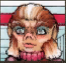
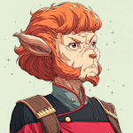

# One Skig, Two Skig, Red Skig, Blue Skig (Part 4) 

 
<b>Session started at 2025-05-11 / 21:09</b>
 
Fantasy Grounds - v4.7.1 ULTIMATE (2025-04-29) 
Fen's StarTrekAdventures Ruleset (v1.1.5)  
*[Prioritized Source: File; Other Sources: Vault]* 
*Core RPG ruleset (2025-04-22) for Fantasy Grounds
Copyright 2025 Smiteworks USA, LLC* 
*Fen's STA House Rules (v1.0.1) * 
*FG Browser v1.2.3* 
*[Prioritized Source: File; Other Sources: Vault]* 

>INTERIOR - Sickbay: As the crew finish up their treatments, several crewmembers from Dr. Skig’s Lister rush in. They are carrying a crewman with a severely lacerated chest. They run over to the number dispenser machines and grab a red number for “Life Threatening Emergencies” 

**Zox** I thought we 'the floor is plasma'ed that thing. 
**Windbloom Openheart** If the floor turned to plasma, wouldn't you climb the walls? 
**Zox** That's cheating. 
**Hailey Murry** We also probably didn't get the entire floor with it 
**Windbloom Openheart** But flooding its deck with hot plasma from an alternate reality is not? 
**Zox** Maybe a little... 
**Skig** Let's just assume it was not coming from a different deck, it is possible they brought it on board because meeting new life forms and bringing them on board a precious and valuable spaceship is very in-trope for this universe. 
**Dr. Skig** Nonsense, that sounds like a good way to discover interesting new pathogens in the tissues of your dead crew 
**Zox: [ REASON  (7) +  SCIENCE  (4)]
[Focus: Xenobiology ]
[Successes: 0] [Complications: 0]
Failed on DC: 1 [2d20 = 35]** 
**Dr. Skig** I have a strict, six week quarantine protocol for any new lifeforms AND any crew who visit unexplored planets 
*Zox begins saying this was done by several cryptids....* 
**Hailey Murry** I can believe that 
**Skig** It is good to know, BlueSkig, that you have your head on in a not posterially segmented fashion. 
*Dr. Skig scans the injured crewman* 
**Dr. Skig** Wherever this thing came from, it does appear to be somewhat dangerous. Although these injuries look worse than they are.  
**Hailey Murry** In what way? 
**Skig** Very well, through them in a containment transport buffer until such time as you can review them properly. 
indarien (Skig): "throw" 
**Dr. Skig** Nonsense, he'll bleed all over the transporter pads 
**Dr. Skig** I'll handle him according to my standard protocols 
Masakari (Zox): wouldn't the buffer be part of an alternate lister? XD. 
Masakari (Zox): respawn in universe 1234 not 4321 
**Skig** Very well, best of luck to you blue Skig and Nurse T'Kor. 
**Dr. Skig** Yes, yes. I will work on a treatment for your autoimmune phage while you are gone 
**Dr. Skig** That is at least a more interesting problem than a bloodied crewman 
*Skig looks at crewman.* 
**Skig: [ DARING  (10) +  MEDICINE  (1)]
[Focus: Faking Empathy As Best as Possible ]
[Successes: 3] [Complications: 0]
Success with 2 momentum [2d20 = 6]** 
**Zox:  [Total: 2] [Effects: 0] [dChallenge = 2]** 
*Skig pats the injured person on the shoulder.* 
**Skig** It's okay, it is not as bad as it feels, you will be okay and back to a long and fruitful life in the lower decks of the best ship in Starfleet in no time. 
**Skig** Nurse T'Kor, can you stab this guy with some sort of painkiller type thing? 
KruschtyaEquation (Hailey Murry): Is he at all coherent?  
**Hailey Murry** What happened?  
**Injured Crewman** Yes, painkillers would be great 
**Injured Crewman** We were working on a replicator controller near junction A14. I heard something odd from inside the maintenance hatch and poked my head in. Then something fell on me from above, scratched and clawed me, and then ran off down the jeffries tube 
*Injured Crewman looks back at Skig* 
**Injured Crewman** "Best ship in starfleet"? Am I get transferred ma'am? 
*Skig grabs nearest available hypospray and injects him.* 
**Skig:  [d20 = 11]** 
Masakari (Zox): Both. ^_^; 
Masakari (Zox): DO IT! 
*Injured Crewman lays back in his chair and stares up at the ceiling.* 
**Injured Crewman** Do you ever think about how there's no up and down in space? 
**Injured Crewman** Up and down are just like... constructs 
**Skig** All the time, it is one of the great mysteries, just like how we are all assigned to the ships we pass the qualification exam for. 
*Skig looks at injured crewman.* 
**Zox** I hear space whales lack this evolved arbitrary sense of direction. You should talk to one. 
**Skig** I'm sure you will do fine on the USS Hemmorhagic Contusion. 
**Lt. Cmdr Malat** We should probaby leave before he says anything else mean about the Lister, and Skig spaces him 
**Skig** Nonsense Malat, there is no airlock on this deck and we wouldn't want to drag him to another one. I will leave him in the excellent care of BlueSkig. 
**Skig** Shall we be on our way back to the bridge now? 
**Zox** Yes! 
Masakari (Zox): brandishes his type 2 phaser and takes point. let's GO! 
*Skig smashes her head on the door as she leaves, since she forgot she has gone through a rather unusual growth spurt.* 
*Zox brandishes his type 2 phaser and takes point. let's GO!* 
>The crew leave sickbay, leaving behind Chief Skig to be medically experimented on. 

**Skig: [ DARING  (10) +  COMMAND  (2)]
[Focus: Faking Empathy As Best as Possible ]
[Successes: 1] [Complications: 0]
Success with 0 momentum [2d20 = 22]** 
>After a short walk, they make it to a Jeffries tube and head up to Deck 4. When they pop the hatch, everything seems to be normal. There are no signs of plasma, or dead bodies, or other horrible danger. Just normal looking crew going about their business 

**Skig** This is immediately very suspicious. 
**Windbloom Openheart** You're too paranoid 
*Skig checks for signs of medical pathogens.* 
**Windbloom Openheart** You just have to trust in the universe and everything will work out 
**Hailey Murry: [ INSIGHT  (13) +  SECURITY  (3)]
[Successes: 0] [Complications: 0]
Failed on DC: 1 [2d20 = 37]** 
**Skig: [ DARING  (10) +  SCIENCE  (3)]
[Focus: Survival ]
[Successes: 2] [Complications: 0]
Success with 1 momentum [2d20 = 18]** 
**Lt. Cmdr Malat** That's easy for you to say, you're immune to every known disease. 
**Zox** Other-Zox may have a small ...mostly legal....weapons cache we can borrow. Who wants to come to my* quarters? 
**Hailey Murry:  [d20 = 14]** 
**Skig** This will be a good opportunity to see if your Zox-Suit is stored there also. 
**Zox** Indeed. I sort of wanted to compare the models. 
>Murry goes poke her head out the hatch and look for signs of danger, but as she steps out, she trips over something between her legs. She looks down and realizes that what she tripped over was her third leg. 

**Hailey Murry** Oh what the-- 
**Zox: [ REASON  (7) +  SCIENCE  (4)]
[Focus: Xenobiology ]
[Successes: 1] [Complications: 0]
Success with 0 momentum [2d20 = 30]** 
**Zox** That can't be normal...but now you should be extra stable! 
**Skig** Umm.... 
**Skig: [ REASON  (10) +  MEDICINE  (1)]
[Successes: 1] [Complications: 0]
Success with 0 momentum [2d20 = 21]** 
**Zox: [ REASON  (7) +  MEDICINE  (1)]
[Successes: 3] [Complications: 0]
Success with 2 momentum [2d20 = 3]** 
**Hailey Murry: [ REASON  (9) +  MEDICINE  (4)]
[Focus: Field Medic ]
[Successes: 2] [Complications: 0]
Success with 1 momentum [2d20 = 19]** 
**Hailey Murry** Zox, are you turning into a Skig? 
Masakari (Zox): SPACE. DWARVES (but not squats) 
**Zox: [ REASON  (7) +  SCIENCE  (4)]
[Successes: 1] [Complications: 0]
Success with 0 momentum [2d20 = 23]** 
*Zox plays with a Tricorder on himself, rather than 'Tripod' Murray* 
>As Zox puzzles at his tricorder, the pain becomes worse and worse 

**Skig** This transdimensional abnomalities will only get worse until we can figure out how to get the Listers out of this mess. 
*Zox Zox tries to be 'Tough Guy' and ignore pain* 
**Windbloom Openheart** A few moments later, Zox's head begins to form a cleft from the top of his skull down to his chin. The cleft grows larger, and then you notice new eyes appear to be forming on either side of it. The cleft begins to spread down his abdomen, and another forms between his legs spreading upwards 
>A few moments later, Zox's head begins to form a cleft from the top of his skull down to his chin. The cleft grows larger, and then you notice new eyes appear to be forming on either side of it. The cleft begins to spread down his abdomen, and another forms between his legs spreading upwards 

**Skig** Let's get to Zox's quarters before... IN THE NAME OF ALL THAT IS WARP CORE LIKE! 
>Before anyone can fully process what is happening, Zox has completely split in 2, and 2 half-size Zox's are left gasping for air on the deck in front of you 

*Skig waits for Adeptus Sororitas to show up and begin cleansing with Holy Fire.* 
**Lt. Cmdr Malat** I think I'm gonna be sick 
*Skig rethinks that, because she does not have enough time for the crossover to happen.* 
*Skig hands Malat a barf bag.* 
**Skig** Not on the deck please. 
*Skig pats Malat on the back.* 
**Zox** Mmmrrrggglll 
**Hailey Murry** Zox, put your pants on. And other Zox, put the shirt on instead of your pants 
**Skig** Don't ask why it is carrots. 
**Ensign Skig** I don't know what is going on here, but I am going to report this to the XO 
**Skig** Zox-One and Zox-Two, come along. 
*Skig looks at Ensign Skig.* 
>you notice a Skig in a Red uniform with Ensign's insignia has turned the corner and is staring at you 

**Skig** Excellent, RedSkig, I have need of you. 
**Skig** RedSkig, I am XO Skig, this is SciSkig. 
**Skig** The sane looking one is Malat. 
**Ensign Skig** Um...  
*Ensign Skig looks around* 
**Skig** The Gem'Hadar is the ship's counselor. 
**Skig** And NO, you are not delusional or hallucinating. 
**Ensign Skig** This is highly irregular 
**Skig** Anyway, what is the situation on this deck and what is your position on this ship? 
**Hailey Murry** It is 
*Ensign Skig pulls out a PADD and starts searching it* 
**Ensign Skig** I need to check the protocol  
*Skig peeks over RedSkig's shoulder.* 
**Ensign Skig** Are you trans-dimensional travelers, or did you come from a quantum alternate universe  
**Skig** No no, you need to FleetSearch for Time-Space Analomies with regard to Kaleidoscopic Trans-Dimensional transit localized to a single starship. 
**Skig** Section 10929, Paragraph 2-4, Footnote 4. 
**Hailey Murry** Wait do we have a page on that? 
*Hailey Murry leans over to get a look as well* 
**Skig** Yes, right after Voth Hair Care techniques. 
**Ensign Skig** Well, unless you're from the mirror universe standard protocol is to continue to observe the chain of command. 
**Ensign Skig** And there are 2 of you, so you can't be from there 
**Ensign Skig** So I guess I have to report this to you 
**Skig** Great, I am not from the Mirror Universe, so we can skip that part. 
**Skig** Absolutely, what is your report? 
**Ensign Skig** Ma'am, this weird lizard thing leaked a bunch of fluid on the deck in contravention of article 21, section 14-A  
**Ensign Skig** He should have performed his biological mitosis in his quarters, medbay, or an area otherwise desgnated for non-standard biological functions 
**Zox** Oh no.....Four? 
**Skig** Very well, we need a replicator to get new clothes for the creatures after isolating any pathogens they might be emitting. Then use one of the automated cleaning drones to deal with this mess per biological containment hazards. 
**Skig** That should be covered under Paragraph 4 and both referenced Footnotes in Addendum D. 
**Ensign Skig** Wait, that lizard looks like a lot like my XO. Just smaller, and nakeder 
**Skig** Yes, Lizards do procreate oddly. 
**Ensign Skig** Also Voth don't reproduce through Mitosis, so it couldn't be him 
**Hailey Murry** That's not a natural ability of his 
**Ensign Skig** Why do you have three legs? 
**Hailey Murry** Same reason, experimental medications 
**Skig** This is likely a function of his biological processes being disrupted through the transdimensional transit. 
**Hailey Murry** Don't get hurt 
**Ensign Skig** For crew with a non-standard number of legs, Starfleet dresscode section 3, paragraph 17 requires customized uniform pants to properly cover oneself while on duty 
**Ensign Skig** This is all highly irregular 
**Skig** Yes, and if you encounter MedSkig, even if you have suffered an amputation. 
*Skig ties BlindZox to Not-BlindZox.* 
**Skig** RedSkig, let us be off with this merry band of fellow Starfleet personnel. 
**Zox** This feels natural, like we are once again part of a pack rather than a crew.... 
*Skig heads in the direction of Zox's Quarters.* 
**Ensign Skig** We need to get uniforms on you. And assuming you are some version of Commander Zox, it would be acceptable under protocol to get clothes from his uniform 
**Ensign Skig** Follow me 
**Zox** <wootling intensifies> 
**Skig** Lead on RedSkig. 
*Skig waits patiently for the red shirt Skig to get redshirted like what usually happens.* 
**Zox: [ INSIGHT  (7) +  CONN  (1)]
[Successes: 0] [Complications: 0]
Failed on DC: 1 [2d20 = 31]** 
**Skig: [ INSIGHT  (8) +  CONN  (2)]
[Successes: 0] [Complications: 0]
Failed on DC: 1 [2d20 = 30]** 
**Hailey Murry: [ INSIGHT  (13) +  CONN  (3)]
[Focus: Field Medic ]
[Successes: 2] [Complications: 0]
Success with 1 momentum [2d20 = 20]** 
**Ensign Skig** I will wait here in the common area while you get clothes 
**Hailey Murry** Thank you 
**Ensign Skig** Make sure that whatever you put on is consistent with standard uniform regulations or I will have to report you to her 
*Ensign Skig points to Skig* 
**Skig** Good job RedSkig! 
**Lt. Cmdr Malat** She's a total narc 
*Skig pats RedSkig on the head, like an adorable younger daughter of herself.* 
**Hailey Murry** Ah, we should take her with us, in that case 
**Hailey Murry** C'mon, Skig 
**Hailey Murry: [ PRESENCE  (10) +  CONN  (3)]
[Focus: Diplomacy ]
[Successes: 2] [Complications: 1]
Success with 1 momentum [2d20 = 23]** 
**Hailey Murry: [ INSIGHT  (13) +  COMMAND  (2)]
[Focus: Diplomacy ]
[Successes: 2] [Complications: 0]
Success with 1 momentum [2d20 = 13]** 
**Hailey Murry:  [d20 = 6]** 
**Skig** Malat, be happy we are not seeing 3000 copies of you, can you imagine what it would be like to see Preppy-Happy-Valley-Girl Malat? 
*Skig shudders.* 
**Hailey Murry** heads over to the replicator and replicates a large cloak to put over herself and her new extra arm 
*Hailey Murry heads over to the replicator and replicates a large cloak to put over herself and her new extra arm* 
**Lt. Cmdr Skig** Personally, I find all of this fascinating 
**Hailey Murry** Well I appreciate not being dead, but this is a really inconvenient situation 
**Zox** It's not fun!  
**Lt. Cmdr Skig** I have been recording detailed readings of each deck we pass, I intend to fully analyze everything when I get back to my own reality and pusblish these findings 
**Zox** however, we are now a tag team.... 
**Hailey Murry** Fantastic,can we have a copy of the data for our reality as well? 
*Zox prints matching uniforms for TeamDino* 
**Skig** Hopefully you are able to properly represent your Skig-Siblings well. 
**Lt. Cmdr Skig** Hmm, I suppose it is highly unlikely that you will scoop my publication owing to the challenges of submitting research to journals in alternate branches of the quantum wavefunciton 
**Lt. Cmdr Skig** I will give you a copy 
**Zox: [ DARING  (12) +  SECURITY  (5)]
[Focus: Espionage ]
[Successes: 2] [Complications: 0]
Success with 1 momentum [2d20 = 29]** 
**Skig** Thank you SciSkig, that is most helpful of you. 
**Zox: [ INSIGHT  (7) +  SECURITY  (5)]
[Successes: 1] [Complications: 0]
Success with 0 momentum [2d20 = 17]** 
**Zox** But if you collaborate now and make a better paper, you don't even really have to share credit when you get back to your home dimension. Is it really two authors if you are both Skigs? 
*Skig looks around the room to see if this version of Zox is more likely to kill them all on purpose than the usual version of Zox is to inflict accidental injuries on himself.* 
**Skig: [ INSIGHT  (8) +  SECURITY  (3)]
[Successes: 1] [Complications: 1]
Success with 0 momentum [2d20 = 24]** 
**Skig** Hmm... RedSkig, does XO Zox share these quarters with someone else? 
**Ensign Skig** Yes, he moved in with his partner several months ago 
**Ensign Skig** Do they not share quarters in your Lister? 
*Ensign Skig points to Murry and Zox?* 
*Zox both Zox look at each other nervously, despite one being totally blind.* 
**Hailey Murry** No, not at all 
**Ensign Skig** It did not violate protocol because the ship's counselor is technically not a direct report of the XO 
**Zox** What is the counselor's name in this universe? 
indarien (Skig): Rhuk 
**Ensign Skig** Hailey Murry 
indarien (Skig): He's moved back in with his mother. 
**Zox** Gasp! 
KruschtyaEquation (Hailey Murry): That's even more horrifying 
**Zox** <Wootle> 
**Skig** Well, it seems that Hailey is into dino-love in every universe. 
**Hailey Murry** Except for ours 
**Skig** Oh whoops, that was supposed to be my inside voice. 
**Hailey Murry** Makes me wish I didn't quit smoking 
KruschtyaEquation (Hailey Murry): *drinking 
**Ensign Skig** It is a funny story actually: Zox's mother came on board at one point and for complicated reasons they decided to pretend they were a couple to avoid conflict with her 
**Ensign Skig** And one thing led to another, as they say 
**Hailey Murry** OKAY 
*Skig bites lip to avoid laughter.* 
**Ensign Skig** Anyways, your uniforms are at least no longer in direct violation of protocol 
**Hailey Murry: [ PRESENCE  (10) +  COMMAND  (2)]
[Focus: Great Heights ]
[Successes: 0] [Complications: 1]
Failed on DC: 1 [2d20 = 38]** 
**Ensign Skig** So we can continue 
**Hailey Murry:  [d20 = 13]** 
**Skig** All right, let's get out of here before things get even stranger... 
>Murry turns to get out of here as quickly as possible, but she trips over one of her legs as it falls off onto the deck in front of her 

**Skig** Too late. 
>Leaving behind her right leg, and her middle leg 

**Zox** I'd keep that for Throk. 
*Skig uses replicator to make herself a giant pot of beef stew to munch on while they are headed to deck 3.* 
**Ensign Skig** Good thinking on the robe, otherwise I would have to write you up for another uniform violation now 
**Hailey Murry** This is incredibly inconvenient 
**Hailey Murry** Let's keep going 
**Windbloom Openheart** Be thankful that you grew a new leg before you lost the old one 
**Windbloom Openheart** You should be grateful for what you have, not wistful for what you've lost 
**Windbloom Openheart** Farewell leg 
*Windbloom Openheart waves goodbye to Murry's leg* 
**Zox: [ CONTROL  (11) +  SECURITY  (5)]
[Successes: 1] [Complications: 1]
Success with 0 momentum [2d20 = 31]** 
**Skig:  [Total: 0] [Effects: 0] [dChallenge = 0]** 
>Zox phasers the leg, vaporizing it. But as he turns to leave he again splits in half in to 2 1/4 size Zox's 

*Skig looks at Murry.* 
**Skig** To be fair, I'm not sure we all don't need to start drinking. 
KruschtyaEquation (Hailey Murry): Can we generate a phaser? 
*Hailey Murry: Pardon me, can we replicate a trench coat?* 
KruschtyaEquation (Hailey Murry): Pardon me, can we replicate a trench coat? 
*Skig replicates a Voth frontal baby carrier so Windbloom can carry Blind Zox with us.* 
**Skig: [ REASON  (10) +  ENGINEERING  (5)]
[Focus: Starship Tactics ]
[Successes: 3] [Complications: 0]
Success with 2 momentum [2d20 = 13]** 
*Zox 's chorus of wootles allows the many to coordinate.* 
*Skig misunderstands what "Voth Baby Carrier" really means, which results in this one coming with a PADD for streaming Voth-Tube videos, a complete subscription to DisneyVoth Educational videos, a self-sealing diaper disposal unit, and climate control.* 
*Skig might have made better choices if she had actually realized this was a BLIND, but functionally adult Zox.* 
*Zox grows jealous of the pampered Zox* 
>Windbloom straps on the Zox carrier, puts the Blind mini-Zox in it, and the crew heads out to head for Deck 1. As they pass Deck 3 they find  a thick tangle of vines and branches obstructing the Jeffries tube 

**Zox** Nummy! 
**Skig** BY THE WARP CORE! 
**Skig** What unholy abomination of unnatural growth is this? 
**Lt. Cmdr Malat** I hate this place. Ma'am, permission to use this giant plasma rifle Zox gave me? 
**Zox** Dinner! 
*Skig ponders rerouting the plasma spewing deck here to remove the icky biological growth from the Lister.* 
**Skig** Granted! 
*Lt. Cmdr Malat struggles to wield the massive weapon, pointing it up at hte vines above* 
indarien (Skig): It's a standard issue BIG GUN, the Equipment department made it for me, and it is now part of my personal collection. 
**Zox: [ INSIGHT  (7) +  SECURITY  (5)]
[Successes: 1] [Complications: 0]
Success with 0 momentum [2d20 = 23]** 
**Skig: [ INSIGHT  (8) +  SECURITY  (3)]
[Successes: 0] [Complications: 0]
Failed on DC: 1 [2d20 = 35]** 
**Zox: [ FITNESS  (10) +  SECURITY  (5)]
[Focus: Endurance ]
[Successes: 2] [Complications: 0]
Success with 1 momentum [2d20 = 22]** 
indarien (Skig): For it to be truly Throk-Approved, does it have a "Deep Fat Fry" option? 
*Zox s noddingly approve of Malat's marksmanship.* 
*Lt. Cmdr Malat shrugs off the suggestion that she is not capable of handling this massive weapon and fires off several perfectly placed shots, burning a neat hole clean through the foliage.* 
*Zox make peeping dino noises.* 
*Zox eat burning, presumably plasma-singed, plants. Delicious!* 
>As the crew proceed up past deck 3, they find the hatch to deck 2 is sealed shut, with its automatic safety iterlock engaged 

**Zox** Hrm.  
**Zox ** *(Chibi-High-Pitched)*: We may not want to open it? Danger yes, on the other side? 
*Skig scans the far side to see if it has beathable atmosphere on the other side of the hatch.* 
**Skig: [ DARING  (10) +  SCIENCE  (3)]
[Successes: 0] [Complications: 0]
Failed on DC: 1 [2d20 = 34]** 
**Skig** Hmm... 
**Windbloom Openheart** You may be right little guy 
**Skig** No idea what is on the other side, but DisneyVoth is showing Pochahantas, Spirit of the Wind on channel 4. 
*Hailey Murry checks the panel to see if she can access details on the other side* 
**Hailey Murry: [ REASON  (9) +  SECURITY  (3)]
[Focus: Great Heights ]
[Successes: 1] [Complications: 0]
Success with 0 momentum [2d20 = 28]** 
*Zox Appreciates DisneyVoth now has smells in addition to 4D graphics.* 
>Murry pulls up the hatch camera feed, and from the other side of the hatch she can see the colorful glow of the kaleidoscope anomoly through the massive hull breach nearby 

**Lt. Cmdr Malat** Oh that's just great 
**Zox** We made it! 
**Hailey Murry** Why is there a hull breach? 
**Hailey Murry** Did it breach us itself? 
**Lt. Cmdr Skig** That deck must not have a Skig 
**Zox** We go lateral now? To next tube? 
**Skig** At this point, the absense of other hull breaches so far has been somewhat incredible. 
**Lt. Cmdr Skig** I have noticed during our journey, on decks that have suffered catastophic ends I am not reading any Tellerite life forms.  
**Skig** Yes, we can try that. 
**Hailey Murry** Maybe the kalleidoscope is Skig? 
**Skig** SciSkig, if there are no lifeforms, then it is likely even AlternateUniverseSkig did not survive whatever happened. 
**Hailey Murry** Or she didn't remain a Tellerite 
**Windbloom Openheart** Or maybe a Lister is doomed if it doesn't have a Skig 
**Zox** We haven't found someone metempsychosed into another species yet. 
**Windbloom Openheart** Skig has a spiritual connection to the Lister, maybe they need each other 
**Lt. Cmdr Malat** Skig's obsession with an old starship is not a spiritual connection, it's autism 
**Zox** Only the anomaly can demarcate the fine line between those two.  
**Skig** It is NOT autism, it is GREATNESS. 
*Skig makes a note to writeup Malat for insubordination, then realizes Malat would love that, so decides to give her a commendation instead because she heard reverse psychology sometimes works for command officers.* 
>For the record: standard procedure would be to seal the hull breach and securte the deck before proceeding. But you all seem to have a dubious relationship with protocol 

**Ensign Skig** For the record: standard procedure would be to seal the hull breach and securte the deck before proceeding. But you all seem to have a dubious relationship with protocol\ 
**Hailey Murry** Uhuh, how do we seal the hull breach?  
**Ensign Skig** For a breach of this size: we would need 4-5 portable force-field generators to seal the affected area, then using the materials replicator on deck 19 we would replicate new hull panels and bring them into place with a shuttlecraft 
>Then bond them to the hull 

**Ensign Skig** Then bond them to the hull 
**Ensign Skig** Work would take between 16 and 30 hours 
**Hailey Murry** Where are the closest forcefield generators? Any on the floor you were on? 
**Skig** Excellent, let's get some force field generators, slap those into place, and then see what is going on at the bridge. 
*Skig generates herself another bowl of beef stew.* 
**Lt. Cmdr Malat** We do not have 16 hours to repair a massive hull breach in some alternate Lister. I say we throw the standard protocol out the hull breach and focus on getting back to our reality 
**Skig** I agree with Malat, we don't have time for Murry and Zox to further devolve with whatever medical condition they have. 
**Lt. Cmdr Malat** Skig, you must have some fly-by-night workaround? You are always fixing things with random crap from your pockets 
**Hailey Murry** I think we can toss a forcefield over it and head up and through that floor after it's safe 
**Skig** Plus, the Lister  is in serious danger. 
*Skig thinks for a minute.* 
**Skig** All right, we just need to create an extendable force field array that creates a small atmospheric bubble which extends through deck 2, then we can use a grappling extension to attach to the alternate bimodal decompression lock connecting to the emergency airlock valves, as long as no one yanks on it too hard or we put more than 500kg of weight on the line, we are unlikely to space the entire bridge. 
**Lt. Cmdr Skig** A small forcefield around the jeffries is certainly easier to emit than a 20 meter forcefield over the entire hull breach 
**Hailey Murry** True 
**Skig** We can do all that by removing the safety protocol configuration on the nearby shielding array and use the obverse generator to reconfigure the shields to create an inverted slide. 
**Skig** This is maybe 10 minutes of work, tops. 
**Zox** Removing a safety protocol? 
**Zox** YES 
**Zox: [ DARING  (12) +  SECURITY  (5)]
[Focus: Espionage ]
[Successes: 2] [Complications: 0]
Success with 1 momentum [2d20 = 16]** 
**Lt. Cmdr Malat** There is an aft shield emitter on deck 3, at least on our Lister 
**Skig** That's the one. 
KruschtyaEquation (Hailey Murry): Did the plants block the way through the floor there or just the jeffereys tube? 
**Lt. Cmdr Malat** Traversing this deck is going to be a nightmare though, there are vines and branches everywhere 
**Lt. Cmdr Malat** We're going to have to cut or burn a lot of foliage  
**Skig** More or less nightmare than the BorgSkig squatting on all the major shield arrays. 
**Zox: [ DARING  (12) +  CONN  (1)]
[Successes: 2] [Complications: 0]
Success with 1 momentum [2d20 = 8]** 
indarien (Skig): Okay, I vote Zox gets the spotlight milestone for this one for turning tiny size into a benefit. 
**Zox:  [d20 = 3]** 
**Lt. Cmdr Malat** Zox effortlesly climbs over the vines, through gaps in the branches, and makes his way easily through the deck towards the aft shield emitter. There, he is able to override the safety protocols and transfer emitter control to Skig at the hatch panel.  
>Zox effortlesly climbs over the vines, through gaps in the branches, and makes his way easily through the deck towards the aft shield emitter. There, he is able to override the safety protocols and transfer emitter control to Skig at the hatch panel.  

*Zox emits the wootle of joy.* 
>As he turns to head back though, he hears rustling leaves and turns to see a large Fossa stalking him through the underbrush 

**Zox: [ FITNESS  (10) +  CONN  (1)]
[Focus: Endurance ]
[Successes: 2] [Complications: 0]
Success with 1 momentum [2d20 = 18]** 
**Zox: [ DARING  (12) +  ENGINEERING  (4)]
[Successes: 2] [Complications: 0]
Success with 1 momentum [2d20 = 20]** 
**Zox: [ CONTROL  (11) +  SECURITY  (5)]
[Successes: 2] [Complications: 0]
Success with 1 momentum [2d20 = 24]** 
**Zox:  [Total: 6] [Effects: 3] [6d6 = 6]** 
>The tiny Zox sprints through the underbrush, narrowly evading the Fossa long enough for the other tiny Zox to get his phaser propped up on some branches. Zox leads the Fossa back into the line of fire, and his counterpart lands a direct hit on maximum stun setting 

**Skig: [ DARING  (10) +  ENGINEERING  (5)]
[Focus: Emergency Repairs ]
[Successes: 2] [Complications: 0]
Success with 1 momentum [2d20 = 18]** 
Masakari (Zox): (this was the single best thing Zox ever did involving security ever, and no one else got to see it) 
>Skig extends the forcefield and opens the hatch, the narrow forcefield holds and the deck is not exposed to vaccum, allowing the crew to continue up the ladder, and emerge from the maintenance at the back of the bridge 

>When the arrive at the bridge, they see a Tellerite sitting in the captain's chair, while a single Tholian runs around an otherwise empty bridge operating multiple consoles 

**Zox** From the lowest to the highest..... 
**Skig** Captain Skig, ma'am. 
*Captain Skig turns to look at the crew with a surprised look on her face* 
*Skig is happy to see T'Kor is always there for Skig, not matter how insane the situation is.* 
indarien (Skig): "no" 
**Captain Skig** I don't recall approving any new crew transfers 
**Skig** It's a long story... no wait, there is too much, let me sum up. 
**Skig** The kaleidoscope anomaly has fractured the Lister across dozens of transdimensional instances of itself and we Skigs need to put it back together. 
**Skig** I am XO Skig, this is RedSkig, BlueSkig, SciSkig. 
**Skig** Baby Zox 1, 2 and 3. 
*Zox makes cute reptile noises.* 
**Skig** That strange Illuminate FleshMob thing is Hailey Murry. 
**Captain Skig** That explains a few things, we lost connection to all of our automation controllers throughout the ship 
**Hailey Murry** Thanks, Skig 
**Skig: [ INSIGHT  (8) +  COMMAND  (2)]
[Focus: Faking Empathy As Best as Possible ]
[Successes: 1] [Complications: 0]
Success with 0 momentum [2d20 = 27]** 
*Skig suspects Murry was not being entirely sincere with that "Thanks", but really cannot tell.* 
**Captain Skig** T'Kor and I have been working on modifying the internal sensors to give us readings on what is going on inside the Lister 
**Skig** I suspect you are no longer attached to the rest of the Lister as you know it. 
**Skig** My working theory is we will need to inject a warp core transmodal spike through both nacelles, adjusting the phase to match the major ship power reading for each deck so we effectively shake every Lister back to its original dimension. 
**Skig: [ FITNESS  (10) +  COMMAND  (2)]
[Successes: 1] [Complications: 0]
Success with 0 momentum [2d20 = 19]** 
**Skig** To be fair, I have not vetted this theory since I came up with it while eating my seventh bowl of beef stew. 
**Captain Skig** Either that or shake them into small pieces 
**Skig** True, but you cannot make an omelete without reforming the yolk with a replicator. 
**Skig** Also... 
*Skig begins panting heavily.* 
**Skig** Why are the stairs so difficult to traverse on this ship? 
*Skig begins wondering if escalators and wheelchair assist lifts would be a good thing to install.* 
>As she speaks, Skig collapses to the deck gasping for air 

>♫♫♫Ominous Music Sting♫♫♫ 

>---------CUT TO COMMERCIAL------- 

