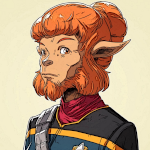

# One Skig, Two Skig, Red Skig, Blue Skig (Part 5) 

 
<b>Session started at 2025-06-02 / 21:24</b>
 
Fantasy Grounds - v4.7.1 ULTIMATE (2025-04-29) 
Fen's StarTrekAdventures Ruleset (v1.1.5)  
*[Prioritized Source: File; Other Sources: Vault]* 
*Core RPG ruleset (2025-04-22) for Fantasy Grounds
Copyright 2025 Smiteworks USA, LLC* 
*Fen's STA House Rules (v1.0.1) * 

>INTERIOR - Bridge: As Skig discusses the situation with Captain Skig, she suddenly collapses to the deck struggling to breathe.  

*Skig makes gurgling and hyperventaliting noises at the same time.* 
**Captain Skig** None of you would happen to be a doctor would you? Our EMH interlink is offline 
**Captain Skig** My CMO transferred away last year and I haven't gotten around to filling that vacancy yet 
Masakari (Zox): Developers Developers Developers. 
**Hailey Murry: [ REASON  (9) +  MEDICINE  (4)]
[Focus: Field Medic ]
[Successes: 4] [Complications: 0]
Success with 3 momentum [2d20 = 6]** 
**Hailey Murry** I can handle this 
**Hailey Murry** While I'm working on this, how is the situation with the anomaly?  
**Hailey Murry** Do you have an oxygen mask? She's grown to large for her lungs to be effective 
**Captain Skig** It's kind of rude to say that right in front of her 
**Hailey Murry** It's indirectly her fault, in the plural 
**Hailey Murry** Actually, I think this might be Zox's fault 
*Hailey Murry is working very deftly with her three arms and hands* 
**Zox ** *(Squeaky)*: What? Me? Look better to have breathing trouble than dead. 
**Hailey Murry** Do we have a replicator up here? 
**Ensign T'Kor** Yes, the replicator in the briefing room should work 
**Zox ** *(Squeaky)*: why don't we pipe some of the air from the jungle deck? That works. 
**Skig** I will be happy to use a CPAP machine, they are very popular with certain medical conditions. 
**Hailey Murry** Here are the specifications we want, and then a second one just in case she keeps getting bigger somehow. Though in that case, we may have other problems.  
**Hailey Murry** Also, here's some for new clothes.  
**Hailey Murry** Skig, you're almost getting too big for your britches  
**Skig** Well, worse things have happened today. 
*Ensign T'Kor runs off to the briefing room to replicate the masks and returns momentarily with a couple of oxygen masks for Skig and a new super stretchy lycra uniform* 
**Hailey Murry** Take it easy for now, Skig 
**Hailey Murry** Captain, what's our situation?  
Masakari (Zox): WRESTLEMANIA 
**Hailey Murry: [ PRESENCE  (10) +  CONN  (3)]
[Focus: Diplomacy ]
[Successes: 1] [Complications: 0]
Success with 0 momentum [2d20 = 30]** 
**Captain Skig** We were on a survey assignment in the Satea sector when we suddenly became enveloped in some strange anomaly. It appeared without warning and swallowed the ship. 
**Hailey Murry** Interesting. We'd found it, but it had jumped onto our ship as well 
**Captain Skig** Since then, we have been dead in space. We've lost contact with the rest of the ship. 
*Zox me shows STRONG emotions.* 
**Hailey Murry** That's expected. It appears to have split the Lister up by deck, each deck belonging to an alternate Lister. Each time we transition a floor through the Jefferies Tubes, we transition from one Lister to another.  
**Hailey Murry** The dimensional barriers between the floors interrupt electrical transmissions, though not string and cup setups 
**Captain Skig** Do you have any ideas on how to restore communication? 
**Zox** It's like a pan-dimensional rubix-ship of many Listers. 
**Lt. Cmdr Skig** Actually, based on my scans, it is a pan-wavefunction rubix-ship 
**Hailey Murry: [ REASON  (9) +  SCIENCE  (4)]
[Focus: Tracking Devices ]
[Successes: 1] [Complications: 0]
Success with 0 momentum [2d20 = 22]** 
Masakari (Zox): AFK work 5 mins 
**Hailey Murry** So far, I think some form of mechanical contraption will work out best. A string, transferring sound through cups, was able to work. It seems like our overlap here is entirely mechanical, with light and electrical signals being blocked and with light passing by unaffected 
**Hailey Murry** We can look from your first deck to your second deck, but if we try to travel to your second deck we get the hull breach deck 
**Lt. Cmdr Skig** I have been performing analysis as we have been traversing the ship. I believe that what we are experiencing is a braid in the quantum wavefunction. When it collided with the Lister, it put the ship into some kind of stable superposition. Electromagnetic waves seem to be bound to their branch where they were produced 
**Lt. Cmdr Skig** I hypothesize that only macroscopic objects are able to cross the boundaries between branches.  
**Hailey Murry** How do we undo it?  
**Lt. Cmdr Skig** Our bodies have such a huge number of entangled degrees of freedom, we can't be locked into a stable superposition the way a simple photon can 
**Lt. Cmdr Skig** Ah, yes.. Well I have no idea 
**Zox** Drive the lister away from the Anomaly? 
**Lt. Cmdr Malat** I agree with Zox. If we fly out on the exact course we came in on, it might untangle whatever happened 
**Hailey Murry** Will flying a single Lister out work for all of them?  
**Ensign Skig** Or it might tear the ship apart and leave every deck floating alone in space 
**Zox** If several Skigs cannot comprehend the physics here, no mortal can.  
**Skig** I'm going to make a strange suppositional theory. 
**Ensign Skig** I have been reviewing the appropriate prototocols and I believe this qualifies as a non-normal localized spatial anomoly, meaning that the appropriate course of action is to conduct a level IV survey of the spatial geomoetry before attempting escape 
KruschtyaEquation (Hailey Murry): A strange suppositional superpositional theory 
**Lt. Cmdr Malat** That would take days 
**Hailey Murry** One of the decks is a Borg deck, and another seems to be infested with monsters, so I don't think we'd last that long 
**Zox** So soon we will have Borg monsters.  
**Zox** With lazer eyes.  
*Zox 's other small clones gasp at this* 
**Skig** As our experience is that each Lister has a unique version of me, and the only two constants we have encountered in every option is the Lister and I. Is it possible that the anomaly is instead merging the disparate Skig together and the quantum waveform superpositioning is an unintended side effect? 
**Zox** So...group hug among all the skigs? 
**Lt. Cmdr Skig** That is a reasonble hypothesis, the knot in the wavefunction could be tangled around our own wavefunction 
**Skig** Ergo, the problem is my split existence and not the Lister itself. 
**Skig** Thank you SciSkig. 
**Skig** Well, our mutual split existence. 
*Skig gestures among all the Skig.* 
**Hailey Murry** Can you... make contact with one another? 
**Hailey Murry** Will that cause you to merge? 
**Ensign Skig** That sounds innapropriate while on duty 
**Skig** Captain Skig, would you mind shaking the hand of First Officer Skig while SciSkig monitors the waveforms to see if that merges or influences our mutual Lister waveforms? 
**Captain Skig** I suppose it's worth a try... 
*Captain Skig shakes Skig's hand* 
**Lt. Cmdr Skig** No signs of any abnormal quantum fluctuation.  
**Hailey Murry** Hmmm. Perhaps it only works at high speeds?  
**Lt. Cmdr Skig** Most likely we are simply from different branches of the wave function 
**Lt. Cmdr Skig** If you were to somehow merge those branches together, it would be equivalent to destroying my entire universe 
**Lt. Cmdr Skig** I would object on several grounds 
**Lt. Cmdr Skig** Not least of which is that I'd lose my entire publication history 
**Hailey Murry** So we're back to trying to leave the anomaly. Leave it, collapse it, or push it away somehow.  
**Windbloom Openheart** I think you're all like... being too scientific 
**Lt. Cmdr Skig** This really does seem like a scientific problem 
**Windbloom Openheart** Nah man, I think you've got it all wrong. This is a... spiritual problem 
**Skig** Quite possibly Windbloom. 
**Zox** Take a giant rip, and then tell us if we ride _into_ the anomaly or ride _away_ from it, my fine sage. 
*Zox 's doubles applaud this suggestion.* 
**Windbloom Openheart** I think we need to understand Skig in order to understand how we got here. 
**Skig** To be fair, I am not sure how we are even going to arrange to maneuver the ship given that each deck is a completely different waveform. 
*Skig blinks.* 
**Skig** Err... 
**Lt. Cmdr Skig** That is a rediculous nonsequitor, we need to find a way to plot a course out of here 
**Lt. Cmdr Skig** Not go on a journey of self discovery 
**Zox** Discovery! there we go! 
**Skig** However, SciSkig, ponder this, how would we actually plot and maneuver a manifold waveform without the ability to communicate across decks. 
**Zox** Computer, begin playing record 'Discovery' from the early 21st century. 
**Hailey Murry** Oh no 
**Hailey Murry** The Pakleds 
**Hailey Murry** What if their effigy of Skig in the cargo bays triggered this? 
**Hailey Murry** And drew the anomaly toward us? 
**Captain Skig** Effigy of Skig? 
**Hailey Murry: [ REASON  (9) +  SCIENCE  (4)]
[Successes: 1] [Complications: 0]
Success with 0 momentum [2d20 = 27]** 
**Captain Skig** What kind of ship are you running on your branch of the wavefunction 
**Skig** Yes, there were Pakleds who insisted on worshipping me as the Bringer of Electricity. 
**Hailey Murry** We adopted some Pakleds that were raiding people for their insulating material. They're in our cargo bay right now, and they formed a cult around electrical resistance 
**Skig** The longer explanation requites Denebian Ale. 
**Windbloom Openheart** Well that isn't quite what I meant by "spiritual problem" but it kind of makes sense 
**Hailey Murry** The effigy they built was subject to an immense electrical  surge 
**Lt. Cmdr Skig** That actually kind of makes sense, the anomaly does couple strongly with electromagnetic fields 
**Lt. Cmdr Skig** Hence why photons can't pass the boundaries 
**Ensign Skig** Why would you let a bunch of Pakleds build a high-power electrical Skig effigy on your ship? 
**Ensign Skig** That definitely violates at least seven protocols 
**Hailey Murry** It's a better question of how to stop them 
**Hailey Murry** We've stopped over two dozen high power apparatuses, they keep building them 
**Skig** Sometimes, Ensign Skig, it is better to violate protocol than cause the Lister to explode. 
**Lt. Cmdr Malat** Besides, the Pakleds are mostly pretty harmless 
**Lt. Cmdr Malat** It's not like they did this on purpose 
indarien (Skig): as long as they are not Mostly Harmless, we are okay. 
**Zox** So they _did_ to it, just not on purpose. No malice, but they are causing harm 
**Skig** All right, let's go find them, shut it down, connect it to a generator and launch it into space and see if the anomaly follows it? 
**Hailey Murry** The Pakleds are not malicious, but calling them harmless is a little strong 
**Skig** SciSkig, what do you think our chances of success would be. 
**Zox** The distributed idea of Skig is the least terrible demi-god they could have willed into existence. 
**Ensign Skig** Yes, so per protocol they should be arrested and charged with unauthorized use of ship electrical systems and reckless endangerment 
**Zox** We can't do that. In our universe, Starfleet prides itself on being altruistic, and the Pakleds were being taken advantage of. We had to give htem refuge and toys for enrichment. 
**Lt. Cmdr Skig** Well, spacing the the thing may wiork but we need to make sure that we launch in the right direction. If the anomaly takes the wrong path on the way out there's no telling what shape we'd end up in 
**Hailey Murry** So it sounds like we're back down to the Cargo Bay to take some reads of it? 
**Lt. Cmdr Skig** Well we have the sensor data from the anomaly already, so if we cross reference that with the precise energy readings of that effigy we should be able to figure out the proper way to eject it 
**Skig** I agree Hailey, let us be on our way after your excellent creation of a CPAP machine. 
**Skig** Let us be on our way, are you joining us Captain Skig? 
**Captain Skig** My place is on the bridge 
**Zox** They don't make captains in this universe. 
*Skig gives Vulcan salute to Captain Skig.* 
**Skig** Live Long and Engineer Well. 
**Skig** Let's be off. 
*Skig heads back to Pakled infested cargo bay.* 
**Zox** Controversial Idea: Let's use the breach and walk across the exterior. 
**Lt. Cmdr Malat** That's actually not a bad idea 
**Zox** We could get to the cargo bay without fighting the Cassowary monster, the Borg, Random Pathogens, A mutiny, radiation, and plasma leaks. 
**Zox** Oh, and lotus-eaters. 
**Skig** I agree, let's head across the exterior ship using EVA. 
**Hailey Murry: [ REASON  (9) +  CONN  (3)]
[Focus: Constitution Class Ships ]
[Successes: 3] [Complications: 0]
Success with 2 momentum [2d20 = 11]** 
**Hailey Murry** By the way, do you want to exchange some data on our Listers? That way we can each improve our own and hopefully wind up better because of it 
**Skig** That's brilliant! 
**Captain Skig** Good thinking, make it so 
*Zox begins figuring out how 3 smaller Zox can fit in a standard EVA suit, voltron-style* 
**Zox: [ FITNESS  (10) +  ENGINEERING  (4)]
[Focus: Endurance ]
[Successes: 3] [Complications: 0]
Success with 2 momentum [2d20 = 6]** 
Masakari (Zox): (I see im using the good rolls productively) 
*Zox begins painting the leg blue.* 
*Skig shares her updated Security System schematics with the other Skigs for distribution throughout the Lister versions.* 
**Skig: [ REASON  (10) +  ENGINEERING  (5)]
[Focus: Starship Tactics ]
[Successes: 1] [Complications: 0]
Success with 0 momentum [2d20 = 28]** 
*Zox does 'the robot' in zero g.* 
**Zox: [ FITNESS  (10) +  COMMAND  (2)]
[Successes: 1] [Complications: 0]
Success with 0 momentum [2d20 = 19]** 
**Skig** Let's go to shuttle craft storage, that is likely where Old Faithless will be found. 
**Zox: [ INSIGHT  (7) +  SECURITY  (5)]
[Successes: 2] [Complications: 0]
Success with 1 momentum [2d20 = 14]** 
*Captain Skig The crew don space suits and depart through the massive hull breach on deck 2. As they cross the outer hull, everything is normal until they get to Deck 5 when they suddenly feel the effect of gravity* 
>The crew don space suits and depart through the massive hull breach on deck 2. As they cross the outer hull, everything is normal until they get to Deck 5 when they suddenly feel the effect of gravity 

**Skig: [ FITNESS  (10) +  CONN  (2)]
[Focus: Survival ]
[Successes: 1] [Complications: 0]
Success with 0 momentum [2d20 = 25]** 
**Zox: [ FITNESS  (10) +  CONN  (1)]
[Focus: Endurance ]
[Successes: 1] [Complications: 0]
Success with 0 momentum [2d20 = 18]** 
**Hailey Murry: [ DARING  (10) +  CONN  (3)]
[Focus: Great Heights ]
[Successes: 1] [Complications: 0]
Success with 0 momentum [2d20 = 24]** 
*Skig lets gravity pull her along to get past the strange gravity issue that did not seem to extend to artifical gravity inside the ship.* 
>As Skig and Zox catch themselves, Murry deactivates her magnetic boots and allows herself to fall past deck 5, then reactivates them when she crosses over to deck 6. As Skig regains her footing, she sees a human boy around age 8 looking at her through a window while eating a soft serve ice cream. 

**Hailey Murry** Huh. I guess gravity fields can't pass through the floors either? 
**Zox: [ INSIGHT  (7) +  SECURITY  (5)]
[Focus: Endurance ]
[Successes: 2] [Complications: 0]
Success with 1 momentum [2d20 = 19]** 
**Skig** Strange, I don't remember any crewmen that short. 
**Skig** He must be off duty. 
>As the crew continue on their way, they notice the exterior windows on deck 7 are all completely covered in blood and vicera. And on Deck 10 the hull is covered in a layer of borg armor plating. 

**Zox** This is the best plan we've had yet! 
**Skig** I am sure BorgSkig is quite happy 
**Skig:  [d20 = 12]** 
**Hailey Murry:  [d20 = 1]** 
**Zox:  [2d20 = 34]** 
**Hailey Murry:  [d20 = 20]** 
**Skig:  [d20 = 1]** 
**Skig:  [d20 = 16]** 
**Hailey Murry:  [Total: 0] [Effects: 0] [dChallenge = 0]** 
**Skig:  [Total: 1] [Effects: 0] [dChallenge = 1]** 
**Zox:  [Total: 2] [Effects: 0] [dChallenge = 2]** 
>As the away team pass by Deck 12, Malat pauses for a moment and grabs her head before continuing. 

**Skig** Are you okay? 
**Skig: [ INSIGHT  (8) +  COMMAND  (2)]
[Focus: Faking Empathy As Best as Possible ]
[Successes: 1] [Complications: 0]
Success with 0 momentum [2d20 = 21]** 
**Lt. Cmdr Malat** Just felt a bit lightheaded there for a minute, I'll be ok. 
**Hailey Murry: [ INSIGHT  (13) +  MEDICINE  (4)]
[Focus: Deception ]
[Successes: 3] [Complications: 0]
Success with 2 momentum [2d20 = 20]** 
**Skig** It's okay, take your time, we rely on you to be at your best. 
**Skig: [ PRESENCE  (8) +  CONN  (2)]
[Focus: Faking Empathy As Best as Possible ]
[Successes: 1] [Complications: 0]
Success with 0 momentum [2d20 = 18]** 
*Skig is thinking at this rate, she might ACTUALLY try being a commanding officer.* 
**Lt. Cmdr Malat** I'm good ma'am, let's carry on 
**Hailey Murry** Are you good?  
*Zox seems to be having a great team building exercise* 
**Lt. Cmdr Malat** I feel fine, honestly I feel better than before 
**Hailey Murry** Just for my piece of mind, what did we talk about before we got out here?  
**Lt. Cmdr Malat** Don't tell me you're going senile now? 
**Lt. Cmdr Malat** I didn't think you were that old 
**Lt. Cmdr Malat** Stop doting over me, I'm not some delicate flower. We need to get back to deck 15. 
**Skig** All right then, let's keep going. 
*Lt. Cmdr Malat turns back toward Deck 15* 
**Zox: [ INSIGHT  (7) +  MEDICINE  (1)]
[Focus: Xenobiology ]
[Successes: 0] [Complications: 0]
Failed on DC: 1 [2d20 = 30]** 
**Zox** We are Zox. 
*Skig urges the group on.* 
*Skig watches Malat to make sure she is okay.* 
>The crew carry on towards the aft shuttle storage hangar and locate the airlock there. When they arrive, they find it is locked. 

**Hailey Murry** Blast it, what was the hazard on this floor? 
**Ensign Skig** This is highly irregular, standard operating procedure is for all external hatches to remain unsecured except in cases of boarding action. 
**Skig** The airlock is locked! What a surprising turn of events. 
**Hailey Murry: [ DARING  (10) +  SECURITY  (3)]
[Focus: Deception ]
[Successes: 3] [Complications: 0]
Success with 2 momentum [2d20 = 7]** 
*Hailey Murry sneaks a peak to see what the floor has going on* 
>Murry looks in through a window and see an entirely empty deck, no signs of crew, plants, animals, borg, plasma, or anything else. 

**Hailey Murry** It is completely empty 
**Lt. Cmdr Malat** So was deck 11, and we saw how that turned out 
**Hailey Murry** I don't see anyone, nor anything 
**Skig** Well, that likely just translates to some sort of airborne death trap. 
**Hailey Murry** Yeah, but we're in suits this time 
*Lt. Cmdr Skig looks at her tricorder.* 
**Zox** Want me to hack this? 
**Lt. Cmdr Skig** I am not reading an atmostphere inside 
**Hailey Murry** Good reason to keep the suits on 
**Skig** That is fine, we are just entering here to get up to the next level. 
**Skig** Yes Zox, see if you can open the door. 
**Skig** Preferably our remaining 1/4 Zox. 
*Zox 's voice resonates as there are many.* 
**Zox: [ DARING  (12) +  SECURITY  (5)]
[Focus: Espionage ]
[Successes: 2] [Complications: 0]
Success with 1 momentum [2d20 = 25]** 
>Zox overrides the door lock and the airlock pops open. 

**Zox** In we go! 
*Skig directs people into the ship, starting with the 1/8 Zoxes to see if they get incinerated by a remote controlled flamethrower turret.* 
>The team drop through the airlock into a dark hangar. Ol' Faithless sits motionless in the hangar, alone. No other shuttles are being stored here. 

*Skig hugs Ol' Faithless.* 
**Zox: [ PRESENCE  (10) +  SCIENCE  (4)]
[Focus: Shipboard Tactical Systems ]
[Successes: 2] [Complications: 0]
Success with 1 momentum [2d20 = 20]** 
**Hailey Murry** I wonder if everyone is shrunk down tiny and living inside Ol' Faithless instead? 
**Zox** What? now that's funny! 
**Skig** That would be amusing. 
**Lt. Cmdr Malat** Do you want to check it ou? Or keep moving? 
*Skig scans Ol' Faithless to see if it can be powered or if it has lifesigns on board.* 
**Hailey Murry: [ INSIGHT  (13) +  MEDICINE  (4)]
[Focus: Deception ]
[Successes: 1] [Complications: 0]
Success with 0 momentum [2d20 = 36]** 
*Skig is expecting to find a grizzled old Skig, who has been abandoned by Starlfeet on a powerless Lister for all eternity.* 
**Skig: [ REASON  (10) +  ENGINEERING  (5)]
[Successes: 2] [Complications: 0]
Success with 1 momentum [2d20 = 22]** 
**Skig** Wait... it's covered in DUST! 
**Skig** How horrible. 
**Skig** No ship should ever be covered in dust, contrary to what my mother told me, dust is not a protective covering against gamma radiation. 
**Hailey Murry** Wait, are you getting shorter too?  
**Zox** is this the scrap yard Lister? 
*Hailey Murry: gestures at Malat* 
**Lt. Cmdr Malat** No, why would I be getting shorter? 
**Hailey Murry** You look different 
**Zox: [ INSIGHT  (7) +  SCIENCE  (4)]
[Successes: 0] [Complications: 1]
Failed on DC: 1 [2d20 = 37]** 
**Hailey Murry** And whatever Zox stuck stuck you with may only be affecting you now 
**Lt. Cmdr Malat** All the more reason to find a safer deck before we end up breaking our own EVA suits 
**Computer Voice** Yes, that would be wise 
**Zox** Computer? oh wow. 
**Computer Voice** I would hate to have you all make a mess on my deks 
**Hailey Murry** Oh, are you Computer Skig? 
**Hailey Murry** Wait 
**Hailey Murry** Did Skig BECOME the Lister? 
**Computer Skig** I have always been the Lister, and I will always be the Lister.  
**Hailey Murry** The AllSkig 
**Computer Skig** How did you all get on board, and what have you done to my sensor interlinks 
**Hailey Murry** Do you only have access to this one floor? 
**Computer Skig** I am the one asking questions here 
**Zox: [ FITNESS  (10) +  CONN  (1)]
[Focus: Endurance ]
[Successes: 2] [Complications: 0]
Success with 1 momentum [2d20 = 9]** 
**Hailey Murry** It wasn't us, it appears an anomaly got stuck on the Lister. It's pulled several alternate versions of the Lister together, with each floor being an alternative Lister 
**Hailey Murry: [ FITNESS  (7) +  CONN  (3)]
[Successes: 0] [Complications: 1]
Failed on DC: 1 [2d20 = 36]** 
**Hailey Murry:  [d20 = 16]** 
**Skig: [ FITNESS  (10) +  CONN  (2)]
[Successes: 1] [Complications: 0]
Success with 0 momentum [2d20 = 18]** 
**Hailey Murry:  [d20 = 16]** 
*Hailey Murry casually shoves the discarded leg into the leg tube* 
**Hailey Murry** Oh damn it 
**Zox** We wish for you to have blessed solitude, Dear Skig. 
*Hailey Murry rubs her lower back, breathing more heavily* 
>As the computer Skig demands answers, the artificial gravity suddenly increases to at least 5G. Murry is pinned to the deck, skig manages to stay on her feet at some difficulty, but she is struggling to breath under the weight of so much pressure on her lungs. 

KruschtyaEquation (Hailey Murry): *foot 
**Zox** No please skig! 
**Hailey Murry** Skig, please, lighten up the pressure, we're answering... your questions 
**Computer Skig** Other Listers... So many Listers... 
**Hailey Murry** Yes 
**Computer Skig** Hopelessly contaminated with.... biological filth 
**Hailey Murry** Not all of them 
**Skig** Yes, all the Listers, and the Listers will never be free of problems unless we can separate them all. 
**Computer Skig** No, I will eliminate this contanimation and free these Listers of the parasites which have taken over. 
**Computer Skig** Starting with you 
**Zox** You will be forever trapped if you destroy us 
>As she speaks, the artificial gravity grows stronger and stronger, pulling everyone down to the deck. 

>♫♫♫Ominous Music Sting♫♫♫ 

>---------CUT TO COMMERCIAL------- 

