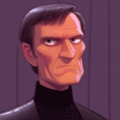

# Corpus Reus (Part 1) 

 
<b>Session started at 2025-08-19 / 04:05</b>
 
Fantasy Grounds - v4.8.1 ULTIMATE (2025-08-13) 
Fen's StarTrekAdventures Ruleset (v1.1.5)  
*[Prioritized Source: File; Other Sources: Vault]* 
*Core RPG ruleset (2025-08-12) for Fantasy Grounds
Copyright 2025 Smiteworks USA, LLC* 
*Fen's STA House Rules (v1.0.1) * 
*FG Browser v1.2.3* 
*[Prioritized Source: File; Other Sources: Vault]* 

>Captains Log, Stardate 62133.7: Our resupply mission to Lasos III was uneventful, but before we set course for the stellar survey in the Omanite Reach, Lt. Commander Malat has asked me to assemble the senior staff for a briefing. She was a little vague as to why. 

>INTERIOR - Briefing Room: The senior staff assembles around the briefing table as Malat nervously checks the contents of a PADD. 

*Hailey Murry leans over to see if she can catch a glimpse* 
**Zox** Surely, no challenge should intimidate our intrepid and youthful Lt. Cmdr? What could be so concerning? 
**Lt. Cmdr Malat** Well if you'll recall, a few weeks ago we identified the warp signature of the vessel we encountered around the black hole where we rescued those Jem'Hadar fighters 
**Lt. Cmdr Malat** Since then, I developed and have been running a tracking program on the Lister's computer core. Using warp monitoring and surveillance data from listening posts along the border region, I am using a interferometric algorithm to reconstruct the path of that warp signature from the background warp field fluctuations 
**Hailey Murry** Good work 
**Lt. Cmdr Malat** The computer's ETA for the program completing indicated it should have been done right around now, but the progress bar has stalled at 99% 
**Lt. Cmdr Malat** I hate when that happens 
**Lt. Cmdr Malat** Skig, permission to go kick the computer core 
**Ensign Ghex** I don't really think that would help, I don't think the computer core will respond to violence or threats of violence. Normally computers pretty much just do what they are programmed to do, and at most you can break them with external force. It's probably not going to make it go any faster 
**Hailey Murry** There are a few aspects of the Lister that I think do work better with percussive maintenance, but our computer core is not one of them 
**Zox** I suggest consulting with Gralan to learn the correct form of violence, and how best to apply it.  
>Suddenly, Malat's PADD chimes and she quickly taps a few controls to pull up a map of the sector on the monitor. 

**Ensign Ghex** Finally, let's see what we've got on the CDS Roral.... 
**Lt. Cmdr Malat** Finally, let's see what we've got on the CDS Roral.... 
**Skig** Permission to kick the computer core denied. Just defer the update until after your process completed. I set the update for Life Support systems to be Nice -15 instead of Nice 19, I guess this was needed so the filtering system stopped caused Decks 12-16 to smell like rotting vegetation. 
**Skig** Life Support updates are important, and I have been neglecting them for a while, but I somewhat realized that maybe that is not in the best interest of the crew. 
**Skig** Oh, which reminds me, AOL is turning off their dial-up service, so I need to have Gra'lan take care of the redshirts quarters if they are going to try and stream videos again. 
Masakari (Zox): (it's too primitive for the Cardassians to hack!) 
**Zox: [ PRESENCE  (10) +  COMMAND  (2)]
[Successes: 1] [Complications: 1]
Success with 0 momentum [2d20 = 31]** 
**Skig: [ PRESENCE  (8) +  COMMAND  (2)]
[Focus: Faking Empathy As Best as Possible ]
[Successes: 2] [Complications: 0]
Success with 1 momentum [2d20 = 19]** 
**Hailey Murry: [ PRESENCE  (10) +  COMMAND  (2)]
[Focus: Diplomacy ]
[Successes: 2] [Complications: 0]
Success with 1 momentum [2d20 = 23]** 
**Skig** Malat this is a wonderful piece of news and excellent research you have brought us. I would expect nothing less from a Star Fleet officer with a chance to redo her last 20 years of service. 
*Skig is still trying to figure out this "leadership" thing.* 
**Zox** Best deduction I have ever seen. A shame I can't tell the difference between the red and green lines.  
**Captain Bachar** We have a few days before we need to begin our survey in the Omanite Reach, we can go investigate a lead if there is anything actionable here 
Masakari (Zox): It's the reverse briar patch! 
**Zox** Let's take a look at some of these planets and what they traffic in.... 
**Zox: [ INSIGHT  (7) +  SECURITY  (5)]
[Focus: Finances ]
[Successes: 4] [Complications: 0]
Success with 3 momentum [2d20 = 9]** 
**Zox** What are these goons moving around.... 
**Skig** Cargo, personnel, Tribbles? 
**Zox** Checking... 
**Zox** Koralis is definitely a place to stock up on ship-building materials, second-hand or reprocessed. 
**Hailey Murry** Koralis is a big one, as is that McAllister Nebula 
**Skig: [ REASON  (10) +  ENGINEERING  (5)]
[Focus: Emergency Repairs ]
[Successes: 1] [Complications: 0]
Success with 0 momentum [2d20 = 32]** 
**Hailey Murry: [ REASON  (9) +  COMMAND  (2)]
[Successes: 0] [Complications: 0]
Failed on DC: 1 [2d20 = 38]** 
**Skig** I think Starfleet grey market procurement gets all the abestos insulation needed for the Lister's hangar bay from Koralis. We could probably use that as an excuse to visit there. 
**Zox** But do we want to visit Koralis or snoop the Nebula? 
**Skig** Which reminds me, I need to see if T'kor remembered NOT to assign a group of Redshirts to strip the abestos off the cooling pipes without PPE. I keep people told that is bad. 
**Skig** Err.. people keep telling me that is bad. 
**Lt. Cmdr Viraseti** The McAllister nebula is 150 light years across, and the ionic interference will limit sensor range. If you want to investigate it, you're going to need a pretty good idea of where to go 
**Skig** The problem with a nebula would be... we are searching for a needle in a proverbial haystack. 
**Skig** Or, more specifically, what Viraseti said. 
**Lt. Cmdr Viraseti** Great minds think alike ma'am 
**Lt. Cmdr Viraseti** Great minds think alike ma'am 
**Hailey Murry** Is this an ongoing scan? Will we know if they head back toward that nebula? 
**Zox** Right, but we won't get much out of Koralis - such a hub of trade isn't going to have to observe, with all the hussle and bussle day by day 
**Lt. Cmdr Malat** I can leave the progam running, but it is based on weekly sensor reports from the Starfleet Intelligence 
**Lt. Cmdr Malat** So it won't be up-to-the-minute 
*Ensign Ghex raises her hand* 
**Hailey Murry** Ghex? 
**Ensign Ghex** Well, um... I hope I'm not interrupting, but you know whether we wanted to check out the nebula or the Koralis system we just need to make sure we have a way to isolate and track the ion trail or residual warp signature of the Roral. When I was at the academy, I got full marks on long-term starship tracking operations when we practiced ion trail tracking and warp field reconstruction in the Proxima Centauri system. My instructor said I was a natural. 
**Hailey Murry** Fantastic! What would you need to get that sort of read? 
**Skig** How long has it been since the last time the Roral was in the nebula? If we are looking at an ion trail that is 30 days old in a shifting nebula field, that might make it a little more challenging than the well-charted Proxima Centauri system. 
**Lt. Cmdr Malat** Looks like they were last in the nebula around 8 weeks ago, last time they were in Koralis was 2 weeks ago 
**Zox: [ INSIGHT  (7) +  SECURITY  (5)]
[Focus: Espionage ]
[Successes: 1] [Complications: 0]
Success with 0 momentum [3d20 = 41]** 
**Skig: [ INSIGHT  (8) +  SECURITY  (3)]
[Focus: Faking Empathy As Best as Possible ]
[Successes: 1] [Complications: 0]
Success with 0 momentum [2d20 = 25]** 
**Zox:  [d20 = 1]** 
**Lt. Cmdr Viraseti** Despite Ensign Ghex's enthusiasm, I agree that tracking an 8-week old ion trail in a nebula would be a challenge. Koralis would certainly be easier. 
**Captain Bachar** You brought Borg parts on board?!?!?! Do you have any idea how dangerous that is?! 
**Zox** Yep. 
**Captain Bachar** And you didn't think you should tell me? 
**Skig** I do not think this plan was thought through. 
**Zox** I was going to write up a memo on it shortly.  
**Hailey Murry** Why on earth did you bring a Borg head on board? 
**Zox** We couldn't leave AI skig in one dimension; she would have found her way here eventually. Too resourceful to be stopped by dimensions. 
**Ensign Ghex** Um... Is that Commander Skig's face? 
**Skig** And why did you download AISkig... and why did no one tell me my nose is that big? 
**Skig** Originally, yes. 
*Skig covers Ghex's eyes with her hand.* 
**Captain Bachar** Skig, find a way to secure that thing safely. And if it can't be safely secured, then put it into an empty photon torpedo casing and fire it into a star 
**Skig: [ INSIGHT  (8) +  COMMAND  (2)]
[Focus: Faking Empathy As Best as Possible ]
[Successes: 1] [Complications: 0]
Success with 0 momentum [2d20 = 20]** 
*Skig manages to not stab Ghex in the eye doing so.* 
**Skig** Yes ma'am. 
**Zox** I sure hope no one overzealously tries to destroy it. That would only unleash AI skig.  
**Skig: [ REASON  (10) +  ENGINEERING  (5)]
[Focus: Survival ]
[Successes: 2] [Complications: 0]
Success with 1 momentum [2d20 = 21]** 
*Skig figuring out the type of faraday cage for AI-Borg-Skig.* 
**Hailey Murry** I wonder if the McAllister Nebula is where they're storing their little secret fleet of Jem Hadar ships? 
*Lt. Cmdr Malat raises her hand again* 
*Ensign Ghex raises her hand again* 
**Hailey Murry** Ghex?  
*Hailey Murry would tell Ghex that she doesn't have to raise her hand, but given how much she talks that might actually be an issue. * 
**Ensign Ghex** Um, isn't the McAllister nebula deep inside Cardassian space? I am not an expert, but wouldn't it be like... super illegal for us to go there? And wouldn't the Cardassians shoot us? I've never been deep into Cardassian space before, we didn't cover unauthorized incursions into the sovereign territory of hostile alien powers at the academy, but it seems like it would be dangerous and possibly get us all court martialed 
**Hailey Murry** True 
**Lt. Cmdr Malat** We've violated Cardassian space like... four times in the past 2 years 
**Hailey Murry** We'll need another craft again, though 
**Hailey Murry** Do you think Koralis sells Jem Hadar gear?  
**Lt. Cmdr Malat** If they do, it would be highly illegal 
**Lt. Cmdr Malat** The armistice agreement stricly forbids sale of any salvaged Dominion material, it is all supposed to be returned to the Gamma quadrant.  
**Zox** Windbloom, do you know and merchants of ill-repute that would be willing to sell a little info? 
**Skig** They have a thriving salvage and black market environment. The very environmentally unfriendly parts of the Lister get refits from there. 
**Windbloom Openheart** I know some merchants who would be silling to sell us a little weed 
**Windbloom Openheart** I have never tried to buy info before 
**Windbloom Openheart** But I can ask 
**Skig** For instance, the nuclear fission standby reactor from the Russian Tuplelov class submarine that is in Old Faithless requires U-238. 
**Skig** Which reminds me, when we are there I need a cross-torx mylar coated tympanic hammer. 
**Skig** Oh, and 400 gallons of raw petroleum. 
**Zox** Can such an archaic reactor actually put out enough power for a shuttle, or is it just for radio and life support? 
*Skig looks at Zox.* 
**Hailey Murry** Why do you need so much patroleum?  
**Lt. Cmdr Malat** I'm pretty sure it's just there to fatally irradiate anyone that rides in the damn thing 
**Skig** Umm...a better question might be, why do we need it in an archaic non-metric unit? 
*Windbloom Openheart steps out of the briefing room for a few minutes before returning.* 
**Skig** I'm pretty certain that reactor is capable of reaching sub jigawatts at 110% capacity, which should be more than enough to get it out any atmosphere that has an escape velocity of 11m/s. 
**Skig** I mean, no one will have hair and likely have bulbous tumours, but the ship will survive. 
*Skig thinks for a second.* 
**Zox** Do we have a chance of developing super strength or x-ray vision? 
**Skig** Hmm...I think this explains a couple things in engineering I need to look into. 
**Skig** Umm... oh absolutely. 
**Skig** You might even develop ninja skills and a half-shell, plus an urge to eat pizza regularly based on the last time we tested the reactor on a redshirt. 
**Windbloom Openheart** Ok, I talked to my guy. Told him I needed to find a place that has some salvaged Jem'Hadar ships so I can find some KW tubes. He told me that there's a junkyard in Koralis called "Crazy Kolaakor's" that was rumored to have some dominion war salvage  
**Hailey Murry** It may be better to avoid that for now, but we cana put that as plan B 
**Ensign Ghex** Um, just for the record I would vote that we should not be irradiated 
**Hailey Murry** That fills me with confidence, Windbloom 
**Ensign Ghex** If that counts for anything 
**Hailey Murry** Ghex, I appreciate your sanity 
**Skig** Kolaakor? 
**Skig** Oh, uh... I need to umm... not be there. 
**Skig** In fact, no one should mention they are from the Lister or know me. 
**Zox** are you why they are crazy? What did you do? 
**Skig** Absolutely nothing. 
**Skig** I am as innocent as... 
*Skig thinks for a second.* 
**Skig** Throk?  Kolea? Yellow Snow? 
**Hailey Murry** Have you heard of him before? 
**Hailey Murry: [ REASON  (9) +  ENGINEERING  (1)]
[Successes: 2] [Complications: 0]
Success with 1 momentum [2d20 = 14]** 
**Zox** Can we add a bug, tracker, or some other spy-device to Crazy Kolaakor's salvage?  
**Zox** SO theoretically the Roral buys it and takes it to the Nebula, confirming or disconfirming our suspicions? 
**Skig** Unless things have changed, he would not wander into Cardassian space, but he does know where a lot of good fields are. 
**Skig** Could be the case. 
**Skig** "fields" being salvage areas in case that was ambiguous. 
**Captain Bachar** It's not a bad idea to have a bug or tracker ready to go in case we need it. Zox, see what you can put together. Ghex, go set course for the Koralis system 
**Zox: [ CONTROL  (11) +  ENGINEERING  (4)]
[Focus: Espionage ]
[Successes: 2] [Complications: 0]
Success with 1 momentum [2d20 = 21]** 
>INTERIOR - Bridge: Ensign Ghex takes the Lister out of warp and heads toward the junk dealer under impulse power. As the ship approaches the site, the comms pick up a message being broadcast from an automated comms beacon. 

**Male Voice** Are you looking for parts for your -CONSTITUTION CLASS REFIT IV- ship? Then come on by Crazy Kolaakor's salvage emporium. We have everything you need to keep your aging vessels in top condition... at CRAZY prices 
*Skig patiently waits for "Not Skig" to do something and makes sure she is nowhere near a viewscreen.* 
**Zox** Fantastic! We can't afford _not_ to fix up the Lister! 
*Skig facepalms.* 
*Skig hisses.* 
**Skig** You were NOT supposed to mention the Lister. 
**Captain Bachar** I take it that means Skig shouldn't lead the away team 
**Captain Bachar** Murry, put a team together 
**Captain Bachar** Zox, I forbid you from wearing a chef costume 
>♫♫♫Lighthearted Music Sting♫♫♫ 

*Zox can be seen dawning greasy overalls as he is scolded by Bachar* 
>---------CUT TO CREDITS-------
♫♫♫Opening Theme♫♫♫ 

>Season 2, Episode 5: Corpus Reus
Written by Leon Berger
Directed by Diana Abrams 

KruschtyaEquation (Hailey Murry): lmao I love the idea that they wind up arguing about whether we're a legit Star Fleet vessel because of how old and kurmudgeoned we are 
>INTERIOR - Crazy Kolaakor's Salvage: The away team beams over to the office of Crazy Kolaakor's. The room is full of a chaotic mess of components and tools, stacked floor to ceiling. In the corner, an aquatic-looking alien is cleaning a pile of old Klingon disruptor rifles while listening to some kind of music which sounds like a dying whale to your ears. 

**Zox** Hey! I was curious whatcha got in stock for a CONSTITUTION CLASS REFIT IV? 
*"Crazy" Kolaakor narrows his beady little eyes in Zox's direction* 
**Zox** My ${CONSTITUTION_CLASS_REFIT_IV} could use some love 
**Kolea: [ DARING  (9) +  SECURITY  (4)]
[Focus: Syndicate Training ]
[Successes: 1] [Complications: 0]
Success with 0 momentum [2d20 = 26]** 
**"Crazy" Kolaakor** It's a junkyard, I don't have stock. I scan your ship before you go into the stacks, and when you leave. I charge you based on the mass and composition of materials 
**Zox** Smart. 
**"Crazy" Kolaakor** 2 bars of latinum per ton for raw materials like Tritanium, computer cores and weapons systems are charged on a per-unit basis, refined products like ODN lines and EPS conduit are 5 bars / ton 
Masakari (Zox): LOW LOW PRICES 
**"Crazy" Kolaakor** All sales are final, if you leave the stacks with it you pay for it 
**Kolea** This seems entirely plausible and rational. 
**Windbloom Openheart** What about smaller items? I have been trying to find new Ketracel White tubes 
Masakari (Zox): One of those car places where you bring your car and find part X or Y. 
**Windbloom Openheart** I heard that you had some salvaged Jem'Hadar ships, my tubes are starting to wear out and they're hard to find replacements 
*"Crazy" Kolaakor regards windbloom suspiciously for a moment before assessing that Windbloom definitely doesn't look like a narc* 
**"Crazy" Kolaakor** You're shit outta luck. Some Cardassians cleaned me out a few months ago, both of the Jem'Hadar fighters I had on-hand  
**"Crazy" Kolaakor** You might be able to find something in the stacks if you've got good sensors, but I don't got no more Jem'Hadar ships 
**Kolea: [ INSIGHT  (11) +  SECURITY  (4)]
[Focus: Bodai Shin Adept ]
[Successes: 1] [Complications: 0]
Success with 0 momentum [2d20 = 31]** 
**Hailey Murry** They didn't look like they'd need the KW tubes, did they? 
**"Crazy" Kolaakor** I have a "Don't Ask, Don't Tell" policy. I don't ask why you need it, and I don't tell anyone your details 
**"Crazy" Kolaakor** You go in, I scan you on the way out, you pay. Bingo, bango, bongo everybody leaves happy, nobody leaves dead 
**"Crazy" Kolaakor** Well, sometimes they leave dead. That is not a gaurantee that there ain't no dead bodies in these ships 
**"Crazy" Kolaakor** I don't go in there and clean em out 
**Zox** Do we pay for bodies the same way? 
*Zox makes a toothy smile* 
**"Crazy" Kolaakor** Bodies count as organic solids. 6 bars / ton 
**Kolea** If they bought the fighters, no problem for us. We were looking for the medical and biological systems. I'm pretty sure a scrap yard like this has pulled a few of those off the larger ships. Any chance you could point us in the direction of some of the less intact ships. Or the ones with organics in them? 
**"Crazy" Kolaakor** I don't keep an inventory, you gotta search the stacks yourselves 
**"Crazy" Kolaakor** But there's usually some bodies in there somewhere 
**Hailey Murry** No general map or anything?  
**"Crazy" Kolaakor** You've got a starship, use your sensors 
**Kolea** Thanks for your help. 
**"Crazy" Kolaakor** Just remember to pay before you leave, they don't call me Crazy Kolaakor because of my low prices. It's because I skin you alive if you try to steal from my yard 
**Zox: [ CONTROL  (11) +  ENGINEERING  (4)]
[Focus: Shipboard Tactical Systems ]
[Successes: 2] [Complications: 0]
Success with 1 momentum [2d20 = 15]** 
*Kolea gets out her medical kit and her tricoder and checks for Jem'Hadar and Vorta bio-signatures.* 
**Kolea: [ CONTROL  (9) +  MEDICINE  (4)]
[Focus: Xeno-biology ]
[Successes: 3] [Complications: 0]
Success with 2 momentum [2d20 = 6]** 
**Zox: [ INSIGHT  (7) +  SCIENCE  (4)]
[Focus: Finances ]
[Successes: 1] [Complications: 0]
Success with 0 momentum [2d20 = 22]** 
**Ensign Ghex** I do have a general fix on the Roral's ion trail, I can't get an exact path, but they definitely were in the Cardassian section of the junkyard. Probably. I mean, most likely at least. I am not sure how to propertly communicate exactly how sure I am, but I am sure that they were probably there. I think 
**Zox** Can you make a quick calculation of what parts they selectively procured? 
**Kolea: [ DARING  (9) +  MEDICINE  (4)]
[Successes: 0] [Complications: 1]
Failed on DC: 1 [2d20 = 35]** 
>Ghex maneuvers the Lister into the junkyard, carefully avoiding crashing into any vessels while navigating into the collection of Cardassian vessels. Zox is scanning for anything of note, but so far the junk yard appears relatively uninteresting. 

**Hailey Murry** Be wary of traps, they'll have to know they'd get found out eventually 
**Hailey Murry** Everyone on high alert 
**Skig** On a scale of one to ten, which one being "I am so uncertain I would be willing to eat food Throk offers me" and ten being "I just aced an exam at Starfleet academy", where would you place yourself Ghex? 
**Hailey Murry: [ INSIGHT  (13) +  SECURITY  (3)]
[Focus: Tracking Devices ]
[Successes: 2] [Complications: 0]
Success with 1 momentum [2d20 = 15]** 
**Hailey Murry** I'm picking up the energy signature of a high explosive device. It seems like it may be a mine 
**Hailey Murry** It's a few dozen kilometers away, but it looks like it's pretty big 
**Hailey Murry** There's a 23rd century cardassian medical ship right next to it 
**Captain Bachar** You want to go check it out? Or keep our distance? 
**Zox** Can we tractor it away? 
**Lt. Cmdr Malat** I don't know that it's wise to tractor a mine 
**Zox** It's not, but what if we _pull_ it away, rather than push it away.  
**Lt. Cmdr Malat** There is still a chance we'd set it off 
**Zox** Pushing on it would be foolish. But pulling on it, it may just think it's solar winds 
**Zox** Can't make space mines too sensitive, or they'd all eventually go off 
**Skig** That ship is the same vintage as the Lister, so if the mine is much newer, it is safe to assume it was left here as a gift. 
**Lt. Cmdr Viraseti** I... don't think that is safe to assume at all 
**Lt. Cmdr Viraseti** When I see a mine, I assume it was left there to kill you if you get too close to it 
**Hailey Murry** Can we get a better scan on it? 
**Ensign Ghex** Depends how close you want me to get 
**Hailey Murry** Should we let him know that there's an active mine in here? 
**Skig** Well, I was using the word "gift" sarcastically. Captain Kaglor included it as an example of better communication in this book of "kommand secrets" he left me to read. 
**Hailey Murry** His opinion of them might change if he knows they left a bomb 
**Ensign Ghex** When I was at the academy, they tought us mine avoidance not mine approaching. I did very well at mine avoidance though. I think I was helped by my natural sense of self preservation and desire not to be blown into tiny pieces and spread across the vacuum of space 
**Kolea: [ REASON  (9) +  SECURITY  (4)]
[Focus: Syndicate Training ]
[Successes: 0] [Complications: 0]
Failed on DC: 1 [2d20 = 35]** 
*Kolea opens comm-link* 
*Kolea is coughing and wheezing.* 
**Kolea** Toxin grenades... need evac... 
**Zox** Oh no! 
>♫♫♫Ominous Music Sting♫♫♫ 

>---------CUT TO COMMERCIAL------- 

# Corpus Reus (Part 2) 

 
<b>Session started at 2025-08-25 / 20:58</b>
 
Fantasy Grounds - v4.8.2 ULTIMATE (2025-08-20) 
Fen's StarTrekAdventures Ruleset (v1.1.5)  
*[Prioritized Source: File; Other Sources: Vault]* 
*Core RPG ruleset (2025-08-19) for Fantasy Grounds
Copyright 2025 Smiteworks USA, LLC* 
*Fen's STA House Rules (v1.0.1) * 
*FG Browser v1.2.3* 
*[Prioritized Source: File; Other Sources: Vault]* 
*Fen's StarTrekAdventures Ruleset (v1.1.5) * 

>INTERIOR - Kolaakor's Office: Kolea fumbles blindly through the thick gray clouds of gas and smoke now filling the junk dealer's front office. Loose junk clatters loudly to the deck as her hands clumsily reach for anything she can use to orient herself in the maze of old ship parts. She fights to keep her eyes open despite both the burning pain of the chemical irritants, and the effect of the sedatives she now clearly feels. 

>Before she can find her way out, she falls to the deck. The next thing she knows, Nurse Krepeka and Lt. Commander Viraseti are trying to help her to her feet, as her legs refuse to cooperate and stay underneath her. She looks around to see an away team from the Lister, who came in response to her distress call. 

**Kolea** That was unfortunate. 
**Kolea** How is Kolaakor? 
>Kolaakor's office appears to have been drained of water, his lifeless body is crumpled on the deck slowly desicating 

**Kolea** That's a bad sign. 
**Lt. Cmdr Viraseti** At least you're still alive 
**Kolea** Yes. 
**Hailey Murry** What happened? 
**Kolea** I was looking for some components and a toxin grenade exploded near my feet. 
KruschtyaEquation (Hailey Murry): Disciplines add to 13 and Attributes add to 54 
**Kolea** Immediate suspicion would be, "covering loose ends in the event the Lister appeared here". Kolaakor has a rather intense surveillance suite here, so if someone is watching us, they had to hack through it or around it. 
*Kolea does a medical scan of Kolaakor.* 
**Kolea** Change "has" to "had. 
**Krepeka** I need to get Kolea back to sickbay, make sure there are no lasting effects of the gas 
>Krepeka and Kolea beam out directly to sickbay 

**Hailey Murry** Do you think we can access those records?  
**Lt. Cmdr Malat** It's worth a shot 
**Lt. Cmdr Malat** He won't complain  
**Tal'oran** Records? Hrm.... 
**Hailey Murry** We've got access to his control room too 
**Zox: [ DARING  (12) +  SECURITY  (5)]
[Focus: Espionage ]
[Successes: 2] [Complications: 0]
Success with 1 momentum [2d20 = 31]** 
**Hailey Murry: [ INSIGHT  (13) +  SECURITY  (3)]
[Focus: Deception ]
[Successes: 3] [Complications: 0]
Success with 2 momentum [2d20 = 10]** 
**Hailey Murry** I don't think we're alone 
**Hailey Murry** Someone else is in the ship right now, they seem to have accessed the environmental controls from a locally connected terminal 
*Lt. Cmdr Malat pulls out a phaser and tricorder* 
**Lt. Cmdr Malat** I'm not reading any other life signs in the station 
**Hailey Murry** I wonder if they're shielded or if they've just got a robot working it. I'm not seeing anything like a timed program.  
**Hailey Murry** We've got the benefit of having his main terminal, so we probably have access to a lot more. Let's see here... 
**Zox: [ CONTROL  (11) +  SECURITY  (5)]
[Focus: Xenobiology ]
[Successes: 3] [Complications: 0]
Success with 2 momentum [2d20 = 18]** 
**Zox** Im used to using claws on keyboards designed for fingers. This SquidBoard(TM) will be easy. 
**Zox** Oh interesting. We should check out shuttle bay; he may have picked up some drifters. 
>At Zox's suggestion, Malat takes point and heads to the shuttle bay. When she opens the door and heads in, the away team sees an escape pod that appears to have come from a Constitution refit class starship 

**Hailey Murry** Damn it 
**Zox** Eh? 
**Hailey Murry** I think they were stowed on our own ship, have the Lister run a scan to see if any of our escape pods were fired 
**Zox** I see. 
**Hailey Murry ** *(via comms)*: Hailey to Lister, can you run a scan to see whether we're missing any escape pods, and who or what got in them recently? 
**Redshirt** Oh hey, how about that. You're right ma'am. It looks like an escape pod is missing from deck 6 
*Kolea sighs in annoyance for no explicable reason.* 
indarien (Kolea): ...because she is not there to learn this... 
**Kolea:  [2d100 = 13]** 
**Hailey Murry ** *(via comms)*: Check the cameras, I want to know who was traveling through that area recently 
**Kolea** Really? 
*Kolea heads to the escape pods area to see if an escape pod is actually physically missing.* 
**Ensign Ghex** Wow, this is super scary. It seems like this ship is always being infiltrated by spys and bad guys of some kind, huh? I am not an expert, I never took counter-intelligence at the academy, but it really seems like maybe there is a broader structural failing in the security aparatus on board the ship. I mean, at the Academy they talk a lot about how starship crews are like a family and the trust and collaboration required for a Starfleet vessel to operate smoothly.  
**Ensign Ghex** Anyways, I reviewed the footage but it doesn't seem like there is anyone unexpected in that area. We don't have direct camera coverage of that hatch itself, but in all of the footage from the surrounding areas I only see medical personel like Kolea and Krepeka, which you would kind of expect since it is right next to main sickbay. 
**Zox** Viraseti, can you scan for any ion signatures indicating a quick get-away by some sort of criminal here? 
**Lt. Cmdr Viraseti** I'll need to return to the Lister, stand by. 
**Kolea** Murry, check for your local unfriendly Jem'Hadar who was thawed from stasis and has been sent over there, but somehow was hibernating on the Lister. 
*Lt. Cmdr Viraseti tranports back to the Lister and heads to the bridge to run a scan* 
**Lt. Cmdr Viraseti** No recent ion signatures or warp signatures in the area, apart from our own.  
**Kolea** Also, the escape pod launch tube has been resealed, which indicates that someone else on the Lister closed the escape pod hatch to cover their tracks. 
**Hailey Murry: [ CONTROL  (7) +  SECURITY  (3)]
[Successes: 2] [Complications: 0]
Success with 1 momentum [2d20 = 18]** 
**Hailey Murry** I'm not getting any active Jem Hadar life signs.  
**Kolea** True, they used that in a previous episode. 
**Zox** Hrm. Maybe they died in their own gas attack 
**Kolea: [ DARING  (9) +  SECURITY  (4)]
[Focus: Syndicate Training ]
[Successes: 1] [Complications: 0]
Success with 0 momentum [2d20 = 23]** 
**Kolea** I doubt it, but if they did, you should find a corpse in the area, who is likely cloaked. Zox, follow your nose? 
**Zox** Sure! 
**Zox: [ FITNESS  (10) +  SECURITY  (5)]
[Focus: Xenobiology ]
[Successes: 1] [Complications: 0]
Success with 0 momentum [2d20 = 29]** 
**Hailey Murry** Malat, do you think you can lock down other terminals in the station here? 
*Zox begins to scurry around, being lead by his nostrils.* 
**Lt. Cmdr Malat** I can bring over security teams, post them at all terminals and access hatches 
**Zox** Nothing. Sorry Hailey. 
**Lt. Cmdr Malat** Keep the place locked down until we have some answers 
**Zox** That would be an excellent idea. 
**Skig** Good idea, it will stop any junkyard looters from going crazy until I can contact Kolaakor's next of kin. 
indarien (Skig): Yes, I meant for Skig to say that. 
**Skig** Plus we can get all the asbestos we need for the Lister's lower decks. 
**Captain Bachar** Gather whatever evidence you can, if we have another intruder on board we need to identify them. 
**Hailey Murry** Malat, do you have any you'd recommend? 
**Lt. Cmdr Malat** We still have McAllister in the brig, I say I replicate a baseball bat and go beat it out of him 
**Ensign Ghex** Oh wow ma'am, um, I don't mean to speak out of place or anything, but I am pretty sure that is both a violation of Starfleet protocols and Federation law. The Seventh Gaurantee of the Federation constitution clearly protects the rights of accused not to answer questions or assist investigators. It is kind of one of the core legal rights of the Federation. You know? 
*Zox wonders when Malat and Skig will share notes and make an asbestos baseball bat.* 
*Zox Ya know in case you encounter any tholians.* 
**Zox: [ FITNESS  (10) +  SECURITY  (5)]
[Focus: Xenobiology ]
[Successes: 3] [Complications: 0]
Success with 2 momentum [2d20 = 11]** 
**Zox** Do I smell air freshner? Something green....something.... 
*Kolea prepares medical hyposprays to enact her "tracking the security team" plan.* 
**Kolea: [ CONTROL  (9) +  MEDICINE  (4)]
[Focus: Syndicate Training ]
[Successes: 1] [Complications: 0]
Success with 0 momentum [2d20 = 25]** 
**Ensign Ghex** Kolea administers a "vaccine" to all of the security teams heading over to the station. 
>Kolea administers a "vaccine" to all of the security teams heading over to the station. 

*Skig looks for any indication anyone other than the away team has been here since the ship was towed here.* 
**Tal'oran** I love a good mystery! 
**T'kor** What is our goal with the investigation here?  
**Tal'oran: [ REASON  (8) +  SECURITY  (4)]
[Focus: Clue Analysis ]
[Successes: 3] [Complications: 0]
Success with 2 momentum [2d20 = 6]** 
**Skig: [ CONTROL  (11) +  ENGINEERING  (5)]
[Successes: 2] [Complications: 0]
Success with 1 momentum [2d20 = 31]** 
>INTERIOR - Cardassian Medical Ship: T'Kor, Windbloom, Tal'oran and Skig down Ol' Faithless in the shuttle bay of the vintage medical vessel. It's hull appears to be mostly in-tact, but main power is offline and life support is non-functional. The away team don their EVA suits to safely explore the area. 

**Tal'oran** Who was here, when they were here, why they were here. let's go team! 
**Windbloom Openheart** You're so enthuisatic dude, I love it. Right on 
*Windbloom Openheart lights an infuser and sticks it to the inside of his helmet before sealing it on* 
**T'kor** I can't say if that is going to be a safe application  
**Windbloom Openheart** Don't worry man, the suit is totally fire proof 
**Tal'oran** This can't be prime salvage? can it? 
**Windbloom Openheart** No, it's divisible 
*Windbloom Openheart laughs hysterically* 
**Windbloom Openheart** So, what are we looking for exactly 
*Skig looks at Windblow and wonders if this is why people spray Throk with a water spritzer.* 
**Tal'oran** Anything that could be used to make drugs honestly. There's no other reason they'd want this stuff. 
**Windbloom Openheart** Ah, now I get why you invited me on the mission 
**Windbloom Openheart** I was wondering on the way over 
**Tal'oran: [ INSIGHT  (9) +  SECURITY  (4)]
[Focus: Criminology ]
[Successes: 1] [Complications: 0]
Success with 0 momentum [2d20 = 32]** 
**Skig** True, as I learned at my parents' relay station, anything can be rendered into an alcoholic beverage. 
**Skig** Although the expense and value of some things precludes testing that theory more than once. 
*Tal'oran looks to Skig, the person in charge.* 
**Tal'oran** Can we go to the medical labs and see what, if anything has been taken, and perhaps discern how recently? 
**Skig** Absolutely. Buddy team while we check the place out. 
indarien (Skig): BRB / AFK 
**T'kor: [ CONTROL  (11) +  ENGINEERING  (4)]
[Focus: Outdated Technology ]
[Successes: 1] [Complications: 0]
Success with 0 momentum [2d20 = 28]** 
**T'kor** Perhaps we can also find things that may aid in culinary adventures?  
*T'kor is not too clear on the difference between food and medicine* 
**T'kor** It looks like the ship's only major assets are in its advanced medical systems. I think we should head over that way 
**Tal'oran: [ CONTROL  (8) +  SECURITY  (4)]
[Focus: Clue Analysis ]
[Successes: 1] [Complications: 0]
Success with 0 momentum [2d20 = 22]** 
**Tal'oran** I knew it! someone's been here and they were too lazy to clean after themselves 
**T'kor** Where? 
*Tal'oran points to some extremely faint prints in the space dust.* 
indarien (Skig): Back 
**Skig** All right, let's check it out, carefully. 
*Skig scans for laser trip mines, motion sensors, and small active electronic devices in the otherwise dead ship.* 
*Windbloom Openheart The away teams heads towards the medical labs in search of valuable salvage and/or delicious drugs* 
>The away teams heads towards the medical labs in search of valuable salvage and/or delicious drugs 

**Skig: [ CONTROL  (11) +  ENGINEERING  (5)]
[Successes: 2] [Complications: 0]
Success with 1 momentum [2d20 = 17]** 
*T'kor checks for living things in the area, just in case.* 
**T'kor: [ CONTROL  (11) +  SECURITY  (2)]
[Successes: 1] [Complications: 1]
Success with 0 momentum [2d20 = 32]** 
indarien (Skig): T'Kor found a Tellerite and a Jem'Hadar! They must be allied against the Federation! 
**Skig** Hold up... there's an active Cardassian disrupter ahead of us. Could be a trap of some type. 
*Skig scans for a way around the potential trap, or is this the only way forward?* 
**Windbloom Openheart** There does not appear to be another path through the ship to access the medical storage bays without going down that corridor  
>There does not appear to be another path through the ship to access the medical storage bays without going down that corridor  

**Tal'oran** Sneaky Stuff! Let's use it! 
**T'kor: [ REASON  (9) +  ENGINEERING  (4)]
[Successes: 1] [Complications: 0]
Success with 0 momentum [2d20 = 26]** 
**Skig** Hmm... no way around. Yes, I look forward to your brilliant plan Tal'oran. 
**T'kor: [ CONTROL  (11) +  ENGINEERING  (4)]
[Focus: Repair/Tinkering ]
[Successes: 1] [Complications: 1]
Success with 0 momentum [2d20 = 33]** 
>T'Kor cuts into a bulkhead to start opening a path around the trapped area. As he cuts through the panel, he notices that there seems to be a modern ODN line running through the panel in addition to the actual 23rd century components 

**Tal'oran** Wait what? 
**Skig** That is a pretty clear indication someone has been here up to something. 
**T'kor: [ REASON  (9) +  ENGINEERING  (4)]
[Successes: 2] [Complications: 0]
Success with 1 momentum [2d20 = 15]** 
>The line appears to have been actively carrying data when it wass cut 

*Skig ponders if we could have just transported past the Disrupter trap like boring people.* 
**T'kor** This is not outdated at all. I think we've cut a live feed 
*Skig remembers the big jar of raspberry jam that smashed into the Lister's Main Sensor array during the commerical break.* 
**Windbloom Openheart** Wow, that's totally crazy 
**Skig** It has to go two ways though. 
**Tal'oran: [ INSIGHT  (9) +  SECURITY  (4)]
[Successes: 2] [Complications: 0]
Success with 1 momentum [2d20 = 11]** 
**Skig** Look for the opposite end and see if it reaches a transmitter. 
*Tal'oran begins lightly tapping on metal panels, looking for alternate entrances, etc.* 
>Tal'oran pulls open an access hatch to the maintenance crawlspace. Inside, it appears to be empty 

**Skig: [ REASON  (10) +  ENGINEERING  (5)]
[Successes: 2] [Complications: 0]
Success with 1 momentum [2d20 = 8]** 
**T'kor: [ REASON  (9) +  ENGINEERING  (4)]
[Focus: Environmental Systems ]
[Successes: 0] [Complications: 0]
Failed on DC: 1 [d20 = 14]** 
>Skig pulls out her tricorder and begins to track the ODN line back through the ship. It winds through the wall panels back to the main corridor, then back towards the aft of the vessel. As Skig follows the signal toward main engineering, she is suddenly stopped as she walks face first into a forcefield blocking the corridor 

**Skig** Hmm.... 
*Skig scans to see if this blocks or jams her sensors.* 
Masakari (Tal'oran): harpoon yes, grapling hook no. =D 
indarien (Skig): 1kg of Cesium-128, yes. Grappling Hook, no? 
**T'kor: [ DARING  (9) +  ENGINEERING  (4)]
[Focus: Repair/Tinkering ]
[Successes: 2] [Complications: 0]
Success with 1 momentum [2d20 = 19]** 
**Tal'oran: [ DARING  (11) +  CONN  (1)]
[Successes: 1] [Complications: 0]
Success with 0 momentum [2d20 = 26]** 
**Tal'oran** This is what starfleet is all about! Im wicked psyched to be doing this! 
**Tal'oran: [ INSIGHT  (9) +  SECURITY  (4)]
[Successes: 1] [Complications: 1]
Success with 0 momentum [2d20 = 28]** 
*Skig grabs a nearby piece of debris (like a detached metal pipe) and pokes at the forcefield while seeing if that registers any reaction.* 
indarien (Skig): (on her tricoder) 
**Tal'oran ** *(Radio)*: I've found the energy source, it's at location -4, -20. 
**Skig** Well done, what is it and is it large enough to power the forcefield back here by engineering? 
**T'kor** If there's a carbon based life form, this force field probably contains a small environment system 
>Skig tosses a scrap of EPS conduit into the forcefield, it clatters off the field and lands back on the deck 

**Tal'oran: [ DARING  (11) +  CONN  (1)]
[Successes: 1] [Complications: 0]
Success with 0 momentum [2d20 = 24]** 
**Tal'oran ** *(radio+panicked)*: I can relay the tricorder readings, commander skig. 
**Skig** With the sensor disruption, it could be any number of things or creatures, but obviously someone is, or has been here recently. 
**Skig** T'Kor, did you make any hand-way going around the disruptor? 
**T'kor:  [4dChallenge = 14]** 
**T'kor:  [4dChallenge = 11]** 
**Skig:  [4dChallenge = 18]** 
**Tal'oran: [ DARING  (11) +  MEDICINE  (3)]
[Successes: 1] [Complications: 1]
Success with 0 momentum [2d20 = 26]** 
**Tal'oran: [ DARING  (11) +  SECURITY  (4)]
[Successes: 0] [Complications: 2]
Failed on DC: 1 [3d20 = 58]** 
Masakari (Tal'oran): HOME RUN 
Masakari (Tal'oran): Zero dubious decisons or following a silly gimmick. Universe does not approve. 
indarien (Skig): ...Watch her roll double complications... OH MY... (worth gaming for that) 
>Tal'Oran fires her grappling hook to retrieve her helmet, but forgets to activate the magnetic portion of the grapple. So while she bullseyes the helmet, the hook simly launches it into deep space 

**Skig** Tal'oran, I'm not getting that sensor data. Did you send it? 
Masakari (Tal'oran): 404 character deleted error. =D 
**Skig** Hmm.... 
**Skig** Tal'oran, do you copy? 
*Skig begins to wonder why Geret survives and other characters vanish into the void of space.* 
>Meanwhile, T'Kor is slowly and carefully cutting through the bulkheads to safely circumnavigate the disruptor trap. He cuts through a couple of crew quarters, an office, a lavatory, and a broom closet, before he finds himself outside the door to the medical storage bays 

**Skig: [ INSIGHT  (8) +  COMMAND  (2)]
[Focus: Faking Empathy As Best as Possible ]
[Successes: 3] [Complications: 0]
Success with 2 momentum [2d20 = 12]** 
**Skig** Windbloom, can you post haste hurry to check on Tal'Oran, we don't want to lose our NARC Officer who would be very helpful in tracking down important medicinal plants that will be beneficial in saving the lives of others? We don't want to leave anyone to die. 
**Skig: [ CONTROL  (11) +  CONN  (2)]
[Focus: Faking Empathy As Best as Possible ]
[Successes: 0] [Complications: 1]
Failed on DC: 1 [d20 = 20]** 
**Windbloom Openheart** I'm on it little furry one, I've got some medicine to help her recovery 
indarien (Skig): Given Skig's size, especially her legs... I'm concerned about his phrase "little furry one" 
**Tal'oran: [ FITNESS  (7) +  MEDICINE  (3)]
[Successes: 2] [Complications: 0]
Success with 1 momentum [2d20 = 13]** 
>Windbloom retraces Tal'oran's steps and finds her still attached to the hull, slowly dying in the vacuum of space. Knowing that his superior Jem'Hadar biology allows him to survive in a state of hibernation in the vacuum of space for quite some time, he takes one last toke of his infuser and takes off his helmet. He pops something into Tal'oran's mouth, and puts the helmet on her head. 

**T'kor ** *(Comms)*: T'kor to Skig, I've made it to the medical storage bay. I'm going on in. 
**Skig** Be careful, we don't know what has happened with Tal'oran and Windbloom yet. 
*T'kor opens up the door, stepping out of the way in case anything vents out of it. * 
**T'kor** Well maybe the medical gear will help them? 
>T'Kor opens the door and, for the first time anywhere on this ship, sees a room illuminated with lights and powered consoles. Around the sides of the room, there are a dozen or so medical stasis pods hooked up to a central generator and a control panel.  

**Skig** Your optimism is appreciated. 
**T'kor** Stasis pods? 
>Five of the pods have Cardassians in them, frozen in medical stasis. 

>♫♫♫Ominous Music Sting♫♫♫ 

>---------CUT TO COMMERCIAL------- 

# Corpus Reus (Part 3) 

 
<b>Session started at 2025-09-09 / 04:10</b>
 
Fantasy Grounds - v4.8.2 ULTIMATE (2025-08-20) 
Fen's StarTrekAdventures Ruleset (v1.1.5)  
*[Prioritized Source: File; Other Sources: Vault]* 
*Core RPG ruleset (2025-09-02) for Fantasy Grounds
Copyright 2025 Smiteworks USA, LLC* 
*Fen's STA House Rules (v1.0.1) * 
*FG Browser v1.2.3* 
*[Prioritized Source: File; Other Sources: Vault]* 

>INTERIOR - Cardassian Medical Ship: T'Kor stares at the room full of Cardiassians in medical stasis tubes, unsure whether they would be considered legal salvage. Down the hall, Skig ponders the forcefield blocking her path as she follows the path of the ODN line that T'Kor severed. Meanwhile, a few meters away Tal'oran realizes that she is beginning to "trip balls" as the unknown substance that Windbloom gave her begins to take effect. 

**Zox:  [2d20 = 32]** 
**Skig** Hmm... T'Kor, have you seen Windbloom or Tal'oran? I am not reaching them on comms. Also, have you found anything there? Here there is some sort of forcefield. 
**T'kor** Do medical stasis tubes count as salvage if they still have occupants? Or would they be considered the property of the occupants? 
**T'kor** Also, I don't see Windbloom or Tal'oran, but let me go check on them. If their comms aren't working, that may indicate an issue with reception. I might advise we both check together, in case force fields are separating us.  
**Skig** I think we should take them and their occupants back to the Lister, it is a somewhat grey area given jurisdiction and circumstances, but whoever they are might have useful information. Or might wonder why they have been in a junkyard for very long time. 
**Skig** I agree, there is definitely a problem with reception. The desk here is marked, "wait here, out for lunch" but it is covered in a thick layer of dust. 
**Tal'oran ** *(severely_winded)*: Hey team, sorry, had a run in. All better <cough> now, headed to your position 
**T'kor** What sort of run-in? 
**Skig** Have you seen Windbloom and is he with you? 
**Tal'oran** With bad equipment.  
**Tal'oran** Windbloom is on site and being high on life. 
**Skig** Hmm... I am not able to reach him on comms. 
**Skig** Can you make sure he comes with you and we will meet with T'kor and the popcisles. 
**Skig** ... popsicles? 
**Skig** Whatever they are. 
**Tal'oran** Sure! 
**Tal'oran** Yes commander! 
**T'kor** I'll do an inspection of the bay here. I want to make sure that it isn't trapped. Please come through the new doorways, not the old hallway.  
**T'kor: [ CONTROL  (11) +  SECURITY  (2)]
[Focus: Outdated Technology ]
[Successes: 1] [Complications: 0]
Success with 0 momentum [2d20 = 28]** 
**T'kor** There is a disruptor array in the hallway, so definitely refrain from heading down there 
**T'kor: [ REASON  (9) +  ENGINEERING  (4)]
[Successes: 1] [Complications: 0]
Success with 0 momentum [2d20 = 28]** 
**Skig** Very well, should I follow this large series of T'Kor-Sized Holes that go around the hallway? 
**T'kor** Yes 
*Skig scans for communication devices that might be snooping on them.* 
**Skig: [ CONTROL  (11) +  SECURITY  (3)]
[Focus: Survival ]
[Successes: 2] [Complications: 0]
Success with 1 momentum [2d20 = 17]** 
**T'kor** It looks like that ODN line I cut through leads here, so whoever is on board had sensors set up to remotely monitor this room 
**Skig** T'Kor, we have a repeating automated beacon. I'm not sure if it was working before you cut the ODN line, but it is safe to assume people know we are here. 
**Skig** Tal'oran, how are you and Windbloom coming along? 
**Skig** I think we need to reconvene. 
**Tal'oran: [ FITNESS  (7) +  MEDICINE  (3)]
[Successes: 0] [Complications: 1]
Failed on DC: 1 [2d20 = 38]** 
KruschtyaEquation (T'kor): Is there like a back door to enter the medical room T'Kor is in? 
Masakari (Tal'oran): Adding injury, to injury, to insult... 
>Tal'oran triest to lift Windbloom to help him back to the shuttle, but her badly swolen knees blow out and she collapses to the deck, crying out in pain over the open comms channel 

**T'kor** Tal'oran, are you okay? 
**Skig** T'Kor, come with me. 
*Skig heads in the direction of the noise of a dying giraffe.* 
**T'kor: [ DARING  (9) +  ENGINEERING  (4)]
[Successes: 3] [Complications: 0]
Success with 2 momentum [2d20 = 5]** 
*T'kor follows after Skig with only a slight delay* 
>Skig finds Tal'oran laying on the deck under Windbloom, her badly swolen legs nearly bursting her EVA suit at the seams. Windbloom has no helmet and has a placid grin frozen into his face 

**Skig** I am not sure what is going on here, but... 
*Tal'oran begins singing various songs, some not in usual languages, due to several drugs, some of them legal.* 
*Skig hoists Windbloom and fireman carries him back to the shuttle and puts him into a place that actually has atmosphere, then finds one of the spare Super-Duct-Taped-Helmets she keeps in the spare storage bin.* 
**Skig: [ FITNESS  (10) +  SECURITY  (3)]
[Focus: Faking Empathy As Best as Possible ]
[Successes: 2] [Complications: 0]
Success with 1 momentum [2d20 = 20]** 
**Skig** This is why we don't skip LEG DAY! 
*Skig grunts and hoists Windbloom up like he is a box of tissues.* 
>Skig uses her swole legs to save Tal'oran and her swollen legs 

**Skig** Woohoo! 
**T'kor: [ REASON  (9) +  ENGINEERING  (4)]
[Successes: 1] [Complications: 0]
Success with 0 momentum [2d20 = 25]** 
**T'kor** What haappened to your own helmet, Tal'oran?  
**Skig** So Tal'oran, as a commanding officer, I have to encourage you to not get yourself completely stoned shit-faced, injure yourself, and then steal a superior officer's helmet. 
GM: The away team arrive back at Ol' Faithless and repressurize the shuttle, Windbloom starts to breathe again 
>The away team arrive back at Ol' Faithless and repressurize the shuttle, Windbloom starts to breathe again 

*Skig wipes off the Tal'oran mucous that is inexplicably frozen on Windbloom's face.* 
**Skig** Not even sure how that got there, but whatever. 
**Windbloom Openheart** Wow, that was trippy 
**Skig** Glad to have you back. 
**Skig** T'Kor, scan the ship for lifeforms, see if we are really alone other than the popsicles. 
**Windbloom Openheart** I love popsicles 
**Skig** And look for things we cannot scan, like sensor holes. 
**Windbloom Openheart** Or donut holes 
**T'kor: [ CONTROL  (11) +  MEDICINE  (2)]
[Focus: Outdated Technology ]
[Successes: 2] [Complications: 0]
Success with 1 momentum [2d20 = 13]** 
**T'kor** I'm compiling a list, I should be able to put together a rough map 
**Skig** It's okay, do your best with the available on-hand materials. 
**T'kor** No lifesigns, but there are two holes. One in the bay, and one in the area of the shields you found 
*Skig checks notes.* 
*Skig confirms she is doing a good job of Faking Empathy.* 
**T'kor** It looks like the storage bay is shielded from sensors 
**Skig** Is that a third one or clarification of which bay you are referring to? 
**T'kor** Clarification on the second one 
**Skig** Thank you. 
**Tal'oran** Commander Skig....We could use the shuttle's phaser array at frequency CUTSTEEL to extract those stasis tubes and get the heck out of dodge.  
**Tal'oran** No one will care if we slice and dice some salvage. 
**Windbloom Openheart** Well the people in the tubes might care if you vaporize them 
**T'kor** There's only one exit to go from the large zone to the small zone. Only one way for them to come to check what happened to the ODS relay 
**T'kor** If they're home 
**Tal'oran** We are too precise for that. 
*Windbloom Openheart looks at Tal'oran skeptically after her rolls thus far* 
**Tal'oran** I believe in old faithless.  
**Windbloom Openheart** I think she suffered brain damage when she was exposed to space 
**Skig** Tal'Oran, how about you... sit comfortably in that chair and work on this sensor array? 
*Skig turns on pong for Tal'oran and makes sure it has no command access to anything else on the shuttle.* 
**Tal'oran: [ CONTROL  (8) +  SCIENCE  (1)]
[Successes: 1] [Complications: 0]
Success with 0 momentum [2d20 = 24]** 
*Tal'oran Plays with the sensors.* 
*Skig wonders if Tal'oran being on the away team is better or worse than Geret.* 
**Skig** Okay, Windbloom, you and I will see if we can go popsicle shopping. 
**Windbloom Openheart** Far out, I dig it 
*Windbloom Openheart puts his helmet back on* 
**T'kor** Do we want to do anything about the force field?  
**Skig** T'Kor, you stay here with Tal'oran and continue scanning for lifesigns or movement. Also, see if you can find out more about the forcefield or the repeating transmission on this frequency. 
*Skig hands over her datapad so T'Kor can note down information about the automated signal.* 
**Tal'oran ** *(pained)*: Yes Commander. 
*Skig gets out a roll of duct tape.* 
**Skig** We are going to put the the popsicles on the outside. 
Masakari (Tal'oran): I mean, one plan would be to bug the ones we can't take. But hey, out engineer space issues. 
indarien (Skig): But Skig does not have any living bugs... 
**Skig: [ DARING  (10) +  ENGINEERING  (5)]
[Successes: 2] [Complications: 0]
Success with 1 momentum [2d20 = 5]** 
**T'kor: [ CONTROL  (11) +  ENGINEERING  (4)]
[Successes: 2] [Complications: 0]
Success with 1 momentum [2d20 = 20]** 
**Tal'oran: [ CONTROL  (8) +  ENGINEERING  (2)]
[Focus: Clue Analysis ]
[Successes: 0] [Complications: 0]
Failed on DC: 1 [d20 = 17]** 
**Skig:  [5dChallenge = 22]** 
**Skig: [ DARING  (10) +  SECURITY  (3)]
[Successes: 0] [Complications: 0]
Failed on DC: 1 [2d20 = 32]** 
**Skig:  [5dChallenge = 23]** 
>INTERIOR - Briefing Room: Bachar assembles the senior staff for a briefing to review the evidence they have gathered regarding the murder of Kolaakor and the attack on Kolea. Murry pulled transporter records, Zox downloaded Kolaakor's ledge of transactions and the security footage from around the site of the escape pod, and Viraseti ran a sensor sweep for nearby ion trails or warp signatures 

**Lt. Cmdr Viraseti** My scans were negative, no other vessels have been in the vicinity since we arrived.  
**Zox** Kolaakor was a bad dude. No way he could salvage his repuation. 
**Kolea** The assailant came from the Lister, using an escape pod from near MedBay. Then someone else re-sealed the escape pod hatch from on the Lister to hide the fact it had launched from here. 
**Hailey Murry** Which means we have at least one additional traitor on board 
Masakari (Zox): Ruh-Roh Raggy. 
**Kolea** You mean, the fact that the transporter log indicates an arbitrary entry into the log to match the time when the rest of the team joined her on the station? 
Masakari (Zox): 'I got my PhD on youtube' 
**Zox: [ REASON  (7) +  SECURITY  (5)]
[Focus: Espionage ]
[Successes: 2] [Complications: 0]
Success with 1 momentum [2d20 = 22]** 
**Hailey Murry: [ REASON  (9) +  SECURITY  (3)]
[Focus: Deception ]
[Successes: 1] [Complications: 0]
Success with 0 momentum [d20 = 11]** 
**Zox** Faking it? On my lister? Only Kolea is allowed to fake it.... 
**Zox** Yep. Someone else faked it. These time stamps make no sense. 
**Kolea** I mean, after being told something is 15cm long so many times, only to learn that humans have no concept of the metric system and it is actually 9cm, you develop very consistent responses to poor stimuli. 
*Kolea hears censor fall out of chair, gasping for air and breathing into a paper bag.* 
**Captain Bachar** Let's refocus on the issue here before we get moved to a later timeslot 
**Kolea** Good idea, I wouldn' 
**Kolea** I wouldn't want this show to conflict with my other shows that are on competing channels. 
**Zox** Someone is impersonating Krepeka? Or somene hasn't breen entirely honest with us? 
**Lt. Cmdr Malat** Only one way to find out. I say we beat it out of them 
**Kolea** Krepeka was carrying Neraran for a while. 
**Hailey Murry** Krepeka is liquid 
**Kolea** Krepeka is a Breen, so... 
**Kolea** Yes, that. 
*Kolea gestures at Murry.* 
**Kolea** However, Krepeka and I are the only ones who, according to the ship's logs, have been near the escape pod hatch that was resealed. 
**Kolea** Which would imply that someone else might be the one tampering with the logs if they launched Krepeka over and then remained here to cover her tracks. 
**Kolea** Of course, this is about the point where we are all gassed as they try to take out the command staff while we debate navel lint in true Starfleet fashion. 
*Kolea sighs and grabs adrenal stimulator to allow her to get out of the soon to be sealed room filled with toxic gas.* 
**Hailey Murry** Should we flip the tables on them and gas the rest of the ship?  
*Kolea blinks a couple times.* 
**Ensign Ghex** Aw jeez ma'am, I don't mean to question you or anything, but that sound slike a pretty bad idea. I don't recall this being something they really covered at the academy, but I just think that gassing the ship would be real bad. 
**Zox: [ INSIGHT  (7) +  SECURITY  (5)]
[Focus: Xenobiology ]
[Successes: 2] [Complications: 0]
Success with 1 momentum [2d20 = 21]** 
**Kolea** To be fair Ghex, there are times when it is warranted. I just am not sure this qualifies. 
**Hailey Murry** Oh that wasn't a serious suggestion. I'm sorry if I worried you there, Ghex 
**Zox: [ CONTROL  (11) +  SECURITY  (5)]
[Focus: Shipboard Tactical Systems ]
[Successes: 4] [Complications: 0]
Success with 3 momentum [2d20 = 9]** 
**Zox** Computer, Activate Protocol CAROL. 
**Zox** Wtf. Not even food additives.  
**Zox** There's nothing toxic here. 
**Zox** Computer, locate Norse Krepeka.  
**Ensign Ghex** Well, um Ms. Kolea ma'am. Is that right ,"ms." kolea? What is your actual rank? This ship's command structure is kind of confusing if I'm honest. Anyways, um... It isn't quite right that you have to reseal the escape pod hatches externally. You may have forgotten taking your evacuation procedures exam from whenever you were at the academy, but I took mine not that long ago, and I scored second in my class. Um, but anyways the pod has a hatch override control which can be used from inside the launch chamber to reseal the hatch from the inside. 
**Hailey Murry** I wonder if it's possible that Krepeka was replaced with Zerra at some point... 
**Captain Bachar** How could they have done that though, I thought we dealt with this months ago? 
**Zox** Is this before or after we had the Cardassian Rat plague, and before or after a cult tore apart every circuit on board? 
**Hailey Murry** I'm not sure. It's also possible that Krepeka got something else mixed up when fused with them. Or... potentially if it can be triggered remotely...? 
**Hailey Murry: [ REASON  (9) +  SCIENCE  (4)]
[Focus: Field Medic ]
[Successes: 2] [Complications: 0]
Success with 1 momentum [2d20 = 19]** 
**Computer Voice** Nurse Krepeka is in Sickbay, Deck 6 section 14 
*Hailey Murry shuffles through her notes as she references what they've learned about the strings. * 
**Lt. Cmdr Viraseti** The strings work like remote forwarding. When two minds are linked, each brain operates as normal in its original body, and the string links the sensory and motor cortex. So if two people are linked by a cosmic string, their minds are operating in their original bodies and it is just the sensory and motor systems that are being "forwarded" across space 
**Lt. Cmdr Viraseti** It is a fascinating technology, when this is all done I plan to write a research paper on it. 
**Hailey Murry** Did the strings get fully disconnected from Neraran and Krepeka? 
**Lt. Cmdr Viraseti** Definitely, we rescanned all of the senior staff recently and there were no active cosmic string connections  
**Hailey Murry** Any idea on the other staff? 
**Lt. Cmdr Viraseti** It is time consuming to scan every crewmember individually, we haven't had time yet to go through the entire crew and check them.  
>Zox checks the security footage. They don't have coverage of the escape pod itself, but it does capture Nurse Krepeka leaving sickbay around 14:40, and then leaving again around 16:10. She was not seen re-entering sickbay between those two times. 

**Kolea** Oh really Ghex? Whenever J'Davir and I were practicing "Emergency Escape Pod" procedures, usually my high heels ended up damaging the ceiling and docking clamps of the escape pod enough that we had to reseal it from the outside. 
**Zox** Malat, could you form a detail and move Norse Krepeka to the Brig? 
**Captain Bachar** Well there goes our timeslot. Malat, Zox put together a security team and go take Krepeka into custody while the network moves us onto its streaming platform. 
**Zox: [ CONTROL  (11) +  SCIENCE  (4)]
[Successes: 1] [Complications: 0]
Success with 0 momentum [2d20 = 23]** 
**Kolea** That's okay, have you seen the residuals cast and crew get from the streaming platform if they put it on play-on-demand? 
*Kolea hears a censor crawling under their chair and humming loudly.* 
>INTERIOR - Sickbay: Zox and Malat lead their security team to sickbay. As they open the door, the see Krepeka packing a bag in Kolea's office 

**Zox** Drop the bag, you are under arrest. 
**Zox: [ INSIGHT  (7) +  SCIENCE  (4)]
[Focus: Xenobiology ]
[Successes: 0] [Complications: 0]
Failed on DC: 1 [2d20 = 36]** 
*Krepeka raises her hands but keeps the bag slung on her shoulder* 
**Krepeka** What's going on sir? 
**Zox** There's been some suspicion, probably nothing, but we would like to take you in for questioning. 
Masakari (Zox): 'Marooned in Space Arc' 
Masakari (Zox): 'Can't build a shadow fleet if the Pakleds have looted everything and chewed on every cable' 
**Krepeka** What exactly do you suspect, sir? 
*Krepeka slowly backs away from Zox and Malat* 
**Zox** That someone has been either impersonating you, or making use of your person by other means. 
**Krepeka** That sounds like a pretty serious accusation, do you have any actual evidence of that? 
**Kolea: [ DARING  (9) +  SECURITY  (4)]
[Focus: Syndicate Training ]
[Successes: 1] [Complications: 0]
Success with 0 momentum [2d20 = 29]** 
**Zox: [ FITNESS  (10) +  COMMAND  (2)]
[Focus: Endurance ]
[Successes: 0] [Complications: 0]
Failed on DC: 1 [2d20 = 27]** 
**Geret: [ FITNESS  (10) +  COMMAND  (4)]
[Successes: 2] [Complications: 0]
Success with 1 momentum [2d20 = 18]** 
**Kolea: [ FITNESS  (8) +  COMMAND  (1)]
[Successes: 1] [Complications: 0]
Success with 0 momentum [2d20 = 23]** 
**Geret: [ INSIGHT  (9) +  SECURITY  (2)]
[Successes: 0] [Complications: 0]
Failed on DC: 1 [2d20 = 34]** 
**Krepeka:  [2d20 = 20]** 
**Zox** Malat....do....some....thing.... 
>[ROUND 1] 

>[TURN] Lt. Cmdr Malat 

>Malat fires on Krepeka, but she darts around the desk and evades Malat's shot. She charges directly past the Zox, the cold-blooded reptile unable to react in time as she heads for the sikbay exit 

>[TURN] Krepeka 

Masakari (Zox): Mutant Yeti from Neptune. 
**Geret: [ CONTROL  (12) +  SECURITY  (2)]
[Successes: 1] [Complications: 0]
Success with 0 momentum [2d20 = 29]** 
>[TURN] Geret 

**Zox: [ FITNESS  (10) +  CONN  (1)]
[Successes: 1] [Complications: 0]
Success with 0 momentum [2d20 = 20]** 
>Zox struggles, falling to the deck and crawling, and eventually manages to pull himself out of sickbay and into the hall where the temperature is normal. 

>[TURN] Zox 

>[TURN] Kolea 

**Skig: [ INSIGHT  (8) +  COMMAND  (2)]
[Focus: Starship Tactics ]
[Successes: 2] [Complications: 0]
Success with 1 momentum [2d20 = 8]** 
Masakari (Zox): WIN 
indarien (Skig): Today on, "rolls you never expect Skig to pass"... 
**Skig:  [dChallenge = 2]** 
**Krepeka: [ DARING  (8) +  SECURITY  (2)]
[Focus: Street Brawling (Captain Kirk's speciality) ]
[Successes: 1] [Complications: 0]
Success with 0 momentum [2d20 = 18]** 
>The team run down the corridor and find Krepeka grappling on the deck with a red shirt 

*Krepeka sighs* 
**Krepeka** So much for my daring escape 
**Zox** Stop struggling, Norse Krepeka. I have prepared salted fish and mead for you. 
**Krepeka** Ew, that sounds horrible 
**Kolea** Okay, well, if you have this under control, I have to figure out why MedBay is so nipply. 
Masakari (Zox): is shocked and dissapointed to have prepared things not to Krepeka's liking. 
*Zox is shocked and dissapointed to have prepared things not to Krepeka's liking.* 
*Kolea hears a censor scream and begin beating her head against the floor.* 
**Kolea: [ REASON  (9) +  ENGINEERING  (2)]
[Successes: 2] [Complications: 0]
Success with 1 momentum [2d20 = 11]** 
*Geret picks up the bag to check it out* 
*Kolea is amazed she, like Skig, can pull of the rolls that are not really in character.* 
indarien (Kolea): "pull off" 
**Kolea** Clever girl, these Norse. 
**Zox** So, what's in there? A bunch of experiments Zerra left behind? 
*Kolea undoes the mess and returns MedBay to a pleasant 28.5C.* 
**Geret** What do we have here? 
**Geret** Wait, are you Dr Zerra? 
*Kolea: checks to see if Krepeka grabbed any of the "good stuff" from her office, and if she needs to stop Geret and Zox from doing something that will cause a mass casualty incident.* 
**Krepeka** Yes, sorry about lying and... yeah, all that  
**Kolea: [ DARING  (9) +  MEDICINE  (4)]
[Focus: Xeno-biology ]
[Successes: 1] [Complications: 0]
Success with 0 momentum [2d20 = 28]** 
**Zox** ....I knew it! The moment you didn't want mead! 
**Krepeka** I... Surely there are other people who also don't want mead 
KruschtyaEquation (Geret): Giving Geret a Lie Detector focus 
**Zox** The real Norse Krepeka would surely love it. 
**Geret: [ INSIGHT  (9) +  COMMAND  (4)]
[Focus: Acting ]
[Successes: 2] [Complications: 0]
Success with 1 momentum [2d20 = 22]** 
**Geret** You didn't send her to Valhalla, did you?! 
**Krepeka** What is Valhalla? 
**Krepeka** I really am sorry about all of this. I don't like having to lie like this. 
**Krepeka** But this is so important, you don't understand 
*Zox looks to Geret.* 
**Zox** Whatcha sense there Geret?  
**Krepeka** I can't risk jeapordizing the mission 
**Zox** My nose is too frozen to smell a good disguise. 
**Geret** How important is it? 
**Krepeka** Tell Nurse Kolea that I'm proud of what she has done as chief medical officer, I always knew she had it in her 
**Krepeka:  [2d20 = 19]** 
**Geret** Zerra, you could always explain. It's okay.  
**Geret: [ PRESENCE  (9) +  COMMAND  (4)]
[Focus: Acting ]
[Successes: 1] [Complications: 0]
Success with 0 momentum [2d20 = 24]** 
Masakari (Zox): It's All Ogre now! 
*Krepeka smashes her head into the bulkhead as hard as she can, rupturing the faceplate and exposing herself to the far-too-hot environment of the ship* 
>♫♫♫Dramatic Music String♫♫♫ 

>---------CUT TO COMMERCIAL------- 

Masakari (Zox): 'Reverse Draw 4' 

# Corpus Reus (Part 4) 

 
<b>Session started at 2025-09-15 / 20:56</b>
 
Fantasy Grounds - v4.8.3 ULTIMATE (2025-09-09) 
Fen's StarTrekAdventures Ruleset (v1.1.5)  
*[Prioritized Source: File; Other Sources: Vault]* 
*Core RPG ruleset (2025-09-09) for Fantasy Grounds
Copyright 2025 Smiteworks USA, LLC* 
*Fen's STA House Rules (v1.0.1) * 
*FG Browser v1.2.3* 
*[Prioritized Source: File; Other Sources: Vault]* 
*Fen's StarTrekAdventures Ruleset (v1.1.5) * 
*[Prioritized Source: File; Other Sources: Vault]* 

>INTERIOR - Sickbay: Kolea rushes from her office to the medical beds as Zox and Geret rush Krepeka's body back into sickbay from outside. As she is placed onto the bed, the automated systems begin to immediately chime with alerts regarding her various life-threatening conditions, while her head begins to melt. 

>As Kolea pulls up the neuroimager, she sees numerous potentially lethal brain injuries already propogating through Krepeka's neuro-fludic matrix. Her Temporal Lobe is dangerously hot, and if not dealt with could cause permanent memory loss or loss of speech. An aneurysm is developing in the prefrontal lobe which could burst, leading to death. The anterior fluidic cortex has gone toxic and is poisoning surrounding healthy brain tissue, it could make the issue much worse if not dealt with. And the pituitary valves are ruptured, leaking nervous system fluid all over the brain./save 

**Kolea** This is quite bad. 
**Kolea** This might be the point where I finally admit, I'm more or less faking medical experience from what I learned of poisons and biochemical warfare before joining Starfleet. 
**Tal'oran** That just makes me doubt the efficacy of Star Fleet Medical training.  
**Geret** It'll be okay, you just have to have faith in yourself, Kolea!  
>[ROUND 1] 

**Kolea** Don't worry, you know what they call the person who graduates last in medical school... "Doctor". 
**Gra'lan** I hate to be a fatalist, but the informaiton within the brain has implications for the lives of the entire Federation. With Gra'lan's help, I think we need to find a way to record as much as possible while Kolea is working. 
**Zox** I hate to be a fatalist, but the informaiton within the brain has implications for the lives of the entire Federation. With Gra'lan's help, I think we need to find a way to record as much as possible while Kolea is working. 
Masakari (Zox): Delete First. 
**Kolea** Well, I don't know, be useful and check the transporter matric from when she brought me back to the ship? 
**Kolea** You know, like checking the transporter buffer? 
**Gra'lan** I'd normally agree the transporter buffer is the best call, but not with all these crossed sub-space and neuron-forwarding tech. 
**Zox: [ INSIGHT  (7) +  SCIENCE  (4)]
[Focus: Xenobiology ]
[Successes: 0] [Complications: 0]
Failed on DC: 1 [d20 = 19]** 
**Zox: [ INSIGHT  (7) +  SCIENCE  (4)]
[Focus: Xenobiology ]
[Successes: 1] [Complications: 0]
Success with 0 momentum [2d20 = 21]** 
**Gra'lan: [ INSIGHT  (11) +  SCIENCE  (4)]
[Focus: Linguistics ]
[Successes: 0] [Complications: 0]
Failed on DC: 1 [d20 = 16]** 
**Zox:  [Total: 4] [Effects: 2] [5dChallenge = 4]** 
>[TURN] Zox 

>[TURN] Gra'lan 

**Gra'lan** I've got some betamax tapes to record some of Krepeka's memories. 
**Kolea: Kolea has used a point of Determination to add a natural one to the dice pool.** 
**Kolea: [ DARING  (9) +  MEDICINE  (4)]
[Focus: Xeno-biology ]
[Successes: 4] [Complications: 0]
Success with 3 momentum [2d20 = 16]** 
**Geret: [ CONTROL  (12) +  MEDICINE  (1)]
[Successes: 0] [Complications: 0]
Failed on DC: 1 [d20 = 19]** 
**Kolea:  [5dChallenge = 25]** 
**Kolea: [ REASON  (9) +  MEDICINE  (4)]
[Focus: Xeno-biology ]
[Successes: 1] [Complications: 1]
Success with 0 momentum [2d20 = 27]** 
**Geret:  [d20 = 13]** 
*Geret makes a distressed sound before exploding outward in a chitinous wave. Her new insectoid legs are significantly worse for managing the tools, even as her mind feels sharpened. * 
>[TURN] Geret 

>[TURN] Kolea 

**Kolea** Geret... so help me. 
*Geret chitters supportively* 
**Gra'lan** Does her appearance....bug you? 
>Deftly wielding her laser scalpel, Kolea manages to cool the overheating temporal lobe before it causes any permanent brain damage to the memory centers of krepeka's brain. 

*Geret dabs at Gra'lan* 
**Kolea** No, just timing. 
**Kolea:  [d20 = 13]** 
**Geret:  [d20 = 16]** 
**Gra'lan:  [d20 = 7]** 
**Geret:  [d20 = 17]** 
>[ROUND 2] 

**Zox: [ INSIGHT  (7) +  SCIENCE  (4)]
[Focus: Xenobiology ]
[Successes: 1] [Complications: 0]
Success with 0 momentum [2d20 = 28]** 
**Gra'lan: [ INSIGHT  (11) +  SCIENCE  (4)]
[Focus: Linguistics ]
[Successes: 1] [Complications: 0]
Success with 0 momentum [d20 = 10]** 
KruschtyaEquation (Geret): brb gotta check AC real quick 
**Kolea:  [Total: 3] [Effects: 3] [4dChallenge = 3]** 
**Geret:  [Total: 3] [Effects: 1] [5dChallenge = 3]** 
**Kolea:  [4dChallenge = 15]** 
**Geret:  [5dChallenge = 17]** 
**Gra'lan** Computer, load the colloid fluidics model and adapt input to a memory engram deciper 
**Zox:  [5dChallenge = 21]** 
>[TURN] Zox 

>[TURN] Gra'lan 

**Kolea: [ DARING  (9) +  MEDICINE  (4)]
[Successes: 1] [Complications: 0]
Success with 0 momentum [3d20 = 45]** 
**Geret: [ CONTROL  (8) +  MEDICINE  (1)]
[Successes: 2] [Complications: 0]
Success with 1 momentum [d20 = 1]** 
**Geret: [ CONTROL  (8) +  MEDICINE  (1)]
[Successes: 2] [Complications: 0]
Success with 1 momentum [1 = 1]** 
**Kolea:  [5dChallenge = 15]** 
**Kolea:  [2dChallenge = 5]** 
>[TURN] Geret 

>[TURN] Kolea 

**Zox** The proof is in the pudding! 
**Kolea** Zox, this is a brain, not pudding. 
**Zox:  [4d20 = 56]** 
**Geret:  [d20 = 5]** 
**Kolea:  [d20 = 18]** 
*Geret chitters excitedly for morale purposes* 
**Kolea:  [d20 = 20]** 
Masakari (Zox): =| 
Masakari (Zox): You really needed to change into a liquid nitrogen monster, Kazemi. 
**Skig: Skig has used a point of Determination to add a natural one to the dice pool.** 
**Kolea: [ DARING  (9) +  MEDICINE  (4)]
[Focus: Xeno-biology ]
[Successes: 5] [Complications: 0]
Success with 4 momentum [3d20 = 14]** 
**Geret: [ DARING  (11) +  MEDICINE  (1)]
[Focus: Team Dynamics ]
[Successes: 1] [Complications: 0]
Success with 0 momentum [d20 = 10]** 
Masakari (Zox): True. You did not get 3 successes. 
*Kolea steps back, blows into her hands and closes her eyes.* 
**Kolea** YOU ARE NOT GOING TO DIE TODAY. 
>[ROUND 3] 

*Kolea steps forward and begins suturing with a millimeter length cranial probe like she is a deft spinster threading a loom.* 
**Zox: [ INSIGHT  (7) +  SCIENCE  (4)]
[Focus: Xenobiology ]
[Successes: 1] [Complications: 0]
Success with 0 momentum [2d20 = 22]** 
**Gra'lan: [ INSIGHT  (11) +  SCIENCE  (4)]
[Focus: Linguistics ]
[Successes: 1] [Complications: 1]
Success with 0 momentum [2d20 = 28]** 
*Kolea begins singing softly to herself.* 
>Kolea miraculously seals the burst aneurysm moments before it kills Krepeka's body. As she works on it, the pituitary valve bursts and floods the rest of the brain with chemicals that don't belong there 

**Geret:  [d20 = 9]** 
**Zox:  [5dChallenge = 12]** 
**Geret:  [d20 = 15]** 
**Kolea** I need the cranial filter vaccuum. 
**Geret:  [d20 = 12]** 
**Gra'lan** MY LOVE!!! 
*Geret thunks on the ground beside the table, making confused horta sounds* 
**Gra'lan** We meet again! not even the sea of stars can keep us from our love! 
indarien (Kolea): Only in this group do you legitimately hear the GM use the phrase, "She is now Gra'lan ex-girlfriend Horta." 
>[TURN] Zox 

>[TURN] Gra'lan 

>[TURN] Kolea 

*Gra'lan does not take this chance to reunite for granite....or does he?* 
*Kolea sighs.* 
Masakari (Gra'lan): Yeah...it was a pretty rocky breakup. 
**Kolea** Gra'lan, keep that fossilized thing in your pants. 
**Kolea: [ DARING  (9) +  MEDICINE  (4)]
[Focus: Xeno-biology ]
[Successes: 0] [Complications: 0]
Failed on DC: 1 [3d20 = 52]** 
**Gra'lan:  [d20 = 7]** 
**Kolea:  [d20 = 3]** 
**Geret:  [d20 = 11]** 
>[ROUND 4] 

**Kolea: [ DARING  (9) +  MEDICINE  (4)]
[Focus: Xeno-biology ]
[Successes: 1] [Complications: 0]
Success with 0 momentum [3d20 = 37]** 
**Geret: [ PRESENCE  (7) +  COMMAND  (4)]
[Focus: Team Dynamics ]
[Successes: 1] [Complications: 0]
Success with 0 momentum [d20 = 10]** 
*Geret drums on the ground motivationally, creating an eerily calming song to help the others focus* 
**Kolea:  [5dChallenge = 14]** 
**Kolea** That's actually not bad. 
**Zox: [ DARING  (12) +  ENGINEERING  (4)]
[Focus: Xenobiology ]
[Successes: 3] [Complications: 0]
Success with 2 momentum [2d20 = 12]** 
**Gra'lan: [ CONTROL  (9) +  ENGINEERING  (4)]
[Focus: Linguistics ]
[Successes: 0] [Complications: 0]
Failed on DC: 1 [d20 = 18]** 
**Kolea** What is that thumping noise? 
*Kolea glances over at Geret and Gra'lan.* 
**Kolea** Good God you two! Get a room. Not this one! 
*Kolea pauses.* 
**Kolea** What did I just say? 
*Kolea sighs.* 
**Gra'lan:  [5dChallenge = 16]** 
**Gra'lan** We have a near infinite supply of Holomax tapes, thanks to them being discontinued. 
**Geret:  [d20 = 7]** 
**Gra'lan:  [d20 = 5]** 
>[ROUND 5] 

**Kolea: [ DARING  (9) +  MEDICINE  (4)]
[Successes: 2] [Complications: 0]
Success with 1 momentum [3d20 = 33]** 
**Geret: [ PRESENCE  (7) +  COMMAND  (4)]
[Focus: Team Dynamics ]
[Successes: 1] [Complications: 0]
Success with 0 momentum [d20 = 11]** 
**Kolea:  [Total: 3] [Effects: 3] [5dChallenge = 3]** 
**Kolea:  [2dChallenge = 7]** 
**Zox:  [d20 = 7]** 
>[ROUND 6] 

**Kolea: [ DARING  (9) +  MEDICINE  (4)]
[Successes: 2] [Complications: 0]
Success with 1 momentum [2d20 = 20]** 
**Kolea:  [Total: 3] [Effects: 2] [5dChallenge = 3]** 
**Kolea: [ DARING  (9) +  MEDICINE  (4)]
[Successes: 2] [Complications: 0]
Success with 1 momentum [2d20 = 11]** 
>[ROUND 7] 

**Kolea:  [Total: 6] [Effects: 3] [5dChallenge = 6]** 
**Kolea** I'm going to need a shower. 
**Zox** You saved the day! 
*Lt. Cmdr Malat puts her empty popcorn container back into the replicator to reclaim it* 
*Kolea sits down.* 
**Lt. Cmdr Malat** That was pretty thrilling, I'll post a security team to keep an eye on her. Him? 
**Lt. Cmdr Malat** It's Zerra's mind in there right? 
**Kolea** I think we can legitimately call this "gender fluid". 
**Zox** I'd think a team is a good idea. =D 
*Lt. Cmdr Malat high fives Kolea* 
>Krepeka's condition is now stable, but will take several hours before her brain has healed enough to regain consciousness 

**Kolea** Kolea to Bachar, we have "Krepeka" in custody. 
**Kolea** She is in rough shape and will be sedated for recovery for a few hours, but overall it was a success. 
*Kolea is not mentioning that it is actually Dr Zerra via comms, given how porous the Lister's Comms seem to be.* 
**Captain Bachar** Understood. Good work. Malat and Zox can lead the interrogation when she wakes up. 
**Zox** I think we have all the info already on tape. 
**Gra'lan: [ CONTROL  (9) +  ENGINEERING  (4)]
[Focus: Linguistics ]
[Successes: 2] [Complications: 0]
Success with 1 momentum [2d20 = 18]** 
**Kolea** And now, I'm going to address this particular situation.... 
*Gra'lan replicates gems, jewels, gold, etc to feed to Geret* 
**Kolea: [ PRESENCE  (9) +  MEDICINE  (4)]
[Successes: 1] [Complications: 0]
Success with 0 momentum [2d20 = 29]** 
*Geret slowly scoots closer to Kolea* 
*Geret makes soft "save me" sounds* 
**Kolea** Gra'lan, Umm... this is Geret, not "Uhh..uhh...take my load rock baby" or whatever you were moaning a few minutes ago. 
**Gra'lan: [ INSIGHT  (11) +  COMMAND  (1)]
[Successes: 2] [Complications: 1]
Success with 1 momentum [2d20 = 21]** 
**Kolea** Like, seriously, I'm not sure what actually constitutes sexual assault with a rock species, but seriously... Ewww. 
**Geret:  [d20 = 17]** 
*Gra'lan does not look ashamed in anyway and cannot understand Kolea.* 
**Lt. Cmdr Malat** I'm going to get out here before Geret turns into something even worse 
**Lt. Cmdr Malat** I'll post a security team, and try to burn the image of Gra'lan and a horta out of my memory forever 
**Lt. Cmdr Malat** Zox, let me know when you have that holoprogram up and running 
**Zox** Shouldn't be long now. 
*Geret transforms into an amorphous glowing orb, about 2ft in diameter. She speaks, her voice carrying a melodious tone to it. * 
**Geret** Thank you, Gra'lan, but I do not wish to break your heart again 
**Gra'lan** I've been tricked! 
*Geret: The bounds of her glowy orb form resonate as she speaks, colors eminating out from the edges and bleeding into the surroundings.* 
**Gra'lan** She was so gneiss to me! NOOOOoooooo 
>♫♫♫Lighthearted Music Sting♫♫♫ 

>---------CUT TO COMMERCIAL------- 

>INTERIOR - Cardassian Medical Ship: T'Kor and Skig finish strapping the Cardassian stasis pods to Ol' Faithless and prepare to return to the Lister in the most absurd flight configuration possible. 

**Skig** Okay, we have duct taped the collection of cryo tubes into a hexagonal pattern with cross-swapped polarity cores to avoid shorting anything out, then feeding it through the side port auxiliary generator and using the gerster feeds to increase the gravitational mass constant to keep them in place. 
**Skig** Also known as... 
*Skig pulls out a roll of a black and silvery substance.* 
**Skig** 120 meters of duct tape. 
**Windbloom Openheart** Won't it be like... hard to fly? 
**Windbloom Openheart** With all this stuff on it? 
**T'kor** It should not be significantly more difficult to navigate with 
**T'kor** There is no air resistance here, and the duct tape will provide an extra layer of cushioning for any stray impacts 
**Skig** Nah, we are going to use the cross gravitational flux constant to increase our solar sheer so that it will seem like everything is fine. 
**Skig** Plus all the black side being out makes us much harder to spot and significantly stealthier. 
**Skig** Although, we are SUPER adhesive, so if we bump into anything, we are likely to get attached to it. Likely we will look like some sort of Ork Rok by the time we make it back to the Lister. 
**Tal'oran: [ INSIGHT  (9) +  SECURITY  (4)]
[Focus: Criminology ]
[Successes: 1] [Complications: 1]
Success with 0 momentum [2d20 = 25]** 
**Tal'oran:  [d20 = 10]** 
**Tal'oran** Prisoners? Hiding an army? what's going on here.... 
**Skig** T'Kor, have you calculated our escape velocity based on the Baltar Constant to account for increased mass as the shuttle crosses the distance between us and the Lister? 
**Tal'oran** We have to know as much as possible before Throk assumes these are treats. 
**Skig** Maybe if Throk eats one the others will be more compliant? 
**Skig: [ PRESENCE  (8) +  COMMAND  (2)]
[Focus: Faking Empathy As Best as Possible ]
[Successes: 2] [Complications: 0]
Success with 1 momentum [2d20 = 17]** 
*Kolea has used 3 points of Determination this episode so far, which is probably a record for this group.* 
**T'kor:  [d20 = 14]** 
**T'kor:  [d20 = 9]** 
**T'kor:  [d20 = 18]** 
GM: This week, Ol' Faithless is armed with Sheliak Disruptors 
**T'kor: [ CONTROL  (11) +  CONN  (3)]
[Focus: Repair/Tinkering ]
[Successes: 3] [Complications: 0]
Success with 2 momentum [2d20 = 5]** 
**Tal'oran** Oh wow! you are on fire! 
**Skig: [ REASON  (10) +  ENGINEERING  (5)]
[Successes: 1] [Complications: 0]
Success with 0 momentum [2d20 = 27]** 
>T'Kor deftly pilots the shuttle out of the medical ship, avoiding the deadly anti-ship mines despite the extra mass. They make it back to the List in one piece, no worse for the wear. When they deliver their pilfered bodies to sickbay, they find Kolea resting in her office while a security team stands over Krepeka on a table. Kolea's scrubs are covered in blue Breen brain goo.  

**Windbloom Openheart** Whoa, I guess we missed some stuff. Anyways, where do you want these frozen Cardassians? 
**T'kor** Why is there a dent in the medical bay floors? 
*Tal'oran begins filling out paperwork for her torn quad.* 
**Kolea** Well, we had a mishap or... 
**Tal'oran** Yes, this injury was on the job. No this injury was not Zox related. No I didn't get the injury on the holodeck.... 
**Tal'oran** Yes I was wearing proper PPE.  
*Kolea looks at Tal'oran's form.* 
**Windbloom Openheart** Until you took it off 
**Windbloom Openheart** In space 
**Kolea** Was this incident caused by Throk or appearing to be edible to Throk? 
Masakari (Tal'oran): the last thing I ever thought was that Windbloom would be the narc. 
*Kolea raises eyebrow at Windbloom's comment.* 
**Tal'oran** No, no it wasn't....but I think I still appear edible. 
**Tal'oran** This question is confusing! 
**Kolea** Would you say you were under the influence of work related stress that caused you to remove your PPE in space? 
**Tal'oran** Um...yes. 
**Kolea** Would you say you are suffering from depression about your work assignment? 
**Tal'oran** No, it was thrilling to be on edge, exporing space! 
**Kolea** Excellent. 
**Windbloom Openheart** It sounds like you are in need of counseling, I will totally make some space in my schedule for you today 
**T'kor** Speaking of PPE, we found a number of bodies in advanced stasis pods that need to be checked out 
*Tal'oran smiles at the prospect of office time with Windbloom* 
**Kolea** Please settle yourself on the bed in room 2 and I will take a look at you in a bit. 
**T'kor** We cana probably integrate the stasis pods in one of the spare med bay rooms 
**Tal'oran** Oh thank goodness. Thank you Kolea! 
**Kolea** Windbloom, if you could wait with Tal'oran while I look at the pile of... 
*Kolea blinks.* 
**Kolea** Cardassian stasis tubes? 
**Windbloom Openheart** Yeah, totally cool right? 
**Kolea** Why is medbay full of Cardassian stasis tubes? 
**Kolea** Actually, nevermind. 
**Windbloom Openheart** We found them. In a salvage yard, I am pretty sure the "finders keepers" rule applies 
*Kolea gets out medical scanner to determine the occupants current state of health, condition, and if any are in need of immediate medical assistance.* 
**Tal'oran** But we do need to pay a little bit more per KG when we leave here. 
**Kolea: [ CONTROL  (9) +  MEDICINE  (4)]
[Focus: First Aid ]
[Successes: 1] [Complications: 1]
Success with 0 momentum [2d20 = 33]** 
**Kolea** This one appears to have been shot and then put into stasis. If revived I would probably need to stabilize him immediately. 
**Kolea** Weird. But it has been a weird day. 
**Kolea** Did you pull the medical logs or stasis logs from the control computer? 
**Skig** Logs? 
*Kolea sighs.* 
**Windbloom Openheart** Ooh, that is a good idea 
**Kolea: [ CONTROL  (9) +  MEDICINE  (4)]
[Focus: First Aid ]
[Successes: 3] [Complications: 0]
Success with 2 momentum [2d20 = 10]** 
**Kolea** The penance for past sins is quite terrifying at times Windbloom. 
**T'kor: [ CONTROL  (11) +  SECURITY  (2)]
[Successes: 1] [Complications: 1]
Success with 0 momentum [2d20 = 28]** 
*Kolea spends about twenty minutes scanning them, reading medical output, and then tabulating them into a variety of notes which are appended to each tube.* 
**Kolea** Super short version - these people are all frozen because they are injured in ways that current medical science cannot fix. 
**Kolea** Whoever put them here likely put them here in the hopes that maybe in a hundred years medical science would allow them to be thawed and healed? Maybe. 
**T'kor** The medical ship we were on was being actively maintained. There was a section cordoned off by force fields which we could not access 
**Kolea: [ INSIGHT  (11) +  MEDICINE  (4)]
[Focus: Xeno-biology ]
[Successes: 2] [Complications: 0]
Success with 1 momentum [2d20 = 27]** 
**Tal'oran** But why would Cardassians hide their own injured....unless the entire plan is so clandestine... 
**T'kor** These would be people who would otherwise be ruled as dead 
**Zox** Need Forensics? 
**Kolea** T'Kor, can you pull the schematics and information from these and do a parts trace to see where they came from, origin, point of manufacture, etc. 
**Kolea** Zox, I suspect these will not show up in any normal channels... and we should see if we can track any sort of log or when they were deposited. 
**T'kor: [ REASON  (9) +  ENGINEERING  (4)]
[Focus: Outdated Technology ]
[Successes: 2] [Complications: 0]
Success with 1 momentum [2d20 = 16]** 
**Kolea** You know, just in case someone dropped off about 1000kg of these tubes all over the place at a specific time and place? 
**Skig** I'm not following. 
**Zox** Yep, I have my program ready. Want to try it? 
**Kolea** Don't worry Skig, I think I saw some dirt down in Engineering. You should do a surprise inspection right now. 
**Skig** WHAT? 
*Skig heads down to Engineering.* 
**Zox: [ CONTROL  (11) +  SECURITY  (5)]
[Focus: Finances ]
[Successes: 2] [Complications: 0]
Success with 1 momentum [2d20 = 30]** 
**T'kor** It looks like most of these are Cardassian military pods. A couple are commonly available commodity parts, but tracking down these to the origin would require access to Cardassian military records somehow 
**Zox** Also good information to run past the Zera Tapes(TM) 
**Windbloom Openheart** That sounds fun, so you turned his memories into a holoprogram? 
**Zox** Yep! 
**Windbloom Openheart** Far out 
**Windbloom Openheart** Let's go check it out man 
**Zox** You can relive a whole lot of that life. 
**Zox** Ill run these stasis tube-specs through the item inventory of the holodeck assets 
**Zox: [ INSIGHT  (7) +  SECURITY  (5)]
[Focus: Espionage ]
[Successes: 0] [Complications: 0]
Failed on DC: 1 [2d20 = 38]** 
**Zox** It sort of does make sense if they want to dissapear people. 
**Zox** But sort of not? Yeah whole situation is confusing 
**Kolea** This would explain the difference in biological mass, but unless they are charitably saving these people for future resuscitation, it does not make sense why are they being stored here. 
**Zox** Or, or...they want these to stage what looks like an attack on Cardassia, as to goad them into a war with the Federation. 
**Windbloom Openheart** Zox pulls up the controls for the holoprogram and sees a number of memories organized by stardate:
41226.2
45941.8
47120.6
47816.4
47941.8
49126.1
50841.2
51916.3
52431.8
56191.4 
>Zox pulls up the controls for the holoprogram and sees a number of memories organized by stardate:
41226.2
45941.8
47120.6
47816.4
47941.8
49126.1
50841.2
51916.3
52431.8
56191.4 

**Kolea** That seems like a likelier option Zox, a large number of dead Cardassians, conveniently stored for ready access. 
**Zox** I hate to think like a reptile....but here i am =D 
*Zox flexes for the camera* 
**Zox** An important chain of events looks like it happened from 47120.6 to 47941.8 
>Zox pulls up the memory from 47120.6. He and Windbloom walk into the holodeck and see Dr. Zerra brewing tea in a room that is presumably his quarters. A similar looking Elaysian man sits on the couch near the window overlooking San Francisco. Dr. Zerra picks up both mugs of tea and heads over to sit with the other man. 

**Zox** Aww, they look like clutch mates.  
**Windbloom Openheart** Just as he does, the holodeck power cuts out, along with the lighting and the hum of the warp core. Moments later, in the eery silence, the emergency lights come on. 
>Just as he does, the holodeck power cuts out, along with the lighting and the hum of the warp core. Moments later, in the eery silence, the emergency lights come on. 

**Ensign Ghex** Uhm... Ghex to bridge crew. So, I was up here on duty just running a navigational sensor calibration, and as you know that requires taking a continuous reference scan of a source of known luminosity in the subspace band. So I was using a nearby planetary nebula that was emitting a nice constant signal, but then the weirdest thing happened and all of a sudden there was a weird fluctuation in the signal modulation 
**Ensign Ghex** I thought it was probably interstellar dust, but I filtered for that and the modulation was still there, so I took a reading with the main long-range sensor array to get a spectrum so I could apply a high-pass filter 
**Ensign Ghex** Anyways, um it was a ship. A Cardassian Keldon class cruiser. 
**Ensign Ghex** And now it is taking up a position .5 AU outside the salvage yard. I cut power so we will blend in with the salvage ships. But I could use some help on the bridge maybe. If you're not too busy 
>♫♫♫Ominous Music Sting♫♫♫ 

>---------CUT TO COMMERCIAL------- 

# Corpus Reus (Part 5) 

 
<b>Session started at 2025-09-19 / 21:09</b>
 
Fantasy Grounds - v4.8.3 ULTIMATE (2025-09-09) 
Fen's StarTrekAdventures Ruleset (v1.1.5)  
*[Prioritized Source: File; Other Sources: Vault]* 
*Core RPG ruleset (2025-09-09) for Fantasy Grounds
Copyright 2025 Smiteworks USA, LLC* 
*Fen's STA House Rules (v1.0.1) * 
*FG Browser v1.2.3* 
*[Prioritized Source: File; Other Sources: Vault]* 

>INTERIOR - Briefing Room: The senior staff converge on the briefing room under the faint blue glow of the emergency lighting. As they arrive, they enter to find Ensign Ghex lighting candles and placing them on the briefing room table. 

**Lt. Cmdr Malat** What's with the candles? 
**Ensign Ghex** Oh, you know I figured since it was kind of dark with the emergency lighting and we need to keep power usage to a minimum to avoid giving away our position to the Roral, the candles seemed like a nice way to brighten up the room a little bit. 
**Hailey Murry** We still have men on the station, don't we? 
*Lt. Cmdr Malat wordlessly flicks on a standard issue flashlight and pulls the jacket forward to convert it to lantern mode.* 
**Lt. Cmdr Malat** Yeah, I left a security team behind 
**Zox** This is amazing planning Ghex.  
**Zox** So we need to create a diversion before we can pick up our crew and warp out. 
**Ensign Ghex** Or we can just hide and hope they don't notice us, I powered everything down and used the maneuvering thrusters to match the drift of the surrounding junk vessels. The Lister is pretty old, so we kind of also look like space junk.  
**Skig** Umm.... 
**Hailey Murry** But we still have the crew on the station, they'll certainly go there 
**Lt. Cmdr Malat** Yeah, I don't think hiding is going to work long term, once they figure out that we were on that medical ship they're going to search the yard 
*Skig contemplates spacing Ghex, but realizes that would probably get Bachar mad at her.* 
**Zox** And we still have a few of them frozen.... 
**Zox** Yerp. 
**Skig** Either our saboteur onboard or the broken ODN line will have tipped them off that someone has been nosing around, and that someone was unlikely to escape. I would not give us a long time before they locate "Constitution-shaped object" among the debris. 
**Captain Bachar** I'm inclined to agree, Ghex may have bought us a little time but we shouldn't get comfortable here 
**Hailey Murry** They're probably the ones who set up all the mines over there as well 
**Captain Bachar** We need an escape plan, suggestions? 
**Hailey Murry** I'm surprised they were able to get here so quickly 
**Hailey Murry** What direction did they appear from? 
**Ensign Ghex** Well... so ma'am, the thing is, I originally thought that the signal from the Roral was just interference. So I was actually trying to apply a high pass filter to the navigational sensors to filter it out, rather than get a precise bearing. Which is to say, that I um... didn't really take a bearing on it 
**Hailey Murry** You are sure its the Roral, though?  
**Ensign Ghex** Oh yeah, it exactly matches the warp signature that Lt. Commander Viraseti reconstructed. 
**Zox** What if we magnitize their hull and turn all the garbage into a weapon?  
**Skig** We could use the maneuvering thrusters to point us at a clear path from the debris field, use the particle injection matrix to immediately jump to warp after we remove the safety overrides from the ship and then kick us into warp 7. Of course, there is a reason Starfleet has removed that option from every other ship in the fleet. Something about fusing all organic matter into the bulkheads. 
**Lt. Cmdr Malat** Well, that would certainly distract them for a bit. I'm not sure how we would magnetize their hull though. 
*Skig reconsiders now that she is First Officer.* 
**Hailey Murry** Given the mines they have scattered throughout, it'd probably do more than distract 
**Ensign Ghex** Wow, so uhm.. Well the first officer's plan is interesting, but I think that it would reduce the crew to a uniform homogenate. 
**Skig** Actually, let's not do my idea until we run out of others. 
**Skig** Yes Ghex, there is a chance we would all turn into sentient doors. 
**Hailey Murry** Geret already does that frequently enough 
**Skig** They realistically do not know what ship is here. We could launch a shuttlecraft and have it distract the Roral away from the Lister. 
**Hailey Murry** Did anyone spot any ships that would be a good contender? If we find a good one, we could lure the Roral close to one of the mines like that 
**Zox** A good EVA spacewalk! Just what we needed! 
**Skig** Kal'aakor's station is still powered up. 
**Captain Bachar** Alright, but you need to be extremely careful 
**Zox** Yes Ma'am! 
**Skig** We need to pick up the people over there anyway, we don't we just activate his sensors/scanning/defense grid and pick the Roral as the target for "failure to pay"? 
**Captain Bachar** These are anti-ship mines, so your EVA suits will be too small to set off their proximity sensors. But if you accidentally set one off, you'll all be instantly vaporized 
**Zox** Windbloom likes vaping though.  
*Zox smirks at camera.* 
**Hailey Murry** Oh, that's a really good point, Skig 
**Lt. Cmdr Malat** There's no reason we can't do both. Zox can lead the team to reprogram the mines, Skig and I can head over to the station 
**Lt. Cmdr Malat** Hit them from both sides 
**Hailey Murry** Probably don't be near the mines when we set things off, though 
**Zox** Well be far away if we get started soon 
**Skig** That works for me. 
**Lt. Cmdr Malat** I also wouldn't want to be on the station when it opens fire, the Roral will shred that place in a matter of seconds once it responds 
**Kolea** I will make sure to save a copy of Zox and everyone with him in the Transporter Buffer. 
*Skig issues a fire extinguisher to Zox.* 
**Zox** Thanks! 
**Ensign Ghex** I'll have the transporters on standby, if you set off the mine I'll try to beam you out. But if it comes to that, it will give away our position. 
**Ensign Ghex** But giving away our position is probably better than you being turned into a loose collection of atoms spread over half the salvage yard.  
**Captain Bachar** Let's to avoid that outcome. Assemble your away teams, dismissed. 
*Zox salutes.* 
Masakari (Tal'oran): spacesuits are fine because if this works, we can transport out because the Cardassians will be preoccupied. 
**T'kor: [ CONTROL  (11) +  ENGINEERING  (4)]
[Successes: 2] [Complications: 0]
Success with 1 momentum [2d20 = 18]** 
Masakari (Tal'oran): 'Fishbowl + garbage bag + duct tape' 
**Skig** We need Tal'oran for her heavy weapons skills, and we need Geret to be our breeching unit to get into the station. 
**Tal'oran** Big guns! ooh yeah 
*T'kor puts together a large, transparent orb with reinforced beams along the plexiglass exterior, with small propellers in each of the 6 cardinal directions for motion, as well as a few for rotational positioning* 
>INTERIOR - Kolaakor's Station - Malat, Skig, Tal'oran and Geret don EVA suits and head over to the station. In the distance, they can see the Roral, hanging ominously in space just outside the salvage yard. Upon entering through the docking bay, they find 2 of Malat's security team still guarding the Lister escape pod which was left behind on the station. 

**Tal'oran** Horta breeching unit, absolultey brilliant.  
Masakari (Tal'oran): 'ion thrusters' 
*Skig slaps a "Buy Now from the Online Web Store to Support Our Show" bumper sticker on the side of the Horta-suit.* 
**Skig** Report? 
**Redshirt** Well, we saw an alert of a new ship entering sensor range, and we tried to call the lister but we couldn't raise her on the comms. 
**Redshirt** I suppose that's probably why you came in an EVA suit though. Did the Lister explode? 
**Tal'oran** Not a chance. 
**Tal'oran** Can you show us to the security room? We have plans for this place. Big. Plans. 
**Redshirt** Yes ma'am, that doesn't sound like it will end badly for me at all. 
*Redshirt leads the away team back to the conrol room.* 
**Tal'oran: [ INSIGHT  (9) +  SECURITY  (4)]
[Focus: Heavy Weapons ]
[Successes: 2] [Complications: 0]
Success with 1 momentum [2d20 = 18]** 
**Tal'oran** What do we have to play with tonight?  
**Skig** Don't worry Ensign Redshirt #4, I am entirely certain you will experience no downsides from this plan whatsoever. 
**Tal'oran** I want the finest banned bootleg antimatter cannons available... 
*Skig hands him a "Next of Kin" form.* 
*Skig checks to see what the station reactor and power systems look like, just in case it is necessary to detonate the whole yard.* 
**Skig: [ REASON  (10) +  ENGINEERING  (5)]
[Successes: 2] [Complications: 0]
Success with 1 momentum [2d20 = 19]** 
**Tal'oran** Okay, not the show stoppers we wanted. That's okay.  
**Tal'oran** Can we overlclock some older disruptor arrays if we aren't concerned with core stability in the long run? 
**Tal'oran** Get 'ery last drop of bang outta these antiques? 
**Geret: [ FITNESS  (11) +  SECURITY  (2)]
[Successes: 2] [Complications: 0]
Success with 1 momentum [2d20 = 13]** 
*Tal'oran looks at Geret.* 
**Lt. Cmdr Malat** I like the thinking, Skig can crank the fusion generator to max power and dump it all into the distruptors 
**Tal'oran** What's that? A clue? Where?  
*Geret thumps around, using her keen horta senses to seek out potential objects of interest * 
**Tal'oran** One 'helluva shot, that's all we are budgeted for here. 
**Tal'oran** Don't even need to be around for it. 
**Skig** Really, overcharging the engines and causing a reactor overload is quite normal for this group. 
**Tal'oran** One final salute here, for the Krazy'est deals in the Alpha Quadrant. 
>As the away team are poking around in Kolaakor's office, they hear the console chime with the notification of an incoming hail. 

*Skig turns on the audio only option.* 
**Skig** Krazy Kaalakor's what do you want? 
**Comms voice** Who are you? Where is Kolaakor? 
**Skig** I'm Risenda Kalabor, an ex-girlfriend that came to see if this low-life bastard actually made something of himself and stop stiffing me from child support. 
**Skig** Who are you? 
**Comms voice** Put Kolaakor on the line, I need to speak with him 
**Skig: [ PRESENCE  (8) +  SECURITY  (3)]
[Focus: Master of Disguise ]
[Successes: 2] [Complications: 0]
Success with 1 momentum [2d20 = 11]** 
**Skig** Only if you can help me find him. Can you believe that piece of space junk bailed on me? 
**Comms voice** Very well, I will run a scan. 
**Comms voice** Stand by 
**Comms voice** I...  
>The comms channel suddenly cuts off. 

*Skig runs a scan to see what the Roral is up to.* 
>The Roral is on an intercept course for the station, ETA 2 and a half minutes 

**Skig: [ DARING  (10) +  ENGINEERING  (5)]
[Successes: 0] [Complications: 1]
Failed on DC: 1 [2d20 = 37]** 
>Skig inadvertently shorts out the sensors while trying to get a better fix, blinding the station. 

**Skig** Whoops, these buttons were clearly designed for "Not Tellerite Fingers". 
**Geret:  [2d20 = 21]** 
Masakari (Tal'oran): Please not Gourmagander.... 
**Geret:  [d20 = 18]** 
**Geret:  [d100 = 90]** 
**Geret: [ FITNESS  (9) +  COMMAND  (4)]
[Successes: 2] [Complications: 0]
Success with 1 momentum [2d20 = 10]** 
*Geret checks her reflection* 
*Lt. Cmdr Malat Geret sneezes and pops into the form of the Trill that she previously tussled with as a big bird* 
>Geret sneezes and pops into the form of the Trill that she previously tussled with as a big bird 

**Geret** Well well well, birds of a feather 
**Lt. Cmdr Malat** Well, the Roral is on its way over here.  
**Lt. Cmdr Malat** I hope you have a plan ma'am 
*Tal'oran looks to Geret, master of spycraft, for what to do.* 
**Geret** Quick, I need to swap out my gear for a redshirt's, stat!  
**Redshirt** Oh, you need my clothes? Okay, I guess. Weird request, but... 
*Redshirt gets undressed* 
**Skig** Tal'oran, prep the big boom surprise. 
**Geret** No not yours, they'll notice a naked redshirt faster than Kolea 
**Tal'oran** On it boss! 
**Skig** Geret, whatever your idea is to pull them closer and get them ready for a crippling explosion. 
*Tal'oran blows a kiss to the antique guns of the station.* 
**Skig** Malat, round up everyone and get ready for emergency evac. 
**Lt. Cmdr Malat** Aye ma'am 
*Lt. Cmdr Malat starts gathering her security team.* 
**Geret** Oh wait... we might not want them suspicious of the real spy, because we're planning to help her pull a turncoat 
*Skig looks at naked Redshirt.* 
**Skig** You are... out of uniform. 
**Redshirt** Yup, it's a bit cold  
**Redshirt** I don't know Geret told me to take them off, but I assume she had a good reason 
**Skig** You can put your clothes back on, I will assume this is a side effect of whatever the transformation does to her brain. 
**Skig** Also, I think you should get that flaccid thing checked by Kolea when you get back. 
**Geret** Sorry, Commander. I was planning on sending them a cryptic message, just a partial one, but if I do that then they'll go after the real spy and question her. We want her on our side, so that'd just hurt us in the long run 
**Skig** How does a naked redshirt help with this? 
**Tal'oran** because then he can't be a redshirt and will live? 
**Geret** I was going to put on the Red Shirt's outfit, so that it looked like I'd blended in with the crew 
**Geret** But the trench coat is too big... 
**Skig** I mean, if Zox suggested such a thing and somehow pulled out a large vat of lard and some butter, I would call it "Tuesday" and continue on my day. 
**Skig** Okay, do we have internal sensors to see where they are? 
**Tal'oran** Ive never seen Geret get this into one of her memories.... 
**Tal'oran: [ CONTROL  (8) +  SECURITY  (4)]
[Focus: Clue Analysis ]
[Successes: 2] [Complications: 0]
Success with 1 momentum [2d20 = 19]** 
**Skig** Let's assume they will transport to the command room, so let's see if our saboteur left some extra explosive goodies behind. 
**Skig** Malat, get your team ready to spray the area with phasers set to stun if they transport in. 
**Skig** Worst case, we fighting retreat away and keep them occupied long enough for Tal'oran to punch a hole in their ship and melt down the reactor in the process. 
**Skig** Any questions or drastically better ideas? 
**Geret: [ REASON  (10) +  SECURITY  (2)]
[Successes: 2] [Complications: 0]
Success with 1 momentum [2d20 = 21]** 
**Tal'oran: [ REASON  (8) +  SECURITY  (4)]
[Focus: Criminology ]
[Successes: 0] [Complications: 0]
Failed on DC: 1 [d20 = 13]** 
>As the away team take up possitions, Geret and Tal'oran finish arming some anti-personel warheads they found in Kolaakor's stocks. They retreat just as they hear the hum of a transporter, and a Cardassian military drone materializes in the center of the control room 

>[ROUND 1] 

>Just outside the control room, 2 more drones are materializing in the hall and in the front of the shop. 

**Tal'oran:  [Total: 7] [Effects: 1] [6dChallenge = 7]** 
>The IED explodes, damaging one of the combat drones. It turns on its remaining 3 legs and begins to scan the room with its sensors. 

**Cardassian Military Drone** ENGAGING HOSTILE TARGETS 
**Skig** Damn you, I am not interested in marriage! 
**Geret:  [2d20 = 39]** 
Masakari (Zox): WHAMMY  
**Geret:  [d20 = 2]** 
Masakari (Zox): Needed the space Yeti.... 
**Geret:  [d20 = 7]** 
>Geret sneezes and pops into the form of a Denobulan. The drone turns toward the sound. 

*Skig trusts Geret to distract the enemy.* 
*Skig adjusts her phaser to "control system disruption" and "wide field" so it can hit multiple areas on the drone and trigger a circuit loop.* 
**Skig: [ DARING  (10) +  ENGINEERING  (5)]
[Successes: 1] [Complications: 0]
Success with 0 momentum [2d20 = 24]** 
>[TURN] Skig 

>Skig opens fire, missing the drone but revealing her position.  

**Cardassian Military Drone** RETURNING FIRE ON HOSTILE TARGET 
>The drone locks onto Skig and opens fire with a disruptor, hitting her with a blast would incapacitate a lesser woman. 

>[TURN] Cardassian Military Drone 1 

**Tal'oran: [ DARING  (11) +  ENGINEERING  (2)]
[Successes: 2] [Complications: 0]
Success with 1 momentum [2d20 = 12]** 
**Tal'oran: [ FITNESS  (7) +  SECURITY  (4)]
[Successes: 0] [Complications: 0]
Failed on DC: 1 [2d20 = 31]** 
**Tal'oran** Malat! use the grinder! 
>Tal'oran begins wrasslin with the combat drone, but is not able to move it with her puny muscles 

>[TURN] Tal'oran 

>[TURN] Cardassian Military Drone 3 

**Cardassian Military Drone** ENGAGING TARGET AT CLOSE RANGE 
*Cardassian Military Drone opens fire on Tal'oran* 
**Skig** The drones do make sense given the small crew on such a large Cardassian ship. 
>The drone hits Tal'Oran squarly in the chest, dropping her to the bulkhead 

>[TURN] Geret 

*Hailey Murry scuttles up the wall like a gecko, scampering up with alarming speed. She leaps off toward the Cardassian Bot #3. "Horta Hug!"* 
*Geret scuttles up the wall like a gecko, scampering up with alarming speed. She leaps off toward the Cardassian Bot #3. "Horta Hug!"* 
**Geret: [ FITNESS  (11) +  COMMAND  (4)]
[Successes: 1] [Complications: 0]
Success with 0 momentum [2d20 = 25]** 
**Geret: [ DARING  (9) +  SECURITY  (2)]
[Successes: 2] [Complications: 0]
Success with 1 momentum [2d20 = 11]** 
**Geret: [ FITNESS  (11) +  SECURITY  (2)]
[Successes: 1] [Complications: 0]
Success with 0 momentum [2d20 = 22]** 
>Geret tries to shove the bot into the grinder, but is not able to forcibly move it 

>[TURN] Cardassian Military Drone 2 

>The third drone slowly lumbers in and fires on Malat 

**Geret** GRRR! This would be... much easier... as a... Horta... 
>It lands a direct hit, but Malat stays on her feet. 

>[TURN] Lt. Cmdr Malat 

>[ROUND 2] 

**Skig** I have a plan, it is a bad one, but then they usually are. 
>[TURN] Skig 

**Skig: [ FITNESS  (10) +  CONN  (2)]
[Focus: Survival ]
[Successes: 0] [Complications: 0]
Failed on DC: 1 [2d20 = 33]** 
Masakari (Tal'oran): do not turn into a metal alien now. please.  
**Geret:  [2d20 = 28]** 
**Geret:  [d20 = 10]** 
Masakari (Tal'oran): THE WHALE LIVES. 
>Geret sneezes and turns into a Gormagander, burying one of the drones under her massive body 

indarien (Skig): I mean... I would be slightly worried where Geret would just get pulled into the grinder because she is large and cannot move and it is running. 
>[TURN] Cardassian Military Drone 1 

>The drone detects the presence of the gormagander, and activates its Wildlife Preservation Module, which was installed against the wishes of Cardassian central command as part of the arms control treaty with the Federation. It targets the outer hull and blasts a huge hole in it, exposing the station to vacuum to protect the critically endangered Gormagander from atmospheric exposure 

>♫♫♫Ominous Music Sting♫♫♫ 

>---------CUT TO COMMERCIAL------- 

# Corpus Reus (Part 6) 

 
<b>Session started at 2025-09-30 / 04:06</b>
 
Fantasy Grounds - v4.8.3 ULTIMATE (2025-09-09) 
Fen's StarTrekAdventures Ruleset (v1.1.5)  
*[Prioritized Source: File; Other Sources: Vault]* 
*Core RPG ruleset (2025-09-09) for Fantasy Grounds
Copyright 2025 Smiteworks USA, LLC* 
*Fen's STA House Rules (v1.0.1) * 
*FG Browser v1.2.3* 
*[Prioritized Source: File; Other Sources: Vault]* 

*Geret whale sounds* 
>INTERIOR - Kolaakor's Station - A Cardassian combot unleashes a deadly volley of disruptor fire against the exterior hull in order to fulfil its ecological conservation directive. Malat and Tal'Oran both start to get blown out into space and reach for their helmets. Skig is far enough that she just feels a strong wind as the air in the station begins to rapidly evactuate. 

>As the air rushes out, the various piles of loose junk scattered around the station begin to take flight, debris and garbage are flying through the air, battering anything that happens to get in their path on the way to the massive hull breach. 

**Tal'oran:  [d20 = 2]** 
**Geret:  [d20 = 4]** 
**Tal'oran** Is this whale breeching? It's beautiful! 
**Skig:  [d20 = 8]** 
**Geret:  [d20 = 17]** 
**Tal'oran:  [d20 = 14]** 
indarien (Skig): Tal'oran should go, as she gets sucked into space, "Oh... not again....in the same episode...." 
**Geret: [ REASON  (7) +  ENGINEERING  (1)]
[Successes: 0] [Complications: 0]
Failed on DC: 1 [2d20 = 26]** 
Masakari (Tal'oran): Woudl need bowl of flowers to blow out with Tal'oran. It's part of Kolakoor's stuff.  
indarien (Skig): I have the most horribly hilarious solution for this on Skig's turn. 
**Tal'oran: [ CONTROL  (8) +  SECURITY  (4)]
[Focus: Heavy Weapons ]
[Successes: 3] [Complications: 0]
Success with 2 momentum [2d20 = 10]** 
**Tal'oran** Guns Hot!  
**Tal'oran:  [6dChallenge = 22]** 
**Tal'oran:  [3dChallenge = 12]** 
**Geret: [ FITNESS  (13) +  SCIENCE  (5)]
[Successes: 1] [Complications: 1]
Success with 0 momentum [2d20 = 37]** 
Masakari (Tal'oran): You can still roll whale -&gt; whale 
**Geret:  [d20 = 15]** 
indarien (Skig): We are fast approaching the point where "There will be casualties" 
**Geret:  [d20 = 2]** 
Masakari (Tal'oran): Maybe the ship will transport us out in time while the Cardassians are distracted....maybe 
GM: Geret sneezes and ceases to be a space whale, instead being another boring humanoid and scrambling for her hemlet. 
>Geret sneezes and ceases to be a space whale, instead being another boring humanoid and scrambling for her hemlet. 

>Malat is blown out of the window, and has her head cracked by a Klingon power manifold on the way out 

**Tal'oran: [ FITNESS  (7) +  ENGINEERING  (2)]
[Successes: 1] [Complications: 1]
Success with 0 momentum [2d20 = 27]** 
**Geret:  [d20 = 18]** 
**Geret:  [d20 = 7]** 
**Tal'oran** I swear im going to the holodeck and repeating lesson 7 about EVA combat... 
**Tal'oran** I totally didn't just scroll and hit yes to bypass the training. Honest! 
**Skig** My First-Officer-Senses tell me that the crew is horrible things are happening, and I should probably look into it. Like maybe that noise and wind is the implosion caused by a catastrophic hull breach. 
*Skig shrugs and resumes configuring the magnet to drop the Cardassian drone into the metal shredder until her next round's action.* 
Masakari (Tal'oran): water bear would be _incredible_ right now 
*Geret transforms into another horrible creature, almost worse than what she once was, with over half a dozen legs and chittinous armor. * 
**Geret: [ FITNESS  (11) +  SECURITY  (2)]
[Successes: 0] [Complications: 0]
Failed on DC: 1 [2d20 = 31]** 
>Tal'Oran fires her grappling hook and manages to hook it onto the station, sadly she happens to hook it directly into the power feed for the weapon's array. The salvo of disruptor fire from the station suddenly stops 

**Lt. Cmdr Malat** I am going to take that thing away from you as soon as we get back to the Lister 
**Lt. Cmdr Malat** You are CLEARLY not qualified! 
>[TURN] Geret 

>Geret begins to extrude silky web material onto one of the robots, but sadly it is her first moments as a spider creature and she is still figuring it out. 

>[TURN] Cardassian Military Drone 2 

*Skig remembers being told, "The Lister will not be the death of you Skig, the crew will."* 
**Geret: [ DARING  (8) +  SECURITY  (2)]
[Successes: 1] [Complications: 0]
Success with 0 momentum [2d20 = 15]** 
**Geret: [ REASON  (10) +  SCIENCE  (5)]
[Successes: 3] [Complications: 0]
Success with 2 momentum [2d20 = 3]** 
Masakari (Tal'oran): Xenobiology is the way to go imho 
Masakari (Tal'oran): broad scope 
>The Cardassian drone charges towards Geret and body slams her across the room, she goes flying out the hull breach into the vacuum of space. 

Masakari (Tal'oran): 'interstellar evolution' 
indarien (Skig): I like how any time Tal'Oran rolls, we are planning for a Complication. 
**Tal'oran: [ FITNESS  (7) +  CONN  (1)]
[Successes: 1] [Complications: 0]
Success with 0 momentum [2d20 = 18]** 
Masakari (Tal'oran): I think this away team just became static...if it lives. 
>Thankfully, Geret's body is still full of air thanks to having recently been a gormagander, and Tal'oran is able to grab one of her many lets, preventing her from floating into the void. 

**Tal'oran** You may be pretty fly, but I can't let you fly, Geret. 
*Geret makes chittery spider sounds in protest* 
*Tal'oran hopes Malat-Senpai notices her adherence to standard EVA practices.* 
**Lt. Cmdr Malat** We really need to get Geret's shapeshifting system fixed 
>[TURN] Tal'oran 

**Tal'oran: [ DARING  (11) +  ENGINEERING  (2)]
[Focus: Heavy Weapons ]
[Successes: 2] [Complications: 0]
Success with 1 momentum [2d20 = 12]** 
**Tal'oran** See, I knew what I was doing all along here Ma'am! 
**Tal'oran:  [2dChallenge = 5]** 
**Tal'oran:  [dChallenge = 6]** 
>Tal'Oran begins to repair the damage caused by her careless grappling, and actually makes good progress. She feels that she is very nearly there and the weapons will be back online with just a tiny bit more work 

>[TURN] Lt. Cmdr Malat 

>[TURN] Cardassian Military Drone 3 

>The remaining drone engages pursuit mode and goes after Skig. 

**Cardassian Military Drone** HIGH THREAT TARGET IDENTIFIED 
>The drone lands a direct hit on Skig with its disruptors 

>[ROUND 3] 

**Skig: [ DARING  (10) +  ENGINEERING  (5)]
[Focus: Survival ]
[Successes: 1] [Complications: 1]
Success with 0 momentum [2d20 = 32]** 
>[TURN] Skig 

**Skig:  [2d20 = 31]** 
Masakari (Tal'oran): OH NO IM CONTAGIOUS 
Masakari (Tal'oran): whale, whale whale, we meet again. 
**Skig:  [7dChallenge = 22]** 
KruschtyaEquation (Geret): can I say this transformation causes Geret to launch Taloran toward the ship?  
**Skig** I feel like I solved multiple problems at once with this action, somehow. 
**Skig** For instance, I hear whalesong in the distance, despite the space whale being in the vacuum of space. I assume this means whatever the loss of atmosphere is will be resolved now. 
>Skig grabs the drone with the junk magnet and drags it into the nearby industrial metal shredder. The large metal teeth of the shredder immediately begin tearing the drone to pieces in a cacophony of metal-on-metal 

Masakari (Tal'oran): ACME strikes again 
**Skig: [ DARING  (10) +  CONN  (2)]
[Successes: 1] [Complications: 0]
Success with 0 momentum [2d20 = 25]** 
>[TURN] Cardassian Military Drone 1 

*Skig puts on her helmet and takes cover while trying to figure out why her magnetic boots are giving a polarity warning.* 
>The drone arms its grenade launcher and fires a photon grenade at Malat and Tal'oran 

>The blast catches both Tal'oran and Malat squarely, injuring both of them 

**Tal'oran:  [d20 = 17]** 
>Malat tumbles end-over-end into the void of space, but Tal'oran manages to grab her grappling line and pull herself back to the station to continue her repair of the weapons 

Masakari (Tal'oran): I just want the salvage from the drone to repair the weapon system 
**Geret: [ FITNESS  (11) +  SECURITY  (2)]
[Successes: 1] [Complications: 0]
Success with 0 momentum [2d20 = 29]** 
**Geret:  [3dChallenge = 6]** 
>Geret gobbles up the drone near the hull breach and spits it into space, away from Malat and Tal'oran. It slowly drifts away from the station. 

>[TURN] Geret 

>[TURN] Cardassian Military Drone 2 

>The other drone turns and fires on the console Skig is using to operate the junk magnet 

>Skig dives clear of the console as the drone melts it into a steaming pile of debris with a focused blast from its disruptors 

>[TURN] Tal'oran 

**Tal'oran: [ DARING  (11) +  CONN  (1)]
[Successes: 2] [Complications: 1]
Success with 1 momentum [2d20 = 21]** 
Masakari (Tal'oran): EPIC ROLL 
**Tal'oran:  [2d20 = 6]** 
*Tal'oran activates her boot/back ion thrusters and jets into the shoppe, looking to extend a hand to Skig.* 
>Tal'oran plunges through the cloud of electric smoke now filling the station from all the damage, grabs skig, and retracts her grapple to pull her back outside. When she emerges from the smoke, she sees that Skig has gained a lot of weight in the form of a 300kg tritanium hull. 

>[ROUND 4] 

**Skig** Wow, thanks Tal'oran. 
**Tal'oran** Aaaaaaa not the robot! 
**Cardassian Military Drone** BAD TOUCH 
**Cardassian Military Drone** DESTROY BAD TOUCHER 
**Tal'oran: [ DARING  (11) +  SECURITY  (4)]
[Successes: 1] [Complications: 0]
Success with 0 momentum [3d20 = 48]** 
Masakari (Tal'oran): IT WAS SUCH A GOOD IDEA AND ODDS. 
Masakari (Tal'oran): NOOOOOOOOO 
>[TURN] Tal'oran 

>[TURN] Cardassian Military Drone 2 

**Cardassian Military Drone** CEASE BAD TOUCHING 
*Cardassian Military Drone opens fire point blank on Tal'oran* 
*Tal'oran sends dirty looks at the robot* 
**Skig: [ FITNESS  (10) +  CONN  (2)]
[Successes: 1] [Complications: 1]
Success with 0 momentum [2d20 = 24]** 
**Skig:  [2d20 = 21]** 
indarien (Skig): Epic number of 20s tonight, woohool 
>Skig runs across the station towards the away team, she gets over there and sees the hull breach, as well as the end of Tal'oran's grappling hook directly piercing the power line to the weapons 

**Skig** Tal'oran! What the Hell are you doing? 
>Unfortunately, she can't see very well in the think electrical smoke and trips towards one of the industrial shredders 

**Tal'oran** Following protocol! It's Kolakoor who didn't have the place up to federation code! 
**Skig** And now you are making out with a Cardassian Drone in ways that make me shudder to think of what it will take to decontaminate it! 
**Skig: [ DARING  (10) +  ENGINEERING  (5)]
[Successes: 2] [Complications: 0]
Success with 1 momentum [2d20 = 18]** 
**Geret:  [d20 = 16]** 
Masakari (Tal'oran): 'Vanilla Plot Device Species 17' 
>[TURN] Skig 

>[TURN] Cardassian Military Drone 1 

>The other drone activates its thrusters and flys back towards the station opening fire 

>Its's targetting system must still be covered in Gormagander phlem, causing it to miss everything 

>[TURN] Geret 

**Geret: [ FITNESS  (10) +  COMMAND  (4)]
[Focus: (tmp) Weird Biology ]
[Successes: 2] [Complications: 0]
Success with 1 momentum [2d20 = 14]** 
**Geret: [ CONTROL  (10) +  SECURITY  (2)]
[Focus: (tmp) Weird Biology ]
[Successes: 1] [Complications: 0]
Success with 0 momentum [2d20 = 26]** 
>[ROUND 5] 

**Tal'oran: [ DARING  (11) +  SECURITY  (4)]
[Successes: 1] [Complications: 0]
Success with 0 momentum [3d20 = 48]** 
**Tal'oran** I can't get a grip on these bots! 
>[TURN] Tal'oran 

>[TURN] Cardassian Military Drone 2 

**Tal'oran** Strange concept with magnetic gloves 
**Cardassian Military Drone** I WILL ASSIST 
*Cardassian Military Drone opens fire on Tal'oran's boots* 
**Geret:  [2d20 = 20]** 
Masakari (Tal'oran): I can see getting her kidneys fixed, but not the shape shifting. 
>The drone activates its thrusters but they misfire, plunging the drone into the open power line, completing Tal'oran's task for her 

**Tal'oran** It's working! 
*Tal'oran makes jazz hands* 
>The station immediately resumes firing on the Roral, in the distance you can see the massive cruiser begin to turn towards the station, presumably arming its weapons 

**Tal'oran** Time to boogie! 
>[TURN] Skig 

**Tal'oran** Tis a shame Ishemok could not see this fine temple of exchanging currencies for trash before it went. 
*Skig sets the station reactor to overload by pumping all the reactor energy through the improvised weapons to create a onverload effect that will hit the Roral and then create  a chain reaction which will pummel it with exploding debris.* 
**Skig: [ DARING  (10) +  ENGINEERING  (5)]
[Successes: 2] [Complications: 0]
Success with 1 momentum [2d20 = 8]** 
**Skig:  [9dChallenge = 33]** 
>Meanwhile 

>EXTERIOR - Outside the cardiassian medical ship: Zox and his team approach the mines in their EVA suits, careful not to inadvertently set them off. 

indarien (Skig): Why do I get the feeling the crew of the Lister has just become Cassus Belli in the destruction of the Roral? 
>The EVA team begin to work on the mines as they see the station open fire on the Roral in the distance. 

**Throk** Throk excited to be part of exciting chance to meet Mimes and discuss interpretative performance with them. 
**T'kor: [ REASON  (9) +  ENGINEERING  (4)]
[Focus: Repair/Tinkering ]
[Successes: 1] [Complications: 0]
Success with 0 momentum [2d20 = 26]** 
**Windbloom Openheart** That would be cool, but I think it was "mines" not "mimes" 
**Throk** Throk sad, Throk last conference with mimes did not go well. They pretended to be sad about being eaten. 
**Zox: [ DARING  (12) +  SECURITY  (5)]
[Focus: Espionage ]
[Successes: 7] [Complications: 0]
Success with 6 momentum [3d20 = 15]** 
**Throk** Throk was looking forward to reconciling with mimes by offering them Sriracha sauce. 
Masakari (Zox): 1 Vicious, 1 Reroll, +3r Damage static 
**Zox:  [Total: 5] [Effects: 1] [6dChallenge = 5]** 
**Zox:  [Total: 3] [Effects: 1] [2dChallenge = 3]** 
**Zox** Throk, you have saved mimes by freeing them from the Cardassian Empire. 
**Throk: [ DARING  (9) +  SECURITY  (4)]
[Focus: Hacking Security Systems ]
[Successes: 0] [Complications: 1]
Failed on DC: 1 [2d20 = 38]** 
**Throk:  [d20 = 18]** 
**Throk:  [d20 = 15]** 
**Throk:  [4d20 = 27]** 
**Geret:  [d20 = 3]** 
**Throk:  [6dChallenge = 24]** 
Masakari (Zox): BUT, the explosions will be amazing to watch while stoned.  
**Throk: [ PRESENCE  (8) +  COMMAND  (2)]
[Focus: Animal Training ]
[Successes: 1] [Complications: 0]
Success with 0 momentum [2d20 = 22]** 
**Throk** Come Windbloom, fill your mind with happy explosive confetti and drugs so the recipients can gleefully taste happy colours! 
**Zox** Well this is pure dino-mite!  
**Throk** No... I meant, "fill your MINE" will confetti and drugs. Still thinking about those tasty mimes. 
>The mines race off towards the Roral as it turns to face Kolaakor's station. The Roral begins to power on its main disruptors and prepares to vaporize the station as the mines arrive and rock the ship, exploding against her shields. Before the Roral can react, the station also explodes in a violent cloud of plasma and debris as both away teams feel the familiar tingle of the transporter beaming them out to safety. 

>The senior staff materialize back on the bridge and hear the ship powering back up to full power. 

**Tal'oran** Headline: Cardassian Empire Defeated by Garbage. 
**Captain Bachar** Ghex, take us out of here. Full impulse. 
*Tal'oran gestures with her hands* 
**Skig** Excellent work Ensign, did you get the red shirts also? 
**Tal'oran:  [2d20 = 20]** 
**Skig:  [2d20 = 23]** 
**T'kor:  [2d20 = 5]** 
>The Roral's warp nacelles are ruptured, and her sensors are blinded by Windbloom's confetti mine. But she still manages to return fire on the Lister, and attempt to lock on with a tractor beam 

Masakari (Zox): It's almost at the point were we just turn TOWARDS the Roral and finish it. 
>The Roral fires a spread of unguided torpedoes, but some of them lock back on to the very tractor emitter she is using to attempt to restrain the Lister. Amidst the chaos, Ghex is able to easily slip away and jump to warp.  

**Captain Bachar** Well I guess sometimes it's better to be lucky than good 
**Skig** I suspect we survive many encounters through luck. 
*Tal'oran heads to medical* 
*Zox instinctively heads to medical but is dismissed.* 
>INTERIOR - Hallway outside Holodeck 3: After Kolea kicked him out of sickbay for not actually being injured for once, Zox pulls up the list of the memories they reconstructed from Dr. Zerra's mind 

>49941.8
51816.4
51941.8
54821.2
56431.8
60191.4
61228.4
61418.9
61688.4
61835.4 

>Zox pulls up the record from 60191.4 

>Dr. Zerra walks into his office at Starfleet Medical holding a mug of tea in one hand, and a PADD containing the patient charts from the overnight attending physician. He is reading through the test results of a patient addmitted during the night when he flips on the lights and sees Lt. Haggarty sitting in his chair. 

**Dr. Zerra** Sam, get the hell out of here unless you're having a medical emergency.No actually: get the hell out of here even if you are having a medical emergency. 
**Lt. Haggarty** What, you're not going to offer me a drink? Ask me how it's been? 
>Dr. Zerra grabs his chair and shakes it until Haggarty stands up. 

**Dr. Zerra** I have work to do. 
**Lt. Haggarty** Oh, of that I have no doubt. You'll be extremely bust as the new Chief Medical Officer on the USS Lister. 
>Haggarty tosses a PADD onto the desk. 

**Lt. Haggarty** The posting details are all in there, don't be late. 
**Dr. Zerra** No way, I have a job. I like this job, and I am long done with any part of my life involving you. 
**Lt. Haggarty** The captain is... a bit of a head case, he'll need a good doctor to keep it screwed on straight, keep him pointed in the right direction. I'll give you more details as needed, but you'll need to work out a way to keep him on a tight leash that won't show up in a standard transporter scan. 
**Dr. Zerra** I feel like you're not listening: I want no part of this. Not to mention that drugging someone against their will is a total violation of my oath as a physican. 
**Lt. Haggarty** Well then you're perfect for the job, you're an expert at violating your oath as a physician. You're to report for duty tomorrow at 08:30, unless you would prefer that I write a memo on the topic of your oath as a physician for Admiral Nechayev. 
>Haggarty stands up and takes Dr. Zerra's tea from the table as he walks out. 

**Lt. Haggarty** Thanks for the tea. Don't be late. 
>Dr. Zerra is left sitting alone holding the PADD detailing his assignment, against his will, as the Lister CMO as the memory fades. 

>61228.4 

>Dr. Zerra is sitting in his office in sickbay, on his screen he has a genetic scan of Zox showing mild genetic damage from the snake creature on Malari. He pulls up Zox's last physical to compare the DNA from that scan, and calculates approximately a 0.1% genetic degredation. 

>He opens Zox's chart and begins to write an entry with a recommended treatment plan of 40mg of Trimazepiroline every 8 hours for 2-4 weeks. Then he pauses, looks out through the windows of his office and sees Kolea busy taking Zox's vitals and updating his chart. 

>He sighs and deletes the update he was working on, then pulls up Zox's DNA scan and begins to modify large swaths of the bases in the scan using the DNA scan from the alien creature. Within a few moments, he has a DNA sequence that is so badly damaged it would be impossible to treat without a genetic donor. He saves the modified scan, overwriting the original, then closes the file and opens the comms. 

**Dr. Zerra** Captain, I have completed analyzing treatment options for Commander Zox. I think you had better come down to sickbay to discuss. 
**Captain Baras** Oh that sounds serious, I'm on my way Doctor. 
>Dr. Zerra closes the comms, and re-opens Zox's chart. He adds an update to the treatment plan: "Genetic damage too severe to repair pharmacologically. Live donor is required for genetic graft treatment. Patient's mother lives within range, will recommend this treatment plan to the patient and the captain." 

>Dr. Zerra closes the file and angrily throws the PADD onto the work bench behind his desk. He gets up and walks over to the closet to put on his clinical coat before leaving his office. He grabs the coat and pauses for several long moments, looking at himself on the mirror on the inside of the closet. He sighs again, then puts on the labcoat and walks out of his office as the memory fades. 

>61418.9 

>Dr. Zerra is standing in front of the replicator in his quarters. He is out of uniform, wearing a nice dress shirt and slacks over his anti-gravity exosuit. He has a recipe open in the programming interface for a recipe that seems to be made of some kind of large bird. He is repeatedly tapping his foot up and down as he make small tweaks to the program. 

>Just then, he hears the door chime and he hits the replicate button just before turning to head for the door. He walks past the table, set with two plates and a bottle of Earth wine, and opens the door. Lt. Commander Viraseti is standing outside in the hall holding a PADD. 

**Lt. Cmdr Viraseti** Doctor, I was reviewing the brain scans from Commander Murry's recent troubles with the cosmic string. I was seeing some unusual results that I wanted to run past you. 
**Dr. Zerra** Oh, of course. Come in, we can have a look at what you're seeing. The neurological scans have a lot of interference from the string, so we might need to clean them up a little bit. 
>Viraseti comes in through door as Dr. Zerra is speaking, when the door closes behind her they stop talking for a moment before breaking out in laughter. 

**Lt. Cmdr Viraseti** I feel like we need some more believable excuses if we're going to keep our little secret, I think Lieutenant Ciobanu is already getting suspicious. 
>Viraseti takes off her uniform jacket to reveal a low cut blouse that she had been concealing underneath in place of the standard uniform top. 

**Dr. Zerra** Well she does live across the hall... We don't strictly need to keep it a secret though, I outrank you but I'm not a part of your chain of command so it doesn't violate regulations. But anyways, I wanted to show you this: I made an Elaysian specialty for tonight: Rampak. It's a bird native to Elaysia, they're born flying and never touch the ground in their entire lives. 
>Viraseti lets down her hair and then turns and puts her arms around Zerra's waist. 

**Lt. Cmdr Viraseti** That's a fascinating anecdote Koron, but we absolutely need to keep this secret. Also let's roll that back just for a moment: what do you mean you outrank me? Last I checked, your rank is also Lt. Commander. 
>Viraseti cracks a wry smile. 

**Dr. Zerra** True, but as Chief Medical Officer I have the authority to issue orders to any member of the senior staff, as medically necessary. 
**Lt. Cmdr Viraseti** Oh, is that so? Well what medical necessities were you planning to order me to do? 
>Dr. Zerra blushes and stammers. 

**Dr. Zerra** Well, I.. I hadn't really thought that far ahead. I thought we'd start with dinner and just see... 
>Viraseti interrupts him. 

**Lt. Cmdr Viraseti** Relax, but we are going to have to work on your flirting "Lt. Commander" 
>Viraseti smiles and lets go of his waist, sits down at the table and opens the wine. She pours it into the glasses and hands one to Dr. Zerra as he sets the roast on the table. 

**Dr. Zerra** Elaysian women aren't as.. forceful as you, I suppose. 
>Dr. Zerra begins to take a sip of the wine as he takes his seat across from Viraseti. 

**Lt. Cmdr Viraseti** Oh if you think that's forceful, you're in for a big shock later. 
>Dr. Zerra spit takes and begins to choke on his wine, Viraseti howls in laughter and Zerra can't help but laugh as well as the memory fades. 

>61688.4 

>Dr. Zerra waves goodbye to a patient as they leave Sickbay, then walks back over to his office. He closes the patient's chart and enters in a combination of keys on the keypad. An unlabeled program pops up and is displaying a connectivity error. 

*Zox is confused by the bizzare mammal mating ritual* 
>He tries a few controls but the connectivity error remains. He frowns for a few moments while tapping his fingers on the desk. 

>He opens a control within the program that has playback buttons and holds down the rewind control. After a few moments, a rapidly reversing feed of the inside of a Zeppalite transport with Kolea, Haily Murry and the Twins in it begins to flash past. He stops the rewind and plays the feed fowards. 

>Look at this baroque styling, ample head-room, attention to detail. Federation ships just lose it all on smoothness and faux-modern art style. 

**Zox** Look at this baroque styling, ample head-room, attention to detail. Federation ships just lose it all on smoothness and faux-modern art style. 
>Zox's voice can be heard, but he is not visible in the feed. 

**Lt. Cmdrs 11 and 10** We would not advise repeating that around Commander Skig 
>Kolea, Murry and the Twins all turn and look at the "camera" 

>The twins and Kolea both pull out tricorders and begin to run a scan. Kolea makes a puzzled face while the Twins regard the tricorder screen dispassionately. 

**Zox** What’s wrong? Am I not mighty? 
**Kolea** You don’t appear to be seriously injured, my Tricoder is having trouble identifying you. 
**Lt. Cmdrs 11 and 10** Curious… Stand by.... 
>The Twins turn back to the ops console and tap out several commands. As they do so, the feed cuts out. 

>Dr. Zerra rolls the feed back again and plays it foward in slow motion, zooming in on the console as the Twins turn to interract with it. 

>In the slow motion feed, he can see the Twins access the comms system and program a jamming signal. As he realizes this, he goes pale and immediately runs to the closet and starts shoving things into a bag. A few moments later, he stops and just stands there staring into the mirror. He jams the half packed bag back into the locker and walks out of sickbay, still pale in the face, as the memory fades. 

>61835.4 

>Dr. Zerra (in Neraran's body) is sitting at the console of a type 7 shuttle reading a Regalian novel on a PADD. He looks up from the PADD and turns the navigation display on. It is showing a 13 hour ETA on the trip. As he flips off the navigation console, he sees the reflection of Neraran's face in the black glass panel, and turns away in disgust. 

>Alone in the shuttle, he stares out the window into the void and screams at the top of his lungs. He collapses to the deck and curls up into the fetal position, laying motionless for several more minutes before the memory fades. 

>49941.8 

>Dr. Zerra is hunched over a medical book in his apartment on Earth. Out the window, you can see the skyline of Sao Paolo lit up the darkness. He is so focused on his studies, he doesn't hear the door chime. It rings again, and a third time. 

>Dr. Zerra still does not look up. A few moments later, the door swishes open and a similar looking Elaysian man walks in through the door with his hands behind his back. 

**Linis Zerra** You know, one of these days your neighbors are going to report me to the security service if you keep making me break in. 
>Dr. Zerra finally looks up from his books and turns to see his brother. 

**Dr. Zerra** Well you wouldn't have to break in if you just rang the door like a normal person Linis. 
**Linis Zerra** I'll take that under advisement. 
>Linis grins for a moment before his smile fades, a somber expression creeps across his face. 

**Linis Zerra** I just found out, and I wanted to let you know... 
>Dr. Zerra looks worried, he closes his book and rises from his desk. 

**Linis Zerra** I got the posting. You're looking at the new second shift Tactical Officer of the USS Odyssey! 
>Linis produces two bottles of Elaysian Cloud Wine from behind his back, then pops both corks triumphantly. Dr. Zerra howls and grabs a bottle, the brothers and toast and begin singing an Elaysian ballad as the memory fades. 

>51816.4 

>Dr. Zerra is standing on his balcony as the sun rises over Sao Paolo. A light rain is blowing in from the coast, and he closes his eyes as the water droplets splash against his face. 

>He looks down and sees blood pooling beneath his bare feet, amongst the shards of glass from the shattered bottle of Tarqalian whiskey. 

>He pours the rest of the whiksey from his glass onto his bloodied foot, and winces in pain as the alcohol burns in the open wounds. 

>As he stands alone in silence, he is startled by a voice from behind 

**Unknown Man** Very dramatic. I wish I had my holo-imager to adequately capture the moment. 
>Dr. Zerra turns around in shock, grabs the stem of the broken bottle, and brandishes it at the man. 

**Dr. Zerra** Who are you?! How did you get in here!? 
**Unknown Man** Relax my good doctor, I mean you no harm. I'm just here as a concerned party, who would hate to see such a brilliant young mind waste away in this room when there is so much work to be done. 
>Dr. Zerra stares at the man in disbelief, still suspicious of this stranger who has broken into his home. The man walks over to the couch and sits down, shoving some unwashed laundry from the couch onto the floor. 

**Dr. Zerra** Get the hell out of here before I call security. 
**Unknown Man** I don't think you're going to do that Doctor. Now if you think you can set aside your self pity for a moment, I can offer you the chance to make sure that what happened to your brother doesn't happen to any other Starfleet officers. Or anyone else for that matter. Alternately, you can just jump off that balcony and save us the trouble of watching you drink yourself to death. 
**Dr. Zerra** What... what are you talking about? Who are you? 
**Unknown Man** I'm no one of any great importance doctor. Nor are you, I'm afraid to say. But in light of... recent events, my organization is in need of medical expertise that you can provide. And together, those of us of little importance will do what is necessary to safeguard the Federation. 
>Dr. Zerra slowly lowers his broken bottle and walks inside to hear what the stranger on his couch has to say as the memory fades. 

>51941.8 

>Dr. Zerra is sitting in the passenger seat of a small atmospheric transport. A very familiar looking woman sits in the pilot's seat, as the transport flies up the coast of central America 

**Dr. Zerra** I don't remember the last time I actually flew in atmosphere. Why aren't we just using the transporter? 
**Trill Female** This is Earth Doctor, transporter signals are constantly monitored and logged. And a nondescript transport leaves less of an obvious surveilance trail. Your new assignment at Starfleet Medical should go through soon enough, and after that you can come and go through the front door like everyone else. 
>Dr. Zerra chuckles briefly before the Trill shoots him a cold look. 

**Dr. Zerra** I think you're being a little paranoid, the Federation isn't a surveillance state. 
**Trill Female** Don't be under illusions here: we're committing treason, among numerous other crimes. We will maintain absolutely secrecy on this project or I will bury you in your brother's empty casket. 
>Dr. Zerra clams up and turns back towards the window without responding. He watches as the transport flies directly towards the side of a building at Starfleet Medical. As it nears the building, the craft does not appear to be slowing sufficiently. Afraid to speak to the Trill beside him, he just glances nervously and grips the armrest. 

>Instead of a violent impact, the shuttle passes harmlessly into the side of the building to reveal a small landing pad hidden behind a holographic curtain. After setting down the transport, the Trill stands and opens the rear hatch. 

**Trill Female** Come on doctor, I won't be burying you today. I'll show you to your lab. 
>Dr. Zerra picks up his bag and follows the Trill out of the transport into the landing bay beyond. 

>54821.2 

>Dr. Zerra leans back from the microscope and rubs his eyes. He pulls the slide out and marks the batch number down in his research log: FAILED 

>Another doctor approaches from the open door and sees Dr. Zerra recording the failure. She sighs and hands him a PADD. 

**Female Doctor** Still no luck? We're having the same problem in the cellular degeneration lab. These Founders are harder to kill than cockroaches. 
>Dr. Zerra squints quizically and starts to open his mouth to speak before he is interrupted. 

**Female Doctor** Sorry, cockroaches are a bug found in some parts of Earth... It's not important. The point is: I'm just not sure this project is even going to be possible. This Founder morphogenic matrix has incredible cellular regeneration. 
**Dr. Zerra** You may be right, but I still a viral approach might work... 
>The other doctor interrupts Dr. Zerra with a chuckle 

**Female Doctor** Of course YOU think a viral approach will work, but its immune system is almost impossibly capable. We may have to accept that this just isn't possible. 
>As they speak, they hear a notification and turn to see the headline of a Federation news bulletin: Deep Space Nine Falls to the Domion. 

**Dr. Zerra** Hopefully you're wrong, this war doesn't seem to be off to a great start for us. 
>Dr. Zerra turns back to his desk and buries his face in his hands as the memory fades. 

>56431.8 

>Dr Zerra is sitting at a table in the secret facility in Starfleet Medical with another doctor. They both have mugs in front of them. Outside the door, a few other doctors are rushing around packing up equipment. 

**Female Doctor** You have any big plans lined up after the winddown? Dr. Korok got the CMO posting on the USS Redoubt. He's going to be shipping out with the Fourth Fleet in a couple of weeks. 
**Dr. Zerra** I don't want a starship posting, I think I prefer to practice medicine and do research here at Starfleet Medical. I did my rotations on a starbase and it's very... hectic. Always a new emergency, limited facilities for research, constant crew health evaluations... 
>Dr. Zerra trails off as he takes a sip of his tea. 

**Female Doctor** I can understand that, I served on a Starship once-upon-a-time, gave it up to teach. It suits me better, much more of an opportunity to listen to the sound of my own voice. 
>Dr. Zerra and the other doctor both crach a faint smile before it fades. 

**Female Doctor** I could talk to the head of Virology at the hospital. It's a teaching hospital obviously, so you would have to teach some classes as well. But you'd have plenty of time for research and you would be an attending. 
**Dr. Zerra** Thanks Sarah, I would appreciate that. It is hard to know how to list this job on a posting application. 
**Female Doctor** Oh no, that's easy: "Top Secret Warcrime Research." 
>Dr. Zerra spit takes his tea and he and his colleague burst out laughing. 

**Zox: [ CONTROL  (11) +  SECURITY  (5)]
[Focus: Espionage ]
[Successes: 3] [Complications: 0]
Success with 2 momentum [2d20 = 18]** 
**Zox** Okay Unknown Man.... 
**Throk** Throk reviews all memories to determine good pairings of wine and meat to serve at Zerra's Wake. 
**Hailey Murry: [ REASON  (9) +  SECURITY  (3)]
[Successes: 2] [Complications: 0]
Success with 1 momentum [2d20 = 14]** 
**Throk: [ INSIGHT  (9) +  MEDICINE  (1)]
[Successes: 1] [Complications: 0]
Success with 0 momentum [2d20 = 24]** 
**Zox** Hrm. Not sure about that yet Throk. 
**Zox** What? Access Denied? 
**Hailey Murry** That will definitely be logged 
**Zox** Nawh, im a dinosaur, can't catch me 
**Hailey Murry** The woman toward the end is Dr Sarah Pahovic 
**Zox** Current whereaboots? 
**Kolea** There is also Dr Korok, who was the CMO of the USS Redoubt after the end of the Dominion War. 
**Lt. Cmdr Malat** Probably worth talking to one or both of them 
**Kolea** Was Haggarty on the same ship as Admiral Nechayev when the solar wave was deflected from Earth during the recent fleet exercise? 
**Throk** That one where we met man who uses old fashioned phaser and drinks with left hand? 
**Lt. Cmdr Malat** Yeah, he was on the Excalibur with Nechayev 
**Kolea** Yes Throk, that one. 
**Kolea** Curious. 
**Zox** Hrm. How to peel this onion... 
**Kolea** There are two ways, layers at a time or slicing the whole thing in half at once. 
**Kolea** I doubt we have the necessary intel to pull off the latter, and maybe we should work on that. 
*Zox nods in agreement.* 
**Kolea** This is 3D Chess and we are at risk of losing pieces we do not even know are valuable to us. 
**Lt. Cmdr Malat** Well if we are going to get a pull aside with either of these doctors we need a good excuse 
**Kolea** For instance, Admiral Janeway, Ruhk, etc. 
**Zox** Pull up their rosters, figure out their specialty 
**Zox** We have geret fake the disease they specialize in 
**Zox** Also we still have Cardassian Popsicles to interrogate. 
**Zox** And what ever is left of Zerra. 
**Kolea** Those Cardassians have been mostly dead all year. 
**Zox** You are a miracle worker though 
**Kolea** They are close to, "go through the pockets and look for loose change." I would guess they are intended to be victims of a "surprise attack" more than an act of medical largesse. 
**Lt. Cmdr Malat** Malat pulls up the files on Dr. Korok and Dr. Pahovic. Dr. Korok is KIA during the Second Battle of Chin'Toka toward the tail end of the Dominion war, Dr. Pahovic is a specialist in internal medicine at Starflet Medical. Her file shows recent publications on congentinal heart failure in Vulkans, a case study in treating severe plasma burns, and a meta analysis of reconstructive facial surgery as a result of traumatic facial injuries. 
>Malat pulls up the files on Dr. Korok and Dr. Pahovic. Dr. Korok is KIA during the Second Battle of Chin'Toka toward the tail end of the Dominion war, Dr. Pahovic is a specialist in internal medicine at Starflet Medical. Her file shows recent publications on congentinal heart failure in Vulkans, a case study in treating severe plasma burns, and a meta analysis of reconstructive facial surgery as a result of traumatic facial injuries. 

**Kolea** Well, having severe plasma burns is something that Zox specializes in... 
**Zox** HRM 
**Skig** I think we should gather information from those in the Brig first. 
**Hailey Murry** I think Skig has a plasma array down in the shuttle bay 
**Lt. Cmdr Malat** Agreed, let's talk to our prisoners before we pitch a plan to the captain 
**Zox** Yeah lets see what leads we get from the freebies first 
*Lt. Cmdr Malat walks over to a replicator and replicates a baseball bat* 
**Skig** I was planning on using that for gathering information from the prisoners. 
**Lt. Cmdr Malat** Great minds think alike Commander 
>♫♫♫Lighthearted Music Sting♫♫♫ 

>---------CUT TO CREDITS------- 

