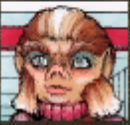
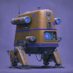

# Corpus Reus (Part 5) 

 
<b>Session started at 2025-09-19 / 21:09</b>
 
Fantasy Grounds - v4.8.3 ULTIMATE (2025-09-09) 
Fen's StarTrekAdventures Ruleset (v1.1.5)  
*[Prioritized Source: File; Other Sources: Vault]* 
*Core RPG ruleset (2025-09-09) for Fantasy Grounds
Copyright 2025 Smiteworks USA, LLC* 
*Fen's STA House Rules (v1.0.1) * 
*FG Browser v1.2.3* 
*[Prioritized Source: File; Other Sources: Vault]* 

>INTERIOR - Briefing Room: The senior staff converge on the briefing room under the faint blue glow of the emergency lighting. As they arrive, they enter to find Ensign Ghex lighting candles and placing them on the briefing room table. 

**Lt. Cmdr Malat** What's with the candles? 
**Ensign Ghex** Oh, you know I figured since it was kind of dark with the emergency lighting and we need to keep power usage to a minimum to avoid giving away our position to the Roral, the candles seemed like a nice way to brighten up the room a little bit. 
**Hailey Murry** We still have men on the station, don't we? 
*Lt. Cmdr Malat wordlessly flicks on a standard issue flashlight and pulls the jacket forward to convert it to lantern mode.* 
**Lt. Cmdr Malat** Yeah, I left a security team behind 
**Zox** This is amazing planning Ghex.  
**Zox** So we need to create a diversion before we can pick up our crew and warp out. 
**Ensign Ghex** Or we can just hide and hope they don't notice us, I powered everything down and used the maneuvering thrusters to match the drift of the surrounding junk vessels. The Lister is pretty old, so we kind of also look like space junk.  
**Skig** Umm.... 
**Hailey Murry** But we still have the crew on the station, they'll certainly go there 
**Lt. Cmdr Malat** Yeah, I don't think hiding is going to work long term, once they figure out that we were on that medical ship they're going to search the yard 
*Skig contemplates spacing Ghex, but realizes that would probably get Bachar mad at her.* 
**Zox** And we still have a few of them frozen.... 
**Zox** Yerp. 
**Skig** Either our saboteur onboard or the broken ODN line will have tipped them off that someone has been nosing around, and that someone was unlikely to escape. I would not give us a long time before they locate "Constitution-shaped object" among the debris. 
**Captain Bachar** I'm inclined to agree, Ghex may have bought us a little time but we shouldn't get comfortable here 
**Hailey Murry** They're probably the ones who set up all the mines over there as well 
**Captain Bachar** We need an escape plan, suggestions? 
**Hailey Murry** I'm surprised they were able to get here so quickly 
**Hailey Murry** What direction did they appear from? 
**Ensign Ghex** Well... so ma'am, the thing is, I originally thought that the signal from the Roral was just interference. So I was actually trying to apply a high pass filter to the navigational sensors to filter it out, rather than get a precise bearing. Which is to say, that I um... didn't really take a bearing on it 
**Hailey Murry** You are sure its the Roral, though?  
**Ensign Ghex** Oh yeah, it exactly matches the warp signature that Lt. Commander Viraseti reconstructed. 
**Zox** What if we magnitize their hull and turn all the garbage into a weapon?  
**Skig** We could use the maneuvering thrusters to point us at a clear path from the debris field, use the particle injection matrix to immediately jump to warp after we remove the safety overrides from the ship and then kick us into warp 7. Of course, there is a reason Starfleet has removed that option from every other ship in the fleet. Something about fusing all organic matter into the bulkheads. 
**Lt. Cmdr Malat** Well, that would certainly distract them for a bit. I'm not sure how we would magnetize their hull though. 
*Skig reconsiders now that she is First Officer.* 
**Hailey Murry** Given the mines they have scattered throughout, it'd probably do more than distract 
**Ensign Ghex** Wow, so uhm.. Well the first officer's plan is interesting, but I think that it would reduce the crew to a uniform homogenate. 
**Skig** Actually, let's not do my idea until we run out of others. 
**Skig** Yes Ghex, there is a chance we would all turn into sentient doors. 
**Hailey Murry** Geret already does that frequently enough 
**Skig** They realistically do not know what ship is here. We could launch a shuttlecraft and have it distract the Roral away from the Lister. 
**Hailey Murry** Did anyone spot any ships that would be a good contender? If we find a good one, we could lure the Roral close to one of the mines like that 
**Zox** A good EVA spacewalk! Just what we needed! 
**Skig** Kal'aakor's station is still powered up. 
**Captain Bachar** Alright, but you need to be extremely careful 
**Zox** Yes Ma'am! 
**Skig** We need to pick up the people over there anyway, we don't we just activate his sensors/scanning/defense grid and pick the Roral as the target for "failure to pay"? 
**Captain Bachar** These are anti-ship mines, so your EVA suits will be too small to set off their proximity sensors. But if you accidentally set one off, you'll all be instantly vaporized 
**Zox** Windbloom likes vaping though.  
*Zox smirks at camera.* 
**Hailey Murry** Oh, that's a really good point, Skig 
**Lt. Cmdr Malat** There's no reason we can't do both. Zox can lead the team to reprogram the mines, Skig and I can head over to the station 
**Lt. Cmdr Malat** Hit them from both sides 
**Hailey Murry** Probably don't be near the mines when we set things off, though 
**Zox** Well be far away if we get started soon 
**Skig** That works for me. 
**Lt. Cmdr Malat** I also wouldn't want to be on the station when it opens fire, the Roral will shred that place in a matter of seconds once it responds 
**Kolea** I will make sure to save a copy of Zox and everyone with him in the Transporter Buffer. 
*Skig issues a fire extinguisher to Zox.* 
**Zox** Thanks! 
**Ensign Ghex** I'll have the transporters on standby, if you set off the mine I'll try to beam you out. But if it comes to that, it will give away our position. 
**Ensign Ghex** But giving away our position is probably better than you being turned into a loose collection of atoms spread over half the salvage yard.  
**Captain Bachar** Let's to avoid that outcome. Assemble your away teams, dismissed. 
*Zox salutes.* 
Masakari (Tal'oran): spacesuits are fine because if this works, we can transport out because the Cardassians will be preoccupied. 
**T'kor: [ CONTROL  (11) +  ENGINEERING  (4)]
[Successes: 2] [Complications: 0]
Success with 1 momentum [2d20 = 18]** 
Masakari (Tal'oran): 'Fishbowl + garbage bag + duct tape' 
**Skig** We need Tal'oran for her heavy weapons skills, and we need Geret to be our breeching unit to get into the station. 
**Tal'oran** Big guns! ooh yeah 
*T'kor puts together a large, transparent orb with reinforced beams along the plexiglass exterior, with small propellers in each of the 6 cardinal directions for motion, as well as a few for rotational positioning* 
>INTERIOR - Kolaakor's Station - Malat, Skig, Tal'oran and Geret don EVA suits and head over to the station. In the distance, they can see the Roral, hanging ominously in space just outside the salvage yard. Upon entering through the docking bay, they find 2 of Malat's security team still guarding the Lister escape pod which was left behind on the station. 

**Tal'oran** Horta breeching unit, absolultey brilliant.  
Masakari (Tal'oran): 'ion thrusters' 
*Skig slaps a "Buy Now from the Online Web Store to Support Our Show" bumper sticker on the side of the Horta-suit.* 
**Skig** Report? 
**Redshirt** Well, we saw an alert of a new ship entering sensor range, and we tried to call the lister but we couldn't raise her on the comms. 
**Redshirt** I suppose that's probably why you came in an EVA suit though. Did the Lister explode? 
**Tal'oran** Not a chance. 
**Tal'oran** Can you show us to the security room? We have plans for this place. Big. Plans. 
**Redshirt** Yes ma'am, that doesn't sound like it will end badly for me at all. 
*Redshirt leads the away team back to the conrol room.* 
**Tal'oran: [ INSIGHT  (9) +  SECURITY  (4)]
[Focus: Heavy Weapons ]
[Successes: 2] [Complications: 0]
Success with 1 momentum [2d20 = 18]** 
**Tal'oran** What do we have to play with tonight?  
**Skig** Don't worry Ensign Redshirt #4, I am entirely certain you will experience no downsides from this plan whatsoever. 
**Tal'oran** I want the finest banned bootleg antimatter cannons available... 
*Skig hands him a "Next of Kin" form.* 
*Skig checks to see what the station reactor and power systems look like, just in case it is necessary to detonate the whole yard.* 
**Skig: [ REASON  (10) +  ENGINEERING  (5)]
[Successes: 2] [Complications: 0]
Success with 1 momentum [2d20 = 19]** 
**Tal'oran** Okay, not the show stoppers we wanted. That's okay.  
**Tal'oran** Can we overlclock some older disruptor arrays if we aren't concerned with core stability in the long run? 
**Tal'oran** Get 'ery last drop of bang outta these antiques? 
**Geret: [ FITNESS  (11) +  SECURITY  (2)]
[Successes: 2] [Complications: 0]
Success with 1 momentum [2d20 = 13]** 
*Tal'oran looks at Geret.* 
**Lt. Cmdr Malat** I like the thinking, Skig can crank the fusion generator to max power and dump it all into the distruptors 
**Tal'oran** What's that? A clue? Where?  
*Geret thumps around, using her keen horta senses to seek out potential objects of interest * 
**Tal'oran** One 'helluva shot, that's all we are budgeted for here. 
**Tal'oran** Don't even need to be around for it. 
**Skig** Really, overcharging the engines and causing a reactor overload is quite normal for this group. 
**Tal'oran** One final salute here, for the Krazy'est deals in the Alpha Quadrant. 
>As the away team are poking around in Kolaakor's office, they hear the console chime with the notification of an incoming hail. 

*Skig turns on the audio only option.* 
**Skig** Krazy Kaalakor's what do you want? 
**Comms voice** Who are you? Where is Kolaakor? 
**Skig** I'm Risenda Kalabor, an ex-girlfriend that came to see if this low-life bastard actually made something of himself and stop stiffing me from child support. 
**Skig** Who are you? 
**Comms voice** Put Kolaakor on the line, I need to speak with him 
**Skig: [ PRESENCE  (8) +  SECURITY  (3)]
[Focus: Master of Disguise ]
[Successes: 2] [Complications: 0]
Success with 1 momentum [2d20 = 11]** 
**Skig** Only if you can help me find him. Can you believe that piece of space junk bailed on me? 
**Comms voice** Very well, I will run a scan. 
**Comms voice** Stand by 
**Comms voice** I...  
>The comms channel suddenly cuts off. 

*Skig runs a scan to see what the Roral is up to.* 
>The Roral is on an intercept course for the station, ETA 2 and a half minutes 

**Skig: [ DARING  (10) +  ENGINEERING  (5)]
[Successes: 0] [Complications: 1]
Failed on DC: 1 [2d20 = 37]** 
>Skig inadvertently shorts out the sensors while trying to get a better fix, blinding the station. 

**Skig** Whoops, these buttons were clearly designed for "Not Tellerite Fingers". 
**Geret:  [2d20 = 21]** 
Masakari (Tal'oran): Please not Gourmagander.... 
**Geret:  [d20 = 18]** 
**Geret:  [d100 = 90]** 
**Geret: [ FITNESS  (9) +  COMMAND  (4)]
[Successes: 2] [Complications: 0]
Success with 1 momentum [2d20 = 10]** 
*Geret checks her reflection* 
*Lt. Cmdr Malat Geret sneezes and pops into the form of the Trill that she previously tussled with as a big bird* 
>Geret sneezes and pops into the form of the Trill that she previously tussled with as a big bird 

**Geret** Well well well, birds of a feather 
**Lt. Cmdr Malat** Well, the Roral is on its way over here.  
**Lt. Cmdr Malat** I hope you have a plan ma'am 
*Tal'oran looks to Geret, master of spycraft, for what to do.* 
**Geret** Quick, I need to swap out my gear for a redshirt's, stat!  
**Redshirt** Oh, you need my clothes? Okay, I guess. Weird request, but... 
*Redshirt gets undressed* 
**Skig** Tal'oran, prep the big boom surprise. 
**Geret** No not yours, they'll notice a naked redshirt faster than Kolea 
**Tal'oran** On it boss! 
**Skig** Geret, whatever your idea is to pull them closer and get them ready for a crippling explosion. 
*Tal'oran blows a kiss to the antique guns of the station.* 
**Skig** Malat, round up everyone and get ready for emergency evac. 
**Lt. Cmdr Malat** Aye ma'am 
*Lt. Cmdr Malat starts gathering her security team.* 
**Geret** Oh wait... we might not want them suspicious of the real spy, because we're planning to help her pull a turncoat 
*Skig looks at naked Redshirt.* 
**Skig** You are... out of uniform. 
**Redshirt** Yup, it's a bit cold  
**Redshirt** I don't know Geret told me to take them off, but I assume she had a good reason 
**Skig** You can put your clothes back on, I will assume this is a side effect of whatever the transformation does to her brain. 
**Skig** Also, I think you should get that flaccid thing checked by Kolea when you get back. 
**Geret** Sorry, Commander. I was planning on sending them a cryptic message, just a partial one, but if I do that then they'll go after the real spy and question her. We want her on our side, so that'd just hurt us in the long run 
**Skig** How does a naked redshirt help with this? 
**Tal'oran** because then he can't be a redshirt and will live? 
**Geret** I was going to put on the Red Shirt's outfit, so that it looked like I'd blended in with the crew 
**Geret** But the trench coat is too big... 
**Skig** I mean, if Zox suggested such a thing and somehow pulled out a large vat of lard and some butter, I would call it "Tuesday" and continue on my day. 
**Skig** Okay, do we have internal sensors to see where they are? 
**Tal'oran** Ive never seen Geret get this into one of her memories.... 
**Tal'oran: [ CONTROL  (8) +  SECURITY  (4)]
[Focus: Clue Analysis ]
[Successes: 2] [Complications: 0]
Success with 1 momentum [2d20 = 19]** 
**Skig** Let's assume they will transport to the command room, so let's see if our saboteur left some extra explosive goodies behind. 
**Skig** Malat, get your team ready to spray the area with phasers set to stun if they transport in. 
**Skig** Worst case, we fighting retreat away and keep them occupied long enough for Tal'oran to punch a hole in their ship and melt down the reactor in the process. 
**Skig** Any questions or drastically better ideas? 
**Geret: [ REASON  (10) +  SECURITY  (2)]
[Successes: 2] [Complications: 0]
Success with 1 momentum [2d20 = 21]** 
**Tal'oran: [ REASON  (8) +  SECURITY  (4)]
[Focus: Criminology ]
[Successes: 0] [Complications: 0]
Failed on DC: 1 [d20 = 13]** 
>As the away team take up possitions, Geret and Tal'oran finish arming some anti-personel warheads they found in Kolaakor's stocks. They retreat just as they hear the hum of a transporter, and a Cardassian military drone materializes in the center of the control room 

>[ROUND 1] 

>Just outside the control room, 2 more drones are materializing in the hall and in the front of the shop. 

**Tal'oran:  [Total: 7] [Effects: 1] [6dChallenge = 7]** 
>The IED explodes, damaging one of the combat drones. It turns on its remaining 3 legs and begins to scan the room with its sensors. 

**Cardassian Military Drone** ENGAGING HOSTILE TARGETS 
**Skig** Damn you, I am not interested in marriage! 
**Geret:  [2d20 = 39]** 
Masakari (Zox): WHAMMY  
**Geret:  [d20 = 2]** 
Masakari (Zox): Needed the space Yeti.... 
**Geret:  [d20 = 7]** 
>Geret sneezes and pops into the form of a Denobulan. The drone turns toward the sound. 

*Skig trusts Geret to distract the enemy.* 
*Skig adjusts her phaser to "control system disruption" and "wide field" so it can hit multiple areas on the drone and trigger a circuit loop.* 
**Skig: [ DARING  (10) +  ENGINEERING  (5)]
[Successes: 1] [Complications: 0]
Success with 0 momentum [2d20 = 24]** 
>[TURN] Skig 

>Skig opens fire, missing the drone but revealing her position.  

**Cardassian Military Drone** RETURNING FIRE ON HOSTILE TARGET 
>The drone locks onto Skig and opens fire with a disruptor, hitting her with a blast would incapacitate a lesser woman. 

>[TURN] Cardassian Military Drone 1 

**Tal'oran: [ DARING  (11) +  ENGINEERING  (2)]
[Successes: 2] [Complications: 0]
Success with 1 momentum [2d20 = 12]** 
**Tal'oran: [ FITNESS  (7) +  SECURITY  (4)]
[Successes: 0] [Complications: 0]
Failed on DC: 1 [2d20 = 31]** 
**Tal'oran** Malat! use the grinder! 
>Tal'oran begins wrasslin with the combat drone, but is not able to move it with her puny muscles 

>[TURN] Tal'oran 

>[TURN] Cardassian Military Drone 3 

**Cardassian Military Drone** ENGAGING TARGET AT CLOSE RANGE 
*Cardassian Military Drone opens fire on Tal'oran* 
**Skig** The drones do make sense given the small crew on such a large Cardassian ship. 
>The drone hits Tal'Oran squarly in the chest, dropping her to the bulkhead 

>[TURN] Geret 

*Hailey Murry scuttles up the wall like a gecko, scampering up with alarming speed. She leaps off toward the Cardassian Bot #3. "Horta Hug!"* 
*Geret scuttles up the wall like a gecko, scampering up with alarming speed. She leaps off toward the Cardassian Bot #3. "Horta Hug!"* 
**Geret: [ FITNESS  (11) +  COMMAND  (4)]
[Successes: 1] [Complications: 0]
Success with 0 momentum [2d20 = 25]** 
**Geret: [ DARING  (9) +  SECURITY  (2)]
[Successes: 2] [Complications: 0]
Success with 1 momentum [2d20 = 11]** 
**Geret: [ FITNESS  (11) +  SECURITY  (2)]
[Successes: 1] [Complications: 0]
Success with 0 momentum [2d20 = 22]** 
>Geret tries to shove the bot into the grinder, but is not able to forcibly move it 

>[TURN] Cardassian Military Drone 2 

>The third drone slowly lumbers in and fires on Malat 

**Geret** GRRR! This would be... much easier... as a... Horta... 
>It lands a direct hit, but Malat stays on her feet. 

>[TURN] Lt. Cmdr Malat 

>[ROUND 2] 

**Skig** I have a plan, it is a bad one, but then they usually are. 
>[TURN] Skig 

**Skig: [ FITNESS  (10) +  CONN  (2)]
[Focus: Survival ]
[Successes: 0] [Complications: 0]
Failed on DC: 1 [2d20 = 33]** 
Masakari (Tal'oran): do not turn into a metal alien now. please.  
**Geret:  [2d20 = 28]** 
**Geret:  [d20 = 10]** 
Masakari (Tal'oran): THE WHALE LIVES. 
>Geret sneezes and turns into a Gormagander, burying one of the drones under her massive body 

indarien (Skig): I mean... I would be slightly worried where Geret would just get pulled into the grinder because she is large and cannot move and it is running. 
>[TURN] Cardassian Military Drone 1 

>The drone detects the presence of the gormagander, and activates its Wildlife Preservation Module, which was installed against the wishes of Cardassian central command as part of the arms control treaty with the Federation. It targets the outer hull and blasts a huge hole in it, exposing the station to vacuum to protect the critically endangered Gormagander from atmospheric exposure 

>♫♫♫Ominous Music Sting♫♫♫ 

>---------CUT TO COMMERCIAL------- 

