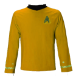
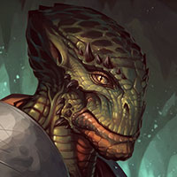

# Articles of Faith (Part 1) 

 
<b>Session started at 2025-10-07 / 04:04</b>
 
Fantasy Grounds - v4.8.3 ULTIMATE (2025-09-09) 
Fen's StarTrekAdventures Ruleset (v1.1.5)  
*[Prioritized Source: File; Other Sources: Vault]* 
*Core RPG ruleset (2025-09-09) for Fantasy Grounds
Copyright 2025 Smiteworks USA, LLC* 
*Fen's STA House Rules (v1.0.1) * 
*FG Browser v1.2.3* 
*[Prioritized Source: File; Other Sources: Vault]* 

>Captains Log, Stardate 62200.5: We are en route to the Pelarian System to respond to a request for engineering assistance from a Federation Anthropolgy team based there.

In the meantime, Zox has requested leave to return to his home planet to attend a funerary rite for his sister. I am somewhat concerned about the request for a pilot in case he is "incapacitated" so I have asked Kolea to accompany him as well.  

>INTERIOR - Shuttlecraft: Zox, Geret and Kolea arrive at the shuttlecraft that Bachar has approved for them. As they enter, they find Ghex sitting at the conn completing her preflight checks. When Zox enters she pops up and nervously half-salutes, half-waves 

**Zox** Hello! 
**Zox** Tired of big ships? 
**Ensign Ghex** Uhm, I saw the request for a pilot sir, and I know that there are other pilots on board and you don't really need me and stuff. I mean, any pilot can handle ferrying you back-and-forth to your planet. It's not like this is some dangerous mission or anything, and theoretically it is a bit "low-level" for the chief conn officer... But, uhm... I was hoping I could go, because I am sort of kind of responsible for your sister's death.  
**Ensign Ghex** If you don't mind that is.  
**Ensign Ghex** I can also leave. I should probably leave, now that I think about it 
**Ensign Ghex** This was kind of maybe a pretty bad idea 
**Zox** Eh, things happen. 
**Kolea** Ghex, it is okay and I think you should come with us. 
**Kolea** It is a natural tendency to both feel guilt and want to atone for mistakes. 
**Zox** It's either flying or making a fuss over the right preparations. This is more natural. 
**Zox** The roar of thrusters, easy flying...what's not to love? 
**Ensign Ghex** Ok, in that case I'll try not to get shot down and crash into a greehouse this time. 
**Kolea** I have confidence in your flying skills, you will do fine. 
>As Ghex turns back to the conn to complete her preflight checks, Lt. Commander Viraseti walks into the shuttle dragging a large travel case behind her. She shoves the case into the under seat storage in the back of the shuttle and sits down reading a PADD without saying a word to anyone 

**Geret** And I'll do my best to not accidentally shapeshift into Zox's sister, because that would be very awkward for you.  
**Geret:  [2d20 = 22]** 
**Geret:  [d20 = 4]** 
**Zox** I mean...It would end worse for you Geret. They may think you undead. 
Masakari (Zox): still healthier than a horta ex 
**Kolea** Viraseti, packing for a long trip? 
**Lt. Cmdr Viraseti** Something like that 
**Kolea** I see. 
**Zox** Whatcha bringing there? 
**Geret** Come forth, for we shall embark upon a journey through the skies of yonder planet!  
*Kolea drops her "medical bag" on a shelf.* 
**Lt. Cmdr Viraseti** Geret is carrying a Harp and a bow and arrow 
**Lt. Cmdr Viraseti** Why do you care what's in my bag? 
**Zox** Dieties are predictable. I don't have to harp on their gear. 
**Geret** I had G'ralan put a phaser into the bow, so it can actually shoot as long as I go through the motions! 
**Lt. Cmdr Viraseti** Well, I don't want to spoil the surprise 
**Lt. Cmdr Viraseti** So you'll just have to wait 
**Zox** Fair enough! 
**Ensign Ghex** Ok, wow this shuttle trip is going to be way weirder than I was expecting 
**Ensign Ghex** I'm ready to leave though, everyone take your seats and prepare for departure 
**Zox: [ CONTROL  (11) +  COMMAND  (2)]
[Successes: 2] [Complications: 0]
Success with 1 momentum [2d20 = 19]** 
**Geret** A god need not sit! We stand proud! 
**Zox** make it so! 
>Ghex pilots the shuttle up and out of the aft shuttle bay as Geret stows her harp and phaser bow safely under her seat 

**Kolea** Ghex, you should have come to expect this by now. 
Masakari (Zox): Fun to have two RNG give us two gimmick TOS aliens. 
>INTERIOR - Brig: Skig, Hailey, Malat and some guy head to the brig to interrogate the prisoners. On the monitors, they can see Krepeka's body, McCallister, and a Cardassian in three separate cells. 

KruschtyaEquation (Hailey Murry): lmao "and some guy" 
**Darisha-Han** Darisha here, wanting to learn who what where why when about our prisoners, reporting for duty Skig. 
**Darisha-Han** Details details details, we are gonna want to know them! 
**Skig** You seem vaguely familiar. 
**Darisha-Han** Ghex is my third aunt's neice. Everyone simply knows everyone! 
**Lt. Cmdr Malat** Well I just hope you don't talk as much 
*Darisha-Han continues writing on a pad made of synthetic paper.* 
**Darisha-Han** Talk? no Ma'am im here to learn! 
**Lt. Cmdr Malat** Who do we want to question first? I can bring them into an interrogation room. 
**Skig** Heads, MacAllister, Tails Cardassian. 
**Skig:  [Total: 1] [Effects: 0] [dChallenge = 1]** 
**Skig** Cardassian it is. 
>Malat gestures to a junior security officer who accompanies her into the cells, and they then return with the Cardassian prisoner and sit him in the chair in the interrogation room. He does not react at all. 

*Skig sits down across from the Cardassian.* 
**Skig** Hello. 
*Cardassian Man continues to sit silenty.* 
**Skig** Can I get you something to drink? 
*Darisha-Han Scribbles 'Cardassian with a vendetta against dinosaurs gives Skig the silent treatment;* 
*Cardassian Man leans back in his chair, ignoring Skig* 
**Lt. Cmdr Malat** I've had my share of experience dealing with Cardassian intelligence officers, they usually don't start talking until you remove a few fingers 
**Skig** Too obvious. 
**Lt. Cmdr Malat** It's fun though 
**Lt. Cmdr Malat** Why don't you go replicate a Raktajino and I'll take over for a minute 
**Hailey Murry: [ INSIGHT  (13) +  SECURITY  (3)]
[Focus: Diplomacy ]
[Successes: 2] [Complications: 0]
Success with 1 momentum [2d20 = 16]** 
**Darisha-Han: [ INSIGHT  (9) +  SECURITY  (4)]
[Focus: Journalism ]
[Successes: 0] [Complications: 0]
Failed on DC: 1 [d20 = 14]** 
**Hailey Murry** We had a few questions for you here. Probably not the ones you're expecting.  
**Hailey Murry** Do you recognize this gentleman?  
*Darisha-Han With keen insight, Hailey tries to shatter the implacable, iron-clad facade of the Cardassian agent.* 
**Skig** Do you have the rest of them, or should I get pictures of the others? 
**Hailey Murry** We're really hoping to be able to identify them. They were extracted under difficult circumstances. 
**Hailey Murry** We can cycle through 
**Hailey Murry: [ INSIGHT  (13) +  SECURITY  (3)]
[Focus: Diplomacy ]
[Successes: 1] [Complications: 0]
Success with 0 momentum [2d20 = 31]** 
**Darisha-Han: [ INSIGHT  (9) +  SECURITY  (4)]
[Focus: Cryonics ]
[Successes: 1] [Complications: 0]
Success with 0 momentum [d20 = 8]** 
**Darisha-Han** Yessss! Unconvential Lister tactics, renowned through the quadrant, melt the most redoutable stoic! 
**Darisha-Han** Oooh oops.  
**Lt. Cmdr Malat** I have melted Cardassians before 
*Skig offers Darisha a stick of bubblegum and the opportunity to stay quiet.* 
*Darisha-Han acceps the gum* 
**Hailey Murry** Due to the circumstances in the junkyard after your... well, presumably your comrades, killed its owner and caused such a ruckus, we had to do something with them 
**Hailey Murry** Are you willing to help us help them?  
**Skig** Many Cardassians melted in the Dominion War, I prefer not to melt more without cause. 
**Cardassian Man** I will gladly help you. Release me and I will give you a quick and painless death 
**Skig** Well, that's unfortunate. 
**Cardassian Man** They are beyond help, they are already dead. 
**Skig** Actually, no, they are not. 
**Hailey Murry: [ PRESENCE  (10) +  MEDICINE  (4)]
[Focus: Diplomacy ]
[Successes: 3] [Complications: 0]
Success with 2 momentum [2d20 = 8]** 
**Hailey Murry** They're all very painstakingly alive 
*Darisha-Han resist the urge to sell next generation cyronic technologies.* 
**Skig** But as a Cardassian, what do you need a pile of dead Cardassians for? 
**Cardassian Man** Your foolish Federation optimism cannot undo their deaths, they may still have a handful of heartbeats, but they are dead. 
indarien (Skig): But, Darisha, Next Generation is no longer making new episodes and in syndication. Clearly we need to sell the Discovery Cyronic Technologies! 
**Hailey Murry** Wait, so you're not the one who had them in stasis?  
Masakari (Darisha-Han): I can't figure out if franchises spoil, or getting things right is just a matter of serendipity.  
*Skig blinks and looks at Malat.* 
**Skig** I missed something, when did we develop "optimism" on this ship? 
**Hailey Murry** We have a lot of optimism 
**Skig** I don't mean the cryptocurrency relays running through the sensor system. 
*Darisha-Han ponders using the holodeck to get information out of Cardassian Man* 
*Darisha-Han passes a note to Hailey Murry suggesting this strategy.* 
indarien (Skig): I think geeting things right is a matter of "serenity" and then it gets killed by executives. 
**Skig** Well, so back to the question, they are almost dead. What do you need a pile of dead Cardassians for? 
*Lt. Cmdr Malat passes a note saying that this guy isn't going to say anything unless you let her torture him* 
*Skig passes note from Malat to Murry.* 
**Hailey Murry** Or a pile of almost-dead Cardassians 
*Darisha-Han passes a note wanting details on the various torture methods, approved and unapproved, that she would employ, and also how many lights there really are* 
*Skig passes note back to Malat, "Do Cardassians have kneecaps and do they know what they taste like?"* 
**Cardassian Man** We all have our duty. It is not your place to question it 
**Hailey Murry: [ INSIGHT  (13) +  SECURITY  (3)]
[Focus: Deception ]
[Successes: 3] [Complications: 0]
Success with 2 momentum [2d20 = 6]** 
**Skig** Whose duty to you think we are questioning? 
**Skig:  [3d20 = 35]** 
**Hailey Murry** I don't think you really know what these bodies are for 
indarien (Skig): OMG. I just found the Star Trek Junior Officer repair kit. This is the best table ever. 
**Hailey Murry** I think we're done, he doesn't even know where these bodies came from 
**Hailey Murry: [ PRESENCE  (10) +  SECURITY  (3)]
[Focus: Deception ]
[Successes: 1] [Complications: 0]
Success with 0 momentum [2d20 = 31]** 
**Skig** Or what they are being kept for. 
*Darisha-Han nods enthusiastically, antenae bouncing. * 
**Skig** Or what their duty is. 
**Cardassian Man** Of course I know where they came from. 
**Cardassian Man** I am not a fool stumbling blindly in the dark like you. I KNOW my duty 
*Skig waits for the "when two Cardassians love each other very much" joke.* 
*Cardassian Man is getting increasingly angry and raising his voice* 
**Hailey Murry** Do they even have a duty anymore? After all, they are... what was it, "basically dead"? 
**Cardassian Man** They lived for Cardassia, they died for Cardassia, and in death they will serve Cardassia 
*Darisha-Han oooh ooh, an esoteric question from Hailey!* 
*Darisha-Han produces a cigarette that blows bubbles. * 
**Cardassian Man** You Federation types with your valuable "individualism" will never understand the purity of our duty to Cardassia. 
**Darisha-Han** This guy is a little bit of a square, any chance doc windblooom has something to fix this? 
*Darisha-Han continues to blow bubbles with a cigarette.* 
**Skig** Very well, what is their duty to Cardassia? Because if it is importabt, it should be honored. We Federation types best understand other cultures when the opportunity to see things from their perspective. 
*Cardassian Man stands up out of his chair* 
**Skig** As our CMO keeps telling me, Truth is a Triple Edged Sword, so stab me with your best example of what the duty of a Cardassian is. 
*Skig remains completely unflustered and seated.* 
**Cardassian Man** You mock our duty, our commitment to Cardassia! These men died in service to an ideal. You live soft lives, easy lives, you will never understand what it means to serve without reservation. 
*Cardassian Man is now shouting* 
*Skig blinks.* 
**Cardassian Man** You want to know their duty? You want to understand their purpose? The purpose for which their deaths have been postponed? You will understand soon enough. 
**Cardassian Man** FOR CARDASSIA! 
**Darisha-Han: [ INSIGHT  (9) +  COMMAND  (1)]
[Focus: Journalism ]
[Successes: 3] [Complications: 0]
Success with 2 momentum [2d20 = 7]** 
*Cardassian Man dives and Skig and attempts to throttle her* 
*Cardassian Man grabs Skig around the throat while yelling.* 
>♫♫♫Ominous Music Sting♫♫♫ 

>---------CUT TO CREDITS-------
♫♫♫Opening Theme♫♫♫ 

>Season 2, Episode 6: Articles of Faith
Written by Leon Berger
Directed by Diana Abrams 

# Articles of Faith (Part 2) 

 
<b>Session started at 2025-10-13 / 21:06</b>
 
Fantasy Grounds - v4.8.3 ULTIMATE (2025-09-09) 
Fen's StarTrekAdventures Ruleset (v1.1.5)  
*[Prioritized Source: File; Other Sources: Vault]* 
*Core RPG ruleset (2025-09-09) for Fantasy Grounds
Copyright 2025 Smiteworks USA, LLC* 
*Fen's STA House Rules (v1.0.1) * 
*FG Browser v1.2.3* 
*[Prioritized Source: File; Other Sources: Vault]* 
*Fen's StarTrekAdventures Ruleset (v1.1.5) * 
*[Prioritized Source: File; Other Sources: Vault]* 
*Core RPG ruleset (2025-09-09) for Fantasy Grounds
Copyright 2025 Smiteworks USA, LLC* 
*Fen's STA House Rules (v1.0.1) * 
*FG Browser v1.2.3* 
*[Prioritized Source: File; Other Sources: Vault]* 

>INTERIOR - Brig: The captive Cardassian lunges at Skig while shouting and tries to throttle her, his eys are red with rage and his neck is bulging. 

**Skig: [ FITNESS  (10) +  SECURITY  (3)]
[Focus: Starship Tactics ]
[Successes: 2] [Complications: 0]
Success with 1 momentum [2d20 = 19]** 
*Skig kicks the table into the lunging Cardassian as he tries to reach her.* 
**Skig:  [Total: 6] [Effects: 1] [4dChallenge = 6]** 
**Darisha-Han: [ CONTROL  (7) +  SECURITY  (4)]
[Successes: 0] [Complications: 0]
Failed on DC: 1 [2d20 = 29]** 
>The cardassian finds his legs dissapear from underneath him, and he tumbles over the table, hitting his head on the edge as he crumples into a harmless pile at Skig's feet. 

**Skig** Hmm... Malat, make a show of dragging him back to his cell, feel free to whack him a couple times, right in front of MacAllister. 
**Skig** Then I think we need to talk to MacAllister. 
**Lt. Cmdr Malat** Yes ma'am, I'll be right back 
*Lt. Cmdr Malat grabs the Cardassian by his ankle and drags him (face-down) out of the interrogation room and back to his cell. His head painfully smacks into the deck every time Malat crosses over a door threshold.* 
*Hailey Murry waits until he's out of ear shot before continuing. * 
**Hailey Murry** Well, that's one lead down 
**Darisha-Han** What would make Federation member turn? What troubled past do we have today? Crewman McAlister! 
*Crewman McAllister Malat returns a few moments later with McAllister in tow, she sits him at the interrogation table* 
>Malat returns a few moments later with McAllister in tow, she sits him at the interrogation table 

*Darisha-Han offers McAllister a pack of cigarettes.* 
*Skig crosses arms and sits across from MacAllister.* 
*Darisha-Han wonders if she has done her homework right, humans LOVE smoking during interrogations.* 
*Crewman McAllister ignores Darisha-Han and stares directly at Skig* 
**Hailey Murry** Good evening, Crewman 
**Crewman McAllister** Ma'am 
*Skig waits patiently for Murry to proceed, while staring at MacAllister with her arms crossed.* 
**Hailey Murry: [ INSIGHT  (13) +  COMMAND  (2)]
[Successes: 2] [Complications: 0]
Success with 1 momentum [2d20 = 21]** 
**Darisha-Han: [ INSIGHT  (9) +  COMMAND  (1)]
[Focus: Journalism ]
[Successes: 1] [Complications: 0]
Success with 0 momentum [d20 = 2]** 
**Darisha-Han** Look Chief, I compiled a dossier on McAllister for you! 
**Darisha-Han** I guess we don't realize how interesting the crew members are if we cycle through them so fast. Or maybe that they live long enough to become the villians.  
**Crewman McAllister** Labeling people "villains" belies a small mind with a simplistic worldview 
**Hailey Murry** What about labeling people as "44 years old"?  
KruschtyaEquation (Hailey Murry): Oh redact that, I thought he was a lot younger 
**Darisha-Han** Ooh ooh, Ya gotta tell me. Was it Young Hailey's alcholism that made you feel without a counselor? Or did Windbloom give you a bad trip? What made you turn? 
**Hailey Murry** I imagine that was part of the plan from the beginning 
indarien (Skig): Dealing with Wife Aggro. 
**Crewman McAllister** I am still loyal to the Federation. I am not the one with a Founder for a captain. 
*Darisha-Han 's antenae excitedly wobling.* 
**Hailey Murry** Was that why you decided to turn on the Lister? 
**Darisha-Han** Oh even better! the edgy and reluctant anti-hero! 
*Darisha-Han scribbles on a notepad that was outdated 3 centuries ago.* 
**Crewman McAllister** Ma'am, I am not authorized to tell you anything. 
**Crewman McAllister** I hereby invoke my article 4 right to representation by an attorney.  
*Darisha-Han produces a rolodex out of no where and looks for Mr. Thundercock.* 
**Crewman McAllister** Contact the nearest Starfleet JAG posting and request a defense council. Until then, this interrogation is over. 
**Crewman McAllister** That Cardassian idiot may not understand Federation legal rights, but I certainly do. 
**Darisha-Han** Very well, we'll get you the best in the biz! 
**Darisha-Han** I don't understand how you are the brooding anti-hero though. You havent' taken a single, prolonged puff on those cigarettes, Where are your edgy one-liners? I need something to work with here! How are people supposed to understand the troubled set of events that occured here? where's the story! 
*Darisha-Han Looks deferential to her senior officer Hailey Murry.* 
**Crewman McAllister** You'll just have to wait for my trial. 
**Hailey Murry: [ PRESENCE  (10) +  SECURITY  (3)]
[Focus: Diplomacy ]
[Successes: 2] [Complications: 0]
Success with 1 momentum [2d20 = 12]** 
**Darisha-Han: [ PRESENCE  (10) +  SECURITY  (4)]
[Focus: Journalism ]
[Successes: 2] [Complications: 0]
Success with 1 momentum [d20 = 3]** 
*Crewman McAllister stands up and walks over to Malat to be led back to his cell* 
*Hailey Murry sighs* 
**Skig** MacAllister, hold for a minute. 
**Hailey Murry** Well, I suppose we'll see how that goes when the time comes 
**Skig** If the rest of you would give us a minute. 
**Zox** Kind Granny puts Romulans to shame with galaxy's shapest words! 
**Darisha-Han** Kind Granny puts Romulans to shame with galaxy's shapest words! 
>Malat steps out into the corridor 

**Skig** gestures for MacAllister to sit down. 
*Skig gestures for MacAllister to sit down.* 
*Skig waits for everyone else to leave.* 
*Crewman McAllister remains standing.* 
**Crewman McAllister** This won't take that long, I know my rights. This interrogation is over 
**Hailey Murry** He has invoked his right to representation, so there's a limit to what we can do here 
**Skig** That's fine. 
*Hailey Murry is hesitant about stepping out now* 
**Hailey Murry: [ INSIGHT  (13) +  SECURITY  (3)]
[Focus: Deception ]
[Successes: 2] [Complications: 0]
Success with 1 momentum [2d20 = 23]** 
**Skig** MacAllister, at this point, I'm mostly curious about some modifications you made to the botany lab. As far as I'm concerned, anything else is tangential. Rather curious, I was wondering where the collection of ideas came from? Most of them were rather brilliant. 
**Skig: [ PRESENCE  (8) +  ENGINEERING  (5)]
[Focus: Enhanced Interrogation ]
[Successes: 4] [Complications: 0]
Success with 3 momentum [2d20 = 10]** 
Masakari (Darisha-Han): BOOSH 
Masakari (Darisha-Han): It's obvious why he was doing botanical things, the guy is an obvious plant. 
indarien (Skig): LOL 
**Crewman McAllister** It was nothing special, just simple environmental overrides and sensor bypasses. Starship systems are very complex, but that complexity means that a small change in one area can have broader consequences downstream that can make it difficult to fully secure all ship's systems 
**Skig** Indeed, I have found similar issues with sensors and internal ship systems. Quite honestly, as leaky as things are, I am surprised most starships don't spend their days having ransomware removed. 
**Crewman McAllister** If you want my advice as a fellow engineer: securing environmental systems against tampering is an overlooked but important aspect of ship operation. Environmental systems are seen by most security officers as low-priority, but it is the one thing keeping the entire crew alive out here. 
**Crewman McAllister** I would recommend that you start with O2 and CO2 concetration sensors in the environmental control system. The sensor outputs are high-speed covariant signals, so they are insecure by default. But you can secure them using a narrow-band signal encrypter without any loss of throughput 
**Skig** It did take me the better part of a day to figure out how you had cross connected the logical ciruits between atmospheric controls and the replication dispensers. Excellent work, not something that I would have guessed from your profile. Seriously, I would write you a commendation for finding loopholes in environmental systems like that. 
**Crewman McAllister** It would make it much more difficult for anyone to puill the same trick in the future. 
**Skig** Noted, I will look in that suggestion along with a couple other systems. 
**Skig** Did your modifications extend to comms or internal sensors to adjust those as well? 
**Crewman McAllister** Oh, the internal sensors were no problem. Creating a blindspot on internal sensors is quite easy, it is a relatively straightforward matter to cross-couple the output from a sensor area relay back into a neighboring area, overriding its own sensor output 
**Skig** Fascinating, I've found a few of those, out of curiosity, have you helped Kolea with any of her tricks? I've found a few of hers which are mildly scary. For instance, the emergency caches that don't even register properly. 
**Lt. Cmdr Malat** No ma'am, whatever Kolea has done is on her 
**Crewman McAllister** No ma'am, whatever Kolea has done is on her 
*Crewman McAllister shakes Skig's hand and walks out* 
**Skig** Have a pleasant day MacAllister and thank you. 
*Skig puts down that if MacAllisters is good for a commendation along with being charged with attempted murder of multiple superior officers.* 
>Malat takes McAllister back to his cell, returning a short while later with Zerra (in his Krepeka suit) 

*Skig before Zerra-Krepeka walks in, Skig looks at Murry.* 
**Skig** All you, I'll say something if I think it is needed. And don't do anything that causes a medical emergency, since the person who stitched him back together isn't here. 
*Dr. Zerra sits down at the table, looking down at his feet.* 
indarien (Skig): Do we know how much of "Zerra" was perserved by Kolea's piles of good dice rolls? 
**Hailey Murry** How're you feeling, Doctor?  
**Dr. Zerra** Very... Breen 
indarien (Skig): So, gooey? 
**Dr. Zerra** I thought my movement assistance suit was uncomfortable, but this environment suit is so much worse 
**Hailey Murry** We're working on getting you back into your body, so hopefully we can get you into something more comfortable soon 
**Hailey Murry** Are your thoughts still in order, liquid body aside? 
**Dr. Zerra** As far as I know 
**Dr. Zerra** I am not sure I would really know if I had forgotten anything 
**Hailey Murry** I'm glad 
**Hailey Murry** That was an eminently reckless thing to have done 
*Hailey Murry sighs* 
**Hailey Murry** What lead to this? What's going on?  
**Hailey Murry: [ PRESENCE  (10) +  MEDICINE  (4)]
[Focus: Diplomacy ]
[Successes: 1] [Complications: 0]
Success with 0 momentum [2d20 = 29]** 
**Dr. Zerra** Oh you know, just facing the consequences for decisions I made a long time ago 
**Hailey Murry** There's got to be something we can do together to help out, to put a stop to this 
**Dr. Zerra** Maybe, maybe not. But it's out of my hands  
**Hailey Murry** Though perhaps I'm getting ahead of myself. Is "this" something you even want to put a stop to? 
**Dr. Zerra** I'll tell you what I know, for whatever that is worth. 
**Dr. Zerra** But it isn't as much as you might think. Sam operates on a "need to know" basis 
**Dr. Zerra** And I was here on the Lister with you for most of the past year and a half 
**Hailey Murry** Anything's helpful 
**Dr. Zerra** I only know that he wanted me to keep the captain under control, to make sure the Lister made it to certain points. To find some excuse to get Zox's mother on board, and to report to him on everything the crew did. 
**Hailey Murry** Do you recall which points we had to make it to?  
**Dr. Zerra** Well the main thing he wanted me to accomplish was to get Zox's mother on board. To see if she was conspiring with any members of the crew. But he also wanted to make sure we diverted to Skana IV for our repairs after the hull breaches you caused, even though there were other nearer facilities. 
Masakari (Darisha-Han): surprisingly intact memories. 
**Dr. Zerra** The research facility on Skana IV was already researching Ketracel White and, in retrospect, that must have been chosen to facilitate Jasanis' operation. 
**Hailey Murry** Do you know what their plans for the matrix were?  
**Dr. Zerra** I am not a biochemist, but my understanding is that Dr. Malov's procedure for refining Ketracel White uses founder morphogenic matrix as a stabilizer 
**Dr. Zerra** The Founders themselves apparantly use a similar method, it is why it is so hard to obtain Ketracel White from any other source. 
indarien (Skig): So Sam was organizing all this through Jasanis. It makes the scene where the Federation officers watch "fake Jasanis" (aka Browena) melted down by a long distance sniper disruptor come around as him cleaning up tracks along the way. 
**Hailey Murry** Okay, so potentially they were using it to produce larger amounts of Ketracel White?  
**Hailey Murry** How many Jem Hadar ships do they have now... 
**Dr. Zerra** I don't know, Sam never told me 
**Hailey Murry** Any idea what that cohort of near-dead Cardassians was about? 
**Dr. Zerra** But I know for sure they got one from the Black Hole near Sulani IV 
**Hailey Murry** Plus some from the junk yard, and some from the pacifists 
**Dr. Zerra** I have no idea on that one, if the Cardassians are involved with Sam he never mentioned it 
**Dr. Zerra** Like I said, he isn't real big on sharing 
*Darisha-Han listens in and hopes Dr. Zerra gets a good Lawyer, and also wonders what Krepeka is going through on Earth.* 
**Skig** I wouldn't expect him to be. The question is, where on the chess board does he sit. Any idea? 
**Dr. Zerra** Well ma'am, if I understand your analogy: I don't think he is on the chess board, I think he is playing it 
**Dr. Zerra** I should warn you, after they extracted me, I ended up at a facility where Sam had me continuing work that I assume Neraran must have started 
**Dr. Zerra** It was some kind of biogenic weapon, I don't know what the discriminator is, but it was a highly lethal nerve agent.  
**Skig** You understood the analogy perfectly, doctor. 
**Hailey Murry** That's dreadful 
**Hailey Murry** Also something that we need to doubly-secure the environmental systems for 
**Hailey Murry** Was it airborne?  
Masakari (Darisha-Han): Unusually cooperative. 
**Dr. Zerra** It wasn't yet at the stage of development that it would have a delivery mechanism, so I can't say. He had me running lab tests on various cell lines to document the effects of various different chemical architectures. 
**Skig** Did Sam ever specify what was so important about Ruhk? 
**Dr. Zerra** No, he just said she was the lynchpin of some kind of conspiracy  
**Dr. Zerra** He just wanted to see if she conspired with anyone on the crew 
**Skig** Seems completely plausible, we have found plenty of people who were conspiring to do something. 
**Hailey Murry** Who did you report she was communicating with? 
**Dr. Zerra** She wasn't, not that I could tell 
**Dr. Zerra (Comms)** Senior staff report to your duty stations, we are approaching the Pelarian system. 
**Captain Bachar (Comms)** Senior staff report to your duty stations, we are approaching the Pelarian system. 
**Skig** On our way. 
**Dr. Zerra** Wait, one last thing ma'am. 
*Skig pauses.* 
**Dr. Zerra** I don't know why, but the Lister is important to whatever Sam is planning. The whole reason he sent me back here was to keep an eye on what the Lister is up to 
**Dr. Zerra** If he wanted to, he could pull some strings and get the crew all reassigned to different ships across the fleet 
**Dr. Zerra** For some reason, he wants you all here, doing whatever it is you are doing 
**Dr. Zerra** So be careful 
**Skig** I concur, the Lister is very important. 
**Skig** Malat, would you escort the doctor back to his cell? 
**Lt. Cmdr Malat** Yup, play time is over, back in your box Doctor 
*Lt. Cmdr Malat escorts Dr. Zerra back the brig, as the senior staff depart for the bridge* 
indarien (Skig): Before heading to the brdige, Skig will suggest that MacAllister and or Cardassian #8 might try to eliminate Zerra on us. 
*Skig heads up to the bridge to see what is going on.* 
>INTERIOR - Bridge: Skig and the other senior staff arrive back on the bridge as Ghex is taking the Lister out of warp and entering the Pelarian system. Bachar is reviewing a PADD when they arrive. 

*Skig checks to see if Bachar looks vaguely like the out-of-place fifth chair that was in the interrogation room the whole time.* 
>INTERIOR - Bridge: Skig and the other senior staff arrive back on the bridge as the Lister drops out of warp and enters the Pelarian system. Bachar is reviewing a PADD when they arrive. 

**Darisha-Han: [ CONTROL  (7) +  CONN  (3)]
[Successes: 1] [Complications: 0]
Success with 0 momentum [2d20 = 22]** 
**Darisha-Han** Take that Ghex! Wheeee! this is so much easier than she makes it! There's no way that side of the family gets all the fun! 
**Skig** Ensign Darisha-Han, what are you doing? 
*Captain Bachar squints.* 
**Captain Bachar** My mistake, I was busy reading the mission briefing, I just saw the antennae and told her to take the conn 
**Skig** I was unaware that was your duty station. 
**Captain Bachar** I was wondering why she was so quiet today.... 
**Skig** Exactly. 
**Darisha-Han** Im doing a good job, that's what im doing! Look, right on time and right where we want to be! 
**Captain Bachar** I suppoose I can't fault you for successfully putting the Lister in orbit 
**Darisha-Han** That purr of the engines, that soft whirr of the nacels cooling, this must be a symphony for you! 
**Skig** Excellent work. 
**Captain Bachar** Let's just hail the anthropology team on Pelaria III and see what the problem is 
*Skig suspects this may be a mission where absolutely nothing unusual is happening and a routine re-supply happens without any incident. Then she remembers she is in Starfleet.* 
**Lt. Cmdr Malat** I have them now, putting them on screen 
*Darisha-Han resists the impulse to take hands off the wheel and write down a dashing story of aliens in need.* 
>On the viewscreen, a human man in his late 50s appears with a thick beard, wearing a blue cashmere sweater. He smiles when he sees the crew. 

**Dr. Lázaro** Oh, wonderful, you made it 
indarien (Skig): All we need now is to have someone use the phrase, "dangerous orgiastic reproduction frenzy of mosquitos" like the government spokesperson in Japan said when cautioning people from taking walks at sunset. 
**Dr. Lázaro** I am Doctor Lazaro, I an the lead anthropologist here studying the Pelarian civilization. We have a bit of an engineering conundrum and could really use the help of one of your Starfleet engineering wizards 
**Skig** What seems to be the issue? 
**Skig** I'm first officer Skig of the USS Lister, apologies for not including that first. 
**Dr. Lázaro** Well, we are using a duckblind system here for our study. It has started acting up in recent weeks and the issue has been getting worse. We are worried we might cause cultural contamination if the system isn't repaired soon. If the duckblind fails, we would expose this pre-industrial civilization to alien contact. It would be a catastrophe 
**Skig** It would, indeed, be a violation of the Prime Directive. Rarely do starship captains do that. 
*Darisha-Han mumbles under her breath that she really hopes Gra'lan gets to go on this one because he is too cooped up and goofy in the ship and could really use a great job to feel useful* 
**Hailey Murry: [ INSIGHT  (13) +  MEDICINE  (4)]
[Focus: Deception ]
[Successes: 4] [Complications: 0]
Success with 3 momentum [2d20 = 4]** 
indarien (Skig): is indeed, one of the very few people who could say that with a straight face. 
*Skig: is indeed, one of the very few people who could say that with a straight face.* 
*Darisha-Han also I hope they don't have an android down there, because they tend to not play nice with duckblind systems.* 
**Dr. Lázaro** Yes, we are here to study the Pelarians not influence their development in any way. It would be extremely bad if the system were to fail. 
**Hailey Murry** How badly has it been acting up? 
**Skig** I believe we can take a look into it for you. Can you send us the schematics and version numbers? We need to see what patching and parts we will need to further assist you 
**Dr. Lázaro** The primary holo emitters have blinked out several times, fortunately the system has backups, but if the backups were to fail as well we would be completely exposed 
**Dr. Lázaro** I will transmit those schematics now 
**Darisha-Han** Ooh ooh! Mr. Zox told me this buttom finds creepers! Finding Cloakies now! 
**Darisha-Han: [ DARING  (10) +  SECURITY  (4)]
[Focus: Small Craft ]
[Successes: 2] [Complications: 0]
Success with 1 momentum [2d20 = 20]** 
**Skig** Are you using the nickel-cadmium based battery system or the photonic capacitance backups? 
**Dr. Lázaro** Um... I don't know? I am an anthropologist, not an engineer 
*Darisha-Han harumphs over the lack of an immediate plot-hook to chronicle.* 
**Skig** Or Lead-diodes? 
**Skig** Since we do have someone who is an expert on those with us, shockingly. As long you? 
**Skig** That's fine, we will review them as soon as you send them over. 
**Captain Bachar** Skig, assemble a team and head down at your discretion  
**Skig** Yes ma'am. 
Masakari (Darisha-Han): 'Study' the natives. 
Masakari (Darisha-Han): 'Exotic tastes of the Alpha Quadrant' isn't going to write itself. 
**Mowus** Ooooh Im bubling with excitement for this mission! 
**Skig** I will have Oakadan to perform safety inspections and assist with the engineering tasks. Mowus will can act as the point contact for their anthropological needs, and Windbloom can catalogue any exciting new plant discoveries. 
*Skig looks at her copy of the script.* 
*Skig mouths the words, "Exciting new plant discovers" in utter confusion.* 
**Zox** I look forward to it Ma'am! 
**Mowus** I look forward to it Ma'am! 
>INTERIOR - Research Outpost: Skig, Oakadan, Mowus, and Windbloom beam down to the outpost. They find themselves in a dimly lit cavern, excavated into the hillside overlooking the Pelarian village. Several viewing ports are built into the walls proviing a view of Pelarian daily life. 

**Dr. Lázaro** Wonderful, I'm so glad you're here. Let me show you to the system. 
**Dr. Lázaro** We don't have any engineers on-site, just me and a few graduate students. So we were really in a pickle 
**Mowus** I am so grateful for this opportunity Dr. Lazaro! 
*Dr. Lázaro leads the away team to a chamber where they see a small portable fusion reactor and a computer core, along with several outbound ODN junctions which presumably connect to the various holo emitters* 
**Oakadan** When did it begin to malfunction? 
**Dr. Lázaro** A few weeks ago, around the time we excavated the viewing area for the temple 
**Dr. Lázaro** We thought maybe we had expanded too much, but we checked the documentation and the total area of holo coverage is well within the limits 
**Dr. Lázaro** That is when we decided to request Starfleet assistance 
*Skig scans for latent radiation from a previous advanced alien species that is monitoring the Pelarian's also and hiding it in the temple.* 
**Skig: [ REASON  (10) +  ENGINEERING  (5)]
[Successes: 1] [Complications: 1]
Success with 0 momentum [2d20 = 27]** 
**Oakadan: [ CONTROL  (11) +  ENGINEERING  (2)]
[Focus: Cybernetics ]
[Successes: 1] [Complications: 0]
Success with 0 momentum [2d20 = 23]** 
>Skig and Oakadan take out their tricorders and begin to run a scan. Skig is reading something very strange, but interference from the Fusion reactor is making it hard to get a clear reading on it. She judges that turning off the reactor should clear up the interference and allow her to get a clear reading.  

**Oakadan** Commander, no!  
**Mowus** muh prime directive! 
>She switches off the reactor and is then able to get a clear reading of Verteron emissions coming from the direction of the temple, as she hears numerous graduate students yelling in panic in the distance 

**Mowus: [ REASON  (9) +  SCIENCE  (2)]
[Successes: 1] [Complications: 0]
Success with 0 momentum [2d20 = 26]** 
**Skig: [ PRESENCE  (8) +  SCIENCE  (3)]
[Successes: 0] [Complications: 0]
Failed on DC: 1 [2d20 = 28]** 
**Oakadan: [ DARING  (9) +  ENGINEERING  (2)]
[Focus: Cybernetics ]
[Successes: 2] [Complications: 0]
Success with 1 momentum [2d20 = 18]** 
**Mowus** Verterons....the only known source was the Bajoran wormhole near DS9.  
*Skig yells Stop yelling, you will alert the Peralians to our presence.* 
**Skig** Curious. 
**Mowus** Well this place is fishy.  
>Oakadan quickly restarts the fusion reactor, and the duckblinds come back online. He can only hope he got the system restored before any of the Pelarians noticed. 

indarien (Skig): If they did, we will just hhave Windbloom stone the hell out of them with powerful narcotics so no one believes them. 
**Oakadan** Mowus, go talk with the staff and sound them out. See if you can figure out something about that temple 
**Mowus** Yes absolutely! 
**Oakadan** Windbloom, want to go with?  
**Windbloom Openheart** Yeah, far out 
**Mowus** But where wormholes are concerned, so too is time and space a little frazzled. 
**Windbloom Openheart** I love meeting new people 
**Oakadan** Good man!  
**Mowus: [ PRESENCE  (8) +  SCIENCE  (2)]
[Focus: Anthropology ]
[Successes: 0] [Complications: 0]
Failed on DC: 1 [2d20 = 23]** 
**Skig** The temple is definitely suspicious, but how does it compare with the rest of the village? Is it newer, older, different architecture? 
**Dr. Lázaro** The temple is a relatively recent construction, based on our time here we believe that they started construction around 60 years ago 
**Skig** The surrounding community is older than that? 
**Skig** Do similar temples exist? 
**Skig** What religions have you observed? Are they monotheists or polytheists? Is this temple dedicated to a new deity or an older one? 
**Dr. Lázaro** Yes, most of the villages in the area are have existed much longer. As for other temples, they certainly have them but this one seems relatively unique 
**Skig** Curious.does this village trade and communicate with other villages or are they outsiders? 
**Dr. Lázaro** Ah, their religion is fascinating. It is a polytheistic religion, and they believe that they can commune with their gods in the cave under the temple  
**Skig** Hmm.... 
**Dr. Lázaro** The priestesses are said to go on vision quests in the caverns, we have been gradually moving closer to the temple itself to study their ritual practice in greater detail 
Masakari (Mowus): that's horrifying with a Jem'hadar. =D 
**Mowus** So....We really need to get eyes on what's going on in there. We have just the talent on board here! 
**Skig** Indeed, we also need to see if those emissions are stronger and more focused in the cave under the temple. 
**Oakadan** Don't trust too much on your cloaking. Whatever's messing with the duckblind may mess with your cloaking ability 
*Windbloom Openheart shrounds and dissapears before Oakadan can deliver his warning* 
**Skig** This is when we discover there is a new, previously undiscovered wormhole from this cave to somewhere else. 
>Mowus, spends some time trying and failing to befriend Anthropology grad students. 

indarien (Skig): Mowus then becomes their best friend ever when revealing his fishbowl helmet is the galaxy's most amazing bong. 
*Mowus Day 1; Grad students are antisocial anywhere till you have street cred you can benefit their work. However, the Pelarians seem to be quite enterprising in their development of culture.* 
>As Oakadan and Skig look at shielding options for the emitters, Windbloom returns and unshrouds. In his hands he has an old-fashioned polaroid camera, and a single photo he is shaking in the air to develop fully 

*Skig requests a focused scan for Verteron emissions from around the duckblind as well as the temple and cave complex specifically.* 
**Windbloom Openheart** This is totally far out guys, you're not going to believe it 
**Windbloom Openheart** I went into the cavern under the temple, and I saw the priestess communing with their gods.  
**Skig** Wait... 
**Oakadan** Are the gods physical? 
**Windbloom Openheart** I think Malat is going to want to know about this  
*Windbloom Openheart holds up the photo* 
**Skig** Is this something that will cause the censors to panic? 
**Mowus** The Prophet was more than a story arc? 
>In the picture, you see a Pelarian priestess sitting in front of what is clearly one of the Orbs of the Prohets 

>♫♫♫Dramatic Music String♫♫♫ 

**Mowus** Holy Mackerel! 

# Articles of Faith (Part 3) 

 
<b>Session started at 2025-10-21 / 04:14</b>
 
Fantasy Grounds - v4.8.3 ULTIMATE (2025-09-09) 
Fen's StarTrekAdventures Ruleset (v1.1.5)  
*[Prioritized Source: File; Other Sources: Vault]* 
*Core RPG ruleset (2025-09-09) for Fantasy Grounds
Copyright 2025 Smiteworks USA, LLC* 
*Fen's STA House Rules (v1.0.1) * 
*FG Browser v1.2.3* 
*[Prioritized Source: File; Other Sources: Vault]* 

>EXTERIOR - Voth Colony: Ol' Faithless swoops in low over the zucchini fields and the greenhouses before landing with a *CLUNK* in a landing area near the colony. Zox, Kolea, Ghex and Geret disembark right away, Viraseti comes out a few minutes later after retrieving her large travel case from the stowage area under the cabin seats. 

**Zox** Doesn't this all smell lovely!? 
**Geret** A delightfully quaint village! It reminds me of yonder Rome, from the olden days! 
**Kolea** You need any help with that Viraseti? 
*Zox shudders at the concept of salting the earth.* 
**Kolea** We have a delusional Geret with giant biceps standing around. You could put those to use. 
**Ensign Ghex** Um, I don't think you really actually lived in ancient Rome. You just look like it for some reason. Which is pretty strange, kind of inappropriate atire to wear to a funeral I think. I just went with a standard dress uniform because that seemed the most appropriate. It's hard to go wrong with a dress uniform because it is designed by Starfleet to be appropriate in a wide range of environments and scenarios across a variety of different cultures 
**Lt. Cmdr Viraseti** Oh no, it's a bit delicate I wouldn't want Geret to turn into a Gormagander and crush it 
*Kolea tosses her oversized medical bag over one shoulder, taking advantage of the convienent cross-body strap.* 
**Kolea** Good point. I can help with it. 
**Geret** Do you think it would have been more fitting to come as that Hades fellow, Ghex? I suppose I could put in the effort, but I just felt that a bit of uplifted spirits and honor could go a long ways.  
**Lt. Cmdr Viraseti** Maybe you should have gone with Charon 
**Kolea** Ghex, you are doing fine and made a good choice. 
**Geret** The three headed dog?  
**Zox** At least Hades had the good thought to grow pomegranites....I can't eat a harp. 
*Kolea is ignoring the conversation about random Greek Gods from some part of ancient Earth history that she never learned about.* 
**Lt. Cmdr Viraseti** Sure ensign... 
*Geret pulls out a little PAD, opening up a list of references that she made during her reading on the way over* 
**Zox** Or music. Or beauty.  
**Geret** I can actually play this harp 
**Geret** I'm not sure what kind of music you play at your funerals, but I am excellent at sight reading 
*Zox smiles.* 
**Geret** Mayhaps it comes from being a god of music?  
**Zox** Your harp is nothing compared to a nautral instrument. I will play you the dirge of my people. 
**Zox: [ FITNESS  (10) +  SCIENCE  (4)]
[Focus: Music ]
[Successes: 3] [Complications: 0]
Success with 2 momentum [2d20 = 13]** 
*Kolea blinks.* 
*Zox tootes and wootles a tune that would melt the hearts of the most stoic vulcan.* 
**Geret: [ PRESENCE  (8) +  SCIENCE  (5)]
[Focus: Music Theory ]
[Successes: 1] [Complications: 0]
Success with 0 momentum [2d20 = 25]** 
>As the crew make their way out of the landing area, they see a group of Voth gathered in a field outside of the center of town. They are all shirtless, and are manually digging a large hole with shovels while wootling a sad funerary wootle. 

*Geret caves in after about a minute and begins playing more of an accompanyment to Zox's tooting* 
>Zox expertly joins in the funerary wootle 

**Geret** You win this time, mortal 
*Zox grumbles about being on Earth long before the human gods....* 
**Kolea** Ghex, remember to be respectful and don't speak unless spoken to unless you are given permission otherwise. 
**Zox** I can't see anything bad happening at beating a god at a contest of skill. I hope you are more chill than your Olympian family. 
**Ensign Ghex** Oh geez, that sounds like a lot to remember. If I start to get a little out of line you can just poke me as a little reminder. I wouldn't want to ruin the entire funeral and stuff. 
**Kolea** Don't worry, I'll stay with you and we will do our best to represent Starfleet here. 
**Geret** I am the most chill of all the Olympians!  
**Zox** but for how long? 
**Zox: [ FITNESS  (10) +  SECURITY  (5)]
[Successes: 1] [Complications: 0]
Success with 0 momentum [2d20 = 27]** 
**Zox: [ FITNESS  (10) +  ENGINEERING  (4)]
[Successes: 3] [Complications: 0]
Success with 2 momentum [2d20 = 14]** 
**Zox** Vothkin, we dig! 
>As the crew approach, Zox lets out a mournful wootle and rips his uniform top in half to reveal he was already greased up underneath. Then grabs a shuttle and starts moving vast quantities of earth out of the hole by hand. The wootled dirge continues apace 

>As the crew observe the strange Voth ritual, they hear a familiar voice from just behind them 

**Admiral Janeway** Quite a sight, isn't it 
**Geret** Indeed, quite the mournful sight 
**Kolea** Ma'am, I hope you are well recovered. 
**Rhuk** We sought only peace for our colonies, far away from our warlike cousins... 
**Rhuk** We will forever stand by our fellow Earthkin and the federation until such a day as we can all relish that peace. 
*Rhuk emits a low sound in mourning.* 
**Admiral Janeway** Don't worry about politics Rhuk, today is a day of mourning. 
**Admiral Janeway** I don't want to sully your daughters memory with base political scheming 
*Kolea is glad Throk is not here, he would probably be considering what Voth would take like when covered with relish.* 
**Rhuk** Very well Captain. 
>As they talk to Janeway, they hear gasps and shouting and turn to see Viraseti attaching a large scientific apparatus to the top of Loran's casket 

*Rhuk instead instructs the dig according to the higest standards of ritual.* 
**Rhuk: [ CONTROL  (10) +  COMMAND  (2)]
[Focus: Philosophy ]
[Successes: 3] [Complications: 0]
Success with 2 momentum [2d20 = 12]** 
**Kolea** Ma'am, with all due respect, the presence off this group makes me highly suspicious that others intend to engage in base political scheming with this many high value targets in one place. 
*Rhuk is somehow able to control many greased, naked voth with sounds too low for most to hear.* 
**Geret: [ FITNESS  (11) +  SECURITY  (2)]
[Successes: 0] [Complications: 0]
Failed on DC: 1 [2d20 = 29]** 
*Kolea turns to see what the commotion is and sees what Viraseti is doing and then places a shapely hand over Ghex's eyes.* 
*Geret is standing with her back to the casket, looking around the shadows* 
>Several Voth stare in disbelief as Viraseti calmly takes readings from her apparatus, paying them no heed 

**Rhuk: [ PRESENCE  (11) +  COMMAND  (2)]
[Focus: Debate ]
[Successes: 2] [Complications: 0]
Success with 1 momentum [2d20 = 17]** 
**Zox** Now is not the time for your sterile numbers and cold reasoning. Take those instruments away, this is a sacred rite for our pack and kin. 
**Rhuk** Now is not the time for your sterile numbers and cold reasoning. Take those instruments away, this is a sacred rite for our pack and kin. 
**Geret** Hmm? 
**Lt. Cmdr Viraseti** I understand your position, however how would your pack and kin feel about a little accountability and justice, instead of just mourning and closure? 
*Ensign Ghex nervously shuffles and looks at her feet.* 
**Geret** Are you still able to trace the subspace string? 
**Lt. Cmdr Viraseti** I developed this device to track the residual quantum paths of formerly active cosmic string connections back to their origin. With just a little luck, we will be able to trace back the location of the person responsible for her death. 
**Rhuk** So....Her spirit still exists? It has not yet gone to the great emerald dream? 
**Geret** That mighth've been something you would want to ask first, so that we might perform such a check more discreetly 
**Lt. Cmdr Viraseti** No, she is quite dead. But I can track down the person responsible and Zox can make them dead as well 
**Kolea ** *(whispers)*: She doesn't mean you Ghex. 
**Rhuk** My daughter is....alive? 
**Rhuk** Very well. That is just. You must however, strip naked and do the dance of migration around the casket first. 
**Rhuk: [ PRESENCE  (11) +  COMMAND  (2)]
[Focus: Philosophy ]
[Successes: 0] [Complications: 0]
Failed on DC: 1 [2d20 = 34]** 
*Zox looks at Viraseti with a commanding glare, 'you want to not cause trouble here, blend in'* 
**Zox: [ PRESENCE  (10) +  COMMAND  (2)]
[Successes: 1] [Complications: 0]
Success with 0 momentum [2d20 = 25]** 
**Lt. Cmdr Viraseti** I'll participate in your dancing, but I am not stripping naked. That is absurd 
**Zox** You do not understand the great migration from this realm to the next! 
**Lt. Cmdr Viraseti** Correct I don't, but I do understand that the quantum signature from these strings is temporary so we should finish these rituals as quickly as possible if we want to ensure we can locate the other end. 
**Lt. Cmdr Viraseti** I already scanned all the senior staff on board the Lister, but none of the tracks were still active 
**Lt. Cmdr Viraseti** Same story for Krepeka's body 
**Rhuk** if it is for the sake of justice and peace....very well. 
>After her device has been removed, Zox and the other voth don large, elaborately decorated Chef hats and pick up the casket togher, carrying it over to the large hole 

GM: Loran 
**Geret ** *(to Zox)*: Would it be appropriate for me to join in with an accompanyment? 
**Geret: [ PRESENCE  (8) +  SCIENCE  (5)]
[Focus: Music Theory ]
[Successes: 3] [Complications: 0]
Success with 2 momentum [2d20 = 13]** 
**Rhuk** We ask mother soil to take our Vothkin, Loran, back, as life has prepared her for the great migration and pursuit of the emerald dream. May she find new life as she sprouts once more from the ground. 
**Rhuk** May her memories be ever tasty to mother soil. 
*Rhuk wootles.* 
*Zox wootles in harmony* 
>The assembled Voth all wottle in response 

>They begin to pile dirt onto the casket, as Zox and the other Voth who carried the casket grab flaming torches and begin to perform a daring fire dance 

*Geret plays a soft harp in the background, to help emphasize the woots and wottles* 
**Zox: [ FITNESS  (10) +  CONN  (1)]
[Focus: Endurance ]
[Successes: 1] [Complications: 0]
Success with 0 momentum [2d20 = 30]** 
**Zox** Loran's memories for mother soil! Bring her wisdom of a lifetime 
>The voth begin to twirl the flaming torches, dancing and wootling as the others bury the casket and plant a small seedling on top. As the dance proceeds, Zox loses grip on his torch from the sweat and grease running down his arms and onto his hands, it swings around and lights another one of the voth on fire. As the crowd wootles in response, another Voth also loses grip and lights Zox on fire 

**Kolea: [ INSIGHT  (11) +  COMMAND  (1)]
[Successes: 1] [Complications: 0]
Success with 0 momentum [2d20 = 23]** 
>The flaming Voth then lay on the ground as the Voth conducting the buriel begin to put out the flames by covering them in shovels full of dirt. 

**Geret** Ah, I see. It's a metaphor for the passage from life to death, and how it can come at unexpected times 
>Kolea discusses with Rhuk and obtains permission for Ghex to participate in the burying. Ghex grabs a shovel and starts out by helping to put on the flaming Voth 

**Rhuk** Oh Zox, what have you done now.... 
**Kolea** Well, at least they have spare dirt to put out the fire, hopefully it is not oil soaked dirt that just causes everything to set on fire. 
>Ghex furiously shovels dirt onto Zox and the other flaming Voth until the flames subside, then joins in the buriel of Loran's casket. 

**Kolea** Good job Ghex, you saved some Voth lives today. 
>By the time the buriel is finished, the sun is nearly rising over the horizon, four Voth have suffered potentially life threatening burns, and several more have collapsed from exhaustion 

**Zox: [ FITNESS  (10) +  COMMAND  (2)]
[Focus: Endurance ]
[Successes: 0] [Complications: 0]
Failed on DC: 1 [2d20 = 29]** 
*Rhuk passes out.* 
*Zox passes out.* 
>Zox is out cold after Dr. Korok gave him a topical spray for the burns and something for the pain 

**Kolea: [ DARING  (9) +  MEDICINE  (4)]
[Focus: First Aid ]
[Successes: 1] [Complications: 0]
Success with 0 momentum [2d20 = 30]** 
**Rhuk** Well, I suppose that is how a good ritual ends. Better than everyone eating fermented fruits till the great melee breaks out. 
*Kolea assists Dr Korok in preventing further Voth fatalities from their funeral rites.* 
**Geret** The... great melee? 
>Kolea and Kirik triage to make sure none of the Voth die on the spot, and while many are injured, all should be able to make a full recovery 

*Rhuk ceremoniously waters the seed planted ontop of Loran's casket.* 
**Rhuk** I shall look over you a second time, my daughter. 
*Rhuk would cry, but instead wails/wootles.* 
*Kolea wonders if it burns when Rhuk does that, but is way too polite to ask.* 
*Rhuk reptiles don't cry.* 
>All the Voth are silent in respect as Rhuk wootles 

*Kolea is amazed the proceedings have not been hit with a barrage of plasma torpedoes and thinks she might have over-prepared.* 
*Kolea makes sure Admiral Janeway is also not set on fire during these festivities.* 
*Zox remembers why he joined starfleet.* 
**Kolea: [ DARING  (9) +  MEDICINE  (4)]
[Successes: 2] [Complications: 0]
Success with 1 momentum [2d20 = 14]** 
**Zox** Vothkin, the great feast now begins! Bring out the veggies! 
**Rhuk** Vothkin, the great feast now begins! Bring out the veggies! 
**Rhuk: [ PRESENCE  (11) +  SCIENCE  (3)]
[Successes: 2] [Complications: 0]
Success with 1 momentum [2d20 = 18]** 
>The voth wootle in unison and retire to a dining hall with Rhuk to regain their energy feasting on vegetables 

**Rhuk** We feast for our own journies as mother soil feasts on memories. 
*Kolea makes sure Ghex can go partake in the dinner feast (it is vegetarian) as long as the minor is provided only non-alcoholic beverages.* 
*Rhuk pours high proof distilled beverages on Zox's wounds* 
**Rhuk** You haven't changed since you were hatched. 
**Lt. Cmdr Viraseti** Well that was a thrilling ritual, but we should keep it brief in the dining hall, I am not sure how long the cosmic string will remain traceable 
**Lt. Cmdr Viraseti** And Ol' Faithless isn't a very fast ship 
**Kolea** Viraseti, are you... nevermind. 
**Geret** How far away do you think it is?  
*Kolea goes to visit Dr Korok and see if she can stock on up some *supplies*.* 
**Lt. Cmdr Viraseti** I will need to take additional readings en-route to get a better sense, but my best estimate at the moment is between 15 and 40 light years 
**Rhuk** Have you considered opening up your soul and not just your mind, my child? Surely there is more and more significant to this universe than mere physical phenomena and equations? Take this head dress, and learn to see more than can be measured. 
**Rhuk: [ PRESENCE  (11) +  SCIENCE  (3)]
[Focus: Philosophy ]
[Successes: 1] [Complications: 0]
Success with 0 momentum [2d20 = 23]** 
Masakari (Rhuk): 'Apollo telling people to be less religious' 
**Geret: [ PRESENCE  (8) +  SCIENCE  (5)]
[Focus: Music Theory ]
[Successes: 1] [Complications: 0]
Success with 0 momentum [d20 = 10]** 
**Lt. Cmdr Viraseti** The headdress is certainly beautiful, but the notion of a non-material soul which outlives your body has been conclusively ruled out by science at this point.  
*Lt. Cmdr Viraseti pulls out a Padd and opens up a model of a hydrogen atom.* 
**Lt. Cmdr Viraseti** You see, take this example 
**Kolea** To be honest Viraseti, the Vulcan Science Academy, until a hundred years ago, had conclusively proven over multiple studies that time travel was impossible. 
*Rhuk looks contemplative for a moment.* 
**Lt. Cmdr Viraseti** In the case of a hydrogen atom, a single electron and a single proton (really three quarks but let's not get into that complexity right now) in order to predict the energy level of the electron you must consider more than the simple interaction of these two fields 
**Rhuk** is the Federation not the soul of humanity? 
**Lt. Cmdr Viraseti** Instead, every field which is capable of interacting with the electron, i.e. those are interactive with either the electromagnetic or weak nuclear fields, will introduce a perterbation due to quantum fluctuations that contributes, either positively or negatively, to the energy level of the electron 
**Kolea** I believe the bigger issue is that any sufficiently advanced science could be considered magic. 
**Lt. Cmdr Viraseti** Thus: if you had an immortal soul which was capable of manipulating the electrons in your brain, which it would have to be in order to facilitate any two-way communication of information between your brain and your soul, its interaction cross section would contribute meaningfully to the Lam shift of these electrons 
**Lt. Cmdr Viraseti** The expirmental limits on these contributions have conclusively rule out the notion that you have a soul, so no ma'am: I do not need to open my mind to the possibility or whatever 
**Lt. Cmdr Viraseti** But thank you for the lovely headdress, I will replicate a suitable display cabinet for it in my quarters. 
**Rhuk** I appreciate your ways. 
**Admiral Janeway** She's a little rough around the edges 
**Admiral Janeway** Not really a diplomat, that one 
**Geret** She has a lot of faith, I dare say more than any present 
**Rhuk** No. Deaf and blind to matters beyond details. 
**Admiral Janeway** One last thing before you go, that shuttle of yours... It's a death trap 
**Zox** What? What's wrong with my shuttle? 
**Admiral Janeway** Are you seriously going to take that thing to an unknown location to track down a dangerous killer? 
*Zox sits up, leaving behind some charred scales.* 
**Geret** It's got as much character as the Argo itself!  
**Zox** Yeah, why wouldn't we? What, did you have something else in mind? 
*Admiral Janeway sighs* 
*Admiral Janeway taps her commbadge* 
**Admiral Janeway** Computer, transfer command code authority to Lt. Commander Zox. Authorization Janeway, four seven sierra gamma zero one 
*Zox realizes that if Janeway produces a cool ship, Ghex will _never_ be quiet about it* 
**Admiral Janeway** Don't scratch the paint 
*Ensign Ghex squeels in delight* 
*Kolea realizes that if we leave Old Faithless behind on this planet, Skig may space all of us.* 
**Zox** Thank you Admiral. 
**Kolea** Admiral, could you kindly ensure that the death trap shuttle get returned to the Lister? 
**Ensign Ghex** Oh don't worry Admiral, I will definitely not crash it again. I replicated it in the holodeck so I could play with ... I mean "practice" with it in my spare time. 
**Geret: [ INSIGHT  (8) +  SECURITY  (2)]
[Successes: 2] [Complications: 0]
Success with 1 momentum [2d20 = 13]** 
*Zox scratches off some singed scales. * 
**Zox** Well I feel better than ever! 
*Kolea shooes Geret away from the Admiral.* 
**Kolea** Come on, let's go find the other end of Viraseti's string. 
**Kolea** We don't have time to waste. 
**Zox** Goodbye mother.  
**Rhuk** Oh, I packed you something, Cold cuts and a field triage kit and a defibrilator.  
**Rhuk** Im not sure you will eat the cold cuts, but the rest seems applicable. 
*Kolea is curious why Rhuk is giving sliced meats to vegetarian Zox.* 
**Kolea** Thank you, Dr Korok gave me additional ones of those. 
**Ensign Ghex** Oh boy sir, I am really just super excited to fly this thing again. Sir, can I have permission to perform an unrestricted climb out? I think it is actually very important that I get a better idea of the climb performance of the flyer just in case we need to perform and similar agressive maneuvers in the future.  
**Geret** I wholely support this!  
**Geret** Blast off to your heart's content, Ghex! 
**Rhuk** Sure thing!Go as crazy as you want! How else are you going to surpass Darisha? 
**Geret: [ PRESENCE  (8) +  SCIENCE  (5)]
[Focus: Music Theory ]
[Successes: 1] [Complications: 0]
Success with 0 momentum [d20 = 7]** 
**Zox** Im sure you are appreciating how getting assigned to the Lister opens up learning possibilities not found on other vessels. 
*Geret plays an intense and dramatic racing theme to keep Ghex in the mood, helping her excel at her NEED FOR SPEED* 
**Zox** I mean everything you just did is not codex app....Starfleet Approved. 
>Ghex fires up the flyer and launches it into a straight vertical climb out at full impulse power. The front viewport glows red from ram heating as she passes Mach 15 and the ship rattles and shakes as it punches through the thick lower atmosphere 

*Ensign Ghex laughs hysterically while everyone else grips their arm rests* 
>♫♫♫Adventuous Harp Music Sting♫♫♫ 

>---------CUT TO COMMERCIAL------- 

>INTERIOR - Briefing room: Malat submitted a request that the senior staff assemble for a briefing on the situation on Pelaria III. The staff file in and take their seats around the table. 

**Zox ** *(to Geret)*: I wasn't worried, we packed medical supplies! 
**Darisha-Han** Reporting in for Zox! I've got a whole claw-written set of instructions! 
**Hailey Murry** Make sure to not take them too literally, Zox's reports and directions are sometimes a bit... hyperbolic 
**Lt. Cmdr Malat** Ok, I have been reviewing the data from the anthropology team on the planet and I have a plan: we will need to be surgically altered to appear as Pelarians. We won't be able to use any of our technology as it would violate the prime directive, so we infiltrate and pretend to be pilgrims 
**Lt. Cmdr Malat** Then under cover of darkness, we break away from the main pilgrimage route and neutralize the guards, get into the underground cave, and tag the orb with a transporter patter enhancer 
*Darisha-Han considers how a fish-humanoid can be surgically altered....* 
**Lt. Cmdr Malat** That should allow us to beam it back to the Lister, and put a replica in its place 
**Lt. Cmdr Malat** The Pelarians will be none the wiser 
**Hailey Murry** This is really well thought out 
**Captain Bachar** Wait, are you suggesting that we steal their religious artifact? 
**Hailey Murry** We can have Windbloom stealth in as an extra +1 as well, backup in case we need it 
**Windbloom Openheart** We can't just take it. It's like... .important to them 
**Skig** Perhaps we should find out why it is there, how it arrived there, and if it is a functional part of their ecosystem that would be detrimental to their culture and environment? 
*Skig is fully expecting to further sink on her reputation score with Malat given that response.* 
**Hailey Murry** Do we have a way to scan and pick up its functionality without setting it off? 
**Lt. Cmdr Malat** However it got there, it belongs to Bajor 
**Darisha-Han** Is the prime directive moot if another being violates it first? 
**Captain Bachar** No, the mere presence of a single piece of advanced technology does not discharge our responsibilities under the prime directive 
**Hailey Murry** No it is not, though this itself doesn't automatically count as a violation of the prime directive 
*Darisha-Han writes down Bachar's sage captain wisdom.* 
**Hailey Murry** I think Skig's brought up a good point, though. We do want to see exactly what it does, and what purposes it's fulfilling, before we take action 
**Lt. Cmdr Malat** Oh good, they're here. I took the liberty of contacting the Vedek assembly on this 
**Skig** And how it arrived there. 
*Vedek Ojun Malat pulls up a comms channel, and a bajoran vedek appears on the screen* 
**Vedek Ojun** Let me just say, I was thrilled when Lt. Commander Malat informed me of the orb you have all discovered on this planet. And the whole of Bajor is grateful for its discovery 
**Vedek Ojun** We are en route to your location with a vessel to bring the orb back to Bajor where it belongs. 
**Darisha-Han** I'd say they get away with this behavior because they are non-prophet....but....... 
*Skig readies a full spread of photon torpedoes to remove the orb and the Pelarians from existence, solving the Trolley Problem by angering everyone.  (JUST KIDDING!)* 
**Vedek Ojun** We will arive in approximately 20 of your hours, and we are very eager to see this orb for ourselves. 
>♫♫♫Ominous Music Sting♫♫♫ 

# Articles of Faith (Part 4) 

 
<b>Session started at 2025-11-03 / 21:36</b>
 
Fantasy Grounds - v4.8.3 ULTIMATE (2025-09-09) 
*Fen's StarTrekAdventures Ruleset (v1.1.5) * 
*[Prioritized Source: File; Other Sources: Vault]* 
*Core RPG ruleset (2025-10-29) for Fantasy Grounds
Copyright 2025 Smiteworks USA, LLC* 
*Fen's STA House Rules (v1.0.1) * 
*FG Browser v1.2.3* 
*[Prioritized Source: File; Other Sources: Vault]* 

>INTERIOR - Briefing room: Commander Bachar disconnects the comms channel with Vedek Ojun, and turns to face Lt. Commander Malat. She glares at her for a few moments before speaking. 

**Captain Bachar** Lt. Commander: I must have suffered hearing damage at some point, because I believe I just heard this Vedek say that you informed him of the situation here with the Orb we discovered on the surface. But since that is a gross violation of the chain of command and an act of wild insubordination which should land you in the brig, I must have misheard. 
**Windbloom Openheart** Wow, that is crazy. I must have the same problem, because I heard the same thing. I wonder if its some kind of shared psychosis, or mass hallucination. Far out... 
*Skig checks for earwax.* 
**Skig** Hmm... I mostly heard what could be inferred as a Klingon worthy sense of initiative that can only mean she is challenging the Captain for control of the ship? 
**Lt. Cmdr Malat** Reprimand me then, the Vedek Assembly has a right to know about the Orb 
*Skig checks to see if the word "Reprimand" could be misunderstood as "disembowel" in some obscure language.* 
*Darisha-Han 's antennae wildly wobble as her eyes light up at the prospect of covering a Starfleet officer torn between duty and faith* 
**Hailey Murry** It would've been easier to reveal this to them after we had it in hand 
**Hailey Murry** Are the Vedek Assembly likely to adhere to the Prime Directive? 
*Skig suspects Darisha might be getting to see lots of "torn" if Throk is promoted to Chief Security Officer in this situation.* 
**Windbloom Openheart** We can't just take it, it's also an important spiritual artifact to these people 
*Hailey Murry sighs* 
**Captain Bachar** No Commander Murry, I suspect they will not put much weight on the prime directive 
**Hailey Murry** Yeah, that is true, Windbloom 
**Darisha-Han** Prime Directive Ignored...Wait...this isn't newsworthy! 
*Darisha-Han throws her notepad to the floor* 
**Lt. Cmdr Malat** These people don't know what it is, they are hundreds of lightyears  
**Skig** To be honest, it is an indication the Prime Directive has already been violated, the questions that concerns me the most are "how did it get there" and "who put it there". 
**Lt. Cmdr Malat** These people don't know what it is, they are hundreds of lightyears away from the Celestial Temple. They don't even know about the prophets 
**Hailey Murry** Can the prophets reach out through the orb?  
**Skig** Exactly my point, thank you for agreeing with me Lt Cmdr Malat. 
**Lt. Cmdr Malat** You can't seriously suggest that they have as much right to the Orb as my people 
**Lt. Cmdr Malat** They can, although I don't know if they do this far from the Celestial Temple 
**Hailey Murry** But it's quite possible that they're communing with the prophets?  
**Hailey Murry** Assuming this isn't some sort of complex forgery 
**Hailey Murry** Windbloom, what were they doing with the orb during their rituals?  
**Lt. Cmdr Malat** The Prophets don't communicate in the way we do, they don't experience linear time. Orb experiences are confusing, hard to understand. It takes meditation and deep introspection to even figure out what they are trying to tell you 
**Skig** We should rule out "complex forgery" first and that will tell us if Miss Malat needs to contact the Bajorans and inform them, "Oh, my bad." 
**Windbloom Openheart** There was a fancy lady in far out robes, she was sitting in front of it with her eyes closed. 
**Darisha-Han** Wouldn't that make it easier for a non-technical species to experience and understand, why, without all the trappings of technology?  
**Skig** Was she breathing? 
**Hailey Murry** What does the orb itself look like? Glowing? Floating? Lasers?  
*Skig wonders what the native internment rituals for the dead are like?* 
Masakari (Darisha-Han): I never thought Kazemi would order exterminatus... 
Masakari (Darisha-Han): I mean I knew I would eventually....but... 
indarien (Skig): Clearly Kazemi has been playing too much Call of Cthulhu and Aliens RPG. He just reaches for "Nuke the Site from Orbit" 
Masakari (Darisha-Han): We make frens with aliens. Alien is fren not target. =D 
indarien (Skig): Fortunately, Skig will not order Exterminatus, it is too much damage to the proton torpedo launchers and might damage the chrome on the launch tubes firing that many at once. 
**Hailey Murry** How long until the Bajorans arrive? 
**Lt. Cmdr Malat** Around 20 hours 
**Darisha-Han** Why don't we go down there and try to communicate with the Prophets? What do they feel like? Maybe they were lonely and wanted to spread their ideas of love and peace to more sentient creatures? 
**Hailey Murry** Do they communicate with just anyone?  
**Darisha-Han: [ CONTROL  (7) +  SCIENCE  (2)]
[Successes: 2] [Complications: 0]
Success with 1 momentum [2d20 = 13]** 
**Lt. Cmdr Malat** Not everyone has an orb experience when they encounter one, the Prophets work in mysterious ways 
**Darisha-Han** Checking all sensors for worm hole activity... 
**Hailey Murry: [ INSIGHT  (13) +  SECURITY  (3)]
[Successes: 0] [Complications: 0]
Failed on DC: 1 [2d20 = 38]** 
Masakari (Darisha-Han): wrecked mate. 
**Skig** So you are saying the Prophets are like the laundry machines on Deck 8 that cause a sock to disintegrate into nothingness a random number of cycles? They also work in mysterious ways. 
**Skig** I mean, it's the only excuse for how all the security officers have mismatched socks. 
*Darisha-Han quickly scribbles down that the missing left socks are the result of washing machines, as this is the biggest story of the week.* 
**Darisha-Han** Windbloom...could you sneak in and communicate with the orb? 
**Hailey Murry** Probably not a good idea, if his cloaking goes off that could be pretty catastrophic 
**Skig** We could just wait until no one is there, beam down, perform a thorough analysis and be ready for emergency beam out if the sensors detect someone approaching? 
**Windbloom Openheart** I can try, I think it would be far out to commune with the Prophets 
**Skig** I'm assuming the room is not occupied all the time. 
**Windbloom Openheart** They have guards patrolling the caves, but iif we're careful they probably won't see us 
**Hailey Murry** Assuming it doesn't interfere with the teleporters 
*Skig wonders what level of Blasphemy the Bajorans would consider, "Jem'Hadar warrior causes Prophet to get stoned out of its mind and make bogus proclamations about licking walls".* 
**Captain Bachar** No one is beaming down there without some plan in place to reduce the risk of cultural contamination 
**Skig** Curious they would have guards. 
**Darisha-Han** Are the prophets like the Q, where they occasionally squabble and have family feuds? 
*Darisha-Han looks at Malat* 
**Darisha-Han** Is this a run-away prophet that was bullied? 
indarien (Skig): If only Ishemok was here to help them turn a profit? 
*Darisha-Han looks eager to capture a story.* 
**Hailey Murry** Oh I hope this isn't one of the evil ones 
**Skig** That would explain the distance from the Celestial Temple. 
*Skig wonders if there are always two evil ones, a Master and an Apprentice.* 
**Lt. Cmdr Malat** The prophets and pah-wraiths don't literally live in the Orbs. 
**Hailey Murry** Hmmm 
**Hailey Murry** Where are they, typically?  
**Darisha-Han: [ INSIGHT  (9) +  SCIENCE  (2)]
[Focus: Journalism ]
[Successes: 3] [Complications: 0]
Success with 2 momentum [2d20 = 5]** 
**Darisha-Han** I'll get to the bottom of this story! 
*Darisha-Han dons glasses and sips from a tiny expresso cup* 
**Darisha-Han** who writes these research papers, they are so dry and terse...ugh. NERDS. 
*Darisha-Han 's antennae wildly spin* 
**Skig** All right, so I propose we check the following leads: (1) Possible wormhole existence (2) Indications of who brought it and how it got here in the absence of #1, (3) Length of time it has been here, if possible to determine. The age of the temple would be a good start. (4) Is it real, is it a forgery, and if it is a forgery, who gained to place it there?  (5) Betting pool on how long it takes Malat to be imprisoned in her own brig for some reason 
**Skig** I'll put 10 credits on the last one for 6 hours from now. 
*Skig looks at Malat.* 
**Skig** You can't bet. 
**Lt. Cmdr Malat** No fair 
*Skig looks exhausted from acting like a compassionate and thoughtful executive officer.* 
**Skig: [ INSIGHT  (8) +  COMMAND  (2)]
[Focus: "Masking" ]
[Successes: 1] [Complications: 0]
Success with 0 momentum [2d20 = 17]** 
**Lt. Cmdr Malat** Even if pah-wraiths are involved, it is just all the more reason we need a Vedek involved 
**Lt. Cmdr Malat** Pah-wraiths often preset as false prophets, Vedek Ojun will be able to tell whether a Pah-wraith is manipulating these people 
**Hailey Murry** That's a great argument to make before calling them 
*Skig checks to see if "Vedek" translates to "Ordo Hereticus Inquisitor" for the home audience.* 
**Darisha-Han** Im surprised you didn't like Ishemok. He was as wild about prophet as you are. 
**Hailey Murry** Hopefully nobody on board is already directly involved in this. If this had been some sort of covert operation, it isn't anymore, so things are going to amp up 
**Hailey Murry: [ DARING  (10) +  SECURITY  (3)]
[Focus: Tracking Devices ]
[Successes: 2] [Complications: 0]
Success with 1 momentum [2d20 = 18]** 
**Captain Bachar** Either way, I agree with skig that we need to gather as much information as possible before that Vedek gets here 
**Darisha-Han** To the surface! Undercover work! 
**Captain Bachar** I will lock Malat in brig later, for now you created this mess so you are going to have to help solve it 
*Skig is worried she is started to develop command skills and needs to go fix something in engineering before too much leadership gets on her.* 
*Skig looks at Bachar.* 
**Skig** Well wait, if you can just order her in the Brig, you aren't allowed to bet on when that is. 
**Captain Bachar** Skig, lock it up 
**Skig** Which "it"? 
*Captain Bachar shoots a look that confirms she is not in the mood* 
**Skig** Got it. 
**Captain Bachar** We need to form teams to look into your questions. If we need to go down to the planet, I can take the form of a Pelarian to go run some scans for you 
**Skig** That sounds... very helpful and useful for getting to the bottom of this. 
**Skig** All right, Darisha-Han, long distance scans looking for wormholes. 
**Zox** Immediately! 
**Darisha-Han** Immediately! 
**Darisha-Han: [ CONTROL  (7) +  SCIENCE  (2)]
[Successes: 0] [Complications: 1]
Failed on DC: 1 [2d20 = 32]** 
**Skig** Let's get an exact list of scans for the Captain to limit her time on the surface. 
**Darisha-Han:  [d20 = 1]** 
**Skig** Windbloom, can I task you to come up with some sort of alternate disturbance if we need a distraction to get any away teams out. Something that will absolutely cause no cultural contamination? 
>Darisha-Han heads over to the long range sensor station and starts to program in a survey to look for signs of verterons, however she clearly didn't program the system correctly and a series of alarms start going off as the Lister's long-range sensor array overloads and goes offline.  

**Skig** Hailey, can you lead up the science options since... well... our adorable Ghex-relative has just typed a whole bunch of... 
*Skig blinks.* 
**Windbloom Openheart** Yeah, far out little furry one. You can count on mee 
**Skig ** *(mutters)*: Must not kill crewmembers. Must not kill crewmembers. 
**Hailey Murry** I'll see if we can look into this... 
**Darisha-Han** It's a sign not to scan! the sensors have stopped working! totally not user error! 
**Darisha-Han** (don't tell Ghex!) 
**Captain Bachar** We need to form teams to look into your questions. If we need to go down to the planet, I can take the form of a Pelarian to go run some scans for you 
**Skig ** *(mutters)*: Must not feed Darisha-Han into the composter. 
**Skig** I will be down in main sensors trying to fix the "write erase reload" command SOMEONE just ran. 
*Skig leaves the room before she spaces someone.* 
*Skig sends a message to Ghex's Crew Mail, "Your cousin Darisha-Han just deleted the control system for the long range sensor array. Please bring this up relentlessly in all future family gatheringins."* 
**Hailey Murry: [ REASON  (9) +  SCIENCE  (4)]
[Focus: Constitution Class Ships ]
[Successes: 1] [Complications: 0]
Success with 0 momentum [2d20 = 27]** 
*Darisha-Han cries.* 
**Hailey Murry** I'm getting some signs of tritanium and duratanium along the length of the cave system. There's a lot of natural lava tubes, but some of these patterns suggest a high-velocity impact that punched through the surface initially.  
**Skig: [ DARING  (10) +  ENGINEERING  (5)]
[Focus: Emergency Repairs ]
[Successes: 2] [Complications: 0]
Success with 1 momentum [3d20 = 33]** 
**Gra'lan: [ REASON  (11) +  CONN  (1)]
[Successes: 1] [Complications: 1]
Success with 0 momentum [2d20 = 29]** 
**Gra'lan: [ CONTROL  (9) +  ENGINEERING  (4)]
[Focus: Shipboard Tactical Systems ]
[Successes: 2] [Complications: 1]
Success with 1 momentum [3d20 = 42]** 
*Skig feels the Lister scream in terror, as if the ship has been subjected to a brutal beating from a Borg Cube.* 
**Skig** Okay, that's it, now I am going to SPACE someone. 
**Hailey Murry** Okay it definitely looks like a ship fell apart. I'm showing an impact site in a desert north of the mountain with the temple. Most of the remains are up there, with the rest having impacted the mountain 
**Hailey Murry** Probably a few decades old at least, less than a century 
**Gra'lan: [ CONTROL  (9) +  ENGINEERING  (4)]
[Focus: Shipboard Tactical Systems ]
[Successes: 2] [Complications: 0]
Success with 1 momentum [2d20 = 20]** 
**Gra'lan: [ INSIGHT  (11) +  COMMAND  (1)]
[Successes: 1] [Complications: 0]
Success with 0 momentum [2d20 = 23]** 
**Red Shirt (Engineering) (Comms)** Transporter Room 4 to the bridge. Something pretty strange just happened down here 
**Skig** On my way. 
*Skig heads to transporter room 4, picks up some restraints and a type-2 phaser in case she needs to deal with a crewmember who should be spaced.* 
**Red Shirt (Engineering)** I went on break to replicate some tea, and when I came back the transporter console indicates that there two transport operations that took place while I was out 
**Red Shirt (Engineering)** One indicates a Pelarian life form and 6kg of unidentified matter were beamed up from the planet, and the second indicates just the Pelarian life form was beamed back down 
*Skig freezes.* 
**Skig** Oh, well, at least no damage was done to the Lister. 
**Red Shirt (Engineering)** I suppose that's true  
**Red Shirt (Engineering)** Should I log it? 
**Skig** Definitely include the operational command code for whoever was using the transporter. And I hope you remembered to log out before you went to get tea. 
**Red Shirt (Engineering)** Of course ma'am, I remember the training that if we forget to log out from our console before leaving our station, Commander Skig will enter our quarters while we sleep and activate a space-filling foam canister. 
**Red Shirt (Engineering)** It looks like Junion Lt. Gra'lan logged in to use the transporter ma'am 
*Gra'lan sweating intensifies* 
**Skig** Excellent Red Shirt Zippy MacGee, I knew that training video about the dangers of being smashed at high velocity into a wall while you sleep would get the right results. 
>INTERIOR - Engineering Lab IV: Skig heads to the engineering lab to confront Gra'lan, and opens the door to find Lt. Commander Malat slamming his face into console while putting him in handcuffs 

**Skig** Not the console! 
**Gra'lan** I did it out of Love! you'll never understand! 
**Hailey Murry** Please tell me you didn't be a horta up here 
**Lt. Cmdr Malat** He tried to steal the orb. 
**Skig** Do you have any idea who hard those are to replace? And even worse, you made teeth marks on it, and I think one might be stuck in the transparent aluminum. 
**Lt. Cmdr Malat** He's lucky I didn't shoot him 
**Gra'lan** That orb is the one thing I could gift my Horta girlfriend that would be as special as she is!  
*Skig tosses Gra'lan to one side and steps on him while checking to see if Malat damaged the transporter console.* 
**Gra'lan** It's a perfect rock for the best horta! 
**Skig** Malat, look at this, you left Gra'lan teeth marks on my console. 
**Skig** Seriously, you could have smashed his head into the flat surface 12 centimeters to the right. 
*Lt. Cmdr Malat picks up Gra'lans face from the console and slams it into a wall instead* 
**Skig** Thank you! That is how it should be done. 
**Gra'lan: [ FITNESS  (7) +  SECURITY  (2)]
[Successes: 2] [Complications: 0]
Success with 1 momentum [2d20 = 18]** 
*Gra'lan tries to tough it out* 
**Lt. Cmdr Malat** I guess this at least resolves the dilema of how to get the orb 
**Gra'lan** my beloved is worth anything! 
**Captain Bachar** This does not solve any dilemas 
**Gra'lan: [ PRESENCE  (7) +  COMMAND  (1)]
[Successes: 1] [Complications: 0]
Success with 0 momentum [2d20 = 19]** 
**Captain Bachar** This is a serious breach of the prime directive, that Pelarian you beamed up is going to have a hell of a story to tell 
*Captain Bachar checks a chronometer* 
**Gra'lan** Oh she's just some drugged up oracle, shell forget it before her next vision.  
**Windbloom Openheart** Oh yeah, great idea... A vision 
**Windbloom Openheart** You can fix this man, you just need to get her back and into a holodeck. Convince her it was all a vision 
**Hailey Murry** Oh that is fantastic! 
*Skig replicates a belt sander and some epoxy.* 
**Captain Bachar** I should have refused the assignment to this vessel 
*Captain Bachar shapeshifts into a Pelarian.* 
**Gra'lan** Methinks you didn't actually have the choice. 
**Captain Bachar** I'm going down there to make sure she doesn't go wake everyone up and tell them what she saw 
**Gra'lan** Wait aren't we beaming her into the holodeck before we apply Skig's engineering solution of epoxy and some sand paper? 
*Skig begins using the belt sander to buff out the transporter console's transparent aluminum to repair the damage Gra'lan's face did.* 
**Hailey Murry** Where is the Orb?  
**Gra'lan** Right here. 
*Hailey Murry takes the orb* 
**Hailey Murry** Alright, Malat, that's enough for now 
**Gra'lan** Ha! You can't knock out my teeth if I don't have any! 
**Hailey Murry** No need to make a mess for the red shirts, and if you hit another panel on accident, Skig might have a stroke 
**Skig** Nope, but people might end up floating. 
**Captain Bachar** Beam me down 
**Skig: [ DARING  (10) +  ENGINEERING  (5)]
[Successes: 1] [Complications: 1]
Success with 0 momentum [2d20 = 30]** 
**Skig** Dammit, look, the console was damaged and we really should have used Transporter Room 3. 
**Skig:  [d20 = 19]** 
>Skig energizes the transporter and Captain Bachar dematerializes. Strangely, Skig isn't reading her signature at the beam-down locaiton 

*Skig puts up yellow caution tape on the door to Transporter Room 4 and shoos everyone out of it.* 
*Skig checks the Transporter Log to see where she sent the Captain.* 
**Skig: [ REASON  (10) +  SCIENCE  (3)]
[Successes: 1] [Complications: 0]
Success with 0 momentum [2d20 = 31]** 
**Lt. Cmdr Malat** On the plus side, the captin is going to be so pissed at Gra'lan she will completely forget about my insuborination 
**Skig: [ DARING  (10) +  ENGINEERING  (5)]
[Focus: Emergency Repairs ]
[Successes: 3] [Complications: 0]
Success with 2 momentum [3d20 = 30]** 
**Skig** Oh... I think you and Gra'lan probably have much less to worry about... 
>Skig quickly reset the controls on the transporter and beams back up a diffuse puddle of goo onto the pad. The goo reforms into Captain Bachar and looks very angry 

*Captain Bachar opens her mouth and then snaps it shut again* 
**Captain Bachar** I'm not even going to say it 
**Skig** Probably for the best Captain. 
**Captain Bachar** Beam me back down, ON the surface this time if you please Commander 
**Captain Bachar** I am going to court martial every single one of you when I get back 
**Gra'lan** No! I confess, I did it all! In the name of love! 
*Skig beams the Captain back down to the surface, to where she should have gone the first time.* 
**Skig: [ DARING  (10) +  ENGINEERING  (5)]
[Successes: 2] [Complications: 0]
Success with 1 momentum [2d20 = 10]** 
**Lt. Cmdr Malat** I was honestly hoping I would have to beat the confession out of you 
**Skig** To be fair Malat, you are likely going to be court martialed here shortly, you might as well make it worthwhile. 
**Lt. Cmdr Malat** At least this resolves any prime directive concerns around the Orb, obviously we give it to Vedek Ojun when he arrives 
*Hailey Murry Hailey would like to get to putting together a duplicate orb. Would that be  science roll to copy?* 
*Skig raises eyebrow at Malat.* 
*Skig decides it is not worth arguing in this case.* 
**Skig** Wait... since we have the Orb here. 
**Skig** Malat, can you confirm this is an actual orb? 
*Lt. Cmdr Malat drops the handcuffed Gra'lan onto the floor and pulls out a tricorder* 
**Hailey Murry: [ PRESENCE  (10) +  CONN  (3)]
[Focus: Deception ]
[Successes: 1] [Complications: 0]
Success with 0 momentum [2d20 = 19]** 
**Skig** Compare it to known scans of Prophets and Pal-wraiths? 
KruschtyaEquation (Hailey Murry): Burning a Determination for this as well, so +2 Successes 
**Lt. Cmdr Malat** It's a real Orb ma'am, I am reading the same verteron fields that we read from the Orbs on Bajor 
**Hailey Murry** Is there a good way of mimicking those?  
**Lt. Cmdr Malat** No, the Cardassians stole them during the occupation to study them and try to replicate them, but they never had any success. The Prophets are the only ones who can manipulate verteron fields like this 
**Hailey Murry** We need to figure out really fast what these people think about the orb 
**Skig** Wouldn't that only matter to people who can detect Veteron Fields and need them for some purpose? 
**Lt. Cmdr Malat** As far as I know, the only Orb which hasn't already been returned is the Orb of Truth. The Cardassians claimed to have lost it when they agreed to return the others. 
**Hailey Murry** So this would be the Orb of Truth, then?  
**Hailey Murry** Or are there potentially others?  
**Lt. Cmdr Malat** There were 9 Orbs that ancient Bajorans discovered in the Denorios Belt, the Cardassians stole 8 of them during the occupation and those were all the ones we knew of for centuries. 
**Lt. Cmdr Malat** The Emissary did discover a tenth orb on Tyree though, the Orb of the Emissary 
**Skig** Hailey, when did you say you detected a crashed ship? 
**Lt. Cmdr Malat** But other than that, no one has discovered an Orb for thousands of years. 
**Gra'lan** Can't you spare one orb of 10 for my sweet Gemma? 
**Hailey Murry** About 50-75 years ago, give or take 
**Lt. Cmdr Malat** That would have been during the occupation 
**Skig** Roughly corresponds with the time of the occupation, correct? 
**Hailey Murry** We'll know for sure if we teleport down and get some clean scans. There's a bunch of wreckage in the desert 
**Skig** I think we need to check out that wreckage. 
**Skig** I will work on that while you all get a priestess stoned. The less I know about that, the happier I will be. 
**Windbloom Openheart** Far out, I am going to get the peyote from my quarters. I'll meet you in the holodeck 
**Skig** After all, I'm going to get court martialied for attempted murder with a transporter, gross violation of the Prime Directive might actually get me removed from the Lister. 
indarien (Skig): Skig is true to character to the very end. 
**Gra'lan** Look, I need to see Kolea and get cleaned up to play god. 
**Gra'lan** Oh snap.  
**Darisha-Han: [ INSIGHT  (9) +  SCIENCE  (2)]
[Focus: Journalism ]
[Successes: 0] [Complications: 1]
Failed on DC: 1 [2d20 = 34]** 
>Gra'lan and Darisha head off to program the holodeck, and when they are ready they signal to Skig to beam Bachar and the Pelarian priestess into the holodeck 

**Skig: [ REASON  (10) +  ENGINEERING  (5)]
[Successes: 1] [Complications: 1]
Success with 0 momentum [2d20 = 29]** 
**Skig:  [d20 = 19]** 
*Skig sighs and wonders what else could go wrong today.* 
**Darisha-Han:  [3d20 = 50]** 
**Darisha-Han** W T F 
Masakari (Darisha-Han): TIL:  Literally cursed. 
Masakari (Darisha-Han): could have defeated tiamat with a toothpick OR completely ruined starfleet. 
**Skig** (POLL) Petition to move my DnD group to Tuesday Japan time and my Star Trek group to Friday Japan time. 
indarien (Skig): Clearly the Fantasy Grounds Dice roller is very time dependent. 
>Bachar and the Pelarian priestess materialize into the holodeck. All around them, they see people wearing full body inflatable costumes of strange creatures that they do not recognize: some sort of giant yellow mouse, a large pink creature of a roughly spherical shape, a bipedal winged lizard with flames on its back and tail. The strange costumed people are walking around between folding tables full of merchandise depicting the same unknown creatures.

The room is a large auditorium filled with folding chairs and with a large stage decorated in red, white and blue colors. There are thousands of red, white and blue baloons scattered all across the floor of the room, and streamers hanging from the ceiling. A large banner hangs in the distance that reads "Nixon / Ford '68"

The room is incredibly loud, as the ancient 20th century Earth song "Du Hast" blasts over loudspeakers 

>♫♫♫Lighthearted Music Sting♫♫♫ 

**Gra'lan** I recognize all of these. 
>---------CUT TO COMMERCIAL------- 

**Gra'lan** Darisha clearly did her homework! 
*Skig is not even there and needs a strong drink.* 
*Skig suspects we might discover the alcohol tolerance of the Founders at this point.* 

# Articles of Faith (Part 5) 

 
<b>Session started at 2025-11-17 / 20:57</b>
 
Fantasy Grounds - v5.0.0 (2025-11-07) 
Fen's StarTrekAdventures Ruleset (v1.1.5)  
*[Prioritized Source: File; Other Sources: Vault]* 
*Core RPG ruleset (2025-10-29) for Fantasy Grounds
Copyright 2025 Smiteworks USA, LLC* 
*Fen's STA House Rules (v1.0.1) * 
*FG Browser v1.2.3* 
*[Prioritized Source: File; Other Sources: Vault]* 
*Fen's StarTrekAdventures Ruleset (v1.1.5) * 
*[Prioritized Source: File; Other Sources: Vault]* 
*Core RPG ruleset (2025-10-29) for Fantasy Grounds
Copyright 2025 Smiteworks USA, LLC* 
*Fen's STA House Rules (v1.0.1) * 
*FG Browser v1.2.3* 
*[Prioritized Source: File; Other Sources: Vault]* 

>INTERIOR - Holodeck: A mix of humans and Pelarians mill about in various full-body Pokemon costumes as the speakers blare loud techno music. A large banner on one end of the hall reads "Nixon / Ford '68" while another reads "Nixon's the one!" 

>♫♫♫Du, du hast. Du hast mich. Du has mich gefragt♫♫♫ 

>Captain Bachar stares in disbelief next to the Pelarian priestess, and then grows a second pair of eyes on the back of her head with which to glare angrily at Darish and Gra'lan behind the priestess' back. A second mouth forms and silently mouths: "DO SOMETHING" 

**Priestess Jemetha** What in the name of the prophets... 
*Kolea is thinking there is no way this is ending well and is incredibly grateful she is not there.* 
**Jigglypuff** The prophets are false! They mean nothing! 
**Charmander** Bwhahaha Gra'lan! I will rule the Pelarians! None can Stop Char'Mander! 
**Jigglypuff** You have been led astray and must join the light of Nixon! 
**Skig: [ REASON  (10) +  ENGINEERING  (5)]
[Focus: "Masking" ]
[Successes: 2] [Complications: 0]
Success with 1 momentum [2d20 = 23]** 
**Gra'lan** Never! If only one Pelarian believes, the Pelarians will be free to worship as they see fit! 
*Gra'lan pretends she cannot see Jemetha* 
**Skig** They believe in false prophets! Nixon is our Lord and Savior who is absolutely NOT A CROOK! 
**Jigglypuff** They believe in false prophets! Nixon is our Lord and Savior who is absolutely NOT A CROOK! 
indarien (Jigglypuff): DAMMIT SKIG! Go back to what you were doing! 
**Psyduck** You must trust in your faith, Jemetha, and in the wisdom that has lead you so well so far 
**Gra'lan: [ PRESENCE  (7) +  SECURITY  (2)]
[Successes: 2] [Complications: 0]
Success with 1 momentum [2d20 = 20]** 
**Charmander** En garde, Char'Mander! 
**Jigglypuff** En passant! 
**Hailey Murry: [ PRESENCE  (10) +  MEDICINE  (4)]
[Focus: Deception ]
[Successes: 4] [Complications: 0]
Success with 3 momentum [2d20 = 5]** 
Masakari (Gra'lan): (hey look, the 1s are coming back to us after a vacation) 
**Priestess Jemetha** I don't understand, what do you want me to do? 
**Jigglypuff** Praise Lord Nixon and throw aside your false prophets! 
**Charmander** Bwhahwah! You cannot defeat me without the magic words known only to the Priestesses!  
**Gra'lan** One will arrive! One will save them forever! 
**Priestess Jemetha** Who will save them? Who will arrive? 
**Jigglypuff** Yes, the magic words are "We worship Lord Nixon who is not a crook!" 
**Jigglypuff** It says so in the Book of Watergate! 
*Skig has a horrible feeling she is going to have to run a level 5 diagnostic on all the Holodecks soon.* 
**Captain Bachar** Lord Nixon? Is that the one that will save them? 
**Priestess Jemetha** Lord Nixon? Is that the one that will save them? 
**Psyduck** If he is a crook, then how can he save them?  
**Priestess Jemetha** How do I save them? What must I do? 
**Jigglypuff** Obviously he is not a crook, which is why he will save them! 
**Gra'lan** If no one will give me the magic words, perhaps someone will give me the orb, and I will end your reign Char'Mander! 
**Jigglypuff** You must worship Lord Nixon with all your being! Cast 10,000 votes for him using different names of dead people! 
*Priestess Jemetha Bachar grabs Jemetha's hand and shapeshifts into the form of the bajoran orb, Jemetha looks down and notices the orb suddenly in her hand* 
>Bachar grabs Jemetha's hand and shapeshifts into the form of the bajoran orb, Jemetha looks down and notices the orb suddenly in her hand 

**Jigglypuff** Wow! That is some dope shit there. 
**Charmander** The Orb does not exist, it was lost ages ago! You have no chance to survive make your time! 
**Priestess Jemetha** The orb does exist! The prophets will guide my hand! 
**Gra'lan** Someone, somewhere, grant me the orb!  
**Jigglypuff** Yes! They will have you grant the orb to others and instead use your hands for stuffing of ballot boxes! 
**Psyduck** The orb exists. The orb does not exist. Both can be true.  
**Priestess Jemetha** Prophets grant me stregth.... 
indarien (Jigglypuff): This is when we discover that Bachar has a focus in, "Saving the Plot despite the crew". 
*Jigglypuff looks at Psyduck.* 
*Psyduck looks at Jigglypuff* 
**Jigglypuff** Kind of like Schroedinger's Ballot Box? It can be full of Nixon votes or empty of all votes? 
>Raises the orb over her head and begins to swing it down towards Charmander, as she does Captain Bachar seamlessly shapeshifts into a longsword. The priestess slashes through Charmander with the blade, she drops it in shock as blood sprays from the wound on its chest 

*Jigglypuff is absolutely not the incarnation of lawful-evil.* 
**Charmander** If we don't actually look, it's still full of votes for us 
*Priestess Jemetha Raises the orb over her head and begins to swing it down towards Charmander, as she does Captain Bachar seamlessly shapeshifts into a longsword. The priestess slashes through Charmander with the blade, she drops it in shock as blood sprays from the wound on its chest* 
**Jigglypuff** HOLY SHIT! 
**Charmander** Auauahaagahahh I am defeated! 
*Jigglypuff stands behind Psyduck.* 
**Jigglypuff** He was the one bad-mouthing you! 
**Gra'lan** The orb! It exists! The Pelarians are saved! 
**Charmander** Du....Du Hast mich..... 
**Charmander** Char'Mander is defeated and Nixon will only be remembered in cartoon form! 
**Priestess Jemetha** I understand 
**Jigglypuff** ...tot machtet? 
*Gra'lan still can't see Jemetha.* 
**Gra'lan** Someone out there has saved their people! 
*Jigglypuff looks at Pysdyuck?* 
**Jigglypuff** I'm reasonably certain, based on the smell, there is a reason you are wearing brown pants. 
*Gra'lan hits a button and confetti rains down.* 
**Gra'lan: [ CONTROL  (9) +  ENGINEERING  (4)]
[Successes: 2] [Complications: 0]
Success with 1 momentum [2d20 = 11]** 
>As confetti rains down around her and sticks to the pool of Charmander blood on the floor, Priestess Jemetha dematerializes and the crew is left standing in the holodeck watching Pokemon and 1960s Republican operatives dancing to Du Hast 

**Captain Bachar** That could have been a lot worse I suppose 
**Gra'lan** Superb acting, you really nailed it!  
**Hailey Murry** What the hell happened to the holodeck? That was not the scene that was supposed to have been selected 
**Captain Bachar** Well hopefully it doesn't cause any irreversible cultural contamination 
**Gra'lan** It will. That's Okay though.  
**Captain Bachar** Bachar to Malat: please come escort Mr. Gra'lan to the brig 
**Hailey Murry** Fortunately, they've already been contaminated by the orb 
**Gra'lan** What? How? I've fixed this snafu.  
**Jigglypuff** Jigglypuff to Malat, feel free to use the Brig outside airlock 23. 
*Gra'lan pops a cork on campagin champaign.* 
**Gra'lan** We should celebrate. 
*Captain Bachar facepalms* 
>♫♫♫Lighthearted Music Sting♫♫♫ 

>---------CUT TO COMMERCIAL------- 

>INTERIOR - Delta Flyer: Ghex, Zox, Geret, Viraseti and Kolea look up outside the front window as Ghex brings the flyer to a stop. In front of them, the roiling, churning violent plasma storms of the Badlands stretch into the distance. Ghex seems hesitant about flying into it. 

**Ensign Ghex** Are you sure the signal is leading in there ma'am? 
**Kolea** It definitely looks like a good place to hide things you want to keep away from prying eyes. 
**Geret** What better place to hide than within the Tempest of Posseidon's rage? 
**Kolea** Poisson's Rage? Are you expecting to be a Jorgamundr again soon? 
**Lt. Cmdr Viraseti** It is close, it shouldn't take more than a few hours 
*Kolea wonders if this is a situation where a Jorgamundr who can escort the Delta flyer using its spatial awareness.* 
indarien (Kolea): Gormagandar... not Jorgamundr. 
**Geret: [ FITNESS  (11) +  SCIENCE  (5)]
[Focus: (tmp) Weird Biology ]
[Successes: 2] [Complications: 0]
Success with 1 momentum [2d20 = 26]** 
Masakari (Zox): Apollo - versed in songs not just of humans but of intergalactic space whales. 
**Ensign Ghex** A few hours in the Badlands is a long time. It's your call sir, but navigating the Badlands can be like... SUPER sketchy. I did do one holodeck training excercise at the academy that simulated navigation in the badlands, but that didn't go quite as well as you might think given how good I usually was at the academy. I mean, we did technically survive the excercise, but I would NOT have wanted to be cleaning up the panels in that shuttle after. If it had been a real shuttle that is, I think the holodeck is self cleaning and it can reclaim the matter from vomit when the program is ended... 
**Geret** Beam me out 
**Zox: [ CONTROL  (11) +  SCIENCE  (4)]
[Focus: Shipboard Tactical Systems ]
[Successes: 2] [Complications: 0]
Success with 1 momentum [2d20 = 19]** 
**Geret** I can do it. I can take the form we need. I can be the sun to shine light into the darkness! 
**Zox** I've got you covered Geret. 
**Ensign Ghex** Oh man, this seems really unnecessarily dangerous. This certainly isn't how they teach you to do it at the Academy.... 
**Zox** Ghex, you are going to be the one pilot in the Federation to use technology beyond anyone else. 
**Kolea** Ghex, it will be okay, I can give us a Bismuth subsalicylate booster to lower the chance of making a mess in Admiral Janeway's ship. 
*Geret takes a deep breath, bouncing on the balls of her feet* 
**Geret** Ready! 
**Geret: [ FITNESS  (11) +  CONN  (2)]
[Successes: 1] [Complications: 0]
Success with 0 momentum [2d20 = 24]** 
**Geret:  [2d20 = 20]** 
>Geret materializes outside the ship and shapeshifts into the form of a Trill 

**Geret: [ FITNESS  (11) +  SECURITY  (2)]
[Successes: 3] [Complications: 0]
Success with 2 momentum [2d20 = 5]** 
**Geret: [ FITNESS  (11) +  CONN  (2)]
[Successes: 1] [Complications: 0]
Success with 0 momentum [2d20 = 30]** 
**Geret: [ FITNESS  (11) +  CONN  (2)]
[Focus: Weird Biology ]
[Successes: 2] [Complications: 0]
Success with 1 momentum [2d20 = 12]** 
**Kolea** Hmm...Zox, status report? 
**Geret: [ FITNESS  (11) +  CONN  (2)]
[Focus: Weird Biology ]
[Successes: 2] [Complications: 0]
Success with 1 momentum [2d20 = 18]** 
**Zox** Geret is having some....problems, but is not in danger. 
**Zox** One claw on the emergency button at all times. 
**Geret: [ FITNESS  (11) +  CONN  (2)]
[Focus: Weird Biology ]
[Successes: 2] [Complications: 0]
Success with 1 momentum [2d20 = 22]** 
**Zox** And that's one whale of a Geret! 
**Geret:  [d20 = 10]** 
>Geret shapeshifts into a Trill, then a Romulan, before finally taking the form of a Gormagander.  

**Ensign Ghex** That was really terrifying, it seems like it is kind of needlessly dangerous  
*Geret does a barrel roll* 
**Ensign Ghex** Is there any particular reason that she decided to become a space whale again? She didn't really say anything, and you didn't bother asking her what her plan was before beaming her into space. 
**Kolea** Don't worry Ghex, eventually vessels made of a mxiture of advanced Starfleet technology and the Bord Collective will have sensors. 
**Ensign Ghex** It was actually pretty weird how quickly you agreed to just beam her into space without even asking her why she thought that was a good idea. 
*Kolea pats Ghex on the shoulder in an "older sister" kind of way and gives her a look of, "I'll explain when you are older."* 
**Zox** We had an understanding based on her previous time as a Gormagander. I am always interested in her experiences. 
**Zox: [ PRESENCE  (10) +  COMMAND  (2)]
[Focus: Xenobiology ]
[Successes: 2] [Complications: 0]
Success with 1 momentum [2d20 = 19]** 
**Zox** Other Voth have a very....closed mind.  
**Zox** How amazing it must be to see the world a thousand different ways. 
**Geret: [ PRESENCE  (8) +  COMMAND  (3)]
[Focus: Weird Biology ]
[Successes: 3] [Complications: 0]
Success with 2 momentum [2d20 = 9]** 
Masakari (Zox): 'Okay, the dragonstrike...I mean double complication meter is fully charged at this point' 
indarien (Kolea): I'm pretty sure someone is going to die at this point. 
**Zox** Don't you think so Ghex? Do your eyes tire of viewing the universe through sensor panels? 
*Geret majestically poses, like a ballerina, and lets out the most beautiful songs she's ever given* 
**Zox** How glorious the universe must be through song. 
*Zox toots a solemn wootle.* 
**Kolea** Ghex, at any point if you get really uncomfortable, it is okay to close your eyes, click your heels together, and say, "there is no place like home". 
>Ghex follows after Geret as she circles up and around the plasma storms, after consultation with some nearby Gormaganders, Geret believes she knows the best point to ender the badlands to avoid the worst of the storms on their way 

**Kolea** It won't actually do anything, but it might make you feel better for a few minutes. 
*Kolea looks up.* 
**Ensign Ghex** I mean, it might actually do something. I am usually flying the ship, so if I close my eyes there's a pretty good chance we will crash into something at a high rate of speed and everyone will die. 
*Kolea sees something and strangely decides NOT to comment. The censors are shocked and demand more scenes with Kolea and Ghex.* 
**Ensign Ghex** Anyways, I suppose we're going in... 
**Zox: [ CONTROL  (11) +  SECURITY  (5)]
[Focus: Shipboard Tactical Systems ]
[Successes: 2] [Complications: 0]
Success with 1 momentum [2d20 = 24]** 
**Kolea** Yes, Ghex, it is always good to keep your eyes on the wheel, so to speak. 
**Ensign Ghex** I'll definitely keep my eyes open though, I don't want to be vaporized by high temperature plasma. 
**Geret: [ FITNESS  (11) +  SECURITY  (2)]
[Focus: Weird Biology ]
[Successes: 2] [Complications: 0]
Success with 1 momentum [2d20 = 14]** 
**Kolea** That makes two of us Ghex, you are doing great. 
**Kolea** Zox, I think you should scan not only for a safe route... but any safe route is likely being monitored by cloaked sensors, wouldn't you think? 
**Zox** Yep, already on it. 
>Geret turns back into Apollo and starts suffocating outside the ship for a few moments before Zox beams her back inside. 

**Kolea** I have confidence in you. 
**Zox** I can't wait to use whatever weapons Janeway left on here. They gotta be show stoppers.... 
*Geret plays a musical melody to encourage Zox, making it appropriately dynamic* 
*Kolea considers ramming a tumex injector into Geret's heart when she rematerializes... just to see what would happen... but reconsiders because exploding Geret inside the Delta Flyer might further traumatize Ghex.* 
**Geret: [ REASON  (8) +  CONN  (2)]
[Focus: Music Theory ]
[Successes: 0] [Complications: 0]
Failed on DC: 1 [d20 = 17]** 
**Zox** Warp signature detected on mark 123-457 
**Zox: [ REASON  (7) +  ENGINEERING  (4)]
[Successes: 0] [Complications: 0]
Failed on DC: 1 [2d20 = 34]** 
**Zox** Too much inteference, but do take caution of a possible surprise attack from that bearing. 
**Kolea** Any indication of what it is? 
**Kolea** Viraseti, are we tracking along the path of the the string along the route? 
**Ensign Ghex** Oh that's good, I was worried it might not be exciting enough to navigate a 300 year old plasma storm without the threat of a possible ambush 
**Zox** Not much, signals are so distorted here, it's like trying to find ingredient in a fine soup. 
**Lt. Cmdr Viraseti** Yes, as best I can tell it is within a few thousand light seconds 
**Kolea** I generally mix in the hemlock and cyanide first anyway. 
**Zox** Ghex, you are the best Pilot in the Federation, you can do this! 
**Zox: [ CONTROL  (11) +  COMMAND  (2)]
[Successes: 1] [Complications: 0]
Success with 0 momentum [2d20 = 24]** 
*Kolea wants to say something fantastically naughty in response to Viraseti, glances at Ghex.* 
**Ensign Ghex** Wow, thank you for the vote of confidence sir. I was the top pilot in my class at the academy, but I am certainly not the best pilot in the whole Federation. I mean, if I was the best pilot I would have be stationed on a real starship like the Enterprise or something. 
**Kolea** Thank you Viraseti, can you assist Zox then? 
**Kolea** Ghex, please remember never to say something like that near Skig. 
**Geret** I'm sure you'll wind up on the Enterprise one day, Ghex 
**Geret** If only when we go through some sort of wormhole and the Lister is warped into a copy of it for a short period of time 
**Zox: [ CONTROL  (11) +  SECURITY  (5)]
[Focus: Shipboard Tactical Systems ]
[Successes: 3] [Complications: 0]
Success with 2 momentum [2d20 = 18]** 
**Zox** Ship Weapons are fully ready to go, perfectly concealed though. I really hope there's no ambush.... 
>Ghex plunges the flyer into the hot roiling soup of the Badlands, following Viraseti's signal toward its source within.  

**Zox** Now isn't it more fun to listen to the song of the universe than another beep from that cold panel, Ghex? 
**Skig: [ INSIGHT  (8) +  COMMAND  (2)]
[Focus: "Masking" ]
[Successes: 1] [Complications: 0]
Success with 0 momentum [2d20 = 27]** 
>INTERIOR - Transporter Room 2: Bachar and Skig assemble a greeting party to welcome Vedek Ojun aboard. Bachar and Malat are wearing dress uniforms, Skig is not but at least she put on a clean one. 

**Darisha-Han** Ooh What a story! The finest craft in the Federation - Diplomacy! 
**Skig** Transporter Room 4 diagnostics are still ongoing captain. 
**Darisha-Han** Can Skig patch relations as easily as an EPS conduit? We are about to find out! 
**Captain Bachar** I hope this goes without saying, but no one else commmit any crimes 
*Darisha-Han scribbles meticulously.* 
**Skig** Yes ma'am. 
>As Bachar looks around to make sure no one is plotting any more kidnappings or felony thefts, Vedek Ojun materializes on the transporter pad 

*Skig wonders if by "no one else" Bachar means only she is allowed to commit crimes, but decides not to ask until she is done running the diagnostics in Transporter Room 4.* 
**Captain Bachar** Vedek Ojun, welcome aboard. I am Captain Bachar, this is my first officer Skig, and I believe you know Lt. Commander Malat already 
*Skig waits to see if this is a bow, salute, or eff off situation.* 
*Vedek Ojun walks up to Captain Bachar wordlessly and places a hand on her ear* 
*Darisha-Han writes "Religious Scholar Meets Federation's Group W bench" in her notes* 
**Vedek Ojun** Your pagh is strong. I am honored to be here to recover one of the sacred orbs.  
*Vedek Ojun bows respectfully* 
*Skig posts a video of Darisha-Han totally failing at operating a food replicator to the Ghex family Andorian-Book website.* 
**Captain Bachar** Of course Vedek, we are happy to see the orb returned to Bajor. If you would like to follow Lt. Commander Malat we can take you to the orb. We have it in the briefing room. 
>Malat leads everyone to the briefing room where the Orb is sitting in its container on the table. 

*Skig follows dutifully behind Bachar and Malat, happy the transporter did not kill the Vedek.* 
**Hailey Murry:  [d20 = 13]** 
Masakari (Darisha-Han): the mythical 20 is now like nessie or sasquatch, only hinted at, away from our dice... 
**Skig:  [d20 = 18]** 
>Vedek Ojun approaches the orb and opens the container. He sighs in relief and smiles contentendly as he gazes on the glowing orb within. 

*Darisha-Han scribbles "old flame extinguished in the universe as orb returns to debatably correct owner" in her notes...* 
**Vedek Ojun** I am glad, I was initially worried that it would be another forgery 
**Vedek Ojun** But this is authentic. How did you manage to recover it so quickly? 
*Darisha-Han covers face with notepad, concealing an impish smile.* 
*Skig ponders recalibrating the cross-alluvial -dampers to boost long range sensor output at the expense of lowering the nutritional value of all the food generated by the replicators by 15%.* 
*Vedek Ojun looks around confused why no one is answering him* 
*Darisha-Han patiently waits for the adults in the room to adult.* 
**Skig** Starfleet is happy to assist the Bajorans and was able to faciltate a proper resolution to the situation. 
**Hailey Murry: [ INSIGHT  (13) +  SECURITY  (3)]
[Focus: Cryptography ]
[Successes: 2] [Complications: 0]
Success with 1 momentum [2d20 = 12]** 
**Vedek Ojun** I see, well the Bajoran people are grateful. Only nine orbs were ever found in the Denorios belt, the Cardassians took 8. And we only got 7 of them back. Which means this must be the Orb of Insight 
**Skig** We can only hope it provides you with value Insights to any issues plaguing the Bajorans at this time. 
*Skig mutters, "or some such shit" under her beath while wondering when this guy will leave so she can get back to fixing the manifold dampers on deck 8.* 
**Darisha-Han: [ INSIGHT  (9) +  MEDICINE  (2)]
[Successes: 0] [Complications: 1]
Failed on DC: 1 [2d20 = 36]** 
**Skig: [ PRESENCE  (8) +  COMMAND  (2)]
[Focus: "Masking" ]
[Successes: 0] [Complications: 1]
Failed on DC: 1 [2d20 = 36]** 
Masakari (Darisha-Han): You've come back! Welcome back fren! 
indarien (Skig): Yes, about time! 
*Skig high fives Darisha and awaits being bad at the job she didn't really want.* 
*Kolea sighs and develops a weird fear she is going to be XO, and not the hugs-and-kisses, kind before the end of this season.* 
indarien (Skig): Bachar promotes a Lt Jg to First Officer... Starfleet, "Umm... Why?" Bachar, "Have you seen my other choices?" Starfleet, "Approved." Kolea, "Well, suck." 
>Skig and Darisha notice Murry appears to be catatonically staring into the distance. Darisha, relying on her sketchy medical knowledge, pulls out a hypospray and gives Murry a shot of a sedative. At the same time, Skig thinks that Murry needs to be jolted awak, and grabs her and slams her into a bulkhead 

**Skig** I told you "Never Skip Leg Day!" 
**Darisha-Han:  [Total: 2] [Effects: 2] [4dChallenge = 2]** 
**Darisha-Han: [ DARING  (10) +  SECURITY  (4)]
[Successes: 2] [Complications: 0]
Success with 1 momentum [2d20 = 39]** 
**Skig:  [Total: 6] [Effects: 2] [4dChallenge = 6]** 
>As Darisha sedates her and Skig slams her into the wall, Murry drops to the deck woozy. 

*Kolea senses a medical emergency she is not present for and wonders if they are going to have to release Zerra from a cell to save someone's life.* 
**Captain Bachar** I said "No one commit any crimes" 
**Captain Bachar** I gave you ONE ORDER 
Masakari (Darisha-Han): Skig-Darisha, Undefeated Diplomacy Suite Tag Team CHAMPS 
**Captain Bachar** Vedek Ojun, I am very sorry for that. I have no idea what they were thinking or doing there. 
**Lt. Cmdr Malat** Comedy gold 
*Captain Bachar shoots Malat a look* 
*Skig shoots Malat a look.* 
**Hailey Murry** Your turn next Malat 
*Vedek Ojun closes the orb case* 
Masakari (Darisha-Han): If we be silly, the dice provide. IF we try to be less silly, the dice take issue..... 
**Vedek Ojun** I was in the resistance, I was not born a Vedek. 
**Vedek Ojun** I assure you I have seen soldiers doing worse when mired in the boredom of daily duties 
*Skig makes a mental note to later do a Foogle-Search on what it takes to be "born a Vedek".* 
**Vedek Ojun** Nothing could dampen my joy to have the orb returned, it is a momentous day for Bajor 
**Hailey Murry** If I might, though 
**Hailey Murry** What do you know about this orb in particular?  
*Skig is not entirely sure why she felt an urge to beat the shit out of Murry, but it felt strangely cathartic.* 
**Vedek Ojun** The orb of Insight. The texts say that the Prophets use it to communicate with those who need a deeper understanding of themselves. Those who are conflicted, and of two minds. 
**Vedek Ojun** The prophets are not always easy to understand, but they only speak when it is important 
*Skig realizes that everything he said applies to Murry and wonders if something bad happened that she is unintentionally responsible for.* 
**Hailey Murry** Does it give advice to help you find yourself? 
**Gra'lan** Do the prophets ever seek out non-Bjorans? 
**Darisha-Han** Do the prophets ever seek out non-Bjorans? 
**Vedek Ojun** The prophets offer guidance to those that need it, but it is not always obvious why. Many people need guidance from their vedek to understand or interperet their orb experiences. 
**Hailey Murry** And they're temporally disconnected? Like outside spacetime? 
**Vedek Ojun** The prophets know the past, present and future. Your scientists have tried to understand them in that language, but I would say that the Prophets understand things we do not, and they choose when to share that with us 
**Vedek Ojun** But I will make sure this orb is safely returned to Bajor. The prophets are of Bajor, and this belongs with us. 
**Hailey Murry** How did it wind up out here?  
**Darisha-Han** Um....Shouldn't someone see what the orb has to say about this? 
**Vedek Ojun** The Cardassians stole all but one of the orbs when they occupied and pillaged our world. After the war when they agreed to return the orbs, they claimed one of the eight that they took was lost when a vessel dissappeared while transporting it back to Cardassia 
**Vedek Ojun** I suppose that vessel crashed here. 
**Hailey Murry** Why did it *crash* though?  
*Skig posts a video to the Andorian-Book website of Darisha-Han losing a fight with a door that has a sign that reads, "pull to open" and her beating on it with her tiny fists for four minutes.* 
**Hailey Murry** I might request, can we keep it here for a little bit to look into this? It's possible that there are other factions at work which are still seeking to complicate the matter 
**Windbloom Openheart (Comms)** Windbloom to like... whoever man. You guys had better come back out to the bridge, there's like.. shit going down man 
*Skig bolts out the door to be away from the "lots of talking" situation.* 
**Skig** On my way! 
*Captain Bachar heads back out to the bridge and sees Windbloom holding a smouldering bong sitting in the captain's chair. On the viewscreen, a Cardassian Galor class cruiser approaches from outside the system* 
**Captain Bachar** Windbloom, stop smoking on duty 
**Captain Bachar** When did the Cardassians arrive? 
**Windbloom Openheart** They just like... showed up, a couple minutes ago 
*Kolea feels an incredible sense of pity for the Captain, from hundreds of light years away.* 
**Captain Bachar** Hail them, we'd better find out what they want 
*Skig opens a hailing frequency for the Cardassian ship.* 
*Darisha-Han scribbles 'finders keepers, a story in 4 parts' in her notes.* 
**Skig** On comms, Captain. 
>As Skig opens the frequency, a Cardassian officer appears on the viewscreen. 

**Gul Bemek** Greetings Starfleet vessel, I am Gul Bemek of the CDS Laceil  
**Gul Bemek** I come in peace, I am merely responding to an automated distress beacon  
**Gul Bemek** It is an old beacon, but it was reactivated from standby a short while ago when it detected a power surge from a transporter 
**Skig** Greetings Gul Bemek, I am First Officer Skig of the USS Lister. We are here on our own mission, but for the purposes of cooperation we are happy to assist you if possible. 
**Skig** Yes, we spotted some wreckage from a crashed ship on the planet, but have not yet had the opportunity to investigate it. 
**Gul Bemek** I am glad to hear that, because my sensor scans indicate that you may have conducted an illegal salvage operation of one of our vessels. 
*Skig makes hand signal to Bachar that translates to, "Vedek Dude probably wants to GTFO".* 
**Gul Bemek** I am sure that this was merely done in error, so I am happy to simply take possession of the illegally collected salvage and you may return without hostility to Federation space. 
**Gul Bemek** As you are, no doubt, aware: Under Appendix J, Section 4 of the Quinumvirate Agreement on Cessation of Hostilities agreement: all parties to the agreement have ceded exclusive salvage rights of vessels of a military nature to their original operating entities 
**Skig** Curious, as we have not been near the ship in question, but if it is yours, we are happy to allow you full access to it in the spirit of cooperation. As Starfleet personnel, we were mostly concerned with the risk of cultural contamination of the Prime Directive of the local pre-space-flight culture. 
**Gul Bemek** The Orb currently on your vessel was taken illegally from the wreckage of a Cardassian military transport, a clear violation of the terms of the agreement. 
*Skig blinks.* 
**Gul Bemek** I am certain that you, upstanding Starfleet officers, did not intend to conduct any illegal salvage. So I am happy to simly take possession of the illegal salvage and we can happily go our separate ways. 
**Skig** Well, that does fill in a few gaps in what we have been able to determine of the native populace. 
**Gul Bemek** I would hate to have to find... alternative resolution, to this dispute. 
>♫♫♫Ominous Music Sting♫♫♫ 

>---------CUT TO COMMERCIAL------- 

# Articles of Faith (Part 6) 

 
<b>Session started at 2025-12-01 / 21:43</b>
 
Fantasy Grounds - v5.0.0 (2025-11-12) 
Fen's StarTrekAdventures Ruleset (v1.1.5)  
*[Prioritized Source: File; Other Sources: Vault]* 
*Core RPG ruleset (2025-10-29) for Fantasy Grounds
Copyright 2025 Smiteworks USA, LLC* 
*Fen's STA House Rules (v1.0.1) * 
*FG Browser v1.2.3* 
*[Prioritized Source: File; Other Sources: Vault]* 

>INTERIOR - Bridge: The Cardassian captain smiles at the crew from the viewscreen as Malat clenches her hands into tight fists behind the tactical console. Captain Bachar rises from her chair and takes a few steps towards the viewscreen. 

**Gul Bemek** I am certain that you, upstanding Starfleet officers, did not intend to conduct any illegal salvage. So I am happy to simly take possession of the illegal salvage and we can happily go our separate ways. 
**Gul Bemek** I would hate to have to find… alternative resolution, to this dispute. 
**Hailey Murry: [ REASON  (9) +  CONN  (3)]
[Successes: 2] [Complications: 0]
Success with 1 momentum [2d20 = 17]** 
**Captain Bachar** I need to consult with my staff Gul Bemek, would it be possible to have a few hours? 
**Gul Bemek** Of course, it will take me some time to prepare a landing party. You can have 4 of your hours to consult. 
Masakari (Darisha-Han): The only one of Brad's characters that fakes it is Kolea. 
indarien (Skig): Yes, Kolea is an expert at faking things. Skig has NO IDEA how to fake things. 
indarien (Skig): Fen, channeling his Butch Thundercock. 
>INTERIOR - Briefing Room: Murry, Skig, Darisha and Malat are pouring over the relevant terms of the agreement. 

**Darisha-Han** And all this when someone is looking to get the Bajorans and Cardassians to war again.  
**Darisha-Han** Spicy! This will make a great novel! 
Masakari (Darisha-Han): SkigGPT. 
Masakari (Zox): they LOVE consensus.  
**Hailey Murry: Hailey Murry has used a point of Determination to add a natural one to the dice pool.** 
**Hailey Murry: [ INSIGHT  (13) +  SCIENCE  (4)]
[Focus: Diplomacy ]
[Successes: 4] [Complications: 0]
Success with 3 momentum [2d20 = 14]** 
Masakari (Zox): really needs to make the photon torpedo noise when 20s hit. 
**Hailey Murry** The Xepai would rule this pretty much exactly on the strict interpretation of the text of the agreement. They aren't a spiritual people.  
Masakari (Zox): It would be funny if there was some sort of Vulcan/Romulan split among the Jem'Hadar where the angry ones and peaceful ones don different names/ways. 
**Hailey Murry** I think that the Jem'Hadar colony Windbloom came from would be more likely to give it to the Cardassians by default, but I think we could probably convince them otherwise to get the Orb to the Bajorans.  
**Hailey Murry** T'Pau would probably wind up being the mediator, who's also not going to be swayed emotionally. I get the feeling he'd be more of a "rules as intended" fellow, rather than "rules as written" 
**Hailey Murry** Zhuang'Ki might work as well, that Jem'Hadar that we rescued from the black hole, but I have no idea how he'd see the arguments. I think it's still good to touch base with him so he knows about that collection of Jem'Hadar ships, but that might not be until later 
**Darisha-Han: [ PRESENCE  (10) +  COMMAND  (1)]
[Successes: 0] [Complications: 0]
Failed on DC: 1 [2d20 = 31]** 
**Hailey Murry** Zhuang'Ki might work as well, he's the Daoist of that colony. I have no idea how he'd see the arguments. I think it's still good to touch base with him so he knows about that collection of Jem'Hadar ships, but that might not be until later 
**Hailey Murry** I think the orb is definitely a legitimate salvage interest under the terms of Appendix J, because by Appendix P the Cardassians have agreed that the orbs are the righul property of Bajor, and are important spiritual artifacts to them. This means that we are required to settle a dispute with a third-party mediator.  
**Skig** A third party both sides have to agree to, so who do we pick? 
**Darisha-Han** Please pick the most interesting Alien that's not boring to write about! 
**Hailey Murry** I don't think we have access to that alt-Skig anymore 
**Skig** If only we had a shapeshifter on board who could replicate whichever individual was needed to address the situation. 
Masakari (Darisha-Han): Bachar is a REAL shapeshifter who can play a bit though, not a Geret. This can work. 
**Hailey Murry** Can we have the orb be our mediator? 
**Darisha-Han** Definitely a well rounded individual. 
**Hailey Murry** Plan A for the orb being the mediator, and then plan B we can go with the Xepai?  
**Hailey Murry** I think we have the letter of the law on our side here 
**Hailey Murry** And the spirit of it, honestly.  
**Hailey Murry** Could go with T'Pau 
**Skig** As long as you promise not to blow any more holes in the side of the ship. 
**Hailey Murry: [ PRESENCE  (10) +  CONN  (3)]
[Focus: Diplomacy ]
[Successes: 2] [Complications: 0]
Success with 1 momentum [2d20 = 19]** 
**Darisha-Han: [ PRESENCE  (10) +  CONN  (3)]
[Successes: 0] [Complications: 0]
Failed on DC: 1 [d20 = 17]** 
>Hailey Murry and Darisha-Han convince the Cardassians to accept T'Pau as an independent mediator of this matter. Captain Bachar reaches out to him, and he should arrive in a few hours. 

>INTERIOR - Delta Flyer - After a couple of tense hours navigating the Badlands, Ensign Ghex pulls the flyer into orbit of a small, cold rocky body.  

**Zox** Just as we thought! 
**Lt. Cmdr Viraseti** The signal terminates here. Whoever was controlling your sister when she died must have done so from here. 
**Zox: [ CONTROL  (11) +  SCIENCE  (4)]
[Focus: Shipboard Tactical Systems ]
[Successes: 0] [Complications: 1]
Failed on DC: 1 [2d20 = 39]** 
**Zox:  [d20 = 10]** 
**Zox:  [2d20 = 25]** 
**Zox:  [Total: 3] [Effects: 2] [4dChallenge = 3]** 
**Zox** Time to use technology and get some eyes on this planetoid..... 
>Zox pulls up the sensors but there is a lot of interference from the plasma storms. To try to cut through, he routes warp power directly to the forward sensor array. Unfortunately, moments later an alarm klaxon sounds as his power reroute overloads the Flyer's engines. 

>The shuttle begins to list forward, as it falls into the gravity well of the small rocky body which it was approaching. 

**Zox** What? I figured Janeway's ship could handle things like this!  
**Geret** Alas, while it may be a treasure, it's not *our* treasure 
*Geret plays a sad sonet* 
**Ensign Ghex** Well, I suppose the designers didn't consider the possibility that you would route 100% of the engine power directly into a lower power system like the sensors. I probably wouldn't have done that, but I usually follow the standard operating procedures. 
**Kolea** I mean, generally I avoid hooking up EPS conduits to a person's pacemaker, but that is what Zox has basically done. 
**Geret** That did save his life that one time though, didn't it? 
**Ensign Ghex** So anyway sir, um... yeah, we're crashing now. 45 seconds to impact. 
**Zox: Zox has used a point of Determination to add a natural one to the dice pool.** 
**Zox: [ DARING  (12) +  ENGINEERING  (4)]
[Focus: Shipboard Tactical Systems ]
[Successes: 3] [Complications: 1]
Success with 2 momentum [2d20 = 32]** 
Masakari (Zox): "I can'd do things by the book on this toonie"
"Oh snap I just did things by the book..." 
**Zox:  [d20 = 12]** 
**Zox:  [5d20 = 22]** 
>Zox rips open the panel and tears of his shirt, then crawls behind an access panel and conducts the fastest EPS bypass he has ever performed. The engines surge back to life, and Ensign Ghex rushes back to the panel to safely land the flyer. However, as she does so, the panel overloads directly into her face, sending her flying across the cockpit 

**Zox:  [Total: 6] [Effects: 4] [6dChallenge = 6]** 
**Geret: [ FITNESS  (12) +  CONN  (2)]
[Focus: Weird Biology ]
[Successes: 2] [Complications: 0]
Success with 1 momentum [2d20 = 19]** 
**Kolea** Geret, land the ship! 
*Geret leaps in the way and catches Ghex out of the air* 
**Kolea** I will take care of Ghex. 
**Geret** Yes ma'am!  
*Geret throws Ghex over at Kholea and takes the... panel?* 
**Lt. Cmdr Viraseti** Don't turn into a Gormagander 
**Geret** Yet! 
*Kolea sets Ghex down on the floor.* 
**Kolea** Viraseti, grab the rubber ducky looking thing from my duffel bag and give it to me. 
*Kolea pulls a hypo-injector from her blouse.* 
**Geret: Geret has used a point of Determination to add a natural one to the dice pool.** 
**Geret: [ CONTROL  (10) +  CONN  (2)]
[Successes: 4] [Complications: 0]
Success with 3 momentum [2d20 = 8]** 
**Kolea** Zox, just DON'T MOVE AND DON'T TOUCH ANYTHING! 
**Zox** Im not some outmoded dinosaur....oh wait.... 
**Kolea: [ DARING  (9) +  MEDICINE  (4)]
[Focus: First Aid ]
[Successes: 0] [Complications: 0]
Failed on DC: 1 [2d20 = 33]** 
>Geret throws Ghex into the corner like a sack of spoiled onions and leaps into the pilot's seat, gracefully regaining control of the Flyer before it pancakes into the surface. 

*Kolea tries to stab Ghex with a stabilizer and manages to stab the communicator on her chest as Geret is busy saving the ship.* 
**Kolea** Dammit. 
**Kolea** Viraseti, no. The yellow ducky, not the pink one. 
**Lt. Cmdr Viraseti** Hmm? Oh sorry, I wasn't paying attention. 
**Lt. Cmdr Viraseti** What happened to Ghex? 
**Kolea** Get the yellow ducky from my bag. 
*Lt. Cmdr Viraseti hands Kolea a yellow ducky from her medical bag, somewhat confused* 
**Geret ** *(calling out)*: The front  panel exploded 
**Lt. Cmdr Viraseti** Sounds exciting. Whenever you're done trying to crash the ship I have a bearing on our signal. 
*Kolea puts the ducky behind Ghex and squeezes it, it expands into a small cocoon to buffer her from impacts.* 
**Zox** Excellent! where are we off to? 
**Lt. Cmdr Viraseti** Bearing 244 on this body's magnetic field, range 805 km 
**Kolea** Zox, can I trust you to make an assessment on how well we can get there WITHOUT blowing up the ship? 
**Zox** Sure can.  
**Kolea** I know, I'm asking a lot. 
**Zox** We'll be fine. 
*Kolea raises skeptical eyebrown but says nothing.* 
**Kolea: [ DARING  (9) +  MEDICINE  (4)]
[Focus: First Aid ]
[Successes: 1] [Complications: 0]
Success with 0 momentum [2d20 = 29]** 
**Zox: [ REASON  (7) +  SCIENCE  (4)]
[Focus: Shipboard Tactical Systems ]
[Successes: 2] [Complications: 0]
Success with 1 momentum [2d20 = 14]** 
**Geret: [ REASON  (8) +  SCIENCE  (5)]
[Successes: 1] [Complications: 0]
Success with 0 momentum [d20 = 10]** 
*Kolea stabilizes Ghex and keeps her stable and safe in the emergency cocoon.* 
**Zox** Interesting....the rock itself is dead but there's likely some habitation modules 20 meters underground where the signal originates... 
**Geret** Let's go, Commander! 
**Zox** Prepare for hostilities, Geret, you are are with me. Viraseti, beam us where there is atmosphere underground  
Masakari (Zox): (there's no drop pod for the Exo-Skig-Aton, but....eh, teleporting in is fine) 
**Lt. Cmdr Viraseti** Good luck 
**Kolea** Geret, you can get away without breathing, right? 
**Geret** I'm not sure in this form, but sometimes! 
**Kolea** Okay, just checking. 
*Kolea watches in horror as Viraseti operates the transporter beam.* 
**Kolea** Umm... I think, maybe, that you had the Y and Z coordinates backwards there? 
>Viraseti energizes the transporter, however she forgot to reset the sensor calibration prior to operation after the system overload. As a result, the coordinates are incorrect, causing Zox and Geret to materialize slightly below the floor. 

**Lt. Cmdr Viraseti** Uh oh 
**Lt. Cmdr Viraseti** I blame Zox 
**Kolea** I mean, you are not the only one. 
Masakari (Zox): (Now to see if I have the flamer, the heavy-flamer, or the Siracha cannon) 
>Geret instinctively shifts into Horta form when she feels the press of rock all around her. Zox meanwhile finds himself embedded into a perfect Zox-shaped void in the stone created by the transporter confinment beam clearing out the target area of matter during his materialization. 

indarien (Kolea): Sriracha cannon loses 90% of efficacy in scenes without Throk. 
>He is unable to move, in the dark, as cold stone presses into every side of his body. 

**Zox: [ FITNESS  (10) +  SECURITY  (5)]
[Focus: Shipboard Tactical Systems ]
[Successes: 4] [Complications: 0]
Success with 3 momentum [3d20 = 21]** 
**Skig: [ REASON  (10) +  ENGINEERING  (5)]
[Successes: 1] [Complications: 0]
Success with 0 momentum [d20 = 10]** 
**Zox:  [Total: 4] [Effects: 2] [6dChallenge = 4]** 
**Zox:  [Total: 0] [Effects: 0] [2dChallenge = 0]** 
**Zox:  [Total: 1] [Effects: 0] [2dChallenge = 1]** 
**Zox ** *(BoomingMechaVoice)*: The Federation has found you! MechaZox will bring you to justice! 
indarien (Skig): Tribbles cower in fear. 
indarien (Skig): And he brought his pet HORTA! There is no escape. 
>Zox begins attempting to punch his way out of the stone, he begins to shatter some nearby stone with his punches, relying on the brute force of his exo-skig-aton, eventually opening enough of a hole that he is able to crawl out, where he sees Geret in Horta form sitting there having effortlessly and casually carved a clean hole through the rock and then done nothing to help him 

*Geret honks* 
**Zox** Gneiss of you to help. 
**Kolea** Zox, are you and Geret okay? 
*Geret makes horta noises to Kolea* 
**Kolea** Well, physically, I don't have enough battery in my communicator to cover psychology. 
**Zox** Yes, you can now safely lockon to our signal to reinforce.  
**Zox: [ CONTROL  (11) +  SCIENCE  (4)]
[Focus: Endurance ]
[Successes: 0] [Complications: 1]
Failed on DC: 1 [2d20 = 38]** 
**Kolea** Viraseti... umm... don't beam me anywhere yet. 
*Kolea goes to check on Ghex.* 
>Zox activates the sensors on his exo suit, but they seem to have been damaged in the rock. The suit bursts into flame. 

*Kolea smells Viraseti making popcorn while watching the video feed from the Exo-skig-a-ton.* 
**Geret: [ FITNESS  (11) +  SECURITY  (2)]
[Focus: Weird Biology ]
[Successes: 1] [Complications: 0]
Success with 0 momentum [2d20 = 18]** 
**Zox: [ FITNESS  (10) +  CONN  (1)]
[Focus: Endurance ]
[Successes: 2] [Complications: 0]
Success with 1 momentum [2d20 = 12]** 
indarien (Kolea): They get back to the ship, Gra'lan sees Zox covered in Horta shit and gets violently jealous. 
>Geret is able to extinguish the flames by secreting dissolved rock poop all over the burning Voth. Zox sits up, questioning his life choices. 

**Zox** Geret, could you kindly tell me what's going on around here, and if there are any life forms with a squishy, organic density around? 
**Zox** Or if it's really just an abandoned relay post. 
**Geret: [ REASON  (9) +  SCIENCE  (5)]
[Focus: Weird Biology ]
[Successes: 4] [Complications: 0]
Success with 3 momentum [3d20 = 25]** 
**Geret:  [d20 = 11]** 
**Zox** It would take skilled artisans centuries to make art like that.... 
*Geret honks with appreciation* 
**Zox: [ INSIGHT  (7) +  SCIENCE  (4)]
[Focus: Xenobiology ]
[Successes: 1] [Complications: 0]
Success with 0 momentum [2d20 = 26]** 
**Zox** I read some of Gra'lans books, I can understand your ways. 
*Geret is fully aware that she's able to turn into something that can speak, but instead chooses to charades it to Zox* 
**Zox** My people have always danced the routes and wisdom of the pack. 
**Geret: [ FITNESS  (11) +  COMMAND  (3)]
[Focus: Acting ]
[Successes: 2] [Complications: 0]
Success with 1 momentum [2d20 = 14]** 
>Somehow, Geret is able to communicate with Zox via charades. 

**Zox** Good Horta! have a scoob.....horta snack! 
*Geret lines herself up in the center of the hall, wiggling to make sure she's centered. She engages in an astounding display of interpretive dancing, though the camera focuses entirely on Zox's expression of admiration and astonishment as he's able to understand all of what she's trying to convey. * 
*Zox tosses a commemorative gold coin to Geret.* 
*Geret consumes it* 
*Zox heads towards the organic signal.* 
*Kolea makes tea for her and Viraseti and enjoys some popcorn while they discuss how annoying males are.* 
**Kolea: [ INSIGHT  (11) +  MEDICINE  (4)]
[Focus: Psychology ]
[Successes: 2] [Complications: 0]
Success with 1 momentum [2d20 = 22]** 
>Zox puts Geret's leash back on and heads down the corridor towards the organic signal. He walks past two open doorways, one containing a small dim room with a cot and a desk, the other containing a food replicator and a small table.  

*Geret eats the leash* 
indarien (Kolea): A LEASH? Holy shit, Gra'lan better not find out you two have THAT kind of relationship. 
>When he arrives at the door to the larger of the three chambers, he finds the door control is still powered and functional. When the door opens, he sees his sister's kitchen, or at least a 1-to-1 recreation of it. At the counter, a man in a starfleet uniform and an apron is chopping some carrots 

**Zox** Wait....what? 
**Lt. Haggarty** I should probably ask why the fire detection system alerted me to a fire in the hall, but I suspect I don't want to know the answer 
**Zox** Aren't you above work like this? 
*Geret aggressive honk* 
**Lt. Haggarty** It's a funny thing really, I never ate anything but replicated food my entire life.  
**Lt. Haggarty** But when you killed your sister, the strangest thing happened. It must be a side effect of the link, and possibly my Betazoid side, but I picked up some skills and memories as her body died with me inside it. 
**Lt. Haggarty** Suddenly, I know how to cook, and I can remember the taste of fresh produce. After a lifetime of eating replicated meals, now I suddenly yearn for the flavor of a real vegetable. I'm sure you can relate 
**Zox** Convincing emotional story, but the only way to know if it is true is to taste whatever you are preparing. 
*Kolea is somewhat happy Ghex is unconscious in the other room, given the context and her involvement in it.* 
*Lt. Haggarty adds the carrots to the salad bowl next to him, and then grabs a vinaigrette and begins to toss the vegetables in it* 
**Zox: [ INSIGHT  (7) +  SCIENCE  (4)]
[Successes: 2] [Complications: 0]
Success with 1 momentum [2d20 = 7]** 
**Zox** go go gadget salad fork.... 
*Kolea sips some tea and observes Haggarty's knife skills.* 
**Kolea: [ INSIGHT  (11) +  SECURITY  (4)]
[Focus: Bodai Shin Adept ]
[Successes: 3] [Complications: 0]
Success with 2 momentum [2d20 = 10]** 
*Lt. Haggarty plates a portion of salad from the bowl onto a plate and slides it across the table towards Zox* 
**Zox** Okay, so I do believe you....but why exactly where you quantum controling or entangled like this? 
**Lt. Haggarty** Good question, why don't we sit down and I explain my entire plan to you. 
>Watches as zox rips a metal leg off of a table, revealing that there is a holographic cosmetic surface being projected over the table. 

**Lt. Haggarty** The holograms were for your sister's benefit, we stocked the room with real food items because should would have been able to tell by taste if we used replicated food 
**Lt. Haggarty** But the walls, ornamentation, work surfaces... recreating the room as a hologram and projecting over unaddorned surfaces was the simplest approach. 
**Lt. Haggarty** I am actually a little big annoyed that you killed her, I worked very hard writing a 3-day long story to keep her occupied in here while I was using her body 
**Zox** Cruel.  
**Skig: [ DARING  (10) +  ENGINEERING  (5)]
[Successes: 1] [Complications: 0]
Success with 0 momentum [2d20 = 22]** 
**Zox: [ CONTROL  (11) +  SECURITY  (5)]
[Focus: Espionage ]
[Successes: 2] [Complications: 0]
Success with 1 momentum [2d20 = 25]** 
>Zox fires a net launcher that (for some inexplicable reason) Skig included in the suit. As the net wraps around Lt. Haggarty, he suddenly phases out of existence, dropping the knife he was holding to the floor as he does so. Then reappears a few meters away. 

*Lt. Haggarty points to the walls.* 
**Lt. Haggarty** Holo-emitters, you didn't think I would just waltz in here and hope for the best, did you? 
**Lt. Haggarty** I like the old-school thinking, very retro with the net launcher 
*Kolea makes another cup of tea for Viraseti and marks a checkbox in the "Haggarty" column.* 
**Lt. Haggarty** I'll give you... 5 minutes for that one 
>Warning, self destruct sequence activated. This facility will self destruct in five minutes. 

**Computer Voice** Warning, self destruct sequence activated. This facility will self destruct in five minutes. 
*Lt. Haggarty sits down at the table* 
*Kolea sighs.* 
**Lt. Haggarty** Take this before you leave, a little gift. 
*Lt. Haggarty pulls a book out from a drawer on the counter and slides it across the table to Zox.* 
**Lt. Haggarty** I beamed it down a few hours ago, when I realized you were coming here.  
**Lt. Haggarty** Some day, you and I will sit down again and I will explain your purpose in all of this, hell I'll even made a slideshow so your tiny reptile brain can follow along 
**Lt. Haggarty** But for now, you will have to continue laboring in ignorance Lt. Commander 
**Zox: [ CONTROL  (11) +  SECURITY  (5)]
[Focus: Espionage ]
[Successes: 1] [Complications: 0]
Success with 0 momentum [2d20 = 26]** 
**Kolea** Viraseti, can you run a sensor sweep over the area to figure out if we have cloaked ships lurking above us we need to worry about? 
**Kolea** I'll go run checks on the Delta Flyer and make sure we can get out of here. 
**Computer Voice** Self destruct sequence in progress, this facility will self destruct in three minutes 
*Kolea straps Ghex down so she won't be further injured.* 
**Zox** Okay, Ill read this book. 
indarien (Kolea): "Oil, the best use for dinosaurs, by GW Bush". 
>Zox picks up the book. It is an old paperbound novel from Earth, the cover reads "The Wind's Twelve Quarters." A red bookmark has been placed midway through the book, stickint out at the top. 

*Zox glares at the hologram before arranging a transport out.* 
*Lt. Haggarty laughs ominously as Zox beams out.* 
>♫♫♫Ominous Music Sting♫♫♫ 

>---------CUT TO COMMERCIAL------- 

# Articles of Faith (Part 7) 

 
<b>Session started at 2025-12-08 / 21:03</b>
 
Fantasy Grounds - v5.0.0 (2025-11-12) 
Fen's StarTrekAdventures Ruleset (v1.1.5)  
*[Prioritized Source: File; Other Sources: Vault]* 
*Core RPG ruleset (2025-10-29) for Fantasy Grounds
Copyright 2025 Smiteworks USA, LLC* 
*Fen's STA House Rules (v1.0.1) * 
*FG Browser v1.2.3* 
*[Prioritized Source: File; Other Sources: Vault]* 
*Fen's StarTrekAdventures Ruleset (v1.1.5) * 
*[Prioritized Source: File; Other Sources: Vault]* 
*Core RPG ruleset (2025-10-29) for Fantasy Grounds
Copyright 2025 Smiteworks USA, LLC* 
*Fen's STA House Rules (v1.0.1) * 
*FG Browser v1.2.3* 
*[Prioritized Source: File; Other Sources: Vault]* 

>INTERIOR - Delta Flyer - Zox and the rest of the away team rematerialize on the transporter pad. They move the Flyer to a safe distance and watch as... nothing happens. No sign of an explosion on the surface, and no energy surge is detected. 

**Zox** The nerve of that guy. 
**Kolea** This is a net loss, Zox. 
**Zox** How so? I have some soup to share, it's a net gain. You can't replicate this. 
**Kolea** We have demonstrated we know how to track cosmic strings, but gained nothing by revealing that information to the enemy. 
**Zox** Well....I mean you have a fair tactical point....but we can invert that. They will surely try to bait us with some, and we just have to appear none the wiser. 
**Lt. Cmdr Viraseti** But if they know we can track the strings, surely that makes it harder for them to put spys on the Lister again 
**Kolea** Appearing none-the-wiser is a excellent skill the crew of the Lister manifests well. 
**Geret** It means that if they have spies on the ship, they'll try to strike before we return 
**Zox** They could have known before we even arrived, otherwise they wouldn't have a hologram set up in a bizzare location. 
**Kolea** Viraset's point is a good one from a defensive standpoint. 
**Kolea** I suspect they set this up not for our benefit, but to keep Janeway or other unknown allies away. 
*Geret makes horta sounds to speak, so that was incoherent to others. * 
**Geret: [ FITNESS  (11) +  CONN  (2)]
[Successes: 1] [Complications: 0]
Success with 0 momentum [2d20 = 26]** 
**Geret:  [2d20 = 23]** 
**Zox** Interesting... 
**Geret:  [d20 = 1]** 
**Zox** I smell....plant volitiles.... 
**Geret** I am... not comfortable with the memory this came from, Zox 
*Kolea gets watering can out of her duffel bag, makes sure it is full of water, not sulfuric acid, and waters Geret.* 
**Kolea: [ CONTROL  (9) +  MEDICINE  (4)]
[Focus: Xeno-biology ]
[Successes: 1] [Complications: 1]
Success with 0 momentum [2d20 = 31]** 
**Zox** Well I have an idea. Time to use this nebula. We need to stage an accident and make it look like this ship didn't make it out, while sneaking out some back way.  
*Kolea goes to check and Ghex and get her safely conscioues.* 
**Kolea** How many fingers am I holding up? 
**Lt. Cmdr Viraseti** I can't help but notice the distinct lack of "self-destruct" activities 
**Zox** Maybe clone an energy signature that's detectable by that outpost in the fog. 
**Zox** licks Geret.  
*Zox licks Geret. * 
**Kolea: [ REASON  (9) +  SCIENCE  (2)]
[Focus: Xeno-biology ]
[Successes: 1] [Complications: 0]
Success with 0 momentum [2d20 = 29]** 
*Geret defends herself with so many arms, doing her best to prevent Zox's tongue from making contact* 
**Kolea** Zox, you do realize that is an offer of matrimonial pollination, right? 
**Zox** Oh. Um....no. I didn't realize that.  
**Geret: [ REASON  (10) +  ENGINEERING  (1)]
[Successes: 1] [Complications: 0]
Success with 0 momentum [2d20 = 26]** 
**Kolea** Well, just keep your pants on, we have a child present. 
**Zox: [ REASON  (7) +  ENGINEERING  (4)]
[Focus: Shipboard Tactical Systems ]
[Successes: 0] [Complications: 0]
Failed on DC: 1 [d20 = 17]** 
*Kolea looks at Ghex.* 
**Kolea** Okay, what is your name and rank? 
**Ensign Ghex** Oh I'm Ensign Ghex, I thought you knew already but people do sometimes forget my name since I'm small and unimportant. 
**Kolea** Good job, I was making sure you were mostly coherent after the impact and having to splint your neck to avoid damage to your spinal column. How do you feel? 
**Geret** I'm getting the same energy signatures as before, nothing of note down there. I'm not sure what they set off, if anything. Knowing him, it's just a self destruct that's twice as long to try and trick us back onto the station 
*Kolea patiently waits for Ghex to respond, assuming that if the answer is less than 15 seconds long, she needs to use her medical scanner to check for neurological damage.* 
**Geret** I'm not getting any life signs 
**Geret** Zox, can you remotely connect to the system and hack into it? See if we can access any data? 
**Zox: [ DARING  (12) +  ENGINEERING  (4)]
[Focus: Espionage ]
[Successes: 2] [Complications: 0]
Success with 1 momentum [2d20 = 12]** 
**Zox** Take whatever data we get with a grain of salt....except no salt, please don't salt yourself. 
**Zox** Hrm....That was too easy. Checking.... 
**Geret** Keep it quarantined for now 
**Zox:  [Total: 5] [Effects: 1] [4dChallenge = 5]** 
**Kolea** Zox, if I ask what you are doing, would it convince me I need to put Ghex in an escape pod? 
**Zox** Totally legtimate espionage. 
*Kolea blinks.* 
*Kolea refrains from responding, because a child is present.* 
**Kolea** I see. 
**Ensign Ghex** Oh no, the last time I ended up in an escape pod after someone faked a self destruct it got me a mean nickname for my entire final semester at the academy 
**Geret** What was the nickname? 
**Ensign Ghex** They called me "little princess" which didn't even make sense because the pyjamas had unicorns on them and not princesses 
**Kolea** Make sure you run anything through the data parsing matrix on a 7E0 serialization decoder. All of Starfleet uses 8N1, so if the data contains a self-destructive read payload it won't fry the ship's computer, then reconstruct it with the right encoding after a binary XOR function. 
**Ensign Ghex** You see: there was another girl in my class that didn't like me for some reason, and she once did the same thing to me when we were on our field rotations. She reprogrammed the comms in my quarters to play a self-destruct warning in the middle of the night. I ran for the escape pods in my unicorn pyjamas and then everyone thought that was funny and the name sort of stuck 
**Zox** Data is mostly quarantined per Geret's suggestion. 
**Kolea** Ghex, it could have been worse, you might not have been wearing pajamas. 
**Ensign Ghex** No, I always wear pyjamas when I sleep.  
**Geret** It could've also been a real self destruct, leaving you as the only survivor 
**Kolea** Good idea. 
**Ensign Ghex** Well that would be a pretty extreme prank, I am pretty sure they would have washed her out of the academy if she activated the actual self-destruct just to prank me. 
**Zox** You don't flunk out of the Academy, you just get assigned to the Lister. 
**Zox** Oh wait. I wasn't supposed to say that. 
**Kolea** Skig didn't hear you, it's fine. 
**Geret** At least until the recordings reconnect 
**Zox: [ CONTROL  (11) +  SECURITY  (5)]
[Focus: Espionage ]
[Successes: 3] [Complications: 0]
Success with 2 momentum [2d20 = 12]** 
**Zox** LOGS REDACTED 
**Kolea** You can learn! 
**Zox** they now say how Skig is the best engineer in the fleet, underpaid, and underappreciated. 
**Kolea** Excellent work. 
**Zox** If only high command would recognize real talent. 
**Lt. Cmdr Viraseti** I don't think Lt. Haggarty was "pranking" Zox, he must have had some reason to fake the self-destruct 
**Geret** Viraseti, can you do an outward facing scan for us? 
**Lt. Cmdr Viraseti** Of course, what are we looking for? 
**Kolea** He also must have had some reason to even be here, unless it is part of his psych profile to mock people via holotransmitter. 
**Geret** Anything else that would benefit from us all being on a ship off of this station. Torpedos, other ships, that sort of thing 
**Geret** Wait 
**Geret** With the way the storm blocks out signals, he has to be close, doesn't he? 
**Kolea** Yes 
**Lt. Cmdr Viraseti** Yes, he would have to be very close 
**Geret** Can we spot another ship? 
**Kolea** Scanning for ships is one thing, I would also suggest scanning for blank spots that indicate *nothing* exists there. 
**Lt. Cmdr Viraseti** I have isolated the residual power signature of the subspace holo-interface. I am reading a low-level warp signature there. 
**Lt. Cmdr Viraseti** Sending the coordinates to Ghex, if you want to intercept 
**Kolea** Does your subspace string scanner also show something in that direction? 
**Lt. Cmdr Viraseti** No, this was the terminus of the string we were tracking.  
**Kolea** Hmm...curious. We need to learn how those work if it ends here, where there is no connecting creature. 
**Kolea** Or maybe I was missing part of the explanation and it was detached. In any case, Zox, are we following the signal? 
**Zox: [ DARING  (12) +  ENGINEERING  (4)]
[Focus: Espionage ]
[Successes: 2] [Complications: 0]
Success with 1 momentum [2d20 = 20]** 
Masakari (Zox): :3 
>Ghex sets off in pursuit of the warp signature, as they get near she swings the Flyer around a plasma streamer to hide their power signature. As she does, the source of the warp signature comes into view at the far-end of the Flyer's sensor range: a Defian class escort. 

>It is travelling on a bearing heading out of the Badlands, but it can't maneuver or navigate as quickly as the Flyer inside. 

>Ghex fires the Zox Torpedo as soon as the computer obtains a firing solution. The torpedo streaks off through the plasma storms towards the ship. 

*Kolea makes tea for all the women on board the Delta Flyer so they can talk about life, men, and being in Starfleet.* 
*Kolea remembers Ghex is present, so keeps conversations about men to 2100 Time Slot, "keep the network happy" topics.* 
>As the torpedo closes in on the Defiant, everyone was so busy watching its path that they didn't notice the Flyer was caught in the EM well of the nearby plasma streamer. The proximity alarm suddenly begins to blare at maximum volume, as the Flyer tumbles into the hot plasma stream 

**Ensign Ghex** Uh oh, that is definitely not good... 
>♫♫♫Ominous Music Sting♫♫♫ 

>---------CUT TO COMMERCIAL------- 

*Kolea sighs.* 
>INTERIOR - Transporter Room III: Bachar and some of the senior staff travel to the transporter room to welcome T'Pau aboard so that he can mediate their dispute with the Cardassians. 

**Darisha-Han** So many new interesting personalities to write about! 
**Darisha-Han** No one will believe a Jem'Hadar is preventing conflict rather than reveling in it. 
**Skig** The Lister is a constant source of making the impossible, plausible. 
>As the crew watch, a pair of Jem'Hadar materialize on the transporter pad. T'Pau and Zhuang Ki step off the pad and nod to the crew. 

**Captain Bachar** Welcome aboard, thanks for coming on such short notice 
**T'Pau** It is only logical to assist. However, do not be under the misapprehension that I will rule in your favor simply because of our past history. 
**T'Pau** I will rule impartially, as required by applicable law. 
**Skig** We expect that and appreciate it about you, hence why we reached out. 
*Skig checks the card Bachar gave her to read from the make sure that was the right line.* 
*Darisha-Han wonders what other amazing personalities will grace the Lister this day...* 
**T'Pau** Let us begin then, I see no reason to delay 
*T'Pau walks out of the transporter room and heads directly for the diplomatic suites, seemingly already well aware of the Lister's deck layout.* 
**Skig** Absolutely, we will escort you to Diplomatic Suite 2, where the Cardassians will join us to resolve this issue. 
*Skig looks at card, notices there is no instruction from Bachar on what to do if T'Pau leaves first.* 
**Zhuang Ki** You can try to lead the wind, but the weather is still the weather 
*Zhuang Ki smiles at Skig then walks out following T'Pau* 
**Darisha-Han: [ FITNESS  (10) +  SECURITY  (4)]
[Successes: 2] [Complications: 0]
Success with 1 momentum [2d20 = 27]** 
*Darisha-Han squints really hard.* 
**Skig** Whether it is weather or whether is a matter of some conjecture, for the mountain presents silouhettes based on the moon's whims. 
*Skig walks after Zhuang Ki.* 
>The crew convene in the diplomatic suites, T'Pau takes a seat at the head of the collected tables, while Gul Bemek and two of his officers sit at one of the smaller tables, and Hailey Murry sits at the other table. The rest of the assembled people present sit in the gallery behind 

*Gra'lan scribbles that in all their arrogance, no one brought the Pelarians to see what THEY think about ownership.* 
*Darisha-Han scribbles that in all their arrogance, no one brought the Pelarians to see what THEY think about ownership.* 
Masakari (Darisha-Han): I mean....A Pelarian as a surprise witness, introduced as the elephant in the room.... 
**T'Pau** Let's begin. I have read the briefs supplied by the parties, I am familiar with the basic nature of the dispute. We will begin with Gul Bemek's opening statement on behalf of the Cardassian Union. 
*Skig writes a note to Darisha-Han, "Maybe because we are preventing cultural contamination of their species in accordance to the Prime Directive, beaming them on to the ship would... Oh FFS, nevermind."* 
**Gul Bemek** Thank you. Our position is clear: the plain text of Appendix J.4 is clear: "The parties agree that vessels operating under their flag shall conduct no salvage operations of these vessels" It is completely clear that the text of the appendix as adpoted by the five parties to the agreement prohibits their plundering of salvage from our vessel. 
indarien (Skig): We aren't salvaging their vessel... so... 
KruschtyaEquation (Hailey Murry): Exactly :3 
**Gul Bemek** Their claim of mixed salvage rights based on the presence of the orb is absurd. It is clear from the surrounding text that the mixed salvage provisions exist for the purpose of sites containing wreckage from more than one vessel covered by the appendix, and not for vessels containing objects which a third-party claims ownership over. 
**Gul Bemek** Our view is that the retrieval of this orb is clearly a salvage operation in violation of Appendix J.4. And we would ask the mediator to rule in our favor, and ensure that all legally covered wreckage be returned to the Cardassian Union with immediate effect. 
*Gul Bemek sits back down.* 
>Thank you, Commander Murry you may now make your opening statement. 

**T'Pau** Thank you, Commander Murry you may now make your opening statement. 
GM: Pelarians 
**Hailey Murry** We do not seek to dispute the apprendix, as adopted by the five parties which prohibits the plundering of salvage from Cardassian vessels. However, it's important to note that we came across the Orb without even being aware that there was salvage, and when we obtained the orb it was not from the wreckage.  
**Hailey Murry** This being their planet, the Pelarians found the Orb long ago. As is clear from the records and studies of their culture, it's been a part of their society for decades now. Not only are the Pelarians not signatories of the appendix, but the retrieval of the Orb happened far before the treaty was signed.  
*Darisha-Han takes notes as a venerable federation officer engages arguments in a dispassionate, civilized fashion.* 
**Hailey Murry** Given that the signatories agree in Appendix P.1 that the Orbs are the rightful property of Bajor as being important spiritual artifacts, and given that this Orb was not a part of any salvage we had anything to do with, we do not believe that Appendix J.4 is relevant here. 
*Hailey Murry sits back down* 
**T'Pau** Thank you. In my opinion, we must first determine whether Appendix J.4 attaches to the retrieval of the orb. Gul Bemek, Commander Murry makes the argument that the orb is no longer salvage due to the Pelarians' having retrieved it long ago. This seems like a logical position. Your response. 
**Darisha-Han: [ REASON  (8) +  SECURITY  (4)]
[Successes: 1] [Complications: 0]
Success with 0 momentum [2d20 = 23]** 
**Hailey Murry: [ PRESENCE  (10) +  CONN  (3)]
[Focus: Diplomacy ]
[Successes: 1] [Complications: 0]
Success with 0 momentum [2d20 = 22]** 
**Darisha-Han: [ PRESENCE  (10) +  CONN  (3)]
[Focus: Journalism ]
[Successes: 1] [Complications: 0]
Success with 0 momentum [d20 = 6]** 
**Gul Bemek** When a vessel crashes on a planet, the wreckage of the ship and its contents can be spread over a wide area. The fact that a piece of cargo was not co-located with the other wreckage does not suddenly make it not-salvage. 
**Gul Bemek** And the fact that the Pelarians may have moved the orb at some point does not alter the salvage restrictions in place on the Federation. If a bird had moved it, it would still be salvage. If the wind blew it down a hill, it would still be salvage. The fact that a primitive, pre-technological race with no knowledge of space flight may have disturbed some of the wreckage is not a salvage operation.  
**Gul Bemek** The items which they may have moved are still active salvage, just as they would be if an animal had moved them. 
**Gul Bemek** It would be absurd to suggest that an ape could pick up the orb and it would suddenly cease to be covered by the salvage provisions of the agreeement. And it is just as laughable to suggest that a pre-technological race disturbing the wreckage is sufficient to count as the beginning of a salvage operation. 
*Gul Bemek sits back down.* 
indarien (Skig): "If the animal had torn apart the ship and decorated its nest with your paneling, that would constitute salvage." 
GM: Vedek Ojun 
**Hailey Murry** The key difference between mere animals and a sentient and cultured people should be clear to all present in the room. The Pelarians may not be a space-faring race, but they certainly possess the intelligence and agency to recognize and conduct a salvage. As evidence of this are their buildings and inventions, their language and social hierarchies, and their communion with the Orb of Insight itself. They did not merely "disturb the wreckage", they very clearly claimed the orb and incorporated it into a full temple.  
GM: Dr. Lázaro 
**Hailey Murry** I'd like to call Dr. Lázaro to the stand to discuss their incorporation of the orb into their culture, and I'd like to call Vedek Ojun to the stand to testify about the abilities of the orbs to connect to sentience. 
*Dr. Lázaro walks from the gallery to the witness table* 
**Hailey Murry** Dr. Lázaro, you are a leading expert in the Pelarian people, yes?  
**Dr. Lázaro** Yes, my team has been here studying them for three years 
indarien (Skig): Would you say, before two weeks ago, were they fervent or tepid Richard Nixon supporters? 
**Hailey Murry** The Pelarians have been compared here with mere birds and apes. Do these seem to be accurate comparisons to you based on your studies?  
Masakari (Darisha-Han): The Pelarians are at war, with one side claiming pokemon is the one true creature battler, while the other insists digimon is the genuine article and pokemon a mere pretender. 
**Dr. Lázaro** Well in a sense we are all animals, but no. The Pelarians are an intelligent species with a level of cultural complexity similar to humans around 10,000 years ago. 
indarien (Skig): So, they understand that rocks are not edible and think caves are great places to live. 
*Darisha-Han waits for a cuneiform tablet complaining about the grades of copper ingots.* 
**Hailey Murry** And with that level of cultural complexity, assuming they understand or find the value in it, would they have the ability to recognize and conduct a salvage for materials and resources?  
indarien (Skig): Amazingly, bronze and copper both survive far better than iron does. Viking Museum in Dublin is really cool, I highly recommend it. 
**Dr. Lázaro** Oh yes. In fact, the recent revelation that there is a crashed Cardassian vessel on the planet explains some mysteries about the Pelarians. We have observed them wearing jewelry made of advanced alloys which we were unsure how they could have made. It is entirely plausible that they made those pieces by reshaping metal salvaged from the crashed Cardassian vessel. 
*Darisha-Han looks up Dr. Lázaro's publication record such that Hailey can establish his academic credenitals as best in class.* 
**Darisha-Han: [ INSIGHT  (9) +  SCIENCE  (2)]
[Focus: Journalism ]
[Successes: 1] [Complications: 0]
Success with 0 momentum [2d20 = 27]** 
**Hailey Murry** And principle among those would be the Orb. Before we arrived, the Orb had already long been a part of their religion and culture, yes? 
indarien (Skig): Cardassians switch their request to demand we give the Orb back to the Pelerians, on the theory they can just carpet bomb them all after we leave and take it from their cold dead hands. 
**Dr. Lázaro** Well we were not aware of the orb's existence. We had not yet excavated a tunnel to gain access to their temple. 
indarien (Skig): Fen... well it wasn't before, but now that you mention it... 
Masakari (Darisha-Han): 2nd dominion war will be over Pelaria. 
**Hailey Murry** What sort of temple was it stored in? Minor? Major? 
indarien (Skig): Fortunately, the Pelarians are the Star Trek embodiment of the Death Korps of Krieg, so the Cardassians have no idea how screwed they are. 
indarien (Skig): Rest of Star Trek has the same opinion of the "Prime Directive" that Kirk does. 
**Dr. Lázaro** The temple was constructed around a shallow cave just outside the village in the foothills of the mountains. The orb was inside the cave, so we had not observed it previously. We had been working on a new excavation to gain access to the temple for observation, but it was a few months away from being completed. 
**Hailey Murry** When was the temple constructed? 
**Dr. Lázaro** The buildings ranged in age but the oldest temple structures were around 50 years old, there is also some rubble of older, destroyed buildings around the site of the temple 
**Hailey Murry** Would you have been able to notice the Orb if it were out in the open, as opposed to deep underground? 
**Dr. Lázaro** Oh yes, if they had taken it out into the open we would have been able to observe it. For the entire time we have bene here, we have never seen them remove it from the cave in the temple 
*Darisha-Han notes this seems less than the random behavior suggested by Gul Bemek.* 
**Darisha-Han** Doctor, would you say that such protectiveness of the orb would indicate non-random, intentional behavior, far more advanced than 'mere animals'? 
**Hailey Murry** Thank you, Dr. Lázaro. And Vedek Ojun? 
*Darisha-Han looks inquisitive, holding a notepad and pen (do people even have these still?)* 
**Dr. Lázaro** Yes, their behavior is certainly intentional 
**Hailey Murry: [ PRESENCE  (10) +  CONN  (3)]
[Focus: Deception ]
[Successes: 0] [Complications: 0]
Failed on DC: 1 [2d20 = 32]** 
**T'Pau** No Commander, Gul Bemek will first have the opportunity to cross examine your witness. Gul Bemek, please proceed. 
**Gul Bemek** If I understood your testimony correctly doctor: you have never witnessed the Pelarians moving the orb, it that correct? 
**Dr. Lázaro** Yes, that is correct. 
**Gul Bemek** And you describe the orb as having been located in a cave or cavern of some sort. Tell me, did you study the geology of this cave at all? 
**Dr. Lázaro** No, we are anthroplogists 
*Skig is more curious at the line of questioning than anything else so far and stops trying to visualize flow emitters in tachyon relays to pass the time.* 
**Gul Bemek** I see, well my vessel has taken scans of the cave since we arrived. Our anslysis suggests that the cave is consistent with an impact crater. 
**Gul Bemek** Given the reluctance of the Pelarians to move the orb, is it possible that they have NEVER moved the orb? That its location in the cave was the location it landed when it fell out of the vessel as it broke up in the atmosphere? 
**Dr. Lázaro** I suppose I can't rule that out. 
*Darisha-Han looks incredibly geeked about using a polaroid as evidence.* 
*Skig has the Lister run a scan of the cave to validate or invalidate the Cardassian's assessment.* 
**Hailey Murry: [ REASON  (9) +  SCIENCE  (4)]
[Focus: Great Heights ]
[Successes: 2] [Complications: 0]
Success with 1 momentum [2d20 = 21]** 
**Skig: [ REASON  (10) +  SCIENCE  (3)]
[Successes: 1] [Complications: 1]
Success with 0 momentum [2d20 = 25]** 
**Gul Bemek** Thank you doctor, I have no further questions. 
**T'Pau** Dr. Lázaro, you are dismissed. 
*Skig passes a note to Murry, "It is entirely possible the Cardassians are correct and somehow it is from an impact crater...but the evidence for or against is inconclusive."* 
**Hailey Murry** I'd like to call Vedek Ojun to testify about the Orb 
*Skig clearly we just need to bring the Pelarian on board and have them testify they carried the Orb back from the salvage.* 
indarien (Skig): Clearly we just need to bring the Pelarian on board and have them testify they carried the Orb back from the salvage. 
*Hailey Murry passes a note back to Skig, "Even if they've left it where it's fallen, it's clearly incorporated into their practices as one of their belongings."* 
**T'Pau** Before we hear from Vedek Ojun, I believe it is logical to first investigate this important question of fact which Gul Bemek has raised. If the orb crashed in this location and the Pelarians did not move it, then they could not have logically conducted a salvage operation pertinent to Appendix J.4 
indarien (Skig): The presence of jewelry and other items would imply they had been to the wreck site. 
**T'Pau** If this is indeed what happened, then I will have no choice but to rule in the Cardassians' favor.  
**Hailey Murry** I would disagree with that. Even if they have left it physically where they lay, they have clearly incorporated the Orb into their culture. Similar to if they had built a town or city around the wreckage of the ship, that would still be their salvage even if it were left where it originally fell.  
**T'Pau** I will grant the parties a four hour recess to investigate this issue of fact. If the evidence indicates that the orb was not removed to this location by the Pelarians, then I will have to rule in favor of Gul Bemek and the Cardassian Union. 
**T'Pau** I do not follow your logic commander: if the Pelarians never moved the orb, then they conducted no salvage. If they conducted no salvage operation, then the salvage operation began when your officer removed the orb from the location where it had landed 
**T'Pau** This is an imporant question of fact, one that we cannot logically ignore. 
**T'Pau** We will reconvene in four hours, and you can present your evidence then as to the history of how the orb ended up in this location. 

# Articles of Faith (Part 8) 

 
<b>Session started at 2025-12-15 / 21:10</b>
 
Fantasy Grounds - v5.0.0 (2025-11-12) 
Fen's StarTrekAdventures Ruleset (v1.1.5)  
*[Prioritized Source: File; Other Sources: Vault]* 
*Core RPG ruleset (2025-10-29) for Fantasy Grounds
Copyright 2025 Smiteworks USA, LLC* 
*Fen's STA House Rules (v1.0.1) * 
*FG Browser v1.2.3* 
*[Prioritized Source: File; Other Sources: Vault]* 
*Fen's StarTrekAdventures Ruleset (v1.1.5) * 
*[Prioritized Source: File; Other Sources: Vault]* 
*Core RPG ruleset (2025-10-29) for Fantasy Grounds
Copyright 2025 Smiteworks USA, LLC* 
*Fen's STA House Rules (v1.0.1) * 
*FG Browser v1.2.3* 
*[Prioritized Source: File; Other Sources: Vault]* 
**Zox: [ DARING  (12) +  SECURITY  (5)]
[Successes: 3] [Complications: 0]
Success with 2 momentum [3d20 = 25]** 
**Kolea** At this point, I feel obligated to point out that Zox spends more time covered in oil and naked than I do. 
**Zox:  [3d20 = 12]** 
**Kolea:  [3d20 = 24]** 
**Kolea:  [3d20 = 41]** 

>INTERIOR - Torpedo: Zox hears the hum of electricity and the hiss of hot plasma vibrating through the shell of the torpedo as he streaks through the miasma in the direction of his quarry. When the torpedo finally impacts into a solid surface, the front hatch pops off, Zox's exo-suit sprays him down with hot cooking grease, and he slides effortlessly out onto the deck. 

>As he looks around, he sees a corridor in dissarray. The floor is bare metal, no carpeting has been installed. Many wall panels are missing, most of the lights are out apart from the emergency lighting. The corridor is eerily silent, no sound other than the hum of the warp engines can be heard.  

indarien (Kolea): It's a TARP! 
**Zox: [ CONTROL  (11) +  SCIENCE  (4)]
[Focus: Xenobiology ]
[Successes: 1] [Complications: 0]
Success with 0 momentum [2d20 = 23]** 
**Darisha-Han** Where is that rascal? 
**Zox** Ah ha! The bridge! 
>Zox sprints through the corridors, leaving a trail of grease behind as he bee-lines for the bridge. As he nears, he sees Lt. Haggarty pop up out of the captain's chair and grab his phaser. Haggarty takes cover behind the Conn console. 

**Lt. Haggarty** Well this is certainly an unexpected surprise. If I'd known you were coming I'd have baked a cake. 
**Zox** I'd worry less about confectionary; your goose is cooked. 
**Lt. Haggarty** Perhaps, but not by you. You're an herbivore. 
**Lt. Haggarty** You have more pressing matters to attend to. 
>pulls up an image of the Delta Flyer spiraling into a plasma streamer on the viewscreen 

*Lt. Haggarty pulls up an image of the Delta Flyer spiraling into a plasma streamer on the viewscreen* 
**Zox** I have one hundred percent confidence in our skittish, adolescent, federation trained pilot to handle a situation completely beyond anything we teach in the academy. 
**Lt. Haggarty** 22000 degrees and a few hundred thousand volts of electrostatic potential. They're not going to last long in there. 
**Zox** Longer than this conversation.  
**Zox: [ CONTROL  (11) +  SECURITY  (5)]
[Successes: 1] [Complications: 0]
Success with 0 momentum [3d20 = 41]** 
**Zox:  [d20 = 5]** 
**Zox:  [Total: 7] [Effects: 4] [7d6 = 7]** 
indarien (Kolea): Fen tosses a couple threat to have Haggarty ignore the injury. 
*Kolea hands Ghex from popcorn from off-screen.* 
**Kolea** This is what we call a "Zero-Sum" game. 
>Haggarty hits a control on the conn console and then darts over to the tactical console as he returns fire. He lands a direct hit on Zox. 

>As he moves from the conn console, the ship lurches forward. The plasma streamer that the Flyer is falling into fills the entire viewscreen 

**Lt. Haggarty** I wonder how long a Defiant class can last inside a plasma streamer. What do you think? A minute? Maybe two? 
**Lt. Haggarty** My mother always said I 
**Lt. Haggarty** My mother always said I'd die alone, but apparently she was wrong 
**Lt. Haggarty** What do you say Mr. Zox? Last chance to leave. 
**Kolea** Ghex, do we have warp power? 
**Ensign Ghex** Warp power? Are you crazy ma'am? We can't jump to warp INSIDE the plasma field. When I was at the academy, I did the density tensor calculations on warp impediments in Navigation and Warp Operations Theory. At these densities, the ship would be atomized if we tried to jump to warp. 
**Geret** This is a good ship, but it's not good enough. We're not going to be able to take much of this 
**Zox: [ CONTROL  (11) +  SECURITY  (5)]
[Successes: 2] [Complications: 0]
Success with 1 momentum [2d20 = 18]** 
**Zox:  [Total: 5] [Effects: 1] [9dChallenge = 5]** 
**Zox** What? Did throk use all the fuel for re-heating his lunch? 
>Zox releases a torrent of flame from his suit as Haggarty ducks back behind the tactical console just before he is completely engulfed in it. 

**Lt. Haggarty** On second thought: Maybe it wasn't such a good idea to come out of my way to taunt you over your sister's unforunate death. 
**Zox** The sinister, covert plans, the horrible values-twisting plots, those were forgivable. 
**Zox** Maybe even commendable depending on what they have yet to achieve. 
**Zox** but a clutch-mate?  
**Lt. Haggarty** In my defense: I wasn't the one that killed your sister. If you hadn't showed up, she never would have died 
**Lt. Haggarty** although, I suppose I was going to kill your mother. But that is strictly business 
*Lt. Haggarty strolls out from behind his cover and puts his phaser away.* 
*Zox 's eyes go from murderous to berserk.* 
**Lt. Haggarty** I really hate to have to do this, because I had been planning to save this for later.  
**Lt. Haggarty** But I suppose you leave me no choice 
>Zox suddenly finds himself walking away from Haggarty, out towards the escape pod in the corridor. 

**Lt. Haggarty** I went to such trouble to do this. 
**Lt. Haggarty** You were supposed to be my sleeper agent 
**Zox: [ FITNESS  (10) +  CONN  (1)]
[Focus: Endurance ]
[Successes: 2] [Complications: 0]
Success with 1 momentum [2d20 = 18]** 
**Skig: [ REASON  (10) +  ENGINEERING  (5)]
[Focus: Enhanced Interrogation ]
[Successes: 2] [Complications: 0]
Success with 1 momentum [2d20 = 20]** 
**Zox: [ DARING  (12) +  CONN  (1)]
[Focus: Endurance ]
[Successes: 3] [Complications: 0]
Success with 2 momentum [2d20 = 9]** 
**Zox: [ DARING  (12) +  SECURITY  (5)]
[Focus: Endurance ]
[Successes: 2] [Complications: 0]
Success with 1 momentum [3d20 = 43]** 
**Zox:  [d20 = 4]** 
**Zox:  [Total: 2] [Effects: 2] [6dChallenge = 2]** 
indarien (Kolea): He's gone to Kirk-mode! 
**Zox:  [Total: 1] [Effects: 1] [4dChallenge = 1]** 
>Haggarty pulls out a Klingon D'k Tahg and plunges it into Zox's ribs as the suit grabs him and slams his head against the bulkhead. As Zox loses consciousness, the exo suit throws him into the escape pod. 

**Zox: [ FITNESS  (10) +  SECURITY  (5)]
[Focus: Endurance ]
[Successes: 2] [Complications: 0]
Success with 1 momentum [2d20 = 25]** 
**Zox:  [d20 = 12]** 
**Zox: [ DARING  (12) +  SECURITY  (5)]
[Focus: Espionage ]
[Successes: 2] [Complications: 0]
Success with 1 momentum [4d20 = 58]** 
**Zox:  [d20 = 10]** 
indarien (Kolea): I'm sensing that Zox is heading down the path of, "Sometimes the best purpose for your life is to serve as a purpose to others." 
**Kolea: Kolea has used a point of Determination to add a natural one to the dice pool.** 
**Kolea: [ DARING  (9) +  ENGINEERING  (2)]
[Successes: 2] [Complications: 0]
Success with 1 momentum [2d20 = 31]** 
**Geret: [ FITNESS  (11) +  ENGINEERING  (1)]
[Successes: 2] [Complications: 0]
Success with 1 momentum [d20 = 1]** 
Masakari (Zox): WOOOOO 
**Kolea** Geret, your naughty tentacles are always welcome in MedBay! 
**Geret** That must be Haggarty! 
**Geret** He's fleeing from Zox! 
**Lt. Cmdr Viraseti** Or he's fleeing the burning wreck of his ship after Zox lit everything on fire 
**Lt. Cmdr Viraseti** And died 
**Kolea** And he's probably wearing a changeling net to look like Zox to take us by surprise, so we should beat him with some fire extinguishers as soon as we bring him on board! 
**Lt. Cmdr Viraseti** Scratch that last part: Reading one voth lifesign in the pod 
*Kolea looks at Ghex.* 
**Kolea** I was kidding. 
**Lt. Cmdr Viraseti** Although it is faint, it seems like he took quite a beating 
**Kolea** Situation normal. 
**Kolea** Wait... 
*Kolea gets out bingo card.* 
**Kolea** Okay, ready! 
>As the Defiant class vessel resumes course for the edge of the Badlands, the Flyer alters course to intercept 

**Kolea** Ghex, should I ask why we are flying straight at the possibly hostile ship while we have no weapons or shields? 
**Kolea** Actually, I am asking that question... 
**Ensign Ghex** That wasn't me. I didn't do that. Zox overrode the conn remotely via his command code. For the record I think that is a really dumb idea, and I definitely agree that we should be falling back 
**Kolea** Noted Ghex. 
*Kolea hacks the Conn to override Zox's command code.* 
**Kolea: [ DARING  (9) +  SECURITY  (4)]
[Focus: Syndicate Training ]
[Successes: 2] [Complications: 0]
Success with 1 momentum [2d20 = 19]** 
**Ensign Ghex** But I guess Commander Zox doesn't realy like to retreat. That is probably why he spends so much time in sickbay. I heard from some of the enlisted personel that they thought Zox was having a secret love affair with you ma'am, because of how often he goes to sickbay. But I told them that wasn't likely, because I think Zox's species is asexual or something. Also he is just an idiot/ 
*Kolea pulls bobby pin out of her hair, stabs it into the console and shorts out the remote command sequence.* 
**Ensign Ghex** Wow, I definitely would not have jammed any metal objects into the console after it has already exploded and electrocuted me once on this trip. 
**Kolea** Ghex, I'm having an affair with 2/3 of the ship. I can neither confirm nor deny that Zox is included. 
indarien (Kolea): Somewhere, William Shatner is asking, "What is a woman, doing in space, with a bobbu pin?" (Bonus points if you get that reference.) 
indarien (Kolea): (bobby pin) 
>Ghex pulls the flyer off its pursuit course and instead vectors to intercept Zox's escape pod and rescue him.  

>Viraseti locks onto Zox's lifesigns and beams him back to the Flyer. He collapses onto the deck, bleeding from his head and from the Klingon dagger buried in his ribs. 

**Kolea: [ DARING  (9) +  MEDICINE  (4)]
[Focus: First Aid ]
[Successes: 1] [Complications: 0]
Success with 0 momentum [2d20 = 24]** 
>Kolea pulls out the blade and repairs the wound, she and Viraseti get Zox moved onto one of the beds and manage to stabilize his condition. 

**Lt. Cmdr Viraseti** Perhaps we should set a course back to the Lister.  
**Geret** Where is the Exosuit? 
*Zox only bleeds, can't talk.* 
**Zox** The jerk took it; had a backdoor to re-program it and turn it against me. 
**Kolea** Yes, Ghex set a course for the Lister. 
*Ensign Ghex puts the Flyer back on course for the Lister* 
**Kolea** You did a great job Ghex. 
*Geret pats Ghex on the head with all the tentacles* 
**Zox** We should be able to replicate a new one with better security safeguards. That one had....quite a few....flaws. 
>INTERIOR - Briefing Room: T'Pau reconvenes the hearing to continue argumentation in the case. Murry, Darisha and Throk are gathered around the table discussing their strategy. Gul Bemek is at the other table with a few of his officers doing the same. 

**Zox** See if you cant...track that vessel or record its warp...signatures. 
**Zox** My guess is we haven't seen the last of it. 
>Ghex records the detailed warp signature of Haggarty's ship as it departs the Badlands and jumps to warp. 

**Throk** Throk very interested in ownership of Orb, because Gorn Mythology suggests that Glowing Orbs are source of infinite fry oil. 
**Throk** This critically important for long term survival of Vole-on-a-stick franchise Throk's brood-brother owns. 
**Darisha-Han** Im sure the Bjorans will lend it once it's back in their custody, right? 
**Darisha-Han** Who could turn down vole-on-a-stick? 
*Hailey Murry nurses her temples* 
**Throk** Indeed, very crispy on outside with covering of fry oil, along with tender gooey inside filled with partially digested EPS conduit cabling. 
**Darisha-Han** Also here's those salvage rules You wanted me to look up, all written down on paper. 
 
*Darisha-Han presents a researched list to Hailey Murry * 
**Hailey Murry** Thank you, Lieutenant 
**Throk** Throk thinks that Orb was actually a passenger, as it is a conduit to a sentient entity that makes it not count as salvage. Also, if you hold it upside down and shake it, fry oil drips out. 
**Throk** Might want to approach argument as it is a sentient passenger, otherwise tasty looking Cardassian will counter it is a communication device. 
**Darisha-Han** Yes! If it can talk, if it can express things, even if it is just a projection of an extra-planar being beyond the rules of science, it is sentient.  
**Throk** Also, let me know when to spray Cardassian with Sriracha sauce. 
*Throk gets out a large container of Sriracha and sets it on the table in front of them.* 
**Hailey Murry** I'm sorry what was that last bit? Is there oil leaking out of it? 
**Darisha-Han** Sirracha is considered a leathal weapon with a Gorn around. You might want to not brandish that here. =D 
**T'Pau** We will now resume the proceedings. Upon review of the relevant data, I believe it is logical to conclude that the Pelarians' potential removal of the orb does not constitute a salvage operation as the vessel was not in danger, nor a navigation hazard, nor a cause of environmental danger. 
**T'Pau** Are there any objections to this finding before we proceed. 
**Hailey Murry** We posit that this does constitute salvage. The Orb itself actually emits a variety of different exotic particles and effects, not the least of which are some which were the reason we were called here to begin with. It was interfering with the holographic concealers on the research base here. This means the Orb  in particular poses an environmental hazard in that sense, but also in the effects that the visions have upon the culture and society of the Pelarians. The statute specifies that the removal of anything posing an environmental hazard will constitute a recovery operation.  
**Hailey Murry: [ PRESENCE  (10) +  SCIENCE  (4)]
[Focus: Diplomacy ]
[Successes: 2] [Complications: 0]
Success with 1 momentum [2d20 = 16]** 
**Throk: [ REASON  (9) +  SCIENCE  (2)]
[Focus: Poetry ]
[Successes: 0] [Complications: 0]
Failed on DC: 1 [d20 = 12]** 
**Gul Bemek** This is pure speculation. The Pelarians are primitives. They are completely unaware of any potential environmental hazards from the wreckage or the orb. Besides which it is pure speculation to suggest that the orbs constitute an environmental hazard, the Bajorans have been living in proximity to them for thousands of years. There is no evidence that they cause environmental damage. 
**Throk: [ CONTROL  (8) +  MEDICINE  (1)]
[Successes: 0] [Complications: 0]
Failed on DC: 1 [2d20 = 31]** 
**T'Pau** That which poses an environmental risk to a Bajoran and to a Pelarian are not necessarily the same. It is not logical to invoke Bajoran history as evidence of the orb's safety here. And the provisions of the commerce agreement do not include an intent requirement, so it is thus illogical to rely on the Pelarians' knowledge of the potential environmental hazard. 
**Throk** Throk object as evolution would dictate that Bajorans have been living in proximity with orbs long enough to develop resistance to any harmful effects they emit, while Pelerians would be subjected to any adverse effect due to a deficiency in their genetic makeup which would preclude said resistance. They are different species and the argument made by the Cardassian is moot. 
**T'Pau** In light of this argument: I find it is logical to conclude that the Pelarians' removal of objects from the site is sufficient to constitute a salvage operation.  
**Throk** Throk makes mental note to invite T'Pau over for dinner. 
indarien (Throk): Throk later is said to learn Jem'Hadar do not eat. 
indarien (Throk): And prefer not to be eaten. 
**T'Pau** In light of this: I find that the position of Commander Murry that the Pelarians have conducted a legitimate salvage operation prior to the enforcement date of the agreement to be logical.  
indarien (Throk): (later sad to learn) 
**T'Pau** As such, the provisions of the quinumvirate agreement do not apply, and the standard salvage provisions must then be applied in accordance with the Federated Commerce Agreement. 
**Darisha-Han** "Jem'Hadar and Gorn fight dominate the intellectual battlefield", what a headline we will have! Wheeee! 
*Throk is so excited he accidentally dribbles Sriracha on Darisha-Han.* 
**T'Pau** The Cardassians retain ownership rights in the salvage, but they must make an appropriate renumeration to the Pelarians to be negotiated between the Pelarians and the Cardassians 
**Darisha-Han** Oh....Oh no. 
*Throk nudges Murry.* 
**Throk** So, we put Sriracha on Cardassian now? 
*Throk sniffs Sriracha on Darisha-Han and drools on her a little.* 
**Gul Bemek** On that topic your honor, I do not believe that any renumeration is due to the Pelarians 
**Gul Bemek** Under the conditions of the commerce agreement, the Pelarians have a "duty to secure the salvaged property from damage or theft" and "If the salvor has been negligent, they may forfeit the right to claim compensation" 
**Gul Bemek** The Pelarians were very evidently negligent in their duty to protect the salvaged property from theft, as a junior officer aboard this vessel was able to steal it with minimal effort. 
**Darisha-Han** does the agreement apply to the Pelarians at all, if they have not signed it though? (Looks to Hailey Murry ) 
**Gul Bemek** The successful theft of the orb by this officer proves beyond doubt that they were not able to honor their duties under these provisions, so we owe the Pelarians no renumeration for thier incompetent salvage operations. 
>♫♫♫Ominous Music Sting♫♫♫ 

>---------CUT TO COMMERCIAL------- 

**Darisha-Han:  [2d20 = 20]** 

# Articles of Faith (Part 9) 

 
<b>Session started at 2025-12-23 / 04:10</b>
 
Fantasy Grounds - v5.0.0 (2025-11-12) 
Fen's StarTrekAdventures Ruleset (v1.1.5)  
*[Prioritized Source: File; Other Sources: Vault]* 
*Core RPG ruleset (2025-10-29) for Fantasy Grounds
Copyright 2025 Smiteworks USA, LLC* 
*Fen's STA House Rules (v1.0.1) * 
*FG Browser v1.2.3* 
*[Prioritized Source: File; Other Sources: Vault]* 

*Throk looks at Murry in the hopes that now is when he is given permission to find out if Cardassians are crunchy on the outside and chewy on the inisde.* 
*Hailey Murry gives Throk the "I'm sorry, not this time" look that she usually gives him. * 
*Darisha-Han Really wants a surprise guest right now, particularly the Pelarian Priestess.* 
*Kolea sighs and teaches Ghex to properly facepalm when presented with absurdity.* 
**Mowus: [ INSIGHT  (10) +  SCIENCE  (2)]
[Focus: Anthropology ]
[Successes: 0] [Complications: 1]
Failed on DC: 1 [2d20 = 38]** 
*Mowus flounders around.* 
**Hailey Murry** The Pelarians are a non-spacefaring species. There is a grave difference between negligence in their duties and having their security bypassed. If a Q were to teleport in and take something from your ship, I don't think it'd be fair to call it negligence on your part.  
**Hailey Murry: [ PRESENCE  (10) +  SECURITY  (3)]
[Focus: Diplomacy ]
[Successes: 3] [Complications: 0]
Success with 2 momentum [2d20 = 9]** 
*Throk is in awe of Murry's poise and grace, even with the Skig boot-print shape on the side of her head.* 
*Throk offers her some cheese-whiz to act as a concealer.* 
**Hailey Murry** Given their limited experience, I think it would be only fair for them to appoint a third party mediator with proper technical understanding of the assets at hand to assist them with negitations and to help perform an appropriate evaluation.  
**Throk** Throk like when woman whose face was kicked in uses big words! 
*Throk cheers.* 
**T'Pau** Most logical. I am inclined to agree. The Pelarian's could not logically forsee the risk of theft by transporter, so it cannot be taken as evidence of negligence. And due to their lack of understanding of the technology, appointing a third-party mediator would seem to be appropriate. 
**T'Pau** It would not be logical to further impact the sociological development of the Pelarians by bringing them into these proceedings at this time. 
**Mowus: [ CONTROL  (10) +  CONN  (3)]
[Successes: 3] [Complications: 0]
Success with 2 momentum [2d20 = 3]** 
*Throk is utterly awe-inspired by the fact that Murry turned the ketchup stained notes he was passing her into such an eloquently well done argument.* 
*Throk resolves to keep this ketchup bottle around, it must be a good one.* 
*Darisha-Han writes a glowing article about how Gorn have a wonderful life on Federation space ships - apply to the academy NOW* 
>As T'Pau speaks, Priestess Jemetha matieralizes in the conference room between the counsel tables and T'Pau, along with two other blindfolded Pelarian males tied to wooden stakes. Jemetha has a lit torch in her hands, as she turns to survey the room full of strange-looking beings 

*Throk is ready to enthusiastically spray Darisha-Han with Sriracha Sauce in celebration.* 
**Throk** SHE BROUGHT BARBECUE FOR THE PARTY! 
*Throk sprays the two bound males with Sriracha Sauce.* 
*Priestess Jemetha stares in stunned silence* 
*Hailey Murry sprays Throk with her water spritzer* 
**Hailey Murry ** *(hushed)*: No, bad Throk, get back. Who gave him the BBQ sauce again? 
**Darisha-Han** There's an infinite supply thanks to the replicators, we have evolved beyond a society that puts small quantities in packets. 
*Hailey Murry looks around for some sort of clue about what's going on. * 
**Throk** Throk recommend you switch to appropriate mood lightning for a good BBQ. 
**Darisha-Han** Also this is a no smoking section of the cabin so Im going to have to request you douse your torch. 
**Throk** Yes, we use Napalm Flamethrowers to start our BBQs. 
**Throk** Good for removing all hair and leaving crunchy skin flavors. 
**Throk** Darisha, quick, replicate spice packets! 
*Darisha-Han casually strolls up to Jemetha* 
**Darisha-Han** So Jemetha, would you say the orb is worth everything to you and your people? 
**Throk** Good idea, orb dispenses oil when shaken. 
**Darisha-Han: [ PRESENCE  (10) +  COMMAND  (1)]
[Focus: Journalism ]
[Successes: 1] [Complications: 0]
Success with 0 momentum [2d20 = 20]** 
**Priestess Jemetha** I... who... The orb is everything to us, it is the voice of the gods. 
**Priestess Jemetha** But it has gone silent, thanks to these infidels 
**Darisha-Han** Well gee, that sounds pretty valuable there. And you'd do _anything_ to get it back? 
*Darisha-Han continues busily writing on a notepad.* 
**Priestess Jemetha** I must do as the giant duck commanded 
**Priestess Jemetha** And burn them 
**Throk** Throk reminds Darisha-Han that her use of *anything* in that manner is more appropriate to Kolea's other shows. 
**Maganig** Let us not be hasty now 
**Kolea** HEY! I'm not even there, keep me out of this one! 
*Darisha-Han News Flash: Zoxxar is currently demoted to #2 burninator, losing to hallucinated psy-duck.* 
*Darisha-Han looks to T'Pau* 
**Darisha-Han** These people look pretty inseperable from the orb. 
**Darisha-Han** In the who, what, where, why, when, that's more solid than anything from a third party no? 
*Skig walks into the room, looking at the ceiling.* 
**Skig** The fire suppression system should have turned on. 
**Skig** How weird. 
*Skig walks over to Jemetha and grabs the torch and then stands on a table to wave the torch closer to the ceiling sensor.* 
**Hailey Murry** I'd like to call for a temporary adjournment while we deal with this 
>As Skig waves the torch near the sensor, a small forcefield is projected over the burning end, starving the flame of oxygen and extininguishing it 

**Skig** Good idea. 
**Skig** That should have worked far better then it did. 
*Skig gets off the table and looks at Jemetha.* 
*Darisha-Han is confused about there being a problem, as she is using a primary source.* 
**Darisha-Han: [ INSIGHT  (9) +  SCIENCE  (2)]
[Focus: Journalism ]
[Successes: 0] [Complications: 0]
Failed on DC: 1 [2d20 = 33]** 
**Skig** Wait... I am pretty sure you are not supposed to be here. 
*Skig realizes there are a couple people tied to stakes in the room.* 
*Skig looks over at T'Pau.* 
**T'Pau** While it is most logical to consider the Pelarian's views, it is not at issue that the orb is important to them. Rather, what is at issue is the value of appropriate compensation. Given their lack of understanding of the value of any alternative compensation, a mediator is still required. 
**Skig** I quite agree, also, I'm assuming you did not request their testimony as part of these precedings? 
**T'Pau** That is correct, I do not require the presence of these individuals in order to render judgement. 
**Skig** Thank you, I apologize for the disruption caused by the fire suppression system not triggering properly. 
**Darisha-Han** Im not sure you realize what's at stake here...or who.  
**Maganig** I realize 
**Skig** There are two people at stakes from the look of it. 
**Throk** Yes, they are meat on a stick! Pelerian delicacy? 
*Skig taps her communicator.* 
**Skig** Three Pelerians need to be placed in the transporter buffer during court recess. 
**Hailey Murry** Please 
*Skig walks off to see if she can find their pre-materialization buffer patterns and just drop them back on the planet where they were before ANY of this happened.* 
>The Pelarians dematerialize from the courtroom as Skig leaves to try to deal with that problem 

**Skig** Anyway, good to see you T'Pau, thanks for whatever you are doing with this thing Murry is worried about. 
**T'Pau** Thank you for your assistance Commander. 
*Skig walks out of the court room, still holding the Pelerian torch.* 
**Throk** Throk disappointed there is no opportunity for Pelerian BBQ after glorious court shenanigans. 
**Skig: [ REASON  (10) +  ENGINEERING  (5)]
[Successes: 3] [Complications: 0]
Success with 2 momentum [2d20 = 27]** 
*Skig presses "Undo" on the transporter that Mowus was using.* 
*Darisha-Han hastily scribbles 'Ctrl+Z saves the prime directive'* 
Masakari (Darisha-Han): Butterfly Effect 20s 
*Skig escorts Mowus to the Brig to sit in the same cell as Gra'lan, across from Crewman MacAllister and Doctor Zerra.* 
*Skig stops by to chat with MacAllister about environmental controls for fire suppression.* 
**Mowus** Awww carp, I really don't want to be in the brig! 
**Mowus** I've done nothing fishy, everything over water. 
*Skig reminds Malat that Mowus will need his water changed every few days or else his tank scums over.* 
**T'Pau** Notwithstanding... whatever just happened. I an inclined to agree that a third-party assessor is required to ascertain appropriate compensation for the Pelarians 
**Hailey Murry** May I make a suggestion?  
**T'Pau** Of course 
*Mowus secretly wishes Krazy Kolakoor was here; guy could appraise anything.* 
*Skig is happy that former boyfriends are NOT on her ship.* 
**Throk** Throk suggest that Borg assimilate Cardassians and Pelerians so they can Collectively share orb. 
**Hailey Murry** I think given the circumstances, it might be most appropriate to have a representative of Bajor provide that. They're uniquely well informed about the Orb and their religious significance.  
*Hailey Murry spritzes Throk with water the moment the word "Borg" leaves his mouth. It goes right down his throat, causing him to choke and sputter for a moment* 
*Kolea sneaks in from off-stage and hands Hailey a Super-Soaker 10000, "just in case you need it".* 
**Gul Bemek** Utterly preposterous, the Bajorans are far too invested in this. They could not possibly be impartial. I propose that we appeal to the Xepai as mediators, they have cordial relations with both the Federation and the Cardassian Union 
**Hailey Murry: [ PRESENCE  (10) +  CONN  (3)]
[Focus: Deception ]
[Successes: 3] [Complications: 0]
Success with 2 momentum [2d20 = 15]** 
Masakari (Darisha-Han): tbh sorta jealous that both the other main crew got re-rolls and zox is still vanilla. 
**T'Pau** The Xepai are certainly capable of being impartial, however they lack the necessary understanding of the centrality of the orb to the Pelarians' culture. I agree that a Bajoran mediator is most logical 
**T'Pau** However: the mediator is only to aid in the determination of appropriate compensation to the Pelarians 
**T'Pau** I have already ruled as to the ownership rights of the orb as salvage 
indarien (Skig): I'm not sold Skig's reroll of Focuses and Values were beneficial to her, but they definitely make it more exciting to figure out how to use her focuses for anything Skig does. 
*Darisha-Han looks at Gul Bemek and flashes an old-style camera to capture his expression for the paper.* 
Masakari (Darisha-Han): Kosal! 
**Darisha-Han** We need Kosal! Look at this handsome devil, everyone wants a celebrity in court!  
**Throk** Throk suggest that esteemed Kosal Oram should be selected and embed with Doctor Lazaro's team to fully understand and appreciate the significance of the Orb to them in order to asses in their terms what could be considered valuable in a way that would be applicable to the Cardassians. 
indarien (Throk): "assess" 
**Throk: Throk has used a point of Determination to add a natural one to the dice pool.** 
**Throk: [ INSIGHT  (9) +  SCIENCE  (2)]
[Focus: Animal Training ]
[Successes: 3] [Complications: 0]
Success with 2 momentum [2d20 = 24]** 
**Gul Bemek** Preposterous, we cannot trust a retired athelete to adequately perform a task of this importance. The Cardassian Union demands a proper observer take part, not a man who has spent his entire career suffering repeated head trauma 
**T'Pau** Most logical. An adiditional observer is appropriate. Gul Bemek, you will also remain as an embedded observer in order to ensure that the Cardassian Union's concerns are being addressed. 
>♫♫♫Lighthearted Music Sting♫♫♫ 

Masakari (Darisha-Han): my only goal is to not get Darisha in jail. 
indarien (Throk): If you don't you might be down to generating new characters. 
**T'Pau** If there are no other issues to resolve, this matter is closed. The orb is to be returned to the Pelarians with immediate effect, but the Cardassians retain ownership and will take delivery of the orb once the observation period of 1 year is complete, and the observers can advise as to appropriate compensation to the Pelarians 
indarien (Throk): Next episode, we go to a planet that has a standing death penalty for journalists. 
*Skig is not going to be the person to tell Malat and the Vedek they need to beam the Orb down.* 
*Darisha-Han writes an article where all the Federation look composed and cool in court, all the Jem'Hadar look wise, and all the Cardassians are angry.* 
**Darisha-Han** ...and that's exactly how it happened.  
*Throk imagines Malat tearing off his artificial leg and beating him to death with it and decides to be somewhere else.* 
>INTERIOR - Lounge: The crew gather around a large table in the observation lounge to unpack the events of the hearing.  

**Hailey Murry: [ INSIGHT  (13) +  SCIENCE  (4)]
[Focus: Deception ]
[Successes: 3] [Complications: 0]
Success with 2 momentum [2d20 = 9]** 
**Kolea** So, what did we learn this week? 
**Darisha-Han** The Lister has the most unconventional crew in StarFleet, but our journey has enriched our lives and given us strange and fantastic allies. 
**Darisha-Han** Read all about it! 
indarien (Kolea): I just noticed that Throk and Kolea have the exact same Reason and Security... 
**Zhuang Ki** A river which does not wind has not lived. 
Masakari (Darisha-Han): 'Green Characters have high security' 
**Throk: [ REASON  (9) +  SECURITY  (4)]
[Focus: Hacking Security Systems ]
[Successes: 1] [Complications: 0]
Success with 0 momentum [2d20 = 27]** 
**Oakadan: [ REASON  (10) +  SECURITY  (2)]
[Successes: 1] [Complications: 0]
Success with 0 momentum [d20 = 7]** 
*Kolea hands Ghex a Shirley Temple.* 
**Throk** Throk suspect his system is not working right because Malat is pure as yellow snow. 
**Throk** Wait... that not translate right. 
**Hailey Murry** What do you mean?  
*Kolea hands Darisha-Han a Shirley Temple.* 
**Hailey Murry** Do you have a snippet of the log?  
**Darisha-Han** Oh wow! Thanks Kolea! Wait, how did this travel many light years.... 
**Throk** Throk see nothing suspicious on footage to implicate prestigious and honorable Security Chef... er... Chief. 
Masakari (Darisha-Han): Do you want out of this world mixed drinks? The Lister wants YOU to join! 
**Throk** Trade secret, also called, I have access to the CMO Replicator. 
**Kolea** Trade secret, also called, I have access to the CMO Replicator. 
indarien (Kolea): Throk DOES NOT have access to the CMO Replicator, for a lot of important reasons. 
**Hailey Murry** So, Malat. Pretty happy with the resolution here?  
*Skig wanders through the background, holding the Pelerian torch and testing the fire suppression force fields.* 
**Lt. Cmdr Malat** I wouldn't say I'm happy, but I accept the will of the Prophets 
*Kolea notices she does not spell it with an "F" like Ishemok does.* 
**Hailey Murry** Uhuh. And what would you say that is here? 
**Lt. Cmdr Malat** I don't know, but the prophets told me not to interfere. That they are no longer of Bajor. 
*Darisha-Han takes notes.* 
**Hailey Murry** Oh that's interesting, I thought the Prophets are always on Bajor? Do they hold differing opinions sometimes?  
**Lt. Cmdr Malat** I don't know, you'll need to go stay at a monastery for a while and converse with the Vedeks if you want to get a deeper understanding of the Prophets. But I felt that they wanted me not to interfere 
**Lt. Cmdr Malat** If only they'd told me BEFORE I made the bomb 
**Lt. Cmdr Malat** It would have saved me a lot of trouble 
**Darisha-Han** Do the prophets wish to communicate with the Horta? Asking for a friend? 
**Hailey Murry** Where did you put the bomb?  
**Lt. Cmdr Malat** I ejected it into the plasma exhaust from the impulse engines. Completely incinerated 
*Lt. Cmdr Malat turns to Darisha* 
**Lt. Cmdr Malat** If you put any of this in writing, I will feed you your own fingers 
*Kolea looks at a large metal object that Throk is pouring Sriracha sauce into and really hopes that is just a pressure cooker.* 
*Darisha-Han 's antennae perk up and raises her pen.* 
**Darisha-Han** but but....we need the scoop! 
**Lt. Cmdr Malat** I will use the scoop to remove your eyeballs if you try to publish this 
**Darisha-Han** Oh fine. 
**Kolea** Darisha, a big part of journalism is to know sometimes the story should NOT be told. 
**Lt. Cmdr Viraseti** Well it sounds like you all had a lot of fun while we were away 
**Darisha-Han** Look, there's no security story here, and that never happened. But an orb experience? people want to know! 
**Kolea** Like really, who wants to read about an outbreak of acute sebacious gland disease in an Orion middle school? 
*Kolea points Darisha at a plant.* 
**Darisha-Han** Um....some of Virasetti's journals would gladly pay for that. =D 
**Kolea** That can tell you a tale of Greek Gods, Horta, and naughty tentacles on a forsaken moon in the Badlands. Complete with plasma streamers, life and death escapes, and a rubby ducky. 
*Kolea gestures at Geret.* 
**Geret** My tentacles were the opposite of naughty! Full of vigor and glory and righteousness! 
**Darisha-Han** I can't get info from Geret right now, she's an obvious plant.  
*Geret plays on the same harp that was replicated for Apollo* 
**Lt. Cmdr Viraseti** I think the network censors are going to intervene if you keep talking about tentacles around Kolea 
**Geret: [ FITNESS  (11) +  COMMAND  (3)]
[Focus: Weird Biology ]
[Successes: 2] [Complications: 0]
Success with 1 momentum [2d20 = 22]** 
**Darisha-Han:  [2d20 = 19]** 
**Geret:  [3d20 = 32]** 
**Skig:  [2d20 = 4]** 
**Darisha-Han: [ INSIGHT  (9) +  SECURITY  (4)]
[Focus: Journalism ]
[Successes: 3] [Complications: 0]
Success with 2 momentum [2d20 = 9]** 
**Darisha-Han:  [Total: 1] [Effects: 1] [4dChallenge = 1]** 
**Darisha-Han:  [Total: 5] [Effects: 0] [3dChallenge = 5]** 
*Darisha-Han passes out brochures, pamplets, and other various material for the crew to review, containing choice bits of information, intelligence, and several in-line advertisments.* 
**Darisha-Han** I have no idea why print died, but it's alive again! 
*Throk notices that Darisha thoughtfully replicated his on leathery Targ hide, just like Gorn newspapers that are intended to be eaten after reading.* 
**Throk: [ REASON  (9) +  SCIENCE  (2)]
[Focus: Cooking ]
[Successes: 0] [Complications: 0]
Failed on DC: 1 [2d20 = 31]** 
**Hailey Murry: [ INSIGHT  (13) +  SECURITY  (3)]
[Focus: Diplomacy ]
[Successes: 2] [Complications: 0]
Success with 1 momentum [2d20 = 14]** 
**Hailey Murry:  [Total: 2] [Effects: 1] [3dChallenge = 2]** 
**Zox: [ PRESENCE  (10) +  SCIENCE  (4)]
[Focus: Xenobiology ]
[Successes: 1] [Complications: 1]
Success with 0 momentum [2d20 = 30]** 
**Zox:  [Total: 3] [Effects: 3] [4dChallenge = 3]** 
**Geret: [ REASON  (10) +  SCIENCE  (5)]
[Focus: Weird Biology ]
[Successes: 2] [Complications: 0]
Success with 1 momentum [2d20 = 23]** 
Masakari (Zox): change into a Cardassian first! 
**Geret:  [Total: 3] [Effects: 0] [5dChallenge = 3]** 
**Rhuk: [ REASON  (8) +  SCIENCE  (3)]
[Focus: Philosophy ]
[Successes: 2] [Complications: 0]
Success with 1 momentum [2d20 = 19]** 
**Rhuk:  [Total: 3] [Effects: 1] [4dChallenge = 3]** 
**Kolea: [ REASON  (9) +  MEDICINE  (4)]
[Focus: Syndicate Training ]
[Successes: 0] [Complications: 0]
Failed on DC: 1 [2d20 = 33]** 
**Skig: [ REASON  (10) +  SCIENCE  (3)]
[Focus: Enhanced Interrogation ]
[Successes: 0] [Complications: 0]
Failed on DC: 1 [2d20 = 28]** 
**Oakadan: [ REASON  (10) +  MEDICINE  (3)]
[Successes: 1] [Complications: 0]
Success with 0 momentum [2d20 = 32]** 
Masakari (Rhuk): Press your Luck, but you _want_ the whammy. 
**Hailey Murry:  [Total: 1] [Effects: 0] [3dChallenge = 1]** 
*Zox carefully instructs Malat to search for anything that would disrupt an important diplomatic conference, as people are trusting the Federation, and no one wants a meal interrupted.* 
**Zox** Im expecting great things, you have really grown into this role. 
**Zox** Life looks better outside the brig right? 
**Lt. Cmdr Malat** The Lister is probably a more suitable posting for me compared to a normal starship 
**Hailey Murry** Which other ships have discovered Orbs?  
**Throk** Yes, best oil dispenser ever! 
*Throk begins shaping replica orb over his Targ pressure cooker to have cooking oil drizzle out of it.* 
*Throk begins shaking replica orb over his Targ pressure cooker to have cooking oil drizzle out of it.* 
*Kolea escorts Ghex out of crew lounge before "violence happens".* 
