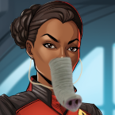
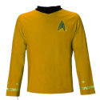

# Articles of Faith (Part 4) 

 
<b>Session started at 2025-11-03 / 21:36</b>
 
Fantasy Grounds - v4.8.3 ULTIMATE (2025-09-09) 
*Fen's StarTrekAdventures Ruleset (v1.1.5) * 
*[Prioritized Source: File; Other Sources: Vault]* 
*Core RPG ruleset (2025-10-29) for Fantasy Grounds
Copyright 2025 Smiteworks USA, LLC* 
*Fen's STA House Rules (v1.0.1) * 
*FG Browser v1.2.3* 
*[Prioritized Source: File; Other Sources: Vault]* 

>INTERIOR - Briefing room: Commander Bachar disconnects the comms channel with Vedek Ojun, and turns to face Lt. Commander Malat. She glares at her for a few moments before speaking. 

**Captain Bachar** Lt. Commander: I must have suffered hearing damage at some point, because I believe I just heard this Vedek say that you informed him of the situation here with the Orb we discovered on the surface. But since that is a gross violation of the chain of command and an act of wild insubordination which should land you in the brig, I must have misheard. 
**Windbloom Openheart** Wow, that is crazy. I must have the same problem, because I heard the same thing. I wonder if its some kind of shared psychosis, or mass hallucination. Far out... 
*Skig checks for earwax.* 
**Skig** Hmm... I mostly heard what could be inferred as a Klingon worthy sense of initiative that can only mean she is challenging the Captain for control of the ship? 
**Lt. Cmdr Malat** Reprimand me then, the Vedek Assembly has a right to know about the Orb 
*Skig checks to see if the word "Reprimand" could be misunderstood as "disembowel" in some obscure language.* 
*Darisha-Han 's antennae wildly wobble as her eyes light up at the prospect of covering a Starfleet officer torn between duty and faith* 
**Hailey Murry** It would've been easier to reveal this to them after we had it in hand 
**Hailey Murry** Are the Vedek Assembly likely to adhere to the Prime Directive? 
*Skig suspects Darisha might be getting to see lots of "torn" if Throk is promoted to Chief Security Officer in this situation.* 
**Windbloom Openheart** We can't just take it, it's also an important spiritual artifact to these people 
*Hailey Murry sighs* 
**Captain Bachar** No Commander Murry, I suspect they will not put much weight on the prime directive 
**Hailey Murry** Yeah, that is true, Windbloom 
**Darisha-Han** Prime Directive Ignored...Wait...this isn't newsworthy! 
*Darisha-Han throws her notepad to the floor* 
**Lt. Cmdr Malat** These people don't know what it is, they are hundreds of lightyears  
**Skig** To be honest, it is an indication the Prime Directive has already been violated, the questions that concerns me the most are "how did it get there" and "who put it there". 
**Lt. Cmdr Malat** These people don't know what it is, they are hundreds of lightyears away from the Celestial Temple. They don't even know about the prophets 
**Hailey Murry** Can the prophets reach out through the orb?  
**Skig** Exactly my point, thank you for agreeing with me Lt Cmdr Malat. 
**Lt. Cmdr Malat** You can't seriously suggest that they have as much right to the Orb as my people 
**Lt. Cmdr Malat** They can, although I don't know if they do this far from the Celestial Temple 
**Hailey Murry** But it's quite possible that they're communing with the prophets?  
**Hailey Murry** Assuming this isn't some sort of complex forgery 
**Hailey Murry** Windbloom, what were they doing with the orb during their rituals?  
**Lt. Cmdr Malat** The Prophets don't communicate in the way we do, they don't experience linear time. Orb experiences are confusing, hard to understand. It takes meditation and deep introspection to even figure out what they are trying to tell you 
**Skig** We should rule out "complex forgery" first and that will tell us if Miss Malat needs to contact the Bajorans and inform them, "Oh, my bad." 
**Windbloom Openheart** There was a fancy lady in far out robes, she was sitting in front of it with her eyes closed. 
**Darisha-Han** Wouldn't that make it easier for a non-technical species to experience and understand, why, without all the trappings of technology?  
**Skig** Was she breathing? 
**Hailey Murry** What does the orb itself look like? Glowing? Floating? Lasers?  
*Skig wonders what the native internment rituals for the dead are like?* 
Masakari (Darisha-Han): I never thought Kazemi would order exterminatus... 
Masakari (Darisha-Han): I mean I knew I would eventually....but... 
indarien (Skig): Clearly Kazemi has been playing too much Call of Cthulhu and Aliens RPG. He just reaches for "Nuke the Site from Orbit" 
Masakari (Darisha-Han): We make frens with aliens. Alien is fren not target. =D 
indarien (Skig): Fortunately, Skig will not order Exterminatus, it is too much damage to the proton torpedo launchers and might damage the chrome on the launch tubes firing that many at once. 
**Hailey Murry** How long until the Bajorans arrive? 
**Lt. Cmdr Malat** Around 20 hours 
**Darisha-Han** Why don't we go down there and try to communicate with the Prophets? What do they feel like? Maybe they were lonely and wanted to spread their ideas of love and peace to more sentient creatures? 
**Hailey Murry** Do they communicate with just anyone?  
**Darisha-Han: [ CONTROL  (7) +  SCIENCE  (2)]
[Successes: 2] [Complications: 0]
Success with 1 momentum [2d20 = 13]** 
**Lt. Cmdr Malat** Not everyone has an orb experience when they encounter one, the Prophets work in mysterious ways 
**Darisha-Han** Checking all sensors for worm hole activity... 
**Hailey Murry: [ INSIGHT  (13) +  SECURITY  (3)]
[Successes: 0] [Complications: 0]
Failed on DC: 1 [2d20 = 38]** 
Masakari (Darisha-Han): wrecked mate. 
**Skig** So you are saying the Prophets are like the laundry machines on Deck 8 that cause a sock to disintegrate into nothingness a random number of cycles? They also work in mysterious ways. 
**Skig** I mean, it's the only excuse for how all the security officers have mismatched socks. 
*Darisha-Han quickly scribbles down that the missing left socks are the result of washing machines, as this is the biggest story of the week.* 
**Darisha-Han** Windbloom...could you sneak in and communicate with the orb? 
**Hailey Murry** Probably not a good idea, if his cloaking goes off that could be pretty catastrophic 
**Skig** We could just wait until no one is there, beam down, perform a thorough analysis and be ready for emergency beam out if the sensors detect someone approaching? 
**Windbloom Openheart** I can try, I think it would be far out to commune with the Prophets 
**Skig** I'm assuming the room is not occupied all the time. 
**Windbloom Openheart** They have guards patrolling the caves, but iif we're careful they probably won't see us 
**Hailey Murry** Assuming it doesn't interfere with the teleporters 
*Skig wonders what level of Blasphemy the Bajorans would consider, "Jem'Hadar warrior causes Prophet to get stoned out of its mind and make bogus proclamations about licking walls".* 
**Captain Bachar** No one is beaming down there without some plan in place to reduce the risk of cultural contamination 
**Skig** Curious they would have guards. 
**Darisha-Han** Are the prophets like the Q, where they occasionally squabble and have family feuds? 
*Darisha-Han looks at Malat* 
**Darisha-Han** Is this a run-away prophet that was bullied? 
indarien (Skig): If only Ishemok was here to help them turn a profit? 
*Darisha-Han looks eager to capture a story.* 
**Hailey Murry** Oh I hope this isn't one of the evil ones 
**Skig** That would explain the distance from the Celestial Temple. 
*Skig wonders if there are always two evil ones, a Master and an Apprentice.* 
**Lt. Cmdr Malat** The prophets and pah-wraiths don't literally live in the Orbs. 
**Hailey Murry** Hmmm 
**Hailey Murry** Where are they, typically?  
**Darisha-Han: [ INSIGHT  (9) +  SCIENCE  (2)]
[Focus: Journalism ]
[Successes: 3] [Complications: 0]
Success with 2 momentum [2d20 = 5]** 
**Darisha-Han** I'll get to the bottom of this story! 
*Darisha-Han dons glasses and sips from a tiny expresso cup* 
**Darisha-Han** who writes these research papers, they are so dry and terse...ugh. NERDS. 
*Darisha-Han 's antennae wildly spin* 
**Skig** All right, so I propose we check the following leads: (1) Possible wormhole existence (2) Indications of who brought it and how it got here in the absence of #1, (3) Length of time it has been here, if possible to determine. The age of the temple would be a good start. (4) Is it real, is it a forgery, and if it is a forgery, who gained to place it there?  (5) Betting pool on how long it takes Malat to be imprisoned in her own brig for some reason 
**Skig** I'll put 10 credits on the last one for 6 hours from now. 
*Skig looks at Malat.* 
**Skig** You can't bet. 
**Lt. Cmdr Malat** No fair 
*Skig looks exhausted from acting like a compassionate and thoughtful executive officer.* 
**Skig: [ INSIGHT  (8) +  COMMAND  (2)]
[Focus: "Masking" ]
[Successes: 1] [Complications: 0]
Success with 0 momentum [2d20 = 17]** 
**Lt. Cmdr Malat** Even if pah-wraiths are involved, it is just all the more reason we need a Vedek involved 
**Lt. Cmdr Malat** Pah-wraiths often preset as false prophets, Vedek Ojun will be able to tell whether a Pah-wraith is manipulating these people 
**Hailey Murry** That's a great argument to make before calling them 
*Skig checks to see if "Vedek" translates to "Ordo Hereticus Inquisitor" for the home audience.* 
**Darisha-Han** Im surprised you didn't like Ishemok. He was as wild about prophet as you are. 
**Hailey Murry** Hopefully nobody on board is already directly involved in this. If this had been some sort of covert operation, it isn't anymore, so things are going to amp up 
**Hailey Murry: [ DARING  (10) +  SECURITY  (3)]
[Focus: Tracking Devices ]
[Successes: 2] [Complications: 0]
Success with 1 momentum [2d20 = 18]** 
**Captain Bachar** Either way, I agree with skig that we need to gather as much information as possible before that Vedek gets here 
**Darisha-Han** To the surface! Undercover work! 
**Captain Bachar** I will lock Malat in brig later, for now you created this mess so you are going to have to help solve it 
*Skig is worried she is started to develop command skills and needs to go fix something in engineering before too much leadership gets on her.* 
*Skig looks at Bachar.* 
**Skig** Well wait, if you can just order her in the Brig, you aren't allowed to bet on when that is. 
**Captain Bachar** Skig, lock it up 
**Skig** Which "it"? 
*Captain Bachar shoots a look that confirms she is not in the mood* 
**Skig** Got it. 
**Captain Bachar** We need to form teams to look into your questions. If we need to go down to the planet, I can take the form of a Pelarian to go run some scans for you 
**Skig** That sounds... very helpful and useful for getting to the bottom of this. 
**Skig** All right, Darisha-Han, long distance scans looking for wormholes. 
**Zox** Immediately! 
**Darisha-Han** Immediately! 
**Darisha-Han: [ CONTROL  (7) +  SCIENCE  (2)]
[Successes: 0] [Complications: 1]
Failed on DC: 1 [2d20 = 32]** 
**Skig** Let's get an exact list of scans for the Captain to limit her time on the surface. 
**Darisha-Han:  [d20 = 1]** 
**Skig** Windbloom, can I task you to come up with some sort of alternate disturbance if we need a distraction to get any away teams out. Something that will absolutely cause no cultural contamination? 
>Darisha-Han heads over to the long range sensor station and starts to program in a survey to look for signs of verterons, however she clearly didn't program the system correctly and a series of alarms start going off as the Lister's long-range sensor array overloads and goes offline.  

**Skig** Hailey, can you lead up the science options since... well... our adorable Ghex-relative has just typed a whole bunch of... 
*Skig blinks.* 
**Windbloom Openheart** Yeah, far out little furry one. You can count on mee 
**Skig ** *(mutters)*: Must not kill crewmembers. Must not kill crewmembers. 
**Hailey Murry** I'll see if we can look into this... 
**Darisha-Han** It's a sign not to scan! the sensors have stopped working! totally not user error! 
**Darisha-Han** (don't tell Ghex!) 
**Captain Bachar** We need to form teams to look into your questions. If we need to go down to the planet, I can take the form of a Pelarian to go run some scans for you 
**Skig ** *(mutters)*: Must not feed Darisha-Han into the composter. 
**Skig** I will be down in main sensors trying to fix the "write erase reload" command SOMEONE just ran. 
*Skig leaves the room before she spaces someone.* 
*Skig sends a message to Ghex's Crew Mail, "Your cousin Darisha-Han just deleted the control system for the long range sensor array. Please bring this up relentlessly in all future family gatheringins."* 
**Hailey Murry: [ REASON  (9) +  SCIENCE  (4)]
[Focus: Constitution Class Ships ]
[Successes: 1] [Complications: 0]
Success with 0 momentum [2d20 = 27]** 
*Darisha-Han cries.* 
**Hailey Murry** I'm getting some signs of tritanium and duratanium along the length of the cave system. There's a lot of natural lava tubes, but some of these patterns suggest a high-velocity impact that punched through the surface initially.  
**Skig: [ DARING  (10) +  ENGINEERING  (5)]
[Focus: Emergency Repairs ]
[Successes: 2] [Complications: 0]
Success with 1 momentum [3d20 = 33]** 
**Gra'lan: [ REASON  (11) +  CONN  (1)]
[Successes: 1] [Complications: 1]
Success with 0 momentum [2d20 = 29]** 
**Gra'lan: [ CONTROL  (9) +  ENGINEERING  (4)]
[Focus: Shipboard Tactical Systems ]
[Successes: 2] [Complications: 1]
Success with 1 momentum [3d20 = 42]** 
*Skig feels the Lister scream in terror, as if the ship has been subjected to a brutal beating from a Borg Cube.* 
**Skig** Okay, that's it, now I am going to SPACE someone. 
**Hailey Murry** Okay it definitely looks like a ship fell apart. I'm showing an impact site in a desert north of the mountain with the temple. Most of the remains are up there, with the rest having impacted the mountain 
**Hailey Murry** Probably a few decades old at least, less than a century 
**Gra'lan: [ CONTROL  (9) +  ENGINEERING  (4)]
[Focus: Shipboard Tactical Systems ]
[Successes: 2] [Complications: 0]
Success with 1 momentum [2d20 = 20]** 
**Gra'lan: [ INSIGHT  (11) +  COMMAND  (1)]
[Successes: 1] [Complications: 0]
Success with 0 momentum [2d20 = 23]** 
**Red Shirt (Engineering) (Comms)** Transporter Room 4 to the bridge. Something pretty strange just happened down here 
**Skig** On my way. 
*Skig heads to transporter room 4, picks up some restraints and a type-2 phaser in case she needs to deal with a crewmember who should be spaced.* 
**Red Shirt (Engineering)** I went on break to replicate some tea, and when I came back the transporter console indicates that there two transport operations that took place while I was out 
**Red Shirt (Engineering)** One indicates a Pelarian life form and 6kg of unidentified matter were beamed up from the planet, and the second indicates just the Pelarian life form was beamed back down 
*Skig freezes.* 
**Skig** Oh, well, at least no damage was done to the Lister. 
**Red Shirt (Engineering)** I suppose that's true  
**Red Shirt (Engineering)** Should I log it? 
**Skig** Definitely include the operational command code for whoever was using the transporter. And I hope you remembered to log out before you went to get tea. 
**Red Shirt (Engineering)** Of course ma'am, I remember the training that if we forget to log out from our console before leaving our station, Commander Skig will enter our quarters while we sleep and activate a space-filling foam canister. 
**Red Shirt (Engineering)** It looks like Junion Lt. Gra'lan logged in to use the transporter ma'am 
*Gra'lan sweating intensifies* 
**Skig** Excellent Red Shirt Zippy MacGee, I knew that training video about the dangers of being smashed at high velocity into a wall while you sleep would get the right results. 
>INTERIOR - Engineering Lab IV: Skig heads to the engineering lab to confront Gra'lan, and opens the door to find Lt. Commander Malat slamming his face into console while putting him in handcuffs 

**Skig** Not the console! 
**Gra'lan** I did it out of Love! you'll never understand! 
**Hailey Murry** Please tell me you didn't be a horta up here 
**Lt. Cmdr Malat** He tried to steal the orb. 
**Skig** Do you have any idea who hard those are to replace? And even worse, you made teeth marks on it, and I think one might be stuck in the transparent aluminum. 
**Lt. Cmdr Malat** He's lucky I didn't shoot him 
**Gra'lan** That orb is the one thing I could gift my Horta girlfriend that would be as special as she is!  
*Skig tosses Gra'lan to one side and steps on him while checking to see if Malat damaged the transporter console.* 
**Gra'lan** It's a perfect rock for the best horta! 
**Skig** Malat, look at this, you left Gra'lan teeth marks on my console. 
**Skig** Seriously, you could have smashed his head into the flat surface 12 centimeters to the right. 
*Lt. Cmdr Malat picks up Gra'lans face from the console and slams it into a wall instead* 
**Skig** Thank you! That is how it should be done. 
**Gra'lan: [ FITNESS  (7) +  SECURITY  (2)]
[Successes: 2] [Complications: 0]
Success with 1 momentum [2d20 = 18]** 
*Gra'lan tries to tough it out* 
**Lt. Cmdr Malat** I guess this at least resolves the dilema of how to get the orb 
**Gra'lan** my beloved is worth anything! 
**Captain Bachar** This does not solve any dilemas 
**Gra'lan: [ PRESENCE  (7) +  COMMAND  (1)]
[Successes: 1] [Complications: 0]
Success with 0 momentum [2d20 = 19]** 
**Captain Bachar** This is a serious breach of the prime directive, that Pelarian you beamed up is going to have a hell of a story to tell 
*Captain Bachar checks a chronometer* 
**Gra'lan** Oh she's just some drugged up oracle, shell forget it before her next vision.  
**Windbloom Openheart** Oh yeah, great idea... A vision 
**Windbloom Openheart** You can fix this man, you just need to get her back and into a holodeck. Convince her it was all a vision 
**Hailey Murry** Oh that is fantastic! 
*Skig replicates a belt sander and some epoxy.* 
**Captain Bachar** I should have refused the assignment to this vessel 
*Captain Bachar shapeshifts into a Pelarian.* 
**Gra'lan** Methinks you didn't actually have the choice. 
**Captain Bachar** I'm going down there to make sure she doesn't go wake everyone up and tell them what she saw 
**Gra'lan** Wait aren't we beaming her into the holodeck before we apply Skig's engineering solution of epoxy and some sand paper? 
*Skig begins using the belt sander to buff out the transporter console's transparent aluminum to repair the damage Gra'lan's face did.* 
**Hailey Murry** Where is the Orb?  
**Gra'lan** Right here. 
*Hailey Murry takes the orb* 
**Hailey Murry** Alright, Malat, that's enough for now 
**Gra'lan** Ha! You can't knock out my teeth if I don't have any! 
**Hailey Murry** No need to make a mess for the red shirts, and if you hit another panel on accident, Skig might have a stroke 
**Skig** Nope, but people might end up floating. 
**Captain Bachar** Beam me down 
**Skig: [ DARING  (10) +  ENGINEERING  (5)]
[Successes: 1] [Complications: 1]
Success with 0 momentum [2d20 = 30]** 
**Skig** Dammit, look, the console was damaged and we really should have used Transporter Room 3. 
**Skig:  [d20 = 19]** 
>Skig energizes the transporter and Captain Bachar dematerializes. Strangely, Skig isn't reading her signature at the beam-down locaiton 

*Skig puts up yellow caution tape on the door to Transporter Room 4 and shoos everyone out of it.* 
*Skig checks the Transporter Log to see where she sent the Captain.* 
**Skig: [ REASON  (10) +  SCIENCE  (3)]
[Successes: 1] [Complications: 0]
Success with 0 momentum [2d20 = 31]** 
**Lt. Cmdr Malat** On the plus side, the captin is going to be so pissed at Gra'lan she will completely forget about my insuborination 
**Skig: [ DARING  (10) +  ENGINEERING  (5)]
[Focus: Emergency Repairs ]
[Successes: 3] [Complications: 0]
Success with 2 momentum [3d20 = 30]** 
**Skig** Oh... I think you and Gra'lan probably have much less to worry about... 
>Skig quickly reset the controls on the transporter and beams back up a diffuse puddle of goo onto the pad. The goo reforms into Captain Bachar and looks very angry 

*Captain Bachar opens her mouth and then snaps it shut again* 
**Captain Bachar** I'm not even going to say it 
**Skig** Probably for the best Captain. 
**Captain Bachar** Beam me back down, ON the surface this time if you please Commander 
**Captain Bachar** I am going to court martial every single one of you when I get back 
**Gra'lan** No! I confess, I did it all! In the name of love! 
*Skig beams the Captain back down to the surface, to where she should have gone the first time.* 
**Skig: [ DARING  (10) +  ENGINEERING  (5)]
[Successes: 2] [Complications: 0]
Success with 1 momentum [2d20 = 10]** 
**Lt. Cmdr Malat** I was honestly hoping I would have to beat the confession out of you 
**Skig** To be fair Malat, you are likely going to be court martialed here shortly, you might as well make it worthwhile. 
**Lt. Cmdr Malat** At least this resolves any prime directive concerns around the Orb, obviously we give it to Vedek Ojun when he arrives 
*Hailey Murry Hailey would like to get to putting together a duplicate orb. Would that be  science roll to copy?* 
*Skig raises eyebrow at Malat.* 
*Skig decides it is not worth arguing in this case.* 
**Skig** Wait... since we have the Orb here. 
**Skig** Malat, can you confirm this is an actual orb? 
*Lt. Cmdr Malat drops the handcuffed Gra'lan onto the floor and pulls out a tricorder* 
**Hailey Murry: [ PRESENCE  (10) +  CONN  (3)]
[Focus: Deception ]
[Successes: 1] [Complications: 0]
Success with 0 momentum [2d20 = 19]** 
**Skig** Compare it to known scans of Prophets and Pal-wraiths? 
KruschtyaEquation (Hailey Murry): Burning a Determination for this as well, so +2 Successes 
**Lt. Cmdr Malat** It's a real Orb ma'am, I am reading the same verteron fields that we read from the Orbs on Bajor 
**Hailey Murry** Is there a good way of mimicking those?  
**Lt. Cmdr Malat** No, the Cardassians stole them during the occupation to study them and try to replicate them, but they never had any success. The Prophets are the only ones who can manipulate verteron fields like this 
**Hailey Murry** We need to figure out really fast what these people think about the orb 
**Skig** Wouldn't that only matter to people who can detect Veteron Fields and need them for some purpose? 
**Lt. Cmdr Malat** As far as I know, the only Orb which hasn't already been returned is the Orb of Truth. The Cardassians claimed to have lost it when they agreed to return the others. 
**Hailey Murry** So this would be the Orb of Truth, then?  
**Hailey Murry** Or are there potentially others?  
**Lt. Cmdr Malat** There were 9 Orbs that ancient Bajorans discovered in the Denorios Belt, the Cardassians stole 8 of them during the occupation and those were all the ones we knew of for centuries. 
**Lt. Cmdr Malat** The Emissary did discover a tenth orb on Tyree though, the Orb of the Emissary 
**Skig** Hailey, when did you say you detected a crashed ship? 
**Lt. Cmdr Malat** But other than that, no one has discovered an Orb for thousands of years. 
**Gra'lan** Can't you spare one orb of 10 for my sweet Gemma? 
**Hailey Murry** About 50-75 years ago, give or take 
**Lt. Cmdr Malat** That would have been during the occupation 
**Skig** Roughly corresponds with the time of the occupation, correct? 
**Hailey Murry** We'll know for sure if we teleport down and get some clean scans. There's a bunch of wreckage in the desert 
**Skig** I think we need to check out that wreckage. 
**Skig** I will work on that while you all get a priestess stoned. The less I know about that, the happier I will be. 
**Windbloom Openheart** Far out, I am going to get the peyote from my quarters. I'll meet you in the holodeck 
**Skig** After all, I'm going to get court martialied for attempted murder with a transporter, gross violation of the Prime Directive might actually get me removed from the Lister. 
indarien (Skig): Skig is true to character to the very end. 
**Gra'lan** Look, I need to see Kolea and get cleaned up to play god. 
**Gra'lan** Oh snap.  
**Darisha-Han: [ INSIGHT  (9) +  SCIENCE  (2)]
[Focus: Journalism ]
[Successes: 0] [Complications: 1]
Failed on DC: 1 [2d20 = 34]** 
>Gra'lan and Darisha head off to program the holodeck, and when they are ready they signal to Skig to beam Bachar and the Pelarian priestess into the holodeck 

**Skig: [ REASON  (10) +  ENGINEERING  (5)]
[Successes: 1] [Complications: 1]
Success with 0 momentum [2d20 = 29]** 
**Skig:  [d20 = 19]** 
*Skig sighs and wonders what else could go wrong today.* 
**Darisha-Han:  [3d20 = 50]** 
**Darisha-Han** W T F 
Masakari (Darisha-Han): TIL:  Literally cursed. 
Masakari (Darisha-Han): could have defeated tiamat with a toothpick OR completely ruined starfleet. 
**Skig** (POLL) Petition to move my DnD group to Tuesday Japan time and my Star Trek group to Friday Japan time. 
indarien (Skig): Clearly the Fantasy Grounds Dice roller is very time dependent. 
>Bachar and the Pelarian priestess materialize into the holodeck. All around them, they see people wearing full body inflatable costumes of strange creatures that they do not recognize: some sort of giant yellow mouse, a large pink creature of a roughly spherical shape, a bipedal winged lizard with flames on its back and tail. The strange costumed people are walking around between folding tables full of merchandise depicting the same unknown creatures.

The room is a large auditorium filled with folding chairs and with a large stage decorated in red, white and blue colors. There are thousands of red, white and blue baloons scattered all across the floor of the room, and streamers hanging from the ceiling. A large banner hangs in the distance that reads "Nixon / Ford '68"

The room is incredibly loud, as the ancient 20th century Earth song "Du Hast" blasts over loudspeakers 

>♫♫♫Lighthearted Music Sting♫♫♫ 

**Gra'lan** I recognize all of these. 
>---------CUT TO COMMERCIAL------- 

**Gra'lan** Darisha clearly did her homework! 
*Skig is not even there and needs a strong drink.* 
*Skig suspects we might discover the alcohol tolerance of the Founders at this point.* 
