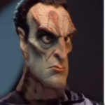

# Articles of Faith (Part 6) 

 
<b>Session started at 2025-12-01 / 21:43</b>
 
Fantasy Grounds - v5.0.0 (2025-11-12) 
Fen's StarTrekAdventures Ruleset (v1.1.5)  
*[Prioritized Source: File; Other Sources: Vault]* 
*Core RPG ruleset (2025-10-29) for Fantasy Grounds
Copyright 2025 Smiteworks USA, LLC* 
*Fen's STA House Rules (v1.0.1) * 
*FG Browser v1.2.3* 
*[Prioritized Source: File; Other Sources: Vault]* 

>INTERIOR - Bridge: The Cardassian captain smiles at the crew from the viewscreen as Malat clenches her hands into tight fists behind the tactical console. Captain Bachar rises from her chair and takes a few steps towards the viewscreen. 

**Gul Bemek** I am certain that you, upstanding Starfleet officers, did not intend to conduct any illegal salvage. So I am happy to simly take possession of the illegal salvage and we can happily go our separate ways. 
**Gul Bemek** I would hate to have to find… alternative resolution, to this dispute. 
**Hailey Murry: [ REASON  (9) +  CONN  (3)]
[Successes: 2] [Complications: 0]
Success with 1 momentum [2d20 = 17]** 
**Captain Bachar** I need to consult with my staff Gul Bemek, would it be possible to have a few hours? 
**Gul Bemek** Of course, it will take me some time to prepare a landing party. You can have 4 of your hours to consult. 
Masakari (Darisha-Han): The only one of Brad's characters that fakes it is Kolea. 
indarien (Skig): Yes, Kolea is an expert at faking things. Skig has NO IDEA how to fake things. 
indarien (Skig): Fen, channeling his Butch Thundercock. 
>INTERIOR - Briefing Room: Murry, Skig, Darisha and Malat are pouring over the relevant terms of the agreement. 

**Darisha-Han** And all this when someone is looking to get the Bajorans and Cardassians to war again.  
**Darisha-Han** Spicy! This will make a great novel! 
Masakari (Darisha-Han): SkigGPT. 
Masakari (Zox): they LOVE consensus.  
**Hailey Murry: Hailey Murry has used a point of Determination to add a natural one to the dice pool.** 
**Hailey Murry: [ INSIGHT  (13) +  SCIENCE  (4)]
[Focus: Diplomacy ]
[Successes: 4] [Complications: 0]
Success with 3 momentum [2d20 = 14]** 
Masakari (Zox): really needs to make the photon torpedo noise when 20s hit. 
**Hailey Murry** The Xepai would rule this pretty much exactly on the strict interpretation of the text of the agreement. They aren't a spiritual people.  
Masakari (Zox): It would be funny if there was some sort of Vulcan/Romulan split among the Jem'Hadar where the angry ones and peaceful ones don different names/ways. 
**Hailey Murry** I think that the Jem'Hadar colony Windbloom came from would be more likely to give it to the Cardassians by default, but I think we could probably convince them otherwise to get the Orb to the Bajorans.  
**Hailey Murry** T'Pau would probably wind up being the mediator, who's also not going to be swayed emotionally. I get the feeling he'd be more of a "rules as intended" fellow, rather than "rules as written" 
**Hailey Murry** Zhuang'Ki might work as well, that Jem'Hadar that we rescued from the black hole, but I have no idea how he'd see the arguments. I think it's still good to touch base with him so he knows about that collection of Jem'Hadar ships, but that might not be until later 
**Darisha-Han: [ PRESENCE  (10) +  COMMAND  (1)]
[Successes: 0] [Complications: 0]
Failed on DC: 1 [2d20 = 31]** 
**Hailey Murry** Zhuang'Ki might work as well, he's the Daoist of that colony. I have no idea how he'd see the arguments. I think it's still good to touch base with him so he knows about that collection of Jem'Hadar ships, but that might not be until later 
**Hailey Murry** I think the orb is definitely a legitimate salvage interest under the terms of Appendix J, because by Appendix P the Cardassians have agreed that the orbs are the righul property of Bajor, and are important spiritual artifacts to them. This means that we are required to settle a dispute with a third-party mediator.  
**Skig** A third party both sides have to agree to, so who do we pick? 
**Darisha-Han** Please pick the most interesting Alien that's not boring to write about! 
**Hailey Murry** I don't think we have access to that alt-Skig anymore 
**Skig** If only we had a shapeshifter on board who could replicate whichever individual was needed to address the situation. 
Masakari (Darisha-Han): Bachar is a REAL shapeshifter who can play a bit though, not a Geret. This can work. 
**Hailey Murry** Can we have the orb be our mediator? 
**Darisha-Han** Definitely a well rounded individual. 
**Hailey Murry** Plan A for the orb being the mediator, and then plan B we can go with the Xepai?  
**Hailey Murry** I think we have the letter of the law on our side here 
**Hailey Murry** And the spirit of it, honestly.  
**Hailey Murry** Could go with T'Pau 
**Skig** As long as you promise not to blow any more holes in the side of the ship. 
**Hailey Murry: [ PRESENCE  (10) +  CONN  (3)]
[Focus: Diplomacy ]
[Successes: 2] [Complications: 0]
Success with 1 momentum [2d20 = 19]** 
**Darisha-Han: [ PRESENCE  (10) +  CONN  (3)]
[Successes: 0] [Complications: 0]
Failed on DC: 1 [d20 = 17]** 
>Hailey Murry and Darisha-Han convince the Cardassians to accept T'Pau as an independent mediator of this matter. Captain Bachar reaches out to him, and he should arrive in a few hours. 

>INTERIOR - Delta Flyer - After a couple of tense hours navigating the Badlands, Ensign Ghex pulls the flyer into orbit of a small, cold rocky body.  

**Zox** Just as we thought! 
**Lt. Cmdr Viraseti** The signal terminates here. Whoever was controlling your sister when she died must have done so from here. 
**Zox: [ CONTROL  (11) +  SCIENCE  (4)]
[Focus: Shipboard Tactical Systems ]
[Successes: 0] [Complications: 1]
Failed on DC: 1 [2d20 = 39]** 
**Zox:  [d20 = 10]** 
**Zox:  [2d20 = 25]** 
**Zox:  [Total: 3] [Effects: 2] [4dChallenge = 3]** 
**Zox** Time to use technology and get some eyes on this planetoid..... 
>Zox pulls up the sensors but there is a lot of interference from the plasma storms. To try to cut through, he routes warp power directly to the forward sensor array. Unfortunately, moments later an alarm klaxon sounds as his power reroute overloads the Flyer's engines. 

>The shuttle begins to list forward, as it falls into the gravity well of the small rocky body which it was approaching. 

**Zox** What? I figured Janeway's ship could handle things like this!  
**Geret** Alas, while it may be a treasure, it's not *our* treasure 
*Geret plays a sad sonet* 
**Ensign Ghex** Well, I suppose the designers didn't consider the possibility that you would route 100% of the engine power directly into a lower power system like the sensors. I probably wouldn't have done that, but I usually follow the standard operating procedures. 
**Kolea** I mean, generally I avoid hooking up EPS conduits to a person's pacemaker, but that is what Zox has basically done. 
**Geret** That did save his life that one time though, didn't it? 
**Ensign Ghex** So anyway sir, um... yeah, we're crashing now. 45 seconds to impact. 
**Zox: Zox has used a point of Determination to add a natural one to the dice pool.** 
**Zox: [ DARING  (12) +  ENGINEERING  (4)]
[Focus: Shipboard Tactical Systems ]
[Successes: 3] [Complications: 1]
Success with 2 momentum [2d20 = 32]** 
Masakari (Zox): "I can'd do things by the book on this toonie"
"Oh snap I just did things by the book..." 
**Zox:  [d20 = 12]** 
**Zox:  [5d20 = 22]** 
>Zox rips open the panel and tears of his shirt, then crawls behind an access panel and conducts the fastest EPS bypass he has ever performed. The engines surge back to life, and Ensign Ghex rushes back to the panel to safely land the flyer. However, as she does so, the panel overloads directly into her face, sending her flying across the cockpit 

**Zox:  [Total: 6] [Effects: 4] [6dChallenge = 6]** 
**Geret: [ FITNESS  (12) +  CONN  (2)]
[Focus: Weird Biology ]
[Successes: 2] [Complications: 0]
Success with 1 momentum [2d20 = 19]** 
**Kolea** Geret, land the ship! 
*Geret leaps in the way and catches Ghex out of the air* 
**Kolea** I will take care of Ghex. 
**Geret** Yes ma'am!  
*Geret throws Ghex over at Kholea and takes the... panel?* 
**Lt. Cmdr Viraseti** Don't turn into a Gormagander 
**Geret** Yet! 
*Kolea sets Ghex down on the floor.* 
**Kolea** Viraseti, grab the rubber ducky looking thing from my duffel bag and give it to me. 
*Kolea pulls a hypo-injector from her blouse.* 
**Geret: Geret has used a point of Determination to add a natural one to the dice pool.** 
**Geret: [ CONTROL  (10) +  CONN  (2)]
[Successes: 4] [Complications: 0]
Success with 3 momentum [2d20 = 8]** 
**Kolea** Zox, just DON'T MOVE AND DON'T TOUCH ANYTHING! 
**Zox** Im not some outmoded dinosaur....oh wait.... 
**Kolea: [ DARING  (9) +  MEDICINE  (4)]
[Focus: First Aid ]
[Successes: 0] [Complications: 0]
Failed on DC: 1 [2d20 = 33]** 
>Geret throws Ghex into the corner like a sack of spoiled onions and leaps into the pilot's seat, gracefully regaining control of the Flyer before it pancakes into the surface. 

*Kolea tries to stab Ghex with a stabilizer and manages to stab the communicator on her chest as Geret is busy saving the ship.* 
**Kolea** Dammit. 
**Kolea** Viraseti, no. The yellow ducky, not the pink one. 
**Lt. Cmdr Viraseti** Hmm? Oh sorry, I wasn't paying attention. 
**Lt. Cmdr Viraseti** What happened to Ghex? 
**Kolea** Get the yellow ducky from my bag. 
*Lt. Cmdr Viraseti hands Kolea a yellow ducky from her medical bag, somewhat confused* 
**Geret ** *(calling out)*: The front  panel exploded 
**Lt. Cmdr Viraseti** Sounds exciting. Whenever you're done trying to crash the ship I have a bearing on our signal. 
*Kolea puts the ducky behind Ghex and squeezes it, it expands into a small cocoon to buffer her from impacts.* 
**Zox** Excellent! where are we off to? 
**Lt. Cmdr Viraseti** Bearing 244 on this body's magnetic field, range 805 km 
**Kolea** Zox, can I trust you to make an assessment on how well we can get there WITHOUT blowing up the ship? 
**Zox** Sure can.  
**Kolea** I know, I'm asking a lot. 
**Zox** We'll be fine. 
*Kolea raises skeptical eyebrown but says nothing.* 
**Kolea: [ DARING  (9) +  MEDICINE  (4)]
[Focus: First Aid ]
[Successes: 1] [Complications: 0]
Success with 0 momentum [2d20 = 29]** 
**Zox: [ REASON  (7) +  SCIENCE  (4)]
[Focus: Shipboard Tactical Systems ]
[Successes: 2] [Complications: 0]
Success with 1 momentum [2d20 = 14]** 
**Geret: [ REASON  (8) +  SCIENCE  (5)]
[Successes: 1] [Complications: 0]
Success with 0 momentum [d20 = 10]** 
*Kolea stabilizes Ghex and keeps her stable and safe in the emergency cocoon.* 
**Zox** Interesting....the rock itself is dead but there's likely some habitation modules 20 meters underground where the signal originates... 
**Geret** Let's go, Commander! 
**Zox** Prepare for hostilities, Geret, you are are with me. Viraseti, beam us where there is atmosphere underground  
Masakari (Zox): (there's no drop pod for the Exo-Skig-Aton, but....eh, teleporting in is fine) 
**Lt. Cmdr Viraseti** Good luck 
**Kolea** Geret, you can get away without breathing, right? 
**Geret** I'm not sure in this form, but sometimes! 
**Kolea** Okay, just checking. 
*Kolea watches in horror as Viraseti operates the transporter beam.* 
**Kolea** Umm... I think, maybe, that you had the Y and Z coordinates backwards there? 
>Viraseti energizes the transporter, however she forgot to reset the sensor calibration prior to operation after the system overload. As a result, the coordinates are incorrect, causing Zox and Geret to materialize slightly below the floor. 

**Lt. Cmdr Viraseti** Uh oh 
**Lt. Cmdr Viraseti** I blame Zox 
**Kolea** I mean, you are not the only one. 
Masakari (Zox): (Now to see if I have the flamer, the heavy-flamer, or the Siracha cannon) 
>Geret instinctively shifts into Horta form when she feels the press of rock all around her. Zox meanwhile finds himself embedded into a perfect Zox-shaped void in the stone created by the transporter confinment beam clearing out the target area of matter during his materialization. 

indarien (Kolea): Sriracha cannon loses 90% of efficacy in scenes without Throk. 
>He is unable to move, in the dark, as cold stone presses into every side of his body. 

**Zox: [ FITNESS  (10) +  SECURITY  (5)]
[Focus: Shipboard Tactical Systems ]
[Successes: 4] [Complications: 0]
Success with 3 momentum [3d20 = 21]** 
**Skig: [ REASON  (10) +  ENGINEERING  (5)]
[Successes: 1] [Complications: 0]
Success with 0 momentum [d20 = 10]** 
**Zox:  [Total: 4] [Effects: 2] [6dChallenge = 4]** 
**Zox:  [Total: 0] [Effects: 0] [2dChallenge = 0]** 
**Zox:  [Total: 1] [Effects: 0] [2dChallenge = 1]** 
**Zox ** *(BoomingMechaVoice)*: The Federation has found you! MechaZox will bring you to justice! 
indarien (Skig): Tribbles cower in fear. 
indarien (Skig): And he brought his pet HORTA! There is no escape. 
>Zox begins attempting to punch his way out of the stone, he begins to shatter some nearby stone with his punches, relying on the brute force of his exo-skig-aton, eventually opening enough of a hole that he is able to crawl out, where he sees Geret in Horta form sitting there having effortlessly and casually carved a clean hole through the rock and then done nothing to help him 

*Geret honks* 
**Zox** Gneiss of you to help. 
**Kolea** Zox, are you and Geret okay? 
*Geret makes horta noises to Kolea* 
**Kolea** Well, physically, I don't have enough battery in my communicator to cover psychology. 
**Zox** Yes, you can now safely lockon to our signal to reinforce.  
**Zox: [ CONTROL  (11) +  SCIENCE  (4)]
[Focus: Endurance ]
[Successes: 0] [Complications: 1]
Failed on DC: 1 [2d20 = 38]** 
**Kolea** Viraseti... umm... don't beam me anywhere yet. 
*Kolea goes to check on Ghex.* 
>Zox activates the sensors on his exo suit, but they seem to have been damaged in the rock. The suit bursts into flame. 

*Kolea smells Viraseti making popcorn while watching the video feed from the Exo-skig-a-ton.* 
**Geret: [ FITNESS  (11) +  SECURITY  (2)]
[Focus: Weird Biology ]
[Successes: 1] [Complications: 0]
Success with 0 momentum [2d20 = 18]** 
**Zox: [ FITNESS  (10) +  CONN  (1)]
[Focus: Endurance ]
[Successes: 2] [Complications: 0]
Success with 1 momentum [2d20 = 12]** 
indarien (Kolea): They get back to the ship, Gra'lan sees Zox covered in Horta shit and gets violently jealous. 
>Geret is able to extinguish the flames by secreting dissolved rock poop all over the burning Voth. Zox sits up, questioning his life choices. 

**Zox** Geret, could you kindly tell me what's going on around here, and if there are any life forms with a squishy, organic density around? 
**Zox** Or if it's really just an abandoned relay post. 
**Geret: [ REASON  (9) +  SCIENCE  (5)]
[Focus: Weird Biology ]
[Successes: 4] [Complications: 0]
Success with 3 momentum [3d20 = 25]** 
**Geret:  [d20 = 11]** 
**Zox** It would take skilled artisans centuries to make art like that.... 
*Geret honks with appreciation* 
**Zox: [ INSIGHT  (7) +  SCIENCE  (4)]
[Focus: Xenobiology ]
[Successes: 1] [Complications: 0]
Success with 0 momentum [2d20 = 26]** 
**Zox** I read some of Gra'lans books, I can understand your ways. 
*Geret is fully aware that she's able to turn into something that can speak, but instead chooses to charades it to Zox* 
**Zox** My people have always danced the routes and wisdom of the pack. 
**Geret: [ FITNESS  (11) +  COMMAND  (3)]
[Focus: Acting ]
[Successes: 2] [Complications: 0]
Success with 1 momentum [2d20 = 14]** 
>Somehow, Geret is able to communicate with Zox via charades. 

**Zox** Good Horta! have a scoob.....horta snack! 
*Geret lines herself up in the center of the hall, wiggling to make sure she's centered. She engages in an astounding display of interpretive dancing, though the camera focuses entirely on Zox's expression of admiration and astonishment as he's able to understand all of what she's trying to convey. * 
*Zox tosses a commemorative gold coin to Geret.* 
*Geret consumes it* 
*Zox heads towards the organic signal.* 
*Kolea makes tea for her and Viraseti and enjoys some popcorn while they discuss how annoying males are.* 
**Kolea: [ INSIGHT  (11) +  MEDICINE  (4)]
[Focus: Psychology ]
[Successes: 2] [Complications: 0]
Success with 1 momentum [2d20 = 22]** 
>Zox puts Geret's leash back on and heads down the corridor towards the organic signal. He walks past two open doorways, one containing a small dim room with a cot and a desk, the other containing a food replicator and a small table.  

*Geret eats the leash* 
indarien (Kolea): A LEASH? Holy shit, Gra'lan better not find out you two have THAT kind of relationship. 
>When he arrives at the door to the larger of the three chambers, he finds the door control is still powered and functional. When the door opens, he sees his sister's kitchen, or at least a 1-to-1 recreation of it. At the counter, a man in a starfleet uniform and an apron is chopping some carrots 

**Zox** Wait....what? 
**Lt. Haggarty** I should probably ask why the fire detection system alerted me to a fire in the hall, but I suspect I don't want to know the answer 
**Zox** Aren't you above work like this? 
*Geret aggressive honk* 
**Lt. Haggarty** It's a funny thing really, I never ate anything but replicated food my entire life.  
**Lt. Haggarty** But when you killed your sister, the strangest thing happened. It must be a side effect of the link, and possibly my Betazoid side, but I picked up some skills and memories as her body died with me inside it. 
**Lt. Haggarty** Suddenly, I know how to cook, and I can remember the taste of fresh produce. After a lifetime of eating replicated meals, now I suddenly yearn for the flavor of a real vegetable. I'm sure you can relate 
**Zox** Convincing emotional story, but the only way to know if it is true is to taste whatever you are preparing. 
*Kolea is somewhat happy Ghex is unconscious in the other room, given the context and her involvement in it.* 
*Lt. Haggarty adds the carrots to the salad bowl next to him, and then grabs a vinaigrette and begins to toss the vegetables in it* 
**Zox: [ INSIGHT  (7) +  SCIENCE  (4)]
[Successes: 2] [Complications: 0]
Success with 1 momentum [2d20 = 7]** 
**Zox** go go gadget salad fork.... 
*Kolea sips some tea and observes Haggarty's knife skills.* 
**Kolea: [ INSIGHT  (11) +  SECURITY  (4)]
[Focus: Bodai Shin Adept ]
[Successes: 3] [Complications: 0]
Success with 2 momentum [2d20 = 10]** 
*Lt. Haggarty plates a portion of salad from the bowl onto a plate and slides it across the table towards Zox* 
**Zox** Okay, so I do believe you....but why exactly where you quantum controling or entangled like this? 
**Lt. Haggarty** Good question, why don't we sit down and I explain my entire plan to you. 
>Watches as zox rips a metal leg off of a table, revealing that there is a holographic cosmetic surface being projected over the table. 

**Lt. Haggarty** The holograms were for your sister's benefit, we stocked the room with real food items because should would have been able to tell by taste if we used replicated food 
**Lt. Haggarty** But the walls, ornamentation, work surfaces... recreating the room as a hologram and projecting over unaddorned surfaces was the simplest approach. 
**Lt. Haggarty** I am actually a little big annoyed that you killed her, I worked very hard writing a 3-day long story to keep her occupied in here while I was using her body 
**Zox** Cruel.  
**Skig: [ DARING  (10) +  ENGINEERING  (5)]
[Successes: 1] [Complications: 0]
Success with 0 momentum [2d20 = 22]** 
**Zox: [ CONTROL  (11) +  SECURITY  (5)]
[Focus: Espionage ]
[Successes: 2] [Complications: 0]
Success with 1 momentum [2d20 = 25]** 
>Zox fires a net launcher that (for some inexplicable reason) Skig included in the suit. As the net wraps around Lt. Haggarty, he suddenly phases out of existence, dropping the knife he was holding to the floor as he does so. Then reappears a few meters away. 

*Lt. Haggarty points to the walls.* 
**Lt. Haggarty** Holo-emitters, you didn't think I would just waltz in here and hope for the best, did you? 
**Lt. Haggarty** I like the old-school thinking, very retro with the net launcher 
*Kolea makes another cup of tea for Viraseti and marks a checkbox in the "Haggarty" column.* 
**Lt. Haggarty** I'll give you... 5 minutes for that one 
>Warning, self destruct sequence activated. This facility will self destruct in five minutes. 

**Computer Voice** Warning, self destruct sequence activated. This facility will self destruct in five minutes. 
*Lt. Haggarty sits down at the table* 
*Kolea sighs.* 
**Lt. Haggarty** Take this before you leave, a little gift. 
*Lt. Haggarty pulls a book out from a drawer on the counter and slides it across the table to Zox.* 
**Lt. Haggarty** I beamed it down a few hours ago, when I realized you were coming here.  
**Lt. Haggarty** Some day, you and I will sit down again and I will explain your purpose in all of this, hell I'll even made a slideshow so your tiny reptile brain can follow along 
**Lt. Haggarty** But for now, you will have to continue laboring in ignorance Lt. Commander 
**Zox: [ CONTROL  (11) +  SECURITY  (5)]
[Focus: Espionage ]
[Successes: 1] [Complications: 0]
Success with 0 momentum [2d20 = 26]** 
**Kolea** Viraseti, can you run a sensor sweep over the area to figure out if we have cloaked ships lurking above us we need to worry about? 
**Kolea** I'll go run checks on the Delta Flyer and make sure we can get out of here. 
**Computer Voice** Self destruct sequence in progress, this facility will self destruct in three minutes 
*Kolea straps Ghex down so she won't be further injured.* 
**Zox** Okay, Ill read this book. 
indarien (Kolea): "Oil, the best use for dinosaurs, by GW Bush". 
>Zox picks up the book. It is an old paperbound novel from Earth, the cover reads "The Wind's Twelve Quarters." A red bookmark has been placed midway through the book, stickint out at the top. 

*Zox glares at the hologram before arranging a transport out.* 
*Lt. Haggarty laughs ominously as Zox beams out.* 
>♫♫♫Ominous Music Sting♫♫♫ 

>---------CUT TO COMMERCIAL------- 

