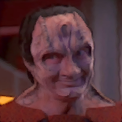

# Where the Wild Things Are (Part 1) 

 
<b>Session started at 2026-01-11 / 21:14</b>
 
Fantasy Grounds - v5.0.0 (2025-11-12) 
Fen's StarTrekAdventures Ruleset (v1.1.5)  
*[Prioritized Source: File; Other Sources: Vault]* 
*Core RPG ruleset (2025-10-29) for Fantasy Grounds
Copyright 2025 Smiteworks USA, LLC* 
*Fen's STA House Rules (v1.0.1) * 
*FG Browser v1.2.3* 

>Captains Log, Stardate 62263.6: Dozens of high ranking diplomats and other VIPs are arriving today for the conference. I can't say I am filled with confidence. I just hope we don't start another galaxy-wide war.

> I need to make sure we feed Throk before the attendees arrive. And configure the internal sensors to alert me if he attempts to replicate any sriracha. And maybe staple Zox's uniform onto his body. What was I thinking when I approved this conference... 

>INTERIOR - Transporter Room 2: Captain Bachar and the other senior officers are gathered in their dress uniforms to welcome the VIPs attending the conference. Captain Bachar checks the internal sensors on a wall panel and sees that Throk is currently helping Captain Kaglor set up for his speech, and has not yet eaten anyone. 

**Captain Bachar** I'd like everyone to be on their best behavior during the conference. No stealing, no kidnapping, don't cause any wars. 
**Zox** Yes Ma'am! 
**Zox** Where food is plentiful, there is no conflict. Such is the way of the Voth herds.  
**Hailey Murry** Malat, this means that in conflict resolution, you cannot punch the Cardassians  
*Zox begins wootling the wootle of harvests and spring.* 
**Skig** I have confdience the crew will act in accordance with the precepts of Starfleet and do nothing rash or untoward. 
*Skig flips over note to see if there is anything on the back she is supposed to read.* 
**Windbloom Openheart** Yeah, totally. I put ketamine in the punch anyways. Everyone will be super chill 
**Skig** Was that the large bowl of stuff that I saw the Pakleds taking snorts of? 
Masakari (Zox): "We need a new mysterious enemy" 
**Captain Bachar** Bachar to crew lounge, someone replicate new punch. And scan all of the other food for drugs. 
indarien (Skig): The Star Wars Trade Federation? 
**Captain Bachar** Our guests are arriving, let's try to put our best foot forward.  
**Skig:  [d20 = 19]** 
Masakari (Zox): too on the nose, Breen are easier to script =D 
indarien (Skig): Wait.. Daleks from Doctor Who? 
**Zox** Drugs are Windblooms best though. Have you tried them? 
>The transporter activates and a Klingon woman materializes on the pad and glares at the crew for a moment before stepping down. 

**Korana, daughter of Ganath** I am Korana, daughter of Ganath, Junior Deputy Chief of Mission to the Federation.  
indarien (Skig): Wait.. Ko-Dan Empire! That's who we need for an enemy. 
**Korana, daughter of Ganath** I am... honored to be invited to such a... noble endeavor 
*Korana, daughter of Ganath spits the words out in a way that makes it clear she is not at all honored to be here* 
**Skig** We are honored you accepted our invitation and have graced us with your presence for this august intercultural event. 
*Skig checks next note card she received from Kolea.* 
Masakari (Zox): just drop the cards along as she goes, zero subtlety.  
*Korana, daughter of Ganath walks out of the room without saying another word.* 
**Lt. Cmdr Malat** Well, she seems pretty friendly 
indarien (Skig): Don't worry, Fen's not the only one with a table... I came up with a table for the cards and getting them out of order. 
**Hailey Murry** Hopefully she finds it a bit enjoyable, but not too much 
**Zox** This is absolutely perfect. More angry and indifferent guests give us the ideal scenario to test our cooking and turn those frowns, around! BAM! 
**Hailey Murry:  [d20 = 8]** 
>The pad energizes again a few moments later, and a pair of Romulans (a young woman and an older man) materialize on the pad. 

**Zox** Do you want to try some Targ, but no one knows how to marinate that beast? Well today do we have a treat for you! 
*Skig looks through a few cards to see if she has a written response to Zox's comments.* 
>The older man walks down from the pad and smiles at the crew. 

**Senator Sorak** Warm greetings my friends. I am Senator Sorak, this young woman is Proconsul Vrell. On behalf of the Romulan Empire, I thank you for taking the initiative to host this event and include us in it. 
**Skig: [ PRESENCE  (8) +  ENGINEERING  (5)]
[Focus: "Masking" ]
[Successes: 3] [Complications: 0]
Success with 2 momentum [2d20 = 15]** 
**Senator Sorak** I look forward to seeing how this... unique array of speakers pans out. 
**Proconsul Vrell** "Unique" is certainly a word for it. The Federation must really be running out of thought leaders if you are allowing a Pakled to speak at your conference 
**Proconsul Vrell** What happened, did the zoo run out of trained monkeys? 
*Proconsul Vrell laughs and walks out of the room.* 
**Skig** Thank you Senator and Proconsul Vrell for joining us and taking part in the opportunity to explore our shared interests in interstellar cooperation. 
*Skig flips note over.* 
**Senator Sorak** You will have to forgive her, she lacks decorum but she is highly knowledgable 
**Skig** I know the type. 
*Zox ponders if there are even zoos in the enlightened 24th century, or if they have been found to be unethical...* 
**Skig** Starfleet is very tolerant, so apologies are not necessary but apprecated. Thank you again Senator. 
*Skig flips to the next card.* 
**Senator Sorak** I will ask the computer where my quarters are located and go deposit my things. I look forward to seeing you all shortly in the lounge for the meet and greet. 
*Senator Sorak bows respectfully before leaving* 
*Skig wonders how Kolea knew that Vrell would start that well.* 
**Zox** Wow these guests are just like todays dishes! some savory, some spicy! 
>The pad energizes again, and pair of Cardassian men materialize on the pad. One wearing a military dress uniform, covered in medals and honors. The other wearing a simple brown shirt and courderoy pants. 

*Gul Haloras walks up to the crew and looks them in the eyes* 
*Skig is too busy sorting through her cards to look back at his eyes.* 
*Zox 's reptilian eyes never seem to blink* 
**Skig** Thank you for coming to the USS Lister. We appreciate you taking time from your busy schedules... 
**Gul Haloras** Greetings. I will refrain from introductions, you know who I am. 
**Skig: [ PRESENCE  (8) +  ENGINEERING  (5)]
[Focus: "Masking" ]
[Successes: 0] [Complications: 0]
Failed on DC: 1 [2d20 = 32]** 
**Gul Haloras** My schedule actually was quite free this week. My ship is in drydock undergoing some repairs. 
**Skig** ...and look forward to having dinner with you? 
**Gul Haloras** It will be a pleasant diversion. 
*Skig looks at cards again.* 
*Gul Haloras makes no facial expressions of any kind to indicate his pleasure* 
*Skig wonders if his ship has recently shot itself.* 
**Gul Haloras** I will retire to my quarters. 
**Hailey Murry: [ INSIGHT  (13) +  MEDICINE  (4)]
[Successes: 2] [Complications: 0]
Success with 1 momentum [2d20 = 15]** 
Masakari (Zox): "A bunch of deranged federation ruined my capital ship" 
**Ambassador Garak** My, what a pleasant man. If you enjoyed his presence in these last few moments, imagine how much I enjoyed it during the six hour trip on the transport. 
Masakari (Zox): "It survived 9 battles in the Dominion war just to lose to space garbage" 
*Skig flips over a card.* 
**Ambassador Garak** Elim Garak, Cardassian Ambassador to the Klingon Empire. But I am not overly fond of titles, so just think of me as plain, simple Garak. 
**Skig** I am certain your travel hardships are small compared to the difficulties that come of exhaustive diplomacy to achieve any semblance of progress given your posting. 
*Skig wonders if Kolea was reading up on who these people were and taking notes.* 
**Ambassador Garak** Oh you have no idea the difficulties. Have you ever lived on Qonos? Klingons don't like to eat things that are already dead, they think it isn't fresh. 
*Skig flips through a few cards.* 
**Ambassador Garak** At least the program for this event included cooked meats. 
**Skig: [ PRESENCE  (8) +  ENGINEERING  (5)]
[Focus: "Masking" ]
[Successes: 1] [Complications: 0]
Success with 0 momentum [2d20 = 24]** 
**Ambassador Garak** I would recommend keepinmg an eye on Gul Haloras during the drinks gathering though. He has a bit of a reputation on Cardassia as an angry drunk. 
**Skig** I would recommend avoiding the Throk-related events for your best culinary experience. Also, don't hold a bottle of sriracha, no matter what anyone tells you. 
**Ambassador Garak** I will take that under advisement. 
**Zox** Have we got a treat for you! All the cultures and cuisines that exist, and more, to refresh your pallette!  
*Skig flips through some other cards.* 
**Ambassador Garak** Oh I have no doubt that this will be an exciting event. I would expect no less. 
**Ambassador Garak** Until this evening. 
*Ambassador Garak nods politely.* 
*Skig tugs at her collar after Garak walks away.* 
*Skig looks at Bachar.* 
**Zox: [ CONTROL  (11) +  SECURITY  (5)]
[Focus: Shipboard Tactical Systems ]
[Successes: 4] [Complications: 0]
Success with 3 momentum [2d20 = 4]** 
**Skig** These cards from Kolea were really helpful. I have no idea when she had time to write them all out and do all this research. 
*Zox innocently pushes buttons on a padd. Just doin 'Ops things.* 
**Zox:  [d20 = 17]** 
**Kolea** Kolea to Captain Bachar, Captain, can you and the command staff come to sickbay, we have a medical situation that needs command attention. 
*Skig checks chronometer.* 
**Skig** Less than 10 minutes to the first medical emergency... 
**Captain Bachar** Oh our way. 
>Bachar, Skig, Zox and Murry head to the turbolift and take it down to Sickbary. When they arrive, they see Kolea standing by the door to her office, inside a woman wearing black civilian clothes is leaning against her desk 

**Trill Female** So I hear you may have found a substitute for this 
*Trill Female holds up a hypospray* 
**Trill Female** I am due for a shot, time to find out whether you were worth the trust. 
**Kolea** Hopefully, yes. I see the 4 Latinum I sent from the Orphanage made it. 
**Trill Female** I got the message, took a little while to make my way back here 
*Trill Female rolls up her sleeve and holds out her arm.* 
*Kolea gets hypospray ready and really hopes this works properly.* 
*Zox realizes that he has no control over who gets on the ship or off the ship, and that talking to Malat will do nothing about this.* 
**Kolea: [ REASON  (9) +  MEDICINE  (4)]
[Focus: Xeno-biology ]
[Successes: 3] [Complications: 0]
Success with 2 momentum [2d20 = 7]** 
>Kolea administers the shot, and the Trill stands up and flexes her arm as she rolls her sleeve down. 

*Trill Female takes a deep breath and nods* 
**Trill Female** I was half expecting that to kill me 
**Trill Female** Ok, I'll keep my end of the deal. 
**Trill Female** I had been trying to track down your doctor, but by the time I found the body he had been in, they had already swapped him out 
*Kolea wonders if ANYONE ever looks at the transporter logs or if ANYONE might think to post trusted guards in transporter rooms.* 
**Trill Female** Oh, also I need to give you this 
*Trill Female hands a padd to Kolea.* 
**Hailey Murry** Well, the effort is certainly appreciated 
**Trill Female** Tavanliklan Koris has a lot of food alergies, I need to give you his dietary restrictions 
**Kolea** Thanks. 
**Kolea** For both of those. 
**Kolea** And here... 
*Kolea hands her the serum replication information so she can make it herself.* 
**Shaya Antin** I'm here in an official capacity: Shaya Antin: Junior something something to Tavaniklan Koris 
**Zox** Show me your best americano 
*Skig does not believe her and hands her a PADD to see if she can carry it according to her dossier.* 
**Shaya Antin** We have something a little more important to discuss: once I tracked down the Vulcan woman's body, I found something pretty disturbing 
**Shaya Antin** She has a lab, near Tholian space, where she is researching a bioweapon 
**Kolea** If you mean the Vulcan woman in question I think you are talking about, there is very little *not disturbing* about her. 
**Shaya Antin** I don't know the details, but I know that this absolute psychopath needs to be stopped 
**Hailey Murry** That's more disturbing than normal, though 
indarien (Skig): Only a truly deranged individual would create such a horrible character from a random red-shirt roll that she turns into one of the primary villains... oh wait... 
**Shaya Antin** I can give you the coordinates, but I don't know how long she'll be there. If you want to be sure to get her, you should leave right away. 
**Shaya Antin** I would go with you, but I need to stay here to maintain my cover with Sam.  
**Zox** But if we leave now the food will be cold when we get back? 
**Shaya Antin** I think this is perhaps slightly more important that the temperature of the food 
*Skig checks notes from Kolea to see if, "Maximum Warp to Tholian Space with the Lister and kidnapping all the delegates" is in the cards?* 
**Shaya Antin** You have 2 shapeshifters on this crew, they can fill in for anyone that you need to be absent 
Masakari (Zox): 'Throk go to your room!' 
**Zox** I'm not sure one of our shape shifters can convincingly play a bit. I think you've met her. Shes' a bit...flighty. =D 
**Shaya Antin** Don't remind me... 
**Zox** Can you give her a lesson or two? I'd really hate it if she had to...wing it. 
*Zox tries to keep a straight face* 
**Shaya Antin** I could kill you right now 
**Zox: [ CONTROL  (11) +  SECURITY  (5)]
[Focus: Shipboard Tactical Systems ]
[Successes: 2] [Complications: 0]
Success with 1 momentum [2d20 = 21]** 
**Shaya Antin** Actually, no I need your help. That would maybe not end well 
*Kolea gets out bingo card.* 
**Kolea** No, don't kill him. But if you perforate his left lung I will get a double bingo. 
**Shaya Antin** Although, on that topic: I should warn you that Sam gave me a couple of missions to take care of during this conference 
*Kolea hands a bingo card to Shaya Antin.* 
**Shaya Antin** He has not had any eyes on the Lister for a while, so he wants me to bug the briefing room, bridge and main engineering 
**Shaya Antin** Leave them there for a few weeks before you discover them, or he will suspect I betrayed him 
**Shaya Antin** The second task is a little more sensitive.... 
**Skig** Sure, let me know where they are and I will let him enjoy very banal conversation and then dispose of them one at a time over the course of a week at random intervals. 
**Skig** Starting in a standard Earth month or so. 
*Zox plans a 'real' briefing room in some random deck/room.* 
**Zox: [ CONTROL  (11) +  SECURITY  (5)]
[Focus: Shipboard Tactical Systems ]
[Successes: 1] [Complications: 0]
Success with 0 momentum [2d20 = 26]** 
*Shaya Antin takes deep breath and sighs before continuing* 
**Shaya Antin** I'm here to kill Admiral Janeway. And your mother. 
>♫♫♫Ominous Music Sting♫♫♫ 

>---------CUT TO CREDITS-------
♫♫♫Opening Theme♫♫♫ 

>Season 2, Episode 7: Where the Wild Things Are
Written by Priya Prittipaya
Directed by Katka Lester 

>INTERIOR - Torpedo Maintenance Bay: Zox pulls everyone into the torpedo maintenance bay, a largely unused space with a large central work table, to serve as an emergency backup briefing room 

**Kolea** Oh, umm.... 
**Zox: [ CONTROL  (11) +  ENGINEERING  (4)]
[Focus: Espionage ]
[Successes: 2] [Complications: 0]
Success with 1 momentum [2d20 = 21]** 
**Kolea** If you were going to bring us here you could have warned me. 
**Shaya Antin** I need to make it look good, if it doesn't look like a real effort Sam will know something is up. 
**Zox** That would have torpedoed any chance of using this room. 
*Kolea gets out a large box from a replicator and opens several hatches to take out things that are immediately covered by large CENSOR signs.* 
**Kolea** Oh, and that smudge on the ceiling, yeah, don't look up. 
**Shaya Antin** It is weird though, he had called off the attempts to kill Rhuk a long time ago. She had already told you everything she knew 
**Shaya Antin** I don't know why he wants her dead now, he seemed really annoyed 
**Zox** Okay, we can't let you perform a hit on two Federation citizens.  
**Shaya Antin** Yes, obviously that is why I'm telling you 
**Shaya Antin** You will need to be prepared to stop me 
**Hailey Murry** I think I know why he wants her dead, would you like to know or do you want us to tell you later? 
**Hailey Murry** I do think you'll laugh when you find out 
**Kolea** Wow, those heel marks are really deep into that steel table... 
*Zox writes a note on padd: Geret will remain on the Lister, so victory over the trill spy is assured.* 
**Shaya Antin** You can fill me in later. I am sure there is some complicated logic behind it in his mind. 
**Kolea** Have you considered petty spite? 
**Shaya Antin** No, he doesn't do spite. There is always some kind of plan. Usually more than one 
**Zox** I wonder....if we could use quantum strings to out-spoof here.  
**Shaya Antin** What are you thinking? 
**Zox** I mean, legally, Janeway and Rhuk can be 'dead' and you can be 'successful' but their person could be transfered to another vessel. 
**Zox** We've had to play 'guess who' for a while now. 
**Shaya Antin** The strings don't transfer consciousness, they just redirect it. If their bodies die, they die. 
**Zox** Hrm. 
**Zox** Yeah, I suppose. It's complicated. 
**Kolea** There is always the old-fashioned, "distintegration beam" that is actually a transporter? 
**Shaya Antin** No the deaths need to look like accidents. That is how we operate 
**Shaya Antin** I can't just shoot them with a disruptor 
**Kolea** Have you been on the Lister? 
Masakari (Zox): 'It keeps happening, science can't explain it' 
**Skig** I feel like I've been insulted, but I don't know how. 
**Hailey Murry** We have several incidents on file -- and explicit training now permitting to -- disrupters being on the wrong setting 
**Kolea** Good Skig. 
**Hailey Murry** And phasers 
**Shaya Antin** I was planning something more like an accidental spacing, electrocution, overload, something heavy falling on them. 
**Shaya Antin** A death that would not seem out of place in the Lister's logs 
**Kolea** I mean, they could always get covered in Sriacha sauce that you happen to spray on them and Throk swallows them whole? 
**Shaya Antin** Not a bad idea, very poetic 
**Hailey Murry** Oh electrocution would be incredibly easy, I think Kaglor probably has something planned for that 
**Zox** but then we'd have to convincingly discipline Throk, and that's hard to do. 
**Shaya Antin** It certainly fits in with the background noise of the Lister's logs 
**Hailey Murry** Skig, did you run a safety review of Kaglor's speech? 
**Captain Bachar** Speaking of Kaglor, his speech is about to start.  
**Skig** I made sure it was not connected to the main ship power? 
**Captain Bachar** We need to be there for the opening of the conference. 
**Skig** I didn't make it past the first paragraph for proofreading though. 
**Zox** Well, im sure the cool kids can plan something that looks convincing in this TOP SECRET CLUBHOUSE previously pleasure dungeon. 
**Hailey Murry** Did you provide a decoy plug so that they don't fix the disconnect? 
**Kolea** You have no idea how roomy the interior of a proton torpedo is. 
**Captain Bachar** Give this some thought, see if you can come up with something workable. In the meantime, we neeed to attend the conference opening. Then: Murry, you can assemble an away team to go after Neraran 
**Zox** Actually I do. =D 
**Hailey Murry** Do you want to cover my Celebratory Toasts tomorrow? 
**Captain Bachar** I can try, I don't have a digestive system though so trying ceremonial drinks will be... an interesting challenge 
**Kolea** Wait... you know Shaya Antin... it is always possible that a Gormagandr that is looking for its lots mate just happens to ram the Lister and destroy the shuttle bay that both of them are in. 
**Kolea** Which would 100% be the kind of thing that would normally happen on this ship. 
>INTERIOR - Lounge: As the crew and attendees walk in, they hear a faint squeking sound beneath their feet and notice that the entire floor has been lined with a thick rubberized mat. The chairs are all also made of high-breakdown dielectric materials. On stage, Captain Kaglor and several of the Pakleds are standing in front of a giant drop cloth covering up something that he has place on the stage, and which is connected to several high-voltage EPS lines. 

*Kolea wishes she was joking.* 
**Captain Kaglor** Hello friends, it is time now to take your seats so we can being 
**Captain Kaglor** "take your seats" means to sit down 
*Zox monitors the ships reactor stability and preps an emergency shut down in case this is too...dielectric.* 
**Captain Kaglor** Not to take the seat home 
**Captain Kaglor** It is confusing, I have made that mistake too 
**Zox: [ CONTROL  (11) +  SECURITY  (5)]
[Focus: Espionage ]
[Successes: 2] [Complications: 1]
Success with 1 momentum [2d20 = 23]** 
*Kolea readies for a large number of medical emergencies.* 
*Captain Kaglor waits for the attendees to sit down.* 
>Once everyone is seated, the lights dim and Captain Kaglor walks to the podium 

*Hailey Murry takes a seat as well* 
**Captain Kaglor** Cooperation is hard. It is hard to say, and also hard to do. 
**Captain Kaglor** But Pakleds are good at doing hard things, even though we are not good at being smart 
**Captain Kaglor** Because we are good at listening, and doing. Even when we don't understand 
**Captain Kaglor** I asked Captain Bachar how to be convincing, and she told me that it can often help to use a metal four 
*Captain Kaglor pulls the drop cloth to reveal a 2 meter tall numeral four made out of metal.* 
*Zox tears up. god bless these adorable mooks.* 
**Skig** I kind of love these guys. 
**Captain Kaglor** When you need to make an important point, she said that a powerful metal four can make it more impactful 
*Captain Kaglor throws a switch and the four begins to crackle with high-frequency, high voltage coronal discharge* 
**Captain Kaglor** Now, my metal four is very powerful: 15kilovolts at 1250 Mhz 
**Captain Kaglor** I do not understand why a metal four is important, but understand is not required for doing 
**Captain Kaglor** This metal four represents threats that are too strong for any of you to face on your own: the dominion, the borg, bears 
*Captain Kaglor pulls out a steak* 
**Captain Kaglor** This steak is you 
Masakari (Zox): Bears? bears?!?!  
indarien (Skig): Bare bears? 
*Captain Kaglor puts the steak on the end of an insulated rod and connects a grounding wire to it. * 
*Captain Kaglor As he holds the steak out near the metal four, a large arc jumps to it and the steak almost immediately catches on fire.* 
*Zox prays the wire is grounded properly.* 
>As he holds the steak out near the metal four, a large arc jumps to it and the steak almost immediately catches on fire. 

**Skig** I see Throk's contribution to this speech. 
**Captain Kaglor** This is what happens if you try to fight the Domion alone. Or fight the borg alone. Or fight a bear alone. 
*Captain Kaglor The audience looks confused* 
>The audience looks confused 

**Captain Kaglor** Now, please join hands 
**Captain Kaglor** In cooperation 
*Captain Kaglor waits for the audience to join hands.* 
*Zox cooperates.* 
*Hailey Murry cooperates* 
*Skig cooperates.* 
*Zox now appreciates the metal four which was a metaphor.* 
*Captain Kaglor As the audience join hands, several Pakleds come out and join hands with the ends of each row so that the entire audience is in one long unbroken chain* 
GM: As the audience join hands, several Pakleds come out and join hands with the ends of each row so that the entire audience is in one long unbroken chain 
*Kolea is watching on a monitor, waiting for the medical emergencies to roll in.* 
>As the audience join hands, several Pakleds come out and join hands with the ends of each row so that the entire audience is in one long unbroken chain 

**Captain Kaglor** Now, we are cooperating. And we are strong enough to fight the bear. 
*Zox briefly wonders how many pakleds have gone to the great beyond to learn this trick* 
*Captain Kaglor holds the hand of one end of the chain of people, and then grabs the metal four* 
*Skig hopes Zox does not check the logs and wonder where the other 45 Pakleds who beamed on board went...* 
>Everyone feels a tingle, and their hair rises, but no one dies from electrical shock 

**Captain Kaglor** When we cooperate, we raise our series resistance and the bear cannot eat us. 
**Captain Kaglor** This is the power of a metal four 
**Captain Kaglor** Captain Bachar is wise 
**Kolea** That was... not as bad as I expected. 
*Captain Kaglor looks around the room* 
**Captain Kaglor** Oh, I forgot to have someone stay by the switch to turn it off 
**Captain Kaglor** Do not stop holding hands, or you will die 
**Zox** This gimmick seems....four-ced.  
**Captain Kaglor** Another important lesson about cooperation is knowing your limits 
**Captain Kaglor** Skig, Kaglor need help 
**Skig** No problem. 
*Kolea walks in and flips the switch off.* 
>Everyone feels their hair come back down and the tingling subsides. 

**Captain Kaglor** Now you can stop holding hands to clap 
**Captain Kaglor** You will not die now 
**Captain Kaglor** Now you have learned about cooperation 
*Skig begins clapping enthusiastically.* 
*Zox dinosaur claps* 
*Ambassador Garak joins in with vigorous applause* 
*Kolea is amazed no one died.* 
*Korana, daughter of Ganath is dissapointed no one died* 
*Hailey Murry applauds* 
**Captain Bachar** Captain Kaglor: I said "metaphor" not... nevermind 
**Hailey Murry** I'm quite impressed that he managed to land a metaphor despite completely misunderstanding 
*Zox pushes a button to have trays of conference fare and light refreshments appear at the back of the hall, giving a nod to ancient earth conference customs.* 
**Zox** Light refreshments are provided between sessions!  
**Zox** Please consult the program if you have any dietary restrictions. 
**Ambassador Garak** I for one found it thrilling, what an energizing start to the conference 
**Senator Sorak** I couldn't help but notice you stood at that back and didn't join us 
**Ambassador Garak** But from a distance, it was an exciting display 
**Hailey Murry** If there's one thing, and only one thing, that Captain Kaglor understands, it's electrical resistance  
*Kolea checks the list of food allergies for Koris and readies a defibrilator, epipen, and tumex injector... just in case.* 
**Lt. Cmdr Viraseti** And metallurgy apparently, this four wasn't replicated, it was forged 
**Zox** Commitment to the craft. Much the the dishes to come! 
**Hailey Murry** That too, they were doing a really good job stripping down ships when we found them the first time 
*Lt. Cmdr Malat arrives with a full plate of food from the catering carts.* 
**Korana, daughter of Ganath** Yes, I read the background information in the conference materials. I would have killed them if I had been you. 
**Korana, daughter of Ganath** Not invited them to join my crew. 
**Korana, daughter of Ganath** They are fools, and a danger to themselves and others 
*Skig looks at notes.* 
**Hailey Murry** Indeed they are, but they're still strong and surprisingly capable. We've learned a lot because of them 
**Proconsul Vrell** I would arm them and send them in as shock troops 
**Zox** Aww look at the little rascals. Heart of a champion. 
*Proconsul Vrell laughs at her own joke* 
**Skig** Everyone needs a "Mover of Heavy Objects" in their crew. 
*Hailey Murry chuckles at the joke* 
**Skig: [ INSIGHT  (8) +  COMMAND  (2)]
[Focus: "Masking" ]
[Successes: 2] [Complications: 0]
Success with 1 momentum [2d20 = 13]** 
*Skig laughs at Vrell's joke because she understands it.* 
**Zox** Arming them might....not end up damaging the enemy.  
**Ensign Ghex** Um, I think it is a little cruel to talk about them like they are property to be used. They are actually very kind people, they just don't know how to express it all the time. When I was at the academy I took a course on Pakled history, they have actually been exploited a lot throughout their history because people take advantage of their less sophisticated reasoning abilities, and their physical capabilities.  
**Korana, daughter of Ganath** They are fools not worth your pity 
*Korana, daughter of Ganath walks away* 
**Kolea** Very true Ghex. 
**Lt. Cmdr Malat** Maybe we should have a panel to figure out who put the stick up her ass 
*Kolea pats Ghex on the shoulder.* 
**Kolea** Never let someone convince you that pity is a weakness. 
**Proconsul Vrell** Pity isn't the weakness, compassion is 
*Zox Opens some of the food trays, attempting to change Korana's disposition with aromas to delight the senses and soften her additude.* 
**Zox: [ PRESENCE  (10) +  SCIENCE  (4)]
[Focus: Xenobiology ]
[Successes: 3] [Complications: 0]
Success with 2 momentum [2d20 = 7]** 
**Hailey Murry** They have their strengths as well, even if it's not intellect. Having compassion for them has made us stronger, and given us resources that we wouldn't otherwise have.  
**Hailey Murry** You just have to be positive about it 
>Zox grabs some of the delicacies his mother prepared and begins to form a rapport with Korana 

**Proconsul Vrell** In this century, physical strength is less important than techonlogical advancement and logistical capability 
**Proconsul Vrell** People think the Jem'Hadar were a dangerous foe because they are strong, but it is because they are grown in a vat. They are a logistical challenge, not a physical threat 
**Zox** No matter how sour you are, you can never match the delicious sauer-roots from Voth, they should compliment a well seasoned sweet Targ roast! 
**Proconsul Vrell** These Pakleds are strong yes, but they are a drain on resources and offer nothing of value 
**Kolea** In this century, Proconsul, it is best to assess the tools you have and apply them according to the leverage you need to gain from their application. 
*Korana, daughter of Ganath tries some of the Targ* 
**Korana, daughter of Ganath** Hmm, that is actually quite well prepared. 
**Senator Sorak** Well said, I fear that Vrell sometimes struggles to break out of her military mindset 
**Zox** Im sure you will find everything else here to be quite more than first impressions may indictate. Depth of character may be as hidden as depth of flavor. 
**Proconsul Vrell** And I think that you are complacent, fat, and weak 
*Proconsul Vrell glares at Sorak* 
**Senator Sorak** Yes, I am well aware Proconsul. 
*Senator Sorak rolls his eyes at her* 
**Zox** The secret ingredient is Andorian beets to give it that genunine sweetnees, BAM! 
**Hailey Murry** Strengths come in different flavors, both in terms of meals and in terms of ourselves 
*Zox feels like some ancient cooking show is finding its way through space and guiding his claws.* 
**Hailey Murry** Though some are definitely not to everyone's tastes 
**Korana, daughter of Ganath** In Klingon culture, the preparation of food is not seen as an honorable calling. Those who hunt the targ are the most brave, the most honorable. Perhaps there is... some value in the preparation 
*Hailey Murry looks over at the totally charred remains of Kaglor's steak* 
**Hailey Murry** The hunt is fantastic! Exhilarating! 
**Hailey Murry** But being able to sit down after and enjoy the spoils of the hunt? That's also a delightful experience in its own 
**Zox** Some may bring valor, but others still bring out the _flavor_. 
**Hailey Murry** I spent some time hunting, during my... sabatical. Being able to find uses of an animal for different things is very satisfying.  
>Suddenly, in the distance, you hear a loud clattering sound as a table is knocked over. 

**Gul Haloras** You dare to speak to me that way! 
**Lt. Cmdr Malat** You're drunk, it's time to go back to your quarters... sir 
**Gul Haloras** I will not be spoken to in such a manner by a terrorist 
**Gul Haloras** Do you have any idea how many of your kind I ground beneath my boots? 
*Kolea walks over to Gul Haloras and Malat.* 
>♫♫♫Ominous Music Sting♫♫♫ 

**Zox ** *(to)*: Hailey, Yeah we problaby should have left the Ketamine in the punch 
**Zox ** *(To_Hailey)*: Honestly surprised Malat isn't just throwing punches already. Really growing up in Starfleet. 
