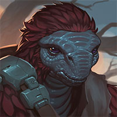
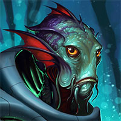
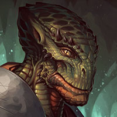

# Where the Wild Things Are (Part 2) 

 
<b>Session started at 2026-01-26 / 21:15</b>
 

*Fen's StarTrekAdventures Ruleset (v1.1.5) * 
*[Prioritized Source: File; Other Sources: Vault]* 
*Core RPG ruleset (2026-02-05) for Fantasy Grounds
Copyright 2026 Smiteworks USA, LLC* 
*Fen's STA House Rules (v1.0.1) * 
*FG Browser v1.2.3* 
*[Prioritized Source: File; Other Sources: Vault]* 

KruschtyaEquation (Hailey Murry): Hailey wants to go to Gul Haloras - Strategic Dominance and Senator Sorak - That Which We Share.  
>INTERIOR - Lounge: Gul Haloras shoves Malat away as he grabs his bottle of Kanar from the table. Malat begins to bellow steam from her ears as she grabs Gul Haloras by his collar... 

**Lt. Cmdr Malat** You're going to go back to your quarters now... sir. On your feet, or in a box 
*Kolea hurries over to the quarelling pair.* 
*Kolea puts her hand gently on Gul Haloras' shoulder.* 
**Kolea** As a medical professional, perhaps you could describe to me in great detail your excellent record in crushing Bajoran skulls, I believe that is what you said. I mean, hers is hardly worth bloodying yourself over. Think of all the paperwork it would cause as a diplomatic incident. 
**Kolea: [ REASON  (9) +  MEDICINE  (4)]
[Focus: Psychology ]
[Successes: 3] [Complications: 0]
Success with 2 momentum [2d20 = 8]** 
*Hailey Murry steps up to help pull Malat away, communicating more with her posture than with her words. * 
*Gul Haloras seems to calm down a bit* 
**Gul Haloras** True, this mongrel halfbreed is hardly worth the effort 
**Hailey Murry: [ PRESENCE  (10) +  SECURITY  (3)]
[Focus: Diplomacy ]
[Successes: 0] [Complications: 0]
Failed on DC: 1 [2d20 = 28]** 
**Lt. Cmdr Malat** Is that a weapon? 
*Lt. Cmdr Malat looks at Haloras' belt* 
**Gul Haloras** Are you blind as well as stupid? 
indarien (Kolea): REALLY wants to say, "No, he's just really excited to see me" 
>Malat pulls out her phaser and shoots Gul Haloras, stunning him 

*Kolea activates Picard Facepalm meme.* 
**Lt. Cmdr Malat** Oh, my mistake. I thought I saw a weapon in his belt. 
**Lt. Cmdr Malat** No harm, no foul. 
**Kolea** Well, I will take him down to SickBay for observation, thank you for choosing to use Stun. 
*Kolea rolls her eyes.* 
*Lt. Cmdr Malat puts her phaser away and walks out of the lounge* 
**Zox** Okay Lt. Commander, time to put the weapon away. 
**Zox: [ DARING  (12) +  SECURITY  (5)]
[Focus: Espionage ]
[Successes: 2] [Complications: 0]
Success with 1 momentum [2d20 = 21]** 
**Kolea: [ DARING  (9) +  SECURITY  (4)]
[Focus: Syndicate Training ]
[Successes: 1] [Complications: 0]
Success with 0 momentum [2d20 = 23]** 
Masakari (Zox): Bubblegum, keys, portrait of his ship, some sort of Cardassian dagger...what do we have in here? 
*Kolea does not notice Zox either Planting Evidence On OR removing items from Gul Haloras.* 
*Admiral Janeway walks into the lounge just in time to see Kolea and Zox carrying Haloras away unconscious* 
**Zox** I'll help you get him to Sick Bay.  
**Admiral Janeway** Well I can see things are off to a good start so far 
**Kolea** Yes ma'am, situation normal for the Lister. 
**Proconsul Vrell** If this is a normal day for you, I should come visit again sometime 
**Proconsul Vrell** I'd come watch that arrogant ass get shot any day. 
**Kolea** Sometimes the really arrogant ones have the sticks in their ass catch on fire as well. 
*Zox Wonders if there's a conference where both Gul Haloras and Malat are picked from the audience to learn conflict resolution.* 
**Hailey Murry** It's a constant struggle 
**Rhuk** Come for the fight, Stay for the food! 
**Hailey Murry** Or vice versa, I suppose 
**Proconsul Vrell** Haloras will come anywhere with an open bar 
**Proconsul Vrell** Just don't let him start talking about his dead family, you can't get him to shut up again 
**Proconsul Vrell** He's more fun when he's an angry drunk, sad drunks are dull 
*Kolea makes a mental note to ask about his dead family as a distraction.* 
**Kolea: [ INSIGHT  (11) +  SECURITY  (4)]
[Focus: "Diplomacy" ]
[Successes: 3] [Complications: 0]
Success with 2 momentum [2d20 = 13]** 
**Zox: [ CONTROL  (11) +  SECURITY  (5)]
[Focus: Espionage ]
[Successes: 1] [Complications: 0]
Success with 0 momentum [2d20 = 33]** 
**Proconsul Vrell** I do need to go speak to your security chief about setting up my event however, I must go track her down before she gets arrested 
**Hailey Murry** I'll come with to help track her down 
*Proconsul Vrell grabs a glass of champaigne as she saunters out of the room in search of Malat.* 
**Skig: [ REASON  (10) +  ENGINEERING  (5)]
[Focus: Enhanced Interrogation ]
[Successes: 2] [Complications: 0]
Success with 1 momentum [2d20 = 22]** 
**Zox: [ REASON  (7) +  ENGINEERING  (4)]
[Focus: Shipboard Tactical Systems ]
[Successes: 2] [Complications: 0]
Success with 1 momentum [d20 = 1]** 
Masakari (Rhuk): "I want to sabotage my friend"
Dice: Nope 
indarien (Kolea): We've broken their code! 
**Rhuk** Well.....I have to go put the original back. 
*Skig looks at Zox.* 
**Zox** But this has been an amazing engineering session of a 1:1 recreation of a positronic matrix embedded in an isolinear rod 
**Skig** I can only assume you fell very far from the genetic tree your mother is part of, perhaps you were a pruned offshoot. 
**Skig** However, rarely have I seen such perfection, it's like you designed a next generation Isolinear Rod with 10x the capacity at a fraction of the production cost. 
*Captain Bachar walks in on Skig and Zox making the copy of Gul Haloras' isolinear rod* 
**Zox** I can only assume we differ in methods. Words and food are just more....civilized. 
**Skig** Captain. 
*Zox stands at attention.* 
**Captain Bachar** I am going to abstain from asking about this so I don't have to mention it in my eventual court martial  
**Skig** It is best. 
**Zox** Gra'lan serves as a distraction here. Not enough time to court martial em all. 
**Captain Bachar** I talked to Janeway, she doesn't want you breaking her ship again. So the away team is going to have to use Ol' Faithless 
**Skig** In fact, I will suggest that Obliviousness is Bliss ma'am. 
*Skig shudders.* 
**Skig** WHAT? 
**Skig** I can definitely understand Admiral Janeway's concern, but we should take a more circumspect ship that is not so obviously Tellerite Engineering Personified and Perfected. 
**Hailey Murry: [ INSIGHT  (13) +  MEDICINE  (4)]
[Focus: Deception ]
[Successes: 2] [Complications: 0]
Success with 1 momentum [2d20 = 27]** 
*Zox perfects the 'Made in Cardassia' labels and technologies on the rod.* 
**Zox** I best be moving.  
*Zox lets out the wootle of subterfuge.* 
*Skig adds in a "Property of Obsidian Order" tag.* 
**Captain Bachar** Well in that case, I suppose you can take the civilian transport or a standard shuttle. Any thoughts on the away team? 
**Captain Bachar** I think the best time for the away team to depart is immediately after the meet-and-greet, everyone will have shown their face enough to alay suspicion and things will be a bit busy, good time to slip away unnoticed 
Masakari (Zox): Darisha would always be useful. 
Masakari (Zox): Mowus is still carping at losing the ability to study the Pelarians. 
**Darisha-Han** Clandestine operations? Subtlety? We won't miss a detail! 
Masakari (Darisha-Han): 'Action Figure the Alien' 
**Captain Bachar** Assemble your team, you can depart at your discretion. 
**Captain Bachar** I have to head to Gul Haloras' event, I hope he sobers up a bit first 
**Skig** I believe we are ready to go, I am very grateful for this opportunity to demonstrate my leadership skills. 
*Skig flips over card to see if there is anything else she needs to read off it.* 
**Skig** These were a great idea. 
**Kolea: [ REASON  (9) +  MEDICINE  (4)]
[Focus: Xeno-biology ]
[Successes: 2] [Complications: 0]
Success with 1 momentum [2d20 = 20]** 
*Kolea "exercises" Gul Haloras to sober him up.* 
>INTERIOR - Conference Room III - Gul Haloras stands in the center of the room, around him are many small tables each with a single chair. As the attendees file in, they sit down at the tables around the room. On each table is a small grey and blue board covered with small polymer pieces. 

*Kolea is showering and unable to attend, it takes a while for her hair to dry.* 
*Mowus wants to attend a class on conflict due to being an anthropologist.* 
**Gul Haloras** If you would all your take your seats, what we will be doing today is learning how to think strategically. And learning more about how all of our difference species visualize strategic challenges 
**Mowus** Oooooh Im bubbling with excitement. 
**Gul Haloras** In front of you is a Kotra board, I trust you are all familiar with the game. Kotra is a game of strategy, such games are useful to hone your strategic thinking skills.  
**Gul Haloras** Whether something as simple as Kotra, or large-scale wargames coordinated between our respective governments. 
**Gul Haloras** Naturally, my own strategic skill are far too great to expect any of you to overcome them alone, which is why I will be playing all of you at once. Together, we can learn from one another and hone our understanding of our mutual strategic thinking. 
*Zox somewhere off in the distance, remembers this strategic genius losing to a garbage field and a salvage merchant.* 
Masakari (Zox): Sun Tzu get. 
**Gul Haloras** Hmm, most enjoyable 
KruschtyaEquation (Hailey Murry): 3v1 chess games vs DM, and we lost all three lol 

> https://lichess.org/5j03qjT0 Mowus with Black, Gul Haloras with White
> https://lichess.org/32zIlGQ9 Throk with White, Gul Haloras with Black
> https://lichess.org/eDl8mB4r Hailey Murry with White, Gul Haloras with Black

Masakari (Zox): Mowus was game #3, lost to time 
**Gul Haloras** Mowus, you  show deft strategic thinking but you are too thoughtful. If you could learn to be more decisive, act with greater speed, you would be a truly worth opponent 
**Zox** Why thank you! I learned much and had fun! 
**Mowus** Why thank you! I learned much and had fun! 
**Mowus** I always try to use the Finnish opening. =D 
**Throk** Your game is most interesting, but the captured pieces are far too chewy and taste of wood. 
**Gul Haloras** And you, Hailey Murry. You are agressive, but you act without thinking. Before you charge at your enemy you must first consider whether you are exposing yourself to counterattack. 
**Gul Haloras** And you Throk... I am thankful that you refrained from any attempts at violence over the outcome of the game 
**Throk** It okay, Throk waiting for you to eat loser's pieces to assert dominance in proper fashion. 
**Gul Haloras** These excercise may seem trivial, but through this struggle we can learn about our respective strategic thinking. 
**Hailey Murry** It's been probably 30 years since I played that. I took on the strategy to try and time you out, put some pressure onto you.  
**Throk: [ INSIGHT  (9) +  SECURITY  (4)]
[Focus: Animal Training ]
[Successes: 3] [Complications: 0]
Success with 2 momentum [2d20 = 9]** 
**Hailey Murry: [ INSIGHT  (13) +  SECURITY  (3)]
[Successes: 2] [Complications: 0]
Success with 1 momentum [2d20 = 24]** 
**Mowus: [ INSIGHT  (10) +  SECURITY  (3)]
[Focus: Anthropology ]
[Successes: 2] [Complications: 0]
Success with 1 momentum [2d20 = 16]** 
**Gul Haloras** A worthy strategy for a simultaneous game such as this, I commend your outside the box thinking 
**Throk** Throk recommend coating pieces in bacon grease in the future, makes game more approachable. 
indarien (Throk): AFK 
**Mowus** I believe I will be acquring some Kotra boards. 
**Gul Haloras** I hope that everyone has learned something valuable. I find that games like Kotra give a unique insight into the way we think strategically and tactically  
**Mowus** Much more engaging than watching Throk hunt crew members or Kolea take them to sick bay for no apparent reason. 
**Gul Haloras** Throk sounds like an interesting fellow, I am glad to have met him 
**Hailey Murry** He's a lot more than meets the eye, and he is quite a lot that meets the eye 
**Mowus** decides he has changed his mind about Gul Haloras, and despite coming to blows with Malat, is respectable. 
*Mowus decides he has changed his mind about Gul Haloras, and despite coming to blows with Malat, is respectable.* 
**Gul Haloras** Of that I have no doubt 
Masakari (Mowus): 'Sharpen a bishop into a shiv and attack' 
Masakari (Mowus): Wish we had stolen a ship from KRAZY KOOLAKOR's yard. 
>INTERIOR - Civilian Transport: Skig and her team are prepping the shuittle for launch, trying to get out while the attendees are all still distracted with Gul Haloras' event. 

**Darisha-Han** I sure hope this vessel has all the modern fixings we have grown accustomed to on the Lister... 
**Lt. Cmdr Malat** You are going to be dissapointed 
**Darisha-Han** Can it at least barrel-roll? 
**Darisha-Han** Can it do _anything_ to one up Ghex? 
**Lt. Cmdr Malat** Anything can barrel roll if you don't mind crashing 
**Shaya Antin** I would prefer not to crash 
*Darisha-Han 's eyes light up.* 
*Shaya Antin slips into the shuttle unnoticed and takes a seat* 
**Darisha-Han** Ooooh, tell me all about the vibes you have getting ready for this mission! 
**Linella** Aren't you required to stay here and provide assistance?  
*Darisha-Han flips through her notepad and produces a pen out of no where.* 
**Shaya Antin** I'm not coming, I just came to warn you 
**Darisha-Han** Aww..... 
**Darisha-Han** Look, one of us is already in peices, we really need your expertise! 
**Shaya Antin** I did a little more digging through the manifests, this facility has received a lot of organic shipments in the past year. Several thousand kilograms 
**Shaya Antin** If Neraran is making a bio-weapon, she could be making an awful lot of it. 
**Shaya Antin** Be very, very careful out there 
**Shaya Antin** Good luck 
**Linella** You as well! 
*Shaya Antin slips away quietly* 
**Lt. Cmdr Malat** Yay... thousands of kilograms of bioweapons 
**Lt. Cmdr Malat** Does this still sound like more fun than the conference to you Commander? 
*Lt. Cmdr Malat turns to Skig* 
**Skig** I can only hope it kills us quickly and prevents me from having to attend Closing Ceremonies. 
>♫♫♫Lighthearted Music Sting♫♫♫ 

>---------CUT TO COMMERCIAL------- 

