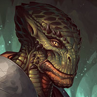
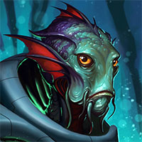
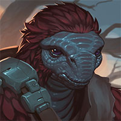
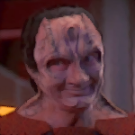
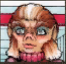

# Where the Wild Things Are (Part 3) 

 
<b>Session started at 2026-02-21 / 04:06</b>
 
Fantasy Grounds - v5.1.4 (2026-02-19) 
Fen's StarTrekAdventures Ruleset (v1.1.5)  
*[Prioritized Source: File; Other Sources: Vault]* 
*Core RPG ruleset (2026-02-17) for Fantasy Grounds
Copyright 2026 Smiteworks USA, LLC* 
*Fen's STA House Rules (v1.0.1) * 
*FG Browser v1.2.3* 
*[Prioritized Source: File; Other Sources: Vault]* 
KruschtyaEquation (Linella): (brb gotta grab my pills) 
GM: BTW we are going to open with one of the crew-run meetings, so do you want to open with "Celebratory Toasts" run by Murry, "Negotiation Tones" with T'Kor, or "Cultural Metaphors" with Throk 
KruschtyaEquation (Linella): Back!  

>Throk reviews the dishes prepared by Rhuk and her team in the lounge to prepare for his panel. As he examines the various platters, attendees begin to file in, ready to learn about cultural metaphors from a man that might randomly decide to eat them if the mood strikes him. 

**Throk** O fragile life, thou coil of spiced delight,
A sausage hissing o’er primordial flame;
Within its skin the chaos learns its rite,
Raw hunger tamed and given mortal name.

I, scaled Gorn sage from stars of verdant mist,
Proclaim this truth with fanged philosophy:
We bite, we chew, the cosmos in our fist,
And find in feasting brief eternity.

The casing snaps—so snaps the thread of breath;
Savory smoke ascends like prayer on high.
To eat is pact with time, defiance of death,
Each grease-bright drip a reason not to die.

So take the link, embrace existence’ stage—
For life, like sausage, sweetens when we rage. 
*Zox looks around for Windlboom violating the, no psychotropics to the gorn.* 
*Captain Kaglor wipes a single tear from his eye* 
**Captain Kaglor** Throk has beautiful words 
**Throk** Now Throk invite you all, we shall discuss the fine art of cultural understanding through consumption of blood sausage. 
**Senator Sorak** I agree, he is surprisingly eloquent for a Gorn 
**Throk** Throk like this style, it explode nicely in mouth. 
**Throk** Throk think Captain Kaglor discussion of metal four very good, did Captain bring large prop with him? Throk thinking of attaching spikes to it for impaling of Targ. 
*Throk gestures to attendees.* 
*Mowus cuts up the sausage into flakes before adding it to his bowl hat. * 
**Zox: [ REASON  (7) +  SECURITY  (5)]
[Focus: Espionage ]
[Successes: 2] [Complications: 0]
Success with 1 momentum [d20 = 4]** 
**Captain Kaglor** Metal Four is in cargo bay 3. Captain Kaglor can go get it for you. 
**Zox: [ REASON  (7) +  SECURITY  (5)]
[Focus: Espionage ]
[Successes: 1] [Complications: 0]
Success with 0 momentum [d20 = 11]** 
*Mowus bloop bloop bloop.* 
**Throk** Please take seats, enjoy blood wine, blood sausage, blood pudding, and we shall discuss important relevant metal fours from different cultures. 
**Throk** Throk call on fish man whose face is turning red to make comment on importance of metal objects in his society. 
*Throk walks over to Mowus and hands him the Baton of BBQ Skewers to indicate it is his turn to talk.* 
**Mowus** Metal is like flavor, a temporary thing to be savored, for it will eventual rust and rot. Enjoy your moment of artistry. 
*Mowus drops the contents of the skewers into the bowl helm. * 
**Mowus** This is superb Throk. What is the secret ingredient? 
**Korana, daughter of Ganath** The blood of his enemies 
**Hailey Murry** Fleeting things are often considered more beautiful for just that reason. The appreciation we share of it is temporary, and to make it longer requires ongoing effort. Metal may rust, but if it's cared for well then it can last for centuries 
*Throk shrugs at Korana.* 
**Throk** No, Throk not allowed to feed members of Starfleet other members of Starfleet after last incident. 
**Hailey Murry** Nor enemies of Starfleet 
*Throk claps at Murry's response.* 
**Throk** Throk think old lady who is mother of Zox's children is very wise. 
*Rhuk Raises an eyebrow from the kitchen.* 
**Zhuang Ki** Great acts are made of small deeds, every great tree that fills man's embrace grows from a seedling, and every great BBQ skewer that fills a man's belly grows comes from simple ingredients. 
**Hailey Murry** I am not a mother, but thank you 
*Hailey Murry is visibly nettled at that* 
*Mowus 's helmet water is visibly discolored.* 
**Throk** We all need to appreciate life for it is unknown how soon we will return to the cosmos and feed others. 
**Mowus** What's next? I can't stop eating! 
**Throk** All bright sparks must fade
Bones cool before feast is done
Meat tastes less in dusk 
*Throk drops some sashimi in Mowus helmet.* 
*Mowus bloop bloop bloop.* 
**Mowus** Isn't feasting so much better than going to war? 
**Throk** Exactly! 
**Throk** Much more enjoyment had from simple conversation and good food, then risking death for poor food. 
*Mowus is barely audible and the water has become so foggy as to conceal anything)* 
**Throk** Mighty Gorn Empire lucky that we can eat all foes, Klingons have great fortitude to eat delicious meats in combat. But many races lack savory food choices. Better to dine with bloated stomach than have to chase after humans to consume after they cry and blubber and defecate on themselves. 
**Throk** Uhh... Throk speaking hypothetically, of course. 
**Ensign Ghex** Um, I am not convinced that is a metaphor. I think there is actually like... at least a 40% chance that Throk has eaten humans. Does that scare anyone else? Or just me? 
*Throk hands Ghex the Baton of BBQ Skewers.* 
**Korana, daughter of Ganath** Do not br frightened child, if he attempts to eat you I will cut out his heart 
**Proconsul Vrell** I will watch 
**Throk** Ghex should tell us something of her species food eating ways. 
**Proconsul Vrell** I certainly wouldn't fight a Gorn for some random Andorian kid 
*Throk looks at Korana and Vrell.* 
**Hailey Murry** I think that shows a bit of lack of foresight there. I doubt she'd be filling 
*Rhuk hands Ghex an emergency pocket Siraccha. In event of being stalked by a gorn, spray your friend and run.* 
**Rhuk** Poor child is scared witless. 
**Throk** Throk appreciate Klingon defense of small creature that Throk would not harm. 
**Hailey Murry** Fortunately, Throk's been quite good at adhering to Federation principles  
**Throk** Throk also had heard rumors of how much Procounsel Vrell enjoys watching. Perhaps Procounsul can educate us on wisdom of Romulan satueed liver? 
**Proconsul Vrell** Oh if you want to learn about Romulan dining practices, you'll just have to come to my panel 
*Proconsul Vrell cackles* 
*Hailey Murry raises an eyebrow* 
*Rhuk bubbles enthusiastically.* 
*Mowus bubbles enthusiastically.* 
**Senator Sorak** You'll have to forgive my colleague, she can be a bit rude at times 
**Throk** Throk thought cackle was ominuous, except for snort and sudden unexpected passing of gas at the end. Perhaps you should lower carbonic acid intake? 
**Zhuang Ki** Do not expect a bear to share its den, and do not come in spring. 
**Hailey Murry** She's still young 
*Throk responds to Zhuang Ki.* 
**Throk** Expect not sharp shoals
To soften jaws for thy plea—
Enter not at dawn. 
*Rhuk wheels out a cart of spiced Voth vegetables and mixed drugs, for the herbivores and chemivores among the conference.* 
**Senator Sorak** If only I shared your hope for her future, sadly she is unlikely to outgrow her personality 
**Proconsul Vrell** Perhaps not, but at least I can outlive both of you 
**Korana, daughter of Ganath** That remains to be seen, you move your mouth too much. It can be hazardous to your health 
*Hailey Murry sips her wine to cover her smile at Korana's comment* 
**Gul Haloras** Ah yes, another fight. I wager 10 strips on Korana 
**Throk** Throk think it never impossible for people to change, for instance, with enough mastication, even a Tholian turns into a carbon based dropping. 
*Throk scratches head.* 
**Ambassador Garak** I think you're underestimating Vrell, I'll take that bet 
**Throk** Throk excited to see that popular event known as table-side blood sport fighting is popular in diplomatic circles also. 
**Hailey Murry** Vigor and gumption can get someone pretty far, I was a lot like that in my youth 
*Throk divides up Rhuk's offering and hands out plates of food for everyone.* 
**Throk** Throk excited to offer excellent cuisine from Voth chef while discussions continue. 
*Throk munches down another plate of blood sausage.* 
**Rhuk** What a gentleman! Thank you Throk! 
**Zhuang Ki** A young bends while an old tree breaks, but an old tree casts a larger shadow 
**Gul Haloras** Are they not going na fight? I was really hoping for the entertaiment 
**Hailey Murry** No, they're not going to fight 
*Gul Haloras grabs another glass of champaigne * 
**Gul Haloras** 's a shame 
**Hailey Murry** Scheduled competitions are okay, but we do discourage impromptu fights here.  
**Gul Haloras** Where's that pet bashoran 'o yours, she's easy to goad into a fight 
*Gul Haloras laughs* 
*Rhuk Doesnt' think Gul Haloras has very high tolerance for booze....* 
**Throk** Throk curious how Senator Sorak would consider changes in dietary and food programs relevant to agricultural subsidies and revisions to romulan exports as a way to foster positive relations among other species of Alpha and Beta Quadrants? 
**Senator Sorak** The agricultural sector is small in the Romulan economy, there is not much demand for non-replicated food. Most of our agricultural sector is growing grain for Romulan Ale production 
**Senator Sorak** I have been involved in efforts to lobby the Federation to life their ban on the importation of Romulan Ale in recent years, we feel that there is a lot of demand amongst Federation citizens for Romulan Ale, and the trade could strengthen relations  
**Throk** Throk think the best way to a person's heart is through the soft abdominal lining and not the ribcage, so good idea. 
**Korana, daughter of Ganath** A Bat'Leth offers enough leverage with a fine enough point that it can easily drive through a ribcage 
**Korana, daughter of Ganath** I would be happy to show you the proper technique 
**Rhuk** May I borrow your Bat'Leth? 
**Gul Haloras** I have a few techniques I could show *you* Korana 
**Korana, daughter of Ganath** Pardon me for one moment Rhuk 
*Korana, daughter of Ganath turns around and hip throws Gul Haloras through a table* 
**Korana, daughter of Ganath** I will return him to his quarters 
**Hailey Murry** Don't worry, we'll take care of that 
**Throk** Throk not sure Korana's pent up sexual frustration should be used to split Cardassian into 1/4 size pieces. 
*Hailey Murry gets up to help take care of that herself* 
*Korana, daughter of Ganath drags Gul Haloras out of the lounge and towards the turbolifts* 
**Throk** But chanigng topics, when it comes to Founders, wouldn't the interest or lack thereof when it comes to culinary appreciation be relevant for counter-Founder operations. Would you agree, Procounsel? 
**Zox** Technically, we have an obligation to look after the safety and well being of our guests, so we must take custody of Gul Haloras, Korana. 
**Zox** Thank you for lifting him this far.  
**Proconsul Vrell** Founders are a disease to be purged from the galaxy 
**Hailey Murry: [ INSIGHT  (13) +  SCIENCE  (4)]
[Successes: 2] [Complications: 0]
Success with 1 momentum [2d20 = 26]** 
**Throk** Throk in agreement, not even tasting good the icky things. 
*Hailey Murry lets Korana drag Haloras away* 
**Proconsul Vrell** You agree? Tell me, how many founders have you purged? 
**Throk** Throk suspect everyone is Founder until he chews on them to determine whether their body tastes like Founder or Chicken. Therefore, number is likely hard to determine without toothpicks. 
*Zox 's helmet bubbles furiously, explaining the Federation's role during DS9 and how it was basically a crime that no one should take pride in, but all that comes out is bubbles.* 
*Mowus 's helmet bubbles furiously, explaining the Federation's role during DS9 and how it was basically a crime that no one should take pride in, but all that comes out is bubbles.* 
*Mowus excuses fish-self to water-change.* 
**Proconsul Vrell** Susecting everyone is a good approach. That is how I found a shapeshifter during the war, it had replaced a senator and was feeding military intelligence reports to the Dominion. Universal surveillance is the solution 
**Proconsul Vrell** Then when you find them, a disruptor on a very low setting can slowly and painfully disintigrate them over the course of several minutes 
**Throk** Exactly, Throk think anyone who is afraid to drench self in Sriracha and accept "Bite of Proof" is suspect. 
**Hailey Murry** That seems to be quite the visceral distaste you have for them. I imagine you have quite the history with the Dominion.  
*Throk hands Vrell a packet of Sriracha.* 
**Proconsul Vrell** I would do the same to any enemies of the Romulan Empire 
**Proconsul Vrell** From within or without 
*Proconsul Vrell looks directly at Senator Sorak* 
**Senator Sorak** Well this has been a lovely event Mr. Throk, but I am going to retire to my quarters to rest before Korana's panel 
**Senator Sorak** I fear what she might have in mind for us 
**Hailey Murry** Thank you for attending, Senator 
**Throk** Throk agree. Everyone load up on delicious bloody foods and then take nap before engaging in Klingon Yoga. 
**Mowus** Thank you Throk! 
*Throk is excited for everyone to leave so he can have the leftovers.* 
**Throk** When dawn’s first light on hunter’s scales doth gleam,
And hearth-fire wakes with crackling, amber breath,
The mortal coil is more than hunter’s dream—
It fattens joy and starves the gnaw of death.

For what is life but marrow, rich and sweet,
Drawn slow from bone with reverential care?
What throne outshines a well-prepared feast of meat,
Whose fragrant steam ennobles common air?

The tongue, that humble priest of mortal clay,
Finds sacrament in spice and searing flame;
Through savory rites we chase despair away
And brand our fleeting hours with savor’s name.

So dine with gratitude, let hunger cease—
In honored feasts, fierce hearts discover peace. 
>♫♫♫Dramatic Music String♫♫♫ 

>INTERIOR - Civilian Transport: The crew approach the system containing the coordinates from Shaya Antin. The system has several gas giants, no ricky planets. A handful of moons, none habitable, and a large number of asteroids and comets in eccentric orbits. 

**Darisha-Han** The perfect lair! 
**Lt. Cmdr Malat** It looks like the entire system is pretty barren, no M class bodies, not even any L-class moons 
**Lt. Cmdr Malat** Just gas giants, barren moons and ice balls 
**Skig** The ideal place to hide a biological weapons facility. 
**Skig** No one would come here, it's like Nebraska. 
indarien (Skig): Skigs two fans in Nebraska are cheering they were mentioned after their year's long write-in campaign! 
**Darisha-Han** "Lister crew braves the space tundra named Nebraska! Read all about it!" 
**Lt. Cmdr Malat** Maybe you should hold on publishing a story about our highly secretive investigation into a bio-weapons lab 
**Darisha-Han** Oh im changing that in the released version. 
**Lt. Cmdr Malat** The real question is: If you were a psychotic vulcan researcher, where in this system would you hide a lab 
**Skig** It's okay, she has not noticed I changed the DNS settings on her PADD to use localhost for all of her article submissions. 
**Darisha-Han: [ INSIGHT  (9) +  SECURITY  (4)]
[Focus: Journalism ]
[Successes: 2] [Complications: 0]
Success with 1 momentum [2d20 = 17]** 
**Darisha-Han** A secret asteroid base? 
**Skig** To start with, we should look for gaps in the sensors which would indicate some manner of cloaking. Also scan for ion trails and residual fuel trails, accounting for gravitational drift. 
**Lt. Cmdr Malat** I can draw up a search pattern, where do you want to search first? The gas giants? Moons? Cometary orbits? Asteroid belt?  
**Linella** Aye, commander. This one can help perform the search. 
Masakari (Darisha-Han): THREE stations on the bridge. 
Masakari (Darisha-Han): Mr Potato head the species. 
**Skig: [ CONTROL  (11) +  SCIENCE  (3)]
[Focus: Master of Disguise ]
[Successes: 1] [Complications: 0]
Success with 0 momentum [2d20 = 26]** 
**Linella** This one might suggest that the asteroid belt is the best starting point. We may identify trails out there to point us to the smaller locations, like the moons or gas giant.  
**Skig** Excellent suggestion Numbers Four, Five, and Six. 
**Lt. Cmdr Malat** I'll plot a search pattern in the asteroid orbitals 
**Darisha-Han** OOooh can I help? 
**Lt. Cmdr Malat** That remains to be seen 
**Skig** Never underestimate the power of journalism to start a war through misinformation. 
**Linella: [ CONTROL  (9) +  SECURITY  (4)]
[Focus: Astronautic Engineering ]
[Successes: 1] [Complications: 0]
Success with 0 momentum [d20 = 5]** 
**Darisha-Han: [ CONTROL  (7) +  SECURITY  (4)]
[Focus: Small Craft ]
[Successes: 1] [Complications: 0]
Success with 0 momentum [d20 = 5]** 
>Malat takes the transport into the asteroid belt and the search begins 

>♫♫♫Mysterious Music Sting♫♫♫ 

>---------CUT TO COMMERCIAL------- 

>INTERIOR - Cargo Bay 4: Korana has set up a ring, surrounded by ropes, and a number of racks holding Bat'Leths of different lengths. As the panel attendees file in, everyone looks around unsure as to what exactly she has planned, but assuming it probably involves violence. 

Masakari (Darisha-Han): 'Mutant Lava Spider from Hell Part 2 solo's entire crew at Bat'leth' 
**Korana, daughter of Ganath** Diplomacy is the language of your Federation, but for a Klingon warrior you cannot trust someone until you fight them 
**Hailey Murry** You learn a lot about someone's approaches when you fight them 
**Korana, daughter of Ganath** The Bat'Leth is our tool of choice for getting to know one another 
**Korana, daughter of Ganath** So we will fight, and we will learn  
**Korana, daughter of Ganath** You, green one 
*Korana, daughter of Ganath points at Kolea* 
**Korana, daughter of Ganath** Make sure no one dies 
*Kolea points at Korana.* 
**Korana, daughter of Ganath** These training Bat'Leths are blunted, but they will still draw blood 
**Korana, daughter of Ganath** We fight to the blood 
**Kolea** Does that include you? 
**Korana, daughter of Ganath** Of course 
**Korana, daughter of Ganath** It would be cowardice to make others fight and not include myself 
**Kolea** No, I was asking if you wanted me to make sure you lived. 
**Korana, daughter of Ganath** That is optional 
**Korana, daughter of Ganath** If I die in battle, then so be it 
**Korana, daughter of Ganath** But to kill in training is a fool's errand, and a dishonor on your family 
Masakari (Tal'oran): "Zox proceeds to hold the Bat'leth with his mouth and the dagger with his tail, an exemplar of Reptile-fu" 
*Korana, daughter of Ganath grabs a Bat'Leth from the rack* 
**Korana, daughter of Ganath** Human, the computer has matched us 
**Kolea** I look forward to you bringing much honor to your family while teaching others the fine art of Klingon Diplomacy. 
**Korana, daughter of Ganath** You are not a worthy opponent, but I will try not to injure you 
**Rhuk** I really need one of those for cold cuts. Zox-y dear, ask the nice Klingon if they offer them as cultural exchange items! 
*Kolea gets out a bag of popcorn and some bandages.* 
**Korana, daughter of Ganath** I look forward to fighting the Gorn 
>Korana and Viraseti step into the ring, Viraseti attempts to thrust her Bat'Leth at Korana, but Korana effortlessly slaps it aside, then immediately drives an attack forward against Viraseti. She controls Viraseti's blade with her own, and drives the end of her Bat'Leth into Viraseti's ribs, dropping her immediately 

*Kolea checks Viraseti for injuries.* 
**Lt. Cmdr Viraseti** I'm Ok Kolea, just a bit embarrased. I had hoped to put up a bit more of a fight 
**Zox: [ INSIGHT  (7) +  SECURITY  (5)]
[Successes: 1] [Complications: 0]
Success with 0 momentum [2d20 = 20]** 
**Rhuk: [ DARING  (10) +  MEDICINE  (4)]
[Successes: 0] [Complications: 1]
Failed on DC: 1 [2d20 = 39]** 
Masakari (Rhuk): FUUUUUUUUUUUUUUUUUUUUU 
indarien (Kolea): So... early cliffhanger? 
Masakari (Rhuk): Everyone thought Throk was diplomatic incident.... 
indarien (Kolea): I'm going to point out that Throk engaged in NO shenanigans. 
>Ghex lunges at Gul Haloras, but he deflects her blade and steps through her guard with his Bat'Leth raised. His eyes are bloodshot and red, and he howls in rage as he drives the Bat'Leth into Ghex's neck with all his strength, dealing 14 damage and sending the small andorian tumbling backwards across the deck in a spray of blood 

indarien (Kolea): I was thinking about Kolea shenanigans here... but... just keeping everyone alive and possibly "certifying" that Janeway is dead is likely it. 
>Gul Haloras raises his bloody Bat'Leth and lunges at "Malat" while holwing  

**Gul Haloras** FOR CARDASSIA! 
**Kolea: [ DARING  (9) +  MEDICINE  (4)]
[Focus: First Aid ]
[Successes: 2] [Complications: 0]
Success with 1 momentum [2d20 = 19]** 
>♫♫♫Lighthearted Music Sting♫♫♫ 

>---------CUT TO COMMERCIAL------- 

Masakari (Rhuk): "Ordered 1v1 -&gt; Royal Rumble' 
Masakari (Rhuk): Ghex is going to come back in the series after this with an eyepatch as the hard-ass character who has seen everything and is no-nonsense. 
Masakari (Rhuk): If Bat'leth was used as an eating utensil, he'd also be higher... 
