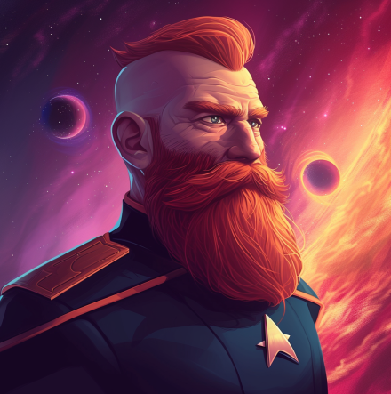

# Where the Wild Things Are (Part 4) 

 
<b>Session started at 2026-03-14 / 21:36</b>
 
Fantasy Grounds - v5.1.6 (2026-03-13) 
Fen's StarTrekAdventures Ruleset (v1.1.5)  
*[Prioritized Source: File; Other Sources: Vault]* 
*Core RPG ruleset (2026-03-01) for Fantasy Grounds
Copyright 2026 Smiteworks USA, LLC* 
*Fen's STA House Rules (v1.0.1) * 
*FG Browser v1.2.3* 
*[Prioritized Source: File; Other Sources: Vault]* 

>INTERIOR - Cargo Bay 4: Gul Haloras charges wildly at "Malat" with Ghex's blood still dripping from his blade. His eyes are red with fury from whatever psychoactive compound Rhuk gave him. 

**Gul Haloras** RAAGH! 
**Rhuk** this is how they start a 2 drink limit in starfleet.... 
KruschtyaEquation (Hailey Murry): Canon: The filming of the show got suspended for a bit because Ghex's actor got injured in the filming of the last scene 
*Rhuk eats voth-popcorn from the sidelines* 
**Rhuk** Ever make you think, that they always throw some sort of colosseum into these things? 
*Rhuk continues to enjoy see the galaxy's best violence each other.* 
>As Haloras charges "Malat" she raises her Bat'Leth and they fall upon each other. Haloras manages to dig a hook into Malat's shoulder, but in the process he leaves himself open to a counter attak. "Malat" hooks the blade over the back of his neck and with all her body weight, drives his head into the deck, knocking him out. 

*Zox wootles the wootle of great victory.* 
**Throk** Throk find it amazing that civilized Starfleet manages to find ways to engage in violent cage match behavior but complains when Throk tear limbs off Targ in middle of crew lounge. 
>As she stands back up, a trickle of blood runs down her uniform as she pulls the Bat'Leth out and tosses it onto the deck, then walks over towards Kolea with a hand on her bloody shoulder 

**Kolea: [ DARING  (9) +  MEDICINE  (4)]
[Focus: First Aid ]
[Successes: 1] [Complications: 0]
Success with 0 momentum [2d20 = 29]** 
**Kolea** Please take a number. 
*Kolea secures Ghex's head and neck (AGAIN) and has her transported back to sickbay, then looks at "Malat's" injury.* 
**Korana, daughter of Ganath** He fell victim to his own bloodlust 
**Hailey Murry** I've got you, jeez 
**Hailey Murry: [ DARING  (10) +  MEDICINE  (4)]
[Focus: Field Medic ]
[Successes: 2] [Complications: 1]
Success with 1 momentum [2d20 = 23]** 
**Korana, daughter of Ganath** We will proceed, we will give the Bajoran time to rest before she faces the fish man 
Masakari (Darisha-Han): where is Geret? :3 
**Kolea** That sliced up some connective tissue looks rather deep, we should get you to sick bay to apply a dermal mender and get you sealed up. 
Masakari (Darisha-Han): YES. 
Masakari (Darisha-Han): whale whale whale, look what we rolled..... 
>As Murry goes to check on Malat, she flips on the dermal regenerator before "Malat" can warn her. The dermal regenerator does its job, and begins to regenerate skin over the "injury" based on the Bajoran/Cardassian DNA it registers. However, this causes Bachar to wince in pain, and a geyser of blood shoots out of the wound as the interaction between the new skin and her morphogenic matrix cause her to accidentally squeeze out far more of the blood than she had intended. 

**GM** Thankfully, no one notices as "Skig" sneezes on the other side of the room and a Gormagander suddenly starts crushing half of the tournamet participants. 
>Thankfully, no one notices as "Skig" sneezes on the other side of the room and a Gormagander suddenly starts crushing half of the tournamet participants. 

**Rhuk** At last! I can try my seasoned space plankton recipe!  
Masakari (Rhuk): Zox/Tal'oran 
KruschtyaEquation (Hailey Murry): T'kor first, then Kurij 
Masakari (Rhuk): YOU ARE ALL CRUSHED. 
**Darisha-Han** Today we learned that Gourmagandr sometimes spontaneously drop out of subspace. 
*Kolea facepalms.* 
**Korana, daughter of Ganath** What in Kahless' name is this!?!? 
**Hailey Murry** DAMN IT SKIG! You are NOT allowed to just skip out on team building exercises! 
**Hailey Murry** AGAIN 
Masakari (Geret): 'If you all work together, you can move a whale' 
**Korana, daughter of Ganath** What has the grumpy Tellerite done? 
*Geret makes whale noises.* 
**Zox** What a forgiving bracket.  
**Hailey Murry** She's probably holed up in Engineering or something, she's skipped out of icebreaker and team building exercises like this before 
**Korana, daughter of Ganath** I suggest your captain administers corporal punishment as soon as possible 
**Kolea** I concur with Korana. 
**Zox** Zox to transporter room. Code Ceteacean. You know the drill. 
**Zox: [ CONTROL  (11) +  SCIENCE  (4)]
[Focus: Shipboard Tactical Systems ]
[Successes: 3] [Complications: 0]
Success with 2 momentum [2d20 = 15]** 
*Kolea begins administering First Aid to incapacitated people.* 
**Kolea: [ PRESENCE  (9) +  MEDICINE  (4)]
[Focus: Xeno-biology ]
[Successes: 2] [Complications: 0]
Success with 1 momentum [2d20 = 20]** 
*Kolea sighs.* 
**Kolea** Survived a long trip over many years through the Delta Quadrant, gets killed by a randomly spawning Gormagandr in a Batleth tournament on a Constitution-class Starfleet Vessel. 
*Kolea pauses.* 
**Kolea** Seems strangely fitting actually. 
**Korana, daughter of Ganath** She deserved to die in battle 
*Kolea gets our her portable body bag and puts Admiral Janeway in it.* 
**Geret: [ FITNESS  (12) +  CONN  (2)]
[Focus: Weird Biology ]
[Successes: 3] [Complications: 0]
Success with 2 momentum [2d20 = 12]** 
*Kolea taps comm badge.* 
**Korana, daughter of Ganath** We continue. Warriors do not wallow and moan in the face of the death of their comrades 
**Hailey Murry** I'm not sure that qualifies as death in battle... 
**Kolea** Captain Bachar, I will need you to meet me in Sick Bay, there have been multiple people injured and one fatality in the Batleth tournament. 
*Kolea loads up the trolley stretcher caravan and takes half the bracket to Sick Bay.* 
**Korana, daughter of Ganath** Now more than ever you must steele yourselves against emotion and refocus on the battle to come 
**Korana, daughter of Ganath** A warrior must be able to compartmentalize the deaths of their friends and continue to do their duty. 
*Throk gets out some steel wool and begins flossing.* 
**Korana, daughter of Ganath** In her death, Admiral Janeway has given us all a powerful lesson in what it means to be a warrior. 
**Throk** Throk is very good at steeling himself. 
**Ambassador Garak** I fell entirely vindicated in my decision not to participate 
*Zox makes a mental note that the Klingon ancestral weapon is surprisingly non-lethal.* 
indarien (Throk): Procounsel Vrell is probably laughing her ass off watching through a camera feed. 
>Throk and Oakadan step into the ring. 

**Oakadan** Not the worst thing I've had to face down 
**Throk** Throk agree, he is face up. 
**Oakadan: [ INSIGHT  (8) +  SECURITY  (2)]
[Successes: 1] [Complications: 0]
Success with 0 momentum [2d20 = 21]** 
**Throk: [ INSIGHT  (9) +  SECURITY  (4)]
[Focus: Gorn-Fu ]
[Successes: 3] [Complications: 0]
Success with 2 momentum [2d20 = 15]** 
**Throk: [ DARING  (9) +  SCIENCE  (2)]
[Focus: Gorn-Fu ]
[Successes: 1] [Complications: 0]
Success with 0 momentum [2d20 = 25]** 
**Oakadan: [ CONTROL  (11) +  COMMAND  (4)]
[Successes: 2] [Complications: 0]
Success with 1 momentum [2d20 = 20]** 
*Oakadan deftly parries* 
**Throk: [ INSIGHT  (9) +  ENGINEERING  (2)]
[Focus: Gorn-Fu ]
[Successes: 1] [Complications: 0]
Success with 0 momentum [2d20 = 21]** 
**Oakadan** You'er too predictable 
**Oakadan: [ INSIGHT  (8) +  SECURITY  (2)]
[Successes: 0] [Complications: 0]
Failed on DC: 1 [2d20 = 35]** 
**Throk: [ DARING  (9) +  SECURITY  (4)]
[Focus: Gorn-Fu ]
[Successes: 1] [Complications: 0]
Success with 0 momentum [2d20 = 27]** 
KruschtyaEquation (Oakadan): ope I hit Command rather than Conn 
KruschtyaEquation (Oakadan): I got hit 
KruschtyaEquation (Oakadan): Oh wait I'm dumb  
**Oakadan: [ CONTROL  (11) +  COMMAND  (4)]
[Successes: 1] [Complications: 0]
Success with 0 momentum [2d20 = 19]** 
Masakari (Geret): 400lbs 8 foot reptile man. "Diplomacy" 
>Oakadan puts up a valiant effort, but on the second attempt the lumber gorn blasts through his defenses with sheer brute strength and clobbers him, knocking him to the ground and winning the match. 

**Korana, daughter of Ganath** A valiant effort by the weak man. But the Gorn's strength is too much 
**Korana, daughter of Ganath** A worthy opponent 
**Mowus** I'm bubbling with excitement for this strange ritual. 
**Throk** Throk offer Fire Safety Man opportunity to bite his own arm rather than Throk bite him to show defeat. 
**Mowus: [ INSIGHT  (10) +  SECURITY  (3)]
[Focus: Anthropology ]
[Successes: 3] [Complications: 0]
Success with 2 momentum [2d20 = 12]** 
>"Malat" and Mowus step into the ring to duel 

**Mowus: [ CONTROL  (10) +  CONN  (3)]
[Successes: 2] [Complications: 0]
Success with 1 momentum [2d20 = 14]** 
Masakari (Mowus): Mowus learned from terra's greatest martial artist...be water. 
*Kolea approves Mowus' message.* 
>Mowus binds his Bat'Leth against "Malat's" blade and throws them both to the ground as he pulls his dagger and plunges it into her arm. "Malat" tumbles to the ground as a trickle of blood runs down her uniform. 

**Lt. Cmdr Malat** Lucky shot 
**Mowus** I could eel you coming from a mile away 
**Lt. Cmdr Malat** Shut up, smartass 
**Mowus** you flounder around and leave yourself open 
**Mowus** Now you carp on. 
**Throk** Throk amazed how fish puns always make him hungry. 
*Lt. Cmdr Malat rolls her eyes and storms out of the cargo bay* 
**Korana, daughter of Ganath** She is a sore loser. A true warrior is magnanimous in defeat, and learns from their mistakes 
**Mowus** I always thought you were more of an alpha, but you are acting sort betta. 
*Throk gets out some Betta Food and puts it in Mowus' feeding tube.* 
*Mowus forgets all bluster and pecks at flakes.* 
**Throk: [ INSIGHT  (9) +  SECURITY  (4)]
[Focus: Gorn-Fu ]
[Successes: 2] [Complications: 0]
Success with 1 momentum [2d20 = 18]** 
**Throk: [ FITNESS  (10) +  SECURITY  (4)]
[Focus: Gorn-Fu ]
[Successes: 2] [Complications: 0]
Success with 1 momentum [3d20 = 41]** 
GM:  [Total: 1] [Effects: 1] 
GM:  [Total: 8] [Effects: 3] 
**Hailey Murry: [ INSIGHT  (13) +  SECURITY  (3)]
[Focus: Deception ]
[Successes: 2] [Complications: 0]
Success with 1 momentum [2d20 = 23]** 
**Zox: [ INSIGHT  (7) +  SECURITY  (5)]
[Successes: 0] [Complications: 1]
Failed on DC: 1 [2d20 = 38]** 
>Korana deftly pushes through Throk's guard and drives her blade into his thigh, drawing a spurt of green blood and signaling the end of the match 

**Throk** Throk is suitably impressed with your martial skill, and wishes you good luck. 
>Zox and Murry eye one another from across the ring, preparing to lunge into combat. Zox spins his Bat'Leth in a flourish, and accidentally loses his grip, sending the Bat'Leth clatter across the deck as Murry falls on him with her blade 

*Throk offers Korana a celebratory bottle of Sriarcha Sauce.* 
**Hailey Murry: [ DARING  (10) +  SECURITY  (3)]
[Successes: 2] [Complications: 0]
Success with 1 momentum [3d20 = 29]** 
**Zox: [ DARING  (12) +  CONN  (1)]
[Focus: Endurance ]
[Successes: 1] [Complications: 0]
Success with 0 momentum [2d20 = 17]** 
Masakari (Zox): DE CLAW 
Masakari (Zox): I don't supposed I have a bite attack? 
**Hailey Murry: [ INSIGHT  (13) +  SECURITY  (3)]
[Successes: 0] [Complications: 0]
Failed on DC: 1 [2d20 = 38]** 
**Zox: [ INSIGHT  (7) +  SECURITY  (5)]
[Focus: Endurance ]
[Successes: 1] [Complications: 0]
Success with 0 momentum [2d20 = 20]** 
**Throk** Throk always dislike when pseudo-married couples fight. This set dangerous precedent for their half-Voth-half-human-half-snake-hybrid children. 
**Zox: [ DARING  (12) +  SECURITY  (5)]
[Successes: 2] [Complications: 0]
Success with 1 momentum [2d20 = 25]** 
**Hailey Murry: [ DARING  (10) +  CONN  (3)]
[Focus: Deception ]
[Successes: 3] [Complications: 0]
Success with 2 momentum [2d20 = 8]** 
Masakari (Zox): #WRECKED. 
**Hailey Murry: [ INSIGHT  (13) +  SECURITY  (3)]
[Focus: Deception ]
[Successes: 1] [Complications: 0]
Success with 0 momentum [2d20 = 22]** 
**Kolea** I am going to POINT OUT that Zox is again the one who is stripping naked in front of the audience AGAIN. But I am the one who gets censored. 
**Zox: [ INSIGHT  (7) +  SECURITY  (5)]
[Successes: 1] [Complications: 0]
Success with 0 momentum [2d20 = 21]** 
**Rhuk** Yeah, but only mammals really get excited about these things. 
**Hailey Murry: [ DARING  (10) +  SECURITY  (3)]
[Successes: 2] [Complications: 0]
Success with 1 momentum [2d20 = 6]** 
**Zox: [ DARING  (12) +  CONN  (1)]
[Focus: Endurance ]
[Successes: 2] [Complications: 0]
Success with 1 momentum [2d20 = 14]** 
>Murry methodically dismantles Zox's attacks, cutting off his claws and landing a decisive blow to knock Zox out of contention 

**Mowus: [ INSIGHT  (10) +  SECURITY  (3)]
[Focus: Anthropology ]
[Successes: 2] [Complications: 0]
Success with 1 momentum [2d20 = 18]** 
**Mowus: [ CONTROL  (10) +  CONN  (3)]
[Successes: 2] [Complications: 0]
Success with 1 momentum [2d20 = 24]** 
**Rhuk** Well....this is going swimmingly.... 
**Throk** Throk really feels like he took one for team here, but that is okay because Throk is a team player. 
*Mowus winks a Rhuk* 
**Throk** Throk absolutely not jealous and will not have sushi for dinner tonight. 
>Korana moves to parry Mowus' attack, but as their blades meet she catches her pantleg on one of Mowus' blade spikes. As Mowus wheels to hit her, she falls prone, giving Mowus an extra point of Vicious on his attack 

**Mowus** I applaud your brutality and forthrightness, Korana. 
*Throk helps Korana up and offers her Targ Blood Sausage.* 
>Mowus drives his blade into Korana's exposed side, drawing a spurt of blood and emerging victorious 

**Korana, daughter of Ganath** You are a worthy opponent Mowus 
**Korana, daughter of Ganath** You have the heart of a warrior 
*Mowus gives a deep bow and the proper culutural ritual.* 
**Korana, daughter of Ganath** Qa'pla! 
**Mowus: [ PRESENCE  (8) +  COMMAND  (1)]
[Focus: Anthropology ]
[Successes: 1] [Complications: 1]
Success with 0 momentum [2d20 = 29]** 
**Hailey Murry: [ INSIGHT  (13) +  SECURITY  (3)]
[Focus: Deception ]
[Successes: 2] [Complications: 0]
Success with 1 momentum [2d20 = 26]** 
*Mowus 's scales flush an aggresive red.* 
**Mowus: [ INSIGHT  (10) +  SECURITY  (3)]
[Successes: 2] [Complications: 0]
Success with 1 momentum [2d20 = 14]** 
**Hailey Murry: [ DARING  (10) +  SECURITY  (3)]
[Successes: 1] [Complications: 0]
Success with 0 momentum [2d20 = 20]** 
**Mowus: [ DARING  (8) +  CONN  (3)]
[Successes: 2] [Complications: 0]
Success with 1 momentum [2d20 = 13]** 
**Mowus: [ INSIGHT  (10) +  SECURITY  (3)]
[Successes: 2] [Complications: 0]
Success with 1 momentum [2d20 = 18]** 
**Hailey Murry: [ INSIGHT  (13) +  SECURITY  (3)]
[Successes: 2] [Complications: 0]
Success with 1 momentum [2d20 = 8]** 
**Hailey Murry: [ DARING  (10) +  SECURITY  (3)]
[Successes: 0] [Complications: 0]
Failed on DC: 1 [2d20 = 33]** 
**Mowus: [ DARING  (8) +  CONN  (3)]
[Successes: 1] [Complications: 0]
Success with 0 momentum [2d20 = 30]** 
**Mowus: [ FITNESS  (9) +  CONN  (3)]
[Focus: Evasive Action ]
[Successes: 2] [Complications: 1]
Success with 1 momentum [2d20 = 22]** 
**Hailey Murry: [ FITNESS  (7) +  CONN  (3)]
[Successes: 2] [Complications: 0]
Success with 1 momentum [2d20 = 14]** 
>Mowus attempts to grapple with Murry but ends up losing his footing, he stumbles backwards and opens himself to a counter attack from Murry's sidearm 

**Hailey Murry: [ DARING  (10) +  SECURITY  (3)]
[Successes: 2] [Complications: 0]
Success with 1 momentum [2d20 = 13]** 
**Hailey Murry: [ INSIGHT  (13) +  SECURITY  (3)]
[Focus: Deception ]
[Successes: 2] [Complications: 0]
Success with 1 momentum [2d20 = 18]** 
**Mowus: [ INSIGHT  (10) +  SECURITY  (3)]
[Focus: Evasive Action ]
[Successes: 0] [Complications: 0]
Failed on DC: 1 [2d20 = 32]** 
**Hailey Murry: [ DARING  (10) +  SECURITY  (3)]
[Focus: Deception ]
[Successes: 4] [Complications: 0]
Success with 3 momentum [3d20 = 12]** 
**Mowus: [ DARING  (8) +  CONN  (3)]
[Focus: Evasive Action ]
[Successes: 3] [Complications: 0]
Success with 2 momentum [2d20 = 9]** 
**Rhuk** I relent! 
**Mowus** I congratulate you Hailey Murry  
>After landing a decisive blow with her Mek'Leth to score the first point, Murry slashes open Mowus leg on her second attack, resulting in 2 points and crowning her the USS Lister Bat'Leth Dueling Champion 

**Throk** Throk is excited that now we eat winner to partake of great strength! 
**Korana, daughter of Ganath** A fine performance, I can see that this crew has some true warriors in it 
**Throk** She probably gamey and chewy with age, but Throk have solution. 
*Throk gets out large vat of Sriracha for Muury to bathe in.* 
**Hailey Murry** I've got a lot of experience with these sorts of fights.  
*Mowus ponders the effect of non-lethal combat sports.* 
**Mowus: [ INSIGHT  (10) +  SCIENCE  (2)]
[Focus: Anthropology ]
[Successes: 2] [Complications: 0]
Success with 1 momentum [2d20 = 15]** 
**Korana, daughter of Ganath** And a good reminder that you cannot judge an opponent by their appearance. I never would have guessed that Lt, Mowus or Commander Murry had such skill with the blade 
**Throk** Throk not surprised, last time Throk check, Murry has killed far more people than most of crew combined. 
**Mowus** I appreciate your ritual Korana. 
Masakari (Mowus): Want to port Gra'lans advancements to Mowus so we can have a diplomatic character. 
Masakari (Mowus): Just need that double court martial.... 
**Korana, daughter of Ganath** We have shed blood together, as true warriors do. Know that you have all earned my respect. 
**Korana, daughter of Ganath** Except for the Tellerite coward 
*Korana, daughter of Ganath spits on the deck* 
**Rhuk** What's that? Need those electroyltes replenished? Have some smoothies! 
>INTERIOR - Civilian Transport: After hours searching the asteroid field, Malat suddenly breaks the gloomy silence in the transport's cockpit. 

**Rhuk** Confirmed to be free of synthol and other psychotropics. 
**Throk** But Throk like psychotropics, especially mango flavoured one. 
>I've got something, I'm reading a structure on that comet. It's small, but large enough to house a small outpost 

**Lt. Cmdr Malat** I've got something, I'm reading a structure on that comet. It's small, but large enough to house a small outpost 
**Skig** On a comet? Most impressive feat of engineering. 
**Darisha-Han** Spooky! That sort of mobile hideout has to be the envy of every dubious character in the quadrant? 
**Lt. Cmdr Malat** I can't read any lifesigns, but that could be interference from the comet itself. It has an unstable Rodium core 
**Skig** We can safely assume the place is trapped, armed, and filled with all manner of biological, chemical, and neurological weapons. 
**Darisha-Han** Whatcha got in the gadjet department there Skig? 
**Lt. Cmdr Malat** She probably has an EMP her hair 
**Linella** Is it possible that we could remotely detonate the unstable core? 
**Lt. Cmdr Malat** Not remotely, we would have to go down there and find a place we could get a photon torpedo warhead through the surface and into the core 
**Lt. Cmdr Malat** Comets often have very uneven surfaces, so it is possible we can find a deep enough fissure 
**Skig** We should gather information, which is what has brought us here. 
**Darisha-Han** Time to scan! 
**Lt. Cmdr Malat** Speak for yourself, I came here to kill Neraran ma'am 
**Skig** Our goals are not mutually exclusive. 
**Skig** It wlll likely be easier to gather information with her dead. 
**Darisha-Han: [ CONTROL  (7) +  SCIENCE  (2)]
[Focus: Small Craft ]
[Successes: 1] [Complications: 0]
Success with 0 momentum [2d20 = 17]** 
**Darisha-Han** Something down there is vaguely biological. 
**Darisha-Han** Best intel yet right? 
**Darisha-Han** Also we may want to start evasive maneuvers or put shields up 
**Darisha-Han** power systems show activity consistent with defenses. 
*Darisha-Han writes all of this on a notepad for some reason* 
**Lt. Cmdr Malat** I have shields up, but I doubt they can read us. The Rhodium interference would be even worse down there. I doubt that sensors or comms would be able to penetrate the interference from the surface 
**Lt. Cmdr Malat** Should I bring us in for a landing ma'am? 
*Darisha-Han duct-tapes andorian antenanne replica to her EVA suit helmet.* 
**Skig** I have pre-filled EVA suits with a double self-sealing layer and PFC so we will be breathing liquid atmosphere to remove the threat of aerosols and injected attacks. 
**Skig** I may, or may not, also have an EMP in my beard. 
**Skig** Take us down, Malat, in as casual and unassuming of a descent as you can to blend into the background of the comet. 
**Lt. Cmdr Malat** Aye ma'am. How close do you want me to get to the structure? 
**Skig** As close as possible while keeping us out of line of sight. 
**Lt. Cmdr Malat** I'll set it down a few hundred meters away, behind the ridgeline 
**Skig** And Linella, take the explosives so we can attach them to those pressurized tanks. You know, just in case we need leverage and/or need to vent their contents harmlessly into space. 
>Malat brings the transport in for a landing, and the away team head out to investigate. 

*Linella puts on the three different EVA suits for each part of their body.* 
*Lt. Cmdr Malat crawls up to the edge of the cliff and pulls out her tricorder* 
**Lt. Cmdr Malat** I'm reading a forcefield around the building and an automated security grid, probably disruptor-based.  
*Skig checks to see if the Rhodium interference observed here is consistent with what was expected above.* 
**Lt. Cmdr Malat** Very heavily fortified for such a small structure 
**Skig: [ REASON  (10) +  SCIENCE  (3)]
[Successes: 4] [Complications: 0]
Success with 3 momentum [2d20 = 2]** 
Masakari (Darisha-Han): well then. 
>As the away team discuss their options, they can see through the windows of the building as Neraran walks over to a medical slab. On the slab, an unrecognizable body is cut open for an autopsy. 

>Neraran begins to poke around in the chest cavity, when the body starts flinching and moving in response. 

>♫♫♫Ominous Music Sting♫♫♫ 

>---------CUT TO COMMERCIAL------- 

