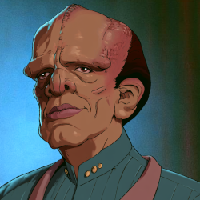

# Witless for the Prosecution (Part 2) 

 
<b>Session started at 2026-08-25 / 04:30</b>
 
Fantasy Grounds - v5.1.13 (2026-07-23) 
Fen's StarTrekAdventures Ruleset (v1.1.5)  
*[Prioritized Source: File; Other Sources: Vault]* 
*Core RPG ruleset (2026-07-14)
Copyright 2026 Smiteworks USA, LLC* 
*Fen's STA House Rules (v1.0.1) * 
*FG Browser v1.2.3* 
*[Prioritized Source: File; Other Sources: Vault]* 
KruschtyaEquation (Hailey Murry): We've discovered our Conspiracy Text channel 
indarien (Skig): Last entry being August of 2024... 
GM: lol 

>INTERIOR - Conference Room: Command Buttermilk has two chairs set up on opposite sides of the conference table, he sits on the side further from the door, with a PADD sitting just in front of him. A couple of glasses of water sit on the table in between. He motions for you to sit down in the chair opposite him. 

*Skig sits down and notices the condensation on the glasses is leaving marks on the table. Annoyed, she stands back up and creates a lazy-susan tray and a towel, cleans up the mess, then puts the glasses on the lazy-susan and sits back down.* 
**Commander Buttermilk** Back on Earth, we have an Elaysian male body in custody, being tried for a chemical weapons attack on this ship. We have ample evidence of this body comitting that act, but now you are claiming that we have the wrong brain. I haven't seen anyone entering or leaving his cell with a brain. How can you be so sure whose brain we are trying? 
**Kolea: [ INSIGHT  (11) +  MEDICINE  (4)]
[Focus: Psychology ]
[Successes: 3] [Complications: 0]
Success with 2 momentum [2d20 = 16]** 
**Commander Buttermilk** You say a mind meld was involved. Under Starfleet general regulation 21.7, paragraph 4, a mind meld is a controlled medical procedure requiring informed consent from all parties and a qualified operator. Who performed this mind meld, and did you obtain adequately informed consent from all parties? 
**Commander Buttermilk** The mind meld was performed by an officer named Geret, but she isn't here for questioning today. Why not? 
**Commander Buttermilk** I see on the mission log that crewman Throk is also on that mission. Is he also a skilled scientist? 
**Commander Buttermilk** How is it you located Neraran? The report says she was hiding on some hidden comet lab, but not how you found it. Comets are tiny, like little, tiny... things that are small.  
**Zox: [ CONTROL  (11) +  CONN  (1)]
[Successes: 2] [Complications: 0]
Success with 1 momentum [2d20 = 17]** 
**Commander Buttermilk** Since her capture, Lt. Darisha-Han has been spending a lot of time visiting Neraran in the brig. Why is that being allowed? Neraran is a spicy meatball, and you shouldn't be mixing the sauces... 
**Darisha-Han: [ CONTROL  (7) +  COMMAND  (1)]
[Successes: 0] [Complications: 0]
Failed on DC: 1 [2d20 = 23]** 
**Commander Buttermilk** Speaking of the brig: I see that you recently hosted a diplomatic event, during which your Ensign Geret killed a Starfleet admiral by crushing. Why is she on a science mission and not in the brig? 
indarien (Kolea): End result of this: Buttermilk goes, "You know, I'm 95% clueless, but I can guarantee I'd do a better job of being an XO than Skig." 
indarien (Kolea): Sorry, Skig's answers are causing my sides to hurt from laughter. 
**Commander Buttermilk** Nurse Kolea's medical log indicates that the crew has been aware for some time of Geret's loss of control of her shapeshifting abilities, but had chosen not to fix it. Why did you not repair her damaged shapeshifting system sooner? According to your own logs, a simple medical procedure would have prevented the death of a decorated Starfleet Admiral. 
**Commander Buttermilk** And not decorated like a rug, decorated with medals.  
**Commander Buttermilk** From Starfleet 
Masakari (Darisha-Han): "Oh no, the consequences of my own actions!" 
Masakari (Darisha-Han): "Who's the narc on the ship?" 
KruschtyaEquation (Oakadan): "Because it's funny" doesn't work in character lol 
**Commander Buttermilk** During that same conference, I see that a Romulan attendee found Changling residue on board and suspected another attendee of being a shapeshifter. Did that residue come from Geret? 
*Zox chews on whatever leaves are in the room, hoping they weren't planted by Windbloom.* 
**Commander Buttermilk** You have given me a lot to think about, and thinking is hard. It takes time, like the seasons. I will remain on board while I continue my investigation. The game is feet, as they say. 
**Zox** Boy these leaves are great! Would you like to try some? 
**Commander Buttermilk** In the meantime, I would appreciate if the Lister remains in orbit of Pakled. I was visiting my mother and would like to return home when we are done here 
**Commander Buttermilk** I do not eat leaves, I don't trust them. Don't eat anything unless you can look it in the eyes. 
Masakari (Zox): paging...throk. 
**Commander Buttermilk** They say the eyes are the windows to the soul, so if you eat things without eyes, it won't nourish your soul. 
Masakari (Zox): follows the logic, but feels like his soul has been nourished and mind expanded by these leaves. 
Masakari (Darisha-Han): hopes Buttermilk isn't mean to Neraran. She has bad reactions to some people.... 
**Oakadan** To clarify, cannibalism is strictly prohibited on this ship. As is the consumption of anything sentient.  
**Commander Buttermilk** One last thing: a Starfleet admiral and the mother of one of your senior officers both died during a conference, one in which an attendee found evidence of a Founder on your ship, and during which several unrelated assaults took place. Why didn't you conduct a full investigation? 
indarien (Kolea): Throk will happily point out he is the only Gorn on the ship, so Cannibalism is not an issue. Since only Gorn are sentient, also not a problem. He's happy Oakadan approves of Throk's life choices. 
**Darisha-Han: [ CONTROL  (7) +  CONN  (3)]
[Successes: 2] [Complications: 0]
Success with 1 momentum [2d20 = 8]** 
*Darisha-Han draws eyes on her notepad.* 
**Darisha-Han** Contains several essential inks and fibers! 
*Commander Buttermilk dismisses the crew from questioning, and returns to his quarters to go over his notes, and eat Darisha's notes.* 
**Zox** How screwed are we? 
**Zox: [ CONTROL  (11) +  SECURITY  (5)]
[Focus: Espionage ]
[Successes: 4] [Complications: 0]
Success with 3 momentum [2d20 = 6]** 
>INTERIOR - Crew Lounge: The crew gather to discuss their questioning from Commander Buttermilk. 

**Oakadan** I am fortunate that I am not too high in ranking and did not have anything direct to do with the mind meld event. I mostly deflected 
**Zox** I think we did fine. 
**Oakadan** Though it's my understanding that we have an ongoing investigation into the deaths of those two, and the "secret assassin". I think this can be a good excuse for why Murry's team is Away right now, if they're following up on that actively 
**Darisha-Han** Everyone will know the Lister is the coolest ship in the Federation! Adventure abounds! 
**Zox** Under investigation and sensitive information is quite a useful statement yes 
**Lt. Cmdr Malat** I am starting a new betting pool: Who does Buttermilk indict before he leaves. My money is on Geret. 
**Darisha-Han** Oooh ooh? let me write this down. You can't bet until you've also chosen the crime. 
**Darisha-Han** Gross negligence? Endangered Species act? Manslaughter, 1st through 3rd degrees? 
**Oakadan** Darisha, you are aware that you're forbidden from publishing anything that could pertain to an active mission, yes? 
**Lt. Cmdr Malat** I am betting on Geret, for Conduct Unbecoming, Reckless Endangerment, and Lying on her Starfleet admission forms 
**Oakadan** Did she lie? 
**Lt. Cmdr Malat** She must have, how else did she get admitted to the academy 
**Zox** Oh 100%. I love you all too much to endanger anyone here. 
**Darisha-Han** Oh 100%. I love you all too much to endanger anyone here. 
**Oakadan** I don't think so, she's pretty resourceful and capable 
*Lt. Cmdr Malat starts sneezing, eventually sneezing a dozen or so times before she stop.* 
**Zox** Here, I'll look it up. 
**Skig** He was very nice and we had a cordial conversation, he revealed several problems with Geret that I think should be addressed. 
**Zox: [ CONTROL  (11) +  SECURITY  (5)]
[Focus: Shipboard Tactical Systems ]
[Successes: 2] [Complications: 0]
Success with 1 momentum [2d20 = 15]** 
**Oakadan** Were they not problems we already knew about? 
**Windbloom Openheart** He didn't even seem that worried about my drugs, he said that Starfleet has a religious exemption to the controlled substances regulations 
**Skig** Anyway, why is he here again? 
**Zox** on a mission of peace.  
**Kolea** He is very knowledgeable about Starfleet Laws and Regulations, almost encyclopedic. 
*Skig looks at Oakadan.* 
**Skig** We knew about her problems? 
**Oakadan** The spontaneous shapeshifting? 
*Kolea kicks Skig, hurts her foot on the massively swol legs.* 
**Oakadan** Didn't you get flattened into a shuttle once by it? Did you think she did it on purpose? 
**Lt. Cmdr Malat** She may have, you can't rule it out 
**Skig** I thought that was intentional, like all the other times she's tried to kill people. 
**Zox** but that same erratic nature also ended up capturing an otherwise uncatchable spy. 
**Skig** Anyway, he mentioned she's not on the ship and her shapeshifting thing can be fixed with a routine medical procedure. We should do that. 
**Zox** It has been fixed. 
*Kolea rolls eyes at Skig, which is an action lost on the Tellerite.* 
**Zox** Well....partially it says. 
**Captain Kaglor** As the crew discuss convincing Neraran to undergo surgery to fix her dangerous shapeshifting issues, Captain Kaglor approaches their table. 
**Captain Kaglor** Skig, Kaglor needs your help. 
**Skig** I am happy to help you with a new metal four. 
**Captain Kaglor** Since we are here at Pakled, Kaglor requested an audience with the Brain Trust to tell them about dielectric materials 
**Captain Kaglor** The Brain Trust are our leaders, they are the smartest Pakleds. 
**Skig** That sounds wonderful, how can I help? 
**Captain Kaglor** But then Kaglor got terrible news: Kaglor cannot get an audience with the brain trust, because Captain Kaglor is dead. 
**Captain Kaglor** Very sad day. 
**Skig** Now you say something else that is helpful. 
*Captain Kaglor shakes his head* 
*Skig stops for a second and wonders why that part of the card Kolea is holding is not in quotes.* 
*Kolea kicks Skig again.* 
**Captain Kaglor** The Ministry of Facts and Stuff has ordered that Captain Kaglor must come there to sort this out. 
**Skig** You seem very not-dead, just like T'Kor. 
**Captain Kaglor** Will you help, oh wise and compassionate Skig? 
**Kolea** OH MY GOD. It burns. 
*Kolea is dealing with alcohol dripping from her nose as she just managed to cover her face in time and not shoot it out of her nose.* 
>♫♫♫Lighthearted Music Sting♫♫♫ 

>---------CUT TO COMMERCIAL------- 
-