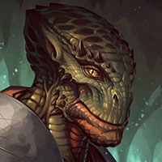
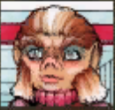
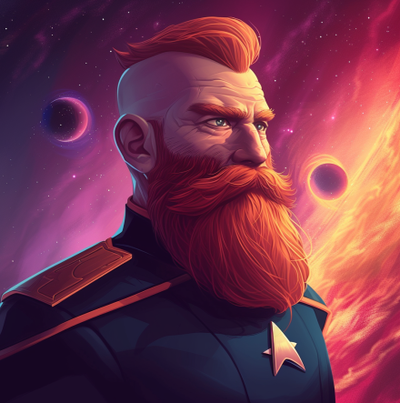

# Witless for the Prosecution (Part 3) 

 
<b>Session started at 2026-09-07 / 21:05</b>
 
Fantasy Grounds - v5.1.13 (2026-07-23) 
Fen's StarTrekAdventures Ruleset (v1.1.5)  
*[Prioritized Source: File; Other Sources: Vault]* 
*Core RPG ruleset (2026-07-14)
Copyright 2026 Smiteworks USA, LLC* 
*Fen's STA House Rules (v1.0.1) * 
*FG Browser v1.2.3* 
*[Prioritized Source: File; Other Sources: Vault]* 
*Fen's StarTrekAdventures Ruleset (v1.1.5) * 
*[Prioritized Source: File; Other Sources: Vault]* 
*Core RPG ruleset (2026-07-14)
Copyright 2026 Smiteworks USA, LLC* 
*Fen's STA House Rules (v1.0.1) * 
*FG Browser v1.2.3* 
*[Prioritized Source: File; Other Sources: Vault]* 

>INTERIOR - Delta Flyer: Ghex brings the flyer out of warp just outside of the DMZ. From their present position, they are around 80 light years from the edge of the McAllister Nebula. It is as close as they can get without crossing into Cardassian territory. 

**Ensign Ghex** This is as close as we can get without crossing the DMZ. Did you have any clever plan for crossing into Cardassian space without being detected and intercepted ma'am? This isn't a subject that they covered at the academy, in my classes they were more focused usually on NOT breaking the law. 
**Geret** It's so pretty! Excaliban eyesight is so much better for viewing the cosmos! 
**Throk** Throk find borders in space to be nonsensical. Both third and fouth dimensional space suggests that there is both border and not-border before us, What we have is Schroedinger's Border. 
**Geret** Gex, permission to run a scan to track any cloaking shipsor craft 
*Geret looks at Gex.* 
**Hailey Murry** Permission granted 
**Geret: [ CONTROL  (10) +  SCIENCE  (5)]
[Successes: 2] [Complications: 0]
Success with 1 momentum [2d20 = 14]** 
**Geret** Looks clear to me!  
**Throk** Throk suggest we modify Delta Flyer signature to look like prestigious Gorn hunting expedition, licensed to track down and devour Bajoran terrorists who are threatening harmless Cardassian citizens. 
*Geret <stares in glowy rock monster eyes>* 
**Geret** ...where does one get that sort of license? 
**Throk** Throk not going to mention if Bajoran is tasty or not, because Ghex is squeamish. 
**Hailey Murry** I think threatening to hunt down and devour people is still going to draw attention, but modifying the transponder is a given.  
**Throk** Throk have settings for 3D Printer on Delta Flyer. 
**Hailey Murry** Can we modify our transponder to set this as a Gorn ship, with Throk as captain and the rest of us as his underlings?  
**Throk** Sure, this is about correct size for small Gorn hunting ship. Throk ready to adjust transponder settings. 
**Ensign Ghex** Oh wow, that is a nifty idea. As long as we make it very clear to Throk that we are playing pretend and we are NOT really his underlings. Because I don't want Throk to try to eat me. Maybe we should check the ship and get rid of any Sriracha first. 
**Geret** ..Won't someone eventually see we have the sleek exterior of a Federation ship though? I don't suppse we can 3D print the exterior into Gorn Majesty? 
**Throk** Throk will just explain he bought ship on discount after previous owner was crushed to death by Space Whale. 
**Throk** It happens all the time. 
**Hailey Murry** Throk, would you eat your underlings? 
**Geret** Ya know, like add scales and lizard frills? Maybe some teeth on the grill? 
**Throk** Throk does not eat underlings. 
**Ensign Ghex** OOOOH: Maybe we should lash a Gormagander to the roof. That would really make us look like a hunting party. 
**Throk** Underlings are ncessary part of educational experience on mighty Gorn culture and majesty. 
*Throk pats Ghex on the head.* 
**Hailey Murry** Oh yeah! What kind of things eat gormaganders?  
**Throk** I like this plan, even adds value to idea of getting ship from previous owner. 
*Throk raies hand.* 
**Hailey Murry** Using one as bait for an elusive creature would be fantastic 
**Geret** Wouldn't work, that may invite suspicion under the endangered species act 
**Throk** Throk willing to try eating a Gormagander. 
**Throk: [ INSIGHT  (9) +  SCIENCE  (2)]
[Focus: Cooking ]
[Successes: 1] [Complications: 0]
Success with 0 momentum [2d20 = 27]** 
**Geret** Happy if you have any other ideas Throk. 
**Throk** Throk not paid to have ideas. 
**Ensign Ghex** I don't think Throk eating Geret would be productive.  
**Throk** Actually, Throk not paid, Starfleet has weird rules. 
**Throk** Throk next idea involve... Throk looking for family of missing Cardassian Poet Laureate who won championship at Tanka contest on Draygo 4. 
**Throk** Throk think need more details, like maybe a name and possibly if Cardassians even know what Tanka is. 
**Throk** This thinking is hard, Throk getting hungry. 
*Hailey Murry pulls a steak out of the steak fridge, setting it on a plate and passing it to Throk.* 
**Hailey Murry** I think going in for vacation, especially something like a poet, would probably be fine. The story of having picked this ship up on salvage would probably not work given the state of this ship. It's too clean.  
**Geret: [ INSIGHT  (10) +  SCIENCE  (5)]
[Successes: 1] [Complications: 0]
Success with 0 momentum [2d20 = 31]** 
**T'kor: [ INSIGHT  (7) +  ENGINEERING  (4)]
[Focus: Repair/Tinkering ]
[Successes: 2] [Complications: 0]
Success with 1 momentum [d20 = 4]** 
**Geret** Let's see what toys we have... 
**Geret** There's no way a legendary captain would have all standard issue things... 
**Geret** what has a swashbucking adventure through the Delta quadrant yielded... 
**T'kor** It is not as well outfit with custom equipment as Old Faithless is 
**Throk** Throk think Skig would be very happy to hear that. 
**Geret** Skig isn't around. You don't have to act in love with that scrap heap, glorious apex of Radio Shack engineering that it is... 
**Throk** Wait... Throk has idea. 
**Hailey Murry** What are you thinking, Throk? 
**Throk** Throk is Gorn game hunter in search of things he cannot eat. Geret is taking him to her home planet in Cardassian space! 
**Throk** Throk can even chew on Geret during video calls to demonstrate how inedible she is. 
*Throk strikes a dynamic Zap Brannigan pose to show how impressed he is with this idea.* 
**Throk** T'Kor also not edible to Throk. 
**Throk** So extra proof there. Let's do this! 
KruschtyaEquation (T'kor): It's like "Will it Blend"! 
**Hailey Murry** We're not actually going to eat anyone, to be clear 
**Hailey Murry** Standard rules apply 
**Hailey Murry** But yes, I think this is a good cover story 
**Ensign Ghex** We should replicate some Gorn uniforms though. I think that would be fun.  
**Throk** Absolutely! 
*Throk replicates out some Gorn uniforms, which look like product placement onesies for various Fast Food chains.* 
*Throk hands out crew onesies for everyone.* 
*T'kor does his best to wear it over his suit* 
**Geret: [ INSIGHT  (10) +  CONN  (2)]
[Successes: 0] [Complications: 0]
Failed on DC: 1 [2d20 = 30]** 
**T'kor: [ DARING  (9) +  ENGINEERING  (4)]
[Focus: Repair/Tinkering ]
[Successes: 0] [Complications: 0]
Failed on DC: 1 [2d20 = 34]** 
**Kolea** Okay... this is awesome and I'm not even there. Just remember, GORN-Tube, not... other things that could be miscontrued to be other things. 
**Throk** Throk have no idea what you mean. 
**Throk: [ PRESENCE  (8) +  ENGINEERING  (2)]
[Focus: Cooking ]
[Successes: 0] [Complications: 0]
Failed on DC: 1 [d20 = 19]** 
**Throk** Throk like your stiching Ghex, you can seal sausage and bladder containers with industrial press any time. 
*Throk pats Ghex on the head.* 
**Ensign Ghex** These uniforms look nice, the weird inexplicable red peperoni pattern highlights the blue of my skin. I just hope Geret is having as much success disguising the outside of the ship.  
>♫♫♫Ominous Music Sting♫♫♫ 

**Geret** I painted "GORN to be wild" in the most neon, hotwheels, offensive and disjaring color scheme. Hope that works. 
*Throk maintains dynamic action post suitable to Zap Brannigan.* 
**Ensign Ghex** I sure hope so, I definitely dno't want to end up in a Cardassian prison. What do you way ma'am? Should I set course for the McAllister nebula? 
**Hailey Murry** I like the uniforms 
**Hailey Murry** Hold up, let's get a good look at the exterior?  
*Hailey Murry sends out a drone to get a view of the ship. * 
**Hailey Murry** Wait, you ONLY wrote that on the side?  
**Geret** I'm sorry captain. Im an artist of humanoids....not ships. 
**Geret** Today has been....humbling. 
*Geret looks dejected in rock monster* 
**Geret** Honestly, I think it's OK. We really just need to get to the Nebula and we should be fine. 
**T'kor** Unfortunately, I've also had an issue with adjusting the warp signature. This is outside my area of expertise.  
**Geret: [ DARING  (10) +  SCIENCE  (5)]
[Focus: Weird Biology ]
[Successes: 3] [Complications: 0]
Success with 2 momentum [2d20 = 9]** 
**Geret** Oh this technology is marvelous!  
**Throk** Throk willing to evaluate sensor reflectors to assist Geret with making ship look like floating rock with big thrusters, to better fit Gorn-Tube "Is it Edible" marketing gimmick! 
**Throk: [ REASON  (9) +  SECURITY  (4)]
[Focus: Hacking Security Systems ]
[Successes: 0] [Complications: 1]
Failed on DC: 1 [d20 = 20]** 
>Geret taps into the ship's borg systems, and strange sounds are heard from behind the consoles and small Borg tubules shift and move around inside the ship's electronics. Using the adaptive technology, Geret is able to rewire the power systems so that the ship's warp and power signatures match a Gorn transport. And Throk is able to reconfigure the ship's armor system to convert the armor into a realistic looking representation of a rock themed to promote his GornTube chanel. 

**Throk** This is perfect! 
**Geret** Oh....well I feel so secure and at home now. 
**Throk** Throk select all options that say, "Bill Me Later" and used Rhuk's catering business email address. Then Throk sign up for Generative AI videos to propagate his Gorn-Tube channel. This best Away Team mission ever. 
**Geret** I thought it was going to be something green-steampunky with bare wires and organic looking electronics...but rocks....Oh so homey./ 
**Ensign Ghex** Yeah, there's no way anyone will think that a big warp-capable rock with Gorn painted on it is a Starfleet vessel. Most people think that Starfleet officers are smart, and competent, so no one will suspect that a group of Starfleet officers would have ended up in this situation. 
*Throk pats Ghex on the head.* 
**Throk** Throk proud to never be considered Smart or Competent in order to maintain the illusion for Ghex. 
**Ensign Ghex** Setting course for the McAllister Nebula. I really hope we don't end up in a Cardassian prison, I am definitely too young to go to Cardassian prison. I don't want to go to any prison, but if I had the choice I would definitely go with a Federation prison. They have better food and the facilities are well maintained. Malat told me that they actually aren't that bad, all things considered. 
**Ensign Ghex** Fingers crossed... 
*Ensign Ghex takes the flyer back into warp.* 
>♫♫♫Adventuous Harp Music Sting♫♫♫ 

**Geret** Wheeeee! 
>EXTERIOR - Pakled: Captain Kaglor and Skig beam down to the surface near the Ministry of Facts and Stuff so that they can go resolve the matter of his untimely death. 

**Skig** So Kaglor, how has death been treating you? 
**Skig** Are you thinking we should get you classified as un-dead or re-born? 
**Captain Kaglor** Skig is much wiser in such matters than Kaglor. The crew told Kaglor that Skig has previously ressurected a dead crewmember in the same situation. 
**Captain Kaglor** Very impressive 
**Zox** I've got the video tapes of our Resistmas celebration and your wonderful speech, surely those were the work of a person still alive. 
**Zox** *cough* holo-reels. 
*Zox ponders it interesting that they are still reels, despite no moving parts......these humans.* 
**Captain Kaglor** Captain Kaglor feels very alive, but the Ministry of Facts and Stuff was very clear 
**Skig** Let us discuss this with them, I am sure they will determine you are very un-dead by the end of this. 
*Skig has a terrifying mental image of a bureaucrat at the Pakled Ministry deciding to shoot Kaglor with a Disruptor Rifle because "The Records Cannot Be Wrong!".* 
**Captain Kaglor** As long as Captain Kaglor does not become a Zombie 
*Skig heads inside the building.* 
**Skig** Do Pakled's often become Zombies, and does that impact your voting rights? 
**Zox: [ INSIGHT  (7) +  SECURITY  (5)]
[Successes: 2] [Complications: 0]
Success with 1 momentum [2d20 = 15]** 
*Skig directs the question at Captain Kaglor.* 
*Zox peeks around every corner for danger with his keen, repitlian vision.* 
*Skig tries really hard to make it look like she is even paying attention to the world around her.* 
**Captain Kaglor** Skig enters the Ministry of Facts and Stuff and together, the team heads to the Office of Records and Words or Whatever 
>Skig enters the Ministry of Facts and Stuff and together, the team heads to the Office of Records and Words or Whatever 

**Skig: [ INSIGHT  (8) +  COMMAND  (2)]
[Focus: "Masking" ]
[Successes: 0] [Complications: 0]
Failed on DC: 1 [2d20 = 29]** 
indarien (Skig): Appropriate roll is appropriate. 
>Inside the Office of Records and Words or Whatever, they find a pakled man standing at the information counter in an otherwise empty room.  

**Skig** Hello Sir, I am Commander Skig and this is Captain Kaglor. Do we need an appointment? 
**Government Employee** You have to take number 
*Government Employee points at a number dispensing roll in the corner* 
**Skig** Good thing we have a Metal Four right here. 
*Skig takes number.* 
>Skig gets number 21,474,716. The sign above the employee's head reads "Now serving number: 23 

*Skig tears off the 474,716 portion and walks up to the counter with a number 21.* 
**Skig** Okay, we are here now. 
*Government Employee looks at the ticket, then looks at the sign* 
**Government Employee** But it is not your turn 
**Skig** Right, back in a minute. 
Masakari (Zox): beetlejuice scene inspired? 
*Skig presses the button on the side of the machine to have it count backwards twice.* 
*Government Employee The sign ticks down from 23 to 21 and the man rechecks the tickets* 
indarien (Skig): This may... or may not... be very remisicent of my recent experience at the Japanese Notary office. 
**Government Employee** How did you do that? It has been the turn of #23 since before I was born 
**Skig** The ways of Starfleet are mysterious. 
**Government Employee** Mmmm.. I see 
*Government Employee nods knowingly as though he understands* 
*Skig decides to wait until after they leave to hand him the remote so he can play with the "Now Serving" sign while sitting at his desk.* 
**Skig** Captain Kaglor was reported dead. 
*Skig points at Captain Kaglor.* 
**Government Employee** Hmm. He seems alive 
**Government Employee** I will check the computer 
**Skig** He appears to be not-dead, possibly alive or maybe re-born. 
**Skig** Yes please. 
**Government Employee** taps a few keys on the computer and stares at the screen for a while, then looks at Kaglor, then back at the screen. 
*Government Employee taps a few keys on the computer and stares at the screen for a while, then looks at Kaglor, then back at the screen.* 
**Government Employee** Hmm, yes the computer says he is dead 
**Zox** Can I see that computer for a second there friendo? 
**Government Employee** No 
**Skig** Maybe the computer is confused. 
**Government Employee** No, the computer is smart 
**Skig** Have you asked him with Captain Kaglor is dead, as there might be multiple. 
indarien (Skig): (ERR) 
**Skig** Have you asked the computer which Captain Kaglor is dead, as there might be multiple. 
**Government Employee** The computer scanned his identity chip 
**Government Employee** Our computer is very good, the Brain Trust programmed it to be the most best computer system for Pakled 
**Skig** Is that the Windows Me login sound? 
**Government Employee** I will fix the issue, wait there. 
*Skig is still not convinced the guy is not going to come back with a Disruptor Rifle, but goes to get the remote for the sign so the guy has something to play with.* 
*Government Employee enters a few commands into the computer, then reads the response on the screen. After reading the screen for a few moments, he ducks down below the counter.* 
*Skig throws Captain Kaglor under the counter before the shooting starts.* 
>An automated defense turret pops down from the ceiling and opens fire on Captain Kaglor 

Masakari (Zox): wonders if clippy will show up "Did you think someone was incorrectly logged deceased? I can help with that" 
indarien (Skig): Oh yes, Clippy would 100% behind mass murder. 
**Skig: [ DARING  (10) +  SECURITY  (3)]
[Focus: Survival ]
[Successes: 2] [Complications: 0]
Success with 1 momentum [2d20 = 22]** 
**Zox: [ CONTROL  (11) +  SECURITY  (5)]
[Successes: 0] [Complications: 0]
Failed on DC: 1 [2d20 = 35]** 
**Skig** Zox! Don't start an interstellar incident! 
*Skig scans for Kaglor's identiy chip.* 
**Skig: [ DARING  (10) +  ENGINEERING  (5)]
[Focus: Emergency Repairs ]
[Successes: 2] [Complications: 0]
Success with 1 momentum [2d20 = 17]** 
Masakari (Zox): Honestly, It would be funnier if Kaglor just ripped out the circuit breaker or something, with his insulated gloves, and saved everyone. 
**Skig** Oakadan, get THAT Pakled out of here. 
**Oakadan** On it! 
*Skig gestures to the one who just became Kaglor.* 
>Skig quickly swaps the signature of Kaglor's identity chip with an employee of the Department of Moving Stuff, and the Turret swivels over and begins firing in the direction of the other random Pakled 

*Oakadan rushes toward the new Kaglor to get him out of here!* 
**Oakadan: [ DARING  (9) +  CONN  (2)]
[Focus: Fire Safety ]
[Successes: 3] [Complications: 0]
Success with 2 momentum [2d20 = 5]** 
*Oakadan throws the pakled over his shoulder in a fireman carry and performs an expert dodge and weave past the incoming bullets, as one does in firefights* 
>As Oakadan runs out of the room with the other Pakled, the turret stops firing and the government employee stands back up, confused. 

**Government Employee** Are you a witch? 
**Government Employee** You may be able to fool the turret, but you cannot fool me. I know that this is Captain Kaglor.  
**Government Employee** Why did you come here if you do not want to fix the incorrect record? 
*Zox Runs to the computer to 'fix' it.* 
**Skig** We would have preferred for the record to be updated in the computer to match his "not-dead" status. 
**Zox: [ CONTROL  (11) +  SECURITY  (5)]
[Focus: Espionage ]
[Successes: 3] [Complications: 0]
Success with 2 momentum [2d20 = 14]** 
**Zox: [ DARING  (12) +  SECURITY  (5)]
[Focus: Espionage ]
[Successes: 3] [Complications: 0]
Success with 2 momentum [3d20 = 27]** 
**Zox:  [d20 = 4]** 
**Skig** You are very smart, I was not trying to fool such a smart Pakled Civil Servant. 
**Skig** Ignore any transporter sounds you might be hearing right now, they are probably just tinnitus from the turret fire. 
>Zox materializes behind the counter and shoves the man away from the computer. On the screen, there is nothing but a chatbox with a virtual assistant in which the conversation history on screen shows that the employee asked the virtual assistant what to do, and it told him that the easiest way to correct the discrepancy was to activate the security system to target Captain Kaglor 

*Oakadan explains to the other Pakled that he needs to NOT move from his current safe spot until he is told to move. * 
**Oakadan: [ REASON  (10) +  COMMAND  (4)]
[Focus: Fire Safety ]
[Successes: 2] [Complications: 0]
Success with 1 momentum [2d20 = 18]** 
**Skig** Zox, just ask Clippy if it can update the record to show "Alive". 
**Zox** This technology may be too primitive for me. Yes I get the irony of a dinosaur saying that. 
**Skig** Then make sure you click the weird disk icon in the corner to "save" the record. 
**Skig** BUT... if it asks for a ticker-tape revision, we will need to beam Gra'lan done, because I can only work with Punch Cards. 
indarien (Skig): (down) not (done) 
**Zox** It might just need a stack of 3.5" disks 
**Government Employee** Our computer is very advanced. It is very smart 
**Captain Kaglor** Yes, Pakled computers are very advanced 
**Skig** It is! We are in awe that our pathetic Starfleet computers lack the animations and friendly appearance of the paperclip creature. 
*Oakadan heads into the other room, looking around for a moment before picking up a garbage bin and returning to the hall. * 
Masakari (Zox): Geret needs to change into a Clippy-species. 
**Skig** Can we study it to hopefully become as Smart as Pakleds someday? 
**Skig: [ PRESENCE  (8) +  ENGINEERING  (5)]
[Focus: "Masking" ]
[Successes: 3] [Complications: 0]
Success with 2 momentum [2d20 = 10]** 
indarien (Skig): It's the first time Skig has rolled a success involving interaction with other biological creatures. Bachar will be proud! 
**Government Employee** Hmm. That makes sense. You can talk to the computer, but you can't take it with you. 
**Government Employee** It is plugged in. If you take it with you, it will stop working 
**Skig** It is far too smart and powerful for us to be able to move it. 
**Government Employee** It only works when it is plugged in 
*Skig hands Government Employee the remote control for the number sign and shows him how to push the buttons to make the numbers change from all the way across the room.* 
**Oakadan** Is it safe for the other Pakled to come back in here? 
*Zox waves a big "NO" sign.* 
**Government Employee** Hmm, no definitely not. 
Masakari (Zox): Information gained:
Kaglor was assigned for Jury Duty and didn't attend, so was counted by the system as dead - he is 52 earth years old.
Buttermilk doesn't have a PakID (Pakled ID) chip and was born on Earth, but we do have his mother's PakID if we want to use it for spoofing.
We can't get a genetic signature to see if we have the real Kaglor (or at least cross confirm it with the chip) as his gene-sequence is on the Ministry of Health and Other Gross Stuff's systems 
**Zox** Here' ill fix this 
**Oakadan** Hold on, were there any Pakleds in Kaglor's crew that we've lost?  
**Captain Kaglor** My crew are all alive and well 
**Captain Kaglor** Nurse Kolea saves us when we get electrocuted 
**Zox** "Clippy, can you turn the guns off? The guns are ruining my clothes and hair syle" 
**Skig** Nurse Kolea does a good job of keeping people from dying, usually. 
>The turret recedes back into the roof and the virtual assistant confirms it will stop try ing to shoot Kaglor. It then offers some other suggestions for how to resolve the innacurate record: Drowning, stabbing, poison, and shoving him off a roof are all simple solutions 

**Skig** Zox, make sure to mention that the guns require a macro to run. 
**Skig** I note they do not suggest electrocution, the computer system is, indeed, smart. 
**Zox** Clippy, can you make it so guns require "Triceratops Eats Grass Peacefully by the Lake" to authorize, as there've been bad mistakes latetly and shooting people wrongly is a lot of paper work 
*Oakadan returns to the room fully, letting the other Pakled continue his duties* 
**Pakled Computer** Sure thing boss! From now on, the turrets will only target triceraops eating peacefully by the lake 
**Oakadan** Perhaps we can set it to stun? 
**Zox** No more guns. Violence is not the solution. 
**Skig** Meanwhile, five years from now, some Voth settler on this planet... 
**Pakled Computer** You got it champ, only stabbings from now on. 
**Pakled Computer** I will activate a drone and replicte a knife for it 
**Skig** Zox, tell it to only use the option for tic-tac-toe to the death. 
**Oakadan** We shouldn't mess around too much in here 
**Government Employee** If you tell the computer not to kill anyone, how will we resolve Captain Kaglor's incorrect record? 
**Oakadan** Computer, how does one change government records and statuses? 
**Pakled Computer** Government record entry is handled by the Department of Written Down Stuff. The procedure for submitting an update to a record is to first print and fill out a Form Q-311, then take that form to the Department of Written Down Stuff and submit the form so it can be scanned with the Data Input Scanner. 
**Oakadan** Where do we obtain Form Q-311? 
**Pakled Computer** Form requests are made at the Department of Printing Things on Paper. Sadly, this department has been closed since Stardate 60421.6 ever since the printer broke 
**Oakadan** Is there an alternative address for printed things?  
**Oakadan ** *(to the others)*: I think we can probably just unjam the printer, but if they have a workaround already we can use that. 
**Skig** No problem. 
**Pakled Computer** Printing forms onto paper is the exclusive domain of the Department of Printing Things on Paper. 
**Skig** We've got this. 
**Zox** and then the department of printing things on paper is going to need a part, which has to come from the department of small fixings and worky bits, and they will need.... 
**Skig** Where is the Department of Written Down Stuff? 
*Pakled Computer generates a scannable QR code linking to directions to the Department of Written Down Stuff. It is located a kilometer or so away, in another nearby government building* 
**Skig** Let's go. 
**Skig** heads for the Department of Written Down Stuff. 
*Skig heads for the Department of Written Down Stuff.* 
**Pakled Computer** Good luck, watch out for the former employees. Recent reports indicate extreme levels of danger 
**Zox: [ CONTROL  (11) +  SECURITY  (5)]
[Focus: Espionage ]
[Successes: 2] [Complications: 0]
Success with 1 momentum [2d20 = 21]** 
**Zox: [ INSIGHT  (7) +  SECURITY  (5)]
[Successes: 0] [Complications: 0]
Failed on DC: 1 [2d20 = 33]** 
**Oakadan: [ INSIGHT  (8) +  COMMAND  (4)]
[Focus: Fire Safety ]
[Successes: 1] [Complications: 0]
Success with 0 momentum [2d20 = 23]** 
**Skig: [ INSIGHT  (8) +  SECURITY  (3)]
[Focus: "Masking" ]
[Successes: 2] [Complications: 0]
Success with 1 momentum [2d20 = 19]** 
**Oakadan:  [2d20 = 20]** 
>As the crew walk over towards the Department of Written Down Stuff, Oakadan and Skig can't help but notice that Pakled society seems to be breaking down all around them. Numerous building are boarded up, trash is piling up on the streets, and there are very few people walking around on the streets for a city of this size 

**Zox: [ INSIGHT  (7) +  SCIENCE  (4)]
[Successes: 4] [Complications: 0]
Success with 3 momentum [2d20 = 2]** 
**Oakadan** Something's going wrong on here 
>When they arrive at the Department of Written Down Stuff, they find that the building has had all of its windows boarded up, and a barricade of sharp sticks made from office desks has been erected in front of the door. 

**Skig** I mean, this does somewhat make sense given that Clippy is running things. 
**Zox** So...It takes about 500 years to go from the height of enlightenment thinking to mindless cogs. 
**Captain Kaglor** Pakled computers are very smart 
**Captain Kaglor** Very advanced 
>♫♫♫Ominous Music Sting♫♫♫ 

>---------CUT TO COMMERCIAL------- 

