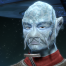

# Just War (Part 1) 

 
<a name="2021-06-21" /><b>Session started at 2021-06-21 / 20:02</b>
 
 
Ruleset [Modiphius2d20] loaded. 
Core RPG ruleset (v2021-06-10) for Fantasy Grounds&#10;Copyright 2021 Smiteworks USA, LLC 
Fen's StarTrekAdventures Extension (v0.2)  

>Captains log, Stardate 61092.5: While en-route to the Spora Nebula to begin our survey operations, we recieved an unusual subspace mesage. The inhabitents of the planet Osala requested Federation assistance to mediate a cease-fire talk between two warring factions.&#13;&#13;The Osalan civilization was once a thriving power in the sector, but more than 100 years of endless war between the Osalan Central Republic and the Northern Front has reduced their civilization nearly to ashes. They probably wouldn't have recognized a more modern vessel as being a Federation design, so at least that is one advantage the Lister has over the Akiras and Sovereigns of the fleet.&#13;&#13;We will be meeting with the representatives of both factions to begin negotiations today. 

>INTERIOR - Bridge: It has been several hours since Captain Baras and Counselor Murry began negotiations with the Osalans. Since then, the shouting and table pounding from the briefing room have gotten progressively louder. 

**Commander Bachar:** That's it, I need to know what is going on in there 
*Commander Bachar pipes the comms audio through to the bridge* 
 **Zox:** I'm not sure how to say this, but the situation clearly skinks.  
**Skig: [ CONTROL  (11) +  ENGINEERING  (5)]&#10;[Focus: Emergency Repairs ]&#10;[Successes: 4] [Complications: 0]&#10;Success with 3 momentum  [2d20 = 6]** 
Masakari (Zox): Boosh. 
**Telar Talis:** The Northern Front still occupies the Rolvak valley. I refuse to tolerate a proposed border which leaves Republic territory in your hands! 
**Utris Vixal:** The Central Republic annexed the Rolvak Valley from our people! 
**Telar Talis:** It was undeveloped wilderness when my people tamed it, why should your people benefit from cities built with our sweat and blood! 
**Utris Vixal:** There are no cities left! It is nothing but ruins. Build on my people's land! 
>The delegates devolve into further shouting 

**Captain Baras:** Commander Murry... Any suggestions? 
 **Skig:** Hmm... I notice the Alluvial Damper has reached the Mun Coefficient on the starboard nacelle, I'll just start a level 1 diagnostic on that to make sure we don't have to worry about an issue with expanding the Jool radians. 
**Commander Bachar:** Just do what you can to get the warp core back online, I don't like being stuck at impulse 
*Captain Baras looks very uncomfortable with the tone of the negotiations* 
*Zox 'monitors' the rooms around the delegations for disturbances.* 
*Hailey Murry speaks to Captain Baras on the side as the delegates shout* 
**Zox: [ INSIGHT  (8) +  SECURITY  (4)]&#10;[Focus: Espionage ]&#10;[Successes: 1] [Complications: 0]&#10;Success with 0 momentum  [2d20 = 25]** 
 **Hailey Murry:** It sounds like a situation where the two of them could actually work together to rebuild in that situation if they weren't so focused on their peoples' pride 
 **Hailey Murry:** If we can find something substantial to distract them from the past, we can get them focused on the future 
**Captain Baras:** That is an excellent idea Murry. I... am not the most skilled at the &#34;diplomacy&#34; side of the captain's seat 
**Captain Baras:** Why don't we all calm down and think about the root of the problem. As the commander suggests, this may be an opportunity in disguise. Commander... 
*Captain Baras gestures to to Commander Murry to continue* 
**Lt. Malat:** Ok, it sounds like the captain is throwing in the towel. Anyone want to bet 1-week's holodeck time that they come to blows? 
**Lt. Malat:** Zox, you a betting man? Or.. Woman? Does your species have gender? 
**Zox:   [d6 = 2]** 
**Lt. Malat:** It wasn't in your file 
 **Zox:** Not as you seem to practice it. 
**Skig: [ CONTROL  (11) +  ENGINEERING  (5)]&#10;[Focus: System Maintenance ]&#10;[Successes: 5] [Complications: 0]&#10;Success with 4 momentum  [3d20 = 13]** 
**Lt. Cmdrs 11 and 10:** Gender IS a strange concept. Why should your genital shape form the basis for your social divisions 
 **Zox:** Generally, we don't try to egg each other on to certain behaviors, that's for the seasons. 
 **Hailey Murry:** Gentlemen, please. I might suggest that this is an opportunity to solve two issues at once. The Northern Front could use the space to settle, while the Republic's economy is in a downturn. I would suggest working together to rebuild and resettle the valley. The increased economic activity and trade would help provide both a home for those in need and economic stimulation to provide for them as they settle.  
**Hailey Murry: [ INSIGHT  (12) +  CONN  (3)]&#10;[Successes: 2] [Complications: 0]&#10;Success with 1 momentum  [2d20 = 9]** 
**Zox: [ REASON  (7) +  SECURITY  (4)]&#10;[Focus: Shipboard Tactical Systems ]&#10;[Successes: 1] [Complications: 0]&#10;Success with 0 momentum  [2d20 = 20]** 
*Telar Talis and Utris Vixal sit back down and look at Commander Murry* 
 **Skig:** Lt. Cmdr Viraseti, could you assist me with these sensor scan results?  I believe this is an unusual phenomenon external to the ship which is inhibiting our warp field. 
**Telar Talis:** That is... reasonable 
**Utris Vixal:** We could accept that compromise 
Masakari (Zox): Tactical. 
*Lt. Cmdr Viraseti looks at Skig's console* 
**Lt. Cmdr Viraseti:** Interesting... 
**Lt. Cmdr Viraseti:** There is no obvious source of that warp field, it is almost as though the planet itself is emanating it... 
**Captain Baras:** Well, that is one issue resolved at least 
**Captain Baras:** Perhaps we should take a brief rest and get something to eat in the mess? 
**Captain Baras:** It has been a long morning 
**Telar Talis:** Agreed, I for one am eager to see the rest of this vessel 
*Captain Baras leads the delegates out of the briefing room and back onto the bridge* 
*Commander Bachar quickly cuts off the comms eavesdropping* 
**Zox: [ CONTROL  (11) +  SECURITY  (4)]&#10;[Successes: 1] [Complications: 1]&#10;Success with 0 momentum  [2d20 = 35]** 
>Two security officers walk over to the briefing room door and stand ominously behind the delegates, looking threatening 

 **Skig:** We could try moving out of range and see if the warp field re-estbalishes itself? 
**Commander Bachar:** Agreed. Malat, move us to a higher orbit 
*Skig obviously has a Tellarite accent for certain words.* 
*Zox has a bit of a hissssy fit in ordering some security personel.* 
**Skig: [ CONTROL  (11) +  SECURITY  (3)]&#10;[Successes: 1] [Complications: 0]&#10;Success with 0 momentum  [2d20 = 31]** 
*Hailey Murry pulls the security officers back several steps to give them some breathing space, adjusting their positions so they're not looming menacingly so much as actually  standing guard* 
Masakari (Zox): Man, I sorta wish they had given them a triceratops head and then I could smash into things to challenge a klingon to Bat'leth. 
>Captain Baras suddenly vanishes into a flash of light while crossing the bridge to the turbolift 

**Commander Bachar:** Yellow Alert! Zox, raise shie... 
 **Skig:** Commander, I do not think we should continue our ascent as the warp field suppression seems to be... 
>Before she can finish her order, Commander Bachar vanishes as well 

 **Skig:** Zox, I believe she wanted you to raise Shields. 
 **Hailey Murry:** The delegates! 
 **Zox:** Shields up! Run a trace on all transporter beams! 
indarien (Skig): Maybe we should have established Chain of Command if both the Captain and XO vanished in a beam of light. 
**Hailey Murry: [ DARING  (11) +  COMMAND  (1)]&#10;[Successes: 0] [Complications: 0]&#10;Failed on DC: 1  [2d20 = 34]** 
**Zox: [ DARING  (11) +  SECURITY  (4)]&#10;[Successes: 0] [Complications: 0]&#10;Failed on DC: 1  [2d20 = 36]** 
**Zox:   [d20 = 16]** 
>Commander Murry issues confusing orders to the security officers in the heat of the moment 

**Zox:   [d20 = 12]** 
>Zox runs a scan, but finds that there is no residual transporter energy at all 

*Hailey Murry gesticulates wildly to the two guards* 
**Lt. Cmdr Viraseti:** It isn't a transporter! Skig, the war... 
*Lt. Cmdr Viraseti vanishes mid-sentence* 
 **Zox:** Leapin Lizards! What's happening?! 
 **Skig:** There is no reason to panic Zox. 
**Lt. Cmdrs 11 and 10:** We believe the Lietenant Commander was attempting to say that the dissapearances are related to the warp interference 
 **Skig:** Have you raised the shields? And were the shields up prior to Viraseti's disappearance? 
**Lt. Cmdrs 11 and 10:** The energy signature does not match a transporter, it matches a jump to warp 
 **Skig:** That seems likely 11 and 10. 
 **Zox:** The shields should be up now, and no they were not up in an attempt to show good will with the ambassators on board. 
 **Skig:** Right, so bring the ship back to its original orbit to see if the warp field instability from the interference field generated by the planet stabilizes. 
 **Skig:** Thank you Zox. 
**Lt. Malat:** Aye sir 
*Lt. Malat pilots the Lister back to its lower orbit* 
 **Hailey Murry:** A jump to warp? Why are crewmen being jumped to warp?  
 **Skig:** Murry, as the diplomatic one, can you ensure the safety of the diplomats and see to their disposition while we look into this situation? 
**Skig: [ REASON  (10) +  SCIENCE  (3)]&#10;[Successes: 1] [Complications: 0]&#10;Success with 0 momentum  [2d20 = 21]** 
*Skig performs a sensor scan on the warp field to determine what is going on.* 
 **Skig:** The field energy from the warp disturbance is returning to normal levels. I can form a supposition that whatever is controlling this warp inhibitor field wants us to remain in a lower orbit. 
 **Skig:** Zox, can you perform an internal scan to see how many crew have disappeared from this warp-transporter situation? 
 **Zox:** Aye-Aye. 
**Zox: [ INSIGHT  (8) +  SECURITY  (4)]&#10;[Focus: Shipboard Tactical Systems ]&#10;[Successes: 1] [Complications: 0]&#10;Success with 0 momentum  [2d20 = 24]** 
**Telar Talis:** I am certain that this is some sort of Northern Front deception! 
 **Zox:** 170 of the crew are missing, Skig. 
>---------CUT TO CREDITS-------&#13;&#9835;&#9835;&#9835;Opening Theme&#9835;&#9835;&#9835; 

>&#34;Just War&#34;&#13;Written by Oldrich Fitzsimmons&#13;Directed by Diana Abrams 

>INTERIOR - Briefing Room: Skig has called a meeting of the remaining senior staff to investigate the warp field interference and the crew's dissapearance 

 **Skig:** While nothing can be discounted, let us consider the high likelihood that neither of your peoples are capable of this level of technical sophistication. 
 **Skig:** Thank you Zox. 
**Utris Vixal:** Hah! Sounds like hte unhigned accusations of the Central Republic! 
*Skig looks at the delegates.* 
>Utris and Telar nearly come to blows before the security officers separate them 

 **Zox:** Murry, can you escort these two to the brig? I think the situation will get the best of them. 
 **Hailey Murry:** Delegates, please. We'll get to the bottom of this in no time. This sort of circumstance can happen without any malefactors. Meanwhile, come with me and I'll arrange for some lunch.  
 **Skig:** Sirs, while I can appreciate the fear of the unknown when presented unknown information, please consider whether your technical skills would be capable of the observed behavior. 
**Hailey Murry: [ PRESENCE  (8) +  CONN  (3)]&#10;[Successes: 3] [Complications: 0]&#10;Success with 2 momentum  [2d20 = 9]** 
*Zox appears to appreciate Skig's wisdom.* 
>The delegates calm own and follow Commander Murry 

BayushiKazemi (Hailey Murry): edit later 
 **Zox:** No unusual activity occured prior to crew becoming missing. 
*Hailey Murry steeples her fingers as she leans forward* 
**Lt. Cmdrs 11 and 10:** Sensor scans revealed no signs of nearby vessels 
 **Hailey Murry:** When did we start getting the warp interference?  
 **Skig:** What has been determined so far is that a warp inhibitor field is preventing the Lister from forming a warp field. Attempting to move to higher orbit activated a response from the warp field that caused a spike in energy emissions as well as the mass disappearance of crew through what looked like warp field transference. 
**Lt. Cmdrs 11 and 10:** It seems highly unlikely that such a phenomenon is naturally occurring 
 **Skig:** The interference began shortly after we entered low orbit. 
 **Skig:** It is definitely not naturally occuring, as this does not appear in previous surveys of the planet. 
 **Zox:** Can you create some way to stabilize the interference? 
*Skig shrugs.* 
**Lt. Malat:** I'm with Zox, I would certainly feel better if we had the warp drive online 
 **Skig:** Perhaps, there are a multitude of approaches we could take. I believe we need to identify the source of the phenomenon. We could look into the feasbility of offseting the interference by modulating our own field. 
 **Hailey Murry:** Is it possible that there's some sort of atomic phenomena interfering with the warp fields? (Hypothesis) 
 **Zox:** I cannot compete with your brain, but I think I know who to ask some questions. I will interrogate the diplomats with Lt. Rhoda.  
 **Hailey Murry:** It looks like both the Northern Front and the Central Republic have begun to look into the Rolvak Valley recently for the first time in a hundred years. I wonder if there's something in the valley itself which could be causing this. (Hypothesis: Rolvak Valley) 
 **Skig:** Yes, I am curious if this was caused by the activity in the Rolvak Valley. Perhaps new technologies or weapons used there triggered some latent and previous inactive ancient defense mechanism. 
 **Zox:** Ah. Good. Something to inquire about. 
**Lt. Malat:** That would explain why it was triggered when we tried to move to a higher orbit 
 **Skig:** The current inhabitants of this world do not have the technical skill to achieve this, but I previously encountered problems on Preserver planets that had a similar impact. 
 **Hailey Murry:** They might not knowingly have access to that level of technology, but there might be something forgotten that someone has activated. By mistake or intent.  
 **Skig:** I agree. I believe we should look into the Rolvak Valley as both the cause and location point of this issue. We should start with that. 
*Zox nods in agreement. * 
 **Zox:** I think we must first gather some information before beaming down, especially given the uncertainty of the warp anomaly. I cannot put our away teams at risk without prudence. 
**Lt. Malat:** I agree, we have no idea what is down there 
 **Zox:** Allow me a quick...discussion with our diplomats. 
 **Skig:** Therefore, we should approach it from a multidisciplinary approach. Murry, can you and Zox discuss with the delegates, separately if they are worried about &#34;national secrets&#34; their technical level, as well as any strange phenomenon they might have observed around the Rolvak Valley and in general.  Lt. Malat, 11/10, and I will work on sensor and scan sweeps of the Rolvak Valley to see if we can pinpoint the source of the disturbance, as well as sensor scans of the planet to determine if our missing crew have been transported somewhere. 
 **Hailey Murry:** Let's check with each of the delegates individually and get their side of how development and exploration of the valley has been occuring 
 **Zox:** Perhaps you should try first Hailey. I have been accused of being cold to guests. 
>INTERIOR - Crew Quarters: Zox and Commander Murry head to Telar Talis' quarters to get her side of the story 

**Telar Talis:** What is going on ou there? I demand to speak to the captain! 
**Skig: [ INSIGHT  (8) +  ENGINEERING  (5)]&#10;[Successes: 2] [Complications: 0]&#10;Success with 1 momentum  [2d20 = 16]** 
**Skig:   [8d6 = 29]** 
**Skig:   [6d6 = 21]** 
 **Skig:** So with 1 Success + 3 Momentum, I used 1 momentum to reroll and 2 momentum for bonus work. 
indarien (Skig): So with 1 Success + 3 Momentum, I used 1 momentum to reroll and 2 momentum for bonus work. 
 **Hailey Murry:** Hello again, Ambassador Talis! Our captain is currently predisposed at the moment, but I'll let him know as soon as possible. In the meantime, I wanted to see if we can get started on some background so the Central Republic can get the most benefit out of the situation (Insight+Conn with Bureaucracy; relying on decorum as she asks about the current situation in the valley to better set up the treaty) 
**Hailey Murry: [ INSIGHT  (12) +  CONN  (3)]&#10;[Focus: Bureaucracy ]&#10;[Successes: 4] [Complications: 0]&#10;Success with 3 momentum  [2d20 = 3]** 
indarien (Skig): End result is -&#62; 8 Work from the roll + 2 Work from the Momentum so a total of 10 Work. I assume there is no extra benefits from the Effects. 
*Telar Talis calms down and gives Commander Murry some of the relevant history* 
*Zox stares at Telar Talis in dinosaur.* 
**Telar Talis:** My people built the valley from the ground up. When we claimed that land, the Northern Front was content to leave it wholly undeveloped. 
**Telar Talis:** It was a unique opportunity to use nearly limitless geothermal power to build a city of the future. 
 **Hailey Murry:** Limitless? 
**Telar Talis:** But the Northern Front would not accept our rightful claim on the land! 
**Telar Talis:** Our records indicate that our people built a great geothermal power extractor and used its energy to power the entire city 
**Telar Talis:** We have lost many records of that era, but if our archives are to be believed, it would have been a thing of beauty 
**Telar Talis:** Before the Northern Front laid siege to the city from orbit and reduced it to ruins 
*Zox smiles at the mention of geothermal power, it's like a big heat rock.* 
**Skig: [ INSIGHT  (8) +  ENGINEERING  (5)]&#10;[Successes: 2] [Complications: 0]&#10;Success with 1 momentum  [2d20 = 13]** 
**Skig:   [7d6 = 29]** 
**Skig:   [3d6 = 11]** 
indarien (Skig): Okay - this time around, we have 1 Success + 2 Momentum. 1 Momentum for Reroll, 1 Momentum for 1 Bonus work - total work path = 8 this time. 
>Skig and 11 and 10 perform a series of sensor sweeps of the valley, togetyer they are able to isolate an energy source in a ruined building which matches the energy signature of the warp interference 

indarien (Skig): Skig determines it used to be a geothermal energy plant? 
indarien (Skig): (Next time, after someone gives her the background information that is in the chat log that she currently has no idea about).  :D 
 **Zox:** While I trust you, I must ask that you submit to a search and frisk, ambassator. 
>&#9835;&#9835;&#9835;Lighthearted Music Sting&#9835;&#9835;&#9835; 

# Just War (Part 2) 

 
<b>Session started at 2021-06-30 / 20:05</b>
 
Ruleset [Modiphius2d20] loaded. 
Core RPG ruleset (v2021-06-29) for Fantasy Grounds
Copyright 2021 Smiteworks USA, LLC 
Fen's StarTrekAdventures Extension (v0.2)  
 **Skig:** Acting Captain's Log, Supplemental - While entering orbit around the planet to assist with the resolution of a long running conflict, the ship was enmeshed in a warp dampening field that caused our warp field to dissipate. While negotiations were ongoing we attempted to move the ship to higher orbit and that triggered what I speculate was a defensive response. This resulted in the disappearance of 170 crew members, including the Captain and XO, and caused energy feedback issues throughout the ship. We descended to the original orbit and systems returned to normal. The missing crew are still unaccounted for, but we have reason to believe the warp dampening field is emanating from a heavily contested area known as the Rolvak Valley. While we pursue additional research on the area, I have asked Counselor Murry to speak with the delegates from both sides and tasked Security Chief Zox to assist her in gathering any useful information the diplomats may have about the current situation. I also need to get a sense of where the crew is from a morale standpoint. We are down over 1/3 of our complement and everyone needs to stay focused and alert lest we face attack from whatever is generating the warp field or some hostile force that finds us in this state. If need be I can have Zox run a few disaster simulations on the crew to keep them focused. The ship and I have survived far worse at the Battle of Betazed, but most of this crew is young and I worry about their ability to remain focused on duty in the face of adversity. 
>INTERIOR - Briefing Room: Skig, 11 and 10 were able to isolate a warp field signature to a ruin in the Rolvak valley. Skig reconvened with Murry and Zox to discuss their next steps 

 **Zox:** An away team is assembled for your protection. 
 **Hailey Murry:** Hmmm, would that by chance be a geothermal power station?  
 **Skig:** The remains of one, possibly. 
**Lt. Cmdrs 11 and 10:** It was impossible to determine the structure's original purpose, so little was left 
**Lt. Cmdrs 11 and 10:** The settlement there now is primitive, whatever its original purpose they do not seem to be using it that way at this time 
**Lt. Malat:** Whatever it used to be, it is clearly a threat to the ship 
 **Hailey Murry:** Then we need to head down there and see what they're doing 
**Lt. Malat:** A full spread of photon torpedoes will stop whatever it is doing 
 **Zox:** I think your direct approach is best Lt., but we cannot rule out our missing crew is down there.  
 **Skig:** I agree Lt. Malat; however, that is the second option.  The first option is to investigate more closely, determine the cause, see if there is useful technology to discover, and also whether our missing shipmates are being held there. 
**Lt. Cmdrs 11 and 10:** We concur, agression at this time would be premature 
 **Hailey Murry:** Plus, I think pummeling a geothermal power generator with torpedoes runs the risk of setting off every volcano in the region  
 **Hailey Murry:** This is bad for diplomacy 
**Dr. Zerra:** Not to mention the loss of life, the Osalans have a substantial presence in the area 
 **Hailey Murry:** On the other hand, I suppose it would give the nations reason to bond 
 **Skig:** In fact, I was going to ask Malat and Zox to determine the best spread and distribution of weapons to surgically eliminate the threat if needed.  However, I stress the words "if needed" very heavily here. 
**Zox: [ CONTROL  (11) +  SECURITY  (4)]
[Focus: Espionage ]
[Successes: 1] [Complications: 0]
Success with 0 momentum [2d20 = 31]** 
*Zox Zox hands off a plan of surgical retalition in case of a total loss of the away team.* 
>INTERIOR - Transporter room: The away team assembles, preparing for their trip to the surface 

**Zox: [ REASON  (7) +  CONN  (2)]
[Successes: 0] [Complications: 0]
Failed on DC: 1 [2d20 = 23]** 
*Kolea reporting for duty.* 
**Kolea:** reporting for duty. 
>A group of Osalans see the transporter beam and come over to investigate 

*Zox clutches a type-2 phaser and awaits beaming down.* 
**Oakadan:** I'm ready to go when you are, Chief Tactical Officer 
 **Zox:** May we find our crew and some answers down there! 
**Lorov:** What in the name of Almighty Azemala are you lot... 
>EXTERIOR - Planet Surface: The away team beams down into a ruin  

**Zox: [ INSIGHT  (8) +  SECURITY  (4)]
[Successes: 1] [Complications: 0]
Success with 0 momentum [2d20 = 23]** 
 **Zox:** We are here as representatives of the Federation of Planets, inquiring as to the ongoing civil distrubance and warp anomalies on this planet. 
 **Zox:** Also potential volcanic anomalies. We come in peace. 
>Crewman McAllister is also there 

*Kolea looks to see if any of them need medical attention.* 
**Lorov:** Uh huh... 
**Lorov:** I don't know nothin' about any of that, but if you have any food or skins to trade.... 
**Lorov:** I don't know anything about any civil disturbances 
**Kolea:** We do not, but I am curious about the history of this place if you are willing to share with strange travelers such as ourselves. 
**Kolea: [ INSIGHT  (11) +  COMMAND  (2)]
[Successes: 2] [Complications: 0]
Success with 1 momentum [2d20 = 10]** 
**Lorov:** Aye, my people came to this valley... oh, 6 summers ago. The heards we hunt had scattered, and we followed them here 
*Zox appears cold and indifferent, and begins looking at a tricorder.* 
**Lorov:** This place seemed a good place to settle, lots of shelter and such 
**Zox: [ REASON  (7) +  SCIENCE  (3)]
[Successes: 1] [Complications: 0]
Success with 0 momentum [2d20 = 21]** 
**Oakadan:** Is there a place nearby that's been causing more noise or appears to be occupied by other people?  
**Lorov:** The only other people I've seen are you lot 
*Oakadan strokes his beard and hums* 
*Zox makes a loud trumpeting noise.* 
 **Zox:** I believe what we seek is north-west of here. 
**Crewman McAllister:** Aye sir! 
 **Zox:** I wish you good luck on your hunt, warmblood. 
*Crewman McAllister starts heading enthusiastically to the Northwest* 
BayushiKazemi (Oakadan): I recommend the Youtube series "Your Dinosaurs are Wrong" 
**Kolea:** Good sir, what is your name? 
*Kolea addressing Lorov.* 
**Lorov:** Lorov 
**Zox: [ INSIGHT  (8) +  SCIENCE  (3)]
[Focus: Xenobiology ]
[Successes: 2] [Complications: 0]
Success with 1 momentum [2d20 = 18]** 
**Kolea:** I am Kolea. Nice to meet you. Do you know what is in that direction? 
*Kolea gestures in the direction McAllister and Zox seem to be enthusiastically moving.* 
*Zox begins eating trees, with a glazed over herbivorous look replacing alertness.* 
**Lorov:** Just more ruins, our settlement is south of here 
**Kolea:** Thank you, what we are investigating may pose a danger to you, I would politely suggest you gather your people in case you need to evacuate the area quickly.  You have my sincere apologies for any inconveience this may cause. 
**Oakadan:** How far south is your settlement?  
**Lorov:** Not so far, perhaps an hour's walk 
**Lorov:** Evacuate? What for? 
indarien (Kolea): "I'm sorry for any inconvienence this may cause you, if it makes you feel any better, I can throw myself off the roof of the building in protest." 
indarien (Kolea): Not joking, I was actually told that by a very cute looking sales clerk at a department store in Tokyo last year. She clearly was fed up with work. 
**Oakadan:** We have reason to believe there used to be a geothermal power station nearby. Someone may have stumbled across it recently and activated something, though there's a very low chance of any real danger. It's probably better to be safe and be prepared, just in case.  
*Zox No more big words with these natives. Look, here's what we came for. * 
 **Zox:** No more big words with these natives. Look, here's what we came for.  
*Zox points to a stairwell* 
**Oakadan:** Take care, Mister Lorov 
**Lorov:** You best be careful if you aim to go down there, collapses can be mighty dangerous 
*Kolea refrains from urge to pet Zox on the head and offer him a piece of wrapped lettuce while telling him, "Good boy".* 
**Kolea:** Do you know anything of what is down these stairwells and tunnels? 
*Kolea addressing Lorov.* 
**Zox: [ FITNESS  (9) +  MEDICINE  (1)]
[Successes: 2] [Complications: 0]
Success with 1 momentum [2d20 = 6]** 
>Zox prepares a hypospray to protect the crew from the excess radiation 

**Oakadan:** Nicely done, Chief Tactical Officer. I didn't realize you were so skilled at the medical procedures 
*Crewman McAllister begins to descend the staircase, going first in case there is any danger* 
>♫♫♫Spoooooky Music Sting♫♫♫ 

>---------CUT TO COMMERCIAL------- 

*Kolea is trying not to notice what is going on after being frisked by the Chief Tactical Officer and her medical supplies being used without consulting her.* 
>INTERIOR - Subteranean tunnels: Commander Zox has followed the ever-increasing warp radiation deeper and deeper through the ancient Osalan facility until he stumbles upon a heavy sealed door 

**Oakadan:** The scanner is going off the charts 
indarien (Kolea): What type of seals are they? Do they accept fish? 
*Zox seems willfully ignorant of other species' concerns about bodily particulars and ettiqutte.* 
**Oakadan:** What do we have behind door number one?  
 **Zox:** I need Skig here. Who can Skig well? 
**Crewman McAllister:** Should we knock? 
**Oakadan: [ REASON  (11) +  ENGINEERING  (2)]
[Successes: 1] [Complications: 0]
Success with 0 momentum [2d20 = 24]** 
**Kolea:** It would be nice if number one was behind the door. 
 **Zox:** It would be delightful. 
*Kolea looks at the door to see how it is held in place.  Is it locked?  Electronically or mechanically?  What is it made of? Are there control panels nearby?* 
**Oakadan:** There's a control unit right here, in the wall. It appears to be unpowered, though 
*Zox 's nostrils begin to steam.* 
 **Zox:** I will solve. 
*Zox Rams the door.* 
**Kolea:** Oakadan, would it be possible to use one of our tricoders or other pieces of equipment to activate the panel? 
**Zox:  [Damage: 5] [Effects: 3] [6dChallenge = 5]** 
>Zox hurls himself against the door, and discovers an ancient principle of Newtonian Physics 

**Oakadan:** I think so, though it may drain the battery depending on how it's set up 
**Oakadan:** Are you okay, Commander?  
**Kolea:** It also might not last very long either. 
 **Zox:** I am a little shaken. 
indarien (Kolea): Are we able to communicate with the ship, or is there too much interference? 
**Oakadan: [ REASON  (11) +  ENGINEERING  (2)]
[Successes: 1] [Complications: 0]
Success with 0 momentum [2d20 = 31]** 
 **Zox:** Your plan may be much better. It was foolish of me to assume this door was constructed by primitives. 
**Crewman McAllister:** Sir, surely a phaser on a high setting would work better... 
**Oakadan:** If this doesn't work, we may want to try just that 
**Kolea:** Yes, Phasers have considerable power banks and might work better for restoring power to the panel. 
>Oakadan reconfigures his tricorder to transfer power to the door control unit. The lights ringing the door illuminate, and it starts to creak open 

**Kolea:** I'm just a simple Orion nurse and not skilled in these things. 
 **Zox:** But a release of so much energy in this warp field may prove disasterous 
>♫♫♫Mysterious Music Sting♫♫♫ 

**Oakadan:** We're in! 
>After the door has opened a few inches, the tricorder dies and the door suddenly stops moving 

*Oakadan hits the tricorder a couple of times* 
*Kolea refrains from cultural need to dance provactively whenever music starts playing.* 
**Oakadan:** Hmmm, but that's about as in as we're going to get 
**Kolea:** Perhaps we should ask the ship to beam down a small power supply so we can finish opening the door, assuming transporter beams are able to work in this radiated environment? 
*Kolea peeks through the door, playing a game of "Eye Spy"* 
>Kolea peeks through the door and sees a large circular room with a contraption in the middle. In the center of the room, there is an alien man (not Osalan) in some sort of stasis device. Massive conduits run down through the ground and pulse with visible waves of energy. 

**Kolea: [ INSIGHT  (11) +  COMMAND  (2)]
[Successes: 0] [Complications: 0]
Failed on DC: 1 [2d20 = 38]** 
 **Zox:** I think I can finish this by hot-wiring the controls. Good Work Oakadan  
**Kolea:** There is a guy in there in some sort of stasis thing. I am pretty sure we don't want to shoot him with a phaser. 
**Zox: [ REASON  (7) +  ENGINEERING  (3)]
[Focus: Espionage ]
[Successes: 1] [Complications: 0]
Success with 0 momentum [2d20 = 24]** 
*Kolea looks at Zox specifically.* 
 **Zox:** Hello Kolea, is there something amiss? 
**Kolea:** I'm able to push the door open by rubbing my heavily pheromone laden physique against it. 
 **Zox:** Oh. Okay that sound like a plan. I am unimpressed by the mating rituals of your species, however. 
**Kolea:** Although, I'm not sure that is relevant or any physical push would work. 
*Oakadan peeks in * 
*Kolea pushes the door open far enough to let everyone in.* 
*Kolea Also tries to determine the species of the alien in the stasis container.* 
*Zox takes mental notes about the undulation strength of Orions.* 
**Kolea: [ INSIGHT  (11) +  COMMAND  (2)]
[Focus: Xeno-biology ]
[Successes: 2] [Complications: 0]
Success with 1 momentum [2d20 = 14]** 
>As Kolea pushes the door open, the room is bathed in red light and an alarm klaxon blares 

**Alarm:** IMPURE DNA DETECTED! ACTIVATING COUNTERMEASURES! 
**Oakadan:** Impure? I beg your pardon 
*Zox readies a phaser, striking a dramatic battle-action pose.* 
>The door slams shut and the room begins flooding with gas 

>♫♫♫Dramatic Music String♫♫♫ 

>---------CUT TO COMMERCIAL------- 

*Kolea requests a brief discussion with her agent about whether she is required to wear a face mask in the next scene, as it might muss up her hair.* 
*Crewman McAllister coughs violently* 
**Crewman McAllister:** Sir, what do we do! 
**Crewman McAllister:** I'm too young to die! I don't even have a first name yet! 
 **Zox:** Look for a control panel! 
*Kolea gets out standard medical rebreather from her medical supply kit and puts it on.* 
**Zox: Zox has used a point of Determination to add a natural one to the dice pool.** 
**Zox: [ INSIGHT  (8) +  ENGINEERING  (3)]
[Successes: 3] [Complications: 0]
Success with 2 momentum [2d20 = 20]** 
>Zox sees a control room overlooking the central portion of the room and bounds over the railing. Inside, he finds the control panels fully powered. 

**Zox: [ DARING  (11) +  ENGINEERING  (3)]
[Successes: 2] [Complications: 0]
Success with 1 momentum [2d20 = 15]** 
*Kolea looks through her medical supplies for chemical reaction inhibitors she can inject in the others to keep them from succumbing from the gas while Zox saves the day.* 
**Zox: [ FITNESS  (9) +  COMMAND  (3)]
[Focus: Endurance ]
[Successes: 1] [Complications: 0]
Success with 0 momentum [2d20 = 23]** 
**Oakadan: [ FITNESS  (9) +  MEDICINE  (3)]
[Successes: 3] [Complications: 0]
Success with 2 momentum [2d20 = 11]** 
**Kolea: [ FITNESS  (8) +  MEDICINE  (4)]
[Focus: Survival ]
[Successes: 1] [Complications: 0]
Success with 0 momentum [2d20 = 23]** 
>Zox is able to access the security subsystem. As he works, the gas continues to pour into the room 

**Kolea: [ REASON  (9) +  MEDICINE  (4)]
[Focus: First Aid ]
[Successes: 1] [Complications: 0]
Success with 0 momentum [2d20 = 26]** 
indarien (Kolea): McAllister is double-checking if he signed his life insurance policy over, and wonders why it is required that Zox is listed as the primary beneficiary...  
**Zox: [ INSIGHT  (8) +  SECURITY  (4)]
[Focus: Espionage ]
[Successes: 2] [Complications: 0]
Success with 1 momentum [2d20 = 19]** 
**Oakadan: [ CONTROL  (10) +  ENGINEERING  (2)]
[Successes: 1] [Complications: 0]
Success with 0 momentum [d20 = 3]** 
**Kolea: [ CONTROL  (9) +  MEDICINE  (4)]
[Successes: 2] [Complications: 0]
Success with 1 momentum [2d20 = 18]** 
*Zox makes cryptic whistling noises while intently pushing buttons* 
**Zox: [ FITNESS  (9) +  COMMAND  (3)]
[Successes: 2] [Complications: 0]
Success with 1 momentum [2d20 = 15]** 
**Kolea: [ FITNESS  (8) +  MEDICINE  (4)]
[Successes: 1] [Complications: 0]
Success with 0 momentum [2d20 = 29]** 
**Oakadan: [ FITNESS  (9) +  COMMAND  (2)]
[Successes: 1] [Complications: 0]
Success with 0 momentum [2d20 = 23]** 
>Oakadan runs into the control room with Zox and helps him decipher the alien control system, together they are able to identify the subsystem responsible for the gas flooding into the room. The security lockouts are still preventing them from shutting off the gas 

**Kolea: [ CONTROL  (9) +  MEDICINE  (4)]
[Focus: First Aid ]
[Successes: 3] [Complications: 0]
Success with 2 momentum [2d20 = 17]** 
**Zox: [ DARING  (11) +  ENGINEERING  (3)]
[Focus: Espionage ]
[Successes: 2] [Complications: 0]
Success with 1 momentum [2d20 = 25]** 
*Kolea gives everyone a stabilizer that will inhibit immediate incapacitation from the gas until it can be disabled by Zox and Oakadan.* 
**Oakadan: [ CONTROL  (10) +  ENGINEERING  (2)]
[Successes: 0] [Complications: 0]
Failed on DC: 1 [d20 = 17]** 
*Zox lets out a high pitched squeel during stabilizer application* 
>Zox is finally able to override the security system and shut off the gas. The alarm klaxon's die down and the lighting returns to normal. The gas is still lingering, but Kolea's injection should provide enough protection until it has flushed from the room 

**Kolea:** Okay McAllister, I can either inject this into you, or I can wait for you to pass out and then inject you. You decide which one you feel like doing, but mostly I need you to stop running around waving your arms in the screaming, "I'm still a virgin" because I have no desire to fix that problem for you. 
**Crewman McAllister:** Yes ma'am 
*Crewman McAllister offers his arm for the injection* 
*Kolea injects McAllister with the neurotoxin inhibitor.* 
 **Zox:** Oakadan, can you find a way to open some ventillation while we asses the situation? 
**Kolea:** So, can you push the button so when we open the door a second time, we don't get flooded again? 
 **Zox:** Great work Kolea, we are all still alive. 
**Oakadan:** Absolutely, give me just a moment here 
**Kolea:** I mean that in the most respectful way possible, of course, sir. 
 **Zox:** Absolutely; Security is my bussiness. 
**Oakadan:** McAllister, can I borrow your tricorder? 
**Crewman McAllister:** Yes sir 
*Crewman McAllister produces his tricorder for Oakadan * 
**Oakadan: [ REASON  (11) +  ENGINEERING  (2)]
[Successes: 0] [Complications: 0]
Failed on DC: 1 [2d20 = 30]** 
 **Zox:** Kolea, can you determine if that creature can be revived?  
*Zox motions to the stasis chamber.* 
 **Zox:** It has much to answer for.  
*Kolea performs a medical diagnosis (using observation, scanners, etc.) to determine the current state of existence of said creature in the stasis tube.* 
**Crewman McAllister:** It doesn't look Osalan 
**Kolea: [ INSIGHT  (11) +  MEDICINE  (4)]
[Focus: Xeno-biology ]
[Successes: 3] [Complications: 0]
Success with 2 momentum [2d20 = 12]** 
**Oakadan:** I apologize, Commander, I'm afraid the ventilation system is currently down. We'll need to provide more power to more systems to get a proper flush  
**Lt. Cmdrs 11 and 10 (Over comms):** Commander Kolea, we lost comms for a few minutes there. But we have that data you requested on Tau Alpha C 
**Lt. Cmdrs 11 and 10:** The being known as the Traveller was encountered approximately 20 years ago. Starfleet records indicate that his species has some ability to directly control warp fields, although no data on how this is possible 
**Kolea:** This creatures appears to be in a medically induced coma in its stasis chamber. From what I remember of the medical studies class I took with the super-nerdy Denobulan who liked to drool on me, Starfleet has encountered this species before on planet Tau Alpha C, it is definitely not native to this planet, but when encountered previously it demonstrated some sort of effect on warp fields. 
 **Zox:** Hrm.  
**Kolea:** Yes. what the super smart Bynars just said agrees with me, so my memory is correct. Also, did you know that Denobulans have very long prehensile tongues? 
 **Zox:** Most authoritative; excellent work. 
 **Zox:** Better than this tongue? 
*Kolea checks Zox tongue-work.* 
*Zox unrolls a similar frog-esque tongue.* 
 **Zox:** Some find it....ribbiting. 
**Kolea:** Hmm... we should have a comparison test later when there is not so much immediate danger. 
**Oakadan:** So the question at hand: Is he causing the effects from stasis, or is there another here? 
 **Zox:** Can we bring the Traveller to med bay and perform a full examination? 
**Crewman McAllister:** We would have to get him out of there first 
 **Zox:** ....and how would you propose doing that? 
indarien (Kolea): Skig would want to correlate whether the destruction of the geothermal plant might have activated (perhaps subconsciously) the warp field effect from this entity, and more importantly, if it has been noted that this effect started after the geothermal plant was destroyed. Given the planetary society has regressed as a result of the war, they might not have noticed, so she would need some help from Murray and the diplomats on figuring out the feasibility of this timeline. 
**Crewman McAllister:** Um... 
*Crewman McAllister holds up a phaser* 
indarien (Kolea): Or, short version - did the power plant getting blown up trigger a defense mechanism and we are the first people to discover this? 
**Kolea:** I am relatively certain that is a bad idea, as it might kill the entity without following the proper protocols to bring him out of stasis. Medically I cannot condone this course of action. 
**Crewman McAllister:** So what do you suggest then? 
 **Zox:** I defer to the medical expert of course. 
*Kolea looks for panels, indicators, or performs a medical scan on how to safely move or rouse the Traveller without causing him injury.* 
**Kolea: [ INSIGHT  (11) +  MEDICINE  (4)]
[Successes: 2] [Complications: 0]
Success with 1 momentum [2d20 = 25]** 
**Kolea:** Thank you sir. 
**Oakadan:** We also must ask why he's in stasis to begin with 
**Oakadan: [ REASON  (11) +  SECURITY  (1)]
[Successes: 2] [Complications: 0]
Success with 1 momentum [2d20 = 16]** 
 **Zox:** Given the technology of this planet, and the sophisitication of that species, I'd find the idea of this being a prison unlikely. What do you think? 
**Oakadan:** I suspect this was a military installation. The equipment is too orderly and neat, very uniform in the way it's put together 
**Oakadan:** Let me see if I can pull any records out of the computers here 
**Crewman McAllister:** That would explain the "instant death gas" security system 
**Oakadan: [ REASON  (11) +  ENGINEERING  (2)]
[Successes: 2] [Complications: 0]
Success with 1 momentum [2d20 = 16]** 
**Oakadan:** It was hardly instant death 
*Oakadan talks while working on the computer, not making eye contact* 
**Kolea:** I believe I can raise him from stasis, but I'm not entirely certain how well his system would react. I would prefer we perform some additional investigation, and if needed to rouse him, have emergency medical transport available in case the injection does not work as expected. 
**Oakadan:** Death would have taken a couple of hours after the lungs begin to blacken and liquify, slowing down oxygen intake until suffocation slowly sinks in 
**Oakadan:** Commander, I'm not sure I trust the motives of this man. He might well have been a military prisoner before being put in stasis 
 **Zox:** Very well. McAlister, secure the perimeter with me.  
>Oakadan is able to access the facility logs from the console that Zox had unlocked previously. Many records are corrupted, but he begins to transfer them to his tricorder to analyze later 

 **Zox:** Kolea, take the time you need. 
*Kolea arranges medical transport, uploads all scans and information to the ship's computers, and prepares for rousing the occupant if needed.* 
**Lt. Cmdrs 11 and 10 (over comms):** Lister to Kolea, we are standing by for emergency transport as required 
**Zox: [ CONTROL  (11) +  SECURITY  (4)]
[Focus: Espionage ]
[Successes: 2] [Complications: 0]
Success with 1 momentum [2d20 = 24]** 
**Kolea:** However, it is possible Oakadan the person here was the caretaker of the facility, and left here in case it reactivated at a future time. We know very little about this species. 
>Zox is ready to spring like a cat on anything that tries to interrupt this delicate medical procedure 

**Kolea:** Without proof one way or the other, we are stuck with a slew of possible options. 
*Kolea injects the hypospray into the character according to the safest option available.* 
**Kolea: [ CONTROL  (9) +  MEDICINE  (4)]
[Successes: 1] [Complications: 1]
Success with 0 momentum [2d20 = 24]** 
**Traveller:** The alien opens his eyes and looks around the room for a moment 
*Traveller takes a deep gasping breath* 
**Traveller:** HORROR... PAIN...Please! End.. this.. suffering! 
**Kolea:** Hmm... that might not have gone well.... 
*Traveller collapses into Kolea's arms* 
>♫♫♫Spoooooky Music Sting♫♫♫ 

>---------CUT TO COMMERCIAL------- 

**Kolea:** Well, this is not the first time a man has screamed that and thrown himself into my arms, but I thought this was a PG show... 
**Kolea:** Oh wait.. 
# Just War (Part 3) 

 
<b>Session started at 2021-07-07 / 20:04</b>
 
Ruleset [Modiphius2d20] loaded. 
Core RPG ruleset (v2021-07-06) for Fantasy Grounds
Copyright 2021 Smiteworks USA, LLC 
Fen's StarTrekAdventures Extension (v0.2)  
 **Zox:** Away team log - Supplemental
Planet Osala proves more enigmatic by the hour. Initial scans
and starfleet intelligence indicated the inhabitants
as scarcely advanced enough to begin the great migration into space,
yet the warp field disruptions we experienced tell of an understanding
of warp field theory beyond our own coupled with the malice to weaponize such knowledge.
I have taken ensigns Kolea and Okadan down with me to the planet finding
a curious den of an off world species known only as Travellers, aptly
named because they clearly do not like visitors. I am proud that
starfleet produces such capable crew, else we may have succumed to
security measures. Whereas Okadan handles himself professionally, I
think something in the air has gotten to Kolea; her pheremones appear
an empty signal as she has not collected enough vegetation to nest properly.
We will attempt to take the Traveller on board for questioning and treatment,
perhaps giving us an opportunity to locate our missing crew. 
>INTERIOR - Sickbay: After the emergency transport to sickbay, Dr. Zerra is tending to the stricken Traveller. Commander Zox and the rest of the away team look on... 

**Dr. Zerra:** Nurse Kolea, prepare 50ccs of hydroparazimole. I don't know anything about his neurochemistry, but that is my best guess 
**Dr. Zerra:** Commander Zox, where did you find him? What happened to him? 
**Zox:  [d20 = 17]** 
 **Zox:** This one was in a stasis tube. Kolea provided recussitation, but.... 
**Kolea:** Right away doctor. 
**Kolea: [ CONTROL  (9) +  MEDICINE  (4)]
[Successes: 2] [Complications: 0]
Success with 1 momentum [2d20 = 7]** 
*Dr. Zerra scans the patient with his medical tricoder* 
**Dr. Zerra:** Well I don't know what was down there, but he wasn't in any sort of conventional stasis 
**Dr. Zerra:** His memory engrams are hyper-stimulated, whatever was happening he was forming new memories. And lots of them 
**Kolea:** I sometimes get that from married men. 
**Dr. Zerra:** His vitals are stablizing, but it is going to be a while before we can risk waking him  
*Zox claws his communication badge.* 
 **Zox:** Skig, can you come to sick bay and see if our guest is eminating warp fields? 
 **Skig:** I will run some scans from the bridge to evaluate the situation, then come down after we have determined the best course of action. 
 **Zox:** Thank you Commander. 
 **Skig:** Doctor, have you determined if there is any risk of infectious disease or contaminant on this individual that would necessitate higher level quarantine that our current precautions? 
**Skig: [ REASON  (10) +  SCIENCE  (3)]
[Successes: 1] [Complications: 0]
Success with 0 momentum [2d20 = 31]** 
**Dr. Zerra:** No indications of anything in the scans commander. He seems to be physically healthy 
 **Skig:** Thank you, I will be down shortly with the results of the scans. 
 **Skig:** Dynamic Bynar Duo, you have the bridge. 
**Lt. Cmdrs 11 and 10:** Aye sir, we have the bridge 
*Zox Orders a security detail around sickbay* 
**Crewman McAllister:** Commander Zox, permission to return to my post 
Feneril: before I am killed 
 **Zox:** Sure. 
 **Hailey Murry:** Were we able to obtain up any information from the system he came from?  
*Crewman McAllister runs away joyfully, having survived his first scene* 
 **Zox:** Hailey, perhaps we should ask our diplomats about this our new guest? 
 **Hailey Murry:** Absolutely 
 **Skig:** I think that is a good idea Zox, although I am not sure they will know anything specific. 
*Hailey Murry pulls out her PAD and takes a few notes on it* 
 **Zox:** Skig, have you ever given thought to the fragile mammlian nerve system? Do you think it would be possible to analyze heat and nerve signatures when Hailey is talking to the diplomats to determine if they are telling the truth? 
 **Hailey Murry:** Were we able to figure out anything from the automated systems? How long he was there, when he awoke, the nature of the building?  
**Oakadan:** I've got those, Doctor. Let me upload them now for you 
 **Zox:** That is a good question Hailey. Perhaps we should beam down a technical crew with a security detail until the Traveller wakes. 
 **Zox:** Oh excellent! 
 **Skig:** Now that the immediate situation has passed, I think that is a great idea, if needed we should return to the surface to gather additional information. Is the high level of radiation dissipating also? 
**Skig: [ REASON  (10) +  SCIENCE  (3)]
[Successes: 1] [Complications: 0]
Success with 0 momentum [2d20 = 30]** 
BayushiKazemi (Hailey Murry): Reason+Engineering from Oakadan with Computers+Science for the computers to provide help with translation and references 
**Oakadan: [ REASON  (11) +  ENGINEERING  (2)]
[Successes: 2] [Complications: 0]
Success with 1 momentum [2d20 = 16]** 
*Hailey Murry scrolls through the helpfully organized information that Oakadan has been working on* 
*Zox carefully manicures his claws, in lieu of anything else to sharpen them on.* 
*Dr. Zerra taps Zox on the shoulder* 
**Dr. Zerra:** Uhh, commander.... 
*Dr. Zerra points to the Traveller* 
 **Zox:** Yes 
**Zox: [ INSIGHT  (8) +  SECURITY  (4)]
[Successes: 1] [Complications: 0]
Success with 0 momentum [2d20 = 24]** 
 **Zox:** Is anything the matter? 
*Traveller is still laying motionless on the table, but his form seems to be phasing in and out of the physical * 
**Dr. Zerra:** Should we be... worried? 
 **Zox:** Yes. 
**Zox: [ REASON  (7) +  ENGINEERING  (3)]
[Successes: 1] [Complications: 0]
Success with 0 momentum [2d20 = 24]** 
**Zox: [ DARING  (11) +  ENGINEERING  (3)]
[Successes: 2] [Complications: 0]
Success with 1 momentum [2d20 = 20]** 
 **Zox:** No one leaves sick bay without an all clear and a signature! 
 **Hailey Murry:** Skig, do you want to take a look at this before I go? 
>A level 4 containment field spring up around the Traveller's sickbay bed 

 **Skig:** The warp field inhibitor affecting the ship has dissipated, there are 20-30 satellites projecting smaller warp fields in geosynchronous locations around the planet, but they are not posing a danger to the ship. We are still without our missing shipmates though. 
 **Hailey Murry:** The data on the facility has hundreds of instances of "neutralized" organisms within the last 24 hours. Potentially our crew?  
 **Hailey Murry:** 12 hours, pardon me 
*Dr. Zerra looks over Commander Murry's shoulder* 
 **Skig:** Excellent, that could explain our missing crew, does the number equal or exceed our missing crew count? 
 **Skig:** And most importantly, how do we get them back? 
*Dr. Zerra points to a section of the PADD* 
**Dr. Zerra:** These sections look like DNA sequences 
*Skig looks over at Zox.* 
 **Skig:** Also, excellent work in short time, Security Chief, you are to be commended. 
 **Hailey Murry:** Crewman Oakadan, please provide copies of this to Doctor Zerra and Skig. I need to go have a word with Ambassador Talis.  
*Zox 's Face pulses red in a chamelon like fashion.* 
 **Zox:** Thank you. 
>INTERIOR - Briefing Room: Commander Murry has summoned Abassador Talis for questioning 

 **Skig:** So did we trigger a defense mechanism that tried to "neutralize" an outside threat to the planet? 
**Telar Talis:** What defense mechanism could my people posess that would be a thread to the mighty Federation? 
Feneril: threat* 
 **Zox:** I count 170 potential ways. 
**Telar Talis:** We asked you here to help us, not to spring some trap on you 
 **Zox:** That may be true. It's possible you are being played by yet another entity. 
 **Skig:** My apologies ambassador, Zox was not using his inside voice when the door opened. 
 **Hailey Murry:** It's a good question. How much do you know about your planet's defense mechanisms? 
**Telar Talis:** Not much, any such technology was built long before I was born 
**Telar Talis:** We have only the stories of our elders, passed down over the many years since 
*Zox points to small holes in the side of his head.* 
**Telar Talis:** We know that we once ruled the stars, as you do 
 **Hailey Murry:** What sorts of stories did they tell?  
**Telar Talis:** When the war began, we fought on the ground, in the air and in the stars above our world 
indarien (Skig): How long ago was this? 
**Telar Talis:** All of our space-faring vessels were destoyed within a decade 
**Telar Talis:** When we ran out of ships, we fought with planes. And when we ran out of planes, we fought with phasers, and guns, and eventually our bare hands 
*Zox stares at Telar's hands. Zox is not impressed at their war-making capacity.* 
**Telar Talis:** If there is some planetary defense system that is threatening your ship, then it must have been the Northern Front's doing 
 **Hailey Murry:** I have to wonder if it was a technology that came before the war 
 **Zox:** Very much so, if you cannot remember how long it has been, how accurate could your arsenal inventory be? 
 **Skig:** Such is the travesty of war, that regression into stone age technology follows this level of destruction, it is fortunate you skipped the "global thermonuclear" option. 
 **Hailey Murry:** Do you know if citizens from the Central Republic been frequenting those ruins recently? 
**Telar Talis:** No, the Northern Front occupied that land 20 years ago 
 **Skig:** Ambassador, realistically, if the Northern Front was capable of this, I would expect them to have overrun and conquered you long ago. Not as an insult to the bravery of your fighters, but because if they had the ability to incapacitate and neutralize hundreds of people from space, they could have applied such technology to eliminate entire armies of yours. 
**Telar Talis:** They stole it from my people 
*Zox Seems to nod in agreement with Skig.* 
 **Hailey Murry:** Do you recall the original name for the ruins?  
**Skig:  [1 = 1]** 
**Telar Talis:** It was once a city: Tuvad Durikah 
**Skig: [ REASON  (10) +  SCIENCE  (3)]
[Successes: 1] [Complications: 0]
Success with 0 momentum [2d20 = 22]** 
**Telar Talis:** My grandfather told me it was a beautiful place once 
 **Hailey Murry:** It still is, though in a different way 
 **Skig:** I'm going to check some things, Zox, could you come with me while Murry pumps the ambassador for information? 
 **Zox:** Absolutely. 
**Kolea:** WAIT A MINUTE!  There is no pumping for information without me! 
**Hailey Murry: [ INSIGHT  (12) +  CONN  (3)]
[Successes: 2] [Complications: 0]
Success with 1 momentum [2d20 = 11]** 
 **Skig:** Shush you, you are not even in this scene. 
*Skig steps outside into the hallway.* 
*Zox stares at Skig.* 
 **Zox:** Satellites need to be rounded up. You too, surely were thinking of a creative way to approach this while enduring that banter? 
**Telar Talis:** We asked the Federation for help because, in the stories of our elders, the Federation was a gleaming empire of peace with umatched technology and neutrality 
**Telar Talis:** I am sad to see the stories were wrong, your crew are missing and the best you can do is ask us for help... 
 **Skig:** Zox, it appears the satellites are in a geosynchronous orbit, patterned after a net which is likely intended to defend the planet. Given what the ambassador told us and the length of the war going on, I am somewhat suspicious this entire array either was installed after their lost their spacefaring ability or was installed long ago to protect this species, similar to systems installed by the preservers.  What is your take? 
 **Zox:** Yes. 
 **Zox:** I trust your summation. 
 **Skig:** I would prefer not the destroy them, but to collect them for research and examination. However, I am worried there is a risk of triggering additional defensive responses as we test them. What do you suggest as the Security Chief to keep the crew and ship safe while we investigate this? 
 **Zox:** But I feel excessive use of force will be bad now, rather a gravimetric well should be used to pull them into a Lagrange point, incase our crew is stranded in them. 
*Zox blinks in reptile.* 
 **Zox:** Yes we think alike. 
 **Skig:** Excellent, I had not considered that option, but that is a logical next step. Let's see how we can enact that plan. 
 **Hailey Murry:** We're doing quite a bit more at the moment. I'm confident that we'll get to the bottom of this, but it does appear that we're dealing with something that is tied into the history of your planet. Pre-war, even, by the looks of it. I imagine we'll have the situation resolved sooner rather than later! 
>♫♫♫Spoooooky Music Sting♫♫♫ 

*Skig LOVES her ship.* 
>---------CUT TO COMMERCIAL------- 

>INTERIOR - Engineering: Zox and Skig are working on their plan to round up and neutralize the satellite grid 

*Kolea mumble mumble innuendeo about giant warp nacelles mumble mumble.* 
*Skig slaps Kolea.* 
**Skig: [ CONTROL  (11) +  ENGINEERING  (5)]
[Successes: 2] [Complications: 0]
Success with 1 momentum [2d20 = 27]** 
**Zox: [ DARING  (11) +  ENGINEERING  (3)]
[Successes: 2] [Complications: 0]
Success with 1 momentum [d20 = 1]** 
*Lt. Cmdrs 11 and 10 Commander Skig skillfully reconfigures the main deflector array into a gravimetric emitter, as required by Zox's plan* 
**Zox: [ INSIGHT  (8) +  SECURITY  (4)]
[Focus: Espionage ]
[Successes: 4] [Complications: 0]
Success with 3 momentum [2d20 = 6]** 
 **Skig:** Zox, I'm pretty sure you cannot reconnect the Afram Shibu Inu Generator to the reversed GPU Assembly with that approach... oh wait... never mind, I didn't see how you calibrated it. 
 **Skig:** Very creative. 
*Zox Blushes again while holding a screwdriver with a prehensile tongue* 
*Skig takes notes for the next time she needs to Jury-Rig the main deflector array.* 
**Skig: [ DARING  (9) +  COMMAND  (1)]
[Successes: 1] [Complications: 0]
Success with 0 momentum [d20 = 7]** 
 **Zox:** Ah ha! We must carefully coax these sattelites when reconfiguring their orbits. Someone clearly anticipated a frontal attack here, but subtly pulling them in. 
**Zox: [ DARING  (11) +  COMMAND  (3)]
[Focus: Espionage ]
[Successes: 4] [Complications: 0]
Success with 3 momentum [2d20 = 5]** 
**Skig: [ CONTROL  (11) +  ENGINEERING  (5)]
[Successes: 1] [Complications: 0]
Success with 0 momentum [d20 = 11]** 
Masakari (Zox): Cold blood. Hot dice. All Dinosaur. 
>Zox detects numerous booby traps with his security scan, but nonetheless deftly operates the cargo transporter to beam the satellite on board, being careful not to include the power cells for the numerous traps 

*Skig works with Zox to keep the ship safe while pulling the satellites into a specific location.* 
>INTERIOR - Cargo Bay: Zox, Skig and Oakadan head to the cargo bay to examine the Osalan satellite 

**Skig: [ CONTROL  (11) +  ENGINEERING  (5)]
[Focus: Reverse Engineering ]
[Successes: 4] [Complications: 0]
Success with 3 momentum [2d20 = 9]** 
**Zox: [ DARING  (11) +  ENGINEERING  (3)]
[Focus: Espionage ]
[Successes: 1] [Complications: 0]
Success with 0 momentum [2d20 = 28]** 
**Lt. Cmdrs 11 and 10:** Zox and Skig find a rather crude but effective system at the heart of the satellite: A small warp core and nacelles, capable of generating a small warp bubble 
>Zox and Skig find a rather crude but effective system at the heart of the satellite: A small warp core and nacelles, capable of generating a small warp bubble 

 **Zox:** Very interesting. Rather than be centralized, a distributed denial of warp serivce proves very effective! 
indarien (Skig): Species of Origin?  Age of Device? Control mechanism? Is it possible to remotely disable the rest? Are they performing some sort of stabilization or protection of the planet and would cause danger to the planet or the inhabitants by disabling these? Most importantly, any indication of how we can get the rest of the crew back? 
*Zox exhausted after actually being productive, begins chewing on whatever potted plants are about.* 
 **Skig:** It was somewhat centralized, I believe these are augmenting whatever was being generated by the Traveler facility, but without it the defense mechanism dissipated quickly. 
*Zox chews slower, not sure if the information or the leaves are tastier.* 
*Kolea Very intentionally keeps random potted plants all over the ship and cares for them, as she was tired of Zox nibbling on her and thinking she was a walking plant that enjoyed being slobbered on while she was in uniform.* 
**Skig: [ INSIGHT  (8) +  ENGINEERING  (5)]
[Successes: 2] [Complications: 0]
Success with 1 momentum [2d20 = 10]** 
>Skig is fairly confident that this is Osalan technology, it is crude and fairly primitive, but very clever. The device is at least 120 years old. The control mechanism is a standard computer core. You can't tell whether they are providing any usefrul protection to the planet. As to evidence of where the crew might and how to get them back, Skig recalls that Starfleet has previously recorded instances of officers becoming trapped in static warp bubbles  

**Oakadan:** Hmmm, does this mean we need to reinstate the Traveler to retrieve the crew?  
**Kolea:** Quite possibly. 
 **Skig:** Quite possibly. 
*Skig uses com-badge to contact Medical Chief and see how the Traveller is doing and if we can rouse him.* 
 **Zox:** I trust our technical ability more than an alien that tried to poison us. 
 **Skig:** A warp bubble is a self-contained region of space, it is possible our crew is being held in some sort of stasis field within it. 
**Oakadan:** To be fair, I think it was robots that tried to poison us 
**Dr. Zerra:** Yes Commander, it should be safe to attempt to revive him now 
**Dr. Zerra:** His vitals are stable, but he is still... doing that transparency thing 
Masakari (Zox): Now that Im thinking about it, Artemis (the ST bridge similation) was basically a more elaborate form of among us. 
 **Zox:** Hrm. 
 **Skig:** Zox, if we can engage in diplomatic discourse with a species that Starfleet has limited contact with in a peaceful fashion and improve our knowledge of warp fields and this technology (gestures at satellite) then that is the route we should take. However, a backup plan using our own technology is never a bad idea. 
 **Zox:** Sure. 
 **Skig:** Murry, would you meet us in the medical bay and assist with politely inquiring of our guest all the particulars of his life up to this point? 
**Hailey Murry ***(comms)*: I'm on my way 
>INTERIOR - Sickbay: Zox, Skig and Commander Murry return to Sickbay to question The Traveller about the warp bubble satellites. 

 **Skig:** Zox, while she is doing that, if you could work with the Bynar Dynamic Duo on determining how effective our backup plan of locating the warp bubbles where our crew is being held, that would be excellent. 
 **Zox:** Sure thing! 
>INTERIOR - Sickbay: Skig and Commander Murry return to Sickbay to question The Traveller about the warp bubble satellites. 

*Dr. Zerra gives the Traveller an injection, and he slowly opens his eyes* 
 **Hailey Murry:** Good morning! 
*Traveller looks around the room with a pained expression on his face* 
 **Hailey Murry:** Would you like something to drink? I think you've been out of it for quite some time 
**Traveller:** I do not know how much of your time it has been, for me it has been... eternities 
 **Hailey Murry:** It sounds like it's been incredibly hard 
**Traveller:** You are not the beings that confined me 
 **Hailey Murry:** We are not. How did you end up in there?  
**Traveller:** I came to this world on my travels, they tricked me, used me.... 
*Traveller trails off* 
**Traveller:** All those people... 
*Kolea gets very angry at sound of imprisonment and being used.* 
**Traveller:** I have seen things... Done things...  
 **Skig:** Doctor, Murry, I need to attend to other matters, I leave this in your capable hands. 
*Skig departs.* 
 **Hailey Murry:** Of course 
 **Hailey Murry:** Would you like something to drink or eat?  
*Skig heads up to the bridge to meet with Zox.* 
**Traveller:** No, their... machine made sure my phsyical needs were met 
 **Hailey Murry:** Yet eating and drinking can serve other purposes as well. I've always found the ritual to be calming 
*Hailey Murry takes a sip of tea* 
**Traveller:** No! I have been a prisoner here too long, I will not be confined any longer. 
*Traveller stands up and walks through Zox's containment field, then begins to phase out of physical space again* 
>♫♫♫Mysterious Music Sting♫♫♫ 

>---------CUT TO COMMERCIAL------- 

# Just War (Part 4) 

 
<b>Session started at 2021-07-14 / 15:38</b>
 
Ruleset [Modiphius2d20] loaded. 
Core RPG ruleset (v2021-07-06) for Fantasy Grounds
Copyright 2021 Smiteworks USA, LLC 
Fen's StarTrekAdventures Extension (v0.2)  
>Counselor's Log - The diplomatic mission to Supplemental Planet Osala is proving to be deeper than anticipated. It's been nearly 48 hours since a third of our crew vanished, including Captain Balas, and they weren't even in an Away team this time. 
The primary clues to their location came from an interview with Ambassador Talis of the Central Republic, data from a planet-side facility, and the Traveler we found in stasis within that facility. The Traveler was certainly involuntarily involved with the warp fields which took our crew members, and it appears a number of geosynchronous satellites from hundreds of years ago may have been involved as well. 
While I would love the opportunity to question the Traveler and get to the bottom of this directly, it appears he is greatly distressed at the circumstances. He has been fading in and out of reality for several minutes now and is becoming less and less responsive. I've requested assistance, hopefully a change of staff can draw him back to our reality. 

>INTERIOR - Sickbay: Commander Murry called Skig and Zox back to sickbay, as the Traveller began ominously phasing in and out of reality. Fortunately, the ship hasn't exploded. Yet. 

**Dr. Zerra:** His vital signs are all over the place. Although... I don't really have any idea what "normal" is for his species 
 **Hailey Murry:** I think it's safe to say it isn't this 
**Zox: [ INSIGHT  (8) +  SCIENCE  (3)]
[Focus: Xenobiology ]
[Successes: 1] [Complications: 0]
Success with 0 momentum [2d20 = 18]** 
 **Zox:** I wonder if this is a physics problem more than a biology problem... 
 **Zox:** Me thinks this poor traveller is trapped in a bubbly human seltzer of scrombled warp bubbles. 
 **Zox:** Perhaps there is a way to fuse these bubbles. 
 **Hailey Murry:** Is he still trapped, despite all appearances?  
**Dr. Zerra:** His neurotransmitter levels are off the scale, this could be his version of a "fight or flight" response 
 **Zox:** I am sorry Dr. Zerra, but this perhaps may be a case left to Skig. 
 **Zox:** Perhaps the answer is in the satellite network.  
*Traveller opens his eyes and looks at Zox* 
 **Hailey Murry:** It very well might be, but I think first we should see if we could get our guest something to calm him down while we work on that 
**Traveller:** Inside... yes... 
 **Hailey Murry:** Insight what?  
**Traveller:** Me! 
*Traveller cries out in pain and a bright flash of light washes over sickbay* 
*Skig arrives in MedBay while holding several pieces of a disassembled Osalan satellite.* 
>When the light subsides, the traveller is gone 

 **Skig:** It appears that a significant number of entities are trapped in a warp bubble that was... 
*Skig looked annoyed.* 
*Skig looks annoyed.* 
 **Zox:** hrm? 
*Skig ...manifested by a combination of the Traveller's natural abilities and this collection of relay satellites.* 
 **Skig:** ...manifested by a combination of the Traveller's natural abilities and this collection of relay satellites. 
**Lt. Cmdrs 11 and 10 (Comms):** 11 to Skig. Sir, what is going on down there? Something... unusual has happened 
 **Skig:** Define "unusual"? 
 **Skig:** For reference, very little "usual" has happened in the last 48 hours. 
**Lt. Cmdrs 11 and 10:** Sensors were knocked offline momentarily, and when they came back... Well, we are not sure how to say this... 
**Lt. Cmdrs 11 and 10:** But, the entire universe seems to be a toroid, 400,000 km in diameter 
*Zox looks contemplative.* 
 **Hailey Murry:** That is...not very large 
**Lt. Malat (Comms):** Sir, I am reading commbadge signals on the planet's surface 
*Zox begins to wonder what plants he ate.* 
 **Hailey Murry:** Where are they at, Lieutenant?  
 **Skig:** I would say we have been teleported into an alternate pocket dimension where the crew and who knows how many other creatures have been sent via Warp Transference by the Traveler and the Osalan technology over the past 100 years. 
**Lt. Malat (Comms):** Centered around the Rolvak valley 
 **Skig:** How many total lifesigns from the Rolvak Valley are you reading? 
**Lt. Malat (Comms):** Approximately 25,000 
 **Skig:** Let me amend that, "Total lifesigns of sentient creatures we would need to figure out how to evacuate from their prison." 
 **Skig:** Thank you for understanding my ambiguity and providing the information I requested, Lt Malat. 
 **Hailey Murry:** Wait, so they're not rescued, we've been captured?  
 **Skig:** Right, that is my working hypothesis at this point. 
**Lt. Malat (Comms):** It seems that way ma'am 
**Lt. Malat (Comms):** Your first command has been a rousing success thus far commander. 
*Zox flushes a dark, crimson red.* 
 **Zox:** No prison can contain the prime directive! We will break free! 
 **Skig:** Bynars, can you scan for the sector of space where the satellites were clustered by the deflector dish and see if that is a valid egress point for the warp bubble if we can generate the inverse warp bubble we posited earlier? 
**Lt. Cmdrs 11 and 10 (Comms):** Yes commander, we will begin right away 
 **Hailey Murry:** I'm glad we've got you around, Skig 
**Dr. Zerra:** Yes, you're doing an admirable job under difficult circumstances sir.  
 **Skig:** A commanding officer is only as good as the crew who supports her. 
 **Skig:** Now that we are here though, let's see about finding the missing crew. Lt Malat are you able to locate the CO or XO and raise them on comms? 
**Zox: [ CONTROL  (11) +  SECURITY  (4)]
[Successes: 1] [Complications: 0]
Success with 0 momentum [2d20 = 19]** 
*Zox claws furiously at a panel on the wall.* 
**Lt. Malat (Comms):** Commander Bachar's comm badge is reading loud and clear, the captain's is a weaker signal. 
 **Skig:** Let's raise Commander Bachar and determine how the missing crew is doing. Dr. Zerra, hopefully we will not need your services too much, but I imagine we will have some people who will need medical attention. 
 **Zox:** Skig, may I suggest the use of pattern enhancers to lock onto our crew and beam them aboard as a first measure? 
**Lt. Malat (Comms):** Lister to Bachar, do you copy? 
 **Skig:** Sorry Zox, they do not quite work that way. 
**Commander Bachar (Comms):** Malat? How did you... Nevermind that, who's in command? Tell me it isn't you... 
**Lt. Malat (Comms):** Your last transmission was unclear. Perhaps we need to take the comms offline to see if we can fix that... 
 **Skig:** Commander Bachar, I have assumed command of the Lister until you and/or the Captain return to the ship. Are you with the Captain?  His comm badge is not responding properly. 
**Commander Bachar:** Negative. The captain was captured. Is Zox up there? If so, I need him to assemble a security detail and get down here 
 **Zox:** Captured? 
 **Hailey Murry:** Well, this is an added complication 
 **Hailey Murry:** Are the diplomats still on board?  
 **Zox:** Full security detail, transporter room 1. 
 **Skig:** Captured by what would be a good question. 
*Zox leaves for the transporter room.* 
**Commander Bachar:** This place is a warzone, the Osalans in here have been fighting for over a century. We have been attacked a dozen times in the past 2 days 
*Skig sighs.* 
>♫♫♫Dramatic Music String♫♫♫ 

 **Skig:** I was hoping for the phrase, "Captured by a traveling group of Kolea clones" 
>---------CUT TO COMMERCIAL------- 

**Hailey Murry:  [d6 = 2]** 
*Kolea joins Zox in the transporter room.* 
*Kolea has full kit of medical gear for emergency medical treatment of injured people.* 
*Kolea stopped in her quarters to apply some nice perfume that would be pleasant for herbivorous dinosaurs.* 
 **Zox:** Excellent Kolea, I hope you can keep some of them alive for questioning. 
>EXTERIOR - Planet Surface: Commander Zox beams down with an away team and some pattern enhancers. He finds himself in the ruins of a city. A river is running through the ruins nearby, and in the distance he sees a handful of officers huddled around a fire in a ruined building 

**Kolea:** Well, and also treating any injured Starfleet personnel, but my job is to treat the injured. 
*Commander Bachar pops her head out from behind a barricade at the sound of the transporters* 
**Commander Bachar:** Commander, over here! 
 **Zox:** Commander! 
 **Zox:** What a relief. We have found you! 
*Kolea heads over and looks for injured who need treatment and/or immediate evacuation.* 
**Commander Bachar:** Christ am I glad to see you. I hope Skig has a plan for getting out of this... whatever the hell this is 
 **Zox:** It appears so. 
 **Skig:** (over comms) Dr Zerra, prepare to receive injured in Transporter Room 2 (because we will Story Declaration that is the one closest to Sick Bay) 
 **Zox:** First, we must secure a spot for these pattern enhancers. 
*Commander Bachar looks haggard and exhausted, her hair and uniform unkempt* 
*Commander Bachar points to three crewmen sitting around a fire* 
*Kolea looks at Zox.* 
**Kurij:** What on earth has happened to you, Commander?  
**Commander Bachar:** You, you, you set up the pattern enhancers and help Nurse Kolea get the wounded back to the Lister 
**Kolea:** Sir, I believe you brought all those extra phasers down here to arm any capable crew members to assist in the defense of the area. Don't forget to hand them out. 
*Zox nods* 
**Kolea:** That was some amazing forward thinking of you as a Security Chief, I am in awe of your tactical planning. 
**Commander Bachar:** I hope so, we were unarmed when we got here. The Osalans' energy weapons died long ago, they fight with spears and bows and arrows 
*Kolea resumes regularly scheduled Nurse duties of triaging injured and determining who needs to go back to the ship first.* 
**Kurij:** Why are they so aggressive towards you?  
*Zox begins organizing a defensive position around the pattern enhancers, using whatever crew, im-promtu barricades, etc.* 
**Commander Bachar:** We stumbled into one of their little spats when we arrived, the Northern Front thought we were aiding the Central republic, and the Republic accused us of being Northern Front spies 
**Zox: [ CONTROL  (11) +  SECURITY  (4)]
[Successes: 2] [Complications: 0]
Success with 1 momentum [2d20 = 10]** 
**Commander Bachar:** Most of the crew were captured by one side or the other. But a security team with phasers should even the odds a great deal 
 **Zox:** Our first obligation is to get you back to the ship and secure a reliable way off planet.  
**Commander Bachar:** We're not leaving without the captain 
**Commander Bachar:** And I suspect he won't leave without the rest of the crew 
**Kurij:** Which one took the Captain? 
**Commander Bachar:** Hard to say, the first few hours were chaos 
*Skig contemplates working with Malat to turn the phaser arrays into a giant wide area beam that they just sweep over most of the Rolvak Valley to knock out everyone once they have the non-captured crew rescued.* 
*Zox begins intently smelling the air* 
**Zox: [ FITNESS  (9) +  SCIENCE  (3)]
[Focus: Xenobiology ]
[Successes: 2] [Complications: 0]
Success with 1 momentum [2d20 = 16]** 
 **Zox:** Kurji, can you locate faint badge signals better from down here? 
**Commander Bachar:** Whichever side took the captain, both of them have our crew. Suggestions: how can we get them back with a minimum of casualties? 
 **Zox:** Take prisoners from one side and offer them in exchange. 
**Kurij:** Let me see what I can get set up here, sir 
**Kolea:** The Stun setting does wonders for reducing casualties. 
**Commander Bachar:** I like your thinking Zox 
**Kurij: [ CONTROL  (11) +  ENGINEERING  (2)]
[Successes: 1] [Complications: 0]
Success with 0 momentum [2d20 = 24]** 
**Kurij:** We could also opt to trade some weapons to one side or the other 
 **Zox:** If they are tearing each other to shreds, there probably wouldn't be any left if they had phasers. 
**Kolea:** I'm relatively certain that would be a violation of some Directive somewhere. 
**Kurij:** We've got two large clusters of comm badges. There's one 2km to the north, and the other a little closer to the south. Maybe a kilometer and a half 
**Commander Bachar:** I don't like the idea of giving weapons to a bunch of people fighting an endless war 
 **Zox:** Well, it certainly would reach an end faster. 
**Kurij:** Ah, but do directives apply in alternate universes?  
*Zox looks rather devilish.* 
 **Zox:** Always. 
 **Zox:** Then we go for the closer one. 
**Crewman Burkett (Hushed):** Ma'am! Another patrol coming 
**Kurij:** Do you think these Osalans still identify as members of their original nations?  
 **Zox:** Kurji, now is the time to set Phasers to stun and shoot. 
 **Zox:** Unless you want to find out how they treat aliens. 
**Kolea:** I treat aliens very well. 
**Kolea:** In multiple meanings of that word. 
*Kolea gets out some small candy bars.* 
**Kolea:** Maybe they want these treats? 
*Kolea looks at nearby crewman who turned bright red.* 
**Kurij:** I bet they'll respond better to this one 
*Kurij holds up a phaser* 
**Kolea:** Were you thinking of something else? 
 **Zox:** Candy bars! Now there's a thinking-species' weapon.  
**Kolea:** Right, I cannot abide violence, so, I'm going to take cover and encourage you to stun people in spots where they don't fall to their deaths or drown. 
Masakari (Zox): In before there's a 'fuzzy handcuffs' setting on the phaser. 
>[ROUND 1] 

>[TURN] Commander Bachar 

*Kolea sets her phaser to, "Debilitating Autoeroticism"* 
**Kurij:** Stunning barely counts as violence, though 
**Zox: [ FITNESS  (9) +  SECURITY  (4)]
[Focus: Xenobiology ]
[Successes: 1] [Complications: 1]
Success with 0 momentum [2d20 = 32]** 
**Osalan Soldier:** Up there, in that tree! What is that? 
**Osalan Soldier:** It looks like... some sort of monster, probably a Central Republic plot to win the war! 
**Osalan Soldier:** Kill it! 
*Osalan Soldier runs foward, wading through the river, and throws a spear at Zox, but it glances harmlessly off the trunk of the tree* 
*Kolea makes a note to ask Kolea if Kolea can get a "fuzzy handcuffs" setting on her phaser.* 
*Kolea makes a note to ask Kolea if Kolea can get a "fuzzy handcuffs" setting on her phaser.* 
indarien (Skig): Wow.. that is weird, I typed "Skig" and it changed the name to Kolea on that action. 
**Kurij:** I wouldn't recommend that! It's just going to make him angry 
*Kurij takes a defensive position, ready to stun anyone who's about to make it to the far side of the river* 
*Osalan Soldier moves to flank Zox and fires his bow and arrow* 
 **Skig:** By the Hammer, why does that happen so randomly to people who wear red shirts in this galaxy? 
*Osalan Soldier The arrow flies through the tree and graze Zox's thigh* 
>The arrow flies through the tree and graze Zox's thigh 

**Osalan Soldier:** Damn lizard men! 
*Skig makes a mental note to continue to wear the new-style grey and red mixed shirt which provides some protection against random death due to clothing.* 
Masakari (Zox): Having a tie-dyed shirt is the ultimate defense, they don't know your rank or discipline. 
*Commander Bachar adjusts her phaser as she charges towards the river. She fires a wide beam into the river at a high setting, hoping to create a cloud of steam and force the Osalans into a bottleneck* 
>Sadly, the commander's phaser was at much too high a setting, the river begins to boil, causing agonizing screams from the Osalan in the water 

**Osalan Soldier:** AGHGHGHAH! 
**Osalan Soldier:** It burns me privates! 
**Kolea:** That sounds like a problem best solved with an application of a soft, supple hand rubbing aloe on them. 
*Crewman McAllister fires his phaser at one of the Osalans* 
>The Osalan stumbles, but immediately retaliates by charging McAllister with a spear 

**Hailey Murry: [ DARING  (11) +  SECURITY  (2)]
[Successes: 1] [Complications: 0]
Success with 0 momentum [2d20 = 22]** 
*Kurij takes a shot at the madman as he charges Crewman McAllister* 
**Kurij: [ CONTROL  (11) +  SECURITY  (2)]
[Successes: 2] [Complications: 0]
Success with 1 momentum [2d20 = 17]** 
**Hailey Murry:  [Damage: 2] [Effects: 2] [5d6 = 2]** 
**Skig:  [Damage: 0] [Effects: 0]** 
**Skig:  [Damage: 0] [Effects: 0]** 
>[TURN] Osalan Soldier 12 

>Crewman Burkett rushes to defend Crewman McAllister, but misses with his phaser. Another Osalan rushes him from the reeds and impales him with a spear 

>♫♫♫Dramatic Music String♫♫♫ 

>---------CUT TO COMMERCIAL------- 

# Just War (Part 5) 

 
<b>Session started at 2021-07-28 / 15:44</b>
 
Ruleset [Modiphius2d20] loaded. 
Core RPG ruleset (v2021-07-06) for Fantasy Grounds
Copyright 2021 Smiteworks USA, LLC 
Fen's StarTrekAdventures Extension (v0.2)  
**Zox: Zox has used a point of Determination to add a natural one to the dice pool.** 
**Zox: [ CONTROL  (11) +  SECURITY  (4)]
[Successes: 1] [Complications: 1]
Success with 0 momentum [2d20 = 30]** 
**Zox: [ CONTROL  (11) +  SECURITY  (4)]
[Successes: 2] [Complications: 0]
Success with 1 momentum [2d20 = 21]** 
**Zox: [ REASON  (7) +  MEDICINE  (1)]
[Successes: 1] [Complications: 0]
Success with 0 momentum [2d20 = 17]** 
Ruleset [Modiphius2d20] loaded. 
*Core RPG ruleset (v2021-07-06) for Fantasy Grounds
Copyright 2021 Smiteworks USA, LLC* 
*Fen's StarTrekAdventures Extension (v0.2) * 
>EXTERIOR - Planet Surface: The away team were fighting off an attack by the Osalans, and seemed to have things well in hand. But unfortunately, Crewman Burkett got too enthusiastic and ended up stuck like a pig. 

**Kurij: [ CONTROL  (11) +  SECURITY  (2)]
[Successes: 3] [Complications: 0]
Success with 2 momentum [2d20 = 5]** 
**Hailey Murry:  [Damage: 3] [Effects: 0] [5d6 = 3]** 
**Hailey Murry:  [3d6 = 6]** 
 **Zox:** Remember to take some as hostages! 
 **Zox:** They have some of ours! 
*Kurij fires her phaser at the spear-holding warrior, striking him square in the forehead and stunning him back into the river* 
>Kurij stuns the nearest osalan with an expertly placed phaser shot 

**Kurij:** Get away from him, you uncivilized loaf! 
**Osalan Soldier:** They have particle weapons! Call for reinforcements! 
*Osalan Soldier takes out a big horn and begins blowing into it* 
*Kolea runs forward and retrieves Burkett's gene seed for the Chapter.* 
**Kolea:** Wait... wrong game. 
*Kolea runs forward and attempts to stabilize Burkett by using his inflation tube and blowing mightily on it.* 
**Kolea:** Wait... wrong genre of Star Trek. 
*Kolea runs forward and attempts to render medical assistance to crewman Burkett.* 
**Kurij:** If you want to blow something, confiscate that guy's horn! 
**Kolea: [ DARING  (8) +  MEDICINE  (4)]
[Successes: 1] [Complications: 0]
Success with 0 momentum [2d20 = 20]** 
**Kolea:** Eww... who knows where that horn has been.  Has it been sanitized? 
indarien: Momentum 
**Crewman Burkett:** I don't know what was in that hypospray, but I feel like a million bars of Latinum 
*Crewman Burkett springs back to his feet* 
**Kolea:** Extra Orion Love Potion. 
*Zox suddenly feels unworthy without a horn.* 
*Kolea is relatively certain the censors would faint at her first three responses to that.* 
>Three more Osalans come out of the trees and hurls spears across the river at Kurij and Zox. One misses, but the others strike their targets 

Feneril: 3 stress on Kurij and 2 on Zox, no injuries 
>[ROUND 2] 

>[TURN] Osalan Soldier 14 

**Skig: [ CONTROL  (11) +  COMMAND  (1)]
[Successes: 1] [Complications: 0]
Success with 0 momentum [d20 = 9]** 
 **Skig:** Lt Malat, target the far side of the bank with a dispersion phaser blast set to the lowest setting and drive the Osalans back from the away team. 
 **Skig:** Something along the lines of, "gentle tanning booth" as opposed to "deep fat fry" on the phaser array. 
>The sky lights up with a hot orange glow for a split second before a wide beam phaser breaks through the clouds and bathes the far bank of the river in energy 

**Zox:  [Damage: 8] [Effects: 2] [8dChallenge = 8]** 
*Skig gains new focus, "Close orbital fire support in combat settings".* 
**Zox: [ INSIGHT  (8) +  MEDICINE  (1)]
[Focus: Xenobiology ]
[Successes: 1] [Complications: 0]
Success with 0 momentum [2d20 = 21]** 
**Kolea:** Well, that was anti-climatic.  Kind of like what happens with older human males around me. 
*Kolea gets slapped by the censors, again.* 
**Commander Bachar:** Commander, I think that may have been overkill 
**Kurij:** I'm not sure if a giant beam of death from above is "anti-climatic" 
**Commander Bachar:** Also, we need to get out of here 
**Kurij:** Hold on! 
**Commander Bachar:** That beam will give our position away to both factions 
**Commander Bachar:** This position is going to be overrun in minutes 
 **Skig:** Understood, we can evacuate you via transport beams with the arrays setup and plan where to move next to recover our people. 
*Kurij flips over the dude she knocked out earlier as she runs past to grab the horn* 
**Commander Bachar:** I'm not leaving the surface without the captain 
**Kurij:** Do we have enough space to keep our prisoners on the ship?  
 **Skig:** Lt Malat, Bynars, monitor the area for incoming hostiles and work out a firing pattern to keep the area clear of hostiles. 
 **Zox:** Kolea, can you apply some stimulants to one of these stunned humanoids? We need information. Fast. 
**Lt. Cmdrs 11 and 10:** Sensors are reading large numbers of Osalan bio signatures moving towards the Commander's position, interference is making it impossible to pinpoint exact locations 
 **Skig:** Very well, we can ready the phaser bank to keep them away from the Commander and the Away team. 
**Kolea:** Absolutely. 
*Kolea goes to guy #12 (who had the horn and must therefore be in charge) and resuscitates him in a perfectly normal medical way, so she doesn't get slapped by the censors again.* 
**Commander Bachar:** Belay that order Lieutenants, there are thousands of Osalans on this planet, one mistake and you'd risk a blood bath 
**Commander Bachar:** Not to mention that they are still holding our crew 
*Skig sends Malat a message in Signal, "So, can we recalibrate the phaser bank to only hit whatever species Commander Bachar is?"* 
*Kurij keeps an eye out for incoming Osalans* 
**Zox: [ PRESENCE  (10) +  SECURITY  (4)]
[Focus: Espionage ]
[Successes: 3] [Complications: 0]
Success with 2 momentum [2d20 = 13]** 
*Kolea makes sure none of the stunned Osalans are at immediate risk of drowning in the water.* 
 **Zox:** Dominant Osalan with horn; where are the prisoners? 
*Kolea checks to see how stunned the plants are.* 
**Osalan Soldier:** Oh gods, are you going to eat me? 
**Osalan Soldier:** Don't eat me! Loris has some of them in his crawler, I don't know where the Northern Front are keeping their prisoners 
*Zox shows all of his many teeth (they are flatt and clearly for eating vegetable matter, but let's see how smart this mook is)* 
 **Zox:** Very well. Where is this crawler? 
**Osalan Soldier:** I don't know exactly where, but it's on its way now 
**Osalan Soldier:** Loris will want your particle weapons 
 **Zox:** Thank you much. You and your herd will be spared, dominant horn one. 
 **Zox:** You will be treated well. 
 **Zox:** Take em all to the brig! 
**Kurij ***(To Kolea)*: We've got to teach Zox to call the Brig "the pantry" 
**Kurij: [ INSIGHT  (10) +  ENGINEERING  (2)]
[Successes: 2] [Complications: 0]
Success with 1 momentum [2d20 = 21]** 
**Zox: [ INSIGHT  (8) +  ENGINEERING  (3)]
[Successes: 1] [Complications: 0]
Success with 0 momentum [2d20 = 23]** 
**Kolea: [ INSIGHT  (11) +  ENGINEERING  (2)]
[Successes: 0] [Complications: 0]
Failed on DC: 1 [2d20 = 35]** 
*Kolea Agrees with Kurij, although she was confused what she meant at first as she thought "Brig" was what humans referred to as, "Love Hotel of Happy Fun Time."* 
**Kurij:** We've got a very big thing incoming, we've got to get out of here. I don't think the phaser will work on this 
**Kurij:** Massive tank or something 
**Kurij:** Probably the crawler 
*Osalan Soldier laughs* 
**Commander Bachar:** Zox, beam up the wounded and the prisoners. We need to get out of here. 
 **Zox:** Very well. 
**Zox: [ CONTROL  (11) +  SECURITY  (4)]
[Successes: 2] [Complications: 0]
Success with 1 momentum [2d20 = 14]** 
*Kolea helps Zox get the wounded into position so they can be beamed up.* 
*Kolea gives Crewman Burkett her business card for her massage therapy operation before he beams up.* 
>As the last of the wounded and the prisoners are beamed up, a massive black shape begins to crest the hills to the south. It looks like a block of apartments on treads, its exterior is covered in a patchwork of different types of armor plating, and it seems to be covered in decades upon decades of filth 

*Skig arranges for the Osalans to be moved to the Brig after being checked for harmful bacteria and viruses.* 
**Commander Bachar:** What the hell... 
**Osalan Soldier:** You wanted to know where your people were 
**Kurij:** I'm not sure whether to feel disgusted at the condition of that or in awe at the fact that they've kept it going 
 **Skig:** Well, conviently, using the phaser bank on the ship might have brought both factions together so our shipboard Counselor can negotiate a truce with both sides.  Or create the complication of uniting both sides against us. 
**Kolea:** I feel like I need a tetanus booster being on the same planet as that object. 
>As if to punctuate Skig's prescience, a similar looking structure begins to crest the hills from the north.  

>♫♫♫Dramatic Music String♫♫♫ 

>---------CUT TO COMMERCIAL------- 

>EXTERIOR - Planet Surface: The away team are debating what to do about the two massive mobile structures that have now surrounded them 

**Commander Bachar:** Suggestions. 
 **Zox:** Skig, those ramshackle contraptions look to be made from real Osalan tech, Can we not EMP them both to prevent a bloody conflict? 
*Commander Bachar opens comms to the ship so the entire senior staff can contribute* 
*Skig gets called off stage as the screen writers go into apoplectic fits because they created seven different scenes to handle all the long complex negotations and that was all boiled into the water when she ad-libbed using the phaser banks on the attacking soldiers.* 
*Skig scratches her head and wonders where JJ Abrams is.* 
**Kurij:** There's no way they haven't conflicted before 
*Skig returns to the bridge.* 
 **Skig:** It might be possible to modulate the phaser banks or use the sensor arrays to disrupt their electrical systems. 
**Lt. Malat:** I recommend we let them kill each other, use the chaos to send in a small covert force with transporter enhancers to rescue our crew 
**Kurij:** If they kill each other, they may kill the captives  
*Skig brings up the schematics for Ork WarWagons and looks at different ways to use Adeptus Mechanicus Pulse Weapons.* 
*Skig closes that Codex, gets out her Starfleet Manual.* 
**Lt. Cmdrs 11 and 10:** Their technology is centuries old, it should be a simple matter to disable these vehicles if needed 
 **Zox:** Sounds like a plan to me. 
**Lt. Malat:** Good luck disabling their spears and bows and arrows 
 **Skig:** I agree, we should be able to disable their vehicles if they engage in hostilities towards the away team. 
 **Skig:** However, this does not stop them from stabbing the away team or killing the captives. 
**Dr. Zerra:** Their may be a diplomatic solution, have we tried hailing them? 
 **Skig:** Right, have they engaged in any hostilities or opened communications with them? 
 **Zox:** Do we have a lock on any com badges eminating from the crawlers? 
**Lt. Cmdrs 11 and 10:** There are large energy signatures consisted with starfleet commbadges, but the intereference from the warp bubble is preventing us from obtaining a transporter lock 
 **Skig:** We are operating from a position of strength in that they know we have superior technology and have used it already. They will demand this technology in exchange for freeing the captives. Obviously the Prime Directive prohibits this response. 
*Skig looks at Murry.* 
**Commander Bachar:** Agreed, we can't give these people access to phasers 
**Commander Bachar:** They have been killing each other in here for 100 years, the last thing they need is more advanced weapons 
 **Skig:** Perhaps we can find out what they want, and negotiate some palatable solution where they are each given half of some more advanced medical/life preserving technology and taught they need to work together to make the best use of it? 
 **Hailey Murry:** We also have prisoners from the Osalans. We should hail them first, and we may be able to get them on board with a full rescue. 
 **Skig:** Or perhaps something agricultural. 
 **Zox:** I like the idea of hailing first. We have enough prisoners to negotiate for whatever Starfleet was captured by either side. 
**Commander Bachar:** Sounds like the best plan we have.  
 **Skig:** Okay, let's hail one or both sides, if they do not have communications capable equipment, is it conventional "wave the white flag and invite them over for tea?" 
**Commander Bachar:** Skig, I want you and the twins to start working on escape plan in the meantime. I don't want to spend my golden years in this... whatever it is 
 **Zox:** What if we just made it rain sufficiently to disable their crawlers? 
 **Skig:** Pocket Dimension created by the Traveler to preserve the inhabitants of the valley from the orbital bombardment that destroyed the city that was imprisoning him.  At least, that is the current working theory. 
**Commander Bachar:** Murry, see if you can make contact via the comms. Zox and I will take the security team and move in covertly. If negotiations fail, I want a backup 
*Zox 's skin flushes a red, aggressive color.* 
*Skig begins working with the Bynars on a "escape the warp bubble" plan using the satellite array point as where to focus a warp field inversion event.* 
**Commander Bachar:** I'm not sure if that is a "Yes I Agree" color, or a "I hope it doesn't come to that" color 
 **Zox:** Oh I agree.  
**Kolea:** I took it as, "I love a female who gives me aggressive orders and assumes a dominant position." 
*Hailey Murry begins working on establishing communication* 
 **Zox:** It might be that too 
 **Hailey Murry:** 11, 10, can you get us connected with them to begin negotiation?  
**Lt. Cmdrs 11 and 10:** Aye sir 
**Lt. Cmdrs 11 and 10:** Hailing frequencies open 
*Zox Looks to Hailey, anticipating a swift resolution and successful negotiations.* 
*Lt. Cmdrs 11 and 10 looks at Commander Murry, waiting for her to speak* 
*Zox begins to wonder if Hailey is feeling ok...* 
 **Hailey Murry:** Good day, sirs and madams. We're reaching out to you from the Starship USS Lister from the Federation. We're under the impression that some of our crew, who went missing within the last few days, have been kindly taken under your wing. We would like to discuss their return. Please respond so we can parlay.  
*Skig offers slow clap of respect for Murry's opening speech.* 
>Several moments of silence pass before a robust chorus of laughter erupts from the comms 

**Loris Vaah:** My men said the old gods brought fire from the sky! You sound like a frightened child! 
*Skig works out a firing solution for a photon torpedo that will hit the upper atmosphere and create an "aurora borealis of red death" effect without actually bringing harm to the people on the surface. * 
 **Hailey Murry:** I see, I'm sorry to hear that. If you're unwilling to discuss negotiations, I suppose we'll have to discuss it with your peers.  
**Loris Vaah:** I have your people, some of them at least. I am Loris Vaah, supreme leader of the Central Republic 
**Loris Vaah:** I would be glad to return your people, but as a show of good faith, why don't you use that sky fire to eliminate a thorn in my side 
>Another voice bursts into laughter over he comms 

**Korok Avera:** Hah! Asking some little girl to do your dirty work Loris? 
**Korok Avera:** You've been trying to kill me for 40 years, now you think some space-child is going to do it? 
 **Skig:** Murry, can you go to Briefing Room 2 and prepare to meet our guests? 
 **Skig:** I need a security detail with phasers to join Murry in Briefing Room 2. 
**Hailey Murry ***(away from the mic)*: Are we going to end the discussion here or would someone like to take over? 
**Loris Vaah:** I would kill you in a day if you ever came out of your crawler Korok! 
 **Skig:** Murry, I believe communications in person are the best way solve this problem. 
**Lt. Malat:** That should be fun 
**Lt. Malat:** 2-weeks of holodeck rations says they kill each other before Murry can get a word in 
**Lt. Malat:** Any takers? 
**Skig: [ DARING  (9) +  ENGINEERING  (5)]
[Focus: Computers ]
[Successes: 2] [Complications: 1]
Success with 1 momentum [2d20 = 23]** 
*Lt. Malat joins Murry in the briefing room* 
>Skig and the Bynars are able to piggy-back on the comm signals from Korok and Loris to cut through the interference and obtain a transporter lock on Loris and Korok. Skig energizes the transporter... 

>Unfortunately, Skig forgot to enage the weapon screen during rematerialization, so Loris and Korok materialize in the briefing room still armed 

>[TURN] Osalan Soldier 2 

>[TURN] Osalan Soldier 7 

>[TURN] Osalan Soldier 8 

>[TURN] Zox 

>[ROUND 3] 

>[TURN] Crewman Burkett 

**Hailey Murry:  [d6 = 1]** 
**Hailey Murry: [ DARING  (11) +  SECURITY  (2)]
[Focus: Voth Calisthenics ]
[Successes: 2] [Complications: 0]
Success with 1 momentum [2d20 = 13]** 
>Murry acts quickly while Loris is still getting his bearings from the beam-in and tackles him to the ground, going for his knife 

 **Skig:** Oh, that button needs to be pressed at the same time. This is why I usually let other people push the transporter buttons. 
**Hailey Murry: [ DARING  (11) +  SECURITY  (2)]
[Focus: Voth Calisthenics ]
[Successes: 2] [Complications: 0]
Success with 1 momentum [2d20 = 16]** 
>Loris tries to wrest the knife away, but isn't able to overpower Murry 

*Lt. Malat , lacking Murry's finnese, shoots Korok with a phaser on a low-stun setting* 
>Korok goes for Malat's phaser, but isn't able to overpower her 

>Finally, Burkett and McAllister are able to wrestle the much larger Korok to the ground and rip his blade from his hand 

**Lt. Malat:** Well, that was exciting 
 **Hailey Murry:** I'll take...that 
*Korok Avera laughs* 
*Hailey Murry wrests the knife from Loris's grip* 
**Korok Avera:** It took three of them to best me Loris, and you couldn't even handle one little girl! 
**Korok Avera:** My poets will sing songs of your defeat for years! 
*Korok Avera laughs heartily* 
*Loris Vaah stands up and brushes himself off* 
**Loris Vaah:** Where are we? 
**Loris Vaah:** How have you captured us? 
*Hailey Murry brushes herself off as well, a bit flushed in the face* 
 **Hailey Murry:** We captured you with more ease than I suspect you captured our crew.  
**Korok Avera:** More of their "sky god" technology  
**Korok Avera:** You and your silly superstitions 
**Loris Vaah:** It is no matter, kill me if you want, but my men will surely kill your crew within the hour. 
**Loris Vaah:** Unless I am returned 
**Korok Avera:** No doubt my men will do the same 
*Skig makes note, "Get crew back in exchange for leadership hostages we just acquired."* 
**Lt. Cmdrs 11 and 10:** Commanders, I have noted something... troubling 
*Skig gives self invisible high-five for unplanned additional options to resolve crisis.* 
**Lt. Cmdrs 11 and 10:** In the past few minutes, it appears this bubble dimension has begun to shrink 
**Lt. Cmdrs 11 and 10:** At its current rate, we will ALL be dead within a few hours 
 **Skig:** The Traveller is departing and taking his home with him. 
>♫♫♫Mysterious Music Sting♫♫♫ 

>---------CUT TO COMMERCIAL------- 

# Just War (Part 6) 

 
<b>Session started at 2021-08-25 / 15:48</b>
 
Ruleset [Modiphius2d20] loaded. 
Core RPG ruleset (v2021-07-06) for Fantasy Grounds
Copyright 2021 Smiteworks USA, LLC 
Fen's StarTrekAdventures Extension (v0.2)  
**Commander Bachar:** Captain's log, supplemental. The situation has somehow gotten worse after being rescued from the planet's surface. This warp-bubble seems to be collapsing rapidly, we still have hundreds of crew on the surface, and Korok and Loris still don't seem to want to be rescued. I'm starting to think I should have just stayed on the planet... 
>INTERIOR - Brieifing Room: Murry, Korok and Loris are still arguing about their petty squabbles as the Bynar's notify her that the bubble is collapsing in on them 

 **Hailey Murry:** How long do we have until the bubble collapses?  
**Commander Bachar:** Murry, deal with them. I need to get back to the bridge. If they won't agree to be rescued, then throw them out an airlock and find someone who will 
*Commander Bachar heads back to the bridge* 
**Lt. Cmdrs 11 and 10 (Comms):** Difficult to say, no more than a few hours 
 **Hailey Murry:** Thank you, that should be long enough.  
*Hailey Murry turns to face the pair of bickering warlords, her hands behind her back* 
 **Hailey Murry:** Ambassador Loris, Ambassador Korok, if you could please take a seat. Preferably out of arms reach of one another.  
**Loris Vaah:** Ambassador! Ha! No one's ever called me that before 
**Korok Avera:** Ambassador's bathe occasionally, Loris 
*Korok Avera takes a seat* 
*Loris Vaah reluctantly sits opposite Korok* 
 **Hailey Murry:** If you have a preferred title that you use, then I'll be happy to use that instead. Similarly, if there is someone else that you'd like to negotiate in your stead, we can beam them up. But unfortunately, circumstances necessitate that we begin and conclude negotiations for the survival of all of our people within the next few hours.  
**Korok Avera:** What do you propose? You think you can fit all of our people on your little ship? 
**Korok Avera:** I have thousands of men 
 **Hailey Murry:** I propose that we talk 
**Loris Vaah:** No more than I do, and I won't let you rescue a single Northern Front soldier if my men are not rescued 
*Hailey Murry sits down between the two of them, steepling her fingers* 
 **Hailey Murry:** Ideally we're able to rescue them all, but we may need to consult with our engineers 
 **Skig:** I propose we rig an inversion transporter that sling-shots people through the Fluxnazit Hydroprophalytic converter that moves them from their current location on the planet surface of the pocket dimension to the exact same physical location (accounting for variances in constructed structures) in the actual physical version of the planet. 
 **Hailey Murry:** What she said. Fortunately, the valley the two of you occupy here has been UNoccupied on the mainworld for a long time, so there is plenty of space for you there where there isn't much here. 
**Loris Vaah:** I... didn't understand a word of that, and I'm not sure it was even words 
 **Skig:** Amended of course for what is actually possible given the variances of Galactic Common and the need to cycle through the Alchemical Bifram Defibrilator Oxygenization Matrix. 
**Loris Vaah:** But are you saying you can take us back to our planet? 
 **Skig:** That would be the plan, yes. 
**Loris Vaah:** Using your... teleportation machine? 
 **Skig:** My desire to move the process along causes the tl'dr; response of, "Yes." 
**Korok Avera:** How do I know I can trust you? 
**Korok Avera:** For all I know, you could teleport my people into space. Or into the center of the planet 
**Loris Vaah:** Now there's an idea 
 **Hailey Murry:** Well, you have a large number of our people in your mix, do you not?  
 **Skig:** We could send a representative sampling of our own people through first, while you observe the operation, then transport groups of your people pending the maximum transit capacity based on power as well as the monodigylceride content of your fat cells. 
 **Hailey Murry:** This will, ideally, rescue everyone. Even if our crew weren't planetside, we'd still be working to return you to the planet proper. We were in the process of helping your peoples when this whole thing happened.  
**Hailey Murry: [ REASON  (9) +  SCIENCE  (5)]
[Successes: 1] [Complications: 0]
Success with 0 momentum [2d20 = 20]** 
BayushiKazemi (Hailey Murry): +Bureaucracy 
Masakari (Zox): are you saying the spelling of vacuum sucks? 
**Skig: [ REASON  (10) +  ENGINEERING  (5)]
[Successes: 0] [Complications: 0]
Failed on DC: 1 [d20 = 18]** 
**Korok Avera:** That is acceptable to me, my men will keep your crew captive until your plan succeeds, and we will release them when we are safe 
**Loris Vaah:** You idiot, this is clearly a ploy 
**Loris Vaah:** They will simply teleport their people to the surface and leave your men to die in their machine 
**Loris Vaah:** I for one am not such a fool 
**Korok Avera:** A fool is exactly what you are Loris 
 **Hailey Murry:** We can mix and match 
 **Hailey Murry:** If we had the ability to teleport our men out, we would have done so already 
 **Hailey Murry:** We can identify people, yes, but not which are ours. We'll teleport people in batches, but you can determine how many of each are in each group.  
*Skig contemplates using the teleporter to mix halves of Loris and Korok's men together to create a Voltron-style flesh amalgamation.  Decides to skip that idea because she has clearly been spending too much time around Malat.* 
**Hailey Murry: Hailey Murry has used a point of Determination to add a natural one to the dice pool.** 
**Hailey Murry: [ REASON  (9) +  SCIENCE  (5)]
[Focus: Bureaucracy ]
[Successes: 3] [Complications: 0]
Success with 2 momentum [2d20 = 11]** 
**Hailey Murry:  [2d20 = 28]** 
**Loris Vaah:** I guess that makes sense. I agree, but only if my men are taken at the same time as his 
**Loris Vaah:** I won't give him the advantage 
**Zox: [ CONTROL  (11) +  SECURITY  (4)]
[Focus: Espionage ]
[Successes: 0] [Complications: 0]
Failed on DC: 1 [2d20 = 35]** 
 **Hailey Murry:** I'd suggest putting your people all in one group, but I suspect that would lead to hostilities within the groups. We'll alternate between the two, a batch of one group and then of the other. 
 **Hailey Murry:** Also, Loris 
 **Hailey Murry:** Korok 
 **Hailey Murry:** What do you think about ending the hostilities between your people?  
**Loris Vaah:** I.. don't know. I didn't think I would ever see my world again. My real world 
**Korok Avera:** I am still not sure I believe in this plan of yours 
indarien (Skig): I'm actually impressed they worked out they were not in a real version of the planet. 
 **Hailey Murry:** That's why I'm asking. Things are going to change dramatically for you, and your return could bring together both of your peoples.  
 **Skig:** You would also have a considerable amount of catching up to do on everything else that has happened. 
 **Hailey Murry:** This is a chance to bring your peoples from active warfare to a period of peace and prosperity that many literally have never imagined.  
*Skig slow claps at Murry's words.* 
**Hailey Murry: [ REASON  (9) +  SECURITY  (2)]
[Focus: Bureaucracy ]
[Successes: 1] [Complications: 0]
Success with 0 momentum [2d20 = 26]** 
 **Skig:** Plus your advanced technology to create giant moving apartment buildings might be very well received. 
**Skig: [ PRESENCE  (8) +  ENGINEERING  (5)]
[Successes: 1] [Complications: 0]
Success with 0 momentum [d20 = 10]** 
 **Skig:** You make a compelling point little furry lady. Perhaps I can.. show you around, when this is all over? 
**Skig:  [2d20 = 7]** 
**Loris Vaah:** You make a compelling point little furry lady. Perhaps I can.. show you around, when this is all over? 
Masakari (Zox): ;D 
indarien (Skig): Umm.... Skig is not sure how this worked out. 
**Skig: [ FITNESS  (10) +  SECURITY  (3)]
[Successes: 1] [Complications: 0]
Success with 0 momentum [2d20 = 18]** 
>♫♫♫Lighthearted Music Sting♫♫♫ 

indarien (Skig): That is better than, "Lighthearted Only Fans Music Sting" 
*Korok Avera laughs raucuously!* 
>---------CUT TO COMMERCIAL------- 

>INTERIOR - Bridge: Commander Bachar, Skig, Zox, the Bynars and Doctor Zerra are discussing their plan for escaping the warp bubble. 

**Commander Bachar:** We need an escape route now. Zox, do you think you could punch through with the phaser array? Anyone have any other suggestions? 
**Lt. Cmdrs 11 and 10:** A high-energy warp field from our own warp core may be able to destructively interfere with the bubble. It would require significant energy be rerouted from other systems, and would be delicate to properly modulate. But it would give us a way to chart a course out. 
 **Zox:** I am not sure how to modulate our phasers to breach a warp bubble without a specific frequency. I would need Skig to calculate this. 
 **Skig:** Given the collapse of the warp field, and the fact it is a subspace dimension, I would posit we should be able to basically invert the entire thing through careful modulation of the warp core and cause it to basically shift everyone and everything to the spot it currently is on in reality. 
*Zox appears to more aggre with Skig and the Bynars.* 
**Lt. Malat:** I don't care how much this Traveller knows about subspace, no warp field is perfectly isolated from normal space. If we shut down our warp engines and ride the subspace eddies at low-power, the natural subspace current will guide us to a funnel back to normal space. 
 **Skig:** I believe that would be true Malat, if we were also not trying to get everyone else on the planet out also. 
**Dr. Zerra:** Perhaps we are thinking about this the wrong way. The Traveller is a biological organism after all, and this region of subspace seems to be part of his body. Perhaps if we make the Lister's warp signature unpalatable to him, his version of an immune system might try to expel us on its own. Like sneezing out viral cells. 
**Lt. Malat:** That shouldn't be a problem Commander, we can hold their patterns in the transporter pattern buffer long enough to rid it out 
*Skig thinks that is a very interesting idea, not sure how feasible, but would provide a better understanding of the Traveller species if it turned out to be true.* 
 **Skig:** True, we could load them all into the transporter buffer and ride out the situation through the eddies. 
**Commander Bachar:** Ok, so we're in agreement about the warp field inversion. But how do we get through once the door is open? Plot a course directly through subspace? 
**Lt. Cmdrs 11 and 10:** The sattelites which Zox and Skig collected earlier should still be sitting in orbit around Osala. We should be able to lock-on to their own warp-fields and use that to plot an escape course. 
 **Skig:** Ideally the warp field inversion will cause a collapse that pulls us through the satellite relays, as the Bynar suggest. 
**Lt. Malat:** Plotting a course may not be necessary at all. With the field weakened, we should just need to obtain sufficient sub-slight velocity to punch through. The bubble is too small to get up to speed in a straight line, but a slighshot maneuver should work. 
**Commander Bachar:** Ok, we're settled then. Skig and the twins, set up the warp field 
**Commander Bachar:** Zox, stand by to lock on to the sattelite signals as soon as you can detect them 
**Zox: [ CONTROL  (11) +  SECURITY  (4)]
[Focus: Xenobiology ]
[Successes: 2] [Complications: 0]
Success with 1 momentum [2d20 = 18]** 
**Skig: [ CONTROL  (11) +  ENGINEERING  (5)]
[Successes: 2] [Complications: 0]
Success with 1 momentum [2d20 = 12]** 
>The warp engines being to hum with power as Skig ramps up the inverse warp field. The lights flicker, and systems have momentary power cuts, as she pushes the Lister's engines to their limits 

indarien (Skig): Star Trek -&gt; Truly Messed Up System Cheesing, using Skig's "Never Too Proud to Learn" Value to voluntarily fail the Seduction attempt by Loris to get a bonus point of Determination. 
**Zox: [ REASON  (7) +  SECURITY  (4)]
[Focus: Shipboard Tactical Systems ]
[Successes: 1] [Complications: 0]
Success with 0 momentum [2d20 = 20]** 
**Zox: [ REASON  (7) +  SECURITY  (4)]
[Focus: Shipboard Tactical Systems ]
[Successes: 2] [Complications: 0]
Success with 1 momentum [2d20 = 16]** 
>Zox obtains a lock on the sattelite signal and Malat plots a course. The ships engines strain and hum under the stress. 

**Zox:  [d6 = 2]** 
**Skig:  [d6 = 6]** 
**Hailey Murry:  [d6 = 3]** 
>As the Lister strains to push free from the warp bubble, the tactical station console overloads and explodes! Arcs of electricity lash out and strike Commander Zox 

*Zox makes contorted whistling noises* 
>Zox dives out of the way, but the arcs of electricity continue to lash out across the bridge 

**Commander Bachar:** Someone deal with that! 
**Skig: Skig has used a point of Determination to add a natural one to the dice pool.** 
**Skig: Skig has used a point of Determination to add a natural one to the dice pool.** 
**Skig: [ CONTROL  (11) +  ENGINEERING  (5)]
[Focus: Emergency Repairs ]
[Successes: 6] [Complications: 0]
Success with 5 momentum [3d20 = 22]** 
*Skig understanding that her ship is in pain, Skig leaps into action to address every single psychological or physical trauma the Lister is currently experiencing.* 
>As Skig is working with her head buried in the console, an arc of energy from the warp barrier penetrate's the Lister's shields and knocks out the ship's artificial gravity.  

**Kurij:** This is surprisingly uplifting 
Masakari (Zox): =D 
>Just as the ship seems to be moving free of the bubble, it lurches to a stop. Seemingly stuck 

**Commander Bachar:** Any suggestions, beyond "give me more power"? 
**Lt. Cmdrs 11 and 10:** If we remodulate the the shields to match the subspace field frequence, it might aleviate the pressure holding us in place. 
**Lt. Malat:** We may be able to use a tractor beam to exert additional force on the bubble directly, it might be enough to push us free. 
*Skig is imagining the Traveller with some seriously clenched buttocks running to the restroom of the bar he is currently in, desperately hoping all the stalls are not taken because he feels a starship-sized bowel purge coming on.* 
 **Skig:** Malat is there a directional force behind what is holding us? For instance, are we being pinched from a specific direction that would suggest a spot we could focus the beam on? 
**Lt. Malat:** It seems to be pushing us straight back. I'm at full impulse, and we are slipping back in 
**Lt. Malat:** Whatever you want to try Commanders, it had better be quick 
Masakari (Zox): Late Night Infomercials on the Traveller's planet sell rememdies for irritable bubble syndrome. 
**Commander Bachar:** Zox, tractor beam. As much power as you can give it 
 **Zox:** You got it! 
**Zox: [ CONTROL  (11) +  SECURITY  (4)]
[Focus: Shipboard Tactical Systems ]
[Successes: 2] [Complications: 0]
Success with 1 momentum [2d20 = 20]** 
**Commander Bachar:** Zox targets a tractor beam onto the collapsing warp bubble and with a final push, is able to give Malat enough energy to break free. As the ship slips the bounds of the warp bubble, it gets one last lash of the highly concetrated warp field energy 
**Zox:  [2d6 = 9]** 
**Skig:  [d6 = 2]** 
**Hailey Murry:  [d6 = 4]** 
**Hailey Murry:  [d6 = 5]** 
 **Skig:** Keola 
**Skig:  [d6 = 2]** 
**Skig:  [d6 = 1]** 
**Skig:  [d6 = 1]** 
**Skig:  [d6 = 6]** 
**Skig:  [d6 = 1]** 
>Kolea is minding her own business in Sickbay when a plasma fire breaks out, fortunately she is dragged to safety before burning to death 

**Commander Bachar:** Damage report 
**Lt. Cmdrs 11 and 10:** Minor damage to several decks, plasma fire in Sickbay, nothing critical  
*Kolea is insensate and dreaming of large men.* 
**Lt. Malat:** I am.. honestly surprised we lived 
**Commander Bachar:** Zox, rematerialize everyone from the buffers 
 **Zox:** Yes Commander! 
**Zox: [ CONTROL  (11) +  ENGINEERING  (3)]
[Focus: Shipboard Tactical Systems ]
[Successes: 2] [Complications: 0]
Success with 1 momentum [2d20 = 19]** 
**Commander Bachar:** Murry, I think you're going to have a busy couple of days 
>♫♫♫Lighthearted Music Sting♫♫♫ 

>---------CUT TO COMMERCIAL------- 

*Zox sheds a few dry scales all over the bridge as a consequence of being shocked.* 
*Kolea fixes the tactical console with a lot of duct tape and several well-placed Pokemon Bobble Heads.* 
*Skig fixes the tactical console with a lot of duct tape and several well-placed Pokemon Bobble Heads.* 
*Zox is immediately entranced by the bobbleheads.* 
**Captain Baras:** Captains log, supplemental. Our negotiations ended up being the easy part of our mission here, it seems that Commander Murry managed to win over a couple of powerful advocates for the peace process in my absence. I still have a lot of reports to read through to catch up on what happened while I was planetside, but it seems my crew performed admirably without me 
*Zox begins making mimicing bobbling motions.* 
>INTERIOR - Crew Loung. The senior staff are unwinding after an unexected series of events on what was supposed to be a simple diplomatic mission 

>Commander Bachar and Skig are playing a game of chess while they chat 

**Lt. Malat:** I wonder if we will ever see the Traveller again 
*Kolea monopolizes the Holodeck to recover for injuries by setting an infinite loop on the Risian Massage Parlor.* 
*Kolea monopolizes the Holodeck to recover from injuries by setting an infinite loop on the Risian Massage Parlor.* 
**Commander Bachar:** I certainly hope not 
**Commander Bachar:** Skig, how was your first taste of command? 
 **Skig:** Possibly, if nothing else I hope he realizes that we were not trying to imprison him and only assist in a peaceful resolution to the problem. 
*Skig looks at Bachar.* 
 **Skig:** I much prefer being in Engineering. 
**Commander Bachar:** You handled a difficult situation well 
 **Skig:** I believe I did well enough to prevent additional casualties and with significant help from the remaining command staff was able to achieve a satisfactory result. 
**Lt. Malat:** And Murry somehow got those lugheads to go along with our plan 
*Zox makes loud crunching noises as he eats the beverage glasses.* 
**Lt. Malat:** I would have spaced them and sorted it out with their people later 
>Appears to be losing the game to Skig, possibly because she is terrible at chess 

*Commander Bachar Appears to be losing the game to Skig, possibly because she is terrible at chess* 
**Lt. Malat:** Zox, at least you have to agree that those two would have deserved it 
 **Skig:** Right, it was through coordinated effort from multiple disciplines to solve the problem properly. 
**Commander Bachar:** I agree completely, but there is one important thing you should learn from this experience Commander 
*Zox asks the bar keeper why it's called whiskey on the rocks, if there are no rocks in it, clearly dissapointed. * 
*Commander Bachar moves her king into an obvious trap, setting up a checkmate for Skig* 
 **Skig:** And what is that, Commander? 
*Commander Bachar takes out a phaser before Skig can complete the checkmate and vaporizes the chess board* 
**Commander Bachar:** Sometimes winning at any cost, isn't worth the cost 
*Commander Bachar turns and leaves* 
**Lt. Malat:** Wow, and I thought she hated me 
**Lt. Malat:** the XO is a real hardass 
*Skig generates a new four dimensional chess board from the replicator with the exact same setup, moves into checkmate.  Takes a photo of the situation and posts it to the internal ship page, "Your Move, Commander Bachar."* 
*Skig (three)* 
indarien (Skig): (three) 
