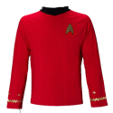
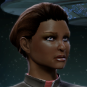
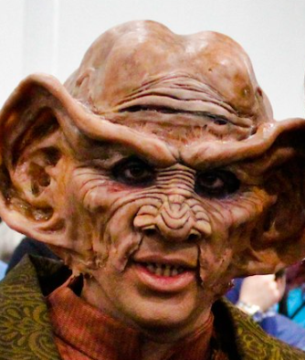
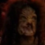

# Mens Rea  

 
<b>Session started at 2022-03-14 / 20:02</b>
 
Fen's StarTrekAdventures Ruleset (v1.1.0)  
*Core RPG ruleset (2022-03-01) for Fantasy Grounds
Copyright 2022 Smiteworks USA, LLC* 
*Fen's NPC Portrait Workaround v2.2.1* 
*Fen's STA House Rules (v1.0) * 

>Captain's Log, Stardate 61285.8: Due to extensive, unexplained hull breaches on deck 8 after the Lister's infestation, we have had to divert to the nearest Federation dry-dock facility on Skana-IV to repair the damage.
While the repairs are performed, I have ordered the crew to take some shore leave in the planet's equatorial area.
Most of the crew were happy for the time off, but Commander Skig was... shall we say passionate about overseeing the repairs. I asked Zox to keep an eye on her and make sure she doesn't sneak back onto the Lister to work during her leave. 

>INTERIOR - Madau Casino: Zox, Skig and Murry have gone to the casino with Zerra and the twins. Dr. Zerra read some book on Dabo and is convinced he has a perfect system to beat the house. The twins have accompanied him, as they are convinced he does not. 

**Dr. Zerra:** I'm telling you, with the right betting strategy Dabo is actually a very simple game. You two are going to eat your words. 
**Lt. Cmdrs 11 and 10:** We do not question that Dabo is a simple game. So simple in fact that we can prove quite easily that the house has a 7% advantage, regardless of your "strategy" 
**Hailey Murry:** Well, maybe not regardless of the strategy 
**Hailey Murry:** But you've got to be very careful about that 
**Lt. Cmdrs 11 and 10:** Correct, you can always give the house a greater advantage 
**Zox:** I hope you lose early and consolidate your loss, otherwise you may confuse luck for skill. 
**Dr. Zerra:** Ye of little faith 
**Lt. Cmdrs 11 and 10:** You are correct, we have no faith to speak of 
**Skig:** Oh, sorry, what were we discussing? 
**Zox:** Nothing quite breaks the mind better than arriving at something for the wrong reasons. 
**Zox:** Gamblin! 
*Dr. Zerra places several bets on the Dabo table* 
*Skig tries to surrepitiously hide her tricoder's auto-relay of from the Lister's repair terminal.* 
*Skig whistles in a very, "I'm guilty and can't even fake hiding it" way.* 
**Lt. Cmdrs 11 and 10:** Do you find this form of recreation enjoyable Commander? 
*Lt. Cmdrs 11 and 10 speaking to Zox* 
**Zox:** Aww, I understand you Skig. But if you want to have some fun with engineering, watch this poor Dr. break a mental circuit. It could be fun! 
**Hailey Murry:** Dr Zerra, where did you get the funds for this? 
**Dabo Girl:** Last call, all bets are final! 
*Dabo Girl spins the Dabo wheel* 
**Zox:** It brings out the worst in people I think, but I can't speak for all sentient being in what make them tick. 
**Hailey Murry: [ REASON  (9) +  CONN  (3)]
[Successes: 2] [Complications: 0]
Success with 1 momentum [2d20 = 19]** 
*Hailey Murry orders some drinks* 
**Skig:  [d20 = 12]** 
**Dabo Girl:** Dabo! 
*Zox diligently scans the room for threats, concealed weapons, and pickpockets.* 
**Zox: [ INSIGHT  (8) +  SECURITY  (4)]
[Successes: 2] [Complications: 0]
Success with 1 momentum [2d20 = 20]** 
*Dr. Zerra slaps his palm on the dabo wheel* 
**Dr. Zerra:** Well shit 
**Dr. Zerra:** Out in one 
**Zox:  [d20 = 16]** 
*Zox <Rwars internally>* 
>Zox places all of his latinum on the table and the Dabo Girl gives the wheel a spin 

**Dabo Girl:** Dabo! 
**Hailey Murry:** They say the only winning move is not to play, but I'm finding this is very entertaining 
>Zox has chosen poorly 

*Skig makes mental note to never trust Zox or Zerra with money.* 
**Lt. Cmdrs 11 and 10:** It is truly astonishing how quickly you both lost your money 
**Zox:** I knew I should have listened to that Ferengi selling timeshares....that would have been a good investment. 
**Zox:** It's better this way.  
>Just as the crew are lauging at Zerra and Zox's terrible luck, Zox's communicator chimes 

**Commander Bachar:** Bachar to Zox! I need a full... 
>The comms cut out 

*Skig yawns.* 
*Skig stretches.* 
**Zox:** Well it seems we have a more pressing matter to attend to! Computer, give me Commander Bachar's last known location! 
**Zox: [ CONTROL  (11) +  COMMAND  (3)]
[Focus: Shipboard Tactical Systems ]
[Successes: 1] [Complications: 0]
Success with 0 momentum [2d20 = 28]** 
*Skig flips on her tricoder and connects to the Lister, locates Bachar's position and prepares to fire a full phaser spread to that location, keeping with tradition.* 
**Computer:** Commander Bachar is in her hotel room on Level 14 
*Skig switches to photon torpedoes.* 
**Hailey Murry:** Hmmm. Do you think Commander Bachar just needed a full bottle of wine? 
**Zox:** Sig, Hailey, come with me! 
**Dr. Zerra:** That sounds unlikely 
**Zox:** Computer, Energize! 
**Zox: [ CONTROL  (11) +  ENGINEERING  (4)]
[Focus: Shipboard Tactical Systems ]
[Successes: 1] [Complications: 0]
Success with 0 momentum [2d20 = 28]** 
*Dr. Zerra grabs his medkit and follows Zox* 
*Hailey Murry takes her drink with her, unless stopped by someone* 
>The crew dematerialize from the casino floor and rematerialize just outside Commander Bachar's room 

**Zox: [ INSIGHT  (8) +  SECURITY  (4)]
[Successes: 1] [Complications: 0]
Success with 0 momentum [2d20 = 22]** 
*Skig stops watching the surveillance feeds from the Lister repair crews.* 
>Everything seems quite here now, no sign of Commander Bachar (or anyone else) in the room 

**Hailey Murry:** Well, this is both convenient and not convenient 
**Zox:** What could have happend?! 
indarien (Skig): Does the room look trashed? 
**Zox:** Skig, im sure these rooms have a lot of 'Action' going on in them, can you hack into the camera feed? 
**Zox:** Possibly run a scan to see how much transporter activity has occured in this space? 
**Skig:** Hmm... I wonder if this part of some strange human mating ritual, like Hailey did recently? 
*Hailey Murry pulls out her Tricorder and scans to see if she can pick up any residual energies, typing with the pinky finger of the hand holding her drink* 
**Zox: [ FITNESS  (9) +  SECURITY  (4)]
[Focus: Xenobiology ]
[Successes: 0] [Complications: 0]
Failed on DC: 1 [2d20 = 31]** 
**Hailey Murry: [ CONTROL  (8) +  SCIENCE  (5)]
[Successes: 2] [Complications: 0]
Success with 1 momentum [2d20 = 5]** 
*Skig taps her communicator.* 
**Zox:** All I smell is fermented beverages. 
**Skig:** This is Lt. Commander Skig of the USS Lister to casino security. I need access to the level 14 security system relays for the last 30 minutes. 
**Skig:** As well as all video surveillance footage of the elevators to and from level 14 for the past 30 minutes. 
**Zox:** Dr. Zerra, could you canvas the area for any residual nucleic acid residues? 
**Nameless, faceless security guard:** Uhhm, sure thing ma'am. Are we in trouble? 
**Hailey Murry:** stands by the bed, frowning 
*Hailey Murry stands by the bed, frowning* 
**Skig:** That depends on what we find. We are investigating a disturbance with crewmember. 
**Nameless, faceless security guard:** Oh, ok. It's my first day, so I don't want to get fired again 
>Skig receives a link to her PADD containing surveilance footage from level 14 

**Skig:** What's the matter Hailey, insufficient human mating activity? 
>Hailey Murry kneels down to investigate a black score mark on the deck near the bed. It is approximately 1/2 meter across, and smells slightly of burnt hair 

**Hailey Murry:** What could have cuased this? 
**Dr. Zerra:** I am reading humanoid DNA here. It looks like someone was vaporized here with a disruptor... 
>♫♫♫Dramatic Music String♫♫♫ 

*Hailey Murry drops her glass* 
**Zox:** Run a match against the ship's biobank. 
*Skig reviews the surveillance footage at 5x speed to see anyone coming into or out of the elevators and down the hallway towards Bachar's room.* 
>---------CUT TO CREDITS-------
♫♫♫Opening Theme♫♫♫ 

>Episode 4 - Mens Rea
Written By Natali Baum 
Directed By Diana Abrams 

**Skig: [ CONTROL  (11) +  ENGINEERING  (5)]
[Focus: Computers ]
[Successes: 2] [Complications: 0]
Success with 1 momentum [2d20 = 29]** 
**Dr. Zerra:** The DNA is damaged beyond recognition, even with the scanners in sickbay I wouldn't be able to identify it 
**Dr. Zerra:** It could be Human, but it could also be one of a dozen other species 
**Zox:** Damn this 24th Century technology! 
**Skig:** Most DNA evidence turned out to be faulty in Tellerite judicial court, so I'm not sure how useful it would be. 
**Zox:** Now we will be agonized if Bachar vaped someone while being abucted, or was herself vaped! 
**Skig:** I doubt Bachar was carrying a disrupter, likely it was one of the Naussicans who broke into her room after they beamed into the hallway. 
**Hailey Murry:** Naussicans?  
*Skig states this while contemplating the decorative vase on the table.* 
**Zox:** What is it with Naussicans and gambling related violence. 
**Skig:** Normally I would assume Bachar is carrying a disruptor, but given that she is on shore leave, I would suspect only a type-2 phaser instead. 
**Skig: [ INSIGHT  (8) +  SECURITY  (3)]
[Focus: Computers ]
[Successes: 2] [Complications: 0]
Success with 1 momentum [2d20 = 19]** 
**Skig:** There was also an Orion woman with them, which was likely the leader of the group, given Orion control of various syndicates. 
**Zox:** But is Bachar OK!? 
**Skig:** The footage is inconclusive, as it does not include interior room events. 
**Hailey Murry: [ INSIGHT  (12) +  MEDICINE  (3)]
[Successes: 2] [Complications: 0]
Success with 1 momentum [2d20 = 14]** 
**Zox:** Is there any way you can have the Lister prevent any ships from leaving orbit? 
**Skig:** Also, there is a 132.87263 second gap in the footage, which means the security system here is compromised, and whoever has done it is likely listening to our conversation. 
**Lt. Cmdrs 11 and 10:** The lister is in dry dock, it couldn't prevent a shuttle from leaving orbit 
**Hailey Murry:** We'll want to talk to the Captain, I think. He may have some clues about her previous postings 
**Zox:** The Lister is bowed but never unready! 
**Skig:** Well, there is a captain of a Federation starship, who could request immediate ship-lock of port control. 
*Zox Slaps his in communicator badge in a forceful yet dignified fashion* 
**Zox:** Captain Baras, requesting a cessation of all outgoing orbital traffic immediately! 
**Hailey Murry:** 11, 10, can you do a trace on the transporter? Skig, can you point out where the Orion Woman and Naussicans transported in at? 
**Captain Baras:** Oh my stars, I'll call it in as soon as I find my pants 
**Captain Baras:** But I'll need an explanation after my massage 
**Zox:** Yes Captain! 
**Lt. Cmdrs 11 and 10:** Interesting, the transporter trace does not appear to be leaving the surface. It reads as a point-to-point transport to another continent north of here 
**Kolea:** But Captain, are you sure you want me to stop what I'm currently doing and let you get your pants back? 
**Zox: [ DARING  (11) +  SECURITY  (4)]
[Focus: Espionage ]
[Successes: 2] [Complications: 1]
Success with 1 momentum [3d20 = 37]** 
**Zox:  [d20 = 19]** 
*Zox Zox's scales flush an unexpected red hue upon hearing Kolea's voice on the intercom.* 
>Zox investigates the computer hack and manages to pull up some of the deleted footage from the hall. He plays it back on the monitor 

>Commander Bachar's door is already open, and the sounds of a struggle can be heard inside 

**Commander Bachar:** Bachar to Zox! I need a full... 
*Skig uses the electronic slot machines as a distributed point relay to create an infinite loop for outbound traffic on any identified suspicious traffic.* 
>The Commander's voice in the recording is interrupted by the sound of a disruptor blast 

**Skig: [ CONTROL  (11) +  ENGINEERING  (5)]
[Focus: Computers ]
[Successes: 2] [Complications: 0]
Success with 1 momentum [2d20 = 19]** 
**Unidentified Female:** I thought I told you to activate the jammer! 
**Unidentified Male:** Uhhh, I forgot. Am I in trouble? 
**Unidentified Female:** Just beam down to security and delete the footage before these starfleet types find it 
**Unidentified Female:** You, dissintigrate the body 
*Skig reroutes all control traffic for the casino security systems that does not go through her PADD into the slot machines.* 
**Skig: [ CONTROL  (11) +  ENGINEERING  (5)]
[Focus: Computers ]
[Successes: 3] [Complications: 0]
Success with 2 momentum [2d20 = 12]** 
**Unidentified Female:** And you, beam over to Anal Konis and check us in. We don't have much time with these fucking Starfleet types on our tails 
**Kolea:** Oooh!!  I love it when I get anal konis! 
>Two transporter sounds are then heard, one from inside the room and one from the hall as the away team beam in. The recording ends shortly after 

**Skig:** There goes our ratings for this week. 
>ANTAL Konis 

**Kolea:** Captain, would you like some anal kontis? 
**Skig:** Please stop. 
**Hailey Murry:** Kolea, we WILL reinstall the censors if you keep that up 
**Captain Baras:** I could fire you, you know 
**Zox:** Someone pinpoint that location and lets pursue! 
*Kolea says something which is heavily bleeped, even on Cinemax at 0200.* 
**Hailey Murry:** So, I think it's pretty safe to say that Bachar is okay. They would have vaporized her to being with if they'd wanted to kill her and get ird of the body 
*Zox 's scales flush from red to blue to purple* 
BayushiKazemi (Hailey Murry): *begin 
**Zox:** Safety is only within the Federation! We must apprehend this uncouth rapscallions! 
**Skig:** Unless of course they bungled what they were planing and opted for the backup plan. 
**Zox:** To Antal Konis! 
**Lt. Cmdrs 11 and 10:** Apologies Commander, but I am not able to pinpoint the transporter trace to a specific location. I can narrow it down to a city on the northern continent though 
*Kolea looks up information on hotels/restaurants/locations named Antal Konis. Failing that, looks for any regsitered guests who have arrived through arrival starports.* 
*Skig looks up information on hotels/restaurants/locations named Antal Konis. Failing that, looks for any regsitered guests who have arrived through arrival starports.* 
**Skig: [ REASON  (10) +  CONN  (2)]
[Successes: 1] [Complications: 0]
Success with 0 momentum [2d20 = 19]** 
>Skig finds a variety of information on an Aldazed chemist named Antal Konis. There are a variety of things bearing his name in the city: A Memorial, a public library, a Federation Chemistry lab, a museum, and a public park 

**Skig:** There are a number of locations dedicated to the chemist Antal Konis, unless the people in question were planning to hang out in a public meeting room in a library none of them would require reservations. 
**Zox:** HRM 
**Hailey Murry:** Is the Chemist still alive?  
**Skig:** However, we should be able to investigate them rather easily to determine where our Naussican quarry went. 
**Skig:** No, but he is the only person who is followed by Neraran's Twitter account. 
**Zox:** I wonder what a bunch of bad people would want with a Federation Commander....Computer, what is the most secure location in Antal Konis that a commander would be needed to grant access? 
**Zox: [ INSIGHT  (8) +  SECURITY  (4)]
[Focus: Espionage ]
[Successes: 1] [Complications: 0]
Success with 0 momentum [2d20 = 25]** 
**Zox: [ INSIGHT  (8) +  SECURITY  (4)]
[Focus: Espionage ]
[Successes: 2] [Complications: 0]
Success with 1 momentum [2d20 = 16]** 
**Computer:** The Antal Konis Chemistry Laboratory is classified as a level 2 restricted facility, it requires command authorization to access 
**Zox:** To the Chemistry Laboratory! 
**Zox:** BUT before we go 
indarien (Skig): Skig on vacation. "I redesigned the entire casino security system to make it more suitable to the types of crimes they are committing here." 
**Zox:** Everyone remember to put on your safety glasses! 
**Skig:** And possibly get phasers and rebreathers and chemical suppression equipment, as well as medical survival equipment. 
**Hailey Murry:** Absolutely  
**Skig:** And finish our drinks. 
*Skig chugs the rest of her 4 liter tankard of Tellerite Ale.* 
*Hailey Murry laments her drink, which is on the floor by the bed* 
>EXTERIOR - Steps of the Antal Konis lab: The away team beams in and stands before an unassuming seven story building in the central district of the city. 

*Skig requisitions type-2 phaser, rebreather, medical supplies, NBC survival gear.* 
*Hailey Murry grabs a type-2 phaser and a rebreather* 
BayushiKazemi (Hailey Murry): Can we put Zox in a Barney costume?  
**Zox: [ DARING  (11) +  SECURITY  (4)]
[Focus: Espionage ]
[Successes: 2] [Complications: 0]
Success with 1 momentum [2d20 = 20]** 
**Zox:** Hello my new name is Dr. Zoxxus. 
*Hailey Murry lends Zox a pair of non-prescription glasses* 
>The away team enter the building and see a normal looking lobby with a receptionist behind a desk near the doors 

**Receptionist:** Ummm, can I help you? 
*Receptionist looks at Skig in her hazmat suit* 
indarien (Skig): When it becomes important, remember, Dr. Zerra is already in a full exosuit. 
**Skig:** Hayfever. 
**Zox:** Hello noble federation receptionist. I have heard there is a celebrity in the building and would wish to meet with them, can you tell me where I could find their highly anticipated lecture? 
**Dr. Zerra:** Really difficult case, requires constant medical supervision 
**Receptionist:** We don't schedule lectures here, this is a research facility not formally attached to the academy 
**Receptionist:** Did you have an appointment? 
*Zox Shows the receptionist his actual badge and points to his snout twice.* 
**Receptionist:** Oh I didn't realize you were with Starfleet, you look absolutely rediculous 
**Receptionist:** How can I help you sir? 
**Zox:** Have there been any unusual guests or other Starfleet personel visits today? 
**Receptionist:** It's odd that you ask, we did have a guest about half an hour ago 
*Skig gets out her tricoder and begins searching for Bachar, Naussicans, Orions, OR blank spots in her search that would indicate areas that are designed to resist scanning.* 
**Zox:** are they still here? 
**Receptionist:** She was a Starfleet Commander, but she had 2 Naussican bodyguards 
**Receptionist:** Let me check the visitor log 
**Zox:** Yes I'd say that qualifies as unusual =D 
*Receptionist starts tapping on her computer* 
**Skig:** Was she an Orion Starfleet Commander? 
**Skig:** Or Human Starfleet Commander? 
**Receptionist:** No sir. Ma'am.. Um, she was Human 
**Skig:** I see. 
*Skig checks to see if Babylon 5 Changeling Nets have been imported across series.* 
**Receptionist:** Yes I see her sign-in here, Commander Amondi Bachar 
**Receptionist:** She signed in with 2 guests, looks like they are still here 
**Zox:** I am going to request that no one is allowed to leave the building until we find these wonderful people. it is for their own security. 
**Receptionist:** They had an appointment with Dr. Malov in the west wing 
**Skig: [ CONTROL  (11) +  SECURITY  (3)]
[Successes: 2] [Complications: 0]
Success with 1 momentum [2d20 = 27]** 
**Zox:** To the West Wing! 
**Skig:** Zox, perhaps you should notify the nice Federation Security Staff here that we are here and what we are doing? 
**Zox:** Yes. 
**Skig:** Lest they think we are trying to abduct people who willingly signed in. 
**Zox: [ CONTROL  (11) +  SECURITY  (4)]
[Focus: Shipboard Tactical Systems ]
[Successes: 1] [Complications: 0]
Success with 0 momentum [2d20 = 31]** 
**Hailey Murry:** What is Dr Malov's speciality, if I may ask? 
**Receptionist:** I don't know ma'am, I'm just a receptionist 
**Receptionist:** I don't even have security clearance to go over there 
**Zox: [ CONTROL  (11) +  COMMAND  (3)]
[Successes: 2] [Complications: 0]
Success with 1 momentum [2d20 = 11]** 
**Red Shirt:** Reporting for duty sir! 
**Red Shirt:** And can I just say, I'm real excited to have this opportunity sir 
**Red Shirt:** This is just real swell 
**Red Shirt:** I know if you give me a chance  sir, I won't let you down 
**Zox:** No one leaves this building. Make sure to put nice lobby music on to calm anyone losing their nerves. 
**Red Shirt:** Sure thing sir. Wowee, that sounds just swell 
**Zox:** And if you see a Nausicaan, tell them they have to Guramba 
**Zox:** *no 
*Red Shirt takes up a position near the door and politely orders a few people not to leave* 
**Red Shirt:** You bet sir, I'll write that down 
>Zox leads his team to Dr. Malov's lab in the west wing, leaving behind several Red Shirts to secure the entrances 

>They come up to the entrance to the lab, the door is open, and voices can be heard inside 

**Commander Bachar:** Fascinating Dr, this research could be of great importance to the Federation and to Starfleet 
**Dr. Malov:** I'm glad you agree Commander, I hope you'll pass that along to the admiralty 
**Skig: [ DARING  (9) +  ENGINEERING  (5)]
[Focus: Computers ]
[Successes: 0] [Complications: 0]
Failed on DC: 1 [2d20 = 31]** 
**Skig: [ DARING  (9) +  ENGINEERING  (5)]
[Focus: Computers ]
[Successes: 3] [Complications: 0]
Success with 2 momentum [2d20 = 7]** 
indarien (Skig): Rational idea:  Fail.  Stupid thing:  3 Success.  Yes, Dice are involved. 
*Naussican looks down at a small gadget that starts beeping on his belt* 
**Naussican:** Shit, the security scanner is reading five starfleet commbadges in the hall 
**Commander Bachar:** Well we knew we wouldn't have long 
*Skig pulls out phaser, kicks door open, stuns them all with phaser rifle.* 
*Commander Bachar grabs something from a chemical printer next to her* 
**Commander Bachar:** I'd love to stay and chat, but I have places to be 
*Skig because it's not a good scene with Skig using a phaser on Bachar.* 
indarien (Skig): "without" 
*Commander Bachar disintigrates Dr. Malov with a disruptor, before knocking over a shelf full of chemicals and jumping out the window* 
**Skig: [ CONTROL  (11) +  SECURITY  (3)]
[Successes: 4] [Complications: 0]
Success with 3 momentum [2d20 = 20]** 
**Skig:  [Damage: 7] [Effects: 2] [5d6+dChallenge = 7]** 
*Commander Bachar cries out from a phaser blast to the back as she falls out the window* 
>Unfortunately, Skig's phaser blast ignites the fumes from the chemicals that Bachar knocked over 

>A massive conflagration erupts, engulfing the lab in flames 

>♫♫♫Dramatic Music String♫♫♫ 

indarien (Skig): Good thing Skig brought all the NBC gear. :) 
*Zox begins writing up the lab for not using fume hoods.* 
# Mens Rea (Part 2) 

 
<b>Session started at 2022-03-21 / 20:06</b>
 
Fen's StarTrekAdventures Ruleset (v1.1.0)  
*Core RPG ruleset (2022-03-20) for Fantasy Grounds
Copyright 2022 Smiteworks USA, LLC* 
*Fen's NPC Portrait Workaround v2.2.1* 
*Fen's STA House Rules (v1.0) * 
*Skig runs to the window to see if shooting Commander Bachar a second time is an option.* 
indarien (Skig): The Fire Suppression System is currently undergoing maintenance, being handled by New Jersey Skilled Trades Workers, it will be brought back online in the square root of 3d84 days, rounded up to the nearest 6. 

>INTERIOR - Chemisty Lab: As Commander Bachar dives out the window, a massive fire erupts, engulfing the lab in flames. The away team recoil from the heat. 

*Skig runs to the window to see if shooting Commander Bachar a second time is an option.* 
*Zox slaps his comms badge* 
**Zox:** Security team! Shift your security perimeter assignement to the north of the building, we have an escapee that is highy dangerous! 
**Grad Student:** Your comm badge won't work here sir, the building is shielded for security 
>[TURN] Hailey Murry 

**Grad Student:** This is a secure facility sir 
**Zox:** Do you feel secure with an intergalatic felon fleeing an on fire building? 
**Grad Student:** I'm going to bravely run away  
**Hailey Murry: [ DARING  (11) +  CONN  (3)]
[Successes: 1] [Complications: 0]
Success with 0 momentum [2d20 = 25]** 
*Hailey Murry grabs the fire extinguisher and begins putting out the fire against the computers* 
**Hailey Murry: [ CONTROL  (8) +  ENGINEERING  (2)]
[Successes: 3] [Complications: 0]
Success with 2 momentum [2d20 = 9]** 
**Hailey Murry:  [4d6 = 15]** 
>[INITIATIVE] Allied forces have the initiative! 

>[INITIATIVE] Hostile forces have the initiative! 

>[TURN] Fire 1 

>[INITIATIVE] Allied forces have the initiative! 

**Zox:** 11 and 10, Can we get a forcefield around that fire!? 
>[TURN] Lt. Cmdrs 11 and 10 

**Zox:** It would be foolish to try and fight this fire without first ascertaining what type of fire it is! 
**Zox:** Containment is the first step! 
**Lt. Cmdrs 11 and 10:** Give us your phaser, we can use it to creat a localized suppression field 
*Zox hands over his phaser.* 
>[TURN] Fire 13 

>[INITIATIVE] Allied forces have the initiative! 

**Zox: [ CONTROL  (11) +  ENGINEERING  (4)]
[Successes: 2] [Complications: 0]
Success with 1 momentum [2d20 = 26]** 
*Skig wonders if Hailey will get pregnant with small fire creatures after being this close to the flame.* 
*Hailey Murry does not approve of the direction that the fire is taking* 
BayushiKazemi (Hailey Murry): Hey, can we jump over these desks or are they too high for that? Asking for a friend 
**Zox:  [5d6 = 24]** 
**Zox: [ FITNESS  (9) +  CONN  (1)]
[Successes: 1] [Complications: 0]
Success with 0 momentum [2d20 = 24]** 
>[TURN] Fire 16 

>[TURN] Fire 14 

>[INITIATIVE] Allied forces have the initiative! 

>[TURN] Zox 

>[TURN] Skig 

**Skig: [ REASON  (10) +  SCIENCE  (3)]
[Focus: Reverse Engineering ]
[Successes: 3] [Complications: 0]
Success with 2 momentum [3d20 = 29]** 
*Skig is actually not worried about the fire, there is not a reason to panic yet.* 
>[TURN] Fire 12 

>[TURN] Dr. Zerra 

**Zox:** Zerra, check the ceiling for water or liquid nitrogen pipes! 
**Zox: [ DARING  (11) +  CONN  (1)]
[Successes: 1] [Complications: 0]
Success with 0 momentum [2d20 = 26]** 
**Dr. Zerra:** Up there, non-potable water pipes 
*Dr. Zerra points at some pipes* 
**Zox:** Phaser them open! 
*Skig is really happy she is in this containment suit.* 
*Dr. Zerra shoots the pipe, bursting it open. Raw sewage begins sparying from the pipes all over the room* 
>[ROUND 2] 

**Hailey Murry:** Oh why does this-- 
**Zox: [ DARING  (11) +  SECURITY  (4)]
[Successes: 1] [Complications: 0]
Success with 0 momentum [2d20 = 18]** 
**Zox:  [5d6 = 16]** 
*Zox is unphased by the smell of refuse, as his species loiters in crowded herds.* 
>[TURN] Fire 12 

>[TURN] Zox 

>[INITIATIVE] Allied forces have the initiative! 

**Hailey Murry: [ CONTROL  (8) +  ENGINEERING  (2)]
[Successes: 2] [Complications: 0]
Success with 1 momentum [2d20 = 13]** 
**Zox:  [d20 = 13]** 
**Hailey Murry:  [4d6 = 10]** 
*Zox laughs at Hailey Murry.* 
>[TURN] Hailey Murry 

>[TURN] Fire 14 

>[INITIATIVE] Allied forces have the initiative! 

>[TURN] Lt. Cmdrs 11 and 10 

**Hailey Murry:  [6d6 = 18]** 
>[TURN] Fire 23 

>[INITIATIVE] Allied forces have the initiative! 

>[TURN] Skig 

**Skig: [ DARING  (9) +  CONN  (2)]
[Successes: 1] [Complications: 0]
Success with 0 momentum [2d20 = 16]** 
**Skig: [ CONTROL  (11) +  ENGINEERING  (5)]
[Successes: 2] [Complications: 0]
Success with 1 momentum [2d20 = 15]** 
**Skig:  [Damage: 6] [Effects: 3] [5d6+dChallenge+d6 = 6]** 
>[INITIATIVE] Hostile forces have the initiative! 

>[TURN] Fire 24 

>[TURN] Dr. Zerra 

BayushiKazemi (Hailey Murry): &gt;:c 
>[ROUND 3] 

>[TURN] Zox 

**Zox: [ CONTROL  (11) +  SECURITY  (4)]
[Successes: 4] [Complications: 0]
Failed on DC: 5 [4d20 = 60]** 
**Zox:  [6d6 = 18]** 
**Zox:  [d6 = 4]** 
>[TURN] Fire 24 

>[INITIATIVE] Allied forces have the initiative! 

*Hailey Murry karate chops the fire before it can get to her* 
*Zox makes dinosaur noises.* 
>[TURN] Hailey Murry 

**Hailey Murry: [ CONTROL  (8) +  ENGINEERING  (2)]
[Successes: 3] [Complications: 0]
Success with 2 momentum [2d20 = 3]** 
*Zox 's scales flush an unhealthy, pale hue.* 
**Hailey Murry:  [4d6 = 14]** 
>[TURN] Fire 15 

>[INITIATIVE] Allied forces have the initiative! 

>[TURN] Skig 

Masakari (Zox): in a future episiode, the alternate way this scene played out is explored, either by revisiting it, or by half of a characters limbs replaced by robotics. 
**Skig: [ CONTROL  (11) +  ENGINEERING  (5)]
[Focus: Survival ]
[Successes: 2] [Complications: 0]
Success with 1 momentum [2d20 = 21]** 
**Skig:  [Damage: 6] [Effects: 3] [5d6+dChallenge+d6 = 6]** 
>[TURN] Fire 12 

>[INITIATIVE] Allied forces have the initiative! 

>[TURN] Dr. Zerra 

>[TURN] Fire 13 

>[ROUND 4] 

**Skig:  [Damage: 3] [Effects: 2] [5d6+dChallenge = 3]** 
>[TURN] Hailey Murry 

**Hailey Murry: [ CONTROL  (8) +  SECURITY  (2)]
[Successes: 2] [Complications: 0]
Success with 1 momentum [2d20 = 29]** 
**Hailey Murry:  [4d6 = 19]** 
>[TURN] Fire 12 

>[INITIATIVE] Allied forces have the initiative! 

**Skig: [ CONTROL  (11) +  ENGINEERING  (5)]
[Focus: Survival ]
[Successes: 3] [Complications: 0]
Success with 2 momentum [2d20 = 21]** 
**Skig:  [Damage: 2] [Effects: 0] [5d6+dChallenge+d6 = 2]** 
**Skig:  [Damage: 5] [Effects: 1] [5d6+dChallenge+d6 = 5]** 
>[INITIATIVE] Hostile forces have the initiative! 

>[TURN] Skig 

*Zox makes groggy dinosaur noises.* 
>[TURN] Dr. Zerra 

**Skig:  [Damage: 5] [Effects: 1] [5d6+dChallenge = 5]** 
>[ROUND 5] 

>[TURN] Zox 

**Zox: [ FITNESS  (9) +  SECURITY  (4)]
[Focus: Endurance ]
[Successes: 3] [Complications: 0]
Success with 2 momentum [3d20 = 30]** 
*Hailey Murry notes this down, because this is going to be one of those moments she's going to have to revisit with Dr Zera in therapy later as the doctor watches the recently saved patient leap onto the open flames* 
**Zox:  [d20 = 17]** 
**Zox: [ PRESENCE  (10) +  SCIENCE  (3)]
[Successes: 0] [Complications: 0]
Failed on DC: 1 [2d20 = 35]** 
**Hailey Murry: [ PRESENCE  (8) +  SCIENCE  (5)]
[Successes: 0] [Complications: 0]
Failed on DC: 1 [d20 = 17]** 
Masakari (Zox): I'm rolling against the writer, as dinosaurs lived in a prehistoric hellscape full of volcanoes, thus had to be fireproof 
*Skig is not sure what is going on, but she suspects Zox is not entirely coherent or cognizant at this point.* 
**Zox:  [5d6 = 14]** 
*Zox groggy dinosaur whistles intensify.* 
>[TURN] Fire 12 

GM: (POLL) resolve Zox now? 
GM: (POLL) Or Cliffhanger 
>As Zox dives onto the fire to smother it with his body, a team of Starfleet Security officers barge in wearing full tactical gear and carrying phaser rifles 

**Security Officer:** No one move! Security systems detected a shapeshifter infiltration! 
**Skig:** That's correct, the Changeling jumped out the door after I shot it. 
**Security Officer:** This entire area is under lockdown until we complete a phaser sweep 
indarien (Skig): (window) 

# Mens Rea (Part 3) 

 
<b>Session started at 2022-03-28 / 20:06</b>
 
Fen's StarTrekAdventures Ruleset (v1.1.0)  
*Core RPG ruleset (2022-03-20) for Fantasy Grounds
Copyright 2022 Smiteworks USA, LLC* 
*Fen's NPC Portrait Workaround v2.2.1* 
*Fen's STA House Rules (v1.0) * 
*Security Officer runs into the room with a fire extinguisher and sprays thick white foam all over Zox's smoldering (somehow living) body* 
BayushiKazemi (Hailey Murry): It's because he's warm-blooded 
**Zox:** Don't worry about me, get the shapeshifter! 
**Zox: [ DARING  (11) +  COMMAND  (3)]
[Successes: 1] [Complications: 0]
Success with 0 momentum [2d20 = 23]** 
**Security Officer:** Nobody move, you could be the shapeshifter for all I know 
**Hailey Murry:** I think it's just the one shapeshifter, though 
**Security Officer:** That is just what a second shapeshifter would say 
**Hailey Murry:** Or zero? Did you shoot her, Skig? 
**Skig:** The Shapeshifter went out the window, but sure, have us all stand here while the murderous Shapeshifter who disintegrated Dr. Malov gets away. 
*Skig looks at Zox with, "this is your field of expertise" expression of exasperation.* 
*Security Officer pulls out a hypospray* 
**Security Officer:** Alright, who's first for blood screens? 
**Skig:** Will it make Hailey pregnant? 
**Hailey Murry:** SKIG 
**Hailey Murry:** I'll take the first screening 
BayushiKazemi (Hailey Murry): "If you cut their hand off and it grows back, they're a doppelganger!" 
*Security Officer takes a vial of blood from Hailey Murry and shakes it around a bit* 
*Zox bleeds a little onto the wall, and the blood does not turn into golden goo.* 
**Zox: [ DARING  (11) +  SECURITY  (4)]
[Focus: Endurance ]
[Successes: 3] [Complications: 0]
Success with 2 momentum [2d20 = 11]** 
**Zox: [ FITNESS  (9) +  SECURITY  (4)]
[Focus: Endurance ]
[Successes: 2] [Complications: 0]
Success with 1 momentum [2d20 = 19]** 
*Dr. Zerra gives Zox some pain medicine and applies a burn spray* 
**Zox:** Rawwwr. Barely a work up, you should see a Voth family reunion. 
*Skig goes full Klingon, takes off her glove, stabs herself in the hand with a knife and bleeds on the floor.* 
**Skig:** This is how we did it during the Battle of Betazed. 
*Security Officer methodically performs a blood screen on all the staff, finding no shapeshifter goo* 
**Hailey Murry:** I apologize about the biohazard 
**Security Officer:** Well, I guess you were right that none of you were shapeshifters 
**Hailey Murry:** Wait a second 
**Hailey Murry:** What if *YOU* are the shapeshifter? 
**Security Officer:** Good point, Dr. can you check me? 
*Dr. Zerra takes some of the Security Officer's blood and checks that it doesn't turn back into shapeshifter goo* 
*Zox Attempts to smell out the shapeshifter.* 
*Skig offers some of the Shapeshifter Goo on the window for comparison.* 
**Zox: [ FITNESS  (9) +  SECURITY  (4)]
[Focus: Xenobiology ]
[Successes: 1] [Complications: 1]
Success with 0 momentum [4d20 = 65]** 
>Zox sniffs deeply but inhales far too many fire extinguishing chemicals, searing his lungs and causing him to caugh uncontrollably 

**Hailey Murry:** Ooooh, don't do that 
**Hailey Murry:** Doctor Zera, is that healthy? 
BayushiKazemi (Hailey Murry): *Zerra 
*Zox makes some rather painful sounding, deep coughs.* 
**Dr. Zerra:** Not at all, these industrial extinguishers utilize a lot of nasty compounds 
**Hailey Murry:** I imagine it would be excruciatingly painful 
**Dr. Zerra:** It must be, Commander I will need to get in there surgically to repair the damage when we are back on the ship 
**Dr. Zerra:** Until then, take this.  
*Dr. Zerra hands Zox a hypospray* 
**Dr. Zerra:** If the pain gets too much, use this 
GM: 0110100001100001011100100111100101101011 
GM: 0110100001100001011100100111100101101010 
**Skig:** We could turn him into a cyborg by installing some robotic lungs and making him a Mecha-Zox. 
**Hailey Murry:** That will be for the sequel 
**Lt. Cmdrs 11 and 10:** Cybernetic enhancement is not without its benefits 
*Hailey Murry pulls away from the security guard to speak to Skig and Zox for a moment* 
**Hailey Murry:** Okay, so we should discuss what to do with Commander Bachar's credentials. Do we want to disable them entirely or flag them?  
*Zox Attempts to recall what the Starfleet protocol is...* 
**Skig:** Standard procedure would be to honeypot them into a useless location that would trap her account to log her location. 
**Zox: [ INSIGHT  (8) +  SECURITY  (4)]
[Focus: Espionage ]
[Successes: 1] [Complications: 0]
Success with 0 momentum [2d20 = 22]** 
**Zox:** That's not a terrible idea good Skig. 
**Dr. Zerra:** Interesting. Have a look at this: whoever that was immitating Commander Bachar fed a sample of changeling genetic material into the chemical printer 
**Skig:** We need to ascertain the likely next location they will strike and respond more quickly. Any indications of where they went? Also, a pair of Nausicans were with her originally and they beamed out immediately, so we need to follow their transporter trace also. 
**Skig:** ...or they were melted by the fire... 
**Skig:** Dr. Zerra, let's check these for evidence that may help us figure out where they came from or where they are going. 
*Skig points to immolated Nausicans.* 
**Dr. Zerra:** This is unusual. Both Naussicans have signs of low level radiation poisoning 
**Zox:** Dr. Zerra, can you match the signature against all known changelings? 
**Hailey Murry:** Why would they need more changeling genetic material? Is it possible they're looking to make a mask or suit?  
**Hailey Murry: [ REASON  (9) +  SCIENCE  (5)]
[Successes: 0] [Complications: 1]
Failed on DC: 1 [2d20 = 35]** 
**Dr. Zerra:** I am not sure Counselor, this equipment couldn't possibly clone changling genetic material 
**Dr. Zerra:** They must have been using it for its chemical properties 
**Dr. Zerra:** And Zox, I am afraid that whatever genetic material was present was consumed by the chemical printer 
**Hailey Murry:** Did it get the chance to print anything? 
**Dr. Zerra:** The log indicates it printed approximately 800ml of something 
**Dr. Zerra:** But the chemical signature was wiped 
**Skig: [ REASON  (10) +  ENGINEERING  (5)]
[Focus: Emergency Repairs ]
[Successes: 1] [Complications: 1]
Success with 0 momentum [2d20 = 31]** 
*Skig gets out a large hammer for a small piece of electronics.* 
**Hailey Murry:** Don't hit the end with the power supply this time 
**Skig:** We may be able to reconstruct the chemical signature from the encoded memory files if the buffer was not cleared, which it might not have been if it was in the printing process when we interrupted them. 
*Skig is not multitasking well.* 
**Zox:** Dr. Zerra, what other labs would have a device like this capable of replicating changeling DNA? I surmise we should locate the next closest one, and we will find Bachar there. 
**Hailey Murry:** Let me see if I can work that through here 
**Skig:** Next time I think we should shoot first and ask questions later, per Starfleet protocol involving Changelings. 
**Zox:** But we aren't technically at a state of war with them? 
**Zox: [ INSIGHT  (8) +  SCIENCE  (3)]
[Focus: Xenobiology ]
[Successes: 3] [Complications: 0]
Success with 2 momentum [2d20 = 9]** 
**Hailey Murry: [ REASON  (9) +  SCIENCE  (5)]
[Successes: 2] [Complications: 0]
Success with 1 momentum [2d20 = 8]** 
*Skig blinks away a spray of battery chemicals from her face and mutters something about idiotically opening the face shield BEFORE finishing her checks.* 
**Skig:** Sorry, I missed that. Did you suggest not shooting Bachar on sight? 
**Skig:** Err... I meant the suspected Changeling, yes. That is what I meant. 
**Zox:** Yes, because if you shot the real Bachar, you'd never see life outside the brig again. 
*Zox shrugs.* 
*Skig shrugs.* 
**Skig:** Exentuating circumstances. 
**Hailey Murry:** Okay, so they managed to wipe the logs first. However, there are no alerts for chemical weapons nor dangerous compounds 
**Hailey Murry:** Those logs are intact still 
**Hailey Murry:** None are recent 
**Zox: [ REASON  (7) +  SECURITY  (4)]
[Focus: Espionage ]
[Successes: 0] [Complications: 0]
Failed on DC: 1 [2d20 = 37]** 
**Zox: [ INSIGHT  (8) +  ENGINEERING  (4)]
[Successes: 2] [Complications: 0]
Success with 1 momentum [2d20 = 8]** 
**Zox:** hands Skig Bachar's comm badge. 
*Zox hands Skig Bachar's comm badge.* 
**Zox:** Skig, can you see if there's some extra information on here that can let us find the real Bachar? 
**Hailey Murry: [ INSIGHT  (12) +  CONN  (3)]
[Successes: 2] [Complications: 0]
Success with 1 momentum [2d20 = 16]** 
**Skig:** Oh, nicely done Zox. 
>Skig yes, one momentum per location you want to look up :-D 

**Hailey Murry:** Excuse me, Security Officer. Can I ask you to pull the logs of what happened in this room? With audio, if possible?  
**Skig: [ REASON  (10) +  ENGINEERING  (5)]
[Successes: 2] [Complications: 0]
Success with 1 momentum [2d20 = 17]** 
**Security Officer:** Yes Ma'am! 
*Security Officer runs off to get Murry the security logs* 
>Skig dumps the outbound buffer from Commander Bachar's commbadge into the playback memory and it begins playing 

**Cmdr Bachar:** Bachar to Zox, I need a full security team in my quarters immediately 
**Zox: [ INSIGHT  (8) +  SCIENCE  (3)]
[Focus: Finances ]
[Successes: 3] [Complications: 1]
Success with 2 momentum [3d20 = 31]** 
**Unidentified Female Voice:** And you, beam over to Anal Konis and check us in. We don’t have much time with these fucking Starfleet types on our tails 
>Transporter sounds 

**Zox:** Hey Skig, can you be 1337 HA}{OR and temporarily have all of this model of bio-printer instead make romulan ale rather than genetic code? 
**Unidentified Female Voice:** Alright go get us checked in to see that scientist with the white printer... 
**Unidentified Female Voice:** Goddam commbadge 
>transmission end sounds 

**Skig:** That sounds like a great idea. 
**Security Officer:** Ma'am, here is the footage you requested! 
**Zox:** Or, if you think you are up to it, only do this conditionally if anything matches a changeling genetic pattern 
**Security Officer:** hands Hailey Murry  a PADD 
*Security Officer hands Hailey Murry  a PADD* 
*Hailey Murry takes the PADD and looks it over* 
**Hailey Murry:** Thank you, sir. What was your name again?  
**Security Officer:** I'm sorry ma'am? I don't understand 
**Hailey Murry:** Ah, nevermind 
*Skig writes a malware update signed with the Federation Security Certificate that causes all "White Printers" on the planet to generate the equivalent of "TURBO EX-LAX" whenever activated by anyone who tries to replicate the sample files we are investigating.* 
**Zox:** Fantastic, I knew I could count on you Skig! 
**Skig: [ REASON  (10) +  ENGINEERING  (5)]
[Focus: Computers ]
[Successes: 2] [Complications: 0]
Success with 1 momentum [2d20 = 22]** 
**Zox: [ INSIGHT  (8) +  SECURITY  (4)]
[Focus: Espionage ]
[Successes: 4] [Complications: 0]
Success with 3 momentum [2d20 = 3]** 
**Skig:** This is Anal Konis, so we can work from there to determine what our quarry's next steps would be. Well, as soon as I get this rewritten and uploaded to create an upstream source dependency and push out a GPO update across the planetwide network. 
indarien (Skig): Antal, but you know, if the "name fits". 
**Zox:** After feeding the voice signatures through an extensive database, I have determined that a wanted Orion Criminal by the name is Jasanis is in cahoots with this shapeshifter.  
**Hailey Murry:** Okay, so whoever took Bachar's place knew what Dr Malov was researching beforehand. They definitely did the secret duplication of shapechanger goo, you can see her apply it here and one of her goons activate the machine behind the doctor's back.  
*Zox grabs a computer and does a pubmed search on Dr. Malov.* 
**Zox: [ INSIGHT  (8) +  SCIENCE  (3)]
[Successes: 1] [Complications: 0]
Success with 0 momentum [2d20 = 22]** 
**Skig:** Or Jasanis is the Shapeshifter or has been replaced by the Shapeshifter. But this gives us something to start with. 
**Dr. Zerra:** But what is so special about this lab that they would bother breaking in? 
**Dr. Zerra:** Just to use a chemical printer? 
**Skig:** Zox, if we know we are looking for an Orion woman named Jasanis, would this be a good time to initiate a planetwide security scan to locate all Orion pheromone signatures? 
**Zox:** Yes. 
**Hailey Murry:** What is the connection between Ketracel White and Changelings?  
BayushiKazemi (Hailey Murry): Delete that one lol 
**Skig:** Those are great questions, Dr. Zerra, if no one else has a suggestion I can review the manufacturing details to determine what makes this special. 
**Zox:** Please. 
**Hailey Murry:** So it looks like these printers aren't mechanically special, any printers can do the same things. However, these printers were being used to research production on Ketracel White, so anything specific to the Starfleet's research of the drug would need this specific machine 
**Hailey Murry:** It's the software, not the hardware 
**Skig:** Good thing I made a backup before I injected the TURBO-EXLAX Malware. Although, forcing all Gem-Hadar to suffer from extreme Taco Bell overingestion to the point of dehydration is not necessarily a bad thing. 
indarien (Skig): Above sentence paid for by Taco Bell competitors 
**Dr. Zerra:** That doesn't make any sense, why would a founder need to co-opt Federation research on Ketracel White? The Founders already produce the stuff, they invented it! 
**Skig:** Perhaps to stop our research into it? 
**Dr. Zerra:** Simple sabotage? 
**Dr. Zerra:** Could be, they did kill Dr. Malov 
**Skig:** Right, I doubt this is being done in the spirit of cooperation with the Federation to liberate the Gem-Hadar from their dependency on the Founders. 
**Lt. Cmdrs 11 and 10:** But the intruder still left with 800ml of something from the printer.  
**Hailey Murry:** Yes, that. What did they have to produce?  
**Skig:** And we need to track that down if we can't find it. 
*Skig shrugs.* 
**Skig:** Fake Ketracel White to rile up the Gem-Hadar that the Federation is trying to kill them? 
**Hailey Murry:** Also, how did they know about what was being researched here? It was top secret.  
**Zox:** I wish Neraran was here. This would be a puzzle she'd be most adept at piecing together. 
**Lt. Cmdrs 11 and 10:** Indeed, no record of this research is evident at our clearance level 
**Skig:** Dr Malov's daughter needs to make fewer Kotkit posts from her father's lab. 
**Skig:** Social Media, still used for stupid in the 2400s. 
*Captain Baras walks into the room wearing a Hawaiin shirt and carrying a drink with a little umbrella in it* 
indarien (Skig): This line paid for by the Coalition for the Burning of Books and Oppression of Knowledge. Remember to vote in your local elections. 
**Captain Baras:** The security team called me to notify me that my senior staff burned down a lab 
**Skig:** That looks delicious captain. 
**Captain Baras:** It is, I've had several 
**Skig:** That is not entirely true, I was too busy shooting a shapeshifter in the back to set anything on fire. 
**Zox:** Actually we didn't do the burning. 
**Captain Baras:** I see 
**Zox:** It was six nausicaans with one, gun, no wait, one nausican with six guns. 
**Hailey Murry:** Commander Bachar has been kidnapped and replaced 
*Captain Baras does a spit take* 
Masakari (Zox): Group W bench, ---IN SPACE--- 
**Captain Baras:** Why wasn't I informed? 
**Captain Baras:** That my first officer was kidnapped and replaced with a shapeshifter? 
**Zox:** Up until about 5 minutes ago we were firefighters. 
*Hailey Murry looks at Skig* 
*Captain Baras squints his eyes at Skig* 
**Zox:** And before that we were hasily investigating a kidnapping 
**Captain Baras:** In the future, I should be informed of any kidnappings of senior staff 
**Hailey Murry:** We didn't know she was replaced with a shapeshifter until a few minutes ago 
**Zox:** And before that, Dr. Zerra was losing his entire shore-leave budget on one hand of cards. Ha! 
*Captain Baras takes a deep breath and drinks some of his drink* 
**Captain Baras:** Zox, do you have a plan to locate my missing officer? 
**Skig:** My apologies captain, I believed you were indisposed and was going to make a full report shortly. 
**Skig: [ PRESENCE  (8) +  COMMAND  (1)]
[Successes: 1] [Complications: 0]
Success with 0 momentum [2d20 = 16]** 
**Zox:** Yes. We have several leads going already.  
**Captain Baras:** Then go, find her 
**Captain Baras:** I will cancel shore leave for the senior staff and file a report to Starfleet command. I can't imagine it will reflect well on our service record for the first officer to be kidnapped... 
**Zox:** Sir, I must present the trolley problem of the day, and that is a rogue shapeshifter in cahoots with the orion syndicate, doing illegal genetics and narcotics research, is of potentially higher impact. 
*Captain Baras does another spit take, right into Zox's face* 
*Zox takes no offense.* 
**Zox:** Thank you for cleaning my face. 
**Skig:** To be fair, canceling the senior staff shore leave to address this problem is likely quite important. 
**Captain Baras:** When this situation is resolved, I want you all to take some time to read the regulations regarding making regular reports up your chain of command 
**Zox: [ INSIGHT  (8) +  SECURITY  (4)]
[Successes: 1] [Complications: 0]
Success with 0 momentum [2d20 = 19]** 
**Zox:** Captain, I understand your comittiment to all of our safety, but I feel as if sub-paragraph J representing fastly evolving situations precluded us from filing a report, as we thought we could recover Bachar and solve the caper immediately.  
*Captain Baras sighs* 
*Zox pulls out his 'little book of starfleet regulations'* 
**Captain Baras:** Alright, then go find this shapeshifter. Hopefully it leads you to Bachar 
**Skig:** I shall remember to notify you in the future as the needs warrant captain. This is a failure on my part and I accept full responsibility. 
**Captain Baras:** I will round up the senior staff and get them back to Lister. Hopefully we can get critical systems back online to assist from there 
**Skig:** Would you like to me work in engineering to assist that or continue here with the Counselor and Security Chief? 
**Captain Baras:** Yes, I'll need you Commander 
**Skig:** I shall be happy to assist and report accordingly. 
**Captain Baras:** Zox, you're in command here. Bring in whatever other personel you need and find that shapeshifter 
**Captain Baras:** If I lose my first officer, you're all getting demoted 
*Captain Baras leaves while sipping his drink* 

# Mens Rea (Part 4) 

 
<b>Session started at 2022-04-18 / 19:57</b>
 
Fen's StarTrekAdventures Ruleset (v1.1.0)  

*Core RPG ruleset (2022-03-20) for Fantasy Grounds
Copyright 2022 Smiteworks USA, LLC* 
*Fen's NPC Portrait Workaround v2.2.2* 
*Fen's STA House Rules (v1.0) * 

>Previously, on Star Trek: The Worst Generation.... 

>♫♫♫ Mysterious Music ♫♫♫ 

**Security Officer:** No one move! Security systems detected a shapeshifter infiltration! 
**Skig:** The Shapeshifter went out the window, but sure, have us all stand here while the murderous Shapeshifter who disintegrated Dr. Malov gets away. 
**Hailey Murry:** Okay, so we should discuss what to do with Commander Bachar’s credentials. Do we want to disable them entirely or flag them? 
**Skig:** Standard procedure would be to honeypot them into a useless location that would trap her account to log her location. 
**Skig:** Dr. Zerra, let’s check these for evidence that may help us figure out where they came from or where they are going. 
**Dr. Zerra:** This is unusual. Both Naussicans have signs of low level radiation poisoning 
**Hailey Murry:** Did it get the chance to print anything? 
**Dr. Zerra:** The log indicates it printed approximately 800ml of something 
**Skig:** We may be able to reconstruct the chemical signature from the encoded memory files if the buffer was not cleared, which it might not have been if it was in the printing process when we interrupted them. 
**Zox:** After feeding the voice signatures through an extensive database, I have determined that a wanted Orion Criminal by the name is Jasanis is in cahoots with this shapeshifter. 
**Hailey Murry:** Okay, so whoever took Bachar’s place knew what Dr Malov was researching beforehand. They definitely did the secret duplication of shapechanger goo, you can see her apply it here and one of her goons activate the machine behind the doctor’s back. 
**Skig:** Zox, if we know we are looking for an Orion woman named Jasanis, would this be a good time to initiate a planetwide security scan to locate all Orion pheromone signatures? 
**Hailey Murry:** These printers were being used to research production on Ketracel White, so anything specific to the Starfleet’s research of the drug would need this specific machine 
**Dr. Zerra:** That doesn’t make any sense, why would a founder need to co-opt Federation research on Ketracel White? The Founders already produce the stuff, they invented it! 
**Skig:** Perhaps to stop our research into it? I doubt this is being done in the spirit of cooperation with the Federation to liberate the Gem-Hadar from their dependency on the Founders. 
**Zox:** I wish Neraran was here. This would be a puzzle she’d be most adept at piecing together. 
**Captain Baras:** Zox, you’re in command here. Bring in whatever other personel you need and find that shapeshifter. If I lose my first officer, you're all getting demoted 
>And now, the conclusion 

>♫♫♫Dramatic Music String♫♫♫ 

*Zox Log, Stardate 1337.420

Leisurely browsing on the posh luxuries of Skana-IV has made for a very thorny experience.
It seems the weeds of Commander Bachar's felonious past have sprouted again, forcing us
to pursue her captors. Rather than finding the typical sleazeweasels that inhabit gambling
emporia, we have caught scent of a larger plot involving a changeling, the Orion
Syndicate, and the manufacture of some rather impressive bootleg Ketracel White. After
an explosive research find, we prepare a new away team to find one Orion, Jasanis.
After this mission, I must send fresh greens to Rhuk and check in with the Malari authorities
to make sure Neraran is not causing too much trouble.* 
BayushiKazemi (Hailey Murry): Zox only trusts people with transparency in their background, like Neraran! 
**Zox: [ DARING  (11) +  COMMAND  (3)]
[Focus: Endurance ]
[Successes: 0] [Complications: 0]
Failed on DC: 1 [2d20 = 32]** 
**Zox: [ CONTROL  (11) +  SCIENCE  (3)]
[Focus: Espionage ]
[Successes: 3] [Complications: 0]
Success with 2 momentum [2d20 = 14]** 
>Zox detects no radiation emissions from the Ketracel White 

*Skig beams back up to the ship with Captain Baras to bring the Lister back online to assist remotely.* 
*Kolea beams down to join the away team after changing out of her bunny suit.* 
**Kolea:** Reporting for duty, sir. 
**Zox:** Kolea, can you find your own kind by a faint pheremone trail? 
*Kolea sniffs the area.* 
**Kolea:** Well, if it was not burned too badly, possibly. 
**Hailey Murry:** I think it was mostly everything else that got burnt 
**Kolea: [ FITNESS  (8) +  MEDICINE  (4)]
[Successes: 1] [Complications: 1]
Success with 0 momentum [2d20 = 31]** 
**Kolea:** Hmm... I smell a lot of Zox pheromones, they are arousing. 
**Hailey Murry:** I think that was just one of the things that got burnt, Kolea 
**Zox:** I think it's just Jurassic Musk. Rhuk gifte it to me in the hopes I wouldn't attract more humans. 
**Kolea:** Yes, I do indeed smell the husky odour of a very manly and strong dinosaur. 
**Kolea:** That was cooked. 
**Kolea:  [d6 = 2]** 
**Zox:** Would the name Jasanis ring a bell? 
*Kolea gets out medical tricoder and uses it to look for Orion pheromone traces.* 
*Zox begins thinking.* 
**Lt. Malat:** This woman's criminal record makes me look like a model officer 
**Kolea: [ REASON  (9) +  SECURITY  (1)]
[Successes: 1] [Complications: 1]
Success with 0 momentum [2d20 = 25]** 
**Lt. Malat:** What the hell is "Assault with Poultry Byproducts"? 
**Hailey Murry:** Sounds like fowl business 
indarien (Kolea): This is my day to roll 20s. No one ask Skig to do anything with the Lister's power systems! 
**Zox: [ INSIGHT  (8) +  SECURITY  (4)]
[Focus: Espionage ]
[Successes: 1] [Complications: 0]
Success with 0 momentum [2d20 = 23]** 
**Kolea:** I was charged with that once, it involved mistaking chicken based cooking oil for massage oil in a heated room. 
**Kolea:** Hmm... I do remember someone named Jasanis. She is a vile seductress who believes heavily in the "love them and leave them to die in the vacuum of space with a limited amount of oxygen" approach to mating. 
**Zox:** Well darn that's some luck. 
**Zox:** ...that you know of her, not the poor people she seduced. 
**Kolea:** Also, she has a slightly modified pheromone signature that tends to cause females to get splitting headaches and behave irrationally, thereby inducing their mates to leave them. 
**Zox:** So complicated. Why can't you just decorate a hole in the ground with vegetation and do the dance of many stomps? 
**Kolea:** And she also thinks Starfleet Vessels are piles of floating scrap that should be destroyed. 
**Skig:** That's it! Nuking the planet from orbit. 
**Skig:** (Just kidding) 
**Lt. Malat:** Well based on her rap sheet, the only part of a Starfleet vessel she has ever seen is the inside of a brig 
*Zox looks for iodone pills in the lab wreckage* 
**Lt. Malat:** Not their best feature if you ask me 
**Zox:** So...what would she be doing kidnapping a Starfleet officer and getting caught up with shapeshifters? 
**Kolea:** Yes, the jail cells do not make for very mood appropriate bondage chambers, but they have nice open force fields which allow for performance work without the risk of being slobbered on. 
**Lt. Malat:** Well, she's got a lot of drug charges here. Does Ketracel White have any value as a street drug? 
**Zox: [ INSIGHT  (8) +  SECURITY  (4)]
[Successes: 1] [Complications: 0]
Success with 0 momentum [2d20 = 25]** 
**Kolea: [ INSIGHT  (11) +  MEDICINE  (4)]
[Successes: 2] [Complications: 0]
Success with 1 momentum [2d20 = 13]** 
**Kolea:** While it has not been tested much on others, Ketracel White can cause hallucinations in other species, as well as various physical stimulae. I'm not sure it would be incredibly useful as a street drug, but given its highly addictive nature getting people hooked on something hard to produce and therefore expensive would be a possible business opportunity. 
**Kolea:** At least, as people like Jasanis consider "business opportunities". 
**Zox:** Interesting. 
**Lt. Malat:** Well I doubt she plans to start a drug running empire with 800ml of the stuff 
**Lt. Malat:** She must have some plan to synthesize more 
**Zox:** But she probably has the expertise to make more with these machines. 
**Kolea:** I doubt it, but this type of planet would make for a good test bed for "trial runs" of the material as well as increasing production. 
*Zox slaps his coms badge.* 
**Kolea:** Resort planets are good places to test out new "merchandise". 
*Zox Skig. Where on this planet are more of these replicator, fabricator, thing-dingies? The ones that were in this lab. I have these serial numbers and the manufacturers name as well.* 
**Zox:** Skig. Where on this planet are more of these replicator, fabricator, thing-dingies? The ones that were in this lab. I have these serial numbers and the manufacturers name as well. 
**Hailey Murry:** Hmmm. So, if they came all the way out here for it, I don't think they've got a supply themselves. How many doses is 800mL of ketracel white?  
**Skig: [ REASON  (10) +  ENGINEERING  (5)]
[Focus: System Maintenance ]
[Successes: 1] [Complications: 1]
Success with 0 momentum [2d20 = 33]** 
Masakari (Zox): Ask and ye shall recieve. 
>Skig attempts to pull up the information on the computer, but sadly the computer core grounding was still disconnected, causing the core to overload and shut down for the remainder of the scene 

indarien (Kolea): So 3 out of 8 rolls for me today have been a 20. 
**Skig:** Sorry, the main computer is having issues interfacing with, pretty much anything. Why in the name of Engineering would someone hook the cross-inverse transflux to the primary positronic matrix? I am NEVER taking time off when the Lister need repairs AGAIN. 
**Zox:** Thanks Skig. Sorry for the trouble. 
**Skig:  [2d6 = 11]** 
*Skig beats head against terminal, inflicting 2 points of Stun damage on herself.* 
**Zox:** Okay - any ideas on how to find where more of these would be on this planet? 
**Skig:** You could use your authority as Chief of Security to ask the planetary government for a list of registered locations for these highly regulated machines? 
**Kolea:** You could use your authority as Chief of Security to ask the planetary government for a list of registered locations for these highly regulated machines? 
**Zox:** Yes! Excellent suggestion! 
indarien (Kolea): (I forgot to switch back to the fuzzy pink dice!) 
**Zox: [ PRESENCE  (10) +  SECURITY  (4)]
[Successes: 1] [Complications: 1]
Success with 0 momentum [2d20 = 22]** 
*Skig requests permission to shut off the Lister, disconnect all comm badges, and not be part of this game until the dice rolls become sane. Unless she needs to roll to get approval for that, in which case, cancel the series.* 
**Hailey Murry:** So using the normal dosage of Ketracel White, they took roughly 20 doses of the drug. That's...not a lot. It's quite potentially addictive even with just that, but there's plenty of other drugs that could have been used instead and those are much easier to find.  
**Zox:** Hello, Security Office? I'd like to run an inventory check on all large scale chemical replicators on planet Skana-4.  
**Customer Service IVR:** Thank you for calling The Skana-IV Department of the Interior, Regulated Medical Device Division. Please state the nature of your query so that you can be connected to appropriate representative. For example, you could  say "Billing" or "Register my regulated device" 
**Zox:** Blasted things, I thought humans had banned these after their many world wars. 
**Zox:** give me an operator! 
**Kolea:** Unfortunately Counselor, the "newness" and "novelty" of taking "Super Gem Hadar Warrior" drug would be a draw for rich bored Trust Fund Babies. 
**Customer Service IVR:** I heard "World wars" would you like to be connected to the Minstry of Planetary Defense? 
**Kolea:** Try pressing 0 five times, then press 0420, then press 69. 
**Zox:** Yes! that sounds fantastic! 
**Kolea:** You will either get an operator or a pay-per-minute phone sex line. 
**Kolea:** Sometimes both. 
**Customer Service IVR:** Connecting you now, please stand by 
**Ministry of Defense Employee:** Thank you for calling the Skana-IV Ministry of Planetary Defense non-emergency line, if you are experiencing a full-scale planetary invasion, hang up and place an emergy call 
**Ministry of Defense Employee:** How may I help you sir 
*Zox supplies the model names and numbers of the equipment.* 
Masakari (Zox): but they never had to go up against one! 
**Ministry of Defense Employee:** I see sir, and are these planetary defense weapons? 
*Zox rips off his coms bade and shoots it.* 
**Zox: [ CONTROL  (11) +  SECURITY  (4)]
[Successes: 2] [Complications: 0]
Success with 1 momentum [2d20 = 8]** 
**Zox:  [Damage: 8] [Effects: 3] [7d6 = 8]** 
**Lt. Malat:** Nice shot sir 
**Zox:** Thank you. 
**Zox:** Okay, time to go about this the old fashioned way. 
**Lt. Malat:** Round up some of Jasanis' known associates and beat them? 
Masakari (Zox): (In before I get a post-call survey somehow, that'd be the kicker XD) 
**Zox:** Yes! 
*Lt. Malat hands the PADD with Jasanis' file back to Zox* 
**Lt. Malat:** Right behind you sir 
**Kolea:** I vote good cop bad cop routine. I call good cop! 
**Zox:** Run a check on the local jail, see if anyone matches the M.O. 
**Zox:** Perfect! 
**Zox:** Let's find where these drug nests are! 
**Zox: [ CONTROL  (11) +  SECURITY  (4)]
[Successes: 2] [Complications: 0]
Success with 1 momentum [2d20 = 13]** 
**Kolea:** Shall I beam you somewhere sir? 
**Zox:** Ok team - we have a known associate of Jasanis on the planet. 
**Zox:** Can you tell Skig to throw me a replacement? 
**Kolea:** Skig, can you throw down a new comm badge for Zox? 
**Skig: [ REASON  (10) +  ENGINEERING  (5)]
[Successes: 1] [Complications: 0]
Success with 0 momentum [2d20 = 28]** 
*Skig figures out that "throw" does not mean literally and refrains from launching a comm badge out the proton torpedo tube.* 
*Skig hands new comm badge to Zox.* 
*Kolea hands new comm badge to Zox.* 
**Zox:** Thank you! 
**Kolea:** No problem sir. 
**Zox:** Okay - the plan before we energize. Haley, you get first crack at him. If that doesn't work, we move to plan B. 
**Kolea:** Just let me know when I get to put on my bunny suit and exude pheromones. 
**Hailey Murry:** Who's the associate? 
**Zox:** Anytime you want. =D  
**Kolea:** YES! Best away team ever. 
**Lt. Malat:** According to the arrest record, he's a Ferrengi smuggler  
**Lt. Malat:** Disgusting little trolls... 
**Zox:** So, we are after a Ferengi by the name of K'Tat Denllan. He got busted, but may know more about this sort of equipment. 
**Zox:** We need to know all owners, legal and illegal of medical and weapons grade replicators on the planet 
>INTERIOR - Skanan Holding Facility: Zox and his team beam in to the jail where Jasanis' known associated is being held. A Ferrengi smuggler called K'Tat Denellan 

**Hailey Murry: [ REASON  (9) +  COMMAND  (1)]
[Successes: 1] [Complications: 0]
Success with 0 momentum [2d20 = 24]** 
**Hailey Murry:** Good afternoon, Mr Denellan, how are you?  
**K'Tat Denellan:** I'm in jail, how do you think I am 
*Kolea shows up in her bunny suit and begins exuding pheromones to distract the obnoxious Ferengi.* 
*Zox patiently waits for the counselor to extract information in a diplomatic, professiona, and efficient manner.* 
*Kolea reclines provocatively on a nearby chair and does nothing else (visible).* 
**Hailey Murry:** Well, let's see if we can change that for you. We're here with some questions about one of your prior associates. If you can answer them in a way that's useful, we can commute your sentence and minimize the fines you're facing. Are you interested?  
**K'Tat Denellan:** Are you familiar with the 214th rule of acquisition? 
indarien (Kolea): AFK for a few. 
**Hailey Murry: [ REASON  (9) +  CONN  (3)]
[Focus: Bureaucracy ]
[Successes: 1] [Complications: 0]
Success with 0 momentum [2d20 = 27]** 
**K'Tat Denellan:** "Never being a business negotation on an empty stomach." 
*K'Tat Denellan gestures to the food replicator* 
**Zox: [ CONTROL  (11) +  SECURITY  (4)]
[Focus: Xenobiology ]
[Successes: 2] [Complications: 0]
Success with 1 momentum [2d20 = 23]** 
**Hailey Murry:** Well, let's get something in here, shall we?  
*Hailey Murry claps twice* 
indarien (Kolea): Death by Snoo-Snoo is the best way forward. 
**Zox: [ DARING  (11) +  SECURITY  (4)]
[Focus: Espionage ]
[Successes: 3] [Complications: 0]
Success with 2 momentum [2d20 = 7]** 
indarien (Kolea): Rather than asking Kolea to bring in some food as a French Maid... 
**Zox:** Good Day, K'Tat Denellan. We have only the finest for you this day. Tube Grubs Extroidrinaire in a white wine sauce. 
Masakari (Zox): Hey, saving the heavy artillery for later =D 
**K'Tat Denellan:** Not bad, you must be a woman with some... pull 
**K'Tat Denellan:** I have some experience with such women 
**Hailey Murry:** Is that so? Who would you say is the most impressive you've met with in the past?  
**K'Tat Denellan:** Although I will never get use to the way you HOOman females clothe yourselves in public 
**K'Tat Denellan:** Repulsive... 
*K'Tat Denellan sits down to eat his Tube  Grubs* 
**Hailey Murry: [ INSIGHT  (12) +  COMMAND  (1)]
[Successes: 1] [Complications: 0]
Success with 0 momentum [2d20 = 18]** 
*Zox smokes a cigarette and sharpens his claws behind the one way mirror.* 
**K'Tat Denellan:** Ah, my prior employer was a discerning woman like yourself. Bold, decisive... Nasty temper. She wouldn't try to win my favor with tube grubs, she would just break me out and threaten to break my legs if I didn't work for her 
*K'Tat Denellan laughs obnoxiously* 
**Hailey Murry:** Really now? Is that the sort of thing that earns your respect and loyalty?  
**K'Tat Denellan:** Respect? Loyalty? 
*K'Tat Denellan laughs loudly* 
**K'Tat Denellan:** You haven't met many Ferengi have you?! 
indarien (Kolea): Back 
*Zox starts pacing around like a frustrated coach.* 
Masakari (Zox): 'War is good for profit', 'Peace is good for profit'. Ferengi in a nutshell. 
**Kolea:** How long do we leave her in there before we go with Plan B? 
**Hailey Murry:** I have not, but I'm liking what I'm hearing so far! Was your prior employer a woman named Jasanis, by chance?  
**Lt. Malat:** Seems like she's got him wrapped around her little finger to me 
*Kolea stretches luxuriously on the chair.* 
*K'Tat Denellan stops laughing* 
**Zox:** I dunno. 5 mins? 
**Kolea:** Okay. 
**K'Tat Denellan:** So you've heard of her? 
*Zox dons a fedora and suspenders.* 
**Hailey Murry:** Would've shot her if she hadn't been as quick on her feet as she was. She's a fast runner 
**K'Tat Denellan:** Meaning, you're not here for my services as a legitimate importer of rare goods, but because you want me to help you make a move on the Aldazed cartel 
**Zox:** Malat, run the name.  
*Zox ashes his cigarette and lights another, in the manner of a stressed lawman.* 
**K'Tat Denellan:** I don't have any desire to have my skin burned off, so if you're going anywhere near them, I'll be staying here 
**Hailey Murry:** That's perfectly fine. I'm rather unconcerned about the Aldazed cartel itself, I'm only interested in your previous acquaintance 
**Zox:** Argh! She just needs to ask where the other devices are! 
**Kolea: [ REASON  (9) +  SECURITY  (1)]
[Successes: 1] [Complications: 0]
Success with 0 momentum [2d20 = 25]** 
**K'Tat Denellan:** I'm not sure if you're stupid or greedy 
**K'Tat Denellan:** But if you want to try to take Jasanis' place in the cartel, it's your neck 
**K'Tat Denellan:** So I need to be payed up front 
GM: paid* 
**K'Tat Denellan:** You'll be too dead to pay after 
**Kolea:** The Aldazed is an almost mythical secretive organization within the Orion Syndicate. The dread bogeyman of the Syndicate. You do not look for them, they find you, and you wish they had not. 
**Zox:** I see. 
**Kolea:** Given how the organization works, it is just as likely Jasanis is using the name to scare people rather than actually working for them. If she is working for them, things may be more complicated than currently expected. 
*Kolea shrugs.* 
**Zox:** Well I think you are up Kolea. We still haven't learned where to look for more devices. 
**Zox:** See if you can find out. 
**Hailey Murry:** That should be no problem. Vaguely, what can you tell me about Jasanis?  
**K'Tat Denellan:** No, first you pay, then I talk 
**K'Tat Denellan:** I am not asking for much, just a small memento of mine of great personal which these rude security officers stole from me upon my incarceration 
**K'Tat Denellan:** It is locked with my posessions over there 
*K'Tat Denellan gestures to some lockers* 
*Hailey Murry rasies an eyebrow* 
**K'Tat Denellan:** At least, as a down payment 
**Hailey Murry:** Uhuh, and what memento is it?  
**K'Tat Denellan:** Fine, it is not a memento of personal value, it is my ledger of transactions 
**Zox: [ CONTROL  (11) +  SECURITY  (4)]
[Focus: Espionage ]
[Successes: 2] [Complications: 0]
Success with 1 momentum [2d20 = 29]** 
**Kolea:** Shall I distract him while you go through the locker using the slide door on the back? 
**Zox:** Yes please! 
**Kolea:** No problem sir. 
*Kolea walks into the room with a huge smile on her face.* 
**Kolea:** Greetings K'Tat Denellan, how are you finding your accomodations here? 
**K'Tat Denellan:** Federation jails are certainly not the worst in the quadrant 
**K'Tat Denellan:** You should try spending time in a Klingon cell 
**Kolea:** Oh, I've done that, many sharp and pointy things. 
**Zox: [ INSIGHT  (8) +  SECURITY  (4)]
[Focus: Espionage ]
[Successes: 1] [Complications: 0]
Success with 0 momentum [2d20 = 26]** 
*Hailey Murry slides the ledger to Denellan* 
**Hailey Murry:** Now, let's talk business.  
*K'Tat Denellan takes the ledger and immediately begins tapping on the keys while he continues speaking to Murry* 
**K'Tat Denellan:** Just need to make sure my investments are in order 
**K'Tat Denellan:** No telling what these Federations might have done to my accounts... 
**K'Tat Denellan:** Now then, if you want to meet Jasanis, you're in luck. I exagerated slightly about her having abandoned me here... 
*K'Tat Denellan pulls a small transmitter out of his ear* 
**K'Tat Denellan:** Originally she was just coming to break me out, but I think you pissed her off 
**K'Tat Denellan:** You federation types sure do love to talk... 
*K'Tat Denellan starts to dematerialize in a transporter beam* 
**Hailey Murry: [ DARING  (11) +  SECURITY  (2)]
[Successes: 1] [Complications: 0]
Success with 0 momentum [2d20 = 26]** 
>As Murry lunges at K'Tat to take the ledger from him, he grabs her wrist in response and they struggle briefly as they are both dematerialized in the transporter beam 

**Kolea:** Zox, Rule 34 - "War is Good for Business"! 
>The ledger drops to the ground in the struggle 

*Fen's StarTrekAdventures Ruleset (v1.1.0) * 
*Core RPG ruleset (2022-03-20) for Fantasy Grounds
Copyright 2022 Smiteworks USA, LLC* 
*Fen's NPC Portrait Workaround v2.2.2* 
*Fen's STA House Rules (v1.0.1) * 

# Mens Rea (Part 5) 

 
<b>Session started at 2022-04-25 / 15:21</b>
 
Fen's StarTrekAdventures Ruleset (v1.1.1)  
*Core RPG ruleset (2022-03-20) for Fantasy Grounds
Copyright 2022 Smiteworks USA, LLC* 
*Fen's NPC Portrait Workaround v2.2.2* 
*Fen's STA House Rules (v1.0.1) * 

**Kolea:** Zox, we should transport to Hailey's location, it is where Jasanis would be and she's likely to end up dead if left alone. 
**Zox:** Energize! 
>Zox slaps his communicator but hears nothing back except a dull hiss 

*Zox charges his phaser, set to business mode.* 
**Lt. Malat:** They must be jamming it 
**Zox: [ CONTROL  (11) +  ENGINEERING  (4)]
[Focus: Espionage ]
[Successes: 3] [Complications: 0]
Success with 2 momentum [2d20 = 12]** 
*Kolea pulls out Phaser Type-3 from her rabbit suit bikini, in true Anime-character form.* 
**Zox:** Skig, if you are hearing this, send us directly to Hailey Murry! 
**Skig: [ REASON  (10) +  ENGINEERING  (5)]
[Focus: System Maintenance ]
[Successes: 2] [Complications: 0]
Success with 1 momentum [2d20 = 18]** 
*Lt. Malat looks out the window* 
**Lt. Malat:** Um, sir. You might want to have a look at this 
**Zox:** Hrm? 
*Lt. Malat points out the window* 
**Skig:** Understood Security Chief, I will bring the transporters online as soon as possible. In the interim, I need to maintain the connection via an acoustic keepalive, unfortunately the only audio I have right now is Cavieka's collection of Klingon Opera. 
**Zox: [ INSIGHT  (8) +  SECURITY  (4)]
[Successes: 2] [Complications: 0]
Success with 1 momentum [2d20 = 12]** 
>Zox sees several dozen Nausicaans surrounding the building, and storming the entrances 

indarien (Kolea): Sorry, I was channeling Neraran there. 
**Oakadan:** I think that, while satisfying, collapsing the security tower on the enemies here would be ill advised 
**Zox:** Hrm, this is quite a doozy. 
**Zox:** The way to minimize casualties is to jet, as clearly they are after us. We will leave a trap in this room however. Over yonder on the street are their jammers, banned in several systems, we are gonna have to pop em before we can teleport. 
**Zox:** Oakadan, Malat, can you set a trap at the door while Kolea and I take care of the Jammers? 
*Kolea hoists up her Phaser Type-3.* 
**Lt. Malat:** Aye sir 
**Kolea:** Sir, I feel obligated at this point to mention this is a pull start device requiring 6D batteries for medical stress relief purposes. 
**Oakadan: [ CONTROL  (10) +  SECURITY  (1)]
[Successes: 0] [Complications: 0]
Failed on DC: 1 [d20 = 31]** 
**Zox:** Need a hand? 
**Oakadan: [ CONTROL  (10) +  SECURITY  (1)]
[Successes: 0] [Complications: 0]
Failed on DC: 1 [d20 = 32]** 
**Oakadan: [ CONTROL  (10) +  SECURITY  (1)]
[Successes: 3] [Complications: 0]
Success with 2 momentum [d20 = 10]** 
>Malat and Oakadan start to rig up a force-field emitter cell to the door, but they accidentally short the cell, and it begins to rapidly overheat 

**Lt. Malat:** Shit. Sir, we have maybe 10 seconds before it blows 
**Zox:** THROW IT OUT THE WINDOW 
**Kolea:** Throw it out the window! 
*Zox nods at Kolea * 
*Lt. Malat shoots out a window and jumps out onto the ledge* 
*Kolea dives behind metal table that has been tipped over away from the explosive blast.* 
**Zox: Zox has used a point of Determination to add a natural one to the dice pool.** 
**Zox: [ DARING  (11) +  SECURITY  (4)]
[Successes: 4] [Complications: 0]
Success with 3 momentum [2d20 = 16]** 
>[TURN] Lt. Malat 

>[TURN] Oakadan 

>[TURN] Zox 

*Zox 's scales turn a flustered hue* 
*Zox rips out a large office chair from the surroundings, wedging it under the rapidly overheating improvised device. After jumping onto the highest bookshelf in the room, and yelling various Voth Professional Wrestling move names, he suplexes the chair, using it as a catapult/lever and propelling the contraption out of the room onto one of the transporter jammers below.* 
**Lt. Malat:** Bullseye sir! 
**Kolea:** By Grapthar's Hammer, they have been Avenged! 
**Oakadan:** Good shot!  
*Zox grins in reptile.* 
**Zox:** Good job team. 
>Several of the Nausicaans fire up at the open window, one of them hits Malat in the back 

>[ROUND 2] 

**Kolea: [ DARING  (9) +  ENGINEERING  (2)]
[Successes: 1] [Complications: 1]
Success with 0 momentum [2d20 = 22]** 
>Kolea activates the security office comm system to send out a distress call. She is pretty sure part of it got out, but then she inadvertently overloads the comm system 

>[TURN] Zox 

**Oakadan:** Let's get ourselves higher to get out of range of the jammers 
**Zox: [ CONTROL  (11) +  SECURITY  (4)]
[Successes: 5] [Complications: 0]
Success with 4 momentum [4d20 = 28]** 
**Kolea:** Hmm... I think the emergency distress system is 11411 on this planet, but I could be getting it backwards and its 44144, or maybe that is the in-room massage parlor line at the hotel. 
**Zox:  [d20 = 2]** 
**Zox:  [Damage: 2] [Effects: 0] [7d6 = 2]** 
**Zox:  [Damage: 4] [Effects: 4] [7d6 = 4]** 
**Zox:** More pew pew! less Q Q 
>[TURN] Skig 

**Skig: [ REASON  (10) +  ENGINEERING  (5)]
[Focus: System Maintenance ]
[Successes: 2] [Complications: 0]
Success with 1 momentum [2d20 = 18]** 
>Zox lands a phaser blast on one of the jammers, it is smoking but still seems to be working 

**Zox:** Yall gone soft sitting on those starfleet chairs in your PJs. Get shootin! 
**Oakadan: [ REASON  (11) +  CONN  (1)]
[Successes: 3] [Complications: 0]
Success with 2 momentum [2d20 = 8]** 
**Oakadan: [ PRESENCE  (7) +  CONN  (1)]
[Successes: 1] [Complications: 0]
Success with 0 momentum [2d20 = 14]** 
**Kolea:** I'm a medical officer, we don't usually shoot things. 
>[TURN] Oakadan 

**Oakadan:** Everyone turn around 
**Zox:** I saw nothing. 
*Oakadan pulls the fire alarm, with the hope that it will put a stop to or slow down some of the invading forces* 
**Oakadan: [ CONTROL  (10) +  CONN  (1)]
[Successes: 2] [Complications: 0]
Success with 1 momentum [2d20 = 17]** 
>[TURN] Lt. Malat 

**Zox:** You are starfleet, you are well rounded crewmate! 
>Malat picks out the Nausicaan that shot her in the back and casually headshots him before hopping back in through the broken window and taking cover 

>[TURN] Kolea 

*Kolea gets out her medical scanner and sets it to a wide but imprecise level in order to use it like a motion tracker to find where everyone is so she can direct Zox's shots for maximal effect.* 
**Kolea: [ REASON  (9) +  ENGINEERING  (2)]
[Successes: 0] [Complications: 0]
Failed on DC: 1 [2d20 = 29]** 
*Kolea fiddles with it a bunch but doesn't get any useful results.* 
>Several Nausicaan's emerge from a stairwell down the hall from the security office. They begin firing into the security office, hitting Oakadan and Zox 

>[ROUND 3] 

**Skig: [ REASON  (10) +  ENGINEERING  (5)]
[Focus: System Maintenance ]
[Successes: 2] [Complications: 0]
Success with 1 momentum [2d20 = 19]** 
**Skig: [ REASON  (10) +  ENGINEERING  (5)]
[Focus: System Maintenance ]
[Successes: 3] [Complications: 0]
Success with 2 momentum [3d20 = 24]** 
>[TURN] Skig 

**Skig:** Transports are back online, where would you like to be transported to? 
**Zox:** Hailey! On the bounce! Let's go! 
**Skig:** Oh, but I have to warn you, you might materialize with random string cheese hanging from you. 
**Skig:** Don't ask, but I'm pretty sure Ensign Walters is getting a reprimand from this. 
**Zox:** that's a munsterous thing to do! 
**Skig: [ CONTROL  (11) +  CONN  (2)]
[Focus: Computers ]
[Successes: 1] [Complications: 0]
Success with 0 momentum [2d20 = 24]** 
**Skig:** Hmm... the jamming field seems to be effective at blocking your signals, you will either need to move higher or destroy at least another one. Or I can try to beam you in a smaller group from where you are. 
**Oakadan:** Looks like we've got to take a shot at the jammers 
>[TURN] Zox 

**Zox: [ DARING  (11) +  SECURITY  (4)]
[Successes: 2] [Complications: 1]
Success with 1 momentum [4d20 = 47]** 
**Zox:  [d20 = 6]** 
**Zox:  [Damage: 6] [Effects: 2] [7d6 = 6]** 
>Zox hits the second jammer with a shot from his phaser and it sputters out in a cloud of black smoke 

**Zox:** One more should do it! I can tell by the way my nasal cavity tingles. 
**Skig:** Okay, Zox, you need to either move four floors up from where you are, or I can transport two of you out at a time. 
>[TURN] Lt. Malat 

*Lt. Malat fires squarly into the side of the third jammer, causing some of its blue smoke to come out, but not all* 
>[TURN] Oakadan 

*Zox yells at the Nausicaans* 
**Zox:** You have no Grum'ba! 
>[TURN] Kolea 

**Oakadan:** Damn it, I like this jacket!  
*Lt. Malat looks at Oakadan's jacket* 
**Kolea: [ CONTROL  (9) +  SECURITY  (2)]
[Successes: 2] [Complications: 0]
Success with 1 momentum [2d20 = 38]** 
**Kolea:  [Damage: 3] [Effects: 2] [4dChallenge = 3]** 
**Lt. Malat:** Improper use of a fire alarm and improper uniform attire? 
**Lt. Malat:** What a bad boy... 
*Kolea pulls out her phaser and peeks over the table, then shoots past a Nausican, obviously missing him. There is an ominous hiss from what she just shot though...* 
>Kolea ruptures a coolant vent causing thick fog to flood the hallway, the away team loses sight of the Nausicaans for the moment as the fog reduces all the visibility to 0 in the corridor 

>Several Nausicaans converge on one of the jammers and manage to jury-rig it back into a working state 

>With the corridor flooded by fog, the away team can only hear the Nausicaans running around and some sounds of clattering and commotion 

>The commotion dies down momentarily before the silence is broken by a hum that rapidly rises into a high trill. 

>Out of the fog, countless disruptor bolts fly down the hallway and through the security office from a fixed heavy disruptor cannon that the Nausicaans have erected at the other end of the hall 

**Zox: [ DARING  (11) +  SECURITY  (4)]
[Successes: 2] [Complications: 0]
Success with 1 momentum [2d20 = 5]** 
**Oakadan: [ DARING  (9) +  SECURITY  (1)]
[Successes: 1] [Complications: 0]
Success with 0 momentum [2d20 = 23]** 
**Kolea: [ DARING  (9) +  SECURITY  (2)]
[Successes: 1] [Complications: 0]
Success with 0 momentum [2d20 = 21]** 

# Mens Rea (Part 6) 

 
<b>Session started at 2022-05-16 / 20:18</b>
 
Fen's StarTrekAdventures Ruleset (v1.1.1)  
*Core RPG ruleset (2022-03-20) for Fantasy Grounds
Copyright 2022 Smiteworks USA, LLC* 
*Fen's NPC Portrait Workaround v2.2.2* 
*Fen's STA House Rules (v1.0.1) * 
>INTERIOR - Unknown: Counselor Murry materializes on a dingy cargo transporter and is quickly detained by four large Nausicaans before she can react. 

**Nausicaan Brute:** Go get Jasanis. 
>One of the Nausicaan's runs off 

>[ROUND 4] 

>Moments later the Nausicaan returns with an Orion woman 

**Hailey Murry:** Long time no see, Jasanis. How's the back? 
**Jasanis:** Fuck you girl scout 
Masakari (Zox): Rating has increased to TV-14 
**Jasanis:** Maybe I should toss you out an airlock and take bets on how long you last 
**K'Tat Denellan:** Haha! Good one Jasanis! 
*Jasanis takes out a disruptor and shoots K'Tat in the knee* 
**K'Tat Denellan:** AHHHHG! What was that for? 
*Hailey Murry is glad she didn't find that particularly funny* 
**Jasanis:** Don't talk to cops 
**Hailey Murry:** I'm actually a science officer 
**Jasanis:** Oh, much better, fact police 
**Jasanis:** The only reason you're bleeding out on my deck right now is... Wait, why am I telling you anything? 
*Hailey Murry doesn't correct her about how she's not bleeding out on the deck* 
**Jasanis:** Lock her in the bathroom with the other two 
**Hailey Murry:** It sounds like you've got very limited supplies of people to talk to 
**Jasanis:** And drag him to my office, we're going to finish this conversation in private 
*Jasanis storms out* 
*Hailey Murry gives a little fingerwave to her back as she leaves* 
>The Nausicaan's shove Murry into the bathroom, where she meets 2 other Starfleet officers locked in the tiny room... 

>And one enlisted guy 

**Throk:** Throk not sure, he not promoted to off-eye-zer yet. On to do list for future. 
**Hailey Murry:** Oh, what brings you three here? 
**Mowus:** I was caputured buying designer Tribbles. 
**Throk:** Transporter bring me here. Commander Bachar tell me wait here until she come back. 
**Throk:** Mostly, I contemplate life of small insect on wall. 
**Ensign Stern:** One minute I was drinking at the dabo tables, and the next thing I know I woke up here in that bathtub 
**Throk:** But you still have kidneys, sometime wake up in tub with ice and no kidney. 
**Ensign Stern:** And yeah, Commander Bachar was here a while ago, but I haven't seen her for hours 
**Hailey Murry:** Two kidneys is better than none, as they say 
**Hailey Murry:** Did Commander Bachar approach you while you were drinking, Ensign?  
**Throk:** I notice new version of Bachar smell nicer than old version of Bachar. She must stop at perfume boutique. 
**Ensign Stern:** I don't think so, but it's all a bit blurry ma'am. I think they drugged me 
**Mowus: [ INSIGHT  (10) +  MEDICINE  (2)]
[Focus: Anthropology ]
[Successes: 2] [Complications: 0]
Success with 1 momentum [2d20 = 15]** 
**Hailey Murry:** She actually got replaced with a changeling, but it's good that you can tell the difference! 
**Mowus:** He could just be imagining things. 
**Ensign Stern:** So what's the plan ma'am? 
**Mowus:** Please tell us how to get out! 
**Mowus: [ DARING  (8) +  SECURITY  (2)]
[Successes: 1] [Complications: 0]
Success with 0 momentum [2d20 = 19]** 
**Hailey Murry:** Well, what have been your plans so far? 
**Throk:** Throk not try escape, Commander Bachar tell me wait here until she return. I watch insect on wall until off-eye-zer tell me something else. 
**Hailey Murry: [ INSIGHT  (12) +  SECURITY  (2)]
[Successes: 2] [Complications: 0]
Success with 1 momentum [2d20 = 14]** 
**Mowus:** I was only recenly captured. Last time I go to a tribble show! 
**Mowus:** I dunno what these gangster types are really after. 
**Hailey Murry:** I'm not really sure either, but we should try and find out 
**Ensign Stern:** Maybe they do want our organs 
BayushiKazemi (Hailey Murry): We do have...at least four kidneys between us 
**Ensign Stern:** Why else would they take me? I'm just a warp plasma technician. I only graduated from the academy 2 months ago. 
**Throk:** Throk think that not the case, mostly they want Throk move heavy object around, like Skig and Zox. 
*Ensign Stern starts to visibly panic* 
**Hailey Murry: [ PRESENCE  (8) +  COMMAND  (1)]
[Successes: 0] [Complications: 0]
Failed on DC: 1 [2d20 = 28]** 
**Hailey Murry:** How many of you were assigned to the Lister?  
**Throk:** There are 400 on Lister. 
**Hailey Murry:** Yes, but of you three, I mean 
**Throk:** So I think that many. 
**Ensign Stern:** I was assigned to a damage control crew on Deck 14 ma'am 
*Throk begins counting on fingers.* 
**Mowus:** Is lister good for cleaning? 
**Throk:** Yes, it good for cleaning, I use mop often to keep clean. 
*Mowus looks at Hailey Murry * 
**Mowus:** Surely Starfleet can save us? 
**Throk:** Not sure, they not all fit in here well. 
**Hailey Murry:** Indeed we can! Before we start, what are your specialties?  
**Throk:** Room too small. 
**Ensign Stern:** How? No one even knows where we are 
**Throk:** I move heavy object, also use mop. 
**Mowus:** I study all the sentient life in the universe. 
*Throk sees Hailey about to touch her commlink.* 
**Ensign Stern:** I mostly work with EPS conduits ma'am 
**Throk:** That bad idea, it not work. 
**Hailey Murry:** How does it not work? 
**Throk:** Strange music play in background if listen close. 
**Throk:** Plus, jamming using X-192782 Orion Transponder. 
**Throk:** Like one in corner. 
*Mowus appears puzzled at Throk * 
**Ensign Stern:** I am not sure this guy is all here 
*Throk points to security camera and jamming device in the corner of the room.* 
*Mowus begins telling a story about how Tygaria was scammed by the Ferengi. Consequently all of their assets are now underwater.* 
**Throk:** Throk like Kool-Aid man. 
**Hailey Murry: [ DARING  (11) +  ENGINEERING  (2)]
[Successes: 1] [Complications: 0]
Success with 0 momentum [2d20 = 27]** 
*Throk looks at Ensign Stern.* 
**Throk:** None of us all here, for we are all transient being in time traveling through eddies of reality between subspace horizons. 
*Throk looks around for small rodent to name Boo.* 
**Hailey Murry:** Alright, so we've got a couple guards outside here who we'll have to disarm. Do you three recall anything about the layout here from before you got captured?  
**Mowus:** Wait, Throk. Can you show us the way to slip through such eddies out of this cell? 
**Mowus:** No. I remember nothing. I was sucker punched and then I woke up here.  
**Mowus: [ INSIGHT  (10) +  ENGINEERING  (3)]
[Successes: 1] [Complications: 0]
Success with 0 momentum [2d20 = 30]** 
**Skig:** No, Eddie not here, he bartender on Deck 12. 
**Throk:** No, Eddie not here, he bartender on Deck 12. 
indarien (Throk): (Skig is not in this scene.) 
**Mowus:** A ha! We can escape through the ventillation shafts! 
**Ensign Stern:** Well we might fit, but I don't think Throk would 
**Mowus:** That's the ventillation system's problem 
**Hailey Murry:** That's a good start 
**Mowus: [ DARING  (8) +  SECURITY  (2)]
[Successes: 1] [Complications: 0]
Success with 0 momentum [2d20 = 26]** 
>Mowus rips the cover off a narrow air vent over the vanity 

**Throk:** Throk very nimble, able to move like small lizard in big whale. Much like parasitic worm in Stern's lower intestine. 
BayushiKazemi (Hailey Murry): D: 
**Ensign Stern:** Oh god, I knew they were after my organs 
*Ensign Stern hyperventilates* 
**Mowus: [ INSIGHT  (10) +  COMMAND  (1)]
[Focus: Anthropology ]
[Successes: 1] [Complications: 0]
Success with 0 momentum [2d20 = 20]** 
**Throk:** Throk bravely volunteer go first. 
**Mowus:** What, you mean humans don't have worm symbiotes to digest hard minerals? 
**Hailey Murry:** I appreciate the bravery, Throk, but we'll need you to stay here and hold the fort until we give the signal 
**Throk:** No, they small squishy beings. 
**Throk:** I can throw Counselor into shaft. 
**Throk:** Or sometimes I act as step stool. 
**Hailey Murry: [ CONTROL  (8) +  CONN  (3)]
[Successes: 0] [Complications: 0]
Failed on DC: 1 [2d20 = 31]** 
**Mowus:** Oh oh! Throw mee! 
*Throk bends over and stays still like a table to Hailey can climb up into the vent.* 
**Mowus:** I can slither through vents as if I was swimming! 
**Hailey Murry:** Mowus, would you like to give it a shot?  
**Mowus:** yes! 
**Mowus: [ FITNESS  (9) +  SECURITY  (2)]
[Successes: 1] [Complications: 0]
Success with 0 momentum [2d20 = 26]** 
**Throk:** I can shove Stern into small box and stick into ventilation shaft. 
**Mowus: [ REASON  (9) +  MEDICINE  (2)]
[Successes: 2] [Complications: 0]
Success with 1 momentum [2d20 = 18]** 
*Hailey Murry frees up some pipe from the sink* 
**Hailey Murry: [ DARING  (11) +  SCIENCE  (5)]
[Successes: 2] [Complications: 0]
Success with 1 momentum [2d20 = 19]** 
**Throk: [ DARING  (8) +  SECURITY  (4)]
[Focus: Animal Training ]
[Successes: 1] [Complications: 1]
Success with 0 momentum [2d20 = 26]** 
*Mowus scoops up a small toxic centipede in his mouth. * 
*Mowus makes various glug noises.* 
**Throk:** Good luck little centipede! 
**Hailey Murry:** Okay, so Throk, Mowus, and I have done our part 
**Hailey Murry:** Ensign? 
**Ensign Stern:** Yes ma'am? 
*Hailey Murry holds out the blowgun with the highly toxic bug in it* 
**Hailey Murry:** Do you want to do the honors? 
**Ensign Stern:** Oh. Uhm... Yes ma'am? 
*Ensign Stern tentatively takes the blowgun* 
**Throk:** Don't worry, I write home to family about your honorable death from launching centipede from anus due to ill-timed sneeze. 
**Mowus:** it shouldn't bug you. 
**Throk:  [d20 = 1]** 
**Hailey Murry:  [d20 = 12]** 
**Mowus:  [d20 = 14]** 
*Ensign Stern takes a deep breath and blows the centipede perfectly into the face of the Nausicaan across the room* 
**Nausicaan Thug 15:** AHHH! 
**Nausicaan Thug 15:** Help 
**Nausicaan Thug 17:** Don't move 
**Mowus:** we have several legs up on the situation now. 
*Nausicaan Thug 17 pulls out a disruptor* 
**Mowus:  [d20 = 4]** 
**Hailey Murry:  [d20 = 9]** 
**Throk:  [d20 = 12]** 
>The Nausicaan shoots the centipede with his disruptor, unfortunately also taking off the other Nausicaan's head 

**Nausicaan Thug 17:** Oh shit... Umm. Wait there, I'll be right back... 
>scampers off 

>scampers off 

*Nausicaan Thug 17 scampers off* 
**Hailey Murry:** C'mon! 
**Hailey Murry:** Excellent job, Stern 
**Mowus: [ DARING  (8) +  SECURITY  (2)]
[Successes: 1] [Complications: 0]
Success with 0 momentum [2d20 = 16]** 
*Throk points to dead Nausicaan.* 
**Mowus:** Keys? Metal? Shiny things? 
**Throk:** He has become one with the linguini. 
**Ensign Stern:** Thank you ma'am, I've never done anything like that before... 
**Mowus:** Wait, why don't we take their uniforms and then act like we are escorting Throk due to a prison transfer? 
**Throk:** I like electronic pad. 
**Hailey Murry: [ REASON  (9) +  CONN  (3)]
[Successes: 1] [Complications: 0]
Success with 0 momentum [2d20 = 25]** 
**Hailey Murry:** We have only one set of uniforms right now, but we do have two more over here... 
*Throk picks up electronic pad and uses it to generate a helpful map of the area, then links it to the security system to see what is on the cameras.* 
**Mowus ** *(cowardly)*: Please no just transport us out, this is too much for me! 
**Throk: [ REASON  (9) +  SECURITY  (4)]
[Successes: 1] [Complications: 0]
Success with 0 momentum [2d20 = 19]** 
**Throk:** This pad not have Mario Cart game, you take. 
*Throk hands to Ensign Stern.* 
**Ensign Stern:** Uhh, yes sir... 
*Ensign Stern begins studying the pad* 
**Mowus:  [d20 = 12]** 
**Hailey Murry:  [d20 = 12]** 
*Throk picks up Disruptor Rifle.* 
**Mowus:** attempts to drag the two drunkards into the closet we were just locked into 
*Mowus attempts to drag the two drunkards into the closet we were just locked into* 
**Mowus: [ FITNESS  (9) +  SECURITY  (2)]
[Successes: 1] [Complications: 0]
Success with 0 momentum [2d20 = 21]** 
**Mowus:** Throk, help me 
*Throk throws Mowus and both drunk Naussicaan's over his shoulders and puts them all back in the closet.* 
**Hailey Murry: [ DARING  (11) +  SECURITY  (2)]
[Successes: 2] [Complications: 0]
Success with 1 momentum [2d20 = 11]** 
*Throk sets Disrupter to "stun".* 
*Mowus attempts to pickpocket all of them.* 
*Throk does not know how to read Naussicaan.* 
**Mowus: [ DARING  (8) +  SECURITY  (2)]
[Successes: 1] [Complications: 0]
Success with 0 momentum [2d20 = 25]** 
**Throk: [ CONTROL  (8) +  SECURITY  (4)]
[Successes: 1] [Complications: 1]
Success with 0 momentum [2d20 = 43]** 
**Throk:  [Damage: 8] [Effects: 3] [8dChallenge = 8]** 
*Nausicaan Thug 19 begins to scream loudly...* 
**Hailey Murry: [ DARING  (11) +  SECURITY  (2)]
[Successes: 2] [Complications: 0]
Success with 1 momentum [2d20 = 8]** 
*Hailey Murry looks over at the others, covered in blood* 
**Hailey Murry:** None of this happened 
*Mowus begins to realize that the Federation's cultural exchange with the Klingon Empire was mutually beneficial.* 
>Murry leaps into action, slashing the Nausicaan's windpipe before the scream can fill the halls of the station 

*Ensign Stern turns white* 
**Throk:** I think you say that about pregnancy with Zox baby also. 
**Ensign Stern:** Umm... Yes ma'am. Please don't kill me ma'am 
*Hailey Murry cleans off her glasses on the other Naussican's uniform* 
**Hailey Murry:** Well, we're down one uniform 
*Mowus scribles notes.* 
**Mowus: [ INSIGHT  (10) +  SCIENCE  (1)]
[Focus: Anthropology ]
[Successes: 2] [Complications: 0]
Success with 1 momentum [2d20 = 19]** 
*Hailey Murry points the knife at Throk* 
**Hailey Murry:** I say that about the what? 
**Hailey Murry: [ PRESENCE  (8) +  SECURITY  (2)]
[Successes: 0] [Complications: 0]
Failed on DC: 1 [3d20 = 46]** 
**Throk: [ PRESENCE  (8) +  SECURITY  (4)]
[Successes: 1] [Complications: 0]
Success with 0 momentum [2d20 = 23]** 
**Throk:** You want me hold toothpick? Okay. 
*Hailey Murry rolls with it and hands Throk the knife* 
*Throk takes the knife to dual-wield pistol and small stabby object.* 
**Throk:** Maybe rest of you pick up other weapons. 
*Mowus continues to make notes on Federation Warfare.* 
**Mowus: [ INSIGHT  (10) +  SCIENCE  (1)]
[Focus: Anthropology ]
[Successes: 2] [Complications: 0]
Success with 1 momentum [2d20 = 19]** 
*Hailey Murry helps tape the knife to the pistol so Throk has a free hand still* 
>Mowus finds a large generator room just north of them. A Nausicaan engineering is reading a padd near the door 

**Mowus:** Oh snap! Jasanis is coming back! Everyone in the vents before we have to face an entire crime Syndicate! 
*Throk holds up a piece of wood that is lying nearby.* 
**Throk:** I hide in forest. 
**Jasanis:** Do you smell that? 
*Jasanis sniffs the air* 
**Hailey Murry:** Vegetables are found in the kitchen, come this way 
*Hailey Murry drags Throk with her* 
*Throk closes eyes, because if he can't see them, they can't see him.* 
**Jasanis:** It smells like disruptor burn 
*Throk follows Hailey's instructions.* 
*Jasanis is led into the mess by her subordinates* 
**Jasanis:** And THAT is a lot of blood 
*Jasanis pulls out a disruptor* 
**Jasanis:** Sound the alarm, the girl scout decided to grow a pair 
**Jasanis:** This should be fun... 
# Mens Rea (Part 7) 

 
<b>Session started at 2022-05-23 / 19:59</b>
 
Fen's StarTrekAdventures Ruleset (v1.1.1)  
*Core RPG ruleset (2022-03-20) for Fantasy Grounds
Copyright 2022 Smiteworks USA, LLC* 
*Fen's NPC Portrait Workaround v2.2.2* 
*Fen's STA House Rules (v1.0.1) * 
**Throk:** Throk hope Zox not get disinitegrated, then Throk get promoted and become 41st in line to become Chief of Security. Throk prefer number 42. 
**Ensign Stern:** Not to worry, I don't think any of us are getting a promotion for this 
**Kolea:** Don't worry Throk, I applied some extra reflective shiny body oil to Zox so he is lubed up. The starship cannons will just deflect right off him. 
**Throk:** I not think it work way you think it works. 
**Kolea:** But it makes for good advertising. 
**Throk:** So does your outfit showing cameltoe, but Throk think we not advertising right thing that way. Throk prefer Mr Roger's Neighborhood. 
**Skig:** So the Gorn is way more wholesome than the Orion, that is what I am really getting from this. Kirk and Riker will be sad. 
**Throk:** Throk will sit down and wait patiently for his turn to do cool things. 
**Throk:** Throk will sit down and wait patiently for his turn to do cool things. 
**Kolea:** I find it amusing that you talk in the third person. 
**Throk:** Throk not aware he is first person. Seem pretentious to assume I am first person. 
*Kolea rubs oil on Zox to make him Disruptor Cannon resistant.* 
indarien (Kolea): Mostly, she just likes rubbing Zox. 
>INTERIOR - Security Office: Zox and his away team dive for cover as the Orion heavy disruptor cannon begins violently deconstituting all of the furniture, walls, and other items in its path into a fine mist of disintigrated matter.  Don't breathe this. 

Masakari (Zox): Throk has ascended beyond ego. 
**Kolea:** Technically, we cannot breathe distintegrated matter, by defintion. In fact, if the writer thinks we can, I call shenanigans. 
**Lt. Malat:** Any ideas sir? 
*Lt. Malat dives behind a sturdy console* 
**Skig:** As a reminder, I need you to either destroy another of the shield units or get up another 10 flights of stairs to be able to transport you out in bulk, otherwise I can beam you out individually through phasic holes in the field. 
**Kolea:** Let's do this! 
*Kolea rips the top off her bunny suit and hands it to Zox to use as a slingshot to better place the exploding phaser.* 
*Throk averts his eyes.* 
**Zox:** Thanks! this is clearly the most elastic thing ever designed. 
indarien (Throk): The Censors have just died. 
**Zox:** Skig, Swap me with Battle Commander #742 manning the heavy gun! 
*Oakadan prepares a fire extinguisher to smack whoever gets teleports into Zox's place* 
**Oakadan: [ REASON  (11) +  ENGINEERING  (2)]
[Successes: 3] [Complications: 0]
Success with 2 momentum [2d20 = 12]** 
>[INITIATIVE] Allied forces have the initiative! 

*Oakadan pulls of his comm badge and reconfigures it into a booster to help overcome the jamming* 
>[TURN] Oakadan 

>[TURN] Skig 

**Kolea: [ DARING  (9) +  MEDICINE  (4)]
[Focus: First Aid ]
[Successes: 2] [Complications: 0]
Success with 1 momentum [2d20 = 16]** 
**Zox:** Ah, all my fatigue is gone! 
>[TURN] Kolea 

>[TURN] Skig 

>[TURN] Lt. Malat 

>[TURN] Skig 

**Skig: [ REASON  (10) +  ENGINEERING  (5)]
[Successes: 4] [Complications: 0]
Success with 3 momentum [4d20 = 47]** 
>Zox dematerializes as Skig energizes the transporter, and a Nausicaan rematerializes in his place. The terrifying rain of disruptor fire from down the hall suddenly stops 

>[TURN] Zox 

*Skig engages in EXTREME technical wizardry and pulls off the transporter request where she switches the position of Zox and the Nuasicaan gunner.* 
**Zox: [ DARING  (11) +  SECURITY  (4)]
[Focus: Espionage ]
[Successes: 3] [Complications: 0]
Success with 2 momentum [3d20 = 25]** 
**Zox:  [Damage: 6] [Effects: 3] [6dChallenge = 6]** 
>Zox tears the throat out of one of the Nausicaans with his inexplicably deadly herbivore claws 

**Zox:** Cretaceous Crash Attack! 
**Zox: [ CONTROL  (11) +  SECURITY  (4)]
[Successes: 1] [Complications: 0]
Success with 0 momentum [3d20 = 69]** 
**Zox:  [d20 = 9]** 
**Zox:  [12d6 = 26]** 
**Kolea:  [3d6 = 11]** 
*Zox lets out a primal war-wootle as he unleashes some electric death.* 
**Kolea:  [3d6 = 15]** 
**Oakadan:  [3d6 = 15]** 
*Kolea is horrifed as all of her clothes gets disintegrated and she gets covered by a large square box to block her from the viewers.* 
**Oakadan:  [4d6 = 21]** 
**Zox: [ DARING  (11) +  SECURITY  (4)]
[Successes: 2] [Complications: 0]
Success with 1 momentum [2d20 = 10]** 
**Kolea:** Yes, I'm free from the constraints of my previous mostly non-existent clothing. 
*Zox Catches the Naussican's shiv in his teeth before batting it aside.* 
*Skig sets up a censor screen around the now completely naked Kolea.* 
*Lt. Malat The elevator dings and the doors close* 
>The elevator dings and the doors close 

**Throk:** Throk is entirely certain we have been moved to 0200 time slot for this elevator. 
*Lt. Malat The elevator starts going down* 
GM: The elevator starts going down 
>The elevator starts going down 

**Throk:** Throk is entirely certain we have been moved to 0200 time slot for this episode. 
>[ROUND 1] 

*Zox appreciates that one sentient being is free of the annoying Starfleet uniform.* 
**Kolea:** [Daring (9) + Medicine (4)]
[Successes: 0] [Complications: 0]
Failed on DC: 1 [2d20 = 36] 
>[TURN] Kolea 

**Kolea: [ DARING  (9) +  MEDICINE  (4)]
[Focus: First Aid ]
[Successes: 0] [Complications: 0]
Failed on DC: 1 [2d20 = 38]** 
*Zox glares at the remaining Naussican.* 
**Kolea:** Whoops, I guess this is much harder after my medical kit was disintegrated by that blast. 
**Oakadan:** [Fitness (9) + Command (2)]
[Successes: 1] [Complications: 0]
Failed on DC: 2 [2d20 = 20] 
**Oakadan: [ FITNESS  (9) +  COMMAND  (2)]
[Successes: 2] [Complications: 0]
Success with 1 momentum [2d20 = 13]** 
>[TURN] Oakadan 

indarien (Kolea): The viewers are baffled by the black box representing where Kolea is moving around the unconscious Oakadan. 
>[TURN] Lt. Malat 

Masakari (Zox): the fans can buy the unedited version on VHS. 
Masakari (Zox): ...but then the black box is just blurred. =D 
BayushiKazemi (Oakadan): On the ship, two screens beside Skig show events down on the planet. One shows Zox and his cannon in an elevator, while the other shows a dozen Naussican goons watching the elevator come down, waiting for it to arrive 
>[TURN] Zox 

BayushiKazemi (Oakadan): Non-lethally bite his throat! 
**Zox: [ DARING  (11) +  SECURITY  (4)]
[Successes: 2] [Complications: 0]
Success with 1 momentum [2d20 = 9]** 
**Zox:  [Damage: 4] [Effects: 3] [6dChallenge = 4]** 
**Zox:  [3d6 = 12]** 
>Zox punches the Nausicaan, but the big brute stays up 

**Skig: [ CONTROL  (11) +  ENGINEERING  (5)]
[Focus: Emergency Repairs ]
[Successes: 3] [Complications: 1]
Success with 2 momentum [3d20 = 37]** 
**Skig:** Hmm... it seems that the "abusively callous personal assistant" AI is the only one I am able to bring up for the computer systems. I thought I disabled that one. 
>[TURN] Skig 

BayushiKazemi (Oakadan): Who's the voice actor? 
**Skig:** Oh well, no one will really complain if the personal assistant tells them they are flatulent, disgusting, and has a high pitched screeching conflicting voice pattern. 
*Skig shrugs this off as "situation normal".* 
>The elevator doors open on Skig and the lobby full of Nausicaan's see him at the controls of their "BFG" 

**Throk:** Throk feels Skig maybe does not understand sentient creatures. 
**Kolea:** That's for sure. 
>Six of the Nausicaans break ranks and retreat, but the others open fire on Zox 

**Skig:** I'm working here, can we discuss my non-existent personality flaws some other time? 
**Throk:** Throk feel that important character exposition in long sentences between seconds of combat scene is important trope necessary for television viewers. 
**Kolea:** Can we keep this guy? I kind of like him. 
Masakari (Zox): Throk needs to be the character that drinks tea with in ten foward 
Masakari (Zox): to resolve their feels 
>[ROUND 2] 

>[TURN] Kolea 

Masakari (Zox): All part of the plan so I can become the six-million-latinum dinosaur. 
Masakari (Zox): we have the technology. 
**Kolea: [ DARING  (9) +  MEDICINE  (4)]
[Focus: First Aid ]
[Successes: 2] [Complications: 0]
Success with 1 momentum [2d20 = 25]** 
*Kolea gives Oakadan mouth-to-mouth.* 
*Oakadan gives Kolea more beard than tongue* 
**Oakadan:** I'm awake! 
**Throk:** Throk thinks human mouth is higher on body than that. 
**Kolea:** Shh... the black box is covering what I'm doing. 
**Oakadan:** Where's Zox? 
**Oakadan:** And what hit me? 
**Lt. Malat:** With that gun out of the way, we need to do something about those jammers before they overpower Zox and get it back 
**Kolea:** Aye aye! 
**Oakadan: [ REASON  (11) +  ENGINEERING  (2)]
[Successes: 2] [Complications: 0]
Success with 1 momentum [2d20 = 15]** 
*Oakadan disables the jammer* 
>[TURN] Oakadan 

**Skig: [ CONTROL  (11) +  ENGINEERING  (5)]
[Successes: 0] [Complications: 0]
Failed on DC: 1 [2d20 = 36]** 
**Skig:  [d20 = 17]** 
>[TURN] Skig 

**Skig:** The transporter relay just shorted out, give me a minute. 
**Lt. Malat:** There may be no great wisdom in this.... 
**Throk:** Throk amazed at randomness of life. 
*Lt. Malat pulls out her phaser and hits the elevator call button* 
**Kolea:** I'm pretty amazed at how things work out sometimes. 
>[TURN] Lt. Malat 

*Zox laments that his species has not evolved phaser resistent scales.* 
>[ROUND 3] 

>[TURN] Skig 

**Skig: [ CONTROL  (11) +  ENGINEERING  (5)]
[Successes: 1] [Complications: 0]
Success with 0 momentum [2d20 = 33]** 
>Skig locks on to Malat, Oakadon and Kolea and transports them directly to Sickbay. But Zox's commbadge signal dissapeared just before she could lock on 

*Dr. Zerra gives the highly injured away team medical assistance* 
**Skig:** Chief of Security Zox's comm badge has gone offline and I am unable to locate him, the rest of the away team has been transported to the quarantine buffer, Dr. Zerra, please take care of any injured who arrive. Also, please have a new nurse's uniform for Kolea. 
**Kolea:** Wait? Zox is missing. 
>♫♫♫Dramatic Music String♫♫♫ 

**Skig:** Yes, I just said that. 
>---------CUT TO COMMERCIAL------- 

>INTERIOR - Aldazed Station: Counselor Murry and her away team duck into hiding places as Jasanis and her thugs begin to search the living area. 

>[TURN] Zox 

>[TURN] Lt. Malat 

>[ROUND 4] 

**Jasanis:** Why don't you come out of hiding Starfleet 
*Throk is patiently waiting for a superior officer to do something.* 
*Mowus is not very useful here.* 
**Jasanis:** We can "discuss" this like "civilized" people, the way you types always want to 
*Throk is thinking to himself that "civilization" is dependent on the word "city", which is not applicable in this situation.* 
*Mowus how can the klingons have a civilization if they are not civil? * 
*Mowus makes various water breating noises.* 
*Throk suspects the best solution here might be to ask WWZD and just tear the arms off a Nausicaan and have aggressive negotations with Jasanis.* 
*Throk looks around for a Collette Wave Cooker.* 
**Hailey Murry: [ CONTROL  (8) +  CONN  (3)]
[Focus: Acoustics ]
[Successes: 1] [Complications: 0]
Success with 0 momentum [3d20 = 41]** 
>[TURN] Hailey Murry 

*Mowus now understands why THrok was looking for bugs.* 
**Nausicaan Brute (On Comms):** Jasanis, we have captured the strong, attractive one 
**Nausicaan Brute (On Comms):** The others escaped to their vessel. What are your orders? 
*Throk is confused, that is what they said about him, how have they captured him again?* 
**Jasanis:** Which one is the attractive... never mind. I'll be right there. You four, find the girl scout, keep her alive if you can. Kill the others. 
*Jasanis leaves* 
>[TURN] Jasanis 

>[INITIATIVE] Allied forces have the initiative! 

*Throk thinks this means there will be a need for rampant violence soon.* 
**Hailey Murry:** Ready to go, Throk?  
**Throk:** Throk is always ready. 
*Mowus takes notes from the vents. Most fascinating!* 
*Hailey Murry waits for Stern's go-ahead before sending The Throk™ out* 
>presses his ear to the door and listens for the Nausicaan footsteps 

*Ensign Stern presses his ear to the door and listens for the Nausicaan footsteps* 
>[TURN] Ensign Stern 

*Mowus prepares to exit the vents in anticipation of BATTLE.* 
Masakari (Mowus): It's the opposite of a safe word, it's a danger word. 
>The Nausicaans enter the room and begin to search for signs of the escaped prisoners. Ensign Stern listens for the sounds of their footsteps to recede from the door, and then gives Murry a thumbs up 

**Throk:  [Damage: 4] [Effects: 1] [5dChallenge = 4]** 
**Throk: [ DARING  (8) +  SECURITY  (4)]
[Focus: Kickboxing ]
[Successes: 1] [Complications: 0]
Success with 0 momentum [2d20 = 31]** 
**Throk: [ CONTROL  (8) +  SECURITY  (4)]
[Successes: 2] [Complications: 0]
Success with 1 momentum [2d20 = 30]** 
>[TURN] Throk 

>[TURN] Nausicaan Thug 22 

*Zox turns on the red LEDS on his fishbowl helmet and bubbles furiously.* 
*Throk bursts through the door, invalidating its warranty, stabs one Nausicaan and fires just a little to high to hit the other one.* 
>The second Nausicaan ducks out of the way of Throk's disruptor and fires back 

*Throk lets out a blood-curdling war-wootle, summoning forth the spirit of the Security Chief.* 
**Zox:  [d20 = 2]** 
**Hailey Murry: [ INSIGHT  (12) +  SECURITY  (2)]
[Successes: 1] [Complications: 0]
Success with 0 momentum [d20 = 5]** 
>The Nausicaan aims at Throk and fires. Despite Throk's massive girth, he misses and his errand bolt of plasma hits a coolant line 

**Throk:** Throk suggest you all consider surrender and life is servitude in well-provisioned Federation Penal Colony with excellent medical and dental care, as well as conjugal visits. 
**Throk: [ FITNESS  (10) +  COMMAND  (2)]
[Successes: 2] [Complications: 0]
Success with 1 momentum [2d20 = 14]** 
**Mowus: [ FITNESS  (9) +  MEDICINE  (2)]
[Successes: 1] [Complications: 0]
Success with 0 momentum [2d20 = 21]** 
**Computer Voice:** Warning, reactor cooling compromised. Reactor overload is in progress. 
**Nausicaan Brute:** What did you do? 
**Throk:** Throk questions why main reactor cooling system would pass this closely to the kitchen. 
**Nausicaan Thug:** I tell Jasanis you did it 
**Throk:** Throk not accepting responsibility for this, Throk shot that wall. 
>♫♫♫Dramatic Music String♫♫♫ 

>---------CUT TO COMMERCIAL------- 

*Fen's StarTrekAdventures Ruleset (v1.1.1) * 
*Core RPG ruleset (2022-03-20) for Fantasy Grounds
Copyright 2022 Smiteworks USA, LLC* 
*Fen's NPC Portrait Workaround v2.2.2* 
*Fen's STA House Rules (v1.0.1) * 
>INTERIOR - Aldazed Station: Counselor Murry and her goons look around in disbelief after a seemingly harmless missed shot from the Nausicaan thug's disruptor has somehow punctured a critical coolant pipe. 

**Computer:** Warning, reactor overload in progress. Time remaining until overload: Unavailable in this free version of Reactor Monitor Pro. If you would like a countdown timer before the station explodes, please subscribe to the Professional tier for the low price of 1299 slips of gold pressed latinum per month. 
**Throk:** Throk is upset. Throk is not goon. Throk is valiant enlisted member of professional and highly skilled Federation crew. You must have mistaken Throk for Thruk. Happen all time. 
**Throk:** Throk think they install update, forgot to refresh pirated license key. 
**Jasanis (On PA):** All hands, evacuate the station. Beam the labs directly into the shuttles. And who the hell set up this software, I told you to get the full version! When I find out who is skimming these subscription fees I am going to tear your heart out through your nose and feed it to you 
*Mowus chuckles at one cartel being preyed on by another.* 
**Hailey Murry:** Truly, we are all victims to subscription services 
**Nausicaan Thug:** What do we do? Should we kill the Federations? 
**Nausicaan Brute:** You do what you want, I'm getting the hell out here while the getting is good 
**Skig:** Counselor, I'm reading an energy spike from the station. I recommend you disable the localized deflector arrays and jamming equipment, find Commander Bachar and the Security Chief, and then I can transport you out. Prior to the explosion would be good. 
**Throk:** Throk agree with Furry Chief Engineer, think Counselor need a good plan. 
**Ensign Stern:** What do we do ma'am? 
**Mowus:** Well Hailey, you are the highest ranking here. unless we let that dashing voice on your coms take charge remotely. 
**Hailey Murry:** Throk, grab one of them! 
**Throk:** Throk not willing to address Ensign Stern concern about "dying a virgin". Think Nurse Kolea best situated to solve that problem. 
**Hailey Murry:** Mowus, stop the other! 
**Hailey Murry:** We need accurate directions 
**Mowus: [ DARING  (8) +  SECURITY  (2)]
[Focus: Helm Operations ]
[Successes: 1] [Complications: 0]
Success with 0 momentum [3d20 = 33]** 
**Throk: [ DARING  (8) +  SECURITY  (4)]
[Successes: 0] [Complications: 1]
Failed on DC: 1 [2d20 = 36]** 
*Nausicaan Thug sees Mowus falling from the ceiling and knocks him out of the way with his shoulder. As Mowus falls over he lands on Throk, knocking them both on their asses* 
**Throk:** Throk wish to be more Daring in future. 
*Mowus struggles to breath.* 
**Throk:** Throk remove Fish Man helmet, then it easier to breath without water in way. 
*Hailey Murry watches Mowus make fish faces* 
**Hailey Murry:** Well, there goes plan A. Throk, Mowus, Stern, do any of you know where else they keep prisoners here? 
**Hailey Murry: [ CONTROL  (8) +  SECURITY  (2)]
[Successes: 0] [Complications: 0]
Failed on DC: 1 [2d20 = 45]** 
**Throk:** Throk think they keep prisoner in bathroom where he was staying. 
**Hailey Murry: [ REASON  (9) +  SECURITY  (2)]
[Successes: 1] [Complications: 0]
Success with 0 momentum [2d20 = 23]** 
BayushiKazemi (Hailey Murry): Does Stern know anything? 
**Ensign Stern:** I heard them saying something about a lab, I think that's where they took the commander 
**Ensign Stern:** Do you still have your tricorder? If they forgot to take your commbadge... 
**Hailey Murry:** Oh, I do 
**Hailey Murry: [ REASON  (9) +  CONN  (3)]
[Successes: 2] [Complications: 0]
Success with 1 momentum [2d20 = 14]** 
*Hailey Murry pulls out her Tri-corder and scans across the frequencies to see if she can locate the captives* 
**Hailey Murry:** We've got a Voth lifesign up the hall here 
**Hailey Murry:** Lots of Human lifesigns, we'll see how many don't move 
**Hailey Murry:** Come on, this way! 
**Mowus:** can we kick down the other bathroom door first, incase someone is stuck there? 
**Mowus:** It would seem the civilized thing to do? 
**Hailey Murry:** Hm, yes good idea 
**Ensign Stern:** I don't know if I would consider it civilized for someone to kick in the door while I was on the toilet 
**Throk:** Throk like kicking. 
**Hailey Murry:** Throk, tackle it! 
**Mowus: [ FITNESS  (9) +  SECURITY  (2)]
[Focus: Helm Operations ]
[Successes: 1] [Complications: 0]
Success with 0 momentum [2d20 = 23]** 
**Mowus:  [2d6 = 3]** 
**Throk:** Throk can compromise, use Ensign Stern instead of foot to smash door open. 
**Ensign Stern:** Um, I have a different suggestiong 
*Ensign Stern presses the door control and the door wooshes open* 
>The bathroom is empty, and also extremely dirty. 

**Mowus:** ewwwww 
**Throk:** Throk think Ensign Stern using big IQ points, recommend for promotion to Lieutenant Junior Grade. 
*Mowus looks to Hailey for orders.* 
**Hailey Murry:** Come on, we head up here toward the Security Chief 
**Throk:** Throk want to go rescue extremely brave and powerful, mighty security chief, who also responsible for very good ratings and continued employment. Second most important to crew after Nurse Kolea. 
**Computer:** Warning, reactor overload in progress. This safety warning is brought to you by The Chug Liva tube grub company. Always moving, always fresh. Never accept anything less. Chug Liva! 
**Throk:** Throk not sure why Orion Mammary Gland receive more viewer than mighty dinosaur and lizard people. Think audience is biased. 
>Murry and Mowus leave the living space and see dozens of crewmembers and Nausicaan grunts running around gathering personal effects, tools, and other items. Many are seen jumping into escape pods and leaving 

**Throk:** Throk saw this on Spaceballs movie. 
**Mowus:** That was a good documentary. 
**Nausicaan Thug:** Sorry little girl, but you're not welcome here 
*Nausicaan Thug shoots at Murry* 
**Mowus:  [d6 = 4]** 
**Mowus:  [d20 = 20]** 
**Throk:  [d6 = 4]** 
**Throk:  [d20 = 18]** 
>As the Nausicaan thug pulls his trigger, his disruptor power cell ruptures and delivers a powerful electric shock, causing him to arc with lightning and reveal a cartoon skeleton inside. This also agravates a former back injury, causing him to collapse on the deck in pain 

>[ROUND 1] 

>[TURN] Nausicaan Thug 1 

>[INITIATIVE] Allied forces have the initiative! 

>[TURN] Mowus 

**Mowus: [ DARING  (8) +  SECURITY  (2)]
[Successes: 0] [Complications: 0]
Failed on DC: 1 [2d20 = 34]** 
**Mowus: [ CONTROL  (10) +  SECURITY  (2)]
[Successes: 0] [Complications: 0]
Failed on DC: 1 [2d20 = 31]** 
**Mowus:  [d20 = 18]** 
>[TURN] Nausicaan Thug 4 

*Mowus realizes he forgot to wind up the gun.* 
**Mowus:  [d20 = 2]** 
**Hailey Murry: [ DARING  (11) +  SECURITY  (2)]
[Successes: 1] [Complications: 0]
Success with 0 momentum [d20 = 13]** 
>[INITIATIVE] Allied forces have the initiative! 

>[TURN] Throk 

*Mowus 's bowl becomes cloudy* 
**Throk: [ CONTROL  (8) +  SECURITY  (4)]
[Successes: 2] [Complications: 0]
Success with 1 momentum [2d20 = 27]** 
**Throk:  [Damage: 8] [Effects: 2] [7dChallenge = 8]** 
**Throk:** Throk avenge hapless fish person who returns to circle of life by feeding space whales. 
>[INITIATIVE] Hostile forces have the initiative! 

>As Murry and Throk push past the wounded Nausicaans, they see Commander Bachar standing beside a desk holding a disruptor pistol. An orion woman is laying face down on the deck with a disruptor blast through her chest. Bachar is administering first aid to Zox 

**Cmdr Bachar:** Good timing, I managed to take advantage of the chaos and take out the leader. Zox is badly injured though, we need to get him to sickbay on the Lister right away 
**Throk:** Throk remind Counselor that Changeling is involved, may not be real Bachar talking. 
*Zox immediately understands Throk to be the brains of the operation.* 
**Throk:** Throk think this situation best resolved by using Counselor superior intelligence to compare private dossier files to determine if this real Bachar. 
*Cmdr Bachar pulls a dagger from the Orion's belt and slashes open her palm, blood drips onto the deck from the wound on her hand* 
**Cmdr Bachar:** Satisfied crewman? 
**Throk:** Throk will taste to determine. 
**Throk:  [6d20 = 58]** 
**Throk: [ FITNESS  (10) +  MEDICINE  (1)]
[Successes: 1] [Complications: 0]
Success with 0 momentum [2d20 = 25]** 
**Hailey Murry: [ INSIGHT  (12) +  CONN  (3)]
[Successes: 1] [Complications: 0]
Success with 0 momentum [2d20 = 24]** 
**Throk:** Throk think you have elevated stress and testerone levels, plus higher than normal blood pressure. Recommend full physical exam and improved dietary regimen. 
*Mowus could use a water exchange and a weekend feeder.* 
**Throk:** Also, kidney function indicating above average levels of urea in blood stream, have you experienced recent impact to stomach area? 
**Cmdr Bachar:** I am not the one that needs a doctor.  
*Cmdr Bachar slaps her commbadge* 
**Kolea:** Okay, who else is surprised by the fact that Gorn are evidently walking medical tricoders? 
**Cmdr Bachar:** Bachar to Lister, medical emergency. 2 to beam directly to sickbay. 
**Hailey Murry:** Haily here, hold that call, Lister 
**Throk:** Throk happy to accept orders of decisive and proactive leadership. 
*Throk will check on Zox.* 
**Hailey Murry: Hailey Murry has used a point of Determination to add a natural one to the dice pool.** 
**Hailey Murry: [ PRESENCE  (8) +  COMMAND  (1)]
[Successes: 4] [Complications: 1]
Success with 3 momentum [2d20 = 21]** 
*Mowus BEST ROLL GET.* 
**Lt. Cmdrs 11 and 10:** Understood Counselor, standing by 
**Hailey Murry: [ REASON  (9) +  SCIENCE  (5)]
[Successes: 3] [Complications: 0]
Success with 2 momentum [3d20 = 23]** 
**Cmdr Bachar:** Counselor, you had better have a good explanation or you are facing a court marshal when we get out of here 
**Throk:** Throk think Commander have stress on wrong syllable and meant martial, as opposed to law enforcement posting. 
**Throk:** But Throk is not wise to ways of Starfleet, willing to admit being wrong. 
>♫♫♫Ominous Music Sting♫♫♫ 

>---------CUT TO COMMERCIAL------- 

**Hailey Murry: [ DARING  (11) +  SECURITY  (2)]
[Focus: Voth Calisthenics ]
[Successes: 1] [Complications: 0]
Success with 0 momentum [2d20 = 20]** 
>As Murry approaches the controls, "Commander Bachar" springs to her feet and grabs Murry around the neck, pointing her disruptor at the counselor's head 

**Cmdr Bachar:** You're too smart for your own good girlscout. You would have had better odds if you just let it go 
**Throk:** Throk can pretend to be surprised if this improve ratings. 
*Mowus nods at Throk * 
**Hailey Murry:** Somehow I doubt that giving you free reign on a Starfleet Vessel is "better odds" 
*Cmdr Bachar hits a control on her wrist, and a layer of changeling goo drips off her body onto the floor revealing Jasanis underneath* 
**Jasanis:** Matter of opinion girl scout 
*Jasanis tosses a small device to Throk* 
**Jasanis:** Take care girl scout, good luck 
*Jasanis activates a control on her wrist and beams out, along with several computers and other nearby lab equipment* 
*Throk tosses small device back to Jasanis.* 
BayushiKazemi (Hailey Murry): Please don't pull an Alucard :c 
>Throk tosses the device and it passes through Jasanis as she dematerializes and falls on the deck 

**Mowus: [ FITNESS  (9) +  SECURITY  (2)]
[Focus: Helm Operations ]
[Successes: 2] [Complications: 0]
Success with 1 momentum [2d20 = 10]** 
*Mowus Thinks quickly and deviously, like a baraccuda, and throws his SCOBA gear into the heap of computers and lab equiment being beamed out of the station in the hopes that the technically apt and dashing Skig(TM) can track its new location.* 
*Mowus then turns promptly white in the face and collapses to the floor, in need of a promotion and medical care.* 
*Mowus [REMOVED FROM SCRIPT]* 
**Throk:** Throk willing to recommend Mowus for posthumous promotion to Beta Food. 
*Ensign Stern The device that Jasanis tossed starts to emit a shrill whine* 
Masakari (Mowus): The audience won't be able to relate to a fish person being the most heartful and compassionate! We need to have the human characters modeling that behavior! 
>The device that Jasanis tossed starts to emit a shrill whine 

**Throk:** Throk open window to space and toss device out. 
**Ensign Stern:** So if that wasn't Commander Bachar, then where is Commander Bachar? 
*Throk opens window to space and toss device out.* 
**Skig:** The shields are still up, so where ever all that gear went is within the bubble of the shields around the station. 
**Skig:** They may have a runabout or some shuttle outside the station but within the shield. 
**Hailey Murry: [ DARING  (11) +  SECURITY  (2)]
[Focus: Demolitions ]
[Successes: 3] [Complications: 0]
Success with 2 momentum [2d20 = 10]** 
**Throk:** Throk will remember this blood taste for future determination on edibility of Orion females. 
**Kolea:** We like soft nibbles and petting. 
**Hailey Murry:** Oh no 
**Throk:** Throk not interested in copulating with non-egg-laying females. 
>[ROUND 1] 

**Hailey Murry:** This is a trilithium-antimatter charge. This is a blatant SOSHA violation and is enough to vaporize the entire station 
>[TURN] Hailey Murry 

**Ensign Stern:** That sounds bad. Is that bad? 
**Hailey Murry:** Very bad 
**Hailey Murry:** Or good 
**Hailey Murry:** Depending on whether or not checking something off on my bucket list is good 
**Throk:** Throk think SOSHA violation is likely low on concerns Jasanis has. 
**Skig: [ CONTROL  (11) +  ENGINEERING  (5)]
[Focus: System Maintenance ]
[Successes: 4] [Complications: 0]
Success with 3 momentum [3d20 = 27]** 
**Skig: [ CONTROL  (11) +  ENGINEERING  (5)]
[Focus: System Maintenance ]
[Successes: 2] [Complications: 2]
Success with 1 momentum [3d20 = 44]** 
**Skig: [ CONTROL  (11) +  ENGINEERING  (5)]
[Focus: System Maintenance ]
[Successes: 3] [Complications: 0]
Success with 2 momentum [3d20 = 34]** 
**Throk:** Counselor, I regret to inform you the Lister is currently flying blind. It appears the radars have been jammed. And realistically, I mean this in the, "Jasanis used several kilotons of raspberries". 
**Skig:** Counselor, I regret to inform you the Lister is currently flying blind. It appears the radars have been jammed. And realistically, I mean this in the, "Jasanis used several kilotons of raspberries". 
**Ensign Stern:** How long do we have ma'am? 
**Hailey Murry:** Okay, okay 
**Skig:** In fact, the Lister might not even have Sensors for the next two episodes at this rate. I don't think the replicators can make enough cleaning supplies to clear this up. 
*Zox even unconscious, is still war wootling at some nauusicans.* 
**Hailey Murry:** Ensign, can you see if you can upgrade the software? 
*Hailey Murry hands over her PAD so they have her account information* 
**Hailey Murry:** Go ahead and use my account information 
**Throk: [ DARING  (8) +  CONN  (3)]
[Successes: 1] [Complications: 0]
Success with 0 momentum [2d20 = 18]** 
**Zox:  [2d20 = 22]** 
**Throk:** Throk buy you 100,000 coins for Pony Warfare MOBA game. You should use to get enhanced saddle and extended range grenade launcher with splash damage upgrade. 
**Computer:** Thank you for purchasing the full version of Reactor Monitor Pro, we appreciate that you have a choice in emergency monitoring solutions and that you have chosen us!
Your reactor will go critical in 90 seconds! Have a nice day. 
**Throk:** Throk think it silly no one has just ejected core from station using command console that is left unlocked. 
*Hailey Murry opens the tube* 
**Hailey Murry: [ CONTROL  (8) +  CONN  (3)]
[Successes: 2] [Complications: 0]
Success with 1 momentum [2d20 = 20]** 
>Murry opens up the statis tube and sees Commander Bachar suspended inside in some sort of fluid, hooked up to all sorts of wires and cables 

**Hailey Murry:** Lister, this is Hailey Murry, we've found what we're pretty sure is the real Bachar. Are you in range?  
**Skig:** Visually? I'd guess so. The sensors are currently reporting we are somewhere near Geidi Prime. 
**Hailey Murry:** Again? I thought we fixed that 
**Skig:** Which is an improvement over being in a Death Star Trench that the Lister could not possibly fit in. 
**Skig:** The sensors will need a thorough reconstruction of the entire system. 
*Zox is now war wootling at Harkkonnen's in his dreams.* 
**Throk:** Throk got this. 
**Hailey Murry: [ DARING  (11) +  SECURITY  (2)]
[Successes: 1] [Complications: 0]
Success with 0 momentum [3d20 = 41]** 
**Throk: [ DARING  (8) +  SECURITY  (4)]
[Successes: 1] [Complications: 0]
Success with 0 momentum [d20 = 8]** 
**Throk:** Throk upset, he wished to use Kickboxing Focus. 
>As the reactor overload progresses and the device continues to hum louder and louder, Murry is able to deactivate the station's shields 

**Hailey Murry:** We'll use that later 
**Throk:** Throk looking forward to extensive use of extreme violence in pursuit of noble Federation goals. 
**Hailey Murry:** Everyone climb onto the machine! 
**Mowus:** PLS HELP ME 
**Throk:** Throk love carrying so many large and unmoving bodies. 
**Throk:** This remind Throk of old days of being gravedigger. 
**Skig: [ CONTROL  (11) +  ENGINEERING  (5)]
[Successes: 1] [Complications: 1]
Success with 0 momentum [2d20 = 30]** 
Masakari (Zox): straws gentlement.... 
**Throk:  [d20 = 17]** 
**Hailey Murry:  [d20 = 9]** 
**Mowus:  [d20 = 8]** 
**Throk:  [d20 = 7]** 
**Zox:  [d20 = 1]** 
**Throk:  [d6 = 3]** 
**Hailey Murry:  [d20 = 10]** 
**Hailey Murry:  [d20 = 4]** 
>Skig locks on to the away team and the device containing Commander Bachar and energizes the transporters. The away team is safely rematerialized in Cargo Bay 4, but the whine of the trilitium-antimater bomb continues to ring in their ears 

*Throk hands the explosive device to Hailey.* 
**Throk:** Throk notice Counselor drop this. 
*Ensign Stern faints* 
**Hailey Murry:** THROK 
>♫♫♫Lighthearted Music Sting♫♫♫ 

>---------CUT TO COMMERCIAL------- 

**Skig:** Counselor, WHAT DID YOU DO? 
*Zox bleeds on the deck.* 
*Mowus bleeds on the deck.* 
**Hailey Murry:** *I* grabbed a large cloning vat sort of thing 
**Hailey Murry:** *Throk* grabbed the trilithium-antimatter bomb 
**Throk:** Throk confused why Counselor drop device she invest time in fiddling with. 
**Mowus:** wha....what is going on..... 
**Hailey Murry: Hailey Murry has used a point of Determination to add a natural one to the dice pool.** 
**Hailey Murry: [ DARING  (11) +  SECURITY  (2)]
[Focus: Demolitions ]
[Successes: 3] [Complications: 0]
Success with 2 momentum [2d20 = 19]** 
**Mowus:  [1 = 1]** 
**Mowus: [ FITNESS  (9) +  SECURITY  (2)]
[Successes: 1] [Complications: 0]
Success with 0 momentum [d20 = 5]** 
*Hailey Murry takes a deep breath and sets her things down on the nearby table. Rather than rushing through the procedure, she has Mowus get on the computer and pull up a variety of research papers, military guides, and motivational phrases as she sets up her equipment and takes her time on the hissing and screeching bomb* 
**Hailey Murry:** Alright, this is either going to be very good, or very bad 
*Hailey Murry cuts a green wire with a pair of wirecutters* 
**Mowus:** Whew. 
*Zox in his dreams, is still war-wootling at space pirates.* 
**Throk:** Throk prefer motivational kitten posters. 
**Zox:** really? No kitten? 
*Throk uses Hailey's PAD to buy her 2 million motivational kitten posters.* 
**Kolea: [ DARING  (9) +  MEDICINE  (4)]
[Focus: First Aid ]
[Successes: 2] [Complications: 0]
Success with 1 momentum [2d20 = 16]** 
>As Murry wraps up disarming the deadly and highly illegal explosive device and wipes the sweat from her brow, numerous alarms and flashing lights on the tank begin to go off. Commander Bachar begins convulsing in the tank. Pieces of her skin and even her uniform appear to be flaking off and dissolving into the fluid. Cries of pain can be faintly heard through the viscous fluid. 

>♫♫♫Mysterious Music Sting♫♫♫ 

>---------CUT TO COMMERCIAL------- 

*Zox thanks Kolea * 
**Zox:** My goodness! 
**Zox:** I feel alive! 
*Fen's StarTrekAdventures Ruleset (v1.1.1) * 
*Core RPG ruleset (2022-03-20) for Fantasy Grounds
Copyright 2022 Smiteworks USA, LLC* 
*Fen's NPC Portrait Workaround v2.2.2* 
*Fen's STA House Rules (v1.0.1) * 
**Zox: [ DARING  (11) +  SECURITY  (4)]
[Successes: 2] [Complications: 0]
Success with 1 momentum [2d20 = 19]** 
**Zox: [ DARING  (11) +  SECURITY  (4)]
[Successes: 2] [Complications: 0]
Success with 1 momentum [2d20 = 22]** 
**Throk:** Throk is pleased to see Security Chief is among non-fossilized, petroleum creating entities yet again. Throk will not give headbutt of joy and risk serious cranial and neck damage to heroically injured mighty Voth warrior. 
**Zox:** To not head butt is a sign of much disrespect. 
**Zox:** I must headbutt my favorite Gorn 
**Kolea:** Throk headbutts have been found to cause serious skull damage on most sapiens. 
**Zox: [ DARING  (11) +  SECURITY  (4)]
[Focus: Endurance ]
[Successes: 1] [Complications: 1]
Success with 0 momentum [2d20 = 34]** 
**Throk: [ FITNESS  (10) +  SECURITY  (4)]
[Successes: 2] [Complications: 0]
Success with 1 momentum [2d20 = 21]** 
**Throk:** Throk sorry for sad Voth bone breaking noises he just heard. 
**Zox:** O....oooooooo 
**Zox:** OooooOoooOooooo 
>INTERIOR - Cargo Bay 2: Skig was able to beam Murry, her away team, Zox, and a large piece of Orion Syndicate equipment containing Commander Bachar in some sort of medical statis, over to the Lister via a cargo transporter. After Murry deftly disarmed the trilithium explosive device that her away team brought with them (because reasons), Commander Bachar began to convulse inside the stasis pod.  

>The Commander's skin and uniform appear to be dissolving as if she is submerged in some kind of solvent. Large flakes of both her flesh and her uniform are peeling away and dissolving into the fluid in the tank.  

**Zox:** prefers Kolea, she's like a walking talking plant that heals dumb. 
*Zox prefers Kolea, she's like a walking talking plant that heals dumb.* 
*Dr. Zerra rushes into the cargo bay* 
**Kolea:** Doctor, I don't think some lip balm can solve this problem. 
**Dr. Zerra:** Where is the emergency? Did Zox do something stupid again? 
**Throk:** Throk offended by comment. Brave Voth Security Chief only do stupid things every ten minutes, it only five since last one. 
**Kolea:** Doctor, Commander Bachar appears to be dissolving into some sort of highly corrosive chemical substance, I recommend we figure out how to get her out of there as fast as possible. Preferably without requiring any sort of stress inducing activity from Skig, who does not need to provide any more *clutch complications from the GM* 
Masakari (Mowus): takes ~2.5 seasons, but it DOES take off. Same as TNG. 
*Kolea scans Commander Bachar's vitals and tries to figure out how to safely remove her from the container before she turns into goo.* 
Masakari (Mowus): best TNG epsidoes were the mini arcs 2-3 eps, DS9 takes a bit till it's one giant continous arc. 
**Kolea: [ DARING  (9) +  MEDICINE  (4)]
[Successes: 1] [Complications: 0]
Success with 0 momentum [2d20 = 28]** 
*Dr. Zerra takes out his medical tricorder and scans Bachar inside her pod* 
Masakari (Mowus): looks at Bachar and now understands why it is so important to maintain pH in a fishbowl helmet 
*Zox Wishes Neraran were here to help, clearly she would know how to neutralize that stuff.* 
*Throk prefers not to be neutralized to assist the person in the tank.* 
**Dr. Zerra:** We need to get that pod open so I can get her to sickbay 
**Dr. Zerra:** Her cellular matrix is destablizing 
**Throk:** Throk offer to rip doors off pod, but thinks someone with computer skills should maybe try pushing the "open" button first. 
**Kolea:** I hate it when that happens to my foundation before applying my cosmetics. 
**Zox: [ DARING  (11) +  SECURITY  (4)]
[Focus: Endurance ]
[Successes: 3] [Complications: 0]
Success with 2 momentum [3d20 = 23]** 
**Zox:  [d20 = 8]** 
**Zox:** RAWRRRRRRRRRRRRRRRRRR 
**Throk: [ FITNESS  (10) +  SECURITY  (4)]
[Successes: 0] [Complications: 0]
Failed on DC: 1 [d20 = 15]** 
*Zox hums the theme to Dinoriders while tearing open the capsule.* 
*Throk grabs the wrong set of cables to help.* 
>As Zox tears the cover off the pod, the liquid inside spills out and drenches his legs. He begins to feel a painful burning sensation as his uniform pants begin to dissolve away 

*Dr. Zerra slaps his commbadge* 
**Kolea:** Does anyone else smell an incredibly strong musk of, "Extreme levels of reptilian testosterone"? 
**Dr. Zerra:** Commander Skig, beam myself, the Commander and Nurse Kolea directly to Sickbay 
**Skig:** Roger that. 
indarien (Skig): Sigh, here comes the complication. 
**Skig: [ DARING  (9) +  ENGINEERING  (5)]
[Successes: 0] [Complications: 1]
Failed on DC: 1 [2d20 = 36]** 
**Skig:** The transporters just went offline Doctor, it will take me a minute to isolate the issue. 
**Zox:** Ow, Acid!! I'm really souring on this situation! 
**Hailey Murry: [ DARING  (11) +  SCIENCE  (5)]
[Successes: 1] [Complications: 0]
Success with 0 momentum [2d20 = 30]** 
**Dr. Zerra:** No time, Throk, Kolea pick her up and come with me 
**Dr. Zerra:** We need to hurry 
*Throk grabs Zox over one shoulder and Bachar over the other and runs to the Sick Bay.* 
**Throk: [ FITNESS  (10) +  SECURITY  (4)]
[Successes: 1] [Complications: 0]
Success with 0 momentum [2d20 = 21]** 
**Throk:** Throk enjoy carrying large heavy loads. 
Masakari (Zox): I want to roll against the writer; dinosaurs lived in tar-pits and horrible primeval environments, and should be immune to petty things. 
**Zox: [ INSIGHT  (8) +  SCIENCE  (3)]
[Focus: Xenobiology ]
[Successes: 0] [Complications: 0]
Failed on DC: 1 [2d20 = 36]** 
**Throk:** Throk score 175% on this during Enlisted Traning at Starfleet. Throk cause them to change rules so moving entire building not count. 
*Skig questions why she got out of bed this morning, since everything has gone downhill since she beamed down to the stupid "pleasure planet" and now she has even more work to catch up on.* 
*Hailey Murry hits her com badge* 
*Dr. Zerra rushes into sickbay and begins entering configuration into his medical scanner* 
*Kolea questions why she got out of bed this morning, since it was much more fun when she was in bed.* 
*Zox is looking forward to having a nice new set of shiny scales after shedding these to the acid bath.* 
**Hailey Murry:** Dr Zerra, it looks like we've got a form of organic solvent. We'll need something to neutralize the liquid. I'm running an analysis on it now 
*Throk reminds Kolea this is a prime time show and at least one adult with small child is watching.* 
**Dr. Zerra:** Zox's condition is not... Immediately life-threatening. Throk, stay with him and assist Murry in neutralizing that solvent 
**Throk:** Throk return to assist Zox after dropping off gooey Bachar in Sick Bay. Throk okay to go now? 
**Kolea:** Yes Throk, that is fine. 
*Throk returns to help his favorite Voth Security Chief.* 
*Kolea rips off her large waterproof bra and hands it to the doctor.* 
*Zox is now a warm blooded being.* 
**Throk:** Throk think some manner of time and space convergence has just caused a tear in reality. 
**Throk:** Throk helpfully dump baking powder from replicator on Zox do neutralize the acid. 
**Mowus: [ INSIGHT  (10) +  SCIENCE  (1)]
[Successes: 2] [Complications: 0]
Success with 1 momentum [2d20 = 16]** 
**Throk: [ INSIGHT  (9) +  SCIENCE  (1)]
[Successes: 1] [Complications: 0]
Success with 0 momentum [2d20 = 14]** 
*Mowus pours the contents of his helmet on Zox, instantly neutralizing the acid. Quickly before suffocating, Mowus places the helmet backon where it quickly refills with highly basic water.* 
**Mowus:** Basic problems require basic solutions. 
**Throk:** Throk prefer programming in Python, easier to read syntax and better typing of variables than Basic. 
**Mowus:** But you get the Federation Jr Science Fair Runner up Throk. One day, that volcano will win first place! 
*Zox issues various groans.* 
*Zox itches his scales.* 
**Hailey Murry: [ INSIGHT  (12) +  SCIENCE  (5)]
[Successes: 2] [Complications: 0]
Success with 1 momentum [2d20 = 24]** 
*Kolea returns to MedBay with a large black box over her chest obscuring her ample resources from viewer observation.* 
>As Zox lays on the floor covered in both mysterious solvent and Mowus breathing solution, Captain Baras enters the cargo bay, still wearing his Hawaiin shirt 

**Kolea:** All right, Bachar is stabilized, how is Zox doing? 
**Captain Baras:** Good question nurse 
*Zox flexes.* 
**Zox:** Look at this lustrous shine! 
**Zox:** We need more of this stuff! 
**Captain Baras:** What is all this... goo you have spilled on my deck? 
>Zox's pants have been completely dissolved by the solvent. 

**Hailey Murry:** I'm looking into it now, sir, give me just a moment.  
**Captain Baras:** You appear to be out of uniform Commander 
*Captain Baras looks at his own Hawaiin shirt* 
**Zox:** Well, it's some sort of death-goo from the Orion Syndicate, incase a prisoner's capsule gets out of their juristicio.... 
**Kolea:** It is a highly corrosive organic solvent that dissolves many types of carbon based objects. 
**Captain Baras:** But I'll allow it 
*Kolea takes off her pants to give to Zox as members of the command crew should not be running around with clothes on.* 
**Throk:** Throk believes he heard censor just die and fall to the ground from chair. 
*Mowus doesn't appear phased by the level of nudity in the cargo bay.* 
**Zox:** Awwww 
*Kolea is replaced by a large black box with thought bubbles for the rest of the episode.* 
Masakari (Zox): Riiiiiiip 
**Zox:** Ah dang, that was a nice uniform.  
**Zox:** Ah well. 
**Kolea:** It's okay, I have others. 
**Throk:** Throk suggest use of replicator to make new outfits. 
>The ship suddenly judders for a few moments before settling back down 

**Zox:** There'll be no more clothes till all this is cleaned up! 
**Zox:** That's an order! 
GM: test 
*Fen's StarTrekAdventures Ruleset (v1.1.1) * 
*Core RPG ruleset (2022-03-20) for Fantasy Grounds
Copyright 2022 Smiteworks USA, LLC* 
*Fen's NPC Portrait Workaround v2.2.2* 
*Fen's STA House Rules (v1.0.1) * 
*Fen's StarTrekAdventures Ruleset (v1.1.1) * 
*Core RPG ruleset (2022-03-20) for Fantasy Grounds
Copyright 2022 Smiteworks USA, LLC* 
*Fen's NPC Portrait Workaround v2.2.2* 
*Fen's STA House Rules (v1.0.1) * 
>The ship suddenly judders for a few moments and the lights flicker. Only for things to quickly queit back down. 

**Captain Baras:** What was that? 
GM: quiet* 
**Captain Baras:** It felt like an explosion near the ship 
**Zox:** Well now, There'll be no more clothes on this deck until it is safe. We all remember our chemistry class about organic solvents and synthetic fabrics! 
*Skig attempts to determine "what was that" without any functional sensors, but is incredibly grateful she activated the shields after beaming everyone inside.* 
*Skig suspects it might have something to do with a reactor overload at a nearby station though.* 
>Skig is able to look out a window at least, and see the Orion station exploding in the distance. She decides it is no risk to the Lister at this distance 

GM: AFK one sec, need to transfer Rubin back to his crib  
*Zox hands mops to Throk and Kolea * 
**Skig:** The reactor meltdown on the Orion Syndicate station reached critical Captain. With our shields active it should be no danger to the ship, although our power couplings and arrays will need to be validated with further checking. As well as cleaning out 18.9 kilotons of raspberry jam from the sensor array. 
*Hailey Murry hands some popcorn to Zox* 
**Skig:** Request permission to move the ship back into space dock and oversee repairs to make the ship flightworthy. 
**Throk:** Throk enjoy mopping and gratefully accept assignment from mighty Voth Warrior. 
**Hailey Murry:** Did you manage to get a signal on where they teleported out to, Skig?  
**Zox:** om nom nom. This willl be our Victory Poppin Corns when the Cargo bay is clean! 
*Kolea wedges the mop into a slot on the floor and begins using it for pole dancing.* 
Masakari (Zox): 'Sanctified with Dynamite' 
**Captain Baras:** Was it really necessary to blow up the entire station Counselor? 
**Captain Baras:** There could have been valuable evidence there to figure out what their plan was 
**Hailey Murry:** We got some here, but to answer your question it wasn't our explosion 
**Throk:** Throk think Captain is wise beyond his years to suggest plausible retroactive course of action as learning mechanism. 
*Zox begins whistling work songs while participating in a carnival of cleaning* 
**Captain Baras:** You said the same thing about Deck 8 
**Hailey Murry:** One of the poorly trained grunts on their ship hit the coolants 
**Hailey Murry:** Deck 8 was controlling a dangerous situation!  
**Captain Baras:** While the ship is completing repairs, I think you should take some remedial training on conflict resolution. It would be beneficial to your career development if you learn to solve problems without resorting to heavy explosives 
**Captain Baras:** But at least we have this... thing 
*Kolea slaps on her headphones and begins vigorously cleaning the floor of the nasty organic solvent.* 
**Zox:** I punch like a comet and drink till I vomit, Im vox the sailor man! 
**Captain Baras:** I'd like you to store it in one of the labs and see what you can figure out from it. Jasanis and her thugs got the better of us today, I'd like to return the favor some time 
**Zox:** Captain, once Bachar can speak with us, we will probably know much more. 
**Zox:** I doubt the situation is unsalvageable.  
**Hailey Murry:** It's a bit of a stalemate. We've got some of her tech, but we also got some intelligence. 
**Skig:** Captain, shall we return the Lister to space dock? 
*Throk is unsure if Hailey trying to increase Reason Stat is sufficient to make Captain happy in this situation.* 
**Hailey Murry:** Jasanis has developed an applicable solvant to let her shapeshift into another form. Including cutting her hand with realistic blood. I think it's just a layer over the body to give it a different appearance to both our eyes and our scanners 
**Captain Baras:** Yes Commander, as impressive as your field repairs are, I would like to complete our scheduled repairs 
**Skig:** Understood Captain, I shalldirect the ship accordingly. 
**Captain Baras:** This is troubling 
**Hailey Murry:** Very troubling 
*Skig returns the Lister to space dock and begins scheduling and getting all the repairs done, no more of this "time off" crap while these Space Dock Repair Crews are messing with HER ship.* 
**Zox:** Also bootleg Ketracel-White. 
**Zox:** Perhaps...the two are linked? 
**Captain Baras:** Perhaps 
**Throk:** Throk is untroubled. Throk sleep like small and adorable baby lizard in egg. Perhaps troubled people should drink more Oolong tea before bed? 
**Captain Baras:** I don't like the idea of some band of thugs kidnapping my officers, stealing Federation technology and getting away cleanly on my watch 
**Captain Baras:** Even if they do have some "changling" suit, or whatever it was 
**Zox: [ INSIGHT  (8) +  SECURITY  (4)]
[Focus: Espionage ]
[Successes: 2] [Complications: 0]
Success with 1 momentum [2d20 = 20]** 
**Hailey Murry:** Speaking of which, why did they go after Bachar?  
**Zox: [ DARING  (11) +  CONN  (1)]
[Successes: 1] [Complications: 1]
Success with 0 momentum [2d20 = 28]** 
**Zox:  [d6 = 2]** 
**Throk:** Throk suspect Bachar's unfriendliess make her less likely to get rescued by normal Starfleet crew, they not expect mighty and powerful Voth Security Chief to bravely deflect starship laser with face. 
*Zox puts a pipe in his nostril, pondering the situation.* 
**Kolea:** That's not exactly how it happened Throk. 
**Throk:** Throk waiting to read after-action-report with cocoa and cookies before bed time to better understand what smart people doing then. 
**Kolea:** Good Throk, go back to mopping now. 
**Zox:** Captain. May I suggest that an additional security detail is staitioned around Commander Bachar's sick bay. It is possible there is more here than we want to know. 
**Captain Baras:** Agreed, just as a precaution until she is recovered 
**Throk:** Throk volunteer! 
*Zox hands Throk a large gun.* 
**Kolea:** Throk know not to point this near structurally important parts of ship or near parts of ship that keep atmosphere in. 
**Throk:** Throk know not to point this near structurally important parts of ship or near parts of ship that keep atmosphere in. 
*Skig wishes Murry was as wise as Throk.* 
**Captain Baras:** In the meantime, the repairs will take a few more days to complete. I want the senior staff to have proposals on my desk by the time repairs are complete for what we can do to track down this cartel, and how we can detect that changeling suit in the future 
**Hailey Murry:** We'll also have to check the staff ot see if we have any changelings on board 
**Zox:** However, Hailey, you must be the one to talk to Bachar first. I don't think us meatheads are gonna tease an answer out of her....Well maybe Kolea could tease an answer from her, but...you stand the best chance of figuring out what relaly happened. 
**Zox:** Need a light touch  
>♫♫♫Lighthearted Music Sting♫♫♫ 

>---------CUT TO COMMERCIAL------- 

>INTERIOR - sickbay: Commander Bachar is laying in a medical bed recovering in sickbay, Dr. Zerra is hovering nearby 

**Dr. Zerra:** Keep it brief, she needs plenty of rest to recover 
indarien (Skig): Skig and Kolea have updated their Long Term Research Projects. 
*Kolea is wearing her D-Cup bra again and gives Bachar a knowing wink.* 
GM: somehow my headset got into a stupid state where it is perma-muted 
GM: Everytime I press the mute button on the boom it just says "Mute off", "Mute on" 
GM: We can do a quick chat with Bachar if you guys want, I just can't talk on Discord because of my stupid company's product 
**Cmdr Bachar:** Sorry to disappoint you all, but I'm going to live through this one 
**Throk:** Throk not disappointed at all. Throk think angry and vicious XO is requirement of properly functioning starship. 
**Zox:** YES! 
**Cmdr Bachar:** Also reminder on the evidence you guys were able to save: 
GM: Also reminder on the evidence you guys were able to save: 
**Zox:** Fear and respect to the pack master! 
GM: Meant that to be in OOC 
**Throk:** Throk remember days in Gorn Navy when XO would eat underperforming members of crew to improve morale. 
**Kolea:** I also sometimes enjoy a good nibble from the captain. 
**Throk:** Throk wonder why censor keeps shrieking in pain and demanding alcohol every time Kolea speaks. 
GM: In addiiton to the pod, Murry grabbed some computers from the Aldazed station, Zox took the Ferengi's datapad, and Skig has some detailed scans of shapeshifter goo residue from the labs on the planet 
**Cmdr Bachar:** So, I hear you let the Orions get away 
Masakari (Zox): Not nearly as bad as the Captain thinks! We got this! 
*Throk patiently waits, as that is clearly directed at Murry.* 
GM: Oh, also Zox and Murry can think about how to rewrite those challenged values for next week. However they are rewritten should reflect the original value, and then however it changed in reaction to the situation in which it was challenged 
**Zox:** hrmm....c 
**Hailey Murry:** The plan was originally to steal their space station, because they left a rather inept little bomb, but unfortunately one of their men accidentally blasted open the coolant for the reactor 
**Zox:** Yeah, you could say we lost our cool. 
Masakari (Zox): shrugs 
*Zox shrugs* 
**Cmdr Bachar:** I should demote you for that joke 
**Zox:** But you are alive. 
**Cmdr Bachar:** Where are you pants? 
**Zox:** Lost when I rescued you. 
**Cmdr Bachar:** In that case I'll forget about this indiscretion  
**Cmdr Bachar:** But you probably should have replicated new ones before coming here 
**Zox:** I would, but my new scales haven't been able to harden yet. 
**Zox:** I need 24 hours of exposure to do so. 
**Hailey Murry:** So, back to matters at hand: Why you, Bachar?  
**Cmdr Bachar:** In that Lt. Malat can relieve you of duty for the next 24 hours so you can stay in your quarters 
GM: turns to Murry 
*Cmdr Bachar turns to Murry* 
**Zox:** I mean...if that's the sort of ship you want. =D 
**Cmdr Bachar:** I have not had much time to consider it. They may have needed my clearance level to access the data they needed 
**Throk:** Throk willing to relieve Zox of Duty to avoid troubling Lt Malat's ongoing conversation with Neraran about best way to load chemical weapons into dispersal patterns of proton torpedoes for maximum coverage of planetary population centers during their weekly racketball time. 
**Cmdr Bachar:** I may have been a convenient target because I was alone on my shore leave, not with the rest of the senior staff in the casion 
**Cmdr Bachar:** Or maybe it was purely random 
**Cmdr Bachar:** I suspect we will not be able to say until we locate them  
*Kolea is really worried about Throk's knowledge of what is going on in this ship.* 
GM: Yeah Insight + comm or sec in this case most likely 
**Hailey Murry: [ INSIGHT  (12) +  COMMAND  (1)]
[Successes: 1] [Complications: 0]
Success with 0 momentum [2d20 = 17]** 
*Zox begins filling out paper work for a temporary, probationary, deputization of Throk.* 
**Hailey Murry:** Hmmm. So does the name Jasanis mean anything to you? 
**Cmdr Bachar:** Just from what I read in your report. I had never heard the name before. 
GM: insight + whatever discipline is related to the topic 
**Zox: [ INSIGHT  (8) +  COMMAND  (3)]
[Focus: Xenobiology ]
[Successes: 2] [Complications: 0]
Success with 1 momentum [2d20 = 15]** 
*Zox squints in reptile.* 
*Throk writes beautiful situation report in long-form Gorn poetry with crayons.* 
**Throk: [ REASON  (9) +  COMMAND  (2)]
[Focus: Poetry ]
[Successes: 1] [Complications: 0]
Success with 0 momentum [2d20 = 28]** 
**Zox:** I don't have a fridge, in fact no one does anymore, but I'm energizing one just to put this on it. Thanks Throk! 
GM: We are at my stopping time, but for next week Zox and Murry have a couple of values to rewrite, and we will resolve research rolls at the start of next week 
**Cmdr Bachar:** I do not know what is wrong with my mic all of a sudden 
indarien (Throk): Okay, thanks all for playing! 
GM: I do not know what is wrong with my mic all of a sudden 
GM: Everytime I hit the mute button, it unmute and then just mutes again immediately 
GM: but I will see you all next week hopefully 
GM: oh wait 
BayushiKazemi (Hailey Murry): Yeeeeh! 
GM: Spotlight milestone 
**Cmdr Bachar:** You guys have to vote on whether Zox, Skig or Murry gets the spotlight milestone 
GM: You guys have to vote on whether Zox, Skig or Murry gets the spotlight milestone 
GM: ok, see you guys next week 

