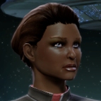
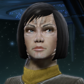

# 11&10s 1011 (Part 1) 

 
<b>Session started at 2023-08-01 / 04:08</b>
 
Fen's StarTrekAdventures Ruleset (v1.1.4)  
*[Prioritized Source: File; Other Sources: Vault]* 
*Core RPG ruleset (2023-06-27) for Fantasy Grounds
Copyright 2023 Smiteworks USA, LLC* 
*Fen's NPC Portrait Workaround v2.2.4* 
*[Prioritized Source: File; Other Sources: Vault]* 
*Fen's STA House Rules (v1.0.1) * 
*Story Template Custom Record Templates v1.0* 
*[Prioritized Source: File; Other Sources: Vault]* 
*FG Browser v1.2.3* 
*[Prioritized Source: File; Other Sources: Vault]* 

**Captain Baras:** Captains Log, Stardate 61623.0 - Our mission to survey the gaseous giants of the Xiran cluster has been abruptly cancelled, and we have recieved new orders to rendezvous with a fleet forming near Starbase 17. We haven't been given any details about the mission, but the rendezvous date is not for several days, so we are proceding at warp 5.

In the meantime, many of the crew are taking some time off. If we are being pulled back into a large fleet operation, we may all be pulling long duty shifts for a while. I can hardly blame them for trying to get a bit of R&R before the rendezvous. 
**Captain Baras:** Captains Log, Stardate 61623.0 - Our mission to survey the gaseous giants of the Xiran cluster has been abruptly cancelled, and we have recieved new orders to rendezvous with a fleet forming near Starbase 17. We haven't been given any details about the mission, but the rendezvous date is not for several days, so we are proceding at warp 5.

In the meantime, many of the crew are taking some time off. If we are being pulled back into a large fleet operation, we may all be pulling long duty shifts for a while. I can hardly blame them for trying to get a bit of R&R before the rendezvous. 
**Captain Baras:** test 
**Cmdr Bachar:** aaa 
**Ishemok:** character.get_portrait() 
**Satag:** blah 
**Ishemok:** player.get_portrait(draw=50) 
*Skig offers to make an Insight + Command check to see if that fixes it.* 
**Skig: [ INSIGHT  (8) +  COMMAND  (2)]
[Successes: 1] [Complications: 0]
Success with 0 momentum [2d20 = 23]** 
**Captain Baras:** Captains Log, Stardate 61623.0 - Our mission to survey the gaseous giants of the Xiran cluster has been abruptly cancelled, and we have recieved new orders to rendezvous with a fleet forming near Starbase 17. We haven't been given any details about the mission, but the rendezvous date is not for several days, so we are proceding at warp 5.

In the meantime, many of the crew are taking some time off. If we are being pulled back into a large fleet operation, we may all be pulling long duty shifts for a while. I can hardly blame them for trying to get a bit of R&R before the rendezvous. 
**Captain Baras:** abc 
**Skig:** Sometimes, it is coding, sometimes it is codeine. 
**Captain Baras:** abc 
Masakari (Ishemok): teaching kids agile and iterative development... 
>INTERIOR - Corridor outside Holodeck 4: Counselor Murry approaches the door to Holodeck 4 wearing a matching set of burnt umber slacks and a vest, with a white blouse and a plaid blazer. There she finds Lt. Malat, also strangely dressed with a brown bomber jacket over a tie-dye shirt, denim jeans and black leather strapped boots up to her knees. 

**Lt. Malat:** You get a weird message from the twins too? 
**Hailey Murry:** I did, I'm a bit concerned that you did as well 
**Hailey Murry:** What'd they tell you? 
**Lt. Malat:** Just that they needed someone with a "prior criminal record" to help them with a problem 
*Lt. Malat rolls her eyes* 
**Hailey Murry:** They said they needed my "unique approach to problem solving" 
*Hailey Murry does air quotes* 
**Hailey Murry:** Whatever that means 
>The Twins step around the corner wearing matching dark purple tuxedoes over black undershirts, with black slacks and matching purple suede shoes. 

**Lt. Cmdrs 11 and 10:** All in good time Counselor 
*Skig senses a disturbance in the Force, as if an entire deck of the Lister was suddenly exposed to vacuum.* 
*Lt. Cmdrs 11 and 10 walk over to the holodeck controls and begin entering in commands* 
*Skig 's eyes twitch whenever anyone tells Murry they appreciate her approach to "problem solving".* 
**Lt. Cmdrs 11 and 10:** We can see that Commander Skig is not here yet, we anticipated that she may disregard our invitation 
>The Twins reach into a wall panel and disconnect an ODN power regulation monitoring circuit from inside the wall 

**Lt. Cmdrs 11 and 10:** ODN diagnostic system specifications require that power regulators report health status every 10 seconds to the main computer. It will then take Commander Skig 12 seconds to reach the turbolift from her desk, and another 14 seconds for the turbolift to get here from main engineering. 
**Lt. Cmdrs 11 and 10:** So the Commander should be joining us in: 5... 4... 3... 2... 1 
*Skig shows up in uniform with a repair kit.* 
*Skig looks at the twins.* 
**Skig:** Hmm... 
**Hailey Murry:** Glad to have you join us, Skig 
*Lt. Cmdrs 11 and 10 reconnect the ODN regulator* 
**Skig:** There is a reason for disconnecting ODN regulators that would imply I not write you up? 
**Lt. Cmdrs 11 and 10:** Just give us a moment Commander, it will take a few moments for the program to load. We have prepared a speech for this purpose. 
**Hailey Murry:** This is foreboding 
**Lt. Cmdrs 11 and 10:** We will attempt to explain why we are here, while we wait for the holodeck 
*Skig checks chronometer, sets it to, "Moment" and pushes "Start".* 
**Lt. Cmdrs 11 and 10:** We have this... puzzle game? You could call it, with our former academy roommate Hollis O'Keefe 
*Skig is great fun at parties.* 
**Lt. Cmdrs 11 and 10:** We compete to send one another coded messages. It began many years ago with simple substitution ciphers and other such things, but has gotten progessively more complicated over the years 
*Hailey Murry exchanges a worried glance at Malat* 
**Lt. Cmdrs 11 and 10:** The puzzle which Hollis has concocted has too many moving pieces for us to solve alone. We believe that it is his intention to force us to seek assistance, in order to encourage us to develop deeper interpersonal relationships with our crewmates. 
*Skig checks chronometer again to see if "Moment" has passed.* 
**Lt. Cmdrs 11 and 10:** Ah, the program is finished loading. We have one more crewmate coming however, just a moment 
>The Twins tap a control on the holodeck control arch and a holographic representation of Ishemok materializes just inside the holodeck threshold. He is wearing a white and black checkerboard suit, with an oversize stetson hat and white aligator-skin shoes. In his hands: a black leather briefcase with gold accents. 

**Lt. Cmdrs 11 and 10:** Computer, please begin broadcasting audio file 100101110101101010010011 via the internal comms radio at a frequency of 790 Mhz 
**Ishemok:** Howdy Partners! 
**Hailey Murry:** Looking sharp, Ishemok 
>The Twins lead the motley assortment through the holodeck arch and into a dingy industrial building. Metal shavings line the floor, and the air is thick with the smell of machine oil. The echo of the crew's footsteps is muffled by the hum of a large 3-phase inverter powering an assortment of machining equipment, and a small transistor radio in the corner is playing. 

*Skig blinks a few times as she wonders why she is not filing a report for the Twins sabotaging an ODN Circuit.* 
>The twins take out a small set of printed paper cards from their breast pocket 

>♫♫♫Upbeat music plays from the radio♫♫♫ 

**Ishemok:** I heard there's either a heist or a card game somewhere east of Dodge. 
**Lt. Cmdrs 11 and 10:** The data is stored in a quantum encrypted memory region embedded inside a holoprogram. It is only accessible from within the holoprogram, and only at a single point. 
**Transistor Radio:** ♫♫♫ Now Leroy he a gambler, and he like his fancy clothes.♫♫♫ And he like to wave his diamond rings under everybody's nose♫♫♫ 
>The twins walk up a set of sheet metal stairs to a small granny flat above the shop 

*Ishemok is offended by the music, damaging to his sensistive ears.* 
**Lt. Cmdrs 11 and 10:** The setting of his program is Earth, in a city called Las Vegas. It is Earth-year 1973, and his message is hidden there... 
>The Twins pull back the curtains on the windows and point out a large hotel in the distance, several miles away, towering over a low, broad casino: "De Soto's Fortune" 

**Transistor Radio:** ♫♫♫ He got a custom Continental, he got an El Dorado too ♫♫♫ He got a 32 gun in his pocket full a fun. He got a razor in his shoe ♫♫♫ 
**Lt. Cmdrs 11 and 10:** The encrypted memory region is mapped to the inside of the casino's vault, and it is our intention to steal it. 
**Ishemok:** Ah, the golden years of Earth! 
>The Twins put on matching dark sunglasses and attempt to look "cool" as they beam with pride at their definitely not-at-all choreographed and pre-practiced speech. 

**Transistor Radio:** ♫♫♫ And he's bad, bad Leroy Brown, the baddest man in the whole damn town♫♫♫ Badder than old King Kong and meaner than a junkyard dog♫♫♫ 
**Hailey Murry:** This actually sounds quite fun!  
**Lt. Cmdrs 11 and 10:** Computer, end music. 
*Lt. Cmdrs 11 and 10 put away their note cards* 
*Skig wonders why they didn't ask Kolea to show up for a trip to Las Vegas, after all, it was a den of iniquity and prostitution.* 
**Hailey Murry:** Can we call upon others if we find a need for them, or is this limited to just the five of us?  
*Skig makes a mental note to still report the Twins for disconnecting the ODN circuit.* 
**Lt. Cmdrs 11 and 10:** We can include others as needed, however there was only room in the program memory to map four player IDs onto existing character identities within the simulation 
*Hailey Murry is definitely planning on having not seen anything of the sort, and is pretty sure she can convince Malat to attest the same* 
**Ishemok:** How did all this glory vanish! It's beautiful! 
**Lt. Cmdrs 11 and 10:** As such, we chose the four crewmates who were the most likely to have skills that would be required to adequately execute a "heist" 
**Hailey Murry:** I'm not sure this glory originally existed, this can simply be programmed through pre-obtained assets. Some are historical, but plenty are artist renditoins 
**Lt. Cmdrs 11 and 10:** From a statistical analysis of Earth-based media from this period, we determined that a successful heist always has an engineering wizard, someone that can overcome technical and mechanical challenges as needed 
*Lt. Cmdrs 11 and 10 look at Skig* 
**Skig:** So your plan is to have us sneak into a holodeck created Casino Vault to steal some encrypted data from a program that is only accessible from within the vault as part of some long running game you have been engaged in? 
**Lt. Cmdrs 11 and 10:** Yes, precisely that 
*Skig sighs.* 
**Skig:** And you disconnected an ODN circuit for this? 
**Lt. Cmdrs 11 and 10:** Indeed we did 
**Lt. Cmdrs 11 and 10:** We also prepared a speech 
**Ishemok:** But Skig, this is the perfect way to sell your genius! No consequences! No commanders not appreciating your talent! 
**Skig:** Has your positironic matrix been checked after you were violently assaulted and phaser blasted by Murry? 
**Lt. Cmdrs 11 and 10:** Our analysis of heist media suggests that the leader of a "crew" has to often convince the members of their conspiracy to participate via an inspiring speech 
*Ishemok stands at attention.* 
**Hailey Murry:** No, no, it's okay, if Skig doesn't think she's got the necessary engineering skills, that's pretty fair 
*Lt. Malat chuckles* 
**Lt. Malat:** Yeah, Skig probably can't hack it with this ancient Earth technology 
**Lt. Malat:** She would be helpless without a laser welder and an electron beam cutter 
*Skig waits patiently for the Twins to respond.* 
**Hailey Murry:** Yeah, it was pretty much game over when she had to put the repair equipment down in the hallway 
**Hailey Murry:** We should get a real engineer like T'kor in here, I'm sure he can manage  
indarien (Skig): You aren't insulting the Lister, she is pretty much impervious/oblivious to insults directed at her, FYI. 
**Lt. Cmdrs 11 and 10:** We have prepared a brief dossier on each of the characters that your identities have been mapped onto 
*Hailey Murry accepts the dossier* 
*Hailey Murry checks the street for this "Plymouth Valiant"* 
*Skig reads dossier.* 
**Skig:** Wait, I get to save body parts from those who fail to follow proper instructions? 
**Skig:** I'm sold. 
*Skig opens the fridge and takes out some cans of something called, "Pabst Blue Ribbon".* 
**Skig:** This appears to be some sort of slightly flammable liquid that is not intended for consumption. 
**Lt. Cmdrs 11 and 10:** Our analysis indicates a 98.6% water content, with a small ammount of ethanol 
**Skig:** Okay, I'm sure we will figure out something to do with them, it is pressurized and carbonated. 
**Hailey Murry:** So, do we have a map of the facility?  
*Zehpr 'Chops' Megee materializes in the room* 
**Lt. Cmdrs 11 and 10:** Partially, the casino is itself stored in an encrypted block of memory, and so we can only datamine a limited amount of data 
*Lt. Cmdrs 11 and 10 pull out a large printed paper sheet and unroll it on the table* 
*Skig uses full cans of Pabst to hold down the corners to make it easier to read.* 
**Skig:** They can be used as paperweights, evidently. 
**Lt. Cmdrs 11 and 10:** We were able to obtain accurate imaging of all of the public areas of the casino floor, and reconstruct a rudimentary blueprint of the non-public areas from datamining 
**Lt. Cmdrs 11 and 10:** We also tracked the patrol routes of the casino guards, but at that point it became clear that we would not be able to execute the plan on our own 
**Lt. Cmdrs 11 and 10:** So we began planning to involve others for assistance 
*Lt. Cmdrs 11 and 10 looks at Zox* 
**Lt. Cmdrs 11 and 10:** Oh, hello commander 
**Zehpr 'Chops' Megee:** Ah yes, I do not mean to interrupt your recreation 
**Lt. Cmdrs 11 and 10:** We had not anticipated your participation 
**Zehpr 'Chops' Megee:** But I must alert you all that I have had to alter your fun and games...just a tad though. 
**Skig:** Ah yes, it is rec-reation or re-creation though, that is the question. 
**Hailey Murry:** What did you modify?  
**Zehpr 'Chops' Megee:** There was no free Quantum memory aboard the lister, and Jasanis had a self-eating oroborous-type data worm in her Padd. The only safe quantum storage was where this program was writter. 
**Zehpr 'Chops' Megee:** So whereever the treasure is in your primitive Earth hunt game here, you will also find all of her private communications...for months! 
>♫♫♫Dramatic Music String♫♫♫ 

>---------CUT TO CREDITS-------
♫♫♫Opening Theme♫♫♫ 

**Zehpr 'Chops' Megee:** I had no choice but to download it to this program before the data ate itself - quite ingenous! 
>Episode 1001: 11 & 10's 1011
Written by Natali Baum
Directed by Raziel McMahon 

**Zehpr 'Chops' Megee:** Hopefully  I did not spoil your illusion. Surely I could pass for a Chef in one of these eateries? 
*Zehpr 'Chops' Megee looks around the room and takes an inventory* 
**Zehpr 'Chops' Megee:** I had no idea you all had such interesting alter egos! 
**Hailey Murry:** So, uh, what happens with the non-prepared characters? 
**Lt. Cmdrs 11 and 10:** Anyone can enter the holodeck of course, but other characters in the simulation will not recognize them as pre-existing characters 
**Zehpr 'Chops' Megee:** So...Im not the best Oyster Chef in the Western Continent?  
**Hailey Murry:** What will they recognize them as? Just a stranger in the casino?  
**Lt. Cmdrs 11 and 10:** Yes, just strangers 
**Hailey Murry:** Also, how do we obtain new goods? Do we need to purchase things?  
**Hailey Murry:** Or can we simply fabricate things to a certain extent?  
**Lt. Cmdrs 11 and 10:** Ishemok's cover identity has access to a cuboid metallic storage device containing large quantities of the money used in this era 
**Lt. Cmdrs 11 and 10:** And Commander Skig's cover identity has this machine shop where she can fabricate difficult to obtain goods 
**Zehpr 'Chops' Megee:** I will gladly loan it out at affordable rates! 
**Sam Mulloy:** I will gladly loan it out at affordable rates! 
**Hailey Murry:** Ishemok, you know that this is fake money, right?  
**Lt. Cmdrs 11 and 10:** But we must ensure that no 24th century technology is brought into the holodeck, or it will trigger the security code in the program and erase the quantum memory 
**Sam Mulloy:** If it can buy things, how is it fake? 
**Lt. Cmdrs 11 and 10:** It is indeed quite fake 
**Lt. Cmdrs 11 and 10:** As is your body 
*Sam Mulloy looks deflated.* 
*Skig was going to say something, but the Twins' response was much better.* 
**Lt. Cmdrs 11 and 10:** However fake it may be, it will nonetheless be useful in executing this theft 
**Hailey Murry:** What...what is the security code?  
**Skig:** Do we need to enter the vault and retrieve an object? 
**Hailey Murry:** Oh, right, what form does this object take? 
**Skig:** Can we just build a large mole-tunneling machine and just retrieve it? 
**Lt. Cmdrs 11 and 10:** We do not know, the holodeck simulation engine will attempt to interpret whatever data is there into a form that is appropriate given the simulation parameters 
**Skig:** Is there a time limit other than "Moment" before I write you up for the ODN circuit? 
**Hailey Murry:** Hmmm.  
**Skig:** Can we heist a UFO from Area 51 and terrorize the locals? 
**Hailey Murry:** I presume that would include the documents which Zox has installed? 
**Lt. Cmdrs 11 and 10:** Our journey to Starbase 17 will take a few days, so we have at least that long 
**Skig:** Can we borrow a nuclear bomber from Andrews AFB? 
Masakari (Sam Mulloy): Wasn't this a DS9 Episodes where quark goes back to.... 
**Lt. Cmdrs 11 and 10:** But we do not know what mission we will be assigned to after that rendezvous, it is possible that we will have to shut down the holodeck after that 
**Lt. Cmdrs 11 and 10:** If the program halts, Commander Zox's intelligence information will be erased 
**Hailey Murry:** Question, though: Would the oroboros virus also be given physical form?  
**Lt. Cmdrs 11 and 10:** We assume it would have to be 
**Hailey Murry:** Peachy 
**Sam Mulloy:** The data is here only. 
**Zehpr 'Chops' Megee:** Only the data is here.  
*Skig froze for a second when she thought the twins were going to stop with "intelligence" in their last sentence, is happy 10 finished with "information will be erased".* 
**Zehpr 'Chops' Megee:** As far as I know, this was the only way to save the data. 
**Lt. Cmdrs 11 and 10:** Then we have no choice but to steal it 
**Hailey Murry:** So, I have information in my dossier about files on several missing persons. I'd like to visit my office to review these, because I don't think that your old room mate would have included them if they were totally irrelevant 
*Lt. Cmdrs 11 and 10 take off their sunglasses so that they can put them back on dramatically again* 
**Zehpr 'Chops' Megee:** Correct. Even if you break whatever dull regulation governs the holodeck, that information is well worth it. 
**Zehpr 'Chops' Megee:** Oh wait, you didn't disable the safety protcols? What sort of holodeck is this?! 
**Skig:** No, we didn't. 
**Lt. Cmdrs 11 and 10:** The safety protocols are active, however Hollis added code to the program to detect if we are killed in the simulation and terminate the program if that happens 
**Hailey Murry:** Oh, that's just unfun. It won't just boot one of us out?  
**Sam Mulloy:** Ah ha. Interesting conundrum! 
**Hailey Murry:** Wait, so effectively we're all immortal except for you? 
**Lt. Cmdrs 11 and 10:** We suppose you could say that 
*Skig looks at Twins.* 
**Skig:** Make sure you stand behind Murry at all times, in case she blows up or starts shooting "near" you. 
**Hailey Murry:** So, Skig, what's your cover name?  
*Skig looks at datapad.* 
**Zehpr 'Chops' Megee:** I would advise stealth over force, simply because whatever form the data takes in quantum memory may have a very fragile projection here. Think glass sculpture or faberge egg. You may pierce the vault, but you have to escape with something fragile. 
**Skig:** Ida Bauers? 
**Tracy Dixon, P.I.:** Tracy Dixon, Private Investigator 
**Tracy Dixon, P.I.:** How about you, Ishemok?  
**Sam Mulloy:** Im Crazy Mulloy, and I seel wheels! You need a new set right? No one gonna hire an investigator without some status ya know? 
**Skig:** Step 1, we should case the joint in the most inconspicuous option, which is not to drive TEH Beast (gestures to what looks like a cobbled together tank) to the casino. 
**Tracy Dixon, P.I.:** Malat? Who's your cover?  
**Skig:** Step 2: After corroborating what the Twins have gathered, determine the plan of attack. 
**Lt. Malat:** My name is apparantly "Trixie" but if anyone calls me that, I'm going to break your nose 
**Sam Mulloy:** okay doll-face. 
**Tracy Dixon, P.I.:** What about your last name?  
**Lt. Malat:** McAdams 
**Tracy Dixon, P.I.:** What's your background?  
**Skig:** Step 3: Zox creates a distraction by turning into Zox-zilla and rampaging through the Vegas Strip like a Kaiju in Tokyo. 
**Lt. Malat:** I'm a member of something called a "Biker gang" and apparently have something called a "chopper"? 
*Zehpr 'Chops' Megee cries in dinosaur after remembering what happened the last time he tried to be a monster.* 
**Skig:** Step 4: We go snag the loot while the simulation sends in the army to fight Kaiju Zox. 
**Lt. Malat:** I didn't do well in Earth history at the academy 
**Skig:** That is a motorcycle, Malat. 
**Tracy Dixon, P.I.:** Hold on, let's head to the street to check this out 
**Lt. Cmdrs 11 and 10:** That is an interesting idea, however attempting to rewrite Zox into a giant monster would almost certainly trigger the security protocol and erase the system memory 
**Tracy Dixon, P.I.:** I think I have a ... yes, here, I have keys for something 
**Zehpr 'Chops' Megee:** Ya know what Skig, that is a good plan, but I'm just too clumbsy in Kaiju form. Gotta worry about that data... 
**Skig:** Step 5: I write up the Twins for disconnecting the ODN Circuit. 
*Tracy Dixon, P.I. takes Malat down to check out their rides* 
**Skig:** I might have made up some of that just to see if anyone was actually listening to me. 
**Tracy Dixon, P.I.:** Oh, this is neat. A vintage gun 
>Murry and Malat find a powder blue 2-door convertible outside next to a Harley Davidson panhead with saddle bags 

**Tracy Dixon, P.I.:** No way to accidentally get this thing set to "instantly disintegrate" 
>And a pearl white Cadillac Coup deVille 

**Zehpr 'Chops' Megee:** Ah, now this is class 
**Lt. Cmdrs 11 and 10:** No, but weapons of this era do not have stun settings 
**Sam Mulloy:** Darn straight! 
*Tracy Dixon, P.I. is looking forward to when the other gang members call her "Trixie"* 
**Lt. Cmdrs 11 and 10:** They can only be used on "kill" 
*Skig converts Murry's gun to fire a three round burst with a binary trigger.* 
*Tracy Dixon, P.I. checks for labels on the pearl white car first, then on the powder blue one* 
**Skig: [ CONTROL  (11) +  ENGINEERING  (5)]
[Focus: Reverse Engineering ]
[Successes: 1] [Complications: 0]
Success with 0 momentum [2d20 = 34]** 
**Sam Mulloy:** I haven't seen many Earth movies, but I presume this machine shop is our hide out...We need a little more info before we make a real plan, no? 
**Tracy Dixon, P.I.:** Hmmm 
**Skig:** This is not a criminal hideout, this is a reputable place of business. 
**Lt. Cmdrs 11 and 10:** Indeed, we found this book in the hotel room of our character when we first arrived 
**Zehpr 'Chops' Megee:** Ah, jou mean it is time to cook a bit and see some of ze inner workings of ze casnio? 
*Lt. Cmdrs 11 and 10 take out a pamphlet titled "Robbery for Dummies"* 
*Skig looks at the book.* 
**Skig:** What does "Copyright 1984" mean, and who is "Ima Moron"? I'm not familiar with that author. 
**Lt. Cmdrs 11 and 10:** We believe this was a joke left by Hollis for us 
**Skig:** Makes sense. 
*Tracy Dixon, P.I. pops back upstairs to check with the others* 
**Tracy Dixon, P.I.:** I'm going to go try and find my place of residence to get some documents on missing people, so I'll be back 
**Skig:** Yes, I believe back in Step 1 I suggested "case the joint" as we need to gather information, and it is not like I can use some AOL CDs in my Commodore 64 to find out some useful information from Myspace maps. 
**Zehpr 'Chops' Megee:** Those CDs were later re-classified as personal shuruken once humanity forgot what a CD was... 
**Skig:** I thought they were used to clean the inside of microwave ovens? 
**Zehpr 'Chops' Megee:** Earth was strange once we lefft it... 
**Sam Mulloy:** Well, Thanks for being our bookie here, tellin us what the odds are here commanders 
BayushiKazemi (Tracy Dixon, P.I.): Hailey is spending one of her Planning phases to look into the missing people and obtain any relevant information regarding them and the casino 
**Sam Mulloy:** My feelin is dat we ain't the only ones out 'dere with enough guts and talent to breaka dat vault open, and we gonna 'ave to either team with dem, or neutralize 'dem 
**Lt. Malat:** We should meet back here tonight, once we've had a chance to get our bearings 
**Lt. Malat:** I'm going to head to the casino, Ishemok give me some money 
**Sam Mulloy:** Ey, Trixie, you want ta ride in some'thin nicer den that chopper? Come hand wif me, imma hit the high rolla tables! 
**Lt. Malat:** No 
**Sam Mulloy:** It's good cover! You need to lighten up a bit and play the game! 
**Sam Mulloy: [ PRESENCE  (9) +  COMMAND  (4)]
[Successes: 1] [Complications: 1]
Success with 0 momentum [2d20 = 30]** 
*Lt. Malat rips the briefcase out of Ishemok's hands and opens it by smashing it into his face* 
*Lt. Malat takes a roll of cash out of the briefcase and heads for the door* 
**Sam Mulloy:** Not very playful.... 
*Lt. Malat hops onto the chopper and rides off* 
**Lt. Cmdrs 11 and 10:** What were you expecting from Lt. Malat? 
**Sam Mulloy:** Oh well, 'ill pick up a' couple a classy dames on the way 
**Lt. Cmdrs 11 and 10:** She has been charged with assaulting a fellow officer on four different occasions 
**Lt. Cmdrs 11 and 10:** We will accompany you to the high roller tables 
**Lt. Cmdrs 11 and 10:** We will attract attention anyways 
**Sam Mulloy:** Aight, dat checks out. 
**Lt. Cmdrs 11 and 10:** We are Amand and Dino Cloutier, stage magicians currently headlining at the De Soto's Fortune  
**Sam Mulloy:** That's actually really good cover 
**Lt. Cmdrs 11 and 10:** You can thank Hollis for that one, we chose all of your characters based on their access to useful resources and their similarity to your own personalities 
**Lt. Cmdrs 11 and 10:** But Hollis chose a character for us 
**Zehpr 'Chops' Megee:** I shall seek empoyment as ze vurld's greatest oyster chef! 
**Zehpr 'Chops' Megee:** Just as the way to the heart is from a meal, the way to a valut is through ze kitchen, no? 
*Zehpr 'Chops' Megee tries to reprise his role/delusion.* 
**Lt. Cmdrs 11 and 10:** We should meet back here after sunset to plan our next move 
**Sam Mulloy:** Amand, Dino, let's put on a little magic before the main event! 
**Lt. Cmdrs 11 and 10:** Lead the way "Sam" 
**Sam Mulloy: [ PRESENCE  (9) +  SECURITY  (2)]
[Focus: Salesmanship ]
[Successes: 1] [Complications: 0]
Success with 0 momentum [2d20 = 17]** 
indarien (Skig): Sure, but Spock could convert a Tricoder into a remote viewing future-past device using "stone knives and bearskins". 
**Skig: [ CONTROL  (11) +  ENGINEERING  (5)]
[Successes: 2] [Complications: 0]
Success with 1 momentum [2d20 = 15]** 
Masakari (Sam Mulloy): A bad gimmick is a right once a season...wait.. 
**Zehpr 'Shucks' Megee:** Ah, I shall find ze peral with so many oysters, no? 
*Zehpr 'Shucks' Megee smokes and grins mischieviously* 
>INTERIOR - Machine Shop: The gang start to congregate back at the shop in the evening, Zox is now wearing an actual chef's outfit with the casino's logo on it. Murry seems drunk 

**Sam Mulloy:** Look what the cat dragged in! Murry, doll, I got something that will 'fix you right up, you can't heist like that! 
**Skig:** This will cure everything. 
**Tracy Dixon, P.I.:** I'm good for now, thank you. How connected is De Soto's Fortune with the Garbo Family?  
*Skig shakes a Pabst Blue Ribbon, points the top at Murry and pulls the cap off.* 
**Sam Mulloy:** Oh wait,....yeah this isn't a good idea with violent types... 
**Lt. Cmdrs 11 and 10:** Raimondo Garbo owns the casino 
**Skig:** Wait, is it beer before liquor or the other way around? 
**Skig:** Not that this is beer. 
**Lt. Cmdrs 11 and 10:** He is involved with an organization know as the "Cosa Nostra" 
**Zehpr 'Shucks' Megee:** Wait, it's fermented? I must try this! 
**Skig:** No, it is not fermented, more like kidney post processed. 
*Skig offers Murry a towel for the Pabst all over her face.* 
**Zehpr 'Shucks' Megee:** Zis, zis is not fit to clean the counter much less cook!  
**Lt. Malat:** I don't see how Murry could have gotten drunk, this is holographic liqour 
**Lt. Malat:** I went drinking with some of the guards from the casino, and I don't feel a thing 
**Skig:** I only have 111 cans of beer in the fridge, take one out and spray it around, 110 cans of beer in the fridge. 
**Lt. Cmdrs 11 and 10:** We took the liberty of replicating genuine alcohol for the bottles in Mrs. Dixon's apartment 
*Skig is strangely lyrical and horribly off-key.* 
*Skig hands a can of Pabst to Zox.* 
**Lt. Malat:** That's... kind of a dick move honestly 
*Zehpr 'Shucks' Megee eats the entire can, not bothering to crack it open.* 
*Tracy Dixon, P.I. offers Malat one of her drinks* 
**Skig:** Do you think you could do something with the carbonic acid and pressurization in these things? 
**Skig:** Oh... 
**Skig:** Umm...nevermind. 
**Lt. Malat:** Thanks Commander, I learned this from the guards at the casino 
*Lt. Malat takes out a large knife, stabs a hole in the bottom of the can, then opens the other end and rapidly drinks the entire thing* 
**Zehpr 'Shucks' Megee:** Hrm, not nearly strong enough.  
**Sam Mulloy:** Yikes! 
**Skig:** Humans should be ashamed they ever marketed this stuff to anything. But enough about this swill. 
**Lt. Malat:** Anyways, I learned from the guards that there is some kind of "social club" in the lower east wing of the casino 
**Lt. Malat:** It doesn't have access to the vault, but it runs parallel to it 
**Lt. Malat:** They kept trying to invite me, although I'm pretty sure they're trying to recruit me into some sort of sex work. 
**Lt. Cmdrs 11 and 10:** Fascinating, we were able to access a highly secured area of the casino 
**Tracy Dixon, P.I.:** Huh, how'd you get in?  
**Sam Mulloy:** Pure magic, that Dino is! 
**Lt. Cmdrs 11 and 10:** After our success at the Blackjack tables, two gentlemen put a burlap sack over our heads and lead us down an elevator and into a room in the basement 
**Lt. Cmdrs 11 and 10:** They said they didn't want to break our "magic fingers 
**Lt. Cmdrs 11 and 10:** because we brought in revenue for the casino 
**Lt. Cmdrs 11 and 10:** However, if we ever played blackjack again, they would break our knees with a hammer 
**Skig:** Ballpin or claw? 
**Lt. Cmdrs 11 and 10:** But, our internal positional sensor was able to track our movement despite the burlap sack, and we are able to ascertain that the room where they took us is within the secure area of the casino 
**Lt. Cmdrs 11 and 10:** We are not sure, we are not that familiar with varietals of hammer 
**Skig:** The claw would have been useful if you could have brought it back with you. 
**Tracy Dixon, P.I.:** I don't think they were in a position to actually take anything back with them 
**Sam Mulloy:** Is you thinkin, that we should get caught again and ambush the guards when we are questioned again? 
**Tracy Dixon, P.I.:** How are we going to ambush the guards if we're the ones who are caught?  
**Sam Mulloy:** maybe Skig, Ida? you can hack the cameras and put em on loop? 
**Lt. Cmdrs 11 and 10:** Unfortunately, in this era computerized technology was not yet widely adopted 
**Lt. Cmdrs 11 and 10:** The surveillance cameras in the casino are directly hard-wired to video recorders in 2 different security rooms 
**Skig:** You are thinking too advanced for the technology of this period. 
**Lt. Cmdrs 11 and 10:** The only way to disable all of the cameras would be from within those rooms, by unhooking them from something called a "Betamax" 
**Skig:** Isn't that a type of fish native to Regulus 4? 
**Zehpr 'Shucks' Megee:** Ne'var forget, zat ze Chef is always ze most dangerous mem'ber of ze team.  
**Skig:** Why is there a fish in the security rooms? 
**Lt. Cmdrs 11 and 10:** We do not know, this period of Earth's history is very unusual 
**Skig:** Or perhaps I'm thinking of a Bettamax? 
**Skig:** One of those is a recording device, the other is a large fish. 
**Tracy Dixon, P.I.:** So I've discovered that a young woman, Briley Marijn, was working as a legal secretary for a lawyer named Beppe Renzo. He is a consigliere for the Garbo family, who apparently came to threaten me last time my character looked into them. She's since gone missing, her family hired Tracy to look into it.  
**Zehpr 'Shucks' Megee:** Hrm..... 
**Skig:** Malat should go with those guards to see if she can find your missing person, or we have Zox check the freezer. 
**Shadowy Woman:** Don't tell me you're going to a party and I wasn't invited? 
**Tracy Dixon, P.I.:** Who...? 
>A sultry voice rings out from the shadows, as a woman no one saw enter is standing in a dark corner 

*Zehpr 'Shucks' Megee guffaws as someone sneaks up on the steely detective* 
>As she goes to light her cigarette, it illuminates her face you can recognize her 

**Tracy Dixon, P.I.:** The invitation was subtle, was it not...Bachar?  
**Cmdr Bachar:** You probably should have told me once Zox dumped Jasanis' messages into that vault 
**Cmdr Bachar:** But I did warn you before: Not a damn thing happens on this ship that I don't know about 
**Skig:** It was news to the rest of us. 
**Tracy Dixon, P.I.:** Except Zox, who is a master of espionage  
**Tracy Dixon, P.I.:** So tight lipped he doesn't let even a whisper slip 
**Zehpr 'Shucks' Megee:** Forgive me comman'ndar, it just happened as I a'ceessed ze PADD. Zere was no way of knowing just how spicy ze data would be 
*Skig makes a mental note to due a ship-wide internal security electrical purge of all nonessential devices to turn off electronic eavesdropping.* 
**Cmdr Bachar:** I don't have any concrete details, but the holodecks are going to be shut down in 3 days as part of our new assignment 
*Skig cancels that plan when she remembers what happened the last time she shorted out Kolea's "electronics".* 
**Zehpr 'Shucks' Megee:** Ze Jasanis is wiley. 
**Cmdr Bachar:** So this isn't strictly a game anymore, if we don't pull this off quick and clean, that data is gone forever 
**Cmdr Bachar:** And you look like you could use the help 
>♫♫♫Dramatic Music String♫♫♫ 

>---------CUT TO COMMERCIAL------- 

# 11&10s 1011 (Part 2) 

 
<b>Session started at 2023-08-08 / 04:09</b>
 
Fen's StarTrekAdventures Ruleset (v1.1.4)  
*[Prioritized Source: File; Other Sources: Vault]* 
*Core RPG ruleset (2023-06-27) for Fantasy Grounds
Copyright 2023 Smiteworks USA, LLC* 
*Fen's NPC Portrait Workaround v2.2.4* 
*[Prioritized Source: File; Other Sources: Vault]* 
*Fen's STA House Rules (v1.0.1) * 
*Story Template Custom Record Templates v1.0* 
*[Prioritized Source: File; Other Sources: Vault]* 
*FG Browser v1.2.3* 
*[Prioritized Source: File; Other Sources: Vault]* 
Masakari (Sam Mulloy): Craiyon 
>INTERIOR - Skig's Machine Shop: Commander Bachar stands in the doorway of the granny flat in a floor length, black, high slit dress and a very wide-brimmed black hat that casts long shadows over her face. She is holding a lit cigarette in a long ebony and gold cigarette holder. 

**Cmdr Bachar:** I hate to interrupt, but I saw Zox dumping data from Jasanis' PADD into the Twins' program and put the pieces together. 
**Cmdr Bachar:** But as I said when I came in, we now have a time limit on this little operation. The captain and I just finished a briefing with Admiral Nechayev and at least 100 other captains. They won't say what's going on, but they gave us orders to be on wartime footing when we arrive at the rendezvous in 3 days. That means all non-essential systems powered off, so we need to get the data out of the holodeck before then or it's gone. 
**Tracy Dixon, P.I.:** Well, to start, that sounds rather unfortunate. But also, how long have you been in the corner there?  
**Cmdr Bachar:** Not that long, it took me a while to figure out what to do with these gold rings 
*Cmdr Bachar points to her earrings* 
**Sam Mulloy:** Why can't you just re-classify this heist as a security op and collect full time on it, all while out of whatever fleet maneuver w've been drafted to? 
*Skig looks at the earrings she stabbed into her elbow and figures out that might be the wrong spot for them.* 
**Tracy Dixon, P.I.:** Because then we'd have to explain *why* it's a security op 
**Tracy Dixon, P.I.:** And we're not supposed to have some of this data 
*Skig looks more closely at Bachar to make sure she is not missing anything else that would be a "giveaway".* 
**Cmdr Bachar:** And I don't trust the chain of command on this one 
**Sam Mulloy:** Argh 
**Zehpr 'Shucks' Megee:** Zis is no problem! Ve shall cook up a plan and be done wif zit! 
**Cmdr Bachar:** If you bunch were able to find the location of that black market from a bunch of data that also went to Starfleet Intelligence, and they didn't find it, then it means they buried it 
**Cmdr Bachar:** There's no way they're that stupid 
**Cmdr Bachar:** No offense  
**Tracy Dixon, P.I.:** None taken, finding the intellgence was the intelligent part of that whole ordeal 
**Cmdr Bachar:** If we need any help on it, bring in people that are already clued in 
**Sam Mulloy:** We got this joint all squared up. Itll be all smooth like. 
**Lt. Malat:** You know you don't actually have to stay in character when it's just us together 
*Cmdr Bachar switches into a deep, sultry voice completely different from her normal one* 
**Cmdr Bachar:** But what would be the fun in that Lieutenant? 
*Sam Mulloy looks deflated, apparently envious of the high culture of crooks that used to inhabit Earth.* 
**Sam Mulloy:** Ze program algorithm will award us extra points no? Surely jou can lighten up a bit, mademoiselle 
**Skig:** In any case, we need to be moving, and I'm grateful we have Bachar here to help us stay on task. 
**Zehpr 'Shucks' Megee:** Ze program algorithm will award us extra points no? Surely jou can lighten up a bit, mademoiselle 
**Lt. Cmdrs 11 and 10:** Quite right Commander Skig, we have much to do if we are going to be successful 
**Lt. Cmdrs 11 and 10:** We believe that there are five main challenges: 
*Skig waits patiently for the Bynar's to finish speaking before offering her synopsis.* 
**Lt. Cmdrs 11 and 10:** Dealing with the guards, dealing with the surveillance, getting access to the restricted areas, activating the vault elevator, and getting access to the vault 
**Skig:** While, I have a solution for the vault. 
*Skig gets out Industrial Skig-Vault-Terminator Pulse Drill.* 
**Skig:** Of course, it is not subtle. 
**Tracy Dixon, P.I.:** Which level is the vault on?  
**Cmdr Bachar:** Also not necessarily going to work, what if the safe has a glass relocker? 
**Sam Mulloy:** Ey. He's what's we gonna do. We gonna get a buncha low-level street operators to make a'bunch a incidents for the security team to respond to. Nuffin big, nuffin serious, jest a little bit of...undesirable activity what's dey need to make business palatable for their sophisticated customas. Den we hatch a plan. In short, a DDOS attack. 
**Skig:** Then I let Throk use the Vault-Terminator Pulse Drill as a hand weapon on any Security Guards who get in the way? 
**Sam Mulloy:** Aight. I mean'z if you don't mind a'bit a a mess dere 
**Skig:** Oh, it will definitely make a mess. 
**Lt. Malat:** Street violence sounds like my area of expertise 
**Tracy Dixon, P.I.:** I think you may have the right number of hooligans for the distraction, as well 
**Skig:** I mean, at 35,000 RPM with diamond flanges and liquid cooling to vent steam directly into the affected area, it will make a mess of anything. 
**Sam Mulloy:** Dey won't know how to respond to so many low-level crimes so quickly. Dese goons won't can't think on my level, it's what ye don't see, ye know? 
GM: Twins &gt; Amand and Dino Cloutier 
>Malat -> Trixie McAdams 

GM: Malat -&gt; Trixie McAdams 
GM: Skig -&gt; Ida bauers 
**Sam Mulloy:** Ayy, street violence. I like it. Keep it classy though. We dont want to 'ave the real fuzz show up. Just poke...lot's a poke.  
GM: Ishemok -&gt; Sam Mulloy 
**Tracy Dixon, P.I.:** Have you spent any time with them yet, McAdams?  
**Lt. Malat:** This biker gang? No, I was at the casino bar scoping it out 
**Tracy Dixon, P.I.:** You should touch base with your roots, see if we've got some help there 
**Lt. Malat:** Will do 
**Tracy Dixon, P.I.:** Do we have anyone else we want to bring in?  
**Tracy Dixon, P.I.:** I think Throk would be a good fit with the biker goons, though they'd be a bad influence on him 
**Zehpr 'Shucks' Megee:** No one suspects le chef. Ze deadliest man. 
*Tracy Dixon, P.I. gasps* 
**Tracy Dixon, P.I.:** Kolea would be perfect to slip into the background here!  
**Zehpr 'Shucks' Megee:** I shall be in ze kitchen, ready to...accidentally cause a short with an errant souffle! 
**Lt. Malat:** Well from the goons I met, I am pretty sure they're running a brothel from the casino basement 
**Skig:** Would the biker goons be a bad influence on Throk, or would Throk be a bad influence on the Biker Goons? 
indarien (Skig): Inquiring Minds want to know! 
**Tracy Dixon, P.I.:** We'll want to see if there's any overlap between the bikers and the security guards as well 
**Sam Mulloy:** I think a good' infuence. All dey know is da poetry a' bending people a bit. Throk'll teach em class. 
**Ignatius Constantine (Throk):** This cool, Throk not used to be well-dressed large black man with so much bling. 
**Sam Mulloy:** Drop some verses while you re-arrangin some faces, eh Ignatius? 
**Lt. Malat:** I'm not gonna lie, a 7 foot tall Gorn in a leather jacket looks pretty good 
**Sam Mulloy:** Makes ya reall think all dem synth-threads we got up in space ain't really what'cha call progress eh? 
**Sam Mulloy:** All the polyester 'aint makin style like that! 
*Ignatius Constantine (Throk) slicks back hair and gives a toothy smile and a thumbs up.* 
**Lt. Cmdrs 11 and 10:** They may be less aesthetically pleasing, but Starfleet uniforms are engineered to keep the wearer comfortable in a range of temperature and environmental conditions far beyond what aged animal skin can provide 
*Ignatius Constantine (Throk) background music begins playing whenever Throk starts walking.* 
**Sam Mulloy:** You'se just sucked the romance right' outta it Dino! 
*Sam Mulloy wildly gesticulates while talking. * 
*Kolea shows up in a bunny outfit.* 
GM: AFK a sec  
*Sam Mulloy Whistles* 
**Sam Mulloy:** Is it gettin hotta in here? 
*Sam Mulloy takes out a handkerchief and wipes sweat off his brow* 
**"Bubbles" Kolea:** This is the third time today I've been asked to come to a holodeck in this outfit. 
*"Bubbles" Kolea turns around and looks at her back.* 
**"Bubbles" Kolea:** Are the seams straight on the hose? 
**"Bubbles" Kolea:** Also, I need to start checking the crew register, I think Lieutenant Frinkleman has had seven birthday parties this year. 
**"Bubbles" Kolea:** I thought maybe it was something about his species, but he is human. 
**Ignatius Constantine (Throk):** I am one bad-ass walking instrument of destruction, searching for love in the casinos of Las Vegas after deciding to turn over a new leaf following years of violent warfare in Southeast Asia. 
**"Bubbles" Kolea:** He wins. 
*Zehpr 'Shucks' Megee approvingly nods.* 
**Zehpr 'Shucks' Megee:** Yeah I can't beat that. 
*Zehpr 'Shucks' Megee hangs up his chefs hat.* 
**Pennington:** I believe I may be able to provide a disruption to their power supply. If it's a general repair or controlled damage, we can cause an entire area to lose power and avoid the pointed suspicion that they may have if only their facility is hit 
**Pennington:** I'll investigate to see how plausible that is 
**Sam Mulloy:** During a minature crime wave too, right? 
**Zehpr 'Shucks' Megee:** Your classic entropy based warfare, gone casino heist. Power out, crime, gang activity, and a kitchen fire all at the same time! 
**Skig:** I did notice that this era, and perhaps this program in particular, seems to have issues with our ability to use an EMP to cause that effect. Hitting a nearby substation would accomplish the same effect though. 
*"Bubbles" Kolea looks at blueprints.* 
**"Bubbles" Kolea:** OOH!!! I call dibs on recon for these spots. 
**Tracy Dixon, P.I.:** I'm really curious about why one of the mafia's legal secretaries went missing. I don't think she's the type to have taken a job working under the table at a casino... 
*"Bubbles" Kolea points to #9 and #10 on the map.* 
**Lt. Cmdrs 11 and 10:** Taking out the power is very thematically appopriate, however our research indicates that they do have a backup generator 
**Lt. Cmdrs 11 and 10:** So if a power outage is required, we would also need to deal with the generator in the basement 
**Zehpr 'Shucks' Megee:** Not if ze kitchen is sucking up all the juice! 
**Pennington:** The backup generator is surely not as capable as the main power. What systems do they have to compromise on?  
**Zehpr 'Shucks' Megee:** I shall cook ze worlds biggest souffle! 
**Skig:** I believe the basement is where I store the slot machines I perform "maintenance" on, I can probably shut off the backup generator by "accident". 
**Lt. Cmdrs 11 and 10:** Cooking in industrial kitches of this era is done with a flamable gas 
**"Bubbles" Kolea:** Skig! I have never heard you use airquotes before. 
*Skig blinks and looks at Kolea with a confused expression.* 
**Zehpr 'Shucks' Megee:** But....zat gas is my ancestors! Zis is heresy! 
**Ignatius Constantine (Throk):** It okay, I use airquotes whenever I say Kolea is wearing clothes. 
**"Bubbles" Kolea:** Not that time. 
**Ignatius Constantine (Throk):** I don't think it applies that time. 
**Cmdr Bachar:** Alright let's get moving, it sounds like we have some ideas but nothing concrete yet. What do we still need to figure out next? 
**Skig:** Plan of Attack to distract security away from the Vault, and then who goes to the vault and how they get it open. 
BayushiKazemi (Tracy Dixon, P.I.): So Tracy is going to be looking into the missing persons again (or specifically, why they went missing; she doesn't want any broken kneecaps) 
**Sam Mulloy:** Common dollface, let's engineer the diversions while the professionals get to work (looks at Malat) 
**"Bubbles" (Kolea):** I can't distract more than six male security guards at a time. A girl has to have some limits. 
**Lt. Malat:** If you call me dollface again I'm going to rip yours off 
BayushiKazemi (Tracy Dixon, P.I.): Pennington will be looking to explore and set up the potential main power outage and make sure that'll work 
**Zehpr 'Shucks' Megee:** Ah, do not be le sour, it's a game! enjoy zis baroque earth culture! 
**"Bubbles" (Kolea):** Do you want me to apply to work at the Casino, or get kidnapped and forced to work at the Casino? Either one is fine. 
**Skig:** Kolea, most people are not enthusiastic about the idea of being forced into sex work. 
**"Bubbles" (Kolea):** WAIT WAIT WAIT... Sex is work? What the Hell is wrong with you? 
**Ignatius Constantine (Throk):** Throk feel uncomfortable and wish to turn on air conditioning. 
**Cmdr Bachar:** Yeah I'm not going to order you to do that, but you want to and you can get access to the social club that way, I'm not going to order you not to 
*"Bubbles" (Kolea) looks at Bachar.* 
*Sam Mulloy feels as though skig should not be in charge of business decisions.* 
**"Bubbles" (Kolea):** Oh, do you want some pointers? 
**Pennington:** I could use some pointers 
**"Bubbles" (Kolea):** I mean, that looks really good overall, but I think we could really work on your highlights. 
**Cmdr Bachar:** Murry, checking out this missing woman sounds dangerous based on what you said, Zox, Throk and I will come with you. We shouldn't risk "Tracy" being killed in the program 
**Tracy Dixon, P.I.:** The backup is appreciated 
**Ignatius Constantine (Throk):** Throk happy to help with that. Throk also happy to be Malat's new boyfriend to meet with her associates. 
**Tracy Dixon, P.I.:** Actually, if I can have Zox and Throk as guards, if you'd like to talk anyone who comes looking into me, that might prove to be an efficient way of performing some espionage on their counter-espionage 
**Lt. Malat:** Wait, if you're coded as black in the program interpreter, that might not be a great idea 
BayushiKazemi (Tracy Dixon, P.I.): *take rather than talk 
**Lt. Malat:** I think these bikers have some... issues, with black people 
**Ignatius Constantine (Throk):** Okay, Throk not want Malat to have to find work next to Kolea unless wanted. 
**Ignatius Constantine (Throk):** Throk have standards for protection. 
**Lt. Malat:** Ishemok can come with me, these people sound like a bunch of sleaze bags, I'm sure he'll fit right in 
**Ignatius Constantine (Throk):** Throk also want to ride large two wheeled, environmentally destructive vehicle through glass windows while firing shotgun. 
**Ignatius Constantine (Throk):** If any part of plan can involve that, Throk happy. 
**Sam Mulloy:** Ey. No need ta get clippy. I represent the highest standards of business.  
**Skig:** I'm sure I can come up with a program to let you do that Throk. 
**Ignatius Constantine (Throk):** Throk content then. Throk go with murderous psychotic Counselor woman and collect heads of her victims. 
**Lt. Cmdrs 11 and 10:** We can assist T'Kor and Skig with the power situation 
**Zehpr 'Shucks' Megee:** Ah ze ingredients are all together. Soon the ensemble will be complete. 
**Skig:** All right, sounds like we have a few plans. Bynars go with T'Kor and Skig and work out the primary and secondary power. Kolea goes and does things that are best left unsaid. Malat and Mulloy go and meet with her never-do-wells. Everyone else goes with Murry to increase the bodycount. Did I miss anyone? 
**Skig:** Skig being me, since for some reason I decided to refer to myself in third person at some point there. 
**"Bubbles" (Kolea):** I shall go become gainfully employed! 
*"Bubbles" (Kolea) leaves to get a job doing tricks at a casino.* 
*Skig sighs.* 
>EXTERIOR - Office Building downtown: Tracy pulls up outside the building where Beppe Renzo it listed as having a law office. Bachar is in the passenger seat of her car, while Throk and Zox are sitting up on the rear like a couple of big, green dogs 

**Ignatius Constantine (Throk):** I PITY THE FOOL. 
**Cmdr Bachar:** Don't kill anyone unless they try to kill us first 
*Ignatius Constantine (Throk) gets out of the vehicle while background music plays.* 
**Cmdr Bachar:** And even then, just break their legs or something 
**Ignatius Constantine (Throk):** Got it, tear legs off, feed to them. Proper nutrition important. 
**Cmdr Bachar:** No. We are here to interrogate this guy, not murder him 
*"Bubbles" (Kolea) sneaks on scene, hands Bachar the "water spray bottle" for Bachar, leaves scene.* 
*"Bubbles" (Kolea) sneaks on scene, hands Bachar the "water spray bottle" for Throk, leaves scene.* 
*Cmdr Bachar sprays Throk with water and lemon juice* 
**Cmdr Bachar:** Down boy 
*Ignatius Constantine (Throk) licks lips.* 
**Zehpr 'Shucks' Megee:** if you have a bad additude, someone is gonna eventually call you B. A. Throk 
**Ignatius Constantine (Throk):** That sour, anyway, Ignatius Constantine is always ready to assist those in need. 
*Ignatius Constantine (Throk) flexes and cracks knuckles.* 
**Ignatius Constantine (Throk):** You ready I knock down door? 
**Cmdr Bachar:** Let's wait for Tracy, pretty sure we will want to have her with us 
**Cmdr Bachar:** Given that she's the only one of us that is actually programmed with a real cover identity in this program 
**Guido 'Knuckes' Puzio:** Im just 'ea ta make sure no one lays a finga on tracy.  
*Guido 'Knuckes' Puzio continues to goon in a professional manner around our dashing detective.* 
**Ignatius Constantine (Throk):  [Total: 4] [Effects: 4] [5dChallenge = 4]** 
**Skig: [ REASON  (10) +  ENGINEERING  (5)]
[Focus: Reverse Engineering ]
[Successes: 3] [Complications: 0]
Success with 2 momentum [2d20 = 13]** 
**"Bubbles" (Kolea): [ INSIGHT  (11) +  COMMAND  (2)]
[Focus: "Diplomacy" ]
[Successes: 2] [Complications: 0]
Success with 1 momentum [2d20 = 21]** 
**Sam Mulloy: [ DARING  (10) +  COMMAND  (4)]
[Focus: Criminal Connections ]
[Successes: 1] [Complications: 0]
Success with 0 momentum [2d20 = 24]** 
**Sam Mulloy: [ PRESENCE  (9) +  SECURITY  (2)]
[Focus: Criminal Connections ]
[Successes: 1] [Complications: 0]
Success with 0 momentum [2d20 = 19]** 
**Ignatius Constantine (Throk):** Kolea, why is "hand weapon" in quotes? 
**Tracy Dixon, P.I.:** Alright boys and Bachar, let's go have a chat with Beppe 
**Skig:** Throk, there are times you should not ask questions. 
**Tracy Dixon, P.I.:** What's your covername, Bachar?  
**Ignatius Constantine (Throk):** Also, why does "hand weapon" require 6 "D" Batteries? 
**Skig:** Throk, pay attention to the scene you are in. 
**Ignatius Constantine (Throk):** Okay, Throk do Google Search later. 
**Guido 'Knuckes' Puzio:** It seems Throk can only see beyond walls the censors allow.... 
**Guido 'Knuckes' Puzio:** Oh wait.. 
**Hadija Zawadi:** Hadija Zawadi 
*Skig makes note to forcibly reformat any computer terminal Throk touches outside of the holodeck.* 
**Hadija Zawadi:** If you're ready, let's go see this Beppe 
**Tracy Dixon, P.I.:** Let's go 
*Tracy Dixon, P.I. leads the way nonchalantly into the building* 
*Ignatius Constantine (Throk) follows dutifully, hoping to get more squirts of tasty lemon water from Bachar.* 
>Hot Stuff by Donna Summer begins playing from the holodeck sound system 

*Ignatius Constantine (Throk) waits to see if trap door triggers and plunges Murry to her death.* 
>The crew take a strange, archaic version of a turbolift to the fourth floor where Beppe's office is located. When they come out, the hallway is empty, and the frosted glass door to Beppe's office is just a few meters down the hallway 

>Everything is a very ugly shade of brown. Brown carpets, brown wood-panelled walls, brown trim, brown lamps 

*Ignatius Constantine (Throk) sniffs for gunpowder and listens for sound of firearms chambering.* 
**Tracy Dixon, P.I.: [ FITNESS  (7) +  CONN  (3)]
[Focus: Acoustics ]
[Successes: 3] [Complications: 0]
Success with 2 momentum [2d20 = 7]** 
**Ignatius Constantine (Throk):** Throk detect very dangerous weapon in Tracy's purse. 
**Ignatius Constantine (Throk):** Otherwise, this place not too scary. 
**Hadija Zawadi:** It's hideous though 
**Ignatius Constantine (Throk):** Thankfully, Gorn mostly colourblind outside pastels and infrared. 
**Hadija Zawadi:** Did human's have different optic nerves in this period? Why would anyone do this? 
**Ignatius Constantine (Throk):** In a few years, wait until rebellious crazy coloured shag carpeting becomes fashionable. 
**Guido 'Knuckes' Puzio:** Dis is what youse call Earth Tones. Really was the style at one point. 
**Tracy Dixon, P.I.:** It seems quite bland, yes 
**Tracy Dixon, P.I.:** Also, I don't hear anything from inside 
**Tracy Dixon, P.I.:** Let's keep our heads on a swivel, I have a bad feeling about this 
**Ignatius Constantine (Throk):** Intended to dull sense and convince everyone that this place is unimportant, just like men's room on deck 15. 
*Hadija Zawadi tries to open the door finding it locked* 
**Ignatius Constantine (Throk):** However, women's restroom on deck 16 has very many nice pastel colourings on the walls. 
**Tracy Dixon, P.I.:** Let's see if we can pick this lock first 
**Tracy Dixon, P.I.:** I could imagine a bomb on the other side 
**Tracy Dixon, P.I.:** Though I'm not sure if they'd have planned for someone running through the door in that case 
**Ignatius Constantine (Throk):** I can remove lock, so you can check it in brighter light. 
**Guido 'Knuckes' Puzio:** Youse want me to bend this door a bit?  
**Ignatius Constantine (Throk):** Perhaps just lift entire door frame? 
**Guido 'Knuckes' Puzio:** Ya know, givin ya hard time? 
>Zox and Bachar easily defeat the primitive 1970s lock technology 

*Ignatius Constantine (Throk) begins chewing on the ceramic vase in the hallway after taking the flowers out and giving them to Zox.* 
*Guido 'Knuckes' Puzio breaks any semblance of a hardened goon and adopts the oblivious posture of an obligate herbivore feasting on delicious spring greens.* 
>An insurance salesman comes out of the elevator and walks to his office, staring confusedly at Zox and Throk 

**Ignatius Constantine (Throk):** This quite tasty. 
*Ignatius Constantine (Throk) offers portion of vase to random salesman.* 
**Hadija Zawadi:** C'mon, get in the office before someone spots you over there 
*Guido 'Knuckes' Puzio cannot even fathom an excuse.* 
**Ignatius Constantine (Throk):** Yes ma'am. 
*Ignatius Constantine (Throk) walks into office after important and intelligent female officers.* 
**Tracy Dixon, P.I.: [ INSIGHT  (12) +  SECURITY  (2)]
[Focus: Demolitions ]
[Successes: 2] [Complications: 0]
Success with 1 momentum [2d20 = 26]** 
**Tracy Dixon, P.I.:** Ah, hold on here 
*Ignatius Constantine (Throk) eats some more of the ceramic vase.* 
*Ignatius Constantine (Throk) gets out some dental floss.* 
**Tracy Dixon, P.I.:** They've got a wire attached to the handle, heading up into the ceiling 
*Guido 'Knuckes' Puzio wonders if gorn need to eat mud or other silica rich soils to replenish nutrients as Voth do.* 
**Ignatius Constantine (Throk):** Throk can go upstairs and see where wire goes. 
**Ignatius Constantine (Throk):** Oh, nevermind, Throk misunderstand, Throk confuse cobweb from large spider on ceiling with tripwire. 
**Tracy Dixon, P.I.:** No, no, it loops back into the room through an eye hook 
**Tracy Dixon, P.I.:** Guido? 
**Tracy Dixon, P.I.:** Guido? 
Masakari (Guido 'Knuckes' Puzio): Delievered.  
indarien (Ignatius Constantine (Throk)): "All right, double 20s...."  // Yep, he called it! 
BayushiKazemi (Tracy Dixon, P.I.): Masakari: "Y'know, we strive for high customer service" 
>Zox tries to reach through the gap along the side of the door, but can't quite reach the other handle with his thick Voth arms, so he decides to just open the door and do it from inside 

**Ignatius Constantine (Throk):** Throk think it maybe have been better to rip door off hinges and move out to hallway? 
>As Zox pushes the door open, the wire catches on the top of the door and is pulled along, running through a couple of metal eye hooks on the ceiling and back down to the trigger of a 12 guage shotgun attached to a desk, pointed at the door 

**Ignatius Constantine (Throk):** But Throk not have years of training as Security Chief. 
**Tracy Dixon, P.I.:** Ripping the door off its hinges would have certainly-- 
*"Bubbles" (Kolea) feels a Disturbance in the Medical World, as if dozens of people yelled "Bingo" and she was not one of them.* 
>The buckshot blast hits Zox square in the chest from point-blank range, knocking him across the hall and into the drywall on the other wall, and giving him a hefty electrical zap from the holodeck's non-lethal injury simlator 

*Guido 'Knuckes' Puzio lets out a meek wootle.* 
>A forcefield pops up around him to immoblize him in order to simulate the severity of his injuries 

*Ignatius Constantine (Throk) gets out some police caution tape and stretches it across the door frame.* 
**Hadija Zawadi:** Well if they didn't know we were here before, they probably do now 
**Tracy Dixon, P.I.:** They'll not have much of use in here if they left a shotgun near the door 
**Ignatius Constantine (Throk):** Throk convinced subtlety not strong suit of anyone here not named Bachar. 
**Tracy Dixon, P.I.:** We've got limited time 
**Ignatius Constantine (Throk):** Okay, Throk help. 
**Ignatius Constantine (Throk):** You want all drawers open? 
**Hadija Zawadi:** Yeah, toss it 
**Hadija Zawadi:** No point being subtle now 
*Ignatius Constantine (Throk) pops out handy-dandy "Gorn picklocks".* 
*Hadija Zawadi drags Zox into the room to administer "first aid"* 
*Ignatius Constantine (Throk) activates flurry of "dump everything out of everywhere into the middle of the floor" combat mode.* 
*Ignatius Constantine (Throk) hands Bachar a medical safety strip to protect transmission of bodily fluids.* 
**Tracy Dixon, P.I.: [ INSIGHT  (12) +  SECURITY  (2)]
[Focus: Psychology ]
[Successes: 2] [Complications: 0]
Success with 1 momentum [2d20 = 19]** 
*Hadija Zawadi presses some hand towels from the bathroom into the bloody, gaping, simulated wound on Zox's chest. The immobilization field releases so that Zox can move, but the holodeck keeps giving him mild electrical shocks to remind him that he is still supposed to be badly wounded* 
**Guido 'Knuckes' Puzio:** Aw thanks, but it might be curtains for me. 
>Throk begins ripping drawers full of files out of the desk, but finds that two of the drawers are locked, and for some reason his mighty Gorn strength is not sufficient to simply tear them open anyways 

**Ignatius Constantine (Throk):** Important stuff in here. 
**Hadija Zawadi:** Don't be a baby, the holodeck safety protocols are still online 
**Hadija Zawadi:** The electric shocks are just unconfortable, not dangerous 
Masakari (Guido 'Knuckes' Puzio): MUSCLE TIME. 
>Before anyone can react, Throk picks up the heavy wooden desk and yeets it out the window like it's a tennis ball 

**Tracy Dixon, P.I.:** Oh, y'know what Ignatius, that's a good idea. You can bring that down to -- 
**Ignatius Constantine (Throk):** It break open on impact, all good. 
>As the desk flies out the window, the crew all look out to see where it ends up. It flies over the sidewalk and falls down into the street parking where it lands on top of a large, black four door sedan that is just pulling up to the curb 

**Ignatius Constantine (Throk):** See, nice vehicle break fall damage of cabinet. 
>Three men in black suits, and one man in a brown blazer stumble out of the car, dazed 

**Ignatius Constantine (Throk):** No problems here. 
**Beppe Renzo:** What the fuck was that? 
*Ignatius Constantine (Throk) sticks head out window.* 
**Ignatius Constantine (Throk):** Hello, are you Beppe Renzo? 
**Ignatius Constantine (Throk):** Nice lady up here has questions for you. 
**Beppe Renzo:** Who the fuck are you! 
**Beppe Renzo:** Do you have any idea who you're fuckin' with? 
**Ignatius Constantine (Throk):** Stay there or I throw this desk at you. 
**Beppe Renzo:** Wait, is that MY desk? 
**Ignatius Constantine (Throk):** Throk only fuck with members of same species, no fucking of you, sorry. 
**Beppe Renzo:** Kill that mother fucker! 
**Ignatius Constantine (Throk):** If you need fucking, I have business card for person at casino. 
*Beppe Renzo the three goons with Beppe take out handguns and begin shooting up towards the smashed wall at Throk* 
**Ignatius Constantine (Throk):** Throk sad, they imply I engage in sex with female Gorns who have clutched eggs. 
**Tracy Dixon, P.I.:  [d20 = 4]** 
**Ignatius Constantine (Throk):** Throk feeling deprived. 
*Tracy Dixon, P.I. loads up the shotgun with extra shells* 
**Tracy Dixon, P.I.:** C'mon, let's take these sons of guns down 
indarien (Ignatius Constantine (Throk)): Bachar meanwhile is going, "Where did I go so wrong in my life?" 
**Tracy Dixon, P.I.:** We can bring Ida the new car later and get it patched up 
>[ROUND 1] 

**Tracy Dixon, P.I.:** We leave Beppe alive, Throk, but I think the other goons you can go to town on 
>[TURN] Mobster 1 

>[TURN] Mobster 2 

>[TURN] Mobster 3 

>Two of the goons hit Throk with their small arms fire, dealing some damage but nothing he can't handle. 

**Ignatius Constantine (Throk):** Wait, ultra-violent Ship Counselor say it okay for Throk to tear holographic projections limb from limb? 
**Ignatius Constantine (Throk):** This best day ever! 
*Tracy Dixon, P.I. tosses her pistol towards Zox* 
*Tracy Dixon, P.I. Here's some spare ammo as well* 
**Tracy Dixon, P.I.:** Here's some spare ammo as well 
*Tracy Dixon, P.I. tosses an extra set of ammo* 
**"Bubbles" (Kolea):** No no, do not shoot Throk, you will only make him mad. 
GM: Sorry, I have to drop a cliffhanger 
GM: Franklin woke up coughing and crying, I am holding him now but I have to go deal with him 
BayushiKazemi (Tracy Dixon, P.I.): Good timing 
indarien (Ignatius Constantine (Throk)): No problem. 
BayushiKazemi (Tracy Dixon, P.I.): Awww, I hope he feels better soon 
Masakari (Guido 'Knuckes' Puzio): same 
GM: And yeah Brad, I forgot Throk just took a talent that gives him resistance, so that is actually just 1 damage total 
>As the goons peper the side of the building and the front of Throk with bullets, the damage from throwing a large mahogony desk through the wall finally takes its toll on the structural integrity of the shoddy, 1970s office building. 

>As Murry reloads Beppe's shotgun and tosses her pistol to Zox, the floor gives way beneath the team's feet, sending them tumbling out the side of the fourth floor office and down into the street below 

>♫♫♫Dramatic Music String♫♫♫ 

>---------CUT TO COMMERCIAL------- 

# 11&10s 1011 (Part 3) 

 
<b>Session started at 2023-09-25 / 15:25</b>
 
Fen's StarTrekAdventures Ruleset (v1.1.4)  
*[Prioritized Source: File; Other Sources: Vault]* 
*Core RPG ruleset (2023-08-29) for Fantasy Grounds
Copyright 2023 Smiteworks USA, LLC* 
*Fen's NPC Portrait Workaround v2.2.4* 
*[Prioritized Source: File; Other Sources: Vault]* 
*Fen's STA House Rules (v1.0.1) * 
*Story Template Custom Record Templates v1.0* 
*[Prioritized Source: File; Other Sources: Vault]* 
*FG Browser v1.2.3* 
*[Prioritized Source: File; Other Sources: Vault]* 

>[TURN] Guido 'Knuckes' Puzio 

**Guido 'Knuckes' Puzio: [ FITNESS  (9) +  CONN  (1)]
[Focus: Endurance ]
[Successes: 0] [Complications: 0]
Failed on DC: 1 [2d20 = 27]** 
*Ignatius Constantine (Throk) hands Hadija Zawadi some popcorn and waits patiently for the brilliance of the Voth Security Chief.* 
**Guido 'Knuckes' Puzio:** Darn these narrow shoes! 
>Zox tries to jump off the collapsing floor onto the goons, but lands in the street with a satisfying *thud* instead 

**Ignatius Constantine (Throk):** It okay, at end of the day, I still have small sliver of respect for you. 
**Ignatius Constantine (Throk): [ FITNESS  (10) +  CONN  (3)]
[Focus: Gorn-Fu ]
[Successes: 2] [Complications: 1]
Success with 1 momentum [2d20 = 23]** 
**Ignatius Constantine (Throk):  [Total: 5] [Effects: 3] [7dChallenge = 5]** 
>Throk engages in a totally radical, far-out surfing maneuver to ride a slab of concrete to the ground landing directly on top of one of the goons, crushing him into a spicy marinara 

>[TURN] Ignatius Constantine (Throk) 

>[TURN] Tracy Dixon, P.I. 

**Ignatius Constantine (Throk):** Throk most bodacious dude here. 
*Ignatius Constantine (Throk) flexes.* 
**Tracy Dixon, P.I.: [ DARING  (11) +  SECURITY  (2)]
[Successes: 2] [Complications: 0]
Success with 1 momentum [2d20 = 12]** 
**Pennington:  [Total: 5] [Effects: 1] [5dChallenge = 5]** 
>Murry pulps one of the goons with a shotgun before landing akwardly in the street and getting dazed 

>Bachar pirouettes off the slab of broken floor, swings from the arm of the nearby streetlight and lands on the shoulders of one of the goons. Her momentum carries her over and around his shoulders, flowing like liquid, as she flips him with her legs into the side of the building with enormous force 

>[TURN] Hadija Zawadi 

**Beppe Renzo:** Hey now, do you people have any idea who you're messing with? 
*Guido 'Knuckes' Puzio grumbles about holodeck physics.* 
**"Bubbles" (Kolea):** Men have begged me to try doing that, but somehow my clothes always vanished half way through the acrobatics. The holodeck is weird. 
**Ignatius Constantine (Throk):** Our question is, do YOU have any idea who YOU are messing with? 
*Ignatius Constantine (Throk) points to Murry.* 
*Beppe Renzo laughs nervously* 
**Ignatius Constantine (Throk):** She saws people's heads off with pen-knives and uses their heads for puppets. 
**Beppe Renzo:** The two-bit, alcoholic, wash-out private dick? 
**Tracy Dixon, P.I.:** Hello, Mr Renzo. How're you and your friends doing this afternoon?  
**Ignatius Constantine (Throk):** No, she female, no dick in privates. 
**Beppe Renzo:** Ya know, I think they were doing better before you killed 'em 
**"Bubbles" (Kolea):** It okay, she have no concept of empathy. Makes great ship counselor. 
*Sam Mulloy brushes himself off* 
**Ignatius Constantine (Throk):** It okay, she have no concept of empathy. Makes great ship counselor. 
indarien (Ignatius Constantine (Throk)): (Kolea would never say something like that.) 
*Ignatius Constantine (Throk) brushes off Sam Mulloy.* 
**Guido 'Knuckes' Puzio:** Ey, Beppe. I'd say you'se be needin sum new goons. What say you we play nice here and come to an 'amicable business agreement? 
*Ignatius Constantine (Throk) shakes out dust from Sam Mulloy.* 
*Ignatius Constantine (Throk) wonders if Sam Mulloy could be used as a hand weapon.* 
**Tracy Dixon, P.I.:** Let's talk about this elsewhere, shall we?  
**Beppe Renzo:** Yeah why don't you come to the casino with me, the family would love to "talk" about it 
**Ignatius Constantine (Throk):** That seem like fine idea. 
*Ignatius Constantine (Throk) tears off one of dead goons arms and begins eating it.* 
**Ignatius Constantine (Throk):** They have sauce there, this is a bit chewy. 
*Guido 'Knuckes' Puzio offers Ignatius Constantine (Throk)  a salt shaker.* 
**Tracy Dixon, P.I.:** They would, but I'd hate to intrude upon their time right now. It would be very inconvenient to just spring on them.  
*Ignatius Constantine (Throk) takes salt shaker.* 
**Beppe Renzo:** Oh well in that case why don't you make an appointment with my secretary and come back in a couple of weeks 
**Tracy Dixon, P.I. ** *(to the others)*: Let's get out of here with him, pat him down and make sure he doesn't have anything? 
*Ignatius Constantine (Throk) warms up for Princess Bride "check his memory" command.* 
**Ignatius Constantine (Throk):** Me think maybe we ask him for key to unlock the cabinet? 
*Ignatius Constantine (Throk) points to cabinet in the middle of the crushed car.* 
**Guido 'Knuckes' Puzio: [ CONTROL  (11) +  ENGINEERING  (4)]
[Focus: Espionage ]
[Successes: 2] [Complications: 0]
Success with 1 momentum [2d20 = 23]** 
*Guido 'Knuckes' Puzio attempts to lockpick the cabinet with a tieclip.* 
>Guido finds a manilla folder from the previously locked drawer. He opens it to find a series of black-and-white images of strange, organic looking shapes. Guido has never seen something like this before 

*Ignatius Constantine (Throk) rotates them ninety degrees and hands them back.* 
**Guido 'Knuckes' Puzio: [ REASON  (7) +  MEDICINE  (1)]
[Focus: Xenobiology ]
[Successes: 1] [Complications: 0]
Success with 0 momentum [2d20 = 15]** 
**Ignatius Constantine (Throk): [ REASON  (9) +  MEDICINE  (1)]
[Successes: 1] [Complications: 0]
Success with 0 momentum [2d20 = 21]** 
**Ignatius Constantine (Throk):** HENTAI??? 
**Guido 'Knuckes' Puzio:** In Our Holodeck? It could happen! 
**Tracy Dixon, P.I.: [ REASON  (8) +  MEDICINE  (3)]
[Successes: 1] [Complications: 0]
Success with 0 momentum [2d20 = 19]** 
**Ignatius Constantine (Throk):** Throk hear Kolea use that word, maybe it apply? 
**Hadija Zawadi:** Very strange, I've never seen anything like it 
**Ignatius Constantine (Throk):** Right, we go before police show up and Throk have to kill them all and cause military response. 
**Ignatius Constantine (Throk):** Because Ignatius Constantine is bad-ass dude, and I pity the fool who get in his way. 
**Pennington:** Come now, Beppe. Let's go talk about making an appointment with your secretary 
**Ignatius Constantine (Throk):** Ignatius drive. 
**Guido 'Knuckes' Puzio:** ...isn't the point to give way to even more contrived and unbelievable fight scenes Mr. T...I mean Constantine? 
*Ignatius Constantine (Throk) gets in driver seat and revs the engine.* 
>♫♫♫Heroic Music Sting♫♫♫ 

>---------CUT TO COMMERCIAL------- 

>INTERIOR - Skig's Machine Shop: Throk and Murry frog-march Beppe into the back room of the machine shop.  

**Ignatius Constantine (Throk):** Throk play good cop! 
*Ignatius Constantine (Throk) slams Beppe into the ground and sits on him.* 
**Ignatius Constantine (Throk):** You think this bad, wait until you see what she does to you! 
**Tracy Dixon, P.I.:** You really don't want to see his bad cop 
**Guido 'Knuckes' Puzio:** You just ate his goons. Are you sure you don't want to play human and reptile? 
**Beppe Renzo:** You think you scare me with the tough guy bit? Anything you do to me the family is gonna do back to you 100 times worse 
**Tracy Dixon, P.I.:** Yeah, but see, you won't be there to witness it.  
**Ignatius Constantine (Throk):** No, I not trying to scare you, mostly convince you to lose control of bowels because then intestines will taste better. 
*Ignatius Constantine (Throk) sniffs Beppe.* 
**Beppe Renzo:** OOOOH look at the scary kike P.I. Why don't crawl back into whatever bottle you were hiding in and I'll try to forget about you before I get back to my office 
**Ignatius Constantine (Throk):** Would you say you taste better with red or white wine? 
**Beppe Renzo:** I'm Sicillian, you want to get a nice Chianti 
**Ignatius Constantine (Throk):** Excellent. 
*Ignatius Constantine (Throk) takes notes.* 
*Ignatius Constantine (Throk) sprinkles some oregano on Beppe.* 
KruschtyaEquation (Tracy Dixon, P.I.): We're looking for Briley Marijn 
**Guido 'Knuckes' Puzio:** Look, we don't want no trouble here. Just let us know the where'abouts of Briley and we gucci.  
**Guido 'Knuckes' Puzio: [ PRESENCE  (10) +  SECURITY  (4)]
[Successes: 2] [Complications: 0]
Success with 1 momentum [2d20 = 19]** 
**Beppe Renzo:** I don't know nothin' about nobody 
*Beppe Renzo begins wiping sweat away from his brow with his hankerchief* 
**Guido 'Knuckes' Puzio:** How'm I supposed ta take all your threats and gusto seriously if you bluffin like dis? 
**Ignatius Constantine (Throk):** That not true, you know you covered with oregano and I have used Holozon Prime to order nice bottle of Chianti. 
*Guido 'Knuckes' Puzio offers Beppe a cig* 
**Ignatius Constantine (Throk):** Good idea, calming nerves down makes meat tender. 
*Beppe Renzo accepts the cigarette* 
**Guido 'Knuckes' Puzio:** We all gots sum business ta take care of. We ain't lookin for more trouble, and we don't wan'ta give ya any more a' it. 
**Guido 'Knuckes' Puzio:** Just let ust know where Briley is an' we square. 
**Tracy Dixon, P.I.: [ REASON  (8) +  MEDICINE  (3)]
[Successes: 3] [Complications: 0]
Success with 2 momentum [2d20 = 11]** 
**Skig: [ REASON  (10) +  MEDICINE  (1)]
[Successes: 0] [Complications: 0]
Failed on DC: 1 [d20 = 17]** 
**Guido 'Knuckes' Puzio: [ PRESENCE  (10) +  SECURITY  (4)]
[Focus: Espionage ]
[Successes: 4] [Complications: 0]
Success with 3 momentum [2d20 = 7]** 
**Tracy Dixon, P.I.:** These are... neo-natal scans. I think these are human embryos, why do they have a folder full of these?  
**Guido 'Knuckes' Puzio:** Can't we settle this as...sophistcated businessmen? 
**Skig:** I'm pretty sure those are taken with a Polaroid using a time delayed aperature film that is slightly overexposed due to the position of the flash. 
**Beppe Renzo:** You don't... I don't ... Listen, why you gotta be askin' about her? 
*Beppe Renzo turns to Murry. * 
**Beppe Renzo:** Hey, be careful with those 
**Skig:** Perhaps you should either ask the twins OR wonder why they would take efforts to hide what might be the creation of unwanted progency kept in secret? 
**Skig:** Or, as people sometimes say, "Why not both?" 
*Beppe Renzo is sweating profusely, continually wiping his brow with his handkercheif * 
**Tracy Dixon, P.I.:** Hmmm? These? What for?  
**Tracy Dixon, P.I.:** Why are they so important, Beppe?  
**Beppe Renzo:** Listen, if this is all about some broad... Whatever her family is paying you, I'll double it. I'll triple it 
**Guido 'Knuckes' Puzio:** Look, we are cut from da same cloth. We ain't with the law. Jest let us know what's up with this, it all seems creepy eh? Like what's dis all aboot? 
**Beppe Renzo:** It's just an ultrasound 
**Beppe Renzo:** Nothin' weird, I got lotsa kids 
*Beppe Renzo tugs on his collar and loosens his tie* 
**Guido 'Knuckes' Puzio:** Den whyz you'se so defensive about it? I'd a thunk youse 'ad a betta poka face than dis! 
*Guido 'Knuckes' Puzio takes a long drag on a cig, coughing in the process.* 
**Guido 'Knuckes' Puzio ** *(to Tracy)*: why were these things popular on Earth, geesh 
**Tracy Dixon, P.I.:** So if we showed these to your wife, she'd be able to explain these to us?  
**Beppe Renzo:** I.. you.. she...  
**Tracy Dixon, P.I.:** Actually, now that I think about it, that might not be a bad idea. You're not planning on talking, are you? 
*Guido 'Knuckes' Puzio smirks, suddenly realizing what these strange humans are getting uppity about.* 
**Tracy Dixon, P.I.: [ PRESENCE  (9) +  MEDICINE  (3)]
[Focus: Psychology ]
[Successes: 1] [Complications: 1]
Success with 0 momentum [2d20 = 31]** 
**Guido 'Knuckes' Puzio: [ PRESENCE  (10) +  SECURITY  (4)]
[Focus: Espionage ]
[Successes: 1] [Complications: 0]
Success with 0 momentum [d20 = 6]** 
**Beppe Renzo:** You fucking bitch! How dare you! 
**Tracy Dixon, P.I.: [ DARING  (11) +  SECURITY  (2)]
[Focus: Voth Calisthenics ]
[Successes: 1] [Complications: 0]
Success with 0 momentum [2d20 = 18]** 
*Beppe Renzo pulls a small deringer out of a leg holster and grabs Murry like a human shield, pointing the gun at her head* 
*Tracy Dixon, P.I. locks eyes with Guido, as if saying 'excuse me, why does he have a gun'?* 
**Ignatius Constantine (Throk): [ DARING  (9) +  SECURITY  (4)]
[Focus: Gorn-Fu ]
[Successes: 1] [Complications: 0]
Success with 0 momentum [2d20 = 25]** 
**Guido 'Knuckes' Puzio: [ CONTROL  (11) +  SCIENCE  (4)]
[Successes: 1] [Complications: 0]
Success with 0 momentum [d20 = 8]** 
*Beppe Renzo before Beppe can get the gun pointed at Murry's head, Throk rips it from his hands and shoves him aside as Zox clotheslines him to the deck* 
>Before Beppe can get the gun pointed at Murry's head, Throk rips it from his hands and shoves him aside as Zox clotheslines him to the deck 

**Ignatius Constantine (Throk):** I question wisdom of Security Chief not checking man for weapons. 
*Ignatius Constantine (Throk) eats Derringer.* 
**Ignatius Constantine (Throk):** He not getting that back. 
**Hadija Zawadi:** Well I think you hit a neve counselor 
GM: nerve* 
**Guido 'Knuckes' Puzio:** All calculated.  
*Ignatius Constantine (Throk) pats Beppe down for other weapons, bottles of wine, and things that can be used as condiments while cooking.* 
**Ignatius Constantine (Throk): [ REASON  (9) +  SECURITY  (4)]
[Successes: 1] [Complications: 0]
Success with 0 momentum [2d20 = 31]** 
**Guido 'Knuckes' Puzio:** Well now, it seems we both 'as somethin da other one wants, and we's all savy, reasonable people. 'ow bout we make deal? 
*Ignatius Constantine (Throk) holds Beppe upside down and shakes, looking for loose change.* 
**Tracy Dixon, P.I.:** After all, you didn't answer our question Beppe. *Are* you planning to talk?  
>Beppe's wallet falls out his jacket pocket, but otherwise no evidence of additional hidden weapons 

*Tracy Dixon, P.I. picks up the wallet, taking a look at it* 
**Beppe Renzo:** Alright, you psycho bitch! I'll tell you whatever you wanna know, just tell this gorilla to put me down! 
*Guido 'Knuckes' Puzio makes the 'No' gesture towards Ignatius Constantine* 
**Guido 'Knuckes' Puzio:** We put youse down once we 'as a deal. 
**Tracy Dixon, P.I.: [ INSIGHT  (12) +  CONN  (3)]
[Focus: Voth Calisthenics ]
[Successes: 2] [Complications: 0]
Success with 1 momentum [2d20 = 15]** 
**Ignatius Constantine (Throk): [ FITNESS  (10) +  SECURITY  (4)]
[Focus: Gorn-Fu ]
[Successes: 3] [Complications: 0]
Success with 2 momentum [2d20 = 13]** 
**Guido 'Knuckes' Puzio:** We don't want ta cause you'se any more undue discomfort, so you might want ta start...talkin. 
**Guido 'Knuckes' Puzio:** Briley. Where. 
**Ignatius Constantine (Throk):** Throk not honourable and wise gorilla, Throk is hungry lizard. 
**Beppe Renzo:** Briley? She's holed up in a motel near McCarren 
GM: McCarran* 
**Tracy Dixon, P.I.:** Why?  
**Ignatius Constantine (Throk):** Is that Mc Karen? As in a super whiny American of Irsh descent? 
**Guido 'Knuckes' Puzio:** And this is to keep her hidden? Are these photos from her? 
**Beppe Renzo:** Why do you think, so my wife doesn't find her! 
**Guido 'Knuckes' Puzio:** Aight. That all makes sense. 
*Tracy Dixon, P.I. sighs heavily. * 
**Guido 'Knuckes' Puzio:** Okay, he's good to stand up Ignatius. 
**Tracy Dixon, P.I.:** Well, that's delightful. I think we should probably have a chat with her, just in case. But otherwise, I was sitting here worried that the lot of you had kidnapped her.  
**Guido 'Knuckes' Puzio:** Restrained, but upright. 
**Skig: [ REASON  (10) +  ENGINEERING  (5)]
[Focus: Reverse Engineering ]
[Successes: 1] [Complications: 0]
Success with 0 momentum [2d20 = 28]** 
**Beppe Renzo:** Um, well about that... 
*Skig builds a photocopier out of spare parts that is capable of HDR 4096x4096 full color resolution from nothing more than the spare parts she finds in the glove compartment of a T-Bird.* 
**Skig:** ...and you press this button to have it make a triple mocha frappucino while it is collating... 
**Beppe Renzo:** I can't be seen gettin' anywhere near her  
**Tracy Dixon, P.I.:** holds up a small, white plastic card. 
*Tracy Dixon, P.I. holds up a small, white plastic card.* 
**Tracy Dixon, P.I.:** What is this? 
**Beppe Renzo:** Nothin' to do with this broad youse looking for 
**Tracy Dixon, P.I.:** Casino related, then?  
**Sam Mulloy:** But is it worth these pictures? 
**Ignatius Constantine (Throk):** Wait... you did want it to make full size replicants from the fingerprints, right? 
**Skig:** Wait... you did want it to make full size replicants from the fingerprints, right? 
indarien (Skig): (Skip Throk first) 
**Beppe Renzo:** You don't wanna know about that, it's got nothin' to do with your little missing person 
**Beppe Renzo:** And if Raimondo finds you in possession of that, he will kill your entire family. Capishe? 
**Guido 'Knuckes' Puzio:** Oh but we do, because its lookin like it might be worth these photographs. 
**Tracy Dixon, P.I.:** What if he finds that it's not in your position anymore? 
*Beppe Renzo turns white* 
**Beppe Renzo:** You put that back, you hear me? 
**Beppe Renzo:** Some dame ain't worth all this 
**Tracy Dixon, P.I.:** Tell you what; if you explain what this is, and what it's for, then when he asks you about it you'll be able to show him your card.  
**Tracy Dixon, P.I.: [ PRESENCE  (9) +  SECURITY  (2)]
[Focus: Psychology ]
[Successes: 1] [Complications: 0]
Success with 0 momentum [2d20 = 18]** 
**Ignatius Constantine (Throk): [ PRESENCE  (8) +  SECURITY  (4)]
[Successes: 0] [Complications: 0]
Failed on DC: 1 [d20 = 19]** 
**Skig: [ REASON  (10) +  ENGINEERING  (5)]
[Focus: Reverse Engineering ]
[Successes: 2] [Complications: 0]
Success with 1 momentum [2d20 = 18]** 
**Beppe Renzo:** I will tell you this: it's got nothin' to do with some pregnant broad, and you don't want anything to do with that 
**Guido 'Knuckes' Puzio: [ PRESENCE  (10) +  ENGINEERING  (4)]
[Focus: Espionage ]
[Successes: 2] [Complications: 0]
Success with 1 momentum [d20 = 1]** 
**Beppe Renzo:** You do not want to fuck with Raimondo Garbo 
**Guido 'Knuckes' Puzio:** You are in a precarious position to tell other people who to fuck and not fuck. 
**Beppe Renzo:** Or you will spend the rest of your short, worthless life drowning at the bottom of Lake Mead 
**Skig:** All right, I think we have replicated that one, and then hacked it and made another one with full access to the entire security system this is tied to. 
*Guido 'Knuckes' Puzio high fives Skig.* 
**Ignatius Constantine (Throk):** Humans seem very concerned with fucking, not-fucking, and small sized non-prehensile tails? 
**Ignatius Constantine (Throk):** Ignatius thinks this scene would make more sense with Bubbles' help. 
**Skig: [ REASON  (10) +  ENGINEERING  (5)]
[Successes: 2] [Complications: 0]
Success with 1 momentum [3d20 = 45]** 
>Skig and Zox (in the other room) work out the card is an electronic key card. The encryption is incredibly primitive, and Skig and Zox make short work of duplicating the RFID transmitter 

*Skig builds one-way audio tracking bug and sews it into his wallet.* 
*Guido 'Knuckes' Puzio Steps back in the room* 
**Guido 'Knuckes' Puzio:** Aight, 'ave we given dis gentleman enough trouble? 
*Ignatius Constantine (Throk) shrugs.* 
**Ignatius Constantine (Throk):** Whatever smart people think. 
*Ignatius Constantine (Throk) sprinkles more oregano and salt on Beppe.* 
**Sam Mulloy:** Oi dollface, let's go for a ride! 
**Sam Mulloy:  [Total: 5] [Effects: 1] [4dChallenge = 5]** 
**Sam Mulloy:** Dang, that smarts! 
*Lt. Malat shoves Mulloy off the bike while it is moving* 
>EXTERIOR - Motel: Malat pulls up to the curb next to Mulloy lying in the gutter 

**Lt. Malat:** Murry's pet mobster says this woman is in room 37 
**Sam Mulloy:** It's a game, do you have to be so rough? 
*Sam Mulloy sighs* 
**Lt. Malat:** You're a hologram 
**Lt. Malat:** It's not even your real body 
**Lt. Malat:** Your real body is paste in a jar somewhere 
**Sam Mulloy:** Feel better yet? 
**Lt. Malat:** No, I don't like you 
**Sam Mulloy:** Bawwww 
**Lt. Malat:** Go find this woman 
**Sam Mulloy: [ INSIGHT  (9) +  SECURITY  (2)]
[Successes: 2] [Complications: 0]
Success with 1 momentum [2d20 = 13]** 
>Sam Mulloy finds the room 

*Sam Mulloy Knocks in a rhymical, muscial way.* 
**Woman's Voice:** Who's there? 
**Sam Mulloy:** Why, It's Sam Mulloy, and Have I got a deal for you! Do you love your wheels? Looking to trade up or exchange? Or just insure whatcha got, we can help you, Today! 
**Sam Mulloy: [ PRESENCE  (9) +  COMMAND  (4)]
[Focus: Salesmanship ]
[Successes: 2] [Complications: 0]
Success with 1 momentum [2d20 = 18]** 
**Woman's Voice:** What.. Who?.. Huh? 
**Woman's Voice:** What are you doing here? 
**Sam Mulloy:** Giving you the best deal of your life! 
**Sam Mulloy:** Convertables, Sports Cars... 
**Sam Mulloy: [ PRESENCE  (9) +  COMMAND  (4)]
[Focus: Salesmanship ]
[Successes: 1] [Complications: 1]
Success with 0 momentum [2d20 = 26]** 
**Sam Mulloy:** Sleek designs, brand new models! 
>The door suddenly explodes in a shower of wood shards as a shotgun blast erupts from behind the door, blasting Sam Mulloy off the second floor walkway in front of the room 

**Sam Mulloy:  [Total: 5] [Effects: 1] [6dChallenge = 5]** 
Masakari (Sam Mulloy): I'm OK with this. =D 
>The door swings open and a woman holding a shotgun and wearing a purple bathrobe emerges. She looks frazzled, her hair is wild and uncombed, and visibly pregnant 

**Briley:** Who sent you, you son of a bitch! 
*Sam Mulloy lifts up a business card before fainting.* 
>♫♫♫Lighthearted Music Sting♫♫♫ 

>---------CUT TO COMMERCIAL------- 

# 11&10s 1011 (Part 4) 

 
<b>Session started at 2023-10-03 / 04:07</b>
 
Fen's StarTrekAdventures Ruleset (v1.1.4)  
*[Prioritized Source: File; Other Sources: Vault]* 
*Core RPG ruleset (2023-08-29) for Fantasy Grounds
Copyright 2023 Smiteworks USA, LLC* 
*Fen's NPC Portrait Workaround v2.2.4* 
*[Prioritized Source: File; Other Sources: Vault]* 
*Fen's STA House Rules (v1.0.1) * 
*Story Template Custom Record Templates v1.0* 
*[Prioritized Source: File; Other Sources: Vault]* 
*FG Browser v1.2.3* 
*[Prioritized Source: File; Other Sources: Vault]* 

**"Bubbles" (Kolea): [ PRESENCE  (9) +  MEDICINE  (4)]
[Focus: "Diplomacy" ]
[Successes: 2] [Complications: 0]
Success with 1 momentum [2d20 = 18]** 
**"Bubbles" (Kolea):  [Total: 5] [Effects: 1] [5dChallenge = 5]** 
**"Bubbles" (Kolea):** That is with my "hand" weapons. 
**Ignatius Constantine (Throk):** I feel a Great Disturbance in the Force, as if millions of Censor screamed out in terror, and were suddenly silenced. 
**Skig:** Throk, wrong series. 
**Ignatius Constantine (Throk):** No, I don't think so. 
**Ignatius Constantine (Throk):** Throk have question, did we ask delicious smelling Sicilian Man who pairs well with Chianti what card is used for? Throk forget if we did. 
**Skig: [ REASON  (10) +  SECURITY  (3)]
[Focus: Reverse Engineering ]
[Successes: 2] [Complications: 0]
Success with 1 momentum [2d20 = 17]** 
**Guido 'Knuckes' Puzio:** Human holo-deck writers still use the baroque conventions established in the early 21st century when designing games. Surely, the white key...I mean white keycard, will get us the treasure. 
**Guido 'Knuckes' Puzio:** Me thinks too many of these convetions draw from something stuck in human psychology, always looking for that item in the maze.... 
**Guido 'Knuckes' Puzio:** We just need a few good distractions and this caper wraps itself up. 
**Tracy Dixon, P.I.:** I expect that it is some sort of keycard, but the question is what for and whether there are external passwords to analyze 
**Sam Mulloy:** No, no it really doesn't. Then we get to play the game unscripted after we get this quantum data... 
>INTERIOR - Skig's Machine Shop: The crew meet back in the machine shop to plan their next move. Malat is the last to arrive on her bike, with Ishemok on the rear seat bleeding profusely from an open chest wound. 

*Sam Mulloy Also I am busy writhing on the floor and not in this scene.* 
*"Bubbles" (Kolea) saunters in, looking very satisfied and relaxed.* 
**"Bubbles" (Kolea):** This is the BEST holodeck experience I have had in a while. 
*Lt. Malat dumps Sam Mulloy onto a couch* 
**Lt. Malat:** It looks like the safety protocols don't register Ishemok as a person 
**Lt. Malat:** He took that birdshot like a champ though 
**Lt. Malat:** Murry's damsel in distress turned out not to need saving. 
**Sam Mulloy:** How can Earth gangsters survive if they aren't savy enough to understand their car's extended warranty? 
**"Bubbles" (Kolea):** FYI - Guiseppe Garbo told me that he, Fredo, pit boss Casimiro, and the family lawyer have access to the vault. It's a white security card. The vault can only be opened between 0845 and 2215. Also, he can not hold his liquor or his women. 
**Sam Mulloy:** Tracy, your planet is goofy. 
**Tracy Dixon, P.I.:** Fantastic!  
**"Bubbles" (Kolea):** FYI - Guiseppe Garbo told me that he, Fredo, pit boss Casimiro, and the family lawyer have access to the vault. The vault can only be opened at exactly 0845 and 2215. Also, he can not hold his liquor or his women, and will run his tongue off like no tomorrow when he gets really excited. He is probably bad at poker. 
**"Bubbles" (Kolea):** I mean, he's pretty bad at poke her also. 
**Guido 'Knuckes' Puzio:** So we double work him? someone cozyies up to him and makes him real comfortable while a few of us intentionally lose at whatever table we lure him to? 
**Ignatius Constantine (Throk):** Throk feeling uncomfortably warm in this room suddenly. Also, Kolea's first comment included out of character information that should be removed from record. Only Throk allowed to break fourth wall like that. 
indarien (Ignatius Constantine (Throk)): Had to step away for a bit, back now. 
**Guido 'Knuckes' Puzio:** Meanwhile, the stealthiest, most commando like team gets to the vault and extracts our precious quantum data....which is from a real gang, but guarded by a fake gang in this reality... 
**Pennington (T'kor):** Do we have to lose? I think we might be able to keep his attention pretty well if we simply make it close 
**Guido 'Knuckes' Puzio:** The closer the better. 
**"Bubbles" (Kolea):** I can only distract him for about 5 minutes, he doesn't have stamina beyond that. 
*Ignatius Constantine (Throk) inserts fingers in earholes and begins going, "LALALALALALALA"* 
**Guido 'Knuckes' Puzio:** Hrm, the gift shoppe had silly putty, but we need to find some serious putty to get into the vault. Anyone know where to source that? 
*Pennington (T'kor) does not have earholes to plug, and suffers in silence* 
**Guido 'Knuckes' Puzio:** The card will only bypass the elevator 
**Hadija Zawadi:** Before we get ahead of ourselves, we should go over everything again quickly. 11, 10 can you give us a quick briefing? 
*Guido 'Knuckes' Puzio thanks the twins* 
**Lt. Cmdrs 11 and 10:** Thanks to Commander Zox... Apologies: Thanks to Guido, his new employment at the casino restaurant has given him access to the areas shaded in green. And by accessing them, it has allowed us to more accurately detect their contents with a greater level of detail. "Bubbles" has also obtained a form of employment which cannot be described in detail on this network at this timeslot, additional deleted scenes may be available on the unrated collectors' edition BluRay. Suffice to say that she now has access to the "social club" beneath the casino (9). 
**Lt. Cmdrs 11 and 10:** While neither area grants direct access to any critical areas, the social club shares a common internal wall with the vault (12) and generator (11) areas. Although that wall is quite substantial: more than 30cm thick. 
**Lt. Cmdrs 11 and 10:** Guido's position also gives him access to an employee lounge (3) adjacent to the floor security office (4). While the kitchen (5) has a small, primitive form of turbolift (C) known as a "dumbwaiter" connecting it to the social club. 
**Lt. Cmdrs 11 and 10:** Both the kitchen and the loading dock (6) where Bubbles enters the building for "work" share a common wall with the count room (7). 
**Hadija Zawadi:** Thank you Commanders. Team, we are running out of time, so we need to get our plan buttoned up and run this op before we get to our rendezvous with the fleet 
**Hadija Zawadi:** Zox, you're the security chief. What are your thoughts on accessing the vault? 
**Guido 'Knuckes' Puzio:** Skig, is our drill operational? 
**Guido 'Knuckes' Puzio:** Surely your engineering beats pre-WWIII human tech? 
**Skig:** It is, this should tear through the locking mechanism in 6.78 seconds. 
**Guido 'Knuckes' Puzio:** If we create a scene at a card table, and have a low level crime wave of just people that need to be escorted out for disorderly conduct, we should have the place suitable distracted to get the vault to ourselves 
**Pennington (T'kor):** Will it do so loudly?  
**Guido 'Knuckes' Puzio:** Even if it's loud, I doubt a game or primitive humans can deal with so many things at once. 
**Skig:** Per Throk's request, it will make a roar like a Brachiasaurus in Heat tearing through all the paper doors and wooden buildings in 1950s Tokyo Monster Movies. 
**Skig:** It was specific enough that I was shocked he would ask for such a thing, so I set it up that way. 
**Guido 'Knuckes' Puzio:** don't talk about my mother that way! 
**Ignatius Constantine (Throk):** Throk pay homage to great and wonderful Ruhk lady at every opportunity. 
**"Bubbles" (Kolea):** How did you pull that name out of thin air? I don't even remember you being in the series then. 
**Lt. Malat:** What about an escape plan? If we're creating chaos in the casino up top, the floor will be swarming with security and cops by the time you are leaving the vault 
**Ignatius Constantine (Throk):** Throk was stunt double for snake monster. 
**Lt. Malat:** You plan to just walk out carrying bags of loot? 
*"Bubbles" (Kolea) blinks a couple times.* 
**Tracy Dixon, P.I.:** Do we know what form the loot will take?  
**Tracy Dixon, P.I.: [ REASON  (8) +  SCIENCE  (5)]
[Focus: Acoustics ]
[Successes: 2] [Complications: 0]
Success with 1 momentum [2d20 = 15]** 
**Guido 'Knuckes' Puzio:** Is escape actually required by the game?? 
**Lt. Cmdrs 11 and 10:** It is unclear, however we can determine from memory scanning that the vault contains approximately 2,350kg of simulated mass 
**Pennington (T'kor):** Almost certainly, we don't want a suicide approach to just blitz in and take it 
**Lt. Cmdrs 11 and 10:** So whatever form it will take, we can safely assume it will be heavy 
*Lt. Cmdrs 11 and 10 turn to Guido* 
**Lt. Cmdrs 11 and 10:** The data may or may not be in a form that is readily readable 
**Guido 'Knuckes' Puzio:** Hrm. That complicates matters 
**Tracy Dixon, P.I.:** And we basically have to access it during operating hours, correct? 
**Lt. Cmdrs 11 and 10:** The Casino is open 24 hours per day 
**Lt. Cmdrs 11 and 10:** Days on this planet are 24 hours in length 
**Tracy Dixon, P.I.:** Hmmmm 
**"Bubbles" (Kolea):** If we want to use their programmed access, it can only be opened at two specific times. 
**Guido 'Knuckes' Puzio:** Shouldn't it be busier at night? 
**Guido 'Knuckes' Puzio:** SO more potential for distractions? 
**Lt. Malat:** Agreed, the casino is busier at 20:00 hours than 09:00 
**Tracy Dixon, P.I.:** Who are the Garbo Family's enemies?  
**Lt. Cmdrs 11 and 10:** There are numerous other familys who own and operate casinos on the strip 
**Lt. Cmdrs 11 and 10:** And the Nevada Gaming Board is seen as an enemy by all of these casino operators 
**Tracy Dixon, P.I.:** Do they do inspections?  
*Lt. Cmdrs 11 and 10 close their eyes for a moment* 
**Lt. Cmdrs 11 and 10:** According to gaming regulations available in program memory, the Nevada Gaming Board does perform random inspections of gaming equipment 
**Guido 'Knuckes' Puzio:** Oh goody! 
**Tracy Dixon, P.I.:** Ah, but not the vault nor security operations?  
**"Bubbles" (Kolea):** I was asked to incapacitate one of the inspectors for "bribery" reasons. Unlike Guiseppe the inspector had 32 minutes of stamina and said he was used to these forms of bribery, because it is common throughout Las Vegas. 
**Lt. Cmdrs 11 and 10:** Correct 
GM: to Murry 
**Ignatius Constantine (Throk):** Throk kindly ask Commander Bachar to not encourage Kolea to have this much fun in holodeck while children might ever see re-runs. 
**Tracy Dixon, P.I.:** Hmmm 
GM: It's BluRay extras 
**Tracy Dixon, P.I.:** So we could have a new inspector come into town 
**Tracy Dixon, P.I.:** To perform an inspection and refuse the bribe, someone incredibly stern and resistant.  
**Tracy Dixon, P.I.:** They'd have to have a lot of technical knowledge and be uninterested in seduction entirely.  
*Lt. Malat turns to T'Kor* 
**Guido 'Knuckes' Puzio:** Sounds like the kitchen needs an unquenchable grease fire right after the inspector 
**Pennington (T'kor):** I could go. I'd need to get some of the operating manuals and a solid understanding on what to review 
**Hadija Zawadi:** You don't need to actually inspect the slot machines 
**Hadija Zawadi:** We know from Kolea's experience that they are going to bring you to the social club to try to stop the inspection 
**Guido 'Knuckes' Puzio:** Okay - So after a grease fire breaks out, and it's uncontrollable and incredibly smokey, we all have these masks to both let us see, breathe, and look like we are part of the response crew. 
**Hadija Zawadi:** So you would end up together with Kolea in the social club 
**Hadija Zawadi:** Good thinking 
**Guido 'Knuckes' Puzio:** Few are going to want to brave a fire. 
**Pennington (T'kor):** Will the system intentionally disable me during smoke? I do not have to breathe in the same way 
**Lt. Cmdrs 11 and 10:** I suspect you will be unaffected 
**Lt. Cmdrs 11 and 10:** We suspect you will be unaffected 
**Guido 'Knuckes' Puzio:** No, but you might have to worry about the sprinkler. 
**Lt. Cmdrs 11 and 10:** His environment suit should be able to handle some water, as long as it is not damaged 
**Hadija Zawadi:** Ok, so Kolea and T'Kor can get into the social club, Zox can join them after he does his arson 
**Hadija Zawadi:** What are they doing there? 
**Skig:** I can give you an overview of the slot machines and tell you where I rigged them up to cheat in the casino's favor, that would allow you to look very credible in calling them out. 
**Hadija Zawadi:** Do we have a plan for them to access the vault from there? 
KruschtyaEquation (Pennington (T'kor)): If only Oakadan were here, with his knowledge of fire safety  
**Hadija Zawadi:** Or are they part of the escape plan to get out from the vault? 
**Pennington (T'kor):** Is there anything combustable that may explode?  
**Tracy Dixon, P.I.:** Counterpoint. Once the fire starts, will they send anyone directly to the vault to evacuate anything? 
**Guido 'Knuckes' Puzio:** Nawh, gotta be a fire-proof vault 
**Lt. Malat:** The vault is on a time lock, they couldn't empty it if they wanted 
**Lt. Malat:** So presumably they trust it will be safe during any fire 
*"Bubbles" (Kolea) looks at T'Kor.* 
**Tracy Dixon, P.I.:** Okay, another question. What if the data is stored in a flammable form?  
**"Bubbles" (Kolea):** Look, I need you to just follow along with their, "please come down here to inspect the machines in the basement first" plan. 
**Hadija Zawadi:** Then we need flame resistant bags, shouldn't be too hard to source, even in this time 
**Hadija Zawadi:** We'll be in and out long before the fire has time to spread to the vault, we just need to make sure we don't lose anything on the way out 
*Skig was equally confused like T'Kor, but then, Skig takes everything literally and completely misses all concepts of innuendo and obfuscation.* 
**Guido 'Knuckes' Puzio:** Well. It seems we have a plan 
**Pennington (T'kor):** So I believe we head downstairs, when people start evacuating we'll bust through the wall and get access to the vault 
**Pennington (T'kor):** We can then begin to drill through the vault, get access to it, grab the stuff, and make it out again 
**Tracy Dixon, P.I.:** So we start off with infiltration. Guido, Bubbles, and Pennington sneak into the buildilng. Skig prepares herself with the getaway vehicle and Malat prepares her biker buddies to make a run on the Count room.  
**Tracy Dixon, P.I.:** Ishemok takes a nap 
**Tracy Dixon, P.I.:** In the hospital 
**Sam Mulloy:** Who on earth thought it was a good idea to give guns to feeeeemales 
*Tracy Dixon, P.I. shoots Sam in the kneecap with her one bullet* 
**Sam Mulloy:** I can't have a body that doesn't end up ruined quite quickly.... 
**Guido 'Knuckes' Puzio:** I mean obviously, I need injuries to keep Zera guessing, so the stranger they are, the better! 
**Lt. Cmdrs 11 and 10:** When we previously cheated at blackjack with Mr. Mulloy, we were brought to a room inside the secure cordon of the basement 
**Lt. Cmdrs 11 and 10:** We could simply cheat at blackjack again to be brought down the elevator into the basement 
**Hadija Zawadi:** That sounds extremely dangerous, I think Throk and I should come with you 
**Ignatius Constantine (Throk):** Throk not want little squishies killed in holodesk, Throk agree with wise and not-likely-to-be-set-on-fire-in-dumb-waiter woman. 
**Hadija Zawadi:** Ok, I think we have a plan then: 
*Ignatius Constantine (Throk) makes popcorn.* 
*"Bubbles" (Kolea) restocks prophylatics.* 
*Skig attempts to pay attention.* 
*Sam Mulloy reads the kitchen saftey manuals 'do not do this' section.* 
*Guido 'Knuckes' Puzio reads the kitchen saftey manuals 'do not do this' section.* 
**Hadija Zawadi:** The twins will start off counting cards until we get taken down to be assaulted by casino staff, while Murry and Skig come around near the loading dock in Skig's truck. 
**Pennington (T'kor): [ CONTROL  (11) +  ENGINEERING  (4)]
[Successes: 1] [Complications: 0]
Success with 0 momentum [2d20 = 27]** 
**Hadija Zawadi:** At the same time, T'Kor will come to perform an inspection on slot machines and be taken down to Kolea. Kolea: don't actually try to fuck him, we don't have time for that 
**Skig: [ CONTROL  (11) +  ENGINEERING  (5)]
[Successes: 1] [Complications: 0]
Success with 0 momentum [d20 = 15]** 
*"Bubbles" (Kolea) looks at T'Kor.* 
**"Bubbles" (Kolea):** Maybe next time, hot stuff! 
**Hadija Zawadi:** Then operation chaos kicks off: Malat storms the casino with the bikers, Zox starts a grease fire 
**Skig:** I am not sure you remember what his surface body temperature is. 
**Hadija Zawadi:** We take out the goons trying to torture the Gorn  
**"Bubbles" (Kolea):** Oh, right. Yeah, that might not be the best. Sorry, sometimes I forget basic medical knowledge when I get too excited. 
**Ignatius Constantine (Throk):** Throk will recite Gorn Poetry. 
**Hadija Zawadi:** T'Kor blasts through the wall of the social club, Skig drills the vault, then we get out 
**Skig:** No Throk, they will be torturing you, not the other way around. 
**Hadija Zawadi:** Everyone clear on the plan? 
**Ignatius Constantine (Throk):** Throk understand everything perfectly. This make Throk concerned plan is totally doomed to failure. 
**Ignatius Constantine (Throk): [ DARING  (9) +  CONN  (3)]
[Successes: 0] [Complications: 0]
Failed on DC: 1 [2d20 = 28]** 
**Ignatius Constantine (Throk):** You wanted ice cream truck to put out fire, right? 
**Hadija Zawadi:** Yeah, great job. Good boy 
*Hadija Zawadi pats Zox on the head* 
*Hadija Zawadi pats Throk on the head* 
**Skig:** And this is why Throk is not in engineering. 
KruschtyaEquation (Pennington (T'kor)): T'kor has the drill, hidden in his bag of equipment that he brought 
*"Bubbles" (Kolea) stores 6 fully automatic rifles with thirty clips each in her bikini.* 
**Ignatius Constantine (Throk):** No, you are not anime character. 
*"Bubbles" (Kolea) 's eyes get really big.* 
*"Bubbles" (Kolea) makes breast enhancements out of the plastic explosives.* 
**"Bubbles" (Kolea):** This is the best job ever. 
**Skig:** Twins, can you, umm...make sure the safety protocols are working? 
**"Bubbles" (Kolea): [ DARING  (9) +  MEDICINE  (4)]
[Successes: 0] [Complications: 1]
Failed on DC: 1 [2d20 = 38]** 
**Ignatius Constantine (Throk):** They look like hats. 
**"Bubbles" (Kolea): [ INSIGHT  (11) +  SECURITY  (2)]
[Successes: 1] [Complications: 0]
Success with 0 momentum [2d20 = 17]** 
**"Bubbles" (Kolea):** RUN! My fake breasts are going to explode! 
**Pennington (T'kor): [ DARING  (9) +  CONN  (3)]
[Successes: 1] [Complications: 0]
Success with 0 momentum [2d20 = 28]** 
**Pepe 'Souffle' Zoxoiux: [ DARING  (12) +  SECURITY  (4)]
[Successes: 2] [Complications: 0]
Success with 1 momentum [2d20 = 25]** 
**Ignatius Constantine (Throk): [ DARING  (9) +  SECURITY  (4)]
[Successes: 0] [Complications: 0]
Failed on DC: 1 [2d20 = 33]** 
**Tracy Dixon, P.I.: [ DARING  (11) +  CONN  (3)]
[Successes: 2] [Complications: 0]
Success with 1 momentum [2d20 = 21]** 
**Sam Mulloy: [ DARING  (10) +  CONN  (4)]
[Successes: 1] [Complications: 0]
Success with 0 momentum [2d20 = 21]** 
**Skig: [ DARING  (9) +  SECURITY  (3)]
[Successes: 0] [Complications: 1]
Failed on DC: 1 [2d20 = 34]** 
**"Bubbles" (Kolea): [ DARING  (9) +  SECURITY  (2)]
[Successes: 1] [Complications: 0]
Success with 0 momentum [2d20 = 27]** 
**Sam Mulloy:** So zis is what zey mean, when zey call a lady le bombshell? 
**Pepe 'Souffle' Zoxoiux:** Oi, zat is my line. 
>Kolea dives out of the window as the rest of the team scatters. Throk takes a moment to process what is going on and so stands there gormlessly without reacting. Meanwhile Skig attempts to jump over a lathe that is in her way, and gets her leg caught in it 

>As the plastic explosive detonates, destroying most of Skig's machine shop, Throk is blasted out of a window and into a concrete pillar, injuring his back. Skig is impaled through the leg and hit in the head with flying shrapnel 

**"Bubbles" (Kolea): [ REASON  (9) +  MEDICINE  (4)]
[Focus: First Aid ]
[Successes: 1] [Complications: 1]
Success with 0 momentum [2d20 = 31]** 
Masakari (Pepe 'Souffle' Zoxoiux): It is a dice game.  =D 
**"Bubbles" (Kolea):** So, Skig, it Tellerite brain matter grey or brownish? 
*Skig sings.* 
**Skig:** The Hills Are Alive, With the Sound of Uzis! 
**Pepe 'Souffle' Zoxoiux:** One could say, zis heist has been, busted, no? 
*Pepe 'Souffle' Zoxoiux runs from his terrible pun.* 
**Skig:** I love ponies and unicorns and all things that are translucent teal with stripes. 
>Kolea carefully removes the simulated shrapnel from Skig's head, partially improving her condition. However, her hand slips and she accidentlaly shoves it right into her eye 

**Ignatius Constantine (Throk):** Throk think Kolea broke Skig. 
**Lt. Malat:** This is a problem 
**Pepe 'Souffle' Zoxoiux:** Ha! Zerra lost his bet! 
**Pepe 'Souffle' Zoxoiux:** I mean...my crew! Oh no! 
**Lt. Cmdrs 11 and 10:** We believe you will find that these injuries do not invalidate Dr. Zerras predictions 
**Pepe 'Souffle' Zoxoiux:** Darn. 
**Lt. Cmdrs 11 and 10:** As they are merely holodeck simulations of injuries 
**Skig:** Nonsense, I'm not broke, I am as fit as a 14th century Japanese three storey inn during a magnitude 7 eartquake. 
**Ignatius Constantine (Throk):** Throk think that sound structurally unstable. 
**"Bubbles" (Kolea):** I'm not even sure what that is. 
**Skig:** Why does everything taste like neutronium? 
**Hadija Zawadi:** The commander will be fine once she leaves the holodeck. But the bigger problem: those explosives were important for our plan 
**Skig:** Also, half the world is dark. 
**"Bubbles" (Kolea):** I refuse to touch anything further. I am pretty much failing as a person right now. 
**Lt. Malat:** It's ok sweety, shit happens 
**Ignatius Constantine (Throk):** It okay Kolea, some times, it is not Zox's day, some times everyone else has to fail to make him look good. 
**"Bubbles" (Kolea):** I'm not sure that is helping Throk. 
**Lt. Malat:** Illegitimi Non Carborundum: don't let the bastards get you down 
Masakari (Pepe 'Souffle' Zoxoiux): Like, if Kolea got close to someone who was smoking, and it set it off like that...now that would be worse 
**Hadija Zawadi:** Ok, where can we get more explosives 
**Hadija Zawadi:** And fast 
**Sam Mulloy: [ DARING  (10) +  SECURITY  (2)]
[Focus: Criminal Connections ]
[Successes: 2] [Complications: 1]
Success with 1 momentum [2d20 = 21]** 
**Sam Mulloy:** We can't have a heist without some explosions, here I found the best there is! 
**Sam Mulloy:** The Best* quality. 
**Pennington (T'kor):** I am quite concerned with that asterisk, Skigs documents have taught me that they are never a good sign 
**Sam Mulloy:** I just need to go pick em up in the reputable* part of town from an authorized* agent. 
**Hadija Zawadi:** Take someone with you, the last trip you went on you ended up with an open chest wound 
**Hadija Zawadi:** Who can babysit Ishemok 
**Sam Mulloy:** If only Malat was a team player... 
*Sam Mulloy decides to walk with a stylish cane* 
**Sam Mulloy:** oy. 'who wants ta pick up da goods with me? 
**Pennington (T'kor):** I do have spare time, so I can provide some backup 
indarien ("Bubbles" (Kolea)): I have to deal with some work emergencies and will be back in a bit. 
>EXTERIOR - An old school bus parked in a field: Sam, Pennington and Throk pull up next to a rundown old school bus, with plywood sheets covering all the windows and junk piled up all around it. Near the bus is a strange looking hatch in the ground, with a rusty metal wheel on top of it locked with a bicycle chain 

**Pennington (T'kor):** Is this standard child transportation?  
**Sam Mulloy:** This is a junk yard, great for cover for carrying...extra special goods. 
*Sam Mulloy knocks on the hatch.* 
>A bedragled man with a bushy beard and sunglasses, wearing a filthy green camo jacket and holding an M14 rifle pulls the door open and looks past Sam suspiciously 

>He reeks of tequila, and is slurring his speech slightly 

**Juan Toby:** Were you followed? 
**Sam Mulloy:** Old buddy Juan, would I do that to you? 
**Juan Toby:** They're fucking everywhere man, they're watching everything 
**Sam Mulloy: [ PRESENCE  (9) +  COMMAND  (4)]
[Focus: Salesmanship ]
[Successes: 3] [Complications: 0]
Success with 2 momentum [2d20 = 15]** 
**Sam Mulloy:** No way, you got this covered, they don't see you here. 
**Juan Toby:** The CIA, OSS, FBI, Nixon, Johnson, they're all out there man 
*Juan Toby relaxes a bit* 
**Juan Toby:** Come inside then 
*Sam Mulloy Gestures his new goons to follow* 
*Pennington (T'kor) doesn't know how open source software can be after him, but trusts he knows what he's doing* 
*Juan Toby leads Sam into his bus which is full of radio equipment, various cork boards covered in newspaper clippings and red yarn, and various automatic and semi-automatic weapons* 
**Juan Toby:** So I have what you need, but it isn't gonna be cheap 
**Sam Mulloy:** What do you need these days? You have a kingdom of your own already friend? 
**Pennington (T'kor): [ INSIGHT  (7) +  SCIENCE  (1)]
[Successes: 1] [Complications: 0]
Success with 0 momentum [2d20 = 19]** 
*Juan Toby holds up a thick phonebook sized stack of papers in a 3-ring binder* 
**Juan Toby:** I have it all man, I figured it all out 
**Juan Toby:** Nixon, the CIA, the state department, Vietnam, Dick Van Dyke, all of it 
*Pennington (T'kor) cannot figure out what he has figured out* 
**Juan Toby:** But the FUCKING publishers won't print it man 
*Juan Toby grabs a handgun off the shelf and begins waving it around* 
**Juan Toby:** I need this out there before they get to me man 
**Juan Toby:** You know people, you know everyone 
**Pennington (T'kor):** Do you have pamphlets we can distribute?  
**Juan Toby:** PAMPHLETS?!?!?! 
**Juan Toby:** It's too complicated for that man, this is everything. The whole enchelada 
**Juan Toby:** 1400 pages, everything is in there 
**Sam Mulloy:** Okay. I will shop around for a publisher brave enough for this 
**Juan Toby:** How the CIA mind control drugs are being added to the water supply, that's why you can't drink the water only hard liquor. The mind control drugs are alcohol soluble. How LBJ and Nixon are brothers, and they are running the whole show 
**Juan Toby:** How Vietnam was a cover for the state department to take control of the drug growers in Laos  
**Juan Toby:** IT 
**Juan Toby:** IS  
**Juan Toby:** ALL  
**Juan Toby:** THERE 
**Sam Mulloy:** Ya I understand gotta use rain water! 
**Sam Mulloy:** Listen, it's too much for any one publisher or any one time; gotta let people piece it together man, but I can do the job. 
**Sam Mulloy: [ PRESENCE  (9) +  COMMAND  (4)]
[Focus: Salesmanship ]
[Successes: 0] [Complications: 1]
Failed on DC: 1 [2d20 = 36]** 
**Juan Toby:** Are you trying to sweet-talk me Sam? 
**Juan Toby:** ME?!?!?!?!?!?!?!?!?!?!?! 
*Juan Toby points his handgun at Sam and Pennington* 
**Juan Toby:** You came here for explosives? Well look around you man! 
>Juan grabs a detonator off his table, and rips a sound-insulating blanket off the wall to reveal that the walls of his bus are lined with plastic explosives. 

**Juan Toby:** I don't have much time left, you don't understand! If I don't get it out there before they get to me, IT'S ALL OVER MAN! END OF THE FUCKING LINE! 
>♫♫♫Ominous Music Sting♫♫♫ 

>---------CUT TO COMMERCIAL------- 

**Sam Mulloy ** *(calm)*: and yet the most explosive thing is your story! 

# 11&10s 1011 (Part 5) 

 
<b>Session started at 2023-10-10 / 04:10</b>
 
Fen's StarTrekAdventures Ruleset (v1.1.4)  
*[Prioritized Source: File; Other Sources: Vault]* 
*Core RPG ruleset (2023-08-29) for Fantasy Grounds
Copyright 2023 Smiteworks USA, LLC* 
*Fen's NPC Portrait Workaround v2.2.4* 
*[Prioritized Source: File; Other Sources: Vault]* 
*Fen's STA House Rules (v1.0.1) * 
*Story Template Custom Record Templates v1.0* 
*[Prioritized Source: File; Other Sources: Vault]* 
*FG Browser v1.2.3* 
*[Prioritized Source: File; Other Sources: Vault]* 

>INTERIOR - An old school bus parked in a field: Juan Toby waves a detonator and a gun around while shouting at Sam and Pennington. Ignatius is listening in from outside. 

**Juan Toby:** You came here for explosives? Well look around you man! 
>Juan grabs a detonator off his table, and rips a sound-insulating blanket off the wall to reveal that the walls of his bus are lined with plastic explosives. 

**Juan Toby:** I don't have much time left, you don't understand! If I don't get it out there before they get to me, IT'S ALL OVER MAN! END OF THE FUCKING LINE! 
KruschtyaEquation (Pennington (T'kor)): What if Juan beats Sam and replaces him? 
**Ignatius Constantine (Throk):** Excellent! This quantity of explosives will suffice for our needs. This side (hand wave at one side) can be used to destroy CIA mind-control devices in the Vault. This side (hand wave at the other side) will be useful in destroying the water system controlling the Flouridation process which causes impotence. 
*Ignatius Constantine (Throk) offers Juan a card.* 
**Ignatius Constantine (Throk):** This person can assist with verifying your cure of impotence after we use these explosives. 
**Ignatius Constantine (Throk): Ignatius Constantine (Throk) has used a point of Determination to add a natural one to the dice pool.** 
**Ignatius Constantine (Throk): [ INSIGHT  (9) +  COMMAND  (2)]
[Successes: 4] [Complications: 0]
Success with 3 momentum [2d20 = 19]** 
*Sam Mulloy suddenly never wants to wheel and deal with humans again. yeesh.* 
*Juan Toby 's eyes light up* 
**"Bubbles" (Kolea):** I feel like somewhere, millions of viewers just collectively lost their shit. 
**Skig:** No kidding. 
**Juan Toby:** Wow man, a kindred spirit 
*Skig checks script to see how far we have derailed.* 
**Juan Toby:** Take as much as you need, I'll take the bus to the pumping station and blow it to high heavens 
**Juan Toby:** But make sure you get evidence of the mind-control devices!  
**Ignatius Constantine (Throk):** Excellent, Funny Hat man can provide good direction. 
**Juan Toby:** People need to know man! 
*Ignatius Constantine (Throk) points to Sam Mulloy.* 
*Sam Mulloy acts clueless* 
>♫♫♫Lighthearted Music Sting♫♫♫ 

>---------CUT TO COMMERCIAL------- 

>INTERIOR - Skig's Van: The crew meet back in the machine shop to synchronize before they begin the heist. 

*Hadija Zawadi checks her watch* 
**Pepe 'Souffle' Zoxoiux:** yes, it is almost ze time no? 
*Skig is wearing an eyepatch and a pirate bandana.* 
**Hadija Zawadi:** Yeah we leave in 10 minutes. Let's review the plan before we set out. We only get one shot at this. 
*"Bubbles" (Kolea) looks depressed at nearly killing everyone AND failing medical duties.* 
**Hadija Zawadi:** The timed lockout on the vault opens at 0845 and stays open for 15 minutes. So we need to be in position, ready to drill the combination lock by then. Working backwards, that means the Twins need to be at the blackjack tables at 0815. Skig and Murry arrive at the loading dock at the same time. 
*Ignatius Constantine (Throk) is content to have made a new holodeck friend who had some great mushrooms to share.* 
*Ignatius Constantine (Throk) offers Pepe some of Juan's mushrooms.* 
**Lt. Malat:** You know the holodeck safety protocols won't actually replicate halucinogenic compounts? 
**Pepe 'Souffle' Zoxoiux:** Oi? A new ingredient? I shall save it for tonight's stew! 
**Hadija Zawadi:** T'Kor will need to already be in position with Kolea by then, but that shouldn't be a problem. We can assume they will have some privacy and a bit of time. 
**Hadija Zawadi:** Don't trip on mushrooms, that will interfere with the plan 
**Ignatius Constantine (Throk):** Throk know many things, for instance, belief in power of mushrooms means they work, even when they should not. Much like religion. 
**Hadija Zawadi:** Once the Twns attract the pit boss' attention, we get taken down to their torture room with Throk. T'Kor's sabotage should kill the power at exactly 0830. 
*Pennington (T'kor) raises his hand* 
**Pennington (T'kor):** What shall I do if I am not assigned Kolea?  
**Ignatius Constantine (Throk):** Throk have firm belief that Pepe and Hadija are brilliant and will lead us to victory. 
**Lt. Malat:** So when a man loves a woman.... 
*Hadija Zawadi smacks Malat upside the head* 
**Hadija Zawadi:** You can stall, or take off your suit and burn her into ash 
**Lt. Malat:** Or make sweet passionate love 
**Lt. Malat:** It's a holodeck, none of them are real 
**"Bubbles" (Kolea):** No kidding, most human males don't have the stamina I've experienced. 
**Hadija Zawadi:** When the power cuts out, Zox starts the fire, and the fire alarm is the signal to execute everything else. Malat and Ishemok storm the casino with the Mohave Cruisers, Throk and I overpower the goons, the Twins kill the backup generator, Skig slips into the club as a firefighter with the getaway gear, T'Kor and Kolea blow the common wall, and we rendezvous at the vault just before 0845. 
**Pepe 'Souffle' Zoxoiux:** What? Zere is a religion that has mushrooms as part of its morel code? Tell me more, Ignatius. 
**Pennington (T'kor):** Lt Malat, just as a reminder I am in reality only a few feet away from you. I'm afraid if I removed my suit, I would probably wind up cooking several of you in the process of freezing to death. 
**"Bubbles" (Kolea):** Right, I shall head off to "work" then. 
**Lt. Malat:** Good luck 
*"Bubbles" (Kolea) still cannot believe that humans consider sex "work".* 
**Hadija Zawadi:** Once we have the intel, we exfil to Murry waiting with the getaway vehicle and we return here so we can call for the holodeck exit. 
**Pennington (T'kor):  [d20 = 8]** 
>INTERIOR - Casino Floor: The Twins stride up to the blackjack table exactly on schedule, with Bachar hanging off their arm and Throk following as a body man.  

**Ignatius Constantine (Throk):  [d20 = 11]** 
>After a few minutes pass, sure enough the pit boss comes over with a couple of goons and places a hand on the Twins' shoulder 

**Casimiro Motta:** Excuse me sirs, would you come with me please 
**Casimiro Motta:** We'd like to have a word 
*Casimiro Motta gestures towards the back rooms* 
**Ignatius Constantine (Throk):** Hey, no rough handling small people who are my good luck charm. 
*Lt. Cmdrs 11 and 10 stand up to follow * 
*Mobster puts his hand out against Throk's chest* 
**Casimiro Motta:** Not you sir, just the magicians 
**Casimiro Motta:** We'd kindly ask that you leave the casino 
*Casimiro Motta gestures the Twins and Bachar toward the door* 
*Casimiro Motta gestures Throk and Bachar toward the door* 
*Ignatius Constantine (Throk) waits patiently for Bachar to start something, as he does not want to cross prestigious smart lady.* 
**Hadija Zawadi:** But sir, where can I cash these out? 
*Hadija Zawadi opens her handbag to reveal it is full of hudreds of dollars of casino chips* 
**Casimiro Motta:** Ok, real cute. Take her too. Big guy's not invited 
**Ignatius Constantine (Throk):** No, you not taking small good luck charms AND my chip holder. I worked hard all night to collect those. 
**Ignatius Constantine (Throk):** You got problem with them, you got problem with me. 
*Ignatius Constantine (Throk) puffs up chest into Super Saiyan Sized Mr T.* 
**Ignatius Constantine (Throk): [ FITNESS  (10) +  COMMAND  (2)]
[Focus: Gorn-Fu ]
[Successes: 1] [Complications: 1]
Success with 0 momentum [2d20 = 29]** 
**Casimiro Motta:** Oh you want a problem? You got a problem 
*Casimiro Motta whistles and the goons jump on Throk and start hitting him with blackjacks* 
**Ignatius Constantine (Throk): [ FITNESS  (10) +  MEDICINE  (1)]
[Successes: 2] [Complications: 0]
Success with 1 momentum [2d20 = 9]** 
*Hadija Zawadi sighs with relief that Throk didn't decide to start eating casino goons right then and there* 
**Ignatius Constantine (Throk):** Oh...great pain and anguish. 
**Ignatius Constantine (Throk):** Ow, I am in such hurt. 
**Casimiro Motta:** Apologies ladies and gents that you had to see that. You all enjoy the casino while we deal with this unforunate incident 
*Ignatius Constantine (Throk) begins reciting Gorn Poetry for 15 minutes after being mortally injured, he saw this in Les Miserables once and it worked for that character.* 
*Casimiro Motta speaks to the assembled casino goers watching this beating take place* 
**Casimiro Motta:** Drag 'em down. And cuff 'em, I don't want any more problems 
>INTERIOR - Casino Offices: T'Kor enters the casino's offices under cover of his fake NGB ID and is met by a young Italian man 

indarien (Ignatius Constantine (Throk)): Little do they realize handcuffs mean nothing to Throk. Now...Chinese Finger Cuffs... then we would be hosed. 
*Giuseppe Garbo looks at T'Kor's ID skeptically* 
**Giuseppe Garbo:** You new or sum'in? 
**Giuseppe Garbo:** Yer not the usual guy 
**Pennington (T'kor):** Yes I am. I'm supposed to perform the standard inspections and was told that they were, ah, quite straight forward. If you catch my drift 
**"Bubbles" (Kolea):** Wait wait...did I just hear someone say "Fuck the Plan"? Because I'm already doing my part! 
**Pennington (T'kor): [ INSIGHT  (7) +  CONN  (3)]
[Successes: 1] [Complications: 1]
Success with 0 momentum [2d20 = 29]** 
Masakari (Pepe 'Souffle' Zoxoiux): 2/2 
**Giuseppe Garbo:** You know what, no I don't catch your drift 
**Giuseppe Garbo:** I don't see any inspections on the schedule, and you ain't the regular guy 
**"Bubbles" (Kolea):  [d100 = 51]** 
*Giuseppe Garbo pins T'Kor against the wall with a serious look on his face before busting out laughing* 
**Giuseppe Garbo:** I'm just fuckin' with ya, follow me big guy. I'll show you where we do the "inspections" 
*Pennington (T'kor) has six legs and a rather large abdomen, so being pinned against the wall is very awkward for him* 
**Pennington (T'kor):** Ah, thank you! 
*Giuseppe Garbo leads T'kor through the back and down the loading dock steps to the social club* 
**Giuseppe Garbo:** I got a real special slot machine over here that I think you're really gonna like 
*Giuseppe Garbo makes a hip thrusting movement and chuckles* 
**"Bubbles" (Kolea):  [d20 = 9]** 
**"Bubbles" (Kolea):  [d20 = 14]** 
indarien ("Bubbles" (Kolea)): BRB 
*Giuseppe Garbo leads T'Kor down the hall to a room with a small bed where Kolea is lounging comfortably* 
*Giuseppe Garbo sits on a small chair in the corner and pulls out a flask of whiskey* 
**Giuseppe Garbo:** Go ahead, I'll watch 
*Giuseppe Garbo flashes a grimey smile* 
indarien ("Bubbles" (Kolea)): BACK. AND,,,Hmm... 
**"Bubbles" (Kolea):** Sure you don't want to join in? Maybe show him how a REAL man does it? 
**Pennington (T'kor):** I thought I was already joining in 
**"Bubbles" (Kolea): [ PRESENCE  (9) +  MEDICINE  (4)]
[Successes: 2] [Complications: 0]
Success with 1 momentum [2d20 = 17]** 
**Giuseppe Garbo:** Shut up poindexter, watch and learn how a real man does it 
*Giuseppe Garbo starts stripping his suit off* 
*Pennington (T'kor) pulls out a notepad* 
*Skig looks at Murry.* 
**Pepe 'Souffle' Zoxoiux:  [d20 = 18]** 
**Skig:** Do you ever get the feeling that the level of insanity we experience is partially self-inflicted? 
**Skig:** Like, for instance, if something is happening to T' 
**Skig:** Kor right now that is going to require months of therapy? 
**Sam Mulloy:** The poor lad was always happier in the storage bay of your ship. 
>INTERIOR - Casino Kitchens: Pepe is focused intently on seasoning his alfredo sauce when the power suddenly cuts out. Everyone in the kitchen looks around confused, but Pepe knows now is the time for switft action/arson 

**Sam Mulloy:** Nothing could harm him there, just sweltering radiation and a reactor leak. 
**Tracy Dixon, P.I.:** Everyone on crew has a very extensive portfolio. We tend to attract the more interesting side of Starfleet 
**Pepe 'Souffle' Zoxoiux: [ DARING  (12) +  ENGINEERING  (4)]
[Focus: Espionage ]
[Successes: 1] [Complications: 1]
Success with 0 momentum [2d20 = 31]** 
KruschtyaEquation (Tracy Dixon, P.I.): On the grease fire noooooo 
>Pepe grabs the grease waste bucket and throws the entire thing onto the open rack of gas burners.  

>He quickly realizes he has misjudged the amount of grease needed to cause a sufficient fire, as the entire kitchen erupts in a massive conflagration 

**Skig:** I mean, my profile I'm sure is very boring and involves lots of things involving a complete lack of empathy for others, but I'm really curious if Throk's is larger than mine. Oh, and I don't ever want to discuss Kolea, just FYI. 
**Sam Mulloy:  [d20 = 18]** 
>Four of the other cooks in the kitchen are incinerated, as a wall of flam expands out and engulfs Pepe, burning his simulated face and "blinding" him 

>The holodeck control system projects an opaque forcefield over his eyes, blocking his vision. 

>Pepe realizes that he isn't blinded after all, it is just carbon scoring on the goggles that Malat gave him. After he takes them off, he can see the glorious destruction and pile of dead kitchen workers that he has wrought 

**Pepe 'Souffle' Zoxoiux:** Ah. Zee shall call zis, ze gret confection conflagration. 
>It is then, as he turns to leave, that Pepe realizes his over-zealous flame application may have created other challenges, as the flames have already escaped the kitchen and are spreading rapidly through the casino 

*Pepe 'Souffle' Zoxoiux graciously sips out of a wine glass while casually strolling out of the inferno.* 
**Pepe 'Souffle' Zoxoiux: [ DARING  (12) +  COMMAND  (2)]
[Focus: Endurance ]
[Successes: 1] [Complications: 0]
Success with 0 momentum [2d20 = 23]** 
>Pepe comes to the dumbwaiter, as thick black smokes fills the air 

**Pepe 'Souffle' Zoxoiux: [ FITNESS  (9) +  CONN  (1)]
[Successes: 0] [Complications: 1]
Failed on DC: 1 [2d20 = 37]** 
>Pepe shimmies halfway down the dumbwaiter shaft, and then suddenly finds himself stuck and unable to proceed 

>As the flames spread above, his backside begins to feel toasty warm 

>♫♫♫Lighthearted Music Sting♫♫♫ 

>---------CUT TO COMMERCIAL------- 

KruschtyaEquation (Tracy Dixon, P.I.): We literally talked about this 
KruschtyaEquation (Tracy Dixon, P.I.): Why did we not plan for him getting stuck? 
indarien (Skig): Because when it is 100% expected, we assumed the dice would actually let us down and NOT cause him to get stuck. 
KruschtyaEquation (Tracy Dixon, P.I.): Pretty sure he's a gallimimus right now 
**Pepe 'Souffle' Zoxoiux: Pepe 'Souffle' Zoxoiux has used a point of Determination to add a natural one to the dice pool.** 
**Pepe 'Souffle' Zoxoiux:  [d20 = 15]** 
**Pepe 'Souffle' Zoxoiux: [ DARING  (12) +  ENGINEERING  (4)]
[Successes: 4] [Complications: 0]
Success with 3 momentum [2d20 = 18]** 
>Fortunately, Pepe had the forethought to cover his body in a thick layer of Vaseline beforehand, so he effortlessly slips out of his suit and flops naked onto the floor. The thick, wool suit plugging the duct behind him and slowing the infiltration of thick, black smoke into the basement 

**Pepe 'Souffle' Zoxoiux:** ah ha! Zis was always part of the phlan. 
*"Bubbles" (Kolea) is not ashamed to admit that Pepe is really making her horny right now, being massively muscled AND covered in Vaseline.* 
>INTERIOR - Casino Basement: Meanwhile, a few moments earlier... Two goons drag Bachar, Throk and the Twins into a dank basement room. All three have bags on their heads and are handcuffed 

*Skig wonders if there is anything that doesn't make Kolea horny.* 
Masakari (Pepe 'Souffle' Zoxoiux): can we go 4/4? 
**Casimiro Motta:** You three: start working them over, I gotta go meet the armored car guys. Cash pickup is in 20 minutes 
**Casimiro Motta:** I'll come back and check on you after we're done loading the armored car. Maybe 9:15 
**Casimiro Motta:** I want to see some teeth on the floor when I Get back 
**Mobster:** You got it boss 
**Ignatius Constantine (Throk):** How many teeth? 
*Mobster punches Throk across his mouth* 
**Ignatius Constantine (Throk): [ FITNESS  (10) +  SECURITY  (4)]
[Focus: Gorn-Fu ]
[Successes: 1] [Complications: 0]
Success with 0 momentum [2d20 = 27]** 
**Ignatius Constantine (Throk): [ INSIGHT  (9) +  SECURITY  (4)]
[Successes: 3] [Complications: 0]
Success with 2 momentum [2d20 = 5]** 
>Throk feels the cuffs suddenly unlock 

>When he pulls the bag off his head, the goons are staring at him in shock 

**Mobster:** What? How did you do that? 
**Ignatius Constantine (Throk):** Sometimes, if you want something to happen and you wish hard enough, it just comes true. 
**Ignatius Constantine (Throk):** Also, my turn. 
**Ignatius Constantine (Throk):  [Total: 6] [Effects: 2] [5dChallenge = 6]** 
**Ignatius Constantine (Throk):  [Total: 3] [Effects: 3] [5dChallenge = 3]** 
*Ignatius Constantine (Throk) pulls teeth out of their skulls and leaves them on the floor, per Pit Boss request.* 
**Hadija Zawadi:** Throk, get the keys off them and unlock us 
**Hadija Zawadi:** You goddam idiot 
*Hadija Zawadi jingles her handcuffs behind her back* 
**Ignatius Constantine (Throk):** Throk does not have religion, Throk cannot be God Damned. 
**Ignatius Constantine (Throk):** But Throk does not want to anger Super Intelligent and Brave Officer Woman. 
*Ignatius Constantine (Throk) takes bags off heads and unlocks cuffs on the Bynars and Bachar.* 
>As Throk unlcoks the cuffs, they are plunged into darkness for a few moments before the backup generator kicks in automatically 

>Moments later, they hear a massive conflagration as Pepe explodes the kitchen into a massive fireball 

**Ignatius Constantine (Throk):** Throk love it when a plan comes together. 
**Hadija Zawadi:** 11, 10 backup generator 
>opens the door and checks that the coast is clear before directing the Twins toward the generator just outside 

*Hadija Zawadi opens the door and checks that the coast is clear before directing the Twins toward the generator just outside* 
*Ignatius Constantine (Throk) is handling his A-Team cross-promotional advertising request.* 
Masakari (Pepe 'Souffle' Zoxoiux): If only Ignatius Constantine had Cereal like Mr T. 
*Lt. Cmdrs 11 and 10 quickly and competently locate the power inverter on the generator and disconnect it from the mains. The basement is again plunged into darkness before emergency strip lighting kicks in, adding a faint blue glow* 
>EXTERIOR - Casino parking lot: Skig and Murry are waiting in the getaway vehicle for Zox's signal 

>The loading dock is full of Casino employees going about their workday, getting ready in the kitchens. They see T'Kor through the loading dock doors head down the stairs with a lean man in a white suit 

>Suddenly, the back half of the casino erupts in a shockingly large fireball, sending a wall of flame up the outside of the building, engulfing a large portion of not only the casino, but also the highrise hotel above 

**Tracy Dixon, P.I.:** Hmmmm 
**Skig:** That would be our signal. 
>Chaos ensues as throngs of screaming, paniced holodeck people run in every direction. People are leaping from hotel room windows to their deaths on the pavement below.  

**Skig:** This is situation normal for Zox. 
**Skig:** All right, so I need to take the drill, bags, and firefighting gear. 
**Skig:  [d20 = 19]** 
**Tracy Dixon, P.I.:** You didn't make any major changes to the car, did you?  
**Skig:** Wait, T'Kor has the drill. 
>Suddenly, the roof of the van crumples inward, shattering the windows 

**Skig:** Oh, the car? Hmm.... well, I did replace some of the components with a fuel-air-injection system to pull super-heated air and catalyze it into a miniature jet engine, but I didn't get a chance to test it. So just do not push... 
*Skig looks at Murry.* 
**Skig:** That button was not the radio. 
>Blood begins dripping from the crumpled ceiling into the front seat of the truck 

**Skig:** That's annoying. 
*Skig whistles as she grabs the bags and firefighting gear.* 
>When Skig steps outside, she sees a large dead body on the roof of the van 

**Skig:** Hmm...looks like a sumo wrestler. That would make for an awkward complication if there was a sumo tournament on the fifteenth floor of the hotel. 
*Tracy Dixon, P.I. leans out the window to get a better angle at the thing on the roof* 
*Skig whistles as she walks inside.* 
*Ignatius Constantine (Throk) is dressed as a firefighter, with appropriate rebreather equipment active that she has checked to make sure it is all working in advance.* 
*Skig is dressed as a firefighter, with appropriate rebreather equipment active that she has checked to make sure it is all working in advance.* 
*"Bubbles" (Kolea) goes through Guiseppe's pockets looking for key cards and other stuff.* 
>INTERIOR - Casino Basement: Kolea and T'Kor hear the conflagration upstairs and assume Zox has happened. 

**"Bubbles" (Kolea): [ INSIGHT  (11) +  SECURITY  (2)]
[Successes: 2] [Complications: 0]
Success with 1 momentum [2d20 = 18]** 
**Pennington (T'kor): [ CONTROL  (11) +  SECURITY  (2)]
[Successes: 0] [Complications: 0]
Failed on DC: 1 [d20 = 14]** 
>Kolea finds a keycard for the elevator, and a snubnose .38 revolver 

>As she rifles through his suit though, she hears a banging on the door 

**Mobster:** Giuseppe, we gotta go! 
**Mobster:** The casino's on fire! 
**Mobster:** Open up  
**"Bubbles" (Kolea):** I hope people are not being needlessly endangered and their lives, even though they are mere holograms, being snuffed out due to some sort of preponderence of violence that Zox is engaging in. 
*"Bubbles" (Kolea) opens the door.* 
**"Bubbles" (Kolea):** Help! He passed out from watching us! 
*"Bubbles" (Kolea) points at T'Kor.* 
**"Bubbles" (Kolea):** And he is AMAZING!!!! 
**"Bubbles" (Kolea):** Like seriously, he might make you guys go gay. 
**Pennington (T'kor):** Well thank you! 
**"Bubbles" (Kolea): [ PRESENCE  (9) +  COMMAND  (2)]
[Focus: "Diplomacy" ]
[Successes: 2] [Complications: 0]
Success with 1 momentum [2d20 = 12]** 
*Mobster laughs at Giuseppe* 
**Mobster:** Daddy's little playboy got no endurance! 
**"Bubbles" (Kolea):** That sure is the case. 
*Mobster throws Giuseppe over his shoulder* 
**"Bubbles" (Kolea):** Make sure to get him out of the casino and keep him safe! 
**Mobster:** You two better get outta here too, some class A idiot started a fire in the kitchen 
**"Bubbles" (Kolea):** Yep, we will be right behind you, but you are carrying the important one, go on ahead. 
*Mobster takes Giuseppe up the stairs where he runs into Skig dressed as a firefighter in the loading dock* 
**Mobster:** Hey, red over here 
**Mobster:** the kid is out cold, can you give him anything to wake him up? 
**Mobster:** Or you got a stretcher or somethin'? 
*Skig pauses.* 
**Skig:** I have a swift kick to the nuts, I think that works for waking him up. 
**Skig:** Otherwise, head out to the ambulances they are setting up for all the people jumping out of the hotel. 
**Mobster:** What is your shield number? I'm gonna file a complaint with your captain! 
**Skig:** Oh, and the bouncy things. 
**Skig:** 5841 
**Skig:** Happy to help, have a nice day. 
*Mobster rips Skig's shield off her chest and storms away with Giuseppe* 
**Pepe 'Souffle' Zoxoiux:  [d20 = 18]** 
>INTERIOR - Casino Floor: As the smoke from Zox's arson spreads through the back of the house, Malat leads a flock of bikers through the casino towards the count room, scrapping with the casino security and creating a hell of a distraction 

**Sam Mulloy: [ FITNESS  (9) +  CONN  (4)]
[Successes: 2] [Complications: 0]
Success with 1 momentum [2d20 = 20]** 
>As Malat rides through the casino with her gang, exchanging fire with the guards, her bike takes a hit. The tire blows out and he isn't able to save it, crashing into the bar in the center of the casino floor where she and Sam quickly get pinned down by incoming fire 

>Malat and Sam manage to tuck and roll as they crash over the bar, saving them from serious injuries. But the gang is quickly coralled by casino security, and Malat and Sam end up surrounded in the casino bar. 

**Lt. Malat:** Well... shit 
>♫♫♫Ominous Music Sting♫♫♫ 

>---------CUT TO COMMERCIAL------- 

# 11&10s 1011 (Part 6) 

 
<b>Session started at 2023-10-17 / 04:11</b>
 
Fen's StarTrekAdventures Ruleset (v1.1.4)  
*[Prioritized Source: File; Other Sources: Vault]* 
*Core RPG ruleset (2023-08-29) for Fantasy Grounds
Copyright 2023 Smiteworks USA, LLC* 
*Fen's NPC Portrait Workaround v2.2.4* 
*[Prioritized Source: File; Other Sources: Vault]* 
*Fen's STA House Rules (v1.0.1) * 
*Story Template Custom Record Templates v1.0* 
*[Prioritized Source: File; Other Sources: Vault]* 
*FG Browser v1.2.3* 
*[Prioritized Source: File; Other Sources: Vault]* 

>INTERIOR - Casino Floor: As Trixie McAdams crashes her chopper into the casino bar, she and Sam Mulloy are flung from the saddle into the well of the bar. As they take cover behind the mahogany cabinets, dozens of casino security guards take up cover around their position. The patter of their footsteps drowned out by the ring of the fire alarms from the kitchen, and the screams of casino patrons fleeing the chaos. 

**Lt. Malat:** Well... shit. Do you have any useful suggestions, or do you want to try selling them some insurance? 
**Mobster:** Come out wit' yah hands up or we start blastin' 
**Sam Mulloy:** Hrm. 
**Sam Mulloy: [ PRESENCE  (9) +  COMMAND  (4)]
[Focus: Criminal Connections ]
[Successes: 0] [Complications: 1]
Failed on DC: 1 [d20 = 20]** 
Masakari (Sam Mulloy): like, that was such an incredible ret-con. I feel bad.  
indarien (Ignatius Constantine (Throk)): It's okay, I can come up with more. 
**Sam Mulloy: [ DARING  (10) +  SECURITY  (2)]
[Successes: 2] [Complications: 0]
Success with 1 momentum [2d20 = 21]** 
>Ishemok knows that he and the Twins have previously bribed several of the gaurds, so he pops up to spring his plan 

>Sadly, it seems the guards were all-to-happy to take their money, but not-so-happy to risk their lives betraying a mob family  

**Sam Mulloy:** Hey Pals! Nice of ya ta drop by! 
**Sam Mulloy:** Don't tell me ya don't remember yo' old buddy Sam? 
>The guards open fire and Ishemok and Malat have to duck for cover and return fire 

**Lt. Malat:** I wish I could say it' 
**Lt. Malat:** I wish I could say it's been a pleasure knowing you, but you're a disgusting little troll 
**Sam Mulloy:** Your words ain't nothing to that mad-woman's shotgun. 
**Lt. Malat:** I could shoot you too if you want 
**Sam Mulloy:** Make my day. This game ain't my style 
*Lt. Malat flashes a sly smile as she takes a gunshot to the shoulders* 
**Lt. Malat:** If you say so 
*Lt. Malat pulls out one of Juan's grenades* 
**Lt. Malat:** You want to do the honors? 
*Lt. Malat holds it out to Sam to pull the pin* 
**Sam Mulloy: [ DARING  (10) +  SECURITY  (2)]
[Successes: 1] [Complications: 0]
Success with 0 momentum [2d20 = 23]** 
>Sam pops up to the grenade, and gets shot in the chest. The grenade bounces off the top of the bar and explodes in the middle of the casino floor, several guards are injured but the explosion takes out both Trixie and Sam. The holodeck engages the transporters to beam Lt. Malat back out into the adjacent corridor, while Ishemok finds himself back in the computer memory banks 

>♫♫♫Heroic Music Sting♫♫♫ 

>---------CUT TO COMMERCIAL------- 

>INTERIOR - Casino Basement: T'Kor and Kolea watch Giuseppe dragged up the stairs by his guards before turning their attention to blasting the common wall. Skig wanders down the stairs in her firefighting costume just as Kolea is removing the plastic explosives from her bra. 

**"Bubbles" (Kolea):** I get to blow a wall? 
**Skig:** Down Kolea! 
*Skig sprays Kolea with some water from a firehose to cool her down.* 
**Pennington (T'kor):** Good evening, Skig! 
**Skig:** How are things going down here T'Kor? 
**Pennington (T'kor):** Fairly well, I believe that was the last of the security 
**Pennington (T'kor):** They're happy to get out of here first 
*Skig takes explosices from Kolea, plants and and detonates things, creating requisite hole, likely knocking down part of the casino and killing everyone when she gets complications.* 
**Skig: [ DARING  (9) +  ENGINEERING  (5)]
[Successes: 0] [Complications: 0]
Failed on DC: 1 [2d20 = 32]** 
>Skig carefully sets up the charges and then steps around the corner to detonate them. As the smoke from the blast clears, Skig can see that she misjudged the charge placement. They have opened a hole in the common wall, but it is too small to fit through 

>Commander Bachar, Throk and the Twins approach from the other side 

**Ignatius Constantine (Throk): [ FITNESS  (10) +  SECURITY  (4)]
[Focus: Gorn-Fu ]
[Successes: 0] [Complications: 0]
Failed on DC: 1 [2d20 = 33]** 
**Pepe 'Souffle' Zoxoiux: [ FITNESS  (9) +  SECURITY  (4)]
[Focus: Endurance ]
[Successes: 3] [Complications: 0]
Success with 2 momentum [3d20 = 23]** 
**Pepe 'Souffle' Zoxoiux:  [d20 = 19]** 
*Pepe 'Souffle' Zoxoiux A greased up naked dinosaur runs through, merely a blur of green as it collides with the hardened concrete.* 
>Zox and Throk hurl their bodies repeatedly at the small opening, knocking loose bits of concrete away and bending back exposed rebar. Eventually, they open it just enough that Skig and Kolea can fit through without much trouble.  

**Ignatius Constantine (Throk):** Throk help! 
**Ignatius Constantine (Throk): [ FITNESS  (10) +  SECURITY  (4)]
[Focus: Gorn-Fu ]
[Successes: 0] [Complications: 1]
Failed on DC: 1 [d20 = 20]** 
**Pepe 'Souffle' Zoxoiux:** Together my green brother!  
*Ignatius Constantine (Throk) wedges Zox in the hole and uses him like a drill bit.* 
Masakari (Pepe 'Souffle' Zoxoiux): real engineers don't have eyebrows. 
*Pennington (T'kor) takes what amounts to a deep breath in a Tholian, doing some Tsunkatse stretches before maneuvering himself carefully through the gap* 
**Pennington (T'kor): [ CONTROL  (11) +  CONN  (3)]
[Focus: Tsunkatse ]
[Successes: 1] [Complications: 0]
Success with 0 momentum [2d20 = 23]** 
>As T'kor is carefully picking his way through the hole, Bachar checks her watch 

**Hadija Zawadi:** Skig: the time lock disengages in 30 seconds 
**Hadija Zawadi:** Get your drill ready 
**Lt. Cmdrs 11 and 10:** Would it be prudent for us to take cover before she activates it? 
*Pepe 'Souffle' Zoxoiux begins making statue-esque poses, flaunting his taut, reptilitan musculature.* 
*Skig thinks that Bachar has encouraged her to consider other people's lives before she does something that will get them killed.* 
**Skig:** Oh, probably. 
*Hadija Zawadi ducks around the corner * 
**Skig: [ CONTROL  (11) +  ENGINEERING  (5)]
[Focus: Reverse Engineering ]
[Successes: 3] [Complications: 0]
Success with 2 momentum [2d20 = 13]** 
**Pennington (T'kor): [ CONTROL  (11) +  ENGINEERING  (4)]
[Successes: 1] [Complications: 0]
Success with 0 momentum [d20 = 14]** 
Masakari (Pepe 'Souffle' Zoxoiux): literally trying to sabotage XD 
>As the timelock disengages, the lockout on the combintation pops open. Wasting no time, Skig immediately sets to work drilling through the combination panel and the interior locking mechanism, allowing the lock to pop open  

**Pennington (T'kor):** Well, that went smoothly! 
**Pepe 'Souffle' Zoxoiux:** Ignatius, Let us do some pre-workout STRETCHES so we can carry the treasure! 
>Zox and Throk pull the heavy vault door open, revealing a room full of large sacks of money lining shelves spread around the room 

**Skig:** Indeed, better than expected. That was excellent use of your physiology to apply extra heat and torsion to the cross section there. 
**Skig:** Next time Starfleet thinks you are alive and I need to write a performance review, I will include creative thinking in your behaviour profile. 
>Each sack has a label tied around the top, with a "Date", "Subject", "From" and "To" field written on them 

indarien (Skig): Bachar has foreseen this, and arranged to have wheels installed on the bottom of the bags so we can speed roll them along the floor. 
>As the away team look at the bags, a familiar looking bajoran wearing a casino guard uniform stolls around the corner 

**Kosal Oram:** Sorry I'm late, took me a little while to network my holodeck to yours 
**Hadija Zawadi:** Glad you could join us afterall 
**Tracy Dixon, P.I.: [ INSIGHT  (12) +  SECURITY  (2)]
[Successes: 0] [Complications: 0]
Failed on DC: 1 [2d20 = 33]** 
**Tracy Dixon, P.I.:  [d100 = 42]** 
**Pepe 'Souffle' Zoxoiux:  [2d100 = 142]** 
**Pepe 'Souffle' Zoxoiux:  [3d100 = 123]** 
**Pepe 'Souffle' Zoxoiux:  [5d100 = 227]** 
Masakari (Pepe 'Souffle' Zoxoiux): brb buying powerball ticket 
**Tracy Dixon, P.I.:  [4d100 = 204]** 
**Pepe 'Souffle' Zoxoiux:  [d100 = 43]** 
>EXTERIOR - Casino parking lot: Murry checks her watch, knowing that the team needs an escape vehicle soon, and her van is smashed 

**Tracy Dixon, P.I.: [ INSIGHT  (12) +  CONN  (3)]
[Successes: 2] [Complications: 0]
Success with 1 momentum [2d20 = 19]** 
**Tracy Dixon, P.I.: [ PRESENCE  (9) +  CONN  (3)]
[Focus: Psychology ]
[Successes: 2] [Complications: 1]
Success with 1 momentum [2d20 = 21]** 
>INTERIOR - Casino Basement: The away team don their firefighter outfits and start making their way up from the vault, carefully picking their way through the blasted wall 

**Pepe 'Souffle' Zoxoiux: [ FITNESS  (9) +  COMMAND  (2)]
[Focus: Endurance ]
[Successes: 2] [Complications: 0]
Success with 1 momentum [4d20 = 53]** 
**Ignatius Constantine (Throk): [ FITNESS  (10) +  CONN  (3)]
[Focus: Gorn-Fu ]
[Successes: 2] [Complications: 0]
Success with 1 momentum [3d20 = 29]** 
>As the team finds their way through the thick smoke now filling the basement, they come to the stairs up and find a grizzled older man there with several mobsters 

**Casimiro Motta:** What the fuck are you apes doing down there? 
**Casimiro Motta:** The whole goddamn casino floor is on fire, some crazy bitch set off a grenade in the bar, and you fuckin' people are crawling around the basement? 
*Casimiro Motta pulls out a tommy gun* 
**Skig: [ DARING  (9) +  ENGINEERING  (5)]
[Successes: 2] [Complications: 0]
Success with 1 momentum [2d20 = 16]** 
**Skig:** It is necessary to evaluate the load bearing members of the cross beam stuctural support so we can radio back to the chief how much time we have before the whole damn place collapses. 
**Skig:** So you going to shoot us or help us get some of these combustibles out of the area? 
**Casimiro Motta:** Maybe I do both 
**Skig:** For order of operations, you should do the "help us get the combustibles out" unless you fancy a pyromantic grave. 
*Casimiro Motta scowls and grumbles at Skig* 
*Casimiro Motta points to several mobsters* 
**Casimiro Motta:** You, you and you, get down there and take out whatever combustibles this bitch is talkin' about 
*"Bubbles" (Kolea) is mildly in awe of the fact that Skig didn't just have Throk tear the guys arms' off.* 
**Pepe 'Souffle' Zoxoiux: [ INSIGHT  (8) +  SCIENCE  (4)]
[Focus: Xenobiology ]
[Successes: 0] [Complications: 0]
Failed on DC: 1 [2d20 = 36]** 
*"Bubbles" (Kolea) sighs.* 
**"Bubbles" (Kolea):** It doesn't work that way. 
>Commander Bachar ushers the team out the loading dock while the mobsters are distracted, only to see Skig's van smashed to oblivian by a dead sumo wrestler that fell from a balcony 

**Hadija Zawadi:** Commander, did it not occur to you to mention this before now? 
**Skig:** Hailey had it all under control when I left. 
*Hadija Zawadi closes her eyes and rubs her temples* 
indarien (Skig): I feel some level of pity for Commander Bachar, honestly. 
**Skig: [ FITNESS  (10) +  COMMAND  (2)]
[Successes: 0] [Complications: 1]
Failed on DC: 1 [2d20 = 37]** 
**Skig:  [Total: 3] [Effects: 1] [2dChallenge = 3]** 
**Pepe 'Souffle' Zoxoiux: [ FITNESS  (9) +  CONN  (1)]
[Focus: Endurance ]
[Successes: 0] [Complications: 0]
Failed on DC: 1 [3d20 = 51]** 
**Pennington (T'kor): [ FITNESS  (9) +  CONN  (3)]
[Successes: 2] [Complications: 0]
Success with 1 momentum [2d20 = 12]** 
**Lt. Cmdrs 11 and 10:** As the away team climbs down the loading dog, Skig trips over her bags and loses 2 of them. Thankfully, T'Kor is able to grab one of them and keep moving.  
>As the away team climbs down the loading dog, Skig trips over her bags and loses 2 of them. Thankfully, T'Kor is able to grab one of them and keep moving.  

>They come out into the parking and look around Murry when they see her coming around the corner in a large pink and blue ice cream truck labeled "SUGAR RUSH" and wearing some kind of rediculous ice cream lady costume 

**Hadija Zawadi:** Very subtle counselor 
**Skig:** I told you she had everything under control. 
**Hadija Zawadi:** Get the bags in there 
**Ignatius Constantine (Throk):** Throk amazed you said that with straight face. 
**Tracy Dixon, P.I.:** Would that I'd have been confident enough to have taken the armored car, but I felt that would be a little less subtle given its armed guards 
**"Bubbles" (Kolea): [ FITNESS  (8) +  COMMAND  (2)]
[Successes: 1] [Complications: 0]
Success with 0 momentum [3d20 = 30]** 
>The away team shove their bags into the back of the ice cream van, drawing quite a crowd as onlookers are curious why a bunch of firefighters are loading bags into an ice cream van 

**"Bubbles" (Kolea):** Move along citizens, nothing to see here. 
**Ignatius Constantine (Throk):** Move along citizens, nothing to see here. 
>As this spectacle carries on, the same grizzled old man comes back out onto the loading dock talking to the two men he sent into the basement 

*Pepe 'Souffle' Zoxoiux briefly contemplates firefighters getting away in an ice-cream truck....* 
**Casimiro Motta:** You fuckin' rats! Do you have any idea who you're stealing from? 
**Ignatius Constantine (Throk):** Yes, yes he does. 
*Ignatius Constantine (Throk) points to Zox.* 
**Ignatius Constantine (Throk):** He knows exactly who we are stealing from. 
**Pepe 'Souffle' Zoxoiux:** I bid you Adieu 
*Casimiro Motta runs through the parking lot spraying at the van from his tommy gun* 
**Pepe 'Souffle' Zoxoiux:** Sometime, perhaps learn how to be a crim-i-nale, eh? 
**Skig: [ DARING  (9) +  ENGINEERING  (5)]
[Successes: 1] [Complications: 1]
Success with 0 momentum [2d20 = 25]** 
*Skig grins maniacally and pushes the detonator for her damaged vehicle, blowing the mobsters sky high.* 
>As he runs past the wrecked van, Skig pulls out a small radio detonator and triggers it 

**Skig:  [40d20 = 412]** 
**Pepe 'Souffle' Zoxoiux:  [Total: 2] [Effects: 0] [dChallenge = 2]** 
**Skig:  [Total: 1] [Effects: 0] [dChallenge = 1]** 
**Tracy Dixon, P.I.:  [Total: 0] [Effects: 0] [dChallenge = 0]** 
**Pennington (T'kor):  [Total: 1] [Effects: 1] [dChallenge = 1]** 
**Pepe 'Souffle' Zoxoiux:  [Total: 2] [Effects: 0] [dChallenge = 2]** 
**Skig:  [Total: 0] [Effects: 0] [dChallenge = 0]** 
**Pennington (T'kor):  [Total: 1] [Effects: 0] [dChallenge = 1]** 
**"Bubbles" (Kolea):  [Total: 1] [Effects: 1] [dChallenge = 1]** 
**Pepe 'Souffle' Zoxoiux:  [Total: 0] [Effects: 0] [dChallenge = 0]** 
>The van detonates in a massive blast, far larger than is reasonable. The blast wave hits the ice cream van, knocking it over onto its side. As shrapnel from the exploded van tear through Bubbles and Pennington 

*"Bubbles" (Kolea) uses the power of Super Cuteness to avoid serious harm.* 
*Casimiro Motta is shredded into a bloody pulp* 
**Pepe 'Souffle' Zoxoiux:** Almost out of this! 
>While the away team crawl out of the flipped ice cream van, the explosion in the parking lot has drawn more attention from the casino, and several more mobsters come running to the loading dock 

**"Bubbles" (Kolea):** Throk amazed that somehow the explosion tore off all of Kolea's clothes except for the parts the censor's insist she wears. 
**Ignatius Constantine (Throk):** Throk amazed that somehow the explosion tore off all of Kolea's clothes except for the parts the censor's insist she wears. 
**Raimondo Garbo:** You fuckin' animals killed my friend! 
**Raimondo Garbo:** And you're trying to steal from ME! 
**"Bubbles" (Kolea):** Women's clothes are magical. 
**Pepe 'Souffle' Zoxoiux:** you fuckin animals spilled the rocky road! 
**Raimondo Garbo:** Boys! Kill 'em! 
>♫♫♫Ominous Music Sting♫♫♫ 

>---------CUT TO COMMERCIAL------- 

# 11&10s 1011 (Part 7) 

 
<b>Session started at 2023-10-24 / 04:09</b>
 
Fen's StarTrekAdventures Ruleset (v1.1.4)  
*[Prioritized Source: File; Other Sources: Vault]* 
*Core RPG ruleset (2023-08-29) for Fantasy Grounds
Copyright 2023 Smiteworks USA, LLC* 
*Fen's NPC Portrait Workaround v2.2.4* 
*[Prioritized Source: File; Other Sources: Vault]* 
*Fen's STA House Rules (v1.0.1) * 
*Story Template Custom Record Templates v1.0* 
*[Prioritized Source: File; Other Sources: Vault]* 
*FG Browser v1.2.3* 
*[Prioritized Source: File; Other Sources: Vault]* 

>EXTERIOR - Casino parking lot: Murry crawls out of the capsized ice cream van, her ears still ringing from Skig's wildly oversized explosion. The away team pick themselves up from the pavement, and wipe away the chunky marinara that used to be the casino pit boss. Raimondo Garbo retreats into the hotel as a bunch of mobsters start pulling weapons. 

**Raimondo Garbo:** Kill these fuckin' idiots! Get my money back. 
**Ishemok: [ DARING  (10) +  SECURITY  (2)]
[Focus: Computers ]
[Successes: 1] [Complications: 0]
Success with 0 momentum [3d20 = 35]** 
>As Raimondo's goons go to pull out their pieces and open fire, they instead find sticks of spaghetti, cartons of canneloni, packs of penne, and other forms of pasta 

**Pepe 'Souffle' Zoxoiux:** Pasta Spaghetti! 
**Ignatius Constantine (Throk):** I must not care about irrelevant Holodeck characters. They are nothing. Even caring about them is the mind-killer. For the Holodeck is the invention of humans who need LARP-time. It is the time wasting event that brings total obliteration. I will ignore their existence. Their weapons meant nothing, they will pass through me. And when it has gone past I will turn the inner eye to see its path. When the simulation ends, there will be nothing. Only I will remain. 
Masakari (Pepe 'Souffle' Zoxoiux): 5th wall credit 
**Hadija Zawadi:** Ok, while Throk is buying time we need to get this van out of here 
**Pepe 'Souffle' Zoxoiux:** Noo! Brother Throk! You need to teach me the weirding way! 
**"Bubbles" (Kolea):** Is anyone else concerned by the fact that Throk is running into a horde of mooks while paraphrasing Frank Herbert? I mean, I thought I broke the 5th wall from time to time with product placements, but that is pretty crazy. 
**Skig:** Less talking, more running. 
**Ishemok:** He should have captured and ransomed their leader in the dead of night, in the shadow of Shai-Hulud 
**Pepe 'Souffle' Zoxoiux:** Extinction is not an option! Aaaaaargh! 
**Hadija Zawadi:** We need to get this thing back on its wheels 
**Hadija Zawadi:** Suggestions? 
**Ishemok: [ DARING  (10) +  SECURITY  (2)]
[Focus: Computers ]
[Successes: 2] [Complications: 0]
Success with 1 momentum [2d20 = 11]** 
>Throk suddenly feels much better thanks to Ishemok 

**Skig:  [Total: 2] [Effects: 1] [5dChallenge = 2]** 
**Ignatius Constantine (Throk):** DOWN! On your knees you pasta infested goons! 
**Ignatius Constantine (Throk):** Or I shall taunt you a second time! 
*Skig looks at Bachar.* 
**Skig:** Well, since this is an ice cream truck that typically works at the Las Vegas aquarium, you will note that it has a pneumatic float system so it can drive into the water and sell ice cream to kids in the dolphin petting pool. Just push that big yellow button and it should right itself when the floats self-inflate. 
>Murry hits the button as indicated, and the van flips back up onto its wheels 

**"Bubbles" (Kolea):** I love to hug dolphins while wearing my bikini! It is amazing how often it just flies right off though. I suspect it might be undersized. 
*Skig sighs.* 
**Hadija Zawadi:** Let's unpack that later and get out of here while these guys are distracted 
**Ishemok: [ DARING  (10) +  SECURITY  (2)]
[Focus: Computers ]
[Successes: 1] [Complications: 0]
Success with 0 momentum [2d20 = 23]** 
>As Murry peels out of the parking lot, four black sedans give chase, but one of them crashes into the leg of the giant Stay Puffd Marshmallow Man that suddenly materialized into program memory for some unknown reason 

>[ROUND 1] 

>The 3 remainging sedans give chase 

Masakari (Ishemok): Ice Cream is SERIOUS business. 
>[TURN] Kosal Oram 

**Tracy Dixon, P.I.:** We've got some tails! 
**Pennington (T'kor): [ CONTROL  (11) +  SECURITY  (2)]
[Successes: 1] [Complications: 0]
Success with 0 momentum [d20 = 3]** 
>[TURN] Pennington (T'kor) 

**Skig:** True, we have left behind the members of the team who have tails. 
**"Bubbles" (Kolea):** People like it when they get my tail. 
>T'Kor and Kosal start chucking large tubs of ice cream out the back of the van. The coat the windshield of one of the pursuing vehicles in a layer of rocky road 

>[TURN] Mobster Sedan 1 

**"Bubbles" (Kolea):** Wait, I have an idea! 
>The driver of the pursuing vehicle goes for his windshield wiper stalk, but this is an american car from the 1970s, so the stalk falls off in his hands, and then the car rolls over, crashes into a big pile of cardboard boxes that are sitting on the side of the road for no obvious reason, and explodes 

>[TURN] Hadija Zawadi 

**Ishemok:** Wooo! Yeah! 
**Ishemok:** THat's what you get when you buy a car from Sam Mulloy! 
**Skig:** That must have been a pursuing Ford Pinto. 
**Kosal Oram:** I had no idea this frozen dessert was such a powerful weapon 
**"Bubbles" (Kolea):** Hailey, pull us on to the off-ramp of the interstate and begin driving headlong into oncoming traffic. It is a necessary trope! 
**Tracy Dixon, P.I.:** This is basically a game, so it'll obviously reward such cheesy thinking! 
**Skig:** Okay, give me a minute and I'll invert the regulator on the fuel intakes to turbocharge the intakes and basically convert this ice cream truck into a small jet engine. 
**Skig: [ DARING  (9) +  ENGINEERING  (5)]
[Focus: Reverse Engineering ]
[Successes: 1] [Complications: 0]
Success with 0 momentum [2d20 = 26]** 
>[TURN] Lt. Cmdrs 11 and 10 

>[TURN] Skig 

*Tracy Dixon, P.I. pulls onto the wrong ramp, whipping up onto the the road. For good measure, she flips the ice cream music on to increase their van's availability* 
Masakari (Ishemok): Go for broke! 
*"Bubbles" (Kolea) tears off her top and gets on top of the ice cream truck and begins waving at people, distracting all the oncoming traffic and causing a huge number of skidding accidents and slamming brakes.* 
>One the mobsters is unable to keep up with Murry's suicidal pace through the oncoming traffic, but the other is driving like a man possessed, and stays with her through the traffic 

>[TURN] Mobster Sedan 2 

**Ignatius Constantine (Throk):** Throk now realize, much like Original Series, where goal of many episodes is removal of Kirk's shirt, our primary goal is removal of Kolea's clothes. 
**Tracy Dixon, P.I.:** I don't suppose any of the machinery in the ice cream coolers is easy to turn into explosives, is it? 
**Skig:** Sure! And it will lighten the vehicle and allow it to travel faster. 
>[TURN] Tracy Dixon, P.I. 

Masakari (Ishemok): Triage bandages made from undergarments. 
>[TURN] "Bubbles" (Kolea) 

**Pennington (T'kor):** Keep the Twins alive! If they fall, then the system will collapse on us 
**Skig:** All we need to do is just rewire the electrical feed and create refrigerated time bombs. 
indarien ("Bubbles" (Kolea)): Kolea makes triage bandages from her lacy underwear whether the situation requires it or not. 
**Pennington (T'kor):  [Total: 1] [Effects: 1] [dChallenge = 1]** 
>As the team duck from the incoming fire from the remaining sedan, they hear an ominous whistle, followed by a *BANG* as the remaining sedan explodes in a massive fireball 

Masakari (Ishemok): We've gone full A-Team! 
>The team follows the smoke trail up to see Raimondo Garbo hanging out the door of a Huey Helicopter with a rocket launcher 

>He begins to reload another rocket 

>[TURN] Huey Helicopter 

>[ROUND 2] 

**"Bubbles" (Kolea):** All we have to do is start flinging the ice cream refigeration units in front of the oncoming cars as the rocket fires, then they will pirouette through the air and intercept the rocket for us. 
**"Bubbles" (Kolea):** I've seen this in movies. 
>[TURN] Tracy Dixon, P.I. 

**Skig:** Or we could just have Kosal toss the metal canister at the rocket if it is going to fly towards us. 
**"Bubbles" (Kolea):** My idea is more cinematically appropriate. 
**Skig:** I refuse to argue that point. 
>[TURN] Ishemok 

**Ishemok: [ DARING  (10) +  COMMAND  (4)]
[Focus: Salesmanship ]
[Successes: 2] [Complications: 0]
Success with 1 momentum [3d20 = 33]** 
**Ishemok:  [2d20 = 33]** 
Masakari (Ishemok): Living was always optional 
>The holodeck comms start playing "Flight of the Valkyries" out of the blue 

**Pennington (T'kor):  [Total: 1] [Effects: 1] [dChallenge = 1]** 
>As Raimondo prepares to fire another rocket at the ice cream van, a vintage Korean War era Bell helicopter comes flying out from behind the buildings and kamikazes itself into Raimondo's chopper, exploding a huge ball of fire 

**Ishemok:** Whew. 
**Hadija Zawadi:** Well that was unexpected 
*Hadija Zawadi checks her watch as Murry drives the van back to the shop* 
**Hadija Zawadi:** Good timing though, our briefing is in 10 minutes 
*Pennington (T'kor) salutes his strange fallen comrade* 
**"Bubbles" (Kolea):** This has been the best holodeck experience in my life! 
*Skig makes a mental note to not ask about Kolea's other holodeck experiences, ever.* 
*Pepe 'Souffle' Zoxoiux looks at how many subs and followers "Bubbles" has gotten..* 
**Lt. Cmdrs 11 and 10:** Now that we are out of danger, it should be a simple matter of carrying the bags out through the archway 
**Lt. Cmdrs 11 and 10:** The decoding algorithm in the program should transfer them onto replicated PADDs as we exit 
**Skig:** Hopefully. 
>As the away team exits the holodeck, a set of PADDs materialize in their hands 

**Hadija Zawadi:** Ok, you can start taking a look but we have a briefing in 8 minutes 
**Hadija Zawadi:** and I expect you all to be in your uniforms 
*Pepe 'Souffle' Zoxoiux groans on the now featureless floor of the holodeck* 
*Pepe 'Souffle' Zoxoiux heads to Dr. Zerra's room* 
*Zox extends a bro-fist to Throk as we were the meanest green thing to hit the streets of the 1970s.* 
*"Bubbles" (Kolea) leaves the holodeck wearing only strategically placed globs of whipped cream.* 
*Throk gives Zox return fist-bump, forgets he has lethal claws and inflicts a grievous injury, allowing Zox to go to medical for cause.* 
*Skig goes to get dressed, does not forget to write up the Twins for their sabotage of the PES conduit.* 
>INTERIOR - Briefing room: The senior staff filter in to the briefing room to find the captain waiting at the head of the table 

*Zox acts professional, befitting of a Starfleet Officer.* 
**Captain Baras:** Thanks for joining, I wish I knew what this briefing was about, but I'm as in the dark as all of you 
*Skig shows up early, in proper attire, according to Starfleet regulations.* 
**Captain Baras:** I was instructed to head for Sector 017  to rendezvous, and be prepared for fleet operation 
**Captain Baras:** Admiral Nechayev is going to be delivering this briefing over subspace 
**Zox: [ INSIGHT  (8) +  SECURITY  (4)]
[Focus: Shipboard Tactical Systems ]
[Successes: 3] [Complications: 0]
Success with 2 momentum [2d20 = 14]** 
indarien (Skig): Kolea discovers there is a huge supply of Saline Enemas in MedBay. 
*Zox furiously makes the instruments make beeping noises.* 
*Zox looks surprised.* 
**Captain Baras:** The briefing is set to begin shortly 
*Skig does not interrupt the captain, as she assumes Zox has that covered.* 
**Captain Baras:** hits a control and the briefing room viewscreen switches on to a "Waiting for your briefing to start 
>hits a control and the briefing room viewscreen switches on to a "Waiting for your briefing to start" screen 

*Captain Baras hits a control and the briefing room viewscreen switches on to a "Waiting for your briefing to start" screen* 
**Zox: [ REASON  (7) +  SECURITY  (4)]
[Successes: 1] [Complications: 0]
Success with 0 momentum [2d20 = 23]** 
*Skig enters the passcode displayed on the screen which reads, "If you are Romulan, please do not use this code to gain access to Starfleet Secret Briefings."* 
**Zox:** I love these pre-meetings you can just get coffee. 
>As the briefing starts, an older Human woman appears on the viewscreen, flanked by a slightly younger Human man standing beside her 

**Zox:** mutters to himself 'diplomacy failed again eh?' 
**Admiral Nechayev:** Good afternoon everyone, I will keep this as brief as possible. By now, you are probably wondering what war we are suddenly fighting again. Let me put you at ease: we are not embarking on another conflict 
*Zox takes out a notebook and puts a hash mark in the 'Diplomacy has succeeded' side.* 
**Admiral Nechayev:** Our mission today concerns a threat to all life on Earth, a secret that Starfleet has kept for the past 115 years.  
**Admiral Nechayev:** In the mid 23rd century, Federation scientists were studying the collapse of a binary pulsar system when they detected a massive gamma ray burst from the in-falling stellar material. After plotting its course, they found it was going to hit Earth in 140 years, about 25 years from now. 
*Skig refrains from asking if eliminating all life on Earth is a good thing or a bad thing.* 
**Admiral Nechayev:** It took more than a century to work out a viable defense plan for Earth, but our scientists and engineers eventually came up with a plan: a bulwark of starships, with specifically calibrated shield harmonics, at a sufficient distance from the Earth, should redirect enough of the radiation away from the planet to avoid any fatal consequences 
*Skig checks her retirement date and decides this is not a problem for her.* 
*Skig would like to know where the radiation is going to be redirected TO.* 
*Zox thinks humans should get thicker scales* 
**Admiral Nechayev:** You will find more details on fleet formations, shield harmonics, and radiation protocol in your briefing packets. But if you all do your jobs, and things go as planned, this mission should take less than a week and you will all have the satisfaction of knowing that you helped save all life on Earth 
**Admiral Nechayev:** I'll leave you to your preparations, we need to be in position and ready to go in 12 hours. Dimissed. 
*Skig is not sold that improves her sense of job satisfaction if the Lister is put in danger.* 
>The viewer switches off as the briefing is terminated 

*Skig flinches as Bachar hits her for guessing what Skig is thinking.* 
*Skig begins reviewing the modifications to shield harmonics necessary to achieve the requested goal.* 
**Commander Bachar:** Skig: to answer your first question: No it is not optional to chose to sacrifice all life on Earth to avoid putting the Lister in danger 
*Skig cancels T'Kor's vacation.* 
**Skig:** What? I didn't ask that. 
**Commander Bachar:** Don't pretend like you weren't going to 
**Dr. Zerra:** According to the radiation protocol, we need to offload any non-essential crew 
*Tracy Dixon, P.I. leans in toward Bachar and quietly says, "This could be incredibly bad for Star Fleet if anybody sabotages this mission"* 
**Skig:** Nonsense, I have reformed, I would not have asked that question. Thought it? Yes, but I have learned not to ask questions like that. 
*Tracy Dixon, P.I. test* 
**Lt. Malat:** Looks like they are using troop transports to take any non-essential personel back to Earth for the duration 
**Captain Baras:** Commander Bachar, review the duty rosters and make a recommendation for who will remain aboard, I will prepare a briefing for the crew 
**Commander Bachar:** Aye sir 
**Skig:** So we need to offload uncessary crew, get into position, adjust shield harmonics, and basically create a giant deflector array. 
**Dr. Zerra:** I need to get to sickbay to start replicating radiation meds, the radiation exposure is going to be high for any crew that remains aboard 
**Lt. Cmdrs 11 and 10:** That is an efficient summary of the plan Commander Skig 
**Skig:** I do not see where this radiation is being deflected to. I assume this is not being punted into a direction that some foreign power would consider it an act of war or we melt a planet of natives in violation of the Prime Directive. 
**Commander Bachar:** Viraseti, I want you to get down to stellar cartography and re-run these numbers, make sure this is going to be a survivable level of gamma radiation for the Lister 
**Lt. Cmdr Viraseti:** Yes ma'am 
*Lt. Cmdr Viraseti turns to Skig* 
**Lt. Cmdr Viraseti:** Well at distances beyond 500 light years, the radiation would be too attenuated to be of any real danger 
**Lt. Cmdr Viraseti:** The only reason the risk is so great to Earth is because of its proximity 
**Lt. Cmdr Viraseti:** It is too bad it isn't hitting some uninhabited planet instead, imagine what a great research opportunity it would be to observe the effect of such a large GRB on a planet! 
**Skig:** I would prefer we channel the forward sensor array to create an arc at a distance about 25% greater than what Starfleet is recommending due to the differences in the xenotronium alloy used in ships of this era. 
*Lt. Cmdr Viraseti saunters off thrilled at the prospect of studying such a powerfull GRB* 
KruschtyaEquation (Hailey Murry): Hey! We might be the worst ship in Star Fleet physically, and we might be the worst ship in Star Fleet in terms of staff history, but we have the ship with the most heart &lt;3 
**Zox:** I 100% Agree, Commander. We still do not understand such things! 
**Hailey Murry: [ REASON  (8) +  SCIENCE  (5)]
[Focus: Atomic Physics  ]
[Successes: 2] [Complications: 0]
Success with 1 momentum [2d20 = 22]** 
**Zox: [ REASON  (7) +  SCIENCE  (4)]
[Focus: Espionage ]
[Successes: 1] [Complications: 0]
Success with 0 momentum [d20 = 5]** 
*Zox Prepares a Miller-Urey experiment to be launched before the pulsar-burst.* 
**Zox: [ DARING  (12) +  SCIENCE  (4)]
[Focus: Xenobiology ]
[Successes: 2] [Complications: 0]
Success with 1 momentum [2d20 = 20]** 

> As Dr. Zerra and Commander Viraseti leave, Commander Bachar seals the briefing room door. 

**Commander Bachar:** We need to move quickly here, we have a limited window here to act on some of this intelligence. We need to decide what we want to prioritize following up. 
indarien (Skig): Throk wants to know what the seal did to deserve being smashed into the door like that until its corpse was preventing the door from operating. 
GM: Maybe she just likes eating seal meat 
**Zox:** Hrm. This is a real boggle, as the humans say. 
**Zox:** Ilitz Nebula seems the best to me.  
**Zox:** Either that or set up an ambush in Jasanis' apartment.  
**Hailey Murry: [ INSIGHT  (12) +  SECURITY  (2)]
[Successes: 2] [Complications: 0]
Success with 1 momentum [2d20 = 13]** 
**Commander Bachar:** I think we should track down this Brovena. She seems to know a lot about Jasanis' operation. 
**Lt. Malat:** Fuck that ma'am. We should go to this exchange with Jasanis' buyers and crack her skull open. We know where she's going to be, when she's going to be there, and she doesn't know that we know. I say me and Zox go there with a security team and kick her ass. 
**Lt. Cmdrs 11 and 10:** Our prior direct confrontations with the Orions have not always gone well. Perhaps it would be more wise to investigate these coordinates in the Ilitz Nebula, they seem to have a facility there conducting research. A purely research focused site may be less heavily guarded. 
*Zox looks at both Malat and the twins.* 
**Zox:** Yes! These plans are good! 
**Zox:** Bully small research humanoids, or bully trained guards! I like both! 
**Lt. Malat:** Exactly, Jasanis is going to be at this deal in 4 days, we should get there first and plan an ambush 
**Skig:** I believe the upcoming operation with the Lister will require my full attention. If we are following multiple leads, we would need plausible alibis for where people are and also to maintain the appearance of a functional crew. 
**Zox:** Yeah I think if we came in force and with proper equipment, we'd be fine. Empok nor was goofy! 
**Commander Bachar:** You have no idea who these buyers are, that could be an extremely dangerous situation to walk into 
**Hailey Murry:** Might be easy to blow up, though 
**Commander Bachar:** I agree Skig, it would be hard to justify you or I leaving the Lister during this mission 
**Hailey Murry:** Take a couple shots at the buyers, maybe hit a guard or two, make it seem like an ambush 
**Skig:** In fact, if Zox wishes to engage in his normal plan of action, I have just the solution for him. 
**Hailey Murry:** We could ruin the entire plan with the shipment 
**Zox:** A new techno gadget?  
indarien (Skig): Zox is frequently injured and creating a Kaiju suit that allows him to manfiest his unique abilities through science-tech-wizardry is great for improving ratings on the show. 
**Zox:** Good criminals set down too many leads; there are no dangerous objects, just dangerous people. Jasanis should be priority.  
**Hailey Murry:** On the other hand, that research facility... 
**Hailey Murry:** If they strike a deal, and we take that out at the same time 
**Zox:** They aren't used to being discovered and outgunned. 
**Hailey Murry:** That might end things even sooner 
**Hailey Murry:** Are they going to be outgunned? 
**Hailey Murry:** We have two or three powerful factions meeting  
*Zox appreciates Tellurite ingenutiy and stubbon dedication.* 
**Lt. Cmdrs 11 and 10:** It is not clear who these buyers are, but they do not seem intimidated by Jasanis,so they may indeed be quite dangerous in their own right 
**Zox:** She beguiles them with her forked tongue! 
**Zox:** Purely from cost-benefit, and with the Federations desire to prevent harm and destruction, removing Jasanis has the clearest benefit and the least ambiguity.  
**Lt. Malat:** Hell yes sir 
*Lt. Malat fist bumps Zox* 
**Zox:** Unfortunately, we don't have Romulan Interrogation methods, so even if we catch one of her collaborators, it might just go cold. 
**Commander Bachar:** I don't love this plan, you'll be walking into a completely undknown situation with potentially 2 different powerful adversaries. And you won't have the Lister for backup. Are you sure you want to do this? 
**Hailey Murry:** I'm not. I personally don't vote for it until we can figure out who they are. I think we could probably throw things off over there, but I think we can do better at their research facility 
**Lt. Malat:** I'm with Zox, cut the head off the snake 
**Zox:** Yeah! 
**Zox: [ INSIGHT  (8) +  SECURITY  (4)]
[Successes: 1] [Complications: 0]
Success with 0 momentum [2d20 = 24]** 
**Skig:** I question the wisdom of taking my Mecha-Suit Prototype into a combat situation where it could possibly be seriously damaged and I am unable to retrieve it. 
**Skig:** Oh, and Zox might get hurt. 
**Zox:** I can help you install a subspace communicator giving full combat logging back to the Lister. You might lose the suit, but you'd always get the data for Kaiju 2.0 
**Zox:** And the suit is your idea, the materials are replaceable. 
GM: "Bound to go where there ain't no snow" or "Children of the beast that dodged the abortion" 
**Hailey Murry: [ INSIGHT  (12) +  COMMAND  (1)]
[Successes: 2] [Complications: 0]
Success with 1 momentum [2d20 = 12]** 
GM: The first is the Jasanis KW deal, the second is the Ilitz Nebula 
**Skig:** True, I did save a Blueprint against Old Faithful's replicator. I had to use that one because the suit violates 24 different Starfleet Safety Protocols and I didn't want to have to file a bunch of complaints about my activities to myself for deactiving replicator security functions. 
*Zox puts on a pair of glasses and tries to look cool* 
**Zox:** What you need is Field Testing Skig, right? 
**Zox:** And there's no better way to field test than exposing the suit to the optimal conditions, where it can act as a force multiplier in the right hands. 
**Skig:** Right, I will see if I can adjust it to work with Throk. 
**Zox:** Jasanis or her goons probably don't think a small team can match them, and they will see an army from a mile out. 
**Skig:** Oh, you meant "your hands." Got it. 
Masakari (Zox): 'Don't fear the dino-reaper' 
**Lt. Cmdrs 11 and 10:** The Ilitz Nebula is in Breen space, and the Porea Synet cluster is in Cardassian territory. We would need to secure entry documents for either plan to work 
**Zox: [ DARING  (12) +  SECURITY  (4)]
[Focus: Espionage ]
[Successes: 2] [Complications: 0]
Success with 1 momentum [2d20 = 24]** 
**Ishemok: [ DARING  (10) +  SECURITY  (2)]
[Focus: Criminal Connections ]
[Successes: 0] [Complications: 1]
Failed on DC: 1 [d20 = 20]** 
**Lt. Malat:** And we need a ship, the Lister is stuck here 
**Skig:** The Lister is not stuck, it is fully functional and capable of moving. 
**Lt. Malat:** Thank you ma'am 
**Skig:** Wait, you mean, "It has to babysit all the Sovereign ships". 
**Zox:** Hrm. We need a non-federation ship. 
**Zox:** Something really scumy like a Ferengi one 
**Lt. Malat:** If we're going after Jasanis we want something with some teeth, if we're going to this research facility we need something that doesn't draw too much attention 
**Hailey Murry:** I don't think the Lister is babysitting anything, given our position 
**Lt. Malat:** If we're going to both we need divine assistance 
**Hailey Murry: [ INSIGHT  (12) +  COMMAND  (1)]
[Focus: Bureaucracy ]
[Successes: 1] [Complications: 1]
Success with 0 momentum [2d20 = 27]** 
**Commander Bachar:** I don't trust Kurij, not enough on this one 
**Commander Bachar:** But after this week maybe we don't need to be so paranoid 
**Hailey Murry:** She's a great pilot and knows enough about ships that any records she makes while searching will be lost in the shuffle 
**Commander Bachar:** While you're away, I plan to take advantage of the situation here to figure out what is going on 
**Commander Bachar:** Admirals Ross and Nechayev were inexplicably involved in the Captain's command review, and now both are here commanding a fleet that the Lister is equally inexplicably assigned to 
*Zox begins playing with a Mothra and Ghidora figures while the adults do some adulting.* 
**Commander Bachar:** I plan to get to the bottom of that with whoever stays behind, so don't any of you plan on getting any time off 
**Hailey Murry: [ INSIGHT  (12) +  SECURITY  (2)]
[Focus: Bureaucracy ]
[Successes: 2] [Complications: 0]
Success with 1 momentum [2d20 = 16]** 
**Hailey Murry: [ INSIGHT  (12) +  COMMAND  (1)]
[Focus: Bureaucracy ]
[Successes: 2] [Complications: 0]
Success with 1 momentum [2d20 = 25]** 
**Skig:** I will assist the Commander with those investigations, since I will be here to ensure the Lister outperforms all other vessels in our Gravitronic Radiation Deflection. 
**Lt. Cmdrs 11 and 10:** It is highly unlikely that the Lister will outperform Sovereign class flagships that are 100 years more modern 
**Lt. Cmdrs 11 and 10:** But we admire your confidence 
**Skig:** You are likely correct, I guess I will accept outperforming our expectations, which at this point probably involves, "not requiring more time in dry dock". 
*Skig sighs.* 
*Skig considers sabotaging the entire Sovereign class with a Windows 11 Update that disables hyperthreading so the Listers 8086 processor core has a chance.* 
*Skig remembers that "Fun Police" Bachar is going to be watching her and scraps that plan.* 
**Zox: [ INSIGHT  (8) +  SECURITY  (4)]
[Focus: Espionage ]
[Successes: 1] [Complications: 0]
Success with 0 momentum [2d20 = 28]** 
**Zox: [ REASON  (7) +  SECURITY  (4)]
[Focus: Shipboard Tactical Systems ]
[Successes: 3] [Complications: 0]
Success with 2 momentum [2d20 = 6]** 
**Zox:** Good News everyone! I've located the perfect vessel in the Starfleet's hangars, theyll never know! 
**Zox:** Coupled with these stellar documents, we have an easy pass into the Ilitz Nebula 
**Commander Bachar:** Ok, so it's settled. Murry, you lead a team to the Ilitz nebula and investigate the facility there. In the meantime, I will draw up a duty roster to cover for your absence and Skig: get down to engineering and make sure we aren't killed by radiation in the meantime 
**Skig:** Breen is not spelled with triple umlauts. 
**Skig:** Aye aye Commander! 

*Skig gleefully leaves to do important engineering stuff.* 
**Zox:** Well Murray, you convinced us all to take the path with less violence, which is good because the effects guy is out this episode on PTO. But that means you need to pick your SNEAKIEST crewmates, who's it gonna be? 
*Zox shifts his scales hue.* 

>♫♫♫Heroic Music Sting♫♫♫ 