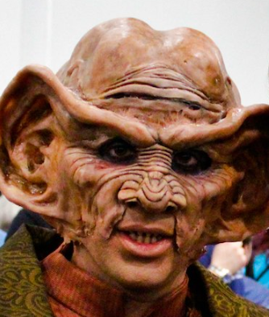
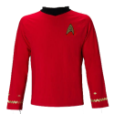

# Children of the Beast that Dodged the Abortion  

 
<b>Session started at 2023-10-31 / 03:47</b>
 
Fen's StarTrekAdventures Ruleset (v1.1.4)  
*[Prioritized Source: File; Other Sources: Vault]* 
*Core RPG ruleset (2023-08-29) for Fantasy Grounds
Copyright 2023 Smiteworks USA, LLC* 
*Fen's NPC Portrait Workaround v2.2.4* 
*[Prioritized Source: File; Other Sources: Vault]* 
*Fen's STA House Rules (v1.0.1) * 
*Story Template Custom Record Templates v1.0* 
*[Prioritized Source: File; Other Sources: Vault]* 
*FG Browser v1.2.3* 
*[Prioritized Source: File; Other Sources: Vault]* 

>Captains Log, Stardate 61686.5: Thankfully, our mysterious summons back to Sector 017 was for environmental protection, not another war. I am sure Commander Zox is dissapointed, but I am sure most of the crew is glad not to be dragged back into combat.

Hopefully the crew don't do anything to embarrass me again with the entire fleet gathered in one place. Admiral Ross didn't seem to think much of me during my command competency review... Here's hoping for a smooth week. 

*Skig will do everything she can so Captain Baras gets a good command competency review.* 
*Skig also wants to make sure the Lister performs superbly.* 

GM: And just for fun, the other 8 titles you could have had were: "From the Temple to the Tomb", "Leave your worry on the doorstep", "The devil deals the cards", "A walk-on part in the war", "Between the windows of the sea", "Facts learned from fools and from sages", "A cold lonely light that shines", "The wind in the wires" 
**Kolea:** Those all sound cool, honestly. 
Masakari (Zox): need to figure out what your playlist is =D 
**Zox:  [d20 = 20]** 
>INTERIOR - Zeppalite transport: Murry and Zox's team are situated quite comfortably in a civilian transport for once, after Zox managed to secure something spacious and not-delapidated out of the Starfleet vessel impound lot. They are cruising along at warp 5, heading for the border of Breen space with their forged identity and passage documents. 

**Zox:** Ah, im so glad to be in this vintage ship. Really takes me back to good Voth ships. 
**Zox:** Look at this baroque styling, ample head-room, attention to detail. Federation ships just lose it all on smoothness and faux-modern art style. 
**Lt. Cmdrs 11 and 10:** We would not advise repeating that around Commander Skig 
*Zox freezes up, realizing the Kaiju suit may hear him.* 
**Skig: [ CONTROL  (11) +  ENGINEERING  (5)]
[Focus: System Maintenance ]
[Successes: 4] [Complications: 0]
Success with 3 momentum [2d20 = 9]** 
Masakari (Zox): im dead. =D 
GM: AFK one sec, toddler aggro, will BTB 
KruschtyaEquation (Hailey Murry): kk! 
GM: back 
*Lt. Cmdrs 11 and 10 take out a tricorder and begin scanning Zox* 
*Kolea takes out a medical tricoder and begins scanning Zox.* 
**Kolea:** It's probably a good idea to find out what is broken BEFORE it gets worse. 
**Kolea: [ REASON  (9) +  MEDICINE  (4)]
[Focus: Xeno-biology ]
[Successes: 1] [Complications: 0]
Success with 0 momentum [2d20 = 26]** 
**Hailey Murry: [ REASON  (8) +  ENGINEERING  (2)]
[Successes: 1] [Complications: 0]
Success with 0 momentum [d20 = 3]** 
**Zox:** What's wrong? Am I not mighty? 
**Kolea:** You don't appear to be seriously injured, my Tricoder is having trouble identifying you. 
**Lt. Cmdrs 11 and 10:** Curious... 
**Lt. Cmdrs 11 and 10:** Stand by 
*Lt. Cmdrs 11 and 10 turn to a console and enter several commands rapidly* 
**Zox:** Most strange, not many Voth joined the Federation. 
**Zox:** I should stand out. 
**Lt. Cmdrs 11 and 10:** Commander Skig asked for our assistance in troubleshooting a myserious source of intereference in her listening device built into your suit.  
**Lt. Cmdrs 11 and 10:** It seems you have a pre-existing second listening device transmitting encrypted audio/visual data already 
**Lt. Cmdrs 11 and 10:** We have taken the liberty of jamming the signal for now, until we can determine a proper course of action 
**Kolea:** That is fascinating, I am more disturbed by the fact that your baseline "healthy" state involves four broken bones. 
**Zox:** Eat Spinnach for healthy bones! 
**Kolea:** It looks like the Emergency Voth Distress System Dr. Zerra installed is currently being blocked by that jamming frequency. 
*Kolea grabs a chainsaw.* 
**Zox:** Woah, woah, save that for later =D 
**Lt. Cmdrs 11 and 10:** Perhaps there are less invasive and dangerous methods to determine the source of the signal 
**Kolea: [ CONTROL  (9) +  MEDICINE  (4)]
[Focus: Xeno-biology ]
[Successes: 3] [Complications: 0]
Success with 2 momentum [2d20 = 15]** 
**Hailey Murry: [ CONTROL  (8) +  MEDICINE  (3)]
[Successes: 1] [Complications: 0]
Success with 0 momentum [d20 = 6]** 
**Zox:** Ooh this tingles! 
**Hailey Murry:** Huh. It's not supposed to.  
>Kolea comprehensively survey's Zox's entire body, the only foreign device present is Dr. Zerra's medical implant. She is certain there is no other foreign body present 

*Kolea has her arm up to the shoulder in Zox's rectum.* 
**Kolea:** I can disable that. 
**Hailey Murry:** Disable what? 
*Kolea shoves one of Zox's hearts aside and tickles his left kidney.* 
*Zox is uncomfortable.* 
**Hailey Murry: [ INSIGHT  (12) +  ENGINEERING  (2)]
[Focus: Psychology ]
[Successes: 2] [Complications: 0]
Success with 1 momentum [2d20 = 19]** 
**Kolea:** Zox, you have been eating too many berries again, I feel some cavities in your lower molars. 
*Kolea still has her arm in Zox's rectum up to the shoulder.* 
**Hailey Murry:** I think... if we're doing something incognito, it would be a good idea to stop the feeds regardless, yes?  
**Kolea:** Probably. 
**Zox:** You seem to know alot Kolea. 
**Lt. Cmdrs 11 and 10:** Of course, if the doctor's implant is streaming surveillance data, then he already knows where we are and what we are doing 
**Hailey Murry:** Hm. True 
**Hailey Murry:** Or whoever the information is going to 
**Kolea:** I mean, realistically, we should probably come up with names, cover stories, and disguises because it is not like at least you and Zox aren't already well-known and blindingly obvious to our quarry. 
**Hailey Murry:** So, a question then. Shall we dramatically change plans?  
**Zox:** It's you. You are in charge here. =D 
**Kolea:** If this involves me getting to use a Disruptor Rifle on Jasanis, I'm not going to object. 
**Zox:** She gives green people a bad name! 
**Kolea:** Exactly! 
*Kolea takes arm out of Zox's rectum and takes off the large plastic tarp.* 
**Kolea:** I think you are probably doing fine in general. 
**Zox:** Excellent! I was worried about all that cafeteria food. 
**Zox: [ INSIGHT  (8) +  SECURITY  (4)]
[Focus: Espionage ]
[Successes: 1] [Complications: 0]
Success with 0 momentum [2d20 = 23]** 
**Lt. Cmdrs 11 and 10:** If Dr. Zerra is spying for Commander Bachar, then surely she would have involved him in our data recovery mission 
**Lt. Cmdrs 11 and 10:** We certainly could have used his help 
**Lt. Cmdrs 11 and 10:** It is possible that a third party is using his implant to spy on Zox 
**Zox:** Well this is too spooky for me. Time to extract the implant and put it in stasis. 
**Zox:** Yes that! 
**Zox:** Zerra's innoculus implant may have been compromised. 
**Zox:  [d20 = 19]** 
**Hailey Murry:  [d20 = 19]** 
**Zox:  [d20 = 2]** 
**Hailey Murry:  [d20 = 13]** 
**Hailey Murry: [ CONTROL  (8) +  MEDICINE  (3)]
[Focus: Psychology ]
[Successes: 2] [Complications: 0]
Success with 1 momentum [d20 = 2]** 
**Zox:** Yeeeeouch! 
**Zox:** What in the blazes! 
**Hailey Murry: [ REASON  (8) +  MEDICINE  (3)]
[Focus: Chemistry ]
[Successes: 1] [Complications: 0]
Success with 0 momentum [2d20 = 29]** 
**Hailey Murry:  [Total: 2] [Effects: 0] [3dChallenge = 2]** 
# Children of the Beast that Dodged the Abortion (Part 2) 

 
<b>Session started at 2023-11-14 / 04:10</b>
 
Fen's StarTrekAdventures Ruleset (v1.1.4)  
*[Prioritized Source: File; Other Sources: Vault]* 
*Core RPG ruleset (2023-08-29) for Fantasy Grounds
Copyright 2023 Smiteworks USA, LLC* 
*Fen's NPC Portrait Workaround v2.2.4* 
*[Prioritized Source: File; Other Sources: Vault]* 
*Fen's STA House Rules (v1.0.1) * 
*Story Template Custom Record Templates v1.0* 
*[Prioritized Source: File; Other Sources: Vault]* 
*FG Browser v1.2.3* 
*[Prioritized Source: File; Other Sources: Vault]* 

>INTERIOR - Zeppalite transport: The away team are waiting in line at the Breen border checkpoint. While they wait, Zox pulls out their cover identities so that everyone can have a look at their identity documents. 

**Zox:  [Total: 4] [Effects: 0] [3dChallenge = 4]** 
**Kolea:  [Total: 2] [Effects: 0] [3dChallenge = 2]** 
**Hailey Murry:  [Total: 1] [Effects: 0] [3dChallenge = 1]** 
**Kolea:  [Total: 2] [Effects: 1] [3dChallenge = 2]** 
Masakari (Zox): 'Zoologist...that's what the kids call it these days..." 
*Kolea looks at Zox's cover ID for her.* 
**Zox:** Ah yes, I had to find <Hailey> to get the right contraband drugs to help <Kolea>'s rare endangered Tholian Lava-Horse. 
**Kolea:** Isn't this what I already do? 
**Zox:** Easy. 
**Kolea:** I mean, this is like you took my Starfleet record, redacted my name out, and then gave it to me. 
**Zox:** And this is definetly a place where a drug-dealer could get the right stuff to save our animal. 
**Zox:** 'Acting' 
*Zox smiles at Kolea * 
**Kolea:** Especially this part here about fornicating with an entire village of lust crazed cephaloods. That was like, four episodes ago. 
>The comms light up as the border control post hails the shuttle. 

**Kolea:** Someone who is good at communicating should do something about that. 
**Breen Border Control:** Zeppalite vessel, transmit your identity documents now 
**Hailey Murry ** *(quietly)*: I'm a prisoner, so that would be a bit odd 
**Zox: [ PRESENCE  (10) +  SECURITY  (4)]
[Successes: 2] [Complications: 0]
Success with 1 momentum [2d20 = 10]** 
**Kolea:** How do they manage to have an entire three-dimensional sensor array around their entire claimed space? 
**Zox:** Documents submitted. 
**Zox:** It is a mystery. Even years after the war they are still enigmatic. 
**Lt. Cmdrs 11 and 10:** Commander Zox was remarkably restrained in his choices of cover identities. No travelling circus of Jem'Hadar clones 
**Lt. Cmdrs 11 and 10:** Commander Bachar would not be overly dissapointed in him  
*Kolea shrugs.* 
**Breen Border Control:** What is the purpose of your visit to Breen territory 
*Kolea is waiting for Zox to say, "Prisoner Transport to Cellblock AA-123".* 
**Zoxar:** We are on a mission of mercy, seeking the botanical wisdom of several systems to cure the terrible hoof-fungus plaguing tholian lava horses.  
*Kolea blinks.* 
**Breen Border Control:** Your entry visa indicates you have a prisoner in your care 
**Breen Border Control:** Why do you need a prisoner for a botanical research mission? 
*Kolea considers exactly how she would fornicate with a Tholian Lava Horse and live to talk about it.* 
**Zoxar:** It does. This prisoner, while a wiley and tilted individual, is second to none when it comes to exbotany.  
*Kolea starts research project on super heavy duty heat-resistant lube.* 
**Zoxar:** Only a truly demented intellect could understand plants. 
**Zoxar: [ PRESENCE  (10) +  SECURITY  (4)]
[Focus: Espionage ]
[Successes: 1] [Complications: 0]
Success with 0 momentum [2d20 = 27]** 
**Zoxar:** I will keep the prisoner <name> on an extremely short leash. 
**Breen Border Control:** Very well, your documents seem to be in order 
*Kolea is amazed we have not started a war, yet.* 
**Breen Border Control:** Remember to obey all laws of the Breen Confederation or you will be executed without trial 
**Breen Border Control:** Enjoy your stay 
*Breen Border Control terminates the channel* 
**Zoxar:** Okay, don't break more laws than you have lives. 
**Lt. Cmdrs 11 and 10:** Setting course for the Ilitz Nebula, ETA 6 hours 
>---------CUT TO CREDITS-------
♫♫♫Opening Theme♫♫♫ 

>Episode 10: Children of the Beast that Dodged the Abortion
Written by Viviane Simon
Directed by Clifford Ness 

*Candles touches up her eyeliner.* 
>INTERIOR - Main Engineering: Skig and T'Kor are hard at work preparing the Lister for its dangerous mission. With so much of the crew transfered back to Earth, the engine room is unusually silent save for the hum of the warp core. The silence of the two socially challenged engineers is interrupted when Commander Bachar slips out of the turbolift accompanied by Zox. 

**Zoxar: [ CONTROL  (11) +  ENGINEERING  (4)]
[Focus: Shipboard Tactical Systems ]
[Successes: 1] [Complications: 0]
Success with 0 momentum [2d20 = 29]** 
**Skig: [ CONTROL  (11) +  ENGINEERING  (5)]
[Focus: System Maintenance ]
[Successes: 2] [Complications: 0]
Success with 1 momentum [2d20 = 23]** 
**Skig:  [Total: 5] [Effects: 2] [7dChallenge = 5]** 
**Skig: [ CONTROL  (11) +  ENGINEERING  (5)]
[Focus: System Maintenance ]
[Successes: 3] [Complications: 0]
Success with 2 momentum [2d20 = 10]** 
**Skig:  [Total: 8] [Effects: 2] [8dChallenge = 8]** 
*Commander Bachar checks a PADD in her hand* 
**Commander Bachar:** It looks like you and T'Kor finished prepping the Lister with time to spare 
**Skig:** Yes ma'am. 
GM: And no complications to create life-threatening danger later 
*Zox makes wootling noises of joy* 
**Zox:** I am so glad my amicable crewmates finally get the solace to enjoy practicing their talents. 
*Commander Bachar looks around and checks engineering is empy before sealing the door and turbolift on a control panel* 
**T'kor:** Good cycle, commander Bachar 
**Commander Bachar:** I assume by now you've reviewed the mission briefing, and you know that comms will be impacted by the radiation 
**Commander Bachar:** We have to manually relay communications via shuttle to and from the flagships 
**T'kor:** That sounds like a fine opportunity for trouble to arise 
**Commander Bachar:** What it sounds like, ensign, is an opportunity for us to figure out what is going on 
**Skig:** Yes, although I question why they are asking the communications crews to relay via shuttle instead of using the hyperlink photonic relays built into the ships to transmit morse code via the interpolation of the rear nacelle tracking light and the forward array disks. 
**Skig:** But sure, we can stick people in shuttle craft. 
**Commander Bachar:** Well be glad that they lack your outside-the-box thinking Commander 
*Skig mostly does not want Old Faithless to get damaged.* 
**Commander Bachar:** Because it gives us an excuse to be on Nechayev and Ross' flagships 
*T'kor: is confident that even if Old Faithless gets damaged, he can fix it* 
**Commander Bachar:** They led the captain's command competency review, one or both of them are up to something 
**Zox:** Hrm..... 
*Zox lets out the wootle of being care-free and not suspect.* 
**Commander Bachar:** I can't justify putting myself on a comms team, so Commander Zox will lead the away team 
**Skig: [ INSIGHT  (8) +  ENGINEERING  (5)]
[Successes: 2] [Complications: 0]
Success with 1 momentum [2d20 = 13]** 
*Skig looks suspiciously at Zox.* 
**Skig:** Hello. 
**Skig:** Hmm.... 
*Skig shrugs.* 
**Zox:** I stand ready to play relay messenger. 
**Zox:** As I understand it, it is an ancient earth sport based on even more ancient warfare. 
**Zox:** My cold-dino heart appreciates this efficiency. 
**Zox: [ PRESENCE  (7) +  COMMAND  (4)]
[Successes: 0] [Complications: 0]
Failed on DC: 1 [2d20 = 27]** 
*Commander Bachar pats Zox on the head* 
**Commander Bachar:** That's nice 
**Commander Bachar:** Just don't get caught 
**Commander Bachar:** You're committing a crime that could get you all courts marshalled 
*Skig gets out engineering tricoder, waves it in Zox's general direction, checks to see if that matches Zox's normal medical readings.* 
*T'kor registers this behavior and makes mental note that this is apparently an appropriate way to talk to and act to your subordinates (if he ever gets any)* 
*Skig looks at Bachar.* 
**Skig:** You all? 
**Commander Bachar:** Relax, I know better than to think I could pry you away from engineering while the ship is in danger 
*Zox seems oblivious and innocent* 
**Commander Bachar:** Commander, are you clear on the mission? 
*Commander Bachar glares at Zox* 
**T'kor:** Configuration of the other Star Fleet vessels is identical to that of the Lister, yes?  
**Skig:** Right, I shall do my best to ensure the Lister exceeds the expectations for a ship stuck in slot 275. 
**Zox:** I understand that information security is also part of the job! 
**Zox:** And that relaying messages from the vanguard of the fleet is no laughing matter, and certainly interacting with admirals is only for qualified personnel. 
*Commander Bachar nods knowingly* 
indarien (Skig): Basically, this has established that we are all spoiled by Fen as GM and incapable of competing with his sheer awesome. 
Masakari (Zox): This ^^ 
Masakari (Zox): PVP enabled  
>♫♫♫Mysterious Music Sting♫♫♫ 

**Zox: [ INSIGHT  (9) +  SCIENCE  (3)]
[Successes: 1] [Complications: 1]
Success with 0 momentum [2d20 = 24]** 
>EXTERIOR - Planet Surface: Zox and his team beam down onto the outskirts of a large industrial plant on Ilitz Prime, following the coordinates from Dr. Malov's email 

>As they approach the facility, they see a large crowd of people carrying signs in a variety of alien languages with slogans like: "12 hour workday", "End slavery", "Don't kill our families", "We want dental", and other such sloganeering 

Masakari (Zoxar): 'mistake' 
**Throk:  [Total: 8] [Effects: 1] [7dChallenge = 8]** 
**Zoxar:** Hrm interesting. I think we can use this to our advantage. 
**Hailey Murry:** Let's do a bit of reconnoiting and see if we can figure out what's going on here.  
*Hailey Murry: Hailey's immediate instinct is to order everyone to split up, but then looks at the group and gives it a second thought.* 
**Zoxar:** Well, you need a name first. Then whatever that name is, you are the scab chemist that will fill these jobs using your advanced chemistry. Then we can get what we need here, which is whatever is inside there. 
**Zoxar:** ...I mean, unless you have a better plan. 
**Hailey Murry: [ INSIGHT  (12) +  COMMAND  (1)]
[Successes: 1] [Complications: 0]
Success with 0 momentum [2d20 = 24]** 
**Candles:** It's workers demanding a decent work-life balance and proper care for providing labor. How noble and wonderful. 
>Murry starts mingling with the crowd and a plant worker approaches her carrying an armful of disruptor rifles, offering one to her 

**Plant Worker:** Are you here to stand on the picket line brothers and sisters? 
*Candles gets out dental supplies to offer free dental checkups.* 
**Candles:** No no, I'm a lover, not a fighter. 
**Candles:** Specifically a lover of teeth. 
*Candles looks at his teeth.* 
**Hailey Murry:** I am thinking about it, but most picket lines don't have disrupter rifles being passed out. What's happening here? 
**Plant Worker:** We're on strike 
**Hailey Murry:** And the, uh... 
*Zoxar hangs his dino-head in shame. Turning down free disruptor rifles...yeesh.* 
*Hailey Murry gestures at the disrupter rifles* 
**Plant Worker:** Oh, perfect timing. Dr. Malov is about to speak 
*Plant Worker shushes Murry* 
**Dr. Malov:** If I could have everyone's attention please: The votes have been tallied, and we are prepared to submit the Union's demands to management. As we have discussed and agreed, we have four demands we will be transmitting to Jasanis: 
**Dr. Malov:** First: Whereas 30% of the current workforce of the refinery is slave labor, we demand that the slaves are freed 
**Dr. Malov:** Second: Whereas 40% of the current workforce, myself included, are being controlled through threats against our families, we demand that our families are released and the Orions stop threatening to kill them 
**Dr. Malov:** Third: For all workers, we demand an immediate 12% pay increase, along with future pay increases each year in line with cost of living. 
**Dr. Malov:** Fourth: Whereas this is a highly dangerous facility: we demand that we be provided with healthcare coverage, and that safety concerns like unshielded radiation sources, and prior fatal containment breaches, be properly addressed. 
**Dr. Malov:** It may sound crazy now, but every labor movement has had to overcome recalcitrant management. Jasanis is desparate: Her erratic behavior and refusal to accept even minor delays makes it clear that she needs this ketracel white to be delivered tomorrow. 
*Candles gets ready for emergency beam out and looks for the nearest photon bomb shelter.* 
**Dr. Malov:** That gives us leverage, with the guards here out of the way, we control that ketracel white, and if she wants to leave with it, she will have to negotiate with us on our demands. 
**Dr. Malov:** We must be strong, unified, and unwavering if we are going to be successful. But if we act as one, we can build a better future for ourselves. 
**Zoxar:** I think I like this guy. 
**Candles:** I think everyone here is about to die. 
**Lt. Cmdrs 11 and 10:** We concur Nurse Kolea. Surely Jasanis will not negotiate 
**Zoxar: [ INSIGHT  (8) +  SECURITY  (4)]
[Successes: 1] [Complications: 0]
Success with 0 momentum [2d20 = 26]** 
**Candles:** I mean, I am 100% on board with their requests, but I now where this is going. 
**Kolea: [ INSIGHT  (11) +  SECURITY  (2)]
[Successes: 0] [Complications: 0]
Failed on DC: 1 [d20 = 14]** 
**Hailey Murry ** *(to the group)*: Well, I think we have someone to talk to now. Though we're going to have to get to him before Jasanis's hitman does. 
**Plant Worker:** Where it is going is that we are going to get some concessions from management 
**Plant Worker:** You need to have faith brothers and sisters in labor 
**Hailey Murry:** Who's supplying the disrupter rifles?  
**Throk:** Throk not in this scene, but Throk do like Concession Stand food. Good luck getting Concessions, look like line might be pretty long. 
**Plant Worker:** They were generously supplied by the guards we overpowered, and their weapons locker 
**Candles:** Well done. Have you considered moving inside near the manufacturing facility and sensitive equipment so the risk of collateral damage is much higher to Jasanis' operations, because right now this crowd is just waiting to be hit with an orbital strike. 
**Plant Worker:** Jasanis will not arrive until tomorrow, but we will retreat to the plant before she does 
**Candles:** Oh, and replace all the regulators and life support equipment, because there is a very large chance that is rigged to poison everyone. 
**Plant Worker:** She cannot dare strike the plant from orbit or she would destroy her ketracel white 
>[TURN] Hadija Zawadi 

>[ROUND 3] 

**Hailey Murry:** This is really well organized. Is that Dr Malov fellow the one organizing everything? 
**Candles:** Also purge the memory banks on any food replicators and reload them from defaults because those will also generate low level addictive toxins. 
**Zoxar:** have you considered buffering the plant or the storage area against transportation, such that you retain the bargaining chips? 
**Plant Worker:** I am just handing out disruptor rifles, I am not sure what the plan is 
**Candles:** Good call, shields would be handy, I think an engineer I know would suggest changing the modulator frequencies every Cube root of 27 + rand int divided by 2 minutes. 
**Plant Worker:** You would need to talk to Dr. Malov on that one 
*Candles takes notes.* 
**Hailey Murry:** Thank you for the assistance 
**Candles:** We will do so, carry on. Also, try to chew evenly, you are showing a little too much wear on your right side compared to your left. 
*Plant Worker self consciously rubs his jaw as he leaves* 
**Candles:** Do any of you know this Dr. Malov guy? I was busy giving the Captain massages for most of that episode so I never met him before. Hopefully he is not one of those people who think all Orion women look the same. 
*Candles directs her question to the Away team.* 
**Zoxar: [ INSIGHT  (8) +  SECURITY  (4)]
[Successes: 1] [Complications: 0]
Success with 0 momentum [2d20 = 25]** 
**Zox:** HRM.... 
**Zoxar:** This situation doesn't quite check out... 
**Hailey Murry:** He was the one we went to interview. He's the one who she went to interview under Bachar's guide. He specialized in KW. 
**Hailey Murry:** I watched Jasanis shoot him in front of us. Disintegrated him. Which means this is pretty suspcious. Kolea? He would probably remember me and Zox, we were there when he was abducted or killed. Can you arrange for a meeting with him? 
**Zoxar:** It is suspicious, but given we know changelings are about.....or have repurposed KW to do even more nefarious things... 
KruschtyaEquation (Hailey Murry): ((Retcon that, I misremembered; he got shot before he even saw us)) 
**Zoxar: [ INSIGHT  (8) +  SECURITY  (4)]
[Focus: Espionage ]
[Successes: 1] [Complications: 0]
Success with 0 momentum [2d20 = 23]** 
*Hailey Murry leads the group toward Dr Malov, letting Zox remain in the crowd to keep an eye out on people for an assassin* 
*Candles keeps an eye out for people ready to assassinate the "girl scout" and her "pet lizards" who are considered more of a threat to Jasanis' operations.* 
**Zoxar: [ INSIGHT  (8) +  SECURITY  (4)]
[Focus: Espionage ]
[Successes: 1] [Complications: 0]
Success with 0 momentum [2d20 = 20]** 
*Candles is disguised to look like an obscene zoologist.* 
*Candles keeps having to pry men off her.* 
*Hailey Murry has donned a basic disguise, dying her hair dark and putting on contacts to help disguise herself so Jasanis and hitmen don't recognize her immediately this time* 
**Candles:** Really, I am not here to make sure you don't die a virgin. But if you are alive in 48 hours, please take a number. 
**Hailey Murry:** Good afternoon, Dr Malov? Could I have a moment of your time? 
*Candles gets out ticket stand.* 
**Dr. Malov:** Um.. Oh, yes. Of course. 
*Dr. Malov fidgets nervously* 
indarien (Candles): Ticket stand reads, "Now serving number 4,293,438, you are number 34,378,292." 
**Candles:** Please form an orderly line there. 
**Zoxar: [ PRESENCE  (10) +  SECURITY  (4)]
[Successes: 0] [Complications: 0]
Failed on DC: 1 [2d20 = 31]** 
**Hailey Murry:** Pleased to meet you, I'm Tracey. You've done a marvelous job with this, when did it start? 
**Dr. Malov:** Well we have been, you know, planning it for a while now 
**Dr. Malov:** It was clear to me that Jasanis needed the white exactly on-time when she threatened to kill my entire family after I asked for a 2 day extension 
**Dr. Malov:** So I decided that gave us leverage to make some demands 
*Dr. Malov shrugs* 
**Dr. Malov:** Worst case scenario: she kills us all 
**Hailey Murry:** If that happens, though, I'm sure you've got something in place already to make sure there's no victory for her. It's quite genius. How long have you been here? 
**Candles:** I give you credit for pragmatism. 
**Zoxar: [ PRESENCE  (10) +  SECURITY  (4)]
[Successes: 2] [Complications: 0]
Success with 1 momentum [2d20 = 9]** 
**Dr. Malov:** I've been here for months, but many of the worker here have been here for years 
**Hailey Murry:** Huh, I'd expect that you'd have been here a while. How'd you get here?  
**Dr. Malov:** Jasanis kidnapped me from Skana-IV and faked my death 
**Candles:** Jasanis has been trying to replicate ketracell white for years? 
**Dr. Malov:** She used a disruptor rigged to fire transporter tags to kidnap me and make it look like I'd been killed 
**Candles:** Ah yes, that was in the report I read. 
Masakari (Zoxar): the only cannon use of it is for Jem'Hadar. 
**Candles:** It was in footnote 14 of the report, underneath the comment about dirt being in the door relays leading to your lab and its detrimental effect on the door opening. 
**Dr. Malov:** Well I don't know all the details, but at some point during the war, when Starfleet mined the wormhole, the Founders needed production facilities in the alpha quadrant 
*Candles obviously was reading a report written by Skig.* 
**Dr. Malov:** Somehow, they ended up contracting with the Aldazed cartel to refine it here 
**Dr. Malov:** But Jasanis only knew how to perform the final refining step, my research on Skana-IV had worked out how to produce the chemical precursors 
>As Murry, Kolea and Dr. Malov chat, a fight breaks out in the crowd between a pair of Miradorn and a Klingon woman 

**Candles:** Be careful! If you lose any teeth make sure you note where they go! 
*Candles: hands Dr Malov a ticket that is numbered, "4,293,439"* 
**Candles:** Oh, today is your super lucky day, let's go! 
*Candles grabs his hand and drags him off to a secluded corner.* 
*Candles falls obsessively madly in love with Kolea.* 
indarien (Candles): (Dr Malov) 
*Dr. Malov turns around and taps the door control desparately* 
**Dr. Malov:** This way, my quarters are just in here 
*Dr. Malov runs to his quarters while removing his lab coat* 
**Candles:** Excellent. 
**Candles ** *(whispers)*: Murry, beam all of us out of here. 
**Candles ** *(whispers)*: I totally have this covered. 
*Candles is very content to "take one for the team" for the 6-12 seconds it takes for a repressed nerdy scientist to collapse from exhaustion.* 
>Before Dr. Malov can get fully undressed, a Ferengi barges into the room waving a PADD around in the air 

**K'Tat Denellan:** Get your dick back in your pants Dr. We have a problem 
Masakari (Zoxar): We know this rat! 
*K'Tat Denellan sees Kolea* 
**K'Tat Denellan:** YOU! 
**Candles:** Sorry, wait your turn. 
**K'Tat Denellan:** Why am I not surprised to see you people here 
**Kolea:** Why am I surprised to always get interrupted or have an audience? 
**K'Tat Denellan:** Because this is a PG-13 rated show on a 9:00 PM timeslot, they can't show gratuitous sex scenes or it would upset sponsors 
**K'Tat Denellan:** Don't you know anything about business? 
**Kolea:** I thought the sponsors were the audience? 
*Zoxar approvingly nods at the Ferengi's shrewd analysis.* 
**Kolea:** Also, they aren't gratuitous. I reserve those for my OnlyOrions account. 
**Hailey Murry:** What're you doing here is the question 
**K'Tat Denellan:** I work here you stupid female 
**Hailey Murry: [ DARING  (10) +  SECURITY  (2)]
[Focus: Voth Calisthenics ]
[Successes: 2] [Complications: 0]
Success with 1 momentum [2d20 = 18]** 
**Zoxar: [ DARING  (12) +  SECURITY  (4)]
[Successes: 0] [Complications: 0]
Failed on DC: 1 [d20 = 19]** 
**Kolea:** Sure, sure. Violence is allowed on a PG-13 show, but showing off these glorious tatas gets us censored. Stupid rating system. 
*Hailey Murry kicks a chair, which hits K'Tat in the shin. As he doubles over she grabs his head to help him the rest of the way down (less than gently), twisting his arm behind him into a pin, and then deftly has Zox help empty his pockets while he's down.* 
**Dr. Malov:** It's an American thing, full-frontal nudity is allowed on Dutch broadcast television 
**Hailey Murry:** Bear with us just a moment, Doctor. 
**K'Tat Denellan:** AHHH! What are you doing? Assault! 
indarien (Kolea): Japanese television after 2100 is VERY interesting in what they can get away with. 
indarien (Kolea): BRB 
**Zoxar: [ CONTROL  (11) +  SECURITY  (4)]
[Focus: Espionage ]
[Successes: 0] [Complications: 1]
Failed on DC: 1 [2d20 = 38]** 
**Zoxar:  [d20 = 13]** 
>Zoxar puts on an elbow length rubber glove 

**Zoxar: [ PRESENCE  (10) +  COMMAND  (2)]
[Successes: 1] [Complications: 1]
Success with 0 momentum [2d20 = 30]** 
**Hailey Murry: [ PRESENCE  (10) +  COMMAND  (1)]
[Focus: Psychology ]
[Successes: 0] [Complications: 0]
Failed on DC: 1 [2d20 = 29]** 
**Dr. Malov:** Oh dear, this is NOT the sort of penetration I was expecting when I came in here... 
*Dr. Malov covers his eyes while Zox cavity searches K'Tat* 
**Zoxar: [ REASON  (7) +  MEDICINE  (1)]
[Focus: Xenobiology ]
[Successes: 1] [Complications: 0]
Success with 0 momentum [2d20 = 26]** 
>Zox finds nothing of interest, but he does find a polyp that he thinks K'Tat should get checked by a doctor  

**K'Tat Denellan:** Don't you federation types believe in rights! 
**Zoxar:** Rights are for citizens, not criminals. 
**K'Tat Denellan:** Innocent until proven guilty! 
*Kolea looks at Dr. Malov.* 
**Kolea:** Don't worry Doctor, you will get plenty of penetration opportunities shortly. 
**Hailey Murry:** Zox! Please, that is grossly uncalled for. What is up with you? 
**Hailey Murry: [ PRESENCE  (10) +  CONN  (3)]
[Focus: Psychology ]
[Successes: 0] [Complications: 0]
Failed on DC: 1 [2d20 = 29]** 
**Zoxar: [ PRESENCE  (10) +  CONN  (1)]
[Successes: 2] [Complications: 0]
Success with 1 momentum [2d20 = 13]** 
**Kolea:** No kidding, that type of rubber is known to cause a horrible allergic reaction to Ferengi intestinal tracts. 
**Lt. Cmdrs 11 and 10:** Perhaps the chef's hat is cutting of circulation to his head 
**Lt. Cmdrs 11 and 10:** He does seem to go a bit crazy whenever we are under cover 
**Zoxar:** Maybe you are right, but there's no Federation personnel here.  
*Zoxar winks* 
**Dr. Malov:** I'm actually a Federation citizen 
**Kolea:** I mean, he will probably develop nasty rectal hemmorhaging combined with the inability to consume any form of animal based protein for a couple weeks. 
**Dr. Malov:** And I am gathering from context that you are all Starfleet officers, although apparently not very good ones 
**Dr. Malov:** Are you here to rescue me? 
**Kolea:** Right, we need to get you out of here doctor. 
**Kolea:** Come with me if you want to live. 
**Dr. Malov:** I can't leave until we secure labor rights for the workers here 
**Dr. Malov:** Including K'Tat 
**Dr. Malov:** He is a victim of Jasanis as much as I am  
**Kolea:** Very noble of you doctor. 
**Dr. Malov:** Even though he is less sympathetic 
**Hailey Murry:** K'Tat, what was the problem you mentioned? 
**Kolea:** I feel you deserve extra shagging for that nobility of spirit. 
**K'Tat Denellan:** Get this big lizard off me and maybe I'll tell you 
**Kolea:** But not while everyone else is in the room. 
**Kolea:** Off or out? 
**K'Tat Denellan:** BOTH 
**Zoxar:** Fair. 
**Kolea:** I mean, are you okay with that allergen coated glove where it is? 
*Kolea gets out pencil and paper.* 
**K'Tat Denellan:** We can worry about that later 
**Kolea:** Describe your inetractions wit your father. 
*K'Tat Denellan stands up and pulls his pants back up while glaring angrily at Zox* 
**Kolea:** Describe your interactions with your father. 
**K'Tat Denellan:** As I was saying before I was violently assaulted by this brute, Jasanis received our demands and I don't think she took it well 
**Kolea:** As problems go, that would be 100% expected. 
**Hailey Murry:** Oh, she most definitely would not have 
**K'Tat Denellan:** Her ship changed course to come straight here at high warp, and she has been hailing continuously for the past several minutes 
**Zoxar:** Lace the white with something and appear to yield. 
**Kolea:** I like white lacy things. 
**Dr. Malov:** The white is our only bargaining chip, if you contaminate it she would have no reason not to kill us 
**Hailey Murry:** Oh? Just a few minutes ago?  
*K'Tat Denellan holds up a PADD flashing with a hailing indication from Jasanis* 
**K'Tat Denellan:** I don't want to talk to her 
**Zoxar:** Dr. Malov, you are an expert; surely you can concoct some subtle way to tamper with it that will not be discovered before it is too late, and everyone here cab be evacuated? 
**Dr. Malov:** To what end? I don't care what she does with the ketracel white, I want to try to improve the working conditions for the people in this facility 
**Dr. Malov:** Should I answer her? 
**Hailey Murry:** You're a surprisingly wholesome person, Doctor 
**Hailey Murry:** I think you should, she turned around only minutes ago, not hours, is that right K'Tat? 
**Kolea:** Also, we are NOT here. 
**K'Tat Denellan:** Yes, she changed course directly here as soon as the Dr. transmitted our demands 
**Dr. Malov:** points the camera to avoid the crew and answers teh call 
*Dr. Malov points the camera to avoid the crew and answers teh call* 
>Before he can say anything, Jasanis starts screaming at him 

**Jasanis:** You snivelling little shit bag Federation trash ! 
*Kolea turns on "record" on her tricoder.* 
**Jasanis:** I don't even have time to come kill you properly! Do you have any idea what you are doing to my timeline right now you fucking living garbage dump? 
*Jasanis screams incoherently* 
**Dr. Malov:** We just have some basic demands for... 
**Jasanis:** DEMANDS! 
*Kolea mouths the words, "requests"* 
*Jasanis laughs maniacally* 
**Jasanis:** I DEMAND that you are dead before I get there, so you don't FUCK UP my schedule 
*Jasanis starts angrily tapping away on a console while muttering under her breath* 
**Jasanis:** Good luck doctor 
*Jasanis terminates the channel* 
**K'Tat Denellan:** It doesn't sound like she is in the mood to negotiate 
**Dr. Malov:** Management never is, but every labor movement has had challenges 
*Kolea waits for Zox to shoot the PADD with a phasor set to disintegrate before it can self-destruct.* 
**Hailey Murry:** Most management won't threaten to kill you so openly 
*Kolea hands Murry a book about Labor Movements in the US in the 1890s and early 1900s.* 
**Zoxar:** Tamper with the KW shipment so it destroys Jasanis' ship in a way that looks like an accident with volitile compounts, then change this operation to a cosmetics factory? 
>As the crew discuss Jasanis' message, they hear the rising crescendo of distant screams of agony, howls of pain, and cries of terror, echoing through the facility.  

**Hailey Murry:** She also definitely has a sniper on hire, someone who's willing to do things the subtle and dirty way or the obvious and dirty way 
**Hailey Murry:** What's... what's that sound? 
**Dr. Malov:** Oh no 
**Kolea:** Contingency Plan C. 
*Dr. Malov checks his terminal* 
**Dr. Malov:** She shut down the containment field 
*Dr. Malov locks the doors to his quarters* 
**Dr. Malov:** This is not good, really, really not good 
**Dr. Malov:** Perhaps now would be a good time to take you up on the offer to leave 
**Hailey Murry:** What's out there? 
**Hailey Murry:** Dr Malov, what is out there? 
**Hailey Murry:** Why do you need a containment field? 
indarien (Kolea): Cue fade to black for commercial break! 
**Dr. Malov:** Well, it turns out that the final refinement of Ketracel White requires a fairly exotic substance to stabilize the reaction 
**Dr. Malov:** Changeling morphogenic matrix 
**Hailey Murry:** Uhuh?  
**Dr. Malov:** The trouble is containing the stuff, since it's highly intelligent and doesn't like it 
**Zoxar:** Ketracel White is People?!  
>♫♫♫Ominous Music Sting♫♫♫ 

>---------CUT TO COMMERCIAL------- 

# Children of the Beast that Dodged the Abortion (Part 3) 

 
<b>Session started at 2023-11-20 / 20:35</b>
 
Fen's StarTrekAdventures Ruleset (v1.1.4)  
*[Prioritized Source: File; Other Sources: Vault]* 
*Fen's NPC Portrait Workaround v2.2.4* 
*[Prioritized Source: File; Other Sources: Vault]* 
*Fen's STA House Rules (v1.0.1) * 
*Story Template Custom Record Templates v1.0* 
*[Prioritized Source: File; Other Sources: Vault]* 
*FG Browser v1.2.3* 
*[Prioritized Source: File; Other Sources: Vault]* 

>INTERIOR - Aldazed Drug Lab: As the screams of workes echo through the halls outside, Dr. Malov seals the door and vents of the room and shrinks into his seat in terror. 

**Dr. Malov:** This is not an ideal outcome, the last time we had a containment breach we had several deaths, and that was just from one unit breaking containment 
**Hailey Murry:** Shall we leave out the window? 
**Zox:** Can you state if this is a chemical or biological hazard? 
**Kolea:** True? 
**Dr. Malov:** I can't leave the rest of the workers to fend for themselves, we need to remain united and not bend to pressure from management 
indarien (Kolea): This stuff is semi-sentient? 
**Dr. Malov:** Well, the refinement of ketracel white requires some very unstable chemical compounds to react at a controlled rate. The only way to stablize the reaction is with a reagent than can alter its own molecular structure in response to the chemical reaction: changeling morphogenic matrix 
**Hailey Murry:** I think it's safe to say that management isn't about to cause the current pressure 
**Dr. Malov:** This is no different than any other strike breaking effort. Don't you know the history of your own planet? When the west Virginia cola miner's went on strike, management send in the Baldwin-Felts detective agency to kill them. This is no different 
**Dr. Malov:** Jasanis thinks she can break the strike by releasing the changling matrices 
**Hailey Murry:** This is significantly different. For example, what happens if those things break out of the facility and get into the city? 
*Kolea is quite impressed with Dr Malov's understand of Earther History.* 
**Zox:** Help me out here doc. Do you want to decrease the temperature, swap the atmosphere with inert gas? 
*Kolea is quite impressed with Dr Malov's understanding of Earther History.* 
**Zoxar: [ INSIGHT  (8) +  SCIENCE  (4)]
[Focus: Xenobiology ]
[Successes: 0] [Complications: 0]
Failed on DC: 1 [2d20 = 35]** 
**Kolea:** We just need to expose it to something that causes it to either retreat from the area or become docile/inert. 
**Dr. Malov:** The last time we had a containment breach, we had to repair the containment generators and trap it back inside containment 
**Kolea:** If it is not a sentient creature capable of negotation, it will operate at a basic instinctual level. 
**Zox:** Can we trap it in a transporter buffer? 
*Kolea check "overused cliche meter" for season.* 
**Kolea:** Those might not work. 
**Hailey Murry:** Is it a sentient creature, Doc? 
>As the crew discuss their options, the lights cut out and they are plunged into darkness. A few moments later, the emergency lighting kicks in 

**Zox:** I can think of quite a few sentient creatures here that only operate at the instinctual level.... 
**Dr. Malov:** It is unclear how intelligent it is, I suggested to Jasanis that we conduct some research on it 
**Dr. Malov:** I suspect that it has at least a basic level of cognition, but changeling physiology is not well studied 
*Kolea is not sure how the Ferengi managed to end up curled up in her arms during the brief period of lights out, and is surprised he could move that fast.* 
**Hailey Murry:** What do they look like, and how many are there? I can't help but note that you sealed the vents 
**Dr. Malov:** Well the last time, it used the ventilation to move around 
**Hailey Murry:** And how did they attack? 
**Dr. Malov:** They are ambush predators, they can take the form of objects and surfaces, although they seem to be unable to immitate humanoids 
**Kolea:** So the flying chopstick is lethal, got it. 
*Kolea makes sure to hide all prophylactics, because, well, that would be bad.* 
**Kolea: [ REASON  (9) +  SCIENCE  (3)]
[Focus: Xeno-biology ]
[Successes: 2] [Complications: 0]
Success with 1 momentum [2d20 = 20]** 
**Dr. Malov:** We don't have time to fully sweep the lab and contain all of them before Jasanis arrives though 
**Kolea:  [Total: 0] [Effects: 0] [dChallenge = 0]** 
**Hailey Murry:** What would you say if I told you that we could use your help to get Jasanis completely replaced? 
**K'Tat Denellan:** How so? 
**K'Tat Denellan:** Not that I doubt your sincerity, but I do doubt your capabilities 
**Hailey Murry:** Did you not hear her on the vid feed?  
**Hailey Murry:** She is *not* liking our interactions very much 
**Kolea:** High stun settings on phasers should be able to incapacitate the monsters, if we want to setup some overlapping fields of fire and spray the area with a wide beam over any inanimate objects we see, it should allow us to stun them. 
*Kolea looks at Dr Malov.* 
**Kolea:** When you "trapped them" last time, how did you do so? 
**Dr. Malov:** Jasanis used some of her men as bait to lure the changeling into a containment field emitter 
**Dr. Malov:** She does not take workplace safety very seriously 
**Kolea:** She does not take any sort of safety seriously, her own includ.ed. 
**Zox:** Dr. Malov, isn't there some way to free the proud workers of Ilitz Prime, while also not torturing some barely sentient goo that might not like being farmed? 
**Dr. Malov:** I don't make the decisions here, I was kidnapped by Jasanis and forced to work here or she would kill my family 
**Kolea:** Right, so do we have phasers to stun it, and people are dying, so we need to act sooner rather than later. 
**Dr. Malov:** But conditions in this factory are terrible, and we collectively decided to rise up in solidarity 
*Kolea adopts dynamic side profile action pose with pouty look.* 
KruschtyaEquation (Hailey Murry): I love the fact that Jasanis kidnapped Dr Malov, not realizing and not counting on the fact that he also has a PhD in the developments of unioniziation 
**Dr. Malov:** Yes, we must make our way to the top floor. That is where we store the Ketracel White, Jasanis will bring her ship down to pick up the cargo from the roof 
**Hailey Murry:** How many floors? 
**Dr. Malov:** 2 floors above us 
**Zox:** So....we ambush her? That's the plan? 
**Kolea:** Can we feed her to the changeling matrix? 
**Kolea:** I mean, I'm not opposed to this particular approach. 
**Dr. Malov:** Ambush? I don't know anything about that, but if she gets the white then we lose our only bargaining chip 
**Dr. Malov:** I want to secure it so we can extract some concessions out of her 
**Kolea:** It is easy to get concessions out of her while she is being dissolved into an acidic vat. 
**Hailey Murry:** How easy would it be to repurpose the facility to produce other types of product?  
**Dr. Malov:** It is a robust chemical processing plant, it could produce all manner of other chemical compounds 
**Kolea:** They can make some great cosmetics. 
**Zox:** I vote Kolea bran ...that 
**Kolea:** I imagine they can do wonders with a nice face scrub and body cleanser. 
**Zoxar: [ CONTROL  (11) +  SECURITY  (4)]
[Focus: Shipboard Tactical Systems ]
[Successes: 2] [Complications: 0]
Success with 1 momentum [3d20 = 37]** 
**Zox:  [d20 = 5]** 
**Kolea:** Especially something that can be rubbed luxuriously over someone's entire body, slowly and carefully while they are sprayed with a soft foamy water. 
**Throk:** Throk, at times, feels he is not old enough to be on this show. 
**Skig:** Skig, at times, knows she is too old to be on this show. 
**Zox:** Okay team, let's take up a defensive perimiter around the 'negotiating' roof. 
**Zox:** Dr. Malov, can you point the way? 
**Dr. Malov:** Naturally. Say, none of you are a changelingby any chance?  
**Zox:** We can debate the color and scent of cosmetics in due time. 
**Zox:** Nope! Solids. 
*Zox flexes impressive Saurian musculature.* 
**Zox:** I presume a changeling here would be quite upset with the treatment it's fellow species member is experiencing. 
**Zox:** I once read an Earth novel where dinosaurs were put in an amusment park. Those humans! Grrr! 
**Dr. Malov:** Yes.. well, I shall do my best to lead us to the maintenance causeway 
**Zoxar: [ INSIGHT  (8) +  SECURITY  (4)]
[Successes: 2] [Complications: 0]
Success with 1 momentum [2d20 = 17]** 
>As Dr. Malov opens the door and begins to lead the team out of his quarters, they can see the floors smeared with blood, shattered equipment, broken glass, and severed ODN lines. 

>The dimly lit corridors take on a misshapen, unnatural appearance in the dim glow of the emergency lights, and an ominous silence fills the air, the screams having since faded. 

>♫♫♫Ominous Music Sting♫♫♫ 

>---------CUT TO COMMERCIAL------- 

>INTERIOR - Shuttle Bay 2: T'Kor and Malat are preparing Ol' Faithless to launch into the highly dangerous radiation shadow of the fleet. As they work, Commander Bachar arrives with Zox and Throk. 

**Commander Bachar:** I hope you know what you're doing taking that deathtrap  
**T'kor:** She's a perfectly serviceable vessel. The unorthodoxy simply adds flavor to the voyage. 
**Zox:** I think it's rather a matter of perspective. T'kor, you do not fear a few ions and such eh? 
**Zox:** Maybe it feels like a warm shower on a cold day? 
**Throk:** Throk know that all manner of life and death is faced in pursuit of Starfleet's noblest goal, which is to recklessly endanger life in the pursuit of poor merchandising to live studio audience. 
*Zox suddenly looks concerned.* 
*Commander Bachar pulls out a Klingon Mk'Leth and with a practiced swing, severs Zox's hand* 
*Throk picks up hand and starts chewing on it.* 
**Throk:** It seems to be made mostly of Voth. 
**Zox:** Hay now, those don't regrow very easily! 
>Before Throk can enjoy the hand, it begins to undergo some sort of strange fluctuations, changing its molecular structure and shape at random 

**Throk:** No, this not Voth. 
*Throk spits out hand.* 
**Commander Bachar:** Not a founder either 
**Commander Bachar:** Who the hell are you? 
**T'kor:** Is that not usual?  
**Throk:** No, usually Voth taste more like bony green vegetable. 
**T'kor:** But surely they are made of meat? 
*Throk sniffs the air.* 
**T'kor:** Or... are Voth part plant? 
**Zox: [ FITNESS  (10) +  SECURITY  (2)]
[Successes: 1] [Complications: 0]
Success with 0 momentum [2d20 = 20]** 
*Throk looks at "Zox".* 
*Zox Lets' out the wootle of re-uninting* 
**Throk:** You taste like Ensign Geret. 
**Zox:** But clearly I am Zox, Crusher of Enemies of the Federation! 
**Commander Bachar:** Except that Skig has a live surveillance feed from Zox and he left the Lister more than a day ago 
**Commander Bachar:** Computer, present location of Ensign Geret? 
**Zox:** You trust Skig that much? 
**Computer Voice:** Ensign Geret is in Shuttle Bay 2 
**Zox:** Bawwww. Computers are the worst!~ 
**Commander Bachar:** Impersonating a superior officer is a court marshallable offence 
**Zox:** But that's table stakes for service aboard the lister! 
**Commander Bachar:** Who put you up to this? Nacheyev? Ross? 
**Throk:** Throk is incapable of acting superior at all times, never has to fear this superior officer idea. 
**Commander Bachar:** Who are you working for? 
**Throk:** Throk tries to be inferior officer, much safer to follow orders. 
*Commander Bachar tosses Throk a Gorn treat* 
**Commander Bachar:** Good boy 
**Zox:** I did it entirely of my own volition to test my crewmates! with all these spurious rumors of changelings I wanted to know how good everyone was at finding the bad ones. 
*Throk looks at Geret.* 
*Commander Bachar raises an eyebrow suspiciously at Geret* 
**Zox:** I guess it was hard. I thought I had the wootles down. Maybe there's more to being a Voth. 
**T'kor:** Commander, I don't think there is anything that Nacheyev nor Ross would have to gain from such a ruse 
**T'kor:** They could, and would, take routes other than using Ensign Geret 
**Throk:** Creating excess paranoia is always a good plan. 
*Commander Bachar sighs* 
**Throk:** Throk use that to keep others alert. For instance, if you eat one enlisted per week, others more motivated to not be last to mess hall clean up tasks. 
**Commander Bachar:** Bachar to Skig, you can stand down on the stasis field. False alarm. Also: after this mission I am reassigning Ensign Geret to latrine maintenance for 2 weeks 
**Skig:** Understood commander. 
**Geret:** Bawww. Ah well. 
**Commander Bachar:** Against my better judgement, I am going to keep you on this mission 
**Skig:** That would be the methane toilets with the broken sumps on deck 17? 
**Commander Bachar:** You already know too much, and you could actually be useful  
**Throk:** They have good tasting bacteria. 
**Commander Bachar:** Affirmative Commander Skig 
*Skig sighs, through the comm-link.* 
*Throk was not sighing at Bachar.* 
*Skig was not sighing at Bachar.* 
**Geret:** What would you have done if I was the real skig and there was blood all over? 
**Geret:** Or the real zox? 
**Commander Bachar:** Oh please, like that idiot doesn't sever his own limbs twice a week 
**Commander Bachar:** Dr. Zerra wouldn't even notice when he came in to reattach it 
**Geret:** Oh. Most here seem pretty protective of their limbs.  
**Throk:** Nonsense, you are clearly not real Skig, you made scratch on floor of shuttle bay with spiky Voth boot. 
**Skig:** SHE WHAT? 
**Skig:** Can I space her? 
**Commander Bachar:** Throk, if Geret tries to sabotage this mission, you have my permission to eat her 
**Commander Bachar:** Or him, or it? 
**Throk:** Throk would hug Commander Bachar, but she not like hugs. 
**Commander Bachar:** I have no idea how your species' biology works, but Throk will still eat you 
**T'kor:** Them, I believe, is the appropriate term 
**Throk:** This best orders Throk been given in weeks. 
**Commander Bachar:** Is that understood, Ensign? 
**Geret:** Yes commander.... 
**Geret:** I'll play nice. 
**Commander Bachar:** Good. Now since you're not actually Lt. Commander Zox, I suppose that leaves Lt. Malat in command of this mission 
**Throk:** Your bone things are quite springy and go well with ketchup. 
*Throk nudges Geret.* 
**Throk:** Can I pull off limbs and chew on? 
**Lt. Malat:** Try not to sound so dissapointed ma'am 
*Throk gets Sriracha from replicator for this trip.* 
**Geret:** Sorry Throk not now. 
**Commander Bachar:** Well now that we have dealt with Ensign Geret's lack of good judgement, I have 2 reports for your to deliver 
*Commander Bachar hands a pair of PADDs to T'Kor* 
**T'kor:** Yes, Commander.  
**Commander Bachar:** One is Skig's engineering readiness report to be delivered to main engineering on the Excalibur, the other is a requisition for more radiation meds for the Bellerephon 
**Commander Bachar:** Once you are on-board, do your best to dig for any evidence about why Ross and Nechayev are so interested in the Lister 
**Commander Bachar:** I want to know what the hell is going on here 
**T'kor:** Understood. Which ships areNacheyev and Ross are aboard? 
**Commander Bachar:** Nechayev's flagship is the Excaliber, Ross' is the Bellerephon 
**Commander Bachar:** Do NOT get caught 
*Geret ponders deeply which to visit first, only to get lost in arcane and esoteric thoughts of protocols and regulations.* 
**Commander Bachar:** I would say "use your best judgement" but I don't have a lot of faith in that, so use MY best judgement. If things go south, get out before you're found out 
**Throk:** Throk certain he not stick out like giant solitary Gorn among hundreds of pasty white humans. 
**Commander Bachar:** Never underestimate the value of a good distraction 
**Geret:** Well, I promise not to get caught, but can you fix this badge?  
**Throk:** Throk have very good judgment, for instance, Throk determine eating Tholian is bad for dental health. 
**Throk:** Throk excellent distraction creator. 
*Commander Bachar pulls Geret's commbadge off her uniform and holds it up to her tricorder, tapping in a few keys* 
**Commander Bachar:** Congratulations, you're Commander Zox again for today 
**Geret:** Yahoooo! 
**Commander Bachar:** You turn that back in to me at the end of this mission or I will eat you myself 
**Commander Bachar:** Is everyone clear? 
**Geret:** Yes Commander.... 
*Throk offers bottle of Sriracha sauce to Bachar.* 
**Lt. Malat:** Aye ma'am 
**Geret:** Goofy species needs computers and sensors and all sorts of things to know anything.... 
**Throk:** Geret taste much better with this. 
*Commander Bachar turns and walks out of the shuttle bay* 
*Throk looks at self.* 
**Throk:** Throk more green than clear. 
**Geret:** Today we are BOTH green friend! 
**Lt. Malat:** XO is certainly in a mood today 
**Throk:** Nonsense, this is her time of decade. 
*Geret wootles the tune of joy* 
**Lt. Malat:** So, who's ready to go commit some light espionage against our own flag officers? 
**Throk:** I read about it in book that Murry keeps on desk of waiting room called, "Penthouse". 
**Kolea:** That's mine, I knew I left it somewhere. 
**Geret:** Is espionage more fun when the computer doesn't rat you out? 
**Throk:** Throk excited about this plan, Throk very familiar with looking for imposing figure standing on rock with flag attached to back. 
**Throk:** Flag officer like sergeant with power sword. 
**Geret:** Oh oh! And no helmet on! 
**Lt. Malat:** Where to first: Nechayev or Ross? 
**Throk:** Also, susceptible to having head torn off by Tyranids. 
indarien (Throk): WOW. EPIC! 
indarien (Throk): I bow to your ability to destroy our chances for success. 
**Geret:** Nechyaev sounds like more of a fun name! 
**Lt. Malat:** Good a reason as any. Next stop: USS Excaliber 
*Lt. Malat lets out a resigned sigh* 
**Geret:** What could go wrong!!?! Wheee another Starship! 
**Throk:** Do not be resigned Malat, this lead to few opportunities for resignation, far more likely to be shot by firing squad. 
**Geret:** And goodey, tingly radiation! 
**Throk:** I suggest exasperated sigh, much more appropriate with less chance of misunderstanding. 
**Lt. Malat:** I've only been out of the brig for 8 months, I was hoping to get at least a year before getting court marshalled again 
**Geret:** You've always got a home on the lister! 
**Geret:** dino hugs Lt. Malat 
*Geret dino hugs Lt. Malat* 
**Lt. Malat:** If we get caught I am saying you ordered me to do it 
**T'kor:** What are the best locations to look for the information we need? I don't think we can get either commander's personal PDA.  
**Geret:** Wait, this badge says Lt. Commander..... 
**Geret:** Look at me. I'm the captain now! 
**Throk:** I think T'Kor, as engineering staff, should go check out shiny engineering area and ask questions about recent places they visited and chat with other engineers. 
*Lt. Malat ponders T'Kor's questions* 
**Throk:** I will engage in competitive poetry competition while sparring with security officers in holodeck. 
**Throk:** Malat will drown sorrows in ship lounge and look for drunks. 
**Lt. Malat:** Well, Starship computers are highly internetworked so any files on the ship computer itself would be accessible from any terminal 
**Throk:** Ensign Tastes-like-Zox will do things that are best not known by rest so we aren't responsible for its death. 
**Throk:** That is best idea dumb lizard has. 
*Throk gets into shuttle craft and secures four-point harness.* 
**Lt. Malat:** But if we are talking about secret files, surely she would keep them somewhere more secure: like her quarters or her ready room 
**Geret:** As commander of this mission, it is an order that everyone acts your role, so you have to act like the group w bench from the lister - otherwise you will attract attention. 
**Geret:** You can't act too formal and too sophisticated; no one will believe you are from the Lister. 
**Lt. Malat:** To be clear: I am in command of this mission 
**Geret:** awwww 
**Geret:** but but but 
**Throk:** Mostly likely she keeps them on secret notePADD under keyboard. 
**Lt. Malat:** You can't just impersonate a high ranking officer and gain the privileges of their rank 
**Hailey Murry:** Not after you're discovered, at least 
**T'kor:** Not after you're discovered, at least 
**Lt. Malat:** You may look like a big sexy dinosaur, but you are still an ensign  
*Throk raises hand.* 
**Throk:** Question. 
**Geret:** Well... I have a question. 
*Geret waits patiently for Throk's question* 
**Lt. Malat:** I'm not Bachar, you don't have to raise your hand 
**Lt. Malat:** I don't keep a spray bottle on hand either 
**Throk:** Can Ensign Tastes-Like-Zox just impersonate admirals and request data. 
**Throk:** I just like raising hand to air out armpits? 
**Throk:** This has actual meaning? 
**T'kor:** You do have a phaser, though 
*Throk raises both hands like he is on rollercoaster.* 
**Lt. Malat:** Risky, but it might get us access to restricted areas 
**T'kor:** I think we should avoid that. It would be ill-advised. A lesser officer, though, potentially. That sort of discrepancy, especially with surveilance outside such quarters, can raise a lot of questions and put all ships on high alert.  
**Lt. Malat:** Reasonable 
**Lt. Malat:** Alright then, next stop: USS Excaliber 
**Geret:** But....if you no longer trust my badge, or my face, why do you trust the brass is who they say? 
**Lt. Malat:** I should have gone with real Zox... 
>♫♫♫Lighthearted Music Sting♫♫♫ 

*Geret is extremely confused at the badge commanding respect and alternatively meaning nothing.* 
>INTERIOR - Aldazed Drug Lab: Dr. Malov carefully leads the team over the bodies of dead workers, through the darkened corridors of the drub lab. 

**Zoxar: [ INSIGHT  (8) +  SECURITY  (4)]
[Focus: Xenobiology ]
[Successes: 0] [Complications: 0]
Failed on DC: 1 [2d20 = 37]** 
**Dr. Malov:** There are 2 maintenance causways on the south side of the building that we can, in theory, use to access the other floors 
**Dr. Malov:** There is also the main turbolift shaft, although with the power out that might be difficult to scale. 
**Zox:** Any of you want to hotwire a turbolift> 
**Zox:** Any objections to hotwiring? 
**Hailey Murry:** The power is out, I don't think there's any hot to those wires 
**Zox:** You have a tricorder. 
**Hailey Murry:** I'm confident in my climbing skills, but less confident in what else we might find in there 
**Kolea:** I can do hot things in a turbolift, but I don't think that is what you are asking for. 
**Zox:** Dr. Malov, what is the way you would go to remain as unnoticed as possible? 
**Hailey Murry:** On the other hand, they prefer maintenance shafts, don't they ? 
**Zox:  [2d20 = 31]** 
**Dr. Malov:** Maintenance Causeway A is secluded, and not directly adjacent to any other major points of interest 
**Zox:** Sounds great! Plan A! I like it! 
*Zox leads the way down the dark corridor.* 
**Hailey Murry:** Which one's more connected to the containment zone? 
*Kolea sets her phaser to wide beam stun.* 
**Zox:** Doctors orders. =D 
indarien (Kolea): Because that is what stuns changelings enough to give everyone a chance to escape. 
**Hailey Murry:** When the matrices burst free, are either of the maintenance causeways closer to that area?  
**Dr. Malov:** They are both similarly distant from the morphogenic containment chamber 
**Kolea:** Are all the morphengenic substances stored in the same location? 
**Dr. Malov:** Ordinarly yes, the containment system is tied directly to the facility generator 
**Dr. Malov:** To reduce the likelihood of them losing power 
**Kolea:** Realistically, Jasanis just turned off the generator but did not damage it. She would want to be able to re-enable the power to be able to resume Ketracel White production once the current worker-management dispute is resolved. 
**Zox:** Kolea....did you not see the string out hot mess on the other end of that broadcast? Im not sure she is thinking that rationally. 
**Kolea: [ REASON  (9) +  MEDICINE  (4)]
[Focus: Xeno-biology ]
[Successes: 3] [Complications: 0]
Success with 2 momentum [2d20 = 10]** 
**Hailey Murry: [ REASON  (8) +  SCIENCE  (5)]
[Successes: 1] [Complications: 0]
Success with 0 momentum [2d20 = 29]** 
**Kolea:** I'm sure she is thinking completely irrationally. 
*Zox sets the breen disruptor to 'business mode'* 
**Hailey Murry: [ CONTROL  (8) +  SECURITY  (2)]
[Successes: 0] [Complications: 1]
Failed on DC: 1 [2d20 = 36]** 
**Hailey Murry: [ CONTROL  (8) +  SECURITY  (2)]
[Successes: 1] [Complications: 0]
Success with 0 momentum [2d20 = 15]** 
**Hailey Murry: [ CONTROL  (8) +  SECURITY  (2)]
[Successes: 2] [Complications: 0]
Success with 1 momentum [2d20 = 14]** 
**Hailey Murry:  [Total: 1] [Effects: 0] [dChallenge = 1]** 
**Dr. Malov:** As the away team passes the darkened turbolift, they hear an adorable "Pika Pika! 
>As the away team passes the darkened turbolift, they hear an adorable "Pika Pika!" from Kolea's tricorder 

**Zox:** Wait what? 
**Zoxar: [ FITNESS  (9) +  SECURITY  (4)]
[Focus: Xenobiology ]
[Successes: 1] [Complications: 0]
Success with 0 momentum [2d20 = 25]** 
**Kolea:** We're being attacked! 
**Kolea:** That's the alarm noise when either I'm in danger or ovulating. 
>A ceiling tile drops from the ceiling and turns into an angry, dripping pile of orange goo 

**Hailey Murry:** Why do you have both set to the same tone?! 
**Kolea:** Have YOU ever seen an Orion baby? 
**Zoxar: [ DARING  (12) +  SECURITY  (4)]
[Successes: 2] [Complications: 0]
Success with 1 momentum [2d20 = 7]** 
**Zox:  [Total: 6] [Effects: 3] [7d6 = 6]** 
>The creature makes an ear curdling shriek, and lashes out at Zox with a gooey tentacle that solidifies into a razor sharp edge in mid swing 

**Zox:** Rawrrrrr!  
>The creature draws blood from Zox's arm before, shlooping into a nearby air vent 

*Zox since it clearly took a sample of me, someone should take a sample of it. it's only fair. * 
Masakari (Zox): since it clearly took a sample of me, someone should take a sample of it. it's only fair.  
>The Twins try to return fire, but are unable to land a shot on the slipperly little creature 

**Hailey Murry:** Why did it just flee again?  
**Hailey Murry:** Wait, does it have Zox's DNA now? 
**Kolea:** Fight or flight response, plus it has... yes, that. 
**Zox:** Yes it has my Dinosaur Nucleic Acid.  
KruschtyaEquation (Hailey Murry): DiNosAur 
**Lt. Cmdrs 11 and 10:** Command Zox did seem to wound the creature, we can assume that it is protecting itself 
**Dr. Malov:** We should get out of here before it comes back 
**Kolea:** I concur, let us not waste more time here. 
**Hailey Murry:** Zox is not allowed to be by himself anymore 
**Zox:** I feel great!  
**Hailey Murry:** Also, if we spot anyone you know, Doctor, keep in mind that they might be a changeling matrix instead 
**Kolea:** But what happens when his needs some little dino time by himself? 
**Kolea:** Right, so stun first, cuddle second! 
**Kolea:** Just like my middle school days! 
>The rest of the walk to causeway A is uneventful, with Murry laying a careful blanket of protective wide-band disruptor fire 

>Near the causeway, the team finds the charred, dismembered corpse of a factory worker 

**Dr. Malov:** After you Commander Zox 
*Kolea gets out a hanger and prepres to see a cliff.* 
*Dr. Malov gestures toward the hatch to causeway A* 
*Kolea hopes we don't see Jasanis entering a hangar.* 
**Zoxar: [ FITNESS  (9) +  SECURITY  (4)]
[Focus: Endurance ]
[Successes: 2] [Complications: 1]
Success with 1 momentum [2d20 = 21]** 
*Kolea grabs Dr Malov by the arm.* 
>As Zox leads the team into the causway, they begin to climb the narrow ladder up towards the next deck. Before they have reached level 2, they hear a *whoosh* from beneath them, and a blast door seals off ahead, just beyond the hatch to level 2 

**Dr. Malov:** Uh oh, that's a bad sign 
**Kolea:** I want you to know, that if anything happens to Zox, Murry is the mother of his children and needs to be kept safe. 
**Hailey Murry:** I am NOT! That was never something that went through, I swear Kolea 
>From beneath them, deep in the belly of the facility, a roiling bubbling mass of burning, reacting chemicals begins to churn up from underneath, filling the causeway as it belches and foams with heat 

**Dr. Malov:** With the power down, the chemical containment must have also failed. Causeway A is used as an emergency vent for chemical byproducts 
**Dr. Malov:** I recommend we exit the causeway 
>♫♫♫Ominous Music Sting♫♫♫ 

>---------CUT TO COMMERCIAL------- 

**Kolea:** I agree with the doctor's opinion. 
# Children of the Beast that Dodged the Abortion (Part 4) 

 
<b>Session started at 2023-12-05 / 04:08</b>
 
Fen's StarTrekAdventures Ruleset (v1.1.4)  

>INTERIOR - Drug Lab Maintenance Causeway: As Zox and his team begin to climb the narrow ladder up towards the next deck they hear a whoosh from beneath them. Ablast door seals off ahead, just beyond the hatch to level 2. From beneath them, deep in the belly of the facility, a roiling bubbling mass of burning, reacting chemicals begins to churn up from underneath, filling the causeway as it belches and foams with heat, bathing the causeway in a sickly orange glow. 

**Dr. Malov:** With the power down, the chemical containment must have also failed. Causeway A is used as an emergency vent for chemical byproducts 
**Dr. Malov:** I recommend we exit the causeway 
*Lt. Malat tugs at his collar nervously* 
*Dr. Malov tugs at his collar nervously* 
**Kolea:** I agree with the good doctor's assessment of the situation. 
>[ROUND 1] 

**Kolea:** Dr Malov, is there a blast door between us and the chemicals below us? 
**T'kor:** If we close the blast door below us, how long until the pressure goes critical? 
**Hailey Murry:** If we close the blast door below us, how long until the pressure goes critical? 
**Kolea:** I see the lights indicating that there is a blast door there. 
**Kolea:** Can we vent the pressure a different direction? 
**Dr. Malov:** I don't know, I'm a scientist not an engineer 
**Dr. Malov:** I stay away from boiling chemical waste 
**Kolea:** You know, like when you have a clogged artery and you slice it and cause blood to spray four meters in a different direction while tears shoot out the side of my eyes like I somehow have high pressure hoses attached to my tear ducts. 
>[TURN] Hailey Murry 

**Zoxar:** Okay, is there something that will quench the reaction? 
*Kolea just finished voice acting some Hentai, knows all about anime solutions for this problem.* 
**Dr. Malov:** well, the chemicals used in the refinement are predominantly alkaline, so if you had a sufficient quantity of a powerful acid, you might be able to neutralize them 
**Dr. Malov:** But I forgot to bring 600 gallons of HF with me today 
**Hailey Murry:** We'll need a whole lot of them, though, given how quickly they're filling iup 
**Hailey Murry: [ DARING  (10) +  ENGINEERING  (2)]
[Successes: 2] [Complications: 0]
Success with 1 momentum [2d20 = 16]** 
**Kolea:** If it is Al Kaline, perhaps we could just retire his jersey and he will leave us alone? 
KruschtyaEquation (Hailey Murry): ^Paranoia vibes 
**Zoxar:** Wait, if you remove Al Kaline, does that reduce the team size? 
>Murry rips off the unpowered door control panel to reveal a manual release beneath and begins pumping it, the door slowly begins to ratchet closed 

**Kolea:** Wait a minute....are you using a long narrow hard thing in a stroking motion? 
**Kolea:** I've GOT THIS! 
**Kolea: [ DARING  (9) +  MEDICINE  (4)]
[Focus: "Diplomacy" ]
[Successes: 0] [Complications: 0]
Failed on DC: 1 [d20 = 16]** 
>[TURN] Kolea 

**Kolea:** Hmm...oh, I need to get on it like this. 
**Throk:** Throk question why Censor bar always appear in scene with Kolea. But Throk too young to understand. 
>As Kolea and Murry are pumping the door control, the chemical waste continues rising, faster than they seem to be getting the door closed 

>[TURN] Zoxar 

**Zoxar: [ DARING  (12) +  CONN  (1)]
[Focus: Endurance ]
[Successes: 1] [Complications: 0]
Success with 0 momentum [2d20 = 30]** 
**Zoxar:** Up the tube!  
>[TURN] K'Tat Denellan 

>K'Tat shimmies over to the door to the third floor and begins trying to open it, but he doesn't manage to get it open 

**K'Tat Denellan:** I'm getting out of here  
>[TURN] Lt. Cmdrs 11 and 10 

>[TURN] Dr. Malov 

**Kolea:  [Total: 3] [Effects: 2] [4dChallenge = 3]** 
**Zoxar:  [Total: 2] [Effects: 0] [dChallenge = 2]** 
**Kolea:  [Total: 0] [Effects: 0] [2dChallenge = 0]** 
**Kolea:  [Total: 3] [Effects: 1] [3dChallenge = 3]** 
**Hailey Murry:  [Total: 2] [Effects: 1] [3dChallenge = 2]** 
**Hailey Murry:  [d20 = 4]** 
**Kolea:  [d20 = 1]** 
>As the chemicals bubble and roil beneath the team, a large glob of goo erupts from a bubble bursting and flies up the shaft, landing on K'Tat and giving him a painful burn on his back 

>As he recoils in pain, he tumbles backwards down the column and begins to fall toward the chemicals below 

>[ROUND 2] 

>[TURN] Zoxar 

*Zoxar Spending 2 threat for Escalation.* 
**Zoxar: [ CONTROL  (11) +  SECURITY  (4)]
[Successes: 2] [Complications: 0]
Success with 1 momentum [2d20 = 28]** 
**Zoxar:** Go Go Gadget, Hook! 
>Zox fires his previously unestablished grapling hook, grabbing the falling K'Tat and begins to pull him back up to (relative) safety. 

>[TURN] K'Tat Denellan 

**Hailey Murry: [ FITNESS  (7) +  CONN  (3)]
[Successes: 0] [Complications: 0]
Failed on DC: 1 [2d20 = 25]** 
**Hailey Murry: [ FITNESS  (7) +  CONN  (3)]
[Successes: 1] [Complications: 1]
Success with 0 momentum [2d20 = 25]** 
Masakari (Zoxar): OH NOES 
**Hailey Murry:  [d20 = 3]** 
>As Murry turns to leave, she finds her foot has gotten wedged in the broken wall panel she had been standing against. The roiling mass of chemicals are now just centimeters away as she struggles to pull her leg free 

>[TURN] Hailey Murry 

**Zoxar:** 01, 10, I charged the vactation's forward flux array, use it to snag Hailey! 
**Lt. Cmdrs 11 and 10:** Aye sir 
**Lt. Cmdrs 11 and 10:** Most reckless, we are not surprised 
**Kolea:** For a second I thought he said, "Shag" and this became very weird. 
**Hailey Murry:  [Total: 2] [Effects: 0] [dChallenge = 2]** 
>The twins network themselves to the transport's control system and activate the tractor beam control program that Zox had pre-programmed. With their expert engineering skills, they are able to carefully pull Murry up the shaft with a delicate tractor beam deployment and not destroy the structural integrity of the entire building 

>[TURN] Lt. Cmdrs 11 and 10 

**Kolea: [ DARING  (9) +  ENGINEERING  (2)]
[Successes: 2] [Complications: 1]
Success with 1 momentum [2d20 = 21]** 
Masakari (Zoxar): BEST 
**Kolea:** Dr Malov, NOW is not the time to operate that lever! 
**Kolea:** I promise you, I will activate that lever all you want if we live through this. 
**Kolea:  [Total: 5] [Effects: 3] [6dChallenge = 5]** 
>As Murry floats up past the doorway Kolea snaps it shut behind her, using the power cell from the Twins' tricorder. 

>[TURN] Kolea 

>[TURN] Dr. Malov 

**Dr. Malov:** Whew, that was uncomfortably close 
**Hailey Murry:** You're telling me 
*Zoxar is impressed with the teams clear thinking and communication during a crisis.* 
>Kolea's tricorder suddenly chimes in: "Pika pika" 

**Kolea:** Why do I get the feeling I'm going to become the person who routinely has all the decent beings in my life who are not main character's die gruesomely just to add to an ever growing list of fatalities associated with one of the Values on my character sheet? 
>[ROUND 3] 

**Kolea:** Oh no! We are being attacked. 
**Kolea:** Wait. 
*Kolea checks temperature.* 
**Kolea:** Yep, not ovulating, definitely being attacked. 
**Hailey Murry: [ INSIGHT  (12) +  SECURITY  (2)]
[Successes: 1] [Complications: 0]
Success with 0 momentum [2d20 = 27]** 
**Hailey Murry:** Zox, K'Tat, hold on! 
**Hailey Murry: [ DARING  (10) +  SECURITY  (2)]
[Successes: 2] [Complications: 0]
Success with 1 momentum [2d20 = 20]** 
**Hailey Murry:  [Total: 3] [Effects: 1] [2dChallenge = 3]** 
**Hailey Murry:  [Total: 2] [Effects: 1] [2dChallenge = 2]** 
**Hailey Murry:  [Total: 1] [Effects: 0] [dChallenge = 1]** 
**Hailey Murry:  [Total: 4] [Effects: 1] [5dChallenge = 4]** 
>As Zox disconnects K'Tat from his grappling hook, Murry blasts them both with her wideband disruptor as the security camera next to them morphs off the wall and lashes out at them 

>[TURN] Goo 6 

*Kolea notes down, "Murry is again shooting someone who is her superior officer".* 
*Zoxar is rather upset that Murray didn't follow combat protocol with specific instructions to move away from friendly fire.* 
>With a gooey tentacle, it slams Zox's head into the ladder, ringing his bell but not killing him 

**Zoxar: [ DARING  (12) +  SECURITY  (4)]
[Successes: 0] [Complications: 0]
Failed on DC: 1 [2d20 = 37]** 
>[TURN] Zoxar 

*Zoxar bites at the air to no effect.* 
*Kolea pulls a giant starship sized Disruptor Cannon from between her breasts.* 
**Kolea:** Oh wait, not doing the anime thing anymore, nevermind. 
Masakari (Zoxar): The idea was that I could bite it, and swallow (don't get ideas Kolea!) and keep it in a 2nd/3rd stomach that would be wished into existance via an oposed to the writer check, per the episode were Morn ate latinum. 
**Zoxar: [ FITNESS  (9) +  MEDICINE  (1)]
[Focus: Xenobiology ]
[Successes: 1] [Complications: 0]
Success with 0 momentum [2d20 = 25]** 
**Hailey Murry: [ CONTROL  (8) +  SECURITY  (2)]
[Successes: 0] [Complications: 0]
Failed on DC: 1 [2d20 = 31]** 
>[TURN] Hailey Murry 

*Hailey Murry fires a focused blast from her type-1 phaser, but it strikes the wall beside the mimic* 
**Kolea: [ DARING  (9) +  MEDICINE  (4)]
[Focus: First Aid ]
[Successes: 1] [Complications: 0]
Success with 0 momentum [2d20 = 26]** 
>[TURN] Kolea 

>[TURN] Lt. Cmdrs 11 and 10 

**Zoxar:  [Total: 5] [Effects: 5] [6d6 = 5]** 
**Kolea:** Whoa whoa whoa there little ones. No punching extra holes in the walls. 
>The Twins pull out their disruptor and disinintigrate the creature, as it howls out in a blood-curdling sound 

**Lt. Cmdrs 11 and 10:** Oh, it appears we have inadvertently left the disruptor on its maximum setting 
**Kolea:** Hey, I see air quotes when you are talking. Is that normal? 
**Lt. Cmdrs 11 and 10:** We are not completely familiar with this style of disruptor 
**Kolea:** That is Breen for "Deep Fat Fry". 
**Zoxar:** Evidently they thought the worker negotiatons would go well. 
>[TURN] Dr. Malov 

**Kolea:** Zox, get that door open. 
**Dr. Malov:** I could not agree more 
*Dr. Malov attempts to gather a sample of the disintigrated changeling, but instead he inhales it, triggering an allergic reaction and causing him to start having a sneezing fit and drop his tricorder.* 
>[ROUND 4] 

**Zoxar:  [Total: 2] [Effects: 0] [dChallenge = 2]** 
**Kolea:  [Total: 0] [Effects: 0] [dChallenge = 0]** 
**Hailey Murry:  [Total: 1] [Effects: 1] [dChallenge = 1]** 
**Kolea:  [Total: 1] [Effects: 0] [dChallenge = 1]** 
**Hailey Murry:  [d20 = 17]** 
>[TURN] Zoxar 

**Zoxar: Zoxar has used a point of Determination to add a natural one to the dice pool.** 
**Zoxar: [ DARING  (12) +  SECURITY  (4)]
[Successes: 4] [Complications: 0]
Success with 3 momentum [2d20 = 25]** 
**Skig: [ CONTROL  (11) +  ENGINEERING  (5)]
[Focus: Security Systems ]
[Successes: 0] [Complications: 0]
Failed on DC: 1 [d20 = 18]** 
**Zoxar:** Rwarrrrr! 
*Throk feels inferior compared to the violence Zox has just inflicted on a blast door.* 
**Zoxar:  [Total: 6] [Effects: 3] [7dChallenge = 6]** 
>Zox pulls the door open with his suit, at great physical cost to himself and holds it open for the team to escape. As the door opens though, it turns out that a heavy crate was sitting on top of the door and it falls down onto Murry's head 

**Kolea:** I feel like I'm going to be busy shortly. 
**Hailey Murry: [ DARING  (10) +  CONN  (3)]
[Successes: 1] [Complications: 0]
Success with 0 momentum [2d20 = 31]** 
**Kolea: [ DARING  (9) +  MEDICINE  (4)]
[Focus: First Aid ]
[Successes: 0] [Complications: 0]
Failed on DC: 1 [2d20 = 31]** 
>As the team slip past him, Zox pulls himself up through the blast door and collapses to the deck, injured. 

**Kolea: [ DARING  (9) +  MEDICINE  (4)]
[Focus: First Aid ]
[Successes: 1] [Complications: 1]
Success with 0 momentum [2d20 = 27]** 
**Kolea:  [d20 = 6]** 
**Zoxar:  [d20 = 3]** 
**Zoxar:  [Total: 1] [Effects: 1] [dChallenge = 1]** 
>As Kolea administers first aid to Zox, she does stabilize his condition, but also accidentially drops a hypospray of corticosteroids into his eye, blinding him in his left eye 

**K'Tat Denellan:** I thought Starfleet was supposed to be competent 
**Kolea:** Don't worry, that will buff right out. 
*Kolea looks at K'tat.* 
**Kolea:** I am. 
**Zoxar:** You are still alive K'tat. You live by the skill of others. 
**Kolea:** What you don't realize is that Voth are limited by their left eye, which interferes with their ability to see a spread spectrum at the expense of better depth perception. By temporarily disabling his left eye he will better be able to spot incoming changelings. 
**Kolea: [ DARING  (9) +  MEDICINE  (4)]
[Focus: Xeno-biology ]
[Successes: 3] [Complications: 0]
Success with 2 momentum [2d20 = 10]** 
Masakari (Zoxar): yay! 
**Skig:** I'm not sure what just happened, but I think a Memory Alpha Wiki Editor just fell over dead. 
*Kolea looks imperiously at K'Tat.* 
>♫♫♫Lighthearted Music Sting♫♫♫ 

>---------CUT TO COMMERCIAL------- 

>INTERIOR - USS Excaliber: Malat, "Zox", T'Kor and Throk disembark Ol' Faithless on their secret orders from Bachar to commit espionage against a Starfleet Admiral. 

**Throk:** They have big shiny cave here. 
*Throk whistles appreciatively at what is an actual current generation starship with relevant technology.* 
*Throk checks to see if the lights turn off and on if he claps.* 
**Lt. Malat:** Yeah, these Excelsior class ships have big shuttle bays 
*Throk lead on angry and strict superior officer type person.* 
**Throk:** Lead on angry and strict superior officer type person. 
*Red Shirt approaches Zox with a padd in hand* 
*Throk stands at attention.* 
**Red Shirt:** What is your vessel or origin, and who is your communications for? 
*Throk resists urge to tear red shirt in half to see if it is not a changeling.* 
**T'kor:** We have an engineering report from Chief Engineer Skig for Engineering 
**Zox:** Our Vessel is the USS Lister, NCC-131616, here to deliver an engineering report from our Chief Engineer, Skig. 
**Red Shirt:** Hmmm. The Lister registry is NCC-13616 according to my files. Pretty suspicious that you don't know your own ship's registry... 
**Zox:** I just put an extra one in there, because I think we are number 1! 
**Throk:** That interesting, I thought it was NCC-1742? 
**Throk:** That original Constitution designation, did it get new desgination after being taken from salvage yard? 
*Throk looks at Redshirt.* 
**Red Shirt:** Makes sense, I'll just log you in the logbook and you can be on your way 
*Red Shirt squints at Throk* 
**Throk:** Good idea. Also, can you escort me to little Gorn room? I need to powder my eyes. 
**Red Shirt:** I didn't know there were Gorn in Starfleet.... 
**Throk:** I am visiting on work visa from Gorn homeworld. 
*Red Shirt walks away mumbling about "in my day"* 
**Zox: [ PRESENCE  (7) +  COMMAND  (4)]
[Focus: Starfleet Protocols ]
[Successes: 4] [Complications: 0]
Success with 3 momentum [2d20 = 4]** 
**Zox:** Ensign, Throk is an astounding citizen of the Federation.  
*Throk flexes impressively, likely tearing his uniform.* 
*Throk really hopes Malat is capable of doing ANYTHING useful.* 
**Throk: [ FITNESS  (10) +  CONN  (3)]
[Focus: Gorn-Fu ]
[Successes: 1] [Complications: 0]
Success with 0 momentum [2d20 = 24]** 
**Red Shirt:** Yessir, I'll make a note of that in the log 
*Red Shirt is visibly intimidated by the weird behavior of these Lister officers* 
**Zox:** Throk is a black-belt and a zen master. 
*Throk wonders if Red Shirt would constitute a hand weapon in the event of Throw Anything.* 
**Lt. Malat:** Ok, thank you ensign, let's be on our way now sir 
**Throk:** Throk go in search of little Gorn room. 
*Throk knows that he will be certain to attract CRAP LOADS of attention.* 
>As soon as they are out of the shuttle bay and out of earshot of any other security, Malat pulls Throk and "Zox" aside into a quiet corner 

*Zox lets out the wootle of intrigue.* 
**Lt. Malat:** Listen up you pair of absolute fucking morons, I don't want to get busted back to Ensign again for this shit, so you two shape it up and stop acting like idiots 
*Throk suspects that T'Kor is still hiding in Old Faithless.* 
**Throk:** Yes ma'am. 
**Zox:** If we dont' act like silly geese, they will suspect we arent't from the Lister. 
**Zox:** I just want to fit in. I was doing a pretty good job until someone cheated and cut off my hand. 
**Lt. Malat:** I hate that our ship is enough of a laughing stock to the fleet that your argument makes sense 
*Lt. Malat sighs* 
**Throk:** Throk suggest Malat go to ship cantina and pretend to bury misery of poor posting as a way to gather information from slightly inebriated crew? 
**Zox:** Baww. Wear the jester hat with pride.  
*Zox lets out the wootle of happiness.* 
**Lt. Malat:** Let's just get what we came for and get out before your luck runs out 
**Throk:** As Malat is clearly functional and intelligent officer, everyone will immediately commiserate with having to deal with us. 
**Throk:** At least, that Throk opinion of idea. 
**T'kor:** Would you like me to deliver the posting details and see if I might be able to glean any information from Engineering? 
**Zox:** Sure, here it is. 
**Throk:** That good idea, Throk think, but Throk not paid to think. 
**Lt. Malat:** That's probably wise, you are the engineer here aftter all 
**Throk:** Throk will go randomly wander around like lost country bumpikin and ask questions to gather information from crew. 
**Throk:** Throk also consider joining poetry contest on deck seven that he read about. 
**Zox:** It does seem strange they have to be so tight-lipped and opsec about shield modulation. 
**Lt. Malat:** What do you mean? 
**Lt. Malat:** The shield modulation details were in the mission brief 
**Zox:** It's just an angry pulsar or something....that sort of deflection shouldn't take hand-delievered messages? 
**Zox:** ah ha! I get it now. 
**Lt. Malat:** I wish real Zox was here... 
*Lt. Malat rubs her temple* 
*Throk rubs Lt. Malat's temples.* 
**Zox:** Do you though? Did you really want a wrestling match between Redshirt #123 and Zox? 
**T'kor:** Agreed, he'd be able to infiltrate the culinary division 
**Throk: [ FITNESS  (10) +  SECURITY  (4)]
[Focus: Gorn-Fu ]
[Successes: 3] [Complications: 0]
Success with 2 momentum [2d20 = 8]** 
*Lt. Malat slaps Throk's hands away* 
**Zox:** T'kor! Yay! That's a great cover story! 
**Lt. Malat:** I should have gotten the water bottle from Commander Bachar 
**Zox:** To the kitchen to find new and exotic dishes, and to boldly sautee like none have before! 
**Throk:** The way to a Gorn;s second stomach is with raw meat, at least, that is what hatching-mother said. 
**Lt. Malat:** Ok, set your chronometers. T'Kor can find what he can from Engineering, Throk can wander around and exploit people's natural tendency to want to be helpful to lost idiots 
**Throk:** Throk can do this! 
**Lt. Malat:** And you.... 
*Lt. Malat points at "Zox"* 
**Throk:** Throk pretend to carry heavy object into sensitive area and need someone to open door for him. 
**Lt. Malat:** Just... do something useful, I am going to get a drink 
**Throk:** Yay! Malat taking my advice. 
**Zox:** I can see being bitter at the Founders, but I am not one of them. lets be friends? 
**Throk:** This best away team mission ever. 
**Lt. Malat:** Meet in the observation lounge in 60 minutes 
**Zox: [ PRESENCE  (7) +  COMMAND  (4)]
[Successes: 2] [Complications: 0]
Success with 1 momentum [2d20 = 14]** 
**Skig: Skig has used a point of Determination to add a natural one to the dice pool.** 
**Throk: [ INSIGHT  (9) +  COMMAND  (2)]
[Focus: Poetry ]
[Successes: 2] [Complications: 0]
Success with 1 momentum [2d20 = 14]** 
**Throk:  [Total: 1] [Effects: 0] [4dChallenge = 1]** 
**Throk:  [Total: 3] [Effects: 3] [4dChallenge = 3]** 
**T'kor: [ INSIGHT  (7) +  ENGINEERING  (4)]
[Successes: 1] [Complications: 0]
Success with 0 momentum [2d20 = 21]** 
**Zox: [ PRESENCE  (7) +  SCIENCE  (3)]
[Focus: Transporters & Replicators ]
[Successes: 1] [Complications: 0]
Success with 0 momentum [2d20 = 26]** 
**Zox: [ PRESENCE  (7) +  SCIENCE  (3)]
[Focus: Transporters & Replicators ]
[Successes: 1] [Complications: 0]
Success with 0 momentum [26 = 26]** 
**T'kor: [ PRESENCE  (7) +  ENGINEERING  (4)]
[Successes: 0] [Complications: 1]
Failed on DC: 1 [2d20 = 37]** 
**Zox: [ INSIGHT  (9) +  SECURITY  (2)]
[Focus: Starfleet Protocols ]
[Successes: 1] [Complications: 0]
Success with 0 momentum [2d20 = 21]** 
**Throk:** GM: "Is Throk using human intelligence?" 
indarien (Throk): GM: "Is Throk using human intelligence?" 
indarien (Throk): No. He is using Gorn Intelligence. 
*Throk calls up Gorn Intelligence Services.* 
*Throk gets put on hold, wonders when they switched to a 900 number.* 
**Zox: [ PRESENCE  (7) +  SECURITY  (2)]
[Focus: Starfleet Protocols ]
[Successes: 1] [Complications: 0]
Success with 0 momentum [2d20 = 22]** 
*Throk wanders into the bar, carrying a multitude of redshirts under his arms because they are all his new friends.* 
**Throk:** Throk hear there is bowling alley, brought pins and balls. 
>The crew return to the lounge after their hour is up to find Lt. Malat leading a group of Excaliber officers in a drinking song of some sort in French near the bar 

**Lt. Malat:** ♫♫♫ C'est de boire, oui oui oui, C'est de boire, non non non! C'est de boire avant de mourir ♫♫♫ 
**Throk:** She have lovely singing voice, frequently win Bachelorette Night on Lister. 
*Zox now understands to give Malat alcohol to make her happy* 
>As they finish their song, Malat says her goodbyes and joins the rest of the team over by the observation windows 

*Throk sets down his collection of Redshirts.* 
**T'kor:** I, unfortunately, was unable to uncover details. But it seems like Engineering is working on analyzing sensor logs from before this mission 
**Zox:** I have behaved in an acceptable manner. 
*Throk goes to meet Malat.* 
*Throk turns on audio and snesor scrambler so they can actually talk without being overheard or scanned.* 
**Lt. Malat:** This crew is wound up pretty tight, get a few synthohols in them and they get a bit loopy 
**Throk:** I noticed distinct absence of fiber in their diet caused plumbing problems on decks 14-21. 
**Throk:** Definitely very tight and malnourished. 
**Lt. Malat:** I... don't know if I want any details on what you were doing 
indarien (Throk): Throk DOES have useful information! 
*Zox Chugs beverages* 
**Lt. Malat:** I hope someone did something useful with their time 
**Zox:** T'kor? 
>Before anyone can respond, an older man in a red uniform with Lt's pips comes over and sits at the table with the team 

**Unknown Lt.:** Oh your Gorn friend was certainly using his time. Whether it was useful remains to be seen 
>As he sits at the table, you can see he is holding a 23rd century style hand phaser under the table 

>♫♫♫Ominous Music Sting♫♫♫ 

>---------CUT TO COMMERCIAL------- 

**Zox:** 'Throkk shot first' 
# Children of the Beast that Dodged the Abortion (Part 5) 

 
<b>Session started at 2023-12-12 / 04:08</b>
 
Fen's StarTrekAdventures Ruleset (v1.1.5)  
*[Prioritized Source: File; Other Sources: Vault]* 
*Core RPG ruleset (2023-08-29) for Fantasy Grounds
Copyright 2023 Smiteworks USA, LLC* 
*Fen's NPC Portrait Workaround v2.2.5* 
*[Prioritized Source: File; Other Sources: Vault]* 
*Fen's STA House Rules (v1.0.1) * 
*Story Template Custom Record Templates v1.0* 
*[Prioritized Source: File; Other Sources: Vault]* 
*FG Browser v1.2.3* 
*[Prioritized Source: File; Other Sources: Vault]* 
>INTERIOR - USS Excaliber lounge: An older man with gray hair and a salt-and-pepper beard sits down opposite the away team and points a 23rd century style phaser at Throk under the table. 

**Unknown Lt.:** Oh your Gorn friend was certainly using his time. Whether it was useful remains to be seen. 
**Throk:** Throk like old fashioned weapons. 
*Throk sits down at the table.* 
**Throk:** You have very dignified look with facial antennae sprouts of varied colors. 
**Unknown Lt.:** I have a fondness for antiques myself, but what I don't like so much is when 2.5 meter tall Gorn show up and start asking people where my quarters are and where I eat 
**Zox:** I assure you Throkk means no ill will. This is merely the vaunted laconic Gorn communication style. 
**Zox: [ PRESENCE  (7) +  COMMAND  (4)]
[Successes: 1] [Complications: 0]
Success with 0 momentum [2d20 = 19]** 
**T'kor:** Indeed, Throk is a Federation-Approved Gorn and is well behaved in most official circumstances.  
**Zox: [ FITNESS  (10) +  SCIENCE  (3)]
[Successes: 1] [Complications: 1]
Success with 0 momentum [2d20 = 31]** 
**Unknown Lt.:** AH! 
**Unknown Lt.:** Since when are Voth telepathic? 
**Unknown Lt.:** Who the hell are you? 
*Unknown Lt. points the phaser at "Zox"* 
*Throk looks suspiciously at Zox.* 
**Zox:** I assure you Voth are as brainy as we are muscled. 
*Zox flexes some unusually large biceps* 
**Zox: [ FITNESS  (10) +  SECURITY  (2)]
[Successes: 1] [Complications: 0]
Success with 0 momentum [2d20 = 22]** 
**Throk:** Yes, answer nice man who smells of ben-gay and muscle ointments so he does not strain self pressing disintegrate button. 
**Zox:** Listen, I believe there is just some level of misunderstanding, Lt ?? 
*Unknown Lt. holds up a PADD with his free hand* 
*Zox extends a hand to greet the unkown lt.* 
**Unknown Lt.:** I already checked the duty roster, and saw Commander Zox was listed as on leave 
**Zox:** Negative sir. A real security officer is never on leave. 
**Unknown Lt.:** So I suspected you of submitting a falsified report, but now I'm thinking your impersonating a superior officer 
GM: you're* 
**Zox:** Well, there's no doubt that Voth are superior officers. 
*Zox looks at the camera as his wonderful teeth sparkle.* 
*Throk holds up Voth-Brand Toothpaste for advertising revenue.* 
Masakari (Zox): Green Mint flavored Voth Toothpaste would fly off the shelves. 
**Unknown Lt.:** This isn't a joke son, unless you want to get an up-close and personal view of a court marshall you had better start making some sense 
**Zox: [ REASON  (9) +  SCIENCE  (3)]
[Successes: 2] [Complications: 0]
Success with 1 momentum [2d20 = 11]** 
**T'kor: [ REASON  (9) +  ENGINEERING  (4)]
[Successes: 0] [Complications: 0]
Failed on DC: 1 [2d20 = 33]** 
**Zox:** Listen, I can understand you are very shaken by Throk on your ship, and the atmopshere is a little tense from this goofy ship maneuver, but we are all Federation members with a unified purpose, there's no need for reptilian defensiveness here. 
**Zox: [ PRESENCE  (7) +  COMMAND  (4)]
[Focus: Starfleet Protocols ]
[Successes: 1] [Complications: 0]
Success with 0 momentum [2d20 = 21]** 
**Unknown Lt.:** Very well said from someone impersonating a security chief 
**Unknown Lt.:** Why don't we cut the bullshit, Gorn: did you come here to kill me? 
**Unknown Lt.:** Or the admiral? 
**T'kor:** Wh- no. Throk, what sort of questions were you asking? 
**Zox: [ INSIGHT  (9) +  SCIENCE  (3)]
[Focus: Emergency Medicine ]
[Successes: 1] [Complications: 0]
Success with 0 momentum [2d20 = 24]** 
**Throk:** Hmm... Throk understand, at certain point in cosmic scheme of things, it is time to explain carefully. 
**Unknown Lt.:** A Gorn, a Voth and a Tholian walk into a bar... 
**Unknown Lt.:** I forget the rest of the joke, but the punchline is you start telling me the truth or I throw you in the brig 
**Zox:** Lieutenant, here is my com badge. You clearly know what it takes to tamper with these and get away with it, and you clearly know no one could take it against a Voth's will. Check it. 
Masakari (Zox): Admiral Nacho, the new restaurant. 
GM: Admiral Nechayev 
**Throk:** I can certainly state that I mean no ill-will towards the Admiral Nechayev or esteemed Lt Haggarty, nor the Excalibur or any member of the crew. I am used to being on the Lister, which is made up of a rather eclectic and unusual crew of, shall I say, misfits, myself included. 
**Throk:** As a result of this, I was curious about the operations of an actual Starfleet vessel that would be comparable to the vessels of the Gorn, rather than something which was mothballed in the time of Kirk. 
**Throk:** I am sure my Tholian friend quite agrees, as we are both outsiders to the Federation. 
**Throk:** My apologies if my curiousity about what an actual Starfleet admiral does would cause you alarm. 
*Lt. Haggarty squints suspiciously at Throk* 
**Throk:** Now, if you don't mind, Throk done monologuing, as it is difficult and makes him feel uneasy. 
**Lt. Haggarty:** Well, you're clearly all still lying, but not for the reason I thought 
*Throk begins looking hungrily at the nearest food replicator and wondering if it can generate a live cow.* 
*Lt. Haggarty puts his phaser away* 
*Throk lies down on ground.* 
**T'kor:** It is quite a difference in in setting from what we're used to 
**Throk:** Now Throk definitely lying! 
**Throk:** Throk think English is hard! 
**Lt. Haggarty:** I guess it was inevitable that someone on the Lister would get suspicious and start poking around, but I can't have you over here blundering around like a pack of idiots 
**Zox:** You should see them on the Lister! This is good behavior! 
*Throk raises hand to validate location of idiot for Lt. Haggarty.* 
**Zox:** Look, this poor Gorn needs a steak or something. Let's see what the replicators can make here... 
**Zox: [ DARING  (10) +  SCIENCE  (3)]
[Focus: Transporters & Replicators ]
[Successes: 2] [Complications: 0]
Success with 1 momentum [2d20 = 8]** 
**Lt. Haggarty:** Sure, feed the Gorn. But on a deeper level: you all are jeapordizing the security of the Federation by being here. 
**Zox:** We had to deliever the message by hand and in doing so have contributed to saving human homeworld? That's a bad thing? 
**T'kor:** That definitely sounds serious. What makes our presence so dangerous?  
**T'kor: [ INSIGHT  (7) +  CONN  (3)]
[Successes: 0] [Complications: 0]
Failed on DC: 1 [2d20 = 33]** 
*Zox has produced a roast worthy of a king.* 
**Throk: [ INSIGHT  (9) +  SECURITY  (4)]
[Successes: 0] [Complications: 0]
Failed on DC: 1 [2d20 = 33]** 
*Lt. Haggarty activates a small device and tosses it onto the table, everyone's ears ring for a moment and then all the outside sound of the lounge fades away* 
**Throk: [ FITNESS  (10) +  SECURITY  (4)]
[Focus: Gorn-Fu ]
[Successes: 2] [Complications: 0]
Success with 1 momentum [2d20 = 15]** 
**Throk:** Throk think this better than mother used to kill and throw on table when Throk was little lizard. 
**Lt. Haggarty:** Someone on the Lister is a traitor to the Federation. And they are part of a conspiracy of highly connected, very supiscious people 
*Throk eats roast carefully with cutlery instead of claws.* 
**Lt. Haggarty:** You four blindly blundering around, drawing all the attention in the world, is going to spook our quarry and spoil months of work 
**Zox:** Keep those Targ Tusks for toothpicks, they are not consumable! 
*Throk chews on the Targ Tusks thoughtfully.* 
**Zox:** Okay, now you are making all the sense I knew you had Lt. So that's what this gimmick is.  
**Lt. Haggarty:** None of you are on the suspect list, and you're all probably too incompetent to have escaped detection for this long anyways 
**Throk:** Throk good at blindly blundering around. Nice man who is smart and well connected but strangely only a Lt. rank for his age have any suggestions where Throk can blindly blunder next? 
*Throk would be mildly annoyed to not be on the suspect list, if he understood what he was being suspected of.* 
**Zox:** Well, with all respect, I believe we are equally incompetent. I sort of knew something was goofy, but had been unable to pin it to one crew member, due process and all. So we are at about the same stage; intuition. 
*Throk resists urge to "hide" behind sprig of parsley to prove that he can escape detection.* 
**Lt. Haggarty:** Well I can't arrest you all and throw you in the brig without alerting our prey, and I can't have you stumbling around doing whatever you're doing now 
**Lt. Haggarty:** So I may as well use you 
**Throk:** Can I interest crew members of Excalibur in Pareesi Squares game? That good way to pass time and Zox very good at breaking limbs. 
**Zox:** If we all acted like the sort of actors they have in Federation training videos, they would know we are from a different ship. This is the best cover that is. 
**Lt. Haggarty:** I suppose the safest thing is for you lot to continue doing whatever insanity you normally get up to, but direct it at my suspect list instead 
**Zox:** Will you not point phasers at us if we do? 
**Lt. Haggarty:** Commander Bachar, Commander Zox, Commanders 11 and 10, Dr. Zerra, Commander Murry, Commander Viraseti 
**T'kor:** I'm glad that Commander Skig is not on that list 
**Lt. Haggarty:** One of them is a traitor to the Federation, and you may as well help flush them out, since you've stumbled dick first into this 
**Throk:** Technically, none of us have dicks. 
**T'kor:** It may help to know the circumstances of the suspicions. Why do you suspct that one of them is a traitor?  
**Lt. Haggarty:** No, Commander Skig is there for mission purposes. The only ship I could requisition for this was the Lister and I wasn't sure anyone else could keep it running 
indarien (Throk): That is the most praise I think Skig would ever expect from anyone in Starfleet, good thing she is not here to hear it. 
**Zox:** HRM. What have I ever done to be suspect? 
**Lt. Haggarty:** A little over a year ago, there was a failed assassination attempt against President Inyo. Our prime suspect died mysteriously while in custody on Earth 
**Lt. Haggarty:** For the last time: I know you aren't Zox, you're clearly a telepath 
**Lt. Haggarty:** I'm half Betazed, how do you think you are going to get that one over on me? 
**Throk:** I can guarantee this Zox tastes nothing like Voth when bitten. 
**Zox:** Okay, what has the vaunted Security Chief ever done that would make it suspicious? 
**Throk:** Throk have answer for that, but Throk prefer to use inside voice for it. 
**Lt. Haggarty:** Our suspect list was everyone on Earth at the time who either: had access to the prisoner; had security clearance to Inyo's whereabouts and security arrangements; or had technical knowledge sufficient to gain access 
**T'kor:** And when you narrowed it down to only a few left, you transferred them to the Lister? 
**Lt. Haggarty:** Precisely 
**Zox: [ FITNESS  (10) +  SCIENCE  (3)]
[Successes: 3] [Complications: 0]
Success with 2 momentum [2d20 = 10]** 
**T'kor:** Who was the victim? 
**Lt. Haggarty:** The suspect was a Starfleet security officer, who had been reassigned to the Inyo security detail a week before the assassination attempt 
**Zox:** Well this is all very concerning. 
**T'kor:** Hm. Do you happen to have a dossier detailing each of the suspects whereabouts and the method of assistance they would have provided? 
**Lt. Haggarty:** I can't give you any written record, we don't know how high this goes 
*Throk scribbles down notes to find out more information about Inyo assassination attempt.* 
**Lt. Haggarty:** I can tell you what landed your crewmates on my list, if you like 
**Throk:** Throk think that great idea. 
**Zox:** Ooh! tell me all about them! 
**Throk:** Much like sunbathing belly side up after overeating. 
**Lt. Haggarty:** Commander Bachar is an old friend, we used to work together. Until one day she suddenly put in for a transfer out of Starfleet intelligence, and never spoke to any of her old friends of colleagues again 
**Lt. Haggarty:** Highly unusual 
**Lt. Haggarty:** Viraseti has a dubious grasp on notions of "right" and "wrong." She has been run op the chain of command several times for submitting obviously unethical research proposals. Like her request to artificially exhaust the hydrogen supply of a main sequence star in order to study its effect on planetary geology. In an inhabited star system. 
*T'kor mentally makes notes of all this* 
**Lt. Haggarty:** Dr. Zerra has been on my radar since the latter days of the Dominion war, his research at Starfleet Medical bore an eery similarity to the bio weapon that Section 31 developed to infect the Founders. 
*Throk scribbles down, "Viraseti and Neraran were roommates at the academy?"* 
*Throk scribbles down, "Viraseti, Zerra, and Neraran in a threesome?"* 
**Lt. Haggarty:** Your Bynars are an interesting conundrum: they aren't quite who they claim to be. They aren't a natural Bynar pair, their original complementary units are either dead, or missing. A careful technical analysis shows that their network communications are not within normal Bynar parameters 
*Throk scribbles down, "Stop shaking Bynars and rubbing them on shag carpeting to generate electric charge, might be interfering with their implants.* 
**Zox:** Now that's interesting but that's where i can help! If you have someone that can train me on Bynar telepathy, I can pose as one and find out!  
**Lt. Haggarty:** Zox's Psychological profile from his last medical clearance indicates a high degree of unresolved anger over his lack of direct combat involvement during the war, and a tendency toward agression as a result. It is a profile which makes one susceptible to manipulation, and his previous post at Starfleet Security gave him direct personal access to the suspect, both before and after the attack 
*Throk hands Lt Haggarty picture of Captain Picard doing a facepalm when listening to Zox talk at a gathering of Starfleet officers.* 
**Lt. Haggarty:** And Counselor Murry was the sole survivor of mutiny under extremely dubious circumstances. Along with a long record of... questionable applications of force. Destuction, death, etc. 
**Lt. Haggarty:** Although, after debriefing Lt. Elin, I am less suspicious of her 
**Zox:** What a boggle! 
**Throk:** Throk quite certain Murry only saws off heads of Jem'Hadar, Denobulans, Ferengi, and Humans with pocket knife on days ending in "y" on Starfleet calendar. 
**Throk:** For instance, Sunday, Monday, Tuesday, etc. 
**Zox:** And I totally get why the Lister is the best tree house for a bad actor.  
**T'kor:** And the traitorous activity they performed was in eliminating the suspect before they could be thoroughly questioned, thus hiding the original culprit who planted them on that duty? 
**Lt. Haggarty:** You must be the smart one 
**Throk:** He definitely is. 
**Throk:** Throk know T'Kor feign death with help of Skig for years. That take good effort for Tholian. 
**T'kor:** Have you been personally leading most of the investigation, Lieutenant?  
**Lt. Haggarty:** Yes 
**Lt. Haggarty:** Under direct orders from Admiral Nechayev 
**Lt. Haggarty:** I'm taking a big risk involving you lot, but it's either that or arrest you and risk exposing the entire operation 
**Throk:** Throk want to know if assassination attempt direct result of President Inyo making the slogan, "MFGA" being so hard to pronounce. 
**T'kor:** Excellent. Please do not take offense to this question, then: were you in a position to have eliminated the culprit?  
**Lt. Haggarty:** If I were involved, Inyo would have been dead and there wouldn't be a suspect 
**T'kor:** Why was the assassination attempt a failure?  
**Lt. Haggarty:** The suspect used a device to rewire a replicator into a point-to-point transporter, and attempted to use it to beam a small explosive into President Inyo's transport while on a tour of a new Starfleet Medical facility on Earth 
**Lt. Haggarty:** But Inyo's security team had to pull him from the transport at the last minute due to a scheduling conflict 
**Lt. Haggarty:** They didn't have time to update his itinerary, so the attacker went through with their plan, and destroyed the transport, killing the pilot aboard 
**Lt. Haggarty:** It was sheer dumb luck 
**T'kor:** You were on his security detail, then?  
**Zox:** How do we know it's only ONE Lister crew member? 
**Lt. Haggarty:** No, I wasn't even on Earth 
**Lt. Haggarty:** Good point, there could be more than one person involved 
**T'kor:** Oh, I see, you intended to say that you could have killed the president successfully where others have failed. I thought you'd have been involved in the event which pulled the president from the transporter.  
**Lt. Haggarty:** But I am certain that whoever killed our suspect is on your senior staff, there is no one else who had the opportunity, capability and availability to have done it 
**Throk:** How was suspect killed? 
**Throk:** Like disintegrator or poison or ingestion? 
**Lt. Haggarty:** Poison 
**T'kor:** Were any of the other admirals present for that? Nechayev in particular, as he's your commanding officer. 
**Zox:** The only thing I can do is remember this conversation never happened. But if you have a Bynar that could teach me their language, I can remove one point source of amibguity here. 
**Throk:** Which poison and how was it administered? 
**Throk:** And source of origin? 
**Lt. Haggarty:** I believe President Inyo was accompanied by Admiral Orlana of Starfleet Medical 
**Lt. Haggarty:** Unknown, it was a rapidly decaying toxin, only tiny traces were able to detected, not enough to identify it 
**Throk:** Err. Throk sorry, English hard, origin of poison. 
**Lt. Haggarty:** Whoever synthesized it knew what they were doing 
**Zox:** That sounds like something a Doctor would do! 
*Throk goes back to doodling threesome with Viraseti, Zerra, and Neraran.* 
*Lt. Haggarty checks his PADD* 
*Throk 's version of Threesome involves them being hogtied and slow roasted over open fire while being coated with a nice honey glaze. Were you expecting something else?* 
**Lt. Haggarty:** I have a briefing to get to, now get off my ship 
*Lt. Haggarty turns off his device, allowing the sounds of the lounge to return to the table, and leaves abruptly* 
**Throk:** Okie dokie! 
**Zox:** I have one question. If there were no traces of the poison, what about the mechanism of action? What cellular damage occured? 
**Throk:** Throk excited to leave ship behind. 
**Lt. Haggarty:** The toxin caused resprirtory failure by blocking neurological signals to the lungs 
**Lt. Haggarty:** He suffocated in his sleep 
**Zox:** Subtle. 
*Lt. Haggarty leaves the lounge* 
**Zox:** Well, time to vamoose! 
**Lt. Malat:** Yeah at least we can leave without being court marshalled 
GM: martialed* 
**T'kor:** You were quite quiet there, Lt 
**Throk:** Throk happy to be Court Marshall, that mean like Bailiff or Sheriff, right? 
**Throk:** Much better than Court Marital or Court Martial. 
**Lt. Malat:** If there's anything I have learned about being suspected of having committed crimes, it's: don't talk to cops 
**T'kor:** But we were explicitly not suspected 
**Throk:** Throk think T'Kor oblivious when cute. 
**Throk:** Or Cute when Oblivious. 
**Throk:** Throk doing too much thinking today. 
*Throk looks at T'Kor.* 
**Throk:** Can we use venting on your suit to cook some meat for trip back on shuttlecraft? 
**Zox:** You just had a whole Targ! 
**Lt. Malat:** I could go for a steak honestly 
**Throk:** Excellent, tonight we dine in Valhalla! 
**Throk:** Throk not sure what that mean, but sounds tasty. 
**T'kor: [ PRESENCE  (7) +  CONN  (3)]
[Successes: 0] [Complications: 0]
Failed on DC: 1 [3d20 = 45]** 
*Lt. Malat leads the team back to the shuttle* 
**Lt. Malat:** So, do you guys want to go poke around the Bellerephon as well? Or maybe not push our luck and just deliver the message and head back to the Lister? 
*Throk follows along patiently.* 
**Throk:** Throk happy to follow lead of smart people. 
**Zox:** We have to go no? 
**Zox: [ INSIGHT  (9) +  SECURITY  (2)]
[Focus: Starfleet Protocols ]
[Successes: 0] [Complications: 0]
Failed on DC: 1 [2d20 = 31]** 
Masakari (Zox): I should have been a plant alien, so I'd be an obvious plant. 
*Lt. Malat powers up the shuttle* 
**Throk:** Throk happy to tear head off anyone who needs to be questioned and check for device implants. 
**Lt. Malat:** Well, let's see if we can go 2 for 2 at getting caught spying on Starfleet admirals 
**Zox:** Everyone's cheating!  
**Lt. Malat:** May as well go for the gold 
**Throk:** Don't worry Malat, you can hide in shuttle and prepare to flee while keeping engines hot. 
>♫♫♫Lighthearted Music Sting♫♫♫ 

>---------CUT TO COMMERCIAL------- 

>INTERIOR - Drug Lab Maintenance Causeway: Zox and his team lie on the floor above the blast door taking a moment to rest and recover after their near-death experience with the chemical venting. 

Masakari (Zox): 13/14 OH YEAH 
*Fen's StarTrekAdventures Ruleset (v1.1.5) * 
*[Prioritized Source: File; Other Sources: Vault]* 
*Core RPG ruleset (2023-08-29) for Fantasy Grounds
Copyright 2023 Smiteworks USA, LLC* 
*Fen's NPC Portrait Workaround v2.2.5* 
*[Prioritized Source: File; Other Sources: Vault]* 
*Fen's STA House Rules (v1.0.1) * 
*Story Template Custom Record Templates v1.0* 
*[Prioritized Source: File; Other Sources: Vault]* 
*FG Browser v1.2.3* 
*[Prioritized Source: File; Other Sources: Vault]* 
**Kolea: [ DARING  (9) +  MEDICINE  (4)]
[Focus: First Aid ]
[Successes: 5] [Complications: 0]
Success with 4 momentum [2d20 = 13]** 
**Kolea:** You know, in situations like this, I always appreciate that the journey and adventure is part of the allure of Starfleet and why we are all here. 
**Hailey Murry:** K'tat, what's the ETA for Jasanis?  
*Kolea engages in medical wizardry the likes of which have not been seen since Dr. McCoy.* 
**Zoxar:** Ah, I feel so much better now! SO much more thrilling than the holo-deck! 
**K'Tat Denellan:** Well we lost tracking when the power went out, but based on the last known position... not more than an hour 
**Dr. Malov:** That gives us enough time to secure the ketracel white before she arrives 
**Zoxar:** Dr. I have a bold plan for you 
**Dr. Malov:** We need to have it in our control so we can use it as leverage to secure concessions for the laborers here 
**Zoxar:** Is Jasanis' ship going to land within the facility? 
**Dr. Malov:** It will most likely hover above the roof, to retrieve the ketracel white via the cargo hatch on the roof 
**Dr. Malov:** The containment system we use is not stable enough for transporters 
**Zoxar:** Can we focus the faclity to become a concentrated weapon to blow up her ship? 
**Zoxar: [ DARING  (12) +  ENGINEERING  (4)]
[Focus: Espionage ]
[Successes: 2] [Complications: 0]
Success with 1 momentum [2d20 = 16]** 
**Dr. Malov:** Um, have you suffered a head injury? 
**Zoxar:** Yes. 
**Dr. Malov:** Ok, that explains that 
**Dr. Malov:** The facility is just a building, full of chemistry equipment, how would you focus it into a weapon? 
**Zoxar:** We can evacuate the workers and get them into Starfleets Witness protection program. I understand your desire to help them and their plight. But Jasanis is a menace to the Federation. 
**Zoxar:** Oh, use one of these steam stacks as a concentrated, pressurized way to shoot down her ship? 
**Dr. Malov:** Well, I suppose you could try directing the chemical venting towards her ship.  
**Zoxar:** Im sure you have enough materials..Yes that! 
**Dr. Malov:** I don't know how well that would work 
**Dr. Malov:** I am not an expert in ship tactical systems 
**Hailey Murry:** We may need to get the power up, but unless we manage to hose down the inside of the ship via the cargo bay, that might be difficult 
**Zoxar: [ INSIGHT  (8) +  SCIENCE  (4)]
[Focus: Shipboard Tactical Systems ]
[Successes: 0] [Complications: 0]
Failed on DC: 1 [2d20 = 37]** 
**Zoxar:** Yah maybe it is a daffy plan. 
**K'Tat Denellan:** Whatever you plan to do, do it quickly.  
**Zoxar:** Why not just deliver a bunch of reactive chemicals rather than the white? 
**Zoxar:** It would accomplish the same thing without having to outwit shields? 
**Kolea:** I agree with the Ferengi, also, I doubt your "spray the ship with a sticky white substance" is very plausible. 
*Zoxar smirks.* 
**Kolea:** I say this as someone who occasionally gets sprayed with sticky white substances. It does not work on Orion women the way you think it would. 
**Zoxar:** I appreciate your dedication to civilized negotiation, but Jasanis is a crazed and violent criminal. 
**Hailey Murry:** Doctor, what if Jasanis is *not* willing to discuss terms?  
**Kolea:** In any case, we need to be moving, restore power, contain the morphlings, and secure the ketracel white in short order. 
**Zoxar:** T'kat, where is the ketracel shipment? 
**Dr. Malov:** Then we destroy her shipment, show her we mean business 
**Kolea:** Which we are not accomplishing by discussing... 
*Kolea stops.* 
**K'Tat Denellan:** This way 
*K'Tat Denellan gestures for Zox to follow him* 
*Zoxar Follows* 
*K'Tat Denellan points to a large opn space in the center of the level, containing six large containment units * 
*Kolea follows along behind, with her medical tricoder out to provide advance warning of an attack.* 
**Hailey Murry:** Also, these little amorphous monstrosities aren't able to reproduce, are they?  
**Zoxar:** Okay Doc, how do we put something in here that will detonate upon transport? 
**Dr. Malov:** Not to the best of our knowledge, we cloned them ourselves 
*Dr. Malov squints at Zox* 
**Zoxar:** They transport it up, boom. 
**Dr. Malov:** I am not an explosives expert 
**Zoxar:** but you are a chemist! 
**Dr. Malov:** Also, that wouldn't work as leverage for negotiation 
**Zoxar:** We aren't negotiated with an insane orion 
**Dr. Malov:** I am not your subordinate 
**Dr. Malov:** You can't order me around 
**Zoxar:** You are not, you are free to do as you wish 
**Zoxar:** However, Starfleet can find a home for the people you care about 
**Dr. Malov:** If you evacuate the workers, the Orions will just bring in new ones 
**Dr. Malov:** And they will be working under the same conditions as we find today 
*Hailey Murry raises her hand* 
**Hailey Murry:** I'm an explosives expert 
**Dr. Malov:** The only solution is to force management to negotiate, and the only leverage we have to do that is the Ketracel White 
*Zoxar Hugs Hailey* 
**Hailey Murry:** Also, Dr Malov, we may need to take you into protective custody after this 
Masakari (Zoxar): Elephant toothpaste! 
**Hailey Murry: [ DARING  (10) +  SCIENCE  (5)]
[Focus: Chemistry ]
[Successes: 1] [Complications: 0]
Success with 0 momentum [2d20 = 32]** 
Masakari (Zoxar): It might be better to have Kolea Seduce Malov into assisting; Twins only have a 12 combined for this... 
**Kolea:** You do also have the knowledge of how to make it, Dr. Malov, this is an imperfect solution but we have to think about alternative plans in case Jasanis is as unreasonable as we expect. 
**Kolea:** Perhaps you can offer some insight into Murry's plan as a way to put her on the ground and you to have, literally, equal footing. 
**Dr. Malov:** Yes, by filling her ship with foam, she will be forced to land and negotiate 
**Dr. Malov:** And I can offer her a chemical solvent to remove the foam 
*Kolea made a pun and did not realize it.* 
**Dr. Malov:** in exchange for meeting the union's demands 
**Kolea:** That is quite admirable doctor, you are a spectacular member of your species. 
*Dr. Malov gets to work assisting Murry in creating the elephant toothpaste bombs* 
*Kolea loses a button while looking in his direction.* 
**Zoxar: [ DARING  (12) +  SECURITY  (4)]
[Successes: 2] [Complications: 0]
Success with 1 momentum [2d20 = 24]** 
**Kolea: [ DARING  (9) +  MEDICINE  (4)]
[Focus: First Aid ]
[Successes: 1] [Complications: 0]
Success with 0 momentum [2d20 = 28]** 
**Kolea:  [Total: 0] [Effects: 0] [dChallenge = 0]** 
>Zox patrols the cargo bay smelling for shapeshifters, while Murry and Malov finish up their trap. Not long after they finish rigging it, the cargo doors attempt to open, but lock up due to the power outage 

**Hailey Murry:** Should we ring up Jasanis?  
**K'Tat Denellan:** Shit, that must be Jasanis 
*K'Tat Denellan runs and hides in a box* 
**Dr. Malov:** I will not hide, she already knows my intentions 
*Kolea gets behind a large blast shield and readies medical equipment and cortical steroids for Zox.* 
**Hailey Murry:** Dr Malov, what if she just outright shoots you? You should negotiate from out of sight 
**Hailey Murry: [ PRESENCE  (10) +  COMMAND  (1)]
[Successes: 1] [Complications: 0]
Success with 0 momentum [2d20 = 22]** 
**Hailey Murry:** She'll probably be calling you momentarily as well 
**Dr. Malov:** Hmm, perhaps you are right. I will bravely shout at her from around the corner 
*Kolea waves Dr. Malov over to where she is hiding.* 
indarien (Kolea): Just in case she needs to "incapacitate" Dr. Malov. 
>As the team take up hiding positions, they see Jasanis beam down with several of her crew who I'm not adding to the map because the LOS handling is already bad enough 

**Jasanis:** Someone get the manual override, we need to get the doors open 
*Jasanis checks her chronometer* 
**Jasanis:** I have a FUCKING SCHEDULE to keep 
*Jasanis seems even more unhinged than usual* 
**Kolea ** *(whispers)*: I also have a FUCKING schedule to keep, sheesh, why does she think the world revolves around her. 
**Dr. Malov:** Not so fast Jasanis! I have sabotaged the shipment, and I will not fix it unless you meet our demands 
*Dr. Malov triumphantly reveals himself from cover * 
**Jasanis:** You fuckin' disgusting old worm! 
*Hailey Murry is recording this* 
**Kolea ** *(whispers)*: He has not been FUCKING anyone, I hvae a FUCKING schedule to keep. Sheesh. 
**Jasanis:** You want to negotiate? How's this for negotiating? I will rip out your fingernairs and feed them to you until you undo whatever you did to my shipment 
*Jasanis gestures to her men to go grab Malov* 
**Jasanis:** I am THIS close to retiring, and you are not fucking it up for me  
**Hailey Murry:** What about us?  
**Dr. Malov:** If you simply meet our demands, then you can be back on your way. Do you think you can torture me FASTER than you can agree to my demands? 
*Hailey Murry detonates the elephant toothpaste* 
**Jasanis:** You!? I... 
*Jasanis before she can finish her thought, she is slammed into the wall by an expanding buble of space filling foam* 
>before she can finish her thought, she is slammed into the wall by an expanding buble of space filling foam 

**Zoxar: [ DARING  (12) +  SECURITY  (4)]
[Successes: 1] [Complications: 1]
Success with 0 momentum [2d20 = 31]** 
**Kolea: [ CONTROL  (9) +  SECURITY  (2)]
[Focus: Survival ]
[Successes: 1] [Complications: 0]
Success with 0 momentum [2d20 = 22]** 
**Hailey Murry: [ DARING  (10) +  CONN  (3)]
[Focus: Chemistry ]
[Successes: 2] [Complications: 0]
Success with 1 momentum [2d20 = 15]** 
Masakari (Zoxar): 'You are all getting Yeet'ed' 
**Hailey Murry: [ DARING  (10) +  SCIENCE  (5)]
[Focus: Chemistry ]
[Successes: 3] [Complications: 0]
Success with 2 momentum [2d20 = 15]** 
**Zoxar:  [d20 = 2]** 
**Zoxar:  [Total: 2] [Effects: 0] [dChallenge = 2]** 
**Jasanis:** As the foam expands, most of the crew is able to take cover before they are hit, but Zox misjudges the distance to a nearby bulkhead and dives face first into it, further complicating his life by dislocating his shoulder 
>As the foam expands, most of the crew is able to take cover before they are hit, but Zox misjudges the distance to a nearby bulkhead and dives face first into it, further complicating his life by dislocating his shoulder 

*Kolea gets out bingo card of "Zox's Injuries" and checks to see if she has won yet.* 
>After a few moments of silence, you hear a transporter beam and Jasanis rematerializes on top of the pile of foam, covered in bits of unset foam, and holding a detonator of some kind in her hand 

**Jasanis:** Alright, that's it! I have had it with you people! I am ONE DAY AWAY from getting out of this shit, and you are RUINING EVERYTHING!!!! 
*Jasanis screams and sobs incoherently* 
**Jasanis:** One more bit of interference from you and you can kiss your Lister goodbye 
*Jasanis squeezes down on a dead-man's switch on the trigger device in her hand* 
**Jasanis:** I drop this hammer, and her warp core implodes 
**Jasanis:** Don't test me, I don't necessarily WANT that on my criminal record forever, but I will not hesitate if you make me 
>♫♫♫Ominous Music Sting♫♫♫ 

>---------CUT TO COMMERCIAL------- 

# Children of the Beast that Dodged the Abortion (Part 6) 

 
<b>Session started at 2023-12-19 / 04:09</b>
 
Fen's StarTrekAdventures Ruleset (v1.1.5)  
*[Prioritized Source: File; Other Sources: Vault]* 
*Core RPG ruleset (2023-12-12) for Fantasy Grounds
Copyright 2023 Smiteworks USA, LLC* 
*Fen's NPC Portrait Workaround v2.2.5* 
*[Prioritized Source: File; Other Sources: Vault]* 
*Fen's STA House Rules (v1.0.1) * 
*Custom Record Templates v1.0* 
*[Prioritized Source: File; Other Sources: Vault]* 
*FG Browser v1.2.3* 
*[Prioritized Source: File; Other Sources: Vault]* 
*Kolea adjusts her Medical Starfleet Type-1 phaser to act as a taser that will cause Jasanis' muscles to all contract and lock so she loses all ability to be able to activate the bomb.* 
>INTERIOR - Drug Lab Cargo Bay: Jasanis stands on top of the pile of foam, covered in bits of unset foam, and holding a detonator in her hand with the dead-man's switch already depressed. 

**Jasanis:** One more bit of interference from you and you can kiss your Lister goodbye. I drop this hammer, and her warp core implodes 
**Jasanis:** Don’t test me, I don’t necessarily WANT that on my criminal record forever, but I will not hesitate if you make me 
**Kolea: [ DARING  (9) +  MEDICINE  (4)]
[Successes: 1] [Complications: 0]
Success with 0 momentum [2d20 = 22]** 
>Jasnis' men start slowly picking themselves out of the foam and digging around to locate the canisters of Ketracel White 

**Hailey Murry:** Speaking of interference, I'd guess you didn't think far enough in advance. The Lister is completely out of contact right now due to the interference of the gamma shadow. 
**Hailey Murry: [ PRESENCE  (10) +  SCIENCE  (5)]
[Successes: 0] [Complications: 0]
Failed on DC: 1 [2d20 = 36]** 
**Jasanis:** Nice try blondie, but I have a quantum entanglement trigger 
**Jasanis:** Now if you assholes will stay the hell out of my way, I'll make you a deal: You fuck off and I never see you again, and I leave with my product 
**Dr. Malov:** But what about the union's demands? 
**Jasanis:** You can take it up with the Orion Syndicate, I'm retiring 
*Kolea hands her modified phaser to one of the Bynar's to go give to Murry to shoot Jasanis.* 
**Hailey Murry:** I didn't think the Orion Syndicate had a particularly good retirement plan 
*Kolea is staying out of sight for now.* 
**Jasanis:** Actually, you pay them. But this deal is enough to close out my franchising fees and retire FAR away from Federation space 
**Jasanis:** As long as you don't try anything stupid and I have to blow up your starship 
**Hailey Murry:** Don't you need your product for that deal? 
**Hailey Murry:** ((ignore that)) 
KruschtyaEquation (Hailey Murry): "The Orion Syndicate, they're like a criminal KFC" 
**Hailey Murry:** Ah, going to go live in a nice little cabin with your good friend Oranu, huh? Sounds like you're living the life.  
*Jasanis laughs* 
**Jasanis:** Oranu died in a tragic replicator accident, seems he burst into flame for some unkown reason 
**Jasanis:** Life is full of little mysteries 
**Jasanis:** Wait, how do you know the name Oranu? 
**Zoxar: Zoxar has used a point of Determination to add a natural one to the dice pool.** 
**Zoxar: [ DARING  (12) +  SECURITY  (4)]
[Focus: Shipboard Tactical Systems ]
[Successes: 4] [Complications: 1]
Success with 3 momentum [3d20 = 43]** 
**Zoxar:  [d20 = 15]** 
*Kolea pre-emptively facepalms.* 
>Jasanis' men free 2 of the canisters of Ketracel White while Jasanis and Murry and talking and her ship begins to pull them up via tractor beam 

**Hailey Murry:** How do you think we know about Oranu? As incompetant as you might think we are, we have experts with quite a few incredibly varied skills.  
**Hailey Murry: [ DARING  (10) +  ENGINEERING  (2)]
[Focus: Demolitions ]
[Successes: 0] [Complications: 1]
Failed on DC: 1 [2d20 = 34]** 
**Zoxar: [ FITNESS  (9) +  SECURITY  (4)]
[Focus: Endurance ]
[Successes: 1] [Complications: 0]
Success with 0 momentum [2d20 = 24]** 
**Hailey Murry: [ FITNESS  (7) +  SCIENCE  (5)]
[Focus: Demolitions ]
[Successes: 1] [Complications: 0]
Success with 0 momentum [2d20 = 23]** 
**Kolea: [ FITNESS  (8) +  SCIENCE  (3)]
[Focus: Survival ]
[Successes: 2] [Complications: 0]
Success with 1 momentum [2d20 = 22]** 
**Hailey Murry:  [2d20 = 23]** 
KruschtyaEquation (Hailey Murry): ((For Malov)) 
*Kolea dextrously avoids all injury because she is a super flexible vixen with extreme yoga-l33t skillz.* 
**Hailey Murry:  [d20 = 4]** 
>The toothpaste bomb goes off, Jasanis and her men all dive into cover as the room fills with even more foam. Most of the away team makes it to cover. The twins however trip over one-anothers feet and fall directly into the path of the foam, which them slams them into a nearby wall knocking them out. 

**Jasanis:** HA! We were ready for it that time girl scout! 
>drops the lever on her detonator and tosses it into the foam 

*Jasanis drops the lever on her detonator and tosses it into the foam* 
*Kolea sighs.* 
**Jasanis:** I tried to be a nice girl, but you just cannot leave me alone 
**Kolea ** *(mutters)*: I give them a simple, easy, option and no, no, let's not do that... 
*Kolea makes a mental note that Murry and Zox are both going to have very painful experiences during their next physicals.* 
>[ROUND 1] 

>[TURN] Jasanis 

**Hailey Murry: Hailey Murry has used a point of Determination to add a natural one to the dice pool.** 
*Jasanis hits a control on her belt, a brief high-frequency whine can be heard for a moment before it fades* 
**Hailey Murry: [ CONTROL  (8) +  SECURITY  (2)]
[Successes: 2] [Complications: 0]
Success with 1 momentum [2d20 = 34]** 
**Kolea: [ DARING  (9) +  MEDICINE  (4)]
[Successes: 1] [Complications: 0]
Success with 0 momentum [d20 = 9]** 
>[TURN] Hailey Murry 

**Hailey Murry:  [Total: 1] [Effects: 1] [4d6 = 1]** 
>Murry hits Jasanis with the paralysis beam, sending her crumpling into the corner, gritting her teeth 

>[TURN] Nausicaan Brute 1 

*Nausicaan Brute runs at Murry and stabs her in the arm with a dagger* 
>[INITIATIVE] Allied forces have the initiative! 

**Zoxar: [ CONTROL  (11) +  SECURITY  (4)]
[Successes: 3] [Complications: 0]
Success with 2 momentum [2d20 = 4]** 
**Skig: [ CONTROL  (11) +  ENGINEERING  (5)]
[Successes: 0] [Complications: 0]
Failed on DC: 1 [d20 = 18]** 
>[TURN] Zoxar 

>Zox bullseyes Jasanis with his grappling hook from across the room, dragging her directly to him while she bounces lifelessly off the floors and nearby containers due to her paralysis 

>[TURN] Nausicaan Thug 1 

**Zoxar:** You would be wise to call your Nausiacaans off, Jasanis.  
>[INITIATIVE] Allied forces have the initiative! 

*Nausicaan Thug shoots at Murry but somehow misses* 
>[TURN] Dr. Malov 

**Hailey Murry:  [2d20 = 25]** 
*Dr. Malov attempts to pull Murry away into cover, but his tiny weak arms are unable to move her from her very tactically sound firing position in the middle of an open corridor* 
>[TURN] Nausicaan Thug 2 

>[TURN] Kolea 

**Kolea: [ REASON  (9) +  SCIENCE  (3)]
[Focus: Xeno-biology ]
[Successes: 1] [Complications: 0]
Success with 0 momentum [2d20 = 25]** 
**Kolea: [ PRESENCE  (9) +  MEDICINE  (4)]
[Focus: "Diplomacy" ]
[Successes: 2] [Complications: 0]
Success with 1 momentum [3d20 = 37]** 
**Kolea ** *(yelling)*: Jasanis, you idiot! What are you doing bringing Nausicans here? Didn't you realise they are the the favourite snack of Morphlings? Those poor creatures are about to get swarmed and have their skins flayed from their bodies by hundreds of feasting monsters! 
**Kolea:** Run! Fly you Nausicans! Beam back to the ship while you still can! 
>Two of the Nausicaans pull out their communicators and beam back to the ship upon learning this terrifying fact, a third attempts to join them but fumbles his communicator and accidentally shoots himself in the chest and collapses to the deck 

>[TURN] Nausicaan Brute 2 

**Hailey Murry: [ FITNESS  (7) +  SECURITY  (2)]
[Successes: 0] [Complications: 0]
Failed on DC: 1 [2d20 = 31]** 
**Hailey Murry:** Kolea, heads up! 
>[ROUND 2] 

*Nausicaan Brute gently pokes Kolea's arm with his dagger* 
**Kolea:** Ow! That is long and hard and pointy! 
**Kolea:** Are you trying to give me a tattoo? 
**Hailey Murry: [ DARING  (10) +  SECURITY  (2)]
[Successes: 2] [Complications: 0]
Success with 1 momentum [2d20 = 13]** 
**Kolea: [ DARING  (9) +  MEDICINE  (4)]
[Successes: 0] [Complications: 0]
Failed on DC: 1 [d20 = 17]** 
**Hailey Murry:  [Total: 3] [Effects: 1] [4d6 = 3]** 
**Hailey Murry:** K-Kolea, what the-- what did you do to your phaser?  
>As Murry shoots the Nausicaan with Kolea's phaser, his clothes somehow fly off 

>[TURN] Hailey Murry 

**Nausicaan Brute:** What is this? You are too skinny and boney for me woman 
**Kolea:** Wait? You mean that is not NORMAL? I thought that is how they all worked. 
**Hailey Murry:** Thank goodness that didn't happen with Jasanis, we're not in the right timeslot for that 
>[TURN] Nausicaan Brute 1 

Masakari (Zoxar): Total Disintegration, but only of natural and synthetic fibers. 
*Nausicaan Brute while nude, grabs Murry and suplexes her* 
>[INITIATIVE] Allied forces have the initiative! 

>[TURN] Zoxar 

**Zoxar: [ DARING  (12) +  SECURITY  (4)]
[Focus: Espionage ]
[Successes: 3] [Complications: 0]
Success with 2 momentum [2d20 = 12]** 
**Zoxar:  [Total: 4] [Effects: 2] [6dChallenge = 4]** 
**Zoxar:** Jurassic Jab! 
>[TURN] Nausicaan Brute 2 

**Nausicaan Brute:** Hands off reptile 
>[TURN] Dr. Malov 

**Hailey Murry:  [2d20 = 17]** 
**Kolea: [ CONTROL  (9) +  MEDICINE  (4)]
[Focus: "Diplomacy" ]
[Successes: 2] [Complications: 0]
Success with 1 momentum [d20 = 2]** 
**Kolea:** Okay, so, first you hog-tie like that, loop that around there, cross both nipples, then down along the back, yes, I can tell you have done this before doctor. We shall have to practice more later. 
>Kolea and Malov tie up Jasanis with severed ODN lines and other assorted detritus 

**Dr. Malov:** Yes, I concur nurse 
**Dr. Malov:** When this is over we can retire to my quarters 
>[TURN] Nausicaan Thug 1 

**Kolea:** You have very dextrous and nimble fingers. 
KruschtyaEquation (Hailey Murry): Avoiding the injury 
*Nausicaan Thug shoots Murry with a disruptor, sending pain radiating up her back and into her limbs. * 
>[TURN] Jasanis 

*Jasanis regains control of her muscles, but is unable to free herself from the bondage ropes Malov and Kolea tied her with* 
**Jasanis:** I knew you had the hots for me girl scout, but this is pretty kinky for a Starfleet type 
**Jasanis:** Does your nurse know how you feel about Orion women? 
**Kolea:** I'm well aware of it, you would not believe the things Counselor Murry does to people. Would you believe Murry bore Zox's children? 
>[ROUND 3] 

>[TURN] Zoxar 

*Jasanis regards Zox* 
**Kolea:** I mean, Zox is really attractive with a big shiny bald dome head, but even I have the ability to remember to use contraceptives. 
**Jasanis:** Well he's not a bad looking creature, strong shoulders. A bit pale, needs to get out more 
**Kolea:** You should totally join our betting pool on his injuries. 
**Jasanis:** I'm in, I bet 100 bars of latinum that I break all of his bones  
**Hailey Murry:** Yeah, I don't think that would be fair, she's the one causing the injuries 
**Kolea:** Deal. 
**Zoxar: [ FITNESS  (9) +  SECURITY  (4)]
[Successes: 2] [Complications: 0]
Success with 1 momentum [2d20 = 16]** 
**Zoxar: [ CONTROL  (11) +  SECURITY  (4)]
[Successes: 2] [Complications: 0]
Success with 1 momentum [2d20 = 18]** 
**Zoxar:  [Total: 6] [Effects: 2] [7d6 = 6]** 
>[TURN] Nausicaan Brute 1 

**Hailey Murry: [ FITNESS  (7) +  SECURITY  (2)]
[Successes: 1] [Complications: 0]
Success with 0 momentum [2d20 = 24]** 
*Nausicaan Brute picks up Murry and throws her as a ranged weapon at Zox* 
**Throk:** WAIT WAIT WAIT! 
**Throk:** Throk NOT happy that someone NOT him get to throw people! 
**Throk:  [Total: 6] [Effects: 4] [7dChallenge = 6]** 
*Nausicaan Brute Murry and Zox collapse into a pile on the floor* 
**Jasanis:** Wow, she really can't resist throwing herself at you 
**Zoxar:** We share a home planet. 
**Jasanis:** Blondie needs to learn some impulse control, at least wait until we leave to start trying to fuck him 
>[TURN] Dr. Malov 

Masakari (Zoxar): PTO, Better vending machines, 7 hour work days... 
Masakari (Zoxar): Hazard Pay, better weapons. dom-jot tables in the lounge... 
Masakari (Zoxar): OH, and better uniforms! 
**Hailey Murry:  [2d20 = 10]** 
**Hailey Murry:  [d20 = 16]** 
**Kolea: [ INSIGHT  (11) +  MEDICINE  (4)]
[Focus: "Diplomacy" ]
[Successes: 0] [Complications: 0]
Failed on DC: 1 [d20 = 18]** 
Masakari (Zoxar): in before we gain a Nausicaan Ensign.... 
**Dr. Malov:** Gentlemen, please. There is no need for this bloodshed. Like us, you are also being exploited by the capital holding class of the Aldazed Cartel. You have to look inward, and choose for yourselves whether you want to be a mindless tool of capital, propogating its own selfish needs, or if you will join us in demanding a better life for all 
**Nausicaan Thug:** Shut up with your big words, tiny man 
**Nausicaan Brute:** You shut up with your words, I like his words 
**Kolea:** I can guarantee that being unionized will help with your ability to get better pay and dental benefits. 
**Nausicaan Thug:** How can you say that, don't you want to be paid? 
**Nausicaan Brute:** But we could be paid more, listen to the tiny man 
>[TURN] Nausicaan Thug 1 

**Nausicaan Thug:** You are a traitor, I will kill  you and the tiny man 
Masakari (Zoxar): Someone needs to be like, K'tat, cover your ears, they know not what they say! 
*Nausicaan Thug shoots the other Nausicaan in his arm* 
>[TURN] Kolea 

**Kolea: [ DARING  (9) +  MEDICINE  (4)]
[Focus: First Aid ]
[Successes: 1] [Complications: 0]
Success with 0 momentum [2d20 = 20]** 
>[TURN] Jasanis 

>[ROUND 4] 

**Kolea: [ DARING  (9) +  MEDICINE  (4)]
[Focus: First Aid ]
[Successes: 2] [Complications: 0]
Success with 1 momentum [2d20 = 12]** 
>[TURN] Kolea 

**Kolea:** You know what Jasanis, you look tired and should take a nap. 
**Jasanis:** Get that away from me, I do not consent! Stop, what are.. all those.. lights... Listen to that music... 
*Jasanis falls asleep* 
*Kolea stabs Jasanis with cocktail of sedatives.* 
>[TURN] Nausicaan Brute 1 

*Nausicaan Brute stabs the last other Nausicaan in the face, and puts his dagger away.* 
**Nausicaan Brute:** Dr. Tiny Man has good, smart words. I will help 
**Kolea: [ DARING  (9) +  MEDICINE  (4)]
[Focus: First Aid ]
[Successes: 1] [Complications: 0]
Success with 0 momentum [2d20 = 21]** 
**Lt. Cmdrs 11 and 10:** Thank you Nurse 
**Kolea:** Happy to be a productive member of Starfleet. 
**Lt. Cmdrs 11 and 10:** We should have known that there was a high probability that Counselor Murry would again attempt to cause us injury and taken appropriate precautions 
**Kolea:** She was too busy throwing herself at Zox. 
>♫♫♫Lighthearted Music Sting♫♫♫ 

>---------CUT TO COMMERCIAL------- 

>MEANWHILE... INTERIOR - USS Bellerophon Shuttle Bay: Malat sets down the shuttle and the away team steps into a busy cargo area. Unlike the spacious aft shuttle bay of the Excaliber, the Bellerophon has much less space for storing shuttlecraft, and uniformed redshirts quickly direct the away team into a queue for security clearance. 

**Zoxar: [ CONTROL  (11) +  ENGINEERING  (4)]
[Successes: 2] [Complications: 0]
Success with 1 momentum [2d20 = 14]** 
**Hailey Murry: [ CONTROL  (8) +  CONN  (3)]
[Successes: 1] [Complications: 0]
Success with 0 momentum [d20 = 11]** 
**Zoxar:** Quickly! Turn it off before it re-modulates the quantum-subspace frequency! 
Masakari (Zoxar): Especially when their entire Nausicaan guard makes demands. 
*Throk queues patiently while his stomach rumbles loudly and he looks longingly at the juicy limbs of Redshirts.* 
**Red Shirt:** Please don't eat me sir 
**Throk:** Throk not sir, Throk enlisted like you. Throk work for living, not like offal-sirs. 
**Lt. Malat:** Just don't eat anyone Throk, let's not get too hung up on honorifics 
**Throk:** Yes ma'am-sir 
>After a brief wait, the away team arrives at the head of the queue where a redshirt holds out a hand scanner 

**Zoxar:** Throk! Mammals are friends not food! 
**Red Shirt:** Biometric authorization please 
**Throk:** Then why are they full of meat? 
**Zox:** That is a philisophy question you must resolve. 
**Zox: [ FITNESS  (10) +  SECURITY  (2)]
[Successes: 2] [Complications: 0]
Success with 1 momentum [2d20 = 9]** 
**Red Shirt:** Thank you sirs, it looks like only Commander Zox has proper security clearance to take this report through 
**Zox:** Ooh! that tingles! 
**Red Shirt:** The rest of you will have to wait in the aft observation lounge 
*Throk writes epic ballad about the travails of being a Starfleet exchange officer in ships surrounded by walking meat popsicles.* 
**Throk: [ REASON  (9) +  MEDICINE  (1)]
[Focus: Poetry ]
[Successes: 1] [Complications: 0]
Success with 0 momentum [2d20 = 23]** 
**Throk:** Throk like Aft Observation Lounge, it is like walking south and going downhill. 
**Zox: [ PRESENCE  (7) +  COMMAND  (4)]
[Focus: Starfleet Protocols ]
[Successes: 3] [Complications: 0]
Success with 2 momentum [2d20 = 11]** 
*Zox acts like a model Security Officer, doing official stuff.* 
**Zox: [ INSIGHT  (9) +  SECURITY  (2)]
[Focus: Starfleet Protocols ]
[Successes: 1] [Complications: 0]
Success with 0 momentum [2d20 = 21]** 
*Lt. Malat reluctantly follows towards the obvservation lounge with T'Kor and Throk, worried about what "Zox" will do* 
**T'kor: [ INSIGHT  (7) +  CONN  (3)]
[Successes: 0] [Complications: 1]
Failed on DC: 1 [2d20 = 37]** 
**Throk: [ INSIGHT  (9) +  CONN  (3)]
[Successes: 2] [Complications: 0]
Success with 1 momentum [2d20 = 10]** 
**Throk:** Do not worry, esteemed and prestigious superior officer Malat, I am certain Security Chief Zox will not try to become a chef and set fire to entire ship and cause it to self destruct, like all the other times. 
**Lt. Malat:** Sometimes I wish Starfleet ships served real alcohol 
**Throk ** *(whispers to Malat)*: Also, woman in corner who has more head ridges than you has been around us before and has strange aftershave and give off weird pheromones. 
**Zox: [ INSIGHT  (9) +  SECURITY  (2)]
[Successes: 3] [Complications: 0]
Success with 2 momentum [2d20 = 9]** 
*Throk surrepitiously points to Cardassian woman in the corner.* 
*Throk patiently waits for smarter and higher ranking people to act on the information he has provided, OR, for T'Kor to just go hug the woman.* 
*Lt. Malat looks at the Cardassian woman Throk indicated* 
**Lt. Malat:** Wait, she's that woman who claimed to be selling insurance. We saw her on our mission to Empok Nor 
**Throk:** Ah yes, she claim to be friend of Commander Bachar or something like that. 
**Throk:** That remind Throk, he need to update policy, Throk go find out if she can fix that while we wait. 
**Lt. Malat:** I don't think she actually sells insurance 
**Lt. Malat:** Pretty sure that was a lie 
**Throk:** Throk quite cetain all sales people lie. 
**Throk:** It is included in job description of Gorn Sales people. 
**Throk:** They just offset with free food bribes. 
**Lt. Malat:** I don't know about sales people, but you can't trust a Cardassian 
**Lt. Malat:** They lie like they breathe 
**T'kor:** Should it surprise us that there was a member of the staff at her space station?  
**Zox: [ INSIGHT  (9) +  SECURITY  (2)]
[Focus: Starfleet Protocols ]
[Successes: 0] [Complications: 0]
Failed on DC: 1 [2d20 = 31]** 
**Throk:** Throk entirely certain trusting anyone that is not Throk may result in disappointment. 
*Throk walks over to Cardassian woman.* 
**T'kor: [ DARING  (9) +  ENGINEERING  (4)]
[Successes: 0] [Complications: 0]
Failed on DC: 1 [2d20 = 34]** 
**Throk:** Hello, Throk forget name, but remember you sell insurance, right? 
**Talak:** Why yes, what an unexpected pleasure to see you here 
**Talak:** Why yes, what an unexpected pleasure to see you here 
*Talak offers Throk a glass of her Kanar* 
**Throk:** Sorry, Throk not drink on duty or when preparing to sign paperwork which may involve beneficiaries of life insurance polities. 
**Talak:** Oh, what sort of policy are you looking to buy? Considering any particularly dangerous undertakings in the near future? 
**Talak:** Aside from... the current predicament 
*Talak gestures to the white hot cloud of radiation deflecting off the shields outside the window* 
**Throk:** Throk quite concerned that gamma radiation wave highly likely to result in mutant offspring that like vegetables. 
**Talak:** Oh I wouldn't be too concerned, these Starfleet types are quite competent at this science stuff 
**Throk:** This absolutely not allowed in proper Gorn culture. Do you have insurance policy against accidental creation of unsuitable offspring? 
**Talak:** Besides, if you're worried about radiation you keep strange company 
**Throk:** Yes, Throk notice large smooth headed humans seem good at science things, not so good at things involving heavy objects or combat. 
*Talak points her glass at T'Kor* 
**Throk:** T'Kor very helpful at incinerating accidentally slain redshirts. 
**Talak:** I can imagine 
**Throk:** What bring you on this ship? You selling many policies here? 
**Talak:** Oh yes, Admiral Ross is a loyal customer 
**Throk:** Is Admiral What-za-whosit in need of life insurance policy? 
**Talak:** He has a dangerous job, you can't begrudge a man a little... insurance 
**Throk:** Yes, that name, it short, but I not remember because too many ss at once. 
**Throk:** How his job dangerous? 
**Throk:** Throk see Captain Baras as example of Starfleet Captain. He mostly sit around and do nothing. Biggest danger is getting stuck in restroom. 
**Throk:** Throk have to tear off doors a couple times. 
**Talak:** The Admiral is quite hands-on, a true man-of-the-people. As I understand it, he finds himself in all sorts of dangerous situations 
**Talak:** Enemy vessels, black holes, spacial anomolies, you never know what can happen on a starship 
**Throk:** Indeed, Starfleet vessels are very exciting. Gorn vessels boring by comparison. Biggest danger is tripping in vacuum tube room and taking out main computer core. 
**Talak:** Yes, Gorn technology is rudimentary by comparison 
**Throk:** Admiral sound very fascinating, but insurance policy premium quite high. 
**Talak:** Oh, you have no idea 
**Throk:** What sort of rider on policy you provide? 
*Zox , the Friendly Neighborhood Dinosaur, walks in.* 
**Talak:** I'm afraid you don't have much that would be of value to me 
**Throk:** N 
**Throk:** No, not me, I am curious about Admiral rider policies. 
**Kolea:** I love being ridden by Admirals. 
*Throk sprays Kolea with a water bottle.* 
**Talak:** I can't divulge the specifics of my clients' needs 
**Talak:** Surely you understand  
**Throk:** Totally understandable, professional courtesy being important in insurance sales line of work. 
**Talak:** If you did want to buy a policy from me, I believe some of your shipmates are trying to take possession of something which would be of great value 
**Throk:** Throk feel the same way about when bones of slain get stuck between teeth of other Gorn. Very impolite to point it out. 
**Throk:** My shipmates? They are busy making sure Lister is in good shape. What do you think my shipmates are doing? 
**Talak:** The humans have a parable: the wolf in sheep's clothing. 
**Talak:** In this case, the wolf stole that clothing. And I would be willing to offer you a very fine policy if I get it back 
>♫♫♫Ominous Music Sting♫♫♫ 

>MEANWHILE.. INTERIOR - Drug Lab Cargo Bay: Jasanis is lying on the ground, hogtied and knocked out 

>Kolea's tricorder beeps out: "Pika, Pika" 

*Kolea checks pulse.* 
**Zoxar:** Evaucation Protocol! Doctor, what's the fastest way out of here! 
**Kolea:** Not ovulating yet, so that must mean we are about to be attacked. 
>As the crew spin around to look for danger, multiple oozelings comes out of the vents and cracks in the floor, and congeal around Jasnis, causing her to double in size and sprout oozy gooey tentacles from her arms and hair 

>♫♫♫Ominous Music Sting♫♫♫ 

>---------CUT TO COMMERCIAL------- 

*Kolea checks what she injected Jasanis with.* 
**Kolea:** Oh, whoops. That was the Nausican Pheromone Enhancer version, she smells exactly like the perfect mixture of Nausican and delicious oozeling paste. Sorry about that... well... not really. 
# Children of the Beast that Dodged the Abortion (Part 7) 

 
<b>Session started at 2024-01-01 / 20:16</b>
 
Fen's StarTrekAdventures Ruleset (v1.1.5)  

**Zox:** bubble bubble bubble 
**Skig:** Happy New Year everyone! 
**Throk:** We survived to new season? 
**Kolea:** Was there any doubt? 

>INTERIOR - Drug Lab Cargo Bay: Jasanis is lying on the ground, hogtied and knocked out when suddenly, Kolea's tricorder beeps out: "Pika, Pika" 

**Hailey Murry:** Still the same season, we just rolled over into the new year 
**Zoxar:** Evaucation Protocol! Doctor, what’s the fastest way out of here! 
**Kolea:** Not ovulating yet, so that must mean we are about to be attacked. 
>As the crew spin around to look for danger, multiple oozelings comes out of the vents and cracks in the floor, and congeal around Jasnis, causing her to double in size and sprout oozy gooey tentacles from her arms and hair 

**Throk:** Throk have answer to that, but think you asking rhetorical question. 
>[ROUND 1] 

**Kolea:** For the record, Orion women consider tentacle monsters a favoured enemy due to our long standing alliance with Hentai Protagonist Girlfriends. 
**Throk:** Throk not at all surprised by this. 
**Skig:** No one is at this point. 
**Hailey Murry:** So the good news is she's still unconscious, so it's not going to be acting on her behalf 
**Kolea:** The bad news is, why am I closest to it? 
**Hailey Murry:** Technically Jasanis is closer 
>[TURN] Tentacle 1 

**Kolea:** Closest of the people whose existence I care about? 
>One of tentacles lashes out at Kolea and slaps her away, as the monstrosity begins to pull itself away from the away team  

>[INITIATIVE] Allied forces have the initiative! 

**Zoxar: [ INSIGHT  (8) +  SCIENCE  (4)]
[Focus: Xenobiology ]
[Successes: 2] [Complications: 0]
Success with 1 momentum [2d20 = 17]** 
>[TURN] Zoxar 

KruschtyaEquation (Hailey Murry): I vote that the fire releases are on either side of his head, and only trigger while his mouth is fully open 
Masakari (Zoxar): This ^^ 
**Zoxar: [ CONTROL  (11) +  SECURITY  (4)]
[Successes: 2] [Complications: 0]
Success with 1 momentum [2d20 = 19]** 
**Zoxar:  [Total: 6] [Effects: 3] [5dChallenge = 6]** 
**Zoxar:  [Total: 1] [Effects: 0] [4dChallenge = 1]** 
**Kolea:  [d100 = 9]** 
*Zoxar makes a horrible roar as a seemingly banned incineration weapon is unleashed in close quarters.* 
KruschtyaEquation (Hailey Murry): I love that the roar is entirely unnecessary 
>As Zox breathes fire towards Jasanis, one of the tentacles collapses around her forming a hard carapace of what looks like tritanium alloy 

>[TURN] Tentacle 2 

>One of the tentacles lashes out at the flame-o-saurus, and gently tickles him for 1 stress, which is somehow enough to lay him out on the deck 

>[INITIATIVE] Allied forces have the initiative! 

>[TURN] Hailey Murry 

**Hailey Murry: [ CONTROL  (8) +  SECURITY  (2)]
[Successes: 1] [Complications: 0]
Success with 0 momentum [2d20 = 17]** 
**Hailey Murry:  [Total: 3] [Effects: 2] [5dChallenge = 3]** 
**Nausicaan Brute:** Yes, flee tiny ape lady 
>[TURN] Jasanis 

>From inside the armored shell, you hear a faint voice yelling into a communicator 

**Kolea: [ INSIGHT  (11) +  COMMAND  (2)]
[Successes: 0] [Complications: 1]
Failed on DC: 1 [2d20 = 39]** 
**Hailey Murry: [ INSIGHT  (12) +  SECURITY  (2)]
[Successes: 3] [Complications: 0]
Success with 2 momentum [2d20 = 9]** 
**Zoxar: [ FITNESS  (9) +  SECURITY  (4)]
[Successes: 1] [Complications: 0]
Success with 0 momentum [2d20 = 25]** 
**Hailey Murry:** Incoming photon torpedos on the whole facility!  
**Kolea:** This strikes me as a good time to transport out of here. 
>As the giant Jasanis monster falls back, it uses its mighty tentacles to start tearing the ketracel white containers out of the goo and tossing it up into the waiting tractor beam of her ship 

>[INITIATIVE] Allied forces have the initiative! 

**Kolea:** Also, I'm glad you heard that, because I thought she said she wanted them to launch protein tampoons at her, and my tricoder was not indicating that she is ovulating either. 
**Skig: [ INSIGHT  (8) +  MEDICINE  (1)]
[Successes: 1] [Complications: 0]
Success with 0 momentum [2d20 = 13]** 
Masakari (Zoxar): 'neurons are just degenerate circuits' 
>[TURN] Kolea 

**Kolea:** Hey, burly and physically imposing Nausican, I don't suppose you happen to have a communicator and access codes to allow us to beam up to Jasanis' ship? 
**Nausicaan Brute:** Good thinking, this is why I always follow orders of Orion females 
**Kolea:** Dr Malov wants to encourage your colleagues on the ship to unite to further the cause of Nausican wellbeing. 
**Nausicaan Brute:** They have good brain works 
*Nausicaan Brute pulls out his communicator* 
**Nausicaan Brute:** Seven for immediate transport 
>The away team dematerializes, and rematerializes in a transporter room on Jasanis' cruiser 

*Nausicaan Thug points a disruptor rifle at the away team* 
**Nausicaan Thug:** Good job, you took many prisoner 
Masakari (Zoxar): realizes that Kolea deserves commendation for being an expert at swapping. 
**Nausicaan Thug:** Much victory 
**Nausicaan Thug:** I call for security team to put them in brig 
**Kolea:** Yes, he is amazing with his prowess and easily captured us all. 
*Kolea nudges Dr Malov.* 
**Kolea ** *(whispers)*: Now is a good time to discuss the benefits of unionization. 
**Kolea:** Oh, we don't need a security team, we are completely docile and willing to walk there on our own. 
**Zoxar:  [2d20 = 18]** 
**Dr. Malov:** Gentlemen, before we go on to the brig: don't you wish you had a bigger gym on board? Bigger gym, bigger muscles I always say 
Masakari (Zoxar): Union has better dot-jom tables. 
**Dr. Malov:** With the benefits of a strong labor movement, and good union leadership, you will be in a position to demand better amenities from management. Recent studies have shown that unionized labor forces have more time in their week to spend in the gym, getting swole 
>The six men in the transporter room begin nodding their heads in unison  

**Nausicaan Thug:** Little blue man makes good sense, good words 
indarien (Kolea): We need to get Dr Malov on the Lister or come up with some plausible justification for him to show up regularly on the show, other than Kolea Booty Call. 
**Nausicaan Thug:** But if Jasanis says "no", we disintigrate you 
**Kolea:** Hey, did you fire all the photon torpedoes she asked you too? 
**Nausicaan Thug:** I work in transporter room 
**Kolea:** Right, we will need to stop by the bridge and check on the way to the brig. Thanks again. 
**Zoxar: [ INSIGHT  (8) +  SECURITY  (4)]
[Focus: Espionage ]
[Successes: 3] [Complications: 0]
Success with 2 momentum [3d20 = 23]** 
**Hailey Murry: [ DARING  (10) +  SCIENCE  (5)]
[Focus: Chemistry ]
[Successes: 1] [Complications: 0]
Success with 0 momentum [2d20 = 31]** 
>As Malov discusses the benefits of unionization with the Nausicans in the transporter room, the away team feel a shudder as a large explosion occurs on the planet below 

**K'Tat Denellan:** So much for the refinery union 
**Hailey Murry:** Even when a corporation goes scorched earth on their business, the fight continues 
>As the shuddering of the explosion passes, the team hears a familiar voice behind them from the transporter pad 

**Hailey Murry:** Funny seeing you here 
>Hailey Murry leaps off the transporter pad and tackles Hailey Murry to the ground, they roll across the deck struggling 

**Hailey Murry:** Zox, shoot her! 
**Hailey Murry:**  [2d20 = 39] 
**Hailey Murry:** Zox, stun us both!  
**Kolea:** Twins! This is your chance, shoot BOTH of them! 
**Hailey Murry:** No! 
**Hailey Murry:** No! 
Masakari (Zoxar): the one advocating murder is obviously the real one. 
**Kolea:** Both twins pick a target! 
**Hailey Murry:** Zox, you know me, I would never use stun 
**Hailey Murry:** I would blow up half the deck 
*Hailey Murry points back at the other Murry* 
**Hailey Murry:**  [2d20 = 5] 
**Hailey Murry:**  [5 = 5] 
**Hailey Murry:** Listen, that was a situation where stunning was NOT going to work! 
**Zoxar: [ INSIGHT  (8) +  SECURITY  (4)]
[Successes: 1] [Complications: 0]
Success with 0 momentum [2d20 = 22]** 
**Hailey Murry:** I mean, blowing up the deck didn't work either, but still 
**Hailey Murry:** Hey, don't shit on my plans 
**Hailey Murry:** Blowing up that deck was the best option in the moment 
**Hailey Murry:  [Total: 0] [Effects: 0] [dChallenge = 0]** 
**Hailey Murry:  [d100 = 15]** 
**Hailey Murry:** Damn it, Zox, if you'd ever stopped by the blasted optional counseling sessions I could do a scene here with a heart to heart with you! 
**Zoxar:** Dr. Malov and Kolea have already stolen everyone's heart in this scene. Competitive market. 
**Hailey Murry: [ PRESENCE  (10) +  SECURITY  (2)]
[Focus: Psychology ]
[Successes: 2] [Complications: 0]
Success with 1 momentum [3d20 = 34]** 
**Hailey Murry:** Wait, wait 
**Hailey Murry:** Zox, remember that time you were a child and your mother TOLD you not to eat the decorative plants, and so you didn't actually *eat* them but-- 
Masakari (Zoxar): :3 
**Zoxar: [ CONTROL  (11) +  SECURITY  (4)]
[Successes: 2] [Complications: 0]
Success with 1 momentum [2d20 = 12]** 
**Zoxar: [ CONTROL  (11) +  SECURITY  (4)]
[Successes: 4] [Complications: 0]
Success with 3 momentum [2d20 = 2]** 
**Zoxar:  [Total: 6] [Effects: 2] [7d6 = 6]** 
**Zoxar:  [Total: 8] [Effects: 1] [7d6 = 8]** 
>The twins silently interface with the control circuitry in Zox's suit and blast both Murrys with the disruptor. Both attempt to dive out of the way, but are still hit 

>One falls to the deck near the door, and the other falls behind the control console 

**Nausicaan Thug:** Wow, such entertaining 
>The ship shudders again slightly as it jumps to warp 

**Kolea:** Federation types are always full of fun! 
>MEANWHILE... INTERIOR - USS Lister, Main Engineering: Skig is suffering through the boredom of monitoring a stationary starship while neither Zox nor Murry are around to blast large holes in it at random. Mercifully for her, this period of quiet contemplation is brought to an end when the main engineering console erupts in warnings that the matter/antimatter injectors are surging and the warp core is minutes away from exploding. 

**Skig:** Somehow this is definitely the fault of Zox or Murry. 
**Skig:** Probably both. 
>[TURN] Nausicaan Brute 1 

>[TURN] Dr. Malov 

>[ROUND 2] 

*Captain Baras comes running out of a turbolift in his bathrobe into main engineering* 
**Captain Baras:** I was taking a shower when I heard the alarms, I came as fast as I could 
**Skig:** Excellent sir. 
**Skig:** I am always pleased to see an Orion 2400 thread count bathrobe shedding tiny microfibers all over the engineering deck which will cause unexpected shorts between diodes in the computer relays. 
**T'kor: [ CONTROL  (11) +  ENGINEERING  (4)]
[Focus: Repair/Tinkering ]
[Successes: 4] [Complications: 0]
Success with 3 momentum [2d20 = 4]** 
>[TURN] T'kor 

**T'kor:** Ah, this is reminiscent of the time I accidentally connected the backup engine and the normal engine in Ol' Faithless 
**T'kor:  [Total: 6] [Effects: 1] [4dChallenge = 6]** 
**Gra'lan: [ CONTROL  (9) +  ENGINEERING  (4)]
[Successes: 2] [Complications: 0]
Success with 1 momentum [3d20 = 36]** 
**Gra'lan:  [Total: 3] [Effects: 1] [5dChallenge = 3]** 
**Gra'lan:** Ye haw! I love the old vacuum tube reactor design! We used to love how they'd spark up! 
**T'kor:  [Total: 5] [Effects: 2] [4dChallenge = 5]** 
>[TURN] Gra'lan 

>[TURN] Captain Baras 

>[TURN] Skig 

**Gra'lan:** I see 'Radio Shack' on some'a these parts! this reactor has got to be good! 
**Skig: [ CONTROL  (11) +  ENGINEERING  (5)]
[Focus: Emergency Repairs ]
[Successes: 3] [Complications: 0]
Success with 2 momentum [2d20 = 14]** 
**T'kor:** Indeed! I add those words to the most important parts when doing the shuttle maintenance, as is tradition 
**Skig:** Finding those Radio Shack parts takes some serious hacking of replicator blueprints. 
Masakari (Gra'lan): Spilled his drink. =D 
**Gra'lan: [ DARING  (7) +  ENGINEERING  (4)]
[Successes: 1] [Complications: 0]
Success with 0 momentum [2d20 = 23]** 
**Gra'lan:  [Total: 3] [Effects: 1] [4dChallenge = 3]** 
**T'kor: [ DARING  (9) +  ENGINEERING  (4)]
[Focus: Repair/Tinkering ]
[Successes: 4] [Complications: 0]
Success with 3 momentum [2d20 = 4]** 
**Gra'lan:** Doesn't this smell of burning silicon just fill you with the wonder of invention? 
**Skig:  [Total: 4] [Effects: 2] [4dChallenge = 4]** 
**Skig:  [Total: 2] [Effects: 2] [2dChallenge = 2]** 
**T'kor:  [Total: 4] [Effects: 1] [4dChallenge = 4]** 
*Gra'lan appears to be playing with an antique solder device.* 
**Skig: [ CONTROL  (11) +  ENGINEERING  (5)]
[Focus: Emergency Repairs ]
[Successes: 2] [Complications: 0]
Success with 1 momentum [2d20 = 23]** 
**Gra'lan:** if it's not a safety hazard, it's not engineering! 
**T'kor: [ DARING  (9) +  SECURITY  (2)]
[Focus: Repair/Tinkering ]
[Successes: 0] [Complications: 0]
Failed on DC: 1 [2d20 = 29]** 
**T'kor:** Wait, I think I'm getting some interference. Hold up, what is this thing... 
>T'kor is so distracted with his work on his injector that he doesn't notice the plasma venting right next to him, he is burned badly for 7 damage 

>Nevermind 

**Skig:** T'Kor, I do appreciate your survival ability. 
Masakari (Gra'lan): 'No plasma like overheating dilithium' 
**T'kor:** I've sealed a plasma leak, Skig. We'll probably want to put a second layer on this later, but I think we should be fine for the next 36 hours 
KruschtyaEquation (T'kor): *scratch that 
**T'kor:** We've got a plasma leak down here, Skig. I'll need some supplies to get it fully sealed. If you could send those down, that'd be fantastic.  
Masakari (Gra'lan): gotta juice momentum and give it to Baras... 
**Captain Baras:** Good thing you're the one being sprayed with 500 degree warp plasma, I'm in my bathrobe 
**Gra'lan: [ DARING  (7) +  ENGINEERING  (4)]
[Successes: 1] [Complications: 0]
Success with 0 momentum [2d20 = 21]** 
**T'kor: [ CONTROL  (11) +  ENGINEERING  (4)]
[Focus: Repair/Tinkering ]
[Successes: 3] [Complications: 0]
Success with 2 momentum [2d20 = 16]** 
**T'kor:  [Total: 3] [Effects: 2] [4dChallenge = 3]** 
KruschtyaEquation (T'kor): Adding Vicious 
**Skig:  [Total: 3] [Effects: 1] [4dChallenge = 3]** 
**Skig:  [Total: 1] [Effects: 1] [2dChallenge = 1]** 
**Skig: [ CONTROL  (11) +  ENGINEERING  (5)]
[Focus: Emergency Repairs ]
[Successes: 1] [Complications: 0]
Success with 0 momentum [2d20 = 34]** 
Masakari (Gra'lan): 'the reactor goes in reverse, so anti-electrons get spewed at T'Kor and this quenches his plasma...' 
**Gra'lan: [ DARING  (7) +  ENGINEERING  (4)]
[Successes: 2] [Complications: 0]
Success with 1 momentum [3d20 = 35]** 
**Gra'lan:  [Total: 5] [Effects: 2] [4dChallenge = 5]** 
**T'kor: [ CONTROL  (11) +  ENGINEERING  (4)]
[Focus: Repair/Tinkering ]
[Successes: 1] [Complications: 0]
Success with 0 momentum [2d20 = 26]** 
**T'kor:  [Total: 5] [Effects: 2] [4dChallenge = 5]** 
**Skig: [ CONTROL  (11) +  ENGINEERING  (5)]
[Focus: Emergency Repairs ]
[Successes: 2] [Complications: 0]
Success with 1 momentum [2d20 = 25]** 
**Gra'lan:** I'd be so lost on the newer reactors, what with thier fancy-pants consoles! 
**Gra'lan: [ DARING  (7) +  ENGINEERING  (4)]
[Successes: 1] [Complications: 0]
Success with 0 momentum [2d20 = 24]** 
>As a power surge causes a massive electrical arc to fly off the injector maintenance panel, Gralan is somehow uninjured 

*Gra'lan appears excited that science is dangerous again.* 
**Gra'lan:** This is as cool as when we used to taste chemicals. We didn't have ph strips in those days! 
**Gra'lan: [ CONTROL  (9) +  ENGINEERING  (4)]
[Successes: 1] [Complications: 0]
Success with 0 momentum [2d20 = 24]** 
**Skig:** Bachar will be so happy her demand that I install that plasma shunting and reducing the efficiency of the engine by 0.002% while improving warp core safety protocols for engineering staff by 25% was a good thing. 
**Gra'lan:  [Total: 2] [Effects: 2] [4dChallenge = 2]** 
**T'kor: [ DARING  (9) +  ENGINEERING  (4)]
[Focus: Repair/Tinkering ]
[Successes: 0] [Complications: 0]
Failed on DC: 1 [2d20 = 33]** 
Masakari (Gra'lan): both Fen and the dice are very apt at making drama. ^_^; 
KruschtyaEquation (T'kor): ;A; 
**Skig: [ CONTROL  (11) +  ENGINEERING  (5)]
[Focus: Emergency Repairs ]
[Successes: 3] [Complications: 0]
Success with 2 momentum [2d20 = 30]** 
*Gra'lan peers over at Skig furiously pounding the console and wondering how one achieves such zen.* 
**Gra'lan: [ CONTROL  (9) +  ENGINEERING  (4)]
[Successes: 1] [Complications: 0]
Success with 0 momentum [2d20 = 24]** 
**Gra'lan:  [Total: 4] [Effects: 1] [4dChallenge = 4]** 
**T'kor: [ CONTROL  (11) +  ENGINEERING  (4)]
[Focus: Repair/Tinkering ]
[Successes: 3] [Complications: 0]
Success with 2 momentum [2d20 = 13]** 
**Gra'lan:** I guess ya just need 'ta blow on the connectors a 'boot. 
KruschtyaEquation (T'kor): (That was supposed to be a Daring there, rather than Control, to do the Contain rather than the Lock-Down) 
**T'kor:  [Total: 4] [Effects: 2] [4dChallenge = 4]** 
**Skig: [ CONTROL  (11) +  ENGINEERING  (5)]
[Focus: Electronics ]
[Successes: 2] [Complications: 0]
Success with 1 momentum [2d20 = 24]** 
**Skig: [ DARING  (9) +  SECURITY  (3)]
[Successes: 2] [Complications: 0]
Success with 1 momentum [2d20 = 16]** 
>Inexplicable foam rocks fall from the ceiling as a conduit explodes above Skig, but she leaps out of the way before being hit 

**Skig:** Why do these have Gorn claw prints on them? 
**Gra'lan: [ CONTROL  (9) +  SCIENCE  (3)]
[Successes: 2] [Complications: 0]
Success with 1 momentum [2d20 = 15]** 
**Gra'lan:** Here Captain, take these pills or you'll get sick! All Aldeans keep them on hand! 
**T'kor: [ CONTROL  (11) +  ENGINEERING  (4)]
[Focus: Repair/Tinkering ]
[Successes: 1] [Complications: 1]
Success with 0 momentum [2d20 = 26]** 
**T'kor:  [Total: 4] [Effects: 1] [4dChallenge = 4]** 
>T'Kor begins to sever and reconnect the ODN lines in the injector when he accidentally cuts through the EPS power feed. His body provides much higher resistance than the EPS line, which does seem to help briefly, before he collapses to the deck with severe injuries from the electrical shock 

# Children of the Beast that Dodged the Abortion (Part 8) 

 
<b>Session started at 2024-01-16 / 04:06</b>
 
Fen's StarTrekAdventures Ruleset (v1.1.5)  

>INTERIOR - USS Lister, Main Engineering: T'Kor falls backwards away from the injector access panel, smoking (more than usual) from the many thousands of volts that just passed through his surprisingly conductive body. Gra'lan and Captain Baras try to help him down to the deck while Skig continues focusing intently on her console. 

**Gra'lan:** Well youn'gin, that's how we used to earn our stripes 
**Skig: [ CONTROL  (11) +  ENGINEERING  (5)]
[Focus: System Maintenance ]
[Successes: 0] [Complications: 1]
Failed on DC: 1 [2d20 = 39]** 
>A massive power surge from the injectors overload the main sensor array entirely, causing a shower of sparks from the ceiling for some reason 

>[ROUND 1] 

>[TURN] Injector UL - 5 (SEN)_ 

**Gra'lan:** Our Lead engineer is too sober to make miracles happen! 
**Gra'lan: [ CONTROL  (9) +  ENGINEERING  (4)]
[Successes: 2] [Complications: 0]
Success with 1 momentum [2d20 = 5]** 
**Gra'lan:  [Total: 3] [Effects: 2] [4dChallenge = 3]** 
>[TURN] Captain Baras 

>[TURN] Gra'lan 

>[TURN] Skig 

*Gra'lan drinks some from of Aldean swill from a hidden flask. * 
**Skig: [ CONTROL  (11) +  ENGINEERING  (5)]
[Focus: System Maintenance ]
[Successes: 3] [Complications: 0]
Success with 2 momentum [2d20 = 10]** 
**Gra'lan:  [Total: 0] [Effects: 0] [dChallenge = 0]** 
**Gra'lan:  [Total: 4] [Effects: 0] [2dChallenge = 4]** 
>[ROUND 2] 

>[TURN] Injector UL - 3 (SEN) 

>[TURN] Gra'lan 

*Gra'lan takes various parts of the control mechanism circuitry out, blows on them, then re-installs.* 
**Gra'lan: [ CONTROL  (9) +  ENGINEERING  (4)]
[Successes: 1] [Complications: 0]
Success with 0 momentum [2d20 = 22]** 
>[TURN] Captain Baras 

>[TURN] Skig 

**Gra'lan:  [Total: 6] [Effects: 1] [4dChallenge = 6]** 
**Gra'lan: [ DARING  (7) +  ENGINEERING  (4)]
[Successes: 1] [Complications: 1]
Success with 0 momentum [2d20 = 28]** 
**Gra'lan:** Re-routing overload current to shields via sriacha sub-routines! 
**Skig:** Gra'lan, why do I feel like somewhere, Zox is screaming about being rended limb from limb? 
**Skig:** Oh wait, because I can hear him, 
**Skig:** Wait... why is there a red gooey substance leaking from the console to my left. 
**Gra'lan:** Delicious isn't it? 
*Skig pokes her finger into it and sticks it in her mouth.* 
**Skig:** That is delicious. 
**Skig: [ CONTROL  (11) +  ENGINEERING  (5)]
[Focus: System Maintenance ]
[Successes: 3] [Complications: 0]
Success with 2 momentum [2d20 = 14]** 
*Skig is unfazed as several large panels labeled "MAIN CENSOR SYSTEM" explode.* 
>As Gra'lan finally locks down the last injector ports, Skig is able to mitigate the damage to Lister systems, with just the main sensor array suffering the worst of it. 

**Kolea:** FUCK YES! 
**Kolea:** BEST MISSION EVAR! 
*Kolea tears off her top.* 
**Skig:** "Dear Fans, I hope you are happy now. Sincerely, Skig." 
**Captain Baras:** wipes the sweat from his bald head with the sleeve of his bathrobe, then breathes a sigh of relief and sits down at Skig 
*Captain Baras wipes the sweat from his bald head with the sleeve of his bathrobe, then breathes a sigh of relief and sits down at Skig's main engineer console* 
**Skig:** Good job Captain. 
*Captain Baras looks around for a moment before responding* 
*Skig offers Captain Baras a glass of Romulan Ale.* 
**Captain Baras:** Oh yes, just like the old days I suppose 
*Captain Baras accepts the glass* 
*Captain Baras looks down at his bathrobe* 
**Kolea:** I'm going to do some jumping jacks in the background. 
**Captain Baras:** I suppose I should get back to quarters, and expect a report in the morning? 
*Kolea begins doing yoga.* 
*Skig checks her chronometer.* 
**Skig:** Yes sir, I have approximately six hours before morning, I will gat T'Kor on a gurney and transported up to sick bay and then figure out what was going on. 
**Captain Baras:** Yes, it would be nice to know why we almost died 
**Skig:** It was very convenient of you to be here and assist when you did, I would put you down for a commendation if that meant anything. 
**Skig:** Sir, it would not be a normal day on the Lister if there was not a risk of self-destruction. 
**Skig:** Canapes? 
>♫♫♫Lighthearted Music Sting♫♫♫ 

*Skig hands Captain Baras a plate of good.* 
>---------CUT TO COMMERCIAL------- 

*Skig hands Captain Baras a plate of food.* 
>INTERIOR - Orion Transporter Room: After being unable to tell the fake Murry from the real one, the twins silently interfaced with the control circuitry in Zox’s suit and blast both Murrys with the disruptor. Both attempt to dive out of the way, but are still hit.

One falls to the deck near the door, and the other falls behind the control console. 

>[TURN] T'kor 

>[ROUND 3] 

>[ROUND 1] 

**Hailey Murry: [ FITNESS  (7) +  SCIENCE  (5)]
[Successes: 1] [Complications: 0]
Success with 0 momentum [2d20 = 17]** 
>[TURN] Hailey Murry 

**Kolea: [ DARING  (9) +  MEDICINE  (4)]
[Focus: First Aid ]
[Successes: 3] [Complications: 0]
Success with 2 momentum [2d20 = 11]** 
>[TURN] Kolea 

>[TURN] Jasanis 

*Kolea while topless, tears off Murry's top and begins doing chest compressions.* 
**Skig:** I'm reasonably certain if any censors were still alive after the explosion would be dead now. 
**Zox: [ PRESENCE  (10) +  SECURITY  (4)]
[Successes: 1] [Complications: 1]
Success with 0 momentum [2d20 = 33]** 
**Hailey Murry: [ INSIGHT  (12) +  CONN  (3)]
[Successes: 2] [Complications: 0]
Success with 1 momentum [2d20 = 18]** 
**Kolea: [ INSIGHT  (11) +  SECURITY  (2)]
[Successes: 1] [Complications: 0]
Success with 0 momentum [2d20 = 26]** 
**Kolea:** Skig, I had to tear off Murry's top to make sure this was the right one and not Jasanis. 
>[TURN] Lt. Cmdrs 11 and 10 

*Lt. Cmdrs 11 and 10 attempt to puppeteer Zox into kissing Murry without her permission, but they struggle with the Resident Evil-style tank controls that Skig programmed into the suit, and accidentally kiss a Nausicaan instead* 
>[ROUND 2] 

**Kolea: [ INSIGHT  (11) +  MEDICINE  (4)]
[Focus: First Aid ]
[Successes: 2] [Complications: 0]
Success with 1 momentum [2d20 = 20]** 
>[TURN] Kolea 

>[TURN] Jasanis 

**Kolea:** All right, who else needs medical attention here? 
**Hailey Murry:  [d100 = 45]** 
*Zox makes the wootle of being injured and not able to respond, more of an injured snore.* 
**Nausicaan Thug:** Well Jasanis is... wait, she's gone 
*Nausicaan Thug looks around at the other Nausicaans* 
>As the Nausicaan's eye one-another suspiciously they all start pulling disruptors and daggers and pointing them at each other 

>[TURN] Dr. Malov 

**Hailey Murry:  [3d20 = 35]** 
Masakari (Zox): No more exploding panels! No more useless and endangering fleet engagements! We demand to be a REAL crew! 
**Dr. Malov:** Gentlemen, surely you see that Jasanis fled because she fears the power of unionization 
**Nausicaan Brute:** Jasanis not fled, one of you is Jasanis.... 
*Nausicaan Brute points his disruptor at the other Nausicaans* 
Masakari (Zox): We demand a real captain, and at least 1.5 episodes each developing our characters! 
**Nausicaan Thug:** I don't recognize you! 
**Nausicaan Brute:** I transferred from engineering 
**Nausicaan Brute:** I don't recognize YOU! 
>As the Nausicaans descend into accusations and suspicion, they start firing on each other and the transporter room erupts into chaos 

**Hailey Murry: [ INSIGHT  (12) +  SECURITY  (2)]
[Successes: 2] [Complications: 0]
Success with 1 momentum [3d20 = 36]** 
**Hailey Murry: [ DARING  (10) +  CONN  (3)]
[Successes: 1] [Complications: 0]
Success with 0 momentum [2d20 = 27]** 
**Zox: [ DARING  (12) +  SECURITY  (4)]
[Focus: Endurance ]
[Successes: 3] [Complications: 0]
Success with 2 momentum [2d20 = 19]** 
**Kolea: [ INSIGHT  (11) +  MEDICINE  (4)]
[Successes: 1] [Complications: 0]
Success with 0 momentum [2d20 = 31]** 
Masakari (Zox): If you are GUTSY, you spend 2 threat to escalate a bio-scanner into the ExoZox. 
**Nausicaan Thug:** As everyone dives for cover, the transporter room suddenly falls silent as the 4 remaining Nausicaans freeze in place and stop firing 
>As everyone dives for cover, the transporter room suddenly falls silent as the 4 remaining Nausicaans freeze in place and stop firing 

>one of them trains his disruptor squarely at Kolea before shape shifting back into an Orion female 

*Zox wootles the wootle of 13 stress.* 
**Jasanis:** Oh god... I feel like I need a shower after that 
**Jasanis:** Disgusting 
*Jasanis winces in pain as she lifts herself up onto the main console to sit on the edge of it, keeping her disruptor aimed directly at Kolea the whole time* 
**Jasanis:** I have to give you credit, tricking my idiot crew to beam you up to my ship was unexpected 
**Hailey Murry:** I get the feeling that most of today has been unexpected for you 
**Jasanis:** But you should be a little more cautious about using other people's transporters, do you know how easy it is to materialize foreign bodies during materialization? 
**Kolea:** Yes 
**Jasanis:** Oh you have no idea girlscout 
**Hailey Murry:** Very 
**Jasanis:** For instance: a small neuro-chemical disruptor materialized in the brain stem can easily be activated to block all motor signals to the body 
**Kolea:** I'm sure you are directing that Disruptor Rifle at me since you would likely have that set to not work on Orion women. 
**Jasanis:** Perceptive 
**Jasanis:** I will disintigrate you if you make me sister 
**Kolea:** Assuming, of course, that the Bynars had not changed that so it works on both of us as well. 
**Jasanis:** Now, today has been a... very long day... And I want to kill you all slowly for all the headaches you have caused me.... 
**Jasanis:** Sadly... my buyers on this deal have a weird aversion to me killing Federation citizens. And if they beam in here and notice the disintigrated remains of four Starfleet officers, then I will be properly fucked. So today is your lucky day. 
**Kolea:** Well, Orion Sister, as one member of our species to another, I can tell you are bleeding out a lot more than you would like to admit. 
**Kolea:** I mean, credit to our species that you are upright. 
**Jasanis:** I've had worse 
**Kolea:** So have I, no reason to suffer though. 
**Jasanis:** If you are trying to talk me into letting you give me some injection from your little bag, you can give up on that. I trust you about as far as I can throw him 
*Jasanis gestures to Zox* 
**Kolea:** Nope, you would be an idiot to take medical treatment from me. I'm just making an observation. 
**Hailey Murry:** Did your crew know you were installing these little devices into them this entire time? 
**Jasanis:** My crew are a bunch of the dumbest hired guns you've ever seen 
**Zox: [ INSIGHT  (8) +  SCIENCE  (4)]
[Focus: Xenobiology ]
[Successes: 1] [Complications: 0]
Success with 0 momentum [2d20 = 26]** 
**Jasanis:** I use Nausicaans for grunt work, and Pakleds for my bridge crew 
**Jasanis:** I don't want anyone around smart enough to try to depose me 
**Jasanis:** Now the question remains of what to do with a bunch of medling Starfleet officers 
**Jasanis:** I can't risk T'Pau or his asshole boyfriend finding out that I killed you a few hours before closing my deal 
**Jasanis:** You have no idea how hard it was to get this far...  
**Jasanis:** Paletor bought me at a slave market when I was 11 years old. I have spent the last 25 years of my life plotting, and stealing, and killing, and doing... things I do not want to rehash here.... And after all of that, I am this close to buying out my contract, paying off my franchise fees, and getting the fuck out. 
**Kolea:** If you would care to enlighten us, that would be great. 
**Kolea:** Kudos, I'm much farther from paying off my contract than that. 
**Kolea:** If you don't mind though... 
**Jasanis:** My life would have been a lot easier if you had just stayed on the planet and died there 
**Kolea:** Given how badly some of the people here are, I'm sure you wouldn't mind if I just kept them alive so you don't get in trouble. 
*Kolea slowly pulls out her medical tricoder, keeping her eyes on Jasanis.* 
**Jasanis:** Fine, you can give some medical care to your little computer friends 
**Kolea:** Thank you, sister. 
**Jasanis:** And then you are all going into my brig until after I have closed this deal 
**Jasanis:** I am not letting you fuck this up, alive or dead 
*Kolea carefully walks over to the Bynars.* 
**Skig: [ REASON  (10) +  ENGINEERING  (5)]
[Focus: Fisticuffs ]
[Successes: 2] [Complications: 0]
Success with 1 momentum [2d20 = 19]** 
**Zox: [ INSIGHT  (8) +  SECURITY  (4)]
[Focus: Espionage ]
[Successes: 3] [Complications: 0]
Success with 2 momentum [2d20 = 15]** 
**Zox: [ DARING  (12) +  SECURITY  (4)]
[Focus: Espionage ]
[Successes: 3] [Complications: 0]
Success with 2 momentum [2d20 = 10]** 
**Zox:  [d20 = 7]** 
**Kolea: [ DARING  (9) +  MEDICINE  (4)]
[Focus: Xeno-biology ]
[Successes: 2] [Complications: 0]
Success with 1 momentum [2d20 = 18]** 
>As Kolea kneels down next to the twins, Jasanis slips off the console and comes over to keep a close eye. As soon as her back is turned on Zox, he springs into action, pinning Kolea to the deck and knocking the ornate disruptor pistol from her hand. As she hits the deck, Kolea spins around and gives her a sedative injection, giving her nappy time. 

**K'Tat Denellan:** Wow, I can't believe I'm not dead 
>As Kolea kneels down next to the twins, Jasanis slips off the console and comes over to keep a close eye. As soon as her back is turned on Zox, he springs into action, pinning Jasanis to the deck and knocking the ornate disruptor pistol from her hand. As she hits the deck, Kolea spins around and gives her a sedative injection, giving her nappy time. 

**Kolea: [ CONTROL  (9) +  MEDICINE  (4)]
[Successes: 2] [Complications: 0]
Success with 1 momentum [2d20 = 20]** 
**Kolea: [ CONTROL  (9) +  MEDICINE  (4)]
[Successes: 1] [Complications: 1]
Success with 0 momentum [2d20 = 31]** 
**Lt. Cmdrs 11 and 10:** Indeed, most impressive 
**Kolea: [ DARING  (9) +  MEDICINE  (4)]
[Successes: 0] [Complications: 0]
Failed on DC: 1 [2d20 = 29]** 
**Kolea: [ DARING  (9) +  MEDICINE  (4)]
[Successes: 1] [Complications: 1]
Success with 0 momentum [2d20 = 27]** 
**Kolea: [ DARING  (9) +  MEDICINE  (4)]
[Successes: 1] [Complications: 0]
Success with 0 momentum [2d20 = 17]** 
**Kolea: [ DARING  (9) +  MEDICINE  (4)]
[Successes: 2] [Complications: 0]
Success with 1 momentum [2d20 = 12]** 
**Kolea: [ DARING  (9) +  MEDICINE  (4)]
[Focus: "Diplomacy" ]
[Successes: 2] [Complications: 0]
Success with 1 momentum [2d20 = 16]** 
*Kolea removes the Changeling suit BEFORE tying Jasanis up.* 
*Zox tries to vocalize praise for Kolea, but is still paralyzed, instead murmbling some half words.* 
**Zox:** Deadly looks and moves, that's our Kolea. 
**Kolea:** Nonsense, I'm a lover, not a fighter. 
>Kolea ties up Jasanis and then proceeds to spend the next hour carefully disabling the neuro inhibitors in the away team. Removing them safely will require a visit to the Lister's sickbay later, but nothing she can't handle. 

**Hailey Murry:  [2d20 = 32]** 
**Hailey Murry:  [2d20 = 16]** 
Masakari (Zox): "I am my scars" 
>While Kolea works on getting her team back up, Jasanis eventually wakes up from the sedative 

**Kolea:** Sorry about that, these are really complex and I did not actually score really well on my neurology section of Xeno-biology. 
**Jasanis:** You could always just go willingly to my brig instead 
**Kolea:** I mean, I can definitely fix those when we get to an actual MedBay. 
**Kolea:** Oh, good evening sister. How are you feeling now? 
**Hailey Murry:** So, Jasanis, who are these guys who you're dealing with?  
**Jasanis:** Oh you know,  I've been better 
**Jasanis:** These ropes are a little uncomfortable, why don't you remove them? 
**Jasanis:** My buyers for the Ketracel white? A bunch of philosophy nerds, you'd love them 
*Jasanis checks the chronometer on the wall* 
**Jasanis:** You'll get to meet them pretty soon, we should be at their colony in under an hour 
**Kolea:** I don't think so, they do look rather nice on you, triple braid, 1200 count Romulan razor-wire is very popular in our line of work. 
**Jasanis:** Maybe you can stay with them forever and sing kumbaya around the campfire while I leave to get my money 
**Kolea:** Which reminds me, don't struggle, it will flay your skin. 
**Kolea:** As a medical professional, I encourage you to lie very still. 
**Hailey Murry:** Jasanis, you should start coming clean and we can get you out of this. It won't be as glamourous as your little vacation plan was, but it can be better than all of *this* stuff.  
**Hailey Murry: [ PRESENCE  (10) +  CONN  (3)]
[Successes: 2] [Complications: 0]
Success with 1 momentum [2d20 = 19]** 
**Jasanis:** This isn't a plan for a vacation girlscout, I'm getting out for good.  
**Hailey Murry:** We can get you out for good as well 
**Jasanis:** If you take me in, I'll be dead your brig in a day 
GM: dead in your brig 
**Hailey Murry:** How? Wait, who would kill you?  
**Jasanis:** Oh now that is an interesting question, but if you want me to talk you're going to have to let me go 
**Jasanis:** Even if you don't take me into custody, I have about 10 hours left to pay off Paletor or I'm dead either way 
**Jasanis:** And I've still got 2 stops to make before then 
**Jasanis:** If you want to know what I know, then I walk 
*Kolea exits stage right to figure out how to wear the changeling suit and operate it safely and effectively.* 
**Lt. Cmdrs 11 and 10:** We do not believe that would be wise 
*Kolea discovers the instruction manual is written in double-ciphered Orion Syndicate left-handed reverse code, just like Kolea was trained on.* 
**Hailey Murry:** How about you talk, we don't let you walk, and we don't take you back to our brig?  
*Kolea ponders, "Wait, is Jasanis actually a blood relative?"* 
**Jasanis:** Keep talking girlscout 
**Jasanis:** What's your offer? 
*Kolea runs Jasanis' blood sample through medical tricoder.* 
*Hailey Murry turns to the others, Zox in particular* 
**Hailey Murry: [ INSIGHT  (12) +  SCIENCE  (5)]
[Focus: Psychology ]
[Successes: 2] [Complications: 0]
Success with 1 momentum [2d20 = 21]** 
**Kolea:** Get puts discrete variable what? 
**Kolea:** Seriously, does ANYONE still use this? 
**Jasanis:** Be careful with that suit, the Obsidian Order keeps showing up wanting it back 
**Kolea:** That's the logo down in the corner. 
**Kolea:** I thought it was for that Bajoran Burrito Chain. They really did not think through their logo very well. 
**Jasanis:** Here's my offer girlscout: I divert to the nearest Federation colony and beam you and your team down there, and then leave forever 
**Jasanis:** And never see any of you again 
**Jasanis:** Trust me: you have bigger problems to worry about than me 
**Zox:** I'm all ears....or would be. I think that's what the Humans say.  
**Jasanis:** No you have it backwards big guy, you cut me loose first 
**Jasanis:** You can keep those disruptors pointed at me, and then I program the transporter sequence and order my bridge crew to divert to the nearest Federation colony 
**Jasanis:** As soon as we're in transporter range, the computer beams you down and we all leave happy 
**Hailey Murry:** You haven't exactly earned our trust, Jasanis. I'm really curious about how you think you'll be dead on the Lister, and I can think of one way that I can get more information on that without you talking. Give me another way.  
**Zox: [ PRESENCE  (10) +  COMMAND  (2)]
[Focus: Espionage ]
[Successes: 1] [Complications: 0]
Success with 0 momentum [d20 = 6]** 
**Hailey Murry: [ PRESENCE  (10) +  SECURITY  (2)]
[Focus: Psychology ]
[Successes: 2] [Complications: 0]
Success with 1 momentum [2d20 = 12]** 
**Kolea: [ CONTROL  (9) +  SECURITY  (2)]
[Successes: 2] [Complications: 0]
Success with 1 momentum [2d20 = 11]** 
**Jasanis:** Well I don't know whether your commander would kill me, or whoever "Janus" is 
**Jasanis:** But it would be a pretty short race to find out 
**Zox:** But we want to do the maximum good. And that requires keeping you alive. 
**Jasanis:** Well that may be what you want big guy, but I'm pretty sure Janus and your commander just don't want to be exposed 
**Hailey Murry:** Which commander?  
**Jasanis:** Bachar 
**Kolea:** Hold please. 
**Jasanis:** Your grumpy little XO 
**Kolea:** Time out. 
**Kolea:** Murry and Zov, over here. 
*Zox obeys Kolea * 
*Hailey Murry heads over to Kolea* 
*Kolea is whispering.* 
**Kolea:** So... Bachar is not Bachar, and this information is not widely known outside, perhaps, Dr. Zerra and myself. 
**Hailey Murry:** Oh really? Who is Bachar, then?  
**Zox:** Switchero back about half a year? 
**Kolea:** Commander Bachar is, as far as anyone knows, quite dead and has been for a while. 
**Kolea:** The current Commander Bachar is someone who does a good job of looking like other things. Just saying. 
**Kolea:** Jasanis would have figured this out when Bachar was captured and bits were removed. 
**Hailey Murry:** What do you mean "looking like other things"? 
**Hailey Murry:** Like a shapeshifter? 
**Zox:** But the pattern of helping us at some moments confuses me further.  
*Kolea practices giving Murry a Jasanis-like look of disbelief.* 
**Kolea:** Got it in one, girl-scout! 
**Jasanis:** You know this is a pretty small room, I can still hear you 
**Kolea:** Don't make me shoot you. 
*Jasanis rolls her eyes* 
**Kolea:** All right, now Jasanis can spill all the beans she wants, it is not new news to us. 
*Kolea goes back to fiddling with the changeling suit.* 
**Jasanis:** Maybe you're Janus then 
**Jasanis:** Since he, or she, is the one who told me where I could find some sweet, rare changeling morphogenic matrix 
**Kolea ** *(ignoring Jasanis entirely)*: Oooh! I can use this to give myself a boob job. 
**Jasanis:** Pretty hard stuff to come by, and your XO might object to you playing around with cloned bits of her own body 
**Zox:** Hard to miss a thing looking forward and backward eh? 
**Hailey Murry:** Huh. Where did you actually get the matrix from?  
**Jasanis:** I cut it out of your XO 
**Jasanis:** Why do you think I captured her in the first place? To have a heart-to-heart? 
**Jasanis:** For her shining company? 
**Hailey Murry:** I figured you two had history. She contacted you first, then?  
**Jasanis:** No you idiot, someone on your ship sold her out 
*Hailey Murry rolls her eyes* 
**Hailey Murry:** And that would be this "Janus"? 
**Jasanis:** Yeah, I was working with a broker to try to put a deal together that would make us both a ton of latinum 
**Jasanis:** A buyer in the DMZ wants a bunch of exotic particle weapon cells, but the only seller who can provide them isn't interested in money 
**Jasanis:** Turns out, the only thing they are willing to trade for is the white, and I'm the only person in the Alpha Quandrant with a chemical refinery and knowledge of how to refine the stuff 
**Jasanis:** Trouble is the reaction has to be stabilized in a bath of changeling morphogenic matrix, so I tell the buyer he's out of luck, the stuff is literally impossible to get 
**Jasanis:** Until, conveniently, I get a message from someone calling themselves "Janus" who tells me where I can find a hiding changeling, and as if that wasn't convenient enough it's going to be on a planet where the Federation is also, "coincidentally" researching how to synthesize the chemical components of Ketracel White 
**Jasanis:** So you tell me girlscout: What do you think the odds are that my buyer is in Starfleet? 
GM: Meaning the buyer of the particle weapon cells, not the buyer of the white itself 
**Hailey Murry:** Were you planning on cutting Janus out of the deal and taking all the money, or getting that money to them?  
*Zox looks uncomfortable.* 
**Jasanis:** Janus didn't want any money, didn't ask for anything, just started feeding me intel 
**Jasanis:** I assume he or she works for my buyers 
**Jasanis:** And they are trying to make sure that they get those particle cells 
*Hailey Murry glances at Zox* 
**Zox:** I really have a feeling that Jasanis needs to find some backwater planet and change her identity real quick 
>The conversation is interuppted by the comms crackling to life  

**Zox:** Waaaaay too many people don't like loose ends. 
**Zox:** We should plan accordingly. 
**Comms voice:** Bridge to Jasanis, we are entering orbit of Porea Synet IV. T'Pau is requesting permission to beam up 
**Jasanis:** Permission granted 
>Moments later, a man wearing a Vulcan style robe materializes on the transporter pad and looks around the room, surveying the situation 

**T'Pau:** Curious 
**T'Pau:** I can only logically conclude that your efforts to investigate Jasanis' illegal activities have come to a head at a rather unfortunate time 
**Hailey Murry:** We've found it rather convenient, actually 
**T'Pau:** Hmm 
**T'Pau:** Well you seem to have all of the leverage here 
*T'Pau pulls back his hood to reveal his face* 
Masakari (Zox): ! 
**T'Pau:** Logically, the only thing we can do is appeal to your humanity. If you confiscate the Ketracel white, we will die 
>♫♫♫Dramatic Music String♫♫♫ 

>---------CUT TO CREDITS------- 

# Children of the Beast that Dodged the Abortion (Part 9) 

 
<b>Session started at 2024-01-23 / 04:08</b>
 
Fen's StarTrekAdventures Ruleset (v1.1.5)  
*[Prioritized Source: File; Other Sources: Vault]* 
*Core RPG ruleset (2023-12-28) for Fantasy Grounds
Copyright 2023 Smiteworks USA, LLC* 
*Fen's NPC Portrait Workaround v2.2.5* 
*[Prioritized Source: File; Other Sources: Vault]* 
*Fen's STA House Rules (v1.0.1) * 
*FG Browser v1.2.3* 
*[Prioritized Source: File; Other Sources: Vault]* 
**Kolea:** Does this work? 
KruschtyaEquation (Hailey Murry): Back! 
>[INITIATIVE] Allied forces have the initiative! 

>[TURN] Jasanis 

>[INITIATIVE] Allied forces have the initiative! 

>[TURN] Zox 

>INTERIOR - Orion Transporter Room: A man wearing a Vulcan style robe materializes on the transporter pad and looks around the room, surveying the situation before pulling back his hood to reveal his Jem'Hadar features 

**T'Pau:** I can only logically conclude that your efforts to investigate Jasanis’ illegal activities have come to a head at a rather unfortunate time 
**T'Pau:** Logically, the only thing we can do is appeal to your humanity. If you confiscate the Ketracel white, we will die 
**Kolea:** Well, this fills in a lot of blanks. 
**T'Pau:** You may care little for the lives of Jem'Hadar, but we would request that you release Jasanis and leave in peace 
*Kolea thinks to herself, "How about we set them up with Dr Malov to mass produce it and keep Jasanis"* 
**Zox:** But we do care. 
**T'Pau:** Your actions suggest otherwise 
**Zox:** Was Jasanis your only source? 
**Zox:** It would be cruel and reptilian to leave you without a source of white. 
**T'Pau:** As we explained to your Federation previously, we do not want a supplier. We want self sufficiency. 
**T'Pau:** Your Federation was all too willing to "help" us by supplying us with what we needed, but the thought of an independent colony of Jem'Hadar without external control was, logically, concerning to them 
**T'Pau:** Like the Founders, the Federation seeks to control everything 
**Hailey Murry:** Ah, and Jasanis was selling more than just the Ketracel White?  
**T'Pau:** Jasanis was willing to do what Starfleet would not: work out the entire production process and share with us her methods, research notes, and engineering challenges 
GM: First Taran K'lor 
**Zox:** I respect your drive for self-determination. I am friend to Jem'Hadar, and have once aided First Taran K'lor and his crew. I believe we have an understanding as soldiers, T'Pau. 
**Zox: [ PRESENCE  (10) +  SECURITY  (4)]
[Successes: 2] [Complications: 0]
Success with 1 momentum [2d20 = 10]** 
*T'Pau raises his eyebrow* 
**T'Pau:** We are not soldiers, not anymore. We have a comittment to non-violence 
**T'Pau:** Your friend Taran K'lor would slaughter us for apostacy if he ever found us here 
**Hailey Murry:** And you're familiar with the methods that Jasanis was employing?  
**T'Pau:** Yes, are you? 
**T'Pau:** Our contract with Jasanis included strict limits on her user of violence, much to her annoyance  
**T'Pau:** She contacted us many times requesting permission to kill someone I can only logically assume is you, based on your species, hair color and secondary sexual characteristics 
**Zox:** Interesting. So we indeed are indebeted to you already. 
*Kolea looks at Zox.* 
**T'Pau:** To the best of my knowledge, she has killed none of your people 
**T'Pau:** In accordance with our agreement 
**T'Pau:** But you have killed many of hers 
**Kolea:** I'm not sure how he was able to pick up your secondary sexual characteristics? 
*Zox eyes back at Kolea* 
**Zox:** Some species are a bit more subtle.  
*Zox winks* 
**Kolea:** Also, he doesn't have your hair color right. 
*Kolea looks at T'Pau.* 
**Hailey Murry:** And the slave labor in the factory? The various kidnappings? The bombs on the Lister?  
**Kolea:** Leaving Jasanis here would put you all in danger. 
**T'Pau:** Ah yes, Jasanis many crimes. From where I am standing, it appears you have committed as many crimes of as much severity, so your attempts to claim the moral highground are not logical or compelling 
**T'Pau:** Are you not committing a kidnapping as we speak? 
**T'Pau:** As for the "bombs 
**Zox:** Well, it started out as a kidnapping and drug bust heist, but it started to become apparent that Jasanis might be most safe outside of Federation custody at this point. 
**Kolea:** Technically, she kidnapped us and we just managed to have a suitably ludicrous combination of events that resulted in a reverse of fortunes. 
**T'Pau:** Jasanis was permitted only to use force as a distraction, per the terms of our agreement. As far as we know, she has never actually blown up the Lister 
**T'Pau:** Did Jasanis come track you down in your Federation starship? Safely in your Federation space? 
**T'Pau:** Or did you illegally cross both Breen and Cardassian jurisdictions in order to take her captive against her will in a territory which has no extradition or renditition agreements with your Federation? 
**T'Pau:** We do not defend Jasanis' methods, we do not like the way she or the Orions operate. But we do not see that your Starfleet has any high moral position to sit in judgement  
**Hailey Murry: [ REASON  (8) +  CONN  (3)]
[Successes: 0] [Complications: 0]
Failed on DC: 1 [2d20 = 32]** 
**Kolea:** As Orion, I completely agree with you. 
**T'Pau:** She has done her crimes in service of providing my people with something we need, while you have done yours in service of stopping her and causing our deaths 
**Zox: [ INSIGHT  (8) +  SECURITY  (4)]
[Successes: 1] [Complications: 0]
Success with 0 momentum [2d20 = 28]** 
**T'Pau:** And logically, even if we trusted you as individuals to keep your word and aid us in our endeavors, you are not free to act as you want 
**T'Pau:** You are beholden to the orders of your Starfleet command, and they do not want my people to have the ability to produce our own White 
**T'Pau:** So again, logically, I cannot trust you and must instead request that you release Jasanis 
**T'Pau:** So that she is free to provide us with the information we require to begin work on our production plans 
**Zox:** Well, for starters, take this shipment. 
*T'Pau continues to stare impassively at the away team* 
**T'Pau:** All we require from you is that you set her free and leave, we seek neither entanglements nor conflict with your Federation 
*Jasanis laughs* 
**Jasanis:** Oh the joy of seeing you have to deal with this asshole and his insufferable Vulcan logic  
**Jasanis:** After MONTHS of frustration caused by him and his obnoxious little boyfriend 
**T'Pau:** Your outburst is not helping the situation 
**Hailey Murry:** Honestly, I'm mosty mad because T'Pau here is largely correct.  
**Jasanis:** That's what makes him so goddam irritating 
**Zox:** You have described your plight well. I find your plight similar to that of my people, perpetually migrating just to survive.... 
**Zox: [ INSIGHT  (8) +  CONN  (1)]
[Successes: 1] [Complications: 0]
Success with 0 momentum [2d20 = 17]** 
**T'Pau:** Your people have a history, a culture, their own traditions and practices 
**T'Pau:** My people have no past, no future 
**T'Pau:** We are trying to build a future for a race of warrior slaves who were never intended to live long enough to have one 
**T'Pau:** Do you know how old I am? 
**Zox:** That is an interesting question if you have mind-melded with a Vulcan, yet were birthed only a few years ago during the war. You pose interesting conundrums we must ponder in more placid times. 
**T'Pau:** I have never mind melded with a Vulcan 
**Zox: [ FITNESS  (9) +  CONN  (1)]
[Successes: 2] [Complications: 0]
Success with 1 momentum [2d20 = 14]** 
**T'Pau:** And I am 13 years old 
**Zox: [ REASON  (7) +  ENGINEERING  (4)]
[Focus: Espionage ]
[Successes: 2] [Complications: 0]
Success with 1 momentum [2d20 = 17]** 
**T'Pau:** The oldest among us is Windbloom, he is 23 
*Kolea has just realized that Jem-Hadar would be responsible for all the bizarre underage hentai on the other side of the wormhole.* 
**T'Pau:** We do not know what our lifespan is, no Jem'Hadar in memory has ever died of age-related maladies 
**Zox: [ REASON  (7) +  SECURITY  (4)]
[Focus: Espionage ]
[Successes: 5] [Complications: 0]
Success with 4 momentum [3d20 = 12]** 
**Kolea:** Curious. I would be medically interested in the biological differences between a 13 and a 23 year old Jem'Hadar. 
**T'Pau:** I am in a comitted relationship, but Windbloom practices a human tradition known as "Free love" so I am sure he would be willing to indulge you 
**Kolea:** No, actually, I was actually talking about doing a full medical examination and compare your DNA agianst samples. 
**Kolea:** For once I was actually thinking as a medical practicioner and not a hornier-than-controllable Orion. 
**T'Pau:** In that case we must refuse, we do not want Starfleet to have access to your DNA 
GM: our* DNA 
**Kolea:** I don't want them to have access to your DNA either. I would prefer to perform the evaluation and provide you with the results based on the given repositories. 
**Zox:** Jasanis, would you find sanctuary with T'Pau? 
**Jasanis:** Fuck that, I'm closing this deal and dissapearing into Nyberite space 
**Jasanis:** I hate these fucking nerds 
**Hailey Murry:** I'm more interested in learning a little more about the deal you have going on. Jasanis has been working between you and someone in Star Fleet, and I'm very curious who would want a large amount of Jem'Hadar weaponry, and why? 
**Kolea:** Well, I mean, this is a strange conundrum. I'm in the presence of "fucking nerds" and not actually thinking about "fucking." 
*Kolea looks at tricoder to see if she is ovulating.* 
**T'Pau:** Their machinations are not our concern, it is simply the only thing we have of value to trade 
**T'Pau:** Your Federation is no different from the Dominion 
**T'Pau:** And you are not so different from Jem'Hadar 
**T'Pau:** Your leaders tell you to fight, you fight. They tell you to kill, you kill 
**Kolea:** True, they rarely tell me to "go make love and spread free-love and happiness". Stupid Federation. 
**T'Pau:** They expand their territory, establish new colonies, build weapons of war, and seek every greater control 
**Kolea:** But they did abolish Twitter, so they have that going for them. 
**T'Pau:** The only difference is that the Federation does it with a smile, and open arms  
**T'Pau:** But we do not seek to be ruled again 
**Hailey Murry:** I'd say the lack of a slave-race of soldiers is a pretty notable difference as well 
**T'Pau:** So you are not required to follow orders? 
**Zox:** It is possible to refuse to comply in some circumstances. 
**T'Pau:** And then you would be court martialled and encarcerated  
**Zox:** But I see your good point T'Pau. In many ways what white is to you, rhetoric is just as much of a chemical. 
**Hailey Murry:** Yes, but by agreements that I entered into.  
**T'Pau:** Did you agree before your birth to be born in the Federation? 
**Kolea:** Technically I was born outside the Federation, so... 
**Hailey Murry:** Of course not, but I also wasn't pressed into military service 
**T'Pau:** The Federation expands by agressively exporting its cultural influence 
**T'Pau:** Even you, Orion, are a conquest of the Federation 
**Jasanis:** Oh my god this boring philosophical garbage makes me want to die 
**Jasanis:** Would someone either kill me or let me go already? 
**Kolea:** Well, given the choice I was presented with at the time, the Federation was the lesser of the available evils. 
**Kolea:** Jasanis, how about a nice nap? 
**Hailey Murry:** Honestly, I kind of just want to gag her and make her listen to this whole thing. 
**Hailey Murry:** Then we can quiz her on the discussion in exchange for her freedom later 
**Jasanis:** Fuck you, Computer! Activate self destruct, authorization Jasanis Alpha 0455 lockout 
**Hailey Murry: [ DARING  (10) +  SECURITY  (2)]
[Focus: Psychology ]
[Successes: 1] [Complications: 0]
Success with 0 momentum [3d20 = 48]** 
**Kolea: [ DARING  (9) +  SECURITY  (2)]
[Successes: 1] [Complications: 0]
Success with 0 momentum [d20 = 3]** 
>Hailey attempts to dive across the room and gag Jasanis, but she rolls out of the way and finishes saying her command to the computer. Kolea's thrown hypospray still hits her in the face though, but too late to stop her 

*Jasanis laughs on the floor, despite still being hogtied and bleeding* 
*T'Pau sighs* 
**Computer Voice:** Warning: Self destruct is activated, for a self destruct count-down you must subscribe to the full version of Reactor Monitor Pro 
**Kolea:** Excellent. 
**Jasanis:** Goddamit K'Tat, I thought I told you to buy the full version last time 
**K'Tat Denellan:** But it was so expensive, and the money you approved for it was much better spent being stolen by me 
**Kolea:** Computer, pause countdown and download the authorization catalog with time encrypted reverse billing through the Orion Syndicte cross-feed advertising syndicate on Beta Proximal. 
**Jasanis:** Nice try sister, but I activated the command lockout 
**Kolea:** Authorization Code Kolea B00B4ALL. 
**Jasanis:** Get the hell off my ship and I will turn it off 
**Jasanis:** Stay here, and we all die together 
*Kolea looks at Jasanis.* 
**Kolea:** Hmm... 
**Kolea:** I don't think it works like that. 
**Hailey Murry:** Do you even know how long we have to decide this? 
**Jasanis:** What do you say Girlscout? Want to find out the answer to life's most unknown questions 
**Jasanis:** I don't believe in a god myself, but we can roll the dice 
**Hailey Murry:** Just watch, it's been T'Pau this whole time 
**T'Pau:** I am not god 
**Hailey Murry:** Exactly what god would say 
**Kolea:** Zox. Beam down the White to T'Pau's people. 
**Zox: [ INSIGHT  (8) +  ENGINEERING  (4)]
[Focus: Espionage ]
[Successes: 0] [Complications: 0]
Failed on DC: 1 [2d20 = 28]** 
**T'Pau:** T'Pau to Zhuang Ki, please expedite the unloading process  
**Hailey Murry:** Well, I guess we all get off the ship and Jasanis loses a ship? 
**Hailey Murry:** Want to cancel it? 
**Jasanis:** If I don't make my next rendezvous I'm dead anyways 
**Hailey Murry:** Then cancel the damn countdown, woman 
**Kolea:** I've felt that way about a few of my rendezvous. 
**Jasanis:** Not until you agree to my terms 
**Jasanis:** I walk, I finish my deal, I dissapear, and I don't skin you alive and eat it 
**Zox:** That's not a deal. A deal is when both parties get what they want.  
**Jasanis:** Fine, since you're so worried about whoever is buying these Jem'Hadar particle canisters, I'll let you do some of your spy bullshit to them before I leave 
**Jasanis:** But I walk, or we all die 
**Kolea:** K'Tat, can you see if your access works for Reactor Monitor Pro shopping? 
**Kolea:** The reactor systems on the ship stop while waiting for the upgraded license code. 
*K'Tat Denellan taps away on his padd and uses some funds from the operations accounts to buy a pro license * 
**Kolea:** We would pull this prank on Nausicaan transport barges all the time. 
**Kolea: [ REASON  (9) +  ENGINEERING  (2)]
[Successes: 1] [Complications: 0]
Success with 0 momentum [3d20 = 33]** 
**Kolea:** It would drop them out of warp. 
>Kolea and K'Tat are able to temporarily block the reactor overload by exploting a UI bug 

*Kolea stabs Jasanis with a hypospray to put her out.* 
*T'Pau raises an eyebrow* 
**Kolea:** K'Tat, just don't complete that transaction. 
**T'Pau:** Fascinating, but we still require her to give us the information we need 
**T'Pau:** Her... outburst was not productive 
*Hailey Murry signs* 
**Hailey Murry:** Yeah, she's really short on nerves recently 
**Kolea:** Orion women are prone to irrational emotional outbursts. 
**T'Pau:** Her life hangs in the balance, her short temper is logical given her history 
**Kolea:** I understand her all too well. 
**T'Pau:** I have attempted to offer her some instruction manuals in Vulcan meditation, as I believe it would benefit her  
**Kolea:** Given that the difference between us is she took the path of franchising a Syndicate and I fled to the Federation. The first twenty years of our lives were probably identical. 
**T'Pau:** But she has not taken it in the manner it was intended 
**Kolea:** Yes, my senpai J'Davir was essential with those Vulcan meditation manuals to help me overcome many issues from my past. 
**Kolea:** Although, to be fair, there was a decent amount of bondage involved in the process. 
**Kolea:** It was quite therapeutic, honestly. 
**Zox:** T'Pau, may we seek temporary sanctuary with you? 
**T'Pau:** Why do you need sanctuary, Jasanis  
**T'Pau:** Why do you need sanctuary, Jasanis cannot threaten you on your starship 
**Kolea:** It is not Jasanis they are worried about. 
**T'Pau:** I fail to see how we could offer you a safer place to stay than your own vessel 
**Zox:** To figure out an amicable solution to all this in truly neutral space. 
**Zox:** Our own vessel isn't the safest place, given what we know now.  
**T'Pau:** Jasanis will not agree to stay, and we will not hold her against her will 
**Zox:** We require repose and medidation to become at one with ourselves, and make actions of our own wills, rather than the federation. 
**Zox:** But what if _we_ hold her agaist her will while you are giving us neutral sanctuary? 
**T'Pau:** You are welcome to stay with us, but we cannot allow you to drag a prisoner around our colony  
**Hailey Murry:** Can we get some pamphlets for your colony here? 
**Kolea:** Jasanis and I will have some discussions about males and life. 
**T'Pau:** We have no pamphlets, we are keeping a low profile 
**T'Pau:** We want to explore what it means to be Jem'Hadar in order to find a future for our people free of violence 
**T'Pau:** There are no Jem'Hadar philosophers. We have had to adopt the itellectual traditions of your Federation, as we have none of our own 
**Hailey Murry: [ INSIGHT  (12) +  CONN  (3)]
[Successes: 2] [Complications: 0]
Success with 1 momentum [2d20 = 18]** 
**Kolea:** Well, Vulcans are a good choice. 
**Zox:** THere are no Jem'Hadar philosophers yet you mean. It takes time to distill wisdom, friend. 
**T'Pau:** That is our intention here 
**Kolea:** I mean, I personally would have picked the Deltans, they were the colony I spent time on after arriving in Federation space. It influenced my opinions heavily. 
**T'Pau:** However, logically, in order to do that we need to be alive, which requires that Jasanis give us the information we require 
**Hailey Murry: [ PRESENCE  (10) +  CONN  (3)]
[Successes: 3] [Complications: 0]
Success with 2 momentum [2d20 = 12]** 
**Hailey Murry:** Looks like Jasanis has a delivery to make to an M-class moon in the Yrib Tau cluster 
**T'Pau:** Your heroics here have been impressive, but to no end 
**Hailey Murry:** To a... "Dreredin Voror" 
**Zox:** Delievering what? 
**Zhuang Ki:** Zhuang Ki to T'Pau: The floodwaters rise in spring, but we are not afraid of the rain 
**T'Pau:** Understood 
**T'Pau:** We have the white, and my people are preparing the particle canisters for transport 
**Zox: [ DARING  (12) +  SECURITY  (4)]
[Focus: Shipboard Tactical Systems ]
[Successes: 3] [Complications: 0]
Success with 2 momentum [3d20 = 37]** 
**Hailey Murry: [ REASON  (8) +  SCIENCE  (5)]
[Successes: 1] [Complications: 1]
Success with 0 momentum [2d20 = 29]** 
>The Twins and Murry both engage in their bugging operations, and by the time they are done Jasanis is waking up from the sedatives Kolea gave her 

**Jasanis:** Stop drugging me, I thought you people had some laws about mecial consent 
GM: medical* 
**Kolea:** Sorry sister, Orion Syndicate rules apply. 
**Zox:** There is a legend among my people T'Pau. The wisest Voth of all is known as Thesaurus. 
**T'Pau:** That pun is so offensive it makes me regret adopting a philosophy of nonviolence 
*Zox smirks.* 
*Kolea offers T'Pau some thick boxing gloves with "TEH POW" in big comedic letters written on them.* 
**Jasanis:** You pack of insufferable nerds deserve each other 
**Jasanis:** You should have let the ship blow up 
**Zox:** You seek knowledge of the Dao, the Ferengi seeks knowledge of the Dow. 
**Hailey Murry:** But then you wouldn't be able to enjoy that pun 
**Jasanis:** I didn't enjoy it girlscout 
*Kolea kneels down next to Jasanis.* 
**Hailey Murry:  [2d20 = 3]** 
**Hailey Murry:  [2d20 = 28]** 
**Hailey Murry:  [2d20 = 25]** 
**Hailey Murry:  [2d20 = 21]** 
**Hailey Murry:  [2d20 = 13]** 
**Kolea:** I get it, you are angry about them cancelling the Thin Mints from the Orion Cookie Catalog when you were young. 
Masakari (Zox): 7 hour shifts with cookie breaks and a dom jot table. 
**Jasanis:** I wasn't ordering any thin mints when I was young, I was a goddam sex slave from the age of 11 
**Kolea:** They didn't start you until 11? 
**Kolea:** Wow. 
*Jasanis glares at Kolea* 
**Kolea:** I'm jealous. 
**T'Pau:** This has all been very fascinating, but I still require Jasanis to provide me with the agreed upon data before I transport the particle canisters into her hold 
**Zox:** Sure! Go for it.  
*Kolea pops a thin mint into her mouth.* 
>Jasanis slips out of her binds and pulls a small remote from her boot. A containment field suddenly springs up around the away team and T'Pau as she slips over to the transporter console 

**Jasanis:** Your nurse is really annoyingly good at tying people up 
**Jasanis:** It took forever to slip that bind, and my shoulder is going to hurt for days 
**Jasanis:** Now, I am in too much of a hurry to gloat, and I am sick of hearing you nerds babble on about "right" and "wrong" 
**Jasanis:** But you didn't just take me in when you had the chance, so that counts for something 
**Kolea:** Rule 285, No Good Deed Goes Unpunished. 
*Jasanis energizes the transporter and the away team find themselves materializing in a courtyard next to a group of Jem'Hadar taking a yoga class in a grassy field* 
**Kolea: [ INSIGHT  (11) +  SECURITY  (2)]
[Successes: 1] [Complications: 0]
Success with 0 momentum [2d20 = 28]** 
>A few moments later, you see Jasanis' ship take off and head up towards orbit, as a small box materializes on the ground in front of Murry with a note on the top that says "Girlscout" 

**Kolea:** Oooh! Reverse Downward Dog! My favorite pose for being ridden! 
**Zox:** you mammals... 
**Windbloom Openheart:** Wow, far out. You're welcome to join us sister 
*Hailey Murry checks out her new box* 
**Hailey Murry: [ INSIGHT  (12) +  SECURITY  (2)]
[Focus: Demolitions ]
[Successes: 3] [Complications: 0]
Success with 2 momentum [2d20 = 8]** 
KruschtyaEquation (Hailey Murry): But first off, is it a bomb? 
**Hailey Murry: [ REASON  (8) +  SCIENCE  (5)]
[Focus: Atomic Physics  ]
[Successes: 4] [Complications: 0]
Success with 3 momentum [2d20 = 4]** 
**Kolea: [ INSIGHT  (11) +  MEDICINE  (4)]
[Focus: "Diplomacy" ]
[Successes: 2] [Complications: 0]
Success with 1 momentum [2d20 = 25]** 
*Kolea engages in "yoga" with Jem'Hadar.* 
**Kolea: [ FITNESS  (8) +  SECURITY  (2)]
[Focus: "Diplomacy" ]
[Successes: 1] [Complications: 1]
Success with 0 momentum [2d20 = 25]** 
*Kolea is a bit rough, but she likes it.* 
**Zox:  [d20 = 20]** 
>As Murry opens the box, a cloud of pink gas smelling of rosewater erupts into her face. She waves it off confused, but she suddenly finds Zox irresistibly attractive 

>♫♫♫Lighthearted Music Sting♫♫♫ 

>---------CUT TO COMMERCIAL------- 

