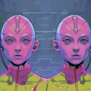
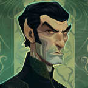

# Identity Crisis  

 
<b>Session started at 2024-04-23 / 04:10</b>
 
Fantasy Grounds - v4.5.6 ULTIMATE (2024-04-16) 
Fen's StarTrekAdventures Ruleset (v1.1.5)  
*[Prioritized Source: File; Other Sources: Vault]* 
*Core RPG ruleset (2024-04-16) for Fantasy Grounds
Copyright 2024 Smiteworks USA, LLC* 

>Captains Log, Stardate 61796.1: We have had to divert from our scheduled mission to the Sybo Nebula to investigate a potential Romulan incursion into Federation space. Commander Bachar is preparing a briefing on the situation, but all we know so far is that a Romulan vessel was detected in the Antov Gap a few hours ago.

Diplomatic relations between the Romulan Empire and the Federation have been stable since the end of the Dominion War. Hopefully my crew doesn't cause a diplomatic incident that leads to another Federation/Romulan war. I would definitely lose my command. 

**Commander Bachar:** Four hours ago, Federation sensors detected a Romulan vessel in the Antov Gap: 170 light years from the Neutral Zone. Based on the sensor logs they sent us, this is an odd one. 
**Commander Bachar:** The ship was not detected crossing the border, or travelling through any of the surrounding sectors. At the moment, Starfleet isn't sure whether this is a sensor glitch, or an actual incursion into Federation territory. 
**Commander Bachar:** I want everyone on their best behavior... 
*Commander Bachar looks at Murry and Zox* 
**Zox:** Yes Commander. 
**Commander Bachar:** You better not be covered in baby oil under that uniform, I don't want to your naked ass to start another intergalactic war 
**Skig:** Commander, if this is an incursion from a ship that is capable of significant cloaking abilities and modernized in any capacity, what are our orders? 
**Zox:** I'd think the Romulans would rather appreciate a naturalist, as there's no place to hide weapons. 
*Hailey Murry scoots away from Zox* 
**Zox:** Maybe that stark honesty just threatens them. 
**Skig:** Because the Lister is not going to fare well if we have to engage in combat against a Romulan Warbird. 
**Lt. Cmdrs 11 and 10:** Our analysis of the sensor records indicate a smaller vessel 
**Lt. Malat:** I agree with Skig, if it's a warbird looking for a fight, its going to paste us 
**Commander Bachar:** For now, our orders are to confirm if this is even a real incursion into Federation space 
**Commander Bachar:** And ask them nicely to leave 
**Commander Bachar:** If they blow us, that will be someone elses problem to deal with 
GM: blow us up* 
**Zox:** Why don't we have an inflatable Lister to send in? 
**Hailey Murry:** If we can nail the diplomacy, then we can hopefully avoid it being anyone else's problem 
**Hailey Murry:** Though the fact that the ship wasn't seen coming into the system is quite strange 
**Hailey Murry:** Do we have any theories? 
**Lt. Cmdr Viraseti:** Perhaps a new cloaking technology, traditional cloaking would have been detected by the tachyon grid along the Neutral Zone 
**Hailey Murry:** How was this one detected? 
**Lt. Cmdrs 11 and 10:** Based on these sensor logs, it simply appeared at its present location 
**Lt. Cmdrs 11 and 10:** No warp signature, no cloaking distortion detected. Highly unusual. 
**Hailey Murry:** How long has it been sitting there? 
**Commander Bachar:** Foru hours 
**Commander Bachar:** No signs of activity 
**Zox:** No heat, no gravimetric, no ladar, nothing? 
**Lt. Malat:** Maybe their fancy new cloak blew up in their faces 
**Zox: [ INSIGHT  (7) +  SCIENCE  (4)]
[Focus: Shipboard Tactical Systems ]
[Successes: 1] [Complications: 1]
Success with 0 momentum [2d20 = 27]** 
**Zox:** Hrm, well let's check the logs... 
**Skig:** Perhaps we should consider temporal or continuum displacement also. 
**Skig: [ INSIGHT  (8) +  SCIENCE  (3)]
[Successes: 1] [Complications: 0]
Success with 0 momentum [2d20 = 23]** 
**Lt. Cmdr Viraseti:** Possibly, although we aren't reading any chronoton emissions either 
*Skig , unlike Zox, does not determine that the Romulans have covered their cloaking system with a thick layer of fondant and cherries.* 
**Commander Bachar:** Whatever it is, we'll know soon enough. ETA is just a few minutes out. Captain, should we return to our stations? 
**Captain Baras:** Oh yes, of course 
**Zox:** Perhaps one of those mysterious dimensional deities has given their captain a moral question that can only be resolved through a contrived sequence of events. 
*Commander Bachar nudges the captain's shoulder* 
**Captain Baras:** Dismissed 
**Hailey Murry:** Is there anything of interest in the system?  
>The crew return to the bridge and the Twins pull up the Romulan ship on the viewscreen 

**Lt. Cmdr Viraseti:** Nothing of parcilar note. It is a standard G-type binary star, four bodies, none habitable 
**Lt. Cmdr Viraseti:** The last time it was surveyed was decades ago 
**Hailey Murry:** Well, I guess we should do a new survey sweep and update the records 
>As the viewscreen comes to life, the vessel that appears is clearly not a Romulan Warbird. It is much smaller in size, and lacking any apparent weaponry.  

>The vessel has no running lights visible, no sign of power, and is slowly tumbling through space nose-over-tail. 

*Zox softly wootles the tune of 'who could it be now'* 
**Commander Bachar:** Try hailing them 
**Captain Baras:** I doubt that will work ma'am, they've clearly lost power 
**Hailey Murry:** I think that's definitely a +1 for Malat's suggestion 
**Hailey Murry:** Can we do a scan of everything else in the system to see if they got zapped? That incident with the village that Zox destroyed has me a bit nervous 
**Commander Bachar:** Good idea 
**Zox: [ INSIGHT  (7) +  ENGINEERING  (4)]
[Focus: Shipboard Tactical Systems ]
[Successes: 3] [Complications: 0]
Success with 2 momentum [2d20 = 9]** 
**Geret:** Q1: Is their reactor core in tact, or jettisoned for safety reasons 
**Hailey Murry: [ INSIGHT  (12) +  ENGINEERING  (2)]
[Successes: 1] [Complications: 0]
Success with 0 momentum [d20 = 13]** 
**Zox:** Sensors indicate a crew of 8 Romulans on board. 
**Zox:** ...with an intact singularity engine and slight hull damage. 
**Hailey Murry: [ INSIGHT  (12) +  MEDICINE  (3)]
[Focus: Psychology ]
[Successes: 1] [Complications: 0]
Success with 0 momentum [2d20 = 25]** 
**Skig:** If they are tumbling without power, have they lost gravity? What are the bio-signs of the crew? 
**Zox:** 8 Romulan bio-signatures. 
**Zox:** Emergency systems are active, reading gravity normal. 
**Commander Bachar:** Then I think we'd better get over there 
**Skig:** I recommend we stop its movement and rotation with a tractor and beam over an away team to ascertain the situation. 
**Commander Bachar:** I agree captain 
**Skig:** What is the status of life support? 
**Captain Baras:** Oh yes, of course. You'd better put together an away team. 
*Skig looks at Bachar.* 
**Skig:** I do not think you are authorized to promote me, Admiral Bachar. 
**Zox:** Life Support Emergency System ACTIVE 
**Zox:** Atmosphere can support all normal crew members 
indarien (Skig): (ignore that, I thought Bachar was responding to Skig) 
**Commander Bachar:** You'll get a chance to check out their life support yourself, I am not beaming into a powerless ship in deep space without an engineer 
**Zox: [ DARING  (12) +  SECURITY  (5)]
[Focus: Espionage ]
[Successes: 2] [Complications: 0]
Success with 1 momentum [2d20 = 24]** 
**Hailey Murry: [ REASON  (8) +  SCIENCE  (5)]
[Successes: 1] [Complications: 1]
Success with 0 momentum [2d20 = 22]** 
**Hailey Murry: [ DARING  (10) +  SCIENCE  (5)]
[Focus: Morphogenic Matrices ]
[Successes: 1] [Complications: 0]
Success with 0 momentum [2d20 = 31]** 
**Kolea: [ DARING  (9) +  MEDICINE  (4)]
[Focus: Xeno-biology ]
[Successes: 0] [Complications: 0]
Failed on DC: 1 [d20 = 18]** 
Masakari (Zox): 'High Rollers Club' 
Masakari (Zox): Throk Roleplaying as Alf 
**Ishemok: [ DARING  (10) +  SCIENCE  (2)]
[Successes: 0] [Complications: 1]
Failed on DC: 1 [2d20 = 37]** 
**Kolea:** You did say you wanted that with green tea and sugar cubes, right? 
*Kolea looks confused.* 
*Kolea hands Murray a hot cup of green tea with some sugar cubes set to one side on a cute little saucer.* 
**Geret: [ DARING  (10) +  SCIENCE  (5)]
[Successes: 2] [Complications: 0]
Success with 1 momentum [3d20 = 33]** 
**Geret:  [d20 = 16]** 
**Zox:** An away team!? This sounds like fun! 
**Commander Bachar:** ./w Zox We will have a chance to resolve that a little bit later in the episode 
>INTERIOR - Transporter Room 3: Commander Bachar assembles an away team of Zox, Skig, Murry, Viraseti and herself and the team start getting their gear prepared for transport. 

*Zox counts his scars before he goes collecting again.* 
**Commander Bachar:** Remember: we are theoretically still at peace with the Romulans, so let's not do anything crazy. 
*Commander Bachar narrows her eyes at Zox while she puts on her tricorder* 
**Commander Bachar:** Energize 
**Zox:  [d20 = 2]** 
**Hailey Murry:  [d20 = 14]** 
**Skig:  [d20 = 11]** 
**Zox:  [d20 = 4]** 
**Hailey Murry:  [d20 = 20]** 
Masakari (Zox): 'I don't want to roll dice, I want to launch torpedos at characters' 
>The away team materialized on the Romulan ship and looks around, a number of Romulans are busy working on maintenance panels and consoles. They stop and turn when the hear the transporter, and regard the away team with suspiscion 

**Zox:** You seem to be having some trouble out here, any chance you all need some help? 
**Hailey Murry: [  INSIGHT (12) +  CONN  (2)]
[Successes: 2] [Complications: 0]
Success with 1 momentum [2d20 = 9]** 
**Zox:** Wait, what the... 
**Zox: [ INS(7) + CON (3)]
[Successes: 1] [Complications: 0]
Success with 0 momentum [2d20 = 24]** 
**Skig: [ INS(8) + CON (1)]
[Successes: 1] [Complications: 0]
Success with 0 momentum [2d20 = 25]** 
**Zox:** Viraseti, what the hell is going on 
*Zox begins making strange nasal noises* 
**Skig:** I am not... wait, do I have a beard? 
*Lt. Cmdr Viraseti grabs her big, bushy beard with a look of concern and confusion* 
**Lt. Cmdr Viraseti:** <strained human wootling> 
**Commander Bachar:** Well then 
>♫♫♫Mysterious Music Sting♫♫♫ 

>---------CUT TO CREDITS-------
♫♫♫Opening Theme♫♫♫ 

>Episode 12: Identity Crisis
Written by Leon Berger
Directed by Katka Lester 

**Zox:** Ok, for now we put a pin in this 
**Zox:** I am disgusted and mortified to be in this body, but for now let's just avoid using the transporters 
*Commander Bachar wootles in frustration* 
**Zox:** We came here to offer assistance, and we still have a duty notwithstanding what bodies we are in 
**Lt. Cmdr Viraseti:** We come in peace; your vessel appears to be in distress and we offer the Federations best engineers to hep! 
**Romulan Officer:** You seem to be having issues of your own, but your offer is appreciated 
**Hailey Murry:** Transporter malfunction. I will fix it when I get back. What seems to be the issue here? 
**Hailey Murry:** Also, why do I feel like I'm carrying lizard babies? 
*Skig looks angrily at Zox.* 
**Subcommander Tekal:** I an Subcommander Tekal, I am the commander of this vessel 
**Commander Bachar:** Psychosomatic. Likely a placebo effect based on your expectations or wants 
**Lt. Cmdr Viraseti:** Well I did not expect this today, but neither woud I have expected to just see a vessel appear out of no where? 
**Zox:** I am commander Bachar of the Starfleet vessel Lister, this is my team 
**Lt. Cmdr Viraseti:** <admires her now softer, elegant hands> 
**Zox:** Don't mind the rank insignia, minor transporter issue 
*Commander Bachar turns to Skig/Viraseti* 
**Zox:** Skig, you can fix this, right? 
**Hailey Murry:** I would need to know what the problem is, but likely yes. 
**Hailey Murry:** Subcommander, what seems to be the issue? 
**Subcommander Tekal:** You appear to be in the wrong bodies 
**Commander Bachar:** Well, that is our issue at least 
**Hailey Murry:** Yes, that is our problem, but what is the technical problem with your vessel? 
**Subcommander Tekal:** That is difficult to explain simply 
**Subcommander Tekal:** Are we now in Federation space? 
**Hailey Murry:** Yes 
**Subcommander Tekal:** Hmm, odd 
**Hailey Murry: [  REASON (8) +  ENGINEERING  (5)]
[Successes: 1] [Complications: 1]
Success with 0 momentum [2d20 = 23]** 
**Lt. Cmdr Viraseti:** Yes indeed, you are indeed in Federation Space, far away from the Neutral Zone. 
**Lt. Cmdr Viraseti:** seems to play with her hair a bit much like she had <never felt it before> 
**Subcommander Tekal:** We were conducting a survey in Romulan space when we detected some odd gravitational readings. Our computer flagged them as possibly related to a previously documented but as-yet unstudied anomoly known as "Mek'an's Folly" 
**Lt. Cmdr Viraseti:** <seems to play with her hair a bit much like she had never felt it before> 
**Subcommander Tekal:** We proceeded to investigate and take scans of the phenomenon, but the phenomenon began to affect the ship and things deteriorated rapidly 
**Lt. Cmdr Viraseti:** Have the mysterious readings dissapated at all? 
**Dr. V'Lora:** They come and go. Hi, I'm Dr. V'Lora, research lead here on the Chatara 
*Dr. V'Lora shakes "Viraseti"'s hand eagerly* 
**Hailey Murry:** What prompted you to lose power? 
**Dr. V'Lora:** It was absolutely fascinating, the objects appear without warning in space. They undergo continous compositional and topological flux, and are so far unidentified 
**Hailey Murry:** Also, do you have any Romulan Ale on board? My throat is parched and I'm horrifically alcoholish in thish body. 
*Skig looks around for "Murry".* 
**Dr. V'Lora:** But then one of them hit the singularity core and seemed to get stuck on its spacial curvature 
**Hailey Murry:** What is your normal BAC? I think it might be getting under your normal threshold. 
**Dr. V'Lora:** Just incredible, I have been down in engineering taking readings for hours. Subcommander: do you realize we could be the first to thouroughly document an entirely unique form of spatial anomoly? 
**Hailey Murry:** Like are we talking .5 or so, I want to make sure I take good care of this flammable sack. 
**Zox:** Skig, no drinking on duty 
**Commander Bachar:** I'd recommend not drinking on the job, Skig, unless you want to embarrass yourself 
**Hailey Murry:** Sorry, just trying to maintain physical coherency in this form, I need to make sure the hands do not start shaking uncontrollably. 
**Subcommander Tekal:** We have some Romulan ale in the mess 
**Lt. Cmdr Viraseti:** That is fascinating Dr. However, I surmise that if you transport out of this vessel without addressing the distortion of curvature, you too will be scrombled as we are. 
**Dr. V'Lora:** Oh I seriously doubt that, if your transporter confinement beam got tangled up in the spatial distortion from our singularity core, your atoms would be spread across the next light year of space 
**Zox:** For now, let's assume the transporters are unreliable. Skig, can you have someone on your team run a diagnostic? 
**Zox:** If we have a problem with the transporters, we should rule out our own equipment before we worry about spatial anomolies 
**Hailey Murry:** Excellent. In any case... did you lose power when the signularity struck the curvature or when the Chatara exited from the singularity into Federation space? 
*Skig connects back to the Lister.* 
**Dr. V'Lora:** Oh, it was incredible. One of the objects appeared in engineering around the singularity, all of a sudden the ship was thrown violently through space. Our sensor readings were gibberish, no stellar fix, no nav data, nothing. 
**Hailey Murry:** T'Kor, I need you to run a level 1 full diagnostic on the transporters, we had a transporter accident and need to verify if there is an issue with the system or this was caused by proximity to the spatial anamoly. 
**Dr. V'Lora:** We had no idea where we were, and the more we tried to go to warp the worse it got. I cut all the power feeds and then we came to a stop. 
**Hailey Murry:** Also, verify that the Romulan ship is still held by our tractor beam. 
**Lt. Cmdr Viraseti:** That's a miracle you ended up anywhere recognizable.  
**Subcommander Tekal:** Forgive the young Dr for her enthusiasm, she does not know when to shut up. 
**Hailey Murry:** So the powerless state on your ship is self-inflicted and you can restore power easily once you determine the impact the anamoly is having on your system? 
**Hailey Murry:** looks at Tekal with one of those, "Oh, you have one of those in your crew also" looks? 
*Skig looks at Tekal with one of those, "Oh, you have one of those in your crew also" looks?* 
**Subcommander Tekal:** Hopefully, as long as Dr V'Lora did no permanent damage in her zeal to cut power 
**Dr. V'Lora:** We can't restore power until we un-stick this thing from our singularity drive 
**Dr. V'Lora:** Unless we want to be flung out of the known galaxy! 
*Dr. V'Lora giggles* 
**Lt. Cmdr Viraseti:** May we....see this anomaly? 
**Skig:** I'd like to take a look at this thing as well 
**Hailey Murry:** Subcommander, I would be happy to check your engineering relays and power systems to verify they can be restored at will when it is determined to be safe. 
>Dr. V'Lora giddily leads the away team to the engine room. It is a short walk, as the ship is quite small boasting only a handful of labs and research areas, and a crew quarters area. 

**Lt. Cmdr Viraseti:** <appears disoriented, unable to smell or hear anything> 
>In engineering, Dr. V'Lora opens the hatch to the singularity drive core, instead of the hot white glow of antimatter falling into the singularity, you see a large pulsating mass of brownish-gray matter. It's shape and size are fluctuating from one moment to the next, occasionally a second or third small object will appear near the first, rapidly fluctuate in shape and size, and either merge into the main one or dissapear 

**Dr. V'Lora:** Beatutiful, ins't it 
**Dr. V'Lora:** So far, we have had no luck in identifying it 
**Dr. V'Lora:** It's physical properties are in a constant state of flux. 
Masakari (Zox): Vulcans said EFF emotions as it lead to very naughty things. 
**Lt. Cmdr Viraseti:** Could this be....alive? 
**Dr. V'Lora:** It is possible, it is cleraly well outside any understood and documented phenomenon 
**Lt. Cmdr Viraseti:** Hrm. Have you established if it is consuming antimatter? 
**Lt. Cmdr Viraseti:** thus depeleting the singularity? 
**Subcommander Tekal:** We are unable to assess what is happening inside it 
**Dr. V'Lora:** I doubt it would interract with the antimatter at all, in order for antimatter to anihilate with ordinary matter it needs to interact with its own anti-particle 
**Dr. V'Lora:** But this object is made of completely different... stuff 
**Hailey Murry:** Subcommander, do I have your permission to perform an engineering check of your power systems and relays to ensure they are capable of being powered back on safely once the issue with the singularity core is resolved? 
**Dr. V'Lora:** It doesn't correspond to any of the known degrees of freedom of ordinary matter fields 
**Subcommander Tekal:** Please do, this is a research vessel so our own engineering capability is limited 
**Hailey Murry: [  CONTROL (8) +  ENGINEERING  (5)]
[Successes: 1] [Complications: 0]
Success with 0 momentum [2d20 = 21]** 
*Skig makes a note that the Romulans are being suspiciously open and unguarded in their behaviors.* 
**Skig: [ REA(10) + SCI (5)]
[Successes: 1] [Complications: 1]
Success with 0 momentum [2d20 = 35]** 
**Skig:** It is highly unusual, but... this beard is so itchy.... 
**Skig:** Commander, can I shave this beard? 
**Skig:** I cannot concentrate 
**Hailey Murry:** The beard will SHED if you keep tugging at it. 
*Lt. Cmdr Viraseti makes a disgusted face* 
**Hailey Murry:** Then you will end up with small bristly fibers in all sorts of inconvenient sensitive electronics. 
**Hailey Murry:** I mean, you can shave it off. It grows at a rate of 3mm/day. 
**Zox:** I need to go brief the captain, let him know our situation. Skig, see what you can do here.  
**Hailey Murry:** Yes ma'am 
*Commander Bachar heads off to an unoccupied conference room to hail the captain* 
**Lt. Cmdr Viraseti:** Hrm. What if the captain doesn't believe Zox? 
**Hailey Murry:** Okay, Viraseti and Murry, whichever of you is which body, work with Dr V'lora to determine what we can about the Singularity. If needed patch into the Lister's Modular Laboratories, configured for Quantum Gravitational Theory, and provide analysis back to the teams on the Lister. 
**Skig:** Aye Ma'am 
**Commander Bachar:** Sounds good! 
**Hailey Murry:** I will work on the verifying and maintaining the engineering systems. 
**Skig:** I'll get a data link set up 
**Hailey Murry:** Zox, don't do anything that results in greivous injury to the body you are currently inhabiting. 
**Lt. Cmdr Viraseti:** I couldn't if I tried, it's all soft and strange... 
>Suddenly, a new object appears near the entrance to engineering. It is similar in appearance to the one on the singularity core, but it quickly grows in size before splitting into two separate objects. The two new objects move apart, changing in shape before both shrink down smaller and pop out of existence again. Numerous other similar looking objects continue to pop into and out of existence for a few minutes, changing shape and size, sometimes merging together and sometimes splitting apart.  

**Hailey Murry:** That has NEVER stopped you before. 
*Dr. V'Lora runs over with her hand scanner to take readings of the objects* 
**Skig:** That is highly unusual  
*Skig prays to whatever Tellerite Deity exists that Zox does not try fighting them in hand-to-hand combat just for "Funsies".* 
*Skig while checking the engineering console, scans for any power irregularities or abnormalities that would impact ship board operations or indicate a pattern or "scanning" like behavior of their appearance and disappearance.* 
**Hailey Murry: [  DARING (10) +  ENGINEERING  (5)]
[Successes: 1] [Complications: 1]
Success with 0 momentum [2d20 = 46]** 
**Hailey Murry: [  DARING (10) +  ENGINEERING  (5)]
[Successes: 1] [Complications: 0]
Success with 0 momentum [2d20 = 45]** 
**Skig: [ REA(10) + SCI (5)]
[Successes: 1] [Complications: 0]
Success with 0 momentum [2d20 = 30]** 
**Skig:** It does defy analysis, whatever it is.  
**Lt. Cmdr Viraseti:** How hard would it be to create another synthetic singularity? They seem quite enthralled with it! 
**Hailey Murry: [  DARING (10) +  SECURITY  (3)]
[Successes: 2] [Complications: 0]
Success with 1 momentum [2d20 = 23]** 
**Kolea: [ REASON  (9) +  MEDICINE  (4)]
[Focus: Xeno-biology ]
[Successes: 0] [Complications: 0]
Failed on DC: 1 [2d20 = 33]** 
**Dr. V'Lora:** Oh it is quite easy to do at an appropriately equipped Romulan shipyard, but quite impossible to do here 
**Skig:** It may not be attracted to the singularity, it could be stuck on it 
**Skig:** Whatever these things are, they do have mass 
**Skig:** Which means if nothing else, they do interact with gravity 
**Hailey Murry:** It's a bug zapper, like the Helldivers 2 Tesla Tower! 
**Lt. Cmdr Viraseti:** I wonder if these things are interfering with our delta brain waves, hold on team.... 
**Lt. Cmdr Viraseti:** <furiously uses a tricorder, making it beep and look cool> 
*Commander Bachar comes back from the conference room.* 
**Zox:** I lost comms with the Captain 
*Skig heads back into Engineering.* 
**Hailey Murry:** I lost connection to the Lister entirely. 
**Lt. Cmdr Viraseti:** Oh no! 
**Subcommander Tekal:** Hmm, I may have an explanation for you 
*Subcommander Tekal pulls up a sensor record on a display console from just a few moments ago* 
*Skig pauses at the doorway and waits carefully for the cliffhanger.* 

>On the screen, you can see the Lister hanging in space nearby. Suddenly, she turns off her tractor beam, turns and jumps to warp. 

>♫♫♫Ominous Music Sting♫♫♫ 

# Identity Crisis (Part 2) 

 
<b>Session started at 2024-05-21 / 04:17</b>
 
Fantasy Grounds - v4.5.7 ULTIMATE (2024-05-02) 
Fen's StarTrekAdventures Ruleset (v1.1.5)  
*[Prioritized Source: File; Other Sources: Vault]* 
*Core RPG ruleset (2024-05-07) for Fantasy Grounds
Copyright 2024 Smiteworks USA, LLC* 

>INTERIOR - Transporter Room 3: T'Kor is on his hands and knees and knees under the transporter pad, engrossed in his thourough diagnostic, when he feels the ship jump to warp. Throk does not seem to notice as he is busy tearing the panels off the conduit channels to give T'Kor clear access. 

**Gra'lan:** So tell me, can you weld with those fingers of yours? Sounds darn convenient 
**T'kor:** Hmmm, we appear to have jumped to warp, without recovering our crew. Gra'lan, can you take a look in the other teleport chambers to make sure?  
**T'kor:** This will make reporting back to Skig a little more difficult 
**Gra'lan: [ INSIGHT  (10) +  SECURITY  (2)]
[Successes: 0] [Complications: 0]
Failed on DC: 1 [2d20 = 35]** 
*Gra'lan runs into a wall before completing T'kor's request, then readjusting his glasses in a dignified manner.* 
**T'kor: [ REASON  (9) +  ENGINEERING  (4)]
[Successes: 1] [Complications: 1]
Success with 0 momentum [2d20 = 31]** 
**Gra'lan:** No lifeform has beamed out, no. 
**Gra'lan:** Very little radiation. Makes me uneasy truth be told. 
*Throk neatly stacks the paneling from the walls into the middle of the room, revealing all of the wiring and internal circuitry of the Lister's transporter room.* 
*Throk chews on some Asbestos insulation that is marked, "Only Edible By Gorn"* 
**Throk:** This go very good with tribble syrup. 
**Gra'lan:** Does that enhance your gizzard performance against really spicy meals? 
**Throk:** Throk think so. 
**T'kor:** I want to look into this a bit more closely here, but I think we should figure out why we jumped to Warp again.  
**Throk:** Talky insect man who is my personal BBQ unit makes good point. 
>Lt. Malat bursts into the room, hair wet, still fiddling with her uniform collar 

*Throk looks at her strangely.* 
**T'kor:** Oh, excellent, Lt Malat 
**T'kor:** You look moist 
**Lt. Malat:** I was in the sonic shower when I felt the ship go to warp, did the away team beam back? 
**Throk:** Why are you moist in sonic shower? 
**Throk:** Sonic shower does not use water. 
*Throk sniffs.* 
**Gra'lan:** Nope. We just marooned them no doubt. At least that what the sensors say. 
**Throk:** You smell of very nice perfume. 
**Lt. Malat:** What? Yes it does, have you... never used the shower? 
**T'kor:** No they did not, which I suspect means something has happened upstairs. I think we must be wary of our commanding officers 
**Throk:** Throk room not have shower. Can Throk use yours? 
**Lt. Malat:** he captain relieved me 40 minutes before the end of my shift, I went to my quarters to shower and change 
**Throk:** Throk room have large tank for boiling think in hot pot. 
**Lt. Malat:** No, requisition a shower for your quarters 
**Lt. Malat:** Why does Skig allow crew to be assigned to quarters without showers 
**Gra'lan:** Efficiency. 
indarien (Throk): Someday... Malat may realize what Throk meant... 
**T'kor:** I do not require a shower 
**Throk:** Talky BBQ unit make for great steam boil with shower! 
**T'kor:** The idea that you simply do not incorporate the minerals that gather on you into your being is a little unnerving, but less so than the fact that you constantly shed yourselves 
**Lt. Malat:** I don't know that I need details on how T'Kor cleans himself 
indarien (Throk): This is the point where I mention that Throk has a HIGHER insight than Skig.... and it actually is in character for both of them. 
**Gra'lan:** I bet I know how...lava soap! 
**Throk:** Throk suspect bad things™ happen. Throk wonder if now might be time where we mutiny ahd have to eat people to restore order. 
**Throk:** Throk write inspiring war poem. 
**Lt. Malat:** Truly fascinating, so I take it you know how the crew got body-swapped if you're spending your time speculating about T'Kor's showers? 
**Throk: [ INSIGHT  (9) +  COMMAND  (2)]
[Focus: Poetry ]
[Successes: 0] [Complications: 0]
Failed on DC: 1 [2d20 = 34]** 
**T'kor:** Yes, that's what I'm looking into now 
**Throk:** Does combustion and liver rhymbe? 
**T'kor:** Who are the commanding officers right now?  
**Gra'lan:** Um...We are still looking in to that; we can almost rule out a technical failure on our part.  
**T'kor:** Given who we're missing 
**Lt. Malat:** The Captain 
**Lt. Malat:** Last I checked, he still outranks the rest of us 
**T'kor:** And under that? 
**Lt. Malat:** Well, The Twins are next in command after Skig and Zox 
**T'kor:** Hm 
**Lt. Malat:** So they are acting first officer now 
**Gra'lan:** Eep. 
**Throk:** Throk also point out, medical officer can take command if captain deemed unfit for ingestion. 
**T'kor:** I think more importantly, whoever has the captain's ear is in charge. We should work to separate them and return, or figure out why we jumped.  
**Throk:** I mean Command, must remember, not on Gorn ship. 
**Throk:** Figure out why we jumped is easy. 
**T'kor:** I would like to continue working on this in the meantime, would you three like to go investigate the Captain?  
**Lt. Cmdrs 11 and 10 (Comms):** Lt. Malat, Ensign T'Kor, Ensign Throk, Ensign Ishemok. Please report to the briefing room. 
**Gra'lan: [ INSIGHT  (10) +  SECURITY  (2)]
[Focus: Shipboard Tactical Systems ]
[Successes: 2] [Complications: 0]
Success with 1 momentum [2d20 = 17]** 
**Throk:** Throk promoted! 
**Throk:** Happy Day! 
**Gra'lan:** Yes Commanders! 
**Gra'lan:** Oh wait... 
**Gra'lan:** Ah.. 
**T'kor:** We're on our way,  Commanders.  
**Throk:** As Zox is not here, Throk assume he must channel inner might Security Chef! 
**T'kor:** Gra'lan, can you continue investigating the teleporters? Here are the specs of what we found before, see what you can find.  
*Throk goes to replicator and gets a Phaser Type-1 and a large chef hat.* 
**Lt. Malat:** Ok, come on. Gra'lan see what you can figure out here 
**Gra'lan: [ REASON  (11) +  ENGINEERING  (4)]
[Focus: Shipboard Tactical Systems ]
[Successes: 2] [Complications: 0]
Success with 1 momentum [2d20 = 24]** 
**Ishemok:  [Total: 4] [Effects: 2] [4dChallenge = 4]** 
>Lt. Malat and the junior officers head to the turbolift and take it to the bridge, joining the captain, the twins and Dr. Zerra in the briefing room 

**Captain Baras:** Thank you for joining us, Ensigns T'Kor, Ishemok and Crewman Throk I have asked to join us as they are... somehow... the highest ranking members of their respective departments aboard the ship now, with the away team gone 
**Captain Baras:** I truly do not understand how Throk is on the crew manifest as "Assistant Counselor" but, Commander Bachar handled that usually 
**Captain Baras:** Regardless, I called a briefing to explain our recent jump to warp. 
**Throk:** Throk honored to help crew with culinary and psychological issues through meditative ingestion. 
*Throk listens patiently.* 
**Captain Baras:** Just a few minutes ago, I received a priority 1 emergency communique from Starfleet Command. I cannot share the details of the message, but we have been ordered to proceed without delay to Starbase 34. 
**Ishemok: [ INSIGHT  (9) +  COMMAND  (4)]
[Focus: Salesmanship ]
[Successes: 0] [Complications: 1]
Failed on DC: 1 [2d20 = 38]** 
*Throk tries to remember on the galactic map where Starbase 34 is relative to where we just left the smart people.* 
**T'kor: [ REASON  (9) +  CONN  (3)]
[Successes: 1] [Complications: 0]
Success with 0 momentum [2d20 = 17]** 
**Throk: [ REASON  (9) +  CONN  (3)]
[Successes: 1] [Complications: 0]
Success with 0 momentum [2d20 = 25]** 
**Ishemok:** We didn't have 5 minutes to pick up 5 officers? 
**Ishemok:** Why, it'd take a surprise Jem'Hadar attack on a helpless space station to warrant such erratic behavior! 
**Captain Baras:** Our orders were clear, we were to proceed without any delay 
**Captain Baras:** I cannot give you any more detail than that. 
**T'kor:** How should we best prepare for our arrival? 
**Throk:** Starbase 34 is 5 days away at warp 5, if there was a surprise attack, we would be there to eat the survivors. 
**Throk:** Rescue... I meant... re-sauce. 
**Throk:** No, rescue. 
**Throk:** Throk be quiet now. 
**Captain Baras:** Mr. T'kor. I'd like you to stop the transporter investigation and re-assign engineering resources to run a full system diagnostic before we arrive. I'd like to ensure we're in top shape 
**T'kor:** Should we have weapons at the ready for re-entry? 
**Captain Baras:** Mr. Throk, the crew will no doubt be unsure of the situation given our orders, I think it is important that we have someone acting as counselor to assure them that this is nothing to be concerned about 
**Ishemok:** Um? boss? Sumthin 'about this just doesn't add up. Why would we want to get into a scuffle witout our Security Chef? 
**Captain Baras:** Mr. Ishemok, as acting science officer, I'd like you to run a full level-5 diagnostic on the long-range sensors.  
**Ishemok: [ INSIGHT  (9) +  SCIENCE  (2)]
[Focus: Computers ]
[Successes: 2] [Complications: 0]
Success with 1 momentum [2d20 = 16]** 
**Throk: [ INSIGHT  (9) +  SECURITY  (4)]
[Focus: Animal Training ]
[Successes: 2] [Complications: 0]
Success with 1 momentum [2d20 = 17]** 
Masakari (Ishemok): (at least the 20 came back around) 
**Captain Baras:** Dismissed. 
GM: AFK for baby for a sec 
*Captain Baras stands up and leaves the room* 
**Throk:** Throk inspired by clear and decisive leadership! 
>The Twins nod and return to the bridge, and Dr. Zerra sits there for a few moments before looking around, standing up and heading back to the turbolift 

**Throk:** Throk write beautiful ballad to play over ship systems to keep crew thinking happy thoughts. 
**Throk: [ INSIGHT  (9) +  COMMAND  (2)]
[Focus: Poetry ]
[Successes: 2] [Complications: 0]
Success with 1 momentum [2d20 = 16]** 
*T'kor approaches Dr Zerra* 
**T'kor:** Dr Zerra, if I may have a word for a moment 
**Dr. Zerra:** Oh, yes of course 
**Throk: [ DARING  (9) +  SECURITY  (4)]
[Focus: Gorn-Fu ]
[Successes: 3] [Complications: 0]
Success with 2 momentum [2d20 = 14]** 
**Ishemok: [ DARING  (10) +  CONN  (4)]
[Focus: Criminal Connections ]
[Successes: 1] [Complications: 1]
Success with 0 momentum [2d20 = 30]** 
**Ishemok:  [d20 = 8]** 
**T'kor:** With regards to the body swaps: what are your thoughts toward the teleporter situation?   
**Dr. Zerra:** Oh, well I suppose the most likely place you could have an issue would be in the pattern linker. It must have gotten their physical and neural patterns mismatched 
**Dr. Zerra:** It's a pretty robust system though, certainly I've never heard of such an issue before 
**T'kor:** What will you be doing on our voyage? I noticed the captain didn't give you any specific orders.  
**T'kor:** Though perhaps those were provided before we arrived 
**Dr. Zerra:** Yes, I have to prepare sickbay for potential medical emergencies. We should be pretty busy I suppose 
**Dr. Zerra:** I guess I had better do that 
**T'kor: [ INSIGHT  (7) +  COMMAND  (2)]
[Successes: 1] [Complications: 0]
Success with 0 momentum [2d20 = 20]** 
**T'kor:** Is everything okay, doctor? 
**Dr. Zerra:** Oh yes, just have a lot to do, of course 
**Dr. Zerra:** I should be going 
*Dr. Zerra nods to T'Kor and leaves* 
**Throk:** Captain seem very decisive and in-charge, very authoritative and not in need of retirement through ingestion. 
**Throk:** Throk find this very suspicious. 
*Throk sniffs Malat.* 
**Throk:** You still smell nice. 
**T'kor:** This could be the result of the captain having strict orders 
**Lt. Malat:** Don't smell me 
**T'kor:** Or the result of the captain having used the transporter to switch minds with one of the Twins 
**Throk:** Can I pat on head? You are short. 
**Lt. Malat:** Or he could just be having a good day, sometimes it's like that with cognitive decline 
**Throk:** That curious T'Kor, can we check Transporter logs? 
**Lt. Malat:** That's a... problematic thought 
**Throk:** Throk go to check Transporter Logs. 
*Throk leaves.* 
**T'kor:** We're going to have to investigate the usages of the teleporters here, sooner rather than later. There are logs for these things, both primary and secondary.  
*Throk looks for large trees to tear the bark from.* 
**Throk: [ FITNESS  (10) +  CONN  (3)]
[Focus: Gorn-Fu ]
[Successes: 1] [Complications: 0]
Success with 0 momentum [2d20 = 25]** 
**Throk:** Throk familiar with Transporter Logs, you knock down large tree, remove bark, send downriver as transport to where they can be processed. Throk see this on old holovids. 
**Ishemok:** Didn't they mark the trees to sort out who owns which? Would be awfully....convenient, if there was some way to do that with transporter signals. 
**Ishemok:** Is there some way to look at the actual physical signal rather than the computer records to find out what's been going on? 
**Ishemok:** I wish we had the real Science Officer here. 
*Throk returns chewing on a large piece of replicated bark.* 
**Lt. Malat:** I like your thinking, we can't really trust the computers if we suspect the twins 
**T'kor:** We can't trust the software, at least 
**T'kor: [ REASON  (9) +  ENGINEERING  (4)]
[Successes: 0] [Complications: 0]
Failed on DC: 1 [2d20 = 33]** 
**Throk:** Throk happen to know that in sub-deck four, all logs are stored on ancient reel-to-reel tape running on 16-bit mainframe with vaccuum tubes. Skig left it installed from original Lister deployment. All logs auto stored there for period of 48 hours, then deposited into disposal unit and new ones get replicated. 
**Throk:** It is unlikely that binary based creatures capable of handling such archaic technology, if they even know it exists. 
**Throk:** Or maybe Throk hallucinate that while eating too many Tribbles. 
*Throk shrugs.* 
**Ishemok:** Quick, someone get Gra'lan to check the device! 
Masakari (Ishemok): punchcards, magnetic tape, etc.. the whole thing. 
Masakari (Ishemok): 'The only way to keep reliable records duirng extreme anomalies and interstellar combat' 
Masakari (Ishemok): 'Time and light may bend, but punchcards wont'' 
**Throk:** Skig not let Throk into secret punch card room after Throk discover punch cards taste like glue. 
*Throk gets out toothpick and chews pops out what looks like some human finger bones.* 
**Throk:** Throk find transporter logs also, but not from reel-to-reel tape system. 
*Throk hands over paper copies of printed transporter logs.* 
**Throk:** Throk also notice 14675 is missing. 
**Throk:** Throk not eat that one, by the way. 
**T'kor:** Open your mouth please 
**Lt. Malat:** I don't see how he could eat a computerized record 
*Throk distends lower jaw so he can swallow a redshirt whole.* 
**Lt. Malat:** But yeah, maybe you should get those tape backups instead, I don't want to have to fish them out of Throk's intestines 
**Throk:** Excellent idea, nice smelling short angry woman. 
**T'kor:** Also, I'd like to comment that Dr Zerra was acting very nervous. I suspect he may be blackmailed or otherwise guilty of something uncomfortable, but not necessarily related to this 
**Throk:** Dr Zerra could also just be injecting some sort of hyperstimulant into the Captain to make him more functional at the expense of killing him. Like Gorn Super soldiier drug that makes Gorn capable of throwing shuttlecraft but then their heart explodes. 
**Throk:** Throk think it taste like chocolate and put it as topping on food for entire squad before battle with Klingon army. Throk sent here as sign of appreciation by Gorn High Command. 
**Lt. Malat:** Well we can't do a mutiny based on some suspicious behavior, so we need to be 100% certain before we do anything that will get us all court martialed 
**T'kor: [ REASON  (9) +  MEDICINE  (2)]
[Focus: Neuroscience ]
[Successes: 2] [Complications: 0]
Success with 1 momentum [2d20 = 19]** 
**Throk:** I thought short angry woman who smells nice is okay with adding more demerits to rap sheet. Commendations currently up by 3 over disciplinary actions according to file. 
**Throk:** Okay, Throk have idea. Throk think Twins should have their pet dog check up on the twins' behavior. 
Masakari (Ishemok): 'There are no sane, non-violent counselors' 
**Lt. Malat:** Ok, we know what we need to do. Meet back up in the crew lounge tomorrow morning before day shift  
**Lt. Malat:** Dismissed 
indarien (Throk): Who knew Deanna Troi was actually a genocidal psycopath? 
>♫♫♫Mysterious Music Sting♫♫♫ 

>---------CUT TO COMMERCIAL------- 

>INTERIOR - Romulan Vessel: The away team and the Romulan crew have been hard at work looking for clues to their current predicament. 

**Skig: [ REA(10) + SCI (5)]
[Successes: 1] [Complications: 0]
Success with 0 momentum [2d20 = 29]** 
**Hailey Murry: [  CONTROL (8) +  SECURITY  (3)]
[Successes: 1] [Complications: 0]
Success with 0 momentum [2d20 = 23]** 
**Ishemok:** What marvellous creatures... 
**Hailey Murry: [  REASON (8) +  ENGINEERING  (5)]
[Successes: 2] [Complications: 0]
Success with 1 momentum [2d20 = 19]** 
**Hailey Murry:** I have restored the ship's emergency power systems, so we should have access to the computer systems and laboratories without endangering the singularity core. 
**Skig:** Yes, thank you Commander. Dr. V'Lora and I have been taking readings of the anomalies with the internal sensors every since you brought them back online, they are giving us very strange readines 
**Hailey Murry:** Also, I have come to realize this slight bulge around my waist is not that I am pregnant with Zox's childrne, but I am suffering from a distended liver. 
**Hailey Murry:** Murry, have you considered cutting back? 
**Skig:** What is interesting is that the object's mass does not match its effect on the local stress energy tensor 
**Skig:** There is some missing rest energy that I cannot explain 
**Skig:** It starts to have a gravitation effect on the energy tensor just befopre it appears, and continues to have an effect just after it vanishes 
**Skig:** And for some reason, the stress-energy tensor reading is always a bit more than it should be, given the mass 
**Skig:** I've never seen anything quite like it 
**Hailey Murry:** Does this include the stray globules that appear and disappear as an explanation of the missing mass? 
**Skig:** This is the total mass, including any non-attached chunks 
**Skig:** It still isn't enough to explain the tensor deflection 
*Skig shudders.* 
**Hailey Murry:** Did anyone else feel a great disturbance in the force, as if the entire crew of the Lister just found out that Throk was now the ship's counselor? Anybody? No? Just me then? Probably just the alcohol talking then. 
**Zox:** I doubt anything good is happening on the Lister right now, but not much we can do about that 
**Hailey Murry:** I mean, what if it gets normalized that I have to eat crew? 
**Zox:** We need to focus on our current situation and hope that things don't get too out of hand there 
*Skig shakes.* 
**Hailey Murry:** Good thing I'm actually the chief engineer, we need to get this fixed, I agree. 
**Zox:** Do we have any theories about what these things are? 
**Lt. Cmdr Viraseti:** Imagine if you will, a being stuck somewhere between energy and mass.... 
**Hailey Murry:** Well, we can try setting up a spectrum scanner to see if there is some sort of repeatable pattern on the theory *they* - if *they* are actually a creature and sentient, are trying to communicate with us. 
**Hailey Murry:** We have encountered energy beings before, perhaps we can look for patterns. 
**Zox:** Good thinking, see what you can put together 
**Hailey Murry:** But I will accept other ideas that might get a result faster. 
**Lt. Cmdr Viraseti:** Methinks they just want to balance between waves and particles.  
**Hailey Murry:** So finding equilibrium in their existence, which is somehow thrown off by the singularity's existence? 
**Hailey Murry:** Do you suppose there might be a way to split them from the singularity if it is causing "interference" for lack of better terms? 
**Lt. Cmdr Viraseti:** Either that or they are shifted half into subspace which accounts for them losing more mass as they gain more energy.... 
**Skig: [ REA(10) + SCI (5)]
[Successes: 0] [Complications: 0]
Failed on DC: 1 [2d20 = 36]** 
**Skig: [ REA(10) + SCI (5)]
[Successes: 1] [Complications: 0]
Success with 0 momentum [2d20 = 22]** 
**Skig: [ REA(10) + SCI (5)]
[Successes: 2] [Complications: 0]
Success with 1 momentum [2d20 = 12]** 
**Skig:** Well, if Zox's theory is correct and they are somehow changing between fermionic and bosonic states, that would be unlikely any previously encountered state of matter 
**Skig:** I have no way of predicting how it would respond to various interventions in that scenario 
**Skig:** We would have to probe it and take readings  
**Lt. Cmdr Viraseti:** Im not sure you can....Effectively, only the singularity has much reality to them? 
**Zox:** No, they do bump into things when they appear 
**Zox:** We have seen them dent walls, knock over PADDs and coffe cups 
**Zox:** They are physically... real, for lack of a better word 
**Lt. Cmdr Viraseti:** What if they only collide with objects at rest, relative to them? 
**Hailey Murry:** So wait... these are extradimensional cats? 
*Skig gets cup of hot coffee and sits it dangerously close to edge of a table to wait and see if one of the entities spawns next to it and knocks it over.* 
**Lt. Cmdr Viraseti:** That is apt yes. They only manifest for the singularity we are feeding them, then they will pretend like we do not exist. 
**Zox:** Well we need to figure them out quickly, so let's test Zox's idea 
**Zox:** Give it a poke in the EM and electro-weak fields and see if it's mass responds 
**Hailey Murry:** Okay 
**Lt. Cmdr Viraseti:** YES! exactly that; use gravity to bend light, and see if blue shifted light can push on them, and red shifted light can pull on them! 
**Hailey Murry: [  CONTROL (8) +  ENGINEERING  (5)]
[Successes: 3] [Complications: 0]
Success with 2 momentum [2d20 = 16]** 
**Skig: [ REA(10) + SCI (5)]
[Successes: 1] [Complications: 0]
Success with 0 momentum [2d20 = 30]** 
>The crew take stations, Skig puts together a makeshift spectral analyzer for all known forms of radiation, while Viraseti and Dr. V'Lora connect to it to take readings. Then Zox carefully probes the entity surrounding the core... 

>It does seem to respond to the probing, and Viraseti is nodding along at the readings. Until suddenly, the ship lurches violently 

**Hailey Murry: [  FITNESS (7) +  CONN  (2)]
[Successes: 2] [Complications: 0]
Success with 1 momentum [2d20 = 15]** 
>The entity begins to oscillate, and rapidly change size and shape, as the ship is violently tossed about and the crew slam into the walls and consoles 

**Lt. Cmdr Viraseti:** Very softly, very precisely, what can they react to... 
**Skig: [ FIT(10) + CON (1)]
[Successes: 2] [Complications: 0]
Success with 1 momentum [2d20 = 12]** 
>Zox adjusts the probing parameters and the entity continues to thrash around, this time there is also a strange sound like finger-nails on a chalkboard. 

*Skig activates the magentic boots she is wearing.... and then realizes that is not the body she is currently inhabiting.* 
**Skig:** These readings are incredible, whatever you're doing it's certainly getting a response. Keep at it Commander 
**Hailey Murry:  [Total: 6] [Effects: 2] [5dChallenge = 6]** 
**Hailey Murry:  [Total: 8] [Effects: 1] [5dChallenge = 8]** 
**Skig:** This is fascinating... 
>As Zox continues probing the anomaly, a loud groaning is finally heard as the entire crew is again violently thrown to the floors, and the power flickers out. 

**Hailey Murry:** I just fixed all those relays! 
>As they stand back up, Subcommander Tekal steps out from the bridge 

**Subcommander Tekal:** I do not know what you have done here, but it has had an unfortunate consequence it seems 
**Skig:** You can worry about that, we have reems and reems of data on this thing 
**Lt. Cmdr Viraseti:** We are somewhere else in space, and some when else in time? 
**Skig:** It is going to take hours to analyze it 
**Subcommander Tekal:** Indeed, the navigational computer can no longer identify our location through a stellar nav fix 
**Subcommander Tekal:** Wherever we are, the stars are unknown 
**Commander Bachar:** Was this the same sort of incident that left you in Federation space?  
>♫♫♫Ominous Music Sting♫♫♫ 

>---------CUT TO COMMERCIAL------- 

# Identity Crisis (Part 3) 

 
<b>Session started at 2024-06-11 / 04:10</b>
 
Fantasy Grounds - v4.5.8 ULTIMATE (2024-06-05) 
Fen's StarTrekAdventures Ruleset (v1.1.5)  
*[Prioritized Source: File; Other Sources: Vault]* 
*Core RPG ruleset (2024-06-04) for Fantasy Grounds

>First Officer's log, Stardate 61797.4: I haven't seen Skig for the past hour, we can just hear her crawling Murry's body around through the maintenance hatches and muttering about Zox and Viraseti. In the meantime, Viraseti and Dr. V'Lora have been locked in an office reviewing the data they gathered with Zox. I have been in the bridge, and so far we are completely unable to determine our location, or the bearing to the Lister.

>And as if all that wasn't bad enough, the Voth sense of smell is incredibly sensitive. I always thought Zox was full of shit when he would sniff the air. But this is a small, crowded ship, and the air filtration has been running in low power mode for hours...

>So: situation normal I suppose. 

>INTERIOR - Romulan Vessel: As main power flickers back online, Skig slithers out of a maintenance hatch as Lt. Commander Viraseti calls the crew together to share the findings that she and Dr. V'Lora have been working on. 

Masakari (Zox): New an entirely new vocabulary, twice over. 
Masakari (Zox): need* 
**Skig:** Our current situation notwithstanding, Commander Zox's plan to probe the objects directly did yield an incredible amount of data. I have been analyzing it with the help of Dr. V'Lora, and we found something very interesting. 
**Dr. V'Lora:** Throughout all of our readings of the objects, the mass is in a constant state of flux. Even stranger, the mass reading is much less than the local gravitational field deflection. This implies some missing mass which are not able to read. 
**Skig:** The key breakthrough that Commander Zox enabled was that, under his probing, the object to underwent a repeated cycle of mass changes. The repetition allowed us to take extremely precise readings of the moment-to-moment mass change. 
**Dr. V'Lora:** From those data, we worked out that gravitational energy at any given point in time is explicable by adding the mass reading at that moment, and a non-linear function of the mass readings just before and after that moment, multiplied by a time-based factor. 
**Skig:** Based on our findings, we have a hypothesis that we believe explains the objects' behavior, and also potentially where we are. 
*Lt. Cmdr Viraseti listens attentively* 
*Skig pulls up a graphic on the monitor* 
**Skig:** This is a 2D facimile of our mystery object 
**Skig:** It appears, undergoes a series of shape and size changes 
**Skig:** and then vanishes 
**Lt. Cmdr Viraseti:** is this....flatland? 
**Skig:** It's behavioe is inexplicable until we look from a different angle 
**Lt. Cmdr Viraseti:** That explains our limited perception of them...any leads on why they are so attracted to the singularity core, or where in space we are? 
**Commander Bachar:** I'm also curious about where the missing mass comes into play here 
**Hailey Murry:** So do we need to find a way to rottate them through a four dimensional space to free the ship from its stuck state? 
**Dr. V'Lora:** Aha, as the object moves through its additional spatial dimension orthogonally to our own, we can only detect a single 3-dimensional slice of it 
**Dr. V'Lora:** So we are only able to read a tiny slice of the full object 
**Dr. V'Lora:** However, the rest of the object is still close enough that the rest of its mass causes a deflection of the local spacetime curvature  
**Skig:** And as for where we are, we have a hypothesis 
*Skig places her hand on the surface of the conference table* 
**Skig:** Imagine this is us, in our 2-dimensional representation of our spacetime 
**Commander Bachar:** Oh! If we use that, we should be able to assess its shape in 4d. Various assumptions could be made for how gravity works through this fourth dimension, but only one should be consistent with our readings... 
**Skig:** The object is moving through the table from above, and if it tugs hard enough.... 
*Skig moves her hand to the bottom of the table and sticks it to the underside of the tabletop* 
**Skig:** Everything we know about subspace tells us that the matter of which we are made is confined to our own 3-dimensional space, but like a 2-D plane has a top and bottom when viewed in 3-D, we hypothesize that we have been "flipped" onto the other side of our 3-D universe 
**Commander Bachar:** Ah, like the old theories of wormholes? 
**Commander Bachar:** Or would this be a separate reality? 
**Skig:** Yes, entirely physically distinct from our own 
**Skig:** With no way to return through ordinary means 
**Skig:** Which is... not great news, now that I say it that way 
**Lt. Cmdr Viraseti:** But the singularity core here would be 0 dimensions to life from life of any dimensionality? 
**Dr. V'Lora:** Yes, I suspect it would be almost imperceptable to these objects 
**Lt. Cmdr Viraseti:** Is it the one common reference inter-dimensional beings could agree on? 
**Lt. Cmdr Viraseti:** Odd that the only commonality is imperceptible... 
**Commander Bachar:** Could we send signals through it? 
**Dr. V'Lora:** But it creates such extreme curvature, it would change the way that they iteract with the spacetime fabric around it 
**Skig:** The singularity is effectively just a tiny point of extreme space-time curvature, the only form of signal it can emit is gravitational waves 
**Skig:** Which may be perceptible to whatever this thing is, or may not 
**Skig:** Obviously the only thing we know for sure it reacts to is the EM probing that Zox subjected it to 
**Zox:** Yeah, but it reacted to that by dragging us into another universe 
**Commander Bachar:** I think we should definitely use that once more at least 
**Commander Bachar:** Maybe not right now, though 
**Skig:** Agreed, we need to make sure we get dragged back to where we started 
**Dr. V'Lora:** When we first encountered the anomoly, it pulled us over 100 light years into Federation space 
**Dr. V'Lora:** So if we are not careful, who knows where we will end up 
**Hailey Murry:** Can we reverse the sequence of EM pulses that Zox used to see if that returns us to our original location in our normal plane of existence? 
**Commander Bachar:** Ah, was it only activated once? 
**Skig:** We could certainly try 
**Zox:** I don't think we should try probing it again until we have some idea of where it is going to dump us 
**Hailey Murry:** Are we talking completely "alternate" or the "mirror" universe and the Terran Empire situation we have references to? 
**Dr. V'Lora:** Of course! The mirror universe, our navigational sensors would be unable to determine a positional fix because the stars have been chirally inverted 
**Lt. Cmdr Viraseti:** Allow me to un-scromble the data! 
**Skig: [ REA(10) + SCI (5)]
[Successes: 2] [Complications: 0]
Success with 1 momentum [2d20 = 14]** 
Masakari (Zox): 'Confirmed momentum hog' 
**Zox:** Ok, so that is the issue of navigation. Second problem: how do we actually steer this thing 
**Zox:** Because I don't want to rely on pure luck that we end up back where we started 
**Hailey Murry:** Okay, then we can collectively use our knowledge of the star charts, inverted to match the gravitational anomalies of the transference that cause transport to the Mirror Universe and follow the curvature of the splines back to our home, right? 
**Lt. Cmdr Viraseti:** Ah ha! I just need to adjust the anti-hadoop distortion and adjust for a differential displacement of mass, as if a slight variable had changed in the big bang.... 
**Lt. Cmdr Viraseti:** The computer should be generating and annotating a map shortly.... 
**Hailey Murry:** Additionally, if we are in the Mirror Universe, given our limited knowledge of it and the fact the last known contact involved knowledge of the collapse of the Terran Empire and civil war engufling what we would consider "Federation Space" we need to make sure we are maintaining a very low profile to avoid drawing the attention of something that can torpedo us to oblivion. 
**Zox:** Agreed, let's focus on getting ourselves safely back to where we started without that happening 
**Zox:** And I would prefer to get back sooner rather than later, the last we saw the Lister it was steaming off towards Starbase 34 and I am pretty worried about what is going on there 
**Commander Bachar:** Do we have a way to head the Lister off? 
**Lt. Cmdr Viraseti:** I must raise an objection; any technology we could bring back to our own home universe would be of immense import to both the Romulan Empire and Federation. We have a duty to discover. 
**Skig:** Well if our warp engines were working we could plot a parallel course in this spacetime, but we can't with this thing hooked on us and we can't get it detached until after it drags us back to our own universe 
**Commander Bachar:** Do we have a way to drag it in a direction of our choice, though? 
**Zox:** Hmm, good thinking 
**Lt. Cmdr Viraseti:** The singularity engine! 
**Dr. V'Lora:** That will require some very precise calculations 
**Commander Bachar:** We know which way the Lister jumped, if we have a clear destination along that route, it'll be much easier to get help than if we warp back to our time and potentially have a broken ship. 
KruschtyaEquation (Hailey Murry): (Our space rather than our time) 
Masakari (Zox): (they are the same thing XD) 
**Dr. V'Lora:** Well with the navigational computer back online, we should be able to reconstruct how it reacted to prior stimuli and with some careful calculations, work out how to direct it. 
**Zox:** Ok Murry, it's your plan you take the lead on it. The last issue here is getting this thing detatched from the singularity drive 
**Zox:** Once we get back to our space, we need to get unstuck so it doesn't drag us further 
**Zox:** Any ideas there? 
**Lt. Cmdr Viraseti:** buzz an actual black hole at the exact right trajectory at warp 9 such that it gets pulled off from hitchhiking? 
**Skig: [ REA(10) + SCI (5)]
[Successes: 1] [Complications: 0]
Success with 0 momentum [2d20 = 29]** 
**Skig:** That might work, although it would be extremely dangerous 
*Hailey Murry checks to see if there is a risk to the Lister from Zox's plan, determines it is a very low risk to the Lister, thinks it is fine to buzz a black hole at warp 9 in a Romulan runabout.* 
**Lt. Cmdr Viraseti:** As a newly minted hot-blooded security officer, I believe it's the best course of action! 
**Zox:** Alright, I feel uncomfortable about every part of this plan. But this is the Lister crew after all  
**Zox:** Murry, you and Viraseti work on the calculations for your navigation plan. Zox, work with Dr. V'Lora to work out a plausible black hole to pass and figure out the safe distance we can target 
**Lt. Cmdr Viraseti:** I mean the other option is a controlled demoition of gravity bombs, triangulated in such a way as to make a pull vector? 
**Hailey Murry:** Making the trivial impossible and the impossible trivial is I believe what was put into the crew analysis report by Starfleet. 
**Zox:** Skig, see if you can figure out a way to avoid losing power again the next time this thing drags us across space 
**Hailey Murry:** Which Skig? The real Skig or the person in the Skig-suit? 
**Lt. Cmdr Viraseti:** This is where we need banned sub-space weapons to free our extra-dimensional friends. 
**Lt. Cmdr Viraseti:** Oh goodness! They will call this the V'lora maneuver! 
**Skig: [ REA(10) + SCI (5)]
[Successes: 2] [Complications: 0]
Success with 1 momentum [2d20 = 17]** 
**Hailey Murry:** Hey, I have great news, if we go by the rules of the Mirror Universe, sub-space weapons are not banned. 
**Hailey Murry: [  DARING (10) +  ENGINEERING  (5)]
[Successes: 5] [Complications: 0]
Success with 4 momentum [3d20 = 38]** 
**Hailey Murry:  [Total: 3] [Effects: 1] [5dChallenge = 3]** 
**Hailey Murry:  [Total: 2] [Effects: 1] [3dChallenge = 2]** 
>Everyone gets to work on their tasks as the camera pulls back and pans to the stars 

>♫♫♫Heroic Music Sting♫♫♫ 

>---------CUT TO COMMERCIAL------- 

Masakari (Zox): Throk as counselor and Gra'Lan as 'Jr' anything makes this amazing. 
>Swing Shift - Day 1... 

>18:11
After leaving the briefing, Dr. Zerra takes a turbolift to deck 6 and heads to sickbay, then goes to his office.
The Twins return to their station on the bridge.
Captain Baras heads to his ready room. 

>18:46
After some time in his office, Dr. Zerra starts moving around Sickbay and the attached medical labs. 

>21:04
Dr. Zerra leaves sickbay and goes to deck 4 for a few minutes before going to his quarters on deck 6. 

>22:00
The Twins leave the bridge and go to the crew lounge 

**Kolea: [ PRESENCE  (9) +  COMMAND  (2)]
[Focus: "Diplomacy" ]
[Successes: 1] [Complications: 0]
Success with 0 momentum [2d20 = 28]** 
**Dr. Zerra:** I agree, it is very strange to leave crew behind on a potentially hostile craft. But we don't know what the captain's orders were 
**Dr. Zerra:** For now, we can only trust that the Captain is taking all aspects into consideration and do our duty 
**Kolea:** Absolutely doctor, I am, as always, happy to help. 
**Kolea: [ INSIGHT  (11) +  COMMAND  (2)]
[Focus: Syndicate Training ]
[Successes: 1] [Complications: 0]
Success with 0 momentum [2d20 = 25]** 
>22:45
The Twins leave the crew lounge and return to their quarters on deck 8. 

>00:17
Captain Baras leaves his ready room and returns to his quarters on deck 4. 

**T'kor: [ CONTROL  (11) +  ENGINEERING  (4)]
[Successes: 2] [Complications: 0]
Success with 1 momentum [2d20 = 24]** 
**T'kor:  [Total: 4] [Effects: 1] [4dChallenge = 4]** 
**T'kor:  [Total: 1] [Effects: 1] [dChallenge = 1]** 
indarien (Kolea): NIGHT SHIFT: Throk terrorizes the crew team leads by dragging them into a Murry-inspired-Safety-Protocols-Removed Holodeck-Team-Building exercise which involves some sort of BBQ party with high explosives and spicy food. 
>Night Shift - Day 1... 

>04:13
Captain Baras moves around his room for a while before returning to bed 

>06:22
Dr. Zerra moves around his room for some time before he departs and heads to the crew lounge. 

>07:00
The Twins begin to move around their quarters. 

>08:00
The Twins leave their quarters and go to the high-G gym 

>08:40
The Twins return to their quarters 

>08:34
Captain Baras begins to move around in his quarters for a while before leaving and heading to the bridge. 

**Ishemok: [ CONTROL  (9) +  CONN  (4)]
[Focus: Computers ]
[Successes: 0] [Complications: 0]
Failed on DC: 1 [2d20 = 35]** 
**Ishemok: [ CONTROL  (9) +  CONN  (4)]
[Focus: Computers ]
[Successes: 3] [Complications: 0]
Success with 2 momentum [2d20 = 14]** 
**Ishemok:  [Total: 5] [Effects: 2] [6dChallenge = 5]** 
**Throk: [ INSIGHT  (9) +  SECURITY  (4)]
[Focus: Animal Training ]
[Successes: 2] [Complications: 0]
Success with 1 momentum [3d20 = 33]** 
**Throk:  [d20 = 20]** 
**Throk:  [Total: 2] [Effects: 0] [4dChallenge = 2]** 
**Throk:  [Total: 3] [Effects: 1] [3dChallenge = 3]** 
Masakari (Ishemok): 2 casualties -safest team building exercise ever! 
**Throk: [ INSIGHT  (9) +  SECURITY  (4)]
[Successes: 2] [Complications: 0]
Success with 1 momentum [3d20 = 27]** 
**Throk:  [d20 = 20]** 
Masakari (Ishemok): 5 casualties. 
**Throk:  [Total: 1] [Effects: 0] [4dChallenge = 1]** 
**Throk:  [Total: 3] [Effects: 1] [3dChallenge = 3]** 
Masakari (Ishemok): 24th century medicine is no match for Gorn. 
>Day Shift - Day 2... 

>09:00
The Twins arrive to the bridge 

>09:03
Dr. Zerra leaves the crew lounge and goes to the bridge 

>09:07
Dr. Zerra leaves the bridge and heads to Sickbay 

>10:14
Captain Baras goes to his ready room 

>12:07
Captain Baras transfers Ishemok into the terminal in his ready room to give him an update on the status of the sensor diagnostic. 

**Ishemok:** Hello Captain Baras! Activate me with a --help for a full listing of my options 
**Captain Baras:** Mr. Ishemok, please make this sensor diagnostic your top priority outside of your normal duties for the next few days 
**Ishemok:** Yes Captain!  
**Captain Baras:** I am not at liberty to disclose our orders, but it is critically important that we have full long-range sensor capabilities before we arrive at Starbase 34 
**Ishemok:** Activating more cores on the problem! 
**Captain Baras:** Thank you, Mr. Ishemok 
**Captain Baras:** Dismissed 
>12:26
Dr. Zerra leaves sickbay and goes to the crew lounge 

>13:00
The Twins go the crew lounge 

>13:07
Captain Baras leaves his ready room and goes to Deck 11, section 14 

GM: Deck 11, s14: secondary EPS distribution, damage control coordination, tertiary computer core 
>Gra'lan sees Captain Baras go into the adjacent damage control coordination office  

**Geret: [ INSIGHT  (9) +  COMMAND  (4)]
[Focus: Acting ]
[Successes: 1] [Complications: 0]
Success with 0 momentum [2d20 = 20]** 
**Ishemok:** Oh don't mind me, just an extra wearing different make up this episode... 
>Geret takes the form of an even more non-descript crewmember and goes to eat lunch at the same time as Dr. Zerra and the twins. Dr. Zerra sits at a table near the windows, looking out at the stars while eating a Bolian club sandwich. The Twins pick up an order of Vulcan porrige from the replicator and eat it in the corner, while tapping away at a PADD 

**Geret: [ INSIGHT  (9) +  ENGINEERING  (1)]
[Successes: 1] [Complications: 1]
Success with 0 momentum [3d20 = 39]** 
Masakari (Geret): It's not 5 ships we run into, it's 5 fleets... 
**Kolea:** Okay medical team, we appear to have had a large mass casualty event during a "team-building" exercise last night. 
**T'kor: [ REASON  (9) +  ENGINEERING  (4)]
[Successes: 2] [Complications: 0]
Success with 1 momentum [2d20 = 21]** 
**Kolea:** It looks like a combination of skin lacerations, third and fourth degree burns, and several bite marks from what looks like a dinosaur. 
>13:11
Dr. Zerra leaves the crew lounge and returns to sickbay 

>13:27
Captain Baras leaves Deck 11 and goes back to his ready room 

>13:30
The Twins leave the crew lounge and return to the bridge 

**Kolea:** I have not seen anything this horrific since we were transporting that British Soccer team. 
**T'kor:  [d20 = 5]** 
**T'kor:  [d20 = 3]** 
>13:30
The Twins leave the crew lounge and return to the bridge 

>13:33
The Twins leave the bridge and go to Transporter Room 3 

**Gra'lan: [ INSIGHT  (10) +  SECURITY  (2)]
[Focus: Shipboard Tactical Systems ]
[Successes: 1] [Complications: 0]
Success with 0 momentum [2d20 = 30]** 
**Throk:** Throk help with trauma triage preparation that Captain requested. 
>Gra'lan reads the Twins enter the transporter room, and reads a series of computer commands which have the effect of downloading a copy of the transporter log into an external isolear chip, and then activating a security lockout on Transport Room 3 with a note attached "By Order of Captain Baras" 

**Kolea:** Throk, it is not helping to require us to use all our medical resources for your "team-building" exercises. 
>13:51
Captain Baras summons Gra'Lan to his room to update him on the recent intelligence reports. 

**Gra'lan:** Yes Captain! 
**Gra'lan: [ REASON  (11) +  COMMAND  (1)]
[Successes: 2] [Complications: 0]
Success with 1 momentum [2d20 = 20]** 
**Gra'lan:  [Total: 0] [Effects: 0] [dChallenge = 0]** 
**Gra'lan:  [Total: 0] [Effects: 0] [dChallenge = 0]** 
**Gra'lan:** I um..what was I supposed to be doing here?  
**Captain Baras:** Mr. Gra'lan, I am aware that this is a difficult situation, but you are still a Starfleet officer and I expect you to perform your duties as ordered 
**Captain Baras:** Dismissed 
*Captain Baras enters a reprimand in Gra'lan's file* 
**Gra'lan:** Oh yes! The reports! They are all here, just they are arranged in a series of binders organized by dewey-decimal; this will make it harder for any espionage to occur as no spy is trained in it! 
>14:06
The Twins return to the bridge from Transporter Room 3 

>14:22
Dr. Zerra leaves sickbay and goes to the arboretum 

>14:41
Captain Baras leaves his ready room and goes to Deck 21, section 7 

**Kolea: [ INSIGHT  (11) +  MEDICINE  (4)]
[Focus: "Diplomacy" ]
[Successes: 1] [Complications: 0]
Success with 0 momentum [2d20 = 32]** 
**Dr. Zerra:** Hmm, Nurse have you hit your head? You seem to be confused... 
**Dr. Zerra:** Perhaps we should give you a neurological scan 
*Dr. Zerra regards Kolea with suspicion and confusion* 
**Kolea:** Sorry doctor, I was getting my acronyms confused after filling out the security reports from the team-building exercise last night. 
**Dr. Zerra:** Ah yes, crewman Throk is an unusual choice to fill in as counselor 
**Kolea:** And lats night my bed was all lumpy and snored and wouldn't go back to its own quarters. 
**Kolea:** So I didn't sleep well. 
**Dr. Zerra:** I... umm.. ok 
*Dr. Zerra scratches his head* 
**Kolea:** Yes, Throk is an unusual choice but the crew does seem to enjoy his quirks. I wonder if how abnormal of a Gorn he actually is. 
**Kolea:** Anyway how are you holding up? 
**Dr. Zerra:** All things considered, not too bad 
>As Gra'lan leaves the captain's ready room, he finds 2 security officers waiting outside to take him into custody 

>Mr. Gra'lan, I have reason to believe you are involved in a conspiracy to commit mutiny. These fine gentelemen have searched your quarters while we were talking, and found this 

*Captain Baras takes an isolinear chip from the security guard* 
**Captain Baras:** A forged copy of transporter records, no doubt intended to further obfuscate whatever sabotage you were involved in with the transporters 
**Captain Baras:** Take him away, I'll have him formally charged after we arrive at Starbase 34 

# Identity Crisis (Part 4) 

 
<b>Session started at 2024-07-23 / 04:05</b>
 
Fantasy Grounds - v4.5.9 ULTIMATE (2024-07-03) 
Fen's StarTrekAdventures Ruleset (v1.1.5)  
*[Prioritized Source: File; Other Sources: Vault]* 
*Core RPG ruleset (2024-07-03) for Fantasy Grounds
Copyright 2024 Smiteworks USA, LLC* 
*Fen's NPC Portrait Workaround v2.2.5* 
*[Prioritized Source: File; Other Sources: Vault]* 
*Fen's STA House Rules (v1.0.1) * 

>INTERIOR - Captain's Ready Room: The Captain has the lights turned down and has swiveled a lamp to point into Gra'lan's face. Two security officers stand guard over Gra'lan, and the captain has a number of PADDs arranged in front of him. 

**Captain Baras:** Mr. Gra'lan, after your dereliction of duty I had security search your quarters and they found this...  
*Captain Baras drops an isolinear chip onto the table* 
**Captain Baras:** Forged transporter records. Care to explain what you were doing with this? 
>[TURN] Gra'lan 

**Gra'lan:** I was trying to spoof whomever had deleted a record before hand! 
**Captain Baras:** Why didn't you report this deleted record? 
**Gra'lan:** I first noticed a missing entry on the transporter logs 
>[TURN] T'kor 

>[TURN] Throk 

**Throk:** There is a deleted record? Tell Throk who did it and Throk beat information from that treacherous person! 
**Captain Baras:** Violence is not the answer! A starship crew is a family, it is built on trust and mutual cooperation. Someone deleted that transporter record, you have been snooping around for the past 2 days. If you didn't delete it, then what were you doing? 
>[TURN] Gra'lan 

**Gra'lan:** I was trying to catch the varmit without clumbsy security tripped them off! We don't have our security chef here, so someone has to step up! 
**Captain Baras:** I find that unlikely in light of other information. Let's go back to Stardate 61489.4. Nurse Kolea requisitioned a runabout to go to Vulcan, but on the way she dropped off several crewmembers on Bajor less than a kilometer from the site of a nuclear reactor explosion a few hours later. What were they doing there? 
>[TURN] Ishemok 

**Gra'lan:** Clearly they wanted to play Parieses Squares, not by nerfed federation rules.  
**Ishemok: [ PRESENCE  (9) +  COMMAND  (4)]
[Successes: 1] [Complications: 0]
Success with 0 momentum [2d20 = 24]** 
**Captain Baras:** Starfleet intelligence reports indicate that the explosion was caused by intentional sabotage of a nuclear reactor belonging to a former parises suares professional. But if the crew were there, why did they not file a report on this overload? 
>[TURN] Geret 

**Geret:** What? I was here studying starfleet procols! 
**Geret: [ PRESENCE  (7) +  COMMAND  (4)]
[Focus: Starfleet Protocols ]
[Successes: 2] [Complications: 0]
Success with 1 momentum [2d20 = 13]** 
*Captain Baras narrows his eyes* 
*Geret stumbles with words and is generally nervous* 
**Captain Baras:** I see from the communicator location logs that you've been spending a lot of time with Lt. Malat lately. She purchased a small transport a few hours after the explosion, any idea why? 
>[TURN] Gra'lan 

**Geret:** The heck should I know? If I was there, I'd get that craft to take data on that explosion! Antique devices have some of the most adorable pexplosion signatures... 
**Captain Baras:** You don't seem to be taking this seriously. Do you know what the penalty is for mutineers during wartime? 
>[TURN] Throk 

**Throk:** In Mighty Gorn Confederation, to the cafeteria with you! 
**Throk:** Starfleet probably give foot massage and head pats. 
**Throk:** Throk happy to act as Ship Counselor and Security Chef if needed to address mutiny situation. 
Masakari (Gra'lan): (when memes collide...) 
**Captain Baras:** This isn't the Gorn confederacy, we give people trials. But if you don't start giving me some straight answers you could spend the rest of your life in a Starfleet penal colony. Now I want to know: Where did this away team go in Lt. Malat's transport on Stardate 61490? 
>[TURN] T'kor 

**T'kor:** I'm afraid I'm not able to say, sir.  
*Throk gets out measuring stick.* 
**Throk:** Throk not sure what size penis colony would mighty Gorn need to go to. 
**T'kor: [ PRESENCE  (7) +  COMMAND  (2)]
[Successes: 1] [Complications: 1]
Success with 0 momentum [2d20 = 28]** 
**Captain Baras:** That isn't good enough damnit! We are at war, the future of the alpha quadrant is at stake! Maybe some time in the brig will change your mind.... 
*Captain Baras gestures for a security officer to throw T'Kor in the brig* 
**T'kor:** Who are we at war with, sir?  
**Captain Baras:** What kind of question is that! The Dominion! 
**Captain Baras:** Take him away 
**T'kor: [ PRESENCE  (7) +  COMMAND  (2)]
[Successes: 1] [Complications: 0]
Success with 0 momentum [2d20 = 23]** 
**T'kor:** I was under the impression that the war with the Dominion was treatied out. If I recall correctly, there was an incident recently where we even parlayed with their troops.  
**T'kor:** A lost scout ship in a black hole's gravitational field 
**Captain Baras:** Stop trying to confuse me, what are you trying to achieve. Take him away! 
**Crewman McAllister:** Come with me please sir, captain's orders 
*Crewman McAllister drags T'Kor to the bridge* 
**T'kor:** Crewman McAllister! It's a pleasure to see you're alive still, it's been quite some time since we saw you down in the shuttle bays 
**T'kor:** Your hair's grown back, quite nice 
**Captain Baras:** Now to get back to the matter at hand: I want to know where you went in Lt. Malat's transport. I know it wasn't a leisure trip! 
>[TURN] Throk 

**Throk:** Zox took us all on most excellent shopping trip for Voth delicacies. 
**Throk:** Throk remember some claw-to-cuffs happening, but mostly forgot due to tasty food. 
**Captain Baras:** What Voth delicacies? What on earth can both an herbivorous Voth and a Gorn eat and enjoy? 
>[TURN] Ishemok 

**Ishemok:** Um...um....I got it! As long as it's covered in spices, they won't know! That's how I'd scam them! 
**Ishemok: [ PRESENCE  (9) +  COMMAND  (4)]
[Successes: 2] [Complications: 0]
Success with 1 momentum [2d20 = 22]** 
**Captain Baras:** Starfleet officers don't run scams! What scams have you been running while you've been on my crew? 
>[TURN] Geret 

**Geret:** Scam? I couldn't even think of that! Starfleet is the best home I've ever had and a sancutary of pure thoughts...mostly.. 
**Captain Baras:** And what about your scam of claiming to be human? I pulled your starfleet records, and your birth records are not found. What sort of scam have you been running trying to infiltrate my crew? 
KruschtyaEquation (T'kor): From the audience's point of view, this is kinda funny. But from Star Fleet's point of view, this is pretty dark because I don't think these are all chronological canonically 
**Captain Baras:** Who really is "Geret"? 
>[TURN] Kolea 

*Geret is visibly uncomfortable at the idea that she is not 'Starfleet(TM)'* 
**Kolea:** She is a shapeshifter from a relatively unknown Federation member species who spends a lot of time fantasizing longingly about being a "real" member of the crew and wondering what life is like for people outside her species. 
**Kolea:** Are you okay Captain? You seem to be under a lot of stress. 
**Kolea: [ PRESENCE  (9) +  MEDICINE  (4)]
[Focus: "Diplomacy" ]
[Successes: 0] [Complications: 0]
Failed on DC: 1 [2d20 = 35]** 
**Captain Baras:** I'm fine! I'm stressed about the shapeshifter imposters I have infiltrating my crew. 
**Captain Baras:** How many other changeling infilitrators are there among the crew? 
>[TURN] Geret 

**Geret:** At least one more confirmed. 
*Captain Baras spit takes his coffee* 
**Geret:** Also I am not a changeling. ^_^;;; 
**Captain Baras:** What do you mean? Who is this confirmed changeling? 
>[TURN] Ishemok 

**Ishemok:** Commander Bachar, as the real Bachar was slain the line of duty many years ago. 
**Ishemok: [ PRESENCE  (9) +  COMMAND  (4)]
[Successes: 1] [Complications: 1]
Success with 0 momentum [2d20 = 28]** 
*Captain Baras transfers Ishemok to a non-networked computer in the brig, then clutches his chest and collapses onto the table* 
>♫♫♫Dramatic Music String♫♫♫ 

**Geret: [ DARING  (10) +  MEDICINE  (1)]
[Focus: Emergency Medicine ]
[Successes: 2] [Complications: 0]
Success with 1 momentum [d20 = 1]** 
**Kolea: [ DARING  (9) +  MEDICINE  (4)]
[Focus: First Aid ]
[Successes: 3] [Complications: 0]
Success with 2 momentum [2d20 = 10]** 
>---------CUT TO COMMERCIAL------- 

**Kolea: [ PRESENCE  (9) +  MEDICINE  (4)]
[Focus: "Diplomacy" ]
[Successes: 0] [Complications: 0]
Failed on DC: 1 [d20 = 18]** 
>During the commercial break, Kolea installs a new heart for the captain 

Masakari (Ishemok): (I'd suggest a drug test, and to see if his blood alcohol is below his legal limit) 
**Captain Baras:** 1. The captain's brainwave pattern matches the typical signature for a Benzite of his age. 
>1. The captain's brainwave pattern matches the typical signature for a Benzite of his age. 

>2. The physical condition of his brain seems to have sharply deteriorated since his last checkup, there are ample signs of physical degeneration at this point 

>3. You are not reading any trace elements of his normal neurlogical medication, instead you are reading high concentrations of Benzoadenoid, a neuro stimulant 

>INTERIOR - Sickbay: Captain Baras summons the senior staff to sickbay where he is recovering from heart surgery. Several security guards are present at the doors and around his bed 

**Captain Baras:** Thank you all for coming, I know these are difficult times 
*Captain Baras produces a small sample container full of shiny, golden fluid* 
*Kolea props the Captain up on pillows and scans him for irregularities.* 
**Captain Baras:** This is why we had to ask those questions 
**Captain Baras:** While investigaing the transporters, a technician scraped this out of the bio filters.  
**Geret:** It looks like part of Captain Bachar, no? 
**Geret:** Im so glad I don't shed. =D 
**Captain Baras:** I don't know who all was consipiring with Commander Bachar, but we have a serious problem on board 
**Throk:** Throk can check, Throk remembers the taste of Bachar 
**Captain Baras:** That is why I ordered our diversion to Starbase 34. Under standard changeling infiltration protocol: we are returning to the nearst location equipped to do a full changeling sweep of the ship 
**Captain Baras:** But now it seems we also have an unknown number of conspirators on board who are working with this changeling infiltrator 
**Kolea:** Or we can just scan it for morphogenic matrix. Starfleet is not entirely unprepared for changelings these days. 
**Captain Baras:** The changeling is suddenly the least of our problems, at least 2 of the crew are traitors: conspiring knowingly with this changeling infiltrator against Starfleet 
**Throk:** Throk wonders if ex-Counselor's research would help 
**Kolea:** Captain, perhaps they do not know she is a changeling? 
**Captain Baras:** I also can't rule out that there could be more than one changeling aboard, as we also have some other unrelated sort of shapeshifter  
KruschtyaEquation (Throk): Yo wait, is Jasanis on board?! 
**Geret:** Bachar sensei isn't a traitor!  
**Geret:** Now, there definitely is another one on board, but it's not Bachar.  
**Captain Baras:** What are you talking about 
**Geret:** Um....Errrrr 
*Kolea looks at Geret.* 
**Kolea:** Yes, what are you talking about? 
**Captain Baras:** Are you working with the changling too? 
**Geret:** No. 
*Captain Baras narrows his eyes at Geret* 
**Geret: [ INSIGHT  (9) +  SECURITY  (2)]
[Successes: 1] [Complications: 1]
Success with 0 momentum [2d20 = 31]** 
>Geret suddenly shapeshifts into Commander Bachar as Captain Baras' mind is filled with memories of his executive officer 

**Kolea:** Umm.... 
**Captain Baras:** These damned shapeshifters! We can't trust any of them! 
**Captain Baras:** Guards, lock her up too! 
**Captain Baras:** How many changeling infiltrators are on this ship? 
**Kolea:** Captain please calm down, your heart can only handle simple things. 
**Captain Baras:** For the remainder of this journey to Starbase 34, I am instituting a buddy system 
**Throk:** Throk would like to know who else is working with the changelings 
**Captain Baras:** Every member of the senior staff will have a security officer to follow them around the ship 
**Kolea:** Captain, at least twenty members of the security staff are going to want to be my booty partner. 
**Captain Baras:** Well they are going to have to conduct some sort of a draw then 
**Captain Baras:** Because we are only assigning 1 security officer to each of you 
**Throk:** What if the security officer is the changeling? 
**Captain Baras:** And I am ordering a sweep for changelings. The only crewmembers that I can be certain aren't changelings are Ishemok and the Twins, and Ishemok is apparently conspiring with a changeling so the Twins will have to conduct that 
**Throk:** Throk suggests that we test each of them. One bite per officer.  
*Krepeka spooky breathing noises intensify* 
**Throk:** Small nibbles 
**Captain Baras:** I already ordered the Twins to come up with a way to test the entire crew, what do you two have 
**Throk:** Throk has extensive list of new fears from them. Throk has been preparing them.  
*Lt. Cmdrs 11 and 10 step forward and look to the medical storage room, where several small tracked medical sample collection robots roll out from storage* 
**Lt. Cmdrs 11 and 10:** We believe that using these sample collection robots, we can effectively screen the entire crew over the next 2 days. We have also taken the liberty of equipping each with a small holo-emitter 
>Each of the robots flickers a hologram into existance around itself of the twins. You now see see several holographic copies of the twins walk slowly towards the door 

**Kolea:** Or we could just have everyone cycle in a transporter and screen for morpogenic matter? 
**Kolea:** Theoretically we could trap a changeling in the transporter buffer that way, correct? 
**Captain Baras:** The transporters are still locked down due to the sabotage 
**Captain Baras:** Until we determine the cause of the away team's body switching, no one can use them 
**Kolea:** Did that effect all the transporter rooms or just transporter room 3? 
**Captain Baras:** We have no way of knowing for sure, but I am not going to risk it 
**Captain Baras:** Much safer to follow standard protocol until we can rendezvous with the seventh fleet at Starbase 34 
**Throk:** If only Skig were here, Throk knows she could find out for sure 
**Captain Baras:** Admiral Kayokra can then assume command and conduct a full investigation 
**Captain Baras:** In the meantime: Throk will assemble security teams to sweep the ship for any other evidence of changelings 
**Captain Baras:** I am pretty sure he is not smart enough to be conspiring against us 
*Krepeka emits strange green vapors and looks over charts in med bay in the background.* 
**Throk:** Throk appreciates the trust! 
>One of the holographic medical bots starts having issues navigating the doorway, and you see a holographic representation of the twins back up and then walk into a door frame several times while making comical whirring sounds 

**Kolea:** Captain, I am entirely certain that Throk lacks the ability to conspire against anyone who has control of the food replicators. 
**Captain Baras:** Now I know these are difficult times, but we need to all stay focused and remember our training. Something bad is happening on this ship, but I will not let a Dominion infiltrator use us for nefarious purposes 
**Captain Baras:** We will root out these traitors and do our duty. Dismissed 
*Kolea scans the captain's brain patterns.* 
**Kolea:** Captain, you really need to rest/ 
**Captain Baras:** Agreed, the rest of you get to work 
*Krepeka continues to ominously emit wintergreen vapors.* 
>INTERIOR - Brig: A security officer tosses Lt. Malat into the cell with Geret, Gra'Lan, T'Kor and a small standalone computer terminal containing Ishemok 

**Lt. Malat:** So what are you guys in for? 
**T'kor:** Telling the Captain that we're not at war with the Dominion 
**Gra'lan:** Absolutely nothing. In Soviet Starfleet that gets you 15 years. 
**Geret:** I just got nervous. I can't control it...well. 
**Lt. Malat:** At least I actually did something to deserve it 
**Lt. Malat:** It is weird for all of you to be thrown in here 
**Lt. Malat:** Well, maybe not Ishemok 
**Lt. Malat:** But the rest of you 
**Ishemok:** Being enterprising, rather than on the enterprise. 
**Lt. Malat:** None of us will ever serve on a ship like The Enterprise 
**Lt. Malat:** They have standards 
**Gra'lan:** What are you in for? 
*Gra'lan marks another white line on the cell.* 
**T'kor:** The Captain appears to be exceptionally paranoid about Dominion infiltrators. I imagine anyone who sets him off will get sent down here 
**Lt. Malat:** Some security officer showed up at my quarters and insisted on searching them. I told him not to touch my model ships, but he broke one, so I put his face through the glass door to my sonic shower 
**Lt. Malat:** Apparently now I'm "a threat to the federation" 
**Ishemok:** Well, I think you are in the right, what that officer did was not model behavior. 
**Gra'lan:** Is that a promotion? 
*Lt. Malat high fives Ishemok's computer monitor* 
**Gra'lan:** Being a threat to the Federation seems like a big step up from assault. 
**Lt. Malat:** I'm sure it'll blow over, captain seems to be off his meds 
**T'kor:** As someone who has lost many ships, you have my sympathies 
**Lt. Malat:** By the time we get to Starbase 34 there's a decent chance he won't remember who we are 
**Gra'lan:** What makes you say that? 
*Gra'lan gets out tin cup and rattles it against the bars.* 
**Lt. Malat:** He thinks we're still at war with The Dominion 
**Lt. Malat:** He was ranting about changling infiltrators and mutineers 
**Lt. Malat:** Good thing the XO isn't here, captain seems pretty hell-bent on finding a changeling infiltrator 
**Lt. Malat:** She would be in real danger of getting found out if she was still on-board 
**T'kor:** It's a good thing that the Captain doesn't know she's a Changeling 
**Geret:** Maybe she's a changeling, but not a traitor....We need a traitor changeling? 
**Geret:** but I don't think the traitor is a changeling? 
*Geret appears to be stuck in a loop at the shock of being in the brig* 
**Lt. Malat:** I don't think ship can handle a third shapeshifter 
*Geret Stares at Lt. Malat.* 
**Geret:** Some of you change shape better than I could ever. 
**Geret:** The fact that we can't find the _real_ traitor here verfies that. 
**T'kor: [ INSIGHT  (7) +  ENGINEERING  (4)]
[Successes: 0] [Complications: 0]
Failed on DC: 1 [2d20 = 25]** 
**Gra'lan:** You know, we could just have T'Kor vent his suit towards those faulty overhead panels where the EPS conduits run to the main controls. 
**Gra'lan:** If it works, power shorts to the entire brig system. 
**Lt. Malat:** Well we need to do something drastic, if we get to Starbase 34 whoever the traitor is will definitely make a break for it 
**Gra'lan:** If it fails, we all explode like vacuum tubes on a Tuesday in August. 
**Gra'lan:** I mean, what's life if not full of risk, right? 
**Lt. Malat:** Also: even if it does work, you're pretty likely to electrocute us. But I like it, drastic times call for drastic measures 
**Gra'lan:** Geret, can you turn into a large lead shield for the rest of us to hide behind? 
**Ishemok:** Why not just have Gra'lan fake a heart attack and ambush the med crew as it comes to the rescue? 
**Gra'lan:** How about a Horta? 
**Gra'lan:** Can you turn into one of those? 
**Gra'lan:** for instance, I was dating a Horta in Starfleet Academy. 
**Gra'lan:** She totally had hot and cold days. 
**Geret:** I uh...Um....Errrr 
**Lt. Malat:** Whoa, I don't think I want to hear any more details 
**Geret:** Im not sure I can really....synchronize...with that on an emotional level. 
**Lt. Malat:** Ever. About anything from your past. 
**Gra'lan:** Yeah, my nether regions had frost blisters for years. 
**Geret: [ FITNESS  (10) +  SCIENCE  (5)]
[Successes: 1] [Complications: 0]
Success with 0 momentum [2d20 = 20]** 
**Gra'lan: [ INSIGHT  (10) +  COMMAND  (1)]
[Successes: 1] [Complications: 0]
Success with 0 momentum [d20 = 9]** 
*Gra'lan thinks fondly of his Horta ex-girlfriend.* 
>Geret suddenly starts morphing into a Horta and reliving the memories of all of her intimate time with Gra'lan from decades past 

**Gra'lan:** Hmm.... silicon cuddles at moonrise. 
**Lt. Malat:** I am going to space you 
**Lt. Malat:** Shut up old man 
**Geret: [ FITNESS  (10) +  SECURITY  (2)]
[Successes: 1] [Complications: 0]
Success with 0 momentum [2d20 = 25]** 
**Geret:  [Total: 2] [Effects: 2] [2dChallenge = 2]** 
**Gra'lan:** That's just how she would do it! 
**T'kor: [ REASON  (9) +  ENGINEERING  (4)]
[Focus: Repair/Tinkering ]
[Successes: 0] [Complications: 1]
Failed on DC: 1 [2d20 = 35]** 
**T'kor:  [d20 = 3]** 
**Gra'lan:** Yep, that is exactly how she put out... 
>T'Kor directs Geret to start chomping on a panel that he knows has an ODN line behind it. 

**Gra'lan:** Which tragically ended our relationship when she accidentally digested part of a Starfleet fusion reactor. 
>As Geret starts breaking down the panel, she feels the protective casing around the ODN line and disolves a hole in it to get T'Kor access to the sweet, sweet optical data cables inside 

>Sadly, it seems T'Kor got a bit confused about the layout of the cell, and the conduit is not an ODN line but an EPS line instead 

>Suddenly, hot plasma begins to flood the cell, blasting Geret across the room 

**Geret:** Is starfleet cabling BPA free? 
**Gra'lan: [ REASON  (11) +  ENGINEERING  (4)]
[Focus: Shipboard Tactical Systems ]
[Successes: 1] [Complications: 0]
Success with 0 momentum [2d20 = 28]** 
**T'kor: [ DARING  (9) +  ENGINEERING  (4)]
[Focus: Repair/Tinkering ]
[Successes: 2] [Complications: 0]
Success with 1 momentum [2d20 = 33]** 
**Geret: [ DARING  (10) +  CONN  (1)]
[Successes: 0] [Complications: 1]
Failed on DC: 1 [2d20 = 36]** 
**Gra'lan: [ DARING  (7) +  CONN  (1)]
[Successes: 1] [Complications: 0]
Success with 0 momentum [2d20 = 18]** 
**Gra'lan:** No! My beloved Horta again eats an EPS conduit! 
**Gra'lan:** I should have known better, back in my day we didn't have tropes this stupid in our rom-coms! 
*Gra'lan checks notes.* 
>Geret is enveloped in the hot, high pressure plasma and blasted across the room. The silica matrix of her shape-shifted horta form is partially melted and fuses with the borosilicate alloys in the far wall. Geret is unable to free herself or change her shape, stuck in a wall panel in horta form, in horrible pain 

**Gra'lan:** Nooo!!!! 
**Gra'lan:** We have a medical emergency here. We should get some medical people down here to assist the rock creature that suddenly appeared. 
>T'Kor leaps into action though, grabbing the dislodged panel and using it to redirect the plasma flow into a weak spot on the floor. He quickly starts burning a hole through the tritanium alloy, opening a gap through which to escape 

*Gra'lan hopes someone else has a much better idea than his addelpated old brain.* 
>As the hole opens up though, the alarm klaxxon starts blaring and security guards from the control room outside start pouring into the room 

**Crewman McAllister:** Stop right there!  
**Crewman McAllister:** We have a prisoner escape in progress! 
**Gra'lan:** Yes, you should stop right there! 
**Crewman McAllister:** We need backup, I can't tackle a laval monster spewing plasma! 
**Gra'lan:** It is very dangerous in here, stay back for your safety! 
**Crewman McAllister:** No shit, I agree 
**Gra'lan:** In fact, I recommend being at least three to four decks away. 
**Gra'lan:** Some of these people have been trained by Hailey Murray! 
*Gra'lan grabs Ishemok's Tandy 1000SX and slings it on his back.* 
**Gra'lan:** You remind me of my first visit to Radio Shack! 
**Gra'lan: [ FITNESS  (7) +  CONN  (1)]
[Successes: 2] [Complications: 0]
Success with 1 momentum [2d20 = 12]** 
*Gra'lan is motivated by being around ancient technology.* 
**Lt. Malat:** As soon as that hole is big enough, T'Kor you redirect the plasma towards the forcefield and everyone goes through 
**T'kor:** Yes ma'am, almost there 
**Lt. Malat:** I guess we're doing some serious crimes now 
**Gra'lan:** When doing crimes, don't go half way! 
**T'kor: [ REASON  (9) +  ENGINEERING  (4)]
[Focus: Repair/Tinkering ]
[Successes: 1] [Complications: 0]
Success with 0 momentum [2d20 = 26]** 
**T'kor:** Lt Malat, you and the others get going first. Geret and I will go our own way afterwards. Do you have a plan for where you're heading?  
**Lt. Malat:** None whatsoever 
**Lt. Malat:** Good luck! 
*Lt. Malat shoves Gra'lan through the hole, then jumps down after him* 
>♫♫♫Lighthearted Music Sting♫♫♫ 

**T'kor:** Crewman McAllister! You need to go to panel K5-34668 in hallway P12-2, there's a large red valve that you should be able to twist CLOCKWISE. If you do it counterclockwise, it'll come off and blast you with plasma. Go fast, or your fellow crewmen may not make it! 
**T'kor: [ PRESENCE  (7) +  ENGINEERING  (4)]
[Successes: 1] [Complications: 0]
Success with 0 momentum [2d20 = 16]** 
**Crewman McAllister:** Oh crap! Oh man, this is not good. 
*Crewman McAllister grabs the other security officer with him and runs out of the room* 
**Ishemok:  [2d20 = 21]** 
>A few moments later, the plasma stops pouring out of the broken conduit 

**T'kor: [ FITNESS  (9) +  ENGINEERING  (4)]
[Successes: 1] [Complications: 0]
Success with 0 momentum [2d20 = 24]** 
**Geret: [ FITNESS  (10) +  CONN  (1)]
[Successes: 1] [Complications: 0]
Success with 0 momentum [2d20 = 27]** 
**Gra'lan:** Praise Skig! 
>T'Kor pries Geret from the wall, but she still has bits of metal stuck all over her back and so is (for now) still stuck in horta form 

*Geret <Happy Horta Noises>* 
**Gra'lan: [ REASON  (11) +  COMMAND  (1)]
[Successes: 1] [Complications: 0]
Success with 0 momentum [d20 = 2]** 
**Geret: [ CONTROL  (10) +  CONN  (1)]
[Successes: 0] [Complications: 0]
Failed on DC: 1 [2d20 = 32]** 
**Gra'lan:** Come my darling Horta! 
**Gra'lan:** Flee! Flee from the melting reactor core! 
**Gra'lan:** Err... or whatever it is this time. 
>T'Kor drops through the hole, and Geret tries to follow but her big, round horta body gets wedged in the hole 

**Gra'lan:** You can do it! Think buttery thoughts! 
>Behind her, she can hear the security officers come back into the brig 

**Crewman McAllister:** Grab it! Her! It? I don't know if Horta have gender 
**Gra'lan:** Whatever happens! Don't be flatulent on them! 
**Gra'lan:** Horta flatulence is exceptionally toxic and will burn out their nostrils! 
**T'kor: [ CONTROL  (11) +  ENGINEERING  (4)]
[Successes: 3] [Complications: 0]
Success with 2 momentum [2d20 = 16]** 
**Gra'lan: [ CONTROL  (9) +  ENGINEERING  (4)]
[Successes: 0] [Complications: 0]
Failed on DC: 1 [d20 = 17]** 
**Gra'lan:** It's a Tandy 1000SX. You need to use the PS/2 to USB-C adapter! 
**Gra'lan:** Quick, use a replicator to create one! 
*Gra'lan generates a strange adapter cable and plugs Ishemok into the system.* 
>Ishemok flips the forcefield back on and the security guards are trapped in the cell behind Geret 

**T'kor: [ REASON  (9) +  COMMAND  (2)]
[Successes: 1] [Complications: 0]
Success with 0 momentum [d20 = 2]** 
*Gra'lan looks at Malat.* 
**Lt. Malat:** You two had better join our mutiny or I will personally break all four of your knees 
**Gra'lan:** You have a way with words that leaves me speechless. Well, not really. 
>The alarm klaxon suddenly stops as the Captain's voice can be heard coming in over the comms 

**Captain Baras:** Attention all hands, the prisoners are escaping from the brig! We have another mutiny in progress! Who is laughing over there? Cut that out, I can hear that. This one is for real, it's a real mutiny! This isn't a weird science thing! 
**Captain Baras:** No, I know I said that last time! But... No shut up, that is an order. Real mutiny! 
>The comms cut out and the red alert klaxxon resumes 

>♫♫♫Dramatic Music String♫♫♫ 

**Gra'lan:** It's not a mutiny until people are wlaking the plank! 

# Identity Crisis (Part 5) 

 
<b>Session started at 2024-08-06 / 04:12</b>
 
Fantasy Grounds - v4.5.9 ULTIMATE (2024-07-03) 
Fen's StarTrekAdventures Ruleset (v1.1.5)  
*[Prioritized Source: File; Other Sources: Vault]* 
*Core RPG ruleset (2024-07-03) for Fantasy Grounds
Copyright 2024 Smiteworks USA, LLC* 

>INTERIOR Briefing Room: Immediately after the Captain's all hands call, the Twins summon the few remaining senior officers and acting senior officers to the briefing room to discuss the situation. As everyone filters in, the Twins are standing motionless and wordless in the corner. 

*Kolea knows how the greatest empire in Galactic History lost to this... PLOT ARMOR!* 
**Throk:** Hello, Councilor Throk has arrived 
**Dr. Zerra:** That has an ominous ring to it 
**Dr. Zerra:** Anyone know why the Twins summoned us? 
**Kolea: Kolea has used a point of Determination to add a natural one to the dice pool.** 
**Kolea: [ REASON  (9) +  MEDICINE  (4)]
[Focus: "Diplomacy" ]
[Successes: 3] [Complications: 0]
Success with 2 momentum [2d20 = 29]** 
>As the officers mill about waiting for the Twins to start the briefing, they suddenly leave the corner and start walking around the table, extracting small sample vials of blood from each officer and then swallowing them 

**Kolea:** This is disturbing. 
**Lt. Cmdrs 11 and 10:** Apologies for our delay, we were in Stellar Cartography when the Captain made his all hands call. 
*Throk reaches forward to test the attachedness of the Twins heads, confirming that they are holograms* 
>A second pair of bynars enters the briefing room and takes a pair of seats 

**Throk: [ INSIGHT  (9) +  ENGINEERING  (2)]
[Successes: 0] [Complications: 0]
Failed on DC: 1 [2d20 = 30]** 
**Throk: [ FITNESS  (10) +  ENGINEERING  (2)]
[Successes: 0] [Complications: 0]
Failed on DC: 1 [2d20 = 34]** 
>Throk grabs the medical sample robot and begins trying to pull it apart, but it seems to be pretty well made 

*Throk licks each of the twins to make sure they don't taste like changelings* 
**Throk:** Throk thinks you taste... how does Zox say... artisinal 
**Lt. Cmdrs 11 and 10:** We had assumed the captain was suffering from paranoia, however perhaps he has a point that this crew belong in the brig 
**Kolea:** Throk, please stop licking the Bynars, your saliva might corrode their cybernetics. 
*Lt. Cmdrs 11 and 10 move away from Throk and take different seats* 
**Lt. Cmdrs 11 and 10:** Now, notwithstanding questions around Gorn cuisine... We called you here because we made a concerning discovery 
**Kolea:** *inserts shocked pikachu face* 
*Krepeka makes goofy breathing noises.* 
**Lt. Cmdrs 11 and 10:** While the Captain was in surgery, we attempted to re-establish communication with the away team. However, we were not able to raise them. Upon investigation, we discovered that the vessel is no longer visible on our scanners 
**Kolea:** We have been at Warp for over a day and a half and the Romulan ship was without power... 
**Kolea:** Also, aren't the sensors offline for a Level 5 diagnostic? 
**Lt. Cmdrs 11 and 10:** We terminated the Captain's busywork orders when he went into surgery and brought ship's systems back online 
*Kolea glances at the Captain.* 
**Lt. Cmdrs 11 and 10:** Which raises another important point: Is the captain still fit to command, in your combined medical opinion? 
*Lt. Cmdrs 11 and 10 turns to Dr. Zerra and Nurse Kolea* 
*Kolea glances in the direction of the Captain in sick bay.* 
*Kolea waits patiently for Zerra to speak.* 
**Throk:  [2d20 = 10]** 
**Dr. Zerra:** He is clearly suffering from confusion and possibly paranoia, but given that he has already declared a mutiny in progress, it may not be a good idea to attempt to relieve him of command 
**Lt. Cmdrs 11 and 10:** It may indeed be safer to allow the captain to continue on this course towards Starbase 34 and allow him to turn over command to the flag officer there. Any objections? 
**Kolea:** I believe it would be prudent to not appear to be engaged in additional mutineering actions while other people are already doing it. 
**Krepeka: [ INSIGHT  (8) +  SECURITY  (2)]
[Focus: Trivia ]
[Successes: 2] [Complications: 0]
Success with 1 momentum [2d20 = 10]** 
**Kolea:** I feel the Captain's mental and physical health will further deteriorate if people he percieves are loyal try to remove him from command. 
**Krepeka:  [Total: 5] [Effects: 1] [4dChallenge = 5]** 
**Throk:** Councilor Throk wonders who is currently at Starbase 34, and if they know we are coming.  
**Krepeka:** Hello fellow crew; it may appear trivial, but there have been 8 incidents involving drunk, rogue, or disgruntled captains causing significant casualties, damage, or interstellar embrassement when in the vicinity of a starbase. Perhaps we should keep the captain and the vessel away from trouble... 
**Kolea:** Only 8? 
**Kolea:** What is the time frame you are using for that data? 
**Krepeka:** I believe our Security Chief would call it a recpie for trouble. 
**Throk:** What are odds that the Captain takes action against Star Base 34?  
**Lt. Cmdrs 11 and 10:** Rear Admiral Vinter is in command of the starbase, we cannot confirm whether she knows we are en route however, it seems unwise to discuss this situation with the admiral over comms 
**Krepeka:** If he simply gets the idea that changelings are on the starbase....high? 
**Kolea:** I would not worry about the Captain taking action against the Starbase, and if he did, then I think it would be prudent to stop his action by reason of medical concern. 
**Lt. Cmdrs 11 and 10:** If the captain orders an attack on Starbase 34, we trust that the crew will refuse the ordr 
*Kolea looks at Dr. Zerra.* 
**Kolea:** Right? 
**Lt. Cmdrs 11 and 10:** And we would be forced to relieve him of command 
**Dr. Zerra:** Oh, yes of course 
**Dr. Zerra:** That would be very prudent 
**Kolea: [ INSIGHT  (11) +  MEDICINE  (4)]
[Focus: "Diplomacy" ]
[Successes: 3] [Complications: 0]
Success with 2 momentum [2d20 = 14]** 
**Neraran:** [ PRESENCE  (8) +  MEDICINE  (3)]
[Successes: 1] [Complications: 0]
Success with 0 momentum [2d20 = 18] 
Masakari (Krepeka): Meditations (on lunch), by Throk 
**Throk: [ REASON  (9) +  SECURITY  (4)]
[Successes: 2] [Complications: 0]
Success with 1 momentum [2d20 = 17]** 
**Lt. Cmdrs 11 and 10:** For now, we will allow the captain to continue on this course without objection. But we also would like to prepare three type-8 probes for search operations and launch them towards the last known location of the Romulan science vessel 
**Lt. Cmdrs 11 and 10:** We are concerned that the away team 
**Lt. Cmdrs 11 and 10:** 's location is currently unknown 
**Krepeka: [ INSIGHT  (8) +  SECURITY  (2)]
[Focus: Trivia ]
[Successes: 1] [Complications: 0]
Success with 0 momentum [2d20 = 21]** 
**Krepeka:** Might I suggest tuning proble wave density funciton variable 16 to pi minus 42, as Romulan Cloaking devices have a known bug at that frequency? 
**Throk:** Counselor Throk wonders why three 
**Lt. Cmdrs 11 and 10:** Reasonable suggestion, we will make the adjustment. It may also be wise to resume the investigation into the transporter malfunction, as Lt. T'kor was not able to finish it before the Captain ordered it stopped 
**Kolea:** Can I ask a couple questions? As the remaining senior staff is here and the question of the away team has come up. 
**Lt. Cmdrs 11 and 10:** Yes of course 
**Kolea:** There was mention of a deleted transporter log that I believe Gra'lan was arrested for. Which happened around the time of the malfunction. Do we have any information on that? 
*Lt. Cmdrs 11 and 10 pause for a moment and look into the distance* 
**Lt. Cmdrs 11 and 10:** Stand by, accessing 
**Lt. Cmdrs 11 and 10:** You are correct, there is a missing transport log entry around Stardate 61794 
**Lt. Cmdrs 11 and 10:** We have searched the work log, it seems Mr. Gra'lan was working on restoring the deleted record from physical backups 
**Krepeka:** I find it unlikely that Gra'lan has commited an act of sabotage; it is not likely to attain that many grey hairs with nefarious or malicious actions. 
**Lt. Cmdrs 11 and 10:** We were not aware such physical backups existed, however leave it to Commander Skig to "go the extra mile" 
**Lt. Cmdrs 11 and 10:** Regardless, it could be important to recover that record. We grant permission to continue that work, although we believe that locating our missing away must take priority so we will continue with the probe preparations to do that. 
**Kolea:** I see, would you be able to check the logs to determine who changed the Captain's daily hypospray injector from 100ml of Bendraya Novosipirator to 150ml of Bendrazodohroid? 
*Kolea watches reactions from people around the table.* 
**Lt. Cmdrs 11 and 10:** The captain's medication was changed? Naturally, stand by while we check the replicator logs 
**Kolea: [ INSIGHT  (11) +  MEDICINE  (4)]
[Focus: "Diplomacy" ]
[Successes: 1] [Complications: 0]
Success with 0 momentum [2d20 = 26]** 
*Dr. Zerra starts tugging at his collar nervously and fiddling with the medkit in his hands* 
**Kolea:** Is it hot in here doctor? 
**Dr. Zerra:** I don't think the captain's medication is the most important thing to be worried about here nurse 
**Kolea:** I disagree. 
**Dr. Zerra:** He just had heart replacement surgery, and we have the missing away team to deal with 
**Kolea:** Yes, which I noticed you were... busy? 
**Throk:** Counselor Throk advises the doctor set his medkit on the table 
**Kolea:** And the dosage modification would drastically shorten his lifespan while making him irritable and paranoid? 
**Dr. Zerra:** Ah whatever, I thought this plan sucked anyways 
**Throk:** It is not good to fiddle 
*Dr. Zerra pulls a hypospray out of his medkit and hits a button, then a cloud of angry red vapor explodes into the room blinding everyone and causing everyone but Krepeka to start making immediate Fitness / Conn rolls* 
**Throk: [ FITNESS  (10) +  CONN  (3)]
[Successes: 2] [Complications: 0]
Success with 1 momentum [2d20 = 16]** 
**Kolea: [ FITNESS  (8) +  CONN  (1)]
[Focus: Survival ]
[Successes: 0] [Complications: 0]
Failed on DC: 1 [2d20 = 29]** 
**Throk:** Often, Throk finds that time spent at tables is a big stop. Lots of talking, little action. Throk thinks the table serves as a poor door.  
**Hailey Murry: Hailey Murry has used a point of Determination to add a natural one to the dice pool.** 
**Throk: [ FITNESS  (10) +  SECURITY  (4)]
[Successes: 1] [Complications: 0]
Success with 0 momentum [2d20 = 25]** 
**Hailey Murry: [ CONTROL  (8) +  COMMAND  (2)]
[Successes: 2] [Complications: 0]
Success with 1 momentum [2d20 = 31]** 
>Throk hurls the table across the room, wedging it directly into the door. While he can't actually see Dr. Zerra anymore, he can be confident that he can't get out that way 

>[ROUND 2] 

**Krepeka: [ CONTROL  (10) +  SECURITY  (2)]
[Successes: 2] [Complications: 0]
Success with 1 momentum [2d20 = 8]** 
>[ROUND 1] 

**Kolea:  [2d20 = 18]** 
**Throk: [ FITNESS  (10) +  CONN  (3)]
[Successes: 1] [Complications: 0]
Success with 0 momentum [2d20 = 19]** 
**Kolea:  [2d20 = 12]** 
**Zox:** I want a lock down of every holodeck, bridge, bulkhead for 15 decks. Your fugitive's name is Dr. Zerra. 
**Kolea: [ FITNESS  (8) +  CONN  (1)]
[Successes: 0] [Complications: 0]
Failed on DC: 1 [2d20 = 28]** 
**Krepeka:** I want a lock down of every holodeck, bridge, bulkhead for 15 decks. Your fugitive's name is Dr. Zerra. 
**Kolea:  [d20 = 15]** 
**Kolea:  [2d20 = 34]** 
>As the mysterious angry red gas fills Kolea's throat, she begins coughing uncontrollably and you hear the sound of her collapsing to the deck, followed by a gurgling sound as she convulses on the floor 

*Kolea gurgles.* 
**Throk: [ CONTROL  (8) +  CONN  (3)]
[Successes: 2] [Complications: 0]
Success with 1 momentum [2d20 = 16]** 
**Kolea:** Flood room with Neurozine inhibitor and purge the environmental system. 
*Kolea pukes blood.* 
>[TURN] Throk 

**Krepeka: [ REASON  (11) +  CONN  (2)]
[Focus: Trivia ]
[Successes: 1] [Complications: 1]
Success with 0 momentum [2d20 = 32]** 
*Throk grabs Kolea and hoists her up, moving toward the remaining open door* 
**Throk: [ REASON  (9) +  CONN  (3)]
[Successes: 1] [Complications: 0]
Success with 0 momentum [2d20 = 19]** 
**Krepeka: [ FITNESS  (9) +  CONN  (2)]
[Successes: 3] [Complications: 0]
Success with 2 momentum [2d20 = 8]** 
**Krepeka: [ DARING  (8) +  CONN  (2)]
[Focus: Mok'bara ]
[Successes: 2] [Complications: 0]
Success with 1 momentum [3d20 = 29]** 
>Krepeka leaps blindly through the red gas, clining onto the body she collides with as it is enveloped in a transporter beam 

**Krepeka:** For the Chef! 
>As (s)he rematerliazes somewhere else on the ship, she looks around the corridor for Dr. Zerra but doesn't see an Elaysian anywhere, she sees another Breen officer duck through a doorway but then two security officers charge over and point phasers at her 

**Redshirt:** We found Dr. Zerra! 
**Redshirt:** Don't move! 
**Redshirt:** You're under arrest, Lt. Krepeka's orders 
**Dr. Zerra:** Then I demand to see my accuser per starfleet regulation 1234, subparagraph J. Krepeka went that way in a hurry, and that alone suggests foul play. 
**Kolea:  [d20 = 10]** 
**Kolea:  [d20 = 7]** 
**Throk:  [2d20 = 21]** 
**Kolea:  [d20 = 17]** 
*Kolea gurgles.* 
>11 stumbles out of the room coughing, but 10 is nowhere to be seen 

**Kolea:** Throk.... need to go to medbay. Save captain... and I need med bed... and medication... and... 
>11 looks distraught and panicked, and turns to Throk but seems unable to speak to give him an order 

*Kolea begins oozing bile from other body parts in a most unattractive fashion.* 
**Kolea:** Wait...get 10 
**Kolea:** I'll just curl up in the fetal position and imagine ponies. 
**Kolea:** Purge environment system Throk... 
**Throk: [ REASON  (9) +  ENGINEERING  (2)]
[Successes: 2] [Complications: 0]
Success with 1 momentum [2d20 = 9]** 
**Redshirt:** Alright, it's probably above my pay grade but we'll go talk to Lt. Krepeka and (s)he can figure this out 
>Throk runs over to the nearest control panel and eats it, then verbally asks the computer to flush the gas from the briefing room 

**Throk: [ CONTROL  (8) +  CONN  (3)]
[Successes: 2] [Complications: 0]
Success with 1 momentum [2d20 = 5]** 
**Throk: [ FITNESS  (10) +  CONN  (3)]
[Successes: 2] [Complications: 0]
Success with 1 momentum [2d20 = 11]** 
>Throk takes a deep breath and runs back through the gas, returning a few moment later carrying 10 over his shoulder 

*Kolea begins doodling instructions in her own vomit and pointing at it while grabbing 11's pant leg.* 
**Kolea:** Lock down ship 
**Kolea:** Disable transporters 
**Kolea:** Guards on captain 
**Kolea:** Keep head nurse alive. 
**Lt. Cmdrs 11 and 10:** We concur, we will go to engineering and secure the transporters 
*Kolea last one has extra heard doodles in bloody goo.* 
**Lt. Cmdrs 11 and 10:** Perhaps Mr. Throk should go keep an eye on the captain 
*Kolea makes thumbs up sign.* 
*Kolea wonders why it is always carrots. She didn't even eat carrots.* 
**Throk:** Throk shall shield captain like forest shades the ground 
*Kolea gestures as "save head nurse" and hopes he remembers to take her to medbay also.* 
*Lt. Cmdrs 11 and 10 order 2 redshirts to escort nurse Kolea to sickbay* 
*Throk heads straight to the captain. * 
**Kolea: [ DARING  (9) +  MEDICINE  (4)]
[Focus: First Aid ]
[Successes: 2] [Complications: 0]
Success with 1 momentum [2d20 = 23]** 
*Kolea lies in med bed and fiddles with buttons until she is able to see straight.* 
>Day Shift - Day 2... 

>INTERIOR - Jeffries Tube: Lt. Malat and her team of escapees crawl through the jeffries tubes as they continue to evade capture by security following the Captain's declaration of mutiny. 

**Lt. Malat:** I think we lost them for now 
**Lt. Malat:** But we probably need a plan, it sounds like from Lt. Krepeka's last all hands call that Dr. Zerra is also gassing people now 
**Lt. Malat:** Things seem to be spiralling out of control a little bit 
**Lt. Malat:** Any ideas? 
**Ishemok:** People would pay for officer training scenarios like this. 
**Lt. Malat:** Besides stealing a shuttle and running away to Risa 
**Gra'lan:** The best thing about the Tandy 1000-SX is that you can hold down the F8 key while it is booting to downcycle the processor to 4.77Mhz so Pong works. 
**Lt. Malat:** Fascinating information, but I'm not sure how that helps here 
**T'kor:** We're currently moving at warp speed, the shuttle would be a terrible option to use right now 
**Gra'lan:** The simple solution is to follow the Jeffries tubes to main engineering and shut down the transporters and lift tubes to avoid recapture and hope we can hold out long enough for the rest of the command staff to return. 
**Gra'lan:** I'm pretty sure T'Kor can melt some doors shut. 
**Ishemok:** It smells in here! my transistors hurt! 
**Gra'lan:** That's because there is Tribble fur in the vaccuum tubes! 
**Ishemok: [ INSIGHT  (9) +  SECURITY  (2)]
[Focus: Criminal Connections ]
[Successes: 0] [Complications: 1]
Failed on DC: 1 [2d20 = 35]** 
**T'kor:** Agreed, and I'd like to review the data from the transporters to see if we can narrow down whether or not the Twins are involved in the scheme.  
**T'kor:** How the data was covered up should be enlightening 
**Lt. Malat:** Gra'lan can finish reconstructing the deleted record from the physical backups, he can use Ishemok's portable compute unit  
**Gra'lan:** Right, and we can get to the mainframe with the punch cards! 
**Ishemok: [ REASON  (8) +  ENGINEERING  (1)]
[Focus: Computers ]
[Successes: 1] [Complications: 0]
Success with 0 momentum [d20 = 9]** 
**Gra'lan: [ REASON  (11) +  ENGINEERING  (4)]
[Focus: Linguistics ]
[Successes: 3] [Complications: 0]
Success with 2 momentum [2d20 = 16]** 
**Gra'lan:  [Total: 5] [Effects: 1] [4dChallenge = 5]** 
>Ishemok's computer terminal beeps and whirs to life, printing out a paper record of the deleted transporter log entry, now reconstructed 

*Ishemok makes typewritter npises* 
**Gra'lan:** Look, the punch cards have sequential numbers across the top, so if Throk eats forty of them again we will know which sequence is missing! 
*Gra'lan retrieves 1950s heavy punch card processor from replicator.* 
**Gra'lan:** According to this log entry, Dr Zerra beamed back to the Lister from Starbase 246 while a female vulcan repair technician returned to Starbase 246 while we were there. 
**Gra'lan:** This tells us... Umm.... I'm not sure what. 
**Gra'lan:** But hey! It was important enough to delete. 
**T'kor:** Where did that vulcan repair technician go? 
**Lt. Malat:** Looks like back to Starbase 246 
**T'kor:** No. I mean while she was on board our ship 
**Lt. Malat:** Not sure, I would need to get to a terminal to pull the records. Assuming my command codes haven't already been locked out 
**Ishemok: [ DARING  (10) +  SECURITY  (2)]
[Focus: Computers ]
[Successes: 1] [Complications: 0]
Success with 0 momentum [2d20 = 29]** 
**Ishemok:** Checking.... 
**Ishemok:** Searching available records.  
**Ishemok:** Beep. Beep. Beep. 
**Ishemok:** Doesn't appear to be anything amazing, a whole array of place a technican would be  
**Gra'lan:** You don't keep your 2FA backup codes written on a piece of fortune cookie paper attached to the inside of your comm badge like everyone else? 
**Ishemok:** I can download the list to you later. 
*Gra'lan looks at Malat.* 
>The location records indicate that she beamed aboard the day before and went to forward deflector control, aft life support, transporter room 3, sickbay, main engineering, and then departed 

**T'kor:** What was her given name? 
**Gra'lan: [ INSIGHT  (10) +  MEDICINE  (1)]
[Successes: 1] [Complications: 1]
Success with 0 momentum [2d20 = 24]** 
**Lt. Malat:** Records say "P'lor" 
**T'kor:** Ah, isn't that someone from the emails?  
**Gra'lan:** Hey guys, does the name Neraran mean anything to you? 
**Lt. Malat:** Nothing good 
**T'kor:** Ishemok, can you compare her appearance with that of Neraran, just in case?  
**Gra'lan:** Because, well, this Vulcan seems to be the same personage? 
**Gra'lan:** Maybe, at least all the biosigns line up. 
**Ishemok: [ CONTROL  (9) +  SECURITY  (2)]
[Focus: Computers ]
[Successes: 2] [Complications: 0]
Success with 1 momentum [2d20 = 10]** 
**Ishemok:** Computing Biometrics 
>Ishemok pulls up a side-by-side image of P'Lor from the Lister sensor logs, with one of Neraran 

>They look exactly the same 

**Ishemok:** 98% match. 
**T'kor:** We need to get to Life Support 
**Gra'lan:** So, she is a bad person? 
**Lt. Malat:** You have no idea old man 
**Gra'lan:** I mean, maybe she's just misunderstood. 
>♫♫♫Ominous Music Sting♫♫♫ 

>---------CUT TO COMMERCIAL------- 

Masakari (Ishemok): (Even without forgivenss, a motivated enough baddie could easily escape a Federation prison) 

# Identity Crisis (Part 6) 

 
<b>Session started at 2024-08-13 / 04:09</b>
 
Fantasy Grounds - v4.5.9 ULTIMATE (2024-07-03) 
Fen's StarTrekAdventures Ruleset (v1.1.5)  
*[Prioritized Source: File; Other Sources: Vault]* 
*Core RPG ruleset (2024-07-03) for Fantasy Grounds
Copyright 2024 Smiteworks USA, LLC* 

>First Officer's log, Stardate 61799.2: If we can't get out of here soon, this away mission may have no survivors. Voth scales are (apparently) incredibly itchy, and I am not sure how much more of this body I can take before I completely lose it.

>In the meantime, Skig insists that she has to remain slightly buzzed at all times in order to keep Murry's body functioning, even though that sounds absurd on its face. Regardless, she has gotten paranoid about running out of Romulan ale.

>And as if that wasn't bad enough:

>Viraseti has modified a laser welding drone into a hair removal robot to trim Skig's beard as it grows in real-time, which seems highly dangerous;
> Murry is... well, let's call that one a private problem;
> And Zox somehow lost Viraseti's uniform pants;

>Honestly I have no idea how he did that, this is a small ship. It is truly a fool's errand to try to keep that man fully dressed for an entire mission.

>In summary: situation normal. 

>INTERIOR - Romulan Research Vessel: Lt. Commander Viraseti and Dr. V'Lora are hard at work programming their course into the makeshift navigation system that Zox and Skig rigged up. Commander Bachar has pulled Zox, Skig and Murry into a quiet corner to discuss their plans after they intercept the Lister. 

*Zox Sneezes while attempting to wootle the wootle of happiness at solving the Math Puzzle(TM).* 
*Zox begins gnawing at anything green.* 
**Commander Bachar:** Alright, Viraseti tells me she and Dr. V'lora will be ready to execute this insane plan in half an hour 
**Zox:** Alright, Viraseti tells me she and Dr. V'lora will be ready to execute this insane plan in half an hour 
**Zox:** Any suggestions on what we are planning to do when we intercept the Lister? 
**Lt. Cmdr Viraseti:** I suggest we ask the nice Romulans to stay cloaked and perform Orient, Observe, Decide, Action loops.  
**Zox:** If only this were a warship with a cloaking device 
**Hailey Murry:** Good news, I have figured out how to adjust the Romulan replicators to generate a high enough grade of fermented soybeans that each of these 100g bars contains seven times the legal maximum of alcohol found in Romulan Ale. I can finally get this annoying buzz out of my head AND stop the hand shaking. 
**Commander Bachar:** Skig, if you poison my body to death while you're inside of it, nobody will be left to care for the Lister 
**Lt. Cmdr Viraseti:** Fermented? Oh wow.  
**Zox:** Dr. Zerra can clone you a new liver when we get back 
**Commander Bachar:** The hand shaking is entirely psychosomatic, and the buzz is tinitus 
**Zox:** Assuming we get back 
**Lt. Cmdr Viraseti:** Well, we still do not know how to unscromble our neural engrams.  
**Zox:** And for that matter, there is no gaurantee that the Lister will even respond to our hails. We don't know why they abandoned us in the first place 
**Commander Bachar:** The easiest way to unscramble them would just be using the Lister's teleporters, so hopefully this can solve itself when we reunite 
**Hailey Murry:** I assume that T'Kor and Gra'lan will have dissected the transporter room by now and have a good situation report of what happened and a remedy. 
**Hailey Murry:** Honestly, I'm mostly worried about the fact that the more times Tellerite hair is cut, the faster and thicker it grows. 
>Suddenly, Subcommander Tekal pokes his head through the door 

**Hailey Murry:** I had not shaved in 15 years... 
*Subcommander Tekal looks at the hair on Murry's head* 
**Subcommander Tekal:** Yes, your hair seems quite long 
**Subcommander Tekal:** You all may want to come to the bridge, we have something of a situation 
**Hailey Murry:** It grows due to the consumption of fermented beverages. 
**Commander Bachar:** Please stop making things up about human biology 
**Hailey Murry:** Yes subcommander, let's see what is going on. 
*Hailey Murry ignores fake Bachar and heads to the bridge.* 
*Subcommander Tekal pulls up a sensor display showing a vessel several light years away on an intercept course* 
**Subcommander Tekal:** We detected them a few minutes ago, the warp signature suggests a B'Rel class Bird of Prey 
**Commander Bachar:** How long until they reach us? 
**Subcommander Tekal:** Perhaps 10 minutes 
**Subcommander Tekal:** Possibly less, if they accelerate  
**Hailey Murry:** We should leave in about 8.5 minutes then. 
**Lt. Cmdr Viraseti:** In this universe, are the Klingons sophisticated masters of poetry and culture, and settle disputes with complicated and lengthy debates? 
**Lt. Cmdr Viraseti:** Perhaps they just want verbal jousting and to learn the wisdom of our ways? 
**Zox:** Records indicate they are brutal slavemasters who formed an alliance with the Cardassians to conquer the Terran Empire 
**Lt. Cmdr Viraseti:** Dang.  
**Skig: [ REA(10) + SCI (5)]
[Successes: 1] [Complications: 0]
Success with 0 momentum [2d20 = 21]** 
**Skig:** We're not ready to go over here yet, we're going to need at least 25 minutes before we execute or there's no telling where we end up 
**Zox:** Suggestions 
**Zox:** We need to buy her some time 
**Hailey Murry:** Launch a drone with our signature at Warp 5 in an oblique direction, then cloak and rig for silent running by powering down everything except the bare minimums. 
**Commander Bachar:** We don't have a cloak, do we? 
**Subcommander Tekal:** Correct, this is a research vessel 
**Hailey Murry:** Okay... skip the cloak, drop the Z-plane by 20km, and rig for no signature emissions. 
**Commander Bachar:** If they find us, we have to pretend to be locals 
**Commander Bachar:** Do we have any shelter nearby? 
**Lt. Cmdr Viraseti: Zox has used a point of Determination to add a natural one to the dice pool.** 
**Zox:** Ok, good thinking Zox 
**Lt. Cmdr Viraseti:** Im loving our non-Euclidean friends more and more! 
**Zox:** Get set up with your 4D trap, when the Klingons arrive: how do we get them to stop long enough for you to fire the deflector at them? 
**Zox:** If they cloak and just start making attack runs, they could cripple us before we can even turn the deflector on 
**Commander Bachar:** We're pretty clearly crippled, they're most likely going to reach out diplomatically first to see if we're an ally in need of help or an enemy 
**Zox:** I don't share your optimism, having read prior mission reports from this universe 
**Lt. Cmdr Viraseti:** I agree! I believe an earth species of bird uses a 'broken wing display' to decieve its enemies.  
**Lt. Cmdr Viraseti:** They want to gloat about their superior ability to dispense violence at a galactic scale! 
**Zox:** Well, our wings are pretty comprehensively broken 
**Hailey Murry:** Perhaps we could offer them the replicator recipe for these delicious 100g fermented soy bars? 
**Lt. Cmdr Viraseti:** ...I don't think Klingon and Soy go together...in any universe... 
**Hailey Murry:** Even in the mirror universe, the Klingons like a good drink. 
**Hailey Murry:** Of course they do, after all, SOYlent green is made of humans. 
**Lt. Cmdr Viraseti:** WHAT?! It's made of humans? 
**Zox:** Only if you get it from Throk 
*Lt. Cmdr Viraseti is now scared of eating processed green things.* 
**Commander Bachar:** He was told to stop that 
**Lt. Cmdr Viraseti:** Whatever, distract them as you will, they'll never see this coming! 
**Zox:** Ok Skig, I guess we're going with your plan to confuse and or distract them with officers of fermented soy bars 
GM: offers* 
**Hailey Murry:** No problem, I'll just adjust this to "beefy mega chewy raw flesh" flavor. 
**Hailey Murry: [  REASON (8) +  ENGINEERING  (5)]
[Successes: 0] [Complications: 0]
Failed on DC: 1 [2d20 = 38]** 
indarien (Skig): Awesome... a pair of 19s! It cannot be bad. 
**Zox:** It's too bad you're not klingon, you might be able to give them a bit more pause than a Human female trying to sell them soy bars 
**Lt. Cmdr Viraseti:** Did someone mention grass-fed Targ? 
**Lt. Cmdr Viraseti:** Oh right, back to 4D weaponry... 
**Commander Bachar:** How much time is this thing going to buy us? 
**Lt. Cmdr Viraseti:** Parley badly for 3 mins 
**Lt. Cmdr Viraseti:** That's your stretch goal. 
**Zox:** Just hit them as soon as you can 
**Lt. Cmdr Viraseti:** Is that an order? 
**Subcommander Tekal:** The Klingon vessel has cloaked 
**Zox:** If you need it to be 
**Zox:** Ok Skig, hail the klingons and see what you can do 
*Zox looks at the console where Zox and Murry are working* 
**Zox:** We don't need you to buy much time, just get them to uncloak 
**Zox:** Murry and Zox should be able to hit them as soon as we can see them 
indarien (Skig): Wait... you are asking the autistic, unlikable Tellerite to handle negotiations? 
indarien (Skig): This can't end badly... 
Masakari (Zox): Lok'tar Ogar Fellow Warriors, Have you tried Romulan Soy? 100% Non-GMO real Soy protein for YOU and your space vikings to enjoy as you plunder the universe! Order TODAY! 
**Hailey Murry:** Hello there, we know you are out there. We are but a simple merchants looking to offer you some fine and exciting new culinary delights! 
**Klingon Captain:** Our sensors indicate no cargo bays on your vessel 
**Hailey Murry:** And you are so right! Because we are a research vessel looking into new and exciting culinary ventues! 
**Hailey Murry:** Could I interest you in some delicious highly fermented beef sticks made from 100% authentic humans? 
**Hailey Murry: [  PRESENCE (10) +  SCIENCE  (3)]
[Successes: 2] [Complications: 0]
Success with 1 momentum [2d20 = 19]** 
**Klingon Captain:** You eat humans? 
**Klingon Captain:** How do they taste? 
**Hailey Murry:** Kind of like Porg, but you really need to check the quality. You don't want the super flabby ones or they roast very poorly and are best used in our line of stew bases. 
**Hailey Murry:** What I'm offering you is some more prime and free-range humans. 
**Klingon Captain:** Hmm, I will try this human meat for myself. Lower your shields and prepare to be boarded 
>As the Klingon ship drops its cloak, Zox activates the deflector array. The crew sits in silent anticipation, watching the viewscreen as nothing happens for a few long moments 

**Lt. Cmdr Viraseti:** Uh..... 
>Just as it starts to seem like the plan isn't working, several small shapes appear near the Klingons, and moments later the ship is flung violently through space and vanishes from the sensors 

**Zox:** Wow, I genuinely can't believe that worked 
**Lt. Cmdr Viraseti:** Please do not tell Rhuk about this. This was a very cowardly way of not smashing cranial plates. 
**Commander Bachar:** That is going to lead to some very confused reporting later 
>♫♫♫Lighthearted Music Sting♫♫♫ 

>---------CUT TO COMMERCIAL------- 

*Hailey Murry puts her copy of Throk's Autographed, "What I learned from Starfleet Academy" autobiography.* 
*Hailey Murry puts her copy of Throk's Autographed, "What I learned from Starfleet Academy" autobiography back in her pocket.* 
>INTERIOR - Sickbay: Throk carries Kolea through the doors of Sickbay and sets her in a medbed near the Captain. As she begins to assess the damage to her body from the chemical weapon attack, a security guard brings Dr. Zerra through the sickbay doors at gunpoint 

**Throk:** Throk should eat your arms right now, Dr Zerra. If that is your real name 
**Dr. Zerra ** *(Laconic)*: It's not. 
**Redshirt:** I found him on Deck 8 
**Redshirt:** I decided to bring him here to check with the captain what he wants to do 
**Dr. Zerra:** When Kepeka jumped on the Dr, the transporter cross spliced the signals. 
**Kolea:** Really? 
**Captain Baras:** What does that mean? 
**Captain Baras:** Why are you referring to yourself in the third person? 
**Dr. Zerra:** It means I am Krepeka and the Dr is in my jello body. 
*Kolea looks at the display on the medical scanner which is providing her with a prognosis of her condition.* 
**Captain Baras:** What? How would that be possible? 
**Captain Baras:** That isn't how transporters work 
**Dr. Zerra:** Yes, but there was that irregularity which you sent the technical team to resolve. 
**Throk:** Hmmm. Throk think you should tell us something only Lt Krepeka would know.  
**Dr. Zerra:** Surely a wiley antagonist would use many escapes 
**Kolea:** Well, if you are Krepeka, what is the cross paralllel diagnostic transit value for a Breen when compared to 8 molar plastogenic transverse acids? 
*Kolea begins pushing buttons on her medical tablet.* 
**Dr. Zerra:** 2.718 
**Kolea: [ DARING  (9) +  MEDICINE  (4)]
[Focus: First Aid ]
[Successes: 2] [Complications: 0]
Success with 1 momentum [2d20 = 25]** 
**Captain Baras:** Kolea, is there any way you can verify if what he says is true? 
**Dr. Zerra:** It's true, I am, or was made of Ecto-Cooler. 
**Kolea:** What is Viraseti's favorite color of underwear? 
**Dr. Zerra:** Lavender. 
indarien (Kolea): Great... now we need a random dice roll to see if that is right entirely by accident. 
**Dr. Zerra:** Kolea, you are smarter than this. Running a neural net engram scan will show discordant encoding due to a fluid being transmigrated into a solid body.  
**Dr. Zerra:** Just as an engineer might find it impossible to bend a square into a circle, it is impossible to perfectly translate an engram stored in fluid physiology to a solid. 
**Kolea:** Sure, but I could also know that Viraseti's favorite color of underwear is black AND the real Dr. Zerra would not only know that, but likely would have reacted entirely different to that question. 
*Kolea hides the neural net engram scan results from the medical scanner screen.* 
**Dr. Zerra:** Might I suggest you find and arrest the impostor? This entire situation is pretty sus.... 
**Kolea: [ INSIGHT  (11) +  MEDICINE  (4)]
[Focus: Xeno-biology ]
[Successes: 2] [Complications: 0]
Success with 1 momentum [2d20 = 24]** 
*Kolea uses comm badge.* 
**Kolea:** Set frequency 10110101 and adjust to crptographic sequence 4. 
**Throk:** Throk will not eat your arms this time 
**Captain Baras:** What do you mean "this time" 
**Kolea:** 10 and 11, have you reached main engineering and disabled the transporters? 
Masakari (Krepeka): Obvious Pun: Gender Fluid 
KruschtyaEquation (Throk): LOL 
**Lt. Cmdrs 11 and 10:** Transporters are disabled, we are en route to probe control to launch the survey probe to locate the away team 
>As Throk checks his pad, the sickbay door is suddenly blasted open by a directed explosive and Krepeka pokes their head through, and then lobs a pair of hyposprays through the open door into Zox's office 

>Zerra's Office 

**Kolea: [ REASON  (9) +  MEDICINE  (4)]
[Focus: Xeno-biology ]
[Successes: 2] [Complications: 0]
Success with 1 momentum [2d20 = 19]** 
*Kolea seals medbay from Zerra's office via emergency forcefields.* 
>The empty office erupts in flame, engulfing his research projects and biological samples 

**Krepeka:** I would love to stay and chat, but I think I've overstayed my welcome 
**Kolea:** Throk, please tear that Krepeka limb from limb. 
**Throk: [ DARING  (9) +  CONN  (3)]
[Successes: 1] [Complications: 1]
Success with 0 momentum [2d20 = 22]** 
>Throk grabs a rebreather from the closet and pulls it on 

*Krepeka retreats back down the corridor, dropping another Bromine gas grenade behind her* 
**Throk:** Protect Baras 
*Throk sets his PDA down beside Kolea, with the tracking up on it, and chases after Neraran* 
**Throk: [ FITNESS  (10) +  CONN  (3)]
[Successes: 2] [Complications: 0]
Success with 1 momentum [2d20 = 14]** 
**Kolea:** Captain, might I suggest you rescind the mutiny order in favor of directing security to get rebreathers and survival suits and place Krepeka under arrest, with the warning Krepeka is dangerous and murderous. 
>Throk gives chase down the corridor, finding it hard to breathe even with his mask on 

*Dr. Zerra remembers being the cool, scary aliens, ah the days when Breen were dangerous...* 
**Captain Baras:** Perhaps we should also put out the fire in Dr. Zerra's office 
*Kolea activates the fire suppression system in Dr Zerra's office.* 
>Dr. Zerra charges down the corridor, and then notices the rapid oxidation of his exo suit. As the suit starts to redden and darken at the joints, he struggles to keep his arms and legs moving. He stays on his feet, but is struggling to keep up with Throk and Krepeka 

**Kolea: [ DARING  (9) +  ENGINEERING  (2)]
[Focus: Survival ]
[Successes: 1] [Complications: 0]
Success with 0 momentum [2d20 = 23]** 
>[TURN] Dr. Zerra 

>Throk sees Dr. Zerra drop down a Jeffries tube from Deck 6 to Deck 8. Krepeka is falling behind 

*Kolea seals the blast doors in the Jeffries tube around Nereran.* 
>[TURN] Kolea 

**Kolea: [ DARING  (9) +  CONN  (1)]
[Successes: 2] [Complications: 0]
Success with 1 momentum [2d20 = 12]** 
>[TURN] Throk 

**Throk: [ FITNESS  (10) +  CONN  (3)]
[Successes: 3] [Complications: 0]
Success with 2 momentum [2d20 = 3]** 
*Kolea ate her Wheaties, despite dealing with internal organ failure.* 
**Throk: [ FITNESS  (10) +  CONN  (3)]
[Successes: 3] [Complications: 0]
Success with 2 momentum [3d20 = 27]** 
**Throk:** THROK SEES YOU 
>Throk dives face-first down the Jeffries tube in pursuit of Krepeka/Dr. Zerra and finds them using a hypospray to dissolve a security bulkhead 

**Krepeka:** How are you even alive?  
*Krepeka throws a hypospray at Throk* 
**Krepeka:  [2d20 = 12]** 
**Krepeka:  [Total: 9] [Effects: 1] [6dChallenge = 9]** 
indarien (Kolea): Please don't eat that 
Masakari (Krepeka): Walking Science Fair Experiment 
>Throk pulls his mask off and catches the hypospray in his mouth and swallows it, then a moment later burps out a cloud of hydroflouric acid 

**Krepeka:** Why did I agree to come back here? 
*Krepeka sighs* 
**Kolea:** I can pretend to be surprised if that helps? 
**Throk: [ FITNESS  (10) +  SECURITY  (4)]
[Focus: Gorn-Fu ]
[Successes: 3] [Complications: 0]
Success with 2 momentum [3d20 = 28]** 
**Throk:  [Total: 6] [Effects: 2] [7dChallenge = 6]** 
>Throk picks Krepeka/Zerra up by the ankles and slams them against the bulkheads and floors until they start to liquify into goo, then dumps the goo out into the break room fridge and slams it shut 

**Throk:  [2d20 = 18]** 
**Hailey Murry:** I feel a terrible disturbance in the viewership, as if a Marvel Comic Book exec just went, "OH MY GOD, WE FOUND OUR HULK ACTOR" 
**Throk: [ FITNESS  (10) +  CONN  (3)]
[Successes: 2] [Complications: 0]
Success with 1 momentum [2d20 = 10]** 
**Throk:  [d20 = 13]** 
>Throk holds his breath as he smashes open a vial of nerve toxin, miraculously evading that particular horrible outcome. But when he does decide to breathe again, he inhales a big whiff of some foul smelling chemical, and doubles over in pain 

>[ROUND 1] 

>[TURN] Krepeka 

>[INITIATIVE] Hostile forces have the initiative! 

**Throk: [ FITNESS  (10) +  ENGINEERING  (2)]
[Successes: 1] [Complications: 0]
Success with 0 momentum [2d20 = 24]** 
*Throk coughs up green lizardperson blood* 
*Kolea gets out a sealed rebreather suit and uses the replicator to create jet boots.* 
*Kolea gets dressed to head after Throk and Zerra's body.* 
>Throk stuggles to tip a table over onto the fridge 

*Kolea activates comm badge.* 
**Kolea:** Throk, how are you doing? 
**Throk:** Throk don't feel so good 
**Kolea: [ DARING  (9) +  ENGINEERING  (2)]
[Successes: 1] [Complications: 0]
Success with 0 momentum [2d20 = 27]** 
>[ROUND 2] 

*Kolea grabs emergency medical kit.* 
*Kolea while getting suit on.* 
**Krepeka:  [Total: 0] [Effects: 0] [dChallenge = 0]** 
*Kolea activates comm badage.* 
**Kolea:** T'Kor, what is your location? 
>Krepeka struggles to get Dr. Zerra's arms to grab the ladder to descend the Jeffries tube 

**T'kor:** Currently en route to the life support system. Kolea, we have reason to believe that Neraran is on board and was performing maintenance on the Lister. 
**Kolea:** That explains several things. Carry on then. 
**Kolea:** Transporters are disabled. 
*Dr. Zerra Laments this good looking but goofy suit* 
**Kolea: [ CONTROL  (9) +  CONN  (1)]
[Successes: 3] [Complications: 0]
Success with 2 momentum [2d20 = 11]** 
>Kolea kicks on her jet boots and goes screaming through the corridors and Jeffries tubes at a ludicrous rate of speed, then effortlessly landing next to Throk without killing herself 

**Kolea: [ DARING  (9) +  MEDICINE  (4)]
[Focus: First Aid ]
[Successes: 1] [Complications: 0]
Success with 0 momentum [2d20 = 25]** 
**Kolea:** Adrenal stabilizer... hmm... maybe? 
Masakari (Krepeka): Here's where you take a boulder and throw it directly at Throk's stomach to get him to barf.  
>Kolea is able to slow the bleeding, but not stop it.  Throk is still bleeding out internally on the deck 

**T'kor:** Secure... fridge... 
>As Kolea tends to Throk, the ship is suddenly rocked by a weapon impact, sending Kolea tumbling across the deck 

**Kolea: [ INSIGHT  (11) +  SECURITY  (2)]
[Successes: 2] [Complications: 0]
Success with 1 momentum [2d20 = 19]** 
indarien (Kolea): Meanwhile, the Klingons are going, "What the Hell is that Ship, and where are the tasty human snacks!" 
**Crewman McAllister:** Uhm, someone come to the bridge and take command please 
**Crewman McAllister:** We're under attack by a Klingon Bird of Prey! 
>♫♫♫Dramatic Music String♫♫♫ 

>---------CUT TO COMMERCIAL------- 

# Identity Crisis (Part 7) 

 
<b>Session started at 2024-08-20 / 04:11</b>
 
Fantasy Grounds - v4.5.10 ULTIMATE (2024-08-13) 
Fen's StarTrekAdventures Ruleset (v1.1.5)  
*[Prioritized Source: File; Other Sources: Vault]* 
*Core RPG ruleset (2024-08-13) for Fantasy Grounds
Copyright 2024 Smiteworks USA, LLC* 
*Fen's NPC Portrait Workaround v2.2.5* 
*[Prioritized Source: File; Other Sources: Vault]* 
*Fen's STA House Rules (v1.0.1) * 
*FG Browser v1.2.3* 
*[Prioritized Source: File; Other Sources: Vault]* 

>INTERIOR - Romulan Science Vessel: The crew all take places at their stations. Viraseti and V'Lor have made their calculations, Zox has programmed the deflector, the course is set. All that is lef now is to activate the sequence, and hope for the best. 

**Zox:** Alright, everyone take positions. Let's hope this insane plan doesn't go horribly wrong 
**Zox:** Zox, at your discretion 
*Zox straps herself into a chair at the operations station* 
**Lt. Cmdr Viraseti:** RWAR! Take this Physics! 
*Lt. Cmdr Viraseti still does not appear okay with soft, blunt fingers.* 
**Hailey Murry:** May Angels and Ministers of Grace Defend Us. 
**Skig:** Since when are you religious Skig? 
>Before Skig can answer, Zox karate chops physics and the ship is flung through space 

**Hailey Murry:** Last I checked, it was a common sentiment of Starfleet officers prior to attempting time travel or transdimensional warp engine activation. Did you sleep through that class? 
KruschtyaEquation (Hailey Murry): "You want to be in the Green at the end. If you're not in the green, you roll on *tables*" 
>[ROUND 1] 

**Skig:  [d20 = 8]** 
**Skig:  [Total: 2] [Effects: 1] [3dChallenge = 2]** 
KruschtyaEquation (Hailey Murry): "Don't get red table curious™" 
>The conn display starts fritzing out and giving bad course readings (Insight / Conn) 

**Hailey Murry: [  INSIGHT (12) +  CONN  (2)]
[Successes: 2] [Complications: 0]
Success with 1 momentum [2d20 = 19]** 
**Skig: [ INS(8) + CON (1)]
[Successes: 0] [Complications: 0]
Failed on DC: 1 [d20 = 14]** 
**Zox: [ INS(7) + CON (3)]
[Successes: 0] [Complications: 0]
Failed on DC: 1 [d20 = 15]** 
**Hailey Murry:  [Total: 1] [Effects: 1] [2dChallenge = 1]** 
>[ROUND 2] 

**Skig:  [2d20 = 15]** 
**Skig:  [Total: 1] [Effects: 1] [3dChallenge = 1]** 
**Commander Bachar:** I think we've overshot! 
>The engineering console starts to overheat (Engineering / Control) 

**Hailey Murry: [  CONTROL (8) +  ENGINEERING  (5)]
[Successes: 0] [Complications: 1]
Failed on DC: 1 [d20 = 20]** 
**Skig: [ CON(10) + ENG (3)]
[Successes: 0] [Complications: 1]
Failed on DC: 1 [d20 = 20]** 
Masakari (Zox): It's all ogre now... 
**Zox: [ CON(11) + ENG (2)]
[Successes: 0] [Complications: 0]
Failed on DC: 1 [d20 = 17]** 
**Hailey Murry:** So outside the red is... double on the red table? 
indarien (Skig): So outside the red is... double on the red table? 
**Hailey Murry:** This would not have happened on the Lister... 
**Skig:  [Total: 1] [Effects: 1] [dChallenge = 1]** 
>[ROUND 3] 

**Skig:  [d20 = 11]** 
**Skig:  [Total: 1] [Effects: 1] [3dChallenge = 1]** 
Masakari (Zox): (warning klaxons continue) 
>The sensors start to give gibberish data, hard to decipher (Reason / Science) 

**Skig: [ REA(10) + SCI (5)]
[Successes: 3] [Complications: 0]
Success with 2 momentum [2d20 = 11]** 
**Hailey Murry: [  REASON (8) +  SCIENCE  (3)]
[Successes: 1] [Complications: 0]
Success with 0 momentum [d20 = 7]** 
**Zox: [ REA(7) + SCI (1)]
[Successes: 1] [Complications: 0]
Success with 0 momentum [d20 = 6]** 
**Hailey Murry:  [Total: 3] [Effects: 1] [3dChallenge = 3]** 
**Skig:  [Total: 1] [Effects: 1] [2dChallenge = 1]** 
>[ROUND 4] 

**Skig:  [d20 = 9]** 
**Skig:  [Total: 3] [Effects: 1] [3dChallenge = 3]** 
>The shields start to overheat and everyone is getting fatigued (Insight / Security) 

**Hailey Murry: [  INSIGHT (12) +  SECURITY  (3)]
[Successes: 3] [Complications: 0]
Success with 2 momentum [2d20 = 7]** 
**Zox: [ INS(7) + SEC (3)]
[Successes: 1] [Complications: 0]
Success with 0 momentum [d20 = 10]** 
**Skig: [ INS(8) + SEC (2)]
[Successes: 0] [Complications: 1]
Failed on DC: 1 [d20 = 20]** 
KruschtyaEquation (Hailey Murry): It's only fair if we each get a Yellow Table roll 
**Hailey Murry:  [Total: 3] [Effects: 0] [2dChallenge = 3]** 
**Skig:  [Total: 2] [Effects: 0] [dChallenge = 2]** 
**Skig:  [Total: 2] [Effects: 0] [dChallenge = 2]** 
**Skig:  [Total: 1] [Effects: 0] [dChallenge = 1]** 
>[ROUND 5] 

**Skig:  [d20 = 16]** 
**Skig:  [Total: 2] [Effects: 0] [2dChallenge = 2]** 
**Skig:  [Total: 3] [Effects: 3] [4dChallenge = 3]** 
>The security console starts to overload, shooting sparks of electricity at anyone that tries to touch it (Fitness Security) 

**Hailey Murry: [  FITNESS (7) +  SECURITY  (3)]
[Successes: 1] [Complications: 0]
Success with 0 momentum [2d20 = 21]** 
**Zox: [ FIT(10) + SEC (3)]
[Successes: 0] [Complications: 0]
Failed on DC: 1 [d20 = 16]** 
**Skig:  [4d20 = 49]** 
>[ROUND 6] 

**Skig:  [d20 = 12]** 
**Skig:  [Total: 2] [Effects: 2] [3dChallenge = 2]** 
>A noxious gas starts pouring from the electrical system, making everyone light headed (Control / Medicine) 

**Hailey Murry: [  CONTROL (8) +  MEDICINE  (1)]
[Successes: 1] [Complications: 0]
Success with 0 momentum [d20 = 5]** 
**Skig: [ CON(10) + MED (3)]
[Successes: 1] [Complications: 0]
Success with 0 momentum [d20 = 3]** 
**Zox: [ CON(11) + MED (2)]
[Successes: 0] [Complications: 1]
Failed on DC: 1 [d20 = 20]** 
**Hailey Murry:** You are...trying to help here, right? 
**Zox:** I am still your superior officer 
**Zox:  [5d20 = 59]** 
**Hailey Murry:** I am just thinking it might be best to give you an airgapped PADD with pong playing on it, for safety? 
**Hailey Murry:** Sir 
>Fumes angrily 

*Zox Fumes angrily* 
GM: wootles furiously 
**Lt. Cmdr Viraseti:** It was all so easy when it was theoretical pan-galactic gargleblasting! 
*Zox wootles furiously* 
>[ROUND 7] 

**Zox:  [d20 = 18]** 
**Zox:  [Total: 3] [Effects: 2] [3dChallenge = 3]** 
>The sensors start to give gibberish readings (Reason / Science) 

**Hailey Murry: [  REASON (8) +  SCIENCE  (3)]
[Successes: 1] [Complications: 0]
Success with 0 momentum [2d20 = 27]** 
**Skig: [ REA(10) + SCI (5)]
[Successes: 1] [Complications: 0]
Success with 0 momentum [d20 = 9]** 
**Zox: [ REA(7) + SCI (1)]
[Successes: 0] [Complications: 0]
Failed on DC: 1 [d20 = 16]** 
**Hailey Murry:  [Total: 5] [Effects: 0] [3dChallenge = 5]** 
**Zox:  [5d20 = 33]** 
>[ROUND 8] 

**Zox:  [d20 = 20]** 
**Zox:  [Total: 3] [Effects: 1] [4dChallenge = 3]** 
**Zox:  [Total: 1] [Effects: 1] [3dChallenge = 1]** 
>The engineering console suddenly explodes, throwing sparks into the air (Daring / Engineering) 

**Hailey Murry: [  DARING (10) +  ENGINEERING  (5)]
[Successes: 1] [Complications: 0]
Success with 0 momentum [2d20 = 25]** 
**Skig: [ DAR(10) + ENG (3)]
[Successes: 2] [Complications: 0]
Success with 1 momentum [d20 = 11]** 
**Zox: [ DAR(12) + ENG (2)]
[Successes: 2] [Complications: 0]
Success with 1 momentum [d20 = 16]** 
**Hailey Murry: [  DARING (10) +  ENGINEERING  (5)]
[Successes: 2] [Complications: 0]
Success with 1 momentum [d20 = 17]** 
**Hailey Murry:  [Total: 3] [Effects: 2] [3dChallenge = 3]** 
**Zox:  [d20 = 12]** 
>[ROUND 9] 

**Zox:  [d20 = 6]** 
**Zox:  [Total: 3] [Effects: 2] [3dChallenge = 3]** 
>The conn display starts to fritz out, showing unreliable readings (Insight / Conn) 

**Skig: [ INS(8) + CON (1)]
[Successes: 0] [Complications: 0]
Failed on DC: 1 [d20 = 13]** 
**Hailey Murry: [  INSIGHT (12) +  CONN  (2)]
[Successes: 3] [Complications: 0]
Success with 2 momentum [2d20 = 9]** 
**Zox: [ INS(7) + CON (3)]
[Successes: 0] [Complications: 0]
Failed on DC: 1 [d20 = 12]** 
**Hailey Murry:  [Total: 3] [Effects: 2] [3dChallenge = 3]** 
**Zox:  [d20 = 12]** 
>[ROUND 10] 

**Zox:  [d20 = 10]** 
**Zox:  [Total: 0] [Effects: 0] [3dChallenge = 0]** 
**Lt. Cmdr Viraseti:**  [Total: 0] [Effects: 0] 
>The security console activates PA mode, forcing someone to give a rousing speech (Presence / Security) 

**Hailey Murry: [  PRESENCE (10) +  SECURITY  (3)]
[Successes: 1] [Complications: 0]
Success with 0 momentum [d20 = 7]** 
**Skig: [ PRE(8) + SEC (2)]
[Successes: 1] [Complications: 0]
Success with 0 momentum [d20 = 6]** 
**Hailey Murry:** Wait... it's the wrong one! That's a Noir Hole, not a Black Hole! 
>The Romulan vessel now careens towards the black hole, ready for their slingshot maneuver 

**Hailey Murry: [  FITNESS (7) +  CONN  (2)]
[Successes: 2] [Complications: 0]
Success with 1 momentum [2d20 = 7]** 
**Skig: [ FIT(10) + CON (1)]
[Successes: 2] [Complications: 0]
Success with 1 momentum [2d20 = 19]** 
**Zox: [ FIT(10) + CON (3)]
[Successes: 1] [Complications: 0]
Success with 0 momentum [2d20 = 27]** 
**Lt. Cmdr Viraseti:** Amazing! 
>As the ship falls into the gravity well, the entire away team suddenly feels a sharp pain in their heads, but they all shake it off 

**Zox:  [d20 = 3]** 
**Skig:  [d20 = 2]** 
**Hailey Murry:  [d20 = 9]** 
**Hailey Murry:  [d20 = 19]** 
>As the Romulan science vessel slignshots around the black hole, there is a small error in their course. The tidal forces and gravitational field interact with the extra-dimensional distortions caused by the object breaking free from the artificial singularity and a wave of energy is released, cascading through the cramped space, and slamming into Murry 

**Skig:** Oh no! 
**Skig:** Anyway... 
>Murry flies through the air, flickers out of existence, and then reappears a fe moments later with grey hair, crashing into a wall and falling to her knees 

**Skig:** We need to adjust a slight course correction of 0.01 kilopascals to the right anterior shield array. 
**Commander Bachar:** Murry, are you ok? 
**Hailey Murry:** Wh- 
**Commander Bachar:** You took a big hit 
**Hailey Murry:** Bachar? 
**Hailey Murry:** Bachar, is that you? 
**Hailey Murry:** Skig? Zox? 
*Hailey Murry begins to tear up* 
**Commander Bachar:** Yes, oh wait yes it is me, I am not a scaly lizard anymore 
*Commander Bachar shudders* 
**Hailey Murry:** Oh my god it's been so long 
**Zox:** Shes sobering up! Quick! someone get the synthol! 
**Skig:** Yes! My ruggedly majestic beard of True Engineering will be regrown in about 4 hours! 
**Zox: [ INSIGHT  (7) +  MEDICINE  (1)]
[Focus: Xenobiology ]
[Successes: 0] [Complications: 0]
Failed on DC: 1 [2d20 = 28]** 
*Skig offers Murry her 180 proof alcohol protein bars.* 
*Hailey Murry begins sobbing uncontrollably* 
**Hailey Murry:** I'm actually back? I...how much time has passed? 
*Skig blinks uncomfortably.* 
*Commander Bachar checks the chronometer* 
**Commander Bachar:** Around 4 minutes 
**Commander Bachar:** since we activated the nav program 
**Commander Bachar:** We should be dropping out of warp in the vicinity of the Lister any second 
*Skig suspects this might be some sort of situation where people who any sort of capacity for empathy should probably do the talking.* 
**Zox:** Oh! I didn't think humans were poikilotherms! Get her a blanket! 
**Hailey Murry:** It's been... been years 
*Lt. Cmdr Viraseti takes out a tricorder and scans Murry* 
**Hailey Murry:** Decades 
**Hailey Murry:** I tried to get back, to figure out a way 
*Skig wonders if now is a good time to ask if Murry knows any winning lottery numbers from the future.* 
**Zox:** Did you just go full innner light? 
**Hailey Murry:** But I couldn't raise too much attention for it without risking the timeline 
**Lt. Cmdr Viraseti:** It looks like she's aged about 20 years in the last few minutes 
**Zox:** See if you can reverse teleomeric damage!  
*Skig gets out tricoder and scans Murry for any cool cybernetics or implants.* 
**Lt. Cmdr Viraseti:** Yes good idea, I'll just cure aging  
*Hailey Murry does not have any cool cybernetics nor implants* 
**Commander Bachar:** I appreciate that this is a damned odd situation, but you are still a Starfleet officer and dealing with difficult situations is part of the job. There will time to process this later, but right now we still need to focus on the mission 
*Skig is disappointed and makes sure we are where we expected the ship to be and the location of the Lister.* 
*Hailey Murry wipes her eyes and takes a deep breath, getting up and giving a salute to Bachar* 
**Hailey Murry:** Ready to report for duty! 
**Commander Bachar:** Welcome back Lt. Commander 
**Skig:** Everyone, that Klingon Bird of Prey we hit with the transdimensional being... is currently attacking the Lister. 
**Commander Bachar:** Of course 
**Skig:** I would expect nothing less. 
**Commander Bachar:** We will need to get back on board, transporters won't be an option with their shields up. Any ideas? 
**Zox:** That little attack frigate stands no chance against a Galaxy Class vessel! Our crew will deal with it! 
**Commander Bachar:** Did you also spend 20 years in another time? 
**Skig:** Umm... the Lister is a refit Constitution? 
**Zox:** Oh...Um... 
**Zox:** Errrr 
**Hailey Murry:** Even I knew that 
**Zox:** I seem to have left some knowledge in the previous universe? 
**Commander Bachar:** We'll all get full brain scans from Dr. Zerra when we are out of danger, who knows what that body swapping nonsense did to us 
**Skig:** Additionally, the Lister transwarp shielding array is modulated to skip the 110192.457Uhz range, which would allow us to transport to the bridge using the emergency bypass command authorization code, which you should be able to transmit, assuming that the Captain has not specifically blocked your codes for that purpose. 
*Zox wootles the wootle of ingenuity to appreciate Skig's idea* 
**Hailey Murry:  [2d20 = 3]** 
>Alright, let's give it a try 

**Commander Bachar:** Alright, let's give it a try 
*Skig is grateful Bachar doesn't ask WHY Skig would know this information.* 
*Commander Bachar enters her command codes over the comms, but nothing happens* 
**Commander Bachar:** Not a good sign, if the captain locked out my command codes there is no telling what is going on over there 
**Commander Bachar:** Any other ideas? 
**Skig:** We could remodulate the scan interface on the Romulan vessel to disable the Klingon's main thruster array by triggering their fuel system to cut all power through the cross-warp impulse feed that rides the exterior paneling. 
**Skig:** That would require Zox to figure out how to engage in a tight beam pulse at these three specific locations. 
**Zox:** Hrm.... 
**Zox:** I bet Gra'lan left the back hatch open in engineering, so if we had suits, we could just teleport near it and walk in. Bless that man 
**Hailey Murry:** The Lister has a backdoor code, it was installed by a contingent of engineers during its initial construction and should still be hardcoded into the frame. Send B77-885-S5S-K12-1866 along with our relative coordinates to the central computer and it'll bring us into the lower engineering bays.  
**Commander Bachar:** If this works, you will have to explain to me someday how you know that. 
**Skig:** Oh... uh... change those last four digits to 6618. 
**Skig:** I didn't know who knew that, so I changed it. 
*Skig looks at Murry.* 
**Skig:** But um.... very well done Counselor. 
**Zox: [  CONTROL (11) +  SECURITY  (5)]
[Successes: 1] [Complications: 0]
Success with 0 momentum [2d20 = 33]** 
*Skig gives a bow to Murry.* 
*Commander Bachar punches in the engineering backdoor code and she is able to open a small gap in the aft shields and open the shuttle bay doors so that the Romulan vessel can fly on board* 
**Hailey Murry:** [  INSIGHT (8) +  SECURITY  (3)]
[Successes: 2] [Complications: 0]
Success with 1 momentum [2d20 = 16] 
**Zox:** Yay! We're back! 
**Skig:** I mean, the amount of effort to rip that out of the Lister's firmware hardcoding, since I didn't know who knew that. 
*Skig is rather impressed with Old Murry and kind of likes her.* 
**Commander Bachar:** Alright, the computer says the captain is in Sickbay, the comms log indicates a mutiny is in progress and a security bulletin says Neraran is trying to kill everyone 
**Commander Bachar:** Typical Monday 
*Zox wootles for retribution* 
**Skig:** I will head for Engineering to secure it and get you whatever you need from there. 
**Commander Bachar:** Zox, get to the bridge and take command to deal with the Klingons 
**Skig:** If Neraran is on board, we should probably switch to an alternate comm badge channel. 
**Zox:** Aye-Aye, Commander! 
**Commander Bachar:** Good precaution 
*Skig heads to Engineering.* 
*Hailey Murry grabs some of the spare Star Fleet uniforms down by the bays, stepping into another room to get changed. * 
**Lt. Cmdrs 11 and 10 (comms):** Commander Bachar, we have detected yoru commbadge returning to the Lister 
**Lt. Cmdrs 11 and 10 (comms):** We require some assistance in aft secondary life support 
**Commander Bachar:** Murry, Skig? Either of you want to take that? 
**Hailey Murry:** This is Murry, I'm on my way 
**Kolea: [ DARING  (9) +  MEDICINE  (4)]
[Focus: First Aid ]
[Successes: 2] [Complications: 0]
Success with 1 momentum [2d20 = 17]** 
**Zox:** Avast Me Hearties! Split your lungs with blood and thunder, crew! 
**Zox: [  CONTROL (11) +  COMMAND  (2)]
[Successes: 1] [Complications: 0]
Success with 0 momentum [2d20 = 26]** 
**Zox:** Tis no time to lose heart, savor some high swashbuckling adventure on the high seas against these corsairs! 
**Zox:** Yarrrr! 
>When Murry arrives in life support, the twins are standing near the back of the room next to some sort of foreign object attached to the atmosphere control unit. It is a moderately sized grey cylinder with some transparent alluminum tubes on either side, filled with an orangy-yellow liquid 

**Crewman McAllister:** Aw jeez, are we pirates now? 
**Hailey Murry:** Not today, Crewman. What do we have?  
*Zox Looks at Crewman McAllister* 
**Zox:** Look at me. Im the captain now! 
**Lt. Cmdrs 11 and 10:** Our rank is Lt. Commander last we checked, however we discovered this device when we came to investigate  
**Hailey Murry: [  REASON (8) +  MEDICINE  (4)]
[Successes: 1] [Complications: 0]
Success with 0 momentum [d20 = 12]** 
**Hailey Murry:** Sorry, it's been a very long time 
**Hailey Murry: [  REASON (8) +  SCIENCE  (5)]
[Successes: 0] [Complications: 0]
Failed on DC: 1 [2d20 = 35]** 
**Throk: [ FITNESS  (10) +  MEDICINE  (1)]
[Successes: 2] [Complications: 0]
Success with 1 momentum [2d20 = 14]** 
**Crewman McAllister:** Yes sir, what are your orders? 
>As Murry and the Twins puzzle over the strange cylinder, T'Kor, Malat and their group arrive in life support 

**Zox:** Bring the forward shields up to a rolling boil and set thrusters to ramming speed! 
**T'kor: [ REASON  (9) +  SCIENCE  (1)]
[Successes: 1] [Complications: 0]
Success with 0 momentum [2d20 = 23]** 
**Zox: [  DARING (10) +  ENGINEERING  (4)]
[Successes: 5] [Complications: 0]
Success with 4 momentum [2d20 = 13]** 
**Kolea: [ REASON  (9) +  MEDICINE  (4)]
[Focus: First Aid ]
[Successes: 2] [Complications: 0]
Success with 1 momentum [2d20 = 16]** 
**T'kor:  [d20 = 1]** 
**Kolea:  [d20 = 15]** 
Masakari (Zox): Psst, dicey, pls giv high roll k ty 
>As Zox rams the Lister into the Klingon bird of prey, Murry loses her footing and falls onto the myserious cylinder, knocking it onto the floor and breaking it open. The room begins to flood with orange gases 

**Skig:** WHAT THE HELL IS GOING ON UP THERE????? 
**Skig:** WHAT ARE YOU DOING???? 
*T'kor backpedals away from the orange smoke* 
**Hailey Murry:** Get back, get back!  
**Zox:  [Total: 8] [Effects: 4] [10dChallenge = 8]** 
**Skig:** I just fixed ALL of this! 
>As the Lister slams into the much smaller bird of prey, both ships suffer heavy damage, shields are knocked offline and consoles explode all over the Lister 

**Hailey Murry: [  INSIGHT (8) +  SCIENCE  (5)]
[Successes: 2] [Complications: 0]
Success with 1 momentum [2d20 = 23]** 
**T'kor: [ INSIGHT  (7) +  SCIENCE  (1)]
[Successes: 1] [Complications: 0]
Success with 0 momentum [2d20 = 17]** 
**Hailey Murry: [  INSIGHT (13) +  SCIENCE  (5)]
[Successes: 1] [Complications: 1]
Success with 0 momentum [2d20 = 34]** 
>As the orange gas fills the life support room, Murry sees it start to billow into the air processing unit 

**Hailey Murry:** Shut down the air processing unit!  
**Hailey Murry:** It's going ton get inside! 
*Lt. Cmdrs 11 and 10 stand in the corner of the room as it fills with gas and look back and Murry* 
>That is a good suggestion, however the control system is not responding to our commands 

**Lt. Cmdrs 11 and 10:** That is a good suggestion, however the control system is not responding to our commands 
**Hailey Murry:** And don't just stand in it! 
**T'kor: [ FITNESS  (9) +  ENGINEERING  (4)]
[Focus: Repair/Tinkering ]
[Successes: 4] [Complications: 0]
Success with 3 momentum [2d20 = 5]** 
*Lt. Cmdrs 11 and 10 nod at Murry's suggestion and begin to slowly walk back across the room towards her and T'Kor* 
*T'kor skitters into the cloud as well, picking up a multi-tool and smashing it into the console* 
>Meanwhile, T'kor wades through the gas and manages to brute force close the valves, trapping the gas in the room with him as his suit begins to melt apart in the corrosive mixture 

>On the bridge, Zox hears the comms crackle to life 

**Klingon Captain:** Well met Terran, you fight like a Klingon. Today IS a good day to die! 
>The comms channel snaps shut as the Klingons (unable to repair their weapons because they suck at engineering) overload their warp core 

>The blast wave knocks the Lister through space again, taking out the Engines, Computers and Sensors 

**Skig:** ZZZOOOOOXXXXXXXX!!!!!!!! 
**T'kor: [ FITNESS  (9) +  CONN  (3)]
[Successes: 2] [Complications: 0]
Success with 1 momentum [2d20 = 11]** 
*Skig yells in her best "KHAAANNNN" Captain Kirk voice.* 
>T'Kor is able to keep on his feet and stumble back out of the gas, but his suit is melting away exposing him to the cold, cold air 

**Ishemok: [ REASON  (8) +  CONN  (4)]
[Focus: Computers ]
[Successes: 3] [Complications: 1]
Success with 2 momentum [3d20 = 29]** 
>Ishemok successfully vents the gas to the hull breaches 

>All of the gas 

>Including the Oxygen and Nitrogen 

**Kolea: [ DARING  (9) +  MEDICINE  (4)]
[Focus: First Aid ]
[Successes: 5] [Complications: 0]
Success with 4 momentum [3d20 = 12]** 

# Identity Crisis (Part 8) 

 
<b>Session started at 2024-08-22 / 16:39</b>
 
Fantasy Grounds - v4.5.10 ULTIMATE (2024-08-13) 
Fen's StarTrekAdventures Ruleset (v1.1.5)  
*[Prioritized Source: File; Other Sources: Vault]* 
*Core RPG ruleset (2024-08-13) for Fantasy Grounds
Copyright 2024 Smiteworks USA, LLC* 
*Fen's NPC Portrait Workaround v2.2.5* 

>INTERIOR - Sickbay: As nurse Kolea struggles to get Throk stabilized in a medical stasis field, she hears a loud *bang* behind her as the sealed fridge containing Krepeka's Breen body is blown open by the pressure differential. 

>Meanwhile: INTERIOR - Aft Life Support: The entire rest of the crew who weren't already wearing an EVA suit like Kolea start gasping desparately for air. T'Kor also starts freezing to death as his suit was compromised by the gas. 

**T'kor:** I'm going to need a lot of duct tape 
**Lt. Cmdrs 11 and 10:** Perhaps you should consider taking immediate action before you suffocate or freeze 
**T'kor: [ FITNESS  (9) +  ENGINEERING  (4)]
[Successes: 2] [Complications: 0]
Success with 1 momentum [2d20 = 22]** 
**T'kor: [ DARING  (9) +  ENGINEERING  (4)]
[Focus: Repair/Tinkering ]
[Successes: 2] [Complications: 0]
Success with 1 momentum [2d20 = 33]** 
>T'Kor is able to patch his suit with Flex Tape and stop himself from freezing to death, although he is still suffocating as all the air was already out of his suit 

>Meanwhile in sickbay, Krepeka's body begins to sublimate into gas under the extremely low pressure, and high (for them) temperature 

**Zox: [ CONTROL  (11) +  SECURITY  (5)]
[Focus: Shipboard Tactical Systems ]
[Successes: 4] [Complications: 0]
Success with 3 momentum [3d20 = 34]** 
>Zox expertly reconfigures the Lister's shield geometry to collapse the shields into a perfect copy of the shape of the Lister, re-pressurizing the interior to a safe level. 

**Zox:** Ah, so happy to have proper claws again. 
**Skig:** Which is only necessary because SOMEONE decided that Roman Empire 200 BC battle tactics is how starships operate! 
**Hailey Murry:** This isn't even the first time, is it? 
**Skig:** In that case, I think Keel-hauling the Landlubber who did it should be acceptable, and advance us into the 1600s atleast. 
**Zox:** I don't think we have the time to properly justify my behaviors. Briefly, When I heard neraran was on board, I knew nothing we have would be PPE for novel compounds, nor would our training be sufficient. Only drastic...heroic action could vent it off, and all of our crew is both equipped and trained to deal with zero-g and/or vaccum. 
**Kolea: [ INSIGHT  (11) +  SECURITY  (2)]
[Focus: Survival ]
[Successes: 2] [Complications: 0]
Success with 1 momentum [2d20 = 6]** 
**Skig:** Indiscriminately damaging the Lister by using it as a bludgeoning device is not an acceptable way to address the problem. 
**Lt. Malat:** Hard to argue with what works 
**Zox:** That attack angle was calculated...indiscriminate, pah! 
**Kolea: [ DARING  (9) +  MEDICINE  (4)]
[Focus: Syndicate Training ]
[Successes: 3] [Complications: 0]
Success with 2 momentum [2d20 = 15]** 
KruschtyaEquation (Hailey Murry): Y'know, if you think about it, I think the blame lands on whoever decided that the Lister shouldn't be equipped to ram people 
**Commander Bachar:** Skig, stop complaining about it and get life support stabilized 
**Commander Bachar:** It is inevitable: if I give Zox command, something will get broken. Let's not act surprised about it 
**Kolea:** With all due respect to the various dissenting members of the command staff, I have a small bubble of goo that is the current conscious remains of Neraran trapped in Sickbay. Commander Bachar, can you take custody of it from me so I can resume working on medical emergencies? 
*Skig cuts off comms and resumes working on life support and other systems that Zox damaged.* 
**Commander Bachar:** I'll be right there. Malat, you head to the bridge and resume course for Starbase 34.  
**Skig: [ DARING  (10) +  ENGINEERING  (5)]
[Focus: Emergency Repairs ]
[Successes: 2] [Complications: 0]
Success with 1 momentum [2d20 = 21]** 
**Hailey Murry: [ DARING  (10) +  MEDICINE  (4)]
[Successes: 2] [Complications: 0]
Success with 1 momentum [2d20 = 22]** 
**Skig:  [Total: 3] [Effects: 1] [5dChallenge = 3]** 
**Skig:  [Total: 1] [Effects: 1] [2dChallenge = 1]** 
*Hailey Murry quickly gets to work putting together the right sort of chemical concoction for T'kor, making an atmosphere for him that can be re-applied to his suit* 
>Bachar loads Neraran into a bucket and transfers her to a cell in the brig, then sets the climate control for the cell to a freezing temperature so Krepeka's body can resolidify. 

*Kolea organizes emergency triage for medical personnel to address the rapid depressurization issue, collision impacts, and other such medical conditions.* 
*Commander Bachar activates a group comm with the entire senior staff* 
**Commander Bachar:** Are we back under control? Or are there any other emergencies threatening to destroy the ship today? 
**Hailey Murry:** We'll need to do a thorough sweep to be sure 
**Zox: [ REASON  (7) +  SECURITY  (5)]
[Focus: Espionage ]
[Successes: 1] [Complications: 0]
Success with 0 momentum [2d20 = 25]** 
>Zox detects several additional gas canisters in various key locations around the ship and dispatches teams to dispose of them. 

**Dr. Zerra:** Scanning sectors 4 through 20 for novel, volatile, or dangerous compounds... 
**Commander Bachar:** Ok, if we are otherwise out of danger: senior staff, head to the briefing room 
**Geret:** Commander, one Ensign Geret cannot be located! 
**Zox:** Commander, one Ensign Geret cannot be located! 
**T'kor: [ INSIGHT  (7) +  SECURITY  (2)]
[Successes: 1] [Complications: 0]
Success with 0 momentum [2d20 = 18]** 
**Lt. Malat:** Oh yeah, she is stuck as a Horta in the brig 
**Hailey Murry: [ INSIGHT  (13) +  SECURITY  (3)]
[Successes: 0] [Complications: 0]
Failed on DC: 1 [2d20 = 35]** 
**Lt. Malat:** I'll send a repair team to go cut her out and see if they can get the slag cleaned off her 
*Zox looks dumbfounded.* 
*Zox toots the wootle of confusion.* 
**Skig:** I would ask questions... but at this point I feel the answers may annoy me more. 
**Skig:** Also, Throk apparently used some glue on the emergency punch cards needed to reboot life support and was making them into S'mores. 
**Zox: [ CONTROL  (11) +  SECURITY  (5)]
[Focus: Espionage ]
[Successes: 1] [Complications: 0]
Success with 0 momentum [2d20 = 33]** 
**Kolea:** Speaking of which, crewman Throk is currently recovering but has both collapsed lungs after, I shall call it heroically, choosing to eat several vials of Neraran's chemical grenades. 
**Commander Bachar:** We can transfer him to the medical facility on Starbase 34. They are properly equipped to clone him new organs 
**Zox:** Oh no! Poor Throk! 
*Kolea sits down in chair painfully, as certain internal organs are not happy being jostled right now.* 
**Kolea:** Thank you Commander. 
**T'kor: [ INSIGHT  (7) +  ENGINEERING  (4)]
[Successes: 1] [Complications: 0]
Success with 0 momentum [2d20 = 18]** 
**Kolea:** We have 69 various injuries throughout the ship caused due the recent 90 minutes of activities. Of course, at least a dozen of them were papercuts near the pelvic regions of multiple crew who insisted I visually verify they were okay. 
indarien (Kolea): BRB 
*Zox looks at a Pad.* 
**Zox:** How did Gra'lan get put in the brig? 
**T'kor:** I believe the Twins are currently operating a remote medical bot 
**Zox:** If he was a mole, he literally spent two lifetimes under cover..... 
>INTERIOR - Briefing room: As the senior staff assembles, Murry and The Twins are the last to arrive. Murry walks in and sits down, and the Twins follow her in very slowly and stand near the table 

**T'kor:** Where are you two right now?  
**Lt. Cmdrs 11 and 10:** We are right here Ensign 
*T'kor pokes 11* 
>T'Kor's finger passes directly through 11's head 

**T'kor:** Ah, yes, carry on 
**Commander Bachar:** why are the Twins a hologram? 
**Commander Bachar:** Anyone have an explanation? 
**Zox: [ INSIGHT  (7) +  SECURITY  (5)]
[Successes: 2] [Complications: 0]
Success with 1 momentum [2d20 = 18]** 
*Zox thinks hard.* 
**Kolea:** Those are medical scanning bots being remotely controlled to test for the presence of changelings and shapeshifters. Also, to help monitor for the location of various suspicious crew who had been behaving oddly. 
**Zox: [ CONTROL  (11) +  SECURITY  (5)]
[Focus: Espionage ]
[Successes: 2] [Complications: 0]
Success with 1 momentum [2d20 = 24]** 
**Kolea:** The Twins themselves are theoretically in a safer location in case we had to deal with a mass casualty event and needed command crew capable of getting the Lister to the Starbase while being securely away from the primary life support systems. 
**Lt. Cmdrs 11 and 10:** We are not being remotely controller, we are a holoprogram which your Bynar crewmembers created using a shallow copy of their behavioral matrix several months ago 
**Zox:** Okay..... 
**Kolea:** Sorry, I think I was being gassed during the previous explanation, thank you for the clarification. 
**Commander Bachar:** So where are the Twins? 
**Lt. Cmdrs 11 and 10:** We are not programmed with that information 
**Zox:** Not on this ship, Commander. 
**Hailey Murry:** I think we should find them in case something happened. We don't know for sure if there wasn't another trap that they got caught in 
**Zox:** One hypothesis is that they boarded a remote probe 
**Zox: [ CONTROL  (11) +  SECURITY  (5)]
[Focus: Espionage ]
[Successes: 3] [Complications: 0]
Success with 2 momentum [3d20 = 26]** 
**T'kor: [ CONTROL  (11) +  SECURITY  (2)]
[Successes: 0] [Complications: 0]
Failed on DC: 1 [d20 = 17]** 
**T'kor:  [2d20 = 20]** 
*Kolea shrugs.* 
>Zox finds that 3 Type-8 probes were launched a few hours ago, he is able to recall 2 of them to Lister without issue. The third starts to respond to the remote command, but then moments later it's uplink to the Lister is terminated and Zox loses contact with it 

**Hailey Murry:** What was the trajectory on that probe?  
**Zox:** Yep, I'd be they boogied out on proble 3456-J 
**Hailey Murry: [ REASON  (9) +  CONN  (3)]
[Successes: 2] [Complications: 0]
Success with 1 momentum [2d20 = 16]** 
*Zox The lister is just a penetration test. * 
**Commander Bachar:** Ok, so: The Captain is medically incapacitated, Dr. Zerra's mind is missing, Krepeka's body is currently host to a genocidal chemical weapons expert, and the Twins are flying off in a probe somwhere 
**Commander Bachar:** Are there any other ongoing catastrophes I should be aware of? 
**Hailey Murry:** It seems that the probe is heading toward Earth. I think it's a good idea to report it as potentially having some chemical or software issues 
**Kolea:** Curious. Sorry, ideas but nothing further to add there. 
**Hailey Murry:** I think we should shut down all the Twin bots 
**Commander Bachar:** I'll file a report on it to Starfleet security 
**Lt. Cmdrs 11 and 10:** Before you shut us down, your Bynar crewmembers did request that we convey their regret over having to leave so suddenly 
**Hailey Murry:** Did they state a reason?  
**Lt. Cmdrs 11 and 10:** They did not ellucidate, merely that it was essential for the security of the Federation and they did not have time to explain further 
*Skig immediately checks for warp core overloads, breaches, or some indication the Bynar Bots are about to create more problems.* 
**Lt. Cmdrs 11 and 10:** We were not created for this purpose, so we are not programmed witha access to this information 
**Zox: [ DARING  (12) +  SECURITY  (5)]
[Focus: Shipboard Tactical Systems ]
[Successes: 3] [Complications: 0]
Success with 2 momentum [3d20 = 36]** 
**Zox:  [d20 = 8]** 
>Zox transfers the Twins to the holodeck, so that the conversation can continue there 

**Zox:** All Twin-Bots are now in a simulation in Holodecks 12-17, complete with zaney escapades. 
**Zox:** If anyone has false-intel to feed to them, let me know. 
**Commander Bachar:** Murry, go find out what they know. Take whoever you need. I have to go file a report on this before we arrive at Starbase 34 
**Kolea:** Just don't activate the Throk Team-Building BBQ Extravaganza that he programmed while you were away. 
**Commander Bachar:** Skig, get a head-start on the repairs, I don't want to spend any more time at Starbase than we have to before we head out again 
**Skig:** Yes Commander. 
**Zox:** We have to have some insanity to present a convincing facade. I saw a human movie about this once... 
**Kolea:** Can we figure out how to "undo" the transporter situation so Neraran ends back up in Zerra's body and Krepeka is back to normal goo form? 
**Kolea:** We also need to track down the real Dr Zerra. 
**Zox:** Yes, Very much so Kolea.... 
*Kolea coughs delicately and wipes frothy blood away from her mouth.* 
**Kolea:** Hmm... probably time for some meds. 
**Commander Bachar:** Kolea and Viraseti can take point on figuring out the body swapping. Murry and Zox can take point on tracking down the Twins 
**Commander Bachar:** Dismissed 
>INTERIOR - Holodeck 3: Murry and her team head to the holodeck and find themselves walking into Ida Bauers' mechanic shop in 1970s Las Vegas 

**Hailey Murry:** Well, this is quite a pickle  
**Zox:** There has to be something left in the Twins' memory we can get to here.  
**Lt. Cmdrs 11 and 10:** Our program is part of this simulation, so when Commander Zox transfered us here, it activated this program 
*Zox puts on a detective fedora* 
**Hailey Murry:** What are the parameters for your program? 
**Lt. Cmdrs 11 and 10:** We were created in order to participate in a casino robbery here in the holodeck with yourselves and several other crewmembers. Our instructions were to ensure that all relevant parties spent as much time as possible in the holodeck over the course of three days, and to notify Lt. Commanders 11 and 10 whenever any of you left the holodeck 
**Hailey Murry:** I see, were 11 and 10 ever in the simulation with us? 
**Lt. Cmdrs 11 and 10:** Yes, they wanted to participate in the final robbery itself as that was anticipated to be "fun" 
*Zox carefully lines up a white hat, a red hat, and a black hat on a bench.* 
**Zox:** pick one. 
*Hailey Murry picks the bench, sitting down beside them* 
**Hailey Murry:** Did the twins have a stated reason?  
**Lt. Cmdrs 11 and 10:** They did not include that information in our programming.  
**Zox:** Just who gave you this holodeck program? 
**Lt. Cmdrs 11 and 10:** As far as we are aware, 11 and 10 created this program themselves 
**Juan Toby:** AAAGGGGHHHHH!H!H!H!H!H! 
**Lt. Cmdrs 11 and 10:** They are expert holoprogrammers 
*Juan Toby smashes through the ceiling and lands on the ground, smoke rising from his clothes.* 
**Juan Toby:** DAMN ALIENS! 
**Hailey Murry:** Oh? So this was not a gift from a friend of theirs?  
**Lt. Cmdrs 11 and 10:** As far as we are aware, no 
**Juan Toby:** Where am I? 
**Zox:** I don't think they made this, as they stated it was from someone else, with quantum encrypted data rewards 
*Juan Toby looks suspiciously and wild-eyed at everyone.* 
**Zox:** Juan! My man! 
*Zox offers Juan a cig* 
*Juan Toby takes cig, sniffs it, lights it with embers from his smouldering hair.* 
**Juan Toby:** OOHOHHH YEAH. That's the good stuff. 
**Hailey Murry:** So what... why did the Twins create this simulation?  
**Lt. Cmdrs 11 and 10:** That was intended as a plausible explanation to allay your suspicions as to why they had a compatible region of memory already configured to contain quantum encrypted data. They were supervising your efforts to access the datapad, and anticipated that you would require such a memory region to store the data once accessed 
**Hailey Murry:** And also, they thought the climax would be fun 
**Lt. Cmdrs 11 and 10:** As to why they created THIS simulation in particular: they have a fondness for Earth films of this era 
**Zox:** They should have tried 67,000,000 BC.  
**Zox:** Best time really. 
**Hailey Murry: [ INSIGHT  (13) +  ENGINEERING  (1)]
[Successes: 0] [Complications: 1]
Failed on DC: 1 [2d20 = 38]** 
**Lt. Cmdrs 11 and 10:** Murry attempts to access the program memory, but inadvertently trips a security program embedded in their subroutines, and their entire program is erased 
>Murry attempts to access the program memory, but inadvertently trips a security program embedded in their subroutines, and their entire program is erased 

**Hailey Murry:** Oh dang it 
Masakari (Ishemok): (NOT JUAN NOOOOO) 
**Juan Toby:** WHAT A WORLD.... 
**Juan Toby:** Man...I'm melting from the feet up and losing my sense of taste. 
**Juan Toby:** Great to see you again, crazy dinosaur man. 
**Zox:** Heck yeah! I thought for sure you were a gonner in that wreck, but you stuck it to the man! 
>Murry and Zox watch the entire 1970s world dissolve around them until they are left standing in an empty holodeck 

**Hailey Murry:** I'm sorry for your loss, Zox 
*Juan Toby high fives Zox as he vanishes into the quantum ether.* 
**Zox:** I wish Starfleet had people of that caliber. 
**Zox:** Anyway.... 
KruschtyaEquation (Hailey Murry): gives Zox a look which defies description 
*Hailey Murry gives Zox a look which defies description* 
**Skig: [ REASON  (10) +  ENGINEERING  (5)]
[Focus: Emergency Repairs ]
[Successes: 4] [Complications: 0]
Success with 3 momentum [2d20 = 10]** 
**T'kor: [ CONTROL  (11) +  ENGINEERING  (4)]
[Focus: Repair/Tinkering ]
[Successes: 1] [Complications: 0]
Success with 0 momentum [d20 = 6]** 
**Skig:  [Total: 4] [Effects: 2] [5dChallenge = 4]** 
>INTERIOR - Briefing Room: Commander Bachar reassembles the senior staff a few hours after the Lister docked at Starbase 34. Skig has repaired the Lister sufficiently that the ship is ready to set back out, although Throk is still in sickbay onboard the station 

GM: Mike is rolling for "New people", Brad is rolling for "Old people", Tack is rolling for "Promote people" 
**Ishemok: [ INSIGHT  (9) +  CONN  (4)]
[Focus: Criminal Connections ]
[Successes: 3] [Complications: 0]
Success with 2 momentum [4d20 = 50]** 
**Hailey Murry:  [4d20 = 38]** 
**Commander Bachar:** I just got out of a meeting with the command staff on Starbase 34: Captain Baras failed the competency exam, he is no longer fit for duty as a Starfleet Officer after all the drugs Neraran filled him up with 
**Zox:** Congratulations Commander! 
**Hailey Murry:** What Zerra did to him, complicitly, is unforgiveable  
**Commander Bachar:** We contacted his family and his daughter is going to come pick him up and take him back to Benzite 
**Commander Bachar:** We contacted his family and his daughter is going to come pick him up and take him back to Benzar 
**Skig:  [4d20 = 35]** 
**Commander Bachar:** In the meantime... 
*Kolea is saddened she was not able to reverse the damage to Baras' mind.* 
*Commander Bachar takes out a padd and beigins reading it* 
**Commander Bachar:** "By order of Starfleet Command division of Exploration and Strategic Operations: in light of recent staffing challenges at the Captain rank, and recent circumstances: we hereby bestow upon Commander Amondi Bachar the rank of Captain, with all the rights and privileges thereof." 
**Kolea:** Congratulations Captain Bachar. 
**Captain Bachar:** This leads to our secord order of business: we suddenly find ourselves with some staffing challenges of our own 
**Zox:** I feel like im going to be replaced, like im some sort of dinosaur... 
Masakari (Zox): Conscript the romulans! 
Masakari (Zox): Juan! 
**Captain Bachar:** Most pressingly: I need a first officer. Someone that I can trust to lead away teams, command the Lister, and issue orders in the best interest of the ship and crew. And while I have not always seen her value as an officer: Lt. Commander Skig is the obvious choice to me 
*Captain Bachar tosses a gold rank pip across the table to Skig* 
*Skig blinks.* 
*Hailey Murry applauds politely* 
**Skig:** I...uhh.... thank you ma'am. 
**Zox:** Such Leadership! Much challenging values and views! 
**Zox:** very starfleet. 
**Captain Bachar:** When I first met you, I thought you were arrogant and dismissive of the lives of your crew, but I have come to respect your judgement and your abilities and I will be relying on you moving forward 
**Captain Bachar:** Now, we also need an ops officer. And I cannot believe what I am about to say: But Commander Zox, you are my first choice to fill the position 
**Skig:** I hope your judgment is not misplaced. I shall... endeavour to get my head out of engineering. 
**Captain Bachar:** Every plan you come up with sounds like the stupidest thing I have ever heard, but.. somehow it always seems to work out 
**Zox:** I accept this honor, Commander! 
**Captain Bachar:** I really have no explanation, but I need that kind of decision making at ops 
*Skig requisitions extra ramming buffer around the structure.* 
*Zox 's scales flush several colours.* 
**Captain Bachar:** And now that I am in command, we don't need to carry out this investigation in the dark anymore. From this point on, we are going to focus our actual resources on this investigation and we will get to the bottom of it. To that end, I am appointing Lt. Commander Murry as our Strategic Operations Officer and putting her in charge of heading the investigation 
**Captain Bachar:** At some point in your career: someone thought you would make a good counselor. I have no idea why, you should have been funneled into Starfleet Intelligence in my opinion 
KruschtyaEquation (Hailey Murry): Zox's Cafe: It's a Whoot! 
**Hailey Murry:** Well thank you, I think 
**Captain Bachar:** To replace Zox at Security and Tactical, I wanted someone from the Lister we could trust. Lt. Commander Malat will be filling his boots 
*Zox slips two 'get out of the brig free' cards to Malat* 
**Captain Bachar:** That does still leave us with a need for a new Conn officer, chief engineer, CMO and Counselor 
**Captain Bachar:** Ensign T'Kor seems like the obvious choice to me for Chief Engineer, and Nurse Kolea is qualified to take over as CMO given her experience 
**Captain Bachar:** As for our new Conn officer and Counselor, they will be beaming over soon. We should go greet them in transporter room 2 
**Kolea:** Thank you ma'am, I shall endeavor to keep the crew healthy. 
**T'kor: [ CONTROL  (11) +  ENGINEERING  (4)]
[Focus: Repair/Tinkering ]
[Successes: 3] [Complications: 0]
Success with 2 momentum [2d20 = 9]** 
**Hailey Murry:  [Total: 2] [Effects: 2] [4dChallenge = 2]** 
>When the senior staff get to the transporter room, Commander Bachar gives the order to energize and a familiar looking Jem'Hadar materializes on the pad next to a short, and very young, Andorian 

**Windbloom Openheart:** Far out! Such a trip man 
*Zox bows deeply before the Tao-master.* 
**Ensign Ghex:** Ensign Eudoria Ghex reporting for duty as ordered Ma'am! Sir! Ma'am? 
**Kolea:** Windbloom, it is great to see you! 
**Ensign Ghex:** I know that the regulation says that it should be "Sir", I mean I do OBVIOUSLY know the regulations, but that always kind of seemed weirdly patriarchal to me 
**Ensign Ghex:** I know that it's like a historical thing that has to do with Earth's naval tradition, but that sill always struck me as super weird given that it's the 24th century. Maybe it has something to do with being sex-neutral given that there are many species serving in Starfleet who don't have sex binaries? 
**Kolea:** It's an honorific Ensign Ghex, and understandable. I am medical officer Kolea. 
**Ensign Ghex:** I'm not really sure, but... Sorry, sometimes I talk too much when I'm nervous. 
*Ensign Ghex chuckles nervously* 
**Kolea:** There are all manner of strange traditions in Starfleet. 
**Kolea:** You are fine. 
*Zox toots the wootle of greetings.* 
**Windbloom Openheart:** It's so cool to see you again too Kolea, I was totally surprised when Amondi contacted me but super jazzed to come out here and help  
**Windbloom Openheart:** I brought this with me too for therapy sessions 
*Windbloom Openheart produces a large bag of weed from his bag* 
*Kolea scans with medical tricoder to make sure it is nothing "more" than weed.* 
**Captain Bachar:** I had to be careful about who we brought on board, to ensure that they weren't involved in whatever conspiracy Zerra and Neraran are caught up in 
**Kolea ** *(whispers)*: These two are probably pretty safe. 
**Captain Bachar:** Windbloom is far too much of a pacifist, and Ghex didn't stop talking long enough for me to get a question in when I interviewed her 
**Captain Bachar:** No way she is involved in it 
**Ensign Ghex:** Yes ma'am, sir. No way. Involved in what? Is it good or bad? 
**Kolea:** It is good. 
**Windbloom Openheart:** Don't worry about it little one, it's all good 
**Captain Bachar:** I'm sure you're both tired from your trip, the computer can help you find your quarters. Ensign Ghex, get some rest. I expect you to report for your shift on the bridge tomorrow morning as scheduled 
*Ensign Ghex salutes so hard she bounces up in the air a little bit* 
**Ensign Ghex:** Yes Ma'am! Sir! 
*Ensign Ghex looks around for a moment for the door before running over to it, then turning back and saulting again before scuttling off down the hall to find her quarters* 
**Captain Bachar:** Were any of you ever that young? 
**Kolea:** Yes, by then I had killed at least 200 people and was trained in 14 methods for sensuous murder. 
**Windbloom Openheart:** Age is just a number man, Jem'Hadar are fully grown at 2 of your years 
**Hailey Murry:** God 
**Zox:** It was glorious, wrestling with my entire clutch! 
**Zox:** the smallest of reptiles. the biggest of competitions! 
**Skig:** According to legend, I was carved from the original warp core of the Lister. I believe that is what the engineers whisper behind my back. 
**Captain Bachar:** Well Murry was there, maybe she can confirm or deny 
**Hailey Murry:** My lips are sealed on that matter 
**Skig:** Probably for the best. 
**Zox: [ REASON  (7) +  SECURITY  (5)]
[Focus: Xenobiology ]
[Successes: 0] [Complications: 1]
Failed on DC: 1 [2d20 = 35]** 
**Zox: [ REASON  (7) +  SECURITY  (5)]
[Focus: Xenobiology ]
[Successes: 1] [Complications: 0]
Success with 0 momentum [2d20 = 24]** 
**Kolea: [ INSIGHT  (11) +  MEDICINE  (4)]
[Focus: Syndicate Training ]
[Successes: 2] [Complications: 0]
Success with 1 momentum [2d20 = 23]** 
*Skig is going to adjust.... slowly... to this first officer thing. (Based on whispers to Fen).* 
**Captain Bachar:** Regardless, everyone should get some rest. Right now we have half a new crew, a crazed chemical terrorist in the brig, and the only concrete lead we have is a track on a probe that may have the Twins on it. We are heading out for Earth first thing in the morning 
**Kolea:** Yes Captain. 
**Captain Bachar:** I would say something inspiring and hopeful, but I'm not that sort of captain. If you need to be inspired, you're going to have to look elsewhere. The best I can do is to say that I expect all of your best in the coming days and weeks. 
**Captain Bachar:** The entire fleet thinks this ship is a laughing stock, let's try not to prove them right 
**Hailey Murry:** Yes ma'am 
**Zox:** This ship has seen things those officers wouldn't believe! 
*Skig considers Captain Bachar's first order slightly irrational given the precedent of the last twelve months, but wisely does not say anything.* 
**Lt. Cmdr Malat:** Your average children's holoprogram has seen things too mature for Ensign Ghex 
**Zox:** We need an orko or snarf though. 
**Zox:** Oh wait... 
*Zox blames the weed.* 
**Captain Bachar:** And Zox: For your first shift at Ops tomorrow, I expect you to be sobered up and with your pants on 
**Kolea:** I'm sure Ghex will bloom into a wonderful and capable Starfleet officer, although I will mention that she needs to use less strawberry body wash lest Throk think she is a walking snack. 
**Zox:** A...r...Okay. 
**Zox:** Yes Mam! 
Masakari (Zox): Murry 
Masakari (Zox): But still negative for not being the math guy IRL and not solving the Math problem. :3 
*Zox pops out of a vent.* 
Masakari (Zox): Skig just pops out of a vent 30s after leaving. 
Masakari (Zox): 'Timed it just right' 
**Zox:  [3d20 = 53]** 
**Hailey Murry:  [2d20 = 15]** 
**Kolea:  [d20 = 15]** 
Masakari (Zox): =| 
Masakari (Zox): :***| 
Masakari (Zox): D: 
>♫♫♫Heroic Music Sting♫♫♫ 

>---------CUT TO CREDITS-------
♫♫♫Opening Theme♫♫♫ 

